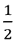
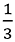
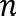
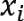

# 五、人工智能：聚类

概观

本章将向你介绍聚类的基础知识，这是一种非监督学习方法，与前几章的监督学习方法不同。您将实现不同类型的聚类，包括使用 k-means 算法的平面聚类和使用 mean shift 算法和凝聚层次模型的层次聚类。您还将学习如何使用内部和外部方法来评估集群模型的性能。本章结束时，您将能够使用聚类分析来分析数据，并应用这一技能来解决各种领域的挑战。

# 简介

在前一章中，您已经了解了决策树及其在分类中的应用。在第二章、*回归简介*中也向你介绍了回归。回归和分类都是监督学习方法的一部分。然而，在这一章中，我们将着眼于无监督学习方法；我们将处理没有任何标签(输出)的数据集。由机器根据我们定义的一组参数来告诉我们标签是什么。在这一章中，我们将使用聚类算法进行无监督学习。

我们将使用聚类来分析数据，以找到某些模式并创建组。除此之外，集群还可以用于许多目的:

*   市场细分检测市场中你应该关注的最佳股票。
*   客户细分利用客户的消费模式来检测客户群，从而更好地推荐产品。
*   在计算机视觉中，使用聚类来执行图像分割。利用这一点，我们可以在图像中找到不同的对象。
*   聚类也可以与分类相结合，以生成多个特征(输入)的紧凑表示，然后可以将其提供给分类器。
*   聚类还可以通过检测异常值来过滤数据点。

不管我们是将聚类应用于遗传学、视频、图像还是社交网络，如果我们使用聚类来分析数据，我们可能会发现值得统一对待的数据点之间的相似性。

例如，考虑一个商店经理，他负责确保他们商店的盈利能力。店里的商品分门别类，有不同的顾客偏好不同的物品。每个客户都有自己的偏好，但他们之间有一些相似之处。你可能有一个对生物产品感兴趣的顾客，他倾向于选择有机产品，这也是素食者感兴趣的。即使他们不同，他们在偏好或模式上也有相似之处，因为他们都倾向于购买有机蔬菜。这可以看作是集群的一个例子。

在第 3 章、*分类介绍*中，您学习了分类，这是监督学习方法的一部分。在分类问题中，我们使用标签来训练模型，以便能够对数据点进行分类。对于聚类，由于我们没有特征的标签，我们需要让模型计算出这些特征所属的聚类。这通常基于每个数据点之间的距离。

在这一章中，你将学习 k-means 算法，这是最广泛使用的聚类算法，但首先，我们需要定义什么是聚类问题。

# 定义聚类问题

我们将定义聚类问题，以便我们能够找到我们的数据点之间的相似性。例如，假设我们有一个由点组成的数据集。聚类通过描述这些点是如何分布的来帮助我们理解这种结构。

让我们看看*图 5.1* 中二维空间中的数据点示例:


图 5.1:二维空间中的数据点

现在，看一看*图 5.2* 。很明显，有三个集群:


图 5.2:使用二维空间中的数据点形成的三个集群

这三个集群很容易被检测到，因为这些点彼此靠近。在这里，您可以看到，聚类确定了彼此接近的数据点。您可能还注意到，数据点`M` 1、`O` 1 和`N` 1 不属于任何聚类；这些就是**离群点**。您构建的聚类算法应该准备好正确处理这些离群点，而不是将它们移动到一个聚类中。

虽然在二维空间中识别聚类很容易，但我们通常有多维数据点，这是我们有两个以上特征的地方。因此，了解哪些数据点彼此接近非常重要。此外，定义检测数据点是否彼此靠近的距离度量也很重要。一个众所周知的距离度量是欧几里德距离，我们在*第一章*、*人工智能简介*中了解过。在数学中，我们经常用欧氏距离来度量两点之间的距离。因此，对于聚类算法来说，欧几里德距离是一个直观的选择，这样我们就可以在定位聚类时确定数据点的接近程度。

然而，包括欧几里德距离在内的大多数距离度量都有一个缺点:我们增加的维度越多，这些距离相互之间就越一致。当我们只有几个维度或特征时，很容易看出哪个点最接近另一个点。然而，当我们添加更多的特征时，相关特征与所有其他数据一起嵌入，并且很难将相关特征与其他特征区分开来，因为它们充当了我们模型的噪声。因此，去除这些噪声特征可以极大地增加我们的聚类模型的准确性。

注意

数据集中的噪声可能是不相关的信息或不需要的随机性。

在下一节中，我们将研究两种不同的聚类方法。

# 聚类方法

有两种类型的集群:

*   **平**
*   **分等级**

在平面聚类中，我们指定希望机器找到的聚类数。平面聚类的一个例子是 k-means 算法，其中 *k* 指定我们希望算法使用的聚类数。

然而，在分层聚类中，机器学习算法本身会找出所需的聚类数。

分层聚类也有两种方法:

*   **聚集或自下而上的层次聚类**首先将每个点视为一个聚类。然后，最接近的聚类被分组在一起。重复分组，直到我们到达具有每个数据点的单个聚类。
*   **分裂或自上而下的层次聚类**一开始就将数据点视为一个单独的聚类。然后，通过选择最远的数据点将聚类分成更小的聚类。重复分割，直到每个数据点成为它自己的聚类。

*图 5.3* 给出了这两种聚类方法的更精确的描述。


图 5.3:显示两种方法的图

现在我们已经熟悉了不同的聚类方法，让我们来看看 scikit-learn 支持的不同的聚类算法。

## sci kit-learn 支持的聚类算法

在本章中，我们将了解 scikit-learn 支持的两种聚类算法:

*   K 均值算法
*   均值漂移算法

**K-means** 是平面聚类的一个例子，这里我们必须事先指定聚类的个数。k-means 是一种通用的聚类算法，如果聚类的数量不是太多，并且聚类的大小是均匀的，则该算法表现良好。

**均值漂移**是分层聚类的一个例子，其中聚类算法决定了聚类的数量。当我们事先不知道聚类的数目时，使用均值漂移。与 k-means 相比，mean shift 支持可能存在许多聚类的用例，即使聚类的大小变化很大。

Scikit-learn 包含许多其他算法，但在本章中我们将重点关注 k-means 和 mean shift 算法。

注意

有关聚类算法的完整描述，包括性能比较，请访问 scikit 的聚类页面-在[http://scikit-learn.org/stable/modules/clustering.html](http://scikit-learn.org/stable/modules/clustering.html)了解。

在下一节中，我们从 k-means 算法开始。

# K 均值算法

如前所述，k-means 算法是一种平面聚类算法。它的工作原理如下:

*   设定 *k* 的值。
*   从数据集中选择 k 个数据点作为各个聚类的初始中心。
*   计算每个数据点到所选中心点的距离，并对聚类中初始中心最接近该数据点的每个点进行分组。
*   一旦所有点都在一个 *k* 簇中，计算每个簇的中心点。该中心点不必是数据集中的现有数据点；简直就是平均值。
*   重复此过程，将每个数据点分配给中心最靠近该数据点的聚类。重复进行，直到中心点不再移动。

为了确保 k-means 算法终止，我们需要以下内容:

*   算法将终止的最大阈值
*   移动移动点的最大重复次数

由于 k-means 算法的性质，它将很难处理大小差异很大的聚类。

k-means 算法有许多日常生活中的用例，例如:

*   市场细分:公司收集顾客的各种数据。对他们的客户执行 k-means 聚类分析将揭示具有定义特征的客户细分(聚类)。属于同一细分市场的客户可以被视为具有相似的模式或偏好。
*   **内容标签**:任何内容(视频、书籍、文档、电影或照片)都可以被分配标签，以便将相似的内容或主题组合在一起。这些标签是聚类的结果。
*   **侦测欺诈和犯罪活动**:与其他客户相比，欺诈者通常会以异常行为的形式留下线索。例如，在汽车保险行业，普通客户会对事故中损坏的汽车提出索赔，而欺诈者会对故意损坏提出索赔。聚类有助于检测损害是由真实事故引起还是由虚假事故引起。

在下一个练习中，我们将在 scikit-learn 中实现 k-means 算法。

## 练习 5.01:在 scikit-learn 中实施 K-Means

在本练习中，我们将在二维平面中绘制数据集，并使用 k-means 算法对其执行聚类。

以下步骤将帮助您完成本练习:

1.  打开新的 Jupyter 笔记本文件。
2.  现在创建一个人工数据集作为 NumPy 数组来演示 k-means 算法。数据点显示在下面的代码片段中:

    ```
    import numpy as np data_points = np.array([[1, 1], [1, 1.5], [2, 2], \                         [8, 1], [8, 0], [8.5, 1], \                         [6, 1], [1, 10], [1.5, 10], \                         [1.5, 9.5], [10, 10], [1.5, 8.5]])
    ```

3.  Now, plot these data points in the two-dimensional plane using `matplotlib.pyplot`, as shown in the following code snippet:

    ```
    import matplotlib.pyplot as plot
    plot.scatter(data_points.transpose()[0], \
                 data_points.transpose()[1])
    ```

    预期输出如下:

    

    图 5.4:使用 matplotlib.pyplot 显示二维平面上的数据点的图形

    注意

    我们使用了`transpose`数组方法来获得第一个特性和第二个特性的值。我们还可以使用适当的数组索引来访问这些列:`dataPoints[:,0]`，这相当于`dataPoints.transpose()[0]`。

    现在我们有了数据点，是时候对它们执行 k-means 算法了。

4.  Define `k` as `3` in the k-means algorithm. We expect a cluster in the bottom-left, top-left, and bottom-right corners of the graph. Add `random_state = 8` in order to reproduce the same results:

    ```
    from sklearn.cluster import KMeans
    k_means_model = KMeans(n_clusters=3,random_state=8)
    k_means_model.fit(data_points)
    ```

    在前面的代码片段中，我们使用了来自`sklearn.cluster`的`KMeans`模块。和往常一样，我们需要用参数定义一个模型，然后在数据集上拟合这个模型。

    预期输出如下:

    ```
    KMeans(algorithm='auto', copy_x=True, init='k-means++', 
           max_iter=300, n_clusters=3, n_init=10, n_jobs=None,
           precompute_distances='auto',
           random_state=8, tol=0.0001, verbose=0)
    ```

    输出显示了我们的 K 均值模型的所有参数，但重要的是:

    `max_iter`:表示 k-means 算法迭代的最大次数。

    `n_clusters`:表示 k-means 算法要形成的聚类数。

    `n_init`:表示 k-means 算法初始化一个随机点的次数。

    `tol`:表示检查 k-means 算法是否可以终止的阈值。

5.  Once the clustering is done, access the center point of each cluster as shown in the following code snippet:

    ```
    centers = k_means_model.cluster_centers_
    centers
    ```

    `centers`的输出如下:

    ```
    array([[7.625     , 0.75      ],
           [3.1       , 9.6       ],
           [1.33333333, 1.5       ]])
    ```

    这个输出显示了我们三个星团中心的坐标。如果你回头看*图 5.4* ，你会看到聚类的中心点出现在图的左下角、`1.3, 1.5`、左上角(`3.1, 9.6`)和右下角(`7.265, 0.75`)。左上聚类的 *x* 坐标是`3.1`，很可能是因为它包含了我们在`[10, 10]`的离群数据点。

6.  Next, plot the clusters with different colors and their center points. To find out which data point belongs to which cluster, we must query the `labels` property of the k-means classifier, as shown in the following code snippet:

    ```
    labels = k_means_model.labels_
    labels
    ```

    `labels`的输出如下:

    ```
    array([2, 2, 2, 0, 0, 0, 0, 1, 1, 1, 1, 1])
    ```

    输出数组显示了哪个数据点属于哪个聚类。这就是我们绘制数据所需的全部内容。

7.  Now, plot the data as shown in the following code snippet:

    ```
    plot.scatter(centers[:,0], centers[:,1])
    for i in range(len(data_points)):
        plot.plot(data_points[i][0], data_points[i][1], \
                  ['k+','kx','k_'][k_means_model.labels_[i]])
    plot.show()
    ```

    在前面的代码片段中，我们使用了`matplotlib`库来绘制以每个坐标为中心的数据点。每个聚类都有其标记(`x`、`+`和`-`)，其中心由实心圆表示。

    预期输出如下:

    

    图 5.5:显示三个集群中心点的图形

    看一下*图 5.5* ，你可以看到中心点在它们的簇内，由`x`、`+`和`-`标记表示。

8.  Now, reuse the same code and choose only two clusters instead of three:

    ```
    k_means_model = KMeans(n_clusters=2,random_state=8)
    k_means_model.fit(data_points)
    centers2 = k_means_model.cluster_centers_
    labels2 = k_means_model.labels_
    plot.scatter(centers2[:,0], centers2[:,1])
    for i in range(len(data_points)):
        plot.plot(data_points[i][0], data_points[i][1], \
                  ['k+','kx'][labels2[i]])
    plot.show()
    ```

    预期输出如下:

    

    图 5.6:显示两个集群的数据点的图表

    这一次，我们只有`x`和`+`两个点，我们可以清楚地看到一个底部集群和一个顶部集群。有趣的是，第二次尝试中的顶部聚类与第一次尝试中的顶部聚类包含相同的点。第二次尝试的底部聚类由连接第一次尝试的左下和右下聚类的数据点组成。

9.  Finally, use the k-means model for prediction as shown in the following code snippet. The output will be an array containing the cluster numbers belonging to each data point:

    ```
    predictions = k_means_model.predict([[5,5],[0,10]])
    predictions
    ```

    `predictions`的输出如下:

    ```
    array([0, 1], dtype=int32)
    ```

    这意味着我们的第一个点属于第一个簇(在底部)，第二个点属于第二个簇(在顶部)。

    注意

    要访问该特定部分的源代码，请参考[https://packt.live/2CpvMDo](https://packt.live/2CpvMDo)。

    你也可以在[https://packt.live/2Nnv7F2](https://packt.live/2Nnv7F2)在线运行这个例子。您必须执行整个笔记本才能获得想要的结果。

通过完成本练习，您能够对样本数据点使用简单的 K 均值聚类模型。

## sci kit-learn 中 K 均值算法的参数化

像*第 2 章*、*回归介绍*、*第 3 章*、*分类介绍*、*第 4 章*、*决策树介绍*中的分类和回归模型一样，k-means 算法也可以参数化。完整的参数列表可以在[http://sci kit-learn . org/stable/modules/generated/sk learn . cluster . k means . html](http://scikit-learn.org/stable/modules/generated/sklearn.cluster.KMeans.html)找到。

一些例子如下:

*   `n_clusters`:数据点被分成的簇的数量。默认值为`8`。
*   `max_iter`:最大迭代次数。
*   `tol`:检查我们是否可以终止 k-means 算法的阈值。

我们还使用两个属性来检索聚类中心点和聚类本身:

*   `cluster_centers_`:返回聚类中心点的坐标。
*   `labels_`:返回一个整数数组，表示数据点所属的聚类数。编号从零开始。

## 练习 5.02:检索中心点和标签

在本练习中，您将能够理解`cluster_centers_`和`labels_`的用法。

以下步骤将帮助您完成练习:

1.  打开新的 Jupyter 笔记本文件。
2.  Next, create the same 12 data points from *Exercise 5.01*, *Implementing K-Means in scikit-learn*, but here, perform k-means clustering with four clusters, as shown in the following code snippet:

    ```
    import numpy as np
    import matplotlib.pyplot as plot
    from sklearn.cluster import KMeans
    data_points = np.array([[1, 1], [1, 1.5], [2, 2], \
                            [8, 1], [8, 0], [8.5, 1], \
                            [6, 1], [1, 10], [1.5, 10], \
                            [1.5, 9.5], [10, 10], [1.5, 8.5]])
    k_means_model = KMeans(n_clusters=4,random_state=8)
    k_means_model.fit(data_points)
    centers = k_means_model.cluster_centers_
    centers
    ```

    `centers`的输出如下:

    ```
    array([[ 7.625     ,  0.75      ],
           [ 1.375     ,  9.5       ],
           [ 1.33333333,  1.5       ],
           [10\.        , 10\.        ]])
    ```

    `cluster_centers_`属性的输出显示了中心点的 *x* 和 *y* 坐标。

    从输出中，我们可以看到`4`中心，分别是右下角(`7.6, 0.75`)、左上角(`1.3, 9.5`)、左下角(`1.3, 1.5`)和右上角(`10, 10`)。我们还可以注意到，第四个聚类(右上角的聚类)仅由单个数据点组成。该数据点可以被假设为异常值**。**

***   Now, apply `labels_ property` on the cluster:

    ```
    labels = k_means_model.labels_
    labels
    ```

    `labels`的输出如下:

    ```
    array([2, 2, 2, 0, 0, 0, 0, 1, 1, 1, 3, 1], dtype=int32)
    ```

    `labels_`属性是一个长度为`12`的数组，显示它所属的每个`12`数据点的聚类。第一个集群与数字 0 相关联，第二个与 1 相关联，第三个与 2 相关联，依此类推(记住 Python 索引总是从 0 开始，而不是从 1 开始)。

    注意

    要访问该特定部分的源代码，请参考[https://packt.live/3dmHsDX](https://packt.live/3dmHsDX)。

    你也可以在[https://packt.live/2B0ebld](https://packt.live/2B0ebld)在线运行这个例子。您必须执行整个笔记本才能获得想要的结果。** 

 **通过完成本练习，您能够检索一个群集中心的坐标。您还可以看到每个数据点被分配到哪个标签(聚类)。

## 销售数据的 K-均值聚类

在接下来的活动中，我们将查看销售数据，并对该销售数据执行 k-means 聚类。

## 活动 5.01:使用 K 均值聚类销售数据

在本活动中，您将使用销售交易数据集 Weekly dataset，该数据集包含 800 种产品在 1 年内的每周销售数据。除了销售，我们的数据集不包含任何关于产品的信息。

您的目标是使用 k-means 聚类算法识别具有相似销售趋势的产品。为了找到最佳的分类数，您必须试验分类数。

注意

数据集可以在[https://archive . ics . UCI . edu/ml/datasets/Sales _ Transactions _ Dataset _ Weekly](https://archive.ics.uci.edu/ml/datasets/Sales_Transactions_Dataset_Weekly)找到。

数据集文件也可以在我们的 GitHub 资源库中找到:[https://packt.live/3hVH42v](https://packt.live/3hVH42v)。

引用:*谭，s .，&刘山，J. (2014)。时间序列聚类:购物篮分析的最佳选择。《第一届高级数据和信息工程国际会议论文集》(DaEng-2013)(第 241–248 页)*。

以下步骤将帮助您完成此活动:

1.  打开新的 Jupyter 笔记本文件。
2.  将数据集作为 DataFr ame 加载，并检查数据。
3.  使用 pandas 中的`drop`函数创建一个没有不必要列的新数据帧(即数据集的第一个`55`列),并使用 pandas 中的`inplace`参数。
4.  使用`8`聚类和`random_state = 8`创建一个 K 均值聚类模型。
5.  从第一个聚类分析模型中检索标签。
6.  从第一个数据帧`df`开始，仅保留`W`列和标签作为新列。
7.  使用 pandas 的`groupby`函数执行所需的聚合，以获得每个集群的年平均销售额。

预期输出如下:


图 5.7:使用 K 均值的销售交易数据的预期输出

注意

这项活动的解决方案在第 363 页。

既然您已经详细了解了 k-means 算法，我们将继续讨论另一种类型的聚类算法，即均值漂移算法。

# 均值漂移算法

Mean shift 是一种分层聚类算法，它通过计算聚类的中心并在每次迭代时向模式移动来将数据点分配给聚类。该模式是具有最多数据点的区域。在第一次迭代中，将选择一个随机点作为聚类的中心，然后该算法将计算某个半径内所有邻近数据点的平均值。平均值将是新聚类的中心。然后，第二次迭代将开始计算所有邻近数据点的平均值，并将其设置为新聚类的中心。在每次迭代中，聚类的中心将向大多数数据点的位置移动。当新群的中心不可能包含更多的数据点时，该算法将停止。当算法停止时，每个数据点将被分配给一个聚类。

与 k-means 算法相比，mean shift 算法还将确定所需的聚类数。这是有利的，因为我们很少知道我们要寻找多少个集群。

这个算法也有很多用例。例如，Xbox Kinect 设备使用均值漂移算法来检测人体部位。每个主要身体部位(头、手臂、腿、手等)都是由均值偏移算法指定的数据点聚类。

在下一个练习中，我们将实现均值漂移算法。

## 练习 5.03:实现均值漂移算法

在本练习中，我们将使用均值漂移算法实现聚类。

我们将使用`scipy.spatial`库来计算欧几里德距离，参见*第 1 章*、*人工智能简介*。这个库简化了坐标列表之间距离的计算(如欧几里德或曼哈顿)。关于这个库的更多细节可以在[https://docs . scipy . org/doc/scipy/reference/spatial . distance . html # module-scipy . spatial . distance](https://docs.scipy.org/doc/scipy/reference/spatial.distance.html#module-scipy.spatial.distance)找到。

以下步骤将帮助您完成练习:

1.  打开新的 Jupyter 笔记本文件。
2.  Let's use the data points from *Exercise 5.01*, *Implementing K-Means in scikit-learn*:

    ```
    import numpy as np
    data_points = np.array([[1, 1], [1, 1.5], [2, 2], \
                            [8, 1], [8, 0], [8.5, 1], \
                            [6, 1], [1, 10], [1.5, 10], \
                            [1.5, 9.5], [10, 10], [1.5, 8.5]])
    import matplotlib.pyplot as plot
    plot.scatter(data_points.transpose()[0], \
                 data_points.transpose()[1])
    ```

    我们现在的任务是找到点 P (x，y)，对于点 P，半径 R 内的数据点的数量是最大的。点数分布如下:

    

    图 5.8:显示 data_points 数组中数据点的图形

3.  将点`P1`等同于列表中的第一个数据点`[1, 1]`:

    ```
    P1 = [1, 1]
    ```

4.  Find the points that are within a distance of `r = 2` from this point. We will use the `scipy` library, which simplifies mathematical calculations, including spatial distance:

    ```
    from scipy.spatial import distance
    r = 2
    points1 = np.array([p0 for p0 in data_points if \
                        distance.euclidean(p0, P1) <= r])
    points1
    ```

    在前面的代码片段中，我们使用欧几里德距离来查找位于点`P1`的`r`半径内的所有点。

    `points1`的输出如下:

    ```
    array([[1\. , 1\. ],
           [1\. , 1.5],
           [2\. , 2\. ]])
    ```

    从输出中，我们可以看到我们找到了落在`P1`半径内的三个点。它们是我们之前在本章的*图 5.8* 中看到的图形左下方的三个点。

5.  Now, calculate the mean of the data points to obtain the new coordinates of `P2`:

    ```
    P2 = [np.mean( points1.transpose()[0] ), \
          np.mean(points1.transpose()[1] )]
    P2
    ```

    在前面的代码片段中，我们计算了包含三个数据点的数组的平均值，以获得新的坐标`P2`。

    `P2`的输出如下:

    ```
    [1.3333333333333333, 1.5]
    ```

6.  Now that the new `P2` has been calculated, retrieve the points within the given radius again, as shown in the following code snippet:

    ```
    points2 = np.array([p0 for p0 in data_points if \
                        distance.euclidean( p0, P2) <= r])
    points2
    ```

    `points`的输出如下:

    ```
    array([[1\. , 1\. ],
           [1\. , 1.5],
           [2\. , 2\. ]])
    ```

    这三点和我们在*步骤 4* 中发现的是一样的，所以我们可以到此为止。在`[1.3333333333333333, 1.5]`的均值附近发现了三个点。以这个中心为中心，以`2`为半径的点形成一个集群。

7.  Since data points `[1, 1.5]` and `[2, 2]` are already in a cluster with `[1,1]`, we can directly continue with the fourth point in our list, `[8, 1]`:

    ```
    P3 = [8, 1]
    points3 = np.array( [p0 for p0 in data_points if \
                         distance.euclidean(p0, P3) <= r])
    points3
    ```

    在前面的代码片段中，我们使用了与*步骤 4* 相同的代码，但是增加了一个新的`P3`。

    `points3`的输出如下:

    ```
    array([[8\. , 1\. ],
           [8\. , 0\. ],
           [8.5, 1\. ],
           [6\. , 1\. ]])
    ```

    这一次，我们在`P4`的半径`r`内找到了四个点。

8.  Now, calculate the mean, as shown in the following code snippet:

    ```
    P4 = [np.mean(points3.transpose()[0]), \
          np.mean(points3.transpose()[1])]
    P4
    ```

    在前面的代码片段中，我们计算了包含四个数据点的数组的平均值，以获得`P4`的新坐标，如*步骤 5* 所示。

    `P4`的输出如下:

    ```
    [7.625, 0.75]
    ```

    这个平均值不会改变，因为在下一次迭代中，我们将找到相同的数据点。

9.  Notice that we got lucky with the selection of point `[8, 1]`. If we started with `P = [8, 0]` or `P = [8.5, 1]`, we would only find three points instead of four. Let's try with `P5 = [8, 0]`:

    ```
    P5 = [8, 0]
    points4 = np.array([p0 for p0 in data_points if \
                       distance.euclidean(p0, P5) <= r])
    points4
    ```

    在前面的代码片段中，我们使用了与*步骤 4* 中相同的代码，但是增加了一个新的`P5`。

    `points4`的输出如下:

    ```
    array([[8\. , 1\. ],
           [8\. , 0\. ],
           [8.5, 1\. ]])
    ```

    这一次，我们在`P5`的半径`r`内发现了三个点。

10.  Now, rerun the distance calculation with the shifted mean as shown in *Step 5*:

    ```
    P6 = [np.mean(points4.transpose()[0]), \
          np.mean(points4.transpose()[1])]
    P6
    ```

    在前面的代码片段中，我们计算了包含三个数据点的数组的平均值，以获得`P6`的新坐标。

    `P6`的输出如下:

    ```
    [8.166666666666666, 0.6666666666666666]
    ```

11.  Now do the same again but with `P7 = [8.5, 1]`:

    ```
    P7 = [8.5, 1]
    points5 = np.array([p0 for p0 in data_points if \
                        distance.euclidean(p0, P7) <= r])
    points5
    ```

    在前面的代码片段中，我们使用了与*步骤 4* 中相同的代码，但是增加了一个新的`P7`。

    `points5`的输出如下:

    ```
    array([[8\. , 1\. ],
           [8\. , 0\. ],
           [8.5, 1\. ]])
    ```

    这一次，我们在`P`的半径`r`内又发现了同样的三个点。这意味着从`[8,1]`开始，我们得到了比从`[8, 0]`或`[8.5, 1]`开始更大的集群。因此，我们必须选择包含最多数据点的中心点。

12.  Now, let's see what would happen if we started the discovery from the fourth data point, that is, `[6, 1]`:

    ```
    P8 = [6, 1]
    points6 = np.array([p0 for p0 in data_points if \
                        distance.euclidean(p0, P8) <= r])
    points6
    ```

    在前面的代码片段中，我们使用了与*步骤 4* 中相同的代码，但是增加了一个新的`P8`。

    `points6`的输出如下:

    ```
    array([[8., 1.],
           [6., 1.]])
    ```

    这一次，我们只在`P8`的半径`r`内发现了两个数据点。我们成功找到了数据点`[8, 1]`。

13.  Now, shift the mean from `[6, 1]` to the calculated new mean:

    ```
    P9 = [np.mean(points6.transpose()[0]), \
          np.mean(points6.transpose()[1]) ]
    P9
    ```

    在前面的代码片段中，我们计算了包含三个数据点的数组的平均值，以获得`P9`的新坐标，如*步骤 5* 所示。

    `P9`的输出如下:

    ```
    [7.0, 1.0]
    ```

14.  Check whether you have obtained more points with this new `P9`:

    ```
    points7 = np.array([p0 for p0 in data_points if \
                        distance.euclidean(p0, P9) <= r])
    points7
    ```

    在前面的代码片段中，我们使用了与*步骤 4* 中相同的代码，但是增加了一个新的`P9`。

    `points7`的输出如下:

    ```
    array([[8\. , 1\. ],
           [8\. , 0\. ],
           [8.5, 1\. ],
           [6\. , 1\. ]])
    ```

    我们成功地找到了所有四个点。因此，我们已经成功定义了一个大小为`4`的集群。均值会和之前一样:`[7.625, 0.75]`。

    注意

    要访问该特定部分的源代码，请参考[https://packt.live/3drUZtE](https://packt.live/3drUZtE)。

    你也可以在[https://packt.live/2YoSu78](https://packt.live/2YoSu78)在线运行这个例子。您必须执行整个笔记本才能获得想要的结果。

这是一个简单的应用均值漂移算法的聚类示例。我们只说明了算法在寻找聚类时所考虑的内容。

然而，还有一个问题，那就是半径的值会是多少？

注意，如果没有设置`2`的半径，我们可以简单地从包含所有数据点的大半径开始，然后减小半径，或者我们可以从小半径开始，确保每个数据点都在它的簇中，然后增加半径，直到我们得到想要的结果。

在下一节中，我们将研究均值漂移算法，但使用 scikit-learn。

## scikit-learn 中的均值漂移算法

让我们使用与 k-means 算法相同的数据点:

```
import numpy as np
data_points = np.array([[1, 1], [1, 1.5], [2, 2], \
                        [8, 1], [8, 0], [8.5, 1], \
                        [6, 1], [1, 10], [1.5, 10], \
                        [1.5, 9.5], [10, 10], [1.5, 8.5]])
```

均值漂移聚类算法的语法类似于 K 均值聚类算法的语法:

```
from sklearn.cluster import MeanShift
mean_shift_model = MeanShift()
mean_shift_model.fit(data_points)
```

聚类完成后，我们可以访问每个聚类的中心点:

```
mean_shift_model.cluster_centers_
```

预期输出如下:

```
array([[ 1.375     ,  9.5       ],
       [ 8.16666667,  0.66666667],
       [ 1.33333333,  1.5       ],
       [10\.        , 10\.        ],
       [ 6\.        ,  1\.        ]])
```

均值漂移模型找到了五个聚类，其中心如前面的代码所示。

像 k-means 一样，我们也可以得到标签:

```
mean_shift_model.labels_
```

预期输出如下:

```
array([2, 2, 2, 1, 1, 1, 4, 0, 0, 0, 3, 0], dtype=int64)
```

输出数组显示了哪个数据点属于哪个聚类。这就是我们绘制数据所需的全部内容:

```
import matplotlib.pyplot as plot
plot.scatter(mean_shift_model.cluster_centers_[:,0], \
             mean_shift_model.cluster_centers_[:,1])
for i in range(len(data_points)): 
    plot.plot(data_points[i][0], data_points[i][1], \
              ['k+','kx','kv', 'k_', 'k1']\
              [mean_shift_model.labels_[i]])
plot.show()
```

在前面的代码片段中，我们绘制了五个聚类的数据点和中心。属于同一聚类的每个数据点将具有相同的标记。聚类中心标记为一个点。

预期输出如下:


图 5.9:显示五个集群的数据点的图表

我们可以看到三个集群包含不止一个点(左上、左下和右下)。如前所述，也是它们自己的聚类的两个单个数据点可以被视为离群值，因为它们离其他聚类太远而不能成为它们中的任何一个的一部分。

既然我们已经了解了均值漂移算法，我们可以看看层次聚类，更具体地说，看看凝聚层次聚类(*自底向上*方法)。

## 层次聚类

分层聚类算法分为两类:

*   凝聚(或自底向上)层次聚类
*   分裂的(或自顶向下的)层次聚类

在本章中，我们将只讨论凝聚层次聚类，因为它是两种方法中使用最广泛和最有效的。

凝聚层次聚类在开始时将每个数据点视为单个聚类，然后成对地将最接近的聚类合并(或凝聚)在一起。为了找到最接近的数据聚类，凝聚层次聚类使用诸如欧几里德或曼哈顿距离之类的试探法来定义数据点之间的距离。还需要连接函数来聚集聚类中数据点之间的距离，以便定义聚类紧密度的唯一值。

联动功能的例子包括单联动(简单距离)、平均联动(平均距离)、最大联动(最大距离)和向联动(平方差)。具有最小链接值的聚类对将被分组在一起。重复分组，直到我们到达包含每个数据点的单个聚类。最后，当只剩下一个簇时，该算法终止。

为了直观地表示聚类的层次结构，可以使用树状图。树状图是一棵树，底部的叶子代表数据点。两片叶子之间的每个交集都是这两片叶子的分组。根(顶部)代表包含所有数据点的唯一聚类。看一下*图 5.10* ，这是一个树状图。


图 5.10:树状图示例

## sci kit-learn 中的凝聚层次聚类

请看下面的例子，我们使用了与 k-means 算法相同的数据点:

```
import numpy as np
data_points = np.array([[1, 1], [1, 1.5], [2, 2], \
                        [8, 1], [8, 0], [8.5, 1], \
                        [6, 1], [1, 10], [1.5, 10], \
                        [1.5, 9.5], [10, 10], [1.5, 8.5]])
```

为了绘制树状图，我们需要首先导入`scipy`库:

```
from scipy.cluster.hierarchy import dendrogram
import scipy.cluster.hierarchy as sch
```

然后我们可以使用 SciPy 和`ward`链接函数绘制一个树状图，因为它是最常用的链接函数:

```
dendrogram = sch.dendrogram(sch.linkage(data_points, \
                            method='ward'))
```

树状图的输出如下:


图 5.11:基于随机数据点的树状图

有了树状图，我们只需在垂直距离最高的区域画一条如图*图 5.12* 所示的水平线，并计算交叉点的数量，就可以大致猜出什么将是好的聚类数。在这种情况下，它应该是两个集群，但我们将前往下一个最大的区域，因为两个是太小的数字。


图 5.12:树状图中聚类的划分

*y* 轴代表接近度的度量， *x* 轴代表每个数据点的索引。因此，我们的前三个数据点(`0,1,2`)是同一个聚类的一部分，然后另一个聚类由接下来的四个数据点(`3,4,5,6`)组成，数据点`10`是一个独立的聚类，剩余的数据点(`7,8,9,11`)形成最后一个聚类。

凝聚层次聚类算法的语法类似于 k-means 聚类算法，只是我们需要指定数字类型`affinity`(这里，我们选择欧几里德距离)和链接(这里，我们选择`ward`链接):

```
from sklearn.cluster import AgglomerativeClustering
agglomerative_model = AgglomerativeClustering(n_clusters=4, \
                                              affinity='euclidean', \
                                              linkage='ward')
agglomerative_model.fit(data_points)
```

输出是:

```
AgglomerativeClustering(affinity='euclidean', 
                        compute_full_tree='auto',
                        connectivity=None, 
                        distance_threshold=None,
                        linkage='ward', memory=None,
                        n_clusters=4, pooling_func='deprecated')
```

与 k-means 类似，我们也可以获得标签，如下面的代码片段所示:

```
agglomerative_model.labels_
```

预期输出如下:

```
array([2, 2, 2, 0, 0, 0, 0, 1, 1, 1, 3, 1], dtype=int64)
```

输出数组显示了哪个数据点属于哪个聚类。这就是我们绘制数据所需的全部内容:

```
import matplotlib.pyplot as plot
for i in range(len(data_points)): 
    plot.plot(data_points[i][0], data_points[i][1], \
              ['k+','kx','kv', 'k_'][agglomerative_model.labels_[i]])
plot.show()
```

在前面的代码片段中，我们绘制了数据点和四个聚类中心的图表。属于同一聚类的每个数据点将具有相同的标记。

预期输出如下:


图 5.13:显示四个集群的数据点的图表

我们可以看到，与 mean shift 方法的结果相比，凝聚聚类能够正确地将(`6,1`)处的数据点与右下方的聚类分组，而不是拥有自己的聚类。在这种情况下，我们只有非常少量的数据，凝聚层次聚类和均值漂移将比 k-means 更好地工作。然而，它们有非常昂贵的计算时间要求，这将使它们在非常大的数据集上挣扎。但是，k-means 非常快，是非常大的数据集的更好选择。

现在我们已经了解了一些不同的聚类算法，我们需要开始评估这些模型并对它们进行比较，以便选择最佳的聚类模型。

# 聚类性能评估

与监督学习不同，在监督学习中，我们总是有标签来评估我们的预测，无监督学习有点复杂，因为我们通常没有标签。为了评估聚类模型，根据标签数据是否可用，可以采用两种方法:

*   第一种方法是外部方法，它需要标签数据的存在。这意味着在没有标签数据的情况下，需要人工干预来标记数据或至少其子集。
*   The other approach is the intrinsic approach. In general, the extrinsic approach tries to assign a score to clustering, given the label data, whereas the intrinsic approach evaluates clustering by examining how well the clusters are separated and how compact they are.

    注意

    我们将跳过数学解释，因为它们相当复杂。

    您可以在 sklearn 网站上找到更多数学细节，网址为:[https://sci kit-learn . org/stable/modules/clustering . html # clustering-performance-evaluation](https://scikit-learn.org/stable/modules/clustering.html#clustering-performance-evaluation )

我们将从外部方法(因为它是最广泛使用的方法)开始，并在 k-means 示例中使用 sklearn 定义以下得分:

*   调整后的兰德指数
*   调整后的互信息
*   同质性
*   完整性
*   垂直测量
*   福尔克斯-马洛得分
*   权变矩阵

让我们看一个例子，我们首先需要从`sklearn.cluster`导入`metrics`模块:

```
from sklearn import metrics
```

我们将重用在*练习 5.01* 、*scikit-learn 中实现 k-means 示例中的代码:*

```
import numpy as np
import matplotlib.pyplot as plot
from sklearn.cluster import KMeans
data_points = np.array([[1, 1], [1, 1.5], [2, 2], \
                        [8, 1], [8, 0], [8.5, 1], \
                        [6, 1], [1, 10], [1.5, 10], \
                        [1.5, 9.5], [10, 10], [1.5, 8.5]])
k_means_model = KMeans(n_clusters=3,random_state = 8)
k_means_model.fit(data_points)
k_means_model.labels_
```

使用`k_means_model.labels_`我们预测标签的输出是:

```
array([2, 2, 2, 0, 0, 0, 0, 1, 1, 1, 1, 1])
```

最后，定义该数据集的真实标签，如下面的代码片段所示:

```
data_labels = np.array([0, 0, 0, 2, 2, 2, 2, 1, 1, 1, 3, 1])
```

## 调整后的兰德指数

调整后的 Rand 指数是在忽略置换的同时测量聚类预测和标签之间的相似性的函数。当标签是大的相等大小的聚类时，调整的 Rand 指数工作得相当好。

调整后的 Rand 指数的范围在**[-1.1】**之间，不希望出现负值。负的分数意味着我们的模型比我们随机分配标签的表现更差。如果我们随机分配他们，我们的分数将接近 0。但是，我们越接近 1，我们的聚类模型就越能预测正确的标签。

有了`sklearn`，我们可以使用以下代码轻松计算调整后的 Rand 指数:

```
metrics.adjusted_rand_score(data_labels, k_means_model.labels_)
```

预期输出如下:

```
0.8422939068100358
```

在这种情况下，调整后的 Rand 指数表明我们的 k-means 模型离我们的真实标签不远。

## 调整后的互信息

调整后的互信息是在忽略置换的同时测量聚类预测和标签之间的熵的函数。

调整后的互信息没有定义范围，但负值被认为是不好的。我们越接近 1，我们的聚类模型就越能预测正确的标签。

有了`sklearn`，我们可以通过使用以下代码轻松计算它:

```
metrics.adjusted_mutual_info_score(data_labels, \
                                   k_means_model.labels_)
```

预期输出如下:

```
0.8769185235006342
```

在这种情况下，调整后的互信息表明我们的 k-means 模型相当好，离我们的真实标签不远。

## V-测度、同质性和完备性

V-测度被定义为同质性和完备性的调和平均值。调和平均值是一种使用倒数的平均值(其他类型是算术平均值和几何平均值)(倒数是一个数的倒数)。例如 2 的倒数是，3 的倒数是。

调和平均值的公式如下:


图 5.14:调和平均值公式

是数值的个数，是每个点的数值。

为了计算 V-测度，我们首先需要定义同质性和完备性。

完全同质指的是每个聚类具有属于相同标签的数据点的情况。同质性得分将反映我们的每个聚类对来自同一标签的数据进行分组的情况。

完全完全性是指属于同一标签的所有数据点都被聚类到同一个聚类中的情况。同质性得分将反映我们每个标签的数据点在同一聚类中的分组情况。

因此，V-Measure 的公式如下:


图 5.15:垂直测量公式

的默认值为 **1** ，但可以更改以进一步强调同质性或完整性。

这三个分数的范围在[ **0，1** ]之间，其中 **0** 为最差可能分数， **1** 为满分。

有了`sklearn`，我们可以通过使用以下代码轻松计算这三个分数:

```
metrics.homogeneity_score(data_labels, k_means_model.labels_)
metrics.completeness_score(data_labels, k_means_model.labels_)
metrics.v_measure_score(data_labels, k_means_model.labels_, \
                        beta=1)
```

`homogeneity_score`的输出如下:

```
0.8378758055108827
```

在这种情况下，同质性得分表明我们的 k-means 模型具有包含不同标签的聚类。

`completeness_score`的输出如下:

```
1.0
```

在这种情况下，完整性分数表明我们的 k-means 模型已经成功地将每个标签的每个数据点放入同一个聚类中。

`v_measure_score`的输出如下:

```
0.9117871871412709
```

在这种情况下，V-Measure 表明我们的 k-means 模型虽然不是完美的，但总体来说得分不错。

## 福尔克斯-马洛得分

Fowlkes-Mallows 评分是一个衡量标签簇内相似性和簇预测的指标，它被定义为精确度和召回率的几何平均值(您在*第 4 章*、*决策树介绍*中了解到这一点)。

Fowlkes-Mallows 评分的公式如下:


图 5.16:福尔克斯-马洛公式

让我们来分解一下:

*   True positive(或 *TP* ):预测与标签分类在同一个分类中的所有观察值
*   假阳性(或 *FP* ):所有的预测都在同一个聚类中，但与标签聚类不同
*   假阴性(或 *FN* ):预测不在同一个聚类中但在同一个标签聚类中的所有观察值

福尔克斯-马洛分数的范围在[ **0，1** ]之间，其中 **0** 为最差分数， **1** 为满分。

有了`sklearn`，我们可以通过使用以下代码轻松计算它:

```
metrics.fowlkes_mallows_score(data_labels, k_means_model.labels_)
```

预期输出如下:

```
0.8885233166386386
```

在这种情况下，Fowlkes-Mallows 得分表明我们的 k-means 模型相当好，离我们的真实标签不远。

## 权变矩阵

关联矩阵不是一个分数，但它报告了每个真实/预测聚类对的交集基数以及所需的标签数据。它与*第 4 章*、*决策树介绍*中的*混淆矩阵*非常相似。标签和聚类名称的矩阵必须相同，因此我们需要小心地为我们的聚类指定与标签相同的名称，这与之前看到的分数不同。

我们将据此修改我们的标签:

```
data_labels = np.array([0, 0, 0, 2, 2, 2, 2, 1, 1, 1, 3, 1])
```

对此:

```
data_labels = np.array([2, 2, 2, 1, 1, 1, 1, 0, 0, 0, 3, 0])
```

然后，使用`sklearn`，我们可以通过使用以下代码轻松计算列联矩阵:

```
from sklearn.metrics.cluster import contingency_matrix
contingency_matrix(k_means_model.labels_,data_labels)
```

`contingency_matrix`的输出如下:

```
array([[0, 4, 0, 0],
       [4, 0, 0, 1],
       [0, 0, 3, 0]])
```

`contingency_matrix`输出的第一行表示有`4`个数据点，它们的真实聚类是第一个聚类(`0`)。第二行指示还有四个数据点，它们的真实聚类是第二聚类(`1`)；然而，在该簇中错误地预测了额外的`1`，但是它属于第四簇(`3`)。第三行表示有三个数据点，它们的真实聚类是第三聚类(`2`)。

我们现在来看看内在方法，当我们没有标签时，这是必需的。我们将在 k-means 示例中使用 sklearn 定义以下分数:

*   轮廓系数
*   卡林斯基-哈拉巴斯指数
*   戴维斯-波尔丁指数

## 剪影系数

轮廓系数是内在评价的一个例子。它衡量一个数据点与其聚类在与其他聚类比较时的相似性。

它包含两个分数:

*   `a`:一个数据点与同一聚类中所有其他数据点之间的平均距离。
*   `b`:一个数据点到最近簇中所有数据点的平均距离。

轮廓系数公式为:


图 5.17:轮廓系数公式

轮廓系数的范围在[ **-1，1** ]之间， **-1** 表示聚类不正确。接近零的分数表示我们的聚类是重叠的。接近 **1** 的分数表示所有数据点都被分配到适当的聚类。

然后，有了`sklearn`，我们可以很容易地通过使用这个代码计算轮廓系数:

```
metrics.silhouette_score(data_points, k_means_model.labels_)
```

`silhouette_score`的输出如下:

```
0.6753568188872228
```

在这种情况下，剪影系数表明我们的 k-means 模型有一些重叠的聚类，可以通过从其中一个聚类中分离一些数据点来进行一些改进。

## 卡林斯基-哈拉巴斯指数

Calinski-Harabasz 指数衡量每个聚类内部的数据点如何分布。它被定义为类之间的方差与每个类内部的方差之比。卡林斯基-哈拉巴斯指数没有范围，从 **0** 开始。分数越高，我们的集群就越密集。密集的群集表示定义良好的群集。

有了`sklearn`，我们可以通过使用以下代码轻松计算它:

```
metrics.calinski_harabasz_score(data_points, k_means_model.labels_)
```

`calinski_harabasz_score`的输出如下:

```
19.52509172315154
```

在这种情况下，Calinski-Harabasz 指数表明我们的 K 均值模型聚类非常分散，并表明我们可能有重叠的聚类。

## 戴维斯-波尔丁指数

Davies-Bouldin 指数衡量聚类之间的平均相似性。相似性是一个类与其最近的类之间的距离与一个类的每个数据点与其类的中心之间的平均距离的比率。戴维斯-波尔丁指数没有范围，从 **0** 开始。分数越接近 **0** 越好；这意味着聚类被很好地分开，这是一个好的聚类的指示。

有了`sklearn`，我们可以通过使用以下代码轻松计算 Davis-Bouldin 指数:

```
metrics.davies_bouldin_score(data_points, k_means_model.labels_)
```

`davies_bouldin_score`的输出如下:

```
0.404206621415983
```

在这种情况下，Calinski-Harabasz 得分表明我们的 k-means 模型具有一些重叠的聚类，并且可以通过更好地分离其中一个聚类中的一些数据点来进行改进。

## 活动 5.02:使用均值漂移算法和凝聚层次聚类对红酒数据进行聚类

在本活动中，您将处理葡萄酒质量数据集，尤其是红酒数据。该数据集包含 1599 种红酒的质量数据和化学测试结果。

你的目标是建立两个聚类模型(使用均值漂移算法和凝聚层次聚类),以确定质量相似的葡萄酒是否也具有相似的物理化学性质。您还必须使用外部和内部方法来评估和比较这两种聚类模型。

注意

该数据集可在以下网址找到:[https://archive.ics.uci.edu/ml/datasets/Wine+Quality](https://archive.ics.uci.edu/ml/datasets/Wine+Quality)。

数据集文件可以在我们位于 https://packt.live/2YYsxuu 的 GitHub 仓库中找到。

引文: *P .科尔特斯、a .塞尔代拉、f .阿尔梅达、t .马托斯和 j .赖斯。通过物理化学特性的数据挖掘建立葡萄酒偏好模型。《决策支持系统》，爱思唯尔，47(4):547-553，2009* 。

以下步骤将帮助您完成活动:

1.  打开新的 Jupyter 笔记本文件。
2.  使用`sep = ";"`将数据集作为数据帧加载，并检查数据。
3.  创建均值漂移聚类分析模型，然后检索模型的预测标签和创建的聚类数。
4.  在创建了树图并选择了最佳的分类数之后，创建一个聚合的层次分类模型。
5.  从第一个聚类分析模型中检索标签。
6.  Compute the following extrinsic approach scores for both models:

    调整后的兰德指数

    调整后的互信息

    垂直测量

    福尔克斯-马洛得分

7.  Compute the following intrinsic approach scores for both models:

    轮廓系数

    卡林斯基-哈拉巴斯指数

    戴维斯-波尔丁指数

预期输出如下:

均值漂移聚类模型的每个分值如下:

*   调整后的 Rand 指数:`0.0006771608724007207`
*   调整后的交互信息:`0.004837187596124968`
*   `0.021907254751144124`垂直测量
*   福尔克斯-马洛得分:`0.5721233634622408`
*   轮廓系数:`0.32769323700400077`
*   卡林斯基-哈拉巴斯指数:`44.62091774102674`
*   戴维斯-波尔丁指数:`0.8106334674570222`

凝聚层次聚类的每个分值如下:

*   调整后的兰德指数:`0.05358047852603172`
*   调整后的交互信息:`0.05993098663692826`
*   垂直测量:`0.07549735446050691`
*   福尔克斯-马洛得分:`0.3300681478007641`
*   轮廓系数:`0.1591882574407987`
*   卡林斯基-哈拉巴斯指数:`223.5171774491095`
*   The Davies-Bouldin index: `1.4975443816135114`

    注意

    这项活动的解决方案在第 368 页。

通过完成本练习，您对许多产品的多列执行了均值漂移和聚集层次聚类。您还了解了如何使用外部和内部方法评估聚类模型。最后，您使用模型的结果及其评估来找到现实世界问题的答案。

# 总结

在本章中，我们学习了集群工作的基本原理。聚类是一种无监督学习形式，其中给定了特征，但没有给定标签。聚类算法的目标是基于数据点的相似性找到标签。

我们还了解到有两种类型的聚类，平面聚类和层次聚类，第一种类型需要找到聚类的数量，而第二种类型自己找到最优的聚类数量。

k-means 算法是平面聚类的一个例子，而 mean shift 和凝聚层次聚类是层次聚类算法的例子。

我们还了解了用于评估聚类模型性能的众多分数，在外部方法中有标签或在内部方法中没有标签。

在*第 6 章*、*神经网络和深度学习*中，你将被介绍到一个在这十年中由于计算能力和廉价、可扩展的在线服务器容量的爆炸而变得流行的领域。这个领域是神经网络和深度学习的科学。**