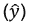
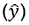
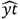
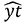
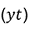

<title>B16060_06_Final_SMP_ePub</title>

# 6.神经网络和深度学习

概观

在这一章中，你将被介绍到关于神经网络和深度学习的最后一个主题。您将学习张量流、卷积神经网络(CNN)和递归神经网络(RNNs)。您将使用关键的深度学习概念来确定个人的信用度并预测附近的房价。稍后，您还将使用所学的技能实现一个图像分类程序。到本章结束时，你将对神经网络和深度学习的概念有一个牢固的掌握。

# 简介

在前一章中，我们学习了什么是聚类问题，并且看到了几种算法，比如 k-means，它们可以自动地将数据点分组。在本章中，我们将了解神经网络和深度学习网络。

神经网络和深度学习网络的区别在于网络的复杂性和深度。传统上，神经网络只有一个隐藏层，而深度学习网络的隐藏层不止一个。

虽然我们将使用神经网络和深度学习进行监督学习，但请注意，神经网络也可以对无监督学习技术进行建模。这种模型实际上在 20 世纪 80 年代相当流行，但由于当时所需的计算能力有限，直到最近这种模型才被广泛采用。随着图形处理单元(GPU)和云计算的民主化，我们现在可以获得巨大的计算能力。这是神经网络，尤其是深度学习再次成为热门话题的主要原因。

深度学习可以模拟比传统神经网络更复杂的模式，因此深度学习现在在计算机视觉(人脸检测和图像识别等应用)和自然语言处理(聊天机器人和文本生成等应用)中得到了更广泛的应用。

# 人工神经元

**人工神经网络** ( **ANNs** )，顾名思义，试图复制人类大脑的工作方式，更具体地说是神经元的工作方式。

神经元是大脑中通过电信号与其他细胞交流的细胞。神经元可以对声音、光和触摸等刺激做出反应。它们也可以触发肌肉收缩等动作。平均而言，人类大脑包含 100 亿到 200 亿个神经元。这是一个相当大的网络，对不对？这就是人类能够取得如此多惊人成就的原因。这也是为什么研究人员试图模仿大脑如何运作，并在这样做创造了人工神经网络。

人工神经网络由多个人工神经元组成，这些神经元相互连接并形成一个网络。人工神经元只是一个处理单元，它对一些输入(`x1`、`x2`、…、`xn`)执行数学运算，并将最终结果(`y`)返回给下一个单元，如下所示:


图 6.1:人工神经元的表示

我们将在接下来的章节中更详细地了解人工神经元是如何工作的。

# 张量流中的欧元

TensorFlow 是目前最流行的神经网络和深度学习框架。它是由谷歌创建和维护的。TensorFlow 用于语音识别和语音搜索，也是[translate.google.com](http://translate.google.com)背后的大脑。在本章的后面，我们将使用 TensorFlow 来识别手写字符。

TensorFlow API 有多种语言版本，包括 Python、JavaScript、Java 和 c。tensor flow 可与 **tensors** 配合使用。你可以把张量想象成一个容器，由一个矩阵(通常是高维的)和与它将要执行的操作相关的附加信息(比如权重和偏差，你将在本章后面看到)组成。没有维度(没有秩)的张量是标量。秩为 1 的张量是向量，秩为 2 的张量是矩阵，秩为 3 的张量是三维矩阵。秩表示张量的维数。在这一章中，我们将研究秩为 2 和 3 的张量。

注意

数学家使用矩阵和维度这两个术语，而深度学习程序员使用张量和秩来代替。

TensorFlow 还附带数学函数来转换张量，如下所示:

*   `add`和`multiply`
*   `exp`和`log`
*   `greater`、`less`和`equal`
*   `concat`、`slice`和`split`
*   `matrix_inverse`、`matrix_determinant`和`matmul`
*   `sigmoid`、`relu`和`softmax`

我们将在本章后面更详细地讨论它们。

在下一个练习中，我们将使用 TensorFlow 来计算一个人工神经元。

## 练习 6.01:使用基本运算和张量流常数

在本练习中，我们将使用 TensorFlow 中的算术运算，通过执行矩阵乘法和加法以及应用非线性函数`sigmoid`来模拟人工神经元。

以下步骤将帮助您完成练习:

1.  打开新的 Jupyter 笔记本文件。
2.  将`tensorflow`包作为`tf` :

    ```
    import tensorflow as tf
    ```

    导入
3.  Create a tensor called `W` of shape `[1,6]` (that is, with 1 row and 6 columns), using `tf.constant()`, that contains the matrix `[1.0, 2.0, 3.0, 4.0, 5.0, 6.0]`. Print its value:

    ```
    W = tf.constant([1.0, 2.0, 3.0, 4.0, 5.0, 6.0], shape=[1, 6]) 
    W
    ```

    预期输出如下:

    ```
    <tf.Tensor: shape=(1, 6), dtype=float32, numpy=array([[1., 2., 3., 4., 5., 6.]], dtype=float32)>
    ```

4.  Create a tensor called `X` of shape `[6,1]` (that is, with 6 rows and 1 column), using `tf.constant()`, that contains `[7.0, 8.0, 9.0, 10.0, 11.0, 12.0]`. Print its value:

    ```
    X = tf.constant([7.0, 8.0, 9.0, 10.0, 11.0, 12.0], \
                    shape=[6, 1]) 
    X
    ```

    预期输出如下:

    ```
    <tf.Tensor: shape=(6, 1), dtype=float32, numpy= 
    array([[ 7.],
           [ 8.],
           [ 9.],
           [10.],
           [11.],
           [12.]], dtype=float32)>
    ```

5.  Now, create a tensor called `b`, using `tf.constant()`, that contains `-88`. Print its value:

    ```
    b = tf.constant(-88.0)
    b
    ```

    预期输出如下:

    ```
    <tf.Tensor: shape=(), dtype=float32, numpy=-88.0>
    ```

6.  Perform a matrix multiplication between `W` and `X` using `tf.matmul`, save its results in the `mult` variable, and print its value:

    ```
    mult = tf.matmul(W, X)
    mult
    ```

    预期输出如下:

    ```
    <tf.Tensor: shape=(1, 1), dtype=float32, numpy=array([[217.]], dtype=float32)>
    ```

7.  Perform a matrix addition between `mult` and `b`, save its results in a variable called `Z`, and print its value:

    ```
    Z = mult + b
    Z
    ```

    预期输出如下:

    ```
    <tf.Tensor: shape=(1, 1), dtype=float32, numpy=array([[129.]], dtype=float32)>
    ```

8.  Apply the `sigmoid` function to `Z` using `tf.math.sigmoid`, save its results in a variable called `a`, and print its value. The `sigmoid` function transforms any numerical value within the range **0** to **1** (we will learn more about this in the following sections):

    ```
    a = tf.math.sigmoid(Z)
    a
    ```

    预期输出如下:

    ```
    <tf.Tensor: shape=(1, 1), dtype=float32, numpy=array([[1.]], dtype=float32)>
    ```

`sigmoid`功能将`Z`的原始值`129`转换为`1`。

注意

要访问该特定部分的源代码，请参考[https://packt.live/31ekGLM](https://packt.live/31ekGLM)。

你也可以在 https://packt.live/3evuKnC 在线运行这个例子。您必须执行整个笔记本才能获得想要的结果。

在本练习中，您使用 TensorFlow 成功实现了一个人工神经元。这是任何神经网络模型的基础。

在下一节中，我们将着眼于神经网络的架构。

# 欧洲网络体系结构

神经网络是**人工智能** ( **AI** )的最新分支。神经网络的灵感来自人脑的工作方式。它们是由沃伦麦卡洛克和沃尔特皮茨在 20 世纪 40 年代发明的。神经网络是一种数学模型，用于描述人脑如何解决问题。

当谈到人脑时，我们将使用 ANN 来指代数学模型和生物神经网络。

与其他分类或回归模型相比，神经网络的学习方式更加复杂。神经网络模型具有大量的内部变量，并且输入和输出变量之间的关系可能涉及多个内部层。神经网络比其他监督学习算法具有更高的准确性。

注意

用 TensorFlow 掌握神经网络是一个复杂的过程。本节的目的是为您提供入门资源。

在这一章中，我们将要使用的主要例子是从图像中识别数字。我们正在考虑这种格式，因为每个图像都很小，我们有大约 70，000 张图像可用。处理这些图像所需的处理能力与普通计算机相似。

人工神经网络的工作方式类似于人脑的工作方式。人脑中的一个树突连接着一个细胞核，细胞核连接着一个轴突。在人工神经网络中，输入是树状结构，计算发生的地方是细胞核，输出是轴突。

人造神经元被设计用来复制细胞核的工作方式。它将通过计算矩阵乘法和激活函数来转换输入信号。如果这个函数决定一个神经元必须被激发，一个信号出现在输出中。这个信号可以是网络中其他神经元的输入:


图 6.2:显示人工神经网络如何工作的图表

让我们以`n=4`为例进一步理解上图。在这种情况下，以下内容适用:

*   `X`是输入矩阵，由`x1`、`x2`、`x3`和`x4`组成。
*   权重矩阵`W`将由`w1`、`w2`、`w3`和`w4`组成。
*   `b`是偏向。
*   `f`是激活功能。

我们将首先用矩阵乘法和偏差计算`Z`(神经元的左侧):

```
Z = W * X + b = x1*w1 + x2*w2 + x3*w3 + x4*w4 + b
```

然后，将通过应用函数`f`计算输出`y`:

```
y = f(Z) = f(x1*w1 + x2*w2 + x3*w3 + x4*w4 + b)
```

太好了——这就是人工神经元在引擎盖下的工作方式。它是两个矩阵运算，一个乘积后跟一个和，以及一个函数变换。

我们现在进入下一部分——重量。

## 重量

`y`。

单个神经元是加权和与激活函数的组合，并且可以被称为隐藏层。具有一个隐藏层的神经网络称为**常规神经网络**:


图 6.3:神经元 1、2 和 3 构成了这个样本网络的隐藏层

当连接输入和输出时，我们可能有多个隐藏层。具有多个层的神经网络称为**深度神经网络**。

深度学习这个术语来源于多层的存在。当创建一个**人工神经网络** ( **安**)时，我们可以指定隐含层数。

## 偏见

之前，我们看到神经元的方程式如下:

```
y = f(x1*w1 + x2*w2 + x3*w3 + x4*w4)
```

这个等式的问题是没有依赖于输入`x1`、`x2`、`x3`和`x4`的常数因子。前面的等式可以模拟将通过点 0 的任何线性函数:如果所有的`w`值都等于 0，那么`y`也将等于 0。但是其他不经过点 0 的函数呢？例如，假设我们正在预测一名员工在任职月份的流动概率。即使他们还没有工作满一个月，流失的概率也不是零。

为了适应这种情况，我们需要引入一个名为`b`的新参数，它等于 0.5，因此新雇主在第一个月的流失率为 50%。

因此，我们在等式中加入偏差:

```
y = f(x1*w1 + x2*w2 + x3*w3 + x4*w4 + b)
y = f(x  w + b)
```

第一个等式是详细的形式，描述了每个坐标、权重系数和偏差的作用。第二个方程是向量形式，其中`x = (x1, x2, x3, x4)`和`w = (w1, w2, w3, w4)`。向量之间的点运算符表示两个向量的点或标量积。这两个方程是等价的。我们将在实践中使用第二种形式，因为使用 TensorFlow 定义变量向量比逐个定义每个变量更容易。

同样，对于`w1`、`w2`、`w3`和`w4`，偏差`b`是一个变量，这意味着它的值可以在学习过程中改变。

有了每个神经元内置的常数因子，神经网络模型在更好地拟合特定训练数据集方面变得更加灵活。

注意

由于一些负重量的存在，可能会出现乘积`p = x1*w1 + x2*w2 + x3*w3 + x4*w4`为负的情况。我们可能仍然希望给模型灵活性来执行(*或触发*)一个值大于给定负数的神经元。因此，增加一个恒定的偏置，例如`b = 5`，可以确保神经元也为`-5`和`0`之间的值触发。

TensorFlow 提供了`Dense()`类来模拟神经网络的隐藏层(*也称为全连接层*):

```
from tensorflow.keras import layers
layer1 = layers.Dense(units=128, input_shape=[200])
```

在这个例子中，我们创建了一个完全连接的`128`神经元层，它将形状张量`200`作为输入。

注意

您可以在[https://www . TensorFlow . org/API _ docs/python/TF/keras/layers/Dense](https://www.tensorflow.org/api_docs/python/tf/keras/layers/Dense)找到关于这个 tensor flow 类的更多信息。

`Dense()`类应该有一个扁平的输入(只有一行)。例如，如果您的输入是由`28`形成的`28`形状，那么您必须事先用`Flatten()`类将其展平，以便得到一个有 784 个神经元的单行(`28 * 28`):

```
from tensorflow.keras import layers
input_layer = layers.Flatten(input_shape=(28, 28))
layer1 = layers.Dense(units=128)
```

注意

您可以在[https://www . TensorFlow . org/API _ docs/python/TF/keras/layers/Flatten](https://www.tensorflow.org/api_docs/python/tf/keras/layers/Flatten)找到关于这个 tensor flow 类的更多信息。

在接下来的章节中，我们将学习如何用额外的参数来扩展这一层神经元。

## 人工神经网络的用例

人工神经网络在监督学习技术中占有一席之地。他们可以模拟分类和回归问题。分类器神经网络寻找特征和标签之间的关系。特征是输入变量，而分类器可以选择作为返回值的每个类是单独的输出。在回归的情况下，输入变量是要素，而只有一个输出:预测值。虽然传统的分类和回归技术在人工智能中有其用例，但人工神经网络通常更善于发现输入和输出之间的复杂关系。

在下一节中，我们将看看激活函数及其不同的类型。

# 动作激活功能

如前所述，单个神经元需要通过应用激活函数来执行转换。在神经网络中可以使用不同的激活函数。如果没有这些功能，神经网络将只是一个线性模型，可以很容易地用矩阵乘法来描述。

神经网络的激活函数提供非线性，因此可以模拟更复杂的模式。两个非常常见的激活函数是`sigmoid`和`tanh`(双曲正切函数)。

## 签名 moid

`sigmoid`的公式如下:


图 6.4:sigmoid 公式

`sigmoid`功能的输出值范围从 **0** 到 **1** 。该激活函数通常用于二进制分类问题的神经网络的最后一层。

## Tanh

双曲正切的公式如下:


图 6.5:双曲正切公式

`tanh`激活功能与`sigmoid`功能非常相似，直到最近还很流行。它通常用于神经网络的隐藏层。其数值范围在 **-1** 和 **1** 之间。

## 热卢

另一个重要的激活功能是`relu`。 **ReLU** 代表**整流线性单元**。这是目前最广泛使用的隐藏层激活功能。其公式如下:


图 6.6:ReLU 公式

现在`relu`功能有不同的变体，比如`leaky ReLU`和`PReLU`。

## 软马 x

该函数将列表中的值收缩到`softmax`之间，函数如下:


图 6.7:soft max 公式

`softmax`函数通常用作多类分类问题的神经网络的最后一层，因为它可以为每个不同的输出类生成概率。

记住，在 TensorFlow 中，我们可以用激活函数扩展一个`Dense()`层；我们只需要设置`activation`参数。在下面的例子中，我们将添加`relu`激活功能:

```
from tensorflow.keras import layers
layer1 = layers.Dense(units=128, input_shape=[200], \
                      activation='relu')
```

让我们使用这些不同的激活函数，并通过解决下面的练习来观察这些函数如何抑制加权输入。

## 练习 e 6.02:激活功能

在本练习中，我们将使用`numpy`包实现以下激活功能:`sigmoid`、`tanh`、`relu`和`softmax`。

以下步骤将帮助您完成练习:

1.  打开新的 Jupyter 笔记本文件。
2.  将`numpy`包导入为`np` :

    ```
    import numpy as np
    ```

3.  创建一个`sigmoid`函数，如下面的代码片段所示，它使用`np.exp()`方法:

    ```
    def sigmoid(x):      return 1 / (1 + np.exp(-x))
    ```

    实现 sigmoid 公式(如前一节所示)
4.  Calculate the result of `sigmoid` function on the value `-1`:

    ```
    sigmoid(-1)
    ```

    预期输出如下:

    ```
    0.2689414213699951
    ```

    这是对值`-1`执行 sigmoid 变换的结果。

5.  将`matplotlib.pyplot`包作为`plt` :

    ```
    import matplotlib.pyplot as plt
    ```

    导入
6.  Create a `numpy` array called `x` that contains values from `-10` to `10` evenly spaced by an increment of `0.1`, using the `np.arange()` method. Print its value:

    ```
    x = np.arange(-10, 10, 0.1)
    x
    ```

    预期输出如下:

    ```
    array([-1.00000000e+01, -9.90000000e+00, -9.80000000e+00,
           -9.70000000e+00, -9.60000000e+00, -9.50000000e+00,
           -9.40000000e+00, -9.30000000e+00, -9.20000000e+00,
           -9.10000000e+00, -9.00000000e+00, -8.90000000e+00,
           -8.80000000e+00, -8.70000000e+00, -8.60000000e+00,
           -8.50000000e+00, -8.40000000e+00, -8.30000000e+00,
           -8.20000000e+00, -8.10000000e+00, -8.00000000e+00,
           -7.90000000e+00, -7.80000000e+00, -7.70000000e+00,
           -7.60000000e+00, -7.50000000e+00, -7.40000000e+00,
           -7.30000000e+00, -7.20000000e+00, -7.10000000e+00,
           -7.00000000e+00, -6.90000000e+00,
    ```

    很好——我们生成了一个包含在`-10`和`10`之间的值的`numpy`数组。

    注意

    前面的输出被截断。

7.  Plot a line chart with `x` and `sigmoid(x)` using `plt.plot()` and `plt.show()`:

    ```
    plt.plot(x, sigmoid(x))
    plt.show()
    ```

    预期输出如下:

    

    图 6.8:使用 sigmoid 函数的折线图

    我们可以看到`sigmoid`功能的输出范围在`0`和`1`之间。对于`0`附近的值，斜率相当陡。

8.  创建一个`tanh()`函数，使用`np.exp()`方法:

    ```
    def tanh(x):      return 2 / (1 + np.exp(-2*x)) - 1
    ```

    实现 Tanh 公式(如前一节所示)
9.  Plot a line chart with `x` and `tanh(x)` using `plt.plot()` and `plt.show()`:

    ```
    plt.plot(x, tanh(x))
    plt.show()
    ```

    预期输出如下:

    

    图 6.9:使用双曲正切函数的折线图

    `tanh`函数的形状与`sigmoid`非常相似，但对于接近`0`的值，其斜率更陡。记住，它的范围在 **-1** 和 **1** 之间。

10.  创建一个`relu`函数，使用`np.maximum()`方法:

    ```
    def relu(x):     return np.maximum(0, x)
    ```

    实现 ReLU 公式(如前一节所示)
11.  Plot a line chart with `x` and `relu(x)` using `plt.plot()` and `plt.show()`:

    ```
    plt.plot(x, relu(x))
    plt.show()
    ```

    预期输出如下:

    

    图 6.10:使用 relu 函数的折线图

    当值为负值时，ReLU 函数等于`0`，对于正值，ReLU 函数等于恒等函数`f(x)=x`。

12.  使用`np.exp()`方法:

    ```
    def softmax(list):      return np.exp(list) / np.sum(np.exp(list))
    ```

    创建一个`softmax`函数，实现 softmax 公式(如前一节所示)
13.  Calculate the output of `softmax` on the list of values, `[0, 1, 168, 8, 2]`:

    ```
    result = softmax( [0, 1, 168, 8, 2]) 
    result
    ```

    预期输出如下:

    ```
    array([1.09276566e-73, 2.97044505e-73, 1.00000000e+00, 
           3.25748853e-70, 8.07450679e-73])
    ```

正如所料，位于第三个位置的项目具有最高的 softmax 概率，因为其原始值最高。

注意

要访问该特定部分的源代码，请参考[https://packt.live/3fJzoOU](https://packt.live/3fJzoOU)。

你也可以在[https://packt.live/3188pZi](https://packt.live/3188pZi)在线运行这个例子。您必须执行整个笔记本才能获得想要的结果。

通过完成这个练习，我们实现了神经网络的一些最重要的激活功能。

# 正向 Pr 运算和损失函数

到目前为止，我们已经看到了神经元如何接受输入，并对其执行一些数学运算，然后获得输出。我们了解到神经网络是多层神经元的组合。

将神经网络的输入转换成结果的过程被称为**前向传播**(或前向传递)。我们要求神经网络做的是通过将多个神经元应用于输入数据来进行预测(神经网络的最终输出):


图 6.11:显示正向传播的图

神经网络依靠每个神经元的权重矩阵、偏差和激活函数来计算预测输出值。现在，让我们假设权重矩阵和偏差的值是预先设定的。激活函数是在设计神经网络的结构时定义的。

至于任何有监督的机器学习算法，目标都是做出准确的预测。这意味着我们需要评估预测与真实值相比有多准确。对于传统的机器学习算法，我们使用均方差、准确度或 F1 分数等评分指标。这也可以应用于神经网络，但唯一的区别是这样的分数以两种不同的方式使用:

*   数据科学家使用它们来评估模型在训练集和测试集上的性能，然后根据需要调整超参数。这也适用于神经网络，所以这里没有什么新鲜的。
*   它们被神经网络用来从错误中自动学习，并更新权重矩阵和偏差。这将在关于反向传播的下一节中更详细地解释。因此，神经网络将使用一个度量(也称为**损失函数**)来比较其预测值和真实标签(y)，然后学习如何自动做出更好的预测。

损失函数对于神经网络学习做出好的预测是至关重要的。这是一个超参数，需要由数据科学家在设计神经网络的架构时定义。选择使用哪个损失函数完全是任意的，取决于数据集或您想要解决的问题，您会选择一个或另一个。幸运的是，我们有一些在大多数情况下都有效的基本经验法则:

*   如果您正在处理回归问题，可以使用均方误差。
*   如果是二元分类，损失函数应该是二元交叉熵。
*   如果是多类分类，那么分类交叉熵应该是您的首选。

最后一点，损失函数的选择也将决定在神经网络的最后一层使用哪一个激活函数。每个损失函数都需要某种类型的数据，以便正确评估预测性能。

以下是根据损失函数和项目/问题类型的激活函数列表:


图 6.12:不同激活功能及其应用概述

使用 TensorFlow，为了构建您的自定义架构，您可以实例化`Sequential()`类并添加您的完全连接的神经元层，如以下代码片段所示:

```
import tensorflow as tf
from tensorflow.keras import layers
model = tf.keras.Sequential()
input_layer = layers.Flatten(input_shape=(28,28))
layer1 = layers.Dense(128, activation='relu')
model.add(input_layer)
model.add(layer1)
```

现在是时候看看神经网络如何通过反向传播来改善其预测了。

# 反向传播

之前，我们学习了神经网络如何通过使用权重矩阵和来自其神经元的偏差(我们可以将它们组合成单个矩阵)来进行预测。使用损失函数，网络确定预测的好坏。如果它可以使用这些信息并相应地更新参数，那就太好了。这正是反向传播的目的:优化神经网络的参数。

训练神经网络包括多次执行前向传播和后向传播，以便根据误差进行预测和更新参数。在第一遍(或传播)中，我们首先初始化神经网络的所有权重。然后，我们应用前向传播，接着是反向传播，后者更新权重。

我们多次应用该过程，神经网络将迭代地优化其参数。您可以通过设置神经网络遍历整个数据集的最大次数(也称为时期)来决定停止此学习过程，或者如果神经网络的分数在几个时期后不再提高，则定义一个提前停止阈值。

# 优化者和学习率

在上一节中，我们看到神经网络遵循迭代过程来为任何输入数据集找到最佳解决方案。它的学习过程是一个优化过程。您可以使用不同的优化算法(也称为`Adam`、`SGD`和`RMSprop`)。

神经网络优化器的一个重要参数是学习速率。该值定义了神经网络更新其权重的速度。定义太低的学习速率会减慢学习过程，并且神经网络在找到正确的参数之前会花费很长时间。另一方面，学习率太高会使神经网络无法学习到解决方案，因为它的权重变化比要求的要大。一个好的做法是以不太小的学习速率开始(例如 **0.01** 或 **0.001** )，然后一旦其分数开始稳定或变得更差，就停止神经网络训练，并降低学习速率(例如，降低一个数量级)并继续训练网络。

使用 TensorFlow，您可以从`tf.keras.optimizers`实例化一个优化器。例如，下面的代码片段向我们展示了如何使用`0.001`作为学习率来创建一个`Adam`优化器，然后通过指定损失函数(`'sparse_categorical_crossentropy'`)和要显示的度量(`'accuracy'`)来编译我们的神经网络:

```
import tensorflow as tf
optimizer = tf.keras.optimizers.Adam(0.001)
model.compile(loss='sparse_categorical_crossentropy', \
              optimizer=optimizer, metrics=['accuracy'])
```

一旦模型编译完成，我们就可以用`.fit()`方法训练神经网络，如下所示:

```
model.fit(features_train, label_train, epochs=5)
```

这里，我们在`5`时期的训练集上训练神经网络。一旦经过训练，我们就可以在测试集上使用该模型，并使用`.evaluate()`方法评估其性能:

```
model.evaluate(features_test, label_test)
```

注意

你可以在[https://www . TensorFlow . org/API _ docs/python/TF/keras/optimizer](https://www.tensorflow.org/api_docs/python/tf/keras/optimizers)找到更多关于这个 tensor flow 优化器的信息。

在下一个练习中，我们将在数据集上训练神经网络。

## 练习 6.03:信贷审批分类

在本练习中，我们将使用德国信用审批数据集，并训练一个神经网络来对个人是否有信用进行分类。

注意

数据集文件也可以在我们的 GitHub 资源库中找到:

[https://packt.live/2V7uiV5](https://packt.live/2V7uiV5)。

以下步骤将帮助您完成练习:

1.  打开新的 Jupyter 笔记本文件。
2.  从`numpy` :

    ```
    from numpy import loadtxt
    ```

    导入`loadtxt`方法
3.  创建一个名为`file_url`的变量，包含到原始数据集的链接:

    ```
    file_url = 'https://raw.githubusercontent.com/'\            'PacktWorkshops/'\            'The-Applied-Artificial-Intelligence-Workshop'\            '/master/Datasets/german_scaled.csv'
    ```

4.  Load the data into a variable called `data` using `loadtxt()` and specify the `delimiter=','` parameter. Print its content:

    ```
    data = loadtxt(file_url, delimiter=',')
    data
    ```

    预期输出如下:

    ```
    array([[0\.        , 0.33333333, 0.02941176, ..., 0\.      , 1\.      ,
            1\.        ],
           [1\.        , 0\.        , 0.64705882, ..., 0\.      , 0\.      ,
            1\.        ],
           [0\.        , 1\.        , 0.11764706, ..., 1\.      , 0\.      ,
            1\.        ],
           ...,
           [0\.        , 1\.        , 0.11764706, ..., 0\.      , 0\.      ,
            1\.        ],
           [1\.        , 0.33333333, 0.60294118, ..., 0\.      , 1\.      ,
            1\.        ],
           [0\.        , 0\.        , 0.60294118, ..., 0\.      , 0\.      ,
            1\.        ]])
    ```

5.  创建一个名为`label`的变量，只包含第一列的数据(这将是我们的响应变量):

    ```
    label = data[:, 0]
    ```

6.  创建一个名为`features`的变量，它包含除第一列(对应于响应变量)之外的所有数据:

    ```
    features = data[:, 1:]
    ```

7.  从`sklearn.model_selection` :

    ```
    from sklearn.model_selection import train_test_split
    ```

    导入`train_test_split`方法
8.  将数据分成训练集和测试集，并将结果保存到四个变量中，分别称为`features_train`、`features_test`、`label_train`和`label_test`。使用 20%的数据进行测试，并指定`random_state=7` :

    ```
    features_train, features_test, \ label_train, label_test = train_test_split(features, \                                            label, \                                            test_size=0.2, \                                            random_state=7)
    ```

9.  将`numpy`导入为`np`，将`tensorflow`导入为`tf`，将`layers`从`tensorflow.keras` :

    ```
    import numpy as np import tensorflow as tf from tensorflow.keras import layers
    ```

    导入
10.  使用`np.random_seed()`和`tf.random.set_seed()` :

    ```
    np.random.seed(1) tf.random.set_seed(1)
    ```

    将`1`设置为`numpy`和`tensorflow`的种子
11.  实例化一个`tf.keras.Sequential()`类并保存到一个名为`model` :

    ```
    model = tf.keras.Sequential()
    ```

    的变量中
12.  用`16`神经元、`activation='relu'`和`input_shape=[19]`实例化一个`layers.Dense()`类，然后保存到一个名为`layer1` :

    ```
    layer1 = layers.Dense(16, activation='relu', \                       input_shape=[19])
    ```

    的变量中
13.  用`1`神经元和`activation='sigmoid'`实例化第二个`layers.Dense()`类，然后保存到一个名为`final_layer` :

    ```
    final_layer = layers.Dense(1, activation='sigmoid')
    ```

    的变量中
14.  使用`.add()` :

    ```
    model.add(layer1) model.add(final_layer)
    ```

    将刚刚定义的两个图层添加到模型中
15.  用`0.001`作为学习率来实例化一个`tf.keras.optimizers.Adam()`类，并保存到一个名为`optimizer` :

    ```
    optimizer = tf.keras.optimizers.Adam(0.001)
    ```

    的变量中
16.  使用`.compile()`和`loss='binary_crossentropy'`、`optimizer=optimizer, metrics=['accuracy']`编译神经网络，如以下代码片段所示:

    ```
    model.compile(loss='binary_crossentropy', \               optimizer=optimizer, metrics=['accuracy'])
    ```

17.  Print a summary of the model using `.summary()`:

    ```
    model.summary()
    ```

    预期输出如下:

    

    图 6.13:顺序模型总结

    这个输出总结了我们的神经网络的架构。正如所料，我们可以看到它由三层组成，我们知道每层的输出大小和参数数量，它们对应于权重和偏差。例如，第一层具有要学习的`16`神经元和`320`参数(权重和偏差)。

18.  Next, fit the neural networks with the training set and specify `epochs=10`:

    ```
    model.fit(features_train, label_train, epochs=10)
    ```

    预期输出如下:

    

图 6.14:用训练集拟合神经网络

输出提供了有关神经网络训练的大量信息。第一行告诉我们训练集是由`800`观察值组成的。然后我们可以看到每个时代的结果:

总处理时间(秒)

按美国/样本中的数据样本列出的处理时间

损失值和准确度得分

这个神经网络的最终结果是最后一个时期(`epoch=10`)，其中我们获得了`0.6888`的准确度分数。但是我们可以看到趋势在改善:在每个时期之后，准确度分数仍然在增加。因此，如果我们通过增加历元数或降低学习速率来训练神经网络更长时间，我们可能会得到更好的结果。

注意

要访问该特定部分的源代码，请参考[https://packt.live/3fMhyLk](https://packt.live/3fMhyLk)。

你也可以在[https://packt.live/2Njghza](https://packt.live/2Njghza)在线运行这个例子。您必须执行整个笔记本才能获得想要的结果。

通过完成本练习，您已经训练了第一个分类器。在传统的机器学习算法中，你需要使用更多的代码来实现这一点，因为你必须定义神经网络的整个架构。在这里，神经网络在`10`时代之后得到了`0.6888`，但是如果我们让它训练更长时间，它仍然可以改进。你可以自己试试这个。

接下来，我们将研究正规化。

# 调整

与任何机器学习算法一样，当神经网络学习仅与训练集相关的模式时，它们可能会面临过度拟合的问题。在这种情况下，模型将无法概括看不见的数据。

幸运的是，有多种技术可以帮助降低过度拟合的风险:

*   L1 正则化，其向损失函数添加惩罚参数(权重的绝对值)
*   L2 正则化，将惩罚参数(权重的平方值)添加到损失函数中
*   早期停止，如果验证集的误差增加，而训练集的误差减少，则停止训练
*   Dropout，这将在训练过程中随机删除一些神经元

所有这些技术都可以添加到我们创建的神经网络的每一层。我们将在下一个练习中讨论这个问题。

## 练习 6.04:用正则化方法预测波士顿房价

在本练习中，您将构建一个神经网络来预测波士顿郊区的中值房价，并了解如何向网络中添加正则项。

注意

数据集文件也可以在我们的 GitHub 资源库中找到:[https://packt.live/2V9kRUU](https://packt.live/2V9kRUU)。

引用:该数据最初由 J. Environ 的 Harrison d .和 Rubin feld d . l .发表。经济学&管理学，第 5 卷，81-102，1978 。

数据集由`12`不同的要素组成，这些要素提供了关于郊区和目标变量的信息(`MEDV`)。目标变量是数值型的，代表业主自住房屋的中值，单位为 1000 美元。

以下步骤将帮助您完成练习:

1.  打开新的 Jupyter 笔记本文件。
2.  将`pandas`包作为`pd` :

    ```
    import pandas as pd
    ```

    导入
3.  创建一个包含原始数据集链接的`file_url`变量:

    ```
    file_url = 'https://raw.githubusercontent.com/'\            'PacktWorkshops/'\            'The-Applied-Artificial-Intelligence-Workshop'\            '/master/Datasets/boston_house_price.csv'
    ```

4.  使用`pd.read_csv()` :

    ```
    df = pd.read_csv(file_url)
    ```

    将数据集加载到名为`df`的变量中
5.  Display the first five rows using `.head()`:

    ```
    df.head()
    ```

    预期输出如下:

    

    图 6.15:显示数据集前五行的输出

6.  使用`.pop()`提取目标变量，并保存到名为`label` :

    ```
    label = df.pop('MEDV')
    ```

    的变量中
7.  从`sklearn.preprocessing` :

    ```
    from sklearn.preprocessing import scale
    ```

    导入`scale`功能
8.  Scale the DataFrame, `df`, and save the results into a variable called `scaled_features`. Print its content:

    ```
    scaled_features = scale(df)
    scaled_features
    ```

    预期输出如下:

    ```
    array([[-0.41978194,  0.28482986, -1.2879095 , ..., -0.66660821,
            -1.45900038, -1.0755623 ],
           [-0.41733926, -0.48772236, -0.59338101, ..., -0.98732948,
            -0.30309415, -0.49243937],
           [-0.41734159, -0.48772236, -0.59338101, ..., -0.98732948,
            -0.30309415, -1.2087274 ],
           ...,
           [-0.41344658, -0.48772236,  0.11573841, ..., -0.80321172,
             1.17646583, -0.98304761],
           [-0.40776407, -0.48772236,  0.11573841, ..., -0.80321172,
             1.17646583, -0.86530163],
           [-0.41500016, -0.48772236,  0.11573841, ..., -0.80321172,
    ```

    在输出中，您可以看到我们所有的功能现在都是标准化的。

9.  从`sklearn.model_selection` :

    ```
    from sklearn.model_selection import train_test_split
    ```

    导入`train_test_split`
10.  将数据分成训练集和测试集，并将结果保存到四个变量中，分别称为`features_train`、`features_test`、`label_train`和`label_test`。使用 10%的数据进行测试，并指定`random_state=8` :

    ```
    features_train, features_test, \ label_train, label_test = train_test_split(scaled_features, \                                            label, \                                            test_size=0.1, \                                            random_state=8)
    ```

11.  导入`numpy`为`np`，`tensorflow`为`tf`，从`tensorflow.keras` :

    ```
    import numpy as np import tensorflow as tf from tensorflow.keras import layers
    ```

    导入`layers`
12.  使用`np.random_seed()`和`tf.random.set_seed()` :

    ```
    np.random.seed(8) tf.random.set_seed(8)
    ```

    将`8`设置为 NumPy 和 TensorFlow 的种子
13.  实例化一个`tf.keras.Sequential()`类并保存到一个名为`model` :

    ```
    model = tf.keras.Sequential()
    ```

    的变量中
14.  接下来，使用带有`l1=0.01` 和`l2=0.01`的`tf.keras.regularizers.l1_l2`创建一个组合的`l1`和`l2`正则化器。保存到一个名为`regularizer` :

    ```
    regularizer = tf.keras.regularizers.l1_l2(l1=0.1, l2=0.01)
    ```

    的变量中
15.  用`10`神经元、`activation='relu'`、 `input_shape=[12]`和`kernel_regularizer=regularizer`实例化一个`layers.Dense()`类，并保存到一个名为`layer1` :

    ```
    layer1 = layers.Dense(10, activation='relu', \          input_shape=[12], kernel_regularizer=regularizer)
    ```

    的变量中
16.  用`1`神经元实例化第二个`layers.Dense()`类，并保存到一个名为`final_layer` :

    ```
    final_layer = layers.Dense(1)
    ```

    的变量中
17.  Add the two layers you just defined to the model using `.add()` and add a layer in between each of them with `layers.Dropout(0.25)`:

    ```
    model.add(layer1)
    model.add(layers.Dropout(0.25))
    model.add(final_layer)
    ```

    我们在每个致密层之间添加了一个脱落层，随机移除 25%的神经元。

18.  用`0.001`作为学习率来实例化一个`tf.keras.optimizers.SGD()`类，并保存到一个名为`optimizer` :

    ```
    optimizer = tf.keras.optimizers.SGD(0.001)
    ```

    的变量中
19.  使用`.compile()`和`loss='mse', optimizer=optimizer, metrics=['mse']` :

    ```
    model.compile(loss='mse', optimizer=optimizer, \               metrics=['mse'])
    ```

    编译神经网络
20.  Print a summary of the model using `.summary()`:

    ```
    model.summary()
    ```

    预期输出如下:

    

    图 6.16:模型总结

    这个输出总结了我们的神经网络的架构。我们可以看到它由三层组成，其中两层是致密层，一层是脱落层。

21.  Instantiate a `tf.keras.callbacks.EarlyStopping()` class with `monitor='val_loss'` and `patience=2` as the learning rate and save it into a variable called `callback`:

    ```
    callback = tf.keras.callbacks.EarlyStopping(monitor='val_loss', \
                                                patience=2)
    ```

    我们刚刚定义了一个回调，声明如果验证损失(`monitor='val_loss'`)在`2`时期(`patience=2`)后没有改善，神经网络将停止其训练。

22.  Fit the neural networks with the training set and specify `epochs=50`, `validation_split=0.2`, `callbacks=[callback]`, and `verbose=2`:

    ```
    model.fit(features_train, label_train, \
              epochs=50, validation_split = 0.2, \
              callbacks=[callback], verbose=2)
    ```

    预期输出如下:

    

图 6.17:用训练集拟合神经网络

在输出中，我们看到神经网络在第 22 个时期后停止了训练。它在最大历元数`50`之前停止。这是由于我们之前设置的回调:如果验证损失在两个时期后没有改善，训练应该停止。

注意

要访问该特定部分的源代码，请参考[https://packt.live/2Yobbba](https://packt.live/2Yobbba)。

你也可以在[https://packt.live/37SVSu6](https://packt.live/37SVSu6)在线运行这个例子。您必须执行整个笔记本才能获得想要的结果。

您刚刚应用了多种正则化技术，并训练了一个神经网络来预测波士顿郊区住房的中值。

## activityity 6.01:寻找数字数据集的最佳准确度分数

在本活动中，您将训练和评估一个神经网络，该网络将从 MNIST 数据集提供的图像中识别手写数字。你将专注于获得最佳准确度分数。

注意

你可以在 TensorFlow 的网站[https://www.tensorflow.org/datasets/catalog/mnist](https://www.tensorflow.org/datasets/catalog/mnist)了解更多关于这个数据集的信息。

引用:该数据集最初由 *Yann Lecun* 分享。

以下步骤将帮助您完成活动:

1.  导入 MNIST 数据集。
2.  通过应用除以`255`来标准化数据。
3.  Create a neural network architecture with the following layers:

    使用`layers.Flatten(input_shape=(28,28))`展平输入层

    与`layers.Dense(128, activation='relu')`完全连接的层

    带有`layers.Dropout(0.25)`的脱落层

    与`layers.Dense(10, activation='softmax')`完全连接的层

4.  指定一个学习率为`0.001`的`Adam`优化器。
5.  定义对`5`的验证损失和耐心的提前停止。
6.  训练模型。
7.  评估模型并找到准确度分数。

预期输出如下:


图 6.18:预期的准确度分数

注意

这项活动的解决方案可以在第 378 页找到

在下一部分，我们将深入研究深度学习主题。

# 深 L 收益

现在，我们可以轻松地构建和训练具有一个隐藏层的神经网络，我们可以通过深度学习来研究更复杂的架构。

深度学习只是传统神经网络的扩展，但具有更深更复杂的架构。深度学习可以模拟非常复杂的模式，应用于检测图像中的对象和将文本翻译成不同语言等任务。

## Shallo w 与深度网络

现在，我们可以轻松地构建和训练具有一个隐藏层的神经网络，我们可以通过深度学习来研究更复杂的架构。

如前所述，我们可以向神经网络添加更多的隐藏层。这将增加要学习的参数的数量，但可能有助于模拟更复杂的模式。这就是深度学习的意义所在:增加神经网络的深度，以解决更复杂的问题。

例如，我们可以在前面关于正向传播和损失函数的章节中介绍的神经网络中添加第二层:


图 6.19:显示神经网络中两个隐藏层的图形

理论上，我们可以添加无限数量的隐藏层。但是深层网络有一个缺点。增加深度也将增加要优化的参数的数量。因此，神经网络将不得不训练更长时间。因此，作为良好的实践，最好从一个简单的架构开始，然后稳步增加其深度。

# 计算机视觉和图像分类

深度学习在计算机视觉和自然语言处理方面取得了惊人的成果。计算机视觉是一个涉及分析数字图像的领域。数字图像是由**个像素**组成的矩阵。每个像素都有一个在 **0** 和 **255** 之间的值，这个值代表像素的亮度。图像可以是黑白的，并且只有一个通道。但它也可以有颜色，在这种情况下，它将有三个通道用于红色、绿色和蓝色。这种数字版本的图像可以输入到深度学习模型中。

计算机视觉有多种应用，例如图像分类(识别图像中的主要对象)、对象检测(定位图像中的不同对象)和图像分割(找到图像中对象的边缘)。在本书中，我们将只看图像分类。

在下一节中，我们将研究一种特定类型的架构:CNN。

## 卷积神经网络

**CNN**是为图像相关模式识别而优化的人工神经网络。CNN 基于卷积层，而不是全连接层。

卷积层用于通过过滤器检测图像中的图案。过滤器只是一个矩阵，通过卷积运算应用于输入图像的一部分，输出将是另一个图像(也称为特征图)，其中突出显示了过滤器找到的模式。例如，一个简单的过滤器可以识别花朵上的垂直线，如下图所示:


图 6.20:卷积检测图像中的图案

这些过滤器不是预先设置的，而是由 CNN 自动学习的。训练结束后，CNN 可以识别图像中的不同形状。这些形状可以在图像上的任何位置，卷积运算符可以识别类似的图像信息，而不管其确切位置和方向。

## 召集作战

卷积是一种特殊类型的矩阵运算。对于输入图像，大小为`n*n`的过滤器将通过图像的特定区域，应用元素乘积和求和，并返回计算值:


图 6.21:卷积运算

在前面的示例中，我们对图像的左上角部分应用了滤镜。然后，我们应用了一个元素乘积，它只是将输入图像中的一个元素乘以滤波器上的相应值。在示例中，我们计算了以下内容:

*   第一行，第一列:`5` * `2` = `10`
*   第一行，第二列:`10` * `0` = `0`
*   第一行，第三列:`15` * `(-1)` = `-15`
*   第二行，第一列:`10` * `2` = `20`
*   第二行，第二列:`20` * `0` = `0`
*   第 2 行，第 3 列:`30` * `(-1)` = `-30`
*   第 3 行，第 1 列:`100` * `2` = `200`
*   第 3 行，第 2 列:`150` * `0` = `0`
*   第 3 行，第 3 列:`200` * `(-1)` = `-200`

最后我们进行这些值的求和:`10`+`0`-`15`+`20`+`0`-`30`+`200`+`0`-`200`=`-15`。

然后，我们将通过将过滤器从输入图像向右滑动一列来执行相同的操作。我们不断滑动滤镜，直到覆盖整个图像:


图 6.22:不同行和列上的卷积运算

除了逐列滑动，我们还可以滑动两列、三列或更多列。定义该滑动操作长度的参数称为**步幅**。

您可能已经注意到卷积运算的结果是一个比输入图像尺寸更小的图像(或特征图)。如果想要保持完全相同的尺寸，可以在输入图像的边框周围添加值为 0 的附加行和列。这个操作叫做**填充**。

这就是卷积运算背后的内容。卷积层只是这种操作与多个滤波器的应用。

我们可以用下面的代码片段在 TensorFlow 中声明一个卷积层:

```
from tensorflow.keras import layers
layers.Conv2D(32, kernel_size=(3, 3), strides=(1,1), \
              padding="valid", activation="relu")
```

在前面的例子中，我们已经用`32`过滤器(也称为`(3, 3)`，步幅为`1`(一次滑动一列或一行窗口)实例化了一个卷积层，并且没有填充(`padding="valid"`)。

注意

你可以在 TensorFlow 的网站上阅读关于这个 Conv2D 类的更多信息，网址是[https://www . tensor flow . org/API _ docs/python/TF/keras/layers/conv 2d](https://www.tensorflow.org/api_docs/python/tf/keras/layers/Conv2D)。

在 TensorFlow 中，卷积层期望输入是以下格式的张量:(**行**、**高**、**宽**、**通道**)。根据数据集的不同，您可能需要调整图像的形状以符合这一要求。TensorFlow 为此提供了一个函数，如以下代码片段所示:

```
features_train.reshape(60000, 28, 28, 1)
```

## 联营公司

CNN 架构中另一个常见的层是池层。我们之前已经看到，如果不添加填充，卷积层会减小图像的大小。这种行为是意料之中的吗？为什么我们不保持与输入图像完全相同的大小呢？一般来说，使用 CNN，我们倾向于随着我们在不同层的进展而减小特征地图的大小。这样做的主要原因是，我们希望越来越多的特定模式检测器靠近网络的末端。

更接近网络的开始，CNN 将倾向于使用更通用的过滤器，如垂直或水平线检测器，但随着深入，例如，如果我们训练 CNN 识别猫和狗，我们将使用能够检测狗的尾巴或猫的胡须的过滤器，或者如果我们对水果图像进行分类，则使用能够检测物体纹理的过滤器。此外，具有较小的特征图降低了检测到错误模式的风险。

通过增加步幅，我们可以进一步减小输出特征图的大小。但还有另一种方法:在卷积层之后添加一个池层。池化图层是给定大小的矩阵，并将聚合函数应用于要素地图的每个区域。最常用的聚合方法是找到一组像素的最大值:


图 6.23:池层的工作方式

在前面的例子中，我们使用了大小为(`2, 2`)和`stride=2`的最大池。我们查看特征图的左上角，找到像素`6`、`8`、`1`和`2`中的最大值，得到结果`8`。然后，我们将最大池滑动一个步长`2`，并对像素`6`、`1`、`7`和`4`执行相同的操作。我们对底部组重复相同的操作，并获得新的尺寸特征图(`2,2`)。

在 TensorFlow 中，我们可以使用`MaxPool2D()`类来声明一个 max-pooling 层:

```
from tensorflow.keras import layers
layers.MaxPool2D(pool_size=(2, 2), strides=2)
```

注意

您可以在 TensorFlow 的网站上阅读有关 Conv2D 类的更多信息，网址为[https://www . tensor flow . org/API _ docs/python/TF/keras/layers/maxpool 2d](https://www.tensorflow.org/api_docs/python/tf/keras/layers/MaxPool2D)。

## CNN 架构图

正如您前面看到的，您可以通过指定隐藏层的类型和数量、要使用的激活函数等来定义自己的定制 CNN 架构。但这对于新手来说可能有点望而生畏。我们如何知道每层需要添加多少个滤波器，或者正确的步距是多少？我们将不得不尝试多种组合，看看哪个有效。

幸运的是，许多深度学习的研究人员已经做了这样的探索性工作，并公布了他们设计的架构。目前，最著名的是这些:

*   AlexNet
*   VGG
*   雷斯内特
*   Inception

    注意

    我们不会详细介绍每种架构，因为这不在本书的范围内，但您可以在 https://www . TensorFlow . org/API _ docs/python/TF/keras/applications 上阅读更多关于 tensor flow 上实现的不同 CNN 架构的信息。

## 活动 6。使用 CNN 评估时尚图像识别模型

在本次活动中，我们将训练 CNN 识别来自时尚 MNIST 数据集的 10 个不同类别的服装图像。我们将会发现 CNN 模型的准确性。

注意

你可以在 TensorFlow 的网站 https://www.tensorflow.org/datasets/catalog/fashion_mnist[上了解更多关于这个数据集的信息。](https://www.tensorflow.org/datasets/catalog/fashion_mnist)

原始数据集由*晓寒*共享。

以下步骤将帮助您完成活动:

1.  导入时尚 MNIST 数据集。
2.  重塑培训和测试集。
3.  通过应用除以`255`来标准化数据。
4.  Create a neural network architecture with the following layers:

    三个卷积层，`Conv2D(64, (3,3), activation='relu')`后跟`MaxPooling2D(2,2)`

    变平层

    与`Dense(128, activation=relu)`完全连接的层

    与`Dense(10, activation='softmax')`完全连接的层

5.  指定一个学习率为`0.001`的`Adam`优化器。
6.  训练模型。
7.  在测试集上评估模型。

预期输出如下:

```
10000/10000 [==============================] - 1s 108us/sample - loss: 0.2746 - accuracy: 0.8976
[0.27461639745235444, 0.8976]
```

注意

这项活动的解决方案可在第 382 页找到。

在接下来的部分，我们将了解一种不同类型的深度学习架构:RNN。

# 递归神经网络

在上一节中，我们学习了如何使用 CNN 来完成计算机视觉任务，例如对图像进行分类。通过深度学习，计算机现在能够实现有时甚至超过人类的表现。另一个吸引研究者兴趣的领域是自然语言处理。这是 RNNs 擅长的领域。

在过去几年中，我们已经看到了 RNN 技术的许多不同应用，如语音识别、聊天机器人和文本翻译应用。但是 rnn 在预测时间序列模式方面也很有表现，这是用来预测股票市场的。

## RNN 层

前面提到的所有应用的共同点是输入是顺序的。输入中有一个时间成分。例如，一个句子是一系列单词，单词的顺序很重要；股票市场数据由一系列日期和相应的股票价格组成。

为了容纳这样的输入，我们需要神经网络能够处理输入序列，并能够保持对它们之间关系的理解。做到这一点的一个方法是创建网络可以考虑先前输入的存储器。这正是基本 RNN 的工作原理:


图 6.24:单个 RNN 的概述

在上图中，我们可以看到一个神经网络，它接受一个名为`X` t 的输入，执行一些转换，并给出输出结果。目前没有新消息。

但是你可能已经注意到有一个额外的输出叫做 Ht-1，它既是神经网络的输出也是输入。这就是 RNN 模拟记忆的方式——考虑之前的结果，并把它们作为额外的输入。因此，结果将取决于输入 xt，但也取决于 Ht-1。现在，我们可以表示输入到同一个神经网络的四个输入序列:


图 6.25:RNN 概述

我们可以看到，神经网络在每个时间步(`t`、`t+1`、…、`t+3`)接收一个输入(`x`)并生成一个输出(`y`)，还有另一个输出(`h`)，它为下一次迭代提供信息。

注意

前面的图可能有点误导——这里实际上只有一个 RNN(中间的所有 RNN 盒形成一个神经网络)，但在这种格式下更容易看到测序是如何工作的。

RNN 细胞内部看起来像这样:


图 6.26:使用 tanh 的 RNN 的内部工作方式

它非常类似于一个简单的神经元，但它需要更多的输入，并使用`tanh`作为激活函数。

注意

您可以在 RNN 单元中使用任何激活功能。TensorFlow 中的默认值是`tanh`。

这是 RNNs 的基本逻辑。在 TensorFlow 中，我们可以用`layers.SimpleRNN`实例化一个 RNN 层:

```
from tensorflow.keras import layers
layers.SimpleRNN(4, activation='tanh')
```

在代码片段中，我们创建了一个带有`4`输出和`tanh`激活函数(这是 RNNs 使用最广泛的激活函数)的 RNN 层。

## GRU 层

先前类型的层的一个缺点是最终输出考虑了所有先前的输出。如果您有一个 1000 个输入单元的序列，那么最终输出`y`会受到之前每个结果的影响。如果这个序列由 1，000 个单词组成，并且我们试图预测下一个单词，那么在进行预测之前必须记住所有的 1，000 个单词将是大材小用。大概，你只需要从最后的输出看前面的 100 个字。

这正是**门控循环单位** ( **GRU** )细胞的用途。让我们看看它们里面有什么:


图 6.27:使用 tanh 和 sigmoid 的 RNN 的内部工作原理

与简单的 RNN 细胞相比，GRU 细胞有更多的元素:

*   第二激活功能，即`sigmoid`
*   在产生输出和 Ht 之前执行的乘法运算

带有`tanh`的通常路径仍然负责做出预测，但是这一次我们将称它为“候选”。sigmoid 路径充当“更新”门。这将告诉 GRU 小区它是否需要放弃使用这个候选。记住输出范围在 **0** 和 **1** 之间。如果接近 0，更新门(即 sigmoid 路径)会说我们不应该考虑这个候选。

另一方面，如果它更接近 1，我们肯定应该使用这个候选人的结果。

记住输出 Ht 和 Ht-1 有关，Ht-1 和 Ht-2 有关，以此类推。因此，这个更新门也将定义我们应该保留多少“内存”。它倾向于优先考虑更接近当前产出的先前产出。

这是 GRU 的基本逻辑(注意，GRU 单元还有一个组件，即复位门，但为了简单起见，我们不看它)。在 TensorFlow 中，我们可以用`layers.GRU`实例化这样一个层:

```
from tensorflow.keras import layers
layers.GRU(4, activation='tanh', \
           recurrent_activation='sigmoid')
```

在代码片段中，我们创建了一个带有`4`输出单元的 GRU 层，以及用于候选预测的`tanh`激活函数和用于更新门的 sigmoid。

## LSTM 层

re 是 RNN 建筑中另一种非常流行的单元，叫做 LSTM 单元。 **LSTM** 代表**长短期记忆**。LSTM 先于 GRU，但后者要简单得多，这就是我们首先提出它的原因。以下是 LSTM 的内幕:


图 6.28:LSTM 概述

起初，这看起来非常复杂。它由几个要素组成:

*   `Cell state`:这是所有先前输出的串联。这是 LSTM 细胞的“记忆”。
*   `Forget gate`:这个负责定义我们是应该保留还是忘记一段给定的记忆。
*   `Input gate`:负责定义新的候选内存是否需要更新。然后，这个新的候选存储器被添加到先前的存储器中。
*   `Output gate`:负责根据之前的输出(Ht-1)、当前的输入(xt)和存储器进行预测。

LSTM 细胞可以考虑以前的结果，也可以考虑过去的记忆，这就是它如此强大的原因。

在 TensorFlow 中，我们可以用`layers.SimpleRNN`实例化这样一个层:

```
from tensorflow.keras import layers
layers.LSTM(4, activation='tanh', \
            recurrent_activation='sigmoid')
```

在代码片段中，我们创建了一个 LSTM 层，它具有用于候选预测的`4`输出单元和`tanh`激活函数，以及用于更新门的 sigmoid。

注意

你可以在这里阅读更多关于 TensorFlow 中 SimpleRNN 的实现:[https://www . tensor flow . org/API _ docs/python/TF/keras/layers/simple rnn](https://www.tensorflow.org/api_docs/python/tf/keras/layers/SimpleRNN)。

## 活动 6.03:评估用 RNN 评估雅虎股票模型

在这项活动中，我们将和 LSTM 一起训练一个 RNN 模型来预测雅虎的股票价格。基于过去`30`天的数据。我们将找到最佳的均方误差值，并检查模型是否过度拟合。我们将使用在第 2 章、*回归介绍*中看到的相同的雅虎股票数据集。

注意

数据集文件也可以在我们的 GitHub 资源库中找到:[https://packt.live/3fRI5Hk](https://packt.live/3fRI5Hk)。

以下步骤将帮助您完成此活动:

1.  导入雅虎股票数据集。
2.  提取`close price`列。
3.  标准化数据集。
4.  创建前`30`天的股价特征。
5.  重塑训练集和测试集。
6.  Create the neural network architecture with the following layers:

    五层 LSTM 带`LSTM(50, (3,3), activation='relu') followed by Dropout(0.2)`

    与`Dense(1)`完全连接的层

7.  指定一个学习率为`0.001`的`Adam`优化器。
8.  训练模型。
9.  在测试集上评估模型。

预期输出如下:

```
1000/1000 [==============================] - 0s 279us/sample - loss: 0.0016 - mse: 0.0016
[0.00158528157370165, 0.0015852816]
```

注意

这项活动的解决方案可以在第 387 页找到。

在下一部分，我们将了解深度学习所需的硬件。

## 深 L 收入的硬件

你可能已经注意到了，训练深度学习模型比传统的机器学习算法需要更长的时间。这是因为正向传递和反向传播需要大量的计算。在本书中，我们训练了只有几层的非常简单的模型。但是有些架构有数百层，有些甚至更多。这种网络可能需要几天甚至几周的时间来训练。

为了加快训练过程，建议使用一种称为 GPU 的特定硬件。GPU 擅长执行数学运算，因此非常适合深度学习。与**中央处理器** ( **CPU** )相比，GPU 在训练深度学习模型方面可以快 10 倍。你可以个人买个 GPU，组建自己的深度学习电脑。你只需要得到一个符合 CUDA 的(目前只有 NVIDIA GPUs 是)。

另一种可能是使用云提供商，如 AWS 或 Google 云平台，并在云端训练您的模型。你只需为你所使用的东西付费，并且在用完之后可以马上关掉它们。好处是您可以根据项目的需要扩大或缩小配置，但要注意成本。即使你不是在训练一个模型，你也要为你的实例运行的时间付费。所以，不要忘记关掉你不用的东西。

最后，谷歌最近发布了一些致力于深度学习的新硬件:**张量处理单元** ( **TPUs** )。它们比 GPU 快得多，但成本相当高。目前，只有谷歌云平台在其云实例中提供这样的硬件。

## 挑战和未来趋势

与任何新技术一样，深度学习也伴随着挑战。其中之一是进入的巨大障碍。要成为一名深度学习实践者，你以前必须非常了解深度学习背后的所有数学理论，并且是一名经过确认的程序员。最重要的是，你必须了解你选择使用的深度学习框架的细节(无论是 TensorFlow、PyTorch、Caffe 还是其他什么)。有一段时间，深度学习无法触及广泛的受众，主要局限于研究人员。这种情况已经改变，尽管并不完美。例如，TensorFlow 现在提供了一个更高级的 API，叫做 Keras(这就是你在本章看到的那个),它比核心 API 更容易使用。希望这一趋势将继续下去，并使对该领域感兴趣的任何人都更容易获得深度学习框架。

第二个挑战是深度学习模型需要大量的计算能力，如前一节所述。对于任何想尝试一下的人来说，这又是一个主要的障碍。即使 GPU 的成本已经下降，深度学习仍然需要一些前期投资。幸运的是，现在有了一个用 GPU 训练深度学习模型的免费选项:Google Colab。这是谷歌的一项举措，旨在通过免费提供临时云计算来促进研究。你唯一需要的是一个谷歌账户。注册后，你可以创建笔记本(类似于 Jupyter 笔记本)，并选择在 CPU、GPU(每天限于 10 小时)甚至 TPU(每天限于 1 小时)上运行的内核。所以，在投资购买或出租 GPU 之前，可以先用 Google Colab 练习一下。

注意

你可以在 https://colab.research.google.com/找到更多关于谷歌实验室的信息。

更高级的深度学习模型可能非常深入，需要数周的训练。所以，基础的从业者很难使用这样的架构。但值得庆幸的是，许多研究人员已经接受了开源运动，不仅分享了他们设计的架构，还分享了网络的权重。这意味着您现在可以访问最先进的预训练模型，并对其进行微调以适应您自己的项目。这被称为迁移学习(这超出了本书的范围)。它在计算机视觉领域非常流行，例如，你可以在 ImageNet 或 MS-Coco 上找到预先训练好的模型，这些模型是大型图片数据集。自然语言处理中也在发生迁移学习，但没有计算机视觉那么发达。

注意

你可以在[http://www.image-net.org/](http://www.image-net.org/)和[http://cocodataset.org/](http://cocodataset.org/)找到关于这些数据集的更多信息。

与深度学习相关的另一个非常重要的主题是越来越需要能够解释模型结果。很快，这些类型的算法可能会受到监管，深度学习从业者将必须能够解释为什么模型会做出给定的决定。目前，由于网络的复杂性，深度学习模型更像是黑盒。研究人员已经有一些举措来寻找解释和理解深度神经网络的方法，如*泽勒和弗格斯*、*可视化和理解卷积网络*、 *ECCV 2014* 。然而，随着这些技术在我们日常生活中的民主化，在这一领域还需要做更多的工作。例如，我们需要确保这些算法没有偏见，不会做出影响特定人群的不公平决定。

# 总结

我们刚刚完成了《应用人工智能工作坊》第二版的全书。在这个工作坊中，我们学习了人工智能及其应用的基础知识。我们写了一个 Python 程序来玩井字游戏。我们学习了广度优先搜索和深度优先搜索等搜索技术，以及它们如何帮助我们解决井字游戏。

在接下来的几章中，我们学习了使用回归和分类的监督学习。这些章节包括数据预处理、训练测试分割和在几个真实场景中使用的模型。当预测股票数据时，线性回归、多项式回归和支持向量机都派上了用场。使用 k-最近邻和支持向量分类器进行分类。几个活动帮助您在一个有趣的现实生活用例中应用分类的基础:信用评分。

在*第 4 章*、*决策树介绍*中，向您介绍了决策树、随机森林和极度随机树。本章介绍了评估模型效用的不同方法。我们学习了如何计算模型的准确度、精确度、召回率和 F1 值。我们还学习了如何创建模型的混淆矩阵。通过对 car 数据的评估，将本章的模型应用于实践。

无监督 learni ng 在*第 5 章*、*人工智能:聚类*中介绍，以及 k-means 和层次聚类算法。这些算法的一个有趣的方面是标签不是预先给定的，而是在聚类过程中检测到的。

本次研讨会以第 6 章、*神经网络和深度学习*结束，其中介绍了使用 TensorFlow 的神经网络和深度学习。我们使用这些技术在实际应用中实现了最佳的准确性，例如检测书写数字、图像分类和时间序列预测。