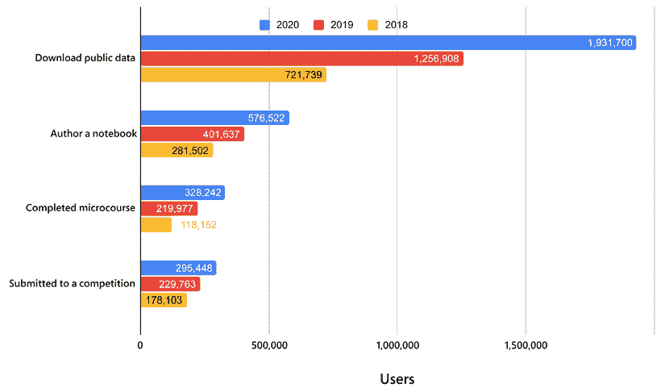
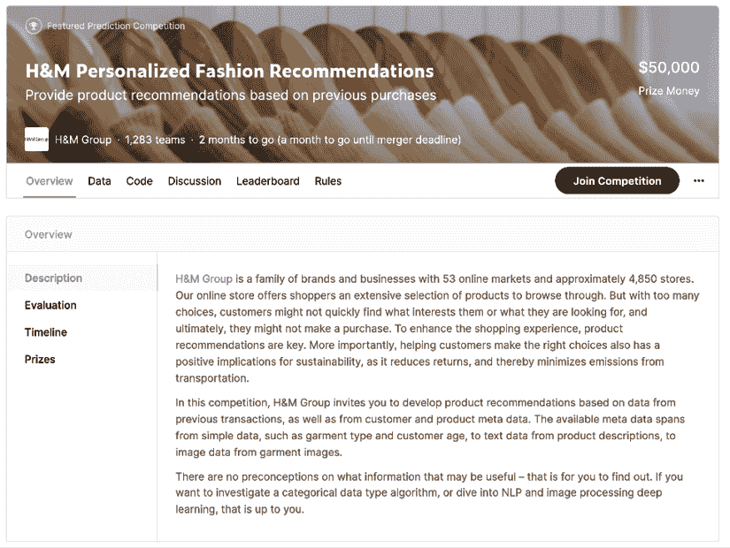
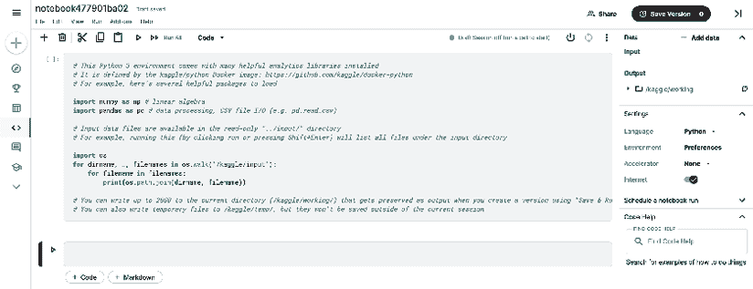
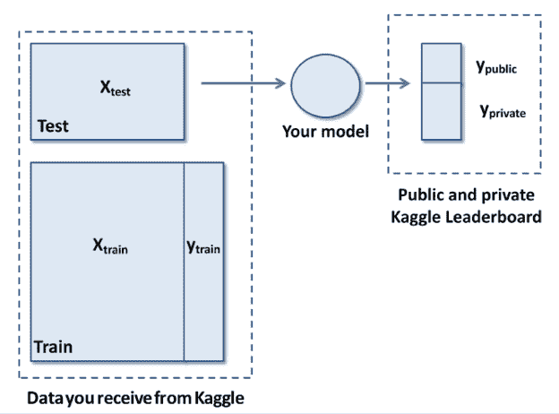
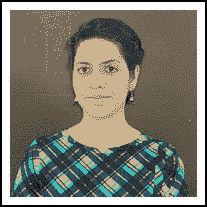
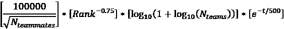
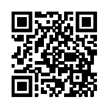

# 一、Kaggle 和其他数据科学竞赛简介

数据科学竞赛由来已久，随着时间的推移，它们取得了越来越大的成功，从充满激情的竞赛者组成的小众社区开始，吸引了越来越多的关注，并吸引了数百万数据科学家组成的更广泛的受众。作为最受欢迎的数据科学竞赛平台 Kaggle 的长期竞赛对手，我们见证并直接经历了这些年来的所有这些变化。

目前，如果你寻找关于 Kaggle 和其他竞赛平台的信息，你可以很容易地找到大量的聚会、讨论小组、播客、采访，甚至在线课程，解释如何在这种竞赛中获胜(通常告诉你使用勇气、计算资源和投入的时间的可变组合)。然而，除了你现在正在阅读的这本书，你不会找到任何关于如何导航如此多的数据科学竞赛以及如何充分利用它们的结构化指南——不仅仅是在分数或排名方面，还包括职业经验。

在本书中，我们不仅仅是包装一些关于如何在 Kaggle 和其他数据科学竞赛中获胜或获得高分的提示，我们的目的是为您提供一个关于如何在 Kaggle 上更好地竞赛并从您的竞赛经历中获得最大可能的回报的指南，特别是从您的职业生涯角度。与该书内容一同出版的还有对 Kaggle 大师和特级大师的采访。我们希望他们能为你提供一些关于 Kaggle 竞赛的具体方面的不同观点和见解，并启发你测试自己和学习竞赛数据科学的方式。

到本书结束时，你将已经吸收了我们直接从自己的经验、资源和竞赛中学到的知识，以及为自己在一次又一次的竞赛中学习和成长铺平道路所需的一切。

作为起点，在本章中，我们将探索竞赛性编程如何演变为数据科学竞赛，为什么 Kaggle 平台是此类竞赛最受欢迎的网站，以及它是如何工作的。

我们将讨论以下主题:

*   数据科学竞赛平台的兴起
*   通用任务框架范例
*   Kaggle 平台和其他一些替代品
*   Kaggle 竞赛如何工作:阶段，竞赛类型，提交和排行榜动态，计算资源，网络，等等

# 数据科学竞赛平台的兴起

竞赛性编程有着悠久的历史，始于 20 世纪 70 年代的第一次迭代 **ICPC** 、**国际大学生编程竞赛**。在最初的 ICPC 中，来自大学和公司的小团队参加了一场比赛，比赛要求使用计算机程序解决一系列问题(开始时，参与者用 FORTRAN 编写代码)。为了获得好的最终排名，团队必须展示良好的团队合作、解决问题和编程技能。

参与这种激烈竞赛的经历和站在招聘公司聚光灯下的机会给学生们提供了充足的动力，并使这种竞赛流行了许多年。在 ICPC 的决赛中，有一些人已经变得很出名:有*亚当·安吉洛*，脸书的前首席技术官和 Quora 的创始人*，尼可莱·杜罗夫*，Telegram Messenger 的联合创始人*，以及*，Apache Spark 的创造者。与许多其他专业人士一起，他们都有着相同的经历:参加了 ICPC。

ICPC 之后，编程比赛蓬勃发展，尤其是在 2000 年之后，远程参与变得更加可行，使得国际比赛更容易举办，成本更低。大多数竞赛的形式都是相似的:有一系列的问题，你必须编写一个解决方案来解决它们。获胜者会得到一份奖品，但也会让招聘公司知道自己，或者干脆出名。

通常，竞赛性编程中的问题范围从组合学和数论到图论、算法博弈论、计算几何、字符串分析和数据结构。最近，与人工智能有关的问题已经成功出现，特别是在计算机协会的 ( **ACM 的** ) **特别兴趣小组**(SIG)在其年度会议[https://kdd.org/conferences](https://kdd.org/conferences)期间举办的**KDD 杯**知识发现和数据挖掘比赛推出之后。

第一届 KDD 杯于 1997 年举行，涉及到升力线优化的直接营销问题，并开始了一系列延续至今的比赛。你可以在[https://www.kdd.org/kdd-cup](https://www.kdd.org/kdd-cup)找到包含数据集、说明和获奖者的档案。以下是在撰写本文时可获得的最新消息:【https://ogb.stanford.edu/kddcup2021/[。事实证明，KDD 杯在建立最佳实践方面非常有效，许多已发表的论文描述了解决方案、技术和竞赛数据集共享，这对许多从业者的实验、教育和基准测试非常有用。](https://ogb.stanford.edu/kddcup2021/)

竞赛性编程活动和 KDD 杯的成功例子激发了公司(如网飞)和企业家(如 *Anthony Goldbloom* ，Kaggle 的创始人)创建第一个数据科学竞赛平台，公司可以在这里举办难以解决的数据科学挑战，并可能从众包中受益。事实上，鉴于没有解决数据科学中所有问题的黄金方法，许多问题需要一种耗时的方法，可以总结为*尽你所能*。

事实上，从长远来看，没有算法能在所有问题上击败所有其他算法，正如大卫·沃伯特和威廉·麦克雷迪的没有免费的午餐定理所说。该定理告诉你，当且仅当其假设空间包含解决方案时，每个机器学习算法才会执行。因此，由于你无法预先知道机器学习算法是否能最好地解决你的问题，所以你必须尝试它，在确信你做的是正确的事情之前，直接在你的问题上测试它。机器学习没有理论上的捷径或其他圣杯——只有经验实验才能告诉你什么有效。

要了解更多细节，你可以查阅“没有免费的午餐定理”来获得这个实践真理的理论解释。这里有一篇来自《印度分析》杂志的完整文章:[https://analyticsindiamag . com/what-the-what-the-no-free-lunch-themes-in-data-science/](https://analyticsindiamag.com/what-are-the-no-free-lunch-theorems-in-data-science/)。

众包被证明是理想的，在这种情况下，你需要广泛地测试算法和数据转换，以找到最佳的可能组合，但你缺乏人力和计算机能力。例如，这就是为什么政府和公司为了在某些领域取得进步而诉诸竞赛:

*   在政府方面，我们可以引用 DARPA 及其围绕自动驾驶汽车、机器人操作、机器翻译、说话人识别、指纹识别、信息检索、OCR、自动目标识别等许多竞赛。
*   在商业方面，我们可以引用网飞这样的公司，它委托一项竞赛的结果来改进其预测用户电影选择的算法。

网飞竞赛基于改进现有协同过滤的想法。这样做的目的仅仅是预测用户对一部电影的潜在评价，仅仅基于他们对其他电影的评价，而不知道用户是谁或者电影是什么。由于没有可用的用户描述或电影名称或描述(全部被身份代码取代)，比赛要求参赛者开发聪明的方法来使用过去可用的评级。100 万美元的大奖只有在解决方案能够将现有的网飞算法 Cinematch 提高到某个阈值以上时才会颁发。

比赛从 2006 年持续到 2009 年，由许多以前的比赛团队融合而成的团队取得了胜利:一个来自 Commendo Research & Consulting GmbH、*Andreas t scher*和 *Michael Jahrer* 的团队，在 Kaggle 比赛中也非常有名；来自 T21 T 实验室的两名研究人员；另外两个来自雅虎！。最终，赢得比赛需要如此强大的计算能力和不同解决方案的组合，团队被迫合并以保持同步。这种情况也反映在网飞对该解决方案的实际使用中，他宁愿不实施该解决方案，而只是从该解决方案中获取最有趣的见解，以便改进其现有的 Cinematch 算法。你可以在这篇连线文章中了解更多信息:https://www.wired.com/2012/04/netflix-prize-costs/。

在网飞竞赛结束时，重要的不是解决方案本身，它很快被网飞商业重心从 DVD 到在线电影的转变所取代。对于参与者和公司来说，真正的好处是从竞赛中获得的洞察力，参与者在协同过滤中获得了巨大的声誉，公司可以将其改进的推荐知识转移到新的业务中。

## Kaggle 竞赛平台

除了网飞，其他公司也从数据科学竞赛中受益。这个清单很长，但是我们可以引用几个例子，在这些例子中，举办比赛的公司报告说从中获得了明显的好处。例如:

*   保险公司好事达(Allstate)能够改进他们自己的专家建立的精算模型，这要归功于数百名数据科学家(【https://www.kaggle.com/c/ClaimPredictionChallenge】T2)参与的竞赛
*   另一个证据充分的例子是，由于类似的【https://www.kaggle.com/c/flight】竞赛()，通用电气在预测航班到达时间的行业标准性能(以均方根误差度量标准衡量)上提高了 40%

Kaggle 竞赛平台至今已经举办了数百场比赛，这两个只是成功使用它们的公司的几个例子。让我们暂时从具体的竞赛中退一步，谈谈 Kaggle 公司，这是贯穿本书的一条主线。

### 卡格尔的历史

Kaggle 在 2010 年 2 月迈出了第一步，这要归功于安东尼·戈德布卢姆，一位拥有经济学和计量经济学学位的澳大利亚经济学家。在澳大利亚财政部和澳大利亚储备银行研究部工作后，Goldbloom 在伦敦的《经济学人》实习，这是一份关于时事、国际商业、政治和技术的国际周报。在《经济学人》杂志，他有机会写一篇关于大数据的文章，这激发了他的想法，即建立一个竞赛平台，可以众包最好的分析专家来解决有趣的机器学习问题([https://www . smh . com . au/technology/from-bondi-to-The-big-bucks-The-28 岁-whos-making-data-science-a-sport-2011 104-1 myq 1 . html](https://www.smh.com.au/technology/from-bondi-to-the-big-bucks-the-28yearold-whos-making-data-science-a-sport-20111104-1myq1.html))。由于众包动力在该平台的商业理念中发挥了相关作用，他衍生出了名称 *Kaggle* ，它通过押韵回忆起术语 *gaggle* ，一群鹅，鹅也是该平台的象征。

在搬到美国硅谷后，他的 Kaggle 初创公司获得了由两家知名风险投资公司 Khosla Ventures 和 Index Ventures 牵头的 A 轮融资 1125 万美元。第一批竞赛推出了，社区成长了，一些最初的竞赛者变得相当突出，例如澳大利亚数据科学家和企业家*杰瑞米·霍华德*，他在 Kaggle 上赢得了几场竞赛后，成为了公司的总裁和首席科学家。

杰瑞米·霍华德于 2013 年 12 月离开总裁职位，成立了一家新的初创公司`fast.ai` ( [www.fast.ai](https://www.fast.ai) )，为程序员提供机器学习课程和深度学习图书馆。

当时，还有一些其他著名的卡格勒人(这个名字表明经常参加卡格勒举办的比赛)，如*杰里米·阿钦*和*托马斯·德·戈多伊*。在该平台上达到全球排名前 20 位后，他们立即决定退休，并成立了自己的公司 DataRobot。不久之后，他们开始从 Kaggle 竞赛的最佳参与者中雇佣员工，以便将最佳的机器学习知识和实践灌输到他们正在开发的软件中。今天，DataRobot 是开发 AutoML 解决方案(自动机器学习软件)的领先公司之一。

越来越多的观众开始关注 Kaggle 比赛。甚至深度学习的“教父”杰弗里·辛顿(Geoffrey Hinton)也参加了(并赢得了)2012 年由默克公司主办的一场 Kaggle 比赛([https://www.kaggle.com/c/MerckActivity/overview/winners](https://www.kaggle.com/c/MerckActivity/overview/winners))。Kaggle 也是在 *Otto Group 产品分类挑战赛*([https://www . ka ggle . com/c/Otto-Group-Product-class ification-Challenge/discussion/13632](https://www.kaggle.com/c/otto-group-product-classification-challenge/discussion/13632))期间，*Fran ois Chollet*推出其深度学习包 Keras 的平台，以及 *Higgs 玻色子机器学习挑战赛*(*陈天齐*推出 XGBoost，一种更快速、更准确的梯度增强机器版本

除了 Keras，Franç ois Chollet 还在 Quora 网站上的回答中提供了关于如何赢得 Kaggle 比赛的最有用和最有见地的观点:[https://www . Quora . com/Why-has-has-so-successful-latest-at-ka ggle-competitions](https://www.quora.com/Why-has-Keras-been-so-successful-lately-at-Kaggle-competitions)。

由经验(而非理论)证据指导的多次尝试的快速迭代，实际上就是你所需要的全部。我们认为，除了他在回答中指出的秘密之外，赢得一场纸牌游戏的秘密并不多。

值得注意的是，Franç ois Chollet 还在 Kaggle 上举办了自己的比赛([https://www . ka ggle . com/c/abstraction-and-reasoning-challenge/](https://www.kaggle.com/c/abstraction-and-reasoning-challenge/))，被广泛认为是世界上第一个通用的 AI 比赛。

竞赛经过竞赛，围绕 Kaggle 的社区在 2017 年增长到 100 万，同年，在她在 Google Next 的主题演讲中，谷歌首席科学家*费-李非*宣布谷歌 Alphabet 将收购 Kaggle。此后，Kaggle 成为谷歌的一部分。

今天，Kaggle 社区仍然活跃并不断发展。安东尼·戈德布卢姆在他的(【https://twitter.com/antgoldbloom/status/1400119591246852096】)推文中说，除了参加比赛，它的大多数用户都下载了公共数据(Kaggle 已经成为一个重要的数据中心)，用 Python 或 R 创建了一个公共笔记本，或者在提供的一门课程中学到了一些新东西:

图 1.1:显示 2020 年、2019 年和 2018 年用户如何使用 Kaggle 的条形图

多年来，Kaggle 为许多参与者提供了更多的机会，例如:

*   创建自己的公司
*   启动机器学习软件和软件包
*   在杂志上获得面试机会([https://www . wired . com/story/solve-this-tough-data-problems-and-watch-job-offers-roll-in/](https://www.wired.com/story/solve-these-tough-data-problems-and-watch-job-offers-roll-in/))
*   写机器学习书籍([https://twitter.com/antgoldbloom/status/745662719588589568](https://twitter.com/antgoldbloom/status/745662719588589568)
*   找到他们梦想的工作

最重要的是，学习更多与数据科学相关的技能和技术。

## 其他竞赛平台

虽然这本书关注的是 Kaggle 上的比赛，但我们不能忘记，许多数据比赛都是在私人平台或其他比赛平台上举行的。事实上，你在本书中找到的大部分信息也适用于其他比赛，因为它们本质上都是在相似的原则下运作的，参与者的收益或多或少是相同的。

尽管许多其他平台在特定国家/地区进行了本地化，或者只针对特定种类的比赛，但为了完整起见，我们将简要介绍其中一些平台，至少是我们有一些经验和知识的平台:

*   **driven data**([https://www.drivendata.org/competitions/](https://www.drivendata.org/competitions/))是一个致力于社交挑战的众包竞赛平台(见[https://www . driven data . co/blog/intro-to-machine-learning-social-impact/](https://www.drivendata.co/blog/intro-to-machine-learning-social-impact/))。公司本身是一家社会企业，其目标是为应对世界最大挑战的组织带来数据科学解决方案，这要归功于数据科学家为社会公益构建算法。例如，正如你在这篇文章中读到的，[https://www . engadget . com/Facebook-ai-hate-speech-新冠肺炎-160037191.html](https://www.engadget.com/facebook-ai-hate-speech-covid-19-160037191.html) ，脸书选择了 DrivenData 作为其建立反对仇恨言论和错误信息模型的竞赛。
*   **numeric**([https://numer.ai/](https://numer.ai/))是一家总部位于旧金山的人工智能驱动的众包对冲基金。它每周举办一次锦标赛，你可以提交你对对冲基金模糊数据的预测，并赢得该公司加密货币计价单位的奖励。
*   **CrowdANALYTIX**([https://www.crowdanalytix.com/community](https://www.crowdanalytix.com/community))现在不太活跃，但是这个平台前不久曾经举办过不少挑战性的比赛，你可以从这篇博文中读到:[https://towardsdatascience . com/how-I-won-top-five-in-a-a-deep-learning-competition-753 c 788 cade 1](https://towardsdatascience.com/how-i-won-top-five-in-a-deep-learning-competition-753c788cade1)。社区博客非常有趣，可以让你了解在这个平台上可以找到哪些挑战:[https://www . crowdanalytix . com/jq/community blog/list blog . html](https://www.crowdanalytix.com/jq/communityBlog/listBlog.html)。
*   **署名**([https://signate.jp/competitions](https://signate.jp/competitions))是日本数据科学竞赛平台。它在竞赛中非常丰富，并且提供了一个类似于 ka ggle([https://signate.jp/users/rankings](https://signate.jp/users/rankings))的排名系统。
*   **Zindi**([https://zindi.africa/competitions](https://zindi.africa/competitions))是一个来自非洲的数据科学竞赛平台。它举办比赛，专注于解决非洲最紧迫的社会、经济和环境问题。
*   **阿里云**([https://www.alibabacloud.com/campaign/tianchi-competitions](https://www.alibabacloud.com/campaign/tianchi-competitions))是一家中文云计算机和人工智能提供商，已经发起了**天池学术竞赛**，与 SIGKDD、IJCAI-PRICAI 和 CVPR 等学术会议合作，并以基于图像的 3D 形状检索、3D 对象重建和实例分割等挑战为特色。
*   **Analytics vid hya**([https://datahack.analyticsvidhya.com/](https://datahack.analyticsvidhya.com/))是印度最大的数据科学社区，为数据科学黑客马拉松提供平台。
*   **coda lab**([https://codalab.lri.fr/](https://codalab.lri.fr/))是一个基于法国的数据科学竞赛平台，创建作为微软和斯坦福大学在 2013 年的合资企业。他们有一个免费的基于云的笔记本，叫做工作表([https://worksheets.codalab.org/](https://worksheets.codalab.org/))，用于知识共享和可复制的建模。

其他的小平台还有瑞士洛桑联邦理工学院*的 CrowdAI([https://www.crowdai.org/](https://www.crowdai.org/))、瑞士*的 InnoCentive([https://www.innocentive.com/](https://www.innocentive.com/))、生物医学成像的 Grand-Challenge([https://grand-challenge.org/](https://grand-challenge.org/))、data countain([https://www.datafountain.cn/business?lang=en-US](https://www.datafountain.cn/business?lang=en-US))、OpenML([https://www.openml.org/](https://www.openml.org/))，等等。你总是可以在俄罗斯社区开放数据科学([https://ods.ai/competitions](https://ods.ai/competitions))上找到一份正在进行的大型比赛的清单，甚至可以不时地发现新的比赛平台。

你可以在[mlcontests.com](https://mlcontests.com)网站上看到跑步比赛的概述，以及目前租用 GPU 的费用。该网站经常更新，这是一种简单的方式来了解不同平台上数据科学竞赛的情况。

Kaggle 永远是一个最好的平台，在这里你可以找到最有趣的比赛，并为你的比赛努力获得最广泛的认可。然而，在 it 之外接受挑战是有意义的，当你找到符合你个人和职业兴趣的竞赛时，我们建议把它作为一种策略。正如你所看到的，除了 Kaggle 之外，还有相当多的替代方案和机会，这意味着如果你在 Kaggle 旁边考虑更多的竞赛平台，你可以更容易地找到一个可能因为其专业化或数据而引起你兴趣的竞赛。

此外，在这些挑战中，你可以期待更少的竞赛压力(并因此获得更好的排名，甚至赢得一些东西)，因为它们不太为人所知和宣传。参与者之间的分享会更少，因为没有其他竞赛平台像 Kaggle 一样拥有如此丰富的分享和交流机会。

# 介绍 Kaggle

此时，我们需要更深入地研究 Kaggle 是如何工作的。在接下来的段落中，我们将讨论 Kaggle 平台及其竞赛的各个方面，您将体会到在 Kaggle 上参与竞赛意味着什么。之后，我们将回来更详细地讨论这些主题，在本书的剩余章节中会有更多的建议和策略。

## 比赛的各个阶段

Kaggle 上的一场比赛被安排成不同的步骤。通过逐一查看，您可以更好地了解数据科学竞赛是如何进行的，以及可以从中获得什么。

当一场比赛开始时，通常会在社交媒体上发布一些帖子，例如在 Kaggle Twitter 个人资料、[https://twitter.com/kaggle](https://twitter.com/kaggle)上发布，并且在 **比赛**页面([https://www.kaggle.com/competitions](https://www.kaggle.com/competitions))上的 Kaggle 部分会出现一个关于**正在进行的比赛**的新标签。如果你点击一个特定比赛的标签，你会被带到它的页面。一目了然，您可以查看比赛是否会有奖品(以及是否会奖励积分和奖牌，这是参加比赛的一个次要后果)，目前有多少支队伍参与，以及您还有多少时间来制定解决方案:

图 1.2:ka ggle 上的竞赛页面

在那里，您可以首先浏览的**概述**菜单，该菜单提供以下信息:

*   比赛的主题
*   它的评估标准(你的模型将被评估)
*   比赛的时间表
*   奖品
*   法律或竞赛要求

通常时间线有点被忽略，但它应该是你首先检查的事情之一；它不会简单地告诉你比赛开始和结束的时间，但它会为你提供**规则接受截止日期**，通常是比赛结束前的七天到两周。规则接受截止日期标志着你可以参加比赛(通过接受其规则)的最后一天。还有**团队合并截止日期**:在截止日期之前的任何时候，你都可以安排将你的团队与另一个竞赛对手的团队合并，但之后就不可能了。

**规则**菜单也经常被忽视(人们只是跳到**数据**，但是检查它是很重要的，因为它可以告诉你比赛的要求。您可以从规则中获得的关键信息包括:

*   你获奖的资格
*   是否可以利用外部数据来提高分数
*   你一天收到多少提交(你的解决方案的测试)
*   有多少最终解决方案可供选择

一旦你接受了这些规则，你可以从的**数据**菜单下载任何数据，或者直接从的**代码**菜单开始在 **Kaggle 笔记本**(在线、基于云的笔记本)上工作，重用其他人提供的代码或者从头开始创建你自己的代码。

如果你决定下载数据，也要考虑你有一个 **Kaggle API** 可以帮助你以几乎自动化的方式运行下载和提交。如果您在本地计算机或云实例上运行您的模型，这是一个重要的工具。你可以在[https://www.kaggle.com/docs/api](https://www.kaggle.com/docs/api)找到更多关于 API 的细节，也可以从[https://github.com/Kaggle/kaggle-api](https://github.com/Kaggle/kaggle-api)的 GitHub 得到代码。

如果你仔细检查 Kaggle GitHub repo，你还可以找到他们用于在线笔记本的所有 Docker 图像，Kaggle Notebooks:

图 1.3:准备编码的 Kaggle 笔记本

此时，当你开发你的解决方案时，我们强烈建议你不要继续孤军奋战，而是通过**讨论**论坛联系其他竞赛对手，在这里你可以针对具体的竞赛问题进行提问和回答。通常，您还会发现关于数据的特定问题的有用提示，甚至有助于改进您自己的解决方案的想法。许多成功的 Kagglers 报告说，在论坛上找到的想法帮助他们表现得更好，更重要的是，了解了更多关于数据科学建模的知识。

一旦您的解决方案准备就绪，您就可以根据竞赛规范将其提交给 Kaggle 评估引擎。一些比赛将接受 CSV 文件作为解决方案，其他比赛将要求你在 Kaggle 笔记本上编码并产生结果。您可以在整个比赛过程中不断提交解决方案。

每次您提交解决方案后，排行榜将很快为您提供一个分数和在竞赛对手中的位置(等待时间因分数评估所需的计算而异)。这个位置只是粗略的指示性的，因为它反映了你的模型在测试集的一部分上的性能，称为**公共测试集**，因为你在其上的性能在比赛期间是公开的，每个人都知道。

在比赛结束前，每个参赛者可以选择一些(通常是两个)他们的解决方案进行最终评估。

图 1.4:展示数据如何转化为公共和私人排行榜的分数的图表

只有当比赛结束时，根据参赛者决定评分的车型，他们在另一部分测试集即**私人测试集**上的分数才会揭晓。这个新的排行榜，即私人排行榜，构成了比赛的最终有效分数，但它仍然不是官方的和最终的排名。事实上，Kaggle 团队需要一些时间来检查一切是否正确，以及所有参赛者是否遵守了比赛规则。

一段时间后(有时在由于取消资格而导致排名发生一些变化后)，私人排行榜将成为官方的和确定的，获胜者将被宣布，许多参与者将在竞赛讨论论坛上公布他们的策略、他们的解决方案和他们的代码。此时，由您来检查其他解决方案，并尝试改进您自己的解决方案。我们强烈建议您这样做，因为这是 Kaggle 中另一个重要的学习来源。

## 竞赛类型和示例

Kaggle 竞赛基于*竞赛类别*进行分类，每个类别在如何竞赛和期望什么方面都有不同的含义。数据的类型、问题的难度、授予的奖项和竞赛动态在类别中是非常不同的，因此事先理解每一个的含义是很重要的。

以下是您可以用来过滤不同竞赛的官方类别:

*   作为特色的
*   主人
*   一年生植物
*   研究
*   招聘
*   入门指南
*   操场
*   分析学
*   社区

**特色**是最常见的竞赛类型，涉及赞助公司的商业相关问题和对最佳表现者的奖励。获奖者将向赞助公司授予其作品的非独家许可；他们必须准备一份详细的解决方案报告，有时甚至要参加与赞助公司的会议。

每次逛 Kaggle 都有特色比赛的例子。目前，其中许多问题与深度学习方法在文本、图像、视频或声音等非结构化数据上的应用有关。在过去，表格数据竞赛是常见的，即基于与可以在数据库中找到的结构化数据相关的问题的竞赛。首先通过使用随机森林，然后使用梯度推进方法和巧妙的特征工程，从 Kaggle 导出的表格数据解决方案可以真正改进现有的解决方案。如今，这些比赛很少举行，因为众包解决方案通常不会比一个优秀的数据科学家团队甚至 AutoML 软件更好。鉴于更好的软件和良好实践的传播，从竞赛中获得的结果质量的提高确实是微不足道的。然而，在非结构化数据世界中，一个好的深度学习解决方案仍然可以产生很大的影响。例如，在许多著名的 NLP 任务基准测试中，像 BERT 这样的预训练网络带来了两位数的增长。

**大师赛**现在不太常见了，但它们是私人的，只有受邀者才能参加的比赛。的目的是根据专家在 Kaggle 上的排名，只为专家(通常是根据 Kaggle 奖牌排名的大师或特级大师)创建比赛。

**年度**是总在一年的某个时期出现的比赛。在一年一度的比赛中，我们有圣诞老人比赛(通常基于算法优化问题)和*三月机器学习狂热*比赛，自 2014 年以来每年在美国大学篮球锦标赛期间举行。

**研究**竞赛意味着研究或科学目的而不是商业目的，有时是为了公共利益。这就是为什么这些比赛并不总是提供奖品。此外，这些竞赛有时要求获胜的参与者以开源方式发布他们的解决方案。

谷歌在过去已经发布了一些研究竞赛，如谷歌地标识别 2020(T20)(https://www.kaggle.com/c/landmark-recognition-2020 T21)，目标是在图像中标记著名(和不那么著名)的地标。

想测试潜在求职者能力的赞助商举行招聘竞赛。这些竞赛仅限于一个团队，并为最佳竞赛者提供赞助商的采访机会作为奖励。如果想被联系，参赛者必须在比赛结束后上传他们的简历。

招聘竞赛的例子有:

*   https://www.kaggle.com/c/FacebookRecruiting 的*脸书招聘大赛*([T31)；脸书已经举办了几次这样的活动](https://www.kaggle.com/c/FacebookRecruiting)
*   Yelp 招募竞赛([https://www.kaggle.com/c/yelp-recruiting](https://www.kaggle.com/c/yelp-recruiting))

**入门**比赛不提供任何奖品，只是为初学者提供友好简单的问题，让他们习惯ka ggle 原理和动态。一般都是不定期刷新排行榜的半永久比赛。如果你正在寻找机器学习的教程，这些比赛是正确的起点，因为你可以找到一个高度协作的环境，并且有许多 Kaggle 笔记本可以向你展示如何处理数据和创建不同类型的机器学习模型。

著名的正在进行的**入门**比赛有:

*   *数字识别器*(【https://www.kaggle.com/c/digit-recognizer】T2)
*   《泰坦尼克号》——机器从灾难中学习([https://www.kaggle.com/c/titanic](https://www.kaggle.com/c/titanic))
*   *房价-高级回归技术*([https://www . ka ggle . com/c/House-Prices-Advanced-Regression-Techniques](https://www.kaggle.com/c/house-prices-advanced-regression-techniques))

**游乐场**比赛比入门比赛稍微难一点，但它们也意味着参赛者可以学习和测试他们的能力，而没有完全成熟的特色比赛的压力(尽管在游乐场比赛中，有时比赛的热度也可能变得相当高)。这种比赛的通常奖品只是奖品(“我们都得到的东西”的首字母缩写，例如，一个杯子，一件 t 恤，或 Kaggle 品牌的袜子；见[https://www.kaggle.com/general/68961](https://www.kaggle.com/general/68961)还是有点钱的。

一个著名的游乐场比赛是最初的*狗对猫*比赛(【https://www.kaggle.com/c/dogs-vs-cats】T21)，任务是创建一个算法来区分狗和猫。

应提及到**分析**竞赛，其中评估是定性的，要求参与者提供想法、解决方案草案、PowerPoint 幻灯片、图表等；以及由学术机构和高尔夫球手举办的社区竞赛。你可以在 https://www.kaggle.com/product-feedback/294337[和 https://www.kaggle.com/community-competitions-setup-guide](https://www.kaggle.com/product-feedback/294337)了解关于社区竞赛的启动情况，你也可以在 https://www.kaggle.com/c/about/host[和](https://www.kaggle.com/c/about/host)[获得关于运行自己的社区竞赛的提示。](https://www.kaggle.com/community-competitions-setup-guide)

帕鲁尔·潘迪

[https://www.kaggle.com/parulpandey](https://www.kaggle.com/parulpandey)

我们采访了 Parul Pandey、Kaggle Notebooks Grandmaster、Datasets Master 和 H2O.ai 的数据科学家，了解了她参加分析比赛的经历以及更多信息。

你最喜欢哪种比赛，为什么？从技术和解决途径来说，你在 Kaggle 上的特长是什么？

我真的很喜欢数据分析比赛，这需要你分析数据，并在最后提供一份全面的分析报告。其中包括数据科学促进良性竞赛(DS4G)、体育分析竞赛(NFL)等。)，以及一般调查挑战。与传统比赛不同，这些比赛没有排行榜来跟踪你与他人相比的表现；你也不会得到任何奖牌或分数。

*另一方面，这些竞赛需要端到端的解决方案，涉及数据科学的多个方面，如数据清理、数据挖掘、可视化和传达见解。这类问题提供了一种模拟现实生活场景的方式，并提供了你的见解和观点。解决问题可能没有唯一的最佳答案，但它给了你一个机会来考虑和权衡潜在的解决方案，并将它们吸收到你的解决方案中。*

你是如何对待一场 Kaggle 比赛的？这种方法与你在日常工作中的做法有什么不同？

*我的第一步总是将数据分析作为 EDA(探索性数据分析)的一部分。它是* *一些我也作为日常工作的一部分遵循的东西。通常，我会研究数据，寻找潜在的危险信号，如数据不一致、缺失值、异常值等。，这可能会在以后造成问题。下一步是创建一个良好可靠的交叉验证策略。然后看论坛，看一些人分享的笔记本。它通常作为一个很好的起点，然后我可以将我过去的经验融入到这个工作流程中。跟踪模型性能也很重要。*

然而，对于分析竞赛，我喜欢将问题分解成多个步骤。例如，第一部分可能与理解问题有关，这可能需要几天时间。之后，我喜欢探索数据，然后创建一个基本的基线解决方案。然后，我继续通过一次添加一块来增强这个解决方案。这可能类似于一次添加一部分乐高积木来创建最终的杰作。

告诉我们你参加的一个特别有挑战性的比赛，以及你用什么样的洞察力来完成这个任务。

*正如我提到的，我最喜欢参加分析竞赛，尽管偶尔我也会在常规竞赛中一试身手。我想指出一个非常有趣的关于良好竞赛的数据科学，名为 Environmental Insights Explorer(https://www . ka ggle . com/c/ds4g-Environmental-Insights-Explorer)。任务是利用遥感技术来了解环境排放，而不是根据目前的方法来计算排放系数。*

*什么* *真正打动我的是这个用例。我们的星球正在努力应对气候变化问题，这次比赛就触及了这个方面。在为我的比赛进行研究时，我惊讶地发现在卫星图像领域取得了如此大的进展，这让我有机会更深入地了解和深入这个主题。这让我有机会了解 Landsat、Modis 和 Sentinel 等卫星是如何工作的，以及它们是如何提供卫星数据的。这是一场很棒的比赛，让我了解了一个我在比赛前知之甚少的领域。*

以你的经验来看，没有经验的 Kagglers 经常会忽略什么？你现在知道了什么，你希望在你刚开始的时候就知道？

*我将列举我在 Kaggle 最初几年犯的一些错误。*

首先，大多数新手认为 Kaggle 是一个只提供竞赛的平台。如果你喜欢比赛，这里有很多，但 Kaggle 也有适合其他专业人士的东西。你可以写代码并与他人分享，沉浸在健康的讨论中，建立关系网。整理并与社区分享好的数据集。我最初只使用 Kaggle 下载数据集，直到几年前我才真正活跃起来。现在当我回头看时，我大错特错了。很多人被竞赛吓倒了。你可以先适应这个平台，然后慢慢开始参加比赛。

*我想提到的另一个重要的事情是，许多人孤立地工作，失去动力，辞职。与 Kaggle 合作有许多看不见的优势。它教会你在团队中工作，从经验中学习，并在有限的时间内朝着共同的目标努力。*

你使用其他比赛平台吗？他们和 Kaggle 相比如何？

*虽然* 这是访问以非洲为重点的数据集的好地方。Kaggle 是一个多功能的平台，但缺乏来自世界不同地区的问题陈述。最近，我们也看到了一些多样化的问题，比如最近举行的 chaii 竞赛——一个专注于印度语言的 NLP 竞赛。我相信集中在不同国家的类似比赛将有助于研究和一般数据科学界。

在 Kaggle 竞赛的分类中，你还必须考虑到竞赛可能有不同的形式。通常的格式是所谓的**简单格式**，其中您提供一个解决方案，然后按照我们之前描述的方式进行评估。更复杂的是，**两阶段比赛**将比赛分成两部分，最终数据集仅在第一部分完成后发布，并且仅向第一部分的参与者发布。两阶段比赛形式的出现是为了限制一些参赛者作弊和违反规则的机会，因为评估是在完全未经测试的测试集上进行的，该测试集仅在短时间内可用。与最初的 Kaggle 竞赛形式相反，在这种情况下，竞赛对手有更短的时间和更少的提交来从测试集中找出任何有用的模式。

出于同样的原因，最近出现了**代码**竞赛，其中所有的提交都是从一个 Kaggle 笔记本上进行的，并且禁止任何直接上传提交的内容。

对于处于比赛生涯不同阶段的卡格勒人来说，参加任何形式的比赛都没有任何限制。然而，根据您在数据科学方面的经验水平和您的计算资源，我们有一些反对或支持竞赛形式或类型的建议:

*   对于完全的初学者来说，**入门**或**游乐场**比赛是很好的开始，因为你可以很容易地对 Kaggle 的工作方式更加自信，而不会面临很大的竞赛压力。也就是说，许多初学者已经成功地从特色和研究比赛开始，因为处于压力下有助于他们学得更快。因此，我们的建议是根据你的学习风格来决定:一些 Kagglers 需要通过探索和合作来学习(入门或操场比赛是理想的选择)，其他人需要快节奏的竞赛来找到他们的动力。
*   对于**特色**和**研究**竞赛，也要考虑到这些竞赛通常是关于人工智能和机器学习的边缘应用，因此，你通常需要坚实的背景或愿意研究竞赛应用领域的所有相关研究。

最后，请记住，大多数竞赛都要求您能够使用计算资源，而这些资源通常是工作场所中的大多数数据科学家无法获得的。如果你使用 Kaggle 以外的云平台，这可能会变成不断增长的开支。竞赛和有时间或资源限制的竞赛可能是你努力的理想场所，因为它们努力将所有参与者放在相同的资源水平上。

## 提交和排行榜动态

Kaggle 的工作方式似乎很简单:测试集对参与者是隐藏的；你符合你的模型；如果你的模型在测试集上的预测是最好的，那么你得分高，你可能会赢。不幸的是，这种描述以一种过于简单的方式呈现了 Kaggle 竞赛的内部运作。它没有考虑到竞赛对手的直接和间接互动的动态，或者你所面临的问题及其训练和测试集的细微差别。

### 解释通用任务框架范例

斯坦福大学([https://web.stanford.edu/dept/statistics/cgi-bin/donoho/](https://web.stanford.edu/dept/statistics/cgi-bin/donoho/))统计学教授*大卫·多诺霍*在他的论文*数据科学 50 年*中对 Kaggle 的工作原理做了更全面的描述。它首先出现在*计算和图形统计杂志*上，随后被发布在*麻省理工学院计算机科学和人工智能实验室*上(见[http://courses . csail . MIT . edu/18.337/2015/docs/50 years data Science . pdf](http://courses.csail.mit.edu/18.337/2015/docs/50YearsDataScience.pdf))。

多诺霍教授并非特指 Kaggle，而是指所有的数据科学竞赛平台。引用计算语言学家*马克·利伯曼*的话，他认为数据科学竞赛和平台是**共同任务框架** ( **CTF** )范式的一部分，在过去几十年里，这种范式一直在许多领域默默无闻地稳步推进数据科学。他指出，从经验的角度来看，CTF 在改进数据科学问题的解决方案方面非常出色，并引用了网飞竞赛和许多 DARPA 竞赛作为成功的例子。CTF 范式为许多领域的问题重塑了最佳解决方案。

CTF 由**配料**和**秘制酱料**组成。**配料**简单来说就是:

1.  公开可用的数据集和相关的预测任务
2.  一组竞赛者，他们共同承担为任务产生最佳预测的任务
3.  一个系统，用于以公平和客观的方式对参与者的预测进行评分，而不提供关于解决方案的太具体的提示(或至少限制它们)

如果任务定义明确，数据质量好，系统工作得最好。从长远来看，解决方案的性能通过小的增益提高，直到它达到一个渐近线。通过允许参与者之间进行一定程度的共享，可以加快这一过程(就像在 Kaggle 上通过讨论，以及共享 Kaggle 笔记本和数据集部分的数据集提供的额外数据所发生的那样)。根据 CTF 范式，竞赛中的竞赛压力足以产生不断改进的解决方案。当竞赛压力与参与者之间的某种程度的分享相结合时，改善会以更快的速度发生——这就是为什么 Kaggle 引入了许多分享激励措施。

这是因为在 CTF 范式中的**秘方**是竞赛本身，在一个其经验表现必须改进的实际问题的框架内，它总是导致新基准、新数据和建模解决方案的出现，并且通常导致机器学习对竞赛所提出的问题的改进应用。因此，竞赛可以提供解决预测问题的新方法、特征工程的新方法以及新的算法或建模解决方案。例如，深度学习并不仅仅是从学术研究中产生的，它最初获得了巨大的推动，因为成功的比赛标志着它的功效(例如，我们已经提到了默克竞赛，由*杰弗里·辛顿的*团队赢得:[https://www.kaggle.com/c/MerckActivity/overview/winners](https://www.kaggle.com/c/MerckActivity/overview/winners))。

再加上开放软件运动，这使得每个人都可以使用强大的分析工具(如 Scikit-learn、TensorFlow 或 PyTorch)，CTF 范式带来了更好的结果，因为所有竞赛者在开始时都处于同一水平。另一方面，竞赛的解决方案依赖于专门的或改进的硬件会限制可实现的结果，因为它会阻止无法访问此类资源的竞赛对手适当地参与并直接对解决方案做出贡献，或通过对其他参与者施加竞赛压力来间接做出贡献。可以理解的是，这就是 Kaggle 开始向其竞赛对手免费提供云服务的原因，我们将在*计算资源*部分介绍 Kaggle 笔记本。它可以在硬件密集型比赛中拉平一些差异(大多数深度学习的比赛都是如此)，增加整体竞赛压力。

### 了解竞赛中可能出现的问题

鉴于我们之前对 CTF 模式的描述，你可能会忍不住想象，所有的比赛都需要建立在一个适当的平台上，良好的结果，如参与者的积极参与和赞助公司的优秀模式将自动出现。然而，也有一些事情可能会出错，反而导致比赛结果令人失望，无论是对参赛者还是主办机构而言:

*   数据泄漏
*   从排行榜探索(评分系统)
*   过度适应和随之而来的排行榜变动
*   私人共享

当解决方案的一部分可以在数据本身中追溯时，您就有了来自数据的**泄漏**。例如，某些变量可能在目标变量之后，所以它们揭示了一些关于目标变量的信息。当您使用在欺诈发生后更新的*变量时，这种情况会发生在欺诈检测中，或者当您处理与产品的有效分销相关的信息时，这种情况会发生在销售预测中(更多的分销意味着对该产品的更多请求，因此更多的销售)。*

另一个问题可能是训练和测试示例以可预测的方式排序，或者示例的标识符的值暗示了解决方案。例如，当标识符基于目标的排序时，或者标识符值与时间的流动相关并且时间影响目标的概率时。

这种解决方案泄漏，有时被竞赛对手命名为*黄金特性*(因为获得数据中这种细微差别的暗示可以为参与者带来金奖)，总是导致解决方案不可重用。这对发起人来说也意味着一个次优的结果，但是他们至少能够学到一些关于泄漏特性的东西，这些泄漏特性会影响他们问题的解决方案。

另一个问题是**从排行榜中寻找解决方案**的可能性。在这种情况下，您可以利用显示给您的评估指标，通过在排行榜上重复提交试验来窥探解决方案。同样，在这种情况下，该解决方案在不同的环境下完全不可用。一个明显的例子发生在比赛中*不要过度配合 II* 。获胜的参与者*扎卡里·梅耶斯*，提交了每一个单独的变量作为一个单一的提交，获得了关于每个变量可能的权重的信息，使他能够估计他的模型的正确系数(你可以在这里阅读扎克的详细解决方案:[https://www.kaggle.com/c/dont-overfit-ii/discussion/91766](https://www.kaggle.com/c/dont-overfit-ii/discussion/91766))。一般来说，时间序列问题，或测试数据中存在系统变化的其他问题，可能会受到探测的严重影响，因为它们可以帮助竞赛对手成功地定义某种类型的*后处理*(如将他们的预测乘以一个常数)，这最适合在*特定的*测试集上获得高分。

另一种形式的排行榜窥探(即获得关于测试集的提示并过度适应它)发生在参与者更依赖公共排行榜的反馈而不是他们自己的测试时。有时，这变成了比赛的彻底失败，导致了激烈的动荡——最终排行榜上位置的完全和不可预测的重新洗牌。在这种情况下，获胜的解决方案对问题来说可能不是最优的，甚至只是偶然的。这导致了分析训练集和公共测试集之间潜在差距的技术的传播。这种被称为**对抗性测试**的分析可以提供关于在多大程度上依赖排行榜的见解，以及训练集和测试集之间是否存在如此不同的功能，以至于最好完全避免它们。

举个例子，你可以看看这个笔记本，作者是*博扬·东古兹*:[https://www.kaggle.com/tunguz/adversarial-ieee](https://www.kaggle.com/tunguz/adversarial-ieee)。

另一种防止排行榜过度拟合的方法是选择安全的策略，避免提交过多基于排行榜结果的解决方案。例如，由于(通常)每个参与者可以选择两个解决方案进行最终评估，因此一个好的策略是提交基于排行榜的最佳解决方案，以及基于您自己的交叉验证测试的最佳解决方案。

为了避免排行榜探测和过度拟合的问题，Kaggle 最近推出了基于代码竞赛的不同创新，其中评估分为两个不同的阶段，正如我们之前讨论的那样，参与者对实际测试数据完全不知情，因此他们被迫更多地考虑自己的本地验证测试。

最后，比赛的另一个可能的扭曲是由于**私人分享**(在参与者的封闭圈子中分享想法和解决方案)和其他非法行为，如通过多个帐户玩游戏或在多个团队中玩游戏以及窃取想法而导致的。所有这些行为在参与者之间造成了信息不对称，可能对少数人有利，对大多数人不利。同样，最终的解决方案可能会受到影响，因为比赛期间的共享不完善，能够充分发挥竞赛压力的团队较少。此外，如果这些情况对参与者来说变得明显(例如，见[https://www . ka ggle . com/c/ASHRAE-energy-prediction/discussion/122503](https://www.kaggle.com/c/ashrae-energy-prediction/discussion/122503))，可能会导致不信任并减少对比赛或后续比赛的参与。

## 计算资源

为了使可行的解决方案可用于生产，一些竞赛提出了限制。例如，*博世生产线性能*竞赛(【https://www.kaggle.com/c/bosch-production-line-performance】T4)对解决方案的执行时间、模型文件输出和内存限制有严格的限制。基于笔记本(以前称为纯内核)的竞赛需要在 Kaggle 笔记本上执行训练和推理，不会对您必须使用的资源造成问题。这是因为 Kaggle 将为您提供您需要的所有资源(这也是为了让所有参与者处于同一起跑线上，以获得更好的比赛结果)。

当你的竞赛只把笔记本的使用限制在推理时间时，问题就出现了。在这些情况下，你可以在你自己的机器上训练你的模型，唯一的限制是在测试的时候，你生产的模型的数量和复杂性。由于目前大多数竞赛都需要深度学习解决方案，所以你必须意识到，为了取得竞赛结果，你将需要专门的硬件，如 GPU。

即使在一些现在很少出现的表格比赛中，您也会很快意识到，您需要一台强大的机器，配备相当多的处理器和大量内存，以便轻松地将特征工程应用于数据，进行实验，并快速构建模型。

标准变化很快，因此很难指定一个你应该拥有的标准硬件，以便至少在同一个联赛中与其他球队竞赛。我们可以通过观察其他竞赛对手正在使用的东西来了解当前的标准，无论是他们自己的机器还是云上的机器。

例如，惠普推出了一项计划，向一些选定的 Kaggle 参与者奖励一台 HP Z4 或 Z8，以换取品牌知名度。例如，Z8 机器有多达 72 个内核，3 TB 的内存，48 TB 的存储(固态存储硬盘标准的良好份额)，通常有两个 NVIDIA RTX 作为 GPU。我们理解这对许多人来说可能有点遥不可及；即使在谷歌的 GCP 或亚马逊的 AWS 等云实例上短期租用类似的机器也是不可能的，因为即使是适度的使用也会产生费用。

每个竞赛的云成本自然取决于要处理的数据量以及您构建的模型的数量和类型。GCP 和 AWS 云平台在 Kaggle 竞赛中的免费积分赠品通常在 200 美元到 500 美元之间。

因此，我们的建议是，当你开始攀登 Kaggle 参与者的顶级排名之旅时，使用 Kaggle 免费提供的机器，Kaggle 笔记本(以前称为 Kaggle 内核)。

### Kaggle 笔记本

Kaggle 笔记本是版本化的计算环境，基于在云机器上运行的 Docker 容器，允许你用 R 和 Python 语言编写和执行脚本和笔记本。Kaggle 笔记本:

*   集成到 Kaggle 环境中(您可以从其中提交内容，并跟踪哪些内容引用了哪些笔记本)
*   预装了大多数数据科学软件包
*   允许一些定制(你可以下载文件和安装更多的软件包)

基本的 Kaggle 笔记本只是基于 CPU 的，但你可以拥有由英伟达特斯拉 P100 或 TPU v3-8 支持的版本。TPU 是专门用于深度学习任务的硬件加速器。

尽管受到使用次数和时间配额的限制，Kaggle 笔记本让您能够使用计算工具，在 Kaggle 竞赛中构建您的基准解决方案:

| **笔记本类型** | **CPU 内核** | **内存** | **一次可以运行的笔记本数量** | **周配额** |
| 中央处理器 | 四 | 16 GB | 10 | 无限的 |
| 国家政治保卫局。参见 OGPU | 2 | 13 GB | 2 | 30 小时 |
| TPU | 四 | 16 GB | 2 | 30 小时 |

除了总运行时间之外，CPU 和 GPU 笔记本在停止之前每个会话最多可以运行 12 个小时(TPU 笔记本仅运行 9 个小时)，这意味着除了保存在磁盘上的内容之外，您不会从运行中获得任何结果。您有一个 20 GB 的磁盘节省空间来存储您的模型和结果，另外还有一个额外的便笺式磁盘，可以在脚本运行期间临时使用超过 20 GB。

在某些情况下，Kaggle 笔记本提供的 GPU 增强机器可能不够用。例如，最近的 *Deepfake 检测挑战*(【https://www.kaggle.com/c/deepfake-detection-challenge】T2)需要处理由大约 500 GB 视频组成的数据。这尤其具有挑战性，因为每周使用有 30 小时的时间限制，并且因为你不能有超过两台机器同时运行 GPU。即使你可以通过改变代码来利用 TPU 而不是 GPU 的使用，从而使机器时间增加一倍(你可以在这里找到一些轻松实现的指导:【https://www.kaggle.com/docs/tpu】[，这可能仍然不足以在数据密集型比赛中进行快速实验，如 *Deepfake 检测挑战*。](https://www.kaggle.com/docs/tpu)

因此，在第 3 章、*使用 Kaggle 笔记本工作和学习*中，我们将为您提供一些技巧，帮助您成功应对这些限制，从而在无需购买高性能机器的情况下获得不错的结果。我们还将向您展示如何将 Kaggle 笔记本与 GCP 集成，或者，在第 2 章、*用数据集组织数据*中，如何将您的所有工作转移到另一个基于云的解决方案 Google Colab 中。

## 团队和网络

虽然计算能力发挥了它的作用，但只有人类的专业知识和能力才能在一场混战中发挥真正的作用。要成功举办一场比赛，有时需要一组参赛者的共同努力。除了招募竞赛(主办方可能要求个人参与者对其能力进行更好的评估)之外，通常不限制组建团队。通常，参赛队最多由五名选手组成。

团队合作有自己的优势，因为它可以加倍努力找到更好的解决方案。一个团队可以花更多的时间在一起解决问题，不同的技能会有很大的帮助；当涉及到不同的模型和数据操作时，并非所有的数据科学家都具有相同的技能或相同的技能水平。

然而，团队合作并不都是积极的。为了一个共同的目标，协调不同的个人和努力可能不那么容易，并且可能出现一些次优的情况。一个常见的问题是当一些参与者不参与或只是无所事事时，但毫无疑问，最糟糕的是当有人违反比赛规则时——这对所有人都不利，因为整个团队都可能被取消资格——甚至监视团队，以便给另一个团队带来优势，正如我们前面提到的。

尽管有任何负面影响，但在 Kaggle 比赛中合作是一个很好的机会，可以更好地了解其他数据科学家，为了某个目的进行合作，并取得更多成就，因为 Kaggle 规则确实奖励团队而不是孤独的竞赛对手。事实上，对于较小的团队，你得到的百分比要高于同等份额。在 Kaggle 中，合作并不是建立关系网的唯一可能性，尽管这对参与者来说肯定更有利可图，也更有趣。你也可以通过论坛上的讨论，或者在比赛期间共享数据集和笔记本来与他人交流。所有这些平台上的机会都可以帮助你认识其他数据科学家，并在社区中得到认可。

在 Kaggle 平台本身之外，也有很多与其他 ka ggler 建立网络的场合。首先，有几个松弛通道可以有所帮助。例如，**KaggleNoobs**([https://www.kaggle.com/getting-started/20577](https://www.kaggle.com/getting-started/20577))是一个在 2016 年开设的频道，其中有许多关于 Kaggle 比赛的讨论。他们有一个支持性的社区，如果你在代码或模型方面有一些具体的问题，他们可以帮助你。

有相当多的其他渠道专门用于交换关于 Kaggle 竞赛和数据科学相关主题的意见。一些频道是在地区或国家的基础上组织的，例如，日本频道**kag gler-ja**([http://kaggler-ja-wiki.herokuapp.com/](http://kaggler-ja-wiki.herokuapp.com/))或俄罗斯社区**开放数据科学网络**([https://ods.ai/](https://ods.ai/))，创建于 2015 年，后来也向非俄语参与者开放。开放数据科学网络不仅仅提供一个松弛的频道，还提供关于如何赢得比赛、事件的课程，以及关于所有已知数据科学平台上发生的活跃比赛的报告(见[https://ods.ai/competitions](https://ods.ai/competitions))。

除了 Slack 频道之外，相当多的以 Kaggle 为主题或以特定比赛为主题的本地聚会已经涌现出来，有些只是暂时的，有些则以更成熟的形式出现。专注于 Kaggle 竞赛的 meetup 通常围绕希望分享其经验或建议的竞赛对手的演示进行，这是面对面会见其他 ka ggle 参与者、交换意见以及建立联盟以共同参与数据科学竞赛的最佳方式。

在这个联赛中，值得一提的是由*玛利亚·帕里斯*和*帕韦日·扬凯维奇*打造的**卡格勒日**([https://kaggledays.com/](https://kaggledays.com/))。Kaggle Days 组织在世界各地的主要地点([https://kaggledays.com/about-us/](https://kaggledays.com/about-us/))安排了一些活动，目的是召集一次 Kaggle 专家会议。它还创建了一个在不同国家的本地聚会网络，这个网络仍然非常活跃([https://kaggledays.com/meetups/](https://kaggledays.com/meetups/))。

pawejankiewicz

[https://www.kaggle.com/paweljankiewicz](https://www.kaggle.com/paweljankiewicz)

我们有机会采访了 Paweł，了解他和 Kaggle 的经历。何是一名竞赛大师，也是 LogicAI 的联合创始人。

你最喜欢哪种比赛，为什么？从技术和解决途径来说，你在 Kaggle 上的特长是什么？

代码竞赛是我最喜欢的竞赛类型，因为在有限的环境中工作迫使你考虑不同种类的预算:时间、CPU、内存。在以前的比赛中，我需要利用多达 3-4 台强大的虚拟机的情况太多了。我不喜欢为了获胜而不得不利用这些资源，因为这使得竞赛变得非常不均衡。

你是如何对待一场 Kaggle 比赛的？这种方法与你在日常工作中的做法有什么不同？

我对待每场比赛的方式都有所不同。我总是倾向于为每个比赛建立一个框架，让我尽可能多地创造实验。例如，在一次比赛中，我们需要创建一个深度学习卷积神经网络，我创建了一种配置神经网络的方法，通过以 C4-MP4-C3-MP3 的格式指定它们(其中每个字母代表不同的层)。那是很多年前的事了，所以现在神经网络的配置大概是通过选择主干模型来完成的。但是这条规则仍然适用。您应该创建一个框架，允许您快速更改管道中最敏感的部分。

在建模方法和适当验证方面，日常工作与 Kaggle 竞赛有一些重叠。Kaggle 比赛教给我的是验证、防止数据泄露等的重要性。比如这么多比赛都发生数据泄露，当准备的人都是领域内最优秀的，你可以问问自己有百分之几的量产车型在训练中出现数据泄露；我个人认为 80%以上的生产模型可能没有被正确验证，但是不要引用我的观点。

日常工作中的另一个重要区别是，没有人真正告诉你如何定义建模问题。例如:

1.  *您报告或优化的指标应该是 RMSE、RMSLE、SMAPE 还是 MAPE？*
2.  *如果问题是基于时间的，你如何分割数据以尽可能真实地评估模型？*

**这些并不是企业唯一重要的东西。你还必须能够交流你的选择以及你做出选择的原因。**

 *告诉我们你参加的一个特别有挑战性的比赛，以及你用什么样的洞察力来完成这个任务。

最具挑战性和最有趣的是市场价格预测*代码竞赛。它与任何其他竞赛对手都非常不同，因为它被限制在 1 小时的计算时间内，并且只有 4 个内核和 16 GB 的内存。克服这些限制是挑战中最激动人心的部分。我从这场比赛中得到的收获是更加相信表格数据网络。在与我的队友康斯坦丁·洛普欣*(【https://www.kaggle.com/lopuhin】)*合并之前，我有一堆复杂的模型，包括神经网络，还有一些其他的提升算法。合并后，结果是康斯坦丁只使用了一种非常优化的架构(时代数、学习率)。这场比赛的另一个非常独特的方面是，仅仅平均团队的解决方案是不够的。我们不得不重新组织我们的工作流程，这样我们就有了一个统一的解决方案，而不是快速拼凑起来的东西。我们花了三周时间将我们的解决方案整合在一起。*

以你的经验来看，没有经验的 Kagglers 经常会忽略什么？你现在知道了什么，你希望在你刚开始的时候就知道？

*软件工程技能大概被低估了很多。每个竞赛和问题都略有不同，需要一些框架来简化解决方案(看看 https://github.com/bestfitting/instance_level_recognition 和他们的代码组织得多好)。良好的代码组织有助于你更快地迭代，并最终尝试更多的东西。*

当一个人参加比赛时，他应该记住或做的最重要的事情是什么？

*最重要的是玩得开心。**  *## 绩效等级和排名

除了金钱奖励和其他物质项目，如杯子、t 恤、帽衫和贴纸，Kaggle 还提供许多非物质奖励。卡格勒人在比赛中花费了大量的时间和精力(更不用说发展他们用于比赛的技能，事实上，这些技能在普通人群中相当罕见)。奖金通常涵盖了前几名 Kagglers 的努力，如果不仅仅是排名第一的人，剩下的人自愿花费惊人的时间，却没有什么回报。从长远来看，参加没有实际结果的比赛可能会导致不满和不感兴趣，降低竞赛强度。

因此，Kaggle 找到了一种基于奖牌和积分的荣誉系统来奖励竞赛者的方法。这个想法是，你获得的奖牌和积分越多，你的技能就越相关，让你在求职或任何其他基于你的声誉的相关活动中有机会。

首先有一个**总排行榜**，这个综合了所有单项比赛的排行榜([https://www.kaggle.com/rankings](https://www.kaggle.com/rankings))。根据他们在每场比赛中获得的名次，Kagglers 会被授予一定数量的分数，这些分数加在一起会提供他们在总排行榜上的排名。乍一看，比赛中的得分公式可能看起来有点复杂:

然而，实际上它只是基于几个因素:

*   你在比赛中的名次
*   您的团队规模
*   比赛的受欢迎程度
*   竞赛有多长时间了

直观上，在热门比赛中排名靠前会带来很多积分。不太直观的是，你团队的规模以一种非线性的方式起作用。这是由于公式的平方根倒数部分，因为你必须放弃的分数比例随着参与人数的增加而增加。

如果你的团队相对较小(2 人，最多 3 人)，由于协作带来的智慧和计算能力的优势，这仍然是非常有利的。

需要记住的另一点是，点数会随着时间而衰减。衰减不是线性的，但作为一个经验法则，请记住，一年后，你获得的分数所剩无几。因此，除非你继续参加与以前类似的比赛，否则 Kaggle 总排行榜上的荣耀是短暂的。作为安慰，在你的个人资料中，你将永远保持你所达到的最高级别。

更持久的是覆盖 Kaggle 比赛所有四个方面的奖牌体系。根据您的结果，您将获得竞赛、笔记本、讨论和数据集的奖牌。在比赛中，奖牌是根据你在排行榜上的位置颁发的。在其他三个领域，奖牌是根据其他竞赛对手的赞成票授予的(这实际上可能导致一些次优情况，因为赞成票是一个不太客观的指标，也取决于受欢迎程度)。你获得的勋章越多，你可以进入的魔法等级就越高。等级分别是 **新手**、**功臣**、**高手**、**高手**、**特级大师**。在[https://www.kaggle.com/progression](https://www.kaggle.com/progression)的页面解释了关于如何获得勋章的一切以及获得不同等级需要的和种类。

请记住，这些等级和荣誉总是相对的，它们会随着时间而改变。几年前，其实评分系统和排位都有很大的不同。最有可能的是，在未来，等级会再次改变，以保持更高的稀有和更有价值。

## 批评和机遇

从一开始，Kaggle 就招致了不少批评。如今，参加数据科学竞赛仍然是一个争论的话题，有许多不同的观点，有正面的，也有负面的。

负面批评的一面:

*   Kaggle 提供了一个错误的机器学习概念，因为它只关注排行榜动态
*   Kaggle 只是一个超参数优化的游戏，只是为了获得更高的精确度而集合了许多模型(实际上过度适应了测试集)
*   Kaggle 充满了缺乏经验的狂热分子，他们准备尝试阳光下的任何事情，以便获得分数和聚光灯，希望被招聘人员发现
*   另一个结果是，竞赛解决方案太复杂，并且通常对一个测试集来说太具体而无法实施

许多人认为 Kaggle，像许多其他数据科学竞赛平台一样，与现实中的数据科学相去甚远。批评者提出的观点是，业务问题不是凭空而来的，而且你很少已经有了一个准备充分的数据集，因为你通常是基于细化业务规范和对手头问题的理解来构建它的。此外，许多批评者强调，Kagglers 不学习也不擅长创建*生产就绪*模型，因为获胜的解决方案不会受到资源限制或技术债务考虑的约束(尽管并非所有竞赛都是如此)。

最后，所有这些批评都与雇主眼中的 Kaggle 排名如何与其他类型的经验相比较有关，尤其是相对于数据科学教育和工作经验而言。一个长期存在的神话是，Kaggle 竞赛不会帮助你在数据科学领域找到工作或更好的工作，与根本不参加的数据科学家相比，它们不会让你进入另一个层面。

我们对此的立场是，认为 Kaggle 排名在 Kaggle 社区之外没有自动价值是一种误导。例如，在求职中，Kaggle 可以为你提供一些非常有用的能力，如数据建模、问题建模和有效的模型测试。它还会让您接触到许多技术和不同的数据/业务问题，超出了您的实际经验和舒适区，但它不能为您提供在公司中成功成为数据科学家所需的一切。

你可以使用 Kaggle 进行学习(网站上也有一个专门介绍学习的栏目),也可以在求职中让自己与其他候选人区分开来；然而，如何考虑这一点因公司而异。不管怎样，你在 Kaggle 上学到的东西将会在你的职业生涯中一直有用，并且当你必须用数据建模来解决复杂和不寻常的问题时，它将为你提供一个保护；通过参加 Kaggle 竞赛，您可以在建模和验证方面建立强大的能力。你还与其他数据科学家建立联系，这可以更容易地为你获得工作参考，并为你提供另一种方法来处理超出你技能范围的困难问题，因为你将获得其他人的能力和意见。

因此，我们的观点是 Kaggle 以一种更间接的方式，以各种不同的方式，帮助你成为一名数据科学家。当然，有时 Kaggle 会根据你的成功帮助你作为求职者被直接联系，但更多时候 Kaggle 会为你提供成功所需的知识技能和经验，首先作为求职者，然后作为从业者。

事实上，在 Kaggle 上玩了一段时间数据和模型后，你将有机会看到足够多不同的数据集、问题以及在时间压力下处理它们的方法，当在真实环境中面临类似问题时，你将能够快速有效地找到解决方案。

这后一个技能升级的机会是我们最初写这本书的动机，也是这本书的真正目的。你不会找到一个纯粹关于如何在 Kaggle 比赛中获胜或获得高分的指南，但你绝对会找到一个关于如何在 Kaggle 上更好地比赛以及如何从你的比赛经历中获得最大回报的指南。

聪明地使用 Kaggle 和其他竞赛平台。Kaggle 不是*路路通*——在比赛中获得第一名并不能保证你在 Kaggle 社区之外获得高薪工作或荣誉。然而，持续参加比赛是一张巧妙的牌，可以展示你对数据科学求职的兴趣和热情，并提高一些特定技能，使你成为一名数据科学家，而不是让你在 AutoML 解决方案面前过时。

如果你跟随我们看完这本书，我们会告诉你怎么做。

# 摘要

在这一开始章节中，我们首先讨论了数据科学竞赛平台是如何兴起的，以及它们实际上是如何为竞赛对手和运营它们的机构工作的，特别提到了大卫·多诺霍教授讨论的令人信服的 CTF 范式。

我们展示了 Kaggle 是如何工作的，同时也没有忘记提及其他著名的竞赛平台，以及它对你接受 Kaggle 之外的挑战是如何有用的。关于 Kaggle，我们详细介绍了比赛的不同阶段是如何工作的，比赛之间有何不同，以及 Kaggle 平台可以为您提供哪些资源。

在接下来的几章中，我们将开始更详细地探索 Kaggle，从如何使用数据集开始。

# 加入我们书的不和谐空间

加入该书的 Discord workspace，每月与作者进行一次*向我提问*会议:

[https://packt.link/KaggleDiscord](https://packt.link/KaggleDiscord)

*