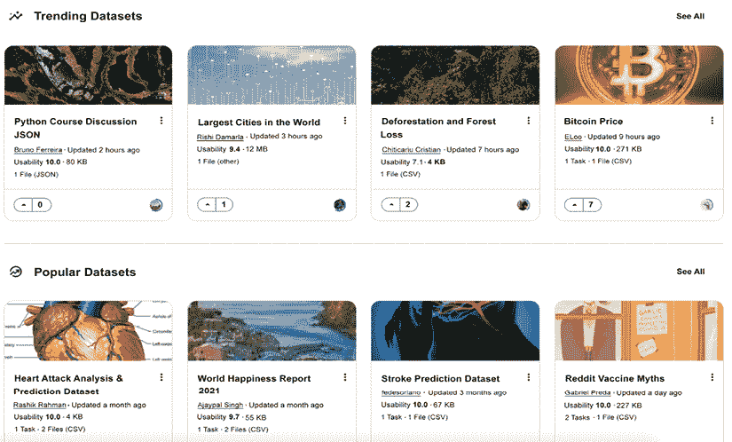
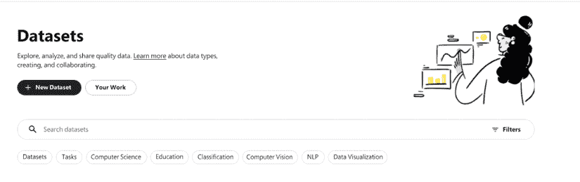
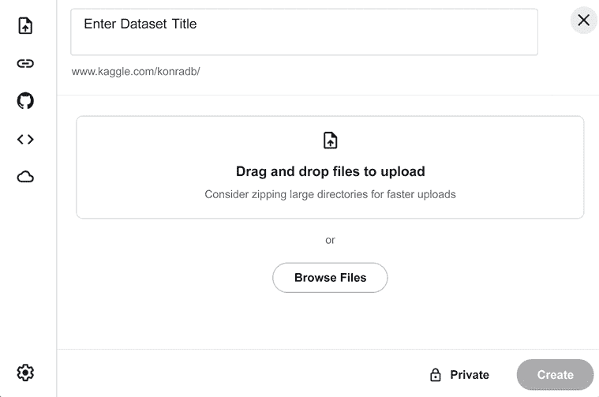
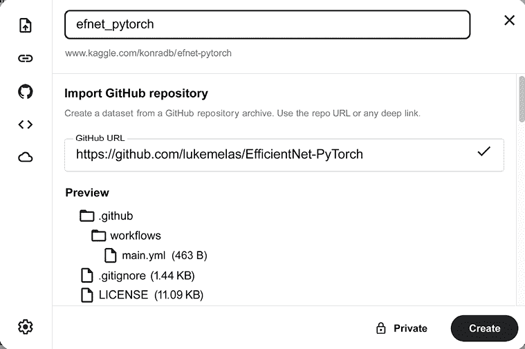
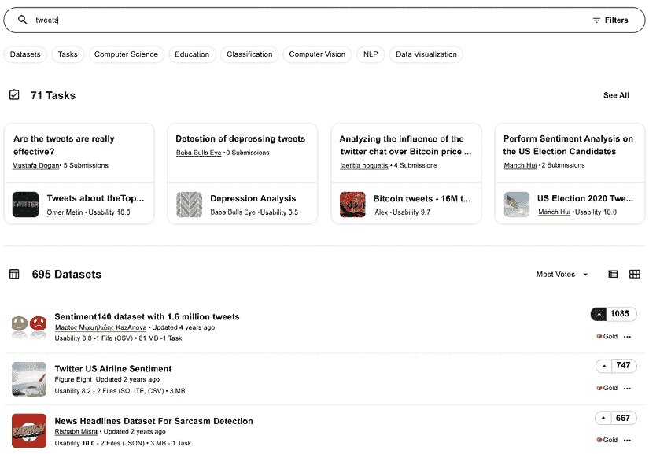
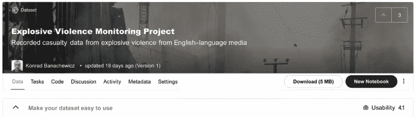
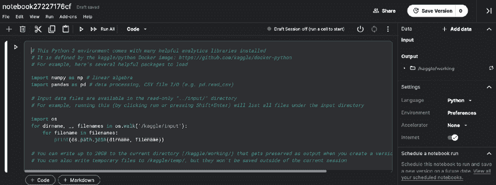
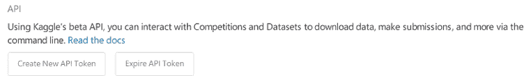
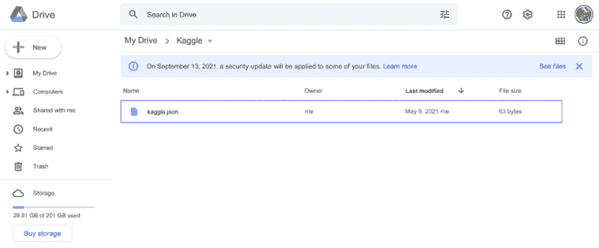
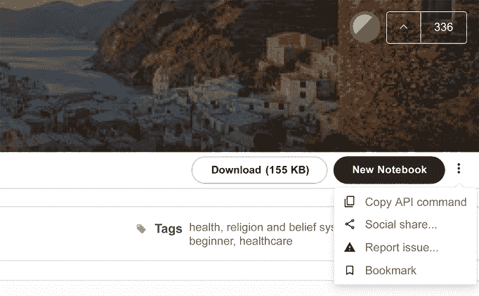

# 二、使用数据集组织数据

在他的故事*铜榉树的冒险*中，阿瑟·柯南道尔拥有福尔摩斯喊的*数据！数据！数据！没有粘土我做不出砖*这种思维模式曾在文学领域为最著名的侦探提供了很好的服务，应该被每个数据科学家所采用。出于这个原因，我们用专门讨论数据的一章开始了本书的技术部分:具体来说，在 Kaggle 上下文中，利用 Kaggle 数据集功能的力量来达到我们的目的。

在本章中，我们将讨论以下主题:

*   设置数据集
*   收集数据
*   使用数据集
*   在 Google Colab 中使用 Kaggle 数据集
*   法律警告

# 设置数据集

原则上，任何你可以使用的数据你都可以上传到 Kaggle(受限制；参见后面的*法律警告*部分)。撰写本文时的具体限制是每个私有数据集**100 GB**和总配额**100 GB**。请记住，每个数据集的大小限制是在未压缩的情况下计算的；上传压缩版本加快了传输速度，但无助于克服限制。您可以通过链接[https://www.kaggle.com/docs/datasets](https://www.kaggle.com/docs/datasets)查看数据集的最新文档。

Kaggle 将自己宣传为“数据科学之家”,该网站上令人印象深刻的数据集无疑为这一说法提供了一定的可信度。你不仅可以找到从油价到动漫推荐等话题的数据，而且数据出现的速度之快也令人印象深刻。当安东尼·福奇的电子邮件在 2021 年 5 月根据信息自由法案被公开后，仅仅 48 小时后，它们就被上传为一个 Kaggle 数据集。



图 2.1:ka ggle 上的趋势和流行数据集

在将项目数据上载到数据集中之前，请确保检查现有内容。对于一些流行的应用(图像分类、NLP、金融时间序列)，它可能已经存储在那里。

为了便于介绍，让我们假设您将在项目中使用的数据类型还不存在，因此您需要创建一个新的数据集。当您进入左侧有三行的菜单并点击**数据**时，您将被重定向至**数据集**页面:



图 2.2:数据集页面

当你点击 **+新数据集**时，你将被提示基本操作:上传实际数据并给它一个标题:



图 2.3:输入数据集细节

左侧的图标对应于可用于数据集的不同来源。我们按照页面上显示的顺序对它们进行描述:

*   从本地驱动器上传文件(如图所示)
*   从远程 URL 创建
*   导入 GitHub 存储库
*   使用现有笔记本中的输出文件
*   导入 Google 云存储文件

关于 GitHub 选项的重要一点是:这个特性对于实验库来说特别方便。虽然经常提供迄今为止不可用的功能，但它们通常不包含在 Kaggle 环境中，因此如果您想在代码中使用这样的库，您可以将其作为数据集导入，如下所示:

1.  转到**数据集**并点击 **+新数据集**。
2.  选择 GitHub 图标。
3.  插入指向存储库的链接，以及数据集的标题。
4.  点击右下方的**创建**:



图 2.4:来自 GitHub 存储库的数据集

在**创建**按钮旁边，还有一个标记为**私有**的按钮。默认情况下，您创建的任何数据集都是私有的:只有您(它的创建者)可以查看和编辑它。最好在数据集创建阶段将此设置保留为默认设置，仅在稍后阶段将其公开(可供选定的参与者列表或所有人使用)。

请记住，Kaggle 是一个受欢迎的平台，许多人上传他们的数据集——包括私人数据集——所以尽量想一个非通用的标题。这将增加你的数据集被注意到的机会。

一旦你完成了所有的步骤，点击**创建**，瞧！您的第一个数据集已经准备好了。然后您可以前往**数据**选项卡:


图 2.5:数据选项卡

上面的屏幕截图演示了您可以提供的关于数据集的不同信息；你提供的越多，T4 可用性指数就越高。这个指数是一个综合指标，它总结了数据集被描述的程度。可用性指数较高的数据集出现在搜索结果的较高位置。对于每个数据集，可用性指数基于几个因素，包括文档水平、相关公共内容(如作为参考的笔记本)的可用性、文件类型和关键元数据的覆盖范围。

原则上，您不必填写上图中显示的所有字段；没有它们，您新创建的数据集是完全可用的(如果它是私有的，您可能不在乎；毕竟你知道里面是什么)。然而，社区礼仪会建议填写您公开的数据集的信息:您指定的越多，数据对其他人就越有用。

# 收集数据

除了法律方面，你可以在数据集中存储的内容种类没有真正的限制:表格数据、图像、文本；如果它符合尺寸要求，您可以存放它。这包括从其他来源获得的数据；在撰写本文时，按标签或主题分类的推文是最受欢迎的数据集:



图 2.6:推文是最流行的数据集之一

讨论从社交媒体(Twitter、Reddit 等)获取数据的不同框架超出了本书的范围。


安德鲁·马拉尼昂

[https://www.kaggle.com/andrewmvd](https://www.kaggle.com/andrewmvd)

我们采访了 Andrew Maranhã(又名 Larxel)，他是数据集大师(撰写本文时数据集排名第一)，也是圣保罗阿尔伯特·爱因斯坦医院的高级数据科学家，谈到了他在数据集上取得成功的过程，他创建数据集的技巧，以及他在 Kaggle 上的一般经历。

你最喜欢哪种比赛，为什么？从技术和解决途径来说，你在 Kaggle 上的特长是什么？

*医学成像通常是我的最爱。这说明了我的目的和工作。在医疗竞赛中，NLP 是受语言限制的，各医院之间的表格数据差异很大，但成像几乎是相同的，因此这方面的任何进步都可以为世界上许多国家带来好处，我喜欢这种影响潜力。我也喜欢 NLP 和表格数据，但我认为这是非常标准的。*

告诉我们你参加的一个特别有挑战性的比赛，以及你用什么样的洞察力来完成这个任务。

*在 x 射线图像结核病检测比赛中，我们有大约 1，000 张图像，这对于捕捉疾病的所有表现来说是一个非常小的数字。我想出了两个主意来抵消这一点:*

1.  *针对肺炎检测的外部数据(~20k 图像)进行预训练，因为肺炎可能会被误认为结核病。*
2.  *对肺部异常的多标签分类进行预训练(~600k 图像)，并使用 grad-CAM 和简单的 SSD 来生成分类标签的边界框注释。*

*最终，这两者的简单组合比第二名团队的成绩高出 22%。这件事发生在一个医学会议上，大约有 100 个团队参加。*

你已经成为数据集大师，并在数据集中排名第一。你如何在 Kaggle 上为你的数据集选择主题、查找、收集和发布数据？

*这是一个大问题；我会试着一点一点地分解它。*

1.  给自己设定一个目标

当选择一个主题时，我首先想到的是我做这件事的原因。

当有更深层次的原因时，伟大的数据集只是结果，而不是目标本身。创造 ImageNet 的实验室负责人费·李非在一次 ted 演讲中透露，她希望创造一个机器能够像她的孩子一样用视觉思考和欣赏世界的世界。

心中有一个目标会让你更有可能参与进来并随着时间的推移而提高，也会让你和你的数据集脱颖而出。你当然可以依靠日常话题的表格数据生活，尽管我发现那不太可能留下持久的影响。

1.  **伟大的数据集是伟大问题的化身**

*如果我们看看当前文献中最大的数据集，如 ImageNet 等，我们可以看到一些共同的主题:*

*   *这是一个大胆的、相关的问题，对我们所有人都有巨大的潜力(科学或现实世界的应用)*
*   *数据收集得很好，质量得到控制，并且有很好的记录*
*   *我们当前的硬件有足够的数据量和多样性*
*   *它有一个活跃的社区，不断改进数据和/或基于该问题*

*正如我之前提到的，我觉得提问是数据科学家的主要角色，随着自动化机器和深度学习解决方案的进步，这一角色可能会变得更加突出。这就是数据集可以锻炼你的技能的地方。*

1.  **为成功创造你的过程，而不是仅仅为了成功而追求成功**

*质量远远盖过数量；你只需要 15 个数据集就能成为大师，人工智能的旗舰数据集很少，而且制作精良。*

我已经扔掉了和我发布的一样多的数据集。这需要时间，也不是像许多人认为的那样一劳永逸——数据集有维护和持续改进的一面。

*一件经常被忽视的事情是支持收集数据的社区。笔记本和数据集是相互的努力，所以支持那些花时间分析你的数据的人对你的数据集也大有帮助。分析它们的瓶颈和选择，可以给出可以完成和提供哪些预处理步骤的方向，以及文档的清晰度。*

总的来说，我建议的流程是从设定你的目标开始，将其分解为目标和主题，制定满足这些主题的问题，调查可能的数据来源，选择和收集，预处理，记录，发布，维护和支持，最后是改进行动。

例如，假设你想增加社会福利；你把它分解成一个目标，比如说，种族平等。从那里，你分析与目标相关的主题，找到黑人的命也是命运动。从这里开始，你可以提出这样一个问题:我如何理解数以百万计的谈论它的声音？

这将您的数据类型缩小到 NLP，您可以从新闻文章、YouTube 评论和推文中收集数据(您可以选择，因为它似乎更能代表您的问题，也更可行)。您对数据进行预处理，删除标识符，并记录收集过程和数据集目的。

完成后，你发布它，一些 Kagglers 尝试主题建模，但很难做到，因为一些 tweets 包含许多外语，这造成了编码问题。你 *通过给他们建议和强调他们的工作来支持他们，并决定回去把推文缩小到英语，以永久解决这个问题。*

他们的分析揭示了与运动相关的需求、动机和恐惧。在他们的努力下，有可能将数百万条推文分解成一系列建议，这些建议可能会改善社会中的种族平等。

4.做好工作是你所能控制的

最终，是其他人让你成为大师，而投票并不总是转化为努力或影响。在我的一个关于赛博朋克 2077 的数据集里，我总共花了大约 40 个小时，直到今天，它仍然是我最不喜欢的数据集之一。

*不过没关系。我付出了努力，我尝试了，我学到了我能学到的——那是我能控制的，下周无论如何我都会再做一次。尽力而为，坚持下去。*

对于数据分析/机器学习，你有什么特别推荐的工具或库吗？

*说来也怪，我同时拥有* *推荐库和不推荐库。LightGBM 是一个很棒的列表式 ML 库，它的性能与计算时间之比非常好，CatBoost 有时会超过它，但这是以增加计算时间为代价的，在此期间，您可以拥有和测试新的想法。Optuna 非常适合超参数调优，Streamlit 适合前端，Gradio 适合 MVP，Fast API 适合微服务，Plotly 和 Plotly Express 适合图表，PyTorch 及其衍生品适合深度学习。*

虽然库很棒，但我也建议你在职业生涯的某个阶段花时间自己实现它。我最初是从吴恩达那里听到这个建议的，后来又从许多能力相当的人那里听到了这个建议。这样做可以创建非常深入的知识，对您的模型做什么以及它如何响应调优、数据、噪声等有新的了解。

以你的经验来看，没有经验的 Kagglers 经常会忽略什么？你现在知道了什么，你希望在你刚开始的时候就知道？

*这些年来，我最希望早点实现的事情是:*

1.  *在比赛结束时吸收所有知识*
2.  *在完成的竞赛中复制获胜的解决方案*

*在比赛接近尾声的压力下，你可以看到排名比以往任何时候都更加晃动。这使得你不太可能去冒险和花时间去看事情的所有细节。当一场比赛结束时，你没有那种匆忙，你需要多长时间都可以；你也可以复制那些公布解决方案的获胜者的基本原理。*

*如果你有纪律，这将为你的数据科学技能创造奇迹，所以底线是:当你完成时停止，而不是当竞赛结束时停止。我还从吴恩达的一个主题演讲中听到了这个建议，他推荐复制论文是他作为人工智能从业者发展自己的最佳方式之一。*

此外，在比赛结束时，你很可能会筋疲力尽，只想收工。那里没问题；请记住，竞赛结束后的论坛是地球上知识最丰富的地方之一，这主要是因为许多获胜方案的基本原理和代码都在那里公开。花时间阅读和研究成功者做了什么；不要屈服于继续做其他事情的愿望，因为你可能会错过一个很好的学习机会。

Kaggle 对你的职业生涯有帮助吗？如果有，如何实现？

Kaggle 通过提供丰富的知识、经验和建立我的投资组合，帮助了我的事业。我作为数据科学家的第一份工作很大程度上是由于 Kaggle 和 DrivenData 的竞赛。在我的职业生涯中，我一直在研究竞赛解决方案，并参与了更多的研究。数据集和笔记本的进一步参与也证明在学习新技术和提出更好的问题方面非常富有成效。

*在我看来，提出伟大的问题是数据科学家面临的主要挑战。回答这些问题当然也很好，尽管我相信我们离自动化解决方案在建模中越来越流行的未来不远了。总会有建模的空间，但我想在这方面会有很多工作被简化。然而，提出好的问题更难自动化——如果问题不好，即使最好的解决方案也可能毫无意义。*

你曾经使用过你在 Kaggle 竞赛中所做的东西来建立你的作品集，并展示给潜在的雇主吗？

绝对是。我在 2017 年获得了我作为数据科学家的第一份工作，使用 Kaggle 作为知识的证明。直到今天，它仍然是一个很棒的简历组成部分，因为教育背景和学位不像投资组合那样代表数据科学知识和经验。

一个包含竞赛项目的投资组合不仅显示了更多的经验，还显示了超越发展的意愿，这对于长期的成功来说更为重要。

你使用其他比赛平台吗？他们和 Kaggle 相比如何？

我也用 DrivenData 和 AICrowd。它们的伟大之处在于，它们允许那些无法获得相同财政资源的组织，比如初创企业和研究机构，去创造竞赛。

伟大的竞赛来自伟大的问题和伟大的数据的结合，无论公司规模如何，这都可能发生。Kaggle 有更大更活跃的社区，他们提供的 *硬件，再加上数据和笔记本能力，使其成为最佳选择；然而，DrivenData 和 AICrowd 都引入了同样有趣的挑战，并允许更多的多样性。*

当一个人参加比赛时，他应该记住或做的最重要的事情是什么？

*假设你的主要目标是发展，我建议你选择一个你感兴趣的主题和一个你以前没有做过的任务。批判意识和能力需要深度和多样性。专注和全力以赴将保证深度，而多样性是通过做你以前没有做过或没有以同样方式做过的事情来实现的。*

# 使用数据集

一旦创建了一个数据集，您可能想在您的分析中使用它。在本节中，我们将讨论实现这一目标的不同方法。

很可能，最重要的一个是开始一个笔记本，在那里你使用你的数据集作为主要来源。您可以转到数据集页面，然后点击**新笔记本**来完成此操作:



图 2.7:从数据集页面创建笔记本

完成后，您将被重定向至您的**笔记本**页面:



图 2.8:使用数据集启动笔记本

这里有一些关于这一点的建议:

*   字母数字标题自动生成；你可以点击它进行编辑。
*   在右侧的**数据**下，您会看到笔记本附带的数据源列表；我选择的数据集可以在`../input/`下或从`/kaggle/input/`访问。
*   开始块(带有导入的包、描述性注释和打印可用文件列表)被自动添加到一个新的 Python 笔记本中。

有了这个基本设置，您就可以开始为您的分析编写一个笔记本，并利用您的数据集作为数据源。我们将在*第 4 章*、*利用论坛*更详细地讨论笔记本。

# 在 Google Colab 中使用 Kaggle 数据集

Kaggle 笔记本可以免费使用，但并非没有限制(更多信息请见第四章*),你最有可能遇到的就是时间限制。一个流行的选择是转移到 Google Colab，一个完全在云中运行的免费 Jupyter 笔记本环境:https://colab.research.google.com。*

即使我们将计算转移到那里，我们可能仍然希望访问 Kaggle 数据集，因此将它们导入 Colab 是一个相当方便的功能。本节的剩余部分将讨论通过 Colab 使用 Kaggle 数据集的必要步骤。

假设我们已经在 Kaggle 上注册，我们要做的第一件事是前往帐户页面生成 **API 令牌**(一个包含登录会话的安全凭证、用户标识、特权等的访问令牌):

1.  转到您的账户，可以在`https://www.kaggle.com/USERNAME/account`找到，点击**创建新的 API 令牌**:



图 2.9:创建新的 API 令牌

将创建一个名为 kaggle.json 的文件，其中包含您的用户名和令牌。

1.  下一步是在你的 Google Drive 中创建一个名为`Kaggle`的文件夹，并将`.json`文件上传到那里:



图 2.10:上传。json 文件到 Google Drive

1.  完成后，您需要创建一个新的 Colab 笔记本，并通过在笔记本中运行以下代码来安装您的驱动器:

    ```
    from google.colab import drive  drive.mount('/content/gdrive') 
    ```

2.  从 URL 提示符中获取授权代码，并在出现的空框中提供它，然后执行下面的代码来提供到`.json`配置的路径:

    ```
    import os  # content/gdrive/My Drive/Kaggle is the path where kaggle.json is   # present in the Google Drive  os.environ['KAGGLE_CONFIG_DIR'] = "/content/gdrive/My Drive/Kaggle"  # change the working directory  %cd /content/gdrive/My Drive/Kaggle  # check the present working directory using the pwd command 
    ```

3.  我们现在可以下载数据集了。首先转到 Kaggle 上的数据集页面，点击**新笔记本**旁边的三个点，并选择**复制 API 命令**:



图 2.11:复制 API 命令

1.  运行 API 命令下载数据集(对使用的命令细节感兴趣的读者可以参考官方文档:【https://www.kaggle.com/docs/api】的[:

    ```
    !kaggle datasets download -d ajaypalsinghlo/world-happiness-report-2021 
    ```](https://www.kaggle.com/docs/api) 
2.  数据集将作为`.zip`档案下载到`Kaggle`文件夹中——解压后就可以使用了。

从上面的列表中可以看出，在 Colab 中使用Kaggle 数据集是一个简单的过程——您所需要的只是一个 API 令牌，进行切换可以让您使用比 ka ggle 所允许的更多的 GPU 时间。

# 法律警告

仅仅因为你可以在 Kaggle 上放一些数据并不一定意味着你应该这样做。一个很好的例子就是 Tinder dataset 的*人。2017 年，一名开发者使用 Tinder API 从网站上抓取半私人资料，并将这些数据上传到 Kaggle 上。这个问题曝光后，Kaggle 最终关闭了数据集。你可以在这里阅读全文:[https://www . Forbes . com/sites/janetwburns/2017/05/02/tinder-profiles-have-have-have-being-this-time-for-teaching-ai-to-gender ize-faces/？sh=1afb86b25454](https://www.forbes.com/sites/janetwburns/2017/05/02/tinder-profiles-have-been-looted-again-this-time-for-teaching-ai-to-genderize-faces/?sh=1afb86b25454) 。*

一般来说，在你上传任何东西到 Kaggle 之前，问自己两个问题:

1.  从版权角度来看，这是允许的吗？记得经常检查许可证。如有疑问，您可以随时咨询[https://opendefinition.org/guide/data/](https://opendefinition.org/guide/data/)或联系 Kaggle。
2.  **该数据集是否存在隐私风险？仅仅因为发布某些类型的信息严格来说不违法，这样做可能会损害他人的隐私。**

这些限制符合常识，所以它们不太可能妨碍你在 Kaggle 上的努力。

# 摘要

在本章中，我们介绍了 Kaggle 数据集，这是在平台中存储和使用数据的标准化方式。我们讨论了数据集的创建，在 Kaggle 之外工作的方法，以及最重要的功能:在笔记本中使用数据集。这为我们的下一章提供了一个很好的引子，在下一章，我们将把注意力集中在 Kaggle 笔记本上。

# 加入我们书的不和谐空间

加入这本书的 Discord workspace，每月与作者进行一次*向我提问*会议:

【https://packt.link/KaggleDiscord】

