# 三、使用 Kaggle 笔记本工作和学习

Kaggle 笔记本——直到最近还被称为**内核**——是浏览器中的 Jupyter 笔记本，可以免费运行。这意味着你可以在任何有网络连接的设备上进行实验，尽管比手机大的东西可能是个好主意。该环境的技术规范(截至撰写本文时)引自 Kaggle 网站；最新版本可在[https://www.kaggle.com/docs/notebooks](https://www.kaggle.com/docs/notebooks)验证:

*   CPU/GPU 的执行时间为 12 小时，TPU 为 9 小时
*   20 千兆字节的自动保存的磁盘空间(`/kaggle/working`)
*   在当前会话之外不会保存的额外暂存磁盘空间(在`/kaggle/working`之外)

**CPU 规格:**

*   4 个 CPU 内核
*   16 千兆字节的内存

**GPU 规格:**

*   2 个 CPU 内核
*   13 千兆字节的内存

**TPU 规格:**

*   4 个 CPU 内核
*   16 千兆字节的内存

在本章中，我们将讨论以下主题:

*   设置笔记本
*   运行您的笔记本
*   将笔记本保存到 GitHub
*   充分利用笔记本
*   Kaggle 学习课程

事不宜迟，让我们开始吧。我们需要做的第一件事是弄清楚如何设置一个笔记本。

# 设置笔记本

创建笔记本有两种主要方法:从首页或从数据集。

要继续第一种方法，请转到[https://www.kaggle.com/](https://www.kaggle.com/)的登录页面左侧菜单的**代码**部分，并点击 **+新笔记本**按钮。如果您计划进行一项涉及上传您自己的数据集的实验，这是首选方法:

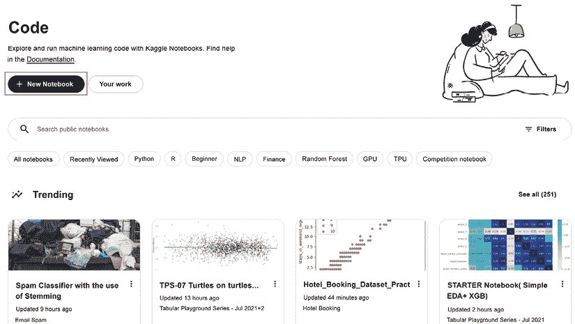

图 3.1:从代码页创建一个新的笔记本

或者，您可以转到您感兴趣的数据集页面，并单击那里的**新笔记本**按钮，正如我们在前一章中看到的:

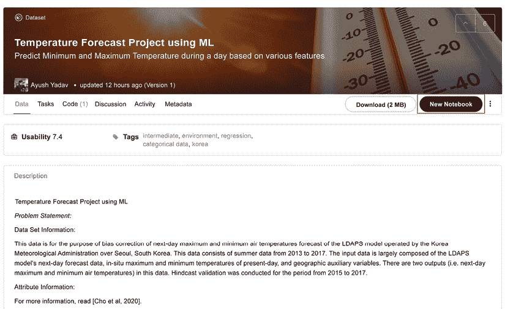

图 3.2:从数据集页面创建新的笔记本

无论您选择哪种方式，点击**新建笔记本**后，您将被带到您的**笔记本**页面:

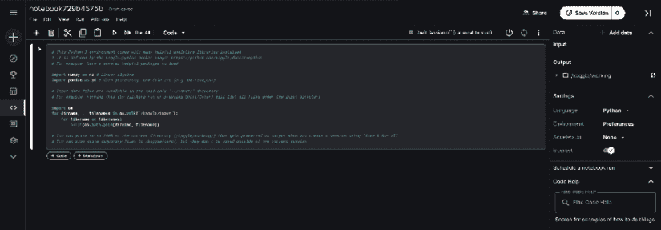

图 3.3:笔记本页面

在上面显示的新**笔记本**页面的右侧，我们有许多可以调整的设置:

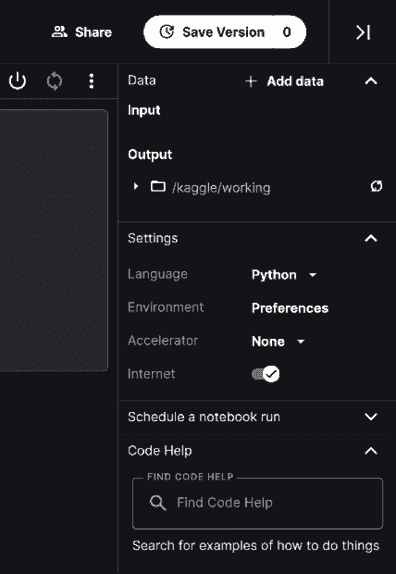

图 3.4:笔记本选项

我们将简单讨论一下设置。首先是编码**语言**。截至本文撰写之时，Kaggle 环境只允许 Python 和 R 作为编写笔记本的可用选项。默认情况下，新笔记本的初始化语言设置为 Python——如果您想使用 R，点击下拉菜单并选择 **R** 。

接下来是**环境**:这个开关允许你决定是否总是使用最新的 Docker 环境(风险选项；快速获得更新，但依赖关系可能会随着未来的更新而中断)或者将笔记本固定到 Kaggle 提供的环境的原始版本(安全的选择)。后一个选项是默认选项，除非您正在进行非常活跃的开发工作，否则没有真正的理由去修改它。

**加速器**允许用户选择如何运行代码:在 CPU 上(无加速)，在 GPU 上(几乎任何涉及深度学习的严肃应用都需要)，或者在 TPU 上。请记住，从 CPU 转移到(单个)GPU 只需要对代码进行最少的更改，并且可以通过系统设备检测来处理。

将您的代码迁移到 TPU 需要更精细的重写，从数据处理开始。要记住的重要一点是，当您在笔记本上工作时，可以在 CPU/GPU/TPU 之间切换，但每次这样做时，环境都会重新启动，您需要从头开始运行所有代码。

最后，我们有**互联网**开关，可以启用或禁用在线访问。例如，如果您已连接并需要安装额外的软件包，依赖项的下载和安装将在后台自动进行。需要明确禁用互联网访问的最常见情况是，提交参赛作品时明确禁止在线访问。

使用笔记本的一个重要方面是，你可以随时拿一个现有的(由你自己或另一个 Kaggler 创建的)并克隆它来修改和调整以适应你的需要。这可以通过点击笔记本页面右上角的**复制和编辑**按钮来实现。在卡格尔的说法中，这个过程被称为**分叉**:

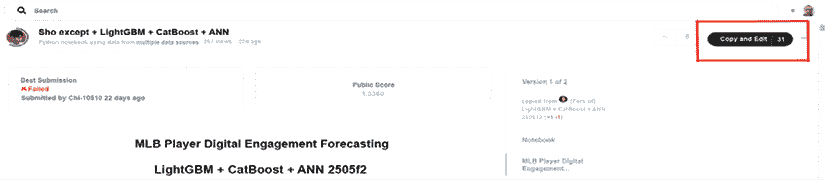

图 3.5:派生现有笔记本

**礼仪注意事项**:如果你以前参加过 Kaggle 比赛，你可能会注意到排名上充斥着得分好的笔记本的叉子的叉子。在别人的工作基础上进行创作没有错——但如果你这样做了，记得投票支持原作者，并明确表扬参考作品的创作者。

默认情况下，您创建的笔记本是私有的(仅对您可见)。如果您想让其他人可以使用它，您可以选择添加协作者，以便只有明确添加到列表中的用户才能查看或编辑内容，或者将笔记本公开，在这种情况下，每个人都可以看到它。

# 运行您的笔记本

所有的编码都完成了，笔记本看起来工作正常，你可以开始执行了。为此，请转到笔记本页面的右上角，点击**保存版本**。

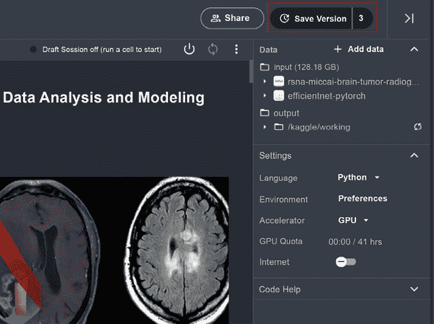

图 3.6:保存您的脚本

**保存&运行全部**通常用于执行脚本，但也有一个**快速保存**选项，可用于在准备提交之前保存脚本的中间版本:

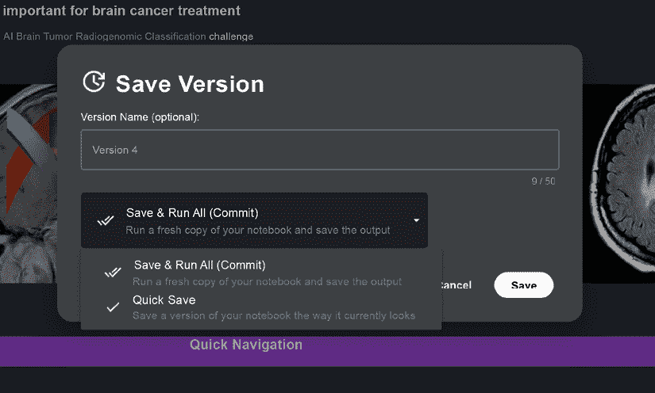

图 3.7:保存版本的不同选项

一旦您启动了您的脚本，您可以前往左下角并点击**活动事件**:

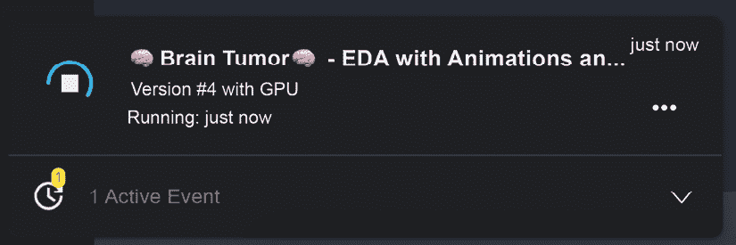

图 3.8:监控活动事件

通过这种方式，您可以监控笔记本的行为。正常执行与消息**运行**相关联；否则显示为**失败**。如果您出于某种原因决定终止正在运行的会话(例如，您意识到您忘记使用最近的数据)，您可以通过单击**活动事件**下脚本条目右侧的三个点来完成，您将收到一个弹出窗口，如下图所示:

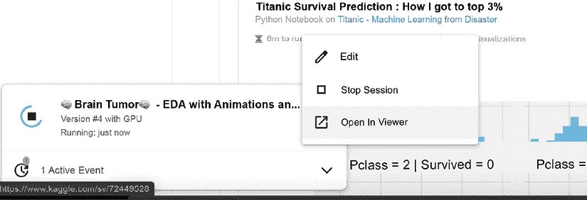

图 3.9:取消笔记本执行

# 将笔记本保存到 GitHub

最近推出的一个功能(见[https://www.kaggle.com/product-feedback/295170](https://www.kaggle.com/product-feedback/295170))允许你将你的代码或笔记本存储到版本控制库 GitHub([https://github.com/](https://github.com/))。您可以将您的工作存储到公共和私有存储库中，这将在您保存代码版本时自动发生。这样一个功能对于与你的 Kaggle 队友分享你的作品，以及向更广泛的公众展示你的作品是非常有用的。

为了启用此功能，您需要打开笔记本；在**文件**菜单中，选择**链接到 GitHub** 选项。

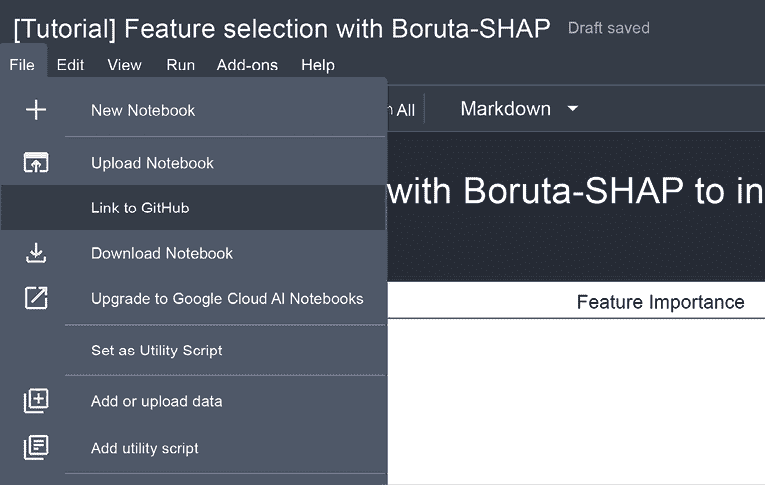

图 3.10:启用 GitHub 特性

在选择选项后，你必须将你的 GitHub 账号链接到笔记本。第一次选择链接时，会明确要求您提供链接权限。对于新笔记本的任何后续链接，该操作将自动执行。

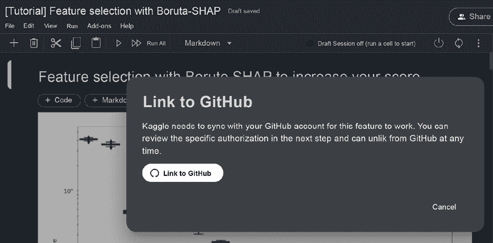

图 3.11:链接到 GitHub

只有在链接您的笔记本后，您才可以在保存工作时将其同步到您选择的存储库:

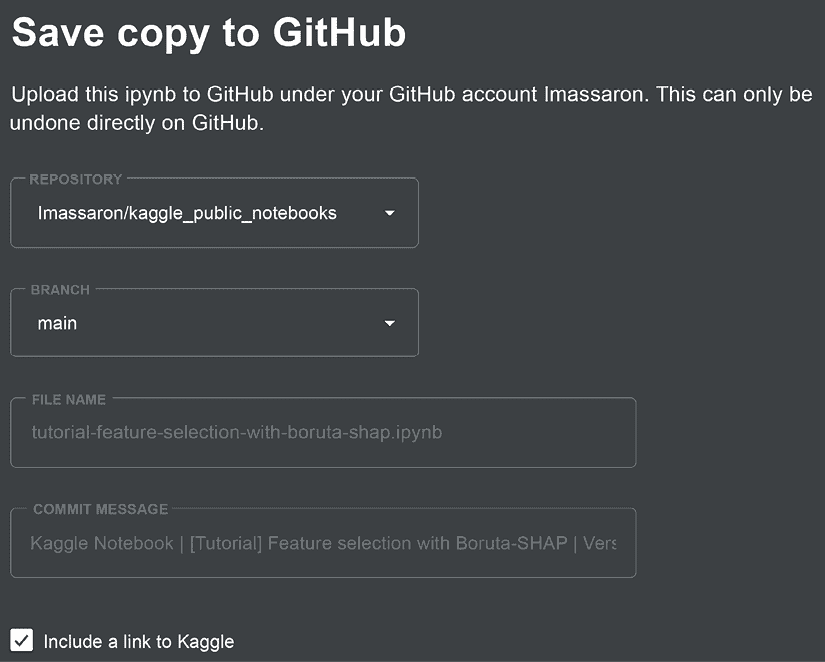

图 3.12:将您的工作提交给 GitHub

在决定了存储库和分支上的(从而允许您存储工作的不同开发阶段)之后，您可以更改您将要推送到存储库的文件的名称，并修改提交消息。

如果你决定不再想在 GitHub 上同步某个特定的笔记本，你所要做的就是回到**文件**菜单，选择**解除与 GitHub** 的链接。最后，如果你想让 Kaggle 停止与你的 GitHub 库连接，你可以从**我的链接账户**下的 Kaggle 账户页面或者 GitHub 的设置页面([https://github.com/settings/applications](https://github.com/settings/applications))取消你的账户链接。

# 充分利用笔记本

Kaggle 免费提供一定数量的资源，配额每周重置。你有一定的时间可以同时使用 GPU 和 GPU 对于 TPU 来说是 30 个小时，但是对于 GPU 来说，这个数字可能每周都不同(你可以在这里找到描述“浮动”配额政策的官方声明:[https://www.kaggle.com/product-feedback/173129](https://www.kaggle.com/product-feedback/173129))。您可以随时在自己的个人资料中监控您的使用情况:

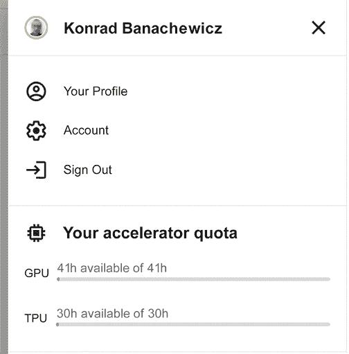

图 3.13:加速器配额的当前状态

虽然乍一看这些金额似乎很大，但这种最初的印象可能具有欺骗性；很快用完你的配额其实是相当容易的。一些实用的建议可以帮助您控制资源的使用:

*   当你**初始化**你的笔记本时，配额计数器(测量你使用你选择的加速器、GPU 或 TPU 的时间)开始运行。
*   这意味着你应该总是从检查设置下的 GPU 是否被禁用开始(参见上面的*图 3.6* )。首先编写样板文件，检查语法，并在添加实际依赖于 GPU 初始化的代码部分时启用/禁用 GPU。一个提醒:换加速器笔记本会重启。
*   在一小部分数据上端到端地运行代码来感受执行时间通常是一个好主意。通过这种方式，您可以最大限度地降低代码因超出此限制而崩溃的风险。

有时，Kaggle 免费提供的资源不足以完成手头的任务，你需要转移到更强大的机器上。最近的一次肿瘤分类比赛就是一个很好的例子:[https://www . ka ggle . com/c/rsna-miccai-brain-tumor-radio genomic-class ification/data](https://www.kaggle.com/c/rsna-miccai-brain-tumor-radiogenomic-classification/data)。

如果原始数据超过 100GB，则需要调整图像大小/缩减图像采样(这可能会对模型性能产生不利影响)，或者在能够处理高分辨率图像的环境中训练模型。您可以自己设置整个环境(这种设置的一个例子是在第 2 章的*中使用 Google Colab* 中的*部分)，或者您可以留在笔记本的框架内，但交换底层机器。这就是谷歌云 AI 笔记本的用武之地。*

## 升级到谷歌云平台(GCP)

升级到 GCP 的明显好处是获得更强大的硬件:特斯拉 P100 GPU(由 Kaggle 免费提供)对于许多应用来说是不错的，但在性能方面不是顶级的，16GB RAM 也可能相当有限，特别是在大型 NLP 模型或高分辨率图像处理等资源密集型应用中。虽然执行时间的改进是显而易见的，导致开发周期中更快的迭代，但这是有代价的:您需要决定您准备花费多少。对于一台处理数据的强大机器来说，时间就是金钱。

为了将您的笔记本迁移到 GCP 环境，请转到右侧的边线菜单，然后单击**升级到谷歌云人工智能笔记本**:

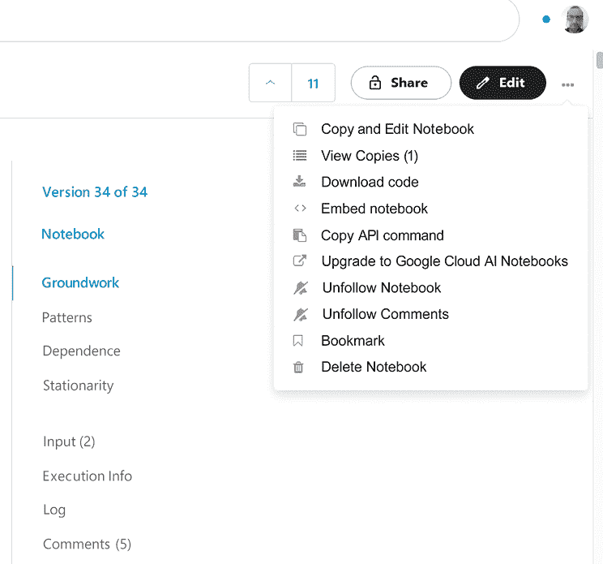

图 3.14:升级到谷歌云人工智能笔记本选项

您将看到以下提示:

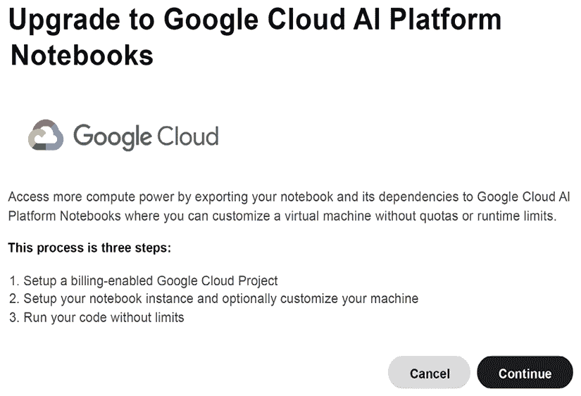

图 3.15:升级到谷歌云 AI 平台笔记本提示

当您点击**继续**时，您将被重定向至谷歌云平台控制台，在这里您需要配置您的付费选项。提醒一下: **GCP 不自由。如果这是你的第一次，你需要完成一个指导你完成必要步骤的教程。**

## 超越一步

正如本章前面提到的，Kaggle 笔记本是教育和参加比赛的绝佳工具；但它们还有另一个非常有用的用途，即作为投资组合的一部分，你可以用来展示你的数据科学技能。

在构建您的数据科学组合时，有许多潜在的标准需要考虑(品牌、受众范围、向您的潜在雇主推销等)，但如果没有人能找到这些标准，这些标准都无关紧要。因为 Kaggle 是谷歌的一部分，笔记本被世界上最流行的搜索引擎编入索引；因此，如果有人正在寻找与您的代码相关的主题，它会显示在他们的搜索结果中。

下面，我举一个个人的例子:几年前，我为一个比赛写了一个笔记本。我想解决的问题是对抗性验证(对于那些不熟悉这个主题的人来说:一个相当简单的方法来看看你的训练集和测试集是否有相似的分布，就是构建一个二进制分类器来区分它们；这个概念在*第 6 章*、*设计良好验证*中有更详细的介绍。在写这一章的时候，我试着搜索笔记本，你瞧，它在搜索结果中显示得很高(注意，我在查询中没有提到 Kaggle 或任何个人信息，比如我的名字):

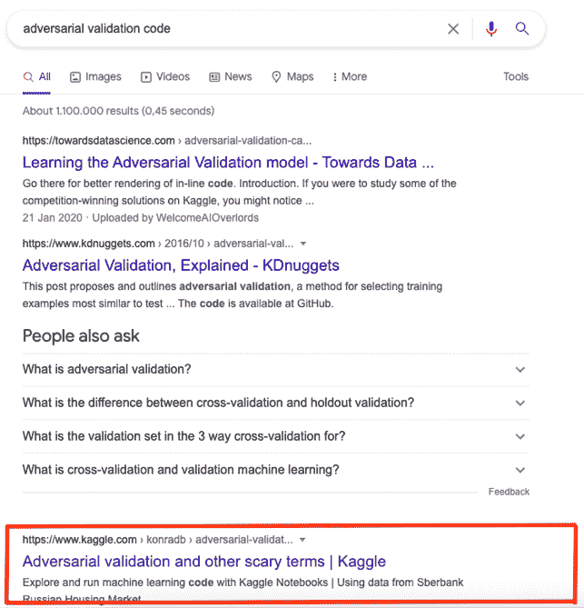

图 3.16:康拉德的笔记本出现在谷歌上

继续使用笔记本来展示你的技能组合的其他好处:就像**竞赛**、**数据集**和**讨论**、**笔记本**可以获得投票/奖牌，从而确定你在进步系统和排名中的位置。你可以远离竞赛的轨道，通过专注于社区欣赏的高质量代码，成为专家、大师或特级大师。

最新版本的进展要求可在[https://www.kaggle.com/progression](https://www.kaggle.com/progression)找到；下面我们给出了与专家层和主层相关的快照:

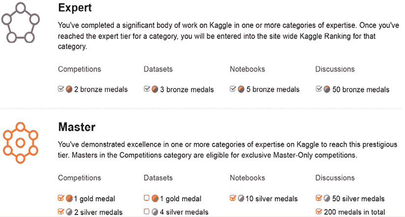

图 3.17:层级递进要求

在笔记本类别中取得进展可能是一次富有挑战性的经历；虽然比竞赛容易，但肯定比讨论难。最受欢迎的笔记本是那些与特定竞赛相关的笔记本:探索性数据分析、端到端概念验证解决方案，以及排名追逐；不幸的是，人们通常会克隆得分最高的公共笔记本，调整一些参数以提高得分，并发布它以获得广泛好评(如果 upvotes 可以被视为情绪的衡量标准的话)。这并不意味着阻止读者在 Kaggle 上发表高质量的作品——大多数 Kagglers 确实欣赏小说作品，从长远来看，质量确实占优势——但对预期的现实调整是必要的。

你的 Kaggle 个人资料拥有追随者，让你有可能链接其他职业网络，如 LinkedIn 或 GitHub，因此你可以利用你在社区内获得的联系:

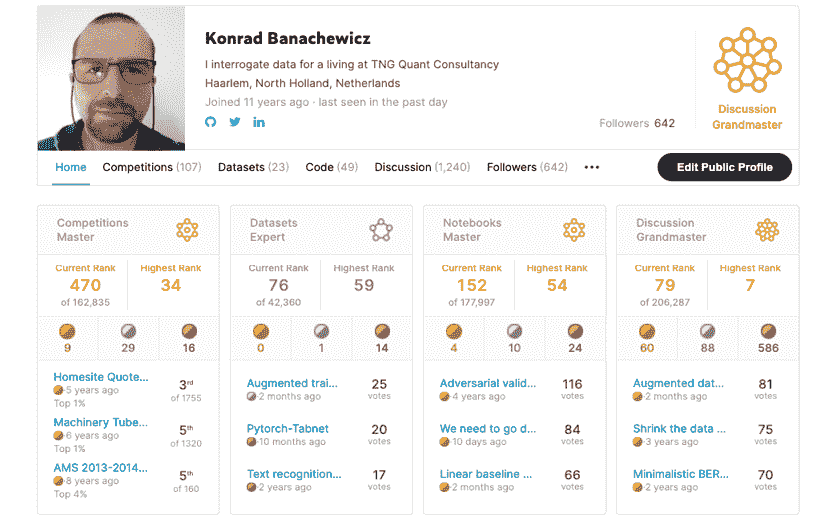

图 3.18:康拉德的 Kaggle 简介

在这个时代，人们很容易对“社区建设”的说法持怀疑态度，但在 Kaggle 的案例中，这恰好是真的。他们的品牌认知度在数据科学领域首屈一指，无论是从业者还是真正做足功课的招聘人员都是如此。在实践中，这意味着一个(足够体面的)Kaggle 个人资料已经可以让你进门了；众所周知，这往往是最困难的一步。

马丁·亨策

[https://www.kaggle.com/headsortails](https://www.kaggle.com/headsortails)

我们有幸与 Martin Henze(又名正面或反面)交谈，他是笔记本和讨论领域的 Kaggle 大师，也是爱迪生软件公司的数据科学家。马丁也是《每周 T21 笔记本:隐藏的宝石》的作者，这是一本每周收集的逃避公众注意的最好的笔记本。你可以通过关注他的 Kaggle 个人资料或他在 Twitter 和 LinkedIn 上的账户来获得关于新的隐藏宝石帖子的通知。

你最喜欢哪种比赛，为什么？就技术和解决方法而言，你在 Kaggle 上的专长是什么？

*很长一段时间，我关注的是 EDA(探索性数据分析)笔记本，而不是排名预测本身。在 Kaggle 之前，我的大部分经验都是关于表格数据的，我的大部分 EDA 笔记本都处理从新推出的表格挑战中提取复杂的见解。我仍然认为这是我在 Kaggle 上的专长，我已经花了大量的时间来精心设计我的笔记本的结构、数据可视化和讲故事。*

你是如何对待一场 Kaggle 比赛的？这种方法与你在日常工作中的做法有什么不同？

即使 Kaggle 已经脱离了表格竞赛，我仍然坚信数据本身是任何挑战中最重要的方面。很容易过早地关注模型架构和超参数调优。但在许多比赛中，成功的关键仍然是以数据为中心的方法，这种方法建立在对数据集及其怪癖和特性的详细了解之上。对于图像数据、NLP、时间序列以及你能想到的任何其他数据结构都是如此。因此，我总是先从广泛的 EDA 开始，然后构建一个简单的基线模型，一个 CV 框架，然后慢慢迭代这个管道的复杂性。

*与我的数据科学日常工作相比，主要的区别可能是，大多数有经验的人能够在新挑战的第一周内建立的基线模型被认为足以投入生产。在许多情况下，在最初的几天之后，就评分标准而言，我们已经有超过 80%的人找到了最终赢家的解决方案。当然，Kaggle 的乐趣和挑战是找到创造性的方法来获得最后的百分之几，比如说，准确性。但在行业工作中，你的时间通常更有效地花在处理新项目上。*

Kaggle 对你的职业生涯有帮助吗？如果有，如何实现？

*卡格尔极大地塑造和支持了我的职业生涯。在 Kaggle 社区的美好经历促使我从学术界转向工业界。今天，我在一家科技初创公司担任数据科学家，我通过 Kaggle 挑战不断成长和磨练自己的技能。*

对我来说，我专注于构建大量的 Kaggle 笔记本对我帮助很大，因为我可以很容易地将它们用作我的作品集。我不知道招聘经理会多久看一次这些资源，但我经常有这样的印象，我的硕士头衔可能比我的博士学位打开了更多的大门。或者可能是两者的结合。在任何情况下，我都非常推荐拥有一个公共笔记本的文件夹。此外，在我找工作的过程中，我将我在 Kaggle 上学到的策略用于各种带回家的任务，它们很好地服务了我。

以你的经验来看，没有经验的 Kagglers 经常会忽略什么？你现在知道了什么，你希望在你刚开始的时候就知道？

*我认为我们都是在经历中不断成长的* *。我们现在都比十年前、五年前甚至一年前更聪明。这样一来，一个经常被忽视的重要方面是，你想要对你正在做的事情有一个计划，并执行和记录这个计划。对于新的 Kagglers 来说，这是一个完全可以理解的错误，因为一切都是新奇和复杂的，至少有些令人困惑。我知道当我第一次加入的时候 Kaggle 让我很困惑。你可以做很多事情:论坛、数据集、挑战、课程。竞赛可能是完全令人生畏的:*神经元细胞实例分割；股市波动预测*。那些东西到底是什么？但是比赛也是最好的起点。*

因为当一场比赛开始时，没有人真正了解它。是的，也许有一个人已经完成了几乎相同主题的博士学位。但是那些很少见。其他人，我们几乎都是从零开始。挖掘数据，玩损失函数，运行一些简单的入门模型。当你开始参加比赛时，作为社区的一员，你会以一种加速的方式经历所有的学习曲线。你可以和那些能给你提供大量想法的人一起学习。但是你仍然需要一个计划。

这个计划很重要，因为很容易盲目地运行一些实验，看到所有的 GPU RAM 都被使用，并对此感觉良好。但是你忘了你的模型的哪个版本做得最好，本地验证和排名之间有关联吗？我已经测试过这个参数组合了吗？所以写下你要做的事情，然后记录结果。有越来越多的工具为您记录日志，但这也可以通过自定义脚本轻松完成。

*机器学习在很大程度上仍然是一门实验科学，高效实验的关键是做好计划，并写下所有结果，以便你可以比较和分析它们。*

你在过去的比赛中犯过什么错误？

我犯了很多 *错误，我希望我能从中吸取教训。没有一个健壮的交叉验证框架就是其中之一。不考虑训练和测试之间的差异。做太多的 EDA 而忽略了模型构建——这可能是我在最初几场比赛中犯的标志性错误。做得不够，错过了一些重要的事情——是的，也是这样。没有选择我的最后两个提交。(最后没什么区别，但我还是不会再忘记了。)*

然而，关于错误的观点与我之前关于实验和制定计划的观点相似。如果你能从错误中学习，如果错误能帮助你成长和进步，那么错误是好的。你仍然想避免犯那些可以通过预见避免的容易的错误。但是在机器学习(和科学！)失败是这个过程的一部分。不是所有的事情都会一直有效。这很好。但是你不想一次又一次地犯同样的错误。所以唯一真正的错误是没有从错误中吸取教训。Kaggle 比赛如此，生活中也是如此。

对于数据分析或机器学习，你有什么特别推荐的工具或库吗？

我知道我们越来越生活在一个 Python 的世界里，但是当谈到表格争论和数据可视化时，我仍然更喜欢 R 和它的 tidyverse: dplyr、ggplot2、lubridate 等等。新的 tidymodels 框架是 sklearn 的有力竞赛者。即使你是一个死忠的 Python 爱好者，偶尔看看熊猫和朋友以外的东西也是值得的。不同的工具往往会导致不同的观点和更多的创造力。在深度学习方面，我发现 PyTorch 最直观的是它的 FastAI 界面。当然，现在每个人都喜欢拥抱脸；而且理由很充分。

当一个人参加比赛时，他应该记住或做的最重要的事情是什么？

*最重要的* *事情就是要记得去玩，去学东西。比赛期间和比赛结束后，人们分享了如此多有价值的见解和智慧，如果不从中汲取和成长，那将是一种耻辱。即使你唯一关心的事情是获胜，你也只能通过学习和尝试，站在这个社区的肩膀上来实现。但是 Kaggle 比排名有更多的东西，一旦你开始贡献和回馈社区，你将会以一种更加全面的方式成长。我保证。*

# Kaggle 学习课程

关于 Kaggle 的很多事情都是关于获取知识的。无论是你在竞赛中学到的东西，还是你在不断增长的知识库中找到的数据集，或者是一个迄今未知的模型类的演示，总有一些新的东西需要发现。这个收藏的最新成员是在 https://www.kaggle.com/learn 标签下收集的课程。这些微型课程由 Kaggle 营销为“获得独立数据科学项目所需技能的最快方式”，核心统一主题是跨各种主题的速成课程介绍。每门课都分成小章节，后面是编码练习题。这些课程是用笔记本来讲授的，其中一些必要的理论和阐述与你需要自己编码和实现的部分混合在一起。

下面，我们提供了最有用的工具的简要概述:

*   **Intro to ML/Intermediate ML**: [https://www.kaggle.com/learn/intro-to-machine-learning](https://www.kaggle.com/learn/intro-to-machine-learning) and [https://www.kaggle.com/learn/intermediate-machine-learning](https://www.kaggle.com/learn/intermediate-machine-learning)

    这两个课程最好被视为两部分:第一部分介绍机器学习中使用的不同类别的模型，接下来是对不同模型的共同主题的讨论，如欠拟合/过拟合或模型验证。第二个更深入到特征工程，处理缺失值和分类变量。对刚开始 ML 旅程的人有用。

*   **pandas**: [https://www.kaggle.com/learn/pandas](https://www.kaggle.com/learn/pandas)

    这门课程提供了现代数据科学中使用的最基本工具之一的速成介绍。您首先学习如何创建、读取和写入数据，然后继续学习数据清理(索引、选择、组合、分组等)。对初学者(pandas 的功能有时会让人不知所措)和从业者(作为复习/参考)都有用。

*   **Game AI**: [https://www.kaggle.com/learn/intro-to-game-ai-and-reinforcement-learning](https://www.kaggle.com/learn/intro-to-game-ai-and-reinforcement-learning)

    本课程是 Kaggle 在学习模块中介绍的课程中以技术为中心的部分的完美总结。您将编写一个游戏代理，修改它的性能，并使用 minimax 算法。*这可能最好被看作是强化学习的实践导向介绍*。

*   **Machine Learning Explainability**: [https://www.kaggle.com/learn/machine-learning-explainability](https://www.kaggle.com/learn/machine-learning-explainability)

    构建模型很有趣，但在现实世界中，并不是每个人都是数据科学家，所以你可能会发现自己需要向他人解释你做了什么。这就是这个关于模型可解释性的迷你课程的用武之地:你将学会用三种不同的方法评估你的特征有多相关:排列重要性、SHAP 和部分依赖图。*对任何在商业环境中与 ML 一起工作的人都非常有用，在商业环境中，项目的生死取决于信息传达得如何。*

*   **AI Ethics**: [https://www.kaggle.com/learn/intro-to-ai-ethics](https://www.kaggle.com/learn/intro-to-ai-ethics)

    这最后一门课程是对命题的一个非常有趣的补充:它讨论了指导人工智能系统道德设计的实用工具。您将学习如何识别人工智能模型中的偏见，检查人工智能公平的概念，并找出如何通过交流 ML 模型信息来增加透明度。*对从业者非常有用，因为“负责任的人工智能”是一个我们会越来越多地在*中听到的短语。

除了 Kaggle 创建的原创内容，平台上还有其他通过用户创建的笔记本提供的学习机会；鼓励读者自己去探索它们。

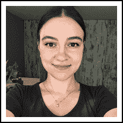

安德拉达·奥尔特亚努

[https://www.kaggle.com/andradaolteanu](https://www.kaggle.com/andradaolteanu)

Andrada Olteanu 是 Kaggle 笔记本大师之一，他非常鼓励从笔记本中学习。Andrada 是 Z by HP 全球数据科学大使、Endava 的数据科学家和 Weights&bias 的开发专家。我们采访了安德拉达，了解她的笔记本竞赛、职业生涯以及更多内容。

你最喜欢哪种比赛，为什么？从技术和解决途径来说，你在 Kaggle 上的特长是什么？

*我想说我在 Kaggle 上的专长更倾向于数据可视化，因为它使我能够将艺术和创造力与数据结合起来。*

我不会说我有最喜欢的竞赛类型，但我宁愿说我喜欢偶尔改变一下，选择我觉得有趣的。

*ka ggle 的魅力在于，人们可以学习数据科学的多个领域(计算机视觉、NLP、探索性数据分析和统计、时间序列等)，同时还可以熟悉和熟悉许多主题(如体育、医疗领域、金融和加密货币、全球事件等)。)*

另一件很棒的事情是，例如，如果一个人想要更熟练地处理文本数据，那么几乎总是会有一个需要 NLP 的 Kaggle 竞赛。或者，如果你想学习如何对音频文件进行预处理和建模，也可以参加一些比赛。

告诉我们你参加的一个特别有挑战性的比赛，以及你用什么样的洞察力来完成这个任务。

*我参加过的最具挑战性的“比赛”是“Kaggle 数据科学与机器学习年度调查”。我知道这不是一场“真正的”比赛——涉及排名和重型机器学习——但对我来说，这是我在其中“流汗”并学到最多的比赛之一。*

这是一个笔记本竞赛，用户必须变得有创意，才能赢得 Kaggle 放在桌面上的 5 个奖品中的一个。我已经连续两年参加了。在第一年(2020 年)，它挑战了我更“基本”的可视化技能，并迫使我跳出框框思考(我获得了第三名)；在第二年(2021 年)，我通过学习 D3 为它准备了大约 4 个月，试图在我的数据可视化技能上达到一个完全不同的水平(仍在复习中；至今获得“早期笔记本奖”奖)。在这里我能给出的最好的见解是:

*   *首先，不要让* *内的数据丢失，尽量创建尽可能准确的* *图形；如果有必要的话，建立双重验证方法，以确保你所表达的清晰简洁。没有什么比展示不准确见解的漂亮图表更糟糕的了。*
*   试着在你周围寻找灵感:从自然中，从电影中，从你的工作中。你可以利用惊人的主题和有趣的方式来美化你的形象。

Kaggle 对你的职业生涯有帮助吗？如果有，如何实现？

是的。非常多。我相信我现在的职业生涯在很大程度上归功于卡格尔，对此我永远心存感激。通过 Kaggle，我成为了惠普的 Z 大使；我还发现了权重&偏差，这是一个令人惊叹的机器学习实验平台，现在我是他们的自豪的开发专家。最后但同样重要的是，通过这个平台，我联系到了我现在在 Endava 的首席数据科学家，他招募了我，从那以后我一直与他一起工作。简而言之，我在 Endava 的职位和我与两家大公司的联系(惠普和 Weights&bias)是我在 Kaggle 平台上活动的直接结果。

*我认为 Kaggle 最被忽视的方面是社区。Kaggle 拥有最大的人才库，所有人都聚集在一个方便的地方，人们可以在那里联系、互动和学习。*

*利用这一点的最佳方式是，例如，从 Kaggle 的每个部分(竞赛、数据集、笔记本——如果你愿意，还有讨论)挑选前 100 个人，在 Twitter/LinkedIn 上关注每个在个人资料中分享了这些信息的人。这样，你可以开始定期与这些了不起的人交流，他们有着丰富的见解和知识。*

你在过去的比赛中犯过什么错误？

我过去在比赛中犯的最大错误就是没有参加比赛。我相信这是初学者在进入平台时犯的最大、最基本的错误。

出于恐惧(我说的是个人经验)，他们认为自己没有准备好，或者他们只是不知道如何开始。幸运的是，如果你遵循一个简单的系统，进入任何比赛都会变得非常容易:

*   *参加任何你喜欢或听起来有趣的比赛。*
*   *浏览描述页面和数据。*
*   *如果你有* *不知道如何下手，不用担心！只要进入“代码”部分，四处寻找那些有很多 upvotes 的笔记本，或者是由* *有经验的人，比如特级大师做的。开始做一个“代码随行”笔记本，你可以看看别人做了什么，然后“复制”它，自己研究并尝试改进它。在我看来，这是最好的学习方式——你永远不会停滞不前，你会在具体的项目中边做边学。*

当一个人参加比赛时，他应该记住或做的最重要的事情是什么？

他们应该记住失败是可以接受的，因为这通常是最好的学习方式。

他们还应该记住的是，始终向竞赛大师学习，因为他们通常是分享和解释人们可能永远不会想到的机器学习技术的人。学习的最好方法是看看那些“已经成功了”的人，这样你的成功之路就不会那么崎岖不平，反而会更容易、更顺利、更快。带 2-3 个你真正佩服的大师，让他们成为你的老师；研究他们的笔记本，跟着编码，尽可能多地学习。

你使用其他比赛平台吗？他们和 Kaggle 相比如何？

我从未使用过任何其他竞赛平台——只是因为我觉得 Kaggle 拥有一切。

# 摘要

在本章中，我们讨论了 Kaggle 笔记本，这是一种多用途的开放编码环境，可用于教育和实验，以及推广您的数据科学项目组合。现在，您可以创建自己的笔记本，有效地利用可用资源，并将结果用于竞赛或您的个人项目。

在下一章，我们将介绍讨论论坛，这是在 Kaggle 上交换想法和意见的主要形式。

# 加入我们书的不和谐空间

加入这本书的 Discord workspace，每月与作者进行一次*向我提问*会议:

[https://packt.link/KaggleDiscord](https://packt.link/KaggleDiscord)

