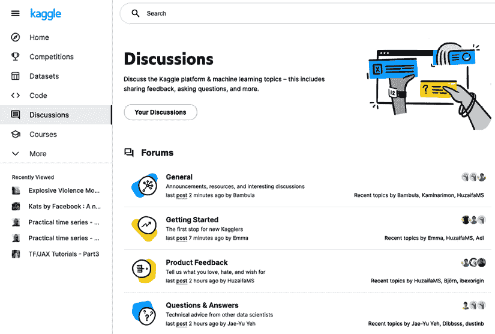
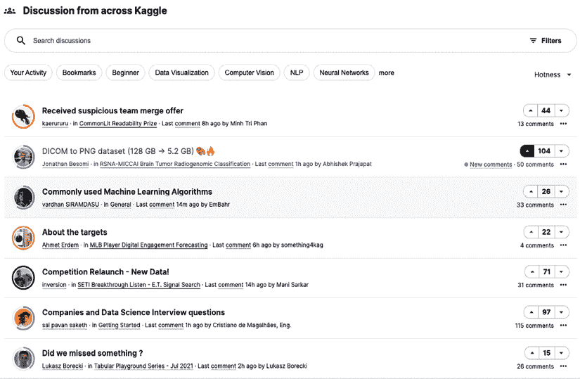
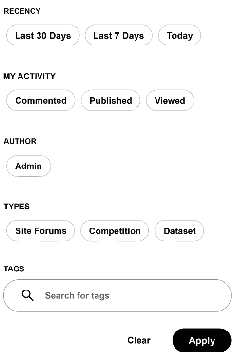
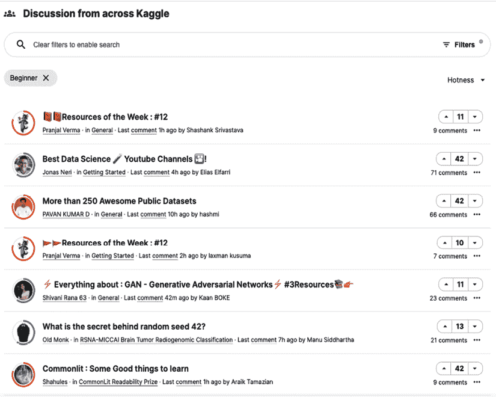
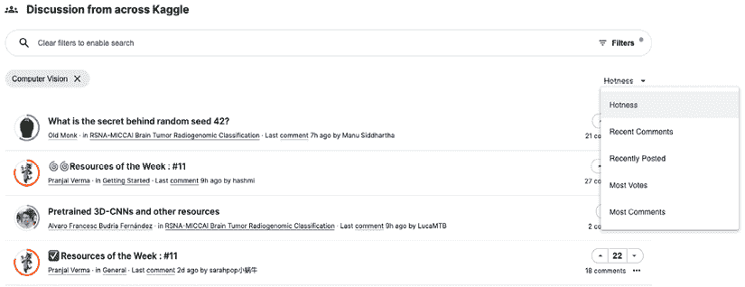
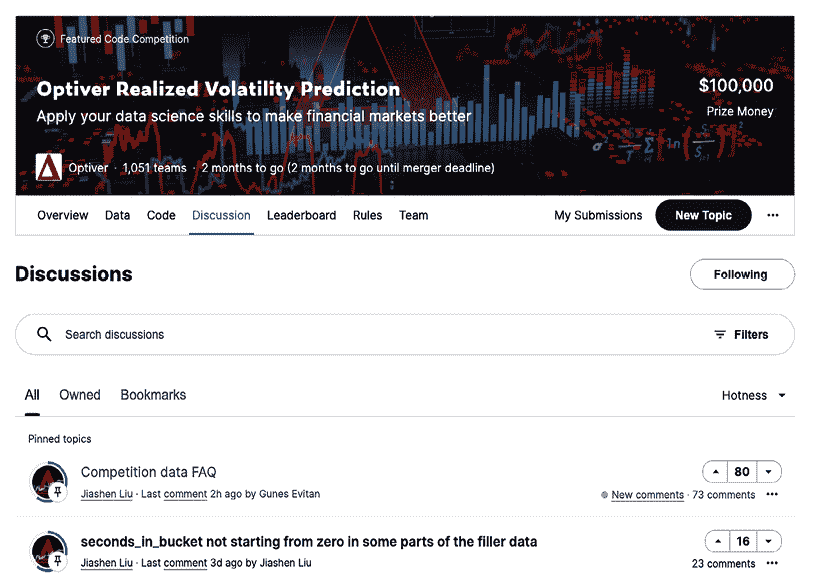
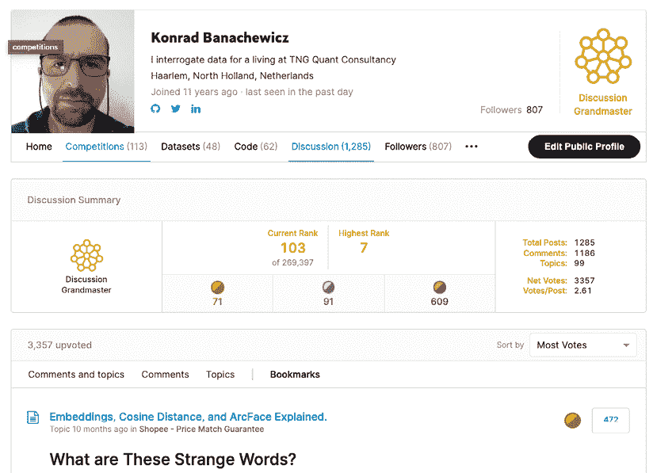

<title>Chapter_4</title>

# 四

# 利用论坛

论坛是 Kaggle 上信息交流的主要方式。无论是讨论正在进行的竞争，参与关于数据集的对话，还是展示新方法的笔记本，Kagglers 一直在谈论事情。

在这一章中，我们介绍了论坛:它们是如何组织的，以及管理其中可用信息财富的行为准则。我们涵盖以下主题:

*   论坛如何工作
*   范例竞赛的讨论方法
*   网络礼节

# 论坛如何工作

您可以通过几种方式进入论坛。最直接的方法是点击左侧面板中的**讨论**:

图 4.1:从主菜单进入讨论页面

最上面的部分包含**论坛**，是一般话题的集合。无论你是第一次参加比赛，有什么建议，或者只是因为迷路而有一个一般性的问题，细读这些都是有用的。

在论坛下面，你可以找到整个 Kaggle 讨论的综合视图:主要是与竞赛相关的对话(这构成了 Kaggle 上的大部分活动)，但也有笔记本或著名数据集。默认按**热度**排序；换句话说，那些参与度最高、最活跃的人更靠近顶端。在这一部分，您可以找到与该领域的动态特性更相关的内容:来自 Kaggle 不同子集的讨论集合，能够根据特定标准进行过滤:

图 4.2:整个 Kaggle 的讨论

根据您的兴趣，您可以使用过滤器开始个性化内容。根据您的偏好，您可以按以下方式过滤:

*   **最近度**:允许你控制你正在获取的信息的范围
*   **我的活动**:如果您需要查看您在所有论坛上的评论/出版物/观点；如果您同时参与多个讨论，这将非常有用
*   **ADMIN** :提供来自 Kaggle admins 的公告的快速概述
*   **类型**:讨论可以在一般的论坛、特定的竞赛中进行，也可以围绕数据集进行
*   **标签**:虽然并不是到处都有，但是一些讨论是有标签的，这个功能允许用户利用这个事实:

图 4.3:讨论可用的过滤器

下图显示了对**初学者**标签上的讨论进行过滤的示例输出:

图 4.4:将讨论过滤给那些被标记为“初学者”的人

作为一种替代，你也可以专注于一个特定的话题；由于像计算机视觉这样的主题吸引了很多人的兴趣，因此对这些主题进行分类可能是有用的。可以按**热度**、**最近评论**、**最近发帖**、**最多票数**、**最多评论**排序:

图 4.5:通用论坛的计算机视觉主题子集

人们来 Kaggle 有各种各样的原因，但是，尽管笔记本电脑越来越受欢迎，竞争仍然是主要的吸引力。每个 Kaggle 比赛都有自己专用的论坛，你可以通过进入比赛页面并选择**讨论**进入:

图 4.6:竞赛论坛

以前不是这样的，但是现在几乎所有的比赛都有一个 FAQ 主题放在他们专门的论坛的顶部。从那里开始是一个好主意，主要有两个原因:

*   它节省你的时间；最受欢迎的问题可能会在那里得到解决。
*   你避免在论坛的剩余部分问多余或重复的问题，让每个人的体验更好。

像笔记本一样，论坛也有一个选项，您可以将特别相关的主题标记为书签，供以后参考:

图 4.7:在论坛中为主题添加书签

您可以在您的个人资料页面上找到所有书签主题的概述:

图 4.8:在论坛中为主题添加书签

# 示例讨论方法

在某个时候在比赛中感到失落是一件完全正常的事情:你进来了，尝试了一些想法，在排行榜上获得了一些牵引力，然后你撞上了 Kaggle 版本的跑步者之墙。这是论坛是咨询的地方的时刻。

举个例子，我们来看看 *Optiver 已实现波动率预测*比赛([https://www . ka ggle . com/c/Optiver-Realized-Volatility-Prediction](https://www.kaggle.com/c/optiver-realized-volatility-prediction))，主办方的特点是这样的:

> 在比赛的前三个月，你将建立模型来预测不同领域数百只股票的短期波动性。您将拥有数亿行高度细化的金融数据，您可以用这些数据来设计预测 10 分钟内波动性的模型。您的模型将根据培训后三个月评估期内收集的真实市场数据进行评估。

这里有很多要解开，所以我们将浏览这个挑战的主要组成部分，并展示如何通过论坛来实现它们。第一，参加这个比赛需要一定的金融知识水平；也许不是很有经验的交易者水平，但是理解计算波动性的不同方式对一个门外汉来说肯定不是微不足道的(大多数 Kagglers 在这个特定的问题上)。对参赛者来说幸运的是，组织者在比赛期间非常积极，并提供了旨在帮助该领域新人的资源指导:[https://www . ka ggle . com/c/optiver-realized-volatility-prediction/discussion/273923](https://www.kaggle.com/c/optiver-realized-volatility-prediction/discussion/273923)。

如果入门知识仍然不足以入门，不要犹豫，当众把事情搞清楚，寻求帮助，就像这里:[https://www . ka ggle . com/c/optiver-realized-volatility-prediction/discussion/263039](https://www.kaggle.com/c/optiver-realized-volatility-prediction/discussion/263039)。

或者这里:[https://www . ka ggle . com/c/optiver-realized-volatility-prediction/discussion/250612](https://www.kaggle.com/c/optiver-realized-volatility-prediction/discussion/250612)。

随着竞争的进行，人们开始开发越来越复杂的模型来处理这个问题。这里有一个平衡:一方面，如果你以前从分享他们的发现的老兵那里学到了什么，你可能想要回报一些东西；另一方面，你不希望通过把你所有的伟大代码作为笔记本来发布而放弃你的(潜在)优势。一个合理的妥协是，比如在论坛竞赛的一个帖子里讨论你的特色想法，沿着这个思路:[https://www . ka ggle . com/c/optiver-realized-volatility-prediction/discussion/273915](https://www.kaggle.com/c/optiver-realized-volatility-prediction/discussion/273915)。

近年来，越来越多的比赛正在脱离固定的测试数据集格式，并引入了某种变化:有时他们强制使用 Kaggle API(这些比赛需要从笔记本提交)，其他比赛引入了一个特殊的时间表，分为训练阶段和针对实时数据的评估。Optiver 就是这种情况:

> 从最终提交截止日期后开始，排行榜将定期更新，以反映针对选定笔记本电脑运行的市场数据更新。大约每两周会更新一次，为了避开寒假会有所调整。

虽然简单明了，但这种设置为重新训练和更新模型带来了一些挑战。如果你遇到这种情况，可以随时查询，就像本次比赛的参与者所做的:[https://www . ka ggle . com/c/optiver-realized-volatility-prediction/discussion/249752](https://www.kaggle.com/c/optiver-realized-volatility-prediction/discussion/249752)。

你的训练模型的**验证方案**在 Kaggle 比赛中总是一个重要的话题，通常伴随着常年的“CV vs LB”(交叉验证 vs 排行榜)讨论。Optiver 竞赛也不例外:[https://www . ka ggle . com/c/Optiver-realized-volatility-prediction/discussion/250650](https://www.kaggle.com/c/optiver-realized-volatility-prediction/discussion/250650)。

除非线程已经存在——检查总是一个好主意，这样冗余可以最小化——您可能想要考虑一个相关类型的线程:单模型性能。迟早，每个人都开始使用模型的集合，但是如果没有好的单一模型组件，它们就不是很有效。对知识的合作探索不止于此:如果你认为你已经找到了解决问题的更好方法，分享它可能是个好主意。要么你已经做了对别人有用的事，要么你会发现你为什么错了(省时省力)；无论哪种方式，都是一种胜利，例如，在本讨论中所示:[https://www . ka ggle . com/c/optiver-realized-volatility-prediction/discussion/260694](https://www.kaggle.com/c/optiver-realized-volatility-prediction/discussion/260694)。

除了显而易见的个人利益(你可以窥见其他竞争者是如何做的)，这样的线程允许社区中的信息交换，促进协作元素，并对初学者有所帮助。这种讨论的例子可以在[https://www . ka ggle . com/c/optiver-realized-volatility-prediction/discussion/250695](https://www.kaggle.com/c/optiver-realized-volatility-prediction/discussion/250695)找到。

如果你已经完成了上面列出的主题，你可能仍然会发现自己在想:*我错过了什么重要的东西吗？* Kaggle 是那种完全可以问的地方:[https://www . ka ggle . com/c/optiver-realized-volatility-prediction/discussion/262203](https://www.kaggle.com/c/optiver-realized-volatility-prediction/discussion/262203)。

让我们将注意力扩展到其他比赛上来总结这一部分。我们在上面提到了验证，它总是与信息泄露和过度拟合的话题联系在一起——至少对 Kaggler 来说是这样。第 6 章详细讨论了泄漏问题，该章专门用于设计验证方案。在这里，我们将通过讨论简要介绍如何接近他们。Kaggle 是一个由好奇的人组成的社区，如果怀疑有泄漏，有人可能会提出这个话题。

例如，文件的名称或记录的 id 可能包含时间戳，这意味着它们可以被逆向工程以有效地窥视未来并产生不切实际的低错误度量值。这样的情况发生在*两个适马连接*的比赛中([https://www . ka ggle . com/c/Two-sigma-Connect-rental-listing-inquiries/](https://www.kaggle.com/c/two-sigma-connect-rental-listing-inquiries/))。详情可以在卡扎诺娃的帖子里细读:[https://www . ka ggle . com/c/two-sigma-connect-rental-listing-inquiries/discussion/31870 # 176513](https://www.kaggle.com/c/two-sigma-connect-rental-listing-inquiries/discussion/31870#176513)。

另一个例子是*空中客车船只探测挑战赛*([https://www.kaggle.com/c/airbus-ship-detection](https://www.kaggle.com/c/airbus-ship-detection))，参与者的任务是在卫星图像中定位船只。事实证明，很大一部分测试图像是(随机)从训练图像中裁剪出来的图像，匹配这两个图像相对简单:[https://www . ka ggle . com/c/airbus-ship-detection/discussion/64355 # 377037](https://www.kaggle.com/c/airbus-ship-detection/discussion/64355#377037)。

桑坦德银行赞助了一系列声名狼藉的比赛。在该公司组织 Kaggle 竞赛的三个实例中，有两个涉及数据泄露:[https://www . ka ggle . com/c/Santander-value-prediction-challenge/discussion/61172](https://www.kaggle.com/c/santander-value-prediction-challenge/discussion/61172)。

接下来发生的事情因比赛而异:有些时候，Kaggle 决定用新的或清理过的数据重置比赛，但他们也允许比赛继续进行(因为他们认为影响很小)。处理这样情况的例子可以在*预测红帽商业价值*比赛中找到:[https://www . ka ggle . com/c/Predicting-Red-Hat-Business-Value/discussion/23788](https://www.kaggle.com/c/predicting-red-hat-business-value/discussion/23788)。

虽然数据泄露可能会严重干扰竞争，但好消息是，在过去的 2-3 年里，泄露几乎已经从 Kaggle 中消失了——所以如果运气好的话，这一部分将会被阅读一次，但不会成为你在平台上体验的主要内容。

平台上的体验话题是大师级面试的一个很好的引子。

谢一凡

[https://www.kaggle.com/yifanxie](https://www.kaggle.com/yifanxie)

**谢一凡**是一位讨论和竞赛大师，也是 Arion.ai 的联合创始人。以下是关于参加竞赛和与其他 Kagglers 合作的看法。

你最喜欢哪种比赛，为什么？从技术和解决途径来说，你在 Kaggle 上的特长是什么？

*我其实没有特别喜欢的类型；我喜欢解决各种问题。在技术方面，我已经建立了一个坚实的机器学习模块管道，使我能够快速应用典型的技术和算法解决大多数数据问题。我会说这对我来说是一种竞争优势:专注于标准化，无论是在工作程序还是技术工件方面。这允许更快的迭代，反过来有助于在进行数据实验时提高效率，这是 Kaggle 的核心组件。*

你是如何对待一场 Kaggle 比赛的？这种方法与你在日常工作中的做法有什么不同？

*随着时间的推移，我已经为自己的大部分主要数据工作开发了一种管理和收集信息的特定方式。这适用于工作、游戏比赛和其他兼职项目。通常，我会以每次比赛专用的标准化格式捕获有用的信息，如书签、数据字典、待办事项、有用的命令和实验结果，当在团队中比赛时，我会与我的队友分享这些信息。*

告诉我们一个你参加的特别具有挑战性的比赛，以及你用什么样的洞察力来完成这个任务？

对我来说，理解比赛的大背景总是有用的；例如，支撑和产生我们正在处理的数据的社会/工程/金融过程是什么？对于可以有意义地观察单个数据点的比赛，如 Deepfake 检测挑战赛，*我会构建一个特定的仪表板(通常使用 Streamlit)，允许我检查单个数据点(在这种情况下，是一对真实和虚假的视频)，并在仪表板中构建简单的统计数据收集，让我对数据有更好的感觉。*

Kaggle 对你的职业生涯有帮助吗？如果有，如何实现？

*作为一家数据科学咨询公司的合伙人，我认为 Kaggle 是对我目前的职业道路贡献最大的平台。它让我用几年的时间建立了解决不同领域数据问题的技能和方法。我既有客户也有同事，他们是我在 Kaggle 比赛中组建团队时认识的，这一直是我很好的知识来源，尽管这些天我在这方面不太活跃。*

以你的经验来看，没有经验的 Kagglers 经常会忽略什么？你现在知道了什么，你希望在你刚开始的时候就知道？

对于 Kaggle 上的新人来说，我能看到的一个错误是忽略了关键的非技术问题:团队规则、数据使用、私人信息共享、出于无关痛痒的原因使用多个帐户等。这些类型的错误可能会使一个人通常数月的竞争努力完全无效。

我希望一开始就知道的一件事是，不要担心公共排行榜上的日常排名——这会给自己带来不必要的压力，并导致过度适应。

对于数据分析或机器学习，你有什么特别推荐的工具或库吗？

*常见的:Scikit-learn、XGB/LGB、PyTorch 等。除了基本的用法之外，我推荐人们学习掌握的一个工具是 NumPy，特别是对于排序和子集信息的更高级的方法；通过熊猫的懒惰方法使事情变得容易，但在 NumPy 中更精细的等效版本会带来更好的效率。*

当一个人参加比赛时，他应该记住或做的最重要的事情是什么？

在我看来，做任何与数据科学相关的事情都有四个原因:为了利润、为了知识、为了乐趣和为了好。对我来说，Kaggle 永远是一个巨大的知识来源，而且经常是一个巨大的记忆来源，所以我的建议永远是提醒自己排名是暂时的，但是知识/记忆是永久的:)

你使用其他比赛平台吗？他们和 Kaggle 相比如何？

*我是一个* *非常积极的数字参与者。对我来说，基于我从事数据科学的四个理由，更多的是为了利润，因为他们通过加密货币提供支付。这更多的是一种孤军奋战，因为团队合作并没有真正的优势；他们不鼓励也不禁止，但在 Numerai 这样的交易竞争平台上，更多的人力资源并不总是等同于更好的利润。*

对我来说，在我工作日程的繁忙时期，Numerai 是一项比 Kaggle 更可持续的活动，因为训练数据通常在每一轮都不会改变，而且一旦初始模型建立起来，我可以高度自动化地进行生产，以自动进行预测和提交。

*numeri 的连续性特性也使其更适合那些想要为表格数据集构建专用机器学习管道的人。*

# 网络礼节

任何上网超过 15 分钟的人都知道这一点:在讨论中，无论话题多么单纯，人们总是有可能变得情绪化，谈话会离开文明的部分。卡格尔也不例外，所以这个社区有适当行为的准则:[https://www.kaggle.com/community-guidelines](https://www.kaggle.com/community-guidelines)。

这些不仅适用于讨论，也适用于笔记本和其他形式的交流。在 Kaggle 上互动时，你应该记住的要点是:

*   不要陷入斯科特·亚当斯所说的读心术幻觉 : Kaggle 是一个由来自世界各地的人组成的极其多样化的社区(对他们中的许多人来说，英语不是他们的第一语言)，所以保持细微差别是一个巨大的挑战。不要做假设，尽可能澄清。
*   不要把事情私人化；戈德温定律的存在是有原因的。特别是，对受保护的不可变特征的引用绝对是一个禁区。
*   你的里程数可能会有所不同，但事实仍然是:这不是 20 世纪 90 年代的互联网狂野西部，当时告诉某人在线 RTFM 是完全正常的；贬低往往会疏远人们。
*   不要试图操纵进展系统(授予 Kaggle 奖牌的基础):这方面涵盖了平台滥用的整个范围，从明确要求增加投票，到串通，到公然作弊。

简而言之，你希望别人怎么对你，你就怎么对别人，事情就会迎刃而解。

# 摘要

在这一章中，我们讨论了论坛，这是 Kaggle 平台上主要的交流方式。我们演示了论坛机制，向您展示了如何在更高级的比赛中利用讨论的例子，并简要总结了讨论网络礼仪。

这就结束了本书的第一部分，介绍部分。下一章标志着开始更深入地探索如何最大限度地从 Kaggle 中获得什么，并着眼于处理大量不同的任务和指标，你必须在竞争中角力。

# 加入我们书的不和谐空间

加入这本书的不和谐工作区，每月与作者进行一次*问我任何问题*会议:

[https://packt.link/KaggleDiscord](https://packt.link/KaggleDiscord)

