# 五、竞赛任务和指标

在竞赛中，你从检查目标度量开始。理解你的模型的错误是如何被评估的是在每场比赛中获得高分的关键。当你的预测被提交到 Kaggle 平台时，它们会被与基于目标指标的真实情况进行比较。

例如，在*泰坦尼克号*比赛(【https://www.kaggle.com/c/titanic/】T2)中，你所有的提交都会根据*准确性*进行评估，即你正确预测的幸存乘客百分比。组织者决定采用这一指标，因为比赛的目的是找到一种模型来估计乘客在类似情况下的生存概率。在另一个知识竞赛中，*房价-高级回归技术*([https://www . ka ggle . com/c/House-Prices-Advanced-Regression-Techniques](https://www.kaggle.com/c/house-prices-advanced-regression-techniques))，你的工作将根据你的预测和地面真实情况之间的*平均差值*进行评估。这包括计算对数、平方和平方根，因为该模型预计能够尽可能正确地量化待售房屋的价格顺序。

在现实世界的数据科学中，目标指标也是项目成功的关键，尽管现实世界和 Kaggle 竞赛之间肯定存在差异。我们可以很容易地总结说，在现实世界中有更多的复杂性。在现实世界的项目中，您通常会有不止一个而是多个度量标准来评估您的模型。通常，一些评估指标甚至与您的预测相对于您用于测试的基本事实的表现没有关系。例如，您正在工作的知识领域、项目范围、模型考虑的功能数量、整体内存使用情况、对特殊硬件(例如 GPU)的任何要求、预测过程的延迟、预测模型的复杂性以及许多其他方面最终可能比单纯的预测性能更重要。

现实世界中的问题实际上是由商业和技术基础设施问题所主导的，比你在参与其中之前所能想象的要多得多。

然而，你无法回避一个事实，即现实世界项目和 Kaggle 竞赛的核心基本原则是相同的。你的工作将根据一些标准进行评估，了解这些标准的细节，以一种聪明的方式优化你的模型的拟合，或者根据这些标准选择它的参数，将会给你带来成功。如果您能够了解更多关于 Kaggle 中模型评估是如何发生的，您在现实世界中的数据科学工作也将从中受益。

在本章中，我们将详细介绍在数据科学竞赛中构建模型解决方案时，某些类型问题的评估指标如何强烈影响您的操作方式。我们还讨论了 Kaggle 竞赛中可用的各种指标，以让您了解什么是最重要的，在空白处，我们讨论了指标对预测性能的不同影响，以及如何将它们正确地转化到您的项目中。我们将讨论以下主题:

*   评估指标和目标函数
*   任务的基本类型:回归、分类和顺序
*   元 Kaggle 数据集
*   处理前所未见的指标
*   回归度量(标准和有序)
*   二元分类的度量(标签预测和概率)
*   多类分类的度量
*   对象检测问题的度量
*   多标签分类和推荐问题的度量
*   优化评估指标

# 评估指标和目标函数

在 Kaggle 竞赛中，您可以在竞赛的**概览**页面的左侧菜单中找到评估指标。通过选择**评估**选项卡，您将获得关于评估指标的详细信息。有时您会发现度量公式、复制它的代码以及一些关于度量的讨论。在同一个页面上，您还将获得关于提交文件格式的解释，为您提供文件的标题和一些示例行。

评估指标和提交文件之间的关联非常重要，因为您必须考虑到，在您训练了您的模型并产生了一些预测之后，指标实际上是起作用的。因此，作为第一步，你必须考虑**评估指标**和**目标函数**之间的区别。

将一切归结为基础，目标函数在训练期间为您的模型服务，因为它涉及误差最小化(或分数最大化，取决于问题)的过程。相比之下，评估指标在之后为您的模型*服务，它已经通过提供分数进行了训练。因此，它不会影响模型拟合数据的方式，但会以间接的方式影响数据:帮助您选择模型中性能最佳的超参数设置，以及竞赛模型中的最佳模型。本章的其余部分将向您展示这如何影响 Kaggle 比赛，以及为什么 Kaggle 评估指标的分析应该是您在比赛中的第一步，在继续之前，让我们首先讨论一些您可能在论坛中遇到的术语。*

你会经常听到关于目标函数、成本函数和损失函数的讨论，有时可以互换。然而，它们并不是完全相同的东西，我们在这里解释其区别:

*   **损失函数**是在单个数据点上定义的函数，并且考虑模型的预测和数据点的实际情况，计算罚值。
*   一个**成本函数**考虑到用于训练的整个数据集(或其中的一批)，计算其数据点损失惩罚的总和或平均值。它可以包含进一步的约束，例如 L1 或 L2 处罚。成本函数直接影响训练如何进行。
*   **目标函数**是与机器学习训练期间的优化范围相关的最通用(且可安全使用)的术语:它包括成本函数，但不限于它们。事实上，目标函数也可以考虑与目标无关的目标:例如，需要估计模型的稀疏系数或系数值的最小化，如 L1 和 L2 正则化。此外，尽管损失和成本函数意味着基于最小化的优化，但是目标函数是中性的，并且可以意味着由学习算法执行的最大化或最小化活动。

同样，当谈到评估指标时，您会听到评分函数和误差函数。区分它们之间的很容易:如果来自函数的得分较高，则**得分函数**建议更好的预测结果，这意味着最大化过程。

一个**误差函数**代替建议更好的预测，如果该函数报告更小的误差量，意味着最小化过程。

# 任务的基本类型

不是所有的目标函数都适合所有的问题。从一般的角度来看，你会发现 Kaggle 竞赛中的两种问题:**回归**任务和分类任务。最近有也有**强化学习** ( **RL** )任务，但是 RL 不使用度量进行评估；相反，它依赖于从与其他竞赛对手的直接比赛中得出的排名，这些竞赛对手的解决方案被认为与你的一样出色(在这场比赛中表现得比你的同行更好会提高你的排名，表现得更差会降低你的排名)。由于 RL 不使用度量，我们将继续参考回归-分类二分法，尽管**顺序**任务，其中您预测由整数表示的有序标签，可能会避开这种分类，并且可以使用回归或分类方法成功处理。

## 回归

**回归**需要你建立一个可以预测一个实数的模型；通常是正数，但也有负数预测的例子。回归问题的经典例子是*房价——高级回归技术*，因为你必须猜测房子的价值。回归任务的评估包括计算您的预测值和实际值之间的距离。这种差异可以用不同的方法来评估，例如通过平方它来惩罚较大的误差，或者通过对它应用对数来惩罚错误标度的预测。

## 分类

当面对 Kaggle 上的**分类**任务时，需要考虑更多的细微差别。事实上，分类可以是**二元**、**多类**，或者**多标签**。

在**二元**问题中，你必须猜测一个例子是否应该被分类到一个特定的类中(通常称为*正*类，与*负*类相比较)。在这里，评估可能涉及对类所有权本身的直接预测，或者对这种所有权的概率的估计。一个典型的例子是泰坦尼克号比赛，你必须猜一个二元结果:生存还是不生存。在这种情况下，比赛的要求只是预测，但在许多情况下，需要提供一个概率，因为在某些领域，特别是医学应用中，需要对不同选项和情况下的积极预测进行排序，以便做出最佳决策。

虽然在二进制分类中计算正确匹配的精确数量看起来是一种有效的方法，但是当存在不平衡时，也就是说，在正类和负类之间存在不同数量的例子时，这种方法实际上不会很好地工作。如果您想要正确跟踪模型的改进，则基于类的不平衡分布的分类需要考虑不平衡的评估指标。

当你有多于两个类别的时，你有一个**多类别**预测问题。这也需要使用合适的函数进行评估，因为有必要跟踪模型的整体性能，而且还要确保跨类的性能是可比较的(例如，您的模型可能在某些类上表现不佳)。在这里，每个案例只能在一个类中，而不能在任何其他类中。一个很好的例子是*叶子分类*([https://www.kaggle.com/c/leaf-classification](https://www.kaggle.com/c/leaf-classification))，叶子标本的每张图片都必须与正确的植物种类相关联。

最后，当您的类预测不是排他的，并且您可以预测每个示例的多个类所有权时，您就有了一个多标签**问题，它需要进一步的评估，以便控制您的模型是否预测了正确的类，以及正确的类数量和混合。例如，在*希腊媒体监测多标签分类(WISE 2014)*([https://www.kaggle.com/c/wise-2014](https://www.kaggle.com/c/wise-2014))中，你必须将每篇文章与其涉及的所有主题相关联。**

## 序数

在一个涉及顺序尺度上的预测的问题中，你必须猜测整数数字标签，它们自然是有序的。举个例子，地震的震级是有序的。此外，来自市场调查问卷的数据通常是按顺序记录的(例如，消费者的偏好或意见一致)。由于有序尺度是由有序值组成的，有序任务可以被视为介于回归和分类之间，你可以用两种方式解决它们。

最常见的方法是把你的序数任务当成一个**多类**问题。在这种情况下，您将获得一个整数值(类标签)的预测，但该预测不会考虑到类具有一定的顺序。如果你看看这些类的预测概率，你会觉得把这个问题作为多类问题来处理是有问题的。通常，概率将分布在可能值的整个范围内，描绘了一种多模态且通常不对称的分布(而您应该期望最大概率类周围是高斯分布)。

解决顺序预测问题的另一种方法是将其视为**回归**问题，然后对结果进行后处理。通过这种方式，将考虑类之间的顺序，尽管预测输出不会立即对评估指标的评分有用。事实上，在回归中，你得到的是一个浮点数作为输出，而不是一个表示序数类的整数；此外，结果将包括有序分布的整数之间的所有值，也可能包括它之外的值。裁剪输出值并通过单位舍入将它们转换成整数可能会达到这个目的，但这可能会导致不准确，需要一些更复杂的后处理(我们将在本章的后面对此进行更多讨论)。

现在，你可能在想，要想在 Kaggle 取得成功，应该掌握什么样的评估。很明显，你必须掌握你所参与的竞赛的评估标准。但是，有些指标比其他指标更常见，这是您可以利用的信息。最常见的指标是什么？我们如何在使用了类似评估指标的竞赛中找到真知灼见？答案是查阅 Meta Kaggle 数据集。

# 元 Kaggle 数据集

元 Kaggle 数据集([https://www.kaggle.com/kaggle/meta-kaggle](https://www.kaggle.com/kaggle/meta-kaggle))是一个关于 Kaggle 社区和活动的丰富数据集合，由 Kaggle 本身作为公共数据集发布。它包含 CSV 表格，其中填充了来自竞赛、数据集、笔记本和讨论的公共活动。你所要做的就是启动一个 Kaggle 笔记本(正如你在*第 2 章*和*第 3 章*中看到的)，向其中添加元 Kaggle 数据集，并开始分析数据。CSV 表每天都在更新，所以您必须经常刷新您的分析，但考虑到您可以提取的见解，这是值得的。

我们有时会参考本书中的 Meta Kaggle 数据集，既可以作为许多有趣的竞赛动态示例的灵感，也可以作为一种为您的学习和竞赛策略挑选有用示例的方式。在这里，我们将使用它来找出在过去七年中哪些评估指标在比赛中使用得最频繁。通过查看本章中最常见的指标，您将能够从坚实的基础上开始任何竞赛，然后完善您的指标知识，利用您在论坛中找到的讨论来获取特定于竞赛的细微差别。

下面，我们介绍生成一个度量数据表格及其每年计数所需的代码。它被设计为直接在 Kaggle 平台上运行:

```
import numpy as np

import pandas as pd

comps = pd.read_csv("/kaggle/input/meta-kaggle/Competitions.csv")

evaluation = ['EvaluationAlgorithmAbbreviation',

              'EvaluationAlgorithmName',

              'EvaluationAlgorithmDescription',]

compt = ['Title', 'EnabledDate', 'HostSegmentTitle']

df = comps[compt + evaluation].copy()

df['year'] = pd.to_datetime(df.EnabledDate).dt.year.values

df['comps'] = 1

time_select = df.year >= 2015

competition_type_select = df.HostSegmentTitle.isin(

						['Featured', 'Research'])

pd.pivot_table(df[time_select&competition_type_select],

               values='comps',

               index=['EvaluationAlgorithmAbbreviation'],

               columns=['year'],

               fill_value=0.0,

               aggfunc=np.sum,

               margins=True

              ).sort_values(

                by=('All'), ascending=False).iloc[1:,:].head(20) 
```

在这段代码中，我们读入包含比赛相关数据的 CSV 表。我们关注代表评估的列和通知我们竞赛名称、开始日期和类型的列。我们将这些行限制在自 2015 年以来举行的比赛以及特色或研究类型的比赛(这是最常见的比赛)。我们通过创建一个熊猫数据透视表，将评估算法与年份相结合，并使用它来统计比赛的数量，来完成分析。我们只显示前 20 个算法。

下面是结果表(在撰写本文时):

| **年份** | **2015 年** | **2016** | **2017** | **2018** | **2019** | **2020** | **2021** | **Tot** |
| **评估算法** |
| 罗马纪元 | 四 | 四 | 一 | 3 | 3 | 2 | 0 | 17 |
| 对数损失 | 2 | 2 | 5 | 2 | 3 | 2 | 0 | 16 |
| 地图@{K} | 一 | 3 | 0 | 四 | 一 | 0 | 一 | 10 |
| 分类准确度 | 一 | 0 | 四 | 0 | 一 | 2 | 0 | 8 |
| 多类丢失 | 2 | 3 | 2 | 0 | 一 | 0 | 0 | 8 |
| RMSLE | 2 | 一 | 3 | 一 | 一 | 0 | 0 | 8 |
| QuadraticWeightedKappa | 3 | 0 | 0 | 一 | 2 | 一 | 0 | 七 |
| MeanFScoreBeta | 一 | 0 | 一 | 2 | 一 | 2 | 0 | 七 |
| MeanBestErrorAtK | 0 | 0 | 2 | 2 | 一 | 一 | 0 | 6 |
| 麦克尔姆塞尔 | 0 | 0 | 一 | 0 | 0 | 5 | 0 | 6 |
| MCAUC | 一 | 0 | 一 | 0 | 0 | 3 | 0 | 5 |
| 均方根误差 | 一 | 一 | 0 | 3 | 0 | 0 | 0 | 5 |
| 骰子 | 0 | 一 | 一 | 0 | 2 | 一 | 0 | 5 |
| GoogleGlobalAP | 0 | 0 | 一 | 2 | 一 | 一 | 0 | 5 |
| 宏分数 | 0 | 0 | 0 | 一 | 0 | 2 | 一 | 四 |
| 得分 | 0 | 0 | 3 | 0 | 0 | 0 | 0 | 3 |
| CRPS | 2 | 0 | 0 | 0 | 一 | 0 | 0 | 3 |
| OpenImagesObjectDetectionAP | 0 | 0 | 0 | 一 | 一 | 一 | 0 | 3 |
| 平均分数 | 0 | 0 | 一 | 0 | 0 | 0 | 2 | 3 |
| RSNAObjectDetectionAP | 0 | 0 | 0 | 一 | 0 | 一 | 0 | 2 |

使用我们刚刚在命令中实例化的相同变量来生成表格，您还可以检查数据来查找采用了您选择的指标的比赛:

```
metric = 'AUC'

metric_select = df['EvaluationAlgorithmAbbreviation']==metric

print(df[time_select&competition_type_select&metric_select]

        [['Title', 'year']]) 
```

在上面的片段中，我们决定代表使用 AUC 指标的竞赛。您只需更改代表所选指标的字符串，结果列表就会相应地更新。

回到生成的表格，我们可以检查 Kaggle 上举办的比赛中使用的最流行的评估指标:

*   这两个顶级指标彼此密切相关，并且与二元概率分类问题密切相关。 **AUC** 指标有助于衡量你的模型的预测概率是否倾向于预测高概率的阳性病例，而 **Log Loss** 有助于衡量你的预测概率与实际情况有多远(当你优化 Log Loss 时，你也优化了 AUC 指标)。
*   在 3 ^(rd) 位置，我们发现 **MAP@{K}** ，这是推荐系统和搜索引擎中常见的度量。在 Kaggle 比赛中，这一指标主要用于信息检索评估，例如在*座头鲸识别*比赛([https://www.kaggle.com/c/humpback-whale-identification](https://www.kaggle.com/c/humpback-whale-identification))中，你必须精确地识别一只鲸鱼，并且你有五种可能的猜测。MAP@{K}用法的另一个例子是在*快速，绘制！涂鸦识别挑战*([https://www.kaggle.com/c/quickdraw-doodle-recognition/](https://www.kaggle.com/c/quickdraw-doodle-recognition/))，你的目标是猜测所画草图的内容，你可以尝试三次。本质上，当 MAP@{K}是评估度量时，您不仅可以正确猜测，还可以正确猜测一定数量(函数名称中的“K ”)的其他不正确预测。
*   只有在第 6 个^的位置，我们才能找到一个回归度量标准，即 **RMSLE** 或**均方根对数误差**，并且在第 7 个^的位置放置 **二次加权 Kappa** ，这是一个对于涉及猜测渐进整数的问题(序数问题)的模型性能评估特别有用的度量标准。

当你浏览顶级指标列表时，你会继续寻找机器学习教科书中经常讨论的指标。在接下来的几节中，在首先讨论了当您遇到一个从未见过的指标(在 Kaggle 竞赛中发生的事情比您想象的更频繁)时该怎么办之后，我们将修改在回归和分类竞赛中发现的一些最常见的指标。

# 处理前所未见的指标

在继续之前，我们必须考虑到前 20 名的表格并没有涵盖比赛中使用的所有指标。我们应该意识到，有些指标近年来只使用过一次。

让我们继续使用前面代码的结果来找出它们是什么:

```
counts = (df[time_select&competition_type_select]

          .groupby('EvaluationAlgorithmAbbreviation'))

total_comps_per_year = (df[time_select&competition_type_select]

                        .groupby('year').sum())

single_metrics_per_year = (counts.sum()[counts.sum().comps==1]

                           .groupby('year').sum())

single_metrics_per_year

table = (total_comps_per_year.rename(columns={'comps': 'n_comps'})

         .join(single_metrics_per_year / total_comps_per_year)

         .rename(columns={'comps': 'pct_comps'}))

print(table) 
```

因此，我们得到了下表，该表显示了每年有多少比赛使用了从未使用过的指标(`n_comps`)，以及每年这些比赛的比例(`pct_comps`):

```
 n_comps pct_comps

year                   

2015       28  0.179

2016       19  0.158

2017       34  0.177

2018       35  0.229

2019       36  0.278

2020       43  0.302

2021        8  0.250 
```

观察比赛的相对份额，我们立即注意到它是如何逐年增长的，并且在最近几年达到了 25%-30%的水平，这意味着通常每三或四场比赛中就有一场比赛需要你从头开始学习和理解一项指标。

您可以通过一个简单的代码片段获得过去出现过的此类指标的列表:

```
print(counts.sum()[counts.sum().comps==1].index.values) 
```

通过执行代码，您将获得类似于下面的列表:

```
['AHD@{Type}' 'CVPRAutoDrivingAveragePrecision' 'CernWeightedAuc'

'FScore_1' 'GroupMeanLogMAE' 'ImageNetObjectLocalization'

'IndoorLocalization'  'IntersectionOverUnionObjectSegmentationBeta'

'IntersectionOverUnionObjectSegmentationWithClassification'

'IntersectionOverUnionObjectSegmentationWithF1' 'Jaccard'

'JaccardDSTLParallel' 'JigsawBiasAUC' 'LaplaceLogLikelihood'

'LevenshteinMean' 'Lyft3DObjectDetectionAP' 'M5_WRMSSE' 'MASpearmanR' 'MCRMSE' 'MCSpearmanR' 'MWCRMSE' 'MeanColumnwiseLogLoss' 'MulticlassLossOld' 'NDCG@{K}' 'NQMicroF1' 'NWRMSLE' 'PKUAutoDrivingAP' 'R2Score' 'RValue' 'RootMeanSquarePercentageError' 'SIIMDice' 'SMAPE' 'SantaResident' 'SantaRideShare' 'SantaWorkshopSchedule2019' 'TrackML'

 'TravelingSanta2' 'TwoSigmaNews' 'WeightedAUC' 'WeightedMulticlassLoss' 'WeightedPinballLoss' 'WeightedRowwisePinballLoss' 'YT8M_MeanAveragePrecisionAtK' 'ZillowMAE' 'football' 'halite' 'mab'] 
```

通过仔细检查，你可以发现许多与深度学习和强化学习竞赛相关的指标。

当您遇到从未使用过的指标时，您会怎么做？当然，你可以依靠 Kaggle 论坛中的讨论，在那里你总能找到好的灵感和许多会帮助你的 ka ggle 人。然而，如果你想建立你自己的关于该指标的知识，除了搜索它，我们建议你尝试通过自己编写评估函数进行实验，即使是以一种不完美的方式，并尝试模拟该指标如何对模型产生的不同类型的错误做出反应。你也可以直接在你准备的比赛训练数据或合成数据的样本上测试它的功能。

我们可以引用卡格勒尔斯使用的这种方法的几个例子:

*   *Carlo Lepelaars* 与 Spearman 的 Rho:[https://www . ka ggle . com/carlolepelaars/understanding-the-metric-Spearman-s-Rho](https://www.kaggle.com/carlolepelaars/understanding-the-metric-spearman-s-rho)
*   二次加权 Kappa 的 Carlo Lepelaars:[https://www . ka ggle . com/carlolepelaars/understanding-the-metric-Quadratic-Weighted-Kappa](https://www.kaggle.com/carlolepelaars/understanding-the-metric-quadratic-weighted-kappa)
*   *罗汉饶*用拉普拉斯对数似然:[https://www . ka ggle . com/Rohan Rao/osic-understanding-la place-Log-Likelihood](https://www.kaggle.com/rohanrao/osic-understanding-laplace-log-likelihood)

这可以让你对评估有更深入的了解，比其他只依赖谷歌和 Kaggle 论坛答案的竞赛对手更有优势。


罗汉·拉奥

[https://www.kaggle.com/rohanrao](https://www.kaggle.com/rohanrao)

在我们开始探索不同的指标之前，让我们采访一下 Rohan Rao(又名 Vopani)本人，四重特级大师和`H2O.ai`的高级数据科学家，了解他在 Kaggle 上的成功以及他与我们分享的智慧。

你最喜欢哪种比赛，为什么？在技术和解决方法方面，你在 Kaggle 上的专长是什么？

我喜欢尝试不同类型的竞赛，但我最喜欢的肯定是时间序列竞赛。我不太喜欢行业中时间序列的典型方法和概念，所以我倾向于创新，以非正统的方式构建解决方案，这最终对我来说非常成功。

你是如何对待一场 Kaggle 比赛的？这种方法与你在日常工作中的做法有什么不同？

*对于任何 Kaggle 竞赛，我的典型工作流程如下:*

*   *理解问题陈述并阅读所有与规则、格式、时间表、数据集、指标和交付物相关的信息。*
*   *深入挖掘数据。用各种可能的方式对它进行切片和切块，探索/想象它，以便能够回答关于它的任何问题。*
*   *用基线模型建立一个简单的管道，并提交一份确认流程工作的文件。*
*   *工程师特性，调优超参数，以及* *用多个模型进行实验，以了解什么是正常的，什么是不正常的。*
*   不断回去分析数据，阅读论坛上的讨论，并充分调整功能和模型。也许在某个时候会合作。
*   集合多个模型并决定最终提交哪个。

*在我的数据科学日常工作中，大部分情况也是如此。但是另外还需要两个关键要素:*

*   *为问题陈述管理和准备数据集。*
*   *将最终模型或解决方案部署到生产中。*

对于我过去参与的大多数项目，我的大部分时间都花在了这两项活动上。

Kaggle 对你的职业生涯有帮助吗？如果有，如何实现？

我在机器学习中学到的绝大多数东西都来自 Kaggle。社区、平台和内容都是纯金打造的，你能学到的东西多得令人难以置信。

让我受益最大的是参加 Kaggle 比赛的经历；它在理解、构建和解决跨领域问题方面给了我巨大的信心，我已经能够在 Kaggle 之外的许多公司和项目中成功地应用这些信心。

许多招聘人员联系我，希望有机会了解我在 Kaggle 方面的成就，主要是在竞赛方面。它很好地表明了候选人解决数据科学问题的能力，因此它是一个展示你的技能 *和建立投资组合的绝佳平台。*

你在过去的比赛中犯过什么错误？

每次比赛我都会犯一些错误！这就是你学习和提高的方式。有时是编码错误，有时是有缺陷的验证设置，有时是不正确的提交选择！

重要的是从中吸取教训，并确保你不会再犯。自动迭代这个过程有助于提高您在 Kaggle 上的整体性能。

对于数据分析/机器学习，你有什么特别推荐的工具或库吗？

我坚信永远不要嫁给科技。使用最有效的，最舒适和最有效的，但是不断地学习新的工具和库。

# 回归度量(标准和有序)

当处理回归问题，即涉及估计连续值(可以从负无穷大到无穷大)的问题时，最常用的误差度量是 **RMSE** ( **均方根误差**)和 **MAE** ( **平均绝对误差**)，但是也可以找到稍微不同的有用的误差度量，如 RMSLE 或 MCRMSLE。

## 均方差(MSE)和 R 平方

均方根误差是**均方误差** ( **MSE** )的根，它只不过是你在学习回归如何工作时学到的传统的**均方误差总和** ( **SSE** )的平均值。

MSE 的公式如下:

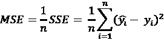

让我们从解释这个公式的工作原理开始。首先， *n* 表示例数，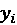是地面真相，是预测。你首先得到你的预测和你的真实值之间的差异。你计算差值的平方(因此它们变成正的或简单的零)，然后你将它们相加，得到你的 SSE。然后你只需要将这个度量除以预测的次数，就可以得到平均值，MSE。通常，所有的回归模型都会最小化 SSE，所以你在尝试最小化 MSE 或其直接导数时不会有太大的问题，例如 **R 的平方**(也称为决定系数)，由下式给出:

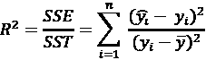

这里，SSE(误差平方和)是与**平方和总和** ( **SST** )的比较，这只是响应的方差。事实上，在统计学中，SST 被定义为你的目标值与其均值之间的平方差:

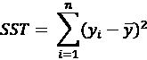

换句话说，R 平方将模型的平方误差与最简单模型的平方误差(响应的平均值)进行比较。由于 SSE 和 SST 具有相同的尺度，R 的平方可以帮助您确定变换目标是否有助于获得更好的预测。

请记住，线性转换，如 minmax([https://sci kit-learn . org/stable/modules/generated/sk learn . minmax scaler . html](https://scikit-learn.org/stable/modules/generated/sklearn.preprocessing.MinMaxScaler.html))或标准化([https://sci kit-learn . org/stable/modules/generated/sk learn . preprocessing . standard scaler . html](https://scikit-learn.org/stable/modules/generated/sklearn.preprocessing.StandardScaler.html))，不会改变任何回归器的性能，因为它们是目标的线性转换。**非线性** 转换，例如平方根、立方根、对数、指数以及它们的组合，应该明确地修改您的回归模型在评估指标上的性能(如果您决定正确的转换，希望会更好)。

MSE 是比较应用于同一问题的回归模型的一个很好的工具。坏消息是 MSE 很少在 Kaggle 比赛中使用，因为 RMSE 是首选。事实上，通过求 MSE 的根，它的值将类似于你的目标的原始比例，并且一眼就能看出你的模型是否做得很好。此外，如果您正在考虑跨不同数据问题(例如，跨各种数据集或数据竞赛)的同一回归模型，R 平方更好，因为它与 MSE 完全相关，其值介于 0 和 1 之间，从而使所有比较更容易。

## 均方根误差(RMSE)

RMSE 只是 MSE 的平方根，但这意味着一些微妙的变化。下面是它的公式:

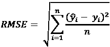

在上面的公式中， *n* 表示事例数，是地面实况，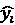表示预测。在 MSE 中，由于平方活动，大的预测误差受到很大的惩罚。在 RMSE，这种优势由于根效应而减弱(然而，你应该总是注意异常值；它们会对你的模型性能产生很大影响，无论你是基于 MSE 还是 RMSE 进行评估)。

因此，根据问题的不同，您可以使用 MSE 作为目标函数的算法获得更好的拟合，首先将平方根应用于您的目标(如果可能，因为它需要正值)，然后对结果求平方。像 Scikit-learn 中的`TransformedTargetRegressor`这样的函数可以帮助您适当地转换您的回归目标，以便获得相对于您的评估度量更好的拟合结果。

最近使用 RMSE 的比赛包括:

*   *Avito 需求预测挑战赛*:[https://www.kaggle.com/c/avito-demand-prediction](https://www.kaggle.com/c/avito-demand-prediction)
*   *谷歌分析客户收入预测*:[https://www.kaggle.com/c/ga-customer-revenue-prediction](https://www.kaggle.com/c/ga-customer-revenue-prediction)
*   *Elo 商家类别推荐*[https://www . ka ggle . com/c/Elo-Merchant-Category-推荐](https://www.kaggle.com/c/elo-merchant-category-recommendation)

## 均方根对数误差

MSE 的另一个常见变换是 **均方根对数误差** ( **RMSLE** )。MCRMSLE 只是新冠肺炎预测竞赛中流行的一个变体，当有多个目标时，它是每个单个目标的 RMSLE 值的列平均值。RMSLE 的公式如下:

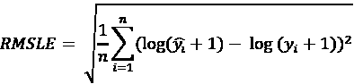

公式中， *n* 表示病例数，为地面实况，为预测。由于您在所有其他平方、平均和求根操作之前对预测值和实际值应用了对数变换，因此不会对预测值和实际值之间的巨大差异造成不利影响，尤其是当两者都是大数值时。换句话说，在使用 RMSLE 时，你最关心的是*你的预测相对于实际情况的规模*。与 RMSE 一样，如果在拟合之前对目标应用对数变换(然后使用指数函数反转效果)，回归的机器学习算法可以更好地优化 RMSLE。

最近使用 RMSLE 作为评估指标的竞赛有:

*   *https://www.kaggle.com/c/ashrae-energy-predictionASHRAE-大能量预言三* :
*   *桑坦德价值预测挑战赛*:[https://www . ka ggle . com/c/桑坦德价值预测挑战赛](https://www.kaggle.com/c/santander-value-prediction-challenge)
*   *Mercari 价格建议挑战*:[https://www.kaggle.com/c/mercari-price-suggestion-challenge](https://www.kaggle.com/c/mercari-price-suggestion-challenge)
*   *Sberbank 俄罗斯房产市场*:[https://www . ka ggle . com/olgabelitskaya/Sberbank-Russian-Housing-Market](https://www.kaggle.com/olgabelitskaya/sberbank-russian-housing-market)
*   *招募餐厅访客预测*:[https://www . ka ggle . com/c/Recruit-Restaurant-Visitor-Forecasting](https://www.kaggle.com/c/recruit-restaurant-visitor-forecasting)

到目前为止，RMSLE 是 Kaggle 竞赛中最常用的回归评估指标。

## 平均绝对误差

**MAE** ( **平均绝对误差**)评估指标是预测值和目标值之差的绝对值。MAE 的公式如下:

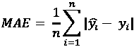

公式中， *n* 代表案例数，为地面真实值，为预测值。MAE 对异常值并不特别敏感(不像 MSE，误差是平方的)，因此您可能会发现它是许多数据集存在异常值的竞赛中的评估指标。此外，你可以很容易地使用它，因为许多算法可以直接使用它作为目标函数；否则，你可以通过训练你的目标的平方根来间接优化它，然后对预测求平方。

就不利方面而言，使用 MAE 作为目标函数会导致收敛速度慢得多，因为您实际上是在优化预测目标的中值(也称为 L1 范数)，而不是通过 MSE 最小化实现的均值(也称为 L2 范数)。这会导致优化器进行更复杂的计算，因此训练时间甚至会根据训练案例的数量呈指数增长(例如，请参见这个堆栈溢出问题:[https://Stack Overflow . com/questions/57243267/why-is-training-a-random-forest-regressor-with-Mae-criterion-so-slow-comparated-to](https://stackoverflow.com/questions/57243267/why-is-training-a-random-forest-regressor-with-mae-criterion-so-slow-compared-to))。

最近使用 MAE 作为评估指标的著名竞赛有:

*   地震预报:[https://www.kaggle.com/c/LANL-Earthquake-Prediction](https://www.kaggle.com/c/LANL-Earthquake-Prediction)
*   雨下了多少？二:[https://www.kaggle.com/c/how-much-did-it-rain-ii](https://www.kaggle.com/c/how-much-did-it-rain-ii)

前面提到了 ASHRAE 竞赛，我们还应该提到回归评估方法与预测竞赛非常相关。例如，最近举行了 M5 预测比赛([https://mofc.unic.ac.cy/m5-competition/](https://mofc.unic.ac.cy/m5-competition/))，所有其他 M 比赛的数据也是可用的。如果你对预测竞赛感兴趣，其中有一些关于 Kaggle 的，请参见[https://robjhyndman.com/hyndsight/forecasting-competitions/](https://robjhyndman.com/hyndsight/forecasting-competitions/)了解 M 竞赛的概况以及 Kaggle 对于从这类竞赛中获得更好的实践和理论结果的价值。

本质上，预测竞赛不需要与回归竞赛有很大不同的评估。在处理预测任务时，确实可以得到一些不同寻常的评估指标，比如**加权均方根比例误差**([https://www . ka ggle . com/c/M5-预测-准确度/概览/评估](https://www.kaggle.com/c/m5-forecasting-accuracy/overview/evaluation)或者**对称平均绝对百分比误差**，更好的称为**sMAPE**([https://www . ka ggle . com/c/demand-demand 然而，最终它们只是通常的 RMSE 或 MAE 的变体，您可以使用正确的目标转换来处理它们。](https://www.kaggle.com/c/demand-forecasting-kernels-only/overview/evaluation)

# 分类指标(标签预测和概率)

在讨论了回归问题的指标之后，我们现在将说明分类问题的指标，从二元分类问题(当您必须在两个类之间进行预测时)开始，移动到多类(当您有两个以上的类时)，然后到多标签(当类重叠时)。

## 准确(性)

在分析二元分类器的性能时，最常用和最容易使用的指标是**准确度**。当你的模型为一个例子预测了错误的类时，一个错误分类错误就是。准确度正好是错误分类误差的补充，并且它可以被计算为正确数字的数量除以答案的数量之间的比率:

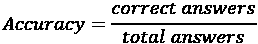

例如，这个指标已经被用于*木薯叶疾病分类*([https://www . ka ggle . com/c/Cassava-Leaf-Disease-class ification](https://www.kaggle.com/c/cassava-leaf-disease-classification))和*文本标准化挑战-英语*([https://www . ka ggle . com/c/Text-Normalization-Challenge-英语](https://www.kaggle.com/c/text-normalization-challenge-english-language))，其中只有当您预测的文本与实际字符串匹配时，您才能获得正确的预测。

作为一个衡量标准，准确性主要集中在模型在真实环境中的有效表现上:它告诉你模型是否像预期的那样工作。但是，如果您的目的是评估和比较，并清楚地了解您的方法实际上有多有效，则在使用精确度时必须谨慎，因为当类别不平衡时(当它们具有不同的频率时)，它可能会导致错误的结论。例如，如果某个类仅占数据的 10%，那么只预测大多数类的预测器将有 90%的准确性，尽管准确性很高，但这证明了它本身是非常无用的。

你如何发现这样的问题？你可以通过使用**混淆矩阵**很容易地做到这一点。在混淆矩阵中，创建一个双向表，将行上的实际类与列上的预测类进行比较。您可以使用 Scikit-learn `confusion_matrix`函数创建一个简单的函数:

```
sklearn.metrics.confusion_matrix(

    y_true, y_pred, *, labels=None, sample_weight=None,

    normalize=None

) 
```

提供`y_true`和`y_pred`向量将足以返回一个有意义的表，但是您还可以为所考虑的示例提供行/列标签和样本权重，并对真实示例(行)、预测示例(列)或所有示例进行归一化(将 marginals 设置为 sum 1)。一个完美的分类器将所有的案例放在矩阵的主对角线上。如果对角线上的某个像元很少或没有案例，则预测值有效性的严重问题会突出显示。

为了让您更好地了解它是如何工作的，您可以尝试 Scikit-learn 在[https://Scikit-learn . org/stable/auto _ examples/model _ selection/plot _ confusion _ matrix . html # sphx-glr-auto-examples-model-selection-plot-confusion-matrix-py](https://scikit-learn.org/stable/auto_examples/model_selection/plot_confusion_matrix.html#sphx-glr-auto-examples-model-selection-plot-confusion-matrix-py)上提供的图形示例:

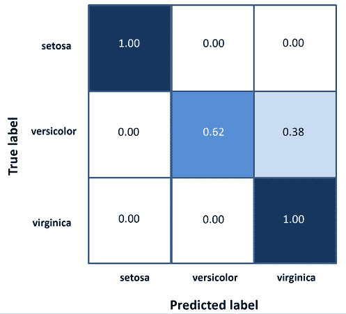

图 5.1:混淆矩阵，每个单元格都归一化为 1.00，表示匹配的份额

您可以尝试通过考虑相对于每个类别的准确性并对其进行平均来提高准确性的可用性，但您会发现依赖其他指标更有用，如**精度**、**召回**和 **F1 分数**。

## 精确度和召回率

为了获得精度和召回指标，我们再次从混淆矩阵开始。首先，我们必须给每个细胞命名:

|  | **预言** |
|  |  | **否定** | **正** |
| **实际** | **否定** | 正确否定 | 假阳性 |
| **阳性** | 假阴性 | 正确肯定 |

表 5.1:单元格名称的混淆矩阵

我们是这样定义细胞的:

*   **TP** ( **真阳性**):这些位于左上角的单元格中，包含被正确预测为阳性的例子。
*   **FP** ( **假阳性**):这些位于右上角的单元格中，包含已经预测为阳性但实际为阴性的例子。
*   **FN** ( **假阴性**):这些位于左下角的单元格中，包含被预测为阴性但实际为阳性的例子。
*   **TN** ( **真阴性**):这些位于右下角的单元格中，包含被正确预测为阴性的例子。

使用这些单元格，您可以实际获得关于您的分类器如何工作以及如何更好地调整您的模型的更精确信息。首先，我们可以很容易地修改精度公式:

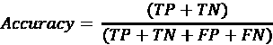

然后，第一个信息性度量被称为**精度**(或**特异性**)，它实际上是阳性病例的准确性:

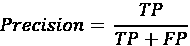

在计算中，只涉及真阳性的数量和假阳性的数量。本质上，这个指标告诉你，当你预测一个积极的结果时，你有多正确。

很明显，你的模型可以通过只预测它有高可信度的例子得到高分。这实际上是该措施的目的:迫使模型只有在确定并且这样做是安全的情况下才预测一个积极的类别。

然而，如果您也希望预测尽可能多的阳性结果，那么您还需要关注**召回**(或**覆盖率**或**敏感度**或甚至**真阳性率**)指标:

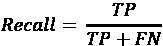

在这里，你还需要了解假否定。关于这两个度量的有趣之处在于，由于它们基于示例分类，而分类实际上是基于概率(通常设置在正类和负类之间的`0.5`阈值)，您可以更改阈值，并以牺牲另一个为代价来改进两个度量中的一个。

例如，如果您增加阈值，您将获得更高的精度(分类器对预测更有信心)，但召回率较低。如果你降低阈值，你会得到更少的精确度，但是更多的回忆。这也被称为**精度/召回权衡**。

Scikit-learn 网站提供了这种权衡的简单而实用的概述([https://sci kit-learn . org/stable/auto _ examples/model _ selection/plot _ precision _ recall . html](https://scikit-learn.org/stable/auto_examples/model_selection/plot_precision_recall.html))，帮助您描绘出一条**精度/召回曲线**，从而了解如何交换这两种度量以获得更符合您需求的结果:


图 5.2:两类精确召回曲线及其特征步骤

与精确度/召回率权衡相关的一个指标是平均精确度**。平均精度计算召回值从 0 到 1 的平均精度(基本上，当阈值从 1 到 0 变化时)。平均精度在与对象检测相关的任务中非常流行，我们将在稍后讨论这一点，但它对于表格数据中的分类也非常有用。在实践中，当您想要以更加精确和准确的方式监控非常罕见的类(当数据极度不平衡时)的模型性能时，它被证明是有价值的，这通常是欺诈检测问题的情况。**

有关这方面更具体的见解，请阅读*盖尔·瓦洛夸的*讨论:[http://盖尔-瓦洛夸. info/interpreting _ ml _ tuto/content/01 _ how _ well/01 _ metrics . html # average-precision](http://gael-varoquaux.info/interpreting_ml_tuto/content/01_how_well/01_metrics.html#average-precision)。

## F1 的分数

在这一点上，你可能已经发现使用精度或召回作为评估指标并不是一个理想的选择，因为你只能以牺牲另一个为代价来优化其中一个。因此，没有任何 Kaggle 竞赛只使用这两个指标中的一个。你应该把它们结合起来(就像平均精度一样)。单一指标，即 **F1 得分**，是精确度和召回率的调和平均值，通常被认为是最佳解决方案:

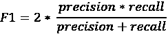

如果你得到一个高的 *F* 1 分，那是因为你的模型在精确度和/或召回率上有所提高。你可以在*Quora**无诚意问题分类*比赛中找到这个指标用法的一个很好的例子([https://www . ka ggle . com/c/Quora-无诚意问题分类](https://www.kaggle.com/c/quora-insincere-questions-classification))。

在某些比赛中，你也会得到 **F-beta** 的分数。这只是精确度和召回率之间的加权调和平均值，β决定召回率在组合分数中的权重:

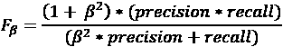

由于我们已经介绍了阈值和分类概率的概念，我们现在可以讨论 log loss 和 ROC-AUC，两者都是非常常见的分类度量。

## 对数损失和 ROC-AUC

先从说起 **log loss** ，在深度学习模型中也被称为**交叉熵** 。测井损失是预测概率和地面真实概率之间的差值；

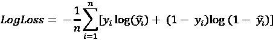

上式中， *n* 代表实例数，是第 *i* 第^第种情况的基础真值，是预测值。

如果竞赛使用对数损失，这意味着目标是尽可能正确地估计示例为正类的概率。实际上，你可以在很多比赛中找到原木损耗。

我们建议你看看，比如，最近的 *Deepfake 检测挑战赛【https://www.kaggle.com/c/deepfake-detection-challenge】()或者更老的 *Quora 问题对*([https://www.kaggle.com/c/quora-question-pairs](https://www.kaggle.com/c/quora-question-pairs))。*

**ROC 曲线**或**接收机工作特性曲线**，是一个用来评估二元分类器的性能和比较多个分类器的图表。它是 ROC-AUC 指标的组成部分，因为该指标只是 ROC 曲线下界定的面积。ROC 曲线由真阳性率(召回率)和假阳性率(被错误归类为阳性的阴性实例的比率)组成。它相当于 1 减去真实负率(被正确分类的负例的比率)。这里有几个例子:

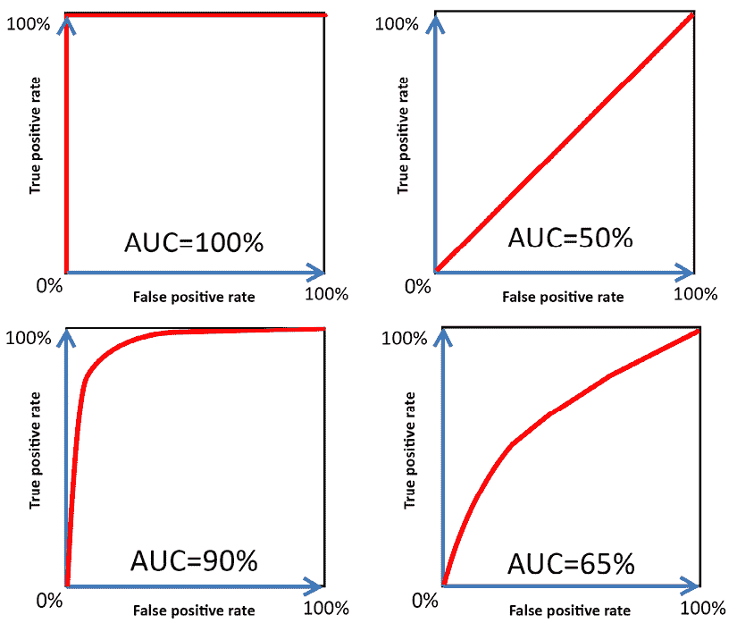

图 5.3:不同的 ROC 曲线及其 AUC

理想情况下，性能良好的分类器的 ROC 曲线应在假阳性率较低的情况下快速攀升真阳性率(召回)。ROC-AUC 在 0.9 到 1.0 之间被认为是非常好的。

通过 ROC 曲线看起来与图表的对角线非常相似(如果不是相同的话),可以发现一个坏的分类器，图表的对角线代表一个纯随机分类器的性能，如上图的左上角所示；ROC-AUC 分数接近 0.5 被认为是几乎随机的结果。如果您正在比较不同的分类器，并且您正在使用曲线 ( **AUC** )下的**面积，面积较大的分类器性能更好。**

如果类别是平衡的，或者不是太不平衡，AUC 的增加与训练模型的有效性成比例，并且它们可以被直观地认为是模型输出更高的真阳性概率的能力。我们也认为它是从正面到负面更恰当地排列例子的能力。然而，当阳性类别罕见时，AUC 开始升高，其增量在更好地预测罕见类别方面可能意义不大。正如我们之前提到的，在这种情况下，平均精度是一个更有用的度量。

AUC 最近被用于相当多的不同比赛。我们建议你看看这三个:

*   【IEEE-CIS 欺诈检测:[https://www.kaggle.com/c/ieee-fraud-detection](https://www.kaggle.com/c/ieee-fraud-detection)T42
*   *Riiid 答案正确性预测*:[https://www.kaggle.com/c/riiid-test-answer-prediction](https://www.kaggle.com/c/riiid-test-answer-prediction)
*   *Jigsaw 多语种毒性评论分类*:[https://www . ka ggle . com/c/Jigsaw-Multilingual-Toxic-Comment-class ification/](https://www.kaggle.com/c/jigsaw-multilingual-toxic-comment-classification/)

你可以在下面的论文里读到详细的论述:苏，w，袁，y，朱，M. *一个平均精度和 ROC 曲线下面积的关系。*2015信息检索理论国际会议论文集。2015.

## 马修斯相关系数

我们用**马修斯相关系数** ( **MCC** )完成我们对二进制分类度量的概述，它的出现在 *VSB 电力线路故障检测*([https://www.kaggle.com/c/vsb-power-line-fault-detection](https://www.kaggle.com/c/vsb-power-line-fault-detection))和*博世生产线性能*([https://www.kaggle.com/c/bosch-production-line-performance](https://www.kaggle.com/c/bosch-production-line-performance))。

MCC 的公式为:

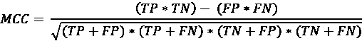

上式中， *TP* 代表真阳性， *TN* 代表真阴性， *FP* 代表假阳性， *FN* 代表假阴性。这与我们讨论精度和召回时遇到的术语相同。

表现为相关系数，换句话说，范围从+1(完全预测)到-1(逆预测)，该度量可以被认为是分类质量的度量，即使当类别非常不平衡时。

尽管它很复杂，但该公式可以重新制定和简化，正如神经元工程师([https://www.kaggle.com/ratthachat](https://www.kaggle.com/ratthachat))在他的笔记本中所展示的那样:[www . ka ggle . com/ratthachat/demythifying-Matthew-correlation-coefficients-MCC](https://www.kaggle.com/ratthachat/demythifying-matthew-correlation-coefficients-mcc)。

神经元工程师在理解评估度量的比率方面所做的工作确实是示范性的。事实上，他重新制定的 MCC 变成了:

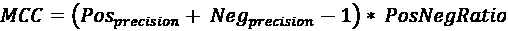

其中，公式中的每个元素是:

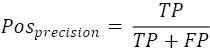

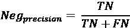

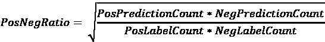

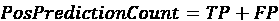

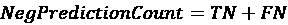

重新表述有助于以一种比原来更容易理解的形式阐明，你可以通过提高正负类精度来获得更高的性能，但这还不够:你还必须拥有与基本事实成比例的正负预测，否则你的提交将受到极大的惩罚。

# 多类分类的度量

在进行多类别分类时，您只需使用我们刚刚看到的应用于每个类别的二元分类指标，然后使用一些常用于多类别情况的平均策略对其进行总结。

例如，如果您想根据 *F* 1 的分数来评估您的解决方案，您有三种可能的平均选择:

*   **宏平均**:简单的计算每个班级的 *F* 1 分数，然后平均所有结果。通过这种方式，每个类都将与其他类一样重要，无论其正面案例出现的频率有多高，或者它们对您的问题有多重要，因此，当模型在任何类中都表现不佳时，会导致相等的惩罚:

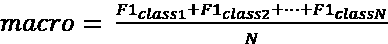

*   **微平均**:这种方法将把每个类的所有贡献相加，计算出一个总分数 *F* 1。它不会对任何类别产生特别的偏袒或惩罚，因为所有的计算都是在不考虑每个类别的情况下进行的，所以它可以更准确地说明类别的不平衡:


*   **加权**:与宏平均一样，首先计算每个类别的 *F* 1 分数，然后使用取决于每个类别真实标签数量的权重对所有类别进行加权平均。通过使用这样的一组权重，您可以考虑每个类的阳性案例的频率或该类与您的问题的相关性。这种方法明显有利于大多数类，它们在计算中的权重更大:

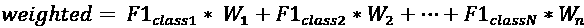

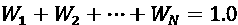

您可能在 Kaggle 竞赛中遇到的常见多级指标有:

*   **多类精度(加权)** : *孟加拉语。艾手写字素分类* ( [的](https://www.kaggle.com/c/bengaliai-cv19))
*   **多类对数损失(meancoumwiselogsloss)**:*作用机制(MoA)* *预测*([https://www.kaggle.com/c/lish-moa/](https://www.kaggle.com/c/lish-moa/))
*   **宏-F1** 和**微-F1 (NQMicroF1)** : *利物浦大学-离子切换*([https://www.kaggle.com/c/liverpool-ion-switching](https://www.kaggle.com/c/liverpool-ion-switching))，*人类蛋白质图谱图像分类*([https://www . ka ggle . com/c/Human-Protein-Atlas-Image-class ification/](https://www.kaggle.com/c/human-protein-atlas-image-classification/))，*tensor flow**2*
*   **均值-F1** : *专柜-价格匹配保证*([https://www.kaggle.com/c/shopee-product-matching/](https://www.kaggle.com/c/shopee-product-matching/))。这里，为每个预测的行计算 *F* 1 分数，然后求平均值，而宏 F1 分数被定义为类方式/标签方式 *F* 1 分数的平均值。

然后还有**二次加权 Kappa** ，我们将在后面探索它作为有序预测问题的智能评估指标。最简单的形式是 **科恩卡帕**分数，它只是衡量你的预测和现实之间的一致程度。这个度量标准实际上是为测量**内部注释协议**而创建的，但是它真的很通用，甚至有更好的用途。

什么是内部注释协议？让我们假设你有一个标签任务:根据一些照片是否包含一只猫、一只狗或者两者都不包含来对它们进行分类。如果你让一组人帮你完成任务，你可能会招致一些错误的标签，因为有人(在这种任务中称为*法官*)可能会把狗误解为猫，反之亦然。正确完成这项工作的聪明方法是将这项工作分配给标记相同照片的多个法官，然后根据科恩卡帕评分衡量他们的一致程度。

因此，Cohen Kappa 被设计为表示两个注释者在标记(分类)问题上的一致程度的分数:

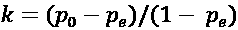

公式中， *p* [0] 为评分者之间的相对观察一致， *p* [e] 为机会一致的假设概率。使用混淆矩阵命名法，这可以改写为:

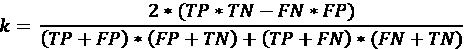

该公式有趣的一面是，分数考虑了协议只是偶然发生的经验概率，因此该度量对所有最可能的分类都有修正。度量范围从 1(表示完全同意)到-1(表示法官完全反对对方(完全不同意))。

0 左右的值意味着法官之间的一致和不一致仅仅是偶然发生的。这有助于您判断模型在大多数情况下是否真的比随机情况表现得更好。


安德烈·卢基扬科

[https://www.kaggle.com/artgor](https://www.kaggle.com/artgor)

我们第二次采访了 Andrey Lukyanenko，他是一位笔记和讨论大师和竞赛大师。在他的日常工作中，他是 MTS 集团的机器学习工程师和技术主管。他有许多有趣的事情要说，关于他的卡格尔经历！

你最喜欢哪种比赛，为什么？就技术和解决方法而言，你在 Kaggle 上的专长是什么？

我更喜欢解决方案足够通用，可以转移到其他数据集/领域的竞赛。我对尝试各种神经网络架构、最先进的方法和后处理技巧很感兴趣。我不喜欢那些需要逆向工程或创建一些“黄金特征”的竞赛，因为这些方法在其他数据集中不适用。

当你在 Kaggle 上比赛时，你也成为了笔记本(排名第一)和讨论的大师。你投资这两个目标了吗？

我已经投入了大量的时间和精力来写笔记，但是关于特级大师等级的讨论还是自行其是。

*先说笔记本排名。*

*2018 年有一个特殊的比赛，叫做 DonorsChoose.org 应用筛选。DonorsChoose 是一个基金，它使全国各地的公立学校教师能够为他们的学生申请急需的材料和经验。它组织了一场比赛，获胜的解决方案不是基于排行榜上的分数，而是基于笔记本上的投票数。这看起来很有趣，我为比赛写了一个笔记本。许多参与者在社交媒体上宣传他们的分析，我也一样。结果我到了第二名，赢了一本 Pixelbook(我还在用！).*

*这次成功激励了我，我继续写笔记本。起初，我只是想分享我的分析并获得反馈，因为我想尝试与其他人比较我的分析和可视化技能，看看我能做什么以及人们对它的看法。人们开始喜欢我的玉米粒，我想进一步提高我的技能。另一个动机是希望提高我快速制作 MVP(最小可行产品)的技能。当一个新的比赛开始时，许多人开始写笔记本，如果你想成为第一批，你必须能够在不牺牲质量的情况下快速完成。这很有挑战性，但是很有趣，也很有收获。*

*2019 年 2 月能够拿到笔记本特级大师等级；一段时间后，我达到了第一名，并保持了一年多。现在我写笔记本的频率降低了，但我仍然喜欢这样做。*

至于讨论，我认为这是自然而然的事情。我回答了笔记本上的评论，分享和讨论了我参加的比赛的想法，我的讨论排名稳步上升。

告诉我们你参加的一个特别有挑战性的比赛，以及你用什么样的洞察力来完成这个任务。

*那是*预测分子性质*的竞赛。我在这里写了一篇关于它的更详细的博文(*[https://towardsdatascience . com/a-story-of-my-first-gold-dead-in-one-ka ggle-competition-things-done-and-lessons-learned-c 269d 9 c 233d 1](https://towardsdatascience.com/a-story-of-my-first-gold-medal-in-one-kaggle-competition-things-done-and-lessons-learned-c269d9c233d1)*)。这是一场针对特定领域的竞赛，旨在预测分子中原子之间的相互作用。核磁共振(NMR)是一种使用类似于 MRI 的原理来了解蛋白质和分子的结构和动力学的技术。世界各地的研究人员进行核磁共振实验，以进一步了解分子的结构和动力学，涉及环境科学、制药科学和材料科学等领域。在这次比赛中，我们试图预测一个分子中两个原子之间的磁相互作用(标量耦合常数)。量子力学的最新方法可以计算出这些耦合常数，只要给定一个 3D 分子结构作为输入。但是这些计算非常耗费资源，所以不能总是使用。如果机器学习方法可以预测这些值，这将真正有助于药物化学家更快、更便宜地获得结构洞察力。*

我通常为新的 Kaggle 竞赛编写 EDA 内核，这次也不例外。Kaggle 竞赛中表格数据的常用方法是广泛的特征工程和使用梯度推进模型。我在早期的尝试中也使用了 LGBM，但是我知道应该有更好的方法来处理图形。我意识到领域专业知识将提供一个重要的优势，所以我搜寻每一条这样的信息。当然，我注意到有几个活跃的专家，他们在论坛上写文章，创建内核，所以我从他们那里读到了一切。有一天，我收到了一封来自这一领域专家的电子邮件，他认为我们的技能可以互补。通常，我更喜欢一个人参加比赛，但在这种情况下，联合起来对我来说似乎是个好主意。这个决定被证明是一个伟大的决定！随着时间的推移，我们能够聚集一个惊人的团队。

过了一段时间，我们注意到神经网络在竞赛中的潜力:著名的 Kaggler，Heng，发布了一个(消息传递神经网络)模型的例子。一段时间后，我甚至能够运行它，但结果比我们的模型更差。然而，我们的团队知道，如果我们想要志存高远，我们就需要使用这些神经网络。看到 Christof 能够以极快的速度构建新的神经网络，真是令人惊讶。很快，我们只专注于开发这些模型。

从那以后，我的角色变成了一个支持者。我对我们的神经网络做了很多实验:尝试各种超参数，不同的架构，对训练计划的各种小调整，等等。有时，我对我们的预测进行 EDA，以找到我们感兴趣或错误的案例，后来我们使用这些信息来进一步改进我们的模型。

*我们获得了第 8* ^(第 8)*名，在这次比赛中我学到了很多东西。*

Kaggle 对你的职业生涯有帮助吗？如果有，如何实现？

Kaggle 无疑帮了我很多，尤其是在我的技能和我的个人品牌方面。编写和出版 Kaggle 笔记本不仅教会了我 EDA 和 ML 技能，还迫使我变得适应性更强，能够快速理解新的主题和任务，在各种方法之间更有效地迭代。同时，它为我提供了一定程度的可见性，因为人们欣赏我的工作。

*我的第一个作品集(*[https://erlemar.github.io/](https://erlemar.github.io/)*)有很多不同的笔记本，其中一半是基于旧的 Kaggle 比赛。这对我找到第一份工作绝对有帮助。我在 Kaggle 上的成就还帮助我吸引了好公司的招聘人员，有时甚至跳过了面试过程中的一些步骤，甚至让我得到了几份咨询工作。*

以你的经验来看，没有经验的 Kagglers 经常会忽略什么？你现在知道了什么，你希望在你刚开始的时候就知道？

*我认为我们需要将缺乏经验的 Kaggler 分成两组:那些在数据科学方面缺乏经验的人和那些在 ka ggle 上缺乏经验的人。*

*一般来说，那些缺乏经验的人会犯一些不同的错误(没关系，每个人都有起点):*

*   *最严重的问题之一:缺乏批判性思维，不知道如何做自己的研究；*
*   不知道何时使用什么工具/方法；
*   *盲目拿公用笔记本，不了解其工作原理就使用；*
*   执着于某个想法，花太多时间去追求它，即使它不起作用；
*   当他们的实验失败时，他们感到绝望并失去动力。

对于那些有数据科学经验但没有 Kaggle 经验的人，我想说他们忽略的最严重的事情是他们低估了 Kaggle 的难度。他们不期望 Kaggle 很有竞赛力，不期望你需要尝试许多不同的事情才能成功，不期望有许多只在比赛中有效的技巧，不期望有人专业地参与比赛。

另外，人们经常高估领域专业知识。我承认，当有领域专家的团队赢得金牌和奖金时，有许多比赛，但在大多数情况下，经验丰富的 Kagglers 获胜。

此外，我也多次看到以下情况:有人宣称赢得 Kaggle 很容易，他(或他的团队)将在不久的将来获得一枚或多枚金牌。在大多数情况下，他们无声无息地失败了。

你在过去的比赛中犯过什么错误？

*   *不够*不够*在数据中寻找。因此，有时我无法生成更好的特征或应用更好的后处理。而储备工程和“黄金特性”是一个完整的附加话题。*
*   在一个想法上花太多时间，因为我希望它能行得通。这被称为沉没成本谬误。
*   *实验不够。努力是有回报的——如果你没有在比赛上花费足够的时间和资源，你就不会在排行榜上获得高名次。*
*   *进入“错误”的竞赛。有泄漏、逆向工程等方面的竞赛。在公开和私下的测试数据之间存在不合理的分割，这导致了一场大变动。有些比赛对我来说不够有趣，我不应该开始参加它们。*
*   *与错误的人合作。有时候我的队友没有我期望的那么积极，这导致了更差的团队分数。*

当一个人参加比赛时，他应该记住或做的最重要的事情是什么？

我认为重要的是记住你的目标，知道你准备在这场比赛中投入什么，并思考可能的结果。人们在参加比赛时有许多可能的目标:

*   *赢得* *宁钱或获得奖牌；*
*   获得新技能或提高现有技能；
*   *处理新的任务/领域；*
*   *联网；*
*   *公关；*
*   *等；*

*当然，也有可能有多种动机。*

至于你准备投资什么，这通常取决于你准备投入的时间和精力以及你拥有的硬件。

当我谈到结果时，我指的是比赛结束时会发生什么。你可能会在这场比赛中投入很多并取得胜利，但你也可能会失败。你准备好面对这个现实了吗？赢得一场特殊的比赛对你来说很重要吗？也许你需要做好投入更多努力的准备；另一方面，也许你有长期目标，一次失败的竞赛不会有多大伤害。

# 对象检测问题的度量

近年来，深度学习比赛在 Kaggle 上越来越常见。这些竞赛中的大多数都集中在图像识别或自然语言处理任务上，并不需要使用与我们到目前为止探索的评估度量有很大不同的评估度量。然而，一些特定的问题需要一些特殊的度量来正确评估:那些与**对象检测**和**分割**相关的问题。

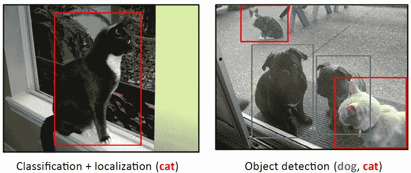

图 5.4:计算机视觉任务。(来源:https://cocodataset.org/#explore?id=38282,·https://cocodataset.org/#explore?id=68717)

在**对象检测**中，你不必对图像进行分类，而是找到图片的相关部分并相应地标记它们。例如，在*图 5.4* 中，对象检测分类器被委托在照片中定位图片中出现狗或猫的部分，并用适当的标签对它们进行分类。左边的例子显示了使用矩形框(称为**边界框**)的猫的定位。右边的例子展示了如何通过边界框检测图片中的多只猫和狗，然后正确分类(蓝色边界框是狗，红色边界框是猫)。

为了描述对象的空间位置，在对象检测中我们使用**边界框**，它定义了对象所在的矩形区域。通常使用两个( *x* ， *y* )坐标来指定边界框:左上角和右下角。就机器学习算法而言，找到边界框的坐标对应于将回归问题应用于多个目标。然而，你很可能不会从零开始框定问题，而是依赖于预先构建的、往往是预先训练好的模型，如马斯克 R-CNN([https://arxiv.org/abs/1703.06870](https://arxiv.org/abs/1703.06870))、retina net([https://arxiv.org/abs/2106.05624v1](https://arxiv.org/abs/2106.05624v1))、FPN([https://arxiv.org/abs/1612.03144v2](https://arxiv.org/abs/1612.03144v2))、约罗([https://arxiv.org/abs/1506.02640v1](https://arxiv.org/abs/1506.02640v1))、更快的 R-CNN([https://arxiv.org/abs/1506.01497v1](https://arxiv.org/abs/1506.01497v1))或 SDD([https://arxiv.org/abs/1512.02325](https://arxiv.org/abs/1512.02325))。

在**分割**中，你改为在*像素*级别进行分类，所以如果你有一个 320x200 的图像，你实际上必须进行 64，000 个像素分类。根据任务的不同，您可以使用**语义分割**，使用对照片中的每个像素进行分类，或者使用**实例分割**，您只需对代表某种感兴趣类型的对象的像素进行分类(例如，下面的*图 5.5* 中的一只猫):

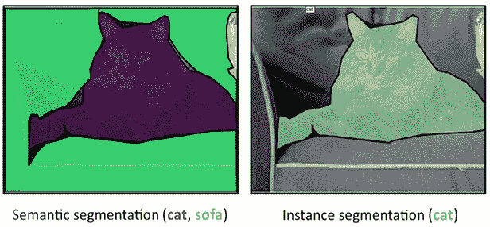

图 5.5:同一张图片上的语义分割和实例分割。(来源:https://cocodataset.org/#explore?id=338091)

让我们从这些任务的特定度量的概述开始，这些度量可以很好地解决这两个问题，因为在这两种情况下，您都是在预测图片的整个区域(对象检测中的矩形区域，分割中的多边形区域),并且您必须将您的预测与地面事实进行比较，地面事实也是以区域表示的。在分割方面，最简单的度量是**像素精度**，顾名思义，就是像素分类上的精度。

这不是一个很好的衡量标准，因为正如在二进制和多类问题上发生的准确性一样，如果相关像素没有占据图像的很大部分，您的分数可能看起来很高(您只是预测了多数声明，因此您没有分段)。

因此，有两个度量标准用得更多，尤其是在竞赛中:并的**交集**和**骰子系数**。

## 并集上的交集

并集上的**交集** ( **IoU** )也被称为JAC card 索引。当用于分段问题时，使用 IoU 意味着你有两个图像要比较:一个是你的预测，另一个是揭示基本事实的掩码，它通常是一个二进制矩阵，其中值 1 代表基本事实，否则为 0。在多个对象的情况下，您有多个掩码，每个掩码都标有对象的类。

当用于物体检测问题时，你有两个矩形区域的边界(预测区域和地面真实区域)，由它们的顶点坐标表示。对于每个分类类，计算预测值和地面真实值掩膜之间的重叠面积，然后将其除以预测值和地面真实值之间的联合面积，该总和考虑了任何重叠。这样，如果您预测的面积比应该预测的面积大(分母会更大)或小(分子会更小)，您就会受到相应的惩罚:

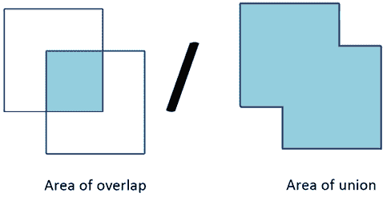

图 5.6:IoU 计算的直观表示

在*图 5.6* 中，您可以看到计算中所涉及区域的直观表示。通过想象方块更多地重叠，你可以计算出当你的预测超过它时(联合的区域变得更大)，度量如何有效地惩罚你的解决方案。

以下是一些使用 IoU 的比赛示例:

*   【https://www.kaggle.com/c/tgs-salt-identification-challenge/】T21()用交集结束联合对象分割
*   *iMaterialist (Fashion) 2019 在 fgvc 6*([https://www.kaggle.com/c/imaterialist-fashion-2019-FGVC6](https://www.kaggle.com/c/imaterialist-fashion-2019-FGVC6))与联合对象分割与分类的交集
*   *空中客车飞船探测挑战*([https://www.kaggle.com/c/airbus-ship-detection](https://www.kaggle.com/c/airbus-ship-detection))与交集超过联合物体分割测试版

## 骰子

另一个有用的度量是**骰子系数**，它是预测和基础真实值之间的重叠面积的两倍，然后除以预测和基础真实值面积的总和:

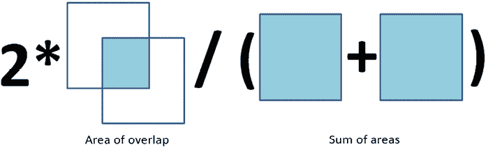

图 5.7:骰子计算的可视化表示

在这种情况下，就 Jaccard 指数而言，您没有考虑分母中预测与基本事实的重叠。这里的期望是，当您最大化重叠区域时，您可以预测正确的区域大小。同样，如果你预测的面积比你应该预测的要大，你会受到惩罚。事实上，这两个度量是正相关的，并且它们对于单个分类问题产生几乎相同的结果。

当您处理多个类时，实际上会产生差异。事实上，无论是 IoU 还是 Dice 系数，当你有多个类时，你要对所有类的结果进行平均。然而，在这样做时，如果单个类别预测错误，IoU 指标倾向于对整体平均值进行更多惩罚，而 Dice 系数则更宽松，倾向于代表平均性能。

使用骰子系数的 Kaggle 比赛示例(在有医疗目的的比赛中经常遇到，但不一定只有那里，因为它也可以用于云和汽车):

*   *HuBMAP -黑客入侵肾脏*:【https://www.kaggle.com/c/hubmap-kidney-segmentation 
*   【https://www.kaggle.com/c/ultrasound-nerve-segmentation】超声波神经分割 : [超声波神经分割](https://www.kaggle.com/c/ultrasound-nerve-segmentation)
*   *从卫星图像中了解云*:[https://www.kaggle.com/c/understanding_cloud_organization](https://www.kaggle.com/c/understanding_cloud_organization)
*   *卡瓦纳图像屏蔽挑战*:[https://www.kaggle.com/c/carvana-image-masking-challenge](https://www.kaggle.com/c/carvana-image-masking-challenge)

IoU 和 Dice 构成了分割和对象检测中所有更复杂指标的基础。通过为 IoU 或 Dice 选择适当的阈值水平(通常为 0.5)，您可以决定是否确认检测，从而确认分类。在这一点上，您可以使用之前讨论过的分类指标，如精度、召回率和 *F* 1，如在流行的对象检测和分割挑战中所做的，如 Pascal VOC([http://host.robots.ox.ac.uk/pascal/VOC/voc2012](http://host.robots.ox.ac.uk/pascal/VOC/voc2012)或 COCO([https://cocodataset.org](https://cocodataset.org))。

# 多标签分类和推荐问题的度量

推荐系统是数据分析和机器学习最受欢迎的应用之一，Kaggle 上有相当多的竞赛对手使用了推荐方法。比如说，*快，画！涂鸦识别挑战*是一个被评估为推荐系统的预测。然而，Kaggle 上的其他一些比赛确实努力建立有效的推荐系统(如 *Expedia 酒店推荐*:[https://www.kaggle.com/c/expedia-hotel-recommendations](https://www.kaggle.com/c/expedia-hotel-recommendations))和 RecSYS，推荐系统会议([https://recsys.acm.org/](https://recsys.acm.org/))，甚至在 Kaggle 上举办了一年一度的比赛(*RecSYS 2013*:[https://www.kaggle.com/c/yelp-recsys-2013](https://www.kaggle.com/c/yelp-recsys-2013))。

**K 处的平均精度** ( **MAP@{K}** )通常是评估推荐系统性能的选择指标，也是在 Kaggle 上所有试图构建或解决推荐系统问题的竞赛中最常见的指标。

还有一些其他指标，如 k 处的**精度，或 **P@K** ，以及 k** 处的**平均精度，或 **AP@K** ，这些都是损失函数，换句话说，是在每个单个预测的级别上计算的。了解它们的工作原理可以帮助您更好地理解 MAP@K 以及它在推荐和多标签分类中的表现。**

事实上，类似于推荐系统，多标签分类意味着你的模型输出一系列的类别预测。这种结果可以使用一些二元分类指标的一些平均值来评估(例如在*希腊媒体监测多标签分类(WISE 2014)* 中，它使用了平均值 *F* 1 得分:[https://www.kaggle.com/c/wise-2014](https://www.kaggle.com/c/wise-2014))以及更典型的推荐系统指标，例如 MAP@K。最后，您可以将推荐和多标签预测作为*排序任务*来处理，这将转化为推荐系统中的一组排序建议和一个集合

## 地图@{K}

MAP@K 是一个复杂的度量标准，它来源于许多计算。为了全面理解 MAP@K 度量，让我们从最简单的部分开始，即 **k** ( **P@K** )处的**精度。在这种情况下，由于一个示例的预测是一个排序的预测序列(从最有可能到最不可能)，该函数只考虑前 *k* 个预测，然后它计算得到多少个与基本事实相匹配的预测，并将该数字除以 *k* 。简而言之，它非常类似于对 k 个预测进行平均的准确度测量。**

就计算的而言有点复杂，但概念上很简单，在 **k** ( **AP@K** )的**平均精度是对从 *1* 到 *k* 的所有值计算的 P@K 的平均值。通过这种方式，该指标将评估预测的总体效果，首先使用前两个预测，然后是前两个预测，依此类推，直到前 *k* 个预测。**

最后， **MAP@K** 是整个预测样本的 AP@K 的平均值，它是一个度量，因为它包含了评估中的所有预测。下面是你能在 *Expedia 酒店推荐*比赛([https://www.kaggle.com/c/expedia-hotel-recommendations](https://www.kaggle.com/c/expedia-hotel-recommendations))中找到的地图@5 配方:

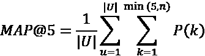

在公式中，是用户推荐的数量， *P(k)* 是截止点的精度 *k* ，而 *n* 是预测的酒店聚类的数量(您可以为每个推荐预测多达 5 家酒店)。

这显然比我们的解释更令人生畏，但公式只是表达了 MAP@K 是所有预测的所有 AP@K 评估的平均值。

完成了对不同回归和分类指标的具体指标的概述后，让我们讨论如何在 Kaggle 竞赛中处理评估指标。

# 优化评估指标

总结到目前为止我们所讨论的内容，目标函数是你的学习算法中的一个函数，它衡量算法的内部模型与所提供的数据的拟合程度。目标函数还向算法提供反馈，以使其在连续迭代中提高拟合度。显然，由于整个算法的努力都是基于目标函数来执行的，所以如果 Kaggle 评估度量与您的算法的目标函数完美匹配，您将获得最佳结果。

不幸的是，这种情况并不常见。通常，所提供的评估度量只能通过现有的目标函数来近似。获得一个好的近似值，或者努力使你的预测在评估标准方面表现得更好，是在 Kaggle 比赛中表现良好的秘诀。当您的目标函数与您的评估指标不匹配时，您有几个备选方案:

1.  修改您的学习算法，并让它包含一个与您的评估指标相匹配的目标函数，尽管这并不是对所有算法都可行的(例如，LightGBM 和 XGBoost 等算法允许您设置自定义目标函数，但大多数 Scikit-learn 模型不允许这样做)。
2.  调整您的模型的超参数，选择那些在使用评估指标时使结果最突出的参数。
3.  对结果进行后处理，使其更符合评估标准。例如，你可以编写一个优化器来对你的预测进行转换(概率校准算法就是一个例子，我们将在本章的最后讨论它们)。

将竞赛指标整合到机器学习算法中确实是实现更好预测的最有效方法，尽管只有少数算法可以使用竞赛指标作为目标函数。第二种方法是,因此也是更常见的一种方法，许多竞赛最终都是为了获得最佳超参数，让您的模型在评估指标上表现出色。

如果您已经编写了评估函数，那么进行正确的交叉验证或选择合适的测试集将发挥最大的作用。如果你手头没有编码的函数，你必须首先按照 Kaggle 提供的公式，用合适的方式编码。

不变的是，做以下事情会有所不同:

*   在搜索引擎上查找关于评估指标及其编码功能的所有相关信息
*   浏览最常见的软件包(如 Scikit-learn:[https://Scikit-learn . org/stable/modules/model _ evaluation . html # model-evaluation](https://scikit-learn.org/stable/modules/model_evaluation.html#model-evaluation)或 tensor flow:[https://www.tensorflow.org/api_docs/python/tf/keras/losses](https://www.tensorflow.org/api_docs/python/tf/keras/losses))
*   浏览 GitHub 项目(例如，*本·哈默的*度量项目:【https://github.com/benhamner/Metrics】T2
*   在论坛和可用的 Kaggle 笔记本中询问或查找(针对当前比赛和类似比赛)
*   此外，正如我们之前提到的，查询元 Kaggle 数据集(【https://www.kaggle.com/kaggle/meta-kaggle】)并查看**竞赛**表将帮助您找到其他哪些 Kaggle 竞赛使用了相同的评估指标，并立即为您提供有用的代码和想法供您尝试

让我们更详细地讨论一下，当你的评估指标与你的算法的目标函数不匹配时，你有哪些选择。我们将从探索自定义指标开始。

## 自定义指标和自定义目标函数

当您的目标函数与您的评估指标不匹配时，作为第一个选项，我们在上面了解到，您可以通过创建您自己的自定义目标函数来解决这个问题，但是只有少数算法可以轻松地修改以合并特定的目标函数。

好消息是，允许这样做的少数算法是 Kaggle 竞赛和数据科学项目中最有效的算法之一。当然，创建自己的自定义目标函数听起来可能有点棘手，但这是一种在比赛中增加分数的非常有益的方法。例如，在使用梯度增强算法(如 XGBoost、CatBoost 和 LightGBM)以及基于 TensorFlow 或 PyTorch 的所有深度学习模型时，可以选择这样做。

您可以在此处找到 TensorFlow 和 PyTorch 中关于自定义指标和目标函数的优秀教程:

*   [https://towards data science . com/custom-metrics-in-keras-and-how-simple-they-to-use-in-tensor flow 2-2-6d 079 C2 ca 279](https://towardsdatascience.com/custom-metrics-in-keras-and-how-simple-they-are-to-use-in-tensorflow2-2-6d079c2ca279)
*   [https://petamind.com/advanced-keras-custom-loss-functions/](https://petamind.com/advanced-keras-custom-loss-functions/)
*   [https://kevinmusgrave . github . io/py torch-metric-learning/extend/loss/](https://kevinmusgrave.github.io/pytorch-metric-learning/extend/losses/)

这些将为您提供基本的函数模板和一些关于如何编写自定义目标或评估函数的有用建议。

如果你只想直接得到你需要的自定义目标函数，你可以通过 RNA([https://www.kaggle.com/bigironsphere](https://www.kaggle.com/bigironsphere)):[https://www . ka ggle . com/bigiron sphere/loss-function-library-keras-py torch/Notebook](https://www.kaggle.com/bigironsphere/loss-function-library-keras-pytorch/notebook))来试试这款笔记本。它包含了在不同比赛中出现的 TensorFlow 和 PyTorch 的大量自定义损失函数。

如果您需要在 LightGBM、XGBoost 或 CatBoost 中创建自定义损失，如它们各自的文档中所示，您必须编写一个函数，该函数将预测和地面实况作为输入，并将梯度和 hessian 作为输出返回。

你可以参考这篇关于栈溢出的文章来更好地理解什么是梯度和 hessian:[https://stats . Stack exchange . com/questions/231220/how-to-compute-the-gradient-and-hessian-of-logarithmic-loss-question-based](https://stats.stackexchange.com/questions/231220/how-to-compute-the-gradient-and-hessian-of-logarithmic-loss-question-is-based)。

从代码实现的角度来看，你所要做的就是创建一个函数，如果你需要传递更多的参数，而不仅仅是预测标签和真实标签的向量，就使用闭包。下面是一个简单的**聚焦损失**(在林，T-Y .等人的*密集物体探测聚焦损失* : [、](https://arxiv.org/abs/1708.02002)中描述的旨在在损失计算中加重少数类权重的损失)函数的示例，您可以将它用作自己的自定义函数的模型:

```
from scipy.misc import derivative

import xgboost as xgb

def focal_loss(alpha, gamma):

    def loss_func(y_pred, y_true):

        a, g = alpha, gamma

        def get_loss(y_pred, y_true):

            p = 1 / (1 + np.exp(-y_pred))

            loss = (-(a * y_true + (1 - a)*(1 - y_true)) * 

                    ((1 - (y_true * p + (1 - y_true) * 

                     (1 - p)))**g) * (y_true * np.log(p) + 

                    (1 - y_true) * np.log(1 - p)))

            return loss

        partial_focal = lambda y_pred: get_loss(y_pred, y_true)

        grad = derivative(partial_focal, y_pred, n=1, dx=1e-6)

        hess = derivative(partial_focal, y_pred, n=2, dx=1e-6)

        return grad, hess

    return loss_func

xgb = xgb.XGBClassifier(objective=focal_loss(alpha=0.25, gamma=1)) 
focal_loss, which is then fed into an XGBoost instance’s object parameters. The example is worth showing because the focal loss requires the specification of some parameters in order to work properly on your problem (alpha and gamma). The more simplistic solution of having their values directly coded into the function is not ideal, since you may have to change them systematically as you are tuning your model. Instead, in the proposed function, when you input the parameters into the focal_loss function, they reside in memory and they are referenced by the loss_func function that is returned to XGBoost. The returned cost function, therefore, will work, referring to the alpha and gamma values that you have initially instantiated.
```

例子的另一个有趣的方面是，通过 SciPy 中的导数函数，计算成本函数的梯度和 hessian 变得非常容易。如果你的成本函数是可微的，你就不必担心手工做任何计算。然而，创建一个定制的目标函数需要一些数学知识和相当多的努力，以确保它能正常工作。你可以在这里[https://maxhalford.github.io/blog/lightgbm-focal-loss/](https://maxhalford.github.io/blog/lightgbm-focal-loss/)了解到*麦克斯·哈尔福德*在为 LightGBM 算法实现聚焦损失时遇到的困难，以及他是如何克服这些困难的。尽管困难重重，但能够变出一个自定义的损失真的可以决定你在 Kaggle 比赛中的成功，在这场比赛中，你必须从你的模型中提取最大可能的结果。

如果构建自己的目标函数不成功，你可以降低目标，放弃将函数构建为优化器使用的目标函数，而是将其编码为定制的*评估指标*。虽然您的模型不会直接针对此函数进行优化，但您仍然可以通过基于此函数的超参数优化来提高其预测性能。这是我们在上一节中谈到的第二个选项。

请记住，如果您正在从头开始编写一个指标，有时您可能需要遵守某些代码约定，以使您的函数正常工作。例如，如果您使用 Scikit-learn，您必须使用`make_scorer`函数来转换您的函数。`make_scorer`函数实际上是一个包装器，使您的评估函数适合与 Scikit-learn API 一起工作。它将包装您的函数，同时考虑一些元信息，例如是否使用概率估计或预测，是否需要指定预测的阈值，以及最后但并非最不重要的优化的方向性，即您是否希望最大化或最小化它返回的分数:

```
from sklearn.metrics import make_scorer

from sklearn.metrics import average_precision_score

scorer = make_scorer(average_precision_score, 

average='weighted', greater_is_better=True, needs_proba=False) 
```

在上面的例子中，您准备了一个基于平均精度度量的计分器，指定当处理多类分类问题时，它应该使用加权计算。

如果要针对评估指标进行优化，您可以应用网格搜索、随机搜索或一些更复杂的优化(如贝叶斯优化)并找到一组参数，使您的算法针对评估指标实现最佳性能，即使它适用于不同的成本函数。在讨论了模型验证之后，我们将探讨如何最好地安排参数优化并在 Kaggle 竞赛中获得最佳结果，特别是在处理表格数据问题的章节中。

## 对你的预测进行后处理

后处理调整意味着您的预测通过一个函数被转换成其他东西，以便提供更好的评估。构建自定义损失或优化评估指标后，您还可以使用应用于预测的特定函数，利用评估指标的特征来改善结果。让我们以二次加权 Kappa 为例。我们之前提到过，当您必须处理序数值的预测时，这个度量非常有用。概括地说，原始卡帕系数是算法和基本事实之间的一致性的机会调整指数。这是一种准确性测量，通过预测和地面事实之间的匹配是由于一个幸运的机会的概率来校正。

这是 Kappa 系数的原始版本，如前所见:

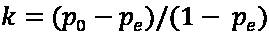

公式中， *p* [0] 为评分者之间的相对观察一致， *p* [e] 为机会一致的假设概率。这里，您只需要两个矩阵，一个具有观察到的分数，另一个具有基于机会一致性的预期分数。当对 Kappa 系数进行加权时，您还要考虑权重矩阵，公式变为:

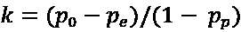

矩阵 *p* 使用二次形式，也就是平方得到的 *k* ，使得惩罚更加严重。然而，优化这样一个指标并不容易，因为很难将它作为一个成本函数来实现。后期处理可以帮到你。

一个例子可以在 *PetFinder.my 领养预测*竞赛([https://www.kaggle.com/c/petfinder-adoption-prediction](https://www.kaggle.com/c/petfinder-adoption-prediction))中找到。在这个竞赛中，假设结果可能有 5 个可能的等级(0、1、2、3 或 4)，您可以使用分类或回归来处理它们。如果使用回归，回归输出的后处理变换可以提高模型相对于二次加权 Kappa 度量的性能，其结果优于直接输出离散预测的分类。

在 PetFinder 竞赛的情况下，后处理包括一个优化过程，首先将回归结果转换为整数，首先使用边界[0.5，1.5，2.5，3.5]作为阈值，然后通过迭代微调，找到一组更好的边界，使性能最大化。边界的微调需要优化器的计算，如 SciPy 的`optimize.minimize`，它基于 Nelder-Mead 算法。优化器发现的边界通过交叉验证方案进行验证。你可以直接从 *Abhishek Thakur* 在比赛期间发的帖子中读到关于这个后期处理的更多细节:[https://www . ka ggle . com/c/pet finder-adoption-prediction/discussion/76107](https://www.kaggle.com/c/petfinder-adoption-prediction/discussion/76107)。

除了 PetFinder 比赛，许多其他比赛都证明了智能后处理可以提高结果和排名。我们将在这里指出几个例子:

*   [https://www . ka ggle . com/khoongweihao/post-processing-technique-c-f-1st-place-jigsaw](https://www.kaggle.com/khoongweihao/post-processing-technique-c-f-1st-place-jigsaw)
*   [https://www . ka ggle . com/tomoiunubushi/后处理基于泄漏](https://www.kaggle.com/tomooinubushi/postprocessing-based-on-leakage)
*   [https://www . ka ggle . com/saitodevel 01/室内-成本最小化后处理](https://www.kaggle.com/saitodevel01/indoor-post-processing-by-cost-minimization)

不幸的是，后处理通常非常依赖于您正在使用的度量(理解度量对于设计任何良好的后处理都是必不可少的)，并且通常也是特定于数据的，例如，在时间序列数据和泄漏的情况下。因此，很难为任何比赛归纳出正确的后处理程序。尽管如此，始终要意识到这种可能性，并在比赛中留意任何后处理结果有利的暗示。你总是可以从以前类似的比赛中得到关于后期处理的暗示，并且通过论坛讨论——最终，有人会提出这个话题。

### 预测概率及其调整

为了完成上面关于度量优化(预测的后处理)的讨论，我们将讨论预测正确概率至关重要，但您不确定您使用的算法是否做得很好的情况。正如我们之前所详述的，分类概率涉及二进制和多类分类问题，通常使用二进制或多类版本中的对数损失(也称为对数损失或逻辑损失或交叉熵损失)来评估分类概率(有关更多详细信息，请参见前面关于分类的*度量(标签预测和概率)*和多类分类的*度量*)。

然而，评估或优化日志丢失可能还不够。在努力使用您的模型实现正确的概率预测时，需要注意的主要问题有:

*   不返回真实概率估计的模型
*   你的问题中的类别分布不平衡
*   您的训练数据和测试数据之间的不同类别分布(在公共和私人排行榜上)

仅第一点就提供了根据建模的不确定性检查和验证分类预测质量的理由。事实上，即使 Scikit-learn 包中提供了许多算法和一个`predict_proba`方法，也很难保证它们会返回真实的概率。

让我们以决策树为例，它是许多对表格数据建模的有效方法的基础。分类决策树([https://sci kit-learn . org/stable/modules/generated/sk learn . tree . decision tree classifier . html](https://scikit-learn.org/stable/modules/generated/sklearn.tree.DecisionTreeClassifier.html))输出的概率基于末端叶子；也就是说，它取决于包含要预测的事例的叶子上的类的分布。如果树完全长成，病例极有可能在其他病例极少的小叶子里，所以预测的概率会很高。如果您更改参数，如`max_depth`、`max_leaf_nodes`或`min_samples_leaf`，根据树的生长情况，结果概率将从较高值急剧变化到较低值。

决策树是最常见的集成基础模型，如 bagging 模型和随机森林，以及增强模型，如梯度增强(其高性能实现 XGBoost、LightGBM 和 CatBoost)。但是，出于同样的原因——概率估计并非真正基于可靠的概率估计——该问题影响了许多其他常用模型，如支持向量机和最近邻。直到 *Otto Group 产品分类挑战赛*([https://www . ka ggle . com/c/Otto-Group-Product-Classification-Challenge/overview/](https://www.kaggle.com/c/otto-group-product-classification-challenge/overview/))之前，这些方面对于 Kagglers 来说大多是未知的，当时是由 *Christophe Bourguignat* 和其他人在比赛期间提出的(见[https://www.kaggle.com/cbourguignat/why-calibration-works](https://www.kaggle.com/cbourguignat/why-calibration-works))，并且在当时使用最近添加到 Scikit-learn 中的校准功能轻松解决了这些问题。

除了您将使用的模型，您的问题中存在的类别不平衡也可能导致模型根本不可靠。因此，在不平衡分类问题的情况下，一种好的方法是使用欠采样或过采样策略来重新平衡类，或者在算法计算损失时为每个类应用不同的自定义权重。所有这些策略可能会使你的模型更有性能；但是，它们肯定会扭曲概率估计，您可能需要调整它们，以便在排行榜上获得更好的模型分数。

最后，第三个关注点与测试集的分布有关。这种信息通常是隐藏的，但通常有方法来估计它并弄清楚它(例如，通过基于公共排行榜结果的试错，正如我们在*第一章*、*介绍 Kaggle 和其他数据科学竞赛*中提到的)。

比如在 *iMaterialist 家具挑战赛*([https://www . ka ggle . com/c/imate rialist-Challenge-Furniture-2018/](https://www.kaggle.com/c/imaterialist-challenge-furniture-2018/))和更受欢迎的 *Quora 问题对*([https://www.kaggle.com/c/quora-question-pairs](https://www.kaggle.com/c/quora-question-pairs))中就出现了这种情况。这两项比赛都引发了关于如何进行后处理以调整概率来测试预期的各种讨论(有关所用方法的更多详细信息，请参见[https://swarbrickjones . WordPress . com/2017/03/28/cross-entropy-and-training-test-class-balancing/](https://swarbrickjones.wordpress.com/2017/03/28/cross-entropy-and-training-test-class-imbalance/)和[https://www . ka ggle . com/dowa kin/probability-calibration-0-005-to-lb](https://www.kaggle.com/dowakin/probability-calibration-0-005-to-lb))。从一般的角度来看，假设您不知道要预测的类的测试分布，根据您从训练数据中获得的先验知识来正确预测概率仍然是非常有益的(在您获得相反的证据之前，这是您的模型应该模拟的概率分布)。事实上，如果您的预测概率分布与训练集中的分布相匹配，那么更正您的预测概率将会容易得多。

当您的预测概率与目标的训练分布不一致时，解决方案是使用 Scikit-learn 提供的 **校准函数**，`CalibratedClassifierCV`:

```
sklearn.calibration.CalibratedClassifierCV(base_estimator=None, *,

    method='sigmoid', cv=None, n_jobs=None, ensemble=True) 
```

校准功能的目的是将后处理功能应用于您的预测概率，以使它们更接近地面实况中看到的经验概率。如果您的模型是 Scikit-learn 模型或行为类似于 Scikit-learn 模型，该函数将充当您的模型的包装器，并将其预测直接传送到后处理函数中。您可以选择使用两种方法进行后处理。首先是 **sigmoid** 方法(也叫 Plat's scaling)，这个无非就是一个逻辑回归。第二种是的**保序回归**，这是一种非参数回归；注意，如果例子很少，它可能会过拟合。

你还必须选择如何安装这个校准器。请记住，这是一个应用于您的模型结果的模型，因此您必须通过系统地修改预测来避免过度拟合。你可以使用一个**交叉验证**(在下一章关于*设计好的验证*中有更多的相关内容)然后产生一些模型，这些模型一旦被平均，将提供你的预测(`ensemble=True`)。否则，这是我们通常的选择，求助于**(在接下来的章节中会有更多的介绍)并使用所有可用的数据进行校准(`ensemble=False`)。**

 **即使`CalibratedClassifierCV`可以处理大多数情况，您也可以找出一些经验方法来修正概率估计，以便在测试时获得最佳性能。你可以使用任何转换函数，例如，从手工的转换函数到由遗传算法得到的复杂的转换函数。你唯一的限制是，你应该交叉验证它，并可能从公共排行榜中获得一个好的最终结果(但不一定，因为你应该更相信你的本地交叉验证分数，我们将在下一章讨论)。silo gram([https://www.kaggle.com/psilogram](https://www.kaggle.com/psilogram))提供了这样一个策略的很好的例子，他在*微软恶意软件分类挑战*中找到了一种方法，通过简单地将随机森林的不可靠概率输出提升到由网格搜索确定的幂，就可以将随机森林的不可靠概率输出调整为概率输出(参见[https://www . ka ggle . com/c/Malware-Classification/discussion/13509](https://www.kaggle.com/c/malware-classification/discussion/13509))。


苏达莱·拉杰库马尔

[https://www.kaggle.com/sudalairajkumar](https://www.kaggle.com/sudalairajkumar)

在本章的最后一次采访中，我们采访了 SRK 的苏达莱·拉杰库马尔，他是竞赛、数据集和笔记本方面的大师，也是一位讨论大师。他在分析 Vidhya 数据科学平台中排名第一，是初创公司的 AI/ML 顾问。

你最喜欢哪种比赛，为什么？从技术和解决途径来说，你在 Kaggle 上的特长是什么？

我最喜欢的竞赛是那些涉及大量功能工程的竞赛。我想这也是我的优势。我一般对数据探索感兴趣，以深入了解数据(这可以从我的一系列简单探索笔记本([【https://www.kaggle.com/sudalairajkumar/code】](https://www.kaggle.com/sudalairajkumar/code)*)中推断出来)，然后在此基础上创建特征。*

你是如何对待一场 Kaggle 比赛的？这种方法与你在日常工作中的做法有什么不同？

*竞赛的框架包括数据探索、寻找正确的验证方法、特征工程、模型构建和组装/堆叠。所有这些都与我的日常工作有关。但除此之外，我的日常工作中还涉及到大量的利益相关者讨论、数据收集、数据标记、模型部署、模型监控和数据讲述。*

告诉我们你参加的一个特别有挑战性的比赛，以及你用什么样的洞察力来完成这个任务。

桑坦德产品推荐*是我们参加的一个难忘的比赛。罗汉&我做了很多功能工程，建立了多个模型。当我们进行最终组装时，我们对不同的产品使用不同的重量，其中一些加起来不到 1。从数据探索和理解中，我们亲手挑选了这些权重，这对我们有帮助。这让我们意识到领域/数据在解决问题中的重要性，以及数据科学既是科学也是艺术。*

Kaggle 对你的职业生涯有帮助吗？如果有，如何实现？

*卡格尔在我的职业生涯中扮演了非常重要的角色。我能保住上两份工作主要是因为卡格尔。此外，Kaggle 的成功有助于轻松地与数据科学领域的其他中坚力量建立联系，并向他们学习。这也对我目前作为初创企业人工智能/人工智能顾问的角色有很大帮助，因为它给了我可信度。*

以你的经验来看，没有经验的 Kagglers 经常会忽略什么？你现在知道了什么，你希望在你刚开始的时候就知道？

*深入了解数据。这一点经常被忽视，人们马上就开始建模。探索数据对于任何 Kaggle 比赛的成功都起着非常重要的作用。这有助于创建适当的交叉验证，创建更好的功能，并从数据中提取更多的价值。*

你在过去的比赛中犯过什么错误？

这是一个非常大的列表，我想说它们是学习的机会。在每次比赛中，在我尝试的 20-30 个想法中，只有 1 个可行。这些错误/失败比实际的成功或成功的事情给人更多的学习。例如，在我第一次参加的比赛中，我通过从前十分之一降到后十分之一的艰难方式学会了过度适应。但是这种学习一直伴随着我。

*对于数据分析/机器学习，您有什么特别推荐的工具或库吗？*

*我主要在表格数据的情况下使用 XGBoost/LightGBM。这些天，我还使用开源 AutoML 库和无人驾驶 AI 来获得早期基准。我用 Keras，Transformers，PyTorch 做深度学习模型。*

当一个人参加比赛时，他应该记住或做的最重要的事情是什么？

一致性是关键。每场比赛都会有自己的起伏。会有很多天没有任何进展，但我们不应该放弃，继续努力。我认为这适用于任何事情，而不仅仅是 Kaggle 比赛。

你使用其他比赛平台吗？他们和 Kaggle 相比如何？

*我还参与了其他平台，如 Analytics vid hya Data hack platform、Driven Data、CrowdAnalytix 等。它们也很好，但 Kaggle 被更广泛地采用，本质上是全球性的，因此 Kaggle 上的竞赛比其他平台要激烈得多。*

# 摘要

在本章中，我们已经讨论了 Kaggle 竞赛中的评估指标。首先，我们解释了评估指标与目标函数的不同之处。我们也谈到了回归和分类问题之间的区别。对于每种类型的问题，我们分析了在 Kaggle 竞赛中最常见的指标。

之后，我们讨论了以前从未在比赛中出现过的指标，这些指标你可能不会再看到。最后，我们探索和研究了不同的通用指标，给出了它们在之前 Kaggle 比赛中的应用示例。然后，我们提出了一些优化评估指标的策略。特别是，我们建议尝试编写您自己的定制成本函数，并就可能有用的后处理步骤提供建议。

现在，您应该已经掌握了评估指标在 Kaggle 竞赛中的作用。您还应该有一个策略来处理每一个常见或不常见的指标，方法是追溯过去的竞赛，并全面了解指标的工作方式。在下一章，我们将讨论如何使用评估指标，并通过验证策略正确评估 Kaggle 解决方案的性能。

# 加入我们书的不和谐空间

加入这本书的 Discord workspace，每月与作者进行一次*向我提问*会议:

[https://packt.link/KaggleDiscord](https://packt.link/KaggleDiscord)

**