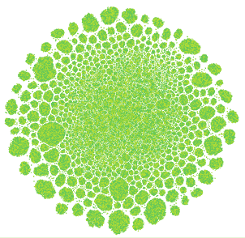
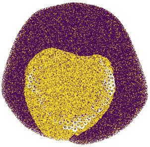
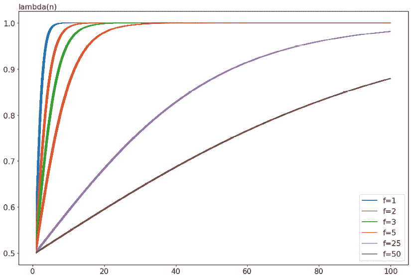
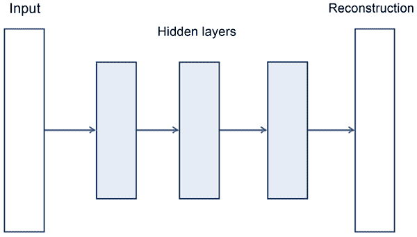
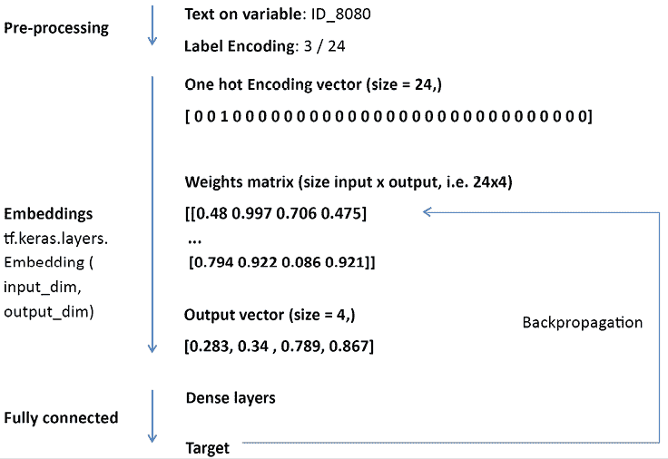

# 七、表格竞赛建模

直到 2017 年，没有必要过多区分比赛类型，而且由于绝大多数比赛都是基于表格数据，你甚至无法在 Kaggle 论坛上找到“表格比赛”的提法。突然，事情发生了变化。在比赛相对短缺(见[https://www.kaggle.com/general/49904](https://www.kaggle.com/general/49904))之后，深度学习比赛占据了上风，表格比赛变得越来越少，令许多人失望。它们变得如此罕见，以至于 Kaggle 最近不得不推出一系列基于合成数据的表格竞赛。发生了什么事？

到 2017-2018 年，数据科学已经完全成熟，许多公司已经开始了他们的数据之旅。数据科学仍然是一个热门话题，但不再是一个不寻常的话题。类似于当时困扰 Kaggle 多年的问题的解决方案已经成为许多公司的标准做法。在这种情况下，赞助商没有动力发起外部表格竞赛，因为他们已经在内部处理同样的问题。相比之下，深度学习仍然是一个未被发现的领域，并将在很长一段时间内继续存在，所以开始竞赛来挑战艺术状态并看看是否有新的东西出现是有意义的。

在本章中，我们将讨论表格竞赛。我们将触及一些著名的历史问题，也将重点关注最近的列表游戏系列，因为列表问题是大多数数据科学家的标准实践，从 Kaggle 确实可以学到很多东西。我们将从讨论**探索性数据分析** ( **EDA** )和**特征工程**开始，这是这些竞赛中常见的两项活动。

在介绍了特征工程的关键策略后，我们将扩展到许多相关的主题，如分类编码、特征选择、目标转换和伪标记。最后，我们将触及表格数据的深度学习方法，介绍一些专门的深度神经网络，如 TabNet，并说明一个去噪自动编码器。我们将解释为什么自动编码器变得与最近的 Kaggle 竞赛如此相关，而在现实世界的应用中仍然处于边缘地位。

我们将涵盖:

*   表格游乐场系列
*   为再现性设置随机状态
*   EDA 的重要性
*   减少数据的大小
*   应用特征工程
*   伪标记
*   使用自动编码器去噪
*   表格竞赛的神经网络

本章不会涵盖与表格竞赛相关的每个主题，但您可以在许多其他书籍中轻松找到，因为它们是数据科学的核心。本章将介绍一系列特殊的技术和方法，这些技术和方法是 Kaggle 上表格比赛的特点，除了在 Kaggle 论坛上，你很难在其他地方找到。

# 表格游乐场系列

由于对表格问题的大量需求，Kaggle 的工作人员在 2021 年开始了一项实验，发起了一项名为表格游乐场系列的月度竞赛。竞赛基于复制公共数据或以前竞赛数据的合成数据集。合成数据是由一个名为 **CTGAN** 的深度学习生成网络创建的。

你可以在 https://github.com/sdv-dev/CTGAN 找到 CTGAN 代码。还有一篇相关论文解释了它是如何通过对表格数据中行的概率分布进行建模，然后生成真实的合成数据来工作的(参见[https://arxiv.org/pdf/1907.00503v2.pdf](https://arxiv.org/pdf/1907.00503v2.pdf))。

麻省理工学院的一个项目，合成数据保险库创造了 CTGAN 背后的技术和许多相关的工具。其结果是一套开源软件系统，旨在帮助企业生成模拟真实数据的合成数据；它可以帮助数据科学家基于真实数据集创建匿名数据集，以及出于建模目的扩充现有数据集。

Kaggle 在 2021 年发起了 13 场相当成功的比赛，尽管不提供积分、奖牌或奖品(只有一些商品)，但这些比赛吸引了许多 ka ggle 人。这里是 2021 年的名单；您可以使用它来按类型或指标定位特定问题，并查找相关资源，如重点讨论或笔记本:

| **月** | **问题** | **变量** | **公制** | **缺失数据** |
| **2021 年 1 月** | 未指明问题的回归 | 数字的 | 均方根误差 | 不 |
| 【2021 年 2 月 | 回归预测保险索赔的价值 | 数字和分类 | 均方根误差 | 不 |
| 【2021 年 3 月 | 预测保险索赔的二元分类法 | 数字和分类 | 罗马纪元 | 不 |
| 【2021 年 4 月 | 在非常类似于原始泰坦尼克号数据集的复制品上的二进制分类 | 数字和分类 | 准确(性) | 是 |
| 【2021 年 5 月 | 多类别分类在给定关于列表的各种属性的情况下，预测电子商务产品的类别 | 绝对的 | 多类对数损失 | 不 |
| 【2021 年 6 月 | 多类别分类在给定关于列表的各种属性的情况下，预测电子商务产品的类别 | 数字和分类 | 多类对数损失 | 不 |
| **2021 年 7 月** | 通过各种输入传感器值(例如，时间序列)预测城市空气污染的多元回归 | 数字，时间 | RMSLE | 是 |
| **2021 年 8 月** | 回归计算与贷款违约相关的损失 | 数字的 | 均方根误差 | 不 |
| **30 天的 ML** | 保险索赔价值的回归 | 数字和分类 | 均方根误差 | 不 |
| **2021 年 9 月** | 预测是否会对保险单提出索赔的二元分类 | 数字的 | 罗马纪元 | 是 |
| **2021 年 10 月** | 二元分类法预测给定不同化学性质的分子的生物反应 | 数字和分类 | 罗马纪元 | 不 |
| **2021 年 11 月** | 通过从电子邮件中提取的各种特征识别垃圾邮件的二元分类 | 数字的 | 罗马纪元 | 不 |
| **2021 年 12 月** | 基于原始*森林覆盖类型预测*竞赛的多类分类 | 数字和分类 | 多类分类准确度 | 不 |

表 7.1:2021 年表格操场系列比赛

表格游乐场竞赛将在 2022 年继续进行，届时会有更复杂、更具挑战性的问题:

| **2022 年 1 月** | 预测两个虚构的独立连锁店的 Kaggle 商品销售额 | 日期和分类 | 对称平均绝对百分比误差 | 不 |
| **2022 年 2 月** | 使用来自包含一些数据压缩和数据丢失的基因组分析技术的数据对 10 种不同的细菌进行分类 | 数字的 | 分类准确性 | 不 |

表 7.2:2022 年表格操场系列比赛

这一章的大部分内容是通过观察这些比赛中出现的代码和讨论编写的，而不是分析过去更辉煌的比赛。正如我们提到的，我们相信表格比赛确实已经一去不复返了，因为职业环境已经发生了变化，你会发现阅读与现在相关的建议和提示比过去更有用。

与其他拥有卡格尔积分和奖牌的成熟比赛一样，在表格比赛中，我们建议您遵循一个简单但非常有效的流程，我们在本书的其他地方已经讨论过:

*   探索性数据分析
*   数据准备
*   建模(使用交叉验证策略进行模型验证)
*   后处理
*   提交

通常，您还必须注意保持重现性，并保存所有模型(来自每个折叠)、所用参数列表、所有折叠预测、所有折叠外预测以及根据所有数据训练的模型的所有预测。

您应该以一种易于恢复和重建的方式保存所有这些信息，例如使用适当的标签，跟踪 MD5 散列值(您可以参考此堆栈溢出答案了解详细信息:[https://Stack Overflow . com/questions/16874598/how-do-I-calculate-the-MD5-checksum-of-a-file-in-python](https://stackoverflow.com/questions/16874598/how-do-i-calculate-the-md5-checksum-of-a-file-in-python))，并跟踪每次实验的 CV 分数和排行榜结果。大多数 Kagglers 使用简单的工具，如`.txt`文件或 Excel 电子表格，但也有更复杂的方法，如使用:

*   **https://dvc.org/**([T40)](https://dvc.org/)
*   **权重和偏差【https://wandb.ai/site】()T42**
*   **ml flow**([https://mlflow.org/](https://mlflow.org/))
*   **海王**([https://neptune.ai/experiment-tracking](https://neptune.ai/experiment-tracking))

最后，重要的是结果，而不是你使用的工具，所以在你的实验和模型中尽你最大的努力保持的秩序，即使是在竞赛最激烈的时候。

在我们继续之前，考虑一下 Kaggle 用来为这些比赛生成数据的技术；如果你能正确理解数据是如何产生的，你将获得一个重要的优势。此外，了解合成数据的工作方式确实会对您在现实世界中进行数据科学的方式产生影响，因为它为您提供了一种轻松获取更多不同数据进行训练的方式。

例如，让我们以*谷歌大脑-呼吸机压力预测*竞赛([https://www.kaggle.com/c/ventilator-pressure-prediction](https://www.kaggle.com/c/ventilator-pressure-prediction))为例。在这个比赛中，你必须为机械通气控制开发机器学习。虽然你可以通过对深度学习提供的数据进行建模来获得良好的结果，但鉴于数据的合成来源，你也可以对其生成过程进行逆向工程，并获得一个排名靠前的结果，正如*君科达*([https://www.kaggle.com/junkoda](https://www.kaggle.com/junkoda))在他的帖子中所做的和解释的:[https://www . ka ggle . com/c/ventilator-pressure-prediction/discussion/285278](https://www.kaggle.com/c/ventilator-pressure-prediction/discussion/285278)。

自己生成人工数据并理解合成数据从未如此容易，这一点你可以从这本笔记本([https://www . ka ggle . com/lucamassaron/how-to-use-ctgan-to-generate-more-data](https://www.kaggle.com/lucamassaron/how-to-use-ctgan-to-generate-more-data))中得到验证，这本书源自一本最初由*Dariush Bahrami*([https://www.kaggle.com/dariushbahrami](https://www.kaggle.com/dariushbahrami))编码并测试的笔记本。

# 为再现性设置随机状态

在我们开始讨论你可能在表格竞赛中使用的步骤和模型之前，回到我们上面提到的**再现性**的主题将是有用的。

在你在 Kaggle 笔记本上看到的大多数命令代码中，你会发现一个参数声明一个数字，一个**种子**，作为随机状态。此设置对于结果的重现性非常重要。由于许多算法不是确定性的，而是基于随机性的，通过设置一个种子，你可以影响随机生成器的行为，使其随机性*可预测*:相同的随机种子对应于相同的随机数序列。换句话说，它允许您在每次运行相同的代码后获得相同的结果。

这就是为什么在 Scikit-learn 的所有机器学习算法以及所有 Scikit-learn 兼容的模型(例如，XGBoost、LightGBM 和 CatBoost 等最受欢迎的模型)中都可以找到随机种子设置参数。

结果的可再现性在现实世界的项目和 Kaggle 竞赛中都很重要。在现实世界中，拥有一个可重复的模型可以更好地跟踪模型开发和一致性。在竞赛中，再现性有助于更好地测试假设，因为你控制了模型中的任何变异来源。例如，如果您创建了一个新的特性，将它放入一个可重现的管道中会帮助您理解该特性是否有利。您可以肯定，模型中的任何改进或恶化都只能归因于该特性，而不能归因于自上次运行模型以来发生变化的某个随机过程的影响。

同样，在处理公共笔记本时，再现性可以成为您的优势。大多数情况下，这些笔记本都有一个固定的种子，可以是 0、1 或 42。值 42 非常受欢迎，因为它参考了道格拉斯·亚当的《银河系漫游指南》，在书中，它是“生命、宇宙和一切事物的终极问题的答案”，由一台名为 Deep think 的巨型超级计算机在 750 万年的时间里计算得出。现在，如果比赛中的每个人都使用相同的随机种子，这可能会产生双重影响:

*   随机种子可能与公共排行榜配合得太好，这意味着过度适应
*   许多 Kagglers 将产生类似的结果，这将以同样的方式影响他们在私人排行榜上的排名

通过改变随机种子，你避免了过度适应，也打破了排名；换句话说，你从其他人那里得到了不同的结果，这最终会让你处于优势。此外，如果你最终赢得了 Kaggle 比赛，你需要展示你的模型是如何产生获奖作品的，所以如果你想快速获得奖品，一切都是完全可复制的是至关重要的。

TensorFlow 和 PyTorch 模型没有明确使用随机种子参数，因此确保它们完全的再现性更具挑战性。以下代码片段在运行时会为 TensorFlow 和 PyTorch 模型设置相同的随机种子:

```
def seed_everything(seed, 

                    tensorflow_init=True, 

                    pytorch_init=True):

    """

    Seeds basic parameters for reproducibility of results

    """

    random.seed(seed)

    os.environ["PYTHONHASHSEED"] = str(seed)

    np.random.seed(seed)

    if tensorflow_init is True:

        tf.random.set_seed(seed)

    if pytorch_init is True:

        torch.manual_seed(seed)

        torch.cuda.manual_seed(seed)

        torch.backends.cudnn.deterministic = True

        torch.backends.cudnn.benchmark = False 
```

至于 Scikit-learn，建议直接设置随机种子——当类或函数允许时——使用`random_state`参数。

# EDA 的重要性

术语 **EDA** 来自于 *John W. Tukey* 的工作，他是现代统计方法论最杰出的代表之一。在他 1977 年的书*探索性数据分析*(因此缩写为 EDA)中，Tukey 认为 EDA 是一种探索数据、发现证据和开发假设的方法，这些假设可以在以后通过统计测试得到证实。

他的想法是，我们如何定义统计假设可以更多地基于观察和推理，而不仅仅是基于数学计算的顺序测试。这个想法很好地解释了机器学习的世界，因为正如我们将在下一节中讨论的那样，数据可以被改进和预消化，以便学习算法可以更好、更有效地工作。

在 Kaggle 竞赛的 EDA 中，您将寻找:

*   缺失值，最重要的是，缺失值模式与目标相关。
*   偏斜数值变量及其可能的转换。
*   分类变量中可以组合在一起的罕见类别。
*   单变量和多变量的潜在异常值。
*   高度相关(甚至重复)的特征。对于分类变量，关注重叠的类别。
*   最能预测问题的特征。

你可以通过几个描述性分析、图形和图表来实现这一点，首先检查每个不同的特征(**单变量分析**，用统计学术语来说)，然后匹配一对变量(**双变量**分析，比如在散点图中)，最后一次性考虑更多的特征(一种**多变量**方法)。

如果你感到懒惰或者不确定如何以及从哪里开始，最初依靠自动化策略可以帮助你。例如，你可能会发现【https://github.com/AutoViML/AutoViz】AutoViz()，一个流行的快速 EDA 免费工具，可以节省你很多时间。您可以通过运行以下命令在笔记本上安装它:

```
pip install git+git://github.com/AutoViML/AutoViz.git 
```

你可以通过阅读[https://towardsdatascience . com/auto viz-a-new-tool-for-automated-visualization-ec9c 1744 a6 ad](https://towardsdatascience.com/autoviz-a-new-tool-for-automated-visualization-ec9c1744a6ad)上的 *Dan Roth* 的这篇中型文章，或者浏览一些有趣的公共笔记本，例如[https://www . ka ggle . com/gvyshnya/automating-EDA-and-feature-importance-detection](https://www.kaggle.com/gvyshnya/automating-eda-and-feature-importance-detection)上的*Georgie*

在后一个链接中，您还会找到对另一个工具的引用，**sweet viz**([https://github.com/fbdesignpro/sweetviz](https://github.com/fbdesignpro/sweetviz))。Sweetviz 有一篇基于 Titanic 数据集的概述文章和教程，位于[https://towards data science . com/powerful-EDA-explorative-data-analysis-in-just-two-line-of-code-using-sweet viz-6c 943d 32 f 34](https://towardsdatascience.com/powerful-eda-exploratory-data-analysis-in-just-two-lines-of-code-using-sweetviz-6c943d32f34)。

另一个你可能会发现有用的流行工具是**Pandas Profiling**([https://github.com/pandas-profiling/pandas-profiling](https://github.com/pandas-profiling/pandas-profiling))，它更依赖于经典的统计描述性统计和可视化，正如本文所解释的:[https://medium . com/analytics-vid hya/Pandas-Profiling-5 ECD 0 b 977 ECD](https://medium.com/analytics-vidhya/pandas-profiling-5ecd0b977ecd)。

等待其他 Kagglers 发布有趣的 EDA 笔记本也可能是一个解决方案，因此请始终关注笔记本部分；有时候，珍贵的提示可能会出现。这将启动你的建模阶段，并帮助你理解竞赛中的基本注意事项。然而，请记住 EDA 不再是一种商品，而是成为竞赛对手的资产，当它*高度特定于手头的问题*；这是你在自动化解决方案中永远找不到的，也很少出现在公共笔记本上。你必须自己做 EDA，收集关键的、成功的见解。

考虑到所有的事情，我们的建议是稍微研究一下自动化工具，因为它们真的很容易学习和运行。你将节省大量时间，而不是花在看图表和思考可能的见解上，这肯定会有助于你的竞赛表现。然而，在这样做之后，您需要拿起 Matplotlib 和 Seaborn，根据所提供的数据类型和问题，在不太标准的图上自己尝试一些东西。

例如，如果给定一系列随时间进行的测量，绘制基于时间的连续函数与绘制单个记录的时间点一样有用，例如，显示一次观察与另一次观察之间的不同滞后，这一事实可能有助于揭示更好预测的洞察力。

## 基于 t-SNE 和 UMAP 的降维方法

在进行 EDA 时，您可以创建许多可能的图，我们不打算在这里一一列出，但是有几个降维图值得花一些时间，因为它们可以提供与非常具体的数据定制图表一样多的信息。分别是**t-SNE**([https://lvdmaaten.github.io/tsne/](https://lvdmaaten.github.io/tsne/))和**UMAP**([https://github.com/lmcinnes/umap](https://github.com/lmcinnes/umap))。

t-SNE 和 UMAP 是数据科学家经常使用的两种技术，允许您将多元数据投影到更低的维度。它们通常用于以二维形式表示复杂的数据集。二维 UMAP 和 t-SNE 图可以揭示异常值的存在和数据问题的相关聚类。

事实上，如果你能画出二维投影的散点图，并用目标值给它着色，这个图可能会给你处理子群的可能策略的提示。

虽然与一场图像比赛有关，但 UMAP 和 t-SNE 如何帮助你更好地理解你的数据的一个很好的例子是*克里斯·德奥特*对 *SIIM-ISIC 黑色素瘤分类*比赛的分析(见[https://www . ka ggle . com/c/siim-ISIC-黑色素瘤-分类/讨论/168028](https://www.kaggle.com/c/siim-isic-melanoma-classification/discussion/168028) )。在这个示例中，Chris 在相同的低维投影上有相关的训练和测试数据，突出显示了只存在测试示例的部分。

尽管 UMAP 和 t-SNE 在发现难以发现的数据模式方面提供了宝贵的帮助，但你仍然可以在建模工作中使用它们作为特征。这种用法的一个有趣例子在*奥托集团产品分类挑战赛*中展示，其中*迈克·金*使用 t-SNE 投影作为比赛的训练特征([https://www . ka ggle . com/c/Otto-Group-Product-Classification-Challenge/discussion/14295](https://www.kaggle.com/c/otto-group-product-classification-challenge/discussion/14295))。

正如文章*如何有效地测试 SNE*([https://distill.pub/2016/misread-tsne/](https://distill.pub/2016/misread-tsne/))所述，你必须正确使用这些技术，因为很容易发现不存在的聚类和模式。同样的警告也适用于 UMAP，因为它也可能产生被误读的情节。像[https://pair-code.github.io/understanding-umap/](https://pair-code.github.io/understanding-umap/)这样的指南对 UMAP 和 t-SNE 在真实世界数据上的表现提供了合理的建议，提供了建议和警告。

尽管存在这些危险，但根据我们的经验，这些方法肯定比基于线性组合方差重构的经典方法(如 PCA 或 SVD)更能揭示问题。与这些方法相比，UMAP 和 t-SNE 设法极大地降低了维数，允许结果的可视化图表，同时保持数据的拓扑结构。作为一个副作用，他们适应起来要慢得多。然而，NVIDIA 已经发布了基于 CUDA 的 **RAPIDS** 套件([https://developer.nvidia.com/rapids](https://developer.nvidia.com/rapids))，该套件使用 GPU 驱动的笔记本或脚本，在非常合理的时间框架内返回 UMAP 和 t-SNE 的结果，允许它们作为 EDA 工具有效使用。

您可以在下面的链接中找到一个有用的示例，将 UMAP 和 t-SNE 与 RAPIDS 实现和 GPU 一起应用于 30 天 ML 比赛的数据探索目的:[https://www . ka ggle . com/lucamassaron/interest-EDA-tsne-umap/](https://www.kaggle.com/lucamassaron/interesting-eda-tsne-umap/)。

在下图中，哪个是上面示例笔记本的输出，您可以看到多个集群是如何填充数据集的，但是它们都不能被视为揭示了与目标的特定关系:



图 7.1:t-SNE 图中出现的多个聚类

在另一个笔记本([https://www . ka ggle . com/lucamassaron/really-not-missing-at-random](https://www.kaggle.com/lucamassaron/really-not-missing-at-random))中，同样的技术被应用于缺失样本的二进制指标，揭示了暗示由某种类型的反应所支配的特定和独立区域的唤起图。事实上，在这个例子中，缺失样本并不是随机出现的，它们是很有预测性的:



图 7.2:这个 t-SNE 图很容易揭示阳性目标占优势的区域

# 减少数据的大小

如果你直接在 Kaggle 笔记本上工作，你会发现它们的局限性很烦人，而且处理它们很费时间。其中一个限制是内存不足错误，它将停止执行，并迫使您从开始重新启动脚本。这在很多比赛中是相当常见的。然而，与基于文本或图像的深度学习竞赛不同，在这些竞赛中，您可以小批量地从磁盘中检索数据并对其进行处理，大多数处理表格数据的算法都需要处理内存中的所有数据。

最常见的情况是，当您使用 Pandas 的`read_csv`从 CSV 文件上传数据，但数据帧太大，无法在 Kaggle 笔记本中进行特征工程和机器学习。解决方案是在不丢失任何信息的情况下压缩您正在使用的熊猫数据帧的大小(**无损压缩**)。这可以通过使用从 Guillaume Martin 的作品中获得的以下脚本来轻松实现(您可以在这里找到原始笔记本:[https://www . ka ggle . com/gemartin/load-data-reduce-memory-usage](https://www.kaggle.com/gemartin/load-data-reduce-memory-usage))。

```
def reduce_mem_usage(df, verbose=True):

    numerics = ['int16', 'int32', 'int64', 

                'float16', 'float32', 'float64']'

    start_mem = df.memory_usage().sum() / 1024**2    

    for col in df.columns:

        col_type = df[col].dtypes

        if col_type in numerics:

            c_min = df[col].min()

            c_max = df[col].max()

            if str(col_type)[:3] == 'int':

                if c_min > np.iinfo(np.int8).min and c_max < np.iinfo(np.int8).max:

                    df[col] = df[col].astype(np.int8)

                elif c_min > np.iinfo(np.int16).min and c_max < np.iinfo(np.int16).max:

                    df[col] = df[col].astype(np.int16)

                elif c_min > np.iinfo(np.int32).min and c_max < np.iinfo(np.int32).max:

                    df[col] = df[col].astype(np.int32)

                elif c_min > np.iinfo(np.int64).min and c_max < np.iinfo(np.int64).max:

                    df[col] = df[col].astype(np.int64)  

            else:

                if c_min > np.finfo(np.float32).min and c_max < np.finfo(np.float32).max:

                    df[col] = df[col].astype(np.float32)

                else:

                    df[col] = df[col].astype(np.float64)    

    end_mem = df.memory_usage().sum() / 1024**2

    if verbose: print('Mem. usage decreased to {:5.2f} Mb ({:.1f}% reduction)'.format(end_mem, 100 * (start_mem - end_mem) / start_mem))

    return df 
```

Guillaume Martin 并不是第一个在 Kaggle 上提出这种想法的人。第一个想到压缩熊猫数据帧的 Kaggler 是 Arjan Groen，他在 Zillow 竞赛期间写了一个 reducing 函数。

该脚本利用了数据集中的所有数字要素都位于特定的值范围内这一事实。由于 Python 中有不同类型的整数和浮点数值变量，基于它们在内存中占用的字节数，脚本将每个特性中找到的值的范围与每个数值类型可以接受的最大和最小值进行比较。这样做是为了将特征设置为数值类型，该类型使用其值范围，并且需要最低的内存。

这种方法在 Kaggle 笔记本上运行起来轻而易举，但有一些注意事项。一旦通过压缩为每个要素设置了最佳数值类型，就不能应用任何可能导致值超出所设置数值类型容量的要素工程，因为这样的操作会产生错误的结果。我们的建议是在要素工程之后或不会重新调整现有数据的重大变换之前应用它。将它与垃圾收集库`gc`和`gc.collect()`方法结合起来，会改善你的 Kaggle 笔记本的内存情况。

减少数据大小的另一种方法(除其他方法外)是使用特征工程(特别是特征选择和数据压缩)。

# 应用特征工程

在现实世界的项目中，能够区分成功的机器学习模型和平庸的模型的往往是数据，而不是模型。当我们谈论数据时，坏数据、好数据和优秀数据之间的区别不仅仅是缺少缺失值和值的可靠性(其“质量”)，或者可用示例的数量(其“数量”)。根据我们的经验，真正的区别在于内容本身的信息价值，它由功能的类型来表示。

这些要素是数据科学项目中需要塑造的真实粘土，因为它们包含模型用于分类或估计值的信息。每个模型都有表达能力和将特征转化为预测的能力，但是如果你在特征方面有所欠缺，没有模型能够引导你并提供更好的预测。*模型只是让数据中的价值显现出来。它们本身没有魔力*。

在 Kaggle 上，除了你可以寻找进一步数据添加的罕见比赛，所有参与者从一开始就有相同的数据可用。在这一点上，如何处理数据是最重要的。忽视你可以改进你所拥有的数据的事实是许多 Kagglers 犯的一个普遍错误。**特征工程**，一套将数据转化为对你的模型更有用的信息的技术，总是在竞赛中表现更好的关键。即使您可以应用的更强大的模型也需要您处理数据，并将其呈现为更容易理解的形式。

特征工程也是你将任何**先验知识**(通常是关于问题的专业知识)嵌入数据的方式:通过对现有特征进行加、减或除，你获得了你知道可以更好地解释你正在处理的问题的指标或估计。功能工程还有其他目的，在 Kaggle 竞赛中价值较低，但在现实项目中可能很重要。首先是减少训练数据的大小(这在使用笔记本的 Kaggle 比赛中也很有用，因为笔记本的内存是有限的)。第二个是通过使用人类可以理解的特性，使结果模型的解释更加容易。

每个领域可能已经编码了特定的变量变换，这些变量变换不一定是不言自明的，但是对于该领域的专家来说是众所周知的。就拿金融来说，你必须通过应用特定的变换，如卡尔曼滤波器或小波变换，将代表市场和公司数据的不同特征集的信号从噪声中分离出来。考虑到大量可能的领域和许多特征工程程序的复杂性，在本节中，我们将不进入特定的专业领域和它们处理特征的特定方式。

相反，我们将向您展示您可以在任何表格比赛中应用的最常见和最通用的技术。

## 容易获得的特征

用转换派生特性是最简单的方法，但通常也是最有效的。例如，计算特征比率(将一个特征除以另一个特征)可以证明非常有效，因为许多算法无法模仿除法(例如，梯度增强)，或者可能很难尝试(例如，深度神经网络)。以下是可以尝试的最常见的转换:

*   **时间特征处理**:将日期拆分成元素(年、月、日)；将其转换为一年中的星期和工作日；计算日期之间的差异；计算关键事件的差异(例如，假期)。

对于日期，另一种常见的转换是从日期或时间中提取时间元素。循环连续变换(基于正弦和余弦变换)对于表示时间的连续性和创建周期性特征也很有用:

```
cycle = 7

df['weekday_sin'] = np.sin(2 * np.pi * df['col1'].dt.dayofweek / cycle)

df['weekday_cos'] = np.cos(2 * np.pi * df['col1'].dt.dayofweek / cycle) 
```

*   **数字特征变换**:缩放；正常化；对数或指数变换；分离整数和小数部分；将两个数字特征相加、相减、相乘或相除。如果您使用对要素比例敏感的算法，如任何神经网络，则通过标准化(统计中使用的 z 得分方法)或通过数值要素的归一化(也称为最小-最大缩放)获得的缩放可能有意义。
*   **数字特征的宁滨**:通过将连续变量的值分布到多个箱中，将连续变量转换为离散变量。宁滨有助于消除数据中的噪声和错误，并且当与**一键编码**配对时，它允许对入库的特征和目标变量之间的非线性关系进行简单建模(例如，参见 Scikit-learn 实现:[https://Scikit-learn . org/stable/modules/generated/sk learn . preprocessing . kbinsdiscretzer . html](https://scikit-learn.org/stable/modules/generated/sklearn.preprocessing.KBinsDiscretizer.html))。
*   **分类特征编码**:一键编码；将两个或三个分类特征合并在一起的分类数据处理；或者更复杂的目标编码(在接下来的小节中会有更多的介绍)。
*   **根据等级**分割和聚集分类特征:例如，在*泰坦尼克号*比赛中([https://www.kaggle.com/c/titanic](https://www.kaggle.com/c/titanic))你可以分割名字和姓氏，以及它们的首字母，以创建新的特征。
*   **多项式特征**通过将特征提升到指数来创建。例如，参见这个 Scikit-learn 函数:[https://sci kit-learn . org/stable/modules/generated/sk learn . preprocessing . polynomial features . html](https://scikit-learn.org/stable/modules/generated/sklearn.preprocessing.PolynomialFeatures.html)。

虽然它们不是适当的要素工程，而是更多的数据清理技术，缺失数据和异常值处理涉及对数据进行更改，但仍会改变您的要素，它们有助于从数据中发现信号:

*   **缺失值处理**:制作指出缺失值的二元特征，因为有时缺失不是随机的，缺失值背后可能有一些重要的原因。通常，缺失指出了一些关于数据记录方式的东西，就像是其他东西的代理变量。这就像人口普查调查一样:如果有人不告诉你他们的收入，这意味着他们非常贫穷或非常富有。如果学习算法需要，用平均值、中值或众数替换缺失值(很少需要使用更复杂的方法)。

可以参考一下这个由*帕鲁尔·潘迪*([https://www.kaggle.com/parulpandey](https://www.kaggle.com/parulpandey))写的完整指南作为参考:[https://www . ka ggle . com/parulpandey/a-guide-to-handling-missing-values-in-python](https://www.kaggle.com/parulpandey/a-guide-to-handling-missing-values-in-python)。

请记住，一些模型可以自己处理缺失值，并且比许多标准方法做得更好，因为缺失值处理是其优化过程的一部分。可以自己处理缺失值的模型都是梯度提升模型；

*   XG boost:[https://xgboost.readthedocs.io/en/latest/faq.html](https://xgboost.readthedocs.io/en/latest/faq.html)
*   light GBM:[https://light GBM . readthedocs . io/en/latest/Advanced-topics . html](https://lightgbm.readthedocs.io/en/latest/Advanced-Topics.html)
*   CatBoost:[https://CatBoost . ai/docs/concepts/algorithm-missing-values-processing . html](https://catboost.ai/docs/concepts/algorithm-missing-values-processing.html)

*   **异常值封顶或移除**:排除、封顶至最大值或最小值，或修改数据中的异常值。为此，您可以使用复杂的多变量模型，如 sci kit-learn([https://sci kit-learn . org/stable/modules/outlier _ detection . html](https://scikit-learn.org/stable/modules/outlier_detection.html))中的模型。

否则，您可以简单地以单变量方式定位异常样本，根据它们与平均值的标准偏差或它们与四分位数范围边界的距离来判断。在这种情况下，您可以简单地排除任何高于`1.5 * IQR + Q3`值的点(高异常值)和任何低于`Q1 - 1.5 * IQR`值的点(低异常值)。一旦你发现了异常值，你还可以用一个二进制变量指出它们。

所有这些数据转换可以为您的模型增加预测性能，但它们在竞赛中很少是决定性的。虽然这是必要的，但你不能简单地依赖基本的特征工程。在接下来的几节中，我们将建议从数据中提取价值的更复杂的过程。

## 基于行和列的元特征

为了有竞赛力的表现，你需要更复杂的特性工程。一个好的起点是基于每一行**的特征，分别考虑:**

*   计算数值(或其子集)的平均值、中值、总和、标准偏差、最小值或最大值
*   计算缺失值
*   计算行中常见值的频率(例如，考虑二进制特征并计算正值)
*   将每一行分配给一个从聚类分析得出的聚类，如 *k* -means

这些**元特征**(这样称呼是因为它们是代表一组单一特征的特征)通过向您的算法指出特定的样本组，帮助区分在您的数据中发现的不同种类的样本。

元功能也可以基于**专栏**来构建。相反，对单个特征的聚集和汇总操作的目的是提供关于数字和分类特征的值的进一步信息；这种特征是普遍的还是罕见的？这是模型无法掌握的信息，因为它无法对特征中的分类实例进行计数。

作为元特征，您可以使用任何类型的列统计(如模式、平均值、中值、总和、标准偏差、最小值、最大值，以及数字特征的偏度和峰度)。对于按列的元特性，您可以通过几种不同的方式进行:

*   **频率编码**:简单地计算分类特征中值的频率，然后创建一个新的特征，用它们的频率替换那些值。当有频繁出现的值时，还可以对数字要素应用频率编码。
*   **针对相关组计算的频率和列统计数据**:在这种情况下，您可以根据数值和分类特性的值创建新特性，因为您正在考虑数据中的不同组。组可以是通过聚类分析计算的聚类，也可以是使用特征定义的组(例如，年龄可以产生年龄组，地点可以提供区域，等等)。描述每个组的元特征然后基于其组被应用于每个样本。例如，使用熊猫`groupby`功能，您可以创建您的元特征，然后根据分组变量将其与原始数据合并。这种特征工程技术最棘手的部分是在数据中找到有意义的组来计算特征。
*   通过将更多的组组合在一起，可以得到更多的列频率和统计数据。

这个列表当然不是详尽的，但是它应该让您了解如何使用频率和统计数据在特性级别和行级别寻找新特性。

让我们看一个基于*亚马逊员工访问挑战*数据的简单例子。首先，我们将对`ROLE_TITLE`特性应用频率编码:

```
import pandas as pd

train = pd.read_csv("../input/amazon-employee-access-challenge/train.csv")

# Frequency count of a feature

feature_counts = train.groupby('ROLE_TITLE').size()

print(train['ROLE_TITLE'].apply(lambda x: feature_counts[x])) 
```

结果将向显示特征类别已被其观察到的频率所取代。

我们现在开始根据`ROLE_DEPTNAME`的分组对`ROLE_TITLE`功能进行编码，因为我们预计不同的标题在某些部门可能更常见，而在其他部门则更少见。

结果是一个由两者组成的新特征，我们用它来计算其值的频率:

```
feature_counts = train.groupby(['ROLE_DEPTNAME', 'ROLE_TITLE']).size()

print(train[['ROLE_DEPTNAME', 'ROLE_TITLE']].apply(lambda x: feature_counts[x[0]][x[1]], axis=1)) 
```

你可以在这个 Kaggle 笔记本里找到所有的工作代码和结果:[https://www . ka ggle . com/lucamassaron/meta-features-and-target-encoding/](https://www.kaggle.com/lucamassaron/meta-features-and-target-encoding/)。

## 目标编码

由于 Scikit-learn 提供了简单的功能，分类特征通常不是一个难题，例如:

*   `LabelEncoder`
*   `OneHotEncoder`
*   `OrdinalEncoder`

这些函数可以将类别转换为数字特征，然后转换为机器学习算法易于处理的二进制特征。然而，当要处理的类别数量太大时，由一次性编码策略产生的数据集变得**稀疏**(其中的大多数值将是零值)并且对于计算机或笔记本的存储器和处理器来说处理起来很麻烦。在这些情况下，我们讨论一个需要特殊处理的**高基数特性**。

自早期 Kaggle 竞赛以来，高基数变量实际上已经使用编码函数进行了处理，该编码函数是根据 Micci-Barreca，D. *分类和预测问题中高基数分类属性的预处理方案*计算的。美国计算机学会 SIGKDD 探索通讯 3.1 (2001): 27-32。

这种方法背后的思想是将分类特征的许多类别转换成它们相应的预期目标值。在回归的情况下，这是该类别的平均期望值；对于二元分类，它是给定类别的条件概率；对于多类分类，您拥有的是每个可能结果的条件概率。

例如，在*泰坦尼克号*出发比赛([https://www.kaggle.com/competitions/titanic](https://www.kaggle.com/competitions/titanic))中，你必须计算出每个乘客的生存概率，目标编码一个分类特征，比如性别特征，将意味着用它的平均生存概率替换性别值。

这样，分类特征被转换成数字特征，而不必将数据转换成更大更稀疏的数据集。简而言之，这就是**目标编码**，它在许多情况下确实非常有效，因为它类似于基于高基数特性的堆栈预测。然而，与堆叠预测一样，在堆叠预测中，您实质上是使用来自另一个模型的预测作为特征，目标编码会带来过度拟合的风险。事实上，当某些类别过于稀少时，使用目标编码几乎等同于提供目标标签。有办法避免这种情况。

在看到可以直接导入到代码中的实现之前，让我们看一个目标编码的实际代码示例。该代码曾被用于*pet finder . my Adoption Prediction*竞赛的最高分提交之一:

```
import numpy as np

import pandas as pd

from sklearn.base import BaseEstimator, TransformerMixin

class TargetEncode(BaseEstimator, TransformerMixin):

    def __init__(self, categories='auto', k=1, f=1, 

                 noise_level=0, random_state=None):

        if type(categories)==str and categories!='auto':

            self.categories = [categories]

        else:

            self.categories = categories

        self.k = k

        self.f = f

        self.noise_level = noise_level

        self.encodings = dict()

        self.prior = None

        self.random_state = random_state

    def add_noise(self, series, noise_level):

        return series * (1 + noise_level *   

                         np.random.randn(len(series)))

    def fit(self, X, y=None):

        if type(self.categories)=='auto':

            self.categories = np.where(X.dtypes == type(object()))[0]

        temp = X.loc[:, self.categories].copy()

        temp['target'] = y

        self.prior = np.mean(y)

        for variable in self.categories:

            avg = (temp.groupby(by=variable)['target']

                       .agg(['mean', 'count']))

            # Compute smoothing 

            smoothing = (1 / (1 + np.exp(-(avg['count'] - self.k) /                 

                         self.f)))

            # The bigger the count the less full_avg is accounted

            self.encodings[variable] = dict(self.prior * (1 -  

                             smoothing) + avg['mean'] * smoothing)

        return self

    def transform(self, X):

        Xt = X.copy()

        for variable in self.categories:

            Xt[variable].replace(self.encodings[variable], 

                                 inplace=True)

            unknown_value = {value:self.prior for value in 

                             X[variable].unique() 

                             if value not in 

                             self.encodings[variable].keys()}

            if len(unknown_value) > 0:

                Xt[variable].replace(unknown_value, inplace=True)

            Xt[variable] = Xt[variable].astype(float)

            if self.noise_level > 0:

                if self.random_state is not None:

                    np.random.seed(self.random_state)

                Xt[variable] = self.add_noise(Xt[variable], 

                                              self.noise_level)

        return Xt

    def fit_transform(self, X, y=None):

        self.fit(X, y)

        return self.transform(X) 
```

该函数的输入参数是:

*   `categories`:您想要目标编码的特征的列名。你可以让`'auto'`开着，这个类会选择对象字符串。
*   `k` (int):考虑类别平均值的最小样本数。
*   `f` (int):平滑效果，用于平衡类别平均值与先验概率，或相对于所有训练示例的平均值。
*   `noise_level`:为了避免过度拟合，您想要添加到目标编码中的噪声量。从非常小的数字开始。
*   `random_state`:再现性种子，以便在`noise_level > 0`时复制相同的目标编码。

注意`k`和`f`参数的出现。事实上，对于分类特征的级别 *i* ，我们正在寻找一个近似值，它可以帮助我们使用单个编码变量更好地预测目标。用观察到的条件概率替换等级可能是解决方案，但是对于观察值很少的等级效果不好。解决方案是使用λ因子将该级别上观察到的后验概率(给定编码特征的某个值的目标的概率)与先验概率(在整个样本上观察到的目标的概率)混合。这被称为**经验贝叶斯方法**。

实际上，我们使用一个函数来确定，对于一个给定级别的分类变量，我们是否要使用条件目标值、平均目标值或两者的混合。这是由λ因子决定的，对于固定的`k`参数(通常它有一个单位值，意味着两个样本的最小单元频率)，根据我们选择的`f`值，它有不同的输出值。



图 7.3:λ值(在 y 轴上)取决于 f 值和分类值的样本大小(在 x 轴上)

如图所示，其中*x*-轴表示给定分类级别的病例数，而 *y* 轴表示条件目标值的权重，较小的`f`值往往会突然从使用平均目标值切换到使用条件值。较高的值`f`倾向于将条件值与平均值混合，除非我们处理的是大样本量的分类级别。

因此，对于固定的`k`，更高的`f`值表示对观察到的经验频率的更少信任和对所有细胞的经验概率的更多依赖。`f`的正确值通常需要测试(由交叉验证支持)，因为您可以将`f`参数本身视为一个超参数。

在所有这些解释之后，这个类实际上很容易使用。用您想要目标编码的特征的名称和您想要尝试的参数来实例化它，并使它适合一些训练数据。然后，您可以转换任何其他数据，仅对合适的特征进行目标编码:

```
te = TargetEncode(categories='ROLE_TITLE')

te.fit(train, train['ACTION'])

te.transform(train[['ROLE_TITLE']]) 
```

示例处理我们之前使用的同一个*亚马逊员工访问挑战*数据，它只对`ROLE_TITLE`特性进行目标编码。

除了编写自己的代码，还可以使用来自[https://github.com/scikit-learn-contrib/category_encoders](https://github.com/scikit-learn-contrib/category_encoders)的包及其目标编码器([http://contrib . sci kit-learn . org/category _ encoders/Target Encoder . html](http://contrib.scikit-learn.org/category_encoders/targetencoder.html))。这是一个开箱即用的解决方案，其工作方式与本节中的代码完全一样。

## 使用特征重要性来评估你的工作

应用太多的特征工程会有副作用。如果你创建了太多的相关特征或者对问题不重要的特征，模型可能需要太长的时间来完成它们的训练，你可能会得到更差的结果。这看起来似乎是一个悖论，但它可以由以下事实来解释:每个变量都带有一些噪声(由于测量或记录错误而产生的随机成分)，这些噪声可能会被模型错误地拾取:使用的变量越多，模型拾取噪声而不是信号的可能性就越高。因此，应尽量仅保留用于训练的数据集中的相关要素；将特征选择视为特征工程过程(修剪阶段)的一部分。

找出需要保留的特性是一个难题，因为随着可用特性数量的增加，可能的组合数量也会增加。选择要素有多种方法，但首先要考虑数据准备流程中必须进行选择的阶段，这一点很重要。

根据我们的经验，我们建议您考虑将功能选择放在数据准备管道的*端*。由于特性与其他特性共享它们的一部分差异，您不能通过一次测试一个来评估它们的有效性；你必须同时考虑它们，以便正确地决定你应该使用哪一个。

此外，您还应该使用交叉验证来测试所选功能的有效性。因此，在您准备好所有的特性，并且有了一致的管道和工作模型(它不需要是完全优化的模型，但是它应该正常工作，并且为竞赛返回可接受的结果)之后，您就可以测试哪些特性应该保留，哪些应该丢弃。此时，有多种方法来操作特征选择:

*   统计学中使用的经典方法通过测试进入或离开预测集的每个特征来求助于向前添加或向后消除。不过，这种方法可能相当耗时，因为它依赖于变量的内部重要性的某种度量，或者依赖于它们对模型性能的影响(相对于一个特定的度量标准),您必须在过程的每一步为每个特性重新计算。
*   对于回归模型，通过使用**稳定性选择**过程，使用套索选择可以提供关于所有重要但相关的特征的提示(事实上，该过程甚至可以保留高度相关的特征)。在稳定性选择中，您多次测试(使用 bagging 程序)哪些特性应该保留——仅考虑每次测试时系数不为零的特性——然后您应用投票系统来保留最常被分配非零系数的特性。

你可以在 https://github.com/scikit-learn-contrib/stability-selection 的获得更多关于手术的细节。

*   对于基于树的模型，如随机森林或梯度推进，基于分裂的杂质减少或目标度量增加是对特征进行分级的常见方式。阈值可以去掉最不重要的部分。
*   总是对于基于树的模型，但是容易推广到其他模型，基于测试的特征随机化(或者与随机特征的简单比较)有助于区分确实有助于模型正确预测的特征和仅仅是噪声或冗余的特征。

在*呼吸机压力预测*竞赛[https://www.kaggle.com/cdeotte/lstm-feature-importance](https://www.kaggle.com/cdeotte/lstm-feature-importance)中的*克里斯·德奥特*提出了一个随机化特征如何帮助选择重要特征的例子。这个笔记本测试了一个基于 LSTM 的神经网络的功能的作用。首先，建立模型并记录基线性能。然后，一个接一个地，特征被打乱，并要求模型再次预测。如果结果预测恶化，这表明你打乱了一个不该碰的重要特性。相反，如果预测性能保持不变甚至有所提高，则混洗特征对模型没有影响甚至有害。

重要性评估也没有免费的午餐。洗牌不需要任何重新训练，当训练一个新鲜的模型需要时间时，这是一个很大的优势。但是，它在某些情况下可能会失败。混排有时会产生不切实际的输入组合，评估起来毫无意义。在其他情况下，它可能会被高度相关的特征所迷惑(错误地确定一个重要而另一个不重要)。在这种情况下，通过删除特性(而不是重组它)，重新训练模型，然后根据基线评估它的性能是最好的解决方案。

在另一种基于混合特征的方法中，**博鲁塔**([https://github.com/scikit-learn-contrib/boruta_py](https://github.com/scikit-learn-contrib/boruta_py))使用随机特征以迭代的方式测试模型的有效性。博鲁塔选择程序的另一个版本，**博鲁塔沙普**([https://github.com/Ekeany/Boruta-Shap](https://github.com/Ekeany/Boruta-Shap))，利用 Shap 值来组合特征选择和解释原因。最终的选择通常比简单的去除或随机化特征更可靠，因为特征会被随机特征测试多次，直到它们能从统计上证明它们的重要性。Boruta 或 BorutaShap 可能需要多达 100 次迭代，并且只能使用基于树的机器学习算法来执行。

如果为线性模型选择特征，Boruta 实际上可能会超调。这是因为它认为这些功能对于它们的主要效果和它们与其他功能的交互都很重要(但是在线性模型中，您只关心主要效果和交互的一个选定子集)。通过使用最大深度设置为一棵树的梯度增强来选择线性模型时，您仍然可以有效地使用 Boruta，因此您只需考虑要素的主要效果，而无需考虑它们的相互作用。

您可以通过遵循在 ML 竞赛 *30 天期间提供的本教程笔记本来看看设置 BorutaShap 特征选择是多么简单和快速:[https://www . ka ggle . com/lucamassaron/tutorial-feature-selection-with-boruta-shap](https://www.kaggle.com/lucamassaron/tutorial-feature-selection-with-boruta-shap)。*


博扬·通古兹

【https://www.kaggle.com/tunguz 

Bojan Tunguz 是一个非常了解特性工程重要性的 Kaggler(也是 XGBoost 的忠实粉丝)。我们很想和他谈谈他在 NVIDIA 担任机器学习建模师的经历，以及令人印象深刻的 Kaggle 四重特级大师的经历。

你最喜欢哪种比赛，为什么？从技术和解决途径来说，你在 Kaggle 上的特长是什么？

*我热爱任何非代码的比赛。这些年来，这种情况发生了很大变化。我曾经非常热衷于图像竞赛，但是这些年来，在这些竞赛中保持竞赛力所需的工程堆栈的复杂性已经大大增加了。有一段时间，我真的很喜欢 NLP 比赛，但这些比赛在 Kaggle 上很少见。不过，多年来，我一直对表格数据问题感兴趣。那些曾经是典型的 Kaggle 竞赛问题，但不幸的是已经灭绝了。我仍然对 ML 领域非常感兴趣，并且已经开始在这个领域做一些基础研究。与 ML/DL 的其他领域相比，在改进表格数据的 ML 方面进展甚微，我相信这里有很多机会。*

你是如何对待一场 Kaggle 比赛的？这种方法与你在日常工作中的做法有什么不同？

*我一直很重视 Kaggle 的游戏方面。对我来说，这意味着我通常会非常有趣地开始新的 Kaggle 竞赛——提交简单的解决方案、异想天开的解决方案、其他玩家修改的解决方案、混合方案等。这些帮助我对问题有一个感觉，什么样的事情有效，我能用一些简单的技巧走多远，等等。其中一些也适用于我的日常建模，但有一个重要方面缺失了——那就是来自社区和排行榜的支持和反馈。当你独自工作或者和一个小团队一起工作时，你永远不知道你正在构建的是不是最好的，或者是否有更好的解决方案。*

告诉我们你参加的一个特别有挑战性的比赛，以及你用什么样的洞察力来完成这个任务。

*我的足球生涯中最具挑战性也是最重要的比赛是*家庭信用违约风险*比赛。这是有史以来第二大 Kaggle 比赛，发生在我人生中特别具有挑战性的时期。*

*信用核保是一个极具挑战性的数据科学问题，需要大量智能功能工程和可靠的验证方案。我个人的见解是使用简单的线性模型进行特征选择，这有助于我们的整体模型。我们队赢得了那场比赛，直到今天，我仍认为这场胜利是我足球生涯中最辉煌的时刻。*

Kaggle 对你的职业生涯有帮助吗？如果有，如何实现？

Kaggle 是我 ML 职业生涯中最大的支持者。在我做过的四份 ML 工作中，有三份是我的 Kaggle 成功的直接结果。一张文凭在一个人的职业生涯中的重要性怎么强调都不为过。

以你的经验来看，没有经验的 Kagglers 经常会忽略什么？你现在知道了什么，你希望在你刚开始的时候就知道？

所有的人工智能问题，尤其是 Kaggle 竞赛，有两个方面我要么没有得到足够的重视，要么很久都没有足够的重视:特征工程和健壮的验证策略。我喜欢 ML 库和算法，并且倾向于尽快开始构建 ML 算法。但是对你的模型性能最大的影响来自于非常好的特性。不幸的是，特征工程与其说是一门科学，不如说是一门艺术，并且通常非常依赖于模型和数据集。大多数更有趣的特性工程技巧和实践很少在标准 ML 课程或资源中教授。其中许多是无法教授的，依赖于一些特殊问题的洞察力。但是将特征工程视为默认的思维模式是可以培养的。通常需要多年的练习才能熟练掌握。

有没有什么工具或库可以推荐给你使用呢？

XGBoost 就是你所需要的！

# 伪标记

在用于训练的样本数量会产生影响的比赛中，**伪标签**可以通过提供更多来自测试集的样本来提高你的分数。这个想法是从测试集中添加你对其预测有信心的例子到你的训练集中。

在由 team Wizardry 举办的*桑坦德银行客户交易预测*比赛中首次引入(阅读此处:[https://www . ka ggle . com/c/Santander-Customer-Transaction-Prediction/discussion/89003](https://www.kaggle.com/c/santander-customer-transaction-prediction/discussion/89003))，伪标记只是因为有更多的数据可用而帮助模型改进其系数，但它并不总是有效。首先，在一些比赛中是没有必要的。也就是说，添加伪标签不会改变结果；如果伪标记数据中存在一些附加噪声，甚至可能使其恶化。

不幸的是，你无法事先确定伪标签是否会在竞赛中起作用(你必须根据经验进行测试)，尽管绘制学习曲线可能会为你提供更多数据是否有用的提示(参见 Scikit-learn 提供的这个例子:[https://Scikit-learn . org/stable/auto _ examples/model _ selection/plot _ learning _ curve . html](https://scikit-learn.org/stable/auto_examples/model_selection/plot_learning_curve.html))。

第二，决定添加测试集预测的哪些部分或者如何调整整个过程以获得最佳结果并不容易。通常，程序是这样的:

1.  训练你的模型
2.  在测试集上预测
3.  建立信任措施
4.  选择要添加的测试集元素
5.  用合并的数据建立一个新模型
6.  使用此模型预测并提交

Chris Deotte 在*即时满足*竞赛:[https://www.kaggle.com/cdeotte/pseudo-labeling-qda-0-969](https://www.kaggle.com/cdeotte/pseudo-labeling-qda-0-969)中提供了获得伪标签的完整程序的一个很好的例子。为了应用它，你不需要知道更多的技巧。

在尝试应用伪标签时，有一些注意事项需要考虑:

*   你应该有一个很好的模型，可以产生很好的预测，以便在训练中使用。否则，你只会增加更多的噪音。
*   因为在测试集中不可能有完全完美的预测，你需要区分好的和不应该使用的。如果使用 CV 折叠进行预测，请检查预测的标准偏差(这适用于回归和分类问题)，并仅选择标准偏差最低的测试示例。如果您正在预测概率，请仅使用高端或低端预测概率(模型实际上更有信心的情况)。
*   在第二阶段，当您将训练示例与测试示例连接起来时，不要放入超过 50%的测试示例。理想情况下，70%的原始训练样本和 30%的伪标记样本的份额是最好的。如果你放入太多伪标签的例子，你的新模型将冒从原始数据中学不到什么，而从更简单的测试例子中学到更多的风险，导致一个经过提炼的模型，其性能并不比原始模型更好。其实你在训练的时候，你的模型也在学习如何处理标签中的噪音，但是伪标签的例子没有这个噪音。

不要忘记，你不能完全信任你的伪标签，所以请记住，通过使用测试预测作为训练示例，你也部分破坏了你的数据。当你从这样做中获得的好处多于负面影响时，这个窍门就起作用了。

*   如果您依赖验证来提前停止、修复超参数或简单地评估您的模型，请不要在验证中使用伪标签。它们可能会产生很大的误导。出于我们上面引用的相同原因，请始终使用原始的培训案例。
*   如果可能，在训练时使用不同种类的模型来估计伪标签，在训练最终模型时使用原始标签和伪标签。这将确保您不是简单地强制执行您以前的模型使用的相同信息，而是从伪标签中提取新信息。

显然，伪标签更多的是一种艺术，而不是科学。它可以在某些比赛中发挥作用，但需要很好地执行才能产生结果。把它当作一种资源，并且总是尝试一个基于伪标签的提交。

# 使用自动编码器去噪

**Autoencoders** ，最初以非线性数据压缩(一种非线性 PCA)和图像去噪而闻名，在*Michael Jahrer*([https://www.kaggle.com/mjahrer](https://www.kaggle.com/mjahrer))成功使用它们赢得 *Porto Seguro 的安全驾驶员预测*比赛([https://www . ka ggle . com/c/Porto-Seguro-Safe-Driver-Prediction](https://www.kaggle.com/c/porto-seguro-safe-driver-prediction))后，开始被视为表格比赛的有趣工具。 *Porto Seguro* 是一个受欢迎的基于保险的风险分析竞赛(超过 5000 名参与者)，其特点是特别嘈杂。

Michael Jahrer 描述了他如何通过使用**去噪自动编码器** ( **DAEs** )为后续的神经网络监督学习找到数字数据的更好表示。基于网络中心隐藏层的激活，以及编码信息的中间层的激活，DAE 可以产生具有大量特征的新数据集。

在他的著名帖子([https://www . ka ggle . com/c/Porto-seguro-safe-driver-prediction/discussion/44629](https://www.kaggle.com/c/porto-seguro-safe-driver-prediction/discussion/44629))中，Michael Jahrer 描述了 DAE 如何不仅可以消除噪音，还可以自动创建新的功能，因此这些功能的表现方式与图像竞赛中发生的情况类似。在这篇文章中，他提到了 DAE 配方的秘方，它不仅仅是层，而是为了增加数据而放入的**噪声**。他还明确表示，这项技术需要将训练和测试数据堆叠在一起，这意味着这项技术除了赢得一场 Kaggle 比赛之外不会有其他应用。事实上，在这个成功的利用之后，这种技术从论坛和大多数比赛中消失了，直到最近在表格操场系列中重新出现。

DAE 在技术上由**编码**部分和**解码**部分组成。编码部分将训练数据作为输入，后面是几个密集层。理想情况下，您有一个隐藏的中间层，它的激活只是编码所有的训练信息。如果中间层中的节点数量小于原始输入形状，则进行了**压缩**，并且从统计角度来看，您有望表示输入数据生成过程背后的一些潜在维度；否则，您只是在消除冗余，将噪声从信号中分离出来(这是一个不错的结果)。

在图层的第二部分，即解码器部分，您再次放大图层，直到它们恢复原始输入的形状。将输出与输入进行比较，以计算误差损失，并反向传播到网络。

从这些解决方案中，您可以推断出有两种类型的 DAE:

*   在**瓶颈 DAE**中，模仿图像处理中使用的方法，你将中间层的激活作为新的特性，中间层将编码部分与解码部分分开。这些架构具有沙漏形状，首先逐层减少神经元的数量，直到中间的瓶颈层，然后在第二部分将其放大。隐藏层数总是奇数。


图 7.4:在瓶颈 DAE 中，您仅将瓶颈层权重作为特征

*   在**深层堆栈 DAE**中，您从隐藏层中获取所有激活，而不区分编码、解码或中间层。在这些架构中，各层的大小相同。隐藏层数可以是偶数也可以是奇数。



图 7.5:在深堆叠 DAE 中，您将所有堆叠的隐藏层权重作为特征

正如我们提到的，经常讨论的一个重要方面是向您的 DAE 添加一些**随机噪声**。为了帮助训练任何种类的 DAE，您需要注入噪声，这有助于增加训练数据，并避免过度参数化的神经网络仅仅记忆输入(换句话说，过度拟合)。在 *Porto Seguro* 比赛中，Michael Jahrer 通过使用一种叫做**交换噪声**的技术添加了噪声，他描述如下:

> 在这里，我从上表中具有一定概率“inputSwapNoise”的特征本身进行采样。0.15 表示 15%的特征被另一行的值替换。

所描述的基本上是一种称为 **mixup** 的增强技术(它也用于图像增强:[https://arxiv.org/abs/1710.09412](https://arxiv.org/abs/1710.09412))。在表格数据的混合中，你决定混合的概率。基于这种可能性，您可以更改样本中的一些原始值，用来自相同训练数据的或多或少相似的样本中的值来替换它们。

在他的演练([https://www . ka ggle . com/springmanndaniel/1st-place-turn-your-data-into-daeta](https://www.kaggle.com/springmanndaniel/1st-place-turn-your-data-into-daeta))中， *Danzel* 描述了三种方法:按列方式、按行方式和随机方式:

*   在**逐列**噪声交换中，您交换一定数量列中的值。要交换值的列的比例是根据您的混淆概率决定的。
*   在**逐行**噪声交换中，您总是交换每行中一定数量的值。本质上，根据混合概率，每一行都包含相同比例的交换值，但是交换的要素会因行而异。
*   在**随机**噪声交换中，您根据混合概率固定一些要交换的值，并且您从整个数据集中随机选取它们(这在效果上有点类似于行交换)。

像伪标签一样，DAE 也更多地是一门艺术而不是一门科学，这是说它都是试验和错误的另一种方式。它并不总是有效，在一个问题上有效的细节可能对另一个问题没有帮助。为了在竞赛中获得好的 DAE，您需要关注需要测试和调整的一系列方面:

*   DAE 的体系结构(深堆栈往往更好，但您需要确定每层的单元数量和层数)
*   学习率和批量大小
*   丢失(区分数字和分类特征的丢失也有帮助)
*   止损点(亏损最低的不一定是最好的；如果可能，使用验证和早期停止)

根据问题的不同，您应该预料到在建立正确的体系结构并调整它以正常工作时会遇到一些困难。但是，您的努力可能会在最终的私人排行榜上获得最高分。事实上，在最近的表格竞赛中，DAE 技术成为许多获奖作品的秘诀之一:

*   丹泽尔([https://www.kaggle.com/springmanndaniel](https://www.kaggle.com/springmanndaniel))在[https://www . ka ggle . com/c/tabular-playground-series-Jan-2021/discussion/216037](https://www.kaggle.com/c/tabular-playground-series-jan-2021/discussion/216037)中报道，他使用了三个 1500 个神经元层的隐藏权重，将原始数据从 14 列扩展到 4500 列。这个新的、经过处理的数据集被用作其他神经网络和梯度增强模型的输入。
*   *张任*([https://www.kaggle.com/ryanzhang](https://www.kaggle.com/ryanzhang))讨论了他的解决方案([https://www . ka ggle . com/c/tabular-playground-series-Fe B- 2021/discussion/222745](https://www.kaggle.com/c/tabular-playground-series-feb-2021/discussion/222745))并分享了他的代码([https://github . com/ryancheung git/de noise-Transformer-auto encoder](https://github.com/ryancheunggit/Denoise-Transformer-AutoEncoder))，透露他使用了堆叠的变压器编码器，而不是你典型的线性和 ReLU 激活的隐藏层(并且这样的方法可以在他的方法中，他还建议将一些随机噪声添加到要重建的数据中(通过使用噪声屏蔽)，并且不仅基于重建原始数据的误差，还基于噪声屏蔽来计算损失。使用这种组合损耗有助于网络更好地收敛。研究 GitHub 链接中提供的代码和 Kaggle 讨论帖子中的图表将有助于您更好地理解并轻松复制这种创新方法。
*   *简特*([https://www.kaggle.com/jiangtt](https://www.kaggle.com/jiangtt))注意到 DAE 的一些关键技术，特别是通过添加噪声来创建新的观测值，可以在不需要创建完整的 DAE 的情况下对训练更好的算法有用:[https://www . ka ggle . com/c/tabular-playground-series-apr-2021/discussion/235739](https://www.kaggle.com/c/tabular-playground-series-apr-2021/discussion/235739)。

    如果您不想花太多时间构建自己的 DAE，而是想探索它是否能为您正在进行的竞赛服务，您可以测试几个预先准备好的解决方案。首先，你可以参考来自*Hung Khoi*([https://www . ka ggle . com/Hung Khoi/train-de noise-transformer-auto encoder](https://www.kaggle.com/hungkhoi/train-denoise-transformer-autoencoder))的 PyTorch 网络的笔记本，并根据你的需求进行重新调整，或者你可以使用来自*Jeong-Yoon Lee*([https://www.kaggle.com/jeongyoonlee](https://www.kaggle.com/jeongyoonlee))的 Kaggler 库。在他的笔记本中，Jeong-Yoon Lee 介绍了它如何在一个表格化的游乐场比赛中发挥作用:[https://www . ka ggle . com/jeongyonlee/DAE-with-2-lines-of-code-with-ka ggler](https://www.kaggle.com/jeongyoonlee/dae-with-2-lines-of-code-with-kaggler)。

    

# 表格竞赛的神经网络

在与 DAE 讨论了神经网络之后，我们必须通过讨论神经网络如何更普遍地在表格竞赛中帮助您来完成本章。梯度推进解决方案仍然明显主导表格竞赛(以及现实世界的项目)；然而，有时神经网络可以捕捉梯度增强模型无法获得的信号，并且可以是优秀的单个模型或在整体中发光的模型。

正如现在和过去的许多大师经常引用的那样，在表格数据问题中，混合不同的模型(如神经网络和梯度推进模型)总是比单独使用单一模型产生更好的结果。*前 Kaggle 排名第一的 Owen Zhang* ，在接下来的采访中详细讨论了如何将神经网络和 GBM 很好地结合起来，以便在比赛中取得更好的成绩:[的](https://www.youtube.com/watch?v=LgLcfZjNF44)。

为表格比赛快速构建神经网络不再是一个令人生畏的挑战。像 TensorFlow/Keras 和 PyTorch 这样的库使事情变得简单，而让一些像 TabNet 这样的预制网络打包到库中会使事情变得更简单。

要快速开始构建自己的网络，您可以使用各种资源。我们强烈建议参考我们出版的书，*机器学习使用 TensorFlow Cookbook*([https://www . packtpub . com/product/Machine-Learning-Using-tensor flow-Cookbook/9781800208865](https://www.packtpub.com/product/machine-learning-using-tensorflow-cookbook/9781800208865))，因为其中有一个广泛的章节致力于使用 tensor flow 为表格问题构建 DNNs(*第 7 章*，*用表格数据预测*)。在书中，你还可以找到很多其他的使用 TensorFlow for Kaggle 的建议和食谱。

否则，你可以参考一些介绍这个主题的在线资源，如在 *30 天的 ML* 竞赛中介绍的:

*   观看解释如何使用 TensorFlow 处理表格数据的视频:[https://www.youtube.com/watch?v=nQgUt_uADSE](https://www.youtube.com/watch?v=nQgUt_uADSE)
*   使用 GitHub 教程中的代码:[https://github.com/lmassaron/deep_learning_for_tabular_data](https://github.com/lmassaron/deep_learning_for_tabular_data)
*   最重要的是，在这里找到适用于比赛的教程笔记本:[https://www . ka ggle . com/lucamassaron/tutorial-tensor flow-2-x-for-tabular-data](https://www.kaggle.com/lucamassaron/tutorial-tensorflow-2-x-for-tabular-data)

构建这些解决方案时，需要考虑的关键因素有:

*   使用激活，如格鲁，卢瑟，或米什，而不是 ReLU 在相当多的论文中，它们被引用为更适合于对表格数据建模，我们自己的经验证实了它们往往表现得更好。
*   试验批量大小。
*   使用带有 mixup 的增强(在自动编码器一节中讨论)。
*   对数字要素使用分位数变换，并强制生成均匀或高斯分布。
*   利用嵌入层，但也要记住，嵌入并不模拟一切。事实上，它们错过了嵌入特性和所有其他特性之间的交互(所以你必须通过直接的特性工程将这些交互强加到网络中)。

特别要记住，嵌入层是可重用的。事实上，它们仅由一个矩阵乘法组成，该矩阵乘法将输入(高基数变量的稀疏一键编码)减少到一个较低维度的密集输入。通过记录并存储训练好的神经网络的嵌入，你可以转换相同的特征，并在许多其他不同的算法中使用结果嵌入，从梯度推进到线性模型。

请参考图 7.6 中的图表，以便更清楚地理解涉及 24 级分类变量的过程。在图表中，我们演示了分类特征中的值如何从文本值或整数值转换为神经网络可以处理的向量值:



图 7.6:嵌入层如何工作

一切都始于知道特性有多少不同的值。这构成了字典的大小，并且是一条重要的信息。在这个例子中，我们考虑了一个呈现 24 个不同值的特性。该信息允许我们创建一个大小为 24 的独热编码向量，表示每个可能的特征值。然后将得到的向量乘以一个矩阵，该矩阵的行大小对应于独热编码向量的大小，列大小对应于输出维度的大小。这样，通过向量矩阵乘法，分类变量的输入将被转换为多维数值变量。神经网络的反向传播算法确保了乘法的有效性，该算法将更新矩阵中的每个值，从而从乘法中获得最具预测性的结果。

如果不想在 TensorFlow 或 PyTorch 中构建自己的深度神经网络，可以依靠几个开箱即用的架构解决方案。所有这些解决方案都是现成的，因为它们是打包的，或者因为其他 Kagglers 基于原始论文编写的。基于他们在表格比赛中的成功，以下是你自己参加表格比赛时可以尝试的主要方法:

*   TabNet 是由谷歌研究人员(ark，S. O .和 Pfister)设计的网络。Tabnet:专注的可解释表格学习。 arXiv 2020。[https://www.aaai.org/AAAI21Papers/AAAI-1063.ArikS.pdf](https://www.aaai.org/AAAI21Papers/AAAI-1063.ArikS.pdf)，它承诺帮助你选择和处理相关特征，并以一种智能的方式处理分类和数字特征。它没有太多需要优化的超参数，尽管未优化的网络和优化的网络之间的结果可能会有很大的不同(因此有必要花一些时间让它以最佳状态工作)。这里你有几个实现，比如优秀的`pytorch-tabnet`包()或者由*张一润*()编码的实现，可以在[https://www . ka ggle . com/ludovick/introduction-to-tabnet-kfold-10-training](https://www.kaggle.com/ludovick/introduction-to-tabnet-kfold-10-training)和[https://www . ka ggle . com/ludovick/introduction-to-tabnet-kfold-10-推论【找到两者都是为*行动机制(MoA)预测*竞赛而设计的。](https://www.kaggle.com/ludovick/introduction-to-tabnet-kfold-10-inference)
*   **神经不经意决策集成** ( **节点**)是一种试图在神经网络中模仿决策树如何工作的架构(Popov，s .、Morozov，s .和 Babenko，A. *用于表格数据深度学习的神经不经意决策集成*)。arXiv 预印本 arXiv:1909.06312，2019。[https://arxiv.org/abs/1909.06312](https://arxiv.org/abs/1909.06312)。您可以使用 Yirun Zhang 在[https://www . ka ggle . com/gogo 827 JZ/moa-neural-oblized-decision-ensembles-TF-keras](https://www.kaggle.com/gogo827jz/moa-neural-oblivious-decision-ensembles-tf-keras)为 TensorFlow 提供的实现，或者在[https://www.kaggle.com/gogo827jz/moa-public-pytorch-node](https://www.kaggle.com/gogo827jz/moa-public-pytorch-node)为 PyTorch 提供的实现。
*   您可以使用各种各样的模型，如 Wide & Deep、DeepFM、xDeepFM、AutoInt 和许多其他基于因子分解机器的模型，这些模型主要是为点击率估计而设计的。你不必自己建立所有这些神经架构；你可以依靠像 DeepCTR([https://github.com/shenweichen/DeepCTR](https://github.com/shenweichen/DeepCTR))或 DeepTables([https://github.com/DataCanvasIO/deeptables](https://github.com/DataCanvasIO/deeptables))这样的软件包，如*李昌浩*([https://www.kaggle.com/leechh](https://www.kaggle.com/leechh))和*杨坚*([https://www.kaggle.com/jackguagua](https://www.kaggle.com/jackguagua))分别在*分类特征编码挑战赛 II* 比赛中获得第二名和第一名。

总之，您可以将分类特征的嵌入层和数字特征的密集层混合在一起，为表格数据构建自己的神经网络。然而，如果没有回报，你总是可以依靠由编写良好的软件包提供的相当广泛的好的解决方案。时刻关注新的软件包出现:它可能会帮助你在 Kaggle 比赛和现实世界的项目中表现得更好。此外，根据我们的经验，不要指望神经网络是表格竞赛中的最佳模型；这种情况很少发生。相反，混合来自经典表格数据模型的解决方案，如梯度推进模型和神经网络，因为它们往往会从数据中提取不同的信号，您可以将这些信号集成在一起。


让-弗朗索瓦·普吉特

[https://www.kaggle.com/cpmpml](https://www.kaggle.com/cpmpml)

我们采访了让-弗朗索瓦·普吉特(又名 CPMP)，讨论了再现性的重要性、如何处理数据、他的最佳竞赛对手等等。作为比赛和讨论中的 Kaggle 大师，以及 NVIDIA RAPIDS 的杰出工程师，他有许多好的见解与我们分享。编辑特别喜欢他对科学方法的评论。

你最喜欢哪种比赛，为什么？从技术和解决途径来说，你在 Kaggle 上的特长是什么？

我喜欢有科学背景的竞赛，或者我能与之相关的背景。我不喜欢匿名数据和合成数据，除非这些数据是通过非常精确的物理模拟生成的。更普遍的是，我喜欢在我不太了解的领域进行 Kaggle 竞赛，因为这是我能学到最多东西的地方。这不是最有效的获得排名分数的方法，但却是我最喜欢的方法。

你是如何对待一场 Kaggle 比赛的？这种方法与你在日常工作中的做法有什么不同？

我从查看数据开始，尽可能地理解它。我试图在其中寻找模式，尤其是预测模式。我经常做的是在 x 和 y 轴上使用两个特征或衍生特征绘制样本，第三个特征用于颜色编码样本。三个特征中的一个可以是目标。我使用大量的可视化，因为我相信人类的视觉是最好的数据分析工具。

我花时间做的第二件事是如何评估模型或管道性能。事实上，能够尽可能准确地评估模型的性能是极其重要的。这里没有惊喜；评估通常是 k 倍交叉验证的变体。但是折叠定义可以针对比赛类型(用于预测比赛的基于时间的折叠，当样本由于某种原因(例如，具有相同用户 ID 的动作等)被链接在一起时的分组 k 折叠)来定制。).

然后，我创建一个从数据到提交的端到端基线，并尝试它。如果这是一场代码竞赛，那么测试你的管道是否正确是关键。

*然后我尝试更复杂的模型(如果使用深度学习模型)，或者更多的特性(如果使用 XGBoost 或者其他来自 RAPIDS 或者 sklearn 的模型)。我提交这些是为了看看我的本地评估分数和公共测试分数之间是否存在相关性。如果相关性好，那么我提交的越来越少。*

*几周后，我花时间做超参数调优。但是我只做一次，或者可能两次，最后一次调整是在比赛快结束的时候。事实上，超参数调优是过度拟合的最佳方式之一，我非常害怕过度拟合。*

告诉我们你参加的一个特别有挑战性的比赛，以及你用什么样的洞察力来完成这个任务。

*我最引以为豪的比赛之一是* TalkingData 广告跟踪欺诈检测挑战赛*比赛，我们有大量的点击历史，我们必须预测哪些点击会导致一些应用程序下载。有很少的功能和大量的行(像 5 亿)。当时我只有一台 64 GB 的机器，我必须实现一种非常有效的方法来创建新功能并对它们进行评估。在这次比赛中我有了一些感悟。首先，导致应用程序下载的点击是用户在应用程序下载页面上的最后一次点击。因此，“同一用户在同一应用上的下一次点击时间”是最重要的功能。由此得出的结论是:有相当多的点击来自同一个用户和应用程序，时间戳相同。我假设下载的那个，如果有的话，是最后一个。第三个见解是使用矩阵分解方法来近似特征值共现。当时我在 Keras 中实现了一个 libFM 模型，添加潜在向量作为特征很有帮助。唯一一个这样做的团队是顶级团队。有了这个，我在 GM 团队中获得了第六名。我还不是一个卡格尔总经理。*

Kaggle 对你的职业生涯有帮助吗？如果有，如何实现？

Kaggle 帮我两次。在 IBM，Kaggle 是 SOTA 机器学习实践的重要知识来源。我用这些知识来通知和指导 IBM 机器学习工具的开发(IBM Watson Studio 和 IBM Watson Machine Learning)。

*例如，我在 2016 年设法让 IBM 支持 Python 包，当时 IBM 还是 Java/Scala 的巨头。如果没有我，IBM 会把赌注压在 Spark 和 Scala 的机器学习上，也会完全错过 Python 浪潮。我也很早就推了 XGBoost，当时 IBM 想只支持 Spark ML 或者 TensorFlow。*

第二次 Kaggle 帮助我是为了得到我现在的工作。NVIDIA 正在寻找具有良好社会形象的 Kaggle 竞赛 GM，以帮助推广 NVIDIA 堆栈，包括 RAPIDS GPU 加速 ML 包。

以你的经验来看，没有经验的 Kagglers 经常会忽略什么？你现在知道了什么，你希望在你刚开始的时候就知道？

【Kagglers 与其他数据科学家的区别在于对模型性能的评估。Kagglers 需要掌握这一点，因为如果他们不这样做，他们就会选择在公共排行榜上看起来很棒但在私人排行榜上表现很差的提交内容。一旦 Kaggler 知道如何建立在私人排行榜上表现良好的模型，他们就知道如何建立在新数据上表现良好的模型，即不会过度拟合的模型。

没有经验的 Kagglers 做的另一件事是询问方法/模型 X 是否能在给定的竞赛中工作。我对此的回答总是，“试试看，看有没有用。”人们经常会忽略机器学习是一门实验科学。为了建立好的模型，必须遵循科学的方法:

*   *做一个假设(比如增加这个特性，或者增加这个 NN 层，会提高流水线性能)*
*   *运行一个实验来测试假设(训练修改后的管道)*
*   *分析实验结果(CV 分数比以前好了吗？哪里比较好？哪里更糟？)*

每个实验都应该这样做，以便它能证实或拒绝一个假设。为此，一个实验一次只能改变一件事。通常，没有经验的人会改变很多东西，但却不能断定什么有用，什么没用。

对于数据分析和机器学习，你有什么特别推荐的工具或库吗？

我使用 Matplotlib 图主要是为了数据探索。如果数据集很小，我在 Pandas 中进行数据辩论；如果数据集很大，我在 cuDF(来自 RAPIDS)中进行数据辩论。机器学习，我用的是 RAPIDS 的 cuML，带 GPU 加速的 XGBoost，还有 PyTorch。如果可能的话，我会使用预训练的模型，例如来自拥抱脸的 NLP 模型，或者来自 timm 包的图像分类模型。

当一个人参加比赛时，他应该记住或做的最重要的事情是什么？

确保你能在这上面花足够的时间。

# 摘要

在本章中，我们讨论了 Kaggle 上的表格竞赛。由于表格竞赛中适用的大部分知识与标准数据科学知识和实践重叠，我们将注意力集中在 Kaggle 特有的技术上。

从最近推出的表格游乐场系列开始，我们讨论了与再现性、EDA、特征工程、特征选择、目标编码、伪标记和应用于表格数据集的神经网络相关的主题。

如果你想深入了解如何赢得竞赛，EDA 是一个至关重要的阶段。它也是非结构化的，并且严重依赖于您所拥有的数据类型。除了为您提供关于 EDA 的一般性建议，我们还将您的注意力吸引到 t-SNE 和 UMAP 等技术上，这些技术可以让您对整个数据集一目了然。下一个阶段，特征工程，也强烈依赖于你正在处理的数据类型。因此，我们提供了一系列可能的特性工程思想，您可以尝试将其应用到您的具体案例中。至于特征选择，在简单概述后，我们将您的注意力吸引到基于特征重要性和随机化的技术上，这些技术几乎可以应用于任何机器学习算法。

在解释了目标编码(我们想指出它不能以自动化的方式处理)之后，我们继续讨论一些特殊的技术，这些技术你可能不会在现实世界的项目中应用，但是在 Kaggle 竞赛中可以很好地工作:用于表格竞赛的伪标记和去噪自动编码器。最后，在讨论了如何使用神经网络中的嵌入层来处理分类特征之后，我们给了您一个可以处理表格数据的预制神经架构的快速概述。

在下一章中，我们将通过讨论如何最好地执行超参数优化来完成我们对表格竞赛中需要的所有技术的概述。

# 加入我们书的不和谐空间

加入该书的 Discord workspace，每月与作者进行一次*向我提问*会议:

【https://packt.link/KaggleDiscord 

