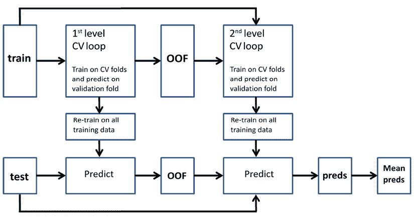

# 九、使用混合和堆叠解决方案来集成

当你开始在 Kaggle 上竞赛时，很快你就会意识到你不能用一个单一的、设计良好的模型取胜；你需要集成多个模型。接下来，你会立即想知道如何建立一个工作的合奏。周围几乎没有向导，更多的是留给卡格尔的知识，而不是科学论文。

这里的要点是，如果组装是在 Kaggle 比赛中获胜的关键，那么在现实世界中，它与复杂性、可维护性差、难以再现和隐藏的技术成本联系在一起，几乎没有优势。通常，可以让你从较低的排名上升到排行榜首位的小提升对于现实世界的应用程序来说并不重要，因为成本掩盖了优势。然而，这并不意味着在现实世界中根本没有使用集成。在有限的形式中，例如平均和混合一些不同的模型，集成允许我们创建能够以更有效和高效的方式解决许多数据科学问题的模型。

Kaggle 中的集成不仅是获得额外预测性能的一种方式，也是一种团队策略。当你与其他队友一起工作时，将每个人的贡献汇集在一起会产生一个通常比个人努力表现更好的结果，并且还可以通过将每个人的努力朝着一个明确的目标组织起来来帮助组织团队的工作。事实上，当工作在不同的时区和不同的约束下进行时，像结对编码这样的协作技术显然是不可行的。一个团队成员可能会因为工作时间而受到限制，另一个可能会因为学习和考试等等而受到限制。

比赛中的团队通常没有机会，也不一定必须，在相同的任务上同步和协调所有参与者。此外，团队内部的技能也可能不同。

在团队中共享一个好的集成策略意味着个人可以根据他们自己的惯例和风格继续工作，同时仍然为团队的成功做出贡献。因此，当使用基于预测多样性的集成技术时，甚至不同的技能也可能成为优势。

在这一章中，我们将从您已经知道的集成技术开始，因为它们嵌入在随机森林和梯度增强等算法中，然后进展到多模型的集成技术，如平均、混合和堆叠。我们将为您提供一些理论、一些实践，以及一些代码示例，当您在 Kaggle 上构建自己的解决方案时，可以将它们用作模板。

我们将讨论这些主题:

*   集成算法简介
*   将模型平均成一个集成
*   使用元模型混合模型
*   堆叠模型
*   创建复杂的堆叠和混合解决方案

在让你阅读这一章并尝试所有技术之前，我们不得不提到一个对我们和所有在 Kaggle 上比赛的从业者来说很好的参考:由 *Triskelion* ( *亨德里克·雅各布·范·维恩*)和几个合作者(*勒·阮达*，*阿曼多·塞格尼*)在 2015 年写的博客文章。 *Kaggle 组装指南*最初是在 *mlwave* 博客([https://mlwave.com/kaggle-ensembling-guide](https://mlwave.com/kaggle-ensembling-guide))上找到的，现在已经不在上面了，但是你可以从[https://user manual . wiki/Document/ka ggle 20 Ensembling 20 Guide . 685545114 . pdf](https://usermanual.wiki/Document/Kaggle20ensembling20guide.685545114.pdf)中检索到指南的内容。帖子整理了当时 Kaggle 论坛上关于 ensembling 的大部分隐性和显性知识。

# 集成算法简介

整体模型能够胜过单一模型的想法并不是最近才出现的。我们可以追溯到生活在维多利亚时代英国的 T21·弗朗西斯·高尔顿爵士。他发现，为了猜测一个县集市上一头牛的重量，从一群人或多或少受过教育的估计中取一个平均值比从一个专家那里得到一个精心设计的估计更有用。

1996 年，*利奥·布雷曼* 通过举例说明的**装袋**技术(也称为“引导聚集”过程)正式提出了使用多个模型组合成一个更具预测性的模型的想法，这一技术后来导致了更加有效的随机森林**算法的开发。在接下来的时间里，其他集成技术如如**梯度增强**和**叠加**也被提出，从而完成了我们今天使用的集成方法的范围。**

您可以参考一些文章来了解这些集成算法最初是如何设计的:

*   对于随机森林，请阅读 Breiman，L. *Bagging 预测值*。机器学习 24.2–1996:123-140。
*   如果你想更详细地了解 boosting 最初是如何工作的，请阅读 Freund，y .和 Schapire，R.E. *用一种新的 boosting 算法进行的实验。* *icml。第 96 卷–1996 年*和*弗里德曼，J. H* 。*贪婪函数逼近:一个梯度提升机。* *统计年鉴* (2001): 1189-1232。
*   关于堆垛，参见 Ting，K. M .和 Witten， *I. H.* *堆垛装袋和装袋的模型*，1997，该技术的第一个正式草案。

Kaggle 竞赛中用于集成预测器的第一个基本策略直接取自用于分类和回归的 bagging 和随机森林策略。它们包括对各种预测进行平均，因此被命名为**平均**技术。这些方法很快出现在 11 年前举行的第一届 Kaggle 竞赛中，也是因为 Kaggle 网飞竞赛之前，基于不同模型结果平均值的策略占据了主导地位。鉴于它们的成功，基于平均的基本组合技术为未来的许多比赛设定了标准，即使在今天，它们仍然非常有用和有效，可以在排行榜上获得更高的分数。

当竞赛中的问题变得更加复杂，参与者之间的斗争更加激烈时，更复杂和计算要求更高的堆叠出现得更晚。正如随机森林方法启发了平均不同的预测，促进了大量启发堆叠方法。在 boosting 中，通过顺序地重新处理信息，你的学习算法可以以更好、更完整的方式对问题进行建模。事实上，在梯度推进中，构建顺序决策树是为了对先前迭代无法掌握的数据部分进行建模。这种想法在堆叠集成中再次出现，在这里，您堆叠先前模型的结果并重新处理它们，以便获得预测性能的提高。


罗布·穆拉

[https://www.kaggle.com/robikscube](https://www.kaggle.com/robikscube)

Rob 向我们讲述了他对组装的看法以及他从 Kaggle 身上学到的东西。作为竞赛、笔记本和讨论领域的大师，以及 Biocore LLC 的高级数据科学家，我们可以从他的经历中学到很多东西。

你最喜欢哪种比赛，为什么？从技术和解决途径来说，你在 Kaggle 上的特长是什么？

*我最喜欢的竞赛类型是那些涉及独特数据集的竞赛，这些数据集需要整合不同类型建模方法的新颖解决方案。我喜欢比赛不仅仅是在数据集上训练大型模型，而是实际上需要非常好地理解数据，并实现利用特定于任务的架构的想法。我不试图专攻任何特定的方法。当我刚开始 Kaggle 时，我主要坚持梯度增强模型，但为了具有竞赛力，近年来我对深度学习、计算机视觉、NLP 和优化的理解有所增长。我最喜欢的比赛需要使用不止一种技术。*

你是如何对待一场 Kaggle 比赛的？这种方法与你在日常工作中的做法有什么不同？

我对待 Kaggle 竞赛的方式与工作项目非常相似。首先是数据理解。在现实世界的项目中，您可能需要定义问题并开发一个好的度量标准。在 Kaggle，这已经为你做好了。下一步是理解数据和指标之间的关系，并开发和测试您认为最能解决问题的建模技术。Kaggle 与现实生活中的数据科学相比，最大的区别是最后一点集成和调整模型以获得轻微的优势-在许多现实世界的应用程序中，这些类型的大型集成是不必要的，因为计算费用对性能增益可能很小。

告诉我们你参加的一个特别有挑战性的比赛，以及你用什么样的洞察力来完成这个任务。

*我参加的一个非常具有挑战性的比赛是* NFL 头盔撞击检测*比赛。它涉及到视频数据，这是我以前没有的经验。这也需要研究共同的方法和阅读现有的论文。我不得不采用两阶段的方法，这增加了解决方案的复杂性。我发现另一个具有挑战性的比赛是*室内定位导航*比赛。它包括建模、优化和真正理解数据。我在比赛中没有取得很好的成绩，但我学到了很多东西。*

Kaggle 对你的职业生涯有帮助吗？如果有，如何实现？

*是的。Kaggle 在帮助我获得数据科学领域的名声方面发挥了重要作用。我也增长了我的知识和对新技术的理解，遇到了许多优秀的人，并与他们一起工作，他们帮助我增长了我的技能和对机器学习的理解。*

*我的团队在* NFL 头盔撞击检测*比赛中获得第二名。在那场比赛之前，我还参加了一些 NFL 的比赛。竞赛的主持人联系了我，最终它帮助我获得了现在的职位。*

以你的经验来看，没有经验的 Kagglers 经常会忽略什么？你现在知道了什么，你希望在你刚开始的时候就知道？

*我认为没有经验的 Kagglers 有时会过于担心模型的集成和超参数调整。这些在比赛快结束时很重要，但除非你已经建立了一个好的基础模型，否则它们并不重要。我还认为，充分理解竞赛指标极其重要。许多 Kagglers 忽略了理解如何优化您的评估指标解决方案的重要性。*

你在过去的比赛中犯过什么错误？

*很多。我过度拟合模型，花时间研究那些最终没有益处的东西。然而，我觉得这对我学习如何更好地应对未来的比赛是必要的。这些错误可能在我参加的特定比赛中伤害了我，但帮助我在后来的比赛中变得更好。*

对于数据分析或机器学习，你有什么特别推荐的工具或库吗？

*对于 EDA，了解如何使用 NumPy、Pandas 和 Matplotlib 或其他绘图库操作数据。对于建模，了解如何使用 Scikit-learn 建立适当的交叉验证方案。像 XGBoost/LightGBM 这样的标准模型很好地了解了如何作为基线。深度学习库主要是 TensorFlow/Keras 或者 PyTorch。了解两个主要深度学习库中的一个很重要。*

# 将模型平均成一个集成

为了更好地介绍平均集成技术，让我们快速修改一下 Leo Breiman 为集成设计的所有策略。他的工作代表了集成策略的一个里程碑，他当时的发现仍然在广泛的问题中相当有效。

Breiman 探索了所有这些可能性，以便找出是否有办法减少强大模型中的误差方差，这些模型往往过度拟合训练数据，如决策树。

从概念上讲，他发现集成有效性基于三个要素:我们如何处理训练案例的**采样**，我们如何**构建模型**，最后，我们如何**组合获得的不同模型**。

至于取样，测试和发现的方法有:

*   **粘贴**，其中使用示例(数据行)的子样本(无替换采样)构建多个模型
*   **装袋**，其中使用随机选择的自举样本(替换抽样)建立多个模型
*   **随机子空间**，其中使用特征(数据列)的子样本(没有替换的采样)构建多个模型
*   **随机补丁**，一种类似于装袋的方法，除了当每个模型被选择时特征也被采样，如在随机子空间中

我们采样而不是使用相同信息的原因是，通过对案例和特征进行二次采样，我们创建了与相同问题相关的模型，而每个模型都与其他模型不同。这种差异也适用于每个模型过度拟合样本的方式；我们期望所有的模型以同样的方式从数据中获取有用的、可概括的信息，并以不同的方式处理对预测无用的噪音。因此，建模中的变化减少了预测中的变化，因为误差往往会相互抵消。

如果这个变化如此有用，那么下一步不应该仅仅是修改模型学习的*数据*，还要修改*模型本身*。我们有两种主要的模型方法:

*   同类型模型的集成
*   不同型号的套装

有趣的是，如果我们组合在一起的模型在预测能力上差异太大，那么以这种或那种方式组合并没有太大的帮助。这里的要点是，如果您将能够正确猜测同一类型预测的模型放在一起，那么您将获得优势，因此它们可以在平均它们出错的预测时消除它们的错误。如果你正在组装性能相差太大的模型，你很快就会发现没有意义，因为净效应将是负的:当你没有平滑你不正确的预测时，你也降低了正确的预测。

这是平均的一个重要限制:只有在预测能力相似的情况下，它才能使用一组不同的模型(例如，因为它们是使用不同的样本和特征训练的)。以为例，线性回归和*k*-最近邻算法有不同的建模问题和从数据中捕捉信号的方式；由于其核心的(独特的)特征函数形式，这些算法可以从数据中捕捉不同的预测细微差别，并在预测任务的特定部分上表现更好，但当使用平均时，你不能真正利用这一点。相比之下，算法捕捉信号的不同方式实际上是堆叠可以利用的，因为它可以从每种算法中获得最佳结果。

基于此，我们可以总结出，基于平均(平均多个模型的结果)的集成应该是有效的:

*   基于在不同样本上训练的模型
*   基于使用来自可用特征的不同子样本的模型构建
*   由预测能力相似的模型组成

从技术上来说，这意味着模型的预测应该尽可能不相关，同时在预测任务中保持相同的准确性。

既然我们已经讨论了平均多个机器学习模型的机会和限制，我们终于要深入研究技术细节了。有三种方法可以平均多个分类或回归模型:

*   多数表决，使用多个模型中最常见的分类(仅适用于分类模型)
*   平均值或概率
*   使用值或概率的加权平均值

在接下来的几节中，我们将在 Kaggle 竞赛的背景下详细讨论每种方法。

## 多数表决

通过改变我们在集成中使用的示例、特征和模型来产生不同的模型(如果它们在预测能力上是可比较的，正如我们之前讨论的那样)需要一定的计算工作，但这并不要求你建立一个与使用单一模型时完全不同的数据处理管道。

在这个管道中，您只需要收集不同的测试预测，跟踪使用的模型，训练时如何对示例或特征进行采样，使用的超参数，以及由此产生的交叉验证性能。

如果比赛需要你预测一个班级，你可以用**多数投票**；也就是说，对于每个预测，您会选择模型预测最频繁的类别。这适用于二元预测和多类预测，因为它假定模型中有时会出现错误，但大多数情况下它们都能猜对。多数表决被用作“纠错程序”，丢弃噪声并保留有意义的信号。

在我们的第一个简单的例子中，我们演示了多数表决是如何工作的。我们从创建示例数据集开始。使用 Scikit-learn 中的`make_classification`函数，我们生成了一个类似于 *Madelon* 的数据集。

最初的 Madelon 是一个人工数据集，包含放置在某个维度超立方体的顶点上并随机标记的聚类数据点。它包含一些信息要素，与不相关和重复的要素混合在一起(以创建要素之间的多重共线性),并且具有一定量的注入随机噪声。由*Isabelle Guyon*(SVM 算法的创造者之一)为 *NIPS 2003 特征选择挑战*构思的 Madelon 数据集是竞赛中具有挑战性的人工数据集的模型示例。甚至一些 Kaggle 比赛也受到了它的启发:[https://www.kaggle.com/c/overfitting](https://www.kaggle.com/c/overfitting)和最近的[https://www.kaggle.com/c/dont-overfit-ii](https://www.kaggle.com/c/dont-overfit-ii)。

在本章中，我们将使用 Madelon 数据集的重建作为测试集成技术的基础:

```
from sklearn.datasets import make_classification

from sklearn.model_selection import train_test_split

X, y = make_classification(n_samples=5000, n_features=50, 

                           n_informative=10,

                           n_redundant=25, n_repeated=15, 

                           n_clusters_per_class=5,

                           flip_y=0.05, class_sep=0.5, 

                           random_state=0)

X_train, X_test, y_train, y_test = train_test_split(X, y,   

                           test_size=0.33, random_state=0) 
```

在将其分成训练集和测试集之后，我们通过实例化我们的学习算法来继续。我们将只使用三种基本算法:支持向量机、随机森林和*k*-最近邻分类器，默认超参数用于演示目的。您可以尝试更改它们或增加它们的数量:

```
from sklearn.svm import SVC

from sklearn.ensemble import RandomForestClassifier

from sklearn.neighbors import KNeighborsClassifier

from sklearn.metrics import log_loss, roc_auc_score, accuracy_score

model_1 = SVC(probability=True, random_state=0)

model_2 = RandomForestClassifier(random_state=0)

model_3 = KNeighborsClassifier() 
```

以下步骤只是在训练集上训练每个模型:

```
model_1.fit(X_train, y_train)

model_2.fit(X_train, y_train)

model_3.fit(X_train, y_train) 
```

在这一点上，我们需要对每个模型的测试集进行预测，并使用多数投票来集成所有这些预测。为此，我们将使用 SciPy 中的`mode`函数:

```
import numpy as np

from scipy.stats import mode

preds = np.stack([model_1.predict(X_test),

                  model_2.predict(X_test),

                  model_3.predict(X_test)]).T

max_voting = np.apply_along_axis(mode, 1, preds)[:,0] 
```

首先，我们检查每个单一模型的准确性:

```
for i, model in enumerate(['SVC', 'RF ', 'KNN']):

    acc = accuracy_score(y_true=y_test, y_pred=preds[:, i])

    print(f"Accuracy for model {model} is: {acc:0.3f}") 
```

我们看到三款性能差不多，在 **0.8** 左右。现在是检查多数投票组合的时候了:

```
max_voting_accuray = accuracy_score(y_true=y_test, y_pred=max_voting)

print(f"Accuracy for majority voting is: {max_voting_accuray:0.3f}") 
```

投票集成实际上更准确: **0.817** ，因为它设法将大多数人的正确信号放在一起。

对于多标签问题(当您可以预测多个类别时)，您可以只选择预测次数超过一定次数的类别，假设相关性阈值指示某个类别的预测是信号，而不是噪声。例如，如果您有五个模型，您可以将此阈值设置为 3，这意味着如果一个类至少由三个模型预测，则该预测应该被认为是正确的。

在回归问题中，以及当你预测概率时，你实际上不能使用多数表决。多数表决只适用于类别所有权。相反，当您必须预测数字时，您需要从数字上组合结果。在这种情况下，诉诸于**平均值**或**加权平均值**将为您提供组合预测的正确方法。

## 模型预测的平均值

当你在一场比赛中对不同模型的预测进行平均时，你可以认为你所有的预测都具有潜在的相同预测能力，并使用算术平均值得出一个平均值。

除了算术平均值之外，我们还发现使用以下方法非常有效:

*   **几何平均数**:这个是你乘以 *n* 提交值，然后你得到结果乘积的*1/n*T37 次方次方。
*   **对数平均值**:类似于几何平均值，你取你提交的对数，将它们平均在一起，然后取结果平均值的指数。
*   **调和平均值**:这里你取你提交的倒数的算术平均值，然后你取结果平均值的倒数。
*   **幂平均值**:取提交数据的 *n 次*T4 次幂的平均值，然后取平均值的*1/n*T9 次幂。

简单算术平均值总是非常有效，而且基本上是一个比预期更有效的简单方法。有时，几何平均值或调和平均值等变量可能效果更好。

继续前面的示例，我们现在将尝试找出当我们将切换到 **ROC-AUC** 作为我们的评估指标时，哪种均值效果最好。首先，我们评估每个单一模型的性能:

```
proba = np.stack([model_1.predict_proba(X_test)[:, 1],

                  model_2.predict_proba(X_test)[:, 1],

                  model_3.predict_proba(X_test)[:, 1]]).T

for i, model in enumerate(['SVC', 'RF ', 'KNN']):

    ras = roc_auc_score(y_true=y_test, y_score=proba[:, i])

    print(f"ROC-AUC for model {model} is: {ras:0.5f}") 
```

结果给出了从 **0.875** 到 **0.881** 的范围。

我们的第一个测试是使用算术平均值进行的:

```
arithmetic = proba.mean(axis=1)

ras = roc_auc_score(y_true=y_test, y_score=arithmetic)

print(f"Mean averaging ROC-AUC is: {ras:0.5f}") 
```

由此产生的 ROC-AUC 分数明显优于单一表现: **0.90192** 。我们还测试了几何均值、调和均值、对数均值或幂均值是否优于普通均值:

```
geometric = proba.prod(axis=1)**(1/3)

ras = roc_auc_score(y_true=y_test, y_score=geometric)

print(f"Geometric averaging ROC-AUC is: {ras:0.5f}")

harmonic = 1 / np.mean(1\. / (proba + 0.00001), axis=1)

ras = roc_auc_score(y_true=y_test, y_score=harmonic)

print(f"Geometric averaging ROC-AUC is: {ras:0.5f}")

n = 3

mean_of_powers = np.mean(proba**n, axis=1)**(1/n)

ras = roc_auc_score(y_true=y_test, y_score=mean_of_powers)

print(f"Mean of powers averaging ROC-AUC is: {ras:0.5f}")

logarithmic = np.expm1(np.mean(np.log1p(proba), axis=1))

ras = roc_auc_score(y_true=y_test, y_score=logarithmic)

print(f"Logarithmic averaging ROC-AUC is: {ras:0.5f}") 
```

运行代码会告诉我们没有一个可以。在这种情况下，算术平均值是集成的最佳选择。在几乎所有情况下，实际上比简单平均数更有效的方法是将一些先验知识融入到你组合数字的方式中。当您在平均值计算中对模型进行加权时，就会发生这种情况。

## 加权平均值

当对你的模型进行加权时，你需要找到一种经验方法来计算出正确的权重。一种常见的方法是在公共排行榜上测试不同的组合，直到你找到得分最高的组合，尽管这种方法很容易出现适应性过拟合。当然，这并不能保证你在私人排行榜上也能获得同样的分数。在这里，原则是权衡什么更有效。然而，正如我们详细讨论的那样，由于与私人测试数据的重大差异，来自公共排行榜的反馈通常是不可信的。然而，您*可以*使用您的交叉验证分数或折叠外分数(后者将在后面的部分与堆叠一起讨论)。事实上，另一个可行的策略是使用与模型交叉验证性能成比例的**权重。**

虽然这有点违反直觉，但另一个非常有效的方法是对提交的**进行与它们的协方差**成反比的加权。事实上，由于我们正努力通过平均来消除误差，基于每个提交的独特方差的平均允许我们更重地加权相关性较低且更多样化的预测，从而更有效地减少估计的方差。

在下一个例子中，我们将首先创建预测概率的**相关矩阵**，然后我们继续:

1.  删除对角线上的 1 值并用 0 替换它们
2.  逐行平均相关矩阵以获得向量
3.  取每行总和的倒数
4.  将它们的总和归一化为 1.0
5.  在我们预测概率的矩阵乘法中使用得到的加权向量

以下是代码:

```
cormat = np.corrcoef(proba.T)

np.fill_diagonal(cormat, 0.0)

W = 1 / np.mean(cormat, axis=1)

W = W / sum(W) # normalizing to sum==1.0

weighted = proba.dot(W)

ras = roc_auc_score(y_true=y_test, y_score=weighted)

print(f"Weighted averaging ROC-AUC is: {ras:0.5f}") 
```

得到的 ROC-AUC 为 **0.90206** 略好于普通平均值。给予更不相关的预测更大的重要性是一种通常成功的集成策略。即使它只提供了微小的改进，这也足以将竞赛转化为你的优势。

## 交叉验证策略中的平均值

正如我们已经介绍过的，平均不需要您构建任何特殊的复杂管道，只需要一定数量的典型数据管道来创建您要平均的模型，或者对所有预测使用相同的权重，或者使用一些经验发现的权重。测试它的唯一方法是在公共排行榜上运行提交，因此存在自适应拟合的风险，因为您对平均值的评估将完全基于 Kaggle 的响应。

不过，在直接在排行榜上进行测试之前，您也可以在训练时通过在验证牌圈(不用于训练模型的牌圈)上运行平均运算来进行测试。这将为您提供比排行榜更少的偏见反馈。在下面的代码中，您可以找到如何安排交叉验证预测的示例:

```
from sklearn.model_selection import KFold

kf = KFold(n_splits=5, shuffle=True, random_state=0)

scores = list()

for k, (train_index, test_index) in enumerate(kf.split(X_train)):

    model_1.fit(X_train[train_index, :], y_train[train_index])

    model_2.fit(X_train[train_index, :], y_train[train_index])

    model_3.fit(X_train[train_index, :], y_train[train_index])

    proba = np.stack(

          [model_1.predict_proba(X_train[test_index, :])[:, 1],

           model_2.predict_proba(X_train[test_index, :])[:, 1],

           model_3.predict_proba(X_train[test_index, :])[:, 1]]).T

    arithmetic = proba.mean(axis=1)

    ras = roc_auc_score(y_true=y_train[test_index], 

                        y_score=arithmetic)

    scores.append(ras)

    print(f"FOLD {k} Mean averaging ROC-AUC is: {ras:0.5f}")

print(f"CV Mean averaging ROC-AUC is: {np.mean(scores):0.5f}") 
```

依靠上面代码中的交叉验证的结果可以帮助您评估哪种平均策略更有前途，而无需直接在公共排行榜上进行测试。

## 校正 ROC-AUC 评估的平均值

如果你的任务将在 ROC-AUC 分数上被评估，简单地平均你的结果可能是不够的。这个是因为不同的模型可能采用了不同的优化策略，它们的输出可能会有很大的不同。一个解决方案可以是校准模型，这是我们之前在*第五章*、*竞赛任务和指标*中讨论过的一种后处理，但这显然需要更多的时间和计算工作。

在这些情况下，直接的解决方案是将输出概率转换成等级，然后对等级进行平均(或者对它们进行加权平均)。使用最小-最大缩放器方法，您只需将每个模型的估计值转换到 0-1 的范围内，然后对预测值进行平均。这将有效地把你的模型的概率输出转换成可以比较的等级:

```
from sklearn.preprocessing import MinMaxScaler

proba = np.stack(

          [model_1.predict_proba(X_train)[:, 1],

           model_2.predict_proba(X_train)[:, 1],

           model_3.predict_proba(X_train)[:, 1]]).T

arithmetic = MinMaxScaler().fit_transform(proba).mean(axis=1)

ras = roc_auc_score(y_true=y_test, y_score=arithmetic)

print(f"Mean averaging ROC-AUC is: {ras:0.5f}") 
```

当你直接处理测试预测时，这种方法非常有效。相反，如果您正在工作并试图在交叉验证期间平均结果，您可能会遇到问题，因为您的训练数据的预测范围可能与您的测试预测范围不同。在这种情况下，你可以通过训练一个校准模型来解决这个问题(参见 Scikit-learn([https://scikit-learn.org/stable/modules/calibration.html](https://scikit-learn.org/stable/modules/calibration.html))上的**概率校准**和*第 5 章*)，为你的每个模型将预测转换成真实的、可比较的概率。

# 使用元模型混合模型

网飞竞赛(我们在*第 1 章*中详细讨论过)不仅证明了平均对于数据科学竞赛中的难题是有利的；它也带来了一个想法，你可以使用一个模型来更有效地平均你的模型的结果。获胜的团队 BigChaos 在他们的论文(Tö scher，a .、Jahrer，m .和 Bell，R.M. *网飞大奖的 BigChaos 解决方案*)中。网飞奖文档–2009)多次提到**混合**，并提供了许多关于其有效性和工作方式的提示。

简而言之，混合是一种加权平均过程，其中用于组合预测的权重是通过维持集和在其上训练的元模型来估计的。一个**元模型**就是一个简单的从其他机器学习模型的输出中学习的机器学习算法。通常，元学习者是线性模型(但有时也可以是非线性模型；下一节将详细介绍)，但是您实际上可以使用您想要的任何东西，但是有一些风险，我们将会讨论。

获得混合的程序很简单:

1.  在开始构建所有模型之前，您可以从定型数据中随机提取一个维持样本(在一个团队中，您应该都使用同一个维持)。通常，维持约为可用数据的 10%；但是，根据具体情况(例如，您的训练数据中的示例数量、分层)，它可能更少也可能更多。正如在采样中一样，您可以强制实施分层以确保采样的代表性，并且您可以使用对抗性验证来测试样本是否真的与其余训练集中的分布相匹配。
2.  根据剩余的训练数据训练所有模型。
3.  根据维持和测试数据进行预测。
4.  使用维持预测作为元学习者中的训练数据，并重用元学习者模型，以使用来自您的模型的测试预测来计算最终的测试预测。或者，您可以使用元学习者来找出应该在加权平均中使用的预测因子及其权重的选择。

这种方法有很多优点和缺点。先说优点。第一，容易实现；你只需要弄清楚坚持样本是什么。此外，使用元学习算法可以确保您找到最佳权重，而无需在公共排行榜上进行测试。

就缺点而言，有时，根据样本大小和您使用的模型类型，减少训练样本的数量可能会增加估计者预测的方差。此外，即使您非常注意如何对坚持者进行采样，您仍然可能陷入自适应过度拟合，也就是说，找到适合坚持者但不可推广的权重，特别是如果您使用太复杂的元学习者。最后，出于测试目的使用维持与我们在模型验证一章中讨论的训练和测试拆分具有相同的限制:如果维持的样本量太小，或者由于某种原因，您的采样不具有代表性，您将无法获得可靠的估计。

## 混合的最佳实践

在混合中，你使用的类型的元学习者可以产生很大的不同。最常见的选择是使用线性模型或非线性模型。在线性模型中，线性或逻辑回归是首选模型。使用正则化模型也有助于丢弃无用的模型(L1 正则化)或减少不太有用的模型的影响(L2 正则化)。使用这些元学习者的一个限制是，他们可能会给一些模型分配一个负的贡献，正如你将能够从模型中的系数的值看到的那样。当您遇到这种情况时，模型通常是过度拟合的，因为所有模型都应该对集成的构建有积极的贡献(或者，在最坏的情况下，根本没有贡献)。Scikit-learn 的最新版本允许您仅施加正权重并移除截距。这些约束作为一个正则化，并防止过度拟合。

作为元学习者的非线性模型不太常见，因为它们倾向于在回归和二元分类问题中过度拟合，但它们通常在多类和多标签分类问题中表现出色，因为它们可以对现有类之间的复杂关系进行建模。如果除了模型的预测之外，你还为他们提供*的原始特征*，他们通常也会表现得更好，因为他们可以发现任何有用的互动，帮助他们正确选择更信任哪些模型。

在下一个例子中，我们首先尝试使用线性模型(逻辑回归)进行混合，然后使用非线性方法(随机森林)。我们首先将训练集分成混合元素的训练部分和元学习者的保持部分。之后，我们将模型拟合到可训练部分，并对维持部分进行预测。

```
from sklearn.preprocessing import StandardScaler

X_blend, X_holdout, y_blend, y_holdout = train_test_split(X_train, y_train, test_size=0.25, random_state=0)

model_1.fit(X_blend, y_blend)

model_2.fit(X_blend, y_blend)

model_3.fit(X_blend, y_blend)

proba = np.stack([model_1.predict_proba(X_holdout)[:, 1],

                  model_2.predict_proba(X_holdout)[:, 1],

                  model_3.predict_proba(X_holdout)[:, 1]]).T

scaler = StandardScaler()

proba = scaler.fit_transform(proba) 
```

现在，我们可以使用维持预测的概率来训练我们的线性元学习者:

```
from sklearn.linear_model import LogisticRegression

blender = LogisticRegression(solver='liblinear')

blender.fit(proba, y_holdout)

print(blender.coef_) 
```

得出的系数为:

```
[[0.78911314 0.47202077 0.75115854]] 
```

通过查看系数，我们可以找出哪个模型对集成贡献更大。但是，请记住，当系数没有很好地校准时，它们也会重新调整概率，因此模型的较大系数可能并不意味着它是最重要的一个。如果您想通过查看系数来确定每个模型在混合中的作用，您首先必须通过标准化来重新调整它们(在我们的代码示例中，这已经使用 Scikit-learn 的`StandardScaler`完成)。

我们的输出显示，SVC 和*k*-最近邻模型在混合中比随机森林模型加权更大；它们的系数几乎相等，并且都大于随机森林系数。

一旦元模型被训练，我们就可以根据我们的测试数据进行预测，并检查它的性能:

```
test_proba = np.stack([model_1.predict_proba(X_test)[:, 1],

                       model_2.predict_proba(X_test)[:, 1],

                       model_3.predict_proba(X_test)[:, 1]]).T

blending = blender.predict_proba(test_proba)[:, 1]

ras = roc_auc_score(y_true=y_test, y_score=blending)

print(f"ROC-AUC for linear blending {model} is: {ras:0.5f}") 
```

我们可以使用非线性元学习器来尝试同样的事情，例如随机森林:

```
blender = RandomForestClassifier()

blender.fit(proba, y_holdout)

test_proba = np.stack([model_1.predict_proba(X_test)[:, 1],

                       model_2.predict_proba(X_test)[:, 1],

                       model_3.predict_proba(X_test)[:, 1]]).T

blending = blender.predict_proba(test_proba)[:, 1]

ras = roc_auc_score(y_true=y_test, y_score=blending)

print(f"ROC-AUC for non-linear blending {model} is: {ras:0.5f}") 
```

由*卡鲁阿纳*、*尼古列斯库-米齐尔*、*船员*和*科斯克斯*形式化的**集成选择**技术提供了使用线性或非线性模型作为元学习器的替代方案。

如果你对更多细节感兴趣，请阅读他们的著名论文:Caruana，r .、Niculescu-Mizil，a .、Crew，g .和 Ksikes，A. *从模型库中选择系综*(2004 年第二十一届机器学习国际会议文集)。

集成选择实际上是加权平均，因此可以简单地认为类似于线性组合。但是，这是一个受约束的线性组合(因为它是爬山优化的一部分),它也将选择模型，并且只将正权重应用于预测。所有这些都最小化了过度拟合的风险，并确保了更紧凑的解决方案，因为该解决方案将涉及模型选择。从这个角度来看，在过拟合风险高的所有问题中(例如，因为训练案例数量少或者模型太复杂)以及在现实世界应用中，建议使用集成选择，因为它的解决方案更简单而有效。

当使用元学习者时，你依赖于其自身成本函数的优化，这可能不同于竞赛中采用的度量。集成选择的另一个巨大优势是它可以针对任何评估函数进行优化，因此当竞赛的度量不同于机器学习模型中通常优化的那些标准时，它是最受建议的。

如前面提到的论文中所述，实现集成选择需要以下步骤:

1.  从你训练过的模型和样本开始。
2.  在维持样本上测试你的所有模型，并根据评估标准，在选择中保留最有效的模型(**集成选择**)。
3.  然后，继续测试可以添加到集成选择中的一个(或多个)模型的其他模型，以便建议选择的平均值比前一个有所提高。你可以选择替换或者不替换。没有替换，你只把一个模型放入选择集成一次；在这种情况下，该过程就像向前选择后的简单平均。(在前向选择中，您迭代地向解决方案添加最能提高性能的模型，直到添加更多的模型不再能提高性能。)使用替换，您可以将模型多次放入选择中，从而类似于加权平均。
4.  当你不能得到任何进一步的改善，停止并使用整体选择。

这是一个简单的集成选择代码示例。我们首先从原始训练数据中导出维持样本和训练选择。我们拟合模型，并获得我们的维持者的预测，正如之前在与元学习者混合时看到的:

```
X_blend, X_holdout, y_blend, y_holdout = train_test_split

    (X_train, y_train, test_size=0.5, random_state=0)

model_1.fit(X_blend, y_blend)

model_2.fit(X_blend, y_blend)

model_3.fit(X_blend, y_blend)

proba = np.stack([model_1.predict_proba(X_holdout)[:, 1],

                  model_2.predict_proba(X_holdout)[:, 1],

                  model_3.predict_proba(X_holdout)[:, 1]]).T 
```

在下一个代码片段中，通过一系列迭代来创建集成。在每次迭代中，我们尝试将所有模型依次添加到当前集成中，并检查它们是否改进了模型。如果这些添加中的任何一个在维持样本上优于先前的总体，则总体被更新，并且标杆被提升到当前的性能水平。

如果没有添加可以改善集成，则循环停止，并且集成的组成被报告回来:

```
iterations = 100

proba = np.stack([model_1.predict_proba(X_holdout)[:, 1],

                  model_2.predict_proba(X_holdout)[:, 1],

                  model_3.predict_proba(X_holdout)[:, 1]]).T

baseline = 0.5

print(f"starting baseline is {baseline:0.5f}")

models = []

for i in range(iterations):

    challengers = list()

    for j in range(proba.shape[1]):

        new_proba = np.stack(proba[:, models + [j]])

        score = roc_auc_score(y_true=y_holdout, 

                              y_score=np.mean(new_proba, axis=1))

        challengers.append([score, j])

    challengers = sorted(challengers, key=lambda x: x[0],

                         reverse=True)

    best_score, best_model = challengers[0]

    if best_score > baseline:

        print(f"Adding model_{best_model+1} to the ensemble",  

              end=': ') 

        print(f"ROC-AUC increases score to {best_score:0.5f}")

        models.append(best_model)

        baseline = best_score

    else:

        print("Cannot improve further - Stopping") 
```

最后，我们计算每个模型插入平均值的次数，并计算测试集平均值的权重:

```
from collections import Counter

freqs = Counter(models)

weights = {key: freq/len(models) for key, freq in freqs.items()}

print(weights) 
```

你可以通过各种方式让程序变得更复杂。由于这种方法可能会过拟合，尤其是在初始阶段，您可以从随机初始化的集成集成开始，或者正如作者所建议的，您可能已经从集成中表现最好的 *n* 个模型开始(您决定 *n* 的值，作为超参数)。另一种变化涉及到在每次迭代中对可以进入选择的模型集进行采样；换句话说，你随机排除了一些模型。这不仅会在过程中引入随机性，而且还会阻止特定的模型主导选择。

# 将模型堆叠在一起

**堆叠**是在 *David Wolpert* 的论文中首次提到的。*堆叠泛化。*神经网络 5.2–1992)，但这个想法被广泛接受并变得普遍需要几年时间(例如，只有在 2019 年 12 月的 0.22 版本中，Scikit-learn 才实现了堆叠包装器)。这主要是由于首先是网飞竞赛，然后是卡格尔竞赛。

在栈中，你总是有一个元学习者。然而，这一次，由于**折叠** ( **OOF** )预测策略，它不是在一个坚持者上训练，而是在整个训练集上训练。我们已经在*第 6 章*、*设计良好的验证*中讨论了这个策略。在 OOF 预测中，您从一个可复制的 *k* 折叠交叉验证分割开始。*可复制*意味着，通过记录每轮训练和测试集中的案例，或者通过由随机种子保证的再现性，您可以为您需要成为堆叠集成一部分的每个模型复制相同的验证方案。

在网飞竞赛中，堆叠和混合经常被交替使用，尽管 Wolpert 设计的实际方法最初意味着利用基于 *k* 折叠交叉验证的方案，而不是维持集。事实上，叠加的核心思想不是减少方差，就像平均一样；这主要是为了减少偏差，因为预计参与堆叠的每个模型都将掌握数据中存在的一部分信息，以便在最终的元学习器中进行重组。

让我们提醒自己如何根据训练数据进行预测。在测试模型时，在每一轮验证中，您根据部分训练数据训练模型，并根据训练中获得的另一部分数据进行验证。

通过记录验证预测，然后对它们进行重新排序以重新构建原始定型案例的顺序，您将获得您的模型对您所使用的定型集的预测。但是，由于您使用了多个模型，并且每个模型都预测了未用于训练的案例，因此您不应该对训练集预测有任何过度拟合的影响。

获得所有模型的 OOF 预测后，您可以继续构建基于 OOF 预测(第一级预测)预测目标的元学习器，或者您可以在以前的 OOF 预测(第二级或更高级预测)的基础上继续生成进一步的 OOF 预测，从而创建多个堆叠层。这与 Wolpert 自己提出的想法是一致的:通过使用多个元学习器，您实际上是在模仿一个没有反向传播的全连接前馈神经网络的结构，其中权重被优化计算，以便分别在每一层的水平上最大化预测性能。从实践的角度来看，堆叠多个层被证明是非常有效的，并且对于单一算法不能获得最佳结果的复杂问题非常有效。

此外，叠加的一个有趣的方面是，你不需要具有类似预测能力的模型，就像平均和混合一样。事实上，表现更差的模型作为叠加系综的一部分可能是有效的。一个*k*-最近邻模型可能无法与梯度增强解决方案相提并论，但是当您使用它的 OOF 预测进行叠加时，它可能会做出积极的贡献并提高集成的预测性能。

当你训练完所有的堆叠层，就该预测了。至于在不同叠加阶段使用的预测，重要的是要注意有两种方法可以做到这一点。最初的 Wolpert 论文建议根据所有训练数据重新训练模型，然后使用这些重新训练的模型在测试集上进行预测。在实践中，许多 Kagglers 不进行重新训练，而是直接使用为每个折叠创建的模型，并在测试集上进行多次预测，最后进行平均。

根据我们的经验，当您使用少量的 *k* 折叠时，在对测试集进行预测之前，通过对所有可用数据进行完整的重新训练，堆叠通常会更有效。在这些情况下，样本的一致性可能真的会影响预测的质量，因为对更少的数据进行训练意味着在估计中得到更多的方差。正如我们在第 6 章中所讨论的，当创建 OOF 预测时，最好使用 10 到 20 之间的高折叠数。这限制了给出的示例的数量，并且，在没有对所有数据进行重新训练的情况下，您可以简单地使用从交叉验证训练模型获得的预测的平均值来获得您对测试集的预测。

在我们的下一个例子中，出于说明的目的，我们只有五个 CV 折叠，并且结果被堆叠两次。在下图中，您可以了解数据和模型如何在堆叠过程的不同阶段之间移动:



图 9.1:预测最终平均的两层叠加过程图

请注意:

*   训练数据被馈送到堆叠的两个级别(堆叠的第二级别的 OOF 预测与训练数据相结合)
*   从 CV 循环中获得 OOF 预测后，在整个训练数据集上重新训练模型
*   最终预测是堆叠预测器获得的所有预测的简单平均值

现在让我们看一下代码来理解这个图如何翻译成 Python 命令，从第一级训练开始:

```
from sklearn.model_selection import KFold

kf = KFold(n_splits=5, shuffle=True, random_state=0)

scores = list()

first_lvl_oof = np.zeros((len(X_train), 3))

fist_lvl_preds = np.zeros((len(X_test), 3))

for k, (train_index, val_index) in enumerate(kf.split(X_train)):

    model_1.fit(X_train[train_index, :], y_train[train_index])

    first_lvl_oof[val_index, 0] = model_1.predict_proba(

                                     X_train[val_index, :])[:, 1]

    model_2.fit(X_train[train_index, :], y_train[train_index])

    first_lvl_oof[val_index, 1] = model_2.predict_proba(

                                     X_train[val_index, :])[:, 1]

    model_3.fit(X_train[train_index, :], y_train[train_index])

    first_lvl_oof[val_index, 2] = model_3.predict_proba(

                                     X_train[val_index, :])[:, 1] 
```

在第一层之后，我们在完整数据集上重新训练:

```
model_1.fit(X_train, y_train)

fist_lvl_preds[:, 0] = model_1.predict_proba(X_test)[:, 1]

model_2.fit(X_train, y_train)

fist_lvl_preds[:, 1] = model_2.predict_proba(X_test)[:, 1]

model_3.fit(X_train, y_train)

fist_lvl_preds[:, 2] = model_3.predict_proba(X_test)[:, 1] 
```

在第二层堆叠中，我们将重用与第一层中相同的模型，将堆叠的 OOF 预测添加到现有变量中:

```
second_lvl_oof = np.zeros((len(X_train), 3))

second_lvl_preds = np.zeros((len(X_test), 3))

for k, (train_index, val_index) in enumerate(kf.split(X_train)):

    skip_X_train = np.hstack([X_train, first_lvl_oof])

    model_1.fit(skip_X_train[train_index, :],

                y_train[train_index])

    second_lvl_oof[val_index, 0] = model_1.predict_proba(

                          skip_X_train[val_index, :])[:, 1]

    model_2.fit(skip_X_train[train_index, :],

                y_train[train_index])

    second_lvl_oof[val_index, 1] = model_2.predict_proba(

                          skip_X_train[val_index, :])[:, 1]

    model_3.fit(skip_X_train[train_index, :],

                y_train[train_index])

    second_lvl_oof[val_index, 2] = model_3.predict_proba(

                          skip_X_train[val_index, :])[:, 1] 
```

同样，我们重新训练第二层的完整数据:

```
skip_X_test = np.hstack([X_test, fist_lvl_preds])

model_1.fit(skip_X_train, y_train)

second_lvl_preds[:, 0] = model_1.predict_proba(skip_X_test)[:, 1]

model_2.fit(skip_X_train, y_train)

second_lvl_preds[:, 1] = model_2.predict_proba(skip_X_test)[:, 1]

model_3.fit(skip_X_train, y_train)

second_lvl_preds[:, 2] = model_3.predict_proba(skip_X_test)[:, 1] 
```

通过平均来自第二层的所有堆叠的 OOF 结果，堆叠被结束:

```
arithmetic = second_lvl_preds.mean(axis=1)

ras = roc_auc_score(y_true=y_test, y_score=arithmetic)

scores.append(ras)

print(f"Stacking ROC-AUC is: {ras:0.5f}") 
```

由此得到的 ROC-AUC 分数约为 **0.90424** ，优于之前对相同数据和模型的混合和平均尝试。

## 堆叠变化

堆叠的主要变化包括改变跨层处理测试数据的方式，是仅使用堆叠的 OOF 预测还是在所有堆叠层中使用原始特征，使用什么模型作为最后一个模型，以及防止过度拟合的各种技巧。

我们在这里讨论一些我们亲自试验过的最有效的方法:

*   **优化可以用，也可以不用。**有些方案不太在意优化单一模型；其他人只优化最后几层；其他人在第一层进行优化。根据我们的经验，优化单个模型是很重要的，我们更喜欢在我们的叠加系综中尽早这样做。
*   **不同堆叠层的模型可以不同，或者相同序列的模型可以在每个堆叠层重复。**这里我们没有一个通用的规则，因为它确实取决于问题。更有效的模型类型可能会因问题而异。作为一般建议，将梯度推进解决方案和神经网络放在一起从未让我们失望。
*   **在堆叠程序的第一级，创建尽可能多的模型。例如，如果你的问题是分类问题，你可以尝试回归模型，反之亦然。您还可以使用具有不同超参数设置的不同模型，从而避免过多的广泛优化，因为堆叠将为您做出决定。如果您使用神经网络，只需改变随机初始化种子就足以创建多样化的模型包。你还可以使用不同的特征工程来尝试模型，甚至使用无监督学习(就像*迈克·金*在他的解决方案中使用 t-SNE 维度时所做的那样:[https://www . ka ggle . com/c/Otto-group-product-classification-challenge/discussion/14295](https://www.kaggle.com/c/otto-group-product-classification-challenge/discussion/14295))。其思想是，在堆叠的第二级期间选择所有这样的贡献。这意味着，在这一点上，你不需要做任何进一步的实验，你只需要专注于一个范围更窄的性能更好的模型。通过应用堆叠，您可以重用所有的实验，并让堆叠来决定您应该在建模管道中使用的程度。**
*   一些堆叠实现采用所有特征或它们的选择来进一步发展，让人想起神经网络中的跳跃层。我们已经注意到，在堆叠的后期引入特征可以改善您的结果，但要小心:它也带来了更多的噪声和过度拟合的风险。
*   理想情况下，你的 OOF 预测应该基于具有高折叠数的交叉验证方案，换句话说，在 10 到 20 之间，但是我们也看到了使用较低折叠数的解决方案，例如 5 个折叠。
*   对于每个折叠，对同一模型多次打包数据(重复重采样)，然后对模型的所有结果(OOF 预测和测试预测)进行平均，有助于避免过度拟合，并最终产生更好的结果。
*   **堆垛时谨防过早停车。**直接在验证折叠上使用它可能会导致一定程度的过度拟合，这最终可能会也可能不会通过叠加过程得到缓解。我们建议你谨慎行事，始终根据你的训练样本(而不是你的验证样本)应用提前停止。

可能性是无限的。一旦你掌握了这种组装技术的基本概念，你需要做的就是将你的创造力应用到手头的问题上。我们将在本章的最后一节讨论这一关键概念，在这一节中，我们将看到一个 Kaggle 竞赛的堆叠解决方案。

# 创建复杂的堆叠和混合解决方案

在本章的这个点上，你可能想知道你应该在多大程度上应用我们已经讨论过的技术。理论上，你可以使用我们在 Kaggle 的任何比赛中展示的所有组装技术，而不仅仅是表格，但是你必须考虑一些限制因素:

*   有时，数据集是海量的，训练单个模型需要很长时间。
*   在图像识别比赛中，你被限制使用深度学习方法。
*   即使你能设法在深度学习比赛中堆叠模型，你对堆叠不同模型的选择也是有限的。由于你受限于深度学习解决方案，你只能改变网络和一些超参数(或者有时只是初始化种子)的小设计方面，而不会降低性能。最后，给定相同类型的模型，并且体系结构中的相似性多于差异，预测将倾向于过于相似并且比它们应该的更加相关，限制了集成的有效性。

在这些条件下，复杂的堆积方式通常是不可行的。相比之下，当您拥有大型数据集时，平均和混合通常是可行的。

在早期的比赛中，以及在所有最近的表格比赛中，复杂的堆叠和混合解决方案占据了上风。为了让您了解在比赛中需要进行堆叠的复杂性和创造性，在最后一节中，我们将讨论由*吉尔伯托·蒂特里茨*([https://www.kaggle.com/titericz](https://www.kaggle.com/titericz))和*斯坦尼斯拉夫·谢苗诺夫*([https://www.kaggle.com/stasg7](https://www.kaggle.com/stasg7))向*奥托集团产品分类挑战赛*([https://www . ka ggle . com/c/Otto-Group-Product-Classification-Challenge](https://www.kaggle.com/c/otto-group-product-classification-challenge))提供的解决方案。比赛于 2015 年举行，其任务是根据 93 个特征将超过 20 万种产品分为 9 个不同的类别。

Gilberto 和 Stanislav 提出的解决方案包括三个层次:

1.  在第一层，有 33 个模型。所有的模型都使用了完全不同的算法，除了一组 *k* 最近邻，其中只有 *k* 参数不同。他们还使用了无人监管的 SNE 霸王龙。此外，他们还基于维度操作(对最近邻和聚类的距离进行计算)和行统计(每行中非零元素的数量)设计了八个特征。所有 OOF 预测和功能都被传递到第二级。
2.  在第二个层面，他们开始优化超参数，进行模型选择和打包(他们通过重采样创建了同一模型的多个版本，并对每个模型的结果进行平均)。最终，他们只有三个模型，他们对所有数据进行了重新训练:一个 XGBoost，一个 AdaBoost 和一个神经网络。
3.  在第三级，他们首先对 XGBoost 和神经网络进行几何平均，然后用 AdaBoost 对其进行平均，从而准备了结果的加权平均。

我们可以从这个解决方案中学到很多东西，而不仅仅局限于这个比赛。除了复杂性之外(在第二个层次上，每个模型的重采样次数都在数百次左右)，值得注意的是，我们在本章中讨论的方案有多种变化。创造性和反复试验显然是解决方案的主导。这在许多 Kaggle 竞赛中非常典型，在这些竞赛中，问题很少在不同的竞赛中是相同的，并且每个解决方案都是独特的，不容易重复。

许多 AutoML 引擎，如如**autoglon**，或多或少地试图从这些程序中获得灵感，以便提供一系列预定义的自动化步骤，确保通过堆叠和混合获得最佳结果。

参见[https://arxiv.org/abs/2003.06505](https://arxiv.org/abs/2003.06505)获取自动旋翼用于构建其堆叠模型的算法列表。清单很长，你会发现很多适合自己的叠放解决方案。

然而，尽管他们实现了一些最佳实践，但与一个优秀的 Kagglers 团队相比，他们的结果总是不尽人意，因为你实验和创作合奏的方式的创造力是成功的关键。我们这一章也是如此。我们已经向您展示了集成的最佳实践；以它们为起点，根据 Kaggle 竞赛或你正在处理的现实世界问题，通过混合想法和创新来创造你自己的想法。


泽维尔·康纳特

[https://www.kaggle.com/xavierconort](https://www.kaggle.com/xavierconort)

为了结束这一章，我们采访了 2012-2013 年排名第一的比赛大师 Xavier Conort。在 Kaggle 历史初期，他是许多 ka ggle 人的灵感来源，现在他是自己公司 Data Mapping and Engineering 的创始人兼首席执行官。他向我们讲述了他与 Kaggle 的经历，他的职业生涯，等等。

你最喜欢哪种比赛，为什么？在技术和解决方法方面，你在 Kaggle 上的专长是什么？

*我真的很喜欢比赛，在这些比赛中，需要多个桌子的功能工程才能取得好成绩。我喜欢挖掘好的特征，尤其是对我来说是新的商业问题。这让我对自己解决新问题的能力充满信心。除了好的特征工程，堆叠帮助我获得了好的结果。我用它来混合多个模型或将文本或高分类变量转换成数字特征。我最喜欢的算法是 GBM，但我测试了许多其他算法来增加我的混合多样性。*

你是如何对待一场 Kaggle 比赛的？这种方法与你在日常工作中的做法有什么不同？

我的首要目标是从每场比赛中尽可能多的学习。在参加比赛之前，我试图评估我将发展哪些技能。我不害怕走出自己的舒适区。感谢排行榜的反馈，我知道我可以从错误中快速学习。日常工作很少提供这种机会。很难评估我们正在开发的解决方案的实际质量。所以，我们只是为了安全起见，倾向于重复过去的食谱。我不认为没有卡格尔我能学到这么多。

告诉我们你参加的一个特别有挑战性的比赛，以及你用什么样的洞察力来完成这个任务。

我最喜欢的比赛是 GE Flight Quest，这是一项由 GE 组织的比赛，参赛者必须预测美国国内航班的到达时间。我特别喜欢比赛的私人排行榜的设计方式。它测试了我们预测未来事件的能力，通过对比赛截止日期后发生的航班预测进行评分。

*由于我们只有* *几个月的历史(如果我没记错的话，是 3、4 个月)，我知道过度拟合的风险很大。为了降低这种风险，我决定只构建与航班延误有明显因果关系的要素，例如测量天气状况和交通的要素。我非常小心地把机场的名字从我的主要特征列表中排除。事实上，一些机场在几个月的历史中没有经历过恶劣的天气条件。因此，我非常担心我最喜欢的 ML 算法 GBM 会使用机场的名称作为好天气的代理，然后无法在私人排行榜中预测这些机场。为了抓住一些机场比其他机场管理得更好的事实，并稍微提高我的排行榜分数，我最终使用了机场的名称，但这只是一种残余效应。这是我的第二层模型的一个特征，用来抵消我的第一层模型的预测。这种方法可以被认为是两步推进，在第一步中你审查一些信息。我是从保险精算师那里学到的，他们用这种方法来捕捉地理空间剩余效应。*

Kaggle 对你的职业生涯有帮助吗？如果有，如何实现？

作为一名数据科学家，这无疑对我的职业生涯有所帮助。转行做数据科学之前，我是保险行业的精算师，对机器学习一窍不通，也不认识什么数据科学家。由于 Kaggle 比赛的多样性，我提高了我的学习曲线。由于我的良好成绩，我可以展示一份业绩记录，让雇主相信，一个 39 岁的精算师可以靠自己成功开发新技能。感谢 Kaggle 的社区，我与世界各地许多热情的数据科学家建立了联系。我首先从与他们竞赛或与他们竞赛中获得了很多乐趣。最后，我有机会和他们中的一些人一起工作。DataRobot 的创始人杰里米·阿钦和汤姆·德·戈多伊在邀请我加入 DataRobot 之前是我的比赛队友。如果没有 Kaggle 的帮助，我想我还会在保险行业做精算师。

你曾经使用过你在 Kaggle 竞赛中所做的东西来建立你的作品集，并展示给潜在的雇主吗？

*我必须承认，我确实参加了一些比赛，目的是给我的雇主或潜在客户留下深刻印象。效果不错，但是乐趣少了很多，压力也大了很多。*

以你的经验来看，没有经验的 Kagglers 经常会忽略什么？你现在知道了什么，你希望在你刚开始的时候就知道？

*我建议没有经验的滑雪运动员不要去看比赛期间发布的解决方案，而是努力自己找到好的解决方案。我很高兴在 Kaggle 早期，竞赛对手没有共享代码。这迫使我付出了惨痛的代价。*

你在过去的比赛中犯过什么错误？

*一个错误是继续参加设计有漏洞的竞赛。这只是浪费时间。你从那些比赛中学不到多少东西。*

对于数据分析或机器学习，你有什么特别推荐的工具或库吗？

*梯度提升机是我最喜欢的算法。我先是用了 R 的 gbm，然后是 Scikit-learn GBM，然后是 XGBoost，最后是 LightGBM。大多数时候，它是我成功解决方案的主要成分。要深入了解 GBM 学到了什么，我推荐 SHAP 套餐。*

当一个人参加比赛时，他应该记住或做的最重要的事情是什么？

*竞相学习。与其他充满激情的数据科学家进行竞赛。不要只为了赢而竞赛。*

# 摘要

在本章中，我们讨论了集成多个解决方案是如何工作的，并提出了一些基本的代码示例，您可以使用它们开始构建自己的解决方案。我们开始的想法是，像随机森林和梯度推进这样的动力模型集成。然后，我们继续探索不同的集成方法，从测试提交的简单平均到跨多层堆叠模型的元建模。

正如我们在最后所讨论的，集成更多的是一种基于一些共同实践的艺术形式。当我们探索一个成功的复杂叠加机制并赢得一场 Kaggle 竞赛时，我们惊讶于这些组合是如何根据数据和问题本身量身定制的。你不能拿一个栈，在另一个问题上复制它，并希望它是最好的解决方案。你只能遵循指导方针，通过大量的实验和计算工作，找到由不同模型的平均/堆叠/混合组成的最佳解决方案。

在下一章，我们将开始深入研究深度学习竞赛，从分类和分割任务的计算机视觉竞赛开始。

# 加入我们书的不和谐空间

加入这本书的 Discord workspace，每月与作者进行一次*向我提问*会议:

[https://packt.link/KaggleDiscord](https://packt.link/KaggleDiscord)

