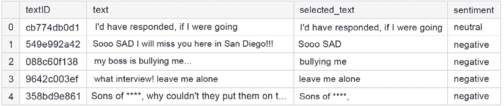
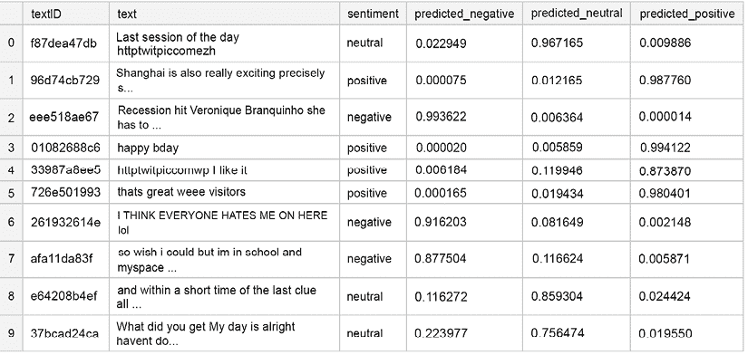
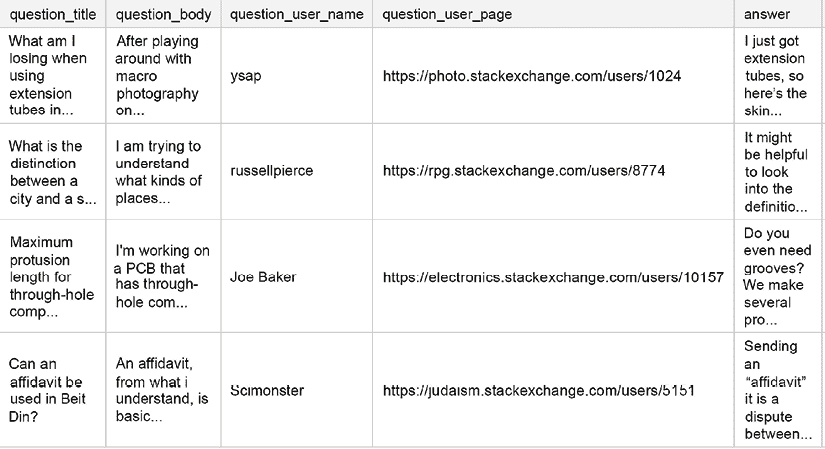

# 11

# 自然语言处理建模

**自然语言处理** ( **NLP** )是语言学、计算机科学和人工智能的交叉领域。它的主要焦点是处理和分析大量自然语言数据的算法。在过去的几年里，它已经成为一个越来越受欢迎的 Kaggle 比赛的话题。虽然这个领域本身非常广泛，包括聊天机器人和机器翻译等非常受欢迎的主题，但在本章中，我们将重点关注 Kaggle 竞赛经常涉及的特定子集。

情感分析作为一个简单的分类问题非常受欢迎，到处都在讨论，所以我们将从这个问题的一个更有趣的变体开始:识别推文中支持情感的短语。我们将继续描述开放领域问题回答的示例解决方案，并以 NLP 问题的增强部分结束，这是一个比其计算机视觉对应物受到的关注少得多的主题。

总而言之，我们将涵盖:

*   情感分析
*   开放域问答
*   文本增强策略

# 情感分析

Twitter 是最受欢迎的社交媒体平台之一，也是许多个人和公司的重要沟通工具。

在后一种情况下，捕捉语言中的情感尤为重要:一条积极的推文可以像病毒一样传播，而一条特别消极的推文可能是有害的。由于人类语言是复杂的，重要的是不仅要决定情感，还要能够调查*如何*:哪些词实际上导致了情感描述？

我们将通过使用来自*推特情感提取*竞赛([https://www.kaggle.com/c/tweet-sentiment-extraction](https://www.kaggle.com/c/tweet-sentiment-extraction))的数据来演示解决这个问题的方法。为了简洁起见，我们省略了下面代码中的导入，但是您可以在本章的 GitHub repo 的相应笔记本中找到它们。

为了更好地理解这个问题，让我们从数据开始:

```
df = pd.read_csv('/kaggle/input/tweet-sentiment-extraction/train.csv')

df.head() 
```

以下是前几行:



图 11.1:来自训练数据的样本行

实际的推文存储在`text`列中。它们中的每一个都有一个关联的`sentiment`，以及存储在`selected_text`栏中的 **支持短语**(这部分推文是情感分配决策的基础)。

我们从定义基本的清理函数开始。首先，我们希望去掉网站 URL 和非字符，用一个单一的令牌`"swear"`代替人们用来代替脏话的星星。我们使用一些正则表达式来帮助我们做到这一点:

```
def basic_cleaning(text):

    text=re.sub(r'https?://www\.\S+\.com','',text)

    text=re.sub(r'[^A-Za-z|\s]','',text)

    text=re.sub(r'\*+','swear',text) # Capture swear words that are **** out

    return text 
```

接下来，我们从推文内容中移除 HTML，以及表情符号:

```
def remove_html(text):

    html=re.compile(r'<.*?>')

    return html.sub(r'',text)

def remove_emoji(text):

    emoji_pattern = re.compile("["

                           u"\U0001F600-\U0001F64F" #emoticons

                           u"\U0001F300-\U0001F5FF" #symbols & pictographs

                           u"\U0001F680-\U0001F6FF" #transport & map symbols

                           u"\U0001F1E0-\U0001F1FF" #flags (iOS)

                           u"\U00002702-\U000027B0"

                           u"\U000024C2-\U0001F251"

                           "]+", flags=re.UNICODE)

    return emoji_pattern.sub(r'', text) 
```

最后，我们希望能够删除重复的字符(例如，我们用“way”代替“waaaayyyyy”):

```
def remove_multiplechars(text):

    text = re.sub(r'(.)\1{3,}',r'\1', text)

    return text 
```

为了方便起见，我们将这四个函数合并成一个清理函数:

```
def clean(df):

    for col in ['text']:#,'selected_text']:

        df[col]=df[col].astype(str).apply(lambda x:basic_cleaning(x))

        df[col]=df[col].astype(str).apply(lambda x:remove_emoji(x))

        df[col]=df[col].astype(str).apply(lambda x:remove_html(x))

        df[col]=df[col].astype(str).apply(lambda x:remove_multiplechars(x))

    return df 
```

最后一点准备工作包括编写基于预先训练好的模型创建嵌入的函数(T4 参数):

```
def fast_encode(texts, tokenizer, chunk_size=256, maxlen=128):

    tokenizer.enable_truncation(max_length=maxlen)

    tokenizer.enable_padding(max_length=maxlen)

    all_ids = []

    for i in range(0, len(texts), chunk_size):

        text_chunk = texts[i:i+chunk_size].tolist()

        encs = tokenizer.encode_batch(text_chunk)

        all_ids.extend([enc.ids for enc in encs])

    return np.array(all_ids) 
```

接下来，我们创建一个预处理函数，使我们能够处理整个语料库:

```
def preprocess_news(df,stop=stop,n=1,col='text'):

    '''Function to preprocess and create corpus'''

    new_corpus=[]

    stem=PorterStemmer()

    lem=WordNetLemmatizer()

    for text in df[col]:

        words=[w for w in word_tokenize(text) if (w not in stop)]

        words=[lem.lemmatize(w) for w in words if(len(w)>n)]

        new_corpus.append(words)

    new_corpus=[word for l in new_corpus for word in l]

    return new_corpus 
```

使用我们之前准备的函数，我们可以清理和准备训练数据。`sentiment`列是我们的目标，为了提高性能，我们将它转换为虚拟变量(一键编码):

```
df.dropna(inplace=True)

df_clean = clean(df)

df_clean_selection = df_clean.sample(frac=1)

X = df_clean_selection.text.values

y = pd.get_dummies(df_clean_selection.sentiment) 
```

下一个必要的步骤是输入文本的**标记化**，以及转换成序列(以及填充，以确保整个数据集的长度相等):

```
tokenizer = text.Tokenizer(num_words=20000)

tokenizer.fit_on_texts(list(X))

list_tokenized_train = tokenizer.texts_to_sequences(X)

X_t = sequence.pad_sequences(list_tokenized_train, maxlen=128) 
```

我们将使用 **DistilBERT** 为我们的模型创建嵌入，并按原样使用。DistilBERT 是 BERT 的轻量级版本:代价是性能损失 3%,参数减少 40%。我们可以训练嵌入层并提高性能——代价是大量增加训练时间。

```
tokenizer = transformers.AutoTokenizer.from_pretrained("distilbert-base-uncased")  

# Save the loaded tokenizer locally

save_path = '/kaggle/working/distilbert_base_uncased/'

if not os.path.exists(save_path):

    os.makedirs(save_path)

tokenizer.save_pretrained(save_path)

# Reload it with the huggingface tokenizers library

fast_tokenizer = BertWordPieceTokenizer(

                 'distilbert_base_uncased/vocab.txt', lowercase=True)

fast_tokenizer 
```

我们可以使用之前定义的`fast_encode`函数，以及上面定义的`fast_tokenizer`来编码 tweets:

```
X = fast_encode(df_clean_selection.text.astype(str),

                fast_tokenizer,

                maxlen=128) 
```

有了准备好的数据，我们就可以构建模型了。出于演示的目的，我们将为这些应用程序选择一个相当标准的架构:LSTM 层的组合，通过全局池化和丢弃进行标准化，在顶部有一个密集层。为了实现真正有竞争力的解决方案，需要对架构进行一些调整:更“重”的模型、更大的嵌入、LSTM 层中更多的单元，等等。

```
transformer_layer = transformers.TFDistilBertModel.from_pretrained('distilbert-base-uncased')

embedding_size = 128

input_ = Input(shape=(100,))

inp = Input(shape=(128, ))

embedding_matrix=transformer_layer.weights[0].numpy()

x = Embedding(embedding_matrix.shape[0],

              embedding_matrix.shape[1],

              embeddings_initializer=Constant(embedding_matrix),

              trainable=False)(inp)

x = Bidirectional(LSTM(50, return_sequences=True))(x)

x = Bidirectional(LSTM(25, return_sequences=True))(x)

x = GlobalMaxPool1D()(x)

x = Dropout(0.5)(x)

x = Dense(50, activation='relu', kernel_regularizer='L1L2')(x)

x = Dropout(0.5)(x)

x = Dense(3, activation='softmax')(x)

model_DistilBert = Model(inputs=[inp], outputs=x)

model_DistilBert.compile(loss='categorical_crossentropy',

                              optimizer='adam',

                              metrics=['accuracy']) 
```

没有特别需要注意数据的时间维度，所以我们可以随机分为训练和验证，这可以在对`fit`方法的调用中实现:

```
model_DistilBert.fit(X,y,batch_size=32,epochs=10,validation_split=0.1) 
```

下面是一些示例输出:

```
Epoch 1/10

27480/27480 [==============================] - 480s 17ms/step - loss: 0.5100 - accuracy: 0.7994

Epoch 2/10

27480/27480 [==============================] - 479s 17ms/step - loss: 0.4956 - accuracy: 0.8100

Epoch 3/10

27480/27480 [==============================] - 475s 17ms/step - loss: 0.4740 - accuracy: 0.8158

Epoch 4/10

27480/27480 [==============================] - 475s 17ms/step - loss: 0.4528 - accuracy: 0.8275

Epoch 5/10

27480/27480 [==============================] - 475s 17ms/step - loss: 0.4318 - accuracy: 0.8364

Epoch 6/10

27480/27480 [==============================] - 475s 17ms/step - loss: 0.4069 - accuracy: 0.8441

Epoch 7/10

27480/27480 [==============================] - 477s 17ms/step - loss: 0.3839 - accuracy: 0.8572 
```

从拟合的模型生成预测以直接的方式进行。为了利用所有可用的数据，我们开始根据所有可用的数据重新训练我们的模型(因此没有验证):

```
df_clean_final = df_clean.sample(frac=1)

X_train = fast_encode(df_clean_selection.text.astype(str),

                      fast_tokenizer,

                      maxlen=128)

y_train = y 
```

在生成预测之前，我们在整个数据集上重新调整模型:

```
Adam_name = adam(lr=0.001)

model_DistilBert.compile(loss='categorical_crossentropy',optimizer=Adam_name,metrics=['accuracy'])

history = model_DistilBert.fit(X_train,y_train,batch_size=32,epochs=10) 
```

我们的下一步是将测试数据处理成与输入模型的训练数据相同的格式:

```
df_test = pd.read_csv('/kaggle/input/tweet-sentiment-extraction/test.csv')

df_test.dropna(inplace=True)

df_clean_test = clean(df_test)

X_test = fast_encode(df_clean_test.text.values.astype(str),

                     fast_tokenizer,

                     maxlen=128)

y_test = df_clean_test.sentiment 
```

最后，我们生成预测:

```
y_preds = model_DistilBert.predict(X_test)

y_predictions = pd.DataFrame(y_preds,

                             columns=['negative','neutral','positive'])

y_predictions_final = y_predictions.idxmax(axis=1)

accuracy = accuracy_score(y_test,y_predictions_final)

print(f"The final model shows {accuracy:.2f} accuracy on the test set.") 
```

最终模型在测试集上显示出 **0.74** 的精度。下面我们展示了一个输出的例子；正如您已经从这几行中看到的，在某些情况下，这种情绪对于人类读者来说是显而易见的，但是模型却无法捕捉到它:



图 11.2:预测结果中的示例行

我们现在已经展示了一个解决情感归属问题的示例管道(识别文本中导致注释者对情感分类做出决定的部分)。如果您想要实现有竞争力的绩效，可以进行一些改进，下面按可能的影响顺序列出:

*   **更大的嵌入**:这允许我们在(已处理的)输入数据级别获取更多信息
*   **更大的模型**:LSTM 层中更多的单位
*   **更长的训练**:换句话说，更多的纪元

虽然上面列出的改进无疑会提高模型的性能，但我们管道的核心元素是可重用的:

*   数据清理和预处理
*   创建文本嵌入
*   在目标模型架构中合并递归层和正则化

我们现在将继续讨论开放域问答，这是 NLP 竞赛中经常遇到的问题。


阿布舍克·塔库尔

[https://www.kaggle.com/abhishek](https://www.kaggle.com/abhishek)

我们采访了世界上第一位四连冠特级大师 Abhishek Thakur。他目前在拥抱脸工作，在那里他建立了 AutoNLP 他还写了几乎是唯一一本关于 Kaggle 的英文书籍(除了这本书！)，*逼近(几乎)任何机器学习问题*。

你对 Kaggle 有什么专长？

*无。每一场比赛都是不同的，从每一场比赛中可以学到很多东西。如果我有一项专长，我会赢得该领域的所有比赛。*

你是如何对待一场 Kaggle 比赛的？这种方法与你在日常工作中的做法有什么不同？

我做的第一件事是看一看数据，并试图理解它。如果我参加比赛迟到了，我会求助于公共 EDA 内核。

*在 Kaggle 上(或下)处理问题时，我做的第一件事就是建立一个基准。建立一个基准是非常重要的，因为它为你提供了一个基线，你可以比较你的未来模型。如果我在游戏中迟到了，为了建立基线，我会尽量不借助公共笔记本。如果我们那样做，我们只会朝一个方向思考。至少，我是这么觉得的。*

*当我完成一个基准测试时，我会尽可能不做任何复杂的事情，比如堆叠或混合。然后，我再次检查数据和模型，并尝试在基线上进行改进，一次一步。*

日常工作有时有很多相似之处。大多数时候都有一个基准，然后你必须拿出超越基准的技术、特性和模型。

你参加的最有趣的比赛是什么？你有什么特别的见解吗？

每场比赛都很有趣。

Kaggle 对你的职业生涯有帮助吗？

*当然，这很有帮助。在过去几年中，在聘请数据科学家和机器学习工程师方面，Kaggle 已经获得了非常好的声誉。Kaggle rank 和对许多数据集的经验肯定会以某种方式在行业中有所帮助。处理不同类型问题的经验越丰富，迭代的速度就越快。这在工业中非常有用。没有人愿意花几个月的时间去做一件不会给企业带来任何价值的事情。*

以你的经验来看，没有经验的 Kagglers 经常会忽略什么？你现在知道了什么，你希望在你刚开始的时候就知道？

大多数初学者很容易放弃。很容易加入一个卡格尔比赛，并被顶级得分手吓倒。如果初学者想在 Kaggle 上成功，他们必须有毅力。在我看来，坚持不懈是关键。许多初学者也无法自己开始，坚持使用公共内核。这使得他们像公共内核的作者一样思考。我的建议是从你自己的比赛开始，看数据，构建特性，构建模型，然后深入核心和讨论，看看其他人可能做得不同。然后把学到的东西融入到自己的解决方案中。

# 开放域问答

在本节中，我们将关注*Google QUEST Q&A Labeling*竞赛([https://www . ka ggle . com/c/Google-QUEST-challenge/overview/description](https://www.kaggle.com/c/google-quest-challenge/overview/description))。在这场比赛中，人类评分员根据一系列不同的标准对问答配对进行评估，如“问题对话”、“问题事实调查”或“答案有帮助”任务是预测每个目标列的数值(对应于标准)；由于标签是由多个评分者汇总的，因此目标实际上是一个多变量回归输出，目标列被标准化为单位范围。

在使用高级技术(比如 NLP 的基于 transformer 的模型)进行建模之前，用简单的方法建立一个基线通常是一个好主意。与前一节一样，为了简洁起见，我们将省略导入，但是您可以在 GitHub repo 的笔记本中找到它们。

我们首先定义几个帮助函数，它们可以帮助我们提取文本的不同方面。首先，一个函数将输出给定字符串的字数:

```
def word_count(xstring):

    return xstring.split().str.len() 
```

竞赛中使用的度量标准是 **Spearman 相关性**(根据排名计算的线性相关性:[https://en . Wikipedia . org/wiki/Spearman % 27s _ rank _ correlation _ coefficient](https://en.wikipedia.org/wiki/Spearman%27s_rank_correlation_coefficient))。

由于我们打算构建一个 Scikit-learn 管道，因此将指标定义为一个计分器是很有用的(在 Scikit-learn 中，`make_scorer`方法是一个包装器，它采用一个计分函数——比如 accuracy 或 MSE——并返回一个可调用函数，该函数对估计器的输出进行计分):

```
def spearman_corr(y_true, y_pred):

        if np.ndim(y_pred) == 2:

            corr = np.mean([stats.spearmanr(y_true[:, i],

                                            y_pred[:, i])[0]

for i in range(y_true.shape[1])])

        else:

            corr = stats.spearmanr(y_true, y_pred)[0]

        return corr

custom_scorer = make_scorer(spearman_corr, greater_is_better=True) 
```

接下来，一个小助手函数从`l`中提取连续的大小为`n`的块。这将帮助我们稍后为我们的正文生成嵌入，而不会遇到内存问题:

```
def chunks(l, n):

    for i in range(0, len(l), n):

        yield l[i:i + n] 
```

我们将使用的部分特征集是来自预训练模型的嵌入。回想一下，本节的想法是在不训练精细模型的情况下构建基线，但这并不妨碍我们使用现有的模型。

我们首先导入记号化器和模型，然后分块处理语料库，将每个问题/答案编码到固定大小的嵌入中:

```
def fetch_vectors(string_list, batch_size=64):

    # Inspired by https://jalammar.github.io/a-visual-guide-to-using-bert-    for-the-first-time/

    DEVICE = torch.device("cuda")

    tokenizer = transformers.DistilBertTokenizer.from_pretrained

                    ("../input/distilbertbaseuncased/")

    model = transformers.DistilBertModel.from_pretrained

                ("../input/distilbertbaseuncased/")

    model.to(DEVICE)

    fin_features = []

    for data in chunks(string_list, batch_size):

        tokenized = []

        for x in data:

            x = " ".join(x.strip().split()[:300])

            tok = tokenizer.encode(x, add_special_tokens=True)

            tokenized.append(tok[:512])

        max_len = 512

        padded = np.array([i + [0] * (max_len - len(i)) for i in tokenized])

        attention_mask = np.where(padded != 0, 1, 0)

        input_ids = torch.tensor(padded).to(DEVICE)

        attention_mask = torch.tensor(attention_mask).to(DEVICE)

        with torch.no_grad():

            last_hidden_states = model(input_ids,

                                       attention_mask=attention_mask)

        features = last_hidden_states[0][:, 0, :].cpu().numpy()

        fin_features.append(features)

    fin_features = np.vstack(fin_features)

    return fin_features 
```

我们现在可以开始加载数据:

```
xtrain = pd.read_csv(data_dir + 'train.csv')

xtest = pd.read_csv(data_dir + 'test.csv')

xtrain.head(4) 
```

以下是前几行:



图 11.3:来自训练数据的样本行

我们指定我们感兴趣的 30 个目标列:

```
target_cols = ['question_asker_intent_understanding',

               'question_body_critical', 

               'question_conversational', 'question_expect_short_answer', 

               'question_fact_seeking',

               'question_has_commonly_accepted_answer', 

               'question_interestingness_others',

               'question_interestingness_self', 

               'question_multi_intent', 'question_not_really_a_question', 

               'question_opinion_seeking', 'question_type_choice', 

               'question_type_compare', 'question_type_consequence', 

               'question_type_definition', 'question_type_entity', 

               'question_type_instructions', 'question_type_procedure', 

               'question_type_reason_explanation',

               'question_type_spelling', 

               'question_well_written', 'answer_helpful', 

               'answer_level_of_information', 'answer_plausible', 

               'answer_relevance', 'answer_satisfaction', 

               'answer_type_instructions', 'answer_type_procedure', 

               'answer_type_reason_explanation', 'answer_well_written'] 
```

关于它们的含义和解释的讨论，读者可以参考位于 https://www.kaggle.com/c/google-quest-challenge/data[的竞赛数据页面。](https://www.kaggle.com/c/google-quest-challenge/data)

接下来，我们进行和**特征工程**。我们从统计问题标题和正文中的单词，以及答案开始。在许多应用中，这是一个简单却非常有用的特性:

```
for colname in ['question_title', 'question_body', 'answer']:

    newname = colname + '_word_len'

    xtrain[newname] = xtrain[colname].str.split().str.len()

    xtest[newname] = xtest[colname].str.split().str.len() 
```

我们创造的下一个特征是**词汇多样性**，计算一个文本块中独特单词的比例:

```
colname = 'answer'

xtrain[colname+'_div'] = xtrain[colname].apply

                         (lambda s: len(set(s.split())) / len(s.split()) )

xtest[colname+'_div'] = xtest[colname].apply

                        (lambda s: len(set(s.split())) / len(s.split()) ) 
```

当处理来自在线的信息时，我们可以通过检查网站地址的组成部分来提取潜在的信息特征(其中我们将组成部分定义为由点分隔的地址元素)；我们计算组件的数量，并将单个组件存储为特征:

```
for df in [xtrain, xtest]:

    df['domcom'] = df['question_user_page'].apply

                   (lambda s: s.split('://')[1].split('/')[0].split('.'))

    # Count components

    df['dom_cnt'] = df['domcom'].apply(lambda s: len(s))

    # Pad the length in case some domains have fewer components in the name

    df['domcom'] = df['domcom'].apply(lambda s: s + ['none', 'none'])

    # Components

    for ii in range(0,4):

        df['dom_'+str(ii)] = df['domcom'].apply(lambda s: s[ii]) 
```

许多 target 列处理答案与给定问题的相关性。量化这种关系的一种可能方式是评估一对字符串中的**共享单词**:

```
# Shared elements

for df in [xtrain, xtest]:

    df['q_words'] = df['question_body'].apply(lambda s: [f for f in s.split() if f not in eng_stopwords] )

    df['a_words'] = df['answer'].apply(lambda s: [f for f in s.split() if f not in eng_stopwords] )

    df['qa_word_overlap'] = df.apply(lambda s: len(np.intersect1d(s['q_words'], s['a_words'])), axis = 1)

    df['qa_word_overlap_norm1'] = df.apply(lambda s: s['qa_word_overlap']/(1 + len(s['a_words'])), axis = 1)

    df['qa_word_overlap_norm2'] = df.apply(lambda s: s['qa_word_overlap']/(1 + len(s['q_words'])), axis = 1)

    df.drop(['q_words', 'a_words'], axis = 1, inplace = True) 
```

停用词和标点符号的出现模式可以告诉我们一些关于风格和意图的信息:

```
for df in [xtrain, xtest]:

    ## Number of characters in the text ##

    df["question_title_num_chars"] = df["question_title"].apply(lambda x: len(str(x)))

    df["question_body_num_chars"] = df["question_body"].apply(lambda x: len(str(x)))

    df["answer_num_chars"] = df["answer"].apply(lambda x: len(str(x)))

    ## Number of stopwords in the text ##

    df["question_title_num_stopwords"] = df["question_title"].apply(lambda x: len([w for w in str(x).lower().split() if w in eng_stopwords]))

    df["question_body_num_stopwords"] = df["question_body"].apply(lambda x: len([w for w in str(x).lower().split() if w in eng_stopwords]))

    df["answer_num_stopwords"] = df["answer"].apply(lambda x: len([w for w in str(x).lower().split() if w in eng_stopwords]))

    ## Number of punctuations in the text ##

    df["question_title_num_punctuations"] =df['question_title'].apply(lambda x: len([c for c in str(x) if c in string.punctuation]) )

    df["question_body_num_punctuations"] =df['question_body'].apply(lambda x: len([c for c in str(x) if c in string.punctuation]) )

    df["answer_num_punctuations"] =df['answer'].apply(lambda x: len([c for c in str(x) if c in string.punctuation]) )

    ## Number of title case words in the text ##

    df["question_title_num_words_upper"] = df["question_title"].apply(lambda x: len([w for w in str(x).split() if w.isupper()]))

    df["question_body_num_words_upper"] = df["question_body"].apply(lambda x: len([w for w in str(x).split() if w.isupper()]))

    df["answer_num_words_upper"] = df["answer"].apply(lambda x: len([w for w in str(x).split() if w.isupper()])) 
```

准备好“复古”特征——我们的重点是文本的简单摘要统计，而不需要注意语义结构——我们可以继续为的问题和答案创建**嵌入**。理论上，我们可以在我们的数据上训练一个单独的 word2vec 类型的模型(或者微调一个现有的模型)，但是为了这个演示，我们将使用一个预先训练好的模型。一个有用的选择是谷歌([https://tfhub.dev/google/universal-sentence-encoder/4](https://tfhub.dev/google/universal-sentence-encoder/4))的**通用句子编码器**。该模型在各种数据源上进行训练。它接受一段英文文本作为输入，并输出一个 512 维向量。

```
module_url = "../input/universalsentenceencoderlarge4/"

embed = hub.load(module_url) 
```

下面给出了将文本字段转化为嵌入的代码:我们分批遍历训练/测试集中的条目，嵌入每一批(出于存储效率的原因)，然后将它们附加到原始列表中。

通过垂直堆叠每个批次级嵌入列表来构建最终数据框:

```
embeddings_train = {}

embeddings_test = {}

for text in ['question_title', 'question_body', 'answer']:

    train_text = xtrain[text].str.replace('?', '.').str.replace('!', '.').tolist()

    test_text = xtest[text].str.replace('?', '.').str.replace('!', '.').tolist()

    curr_train_emb = []

    curr_test_emb = []

    batch_size = 4

    ind = 0

    while ind*batch_size < len(train_text):

        curr_train_emb.append(embed(train_text[ind*batch_size: (ind + 1)*batch_size])["outputs"].numpy())

        ind += 1

    ind = 0

    while ind*batch_size < len(test_text):

        curr_test_emb.append(embed(test_text[ind*batch_size: (ind + 1)*batch_size])["outputs"].numpy())

        ind += 1    

    embeddings_train[text + '_embedding'] = np.vstack(curr_train_emb)

    embeddings_test[text + '_embedding'] = np.vstack(curr_test_emb)

    print(text) 
```

给定问题和答案的向量表示，我们可以通过对向量对使用不同的距离度量来计算字段之间的语义相似度。尝试不同度量背后的想法是希望捕捉不同类型的特征；分类环境中的一个类比是使用准确性和熵来获得情况的完整描述:

```
l2_dist = lambda x, y: np.power(x - y, 2).sum(axis=1)

cos_dist = lambda x, y: (x*y).sum(axis=1)

dist_features_train = np.array([

    l2_dist(embeddings_train['question_title_embedding'], embeddings_train['answer_embedding']),

    l2_dist(embeddings_train['question_body_embedding'], embeddings_train['answer_embedding']),

    l2_dist(embeddings_train['question_body_embedding'], embeddings_train['question_title_embedding']),

    cos_dist(embeddings_train['question_title_embedding'], embeddings_train['answer_embedding']),

    cos_dist(embeddings_train['question_body_embedding'], embeddings_train['answer_embedding']),

    cos_dist(embeddings_train['question_body_embedding'], embeddings_train['question_title_embedding'])

]).T

dist_features_test = np.array([

    l2_dist(embeddings_test['question_title_embedding'], embeddings_test['answer_embedding']),

    l2_dist(embeddings_test['question_body_embedding'], embeddings_test['answer_embedding']),

    l2_dist(embeddings_test['question_body_embedding'], embeddings_test['question_title_embedding']),

    cos_dist(embeddings_test['question_title_embedding'], embeddings_test['answer_embedding']),

    cos_dist(embeddings_test['question_body_embedding'], embeddings_test['answer_embedding']),

    cos_dist(embeddings_test['question_body_embedding'], embeddings_test['question_title_embedding'])

]).T 
```

让我们在单独的列中收集距离特征:

```
for ii in range(0,6):

    xtrain['dist'+str(ii)] = dist_features_train[:,ii]

    xtest['dist'+str(ii)] = dist_features_test[:,ii] 
```

最后，我们还可以创建文本字段的 **TF-IDF** 表示；总体思路是基于输入文本的各种转换创建多个特征，然后将它们提供给一个相对简单的模型。

通过这种方式，我们可以捕捉数据的特征，而无需拟合复杂的深度学习模型。

我们可以通过在单词和字符层面分析文本来实现。为了限制内存消耗，我们对这两种特性的最大数量设置了上限(您的里程数可能会有所不同；随着内存的增加，这些限制可以提高):

```
limit_char = 5000

limit_word = 25000 
```

我们实例化了字符级和单词级的矢量器。我们问题的设置有助于方便地使用 Scikit-learn 的`Pipeline`功能，允许在模型拟合过程中组合多个步骤。我们首先为标题列创建两个独立的转换器(单词级和字符级):

```
title_col = 'question_title'

title_transformer = Pipeline([

    ('tfidf', TfidfVectorizer(lowercase = False, max_df = 0.3, min_df = 1,

                             binary = False, use_idf = True, smooth_idf = False,

                             ngram_range = (1,2), stop_words = 'english', 

                             token_pattern = '(?u)\\b\\w+\\b' , max_features = limit_word ))

])

title_transformer2 = Pipeline([

 ('tfidf2',  TfidfVectorizer(sublinear_tf=True,

    strip_accents='unicode', analyzer='char',

    stop_words='english', ngram_range=(1, 4), max_features= limit_char))   

]) 
```

我们对主体使用相同的逻辑(两个不同的流水线变压器):

```
body_col = 'question_body'

body_transformer = Pipeline([

    ('tfidf',TfidfVectorizer(lowercase = False, max_df = 0.3, min_df = 1,

                             binary = False, use_idf = True, smooth_idf = False,

                             ngram_range = (1,2), stop_words = 'english', 

                             token_pattern = '(?u)\\b\\w+\\b' , max_features = limit_word ))

])

body_transformer2 = Pipeline([

 ('tfidf2',  TfidfVectorizer( sublinear_tf=True,

    strip_accents='unicode', analyzer='char',

    stop_words='english', ngram_range=(1, 4), max_features= limit_char))   

]) 
```

最后是回答专栏:

```
answer_col = 'answer'

answer_transformer = Pipeline([

    ('tfidf', TfidfVectorizer(lowercase = False, max_df = 0.3, min_df = 1,

                             binary = False, use_idf = True, smooth_idf = False,

                             ngram_range = (1,2), stop_words = 'english', 

                             token_pattern = '(?u)\\b\\w+\\b' , max_features = limit_word ))

])

answer_transformer2 = Pipeline([

 ('tfidf2',  TfidfVectorizer( sublinear_tf=True,

    strip_accents='unicode', analyzer='char',

    stop_words='english', ngram_range=(1, 4), max_features= limit_char))   

]) 
```

我们通过处理数字特征来包装特征工程部分。我们仅使用简单的方法:缺失值插补来处理 N/A 值，并使用幂变换来稳定分布并使其更接近高斯分布(如果您在神经网络中使用数字特征，这通常很有帮助):

```
num_cols = [

    'question_title_word_len', 'question_body_word_len',

    'answer_word_len', 'answer_div',

    'question_title_num_chars','question_body_num_chars',

    'answer_num_chars',

    'question_title_num_stopwords','question_body_num_stopwords',

    'answer_num_stopwords',

    'question_title_num_punctuations',

    'question_body_num_punctuations','answer_num_punctuations',

    'question_title_num_words_upper',

    'question_body_num_words_upper','answer_num_words_upper',

    'dist0', 'dist1', 'dist2', 'dist3', 'dist4',       'dist5'

]

num_transformer = Pipeline([

    ('impute', SimpleImputer(strategy='constant', fill_value=0)),

    ('scale', PowerTransformer(method='yeo-johnson'))

]) 
```

管道的一个有用特性是它们可以组合和嵌套。接下来，我们添加处理分类变量的功能，然后将它们放在一个`ColumnTransformer`对象中，以简化数据预处理和特性工程逻辑。输入的每一部分都可以用自己合适的方式处理:

```
cat_cols = [ 'dom_0',  'dom_1', 'dom_2', 

    'dom_3', 'category','is_question_no_name_user',

    'is_answer_no_name_user','dom_cnt'

]

cat_transformer = Pipeline([

    ('impute', SimpleImputer(strategy='constant', fill_value='')),

    ('encode', OneHotEncoder(handle_unknown='ignore'))

])

preprocessor = ColumnTransformer(

    transformers = [

        ('title', title_transformer, title_col),

        ('title2', title_transformer2, title_col),

        ('body', body_transformer, body_col),

        ('body2', body_transformer2, body_col),

        ('answer', answer_transformer, answer_col),

        ('answer2', answer_transformer2, answer_col),

        ('num', num_transformer, num_cols),

        ('cat', cat_transformer, cat_cols)

    ]

) 
```

最后，我们准备使用一个结合预处理和模型拟合的`Pipeline`对象:

```
pipeline = Pipeline([

    ('preprocessor', preprocessor),

    ('estimator',Ridge(random_state=RANDOM_STATE))

]) 
```

在样本之外评估你的模型的性能总是一个好主意:一个方便的方法是创建**非折叠预测**，我们在*第 6 章*中讨论过。该程序包括以下步骤:

1.  将数据拆分成多个文件夹。在我们的例子中，我们使用`GroupKFold`，因为一个问题可以有多个答案(在数据框的不同行中)。为了防止信息泄露，我们希望确保每个问题只出现在一个文件夹中。
2.  对于每个折叠，使用其他折叠中的数据来训练模型，并生成所选折叠的预测以及测试集。
3.  对测试集的预测进行平均。

我们从准备存储预测的“存储”矩阵开始。`mvalid`将包含折叠外预测，而`mfull`是整个测试集预测的占位符，跨折叠平均。由于几个问题包含不止一个候选答案，我们对`question_body`的`KFold`部分进行分层:

```
nfolds = 5

mvalid = np.zeros((xtrain.shape[0], len(target_cols)))

mfull = np.zeros((xtest.shape[0], len(target_cols)))

kf = GroupKFold(n_splits= nfolds).split(X=xtrain.question_body, groups=xtrain.question_body) 
```

我们循环遍历褶皱，构建独立的模型:

```
for ind, (train_index, test_index) in enumerate(kf):

    # Split the data into training and validation

    x0, x1 = xtrain.loc[train_index], xtrain.loc[test_index]

    y0, y1 = ytrain.loc[train_index], ytrain.loc[test_index]

    for ii in range(0, ytrain.shape[1]):

        # Fit model

        be = clone(pipeline)

        be.fit(x0, np.array(y0)[:,ii])

        filename = 'ridge_f' + str(ind) + '_c' + str(ii) + '.pkl'

        pickle.dump(be, open(filename, 'wb'))

        # Storage matrices for the OOF and test predictions, respectively

        mvalid[test_index, ii] = be.predict(x1)

        mfull[:,ii] += be.predict(xtest)/nfolds

    print('---') 
```

装配部分完成后，我们可以根据竞赛中指定的指标评估性能:

```
corvec = np.zeros((ytrain.shape[1],1))

for ii in range(0, ytrain.shape[1]):

    mvalid[:,ii] = rankdata(mvalid[:,ii])/mvalid.shape[0]

    mfull[:,ii] = rankdata(mfull[:,ii])/mfull.shape[0]

    corvec[ii] = stats.spearmanr(ytrain[ytrain.columns[ii]], mvalid[:,ii])[0]

print(corvec.mean()) 
```

最后的分数是 **0.34** ，作为起点还算可以接受。

在本节中，我们已经演示了如何在文本主体上构建描述性特征。虽然这不是 NLP 竞赛的获胜公式(分数还可以，但不能保证进入奖牌区)，但它是您工具箱中的一个有用工具。我们以提供文本增强技术概述的部分来结束这一章。


石原正太郎

[https://www.kaggle.com/sishihara](https://www.kaggle.com/sishihara)

我们对本章的第二次采访是与 Shotaro Ishihara(又名 u++)进行的，他是竞赛和笔记本电脑大师，是*pet finder . my Adoption Prediction*竞赛中获胜团队的一员。他目前是一家日本新闻媒体公司的数据科学家和研究员，也在 Kaggle 上出版过日文书籍，包括 Abhishek Thakur 的书的翻译。他维护着一份日文的每周时事通讯，介绍 Kaggle 的倡议([https://www.getrevue.co/profile/upura](https://www.getrevue.co/profile/upura))。

我们在哪里可以找到你写的/翻译的 Kaggle 书？

[https://www.kspub.co.jp/book/detail/5190067.html](https://www.kspub.co.jp/book/detail/5190067.html)*是根据*泰坦尼克号*出发的比赛为初学者准备的 Kaggle 初级读本。*

[https://book.mynavi.jp/ec/products/detail/id=123641](https://book.mynavi.jp/ec/products/detail/id=123641)*是阿布舍克·塔库尔的*逼近(几乎)任何机器学习问题的日文翻译。

你最喜欢哪种比赛，为什么？从技术和解决途径来说，你在 Kaggle 上的特长是什么？

在 Kaggle，我喜欢用表格或文本数据集参加比赛。这些类型的数据集对我来说很熟悉，因为它们在新闻媒体公司中被广泛使用。我非常了解用于处理这些数据集的方法。

你是如何对待一场 Kaggle 比赛的？这种方法与你在日常工作中的做法有什么不同？

第一个过程是一样的:思考如何通过探索性的数据分析来解决问题。Kaggle 假设使用先进的机器学习，但在商业中并非如此。在实践中，我试图找到避免使用机器学习的方法。即使我真的使用它，我也更喜欢使用经典方法，如 TF-IDF 和线性回归，而不是高级方法，如 BERT。

我们有兴趣了解更多关于如何在现实世界的问题中避免使用机器学习的信息。你能给我们举些例子吗？

*当在工作中处理自动文章摘要时，我们采用更直接的提取方法(*[https://www . jstage . jst . go . jp/article/pjsai 2021/0/jsai 2021 _ 1 D2 OS 3a 03/_ article/-char/en](https://www.jstage.jst.go.jp/article/pjsai/JSAI2021/0/JSAI2021_1D2OS3a03/_article/-char/en)*)而不是基于神经网络的方法(*[https://www . jstage . jst . go . jp/article/pjsai/pjsai](https://www.jstage.jst.go.jp/article/pjsai/JSAI2021/0/JSAI2021_1D4OS3c02/_article/-char/en)

*机器学习很难保证 100%的性能，人类容易理解和参与的简单方法有时是首选。*

告诉我们你参加的一个特别有挑战性的比赛，以及你用什么样的洞察力来完成这个任务。

*在* PetFinder.my 领养预测*竞赛中，提供了一个多模态数据集。许多参与者试图探索和使用所有类型的数据，主要方法是从图像和文本中提取特征，将它们连接起来，并训练 LightGBM。我也采用了同样的方法。令人惊讶的是，我的一个队友 taku oko(*[https://www.kaggle.com/takuok](https://www.kaggle.com/takuok)*)开发了一个伟大的神经网络，可以端到端地处理所有数据集。设计良好的神经网络有可能在多模态竞争中胜过 LightGBM。这是我在 2019 年学到的一课。*

这个教训今天仍然有效吗？

*我觉得答案是肯定的。相比 2019 年，神经网络在处理多模态数据方面越来越好。*

Kaggle 对你的职业生涯有帮助吗？如果有，如何实现？

*是的。Kaggle 给了我很多数据分析的经验。我从 Kaggle 获得的机器学习知识极大地帮助了我更成功地工作。我在 Kaggle 和商业工作方面的成就是我获得国际新闻媒体协会 2020 年 30 Under 30 奖和大奖的主要原因之一。Kaggle 也让我认识了很多人。这些关系无疑对我的职业发展有所贡献。*

多亏了 Kaggle，你是如何建立起自己的投资组合的？

*学习技能，取得比赛成绩，出版笔记本、书籍、时事通讯等等。*

你如何推广你的出版物？

*我有各种沟通渠道，并使用适当的推广工具。比如 Twitter，个人博客，YouTube。*

以你的经验来看，没有经验的 Kagglers 经常会忽略什么？你现在知道了什么，你希望在你刚开始的时候就知道？

*探索性数据分析的重要性。在机器学习领域，有一个没有免费午餐定理的概念。我们不仅要学习算法，还要学习如何应对挑战。没有免费的午餐定理是一个陈述，没有一个通用的模型能在所有问题上表现良好。*

*在机器学习竞赛中，为了提高你的分数，找到一个适合数据集和任务特征的模型是至关重要的。*

你在过去的比赛中犯过什么错误？

*超适合公共排行榜。在* LANL 地震预测*比赛中，我在大众排行榜上的成绩还不错，以第五名的排名结束了比赛。但是我最后的排名是 211*ST，也就是说我在一个有限的数据集中相信了太多。过拟合是机器学习中非常流行的概念，我通过 Kaggle 痛苦地认识到了这一点的重要性。

你有什么特别的方法来避免过度拟合吗？

*仔细观察训练和评估数据集是如何划分的很重要。我试图构建一个验证集来重现这种划分。*

对于数据分析或机器学习，你有什么特别推荐的工具或库吗？

*我爱熊猫，它是处理表格数据集的必备库。我通过提取、聚合和可视化来使用它进行探索性的数据分析。*

你建议读者怎么做才能掌握熊猫？

*可以看看一些社区教程。Kaggle 还提供一些关于熊猫和特征工程的学习辅导课程。*

你使用其他比赛平台吗？他们和 Kaggle 相比如何？

我有时会使用日本平台，如 Signate、Nishika 等。([https://upura.github.io/projects/data_science_competitions/](https://upura.github.io/projects/data_science_competitions/)*)。这些在功能性和 UX/UX 方面明显不如 Kaggle，但看到像日语这样熟悉的主题是很有趣的。*

# 文本增强策略

我们在前一章广泛讨论了计算机视觉问题的增强策略。相比之下，文本数据的类似方法是一个不太好探索的主题(事实证明，没有像`albumentations`这样的单个包)。在这一节中，我们将展示解决这个问题的一些可能的方法。

## 基本技术

像往常一样，首先检查基本方法是有益的，重点是随机变化和同义词处理。关于基本方法的系统研究，请参见的[魏和*邹* (2019)。](https://arxiv.org/abs/1901.11196)

我们从同义词替换**开始。将某些单词替换为它们的同义词会产生与原文意思相近的文本，但会稍有改动(如果你对更多细节感兴趣，如同义词实际上来自哪里，请参见 https://wordnet.princeton.edu/的项目页面):**

```
def get_synonyms(word):

    synonyms = set()

    for syn in wordnet.synsets(word):

        for l in syn.lemmas():

            synonym = l.name().replace("_", " ").replace("-", " ").lower()

            synonym = "".join([char for char in synonym if char in ' qwertyuiopasdfghjklzxcvbnm'])

            synonyms.add(synonym) 

    if word in synonyms:

        synonyms.remove(word)

    return list(synonyms) 
```

我们围绕上面定义的工作函数创建一个简单包装器，指定一个文本块(包含多个单词的字符串)并替换最多 *n* 个单词:

```
def synonym_replacement(words, n):    

    words = words.split()    

    new_words = words.copy()

    random_word_list = list(set([word for word in words if word not in stop_words]))

    random.shuffle(random_word_list)

    num_replaced = 0

    for random_word in random_word_list:

        synonyms = get_synonyms(random_word)

        if len(synonyms) >= 1:

            synonym = random.choice(list(synonyms))

            new_words = [synonym if word == random_word else word for word in new_words]

            num_replaced += 1

        if num_replaced >= n: # Only replace up to n words

            break

    sentence = ' '.join(new_words)

    return sentence 
```

让我们看看这个函数在实践中是如何工作的:

```
print(f" Example of Synonym Replacement: {synonym_replacement('The quick brown fox jumps over the lazy dog',4)}") 
```

```
Example of Synonym Replacement: The spry brown university fox jumpstart over the lazy detent 
```

这不完全是你所说的莎士比亚风格，但它确实传达了同样的信息，同时显著改变了风格。我们可以通过为每条推文创建多个新句子来扩展这种方法:

```
trial_sent = data['text'][25]

print(trial_sent)

the free fillin' app on my ipod is fun, im addicted

for n in range(3):

    print(f" Example of Synonym Replacement: {synonym_replacement(trial_sent,n)}") 
```

```
Example of Synonym Replacement: the free fillin' app on my ipod is fun, im addict

Example of Synonym Replacement: the innocent fillin' app on my ipod is fun, im addicted

Example of Synonym Replacement: the relinquish fillin' app on my ipod is fun, im addict 
```

正如你所见,使用同义词生成文本块的变体非常简单。

其次，**交换**是一种简单而高效的方法；我们通过随机交换文本中单词的顺序来创建一个修改的句子。

仔细应用，这可以被视为**正规化**的潜在有用形式，因为它扰乱了像 LSTM 这样的模型所依赖的数据的序列性质。第一步是定义一个交换单词的函数:

```
def swap_word(new_words):    

    random_idx_1 = random.randint(0, len(new_words)-1)

    random_idx_2 = random_idx_1

    counter = 0    

    while random_idx_2 == random_idx_1:

        random_idx_2 = random.randint(0, len(new_words)-1)

        counter += 1        

        if counter > 3:

            return new_words

    new_words[random_idx_1], new_words[random_idx_2] = new_words[random_idx_2], new_words[random_idx_1] 

    return new_words 
```

然后，我们围绕这个函数编写一个包装器:

```
# n is the number of words to be swapped

def random_swap(words, n):    

    words = words.split()

    new_words = words.copy()

    for _ in range(n):

        new_words = swap_word(new_words)

    sentence = ' '.join(new_words)    

    return sentence 
```

同义词和互换不会影响我们正在修改的句子的长度。如果在给定的应用程序中，修改属性是有用的，我们可以删除或添加单词到句子中。

实现前者最常见的方法是随机删除单词:

```
def random_deletion(words, p):

    words = words.split()

    # Obviously, if there's only one word, don't delete it

    if len(words) == 1:

        return words

    # Randomly delete words with probability p

    new_words = []

    for word in words:

        r = random.uniform(0, 1)

        if r > p:

            new_words.append(word)

    # If you end up deleting all words, just return a random word

    if len(new_words) == 0:

        rand_int = random.randint(0, len(words)-1)

        return [words[rand_int]]

    sentence = ' '.join(new_words)

    return sentence 
```

让我们看一些例子:

```
print(random_deletion(trial_sent,0.2))

print(random_deletion(trial_sent,0.3))

print(random_deletion(trial_sent,0.4)) 
```

```
the free fillin' app on my is fun, addicted

free fillin' app on my ipod is im addicted

the free on my ipod is fun, im 
```

如果我们可以删除，我们当然也可以添加。向句子中随机插入单词可以被视为向图像添加噪声或模糊的 NLP 等价物:

```
def random_insertion(words, n):    

    words = words.split()

    new_words = words.copy()    

    for _ in range(n):

        add_word(new_words)        

    sentence = ' '.join(new_words)

    return sentence

def add_word(new_words):    

    synonyms = []

    counter = 0

    while len(synonyms) < 1:

        random_word = new_words[random.randint(0, len(new_words)-1)]

        synonyms = get_synonyms(random_word)

        counter += 1

        if counter >= 10:

            return        

    random_synonym = synonyms[0]

    random_idx = random.randint(0, len(new_words)-1)

    new_words.insert(random_idx, random_synonym) 
```

下面是实际运行的函数:

```
print(random_insertion(trial_sent,1))

print(random_insertion(trial_sent,2))

print(random_insertion(trial_sent,3)) 
```

```
the free fillin' app on my addict ipod is fun, im addicted

the complimentary free fillin' app on my ipod along is fun, im addicted

the free along fillin' app addict on my ipod along is fun, im addicted 
```

我们可以将上面讨论的所有转换组合成一个函数，产生同一个句子的四个变体:

```
def aug(sent,n,p):

    print(f" Original Sentence : {sent}")

    print(f" SR Augmented Sentence : {synonym_replacement(sent,n)}")

    print(f" RD Augmented Sentence : {random_deletion(sent,p)}")

    print(f" RS Augmented Sentence : {random_swap(sent,n)}")

    print(f" RI Augmented Sentence : {random_insertion(sent,n)}")

aug(trial_sent,4,0.3) 
```

```
Original Sentence : the free fillin' app on my ipod is fun, im addicted

SR Augmented Sentence : the disembarrass fillin' app on my ipod is fun, im hook

RD Augmented Sentence : the free app on my ipod fun, im addicted

RS Augmented Sentence : on free fillin' ipod is my the app fun, im addicted

RI Augmented Sentence : the free fillin' app on gratis addict my ipod is complimentary make up fun, im addicted 
```

上面讨论的增强方法没有利用文本数据的结构——举一个例子，即使分析像“词性”这样的简单特征也可以帮助我们构建原始文本的更有用的转换。这是我们现在要关注的方法。

## nlpaug

我们通过展示`nlpaug`包([https://github.com/makcedward/nlpaug](https://github.com/makcedward/nlpaug))提供的功能来结束本节。它集合了不同的文本增强方法，并且被设计成轻量级的，易于集成到工作流程中。我们将在下面展示其中包含的一些功能示例。

```
! pip install nlpaug 
```

我们导入了字符级和单词级的增强器，我们将使用它们来插入特定的方法:

```
import nlpaug.augmenter.char as nac

import nlpaug.augmenter.word as naw

test_sentence = "I genuinely have no idea what the output of this sequence of words will be - it will be interesting to find out what nlpaug can do with this!" 
```

当我们将**模拟错别字**应用到我们的测试句子时会发生什么？这种转换可以用多种方式参数化；有关参数及其解释的完整列表，建议读者查看官方文档:[https://nlpaug . readthe docs . io/en/latest/augmenter/char/keyboard . html](https://nlpaug.readthedocs.io/en/latest/augmenter/char/keyboard.html)。

```
aug = nac.KeyboardAug(name='Keyboard_Aug', aug_char_min=1,

                      aug_char_max=10, aug_char_p=0.3, aug_word_p=0.3,

                      aug_word_min=1, aug_word_max=10, stopwords=None,

                      tokenizer=None, reverse_tokenizer=None,

                      include_special_char=True, include_numeric=True,

                      include_upper_case=True, lang='en', verbose=0,

                      stopwords_regex=None, model_path=None, min_char=4)

test_sentence_aug = aug.augment(test_sentence)

print(test_sentence)

print(test_sentence_aug) 
```

这是输出:

```
I genuinely have no idea what the output of this sequence of words will be - it will be interesting to find out what nlpaug can do with this!

I geb&ine:y have no kdeZ qhQt the 8uYput of tTid sequsnDr of aorVs will be - it wi,k be jnterewtlHg to find out what nlpaug can do with this! 
```

我们可以模拟一个 **OCR 错误**潜入我们的输入:

```
aug = nac.OcrAug(name='OCR_Aug', aug_char_min=1, aug_char_max=10,

                 aug_char_p=0.3, aug_word_p=0.3, aug_word_min=1,

                 aug_word_max=10, stopwords=None, tokenizer=None,

                 reverse_tokenizer=None, verbose=0,

                 stopwords_regex=None, min_char=1)

test_sentence_aug = aug.augment(test_sentence)

print(test_sentence)

print(test_sentence_aug) 
```

我们得到:

```
I genuinely have no idea what the output of this sequence of words will be - it will be interesting to find out what nlpaug can do with this!

I 9enoine1y have no idea what the ootpot of this sequence of wokd8 will be - it will be inteke8tin9 to find out what nlpaug can du with this! 
```

虽然有用，但当涉及到数据的创造性变化时，字符级转换的范围有限。让我们看看`nlpaug`在单词级修改方面提供了哪些可能性。我们的第一个例子是用反义词替换固定百分比的单词:

```
aug = naw.AntonymAug(name='Antonym_Aug', aug_min=1, aug_max=10, aug_p=0.3,

                     lang='eng', stopwords=None, tokenizer=None,

                     reverse_tokenizer=None, stopwords_regex=None,

                     verbose=0)

test_sentence_aug = aug.augment(test_sentence)

print(test_sentence)

print(test_sentence_aug) 
```

我们得到:

```
I genuinely have no idea what the output of this sequence of words will be - it will be interesting to find out what nlpaug can do with this!

I genuinely lack no idea what the output of this sequence of words will differ - it will differ uninteresting to lose out what nlpaug can unmake with this! 
```

`nlpaug`也为我们提供了一种可能性，例如，替换同义词；这种转换也可以用上面讨论的更基本的技术来实现。为了完整起见，我们在下面演示了一个小例子，它使用了一个 BERT 架构:

```
aug = naw.ContextualWordEmbsAug(model_path='bert-base-uncased',

                                model_type='', action='substitute',

                                # temperature=1.0,

                                top_k=100,

                                # top_p=None,

                                name='ContextualWordEmbs_Aug', aug_min=1,

                                aug_max=10, aug_p=0.3, 

                                stopwords=None, device='cpu',

                                force_reload=False,

                                # optimize=None,

                                stopwords_regex=None,

                                verbose=0, silence=True)

test_sentence_aug = aug.augment(test_sentence)

print(test_sentence)

print(test_sentence_aug) 
```

结果如下:

```
I genuinely have no idea what the output of this sequence of words will be - it will be interesting to find out what nlpaug can do with this!

i genuinely have no clue what his rest of this series of words will say - its will seemed impossible to find just what we can do with this! 
```

如您所见，`nlpaug`提供了广泛的选项来修改您的文本输入以生成增强。实际上应该选择哪一个在很大程度上取决于上下文，这个决定需要一点点领域知识，适合特定的应用。

一些需要进一步探索的地方将是初级比赛，如灾难推文的自然语言处理的初级比赛，如 T5、T6、https://www.kaggle.com/c/nlp-getting-started、T7，以及中级或高级比赛，如拼图、毒性评论的严重程度、T9、T10、https://www.kaggle.com/c/jigsaw-toxic-severity-rating、T11 或 T12、谷歌探索、Q、T21、标签、T13、T14、https://www.kaggle.com/c/google-quest-challenge、T15。在所有这些案例中，`nlpaug`都得到了广泛应用，包括在成功的解决方案中。

# 摘要

在本章中，我们讨论了 NLP 竞赛的建模。我们展示了适用于 Kaggle 比赛中出现的各种问题的古老和最先进的方法。此外，我们还谈到了经常被忽略的文本扩充的话题。

在下一章，我们将讨论模拟竞赛，这是一种在过去几年里越来越受欢迎的新型竞赛。

# 加入我们书的不和谐空间

加入这本书的 Discord workspace，每月与作者进行一次*向我提问*会议:

[https://packt.link/KaggleDiscord](https://packt.link/KaggleDiscord)

