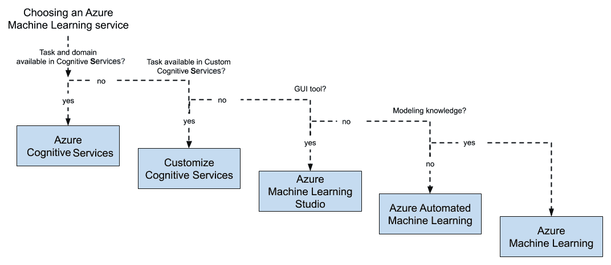
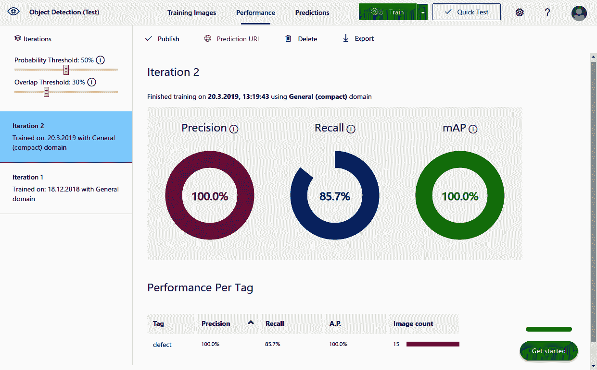
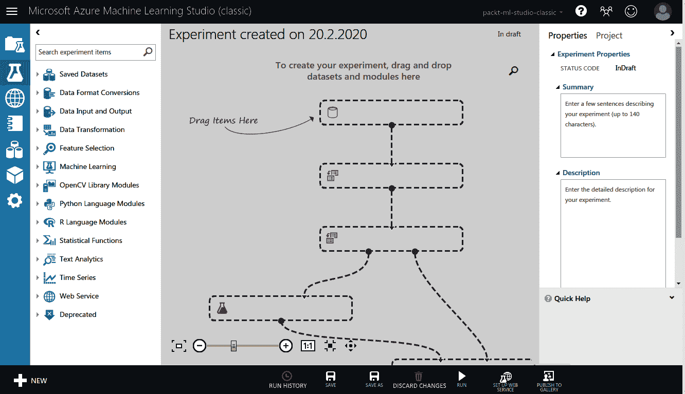
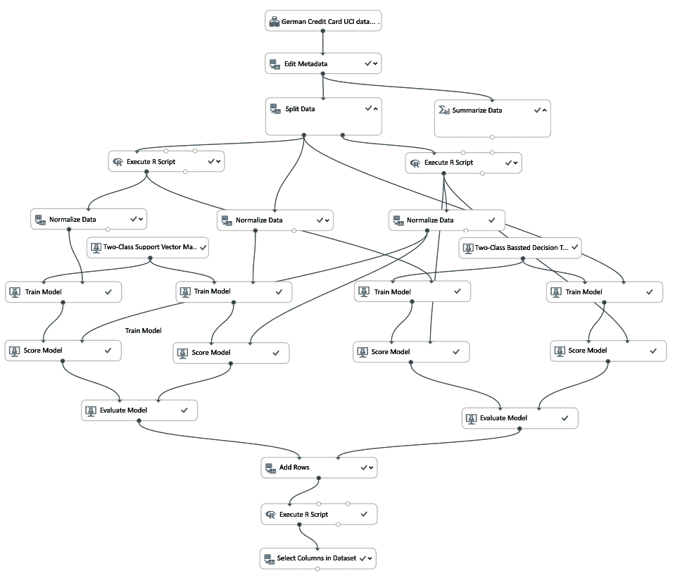
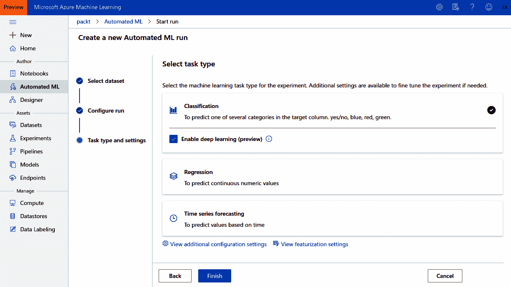
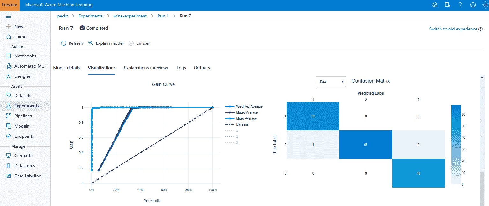
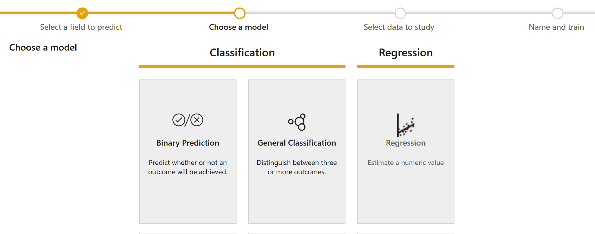
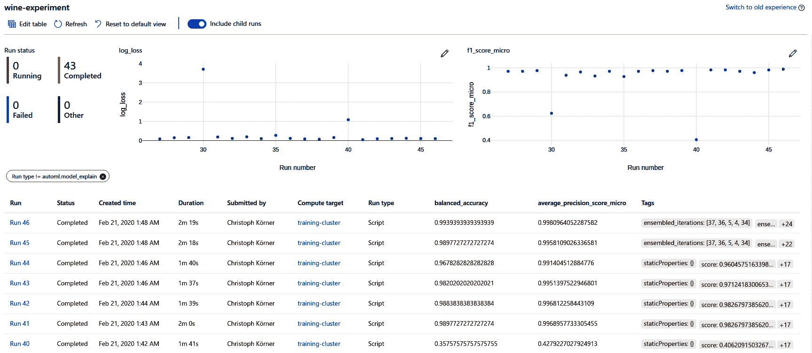
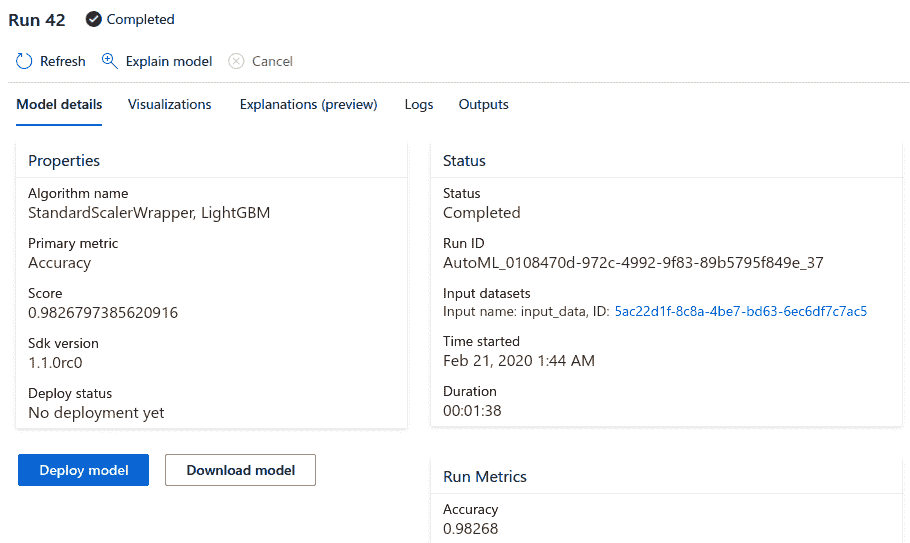

# 二、在 Azure 中选择机器学习服务

在前一章中，我们了解了端到端的**机器学习** ( **ML** )过程是什么样子的。我们经历了不同的步骤，从数据探索到数据预处理、培训、优化、部署和操作。在这一章中，我们想了解如何最好地浏览 Azure 中所有可用的 ML 服务，以及如何为您的目标选择正确的服务。最后，我们将解释为什么 **Azure 机器学习** ( **Azure ML** )服务是构建定制 ML 模型的最佳选择。这是我们将在整本书中用来实现端到端 ML 管道的服务。

首先，我们将看看 ML 和**人工智能** ( **AI** )的不同 Azure 服务，并讨论它们的差异和相似之处。一些服务将被完全管理，但灵活性很小，而其他服务将为您提供很大的灵活性，但并不是所有的服务都将被管理。我们还将了解不同的执行运行时和计算目标。

在下一节中，我们直接进入 Azure 认知服务，这是一个针对许多领域和预测任务的预训练 ML 端点。然后，我们将介绍定制的认知服务，这是一种针对特定任务或领域微调认知服务的方法。自定义视觉工具是可定制计算机视觉服务的一个很好的例子。

接下来，我们将在 Azure 中介绍带有**图形用户界面**(**GUI**)的 ML 工具。流行的工具 Azure ML Studio (classic)今天仍然被大量使用，但是存在更适合的替代工具。我们还将了解自动化 ML 以及它相对于 ML Studio 的优势。

最后，在最后一节，我们将介绍 Azure ML 的基础知识，我们将在本书中使用该工具在 Azure 中构建完全自动化的端到端 ML 管道。除了主要的术语和功能，我们还将提出如何逐步将现有的 ML 项目迁移到 Azure ML。这将给你带来与在 Azure ML 中开始一个全新项目相同的好处，从模型跟踪到自动部署和自动扩展训练集群。

本章将涵盖以下主题:

*   揭开 ML 的不同 Azure 服务的神秘面纱
*   Azure 认知服务和定制愿景
*   带有图形用户界面的 Azure ML 工具
*   Azure ML 服务

让我们直接开始揭开 AI 和 ML 的不同 Azure 服务的神秘面纱吧！


# 揭开 ML 的不同 Azure 服务的神秘面纱

Azure 提供了许多可用于执行 ML 的服务——你可以使用简单的**虚拟机** ( **VM** )、预配置的 ML 虚拟机(也称为**数据科学虚拟机** ( **DSVM** )、使用共享免费内核的 Azure 笔记本，或者任何其他为你提供计算资源和数据存储的服务。由于这种灵活性，通常很难浏览这些服务并选择正确的服务来实现 ML 管道。在这一节中，我们将提供关于如何在 Azure 中选择最佳 ML 和计算服务的清晰指导。

首先，讨论简单计算资源、ML 基础设施服务和 ML 建模服务之间的区别是很重要的。这一区别将帮助您更好地理解以下关于如何为特定用例选择这些服务的部分:

*   一个**计算资源**可以是 Azure 中为你提供计算能力的任何服务，比如虚拟机、虚拟机的托管集群(Azure Batch、Azure Databricks 等等)、容器执行引擎(Azure Kubernetes 服务、Azure 容器实例、Azure 函数、Azure IoT Edge 等等)，或者混合计算服务，比如 App Service。该服务通常用于实验，或者由 ML 基础设施服务管理。
*   一个 **ML 基础设施服务**帮助你实现、协调、自动化和优化你的 ML 培训、管道和部署。使用这样的服务，您通常可以使用自己的框架实现自己的预处理和 ML 算法。但是，该服务将为您的培训、优化和部署流程提供基础架构支持。Azure ML 是 Azure 中属于这一类的服务，也将是我们在本书中使用的服务。

*   最后，一个 **ML 建模服务**是一个帮助你创建或使用 ML 模型而不用写你自己的代码的服务。认知服务、**Azure Automated ML**(**AutoML**)、Azure ML Studio、Custom Vision 等服务都可以在这个类别中找到。虽然分成三个不同的类别看起来很直观，但是服务之间有很多重叠，比如 Azure ML 中的图形模型设计器等等。

The following pipeline is a typical choice of Azure ML and compute services in a real-world example for a predictive quality model that can be deployed on an on-premise edge device for stream processing:

*   Track experiments, pipelines, trained models, and containers using Azure ML
*   Run experiments in Azure Notebook using a DSVM
*   Preprocess a large dataset using Azure Databricks
*   Label the dataset using Custom Vision
*   Create an object detection mode without code using Custom Vision
*   Deploy the model to Azure IoT Edge

As you can see, there are many ways to combine services to build a pipeline. There are many different aspects to consider when choosing the *best* ML and compute services for an ML use case, which depend greatly on the problem statement, domain, team, skills, preferences, budget, and so on. Evaluating the trade-offs for every use case is an essential task when comparing the different services.


# Choosing an Azure service for ML

让我们从为 ML 选择一个服务开始，从而选择一个服务来实现、编排和扩充您的 ML 管道。在评估托管的**平台即服务** ( **平台即服务**)产品与更灵活的**基础设施即服务** ( **IaaS** )软件时，权衡是相似的。一般来说，Azure ML 服务可以通过增加灵活性和操作工作量来订购。以下是按灵活性和操作性排序的列表:

*   一项完全托管的服务，具有仅用于评分的预训练模型。
*   一项托管服务，通过迁移学习提供预培训模型和定制。
*   使用 GUI 进行实验、构建、培训和部署模型的托管服务。
*   协调计算资源和促进 ML 流程的托管服务。
*   实验、培训和部署模型的个人计算服务。

在我们研究帮助您决定使用哪种服务的决策树之前，您应该考虑灵活性和操作复杂性之间的权衡。通过 API 使用对象检测算法比训练和部署自己的对象检测模型要容易、快速和便宜得多。但是，如果您需要灵活地选择一个不被作为服务支持的特定模型或算法(例如，分段)，那么您别无选择，只能自己实现它。

一个很好的经验法则是尽可能地选择一个管理和训练有素的 ML 服务。如果这是不可能的，您应该评估 ML 算法是否可以作为一项服务使用并针对您的领域进行微调，或者是否必须从头开始构建。如果必须构建模型，那么下一步要考虑的是应该在 GUI 中还是以编程方式完成。最后，如果模型是以编程方式训练的，您需要选择底层数据存储和计算基础架构。我们的建议是尽可能选择或构建预先训练好的 API 和模型。

下图是根据我们刚刚讨论的逻辑选择正确的 ML 服务的指南:



根据前面的图表，我们提出了以下问题:*您可以消费预训练的模型还是必须自己构建自定义模型* *？*

这是问自己的第一个也是最重要的问题。你试图解决的 ML 问题是否已经存在，是否已经有人解决了？例如，如果您想要检测图像中的人脸，您可以使用认知服务 API 中现有的预训练模型，而不是自己构建、训练和部署该功能。根据经验，如果您正在处理视觉、语言(音频)或文本，那么这种模型很有可能已经存在。

If you are building on top of an existing algorithm but for a specialized domain, you can use custom Cognitive Services to fine-tune a pre-trained model for your domain. If you want to detect faulty products on a production line using camera images, you can use Custom Vision for fine-tuning the Vision Cognitive Service API for the domain of your products. The same rule of thumb is true for custom Cognitive Services: if you are working with vision, language (audio), or text, the chance is high that such a model already exists and can be fine-tuned.

In both of the previous cases, you don't have to implement a full end-to-end ML pipeline on your own but rather can consume the service as a fully managed API or service. Likewise, when you are developing a completely new model, you have to manage your ML pipeline on your own. As a rule of thumb, if you are working with **Internet-of-Things** (**IoT**) sensor data (and you're doing more than statistical anomaly detection), you most likely need to build the prediction model on your own.

In Azure, you have various choices to build your end-to-end ML pipelines for training, optimizing, and deploying custom ML models:

*   Build your own tools
*   使用开源工具，比如带有 ML 流的 Azure Databricks
*   使用 GUI 工具，例如 Azure ML Studio
*   使用 Azure ML

虽然我们完全理解在开源工具上构建您的定制解决方案听起来很有趣，或者从 GUI 工具开始听起来很容易，但我们强烈建议您首先了解 Azure ML。这是一个非常棒的服务，它为您的所有 ML 实验、管道、计算资源、数据集、Conda 环境、Docker 图像和训练模型提供了一个通用的工作空间，并提供了一个全面的 SDK 来与这些资源进行交互。因此，作为您的 ML 基础设施服务，它是一个极好的选择。

在 Azure ML 中，您可以通过 Python SDK 或 GUI 工具来决定代码优先使用，这类似于一个名为 Azure ML Studio 的服务。值得一提的是，SDK 绝对出色，提供了比 GUI 或通过 Azure 门户访问的服务更多的功能。它还能帮助您自动化和协调您的基础架构。因此，我们强烈建议您通过 Azure ML SDK 来构建您的 ML 基础设施。

如果您不是 Python 用户，Azure ML SDK 也可用于 R 语言。

如果您仍然不相信，让我用几行代码告诉您在 Python 脚本或笔记本中可以做些什么:

1.  使用 GPU 创建并启动自动扩展训练集群。
2.  向集群提交多个训练实验，并跟踪它们的结果。
3.  将最佳模型存储在模型注册表中。
4.  创建 Azure Kubernetes 集群。
5.  将您的实验中的最佳模型部署到 Kubernetes 集群。
6.  关闭并移除 GPU 集群。
7.  实现一个**持续集成** / **持续部署** ( **CI** / **CD** )管道来完成上述所有工作。

如果这听起来很有趣，我们强烈建议您阅读本书，并遵循以下章节中讨论的所有代码示例，因为我们将执行前面步骤中提到的所有内容。


# 为 Azure ML 服务选择计算目标

在典型的 ML 项目中，您可以轻松地在探索数据、标记数据、预处理数据、探索模型、训练模型、优化模型和部署评分服务之间切换。因此，这可能意味着您需要为您的 ML 管道中的不同阶段提供不同的计算服务，例如，训练深度学习图像识别模型与预处理图像数据和为单个图像的模型评分有不同的要求。

在我们开始计算目标之前，我们想澄清我们将在本书中经常使用的两个重要术语。当使用 Azure ML SDK 时，我们通常处理两个不同的计算目标，它们都运行 Python 解释器:

*   创作运行时
*   执行运行时

创作运行时是一个轻量级 Python 运行时，用于调用 Azure ML SDK 和编排您的基础设施。您通常使用创作环境来创建计算资源、触发培训运行、构建环境和部署模型。在这种环境中没有真正的计算，因此通常使用轻量级的 Python 解释器，如本地运行 Python 的 Visual Studio 代码、Azure 笔记本或单个 Azure ML 计算实例。

另一方面，执行环境*、*、*、*用于执行您的 ML 训练或评分代码。Python 解释器完成真正的工作；如果你想训练一个深度学习模型，你可能需要一台结实的机器。你会经常使用 Azure ML training cluster(也称为 **AML Compute** )、**Azure Kubernetes Service**(**AKS**)或者**Azure Container Instance**(**ACI**)作为执行环境。

在一个典型的工作流中，您使用一个创作环境通过 Azure ML SDK 创建一个计算集群(执行环境)，然后使用 Azure ML SDK 再次向该集群提交培训脚本。这里有一个小例子:

1.  首先，我们创建一个集群，并向该集群部署一个 ML 训练脚本。这是我们将在创作环境中运行的代码:

```
from azureml.core.compute import ComputeTarget, AmlCompute
from azureml.core.compute_target import ComputeTargetException
from azureml.train.estimator import Estimator

# Create the cluster
config = AmlCompute.provisioning_configuration(
  vm_size='STANDARD_D2_V2', max_nodes=4)
cluster = ComputeTarget.create(ws, "cluster", config)
cluster.wait_for_completion(show_output=True)

# Submit the training script to the cluster
estimator = Estimator(
  compute_target=cluster, entry_script='train.py', 
  conda_packages=['tensorflow'])
run = experiment.submit(estimator)
run.wait_for_completion(show_output=True)
```

正如您在前面的代码中看到的，我们用`4`节点创建了`AmlCompute`集群。然后我们向这个集群提交一个实验，它是一个环境和训练脚本的抽象，`train.py`。在幕后，Azure ML 将为我们完成创建集群、调度脚本和返回结果的所有工作。

2.  在执行环境中，Python 解释器现在将运行`train.py`脚本。这是脚本看起来的样子，以及在执行环境中要做的工作。首先，我们对训练数据进行预处理，并将标签转换为独热编码特征向量:

```
import keras

# Normalize training data
x_train = x_train.astype('float32')
x_test = x_test.astype('float32')
x_train /= 255
x_test /= 255

# Convert class vectors to binary class matrices.
y_train = keras.utils.to_categorical(y_train, num_classes)
y_test = keras.utils.to_categorical(y_test, num_classes)
```

3.  接下来，我们构建一个简单的**卷积神经网络** ( **CNN** )架构，使用带有池化的二维卷积、全连接隐藏层和 softmax 输出(我们将在[第 7 章](ef8acb66-47eb-415f-ba95-680d645e2ef3.xhtml)、*在 Azure 上训练深度神经网络*中更详细地讨论类似的架构):

```
from keras.models import Sequential
from keras.layers import Dense, Dropout, Activation, Flatten
from keras.layers import Conv2D, MaxPooling2D

model = Sequential()
model.add(Conv2D(32, (3, 3), input_shape=x_train.shape[1:]))
model.add(Activation('relu'))
model.add(MaxPooling2D(pool_size=(2, 2)))
model.add(Flatten())
model.add(Dense(128))
model.add(Activation('relu'))
model.add(Dense(num_classes))
model.add(Activation('softmax'))
```

4.  接下来，我们定义一个优化器和一个学习率，并编译 Keras 模型:

```
# initiate RMSprop optimizer
opt = keras.optimizers.rmsprop(lr=0.0001, decay=1e-6)

model.compile(loss='categorical_crossentropy',
 optimizer=opt,
 metrics=['accuracy'])
```

5.  最后，我们可以训练和评估模型:

```
model.fit(x_train, y_train,
 batch_size=batch_size,
 epochs=epochs,
 validation_data=(x_test, y_test),
 shuffle=True)

# Score trained model
scores = model.evaluate(x_test, y_test)
print('Test loss:', scores[0])
```

在前面的代码中，我们构建了一个简单的 Keras CNN，并使用 RMSProp 优化器对其进行了拟合。这里是关于 ML 模型训练的所有工作完成的地方——在执行环境中。

值得注意的是，您可以在创作运行时自行训练您的模型(例如通过在 Azure Databricks 中使用 PySpark ),并且只使用 Azure ML 服务来跟踪实验和模型。

如果您在 Azure 中工作，计算的流行选择如下:

*   **创作运行时**:
*   **实验** : Azure 笔记本(例如，使用 DSVM 或共享计算)
*   **培训**:Azure ML 计算实例
*   **执行运行时**:
*   **训练和优化** : 一个 Azure ML 训练集群
*   **部署** : Azure Kubernetes 服务

如您所见，选择合适的计算服务并不简单，因为它取决于您当前正在执行的任务。您应该始终尝试在灵活性和成本之间找到合适的平衡点。这一概述将帮助您选择正确的服务来运行您的创作或执行环境，以使用 Azure ML 作为您的基础设施服务来训练自定义 ML 模型。在下一节中，我们将了解如何利用预先训练的模型作为服务，而无需担心任何基础架构或计算目标。


# Azure 认知服务和定制愿景

如果你正在处理一个定义明确的一般 ML 问题，比如计算机视觉中的分类、对象或人脸检测、**光学字符识别** ( **OCR** )和手写识别、语音到文本和文本到语音、翻译、拼写检查、关键词和实体提取或情感分析，这些服务很有可能已经在 Azure 中实现并经过实战测试。在很多情况下，通过重用这些服务，而不是从头开始训练类似的模型，可以大大节省您的时间、资源和精力。

如果你的问题空间非常广泛，比如从相机图像到 ID 图像检测和匹配人脸，或者在用户上传的媒体中检测成人内容，那么你可以研究一下认知服务。认知服务网站展示了几乎所有 API 的演示，你可以在你的用例中试用它们。

如果您的领域非常具体，但使用了前面讨论的算法之一，则很可能您可以使用定制的认知服务，即针对您的定制领域进行微调的预训练认知服务模型。这通常对于图像分类和对象检测非常有效，例如，用于检测制造误差和自动质量控制。使用这样的定制模型是成本、资源和工作之间的一个很好的权衡。由于微调，这些模型通常在少量训练样本的情况下产生相当好的性能，这对于小型**概念验证** ( **PoC** )来说是最佳的。


# Azure 认知服务

认知服务是预训练的 ML 模型的 API 集合，分为六个类别:视觉、语音、知识、搜索、语言和异常检测。它们实现了这些类别中定义明确的常见问题，例如图像分类、语音转文本、异常检测等等。认知服务模型可以使用任何编程语言的 REST API 来消费。

一般来说，最好不要重新发明轮子，从而重用已经可用的功能。使用来自 Azure Cognitive Services 的人脸检测 API 很可能比构建一个完整和连续的端到端 ML 管道并从头开始训练相同的模型更有效。虽然使用认知服务 API 要容易得多，但是您的应用需要互联网连接才能访问 API。

下面是一个调用计算机视觉认知服务 API 的简单例子。我们将使用分析图像 API 从图像中提取类别、标签和描述:

```
import requests

def cs_vision_analyze(img_url, key, features=['Tags'], ...):
    endpoint = 'https://%s.api.cognitive.microsoft.com' % region
    baseurl = '%s/vision/v1.0/analyze' % endpoint
    headers = {'Content-Type': 'application/json', 
        'Ocp-Apim-Subscription-Key': key}
    params = {'visualFeatures': ','.join(features), 'language': lang}
    payload = {'url': img_url}

    r = requests.post(baseurl, json=payload, params=params, 
        headers=headers)
    return r.json()

url = 'https://..Tour_Eiffel_Wikimedia_Commons.jpg'
key = '<insert subscription key>'
features = ['Categories', 'Tags', 'Description']
res = cs_vision_analyze(url, key, features=features)
print(res)
```

正如您在前面的代码示例中看到的，使用认知服务归结为发送一个 HTTP 请求。在 Python 中，使用奇妙的`requests`库很简单。响应体包含标准 JSON，并对认知服务 API 的结果进行编码。从 API 得到的 JSON 输出将具有以下结构:

```
{
    "categories": [...],
    "tags": [...],
    "description"" {...},
    "requestId": "...",
    "metadata": {
        "width": 288,
        "height": 480,
        "format": "Jpeg"
    }
}
```

`categories`键包含对象类别和派生的分类，例如包括置信度得分的地标检测结果:

```
"categories": [
    {
        "name": "building_",
        "score": 0.9453125,
        "detail": {
            "landmarks": [
                {
                    "name": "Eiffel Tower",
                    "confidence": 0.99992179870605469
                }
            ]
       }
    }
]
```

`tags`键显示图像的多个标签，其置信度与整个图像相关:

```
"tags": [
   {
       "name": "outdoor",
        "confidence": 0.99838995933532715
    },
    {
       "name": "tower",
        "confidence": 0.63238395233132431
    }, ...
]
```

最后，`description`标签给了你更多的标签和自动生成的图片标题——是不是很神奇？

```
"description": {
    "tags": [
        "outdoor", "building", "tower", ...
    ],
    "captions": [
        {
            "text": "a large clock tower in the background with Eiffel Tower in the background",
            "confidence": 0.74846089195278742
        }
    ]
}
```

认知服务计算机视觉 API 的结果只是如何使用这项服务的一个例子。我们从 API 请求了`categories`、`tags`和`description`的图像特征，它们作为 JSON 对象的键返回。每个类别和标签预测返回与置信度值相结合的最佳结果。一些类别可能会触发其他检测模型，如人脸、手写文本识别和 OCR。从前面的示例中，您可以看到，在零售应用中使用以下代码自动向产品图像添加图像标题是非常简单的:

```
for url in product_image_urls:
    res = cs_vision_analyze(url, key, features=['Description'])
    caption = res['description']['captions'][0]['text']
    print (caption)
```

你可以看到，这是实现/使用可扩展的基于深度学习的图像分析服务的最快方式，例如为图像创建标题。将这一功能集成到您自己的应用中只需要不到五分钟的时间。但是，您也可以看到，您只能使用微软提供的功能(例如，分类中的标签)。一个很好的例子是医学图像中的对象检测或实例分割。在认知服务的计算机视觉 API 中，这些用例不存在任何现成的模型。在这种情况下，通过为您的特定领域定制模型，您仍然可以从认知服务中受益——这正是 Custom Vision 为常见的计算机视觉任务所做的事情。


# 定制愿景—定制认知服务 API

许多开发人员发现认知服务非常有用，但是在应用领域方面受到限制。以下两个常见的例子说明了这种局限性:

*   对于塑料制造商来说，对象检测 API 提供的分类标签并不能涵盖他们所有的产品类别。
*   对于处理转录病历的服务，许多医学术语不被识别或者被不正确地转录。

你可以在 Azure 中定制越来越多的 ML 服务。在撰写本书时，以下可定制的认知服务可用:

*   自定义视觉(分类和对象检测)
*   可定制的语音识别和转录
*   用于文本到语音转换的可定制语音
*   可定制翻译
*   文本中的自定义意图和实体识别

在这些情况下，您仍然可以从认知服务背后的易用性、技术和服务基础设施中受益。定制认知服务允许您使用迁移学习在现有认知服务模型的基础上训练您的模型。对于计算机视觉服务，为您提供了一个很好的 UI 来分类您的图像和标记您的对象，并随后使用最先进的模型和误差度量来训练模型。以下屏幕截图显示了目标检测的定制视觉服务中的培训内容:



你可以在前面的截图中看到，训练就像点击右上角的训练按钮一样简单。您不必编写任何代码或选择要优化的错误指标，这一切都是为您管理的。在屏幕截图中，您可以看到训练的结果，其中三个指标是在一个验证集上自动计算的。通过移动左上方的分类概率阈值，您甚至可以将权重向更高的精度或更高的召回率转移，这取决于您是希望避免假阳性还是最大化真阳性。

一旦模型被训练和发布，就可以像我们对认知服务所做的那样，使用 REST API 来消费它。以下代码块是使用`requests`库的 Python 示例代码片段:

```
import requests

def cs_custom_vision(img_url, key, project_id, iteration_name, ...):
    endpoint = 'https://%s.api.cognitive.microsoft.com' % region
    url = '%s/customvision/v3.0/Prediction/%s/detect/iterations/%s/url' 
       % (endpoint, project_id, iteration_name)
    headers = {'Content-Type': 'application/json', 'Prediction-Key': key}
    payload = {'url': img_url}

    r = requests.post(url, json=payload, headers=headers)
    return r.json()
```

在前面的代码中，我们实现了一个看起来非常类似于我们在认知服务中使用的函数。事实上，只有端点和`requests`参数发生了变化。我们现在可以像以前一样调用该函数:

```
url = 'https://..Wood_Plate.jpg'
key = '<insert custom vision key>'
project_id = '00ae2d88-a767-4ff6-ba5f-33cdf4817c44'
iteration_name = 'Iteration2'
res = cs_custom_vision(url, key, project_id, iteration_name)
print(res)
```

响应也是一个 JSON 对象，现在看起来如下所示:

```
{
    "Id":"7796df8e-acbc-45fc-90b4-1b0c81b73639",
    "Project":"00ae2d88-a767-4ff6-ba5f-33cdf4817c44",
    "Iteration":"59ec199d-f3fb-443a-b708-4bca79e1b7f7",
    "Created":"2019-03-20T16:47:31.322Z",
    "Predictions":[
        {
             "TagId":"d9cb3fa5-1ff3-4e98-8d47-2ef42d7fb373",
             "TagName":"defect",
             "Probability":1.0
        },
        {
             "TagId":"9a8d63fb-b6ed-4462-bcff-77ff72084d99",
             "TagName":"defect",
             "Probability":0.1087869
        }
    ]
}
```

前面的响应现在包含一个`Predictions`键，其中包含来自自定义视觉的所有预测和置信度值。正如您所看到的，这个例子看起来非常类似于认知服务的例子。然而，我们需要传递参数来指定项目和已训练模型的已发布迭代。使用这种内置的服务 API，我们在实现和操作部署基础设施方面节省了大量精力。但是，如果我们想在其他地方使用训练好的模型(例如，在 iPhone 或 Android 应用中，或者在 Kubernetes 集群中)，我们可以以许多不同的格式导出模型(包括 Tensorflow、CoreML、ONNX 等等)。

在处理明确定义的 ML 问题时，定制认知服务是有效测试或展示定制应用领域的 ML 模型的一种极好的方式。您可以使用 GUI 或 API 与这些服务进行交互，并通过托管 API 来使用模型，或者将它们导出到任何设备平台。另一个好处是，您不需要深入的 ML 专业知识来应用迁移学习算法，并且可以简单地使用预定义的模型和误差度量。

如果您需要算法、模型和错误度量的完全定制，您需要自己实现模型和 ML 管道。在接下来的章节中，我们将讨论如何使用 GUI 或者代码优先工具来实现这一点。


# 带有图形用户界面的 Azure ML 工具

Azure 提供了一些很棒的 GUI 工具，可以用来直接训练和部署数据管道和 ML 模型，或者从不同的服务中重用该功能。

我们将研究三种不同的服务:Azure ML Studio(经典)、Azure Automated ML 和 Power BI。在这三个服务中，只有 Azure ML Studio 是一个传统的基于 GUI 的服务，使用它可以在一个交互式的基于块的环境中定制数据管道、转换、特征提取和 ML 模型验证。

其他两个服务都基于自动化 ML 引擎的能力，我们可以通过自动化 ML GUI、SDK 或 Power BI 中的 Power Query 转换来访问它。自动化 ML 提供了使用零代码创建强大 ML 模型的神奇能力。让我们来看看各个服务，它们是如何使用的，以及它们之间的比较。


# Azure ML Studio(经典)

Azure ML Studio (classic)是 Azure 中广泛采用的工具，用于使用 GUI 构建、训练、优化和部署 ML 模型。它是 ML 最古老的托管云服务之一，通过 R 和 Python 支持提供了大量健壮的特性、算法和扩展。这是一个奇妙的无代码环境，可以在其中构建复杂的 ML 模型，用于聚类、回归、分类、异常检测、推荐模型以及数据、统计和文本分析。

尽管 Azure 最近发布了一个类似的新产品，即 Azure ML Designer(本质上是嵌入到 Azure ML 工作区中的 Azure ML Studio)，Azure ML Studio (classic)仍然存在，并且被许多大公司大量使用。

Azure ML Studio 中的主界面允许您通过将功能块连接到操作图来构建 ML 模型。下面的屏幕截图显示了该界面的概述。很容易上手，从左边拉功能块读入数据、预处理数据、执行特征选择或使用 ML 算法进行模型训练:



在前面的屏幕截图中，我们可以看到打开一个空项目时的默认视图。一旦我们将所有块放置到位并使用块连接将它们连接起来，我们就可以按 RUN 来评估操作图。这将为您旋转计算资源并为您训练模型，您无需指定任何计算基础架构。

Azure ML Studio 让您可以轻松地从许多不同的来源导入数据，其中许多来自 Azure 内部。从 Blob 存储中加载 CSV 文件只需点击一下鼠标。但是，您也可以从 SQL Server、Azure Cosmos DB 或 Hive 导入数据。它为数据格式和数据类型、规范化和清理块提供了许多强大的转换。在撰写本文时，数据导入被限制为 10 GB，如果您正在处理更大的数据集，这可能是一个限制。

随着越来越多的功能块模块添加到您的工作空间中，您可以创建复杂的数据预处理、模型训练和验证管道。下面的屏幕截图显示了一个典型的信用评分风险评估模型的管道，该模型使用了一个**支持向量机** ( **SVM** )和一个梯度增强决策树分类器。首先，我们读取数据，清理数据，并将其分成训练集和测试集。我们使用数据集来训练决策树集成(右)和 SVM 模型(左)。最后，使用测试数据分割对两个模型进行训练、评分和评估:



正如您在前面的屏幕截图中看到的，虽然将您的数据流组织成功能块很好，但是整个工作空间可能会变得非常复杂，难以理解。您还可以通过使用 Python 或 r 的自定义代码块来扩展 Azure ML Studio 的功能。这非常方便，因为我们现在可以构建抽象功能的可重用块。

在每个 Python 代码块中，我们定义了一个函数，该函数将最多两个 Pandas 数据帧作为输入，并可以输出转换后的数据集。这是 Python 代码块函数的框架，我们需要在其中定义转换代码:

```
# imports up here can be used to 
import pandas as pd

# The entry point function can contain up to two input arguments:
# Param<dataframe1>: a pandas.DataFrame
# Param<dataframe2>: a pandas.DataFrame
def azureml_main(df_1 = None, df_2 = None):

   # Return value must be of a sequence of pandas.DataFrame
   return df_1,
```

如果您想要执行数据分析，并且不想使用我们刚刚看到的代码块，您可以随时右键单击其中一个代码块，直接可视化数据或从 Jupyter 笔记本中访问数据。在 Azure ML Studio 中，只需直接点击右边的菜单选项，一切就都正常了。

Azure ML Studio (classic)过去和现在都非常受欢迎的原因之一在于它的部署能力。如果您已经创建了一个数据管道并训练了一个模型，那么您可以将训练好的模型保存在 ML Studio 中。现在，只需点击几下鼠标，您就可以使用该模型创建一个 web 服务，用新数据重新训练该模型，或者部署一个评分服务。用户输入是通过我们之前用于训练数据的完全相同的数据导入块来定义的。然后，我们将用户输入与经过训练的模型连接起来，对模型进行评分，并将输出返回给 web 服务。再点击一下，您就可以使用 web 服务计划将管道部署到生产环境中。只需 5 分钟的工作和几次点击就可以部署一个训练有素的模型，这是绝对方便的。

如果您想在 GUI 环境中快速开始构建复杂的工作流和预配置的 ML 模型，并将它们作为服务部署到生产中，Azure ML Studio (classic)是一个不错的工具。尽管被很多公司使用，但我不认为它是在 Azure 中实现 ML 模型的最佳工具。对于没有编码或 ML 经验的人来说，模型和模块太难正确使用，对于有经验的人来说不够灵活。因此，它处于一个奇怪的位置，经常被不知道自己在做什么的用户误用。

然而，不了解 ML 不应该阻止用户使用正确的工具训练 ML 模型。我只是认为有更好的工具适合这些受众——其中之一肯定是自动化 ML，它为没有经验的用户提供了更好的抽象层次。我们来看看吧！


# Azure 自动化 ML

没有训练 ML 模型经验的用户不应该必须选择、参数化或配置用于训练的算法。同时，每个人都应该有机会为符合标准的数据集创建预测模型。在人工智能的民主化中，我们的目标是给每一个可以使用电子表格应用的用户在电子表格的特定数据区域训练 ML 模型的可能性。但是，如果用户对 ML 一无所知或了解有限，应该如何做呢？

Azure 自动化 ML 拯救世界！Azure Automated ML 是一个无代码工具，允许您指定数据集、目标列和 ML 任务来为您训练 ML 模型。我们认为，对于只想让训练数据符合目标变量的用户来说，这是一个很好的抽象。下面的屏幕截图显示了自动化 ML 界面的最后一步，用户需要为指定的数据选择要解决的 ML 任务:



正如我们在前面的截图中看到的，自动化 ML 目前支持分类、回归和时间序列预测任务。连同对每个任务的信息性解释，这是我们可以交给普通 Excel 用户的东西，或者帮助 ML 工程师快速构建和部署一个很好的基线模型。我们将在第八章、*Azure ML 集群上的分布式机器学习*中看到更多细节。

然而，为了让您兴奋起来，您可以在下面的截图中看到一些额外的输出，这些输出是您在自动化 ML 中为每个经过测试和优化的模型得到的。自动化 ML 使您可以访问所有训练运行、所有训练模型及其性能，以及有用的指标和见解，如 ROC 曲线、增益曲线和混淆矩阵(后者用于分类任务):



Python 中的 Azure ML SDK 也提供了自动化 ML。在那里，您可以直接从您的创作环境中获得相同的功能。

自动化 ML 是一个了不起的里程碑，它为没有经验和高技能的用户提供了一个真正的 ML 即服务平台，具有很好的抽象性。这项服务将为未来产品的人工智能能力提供动力。如果 ML 模型的自动化训练可以作为 Excel 中的单个按钮来使用，例如使用自动化 ML 来转换给定数据范围的单个按钮，会怎么样？虽然这听起来很酷，但它已经在 Power BI 的 Power Query 转换视图中实现了——同样的事情也增强了 Excel 的数据转换功能。在下一节中，我们将看到它的实际效果。


# Microsoft Power BI

微软 Power BI 是一款出色的自助服务**商业智能** ( **BI** )工具，可以连接到多个数据源，在那里加载、转换和连接数据，并创建自定义的可视化和洞察力。它看起来和感觉就像另一个微软办公工具，类似于使用 Excel 或 PowerPoint。这使它成为一个自助 BI 工具，因为它非常容易使用，快速，非常灵活。

Power BI 或者实际上 Power BI Service premium 的 Power Query editor——Power BI 在线服务——有一个非常相似的内置自动化 ML 界面，正如我们在上一节中看到的那样。事实上，它们基于相同的自动化 ML 引擎，现在可以通过多种服务和 Azure ML SDK 的 AutoML 包进行配置。这使我们能够直接在 Power BI 中访问自动化 ML 的所有功能，以便基于分类或回归任务进行数据转换。

下面的屏幕截图显示了在 entities 视图中选择 Add a machine learning model 操作后 Power BI 中的自动化 ML 视图的概述。在撰写本文时，此功能仅在 Power BI premium 在线服务中作为预览提供:



虽然我知道您现在不会使用自动化的 ML 开始在 Power BI 中训练您的模型，但是了解当前的可能性和未来的趋势是很重要的。有一点是肯定的:面向普通办公用户的人工智能和人工智能的民主化正在快速推进。

如果你觉得 GUI 工具很有趣，但是你的目标是使用你自己的框架和训练代码创建你自己的 ML 代码，那么最好的支持你的服务是 Azure ML。


# Azure ML 服务

Azure ML 是 Azure 中 ML 服务家族的最新成员。它最初是作为一把伞构建的，将所有其他 ML 服务组合在一个工作空间下，因此也经常被称为 Azure ML 工作空间。目前，它提供、组合和抽象了许多重要的 ML 基础设施服务和功能，如跟踪实验运行和输出、模型注册、基于 Conda 和 Docker 的环境和容器注册、数据集注册、管道、计算和存储基础设施等等。

除了所有的基础设施服务，它还集成了 Azure Automated ML、Azure ML Designer(新的 ML Studio classic)和一个数据标签 UI，位于一个可以共享相同基础设施资源的工作空间中。事实上，如果你想做一些严肃的事情，你要找的就是 ML 服务。在许多情况下，它能满足您的所有要求，甚至更多。在这一节中，我们将主要关注 ML 基础设施的功能。

虽然 Azure ML 提供了一个很棒的 UI(令每个人困惑的是，它被称为 **ML Studio** )，但我们将主要通过 SDK 来使用它的功能。我们将使用 Python SDK 在一个环境中运行编排命令，我们已经在 Jupyter 笔记本中使用该环境进行数据可视化和探索。下面的截图展示了 Azure 门户中 Azure ML 的 UI:


在 Azure ML 中，我们可以通过 UI 和 SDK 轻松管理不同的计算资源。大多数情况下，我们会在 ML 流程的不同步骤中使用三种类型的计算资源:

*   **创作运行时和 Jupyter** 的计算实例:这类似于 DSVM。
*   **一个在训练期间用于 ML 执行运行时的自动扩展训练集群**:这是一个 Azure ML 计算集群。
*   **评分期间执行运行时的推理集群**:这是一个使用 Azure Kubernetes 服务的托管 Kubernetes 集群。

值得一提的是，这些服务中的每一个都可以用不到 10 行代码使用 SDK 从 Python 中创建。存储资源也是如此。我们可以使用 ML SDK 来管理 ML 工作空间中的 Blob 存储容器。这非常简洁，因为它允许我们有效地存储来自训练运行的输出、诸如训练模型或训练脚本之类的工件、数据集快照等等。

除了管理基础设施，Azure ML 还能为我们做更多的事情。最重要的是，它可以跟踪我们的实验运行，并收集输出文件、工件、日志和自定义指标，如培训损失等。这是迄今为止进入 Azure ML 世界的最强大的门户药物。通过简单地注释您现有的 ML 项目，您可以跟踪您的所有模型分数——甚至在每个时期的训练期间——流式传输您的日志输出，收集您的所有输出图像，并收集和存储每次迭代或运行的最佳模型。这就像魔术一样，只要几个简单的语句，你就不会再丢失某次训练的模型，而且你可以记录每次训练的损失。

在 Azure ML Studio 中，使用几行代码就可以对数据集、环境和模型进行跟踪和版本控制。这给了您很大的好处，能够在您的工作空间中保持一个可预测的变更历史。通过这样做，您可以创建可重复的实验，这些实验总是为训练运行读取相同的数据快照，使用相同的指定 Conda 环境，并更新模型历史和工件存储中的训练模型。这将为您的培训渠道带来 CI/CD 方法。

说到管道，Azure ML 可以让你把代码抽象成管道。管道可以并行运行数据准备作业，创建和启动训练集群，并在集群上执行训练脚本。您可以看到一切如何引导您实现可重复、版本化的端到端培训流程。然而，最重要的是，你不必全身心投入就能从 Azure ML 中获益。

相反，你可以一点一点地开始，在训练过程中添加越来越多有用的东西，然后逐渐将现有的或新的 ML 项目转移到 Azure ML 工作区。我们将在[第十一章](c6e3ad17-9212-42ee-ae25-b111e530518a.xhtml)、*部署和操作机器学习模型*中简要了解一下 Azure ML 的部署能力。

让我们首先探索如何在 Azure ML 中跟踪实验，然后看看如何使用我们自己的框架和工具训练模型。


# 用 Azure ML 组织实验和模型

Azure ML 为您提供了所有必要的基础设施和服务，这样您作为用户就可以专注于编写和实现您的 ML 代码。开始使用 Azure ML 并体验其功能的最简单方法是开始在 Azure ML 中组织您的训练实验和运行。通过一些小的更改，您可以获得实时的训练洞察，跟踪每次运行的性能、导出的日志、导出的输出，以及跟踪和版本化的训练模型。最棒的是，它可以在任何机器上的任何 Python 解释器上运行。

下面的截图给了你一个可以期待的很好的参考。只需在一个地方跟踪和收集所有的实验运行。该视图是完全可配置的，指标在左侧，图表在顶部，表格在底部，可以根据您的喜好进行配置。您只需在您的培训脚本中添加几行代码，而无需对您当前的行为做任何改变，就可以获得所有这些(以及更多):



在前面的截图中，您可以看到所有 ML 实验运行都被跟踪。您可以看到自动参数，如训练持续时间、开始时间、状态以及跑步表现。除此之外，您还可以发送自定义指标、标签等等。我们希望在本书中涵盖所有的可能性，但是值得一提的是，你可以在 10 分钟内从代码中没有跟踪到前面的截图。

通过开始使用 Azure ML，你不需要改变当前工作流中的任何东西，而是通过使用实验运行、度量、日志和模型的跟踪和日志功能来简化你的生活。

在 Azure ML 中，你的 ML 任务被组织成实验。每个实验现在可以有多个运行，并且每个实验的运行输出和指标将被汇总。因此，如果您试图实现一个信用评分预测服务，您可以将您的实验称为`credit-score-regression`。下面是一个如何使用 Azure ML 将这些信息添加到 Python 项目中的示例。请注意，默认情况下，将自动为您创建所有尚不存在的实验和运行:

接下来，您要试验不同的特性、模型和参数，因此我们要跟踪所有这些努力，看看哪一个是最好的。这在 Azure ML 中被称为*运行*；为了开始跑步并跟踪我们训练的几个时期，我们将以下代码添加到项目中:

```
from azureml.core import Workspace, Experiment

# Configure workspace and experiment
ws = Workspace.from_config()
exp = Experiment(workspace=ws, name="credit-score-regression")
```

Next, you experiment with different features, models, and parameters and hence we want to track all these efforts to see which one was the best. This is called a *run* in Azure ML; to start a run and to track a few epochs of our training we add the following code to the project:

```
run = exp.start_logging()

for i in range(1, n_epochs):
  loss = model.train_epoch(...) 
  run.log('loss (train)', loss)
```

前面的代码现在会将每次迭代的所有损失值发送到 Azure ML，并使这些值在运行时可用。这里真正令人惊奇的是，我们既可以发送具有多个值的相同指标(正如我们刚才看到的)，也可以发送具有单个值的相同指标(在下一个示例中)。当发送多个值时，如每个时期的训练损失，Azure ML 会自动为您创建一个可视化-当发送单个值时，它会在 UI 中显示为单个值，并在概览表和聚合中使用该值。根据默认配置，如果您在跑步中添加准确度作为单一指标，Azure ML 将在概览中向您显示(例如)所有训练跑步的最大准确度。以下代码片段显示了如何记录单个指标:

本节并非详尽无遗；我们不会涵盖 Azure ML 可以跟踪的所有内容。然而，有必要提及的是，您可以像我们收集指标的方式一样，跟踪您管道的任何额外输出。下面的代码片段显示了如何跟踪以前保存到磁盘的定型模型:

```
# Save model scores
scores = model.evaluate(X_test, y_test, verbose=1)
run.log('accurcay (test)', scores[1])
```

您想要保存的文件不必是训练模型，它可以是您想在跑步中另外保存的任何文件。请注意，运行可以配置为自动上传您当前的培训脚本，从输出文件夹中收集所有内容，并将日志文件夹中的所有内容传输到 Azure ML。然而，如果工件是一个模型，您也可以在模型注册中心注册这个模型。同样，这是一个简单的命令来跟踪您的训练模型，它将自动与运行连接:

```
# Upload the best model
run.upload_file(model_name, model_path)
```

我们不一定需要指定额外的信息，例如用于训练模型的框架。然而，如果我们这样做，我们将获得许多额外的好处，包括模型解释、无代码部署等等。我们将在[第 6 章](19d1af93-3b84-4bdb-96c7-d92d3054b2a0.xhtml)、*使用 Azure 机器学习*构建 ML 模型和[第 11 章](c6e3ad17-9212-42ee-ae25-b111e530518a.xhtml)、*部署和操作机器学习模型*中分别看到更多这方面的内容。

```
# Register the best model
run.register_model(model_name, model_path=model_name, 
    model_framework='TfKeras')
```

在下面的屏幕截图中，您可以看到在上传和注册跑步模型时所得到的结果:一个将您的模型与您的实验跑步及其指标相链接的中心位置。您再也不会丢失已训练的模型，也不会用尽磁盘空间来保存已训练的模型，也不必记住哪些参数用于训练该模型，或者在运行期间测试性能如何，等等:



在一次运行的总结中，我们还可以找到一个按钮来直接部署一个模型。只需点击几下或者 Python 中的三行代码，我们就可以从训练运行到训练模型，再到部署为云中的容器服务的模型。它可以让你在几秒钟内把一个模型变成一个评分服务。这简直令人印象深刻，并且从中有如此多的巨大好处——想象一下，在一个登台环境中毫不费力地为所有训练有素的模型提供服务，能够对您的模型运行端到端测试，并且使用完全自动化的 CI/CD 管道。

通过 Azure ML 部署


# 我们希望你已经对 Azure ML 的潜力有了一个很好的印象，我们只讨论了它的一小部分功能。然而，所有其他功能也是如此——Azure ML 解决了您的基础设施问题，让您专注于开发出色的数据管道、特征提取器和预测模型。当观察 Azure ML 的部署特性时，这变得非常明显。

在 Azure ML 中，我们大致区分了两种类型的部署:

第一种类型是将训练好的模型部署为在线评分的 web 服务。我们可以自动将模型部署到 Azure Kubernetes 服务，以从容器化、自动扩展和蓝绿色部署中受益。还有许多额外的企业功能，包括身份验证、用于 A/B 测试的多个端点、遥测收集等等。

*   第二种部署类型是通过服务对大量数据进行批量评分。在 Azure ML 中，这是通过使用管道来实现的。您的评分脚本被参数化并包装到 Azure ML 管道中，该管道本身可以作为 web 服务部署。调用此 web 服务现在可以参数化并触发您在批处理评分脚本中实现的任何任务，例如从 Blob 存储中读取文件，对它们进行评分，并将结果写回到 CSV 文件中。除此之外，您可以使用相同的部署类型来触发您的模型的重新训练。
*   除了标准部署之外，您还可以将经过训练的模型从模型注册中心引入到任何 Python 解释器中。这意味着您可以在任何 Python 环境中下载您的模型，无论是 Azure Databricks 上的 PySpark 还是 Azure Data Explorer 中的 Python 运行时。这为许多高级定制部署方法打开了大门，在这些方法中只有天空是极限。

如果您使用通过 sklearn 和其他支持的框架训练的标准 ML 模型，您可以使用无代码部署直接从模型注册中心部署模型。这将自动配置您的环境，引入正确的 Docker 基础映像和 Python 包，使用默认的评分脚本，并将模型作为 web 服务部署到 Azure 容器实例。对于集成和端到端测试，以及测试和 QA 环境来说，这是一个极好的特性。同样，如果有足够的时间，这可能是你可以自己实现的，但是开箱即用真的很方便。

另外值得一提的是，Azure 允许你在 Azure Kubernetes 服务上的同一个端点部署多个模型。对于每个端点，您可以配置应该自动路由到那里的流量百分比。最重要的是——对于所有部署的服务——我们开箱即可获得自动化遥测数据和监控。令人惊奇的是，所有这些都在您的创作环境中与几行 Python 代码一起工作。我们将在[第 11 章](c6e3ad17-9212-42ee-ae25-b111e530518a.xhtml)、*部署和操作机器学习模型*中深入了解这一点。

除了跟踪实验指标和模型，并将这些模型部署到 Kubernetes，Azure ML 还可以做更多的事情。然而，这应该只是让你明白，用最少的努力、30 分钟的宝贵时间和现有的培训渠道就能完成什么。您还看到，对于您使用的框架、模型或功能没有任何限制；如果您使用 Python(或 R ),它将以一种简单的方式工作。

摘要


# 在这一章中，我们学习了 Azure 中多个 ML 和 AI 服务的区别。您现在可以轻松地浏览各种 Azure 服务，并知道哪个 ML 任务需要哪个服务。如果您的任务和数据可用于认知服务，那么简单地使用认知服务 API 进行预测是非常方便的。常见的计算机视觉任务就是这种情况，例如常见对象的对象检测、图像字幕和标记、人脸检测、手写文本识别、地标检测以及许多其他文本和语言任务。

如果您需要为来自自定义域的数据构建自定义模型，您可以选择带有 GUI 的工具，如 Azure ML Studio (classic)。然而，如果您不知道如何选择和配置一个好的定制 ML 模型，那么自动化 ML 将是您更好的选择。

最后，如果你想创建自己的定制模型，你最好的选择是 Azure ML 服务。它是一个很棒的工具，使您能够使用自己的框架和环境构建完全自动化的端到端 ML 管道和部署。您了解了如何通过创作环境协调所有基础设施自动化，该环境将自动在执行运行时安排您的培训运行，例如，这可能是一个自动扩展的 GPU 集群。

Azure ML 也是我们在本书中用来帮助你实现这样一个管道的服务。在下一章，我们将看看如何设置和准备你的 Azure ML 工作空间，并使用嵌入和数据可视化在 Azure 中掌握数据探索。

Azure ML 也是我们在本书中用来帮助你实现这样一个管道的服务。在下一章，我们将看看如何设置和准备你的 Azure ML 工作空间，并使用嵌入和数据可视化在 Azure 中掌握数据探索。