# 五、使用自然语言处理的高级特征提取

在前面的章节中，我们了解了 Azure **机器学习** ( **ML** )服务和标准 ML 管道中的许多标准转换和预处理方法。在这一章中，我们想更进一步，从文本和分类数据中提取特征——这是用户在训练 ML 模型时经常面临的问题。本章将描述用**自然语言处理** ( **NLP** )进行特征提取的基础。这将帮助您使用 NLP 为 ML 管道实际实现语义嵌入。

首先，我们将看看文本数据、分类数据、名义数据和顺序数据之间的区别。这种分类将帮助您决定每种要素类型的最佳要素提取和转换技术。稍后，我们将研究分类值最常见的转换，即标签编码和一键编码。将对这两种技术进行比较和测试，以了解这两种技术的不同用例及应用。

接下来，我们将处理文本数据的数字嵌入。为此，我们将使用计数矢量器构建一个简单的词袋模型。为了净化输入，您将构建一个 NLP 管道，其中包括标记化器、停用词移除、词干化和词汇化。我们将逐步了解这些不同的技术如何影响样本数据集。

然后，我们将使用一种更好的词频加权方法来取代字数统计方法，即**词频-逆文档频率** ( **tf-idf** )算法。这将帮助您在给定整个文档集的情况下计算单词的重要性，方法是将某个术语在一个文档中的出现频率与在文档集中的出现频率进行加权。我们可以通过使用语义单词嵌入来改进这种技术，例如**全局向量** ( **GloVe** )和 Word2Vec。最后，我们将快速查看当前最先进的语言模型，这些模型基于具有超过 1 亿个参数的序列到序列深度神经网络。

本章将涵盖以下主题:

*   理解分类数据
*   构建一个简单的单词袋模型
*   利用术语重要性和语义
*   实现端到端语言模型


# 理解分类数据

分类数据有多种形式、形状和含义。了解您正在处理什么类型的数据非常重要—是字符串、文本还是伪装成分类值的数值？这些信息对于数据预处理、特征提取和模型选择是必不可少的。

首先，我们将看看不同类型的分类数据，即序数、名词性和文本。根据不同的类型，您可以使用不同的方法从中提取信息或其他有价值的数据。请记住，分类数据是无处不在的，无论是在 ID 列、名词性类别、序数类别还是自由文本字段中。值得一提的是，关于数据的信息越多，预处理就越容易。

接下来，我们将通过将序数和名词性分类数据转换成数值来对其进行预处理。当您希望稍后使用不能解释分类数据的 ML 算法时，这是一个必需的步骤，对于大多数算法来说都是如此，例如，基于决策树的方法除外。大多数其他算法只能对数值进行运算(例如，计算损失函数),因此需要进行转换。


# 比较文本、分类和顺序数据

许多最大似然算法，如支持向量机、神经网络、线性回归等，只能应用于数值数据。但是，在现实世界的数据集中，我们经常会发现非数字列，例如包含文本数据的列。本章的目标是将文本数据转换为数字数据，作为一个高级的特征提取步骤，它允许我们将处理后的数据插入任何 ML 算法。

在处理真实世界的数据时，您会遇到许多不同类型的文本和/或分类数据。为了优化 ML 算法，您需要理解不同之处，以便对不同的类型应用不同的预处理技术。但是首先，让我们定义三种不同的文本数据类型:

*   **文本数据**:自由文本
*   **分类名义数据**:不可订购的类别
*   **分类有序数据**:可排序的类别

文本数据和分类数据之间的区别在于，在文本数据中，我们希望捕捉语义相似性(单词含义的相似性)，而在分类数据中，我们希望区分少量变量。

分类标称数据和有序数据之间的区别在于，标称数据不能排序(所有类别都具有相同的权重)，而有序类别可以在有序尺度上进行逻辑排序。

下面是一个新闻评论数据集的例子，其中第一列名为`statement`，是一个文本字段，第一列名为`topic`是一个名词类别，`rating`是一个序数类别:


理解这些数据表示之间的差异对于以后找到合适的嵌入技术是至关重要的。用一个序数标度来代替序数范畴，并在一个正交空间中嵌入名义范畴，这似乎是很自然的。相反，如何将文本数据嵌入到保留语义的数字空间中并不明显——这将在本章后面处理 NLP 的部分中讨论。

请注意，您还会看到代表分类信息的连续数值变量，而不是分类值；例如，来自维度或查找表的 id。尽管这些是数值，但如果可能的话，您应该考虑将它们视为分类名义值。以下是一个数据集示例:

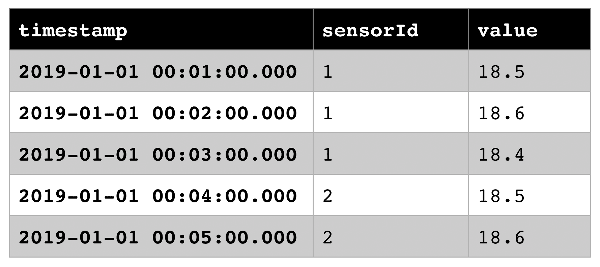

在前面的示例中，我们可以看到`sensorId`值是一个数值，默认情况下应该被解释为分类标称值，而不是数值，因为它没有数值意义。从`sensorId` `1`中减去`sensorId` `2`得到什么？`sensorId` `10`比`sensorId` `1`大 10 倍吗？这些是发现和编码这些分类值的典型问题。我们将在[第 6 章](19d1af93-3b84-4bdb-96c7-d92d3054b2a0.xhtml)、*使用 Azure 机器学习构建 ML 模型*中看到，通过指定这些值是分类的，梯度提升树模型可以优化这些特征，而不是将它们视为连续变量。


# 将类别转换为数值

让我们从将分类变量(包括序数和名义变量)转换成数值开始。在这一节中，我们将研究两种常见的分类编码技术:标签编码和一键编码(也称为虚拟编码)。标注编码将分类要素列替换为数字要素列，而一键编码使用多个列(列的数量等于唯一值的数量)对单个要素进行编码。

这两种技术的应用方式相同。在训练迭代过程中，这些技术在一个特性列中找到所有唯一的值，并给它们分配一个特定的数值(对于一键编码是多维的)。结果，这个查找字典被存储在编码器中。当应用编码器时，使用查找字典转换(替换)已应用列中的值。如果预先知道可能值的列表，大多数实现允许编码器直接从已知值的列表中初始化查找字典，而不是在训练集中寻找唯一值。这有利于指定字典中值的顺序，从而对编码值进行排序。

请注意，测试集中的某些分类特征值通常可能不会出现在训练集中，因此不会存储在查找字典中。因此，您应该向您的编码器添加一个默认类别，该类别也可以将看不见的值转换为数值。

现在，我们将使用两个不同的分类数据列，一个序数和一个名义类别，来展示不同的编码。下表包含名义特征主题，其可以代表新闻机构的文章列表:

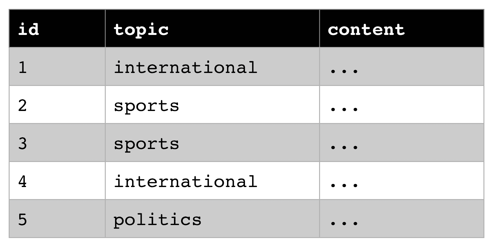

下表包含顺序类别评级；它可以表示网站上购买商品的反馈表单:

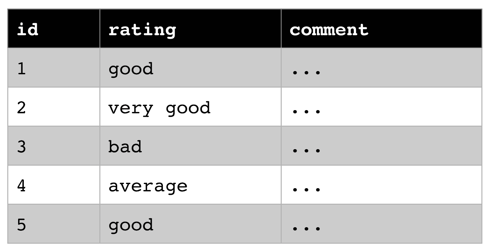

首先，我们来看看标签编码器。标签编码器为特征列中的每个唯一分类值分配一个递增值。因此，它将类别转换成一个介于 0 和 *N* -1 之间的数值，其中 *N* 表示唯一值的数量。

让我们测试第一个表格中的`topic`列上的标签编码器。我们根据数据训练编码器，并用数字主题 ID 替换`topic`列。以下是训练标签编码器和转换数据集的示例片段:

上述转换的输出类似于下表:

```
from sklearn import preprocessing
data = load_articles()
enc = preprocessing.LabelEncoder()
enc.fit(data)
enc.transform(data)
```

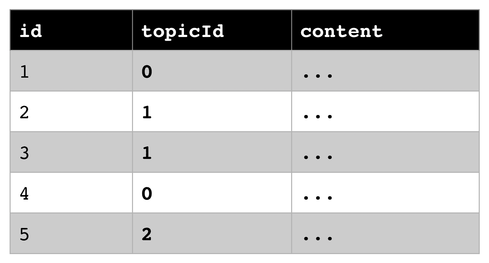

为`topicId`生成的查找表如下所示:

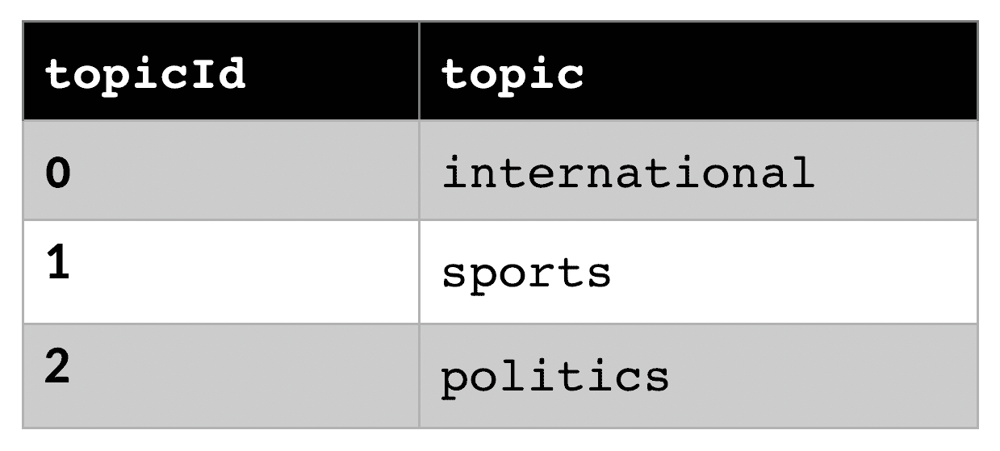

在下一个例子中，我们天真地将标签编码器应用于`ratings`数据集。通过迭代训练数据来训练编码器，以便创建查找字典:

In the next example, we naively apply the label encoder to the `ratings` dataset. The encoder is trained by iterating the training data in order to create the look-up dictionary:

```
from sklearn import preprocessing
data = load_ratings()
enc = preprocessing.LabelEncoder()
enc.fit(data)
enc.transform(data)
```

输出类似于下表:

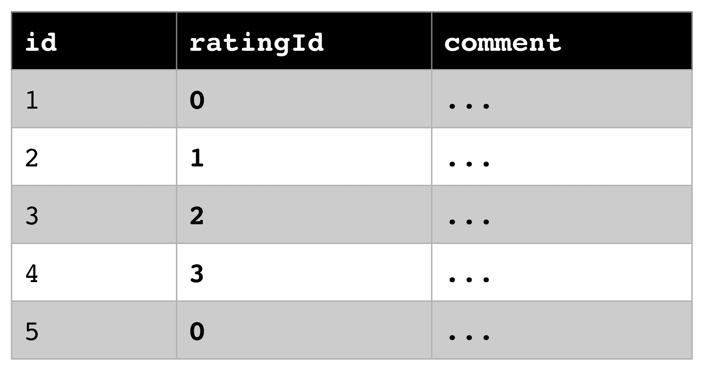

根据原始训练数据，生成以下字典:

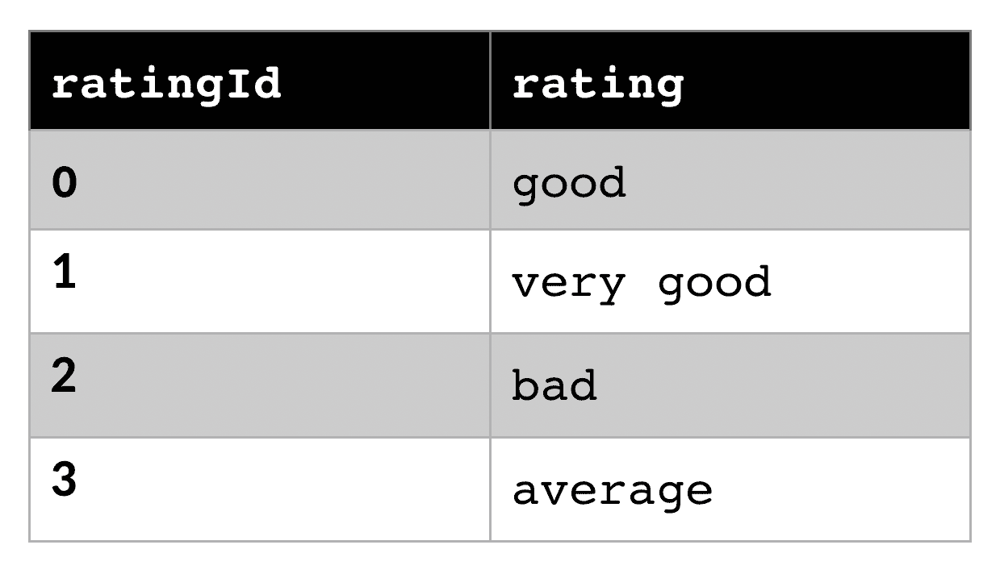

你是否在自动生成的查找字典中发现了一些奇怪的东西？由于训练数据中分类值的顺序，我们创建了一个数字列表，其数字顺序如下:

当对有序分类值应用标签编码器时，这可能不是我们所预期的。我们需要的排序如下所示:

```
good < very good < bad < average
```

This is probably not what we anticipated when applying a label encoder on an ordinal categorical value. The ordering we would be looking for is something like the following:

```
very bad < bad < average < good < very good
```

为了创建具有正确顺序的标签编码器，我们可以将分类值的有序列表传递给编码器。这将创建更有意义的编码，如下表所示:

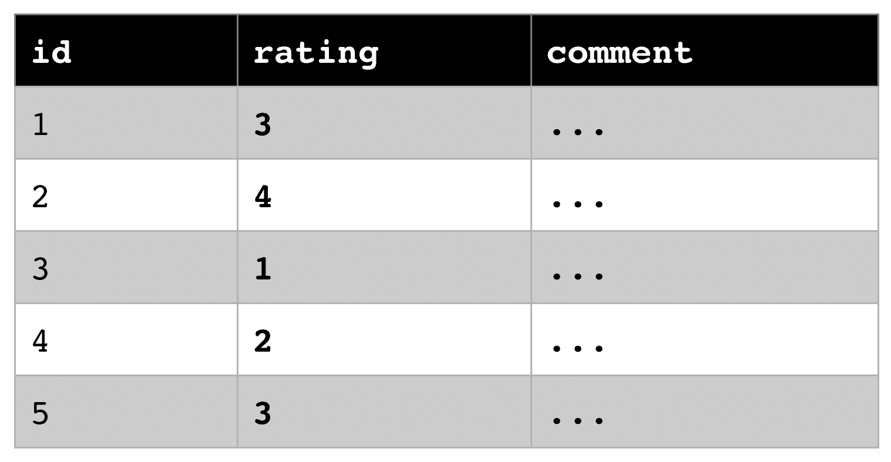

为了在 Python 中实现这一点，我们必须使用 pandas 分类顺序变量，这是一种特殊的标签编码器，需要一个有序类别列表作为输入:

在幕后，我们通过按顺序将类别直接传递给编码器，隐式地为编码器创建了以下查找字典:

```
import pandas as pd
data = load_ratings()
categories = ['very bad', 'bad', 'average', 'good', 'very good']
data = pd.Categorical(data, categories=categories, ordered=True)
print(data.codes)
```

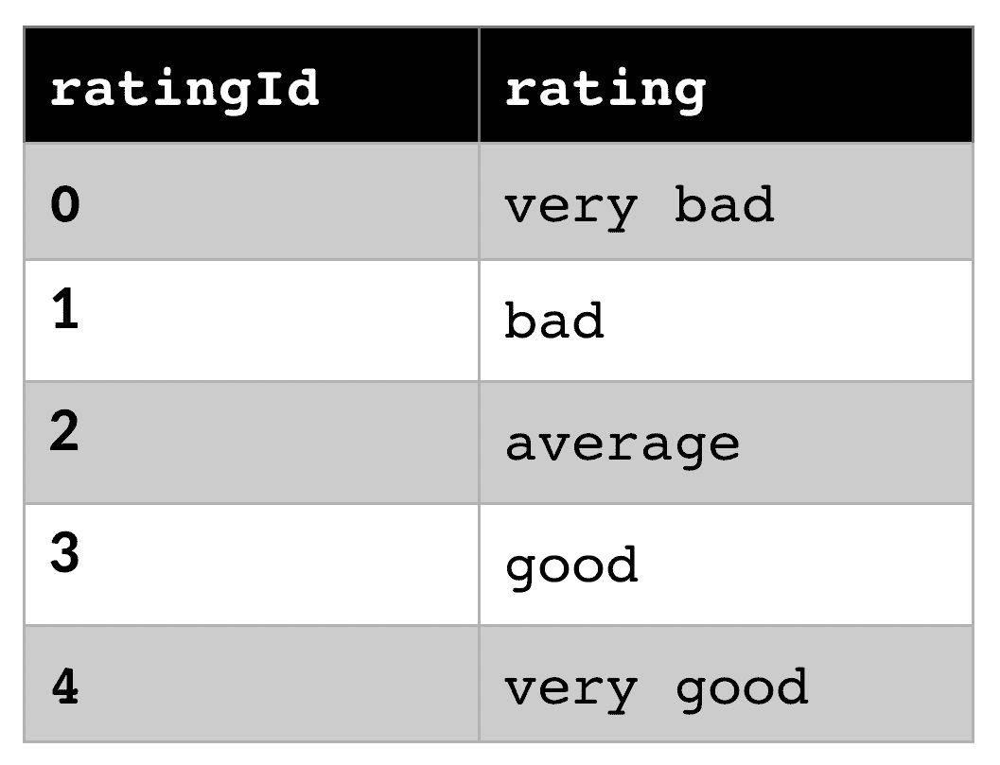

这里的关键要点是，标签编码器非常适合编码有序分类数据。您还看到了元素的顺序很重要，因此以正确的顺序手动将类别传递给编码器是一个很好的实践。

使用一键编码的正交嵌入


# 在本节的第二部分，我们将了解一下一键编码器。这将有助于我们为名义分类值创建等长编码。独热编码器用大小为 *N* 的向量替换特征列中的每个唯一分类值，其中 *N* 表示唯一值的数量。这个向量只包含零，除了一个包含`1`并代表这个特定值的列。下面是将一键编码器应用于`articles`数据集的代码片段:

上述代码的输出将类似于下表:

```
from sklearn import preprocessing
data = [load_articles()]
enc = preprocessing.OneHotEncoder()
enc.fit(data)
enc.transform(data)
```

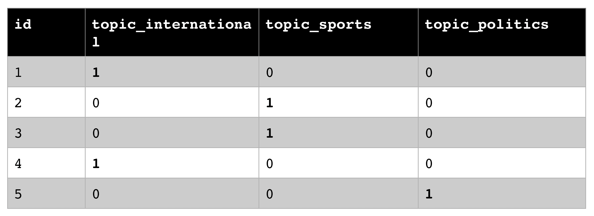

用于一键编码的查找字典具有 *N+1* 列，其中 *N* 是编码列中唯一值的数量。我们可以看到字典中所有的 *N* 维向量都是正交的，并且长度相等，`1`:

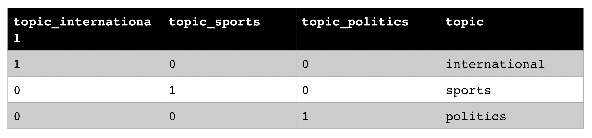


现在，我们将独热编码技术应用于评级表:

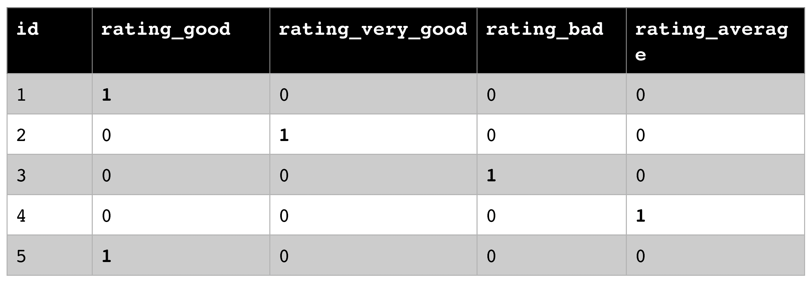

从上表中我们可以看到，即使原始的类别值是有序的，编码后的值也不能再排序，因此在数字编码后这个属性就丢失了。因此，我们可以得出结论，对于唯一值数量较少的名义分类值，一键编码非常有用。

到目前为止，我们学习了如何通过使用查找字典和 1 维或 N 维数字嵌入来将名义和有序分类值嵌入到数值中。然而，我们看到它在许多方面都有所限制，比如独特类别的数量和嵌入自由文本的能力。在接下来的部分中，我们将学习如何使用简单的 NLP 管道提取单词。

类别与文本


# 值得理解的是，分类值和文本值是不同的。尽管它们可能都存储为字符串，并且可能具有相同的数据类型，但分类值通常表示有限的类别集，而文本值可以保存任何文本信息。

为什么这种区别很重要？一旦你预处理了你的分类数据并把它嵌入到一个数字空间中，名词性分类通常会被实现为正交向量。你不会自动地计算出从类别 A 到类别 B 的距离，或者在类别之间建立语义。

Why is this distinction important? Once you preprocess your categorical data and embed it into a numerical space, nominal categories will often be implemented as orthogonal vectors. You will not automatically be able to compute a distance from category A to category B or create a semantic meaning between the categories.

然而，对于文本数据，通常以不同的方法开始特征提取，该方法假设在数据的不同观察中有相似的术语。您可以使用此信息来计算两个文本列之间有意义的相似性得分；例如，测量共有单词的数量。

因此，我们建议您彻底检查您拥有什么样的分类值，以及您打算如何预处理它们。一个很好的练习是计算两行之间的相似性，并查看它是否与您的预测相匹配。让我们来看一个简单的文本预处理方法，它使用基于字典的单词包嵌入。

构建一个简单的单词袋模型


# 在这一节中，我们将看到一个非常简单的概念，用*单词袋*概念来解决文本数据标签编码的缺点，这将为简单的 NLP 管道奠定基础。当你通读时，不要担心这些技术看起来太简单；我们将逐步在它们的基础上进行调整、优化和改进，以构建一个现代的 NLP 管道。

使用计数的朴素词袋模型


# 我们将在这一部分构建的主要概念是单词袋模型。这是一个非常简单的概念；也就是说，将任何文档建模为在给定文档中出现的单词的集合，每个单词都有出现的频率。因此，我们抛弃了句子结构、词序、标点符号等等，将文档简化为单词的原始计数。然后，我们可以将这个字数向量化成一个数字向量表示，它可以用于 ML、分析、文档比较等等。虽然这个字数统计模型听起来非常简单，但是在这个过程中，我们将会遇到相当多的特定于语言的障碍，我们需要解决这些障碍。

让我们开始定义一个示例文档，我们将在本节中对其进行转换:

Let's get started and define a sample document that we will transform throughout this section:

```
“Almost before we knew it, we had left the ground. The unknown holds its grounds.”
```

对文档应用简单的字数统计会给出第一个(过于简单的)单词袋模型:

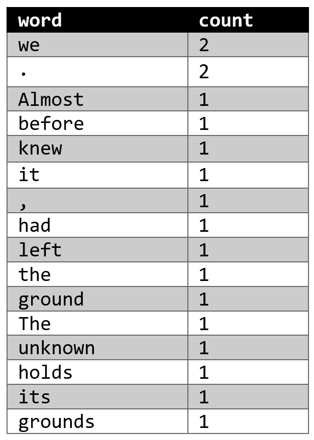

然而，像前一种幼稚的方法存在许多问题。我们将不同的标点符号、符号、名词、动词、副词和形容词混合在不同的词形变化、动词变化、时态和格中。因此，我们必须使用 NLP 构建一个管道来清理和规范化数据。在本节中，我们将通过以下清理步骤建立一个管道，然后将数据输入到一个*计数矢量器*中，该矢量器最终对单词出现次数进行计数，并将它们收集到一个特征向量中。

标记化——将字符串转换成单词列表


# 构建管道的第一步是将语料库分成文档，将文档分成单词。这个过程被称为**记号化**，因为产生的记号包含单词和标点符号。虽然将一个语料库拆分成文档、文档拆分成句子、句子拆分成单词听起来微不足道，但使用一点儿**正则表达式** ( **RegEx** )会有许多与语言相关的问题。想一想句号、逗号、引号的不同用法，想一想你是否会想到英语中的以下词汇:*别*、*史密斯先生*、*约翰·s·巴赫*等等。自然语言工具包 ( `nltk` ) Python 包为许多 NLP 算法以及单词标记化提供了实现和预训练的转换器。让我们使用`nltk`将我们的文档分割成令牌:

您可以在前面的代码中看到，`nltk`需要下载预先训练好的标点符号模型来运行单词分词器。分词器的输出是单词和标点符号。

```
>>> from nltk.tokenize import word_tokenize
>>> nltk.download('punkt')
>>> tokens = word_tokenize(document)
>>> print(tokens)
['Almost', 'before', 'we', 'knew', 'it', ',', 'we', 'had', 'left', 'the', 'ground', '.', 'The', 'unknown', 'holds', 'its', 'grounds', '.']
```

在下一步中，我们将删除标点符号，因为它们与后续的词干处理无关。但是，我们将在本节的后面把它们带回来进行术语化:

在前面的代码中，我们使用了`word.islanum()`函数来提取字母数字标记，并使它们全部小写。前面的单词列表看起来已经比最初的简单模型好得多了。然而，它仍然包含了许多不必要的词，如`the`、`we`、`had`等等，这些词没有传达任何信息。

```
>>> words = [word.lower() for word in tokens if word.isalnum()]
>>> print(words)
['almost', 'before', 'we', 'knew', 'it', 'we', 'had', 'left', 'the', 'ground', 'the', 'unknown', 'holds', 'its', 'grounds']
```

为了过滤掉特定语言的干扰，有必要删除文本中经常出现的单词，并且不给文本添加任何语义。通常的做法是使用预先训练的查找字典来移除这些所谓的**停用词**。您可以通过使用 Python 中预先训练好的`nltk`库来加载和使用这样的字典:

In order to filter out the noise for a specific language, it makes sense to remove these words that appear often in texts and don't add any semantic meaning to the text. It is common practice to remove these so-called **stop words** using a pre-trained look-up dictionary. You can load and use such a dictionary by using the pre-trained `nltk` library in Python:

```
>>> from nltk.corpus import stopwords
>>> stopword_set = set(stopwords.words('english'))
>>> words = [word for word in words if word not in stopword_set]
>>> print(words)
['almost', 'knew', 'left', 'ground', 'unknown', 'holds', 'grounds']
```

前面的代码给了我们一个很好的管道，在这里我们只得到语义上有意义的单词。我们可以将这个单词列表带到下一步，对每个单词应用更复杂的转换/规范化。如果我们在这个阶段应用计数矢量器，我们将得到下面的单词袋模型:

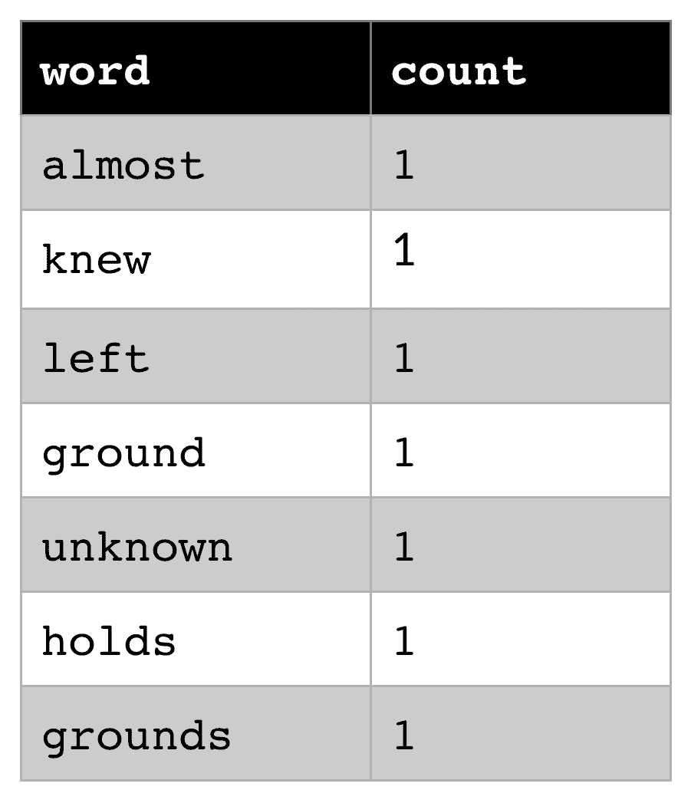

你可能会问:除了在文章中经常出现之外，还有什么能证明一个词是停用词呢？嗯，这是一个很好的问题！我们可以使用 **tf-idf 方法**测量每个单词在当前上下文中相对于其在文本中出现的重要性，这将在*使用 tf-idf 测量单词的重要性*一节中讨论。

词干——基于规则的词缀删除


# 下一步，我们想要规范词缀——词尾来创造复数和变形。你可以看到，每走一步，我们都在更深地钻研单一语言的概念——在这里是英语。然而，当将这些步骤应用于不同的语言时，很可能需要使用完全不同的转换。这就是 NLP 如此困难的原因。

去掉单词的词缀得到单词的词干也叫**词干**。词干化指的是一种基于规则(启发式)的方法，将一个单词的每个出现转换成它的词干。下面是一些预期转换的简单示例:

Removing the affixes of words to obtain the stem of a word is also called **stemming**. Stemming refers to a rule-based (heuristic) approach to transform each occurrence of a word into its word stem. Here is a simple example of some expected transformations:

```
cars   -> car
saying -> say
flies  -> fli
```

正如我们在前面的例子中看到的，这种启发式的词干提取方法必须为每种语言专门构建。这通常也适用于所有其他的 NLP 算法。为了简洁起见，在本书中我们将只讨论英语例子。

英语中比较流行的词干提取算法是波特算法(Porter's algorithm)，该算法定义了五种顺序归约规则，如从词尾去除-ed、-ing、-ate、-tion、-ence、-ance 等。`nltk`库实现了波特的词干算法:

在前面的代码中，我们简单地将`stemmer`应用于标记化文档中的每个单词。这一步之后的单词袋模型如下所示:

```
>>> from nltk.stem import PorterStemmer
>>> stemmer = PorterStemmer()
>>> words = [stemmer.stem(word) for word in words]
>>> print(words)
['almost', 'knew', 'left', 'ground', 'unknown', 'hold', 'ground']
```

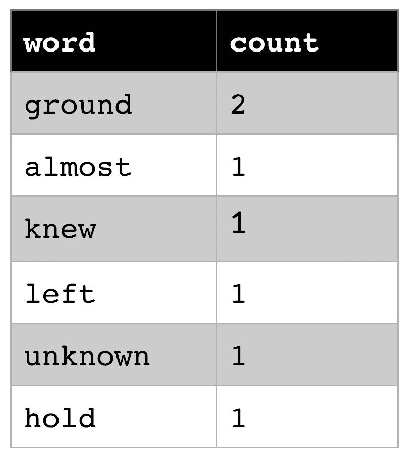

虽然这种算法对词缀很有效，但它不能帮助规范词缀和时态。这将是我们下一个使用术语化来解决的问题。

While this algorithm works well with affixes, it can't help normalize conjugations and tenses. This will be our next problem to tackle using lemmatization.

词汇化——基于词典的单词规范化


# 当查看词干示例时，我们已经可以看到这种方法的局限性。例如，不规则动词变化会发生什么——比如*是*、*是*或者*是*——所有这些都应该被规范化为同一个单词，*是*？这正是词汇化试图使用一组预先训练好的词汇和转换规则来解决的问题，称为**词汇**。这些词条存储在查找字典中，看起来类似于以下转换:

谈到引理化时，有一点非常重要。每个词条都需要应用于正确的单词类型，因此一个词条适用于名词、动词、形容词等等。这样做的原因是，在过去时态中，一个单词既可以是名词，也可以是动词。在我们的例子中，`ground`可能来自名词 *ground* 或动词*grind；* `left`可能是形容词，也可能是*离开*的过去式。所以，我们还需要从一个句子中的单词中提取出单词类型——这个过程叫做**词性** ( **词性**)标注。幸运的是，图书馆再次覆盖了我们。为了估计正确的 POS 标签，我们还需要提供标点符号:

```
are    -> be
is     -> be
taught -> teach
better -> good
```

POS 标签描述了文档中每个标记的单词类型。您可以使用`nltk.help.upenn_tagset()`命令找到标签的完整列表。下面是一个从命令行执行此操作的示例:

```
<q>>>></q> import nltk
>>> nltk.download('averaged_perceptron_tagger')
>>> tags = nltk.pos_tag(tokens)
>>> print(tags)
[('Almost', 'RB'), ('before', 'IN'), ('we', 'PRP'), ('knew', 'VBD'), ('it', 'PRP'), (',', ','), ('we', 'PRP'), ('had', 'VBD'), ('left', 'VBN'), ('the', 'DT'), ('ground', 'NN'), ('.', '.'), ('The', 'DT'), ('unknown', 'JJ'), ('holds', 'VBZ'), ('its', 'PRP$'), ('grounds', 'NNS'), ('.', '.')]
```

POS 标签还包括动词的时态和其他非常有用的信息。但是，对于本节中的词汇化，我们只需要知道单词类型— `noun`、`verb`、`adjective`或`adverb`。一个可能的选择是`nltk`中的`WordNet`词汇。WordNet(类似于 ImageNet 的图像)是一个英语单词的词汇数据库，它将英语单词按概念和单词类型分组。

```
>>> import nltk
>>> nltk.download('tagsets')
>>> nltk.help.upenn_tagset()
CC: conjunction, coordinating
 & 'n and both but either et for less minus neither nor or plus so
 therefore times v. versus vs. whether yet
CD: numeral, cardinal
 mid-1890 nine-thirty forty-two one-tenth ten million 0.5 one forty-
 seven 1987 twenty '79 zero two 78-degrees eighty-four IX '60s .025
 fifteen 271,124 dozen quintillion DM2,000 ...
DT: determiner
 all an another any both del each either every half la many much nary
 neither no some such that the them these this those
EX: existential there
 there
FW: foreign word
 gemeinschaft hund ich jeux habeas Haementeria Herr K'ang-si vous
 lutihaw alai je jour objets salutaris fille quibusdam pas trop Monte
 terram fiche oui corporis ...
IN: preposition or conjunction, subordinating
 astride among uppon whether out inside pro despite on by throughout
 below within for towards near behind atop around if like until below
 next into if beside ...
...
```

为了将 lemmatizer 应用于词干提取的输出，我们需要通过标点和停用词来过滤 POS 标签，类似于前面的预处理步骤。然后，我们可以对结果单词使用单词标签。让我们使用`nltk`来应用 lemmatizer:

To apply the lemmatizer to the output of the stemming, we need to filter the POS tags by punctuation and stop words, similar to the previous preprocessing step. Then, we can use the word tags for the resulting words. Let's apply the lemmatizer using `nltk`:

```
>>> from nltk.corpus import wordnet
>>> from nltk.stem import WordNetLemmatizer
>>> nltk.download('wordnet')                                                                                            
>>> lemmatizer = WordNetLemmatizer()
>>> tag_dict = {"J": wordnet.ADJ, "N": wordnet.NOUN, "V": wordnet.VERB, "R":
wordnet.ADV}
>>> pos = [tag_dict.get(t[0].upper(), wordnet.NOUN) for t in zip(*tags)[1]]
>>> words = [lemmatizer.lemmatize(w, pos=p) for w, p in zip(words, pos)]
>>> print(words)
['almost', 'know', 'leave', 'ground', 'unknown', 'hold', 'ground']
```

前面的单词列表看起来很漂亮；我们可以规范动词的时态，并把它们转换成不定式。生成的单词包模型如下所示:

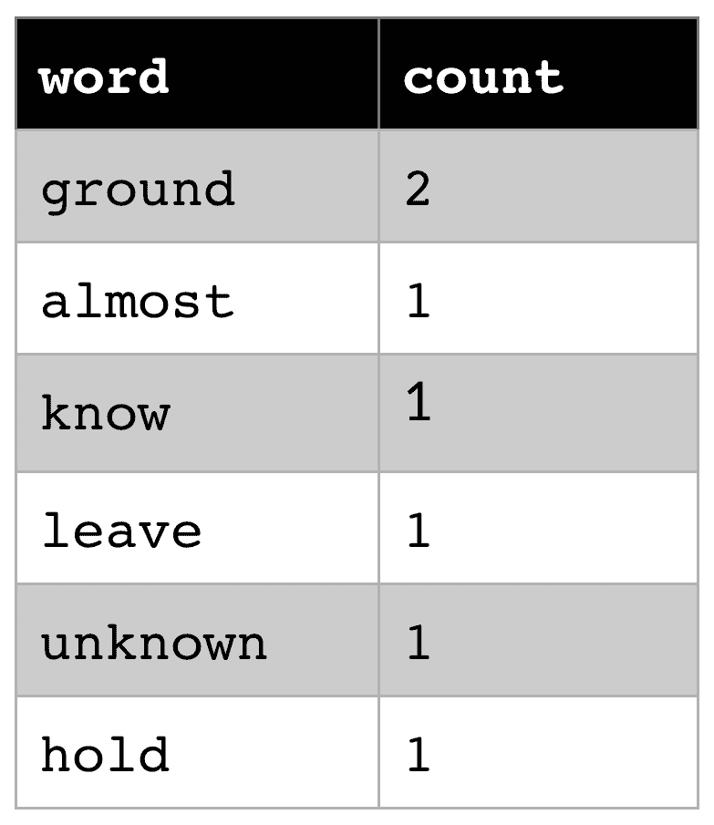

scikit-learn 中的词袋模型


# 最后，我们可以将前面的所有步骤放在一起，创建一个最先进的 NLP 预处理管道来规范化输入文档，并通过计数矢量器将其转换为数字特征向量。对多个文档这样做可以让我们很容易地在一个数字空间中比较文档的语义。我们可以计算文档特征向量的余弦相似性来计算它们的相似性，将它们插入到监督分类方法中，或者对得到的文档概念执行聚类。

概括地说，让我们看看简单单词袋模型的最终管道。我想强调的是，这个模型只是我们使用 NLP 进行特征提取的开始。我们执行了以下标准化步骤:

标记化

1.  删除标点符号
2.  删除停用词
3.  堵塞物
4.  词性标注的词汇化
5.  最后一步，我们在`scikit-learn`中应用了`CountVectorizer`。它将统计每个单词的出现次数，创建一个全球单词语料库，并输出词频的稀疏特征向量。下面是将预处理数据从`nltk`传递到`CountVectorizer`的示例代码:

正如我们在前面的代码中看到的，在将预处理文档传递给`CountVectorizer`之前，我们将它转换回字符串。原因是`CountVectorizer`自带了一些现成的可配置预处理技术，比如标记化、停用词移除等等。在这个演示中，我们希望将它应用于预处理的数据。转换的输出是具有`(document id, term id) = term frequency`形状的稀疏特征向量。`vocabulary_`参数包含一个用于`ids`术语的查找字典。

```
>>> from sklearn.feature_extraction.text import CountVectorizer
>>> count_vect = CountVectorizer()
>>> data = [" ".join(words)]
>>> X_train_counts = count_vect.fit_transform(data)
>>> print(X_train_counts)
  (0, 0)        1
  (0, 3)        1
  (0, 4)        1
  (0, 1)        2
  (0, 5)        1
  (0, 2)        1
>>> print(count_vect.vocabulary_)
{'almost': 0, 'know': 3, 'leave': 4, 'ground': 1, 'unknown': 5, 'hold': 2}
```

让我们看看如何在语义概念中组合多个术语。

利用术语重要性和语义


# 到目前为止，我们所做的一切都相对简单，并且基于词干或所谓的令牌。单词袋模型只不过是一个标记字典，计算每个字段中标记的出现次数。在这一节中，我们将研究一种常用的技术，使用 n 元语法和跳过语法的术语组合来进一步改进文档之间的匹配。

以多种方式组合术语会让你的字典爆炸。如果你有一个大的语料库，这就会变成一个问题；比如 1000 万字。因此，我们将研究一种常见的预处理技术，通过**奇异值分解** ( **SVD** )来降低大型字典的维数。

Combining terms in multiple ways will explode your dictionary. This will turn into a problem if you have a large corpus; for example, 10 million words. Hence, we will look at a common preprocessing technique to reduce the dimensionality of a large dictionary through **singular value decomposition** (**SVD**).

虽然这种方法现在要复杂得多，但它仍然基于一个在实践中已经在大型语料库中运行良好的词袋模型。但是，当然，我们可以做得更好，试着理解单词的重要性。因此，我们将处理 NLP 中另一个流行的技术来计算术语重要性。

使用 n 元语法和跳格语法概括单词


# 在之前的管道中，我们在没有任何上下文的情况下单独考虑每个单词。然而，众所周知，语境在语言中非常重要。有时候，单词应该放在一起，只有放在上下文中才有意义，而不是单独存在。为了将这种上下文引入到同类型的算法中，我们将引入 n 元文法和跳跃文法。这两种技术在 NLP 中被大量用于预处理数据集和从文本数据中提取相关特征。

让我们从 n-grams 开始。N 元语法是输入数据集的 *N* 个连续实体(字符、单词或标记)的串联。以下是计算字符列表中的 n-grams 的一些示例:

下面是一个使用 scikit-learn 的`CountVectorizer`中的内置`ngram_range`参数为输入数据生成多个 n 元语法的示例:

```
A, B, C, D -> 1-Gram: A, B, C, D
A, B, C, D -> 2-Gram: AB, BC, CD
A, B, C, D -> 3-Gram: ABC, BCD
```

在前面的代码中，我们可以看到，在我们的训练词汇中，现在也有了两个连续单词的组合，而不是原来的单词。

```
>>> from sklearn.feature_extraction.text import CountVectorizer
>>> count_vect = CountVectorizer(ngram_range=(1,2))
>>> X_train_counts = count_vect.fit_transform(data)
>>> print(count_vect.vocabulary_)
{'almost': 0, 'before': 2, 'we': 24, 'knew': 15, 'it': 11, 'had': 7, 'left': 17, 'the': 19, 'ground': 4, 'unknown': 22, 'holds': 9, 'its': 13, 'grounds': 6, 'almost before': 1, 'before we': 3, 'we knew': 26, 'knew it': 16, 'it we': 12, 'we had': 25, 'had left': 8, 'left the': 18, 'the ground': 20, 'ground the': 5, 'the unknown': 21, 'unknown holds': 23, 'holds its': 10, 'its grounds': 14}
```

In the preceding code, we can see that instead of the original words, we now also have a combination of two consecutive words in our trained vocabulary.

我们可以扩展 n 元语法的概念，使模型能够跳过彼此之间的单词。通过这种方式，我们可以定义模型可以在多远的距离内寻找一个单词，以及在这之间可以跳过多少个单词。下面是一个使用之前相同字符的示例:

幸运的是，我们发现在`nltk`中作为`nltk.skipgrams`方法实现的 n 元文法的通用版本。将跳跃距离设置为`0`会导致传统的 n-gram 算法，我们可以将其应用于原始数据集:

```
A, B, C, D -> 2-Gram (1 skip): AB, AC, BC, BD, CD
A, B, C, D -> 2-Gram (2 skip): AB, AC, AD, BC, BD, CD
```

在前面的代码中，我们可以观察到跳跃图可以为 NLP 模型生成许多额外的有用的特征维度。在现实世界的场景中，这两种技术经常被使用，因为单个的词序在语义中起着很大的作用。

```
>>> list(nltk.skipgrams(document.split(' '), 2, 1))
[('Almost', 'before'), ('Almost', 'we'), ('before', 'we'), ('before', 'knew'), ('we', 'knew'), ('we', 'it,'), ('knew', 'it,'), ('knew', 'we'), ('it,', 'we'), ('it,', 'had'), ('we', 'had'), ('we', 'left'), ('had', 'left'), ('had', 'the'), ('left', 'the'), ('left', 'ground.'), ('the', 'ground.'), ('the', 'The'), ('ground.', 'The'), ('ground.', 'unknown'), ('The', 'unknown'), ('The', 'holds'), ('unknown', 'holds'), ('unknown', 'its'), ('holds', 'its'), ('holds', 'grounds.'), ('its', 'grounds.')]
```

然而，如果输入文档是例如来自 web 的所有网站或大型文档，则新特征维度的爆炸可能是毁灭性的。因此，我们还需要一种方法来避免维度爆炸，同时从输入数据中捕获所有语义。我们将在下一部分解决这一挑战。

使用奇异值分解减小词典大小


# 自然语言处理的一个常见问题是语料库中的大量单词，因此字典的大小会急剧增加。我们在前面的例子中看到，字典的大小定义了正交项向量的大小。因此，20，000 个术语的字典大小将产生 20，000 维的特征向量。即使没有任何 n-gram 浓缩，这个特征向量的维数也太大而不能在标准 PC 上处理。

因此，我们需要一种算法来降低生成的`CountVectorizer`的维数，同时保留当前信息。最理想的情况是，我们只从输入数据中删除冗余信息，并将其投影到一个低维空间，同时保留所有原始信息。

**主成分分析** ( **PCA** )转换将非常适合我们的解决方案，并帮助我们将输入数据转换到较低的线性无关维度。然而，计算特征值需要一个对称矩阵(相同的行数和列数)，在我们的例子中我们没有。因此，我们可以使用 SVD 算法，它将特征向量计算推广到非对称矩阵。由于其数值稳定性，它经常被用于自然语言处理和信息检索系统。

在自然语言处理应用中使用奇异值分解也被称为潜在语义分析，因为主要成分可以被解释为潜在特征空间中的概念。SVD 嵌入将高维特征向量转换到较低维的概念空间。概念空间中的每个维度由术语向量的线性组合构成。通过丢弃方差最小的概念，我们还将结果概念空间的维度降低到更小、更容易处理的程度。典型的概念空间有 10 到 100 维，而单词词典通常有超过 100，000 维。

让我们看一个使用来自`sklearn`的`TruncatedSVD`实现的例子。SVD 是作为 transformer 类实现的，因此我们需要调用`fit_transform`来适应一个字典，并在同一个步骤中转换它。SVD 被配置为使用`n_components`参数只保留方差最大的分量。因为它使用随机算法，所以我们通过设置特定的随机状态来为伪随机数生成器设定种子:

在前面的代码中，我们使用 SVD 对`X_train_counts`数据和`CountVectorizer`的输出执行 LSA。我们将 SVD 配置为只保留方差最大的前五个分量。

```
from sklearn.decomposition import TruncatedSVD
svd = TruncatedSVD(n_components=5, random_state=0)
X_lsa = svd.fit_transform(X_train_counts) 
```

通过减少数据集的维度，您会丢失信息。幸运的是，我们可以使用经过训练的 SVD 对象来计算剩余数据集中的方差:

在前面的代码中，我们可以看到，我们可以计算在配置了组件数量的情况下，数据保留了多少方差。因此，我们现在可以减少维度的数量，同时保留来自数据的信息的百分之 *x* 。这是一个非常有用的操作，在许多实际的 NLP 实现中都有使用。

```
print(svd.explained_variance_ratio_.sum())
```

In the preceding code, we can see that we can compute the value of how much variance of the data is preserved with the configured number of components. Hence, we can now reduce the number of dimensions while keeping *x* percent of the information from the data. This is a very helpful operation and is used in many practical NLP implementations.

我们仍然使用单词袋模型中的原始单词词典。这种模式的一个特别的缺点是，一个术语出现得越频繁，它的计数(以及权重)就越高。这是一个问题，因为现在任何不是停用词并且经常出现在文本中的术语都将获得很高的权重——与该术语对某个文档的重要性无关。因此，我们介绍另一种极其流行的预处理技术— **tf-idf** 。

使用 tf-idf 测量单词的重要性


# 单词袋方法的一个特别的缺点是，我们只是简单地计算上下文中单词的绝对数量，而没有检查该单词是否经常出现在整个语料库中。因此，文本挖掘中的一项重要技术是计算特定单词在给定上下文中的重要性。

我们希望计算相对于文档语料库的上下文中的术语数，而不是上下文中术语的绝对计数。通过这样做，我们将对只出现在特定上下文中的术语给予较高的权重，而对出现在许多不同文档中的术语给予较低的权重。这正是 tf-idf 算法为文档( *d* )中的术语( *t* )计算权重( *w* )所做的工作:

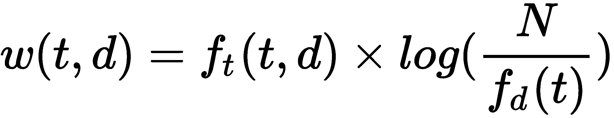

当术语频率(*f[t])统计一个文档中的所有术语时，逆文档频率是通过将文档总数( *N* )除以一个术语在所有文档中的计数(*f[d]T25)来计算的。IDF 术语通常是对数转换的，因为所有文档中的术语总数可能会非常大。**

在下面的例子中，我们不会直接使用 tf-idf 函数，而是使用`TfidVectorizer`，它进行计数，然后在一个步骤中对结果应用 tf-idf 函数。同样，该函数被实现为一个`sklearn`转换器，因此我们调用`fit_transform`来拟合和转换数据集:

在前面的代码中，我们直接应用了`TfidfVectorizer`，它返回的结果与组合使用`CountVectorizer`和`TfidfTransformer`的结果相同。我们转换包含单词袋模型的单词的数据集，并返回 tf-idf 值。我们还可以返回每个 tf-idf 值的项:

```
from sklearn.feature_extraction.text import TfidfVectorizer
vect = TfidfVectorizer()
data = [" ".join(words)]
X_train_counts = vect.fit_transform(data)
print(X_train_counts)
#  (0, 2)        0.3333333333333333
#  (0, 5)        0.3333333333333333
#  (0, 1)        0.6666666666666666
#  (0, 4)        0.3333333333333333
#  (0, 3)        0.3333333333333333
#  (0, 0)        0.3333333333333333

```

我们可以看到，在这个例子中，`ground`得到一个 tf-idf 值`0.667`，而所有其他术语都得到一个值`0.333`。当更多的文档被添加到语料库中时，这个计数会相应地增加——因此，如果再次包含单词 *hold* ，tf-idf 值实际上会减少。

```
print(vect.get_feature_names())
# ['almost', 'ground', 'hold', 'know', 'leave', 'unknown']
```

在任何真实世界的管道中，我们总是将本章中介绍的所有技术——标记化、停用词移除、词干化、词汇化、n 元语法/跳格语法、tf-idf 和 SVD——组合在一个管道中。结果将是 n-gram/skip-gram 标记的数字表示，这些标记通过重要性加权并被转换到潜在的语义空间。在您的第一个 NLP 管道中使用这些技术会让您走得更远，因为您现在可以从文本数据中捕获大量信息。

到目前为止，我们已经学习了如何使用 1 维或 N 维标签，或者对词干和字符组合进行计数和加权，对多种类别和文本值进行数字编码。虽然这些方法中的许多在需要简单数字嵌入的许多情况下都工作得很好，但是它们都有一个严重的限制——它们不编码语义。让我们看看如何在同一管道中提取文本的语义。

使用单词嵌入提取语义


# 在计算新闻的相似性时，您会认为网球、f1 或足球等主题在语义上比政治、经济或科学等主题更相似。然而，对于所有先前讨论的技术，所有编码的类别彼此之间是同样不同的。在本节中，我们将讨论一种简单的语义嵌入方法，也称为**单词嵌入**。

When computing the similarity of news, you would imagine that topics such as tennis, Formula 1, or soccer would be semantically more similar to each other than topics such as politics, economics, or science. Yet, for all previously discussed techniques, all encoded categories are equally different from each other. In this section, we will discuss a simple method of semantic embedding, also called **word embedding**.

前面讨论的使用 LSA 的管道将多个文档转换成术语，并将这些术语转换成可以与其他文档进行比较的语义概念。但是，语义是基于术语的出现次数和重要性的，没有对单个术语之间的语义进行度量。

因此，我们正在寻找的是将术语嵌入到数字多维空间中，使得每个单词代表这个空间中的一个点。这允许我们计算这个空间中多个单词之间的数值距离，以便比较两个单词的语义。单词嵌入最有趣的好处是，单词嵌入的代数不仅在数字上是可能的，而且是有意义的。考虑下面的例子:

我们可以通过在一个 N 维的数字空间上映射一个单词语料库，并基于单词语义优化数字距离，例如，基于语料库中单词之间的距离，来创建这样的嵌入。所得到的优化输出了语料库中单词的字典以及它们的 N 维数字表示。在这个数字空间中，单词具有与语义空间中相同或至少相似的属性。一个很大的好处是，这些嵌入可以在无人监督的情况下进行训练，因此不需要标记任何训练数据。

```
King - Man + Woman = Queen
```

第一种嵌入被称为 **Word2Vec** ，它基于连续词袋或连续跳格模型来计数和测量窗口中的词。让我们试试这个功能，并使用 Word2Vec 执行语义单词嵌入:

单词嵌入的最佳 Python 实现是`gensim`，我们也将在这里使用它。我们需要将令牌输入到模型中，以便对其进行训练:

1.  在前面的代码中，我们加载了`Word2Vec`模型，并用前面章节中的令牌列表对其进行初始化，该列表存储在`words`变量中。`size`属性定义了结果向量的维数，而`window`参数决定了每个窗口应该考虑多少个单词。一旦模型被训练，我们可以简单地在模型的字典中查找单词 embedding。

```
from gensim.models import Word2Vec

model = Word2Vec(words, size=100, window=5)
vector = model.wv['ground']

```

In the preceding code, we load the `Word2Vec` model and initialize it with the list of tokens from the previous sections, which is stored in the `words` variable. The `size` attribute defines the dimension of the resulting vectors and the `window` parameter decides how many words we should consider per window. Once the model is trained, we can simply look up the word embedding in the model's dictionary.

代码将自动训练我们提供的令牌集的嵌入。得到的模型将单词到向量的映射存储在`wv`属性中。最理想的是，我们还使用由`gensim`或其他 NLP 库(如`NLTK`)提供的大型语料库或预训练模型来训练嵌入，并使用较小的数据集对其进行微调。

接下来，我们可以使用训练好的模型，通过 Word2Vec 嵌入来嵌入文档中的所有术语。然而，这将导致多个向量，因为每个单词都返回它自己的嵌入。因此，您需要使用所有嵌入的平均值将所有向量合并成一个向量，这与 LSA 中的概念有相似的含义。同样，其他还原技术也是可能的；例如，使用它们的 tf-idf 对各个嵌入向量进行加权:

2.  在前面的函数中，我们从术语的所有单词嵌入向量中计算平均值——这被称为**平均值嵌入**,它在嵌入空间中表示该文档的概念。如果在嵌入中没有找到一个单词，我们需要在计算中用零替换它。

```
dim = len(model.wv.vectors[0])
X = np.mean([model.wv[w] for w in words if w in model.wv] or 
  [np.zeros(dim)], axis=0)
```

您可以通过下载一个预先训练好的嵌入来为您的应用程序使用这样的语义嵌入；比如在维基百科语料库上。然后，您可以遍历经过清理的输入标记，并在数字嵌入的字典中查找单词。

GloVe 是另一种将单词编码为数字向量的流行技术，由斯坦福大学开发。与基于连续窗口的方法相比，它使用全局单词-单词共现统计来确定单词之间的线性关系:

让我们来看看在维基百科和 Gigaword 新闻档案上训练的预训练 6 B 令牌嵌入:

1.  Let's take a look at the pre-trained 6 B tokens embedding trained on Wikipedia and the Gigaword news archive:

```
# download pre-trained dictionary from 
# http://nlp.stanford.edu/data/glove.6B.zip
glove = {}
with open('glove.6B.100d.txt') as f:
  for line in f:
    word, coefs = line.split(maxsplit=1)
    coefs = np.fromstring(coefs, 'f', sep=' ')
    glove[word] = coefs
```

在前面的代码中，我们只打开并解析预训练的单词嵌入，以便将单词和向量存储在查找字典中。

然后，我们使用字典在我们的训练数据中查找标记，并通过计算所有手套向量的平均值来合并它们:

2.  前面的代码与前面的非常相似，每个单词返回一个向量，这个向量是通过在最后取它们的平均值来聚合的。同样，这对应于使用训练数据的所有表征的语义概念。

```
X = np.mean([glove[w] for w in words if w in glove] or 
  [np.zeros(dim)], axis=0)
```

Gensim 提供了其他流行的语义嵌入模型，如 doc2word、fastText 和 GloVe。`gensim` Python 库是利用这些预训练嵌入或训练您自己的模型的好地方。现在，您可以用单词向量的平均嵌入来替换单词袋模型，以捕获单词语义。然而，您的管道仍然是由许多可调组件构建的。在下一节中，我们将看看如何构建一个端到端的语言模型，并重用 Azure 认知服务的一些语言功能。

实现端到端语言模型


# 在前面的章节中，我们训练并连接了多个片段来实现一个最终的算法，其中大部分单独的步骤也需要训练。词汇化包含一个转换规则的字典。停用词存储在词典中。词干需要嵌入需要训练的每种语言和单词的规则——TF-IDF 和 SVD 仅在训练数据上计算，但彼此独立。

这是一个与传统计算机视觉方法类似的问题，我们将在第 7 章、*在 Azure 上训练深度神经网络、*中更深入地讨论，其中许多经典算法被结合到特征提取器和分类器的管道中。与计算机视觉中通过梯度下降和反向传播训练的端到端模型的突破类似，深度神经网络——特别是序列到序列模型——在几年前取代了经典方法。

首先，我们将快速浏览一下使用自定义嵌入和一个**长短期记忆** ( **LSTM** )实现来改进我们之前的模型，以对令牌序列建模。这将让你很好地理解我们如何从基于单个预处理器的管道转移到使用深度学习的完全端到端的方法。

First, we will take a quick look at improving our previous model using custom embedding and a **Long Short-Term Memory** (**LSTM**) implementation to model a token sequence. This will give you a good understanding of how we are moving from an individual preprocessor-based pipeline to a fully end-to-end approach using deep learning.

序列到序列模型是基于编码器和解码器的模型，这些编码器和解码器根据一组可变的输入进行训练。这种编码器/解码器架构用于各种任务，例如机器翻译、图像字幕和摘要。这些模型的一个好处是，您可以重用该网络的编码器部分，将一组输入转换为编码器的固定数值表示。我们将着眼于最先进的语言表示模型，并讨论如何将它们用于特征工程和文本数据的预处理。

最后，我们还将研究如何重用 Azure Cognitive Services APIs 进行文本分析，以执行高级建模和特征提取，如文本或句子情感、关键词或实体识别。这是一个很好的方法，因为您可以利用微软的专业知识和大量训练数据，使用一个简单的 HTTP 请求来执行复杂的文本分析。

令牌序列的端到端学习


# 我们希望构建和训练一个端到端的模型，而不是将不同的算法连接成一个单一的管道，该模型可以训练单词嵌入，预先形成潜在的语义转换，并在单个模型中捕获文本中的顺序信息。这种模型的好处在于，在单个组合优化过程中，可以针对用户的预测任务对每个处理步骤进行微调:

管道的第一部分看起来与前面的部分非常相似。我们将构建一个标记器，将文档转换成标记序列，然后根据标记序列将标记序列转换成数字模型。然后，我们使用`pad_sequences`将所有文档对齐到相同的长度:

1.  The first part of the pipeline will look extremely similar to the previous sections. We will build a tokenizer that converts documents into sequences of tokens that are then transformed into a numerical model based on the token sequence. Then, we use `pad_sequences` to align all the documents to the same length:

```
from keras.preprocessing.text import Tokenizer
from keras.preprocessing.sequence import pad_sequences

num_words = 1000
tokenizer = Tokenizer(num_words=num_words)
tokenizer.fit_on_texts(X_words)
X = tokenizer.texts_to_sequences(X_words)
X = pad_sequences(X, maxlen=2000)
```

下一步，我们将使用 Keras 构建一个简单的模型，一个嵌入层和一个 LSTM 层来捕获令牌序列。嵌入层将执行与 GloVe 类似的操作，其中单词将被嵌入到语义空间中。LSTM 细胞将确保我们比较的是单词序列，而不是一次一个单词。然后，我们使用带有`softmax`激活的密集层来实现分类器头:

2.  正如你在前面的函数中看到的，我们使用三层和一个用于分类的`softmax`激活来构建一个简单的神经网络。这意味着，为了训练这个模型，我们还需要同时解决一个分类问题。因此，我们确实需要带标签的训练数据来使用这种方法执行分析。在下一节中，我们将看到如何在输入输出文本序列上使用序列到序列模型来学习隐式文本表示。

```
from keras.layers import Embedding, LSTM, Dense
from keras.models import Sequential

embed_dim = 128
lstm_out = 196

model = Sequential()
model.add(Embedding(num_words, embed_dim, 
  input_length=X.shape[1]))
model.add(LSTM(lstm_out, recurrent_dropout=0.2, dropout=0.2))
model.add(Dense(len(labels), activation='softmax'))
model.compile(loss='categorical_crossentropy', optimizer='adam', 
  metrics=['categorical_crossentropy'])
```

最先进的序列到序列模型


# 近年来，另一种类型的模型已经取代了传统的 NLP 管道——基于变压器的模型。这些类型的模型是完全端到端的，并使用序列到序列映射、位置编码和多头注意层。您可能已经知道，这些模型相当复杂，通常有超过 1 亿个参数。

在撰写本文时，流行的模型是单向**生成式预训练变压器** ( **开放式 GPT** )模型、浅双向 ELMo 模型、来自变压器 ( **伯特**)、变压器 XL 和 MT-DNN 的**双向编码器表示。基于 BERT 架构的模型似乎表现得特别好，但当您阅读本文时，可能已经被新调整或修改的架构超越了。**

这些模型的关键是它们使用基于编码器/解码器的架构，这允许我们简单地借用编码器将文本嵌入到语义数字特征空间中。因此，常见的方法是下载预训练模型，并通过网络的编码器部分执行正向传递。固定大小的数字输出现在可以用作任何其他模型的特征向量。这是一个常见的预处理步骤，也是使用最先进的语言模型进行数值嵌入的一个很好的权衡。

由于工具、框架和实现都在快速变化，所以我们不会在这一部分查看任何代码。然而，在撰写本文时，关于预训练模型以及与 TensorFlow 和 PyTorch 的兼容性，拥抱脸变形金刚库似乎是最好的一个。

使用 Azure 认知服务的文本分析

在许多工程学科中，一个好的方法是不要重新发明轮子，因为许多其他公司已经比你更好地解决了同样的问题。微软已经开发、实施和培训并作为服务提供的基本文本分析和文本理解任务可能就是这种情况。

如果我告诉你，在使用 Azure 时，文本理解功能，如情感分析、关键短语提取、语言检测、命名实体识别和提取**个人可识别信息** ( **PII** )只是一个请求，会怎么样？Azure 提供文本分析 API 作为认知服务的一部分，它将为你解决所有这些问题。


# 这不会解决将文本转换成数值的需要，但会使从文本中提取语义变得更容易。一个例子是使用认知服务作为附加的特征工程步骤来执行关键短语提取或情感分析，而不是实现您自己的 NLP 管道。

让我们实现一个函数，使用认知服务的文本分析 API 返回给定文档的情感。当您想要在文本中添加附加属性(如总体情绪)来丰富数据时，这非常有用:

前面的代码看起来非常类似于我们在[第 2 章](b480570c-da89-43ac-8963-faa1890cce2e.xhtml)、*在 Azure* 中看到的计算机视觉示例。事实上，它使用相同的 API，只是文本分析和情感分析功能的端点不同。让我们运行这段代码并查看输出，它看起来与下面的代码片段非常相似:

我们可以观察到，JSON 响应包含每个文档的情感分类(`positive`、`neutral`和`negative`)以及每个类别的数字置信度得分。您还可以看到结果文档存储在一个数组中，并用一个`id`值标记。因此，您还可以使用一个 ID 来标识每个文档，从而将多个文档发送到这个 API。

使用定制的预训练语言模型很好，但对于标准化的文本分析，我们可以简单地重用认知服务。微软在这些语言模型的研究和生产上投入了大量的资源，你可以花相对少的钱将它们用于你自己的数据管道。因此，如果您喜欢使用托管服务而不是运行您的客户转换器模型，那么您应该尝试这个文本分析 API。

```
import requests

def cs_sentiment_analyze(text, key, region='westus', lang='en'):
    endpoint = 'https://%s.api.cognitive.microsoft.com' % region
    baseurl = '%s/text/analytics/v3.0-preview.1/sentiment' % endpoint
    headers = {'Content-Type': 'application/json', 
        'Ocp-Apim-Subscription-Key': key}
    params = {'showStats': False}
    payload = {'documents': ['id': 1, 'text': text, 'language': lang]}

    r = requests.post(baseurl, json=payload, params=params, 
        headers=headers)
    return r.json()

text = 'Hello world. This is some input text that I love.'
key = '<insert subscription key>'
res = cs_sentiment_analyze(url, key, features=features)
print(res)
```

摘要

```
{
  "documents": [
    {
      "id": "1",
      "sentiment": "positive",
      "documentScores": {
        "positive": 0.998519241809845,
        "neutral": 0.0009635657188483,
        "negative": 0.000517153472174
      }
    }
  ]
}
```

在这一章中，你学习了如何使用最先进的自然语言处理技术来预处理文本和分类的名词和序数数据。

现在，您可以构建一个经典的 NLP 管道，包括停用词移除、词汇化和词干化、n 元语法，以及使用词袋模型来计算术语的出现次数。我们使用 SVD 来降低最终特征向量的维数，并生成低维主题编码。基于计数的词袋模型的一个重要改进是比较文档的相对词频。您了解了 tf-idf 函数，并可以使用它来计算文档中某个单词相对于语料库的重要性。


# 在下一节中，我们看了 Word2Vec 和 GloVe，它们是预先训练好的数字单词嵌入词典。由于单词的语义嵌入，您现在可以轻松地将预训练的单词嵌入重新用于商业 NLP 应用程序，并具有很大的改进和准确性。

最后，我们看了一种最先进的语言建模方法，使用端到端的语言表示，如 OpenAI GPT、ELMo、BERT 或 TransformerXL，它们被训练为序列到序列模型。这种模型的最大好处是，您可以重用模型的编码器部分，将文本序列转换为数字表示，这非常类似于单词袋方法或手套向量的均值嵌入。

在下一章中，我们将看看如何使用 Azure ML 训练一个 ML 模型，应用我们到目前为止所学的一切。

In the following section, we looked at Word2Vec and GloVe, pre-trained dictionaries of numeric word embeddings. You can now easily reuse a pre-trained word embedding for commercial NLP applications with great improvements and with accuracy due to the semantic embedding of words.

Finally, we finished the chapter by looking at a state-of-the-art approach to language modeling, using end-to-end language representations, such as OpenAI GPT, ELMo, BERT, or TransformerXL, which are trained as sequence-to-sequence models. The great benefit of this model is that you can reuse the encoder part of the model to transform a sequence of text into a numerical representation—very similar to the bag-of-words approach or the mean embedding of GloVe vectors.

In the next chapter, we will look at training an ML model using Azure ML, applying everything we have learned so far.