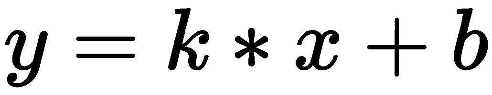
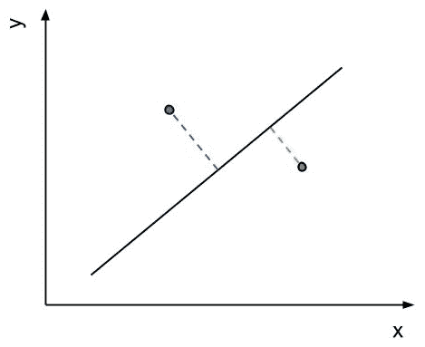
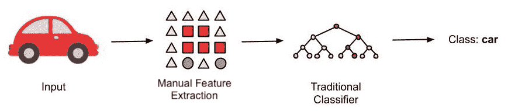
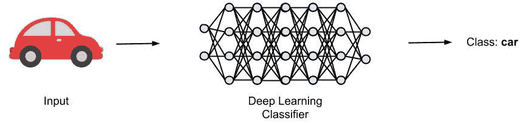
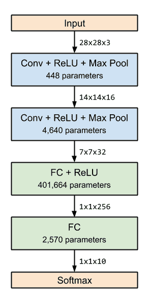

# 七、在 Azure 上训练深度神经网络

在前一章中，我们学习了如何使用基于非参数树的集成方法对经典的**机器学习** ( **ML** )模型进行训练和评分。虽然这些方法在许多带有分类变量的中小型数据集上运行良好，但在大型数据集上却不能很好地推广。

在这一章中，我们将使用**深度学习** ( **DL** )来训练复杂的参数模型，以便更好地对大型数据集进行泛化。这将帮助你了解哪些情况下**深度神经网络** ( **DNNs** )比传统模型表现更好。

首先，我们将给出一个简短而实用的概述，说明 DL 为什么以及何时工作良好。我们将更侧重于理解一般原则和基本原理，而不是理论方法。这将帮助您评估哪些用例以及数据集需要 DL，以及它通常是如何工作的。

然后我们将看看 DL 最流行的应用领域——计算机视觉。然后，我们将使用 Azure ML 服务和附加的 Azure 基础设施来训练一个简单的**卷积神经网络** ( **CNN** )架构，用于图像分类。我们将性能与在预训练的**残差网络** ( **ResNet** )模型上微调的模型进行比较。这将向您展示如何克服训练数据不足的情况。

本章将涵盖以下主题:

*   深度学习简介
*   训练一个用于图像分类的 CNN


# 深度学习简介

最近，DL 已经彻底改变了 ML 领域，并且在各种任务中，例如图像分类、对象检测、分割、语音转录、文本翻译、文本理解、销售预测等等，DL 不断超越经典统计方法，甚至超越人类。与经典模型相比，DL 模型使用数百万个参数、巧妙的权重分配、优化技术和隐式特征提取，当用足够的数据训练时，其性能优于所有以前手工制作的特征检测器和 ML 模型。

在本节中，我们将帮助您理解为什么以及何时 DL 模型对某些领域和数据集有意义。如果您已经是 DL 方面的专家，请随意跳过这一部分，直接进入更实用的部分。但是，如果您是 DL 的新手，我强烈建议您继续阅读这一部分，以便了解更大、更强大的模型的实际和业务需求，以及一些非理论背景。


# 为什么是 DL？

在过去几年中，许多传统的优化、分类和预测过程在经典的 ML 方法上工作得很好，例如 k-最近邻、线性/逻辑回归、朴素贝叶斯和基于树的集成模型。对于中小型数据集，他们能够很好地处理各种类型的数据(事务型、时序型、操作型等)和数据类型(二进制、数值型和分类型)。

然而，在某些领域，数据生成已经爆炸，即使训练数据量增加，经典的 ML 模型也无法提高性能。这尤其影响了 2010 年末左右的计算机视觉和自然语言处理领域 ( **NLP** )。这时，研究人员开始再次研究神经网络(或**多层感知器** ( **MLPs** ))，这是一种在 80 年代末使用的技术，通过使用多个嵌套层来捕捉大型图像数据集中的大量特征。

下面的图表很好地抓住了这个想法。虽然传统的 ML 方法在小型和中型数据集上工作得非常好，但是它们的性能不会随着更多的训练数据而提高。然而，DL 模型是大规模参数模型，可以从训练数据中捕获大量细节。因此，我们可以看到它们的预测性能随着数据量的增加而提高:


传统模型倾向于使用预先设计的功能，因此针对各种数据类型和范围的数据集进行了优化。我们在上一章中看到，梯度增强树在分类数据上表现得非常好。然而，在具有高度结构化数据或可变长度数据的领域中，许多传统模型达到了它们的极限。对于二维和三维图像和视频中的像素信息，以及音频数据中的波形和文本数据中的字符，情况尤其如此。用于处理这种数据的 ML 模型将具有复杂的特征提取器，例如**h****istog of oriented gradients**(**HOG**)滤波器、**尺度不变特征变换** ( **SIFT** )特征、或者**局部二进制模式**(**LBPs**)——仅举几个例子。

使这些数据如此复杂的原因是，输入数据(例如，单个像素)和输出之间不存在明显的线性关系，在大多数情况下，查看图像的单个像素无助于确定图像中汽车的品牌。因此，越来越需要训练更大和更有能力的参数模型，这些模型使用原始的、未处理的数据作为输入来捕捉从输入像素到最终预测的这些关系。

重要的是要理解，对具有更多参数的更深入模型的需求来自于特定领域中大量增加的高度结构化的训练数据，例如视觉、音频和语言。这些新模型通常具有数千万个参数，以捕捉大量原始和增强的训练数据，并开发训练数据的内部广义概念表示。在为您的用例选择 ML 方法时，请记住这一点。

在许多情况下，您可以从训练数据的数据存储中建立到 ML 模型的直接关系。如果您的数据存储在 SQL 数据库或 Excel 文件中，那么您通常应该研究经典的 ML 方法，例如参数统计(线性回归、SVM 等)或非参数(基于决策树的集成)方法。如果您的数据非常大，以至于存储在 **Hadoop 分布式文件系统** ( **HDFS** )、blob 或文件存储服务器中，那么您可能需要使用 DL 方法。


# 从神经网络到数字逻辑

有各种资料详细解释了神经网络及其工作原理；比如斯坦福的 DL 课程，或者吴恩达的 Coursera 课程等等。本节将让你直观地了解它们从 20 世纪 50 年代的经典感知机到 80 年代的**人工神经网络** ( **ANNs** )和 CNN，再到最近十年的 DL 的演变过程。

你可能听说过，神经网络的基础——感知机——是一个超过半个世纪的概念。感知器被引入来模拟来自人脑的细胞，作为所有输入和激活函数的加权和，如果输出高于定义的阈值，激活函数就会触发。虽然脑细胞的这种生物类比是对大脑建模的一种很好的方式，但它是描述其内部状态和输入信号转换的一种很差的模型。

与大脑中的神经元不同，我们更喜欢用一种简单得多的方法来思考感知器、MLPs(即 ann)和 CNN——也就是说，一种非常简洁的几何方法。这种方法要求你只理解二维中一条线的方程，以及一个更高维坐标空间中的同一个方程。因此，一个平面的方程将是三维的，一个超平面将是 n 维的。

如果我们看一个单一的感知器，它只描述了其输入的加权和加上带有激活函数的静态偏差。你知道什么也被描述为其输入的加权和吗？一个直线方程:



好吧，公平地说，这个线方程只有一个输入( *x* )，因此只有一个维度。然而，如果 *x* 是一个矢量，那么同样的方程描述了一个平面。我相信你在中学数学课程的某个时候会看到这个方程。这个等式的一个很好的特性是，当将一个点的坐标插入这个等式时，当移动到一边时，它产生 *0 = 0，*或简单的 *0* 。

如果我们在线方程中加入一个不在线上的点，会发生什么？嗯，结果可能是肯定的，也可能是否定的，但肯定不是。线方程的另一个很好的特性是，该结果的绝对值描述了到线的最短距离(使用三角公式)，结果的符号描述了线的边长。因此，该点可以在线的左侧或右侧。

在下图中，我们看到两个点以及它们到直线的距离。如果我们将两个点的坐标插入到直线的二维方程中，那么一个点将产生正距离，而另一个点将产生与直线的负距离:



假设我们首先将一个点的坐标插入一个线方程，然后用`-1`和`1`之间的阶跃函数或者简单的符号函数来应用结果。结果会告诉我们该点位于直线的哪一侧。这是对感知器或一个非常简单的分类器的奇妙的几何描述。训练出来的感知器等于线方程(实际上是一个超平面)，把一个空间分成左右。所以，这条线是分类的决定边界。一个点就是一个观察。通过在线方程中插入一个点并应用阶跃函数，我们返回观察的结果类，即左或右。这准确地描述了二元分类器。

然而，它变得更好。我们如何训练这样的决策边界？好吧，我们看训练样本和从样本到随机初始化的决策边界的距离。然后，我们以正确分类样本的方式移动决策边界。然后我们看下一个样本，继续这个过程。移动决策边界的最佳向量是，如果我们沿着负梯度移动它，使得点和线之间的距离达到最小。如果训练样本是线性可分的，通过使用学习率因子，我们迭代这个过程几次，并以完美对齐的决策边界结束。

因此，单个感知器(也称为**神经元**)加上激活函数简单地描述了一个由定义决策边界的超平面组成的小分类器。平行层中堆叠的多个感知机只是多个超平面的组合——例如，它们用于查找位于第一行右侧但位于第二行左侧的样本。

虽然单个感知机堆栈只能描述输入和输出的线性组合，但研究人员开始将这些感知机堆叠成多个连续的层，其中每一层都有一个激活函数。这被称为 **MLP** ，或者简称为神经网络。虽然从生物学的角度来理解这种多层方法相当困难，但我们可以再次使用我们的几何模型。在几何模型中，我们可以简单地将多个超平面方程堆叠成更复杂的对象。

这种精确的几何现象也被许多其他资源描述为 DL 模型的高级特征。网络的第一层描述非常低级的特征，例如线(边)的左侧或右侧，而较高级描述这些低级特征的复杂嵌套组合；例如，四条线组成一个正方形，五个正方形组成一个形状，这些形状的组合看起来像人的鼻子。因此，我们刚刚建立了一个使用 3 层神经网络的鼻子检测器。

在下面的截图中，我们看到了一个 DNN *如何在单独的层中看到*一个图像，并试图将它与每个层已经学习的特征相匹配。左侧的图像是原始图像，右侧的三幅图像显示了此图像在 DNN 特定图层中的表现形式。我们可以看到早期层主要关注线条和边缘(左起第二幅图像)，而中间层则关注形状(左起第三幅图像)，最后一层则激活图像中的特定高级特征(左起第四幅图像):


使用多个高维超平面方程，其中每个输出馈入下一层的每个输入，需要非常多的参数。虽然对大量复杂的训练数据进行建模需要大量的参数，但所谓的全连接神经网络并不是描述这些连接的最佳方式。那么，有什么问题呢？

在全连接网络中，每个输出都作为输入馈送到连续层的每个神经元。在每个神经元中，我们需要每个输入的权重，因此，权重与输入维度一样多。当我们开始堆叠多层感知器时，这个数字会迅速爆炸。另一个问题是，网络不能一般化，因为它学习单个维度的单个权重。

为了解决这个问题，CNN 应运而生。他们的目的是减少连接的数量，从而将单个层上的参数减少到一组固定的参数，而与输入维数无关。因此，图层的参数现在在所有输入中共享。这种方法的想法来自信号处理，即通过卷积运算将滤波器应用于信号。卷积是指将一组权重(如窗口函数)应用于输入的多个区域，然后对每个位置的滤波器的所有信号响应求和。

这与 CNN 上卷积层的想法相同。通过使用与输入卷积的固定大小的滤波器，我们可以大大减少每层的参数数量，从而向网络添加更多的嵌套层。通过使用所谓的池层，我们还可以减小图像大小，并对输入的缩小版本应用过滤器。正如我们之前所说的，这都是在 80 年代开发的。

CNN 在 80 年代没有达到 2010 年代末那样的大肆宣传有三个原因:

*   只有少量带标签的训练数据可用
*   由于爆炸和消失梯度，训练过程的收敛是困难的
*   计算性能很低

然而，当研究人员在 2012 年研究这些模型时，通过 ImageNet 项目可以获得大量带标签的图像训练数据；通过 GPU，高性能并行处理是可能的，即使是对于台式机，一些最终的调整，如标准化和整流器，有助于训练过程的收敛。

从那时起，研究人员开始做以下工作:

*   水平(参见 ResNet-152)和垂直(参见 GoogLeNet)堆叠更多层
*   开发更高效的层组(SqueezeNet，Inception v3，等等)
*   发展新的层次(LSTM 等)以及培训(甘)
*   优化技术(RMSProp、Adam 等)

今天，只要手头有足够的数据，DL 几乎可以应用于任何领域。


# 比较经典的 ML 和 DL

让我们看看经典 ML 和 DL 方法之间的主要区别，并找出 DL 模型用这么多参数做什么，以及它们如何从中受益。

当我们看 2012 年之前的图像或音频处理领域时，ML 模型通常不是在原始数据本身上训练的。此外，原始数据经过手工制作的特征提取器转换到低维特征空间。如果我们正在处理 256 x 256 x 3 维(RGB)的图像(对应于 196，608 维的特征空间)，并且将这些图像转换为例如 2，048 维的特征嵌入作为 ML 模型的输入，我们可以大大降低这些模型的计算要求。有趣的是，提取的图像和音频特征通常使用卷积算子和特定的滤波器(如边缘检测器、斑点检测器、尖峰/下降检测器等)。然而，过滤器通常是手工构建的。

过去 50 多年开发的经典 ML 模型仍然是我们今天成功使用的模型。其中包括基于树的集成技术、线性和逻辑回归、**支持向量机** ( **支持向量机**)和 MLPs。MLP 模型也被称为具有隐藏层的全连接神经网络，并且仍然在一些早期的 DL 模型中充当分类/回归头。

下图显示了计算机视觉领域中经典 ML 方法的典型管道:



首先，使用手工制作的图像滤波器(SIFT、SURF、Haar 滤波器等)将原始数据转换为低维特征嵌入。然后，使用特征嵌入来训练一个 ML 模型；例如，多层、全连接的神经网络。

当人类难以用简单的规则表达输入图像和输出标签之间的关系时，经典的计算机视觉和 ML 方法也难以学习这些规则。其原因是 DL 模型是在原始输入数据而不是手动提取的特征上训练的。由于卷积层与随机化和训练的图像滤波器相同，这些用于特征提取的滤波器被网络隐含地学习。

下图显示了用于影像分类的 DL 方法，类似于上图中用于经典 ML 方法的方法:



正如我们所看到的，图像的原始输入数据被直接馈送到网络，网络输出最终的图像标签。这就是为什么我们经常将 DL 模型称为端到端模型，因为它在输入数据(字面意思是像素)和输出数据之间创建了端到端的连接。

一个关键的要点是，在选择 ML 模型之前，还应该考虑数据的类型。如果您正在处理图像、视频、音频、时间序列、语言或文本，您可能会使用 DL 模型或特征提取器来进行嵌入、聚类、分类或回归。如果您正在处理运营或业务数据，那么经典方法可能会更合适。

在许多情况下，尤其是当您拥有小数据集或没有足够的计算资源或知识来训练端到端 DL 模型时，您还可以重用预训练的 DL 模型作为特征提取器。这可以通过加载预训练模型并执行向前传递直到分类/回归头来完成。它返回一个多维嵌入(所谓的潜在空间表示)，你可以直接插入到一个经典的 ML 模型中。

下面是这种混合方法的一个例子。我们使用`IncpetionV3`模型作为特征提取器，根据`imagenet`数据进行预训练。DL 模型仅用于将原始输入图像数据转换成较低维度的特征表示。然后，在图像特征之上训练 SVM 模型。让我们看看这个例子的源代码:

```
import numpy as np 
from keras.applications import InceptionV3

def extract_features(img_data, IMG_SIZE):    
  IMG_SHAPE = (IMG_SIZE, IMG_SIZE, 3)    
  model = InceptionV3(input_shape=IMG_SHAPE, include_top=False, 
    weights='imagenet', pooling='avg')    
  predictions = model.predict(img_data)    
  return np.squeeze(predictions)

labels = [] # loaded previously
features = extract_features(image_data)

X_train, X_test, y_train, y_test = train_test_split(features, labels)

from sklearn.svm import SVC
clf = SVC(kernel='linear', C=1)
clf.fit(X_train, y_train)
```

在前面的代码中，我们使用 TensorFlow 加载带有`imagenet`权重的`InceptionV3`模型，但没有任何分类或回归头。这是通过将`include_top`属性设置为`False`来实现的。然后，我们将预测的输出压缩到一个向量中。最后，我们使用 scikit-learn 和默认的训练/测试分割来训练图像特征上的 SVM。

我们从经典方法开始，其中特征提取和 ML 被分成两个步骤。然而，传统方法中的过滤器是手工制作的，并直接应用于原始输入数据。在 DL 方法中，我们隐含地学习特征提取。


# 训练一个用于图像分类的 CNN

一旦我们很好地理解了为什么以及何时使用 DL 模型，我们就可以开始使用 Azure ML 服务实际实现一个模型。我们将从 DL 在过去几年中表现出色的一项任务开始，计算机视觉，或者更准确地说，图像分类。如果您觉得这对您来说太容易了，您可以用任何其他计算机视觉技术来替换实际的训练脚本，并遵循本节中的步骤:

1.  首先，我们将启动一个 Azure ML 计算实例，作为我们的 Jupyter 笔记本创作环境。我们将首先编写一个训练脚本，并在创作环境中执行它，以验证它是否正常工作，检查模型，并记录训练和验证指标。我们将训练模型几个时期，以验证设置、代码和生成的模型。
2.  一旦设置完成，我们将尝试通过向训练脚本添加数据扩充来改进算法。虽然这看起来是一个简单的任务，但我想重申，对于任何基于 DL 的 ML 方法来说，这都是必要的，也是强烈推荐的。可以很容易地扩充图像数据以提高泛化能力，从而提高模型评分性能。然而，通过这种技术，模型的训练将花费比以前更长的时间，因为每个时期使用更多的训练数据。

3.  在下一步中，我们将训练脚本从创作环境移动到 GPU 集群——一个远程计算环境。我们将在 Azure ML 服务的创作环境中完成所有这些工作——上传数据、生成训练脚本、创建集群、在集群上执行训练脚本，以及检索训练好的模型。如果您已经在自己的服务器上训练了 ML 模型，那么本节将向您展示如何将您的训练脚本移动到远程执行环境，以及如何从动态可伸缩计算(垂直和水平，因此更大和更多的机器)、自动伸缩、廉价的数据存储等等中受益。

4.  一旦你从零开始成功地训练了一个 CNN，你就想在模型性能和复杂性方面更上一层楼。推荐的好方法是微调预训练的 DL 模型，而不是从头开始训练它们。使用这种方法，我们通常还可以使用来自特定任务的预训练模型，从模型中删除分类头(通常是最后一层或两层),并通过在顶部训练我们自己的分类头，将特征提取器重新用于另一个任务。这被称为迁移学习，广泛用于训练各种领域的最新模型。

让我们开始吧！


# 在你的笔记本上从头开始训练 CNN

让我们用 Azure ML 服务在 Jupyter 上训练一个 CNN。作为第一步，我们希望在当前的创作环境中简单地训练一个模型，并从计算实例中使用计算(CPU 和内存)。这是一个标准的 Python/Jupyter 环境，因此与在本地机器上训练 ML 模型没有什么不同。因此，我们继续在我们的 Azure ML 服务工作区中创建新的计算实例，然后打开 Jupyter 环境:

1.  在我们开始创建 CNN 模型之前，我们需要一些训练数据。当我们在创作计算机上训练 ML 模型时，数据需要在同一台机器上。对于本例，我们将使用 MNIST 影像数据集:

```
import os
import urllib

os.makedirs('./data/mnist', exist_ok=True)

urllib.request.urlretrieve(
  'http://yann.lecun.com/exdb/mnist/train-images-idx3-ubyte.gz',
  filename = './data/mnist/train-images.gz')
urllib.request.urlretrieve(
  'http://yann.lecun.com/exdb/mnist/train-labels-idx1-ubyte.gz',
  filename = './data/mnist/train-labels.gz')
urllib.request.urlretrieve(
  'http://yann.lecun.com/exdb/mnist/t10k-images-idx3-ubyte.gz',
  filename = './data/mnist/test-images.gz')
urllib.request.urlretrieve(
  'http://yann.lecun.com/exdb/mnist/t10k-labels-idx1-ubyte.gz',
  filename = './data/mnist/test-labels.gz')
```

在前面的代码中，我们可以看到，我们加载了训练和测试数据，并将其放在代码执行的当前环境的数据目录中。我们将在接下来的部分中看到如何在 ML 工作空间中的任何计算上使数据可用。

2.  接下来，我们加载数据，解析数据，并将其存储在多维 NumPy 数组中。我们使用一个助手函数`load`，它在本章的源代码中有定义。我们通过将像素值归一化到`0`和`1`之间的范围来预处理训练数据:

```
X_train = load('./data/mnist/train-images.gz', False) / 255.0
X_test = load('./data/mnist/test-images.gz', False) / 255.0

y_train = load('./data/mnist/train-labels.gz', True).reshape(-1)
y_test = load('./data/mnist/test-labels.gz', True).reshape(-1)
```

使用`reshape`方法，我们检查训练和测试标签是一维向量，每个训练和测试样本有一个标签。

一旦我们有了训练数据，就该决定使用哪个 Python 框架来训练神经网络模型了。实际上，在开始为您的 ML 实验编写代码之前，您应该已经想到了这一点。虽然在 Azure ML 中不局限于任何特定的框架，但建议您使用 TensorFlow(带 Keras)或 PyTorch 来训练神经网络和 DL 模型。在为生产培训和部署标准模型时，TensorFlow 和 Keras 是很好的选择。

PyTorch 是修补奇异模型和定制层以及调试定制模型的绝佳选择。在我看来，PyTorch 更容易上手，而 TensorFlow 更复杂、更成熟，拥有更大的生态系统。在本章中，我们将使用 TensorFlow，因为它拥有庞大的生态系统、Keras 集成、优秀的文档以及 Azure ML 服务中的良好支持。

3.  选择了 ML 框架后，我们可以开始构建一个简单的 CNN。我们使用`keras`来构建一个序列模型:

```
from keras.models import Sequential
from keras.layers import Conv2D, MaxPooling2D, Flatten, Dense

model = Sequential()
model.add(Conv2D(filters=16, kernel_size=3, padding='same', 
  activation='relu', input_shape=(28,28,1)))
model.add(MaxPooling2D(pool_size=2))
model.add(Conv2D(filters=32, kernel_size=3, padding='same', 
  activation='relu'))
model.add(MaxPooling2D(pool_size=2))
model.add(Flatten())
model.add(Dense(256, activation='relu'))
model.add(Dense(10, activation='softmax'))
```

在前面的代码中，我们利用`keras.Sequential`模型 API 构建了一个简单的 CNN 模型。我们使用默认的权重初始化，并在这里单独指定模型结构。您还可以看到特征提取器的典型组合，直到`Flatten`层，MLP 分类头使用最后的`softmax`激活功能输出 10 个概率。

让我们快速看一下这个模型，它总共有 409，322 个参数。请注意，我们专门从 28 x 28 灰度图像的微小图像尺寸构建了一个简单的 CNN。下图显示了所定义模型的紧凑结构。我们可以观察到，最大数量的参数是特征提取器之后的全连接层，包含整个模型的 98%的参数:



4.  在定义了模型结构之后，我们需要定义我们试图优化的`loss`指标，并指定一个优化器。给定总损失和反向传播损失，优化器负责计算每个训练迭代的所有权重的变化。借助 Keras 和 TensorFlow，我们可以轻松选择一流的优化器，并使用默认的分类指标:

```
model.compile(loss='categorical_crossentropy',
  optimizer='adam', metrics=['accuracy'])
```

在前面的代码中，我们定义了一个用于训练 CNN 的`categorical_crossentropy`损失和`adam`优化器。除了损失，我们还跟踪另一个指标，即`accuracy`。这使得在训练期间更容易估计和测量 CNN 的性能。

5.  在我们开始训练之前，还有一个步骤是定义一个模型检查点。这是非常重要的，允许我们在一个时期后的任何给定时间暂停和恢复训练。使用 Keras，实现以下内容非常简单:

```
from keras.callbacks import ModelCheckpoint

checkpoint_path = "./mnist_cnn.bin"
checkpoint_cb = ModelCheckpoint(checkpoint_path)
```

6.  最后，我们可以通过调用 Keras 模型上的`fit`方法在本地开始训练。我们提供训练数据以及训练的批次大小和时期(迭代)数。我们还通过了之前创建的`callback`模型检查点，因此我们可以在每个时期后保存模型:

```
model.fit(X_train, y_train, batch_size=16, epochs=10, 
  callbacks=[checkpoint_cb])
```

7.  最后，我们可以使用最后一个时期的训练模型来计算测试集的最终分数:

```
from keras.models import load_model

model = load_model(checkpoint_path)
scores = model.evaluate(X_test, y_test, verbose=1)

print('Test loss:', scores[0])
print('Test accuracy:', scores[1])
```

在前面的代码中，我们可以看到，在 Azure ML 的计算实例上训练 CNN 非常简单，类似于在本地机器上训练模型。唯一的区别是，我们必须确保安装了所有必需的库(和必需的版本),并且数据是可用的。


# 使用增强生成更多输入数据

DL 模型通常有数百万个参数来表示具有训练集分布的模型。因此，当处理 DL 时，无论是在使用认知服务的定制视觉中，Azure ML Studio 中，还是在 ML 服务工作区中的定制模型中，您都应该实现数据增强。

数据扩充是一种通过稍微修改可用数据并将修改后的数据提供给 ML 算法来创建更多训练数据的方法。根据使用情况，这可能包括镜像、平移、缩放或倾斜图像；或者改变图像的亮度、发光度或颜色信息。这些修改极大地提高了模型的泛化能力，例如实现了更好的缩放、平移、旋转和变换不变性。

使用 TensorFlow 和 Keras 的好处是数据扩充是一种内置功能。我们首先创建一个`ImageDataGenerator`对象，它存储我们所有的修改，并可以通过扩充的数据集生成迭代器。该生成器的数据扩充技术可以在生成器初始化期间进行配置。但是，我们希望使用生成器简单地迭代没有增强的训练图像，并在连接所有片段后添加增强:

1.  让我们使用`ImageDataGenerator`对象在 Keras 中实现一个图像数据生成器:

```
datagen = ImageDataGenerator()
```

2.  在下一步中，我们可以通过将原始训练图像数据和标签传递给生成器，从图像数据生成器返回一个数据迭代器。在我们对来自生成器的图像进行采样之前，我们需要计算进一步扩充所需的训练集统计数据。类似于 scikit-learn `BaseTransformer`接口，我们需要调用生成器上的`fit`方法:

```
datagen.fit(x_train)
```

3.  接下来，我们可以使用`flow`方法创建一个迭代器:

```
it = datagen.flow(X_train, y_train, batch_size=16)
```

4.  如果我们不想事先将图像加载到 NumPy 数组中，而是想从文件夹中读取单个图像，我们可以使用不同的生成器函数来实现，如下面的代码片段所示:

```
it = datagen.flow_from_directory(directory='./data/mnist',
  target_size=(28, 28), batch_size=16, class_mode='categorical')
```

然而，在我们的示例中，训练图像被合并到一个文件中，因此我们不需要自己加载图像数据。

5.  迭代器现在可以用于遍历数据生成器，并在每次迭代中生成新的训练样本。为此，我们需要用`fit_generator`函数替换`fit`函数，它需要一个迭代器而不是一个训练数据集:

```
model.fit_generator(it, 
  steps_per_epoch=256, epochs=10, callbacks=[checkpoint_cb])
```

正如我们所见，我们可以像传递给`fit`函数一样，将`epoch`和`callback`的参数传递给`fit_generator`函数。唯一的区别是，现在我们需要固定每个历元的步数，以便迭代器产生新的图像。一旦我们将增强方法添加到生成器中，理论上我们可以在每个时期生成每个训练图像的无限修改。因此，通过这个参数，我们定义了每个时期训练多少批数据，这应该大致对应于训练样本的数量除以批大小。

最后，我们可以配置数据增强技术。默认图像数据生成器通过不同的参数支持各种增强:

*   翻译或轮班
*   水平或垂直翻转
*   旋转
*   聪明
*   一款云视频会议软件

让我们回到图像数据生成器并激活数据增强技术。以下是图像处理中常用于数据扩充的生成器示例:

```
datagen = ImageDataGenerator(
    featurewise_center=True,
    featurewise_std_normalization=True,
    rotation_range=20,
    width_shift_range=0.2,
    height_shift_range=0.2,
    horizontal_flip=True)
```

通过使用这个数据生成器，我们现在可以用增强的图像数据来训练模型，并进一步提高 CNN 的性能。正如我们之前看到的，这是任何 DL 培训管道中至关重要且强烈推荐的一步。

让我们将目前为止开发的所有代码移到一个名为`scripts/train.py`的文件中。我们将在下一节中使用该文件在 GPU 集群上调度和运行它。


# 使用 Azure ML compute 将培训转移到 GPU 集群

一旦我们准备好了一个训练脚本，验证了脚本可以工作，并且添加了数据扩充，我们就可以将这个训练脚本转移到一个更高性能的执行环境中。在 DL 中，许多操作，如卷积、池和一般张量运算符，都可以从并行执行中受益。因此，我们将在 GPU 集群上执行训练脚本，并在创作环境中跟踪它的状态。

Azure ML 的一个很棒的方面是，我们可以从创作环境中设置和运行 Python 中的一切，这就是运行在 Azure ML 计算实例上的 Jupyter 笔记本:

1.  首先，我们将配置我们的 Azure ML 工作空间，这是一个在计算实例上没有参数的单一语句:

```
from azureml.core.workspace import Workspace

ws = Workspace.from_config()
```

请注意，您需要通过配置方法输出的 URL，使用您的 Azure 帐户对此应用程序进行身份验证。

2.  接下来，我们将为培训流程加载或创建一个具有自动扩展功能的 GPU 集群:

```
from azureml.core.compute import ComputeTarget, AmlCompute
from azureml.core.compute_target import ComputeTargetException

cluster_name = "gpu-cluster"
vm_size = "STANDARD_NC6"
max_nodes = 3

try:
    compute_target = ComputeTarget(workspace=ws, name=cluster_name)
    print('Found existing compute target.')
except ComputeTargetException:
    print('Creating a new compute target...')
    compute_config = AmlCompute.provisioning_configuration(
        vm_size=vm_size, max_nodes=max_nodes)

    # create the cluster and wait for completion
    compute_target = ComputeTarget.create(ws, cluster_name, 
        compute_config)

compute_target.wait_for_completion(show_output=True)
```

这不是很简单吗？在 Jupyter 中用三行代码创建一个具有自动伸缩功能的 GPU 集群非常酷。太好了，现在我们的集群已经启动并运行了。但是，我们如何为 GPU 集群选择虚拟机大小和节点数量呢？

通常，您可以在 Azure 的 N 系列虚拟机中选择 NC、ND 和 NV 类型。更高的版本号(例如，v2 或 v3)通常意味着更新的硬件，因此会有更新的 CPU 和 GPU，以及更好的内存。为了提供一点帮助，您可以从应用程序的角度考虑不同的 N 系列版本(NC，其中 C 表示计算；ND，其中 D 表示深度学习；和 NV，其中 V 表示视频)。下表比较了不同的 N 系列虚拟机类型及其特定的 GPU 配置。大多数机器可以扩展到每个虚拟机 4 个 GPU。下表显示了 Azure VM N 系列的比较:

| **虚拟机类型** | **GPU** | **GPU 内存** | **TFlops (FP32)** | **成本(每小时)** |
| 网络计算机 | 特斯拉 K80 | 12 GB | 2.0 | $0.90 |
| NCv2 | 1 辆特斯拉 P100 | 16 GB | 9.3 | $2.07 |
| NCv3 | 1 辆特斯拉 V100 | 16 GB | 14.0 | $3.06 |
| 钕 | 1 特斯拉 P40 | 24 GB | 11.8 | $2.07 |
| NDv2 | 8 特斯拉 V100 (NVLINK) | 16 GB | - | $12.24 |
| 内华达州 | 特斯拉 M60(网格) | 8 GB | 四 | $1.092 |
| NVv3 | 特斯拉 M60(网格) | 8 GB | 四 | $1.14 |

上表中的价格代表 2019 年 9 月美国西部 2 地区(美国西部的 NVv3 和美国东部的 NDv2 除外)Linux 虚拟机的现收现付价格。请注意，在您阅读本文时，这些价格可能已经发生了变化，但它应该会为您提供可供选择的不同选项和配置。

为了更好地了解成本和性能，我们可以看看在 ImageNet 数据集上训练 ResNet-50 模型的典型工作负载。Nvidia 提供的下表显示，选择最新的 GPU 型号是有意义的，因为它们的性能提升更好，成本实际上更低:

| **GPU** | **培训时间** | **虚拟机类型** | **成本/实例** | **总成本(美元)** |
| 8X V100 | 6 小时 | 2 个标准 _NC24s_v3 | 13.712 美元/小时 | $164.54 |
| 8X P100 | 18 小时 | 2 个标准 _NC24s_v2 | 9.972 美元/小时 | $358.99 |
| 8X K80 | 38 小时 | 4 个标准 _NC24 | 每小时 4.336 美元 | $659.07 |

正如我们在上表中所看到的，同样的任务在较短的训练持续时间内表现出明显的提高，这带来了回报，并使整个任务的成本大大降低。

因此，从定价的角度来看，`STANDARD_NC6`模型是在 Azure 中试验 GPU 和 CNN 的一个很好的起点。我们必须确保的唯一事情是我们的模型能够适合虚拟机的可用 GPU 内存。一种常见的计算方法是计算模型的参数数量，乘以 2 以存储梯度(当我们只进行推理时乘以 1)，乘以批处理大小，乘以 4 以字节为单位的单精度大小(使用 2 表示半精度)。

在我们的例子中，CNN 架构需要 1.63 MB 来存储可训练参数(权重和偏差)。为了存储批量为 16 的反向传播损失，我们需要大约 52.6 MB 的 GPU 内存，以便在单个 GPU 上执行整个端到端训练。这也非常适合我们最小的 NC 实例中的 12gb GPU 内存。

请注意，虽然这些数字对于我们的测试用例来说似乎很小并且合理，但是您通常会处理更大的模型(大约 1 到 1000 万个参数)和更大的图像大小。客观地说，在 224 x 224 x 3 的图像尺寸上训练的 ResNet-152 具有大约 6000 万个参数和 240 MB 的大小。在`STANDARD_NC6`实例中，根据我们的等式，我们最多可以以 24 的批量进行训练。然而，在现实中，我们还需要在 GPU 内存中存储额外的 blobs，这使得这个计算非常尖锐。

通过向集群添加更多的 GPU 或节点，我们必须引入不同的框架来利用分布式设置。我们将在[第 11 章](8a4eafa1-2b6b-4fca-ab84-edaeeb149b25.xhtml)、*Azure ML 集群上的分布式机器学习*中对此进行更详细的讨论。但是，我们可以向集群添加更多具有自动伸缩功能的节点，这样多人就可以同时提交多个作业。最大节点数可以通过*同时模型/节点*同时训练的峰值模型数*轻松计算。在我们的测试场景中，我们使用的集群大小为`3`，因此我们可以同时调度几个模型。

请记住，在进行并行超参数调优时，这是一个更重要的问题——我们将在下一章对此进行更深入的探讨。

3.  好了，我们决定了虚拟机大小和 GPU 配置，可以继续培训过程。接下来，我们需要确保集群可以访问训练数据。为此，我们使用 Azure ML 服务工作区上的默认数据存储。这是随每个工作区自动部署的 blob 存储，并且已为您的容器实例配置了访问控制:

```
ds = ws.get_default_datastore()
ds.upload(src_dir='./data/mnist', target_path='mnist', 
  show_progress=True)
```

在前面的代码中，我们将训练数据从本地计算机复制到默认的数据存储(blob 存储帐户)中。正如我们在前面的章节中所讨论的，还有其他方法可以将您的数据上传到 blob 存储或其他存储系统。然而，在 Azure ML 服务中使用数据存储 API 有一个很大的好处——将存储挂载到集群。

将 blob 存储挂载到一台机器，甚至一个集群，通常不是一件简单的任务。是的，您可以拥有一个 n NAS，并将其作为网络驱动器安装在集群中的每个节点上，但是这种设置和扩展非常繁琐。使用数据存储 API，我们可以简单地请求对数据存储的引用，该引用可用于在需要访问数据的每台机器上安装正确的文件夹:

```
ds_data = ds.as_mount()
```

前面的命令返回了一个`Datastore Mount`对象，看起来并不是特别强大。但是，如果我们通过 estimator 将这个引用作为参数传递给训练脚本，它可以自动装载数据存储并从数据存储中读取内容。如果你玩过挂载点或者`fstab`，你就会明白这个神奇的一行程序真的可以加快你的日常工作流程。

4.  现在，我们可以创建一个 Azure ML 估计器。估算器是对计算目标、高度可配置的执行环境(例如，Docker、Python 3、Conda 或 TensorFlow)以及您的训练脚本的抽象。虽然您可以在抽象估算器上运行任何 Python 脚本，但是有一些预配置的估算器可以与 TensorFlow、PyTorch、Chainer、scikit-learn 等一起使用。让我们创建这样一个估计器，以便我们可以在集群上对它进行调度:

```
from azureml.train.dnn import TensorFlow

script_params={
    '--data-dir': ds_data
}

estimator= TensorFlow(
    source_directory='./scripts',
    compute_target=compute_target,
    script_params=script_params,
    framework_version='1.13',
    entry_script='train.py')
```

5.  为了从指定的默认数据存储中读取数据，我们需要解析`train.py`脚本中的参数。让我们回到脚本，用以下代码块替换文件加载:

```
import argparse

parser = argparse.ArgumentParser()
parser.add_argument('--data-dir', type=str, dest='data_dir')
args = parser.parse_args()

X_train = load(... % args.data_dir, False) / 255.0
X_test = load(... % args.data_dir, False) / 255.0

y_train = load(... % args.data_dir, True).reshape(-1)
y_test = load(... % args.data_dir, True).reshape(-1)
```

6.  这就让我们在 GPU 集群上调度和运行脚本。然而，在这样做之前，我们希望确保所有运行都在 Azure ML 服务中被跟踪。因此，我们还将`Run`添加到`train.py`文件中，并重用来自[第 3 章](f94e748a-d4f6-4b43-9026-6236984368e8.xhtml)、*使用 Azure 进行数据实验和可视化*的针对 Azure ML 的 Keras 回调。下面是培训脚本的样子:

```
from azureml.core import Run

# Get the run configuration
run = Run.get_context()

# Create an Azure Machine Learning monitor callback
azureml_cb = AzureMlKerasCallback(run)

model.fit_generator(it, steps_per_epoch=256, 
 epochs=10, callbacks=[azureml_cb, checkpoint_cb])

# Load the best model
model = load_model(checkpoint_path)

# Score trained model
scores = model.evaluate(X_test, y_test, verbose=1)
print('Test loss:', scores[0])run.log('Test loss', scores[0])
print('Test accuracy:', scores[1])
run.log('Test accuracy', scores[1])
```

正如我们在前面的代码中所看到的，我们添加了`Run`配置和 Keras 回调，以跟踪各个时期的所有指标。我们还收集最终的测试集指标，并将其报告给 Azure ML 服务。您可以在本书提供的代码中找到完整的 runnable 示例。


# 通过迁移学习提高你的绩效

在许多情况下，你没有一个由数亿个已标记的训练样本组成的数据集，这完全可以理解。然而，您如何仍然能够从所有以前的工作和基准中受益呢？受过识别动物训练的特征提取器不也应该在识别人脸方面表现出色吗？分类器当然会不同，但是从图像中提取的视觉特征应该是相似的。

这就是**微调**预训练模型或者更一般地说**转移学习**背后的确切想法。为了进行微调，我们可以简单地重用预训练 DL 模型中的特征提取器(例如，在`ImageNet`数据集、`faces`数据集、`CoCo`数据集等上进行预训练)，并将自定义分类器附加到模型的末尾。迁移学习意味着我们可以将一个模型的特征从一个任务迁移到另一个任务；比如从分类到物体检测。起初，我们是否想为不同的任务重用特性似乎有点令人困惑。然而，如果一个模型学会了识别图像中地理形状的模式，这当然可以在同一领域的任何图像相关任务中重复使用。

这样做的一个很酷的特性是，迁移学习的任务不一定需要是受监督的 ML 任务，因此通常不需要基础任务的带注释的训练数据。一种流行的无监督 ML 技术被称为自编码器，其中 ML 模型试图使用特征提取器和上采样网络在给定输入的情况下生成相似的输出。通过最小化生成的输出和输入之间的误差，特征提取器学习有效地表示输入数据。在为实际任务重用预训练的权重之前，自编码器普遍用于预训练网络架构。

因此，我们需要确保预训练模型是在同一领域的数据集上训练的。生物细胞的图像看起来与脸非常不同，云看起来与建筑物非常不同。一般来说，`ImageNet`数据集涵盖了许多标准视觉特征的照片风格的图像，例如建筑物、汽车、动物等等。所以对于很多前期训练的模特来说是个不错的选择。

另一个值得一提的想法是，迁移学习不仅与图像数据和处理计算机视觉的模型相关联。事实证明，迁移学习在任何数据集足够相似的领域都是有价值的，比如人类语音或书面文本。因此，无论何时实现 DL 模型，都要研究哪些数据集可以用于迁移学习，并最终提高模型的性能。

让我们深入一些代码。我们在本章前面看到了一个类似的例子，我们将特征提取器的输出通过管道传输到 SVM。在这一节中，我们想要实现一些类似的东西，但是使用一个单独的 DL 模型。因此，在本例中，我们将单独为新模型构建一个网络架构，该网络架构包括一个预训练的特征提取器和一个新初始化的分类头:

1.  首先，我们定义输出类的数量和输入形状，并从 Keras 加载基础模型:

```
from keras.applications.resnet50 import ResNet50

num_classes = 10
input_shape = (224, 224, 3)

# create the base pre-trained model
base_model = ResNet50(input_shape=input_shape, 
  weights='imagenet', include_top=False, pooling='avg')
```

在前面的代码中，预训练的大部分魔法都要归功于 Keras。我们首先使用`weights`参数指定用于训练该模型的图像数据集，这将使用预训练的`imagenet`权重自动初始化模型权重。对于第三个参数`include_top=False`，我们告诉 Keras 只加载模型的特征提取器部分。使用`pooling`参数，我们还可以指定最后一个池操作应该如何执行。在这种情况下，我们选择平均池。

2.  接下来，我们通过将模型的可训练属性设置为`False`来冻结模型的层。为此，我们只需循环遍历模型中的所有层:

```
for layer in base_model.layers:
  layer.trainable=False
```

3.  最后，我们可以将任何网络架构附加到我们想要的模型上。在这种情况下，我们将附加上一节 CNN 网络中使用的相同分类器头。最后，我们使用新的架构构建最终的模型类，并在分类器输出层输出:

```
from keras.models import Model
from keras.layers import Flatten, Dense

clf = base_model.output
clf = Dense(256, activation='relu')(clf)
clf = Dense(10, activation='softmax')(clf)

model = Model(base_model.input, clf)
```

就是这样！您已经成功构建了一个模型，将预先在 ImageNet 上训练的 ResNet50 特征提取器与您自己的自定义分类头结合起来。您现在可以使用这个 Keras 模型，并将其插入到您首选的优化器中，然后将其发送到 GPU 集群。培训的输出将是一个单一的模型，可以像任何其他自定义模型一样进行管理和部署。

我想提一下，你并不局限于时刻冻结原网络的所有层。一种常见的方法也是解冻网络中的后续层，将学习速率降低至少 10 倍，并继续训练。通过重复这一过程，我们甚至可以以递减的学习速率一步一步地重新训练(或微调)网络的所有层。

独立于您的选择和用例，您应该将迁移学习添加到培训 DL 模型的标准技巧中。将其视为类似于数据扩充，我认为在所有情况下都应该使用数据扩充。


# 摘要

在这一章中，我们学习了何时以及如何使用 DL 在 Azure 上训练一个 ML 模型。我们使用 Azure ML 服务中的计算实例和 GPU 集群来训练使用 Keras 和 TensorFlow 的模型。

首先，我们发现 DL 对于从原始输入数据到结果预测之间没有明显关系的高度结构化的数据非常有效。图像分类、语音转文本或翻译就是很好的例子。然而，我们也看到，DL 模型是具有大量参数的参数模型，因此我们经常需要大量带标签的或扩充的输入数据。与传统的 ML 方法相比，额外的参数用于训练完全端到端的模型，还包括从原始输入数据中提取特征。

使用 Azure ML 服务训练 CNN 并不困难。我们看到了许多方法，从在 Jupyter 中构建原型到扩充训练数据，再到在具有自动缩放功能的 GPU 集群上运行训练。DL 中的难点是准备和提供足够多的高质量训练数据，找到一个描述性的误差度量，并在成本和性能之间进行优化。我们看了如何为您的工作决定最佳虚拟机和 GPU 大小和配置的概述，这是我建议您在启动第一个 GPU 集群之前做的事情。

在下一章中，我们将更进一步，研究超参数调整和自动化 ML，这是 Azure ML 服务中的一项功能，允许您自动训练和优化堆叠模型。