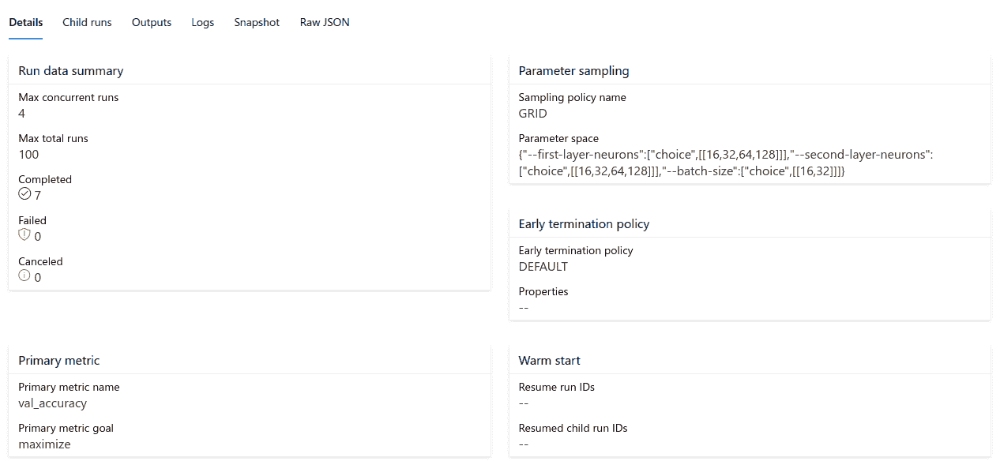
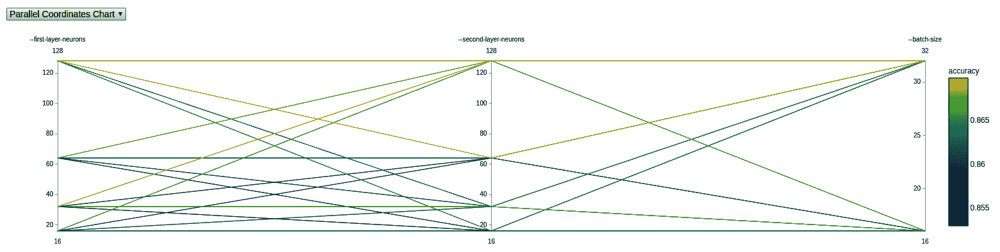
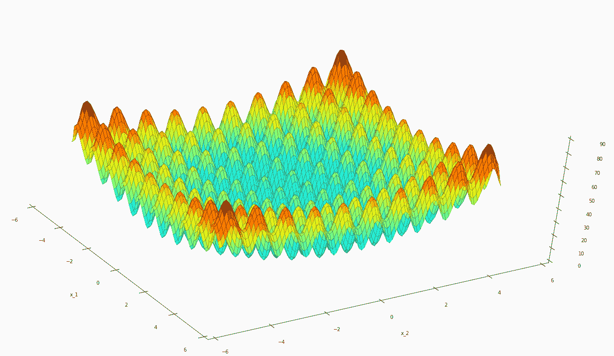
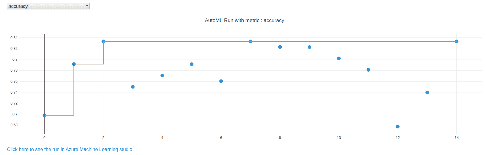

<title>Hyperparameter Tuning and Automated Machine Learning</title> 

# 超参数调整和自动机器学习

在前一章中，我们学习了如何训练卷积和更复杂的**深度神经网络** ( **DNNs** )。在训练这些模型时，我们在对它们进行参数化时经常面临复杂的选择，涉及各种参数，如层数、层的顺序、正则化、批量大小、学习速率、历元数等。这不仅适用于 DNNs 在统计最大似然方法中，选择正确的预处理步骤、特征、模型和参数也会出现同样的问题。

在这一章中，我们将看看如何优化训练过程，以便从机器学习中去除一些容易出错的人类选择。这些必要的调优技巧将帮助您更快、更有效地训练更好的模型。首先，我们将看看超参数调整(在 Azure ML 中也称为 **HyperDrive** )，这是一种在机器学习过程中优化所有参数选择的标准技术。通过评估超参数调整的不同采样技术，如随机采样、网格采样和贝叶斯优化，您将了解如何有效地权衡运行时和模型性能。

在本章的后半部分，我们将从超参数优化转移到使用**自动化机器学习**来自动化完整的端到端机器学习训练过程，这通常被称为 **AutoML** 。使用 AutoML，我们可以在一个简单的抽象管道中简单地优化预处理、特征工程、模型选择、超参数调整和模型堆叠。

Azure ML 的一个很大的好处是超参数调优和 AutoML 的概念都以相同的方式得到支持。这意味着我们可以将贝叶斯优化实验部署到远程自动扩展 GPU 集群，就像我们部署 AutoML 实验一样。最佳模型以同样的通用方式返回，然后可以存储到磁盘，在存储的模型中注册，或者立即部署到 Kubernetes，而无需离开您的笔记本环境。

本章将涵盖以下主题:

*   超参数调谐以找到最佳参数
*   用 AutoML 寻找最优模型

<title>Hyperparameter tuning to find the optimal parameters</title> 

# 超参数调谐以找到最佳参数

在机器学习中，我们通常处理参数或非参数模型。这些模型表示训练数据的分布，以便对来自同一分布的看不见的数据进行预测。虽然参数模型(如线性回归、逻辑回归和神经网络)通过使用一组学习到的参数来表示训练数据分布，但非参数模型通过其他特征来描述训练数据，如决策树(所有基于树的分类器)、训练样本(k-最近邻)或加权训练样本(支持向量机)。

下表概述了参数模型和非参数模型之间的一些主要差异:

| **参数模型** | **非参数模型** |
| 恒定数量的参数，独立于训练数据 | 参数的数量随着训练样本的数量而增长 |
| 关于训练数据的强假设 | 没有关于训练数据的假设 |
| 需要更少的训练样本 | 需要许多训练样本 |
| 快速训练，快速推理 | 慢训练慢推理 |
| 示例:线性回归和逻辑回归 | 示例:决策树和 k 近邻 |

术语**超参数**指用于配置和调整参数或非参数模型训练过程的所有参数。以下是神经网络中一些典型的超参数列表:

*   隐藏层的数量
*   每层的单元数
*   批量大小
*   深度尺寸
*   学习率
*   正规化

*   拒绝传统社会的人
*   损失度量

用于训练简单 ML 模型的超参数的数量和可能值的选择是巨大的。您是否曾经发现自己在训练过程中手动调整设置，例如，基于决策的分类器中的分裂数或神经网络分类器中的单元数？你不是一个人，很多初学者都是这样做的！然而，考虑到可能的参数选择的数量，尝试所有的组合是不可行的，接受这一点非常重要。

我们不仅不可能手动尝试所有不同的参数组合，而且在许多情况下，我们也不可能预测超参数调整的结果。在这种情况下，我们可以开始自动寻找最佳的参数集。这个过程叫做**超参数调谐**或**超参数**搜索。

超参数调整需要针对不同的超参数组合集自动测试模型的性能，并最终选择最佳的超参数组合。*最佳* *性能*的定义取决于所选择的指标和验证方法。例如，与使用 k 倍交叉验证的准确度度量相比，使用 f1 分数度量的分层交叉验证将产生一组不同的获胜参数。

我们在本书中讨论超参数调优(以及 AutoML)的一个原因是，我们通过使用弹性云计算基础设施获得了竞争优势。虽然在笔记本电脑上连续训练数百个模型很困难，但使用廉价的自动扩展计算在云中并行训练数千个模型却非常容易。此外，使用廉价的云存储，我们可以持久化所有潜在的好模型以供以后分析。许多最近的 ML 论文表明，我们通常可以通过使用更多的计算来获得更好的结果。

在我们开始调优超参数之前，我想提醒您基线模型的重要性。对于许多实际的 ML 模型，您应该能够使用单个基于树的集成分类器或具有默认参数的预训练神经网络来实现良好的性能。如果不是这样，超参数调优不会神奇地输出一个性能最好的模型。在这种情况下，最好回到数据预处理和特征工程，以便在调整批量大小、隐藏单元的数量或树的数量之前，首先构建一个好的基线模型。

超参数调优要避免的另一个问题是过度拟合和关注错误的性能指标或验证方法。与任何其他优化技术一样，超参数调整将根据给定的度量产生最佳的参数组合。因此，在开始超参数调优之前，验证您的性能指标是非常重要的。

与机器学习中的大多数其他技术一样，有多种方法可以找到模型的最佳超参数。最流行的技术是网格搜索、随机搜索和贝叶斯优化。在这一章中，我们将看看这三种方法，并讨论它们的优缺点。

<title>Sampling all possible parameter combinations using grid search</title> 

# 使用网格搜索对所有可能的参数组合进行采样

网格搜索(或网格采样)是一种流行的技术，通过尝试多维网格的每个可能的参数组合，从参数网格中找到最佳超参数。对于每个参数(连续的和分类的)，我们需要定义所有应该测试的值。流行的 ML 库提供了有效创建这些参数网格的工具。

网格搜索与其他超参数采样方法有两个不同的特性:

*   所有参数组合都被认为是相互独立的，因此可以并行测试。因此，给定一组 100 个可能的参数组合，我们可以启动 100 个模型来并行测试所有组合。
*   通过测试所有可能的参数组合，我们确保我们搜索的是全局最优而不是局部最优。

网格搜索非常适合于只有几个超参数的较小机器学习模型，但随着每个额外的参数呈指数增长，因为它向参数网格添加了新的维度。

让我们看看如何使用 Azure ML 实现网格搜索。在 Azure ML 中，超参数调整功能存在于`hyperdrive`包中。以下是我们在以下步骤中要做的事情:

1.  创建网格采样配置。
2.  定义一个主要指标来定义优化目标。
3.  创建一个`hyperdrive`配置。
4.  将`hyperdrive`配置作为实验提交给 Azure ML。

我们现在将更详细地了解这些步骤:

1.  首先，我们定义网格采样的参数选择和范围，如下面的代码块所示:

```
from azureml.train.hyperdrive import GridParameterSampling
from azureml.train.hyperdrive.parameter_expressions import *

grid_sampling = GridParameterSampling( {
        "--first-layer-neurons": choice(16, 32, 64, 128),
        "--second-layer-neurons": choice(16, 32, 64, 128),
        "--batch-size": choice(16, 32)
    }
)
```

在前面的代码中，我们使用离散参数选择定义了一个参数网格，该网格包含三个参数维度:第一层中的神经元数量、第二层中的神经元数量以及训练批次大小。

2.  参数名被写成命令行参数，因为它们将作为参数转发给训练脚本。因此，在您的训练脚本中，您应该通过命令行参数来配置所有的训练参数。下面是一个片段，展示了这在您的培训示例中的表现:

```
import argparse

parser = argparse.ArgumentParser()
parser.add_argument('--batch-size', type=int, dest='batch_size', 
  default=50)
parser.add_argument('--epochs', type=int, dest='epochs', 
  default=30)
parser.add_argument('--first-layer-neurons', type=int, 
  dest='n_hidden_1', default=100)
parser.add_argument('--second-layer-neurons', type=int, 
  dest='n_hidden_2', default=100)
parser.add_argument('--learning-rate', type=float, 
  dest='learning_rate', default=0.01)
parser.add_argument('--momentum', type=float, dest='momentum', 
  default=0.9)
args = parser.parse_args()
```

通过网格采样，我们将测试这些参数的所有可能组合。这将导致总共 32 次运行(4 x 4 x 2 ),理论上我们可以并行运行，因为训练运行和参数配置相互不依赖。在这种情况下，我们必须运行多少次，并且我们可以并行运行所有参数配置，这似乎是显而易见的，但我们稍后会看到，对于随机采样和贝叶斯优化，情况并非如此。在那里，训练运行的次数不会是固定的，并行运行的次数会影响优化过程。因此，停下来欣赏一下这种针对少量离散参数的网格采样解决方案的简单性是很棒的。

接下来，我们需要定义一个度量标准来衡量每个参数组合的性能。此指标可以是由培训脚本记录的任何数值。请注意，这个度量不必与损失函数相同，它可以是您想要用来比较不同参数对的任何度量。看看下面的例子。让我们决定在这个例子中最大化`accuracy`指标。我们定义以下参数:

在前面的例子中，我们选择了`accuracy`度量，这是我们想要最大化的。您可以看到，我们简单地指定了任何指标名称。为了使用这个指标来评估超参数优化运行，训练脚本需要用这个名称记录一个指标。在前面的章节中我们已经看到了这一点，我们只想在 Azure ML runs 选项卡中收集一个指标，并在实验中对它们进行比较。

我们使用与`primary_metric_name`相同的名称来定义和记录一个指标，这个指标可以被`hyperdrive`用来评估训练脚本中的运行:

在我们继续之前，回忆一下前面章节中的估计器配置。我们重用在`compute_target`中定义的基于 CPU 的 Azure ML 集群，我们在[第 6 章](19d1af93-3b84-4bdb-96c7-d92d3054b2a0.xhtml)、*中看到使用 Azure 机器学习构建 ML 模型*:

现在，我们可以初始化`hyperdrive`配置，它由估计器、采样网格、优化指标以及运行和并发运行的数量组成:

在网格采样中，运行次数应该与可能的参数组合数相对应。因为它是一个必需的属性，所以我们需要计算这个值并将其传递到这里。网格采样中并发运行的最大数量仅受 Azure ML 集群中节点数量的限制。我们使用的是四节点集群，所以我们将数量设置为`4`以最大化并发性。

最后，我们可以将`hyperdrive`配置提交给一个实验，该实验将在指定的计算目标上执行所有并发的子运行:

前面的代码片段将启动培训过程，根据需要构建和注册任何新的 Docker 映像，初始化和扩展集群中的节点，最后在集群上运行培训脚本。每个脚本都将使用采样网格中的唯一参数组合进行参数化。下面的屏幕截图显示了当我们单击从前面的代码片段返回的链接时得到的实验运行结果:



我们可以看到采样策略被设置为**网格**，还可以看到生成的参数空间。这些参数将作为命令行参数应用于培训脚本。

3.  然而，正如您可能已经猜到的那样，从多维网格中采样所有可能的参数组合并不是一切都很好。随着超参数数量的增长，网格的维度也在增长。并且参数的每个维度增加了需要测试的新参数配置的数量。不要忘记，测试参数配置通常意味着对您的模型执行训练、交叉验证和测试集预测，这可能会占用大量资源。

```
from azureml.train.hyperdrive import PrimaryMetricGoal

primary_metric_name = "accuracy"
primary_metric_goal = PrimaryMetricGoal.MAXIMIZE
```

假设您想要搜索 5 个参数的最佳参数组合，每个参数有 10 个不同的值。让我们假设以下情况:

4.  我们测试了 10 个 ^(5 个) (10*10*10*10*10)参数组合

```
from azureml.core.run import Run

run = Run.get_context()
run.log("accuracy", float(val_accuracy))
```

5.  一次训练仅需 2 分钟

```
from azureml.train.dnn import TensorFlow

estimator = TensorFlow(
 "training",
 compute_target=compute_target,
 entry_script="train.py",
 conda_packages=['scikit-learn', 'keras'])
```

6.  我们执行 4 重交叉验证

```
from azureml.train.hyperdrive import HyperDriveConfig

hyperdrive_run_config = HyperDriveConfig(
    estimator=estimator,
    hyperparameter_sampling=grid_sampling, 
    primary_metric_name=primary_metric_name, 
    primary_metric_goal=primary_metric_goal,
    max_total_runs=32,
    max_concurrent_runs=4)
```

然后，我们将得到 2 分钟* 4 * 10^5 = 10，00，000 分钟= 555 天的运行时间。虽然您可能可以并行执行训练，但是还有其他更适合大量参数的方法。

7.  让我们看看如何通过随机抽样参数配置来限制参数优化搜索所需的运行时间。

```
from azureml.core.experiment import Experiment

experiment = Experiment(workspace, experiment_name)
hyperdrive_run = experiment.submit(hyperdrive_run_config)
print(hyperdrive_run.get_portal_url())
```

使用随机搜索尝试随机组合

随机搜索是另一种流行的超参数采样方法，类似于网格搜索。主要区别在于，不是测试所有可能的参数组合，而是在随机搜索中随机选择并测试少数几个组合。主要思想是网格搜索经常采样对模型性能影响很小的参数配置。因此，我们浪费了大量时间来寻找类似的解决方案，而我们可以用这些时间来尝试许多不同的、有希望更成功的配置。

当处理大量超参数(例如，超过 5 个)时，随机搜索将比网格搜索更快地找到一组好的超参数，但是，在给定所有可能选择的情况下，它可能不是最佳结果。即便如此，在许多情况下，使用随机搜索而不是网格搜索来提高超参数调整的预测性能将是一个合理的权衡。

在随机搜索中，参数通常从连续分布中取样，而不是使用离散值。这导致定义参数网格的方式略有不同。我们可以为每个参数定义一个分布函数，从中提取随机值，而不是为连续变量提供精确的值选择。

像网格搜索一样，如果绘制时没有替换，所有参数组合都是完全独立的，因此可以完全并行化。如果提供具有 10，000 种不同配置的参数网格，我们可以并行运行和测试所有 *x* 模型。变量 *x* 代表需要测试的任意数量的不同随机组合。

*   让我们看看 Azure ML 中的随机搜索:
*   与所有其他超参数优化方法一样，我们在`hyperdrive`包中找到了随机采样方法。如前所述，我们现在可以为每个参数定义概率分布函数，如`normal`和`uniform`，而不是只选择离散参数:
*   使用连续的参数范围并不是随机抽样的唯一区别。由于我们现在可以从一个连续的范围内采样无限数量的参数配置，我们需要一种方法来指定搜索的持续时间。我们可以使用`max_total_runs`和`max_duration_minutes`参数来定义以分钟为单位的预期运行时间，或者限制采样参数配置的数量。

让我们在这个示例中测试 25 种不同的配置，并运行最长 60 分钟的超参数调整过程。我们设置以下参数:

我们重用在上一节中定义的相同度量，即准确性。`hyperdrive`配置如下:

<title>Trying random combinations using random search</title> 

# 与之前类似，我们可以从创作运行时向 Azure ML 提交`hyperdrive`配置，这将在计算目标上调度所有优化运行:

对于大量可调超参数或来自连续范围的采样值，随机采样是一个很好的选择。然而，我们不是逐步优化参数配置，而是简单地随机尝试所有这些配置，并比较它们的性能。

如果您现在问自己是否有更好(或更优雅)的方法来解决这个问题，我鼓励您继续阅读*使用贝叶斯优化优化参数选择*部分。

使用提前终止加快收敛

网格和随机采样技术都将测试模型中不良的参数选择，因此会花费宝贵的计算资源来将不良的参数化模型拟合到您的训练数据中。提前终止是一种技术，用于在中间结果看起来比其他模型差的情况下提前停止训练。

一般来说，在使用网格或随机抽样时，您应该总是尝试使用提前终止。如果结果比一些现有的模型差很多，那么你从训练这样的模型中得不到任何好处。

1.  一旦我们同意取消表现不佳的运行，我们需要找到一种方法来指定一个阈值，该阈值决定何时运行表现良好，何时运行应该被取消。Azure ML 提供了几个终止策略，分别是 **bandit** 、**中位停止**和**截断选择**。让我们来看看他们，看看他们有什么不同。

```
from azureml.train.hyperdrive import RandomParameterSampling
from azureml.train.hyperdrive.parameter_expressions import *

random_sampling = RandomParameterSampling( {
        "--learning-rate": normal(10, 3),
        "--momentum": uniform(0.5, 1.0),
        "--batch-size": choice(16, 32, 64)
    }
)
```

在我们进入细节之前，让我们先看看如何配置提前终止。在 Azure ML 中，我们可以用两个全局属性参数化不同的提前终止策略，即`evaluation_interval`和`delay_evaluation`。这些参数控制测试提前终止策略的频率。使用这些参数的示例如下:

2.  两个参数的单位都是区间。一个**间隔**是每当我们在一次实验运行中记录一个指标时，因此每当我们调用`run.log()`时。例如，当训练神经网络时，间隔将等于一个训练时期。`delay_evaluation`参数控制我们希望从开始等待多少时间间隔来首次测试提前终止策略。在前面的例子中，我们将其配置为`10`，因此我们在测试提前终止策略之前等待 10 个时期。

```
max_total_runs = 25
max_duration_minutes = 60
```

3.  然后，使用`evaluation_interval`参数控制策略的所有其他测试。它描述了在下一次测试之前应该通过多少次迭代。在前面的例子中，我们将`evaluation_interval`设置为`1`，这也是默认值。这意味着我们在`delay_evaluation`间隔之后的每个间隔测试提前终止策略——这里，每 1 次迭代。让我们来看看三个终止政策。

```
from azureml.train.hyperdrive import HyperDriveConfig

hyperdrive_run_config = HyperDriveConfig(
    estimator=estimator,
    hyperparameter_sampling=random_sampling, 
    primary_metric_name=primary_metric_name, 
    primary_metric_goal=primary_metric_goal,
    max_total_runs=max_total_runs,
    max_duration_minutes=max_duration_minutes)
```

4.  中间停止策略

```
from azureml.core.experiment import Experiment

experiment = Experiment(workspace, experiment_name)
hyperdrive_run = experiment.submit(hyperdrive_run_config)
print(hyperdrive_run.get_portal_url())
```

我们从三个中最简单的开始，中间停止策略。除了两个缺省参数之外，它没有其他参数，这两个缺省参数控制策略测试的时间和频率。中位数停止策略跟踪所有实验运行中主要指标的运行平均值。每当评估中值策略时，它将测试当前指标是否高于所有正在运行的实验的中值，并停止那些低于中值的实验。以下是如何为任何超参数调整脚本创建中值停止提前终止策略的示例:

正如我们在前面的例子中看到的，构建一个中间停止策略非常简单，因为它只由两个默认参数配置。由于它的简单性，这是一个非常有效的减少超参数优化脚本运行时间的方法。然后使用`policy`参数将提前终止策略应用于`hyperdrive`配置文件。现在让我们看看截断选择策略。

<title>Converging faster using early termination</title> 

# 截断选择策略

与中值停止策略不同，截断选择策略在评估时总是会终止运行。它将终止主要指标处于最低配置百分比的所有运行。使用`truncation_percentage`参数定义该百分比:

在前面的例子中，我们将`truncation_percentage`的值设置为 10%。这意味着无论何时执行提前终止策略，它都会杀死表现最差的 10%的运行。我们还将`evaluation_interval`值增加到`5`，因为我们不想在每个时期都终止运行，如下所示:

当只有非常少的培训资源可用时，这种提前终止策略是有意义的，并且我们希望在每次评估提前终止策略时积极地减少运行次数。我们来看看最后的政策，土匪政策。

强盗政策

```
evaluation_interval = 1
delay_evaluation = 10
```

bandit 策略的工作方式类似，但与截断策略相反。它不是停止性能最差的运行 *X* %,而是终止比当前最佳运行差 *X* %的所有运行。但是，bandit 策略不是使用百分比值配置的，而是使用`slack_factor`或`slack_amount`参数配置的。`slack_factor`参数描述了与最佳指标的相对偏差，而`slack_amount`参数描述了与最佳主要指标的绝对偏差。

让我们看一个例子。我们使用`0.2`的`slack_factor`参数的以下配置来配置`hyperdrive`，并测试精度值(越大越好)。如前所述，我们将`evaluation_interval`值设置为`5`，将`evaluation_delay`值设置为`10`间隔:

<title>The median stopping policy</title> 

# 让我们说，当第一次应用提前终止策略时，表现最好的运行在时期 10 之后产生 0.8 的准确度。现在，所有比最佳指标差 20%的运行都被终止。我们可以使用以下函数计算相对于 0.8 精度的相对偏差:0.8/(1 + 0.2) = 0.67。因此，所有产生低于 0.67 的性能的运行将被提前终止策略取消。

带有终止策略的超光速引擎配置

```
from azureml.train.hyperdrive import MedianStoppingPolicy
early_termination_policy = MedianStoppingPolicy(
  evaluation_interval=evaluation_interval,
  delay_evaluation=delay_evaluation)
```

为了创建超空间引擎配置，我们需要使用`policy`参数通过提前终止策略。下面是一个使用网格搜索采样和先前定义的 bandit 策略的示例:

<title>The truncation selection policy</title> 

# bandit 策略是中位数停止和截断选择策略之间的一个很好的折衷，在许多情况下都很有效。您可以放心，所有超参数配置中只有一个性能良好的子集将在多个时间间隔内运行和测试。

让我们将这个超空间驱动配置作为实验提交给 Azure ML。我们可以使用在第 6 章[、*使用 Azure 机器学习*构建 ML 模型中看到的`RunDetails`方法，来输出关于超参数调整实验的附加信息——例如调度和参数信息、训练表现的可视化以及显示参数维度的平行坐标图:](19d1af93-3b84-4bdb-96c7-d92d3054b2a0.xhtml)

```
truncation_percentage = 10
evaluation_interval = 5
delay_evaluation = 10
```

如果您运行前面的代码，您将看到一个很好的可视化效果，在一个平行坐标图上显示采样的参数。在这里，您可以看到哪些参数组合产生了高模型精度。您也可以选择不同的图(如二维和三维散点图)来查看相同的信息:

```
from azureml.train.hyperdrive import TruncationSelectionPolicy

early_termination_policy = TruncationSelectionPolicy(
  truncation_percentage=truncation_percentage,
  evaluation_interval=evaluation_interval,
  delay_evaluation=delay_evaluation)
```

This early termination policy makes sense when only very little training resources are available and we want to aggressively prune the number of runs each time the early termination policy is evaluated. Let's take a look at the final policy, the bandit policy.

<title>The bandit policy</title> 

# 

通过阅读本节，您已经了解到在 Azure ML 中对超参数优化脚本应用提前终止策略非常简单，但是非常有效。只需几行代码，我们就可以将训练运行的数量减少到最小，并且只完成那些产生有希望的结果的运行。

对随机或网格采样使用超参数优化时，请始终使用提前终止策略。

```
slack_factor = 0.2
evaluation_interval = 5
delay_evaluation = 10

from azureml.train.hyperdrive import BanditPolicy

early_termination_policy = BanditPolicy(
  slack_factor = slack_factor,
  evaluation_interval=evaluation_interval,
  delay_evaluation=delay_evaluation)
```

使用贝叶斯优化来优化参数选择

<title>A HyperDrive configuration with termination policy</title> 

# 到目前为止，我们一直在评估从网格或随机抽样的不同参数配置，没有很多策略。这样做的好处是所有的配置都是独立的，可以并发运行。然而，想象使用一个 ML 模型来帮助我们找到大型多维参数空间的最佳参数组合。这正是贝叶斯优化在超参数调整领域所做的。

优化方法的任务是找到预定义目标函数的最优值(即最小值或最大值)。在超参数调优中，我们面临着一个非常相似的问题:我们希望找到能够为 ML 模型产生最佳预定义评估度量的参数配置。

```
from azureml.train.hyperdrive import HyperDriveConfig

hyperdrive_run_config = HyperDriveConfig(
    estimator=estimator,
    hyperparameter_sampling=grid_sampling, 
    policy=early_termination_policy,
    primary_metric_name="accuracy", 
    primary_metric_goal=PrimaryMetricGoal.MAXIMIZE)
```

那么，这是如何工作的呢？我们首先定义一个超平面，一个多维网格来采样我们的参数配置。在下图中，我们显示了沿着 *x* 和 *y* 轴的两个参数的平面。 *z* 轴代表使用该特定位置的参数测试的模型性能:



```
from azureml.widgets import RunDetails

hyperdrive_run = exp.submit(hyperdrive_run_config)
RunDetails(hyperdrive_run).show()
```

上图显示了二维 Rastrigin 函数，作为极难优化的示例。在超参数调整中，我们经常面临一个类似的问题，即寻找最优解非常困难，就像在前面的函数中寻找全局最小值一样。

然后，我们从这个平面采样点，并测试第一个(几个)参数配置。我们的假设是参数不是独立的，当使用相似的参数时，模型将具有相似的性能。然而，每次评估仅产生真实模型性能的噪声值。使用这些假设，我们可以使用高斯过程将模型评估合并为多变量连续高斯过程。接下来，我们可以计算该高斯图上最高预期改进的点。这些点将产生新的样本来测试我们的模型。

幸运的是，我们不必自己实现算法，但许多 ML 库提供了开箱即用的超参数优化算法。在 Azure ML 中，我们可以使用贝叶斯抽样方法，这有助于我们挑选好的参数配置，以便优化预定义的指标。

通过对所有参数值使用连续或离散参数空间，参数网格的定义类似于随机采样技术，如以下代码块所示:

在我们继续之前，我们需要记住一件事。贝叶斯采样技术试图根据先前测试参数的结果来预测性能良好的参数配置。这意味着参数选择和运行不再是独立的。我们不能同时运行所有的实验，因为我们需要一些实验的结果来采样新的参数。因此，我们需要设置一个额外的参数来控制应该同时运行多少次训练。

<title>Optimizing parameter choices using Bayesian optimization</title> 

# 我们使用`max_concurrent_runs`参数来做这件事。为了让贝叶斯优化技术收敛，建议将该值设置为一个较小的值，例如在 **2-10** 的范围内。让我们将这个实验的值设置为`4`，将总运行次数设置为`100`。这意味着我们使用 **25** 次迭代进行贝叶斯优化方法，我们同时探索四个参数配置:

让我们用贝叶斯抽样开始实验:

很容易看出，这种技术不能为了更快地完成而并行到数千台机器上。然而，由于优化步骤，它通常在相对较短的时间内产生良好的结果。另一个问题是，贝叶斯采样中使用的优化技术要求每次运行的每个结果都具有定义的参数配置，以计算新的参数选择。因此，我们不能将提前终止与贝叶斯抽样结合使用，因为训练会提前停止，因此无法计算出准确的指标。

一旦你尝试了使用机器学习来优化 ML 模型的技术，你可能会有一个问题:为什么我们应该停止优化超参数，为什么我们不应该优化模型选择、网络结构或模型堆叠？

这是一个完全合理的想法。没有人能够一起测试不同 ML 模型、不同参数配置和不同嵌套模型的所有变化。因此，作为下一步，我们将在下一节中研究 AutoML 的领域。

用 AutoML 寻找最优模型

AutoML 是一个令人兴奋的新趋势，许多(如果不是全部)云提供商都在追随它。其目的是为用户提供一项服务，自动预处理您的数据，选择一个 ML 模型，并训练和优化该模型，以在给定特定误差度量的情况下最佳地拟合您的训练数据。这样，它将创建和训练一个完全自动化的端到端 ML 管道，只需要你的标记训练数据作为输入。以下是 AutoML 为您优化的步骤列表:

数据预处理

特征工程

```
from azureml.train.hyperdrive import BayesianParameterSampling
from azureml.train.hyperdrive.parameter_expressions import *

bayesian_sampling = BayesianParameterSampling( {
   "--learning-rate": normal(10, 3),
   "--momentum": uniform(0.5, 1.0),
   "--batch-size": choice(16, 32, 64)
 }
)
```

型号选择

超参数调谐

```
max_concurrent_runs = 4
max_total_runs = 100
```

模型组装

```
from azureml.train.hyperdrive import HyperDriveConfig
from azureml.core.experiment import Experiment

hyperdrive_run_config = HyperDriveConfig(
    estimator=estimator,
    hyperparameter_sampling=bayesian_sampling, 
    primary_metric_name=primary_metric_name, 
    primary_metric_goal=primary_metric_goal,
    max_total_runs=max_total_runs,
    max_concurrent_runs=max_concurrent_runs)

experiment = Experiment(workspace, experiment_name)
hyperdrive_run = experiment.submit(hyperdrive_run_config)
print(hyperdrive_run.get_portal_url())
```

虽然大多数有经验的机器学习工程师或数据科学家会对这种自动化方法的有效性非常谨慎，但它仍然有很多好处，这将在本节中解释。如果你喜欢超参数调优的想法，那么你一定会在 AutoML 中发现很多价值。

考虑 AutoML 的一个好方法是，它在完整的端到端 ML 管道上执行超参数搜索，类似于贝叶斯优化，但在更大的参数空间上。这些参数现在是端到端 ML 管道中的单独步骤，应该是自动化的。AutoML 的伟大之处在于，它将在实际训练模型之前预测某些预处理步骤和模型在数据集上的表现，而不是对所有可能的参数选择进行愚蠢的采样。这一过程被称为**元学习**，将有助于优化过程为管道产生伟大的候选解决方案。

AutoML 的优势和好处

<title>Finding the optimal model with AutoML</title> 

# 让我们评价一下 AutoML 的优势。如果我们看一下前面提到的自动化步骤列表，每个步骤都需要经验丰富的数据科学家花费多天时间来探索和应用，即使他们最终只能获得每个类别的最佳实践方法，例如，用标签编码器替换分类变量。即使是选择正确模型的步骤，如基于梯度的树集成分类的 LightGBM 或 XGBoost，也不是微不足道的，因为它们需要这两种工具的经验和知识。此外，我们都知道这两个只是分类模型所有可能选项的一个很小的子集。如果我们一直到超参数调整和模型堆叠，我们可以立即看出，建立一个伟大的集合模型所需的工作量是不小的。

我想强调的是，这不仅仅是一个知识问题。AutoML 的主要目标是用自动化的最佳实践取代手动步骤，应用持续改进的规则并大量优化每个可能的人类选择。这非常类似于超参数调优，但针对的是完整的端到端过程。简单地通过使用优化，机器将比人更快地找到最佳参数。

*   现在，您已经阅读了本书的一半以上，并且已经学会了如何自己构建端到端 ML 管道的技巧和诀窍。我们也可以从不同的角度来看待 AutoML，即作为**机器学习作为** **a** **服务** ( **MLaaS** )。到目前为止，您应该意识到构建端到端 ML 管道的每一步都是一项彻底而复杂的任务。即使您可以使用贝叶斯优化选择正确的模型和调优参数，构建和运行这个基础设施的成本也是巨大的。在这种情况下，选择 MLaaS 将为您提供一个机器学习基础设施，其成本仅为通常成本的一小部分。
*   AutoML 的想法非常有趣还有一个原因。它从你的问题中抽象出机器学习部分，留给你每个企业都应该最了解的东西——数据。类似于在云中使用托管服务(例如，托管数据库)，这使您可以专注于实现业务逻辑而不是操作基础设施，AutoML 将允许您使用基于最佳实践和优化的托管 ML 管道。
*   这也是 AutoML 仍然非常适合许多(成熟)公司的原因——它将预测问题简化为最重要的任务:
*   数据采集
*   数据清理

数据标记

选择误差度量

<title>Advantages and benefits of AutoML</title> 

# 我们不想责怪任何人，但一些机器学习工程师喜欢简单地跳过这些主题，直接进入有趣的部分，即特征工程、模型选择、参数化和调整。因此，每个 ML 项目的良好开端是实际上从 AutoML 开始，因为你必须只关注数据方面，而完全不用担心机器学习方面。在获得一个好的初始分数之后，如果需要的话，你可以继续进行并开始进一步的特性工程并构建你自己的模型。

如果您现在同意 AutoML 趋势是合理的，并且您可以以某种方式从中受益，我们现在将深入研究一些示例和代码。我们将看看 Azure 自动化机器学习的不同功能，它是 Azure ML 的产品，应用于标准的端到端 ML 管道。

在我们进入代码之前，让我们看看 Azure 自动化机器学习可以解决什么问题。通常，我们可以在 AutoML 中选择分类、回归和时间序列预测。正如我们从前面的章节中所知道的，时间序列预测只是回归的一个变种，所有的预测值都是未来的。

因此，在选择正确的 ML 任务之后，最重要的任务是选择应该被优化的适当的误差度量。下表列出了目前支持的所有错误指标:

**分类**

**回归**

*   **时间序列预测**
*   准确(性)
*   斯皮尔曼相关
*   斯皮尔曼相关

AUC _ 加权

归一化均方根误差

归一化均方根误差

平均值 _ 精度 _ 得分 _ 加权

| r2 _ 分数 | r2 _ 分数 | 规范 _ 宏观 _ 召回 |
| 标准化平均绝对误差 | 标准化平均绝对误差 | 精度 _ 分数 _ 加权 |
| AUC_weighted | normalized_root_mean_squared_error | 您应该熟悉这些度量中的大部分，因为它们是最流行的分类和回归误差度量的变体。一旦我们选择了度量标准，我们就继续进行预处理。 |
| 为了完整起见，在撰写本文时，这里列出了每个任务所有可能的模型。关于云中托管服务的伟大之处在于，这个列表将来很可能会增加，以添加最新的最先进的模型。然而，这个表应该被看作是你的附加信息，因为 AutoML 的思想是模型是自动为你选择的。但是，根据用户的偏好，列表中的单个型号可以被列入 AutoML 的白名单或黑名单: | **分类** | **回归** |
| **时间序列预测** | 物流回收 | 弹性网 |
| 弹性网 | 签名于 | 梯度推进 |

梯度推进

多项式贝叶斯

| 决策树 | 决策树 | 伯努利奈贝伊斯 |
| KNN | KNN | SVM |
| 套索手 | 套索手 | 线性 SVM |
| 签名于 | 签名于 | KNN |
| 随机森林 | 随机森林 | 决策树 |
| 极端树 | 极端树 | 随机森林 |
| LightGBM | LightGBM | 极端树 |
| TensorFlowLinearRegressor | TensorFlowLinearRegressor | LightGBM |
| TensorFlowDNN | TensorFlowDNN | 梯度推进 |
| RandomForest | 有马 | TensorFlowDNN |
| ExtremeRandomTrees | 先知 | TensorFlowLinearClassifier |
| LightGBM | TensorFlowDNN | TensorFlowDNN |
| 记住所有这些，现在让我们看一个使用 AutoML 的分类例子。 | 分类示例 | 当使用新技术时，退一步想想技术在理论上能做什么总是好的。让我们用同样的方法来弄清楚自动化预处理如何在一个典型的 ML 项目中帮助我们，以及它的局限性在哪里。 |
| AutoML 在将最佳实践转换应用于数据集方面非常出色:应用日期/时间转换、使用线性回归时数据的规范化和标准化、处理缺失数据或删除低方差要素，等等。微软提供了一个很长的特性列表，预计将来还会增加。 | 让我们回忆一下[第 5 章](2e9b480a-5003-4fc8-a5c6-bc2ba75c21b3.xhtml)、*用 NLP 进行高级特征提取*。虽然 AutoML 可以检测自由文本并将其转换为数字特征向量，但它无法理解您业务领域中数据的语义。因此，它将能够转换您的文本数据，但如果您需要对您的文本或分类数据进行语义编码，您必须自己实现。 | 另一件要记住的事情是，AutoML 不会试图在您的训练数据中推断不同特征维度的任何相关性。因此，如果您想要将两个分类列组合成一个组合的特性列(例如，使用 one-hot-encoding、mean embedding 等等)，那么您必须自己实现它。 |
| 在 AutoML 中，有两套不同的预处理程序——简单的**和复杂的**预处理程序。简单的预处理简称为**预处理**。下表显示了所有简单的预处理技术，如果指定了`preprocess`参数，这些技术将在 AutoML 训练期间进行评估。如果您以前使用过 scikit-learn，那么您应该对以下大多数预处理技术相当熟悉:**** | **预处理步骤** | **描述** |

标准缩放器

归一化:均值减法和单位方差的缩放特征。

<title>A classification example</title> 

# 最小最大缩放器

标准化:将特征缩放至最小值和最大值。

MaxAbsScaler

标准化:按最大绝对值缩放特征。

鲁棒定标器

归一化:将特征缩放至分位数范围。

| 主成分分析 | 基于**主成分分析** ( **PCA** )的线性降维。 |
| 截断的 VD | 基于线性降维的截断**奇异值分解** ( **SVD** )。与 PCA 相反，这种估计器不预先将数据居中。 |
| 稀疏归一化器 | 标准化:每个样本被独立地标准化。 |
| 复杂的预处理称为**特征化**。这些预处理步骤更复杂，并且在 AutoML 优化期间应用各种任务。作为 Azure 自动化机器学习的用户，你可以预期这个列表会增长，并包括新的最先进的转换。下表列出了各种特征化步骤: | **特征化步骤** |
| **描述** | 删除高基数或无差异特性 |
| 删除高基数(例如，哈希、id 或 GUIDs)或无差异(例如，所有值缺失或所有行中的值相同)功能。 | 估算缺失值 |
| 估算数值特征(平均值估算)和分类特征(模式估算)的缺失值。 | 生成附加要素 |
| 生成从日期/时间(例如，年、月、日、星期几、星期几、季度、星期几、小时、分钟和秒)和文本特征(基于 n 元语法的术语频率)派生的附加特征。 | 转换和编码 |

使用一键编码(低基数)和一键哈希编码(高基数)对分类要素进行编码。将具有少量唯一值的数字特征转换为分类特征。

| 单词嵌入 | 使用预先训练的嵌入模型，通过均值嵌入将文本转换为聚合特征向量。 |
| 目标编码 | 对分类特征执行目标编码。 |
| 文本目标编码 | 使用单词袋模型对文本特征执行目标编码。 |
| 证据的重要性 | 通过证据权重计算分类列与目标列的相关性，并为每个类的每个列输出一个新要素。 |
| 聚类距离 | 对所有数值列训练 k-means 聚类模型，计算每个要素到其质心的距离，并为每个聚类的每列输出一个新要素。 |
| 让我们从一个简单的 AutoML 分类任务开始，它也使用预处理: | 我们首先定义一个包含 AutoML 配置的字典。为了启用标准的预处理，比如缩放、归一化和 PCA/SVD，我们需要将`preprocess`属性设置为`true`。对于高级预处理和特征工程，我们需要将`featurization`属性设置为`auto`。以下代码块显示了所有设置: |
| 使用这个配置，我们现在可以使用 pandas 加载数据集。正如您在下面的代码片段中看到的，我们加载了`titanic`数据集，并将目标列指定为一个字符串。对于 AutoML 配置，稍后需要此列: | 当使用 AutoML 和本地执行上下文时，您可以使用 pandas 数据帧作为输入源。然而，当您在远程集群上执行训练时，您需要将数据包装在 Azure ML 数据集中。 |
| 每当我们使用黑盒分类器时，我们还应该拿出一个测试集来验证模型的测试性能，以便验证泛化能力。因此，我们将数据分为`train`和`test`组: | 最后，我们可以向 AutoML 配置构造函数提供所有需要的参数。在这个例子中，我们使用一个本地执行目标来训练 AutoML 实验。然而，我们也可以提供一个 Azure ML 数据集，并将实验提交给我们的训练集群: |
| 让我们将 AutoML 配置作为实验提交给定义的计算目标，并等待完成。我们可以输出运行细节: | 类似于`HyperDriveConfig`，我们可以看到`RunDetails` for AutoML 显示了很多关于你当前实验的有用信息。您不仅可以看到所有计划的和正在运行的模型，还可以很好地可视化已训练的模型及其训练表现。下面的屏幕截图显示了 AutoML 实验的前 14 次运行的准确性: |
|  | 最后，15 分钟后，我们可以从 AutoML 运行中检索最佳 ML 管道。从现在开始，我们将简单地把这个管道称为**模型**，因为所有的预处理步骤都被打包到这个模型中，这个模型本身就是一个操作管道。我们使用以下代码来检索管道: |

由此产生的拟合管道(称为`best_model`)现在可以完全像 scikit-learn 估计器一样使用。我们可以将它存储到磁盘，注册到模型存储，部署到一个`Container`实例，或者简单地在测试集上评估它。我们将在[第 11 章](c6e3ad17-9212-42ee-ae25-b111e530518a.xhtml)、*部署和操作机器学习模型*中更详细地了解这一点。最后，我们要评估最佳模型。为此，我们采用预先从数据集分离的测试集，并预测拟合模型的输出:

1.  在前面的代码中，我们使用了 scikit-learn 中的`accuracy_score`函数来计算最终模型的精度。使用自动预处理数据和拟合模型对数据集执行分类时，只需完成这些步骤。

```
automl_settings = {
 "experiment_timeout_minutes" : 15,
 "n_cross_validations": 3,
 "primary_metric": 'accuracy',
 "featurization": 'auto',
 "preprocess": True,
 "verbosity": logging.INFO,
}
```

2.  摘要

```
import pandas as pd

df = pd.read_csv("train.csv")
target_column = "survival"
```

在本章中，我们介绍了超参数调整(通过 HyperDrive)和 AutoML。我们观察到，这两种技术都可以帮助您有效地检索 ML 任务的最佳模型。

3.  网格采样适用于经典 ML 模型，当可调参数的数量固定时也是如此。评估离散参数网格上的所有值。在随机采样中，我们可以对参数空间应用连续分布，并选择尽可能多的参数选项来适应配置的训练持续时间。随机采样在大量参数上表现更好。这两种采样技术都可以/应该使用早期停止标准进行调整。

```
from sklearn.model_selection import train_test_split

df_train, df_test = train_test_split(df, test_size=0.2)
```

4.  与随机和网格采样不同，贝叶斯优化探测模型性能，以便优化以下参数选择。这意味着每组参数选择和由此产生的模型性能用于计算下一个最佳参数选择。因此，贝叶斯优化使用机器学习来优化您的 ML 模型的参数选择。由于基本的高斯过程需要最终的模型性能，早期停止不适用于贝叶斯优化。

```
from azureml.train.automl import AutoMLConfig

automl_config = AutoMLConfig(
    task='classification',
    debug_log='debug.log',
    compute_target=local_target,
    training_data=df_train,
    label_column_name=target_column,
    **automl_settings)
```

5.  我们了解到，AutoML 是完整的端到端 ML 流水线上贝叶斯优化的推广。我们不仅选择超参数，还选择预处理、特征工程、模型选择和模型堆叠方法，并一起优化它们。AutoML 通过预测哪些模型将在您的数据上表现良好来加速这一过程，而不是盲目地尝试所有可能的组合。这两种技术对于一个伟大的 ML 项目都是必不可少的；AutoML 让您首先关注数据和标签，而超参数调整让您优化特定的模型。

```
from azureml.widgets import RunDetails

automl_run = experiment.submit(automl_config, show_output = False)
RunDetails(automl_run).show()
```

在下一章中，我们将研究训练深度神经网络，其中数据或模型参数不再适合于单个机器的内存，因此需要分布式学习。


6.  Finally, after 15 minutes, we can retrieve the best ML pipeline from the AutoML run. From now on, we will refer to this pipeline simply as the **model**, as all preprocessing steps are packed into the model, which itself is a pipeline of operations. We use the following code to retrieve the pipeline:

```
best_run, best_model = remote_run.get_output()
```

7.  The resulting fitted pipeline (called `best_model`) can now be used exactly like a scikit-learn estimator. We can store it to disk, register it to the model store, deploy it to a `Container` instance, or simply evaluate it on the test set. We will see this in more detail in [Chapter 11](c6e3ad17-9212-42ee-ae25-b111e530518a.xhtml), *Deploying and Operating Machine Learning Models*. Finally, we want to evaluate the best model. To do so, we take the testing set that we separated from the dataset beforehand and predict the output on the fitted model:

```
from sklearn.metrics import accuracy_score

y_test = df_test[target_column]
X_test = df_test.drop(target_column, axis=1)
y_pred = fitted_model.predict(X_test)

accuracy_score(y_test, y_pred)
```

在前面的代码中，我们使用了 scikit-learn 中的`accuracy_score`函数来计算最终模型的精度。使用自动预处理数据和拟合模型对数据集执行分类时，只需完成这些步骤。

<title>Summary</title> 

# 摘要

在本章中，我们介绍了超参数调整(通过 HyperDrive)和 AutoML。我们观察到，这两种技术都可以帮助您有效地检索 ML 任务的最佳模型。

网格采样适用于经典 ML 模型，当可调参数的数量固定时也是如此。评估离散参数网格上的所有值。在随机采样中，我们可以对参数空间应用连续分布，并选择尽可能多的参数选项来适应配置的训练持续时间。随机采样在大量参数上表现更好。这两种采样技术都可以/应该使用早期停止标准进行调整。

与随机和网格采样不同，贝叶斯优化探测模型性能，以便优化以下参数选择。这意味着每组参数选择和由此产生的模型性能用于计算下一个最佳参数选择。因此，贝叶斯优化使用机器学习来优化您的 ML 模型的参数选择。由于基本的高斯过程需要最终的模型性能，早期停止不适用于贝叶斯优化。

我们了解到，AutoML 是完整的端到端 ML 流水线上贝叶斯优化的推广。我们不仅选择超参数，还选择预处理、特征工程、模型选择和模型堆叠方法，并一起优化它们。AutoML 通过预测哪些模型将在您的数据上表现良好来加速这一过程，而不是盲目地尝试所有可能的组合。这两种技术对于一个伟大的 ML 项目都是必不可少的；AutoML 让您首先关注数据和标签，而超参数调整让您优化特定的模型。

在下一章中，我们将研究训练深度神经网络，其中数据或模型参数不再适合于单个机器的内存，因此需要分布式学习。