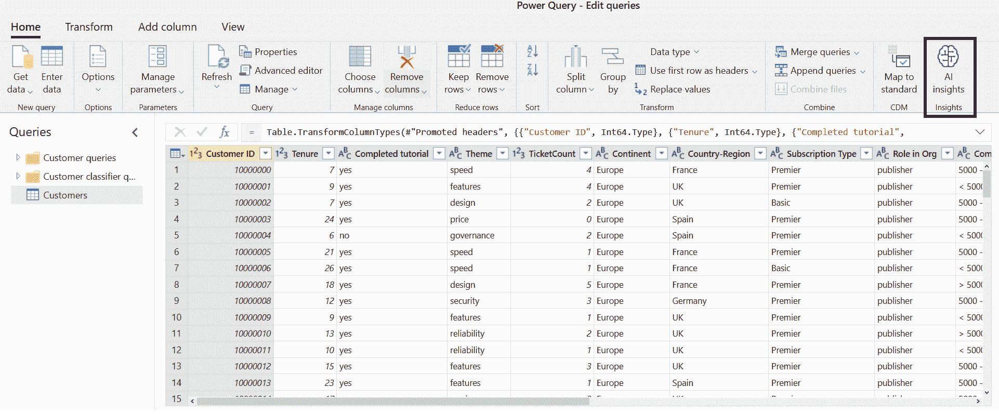

# 十一、部署和操作机器学习模型

在前一章中，我们学习了如何通过特征工程、自然语言处理和分布式算法来构建高效且可扩展的推荐引擎。**协同过滤**是一种流行的方法，用于查找以类似方式对类似产品进行评级的其他用户，而基于内容的推荐使用特征工程和聚类方法。因此，您可以将我们到目前为止介绍的所有方法结合起来，构建更好的混合推荐器。

在这一章中，我们将在训练一个**推荐引擎**或者任何一个**机器学习** ( **ML** )模型之后处理下一步:我们将注册、部署和操作这个模型。因此，我们的目标是从*这是我训练过的模型，现在怎么办？*将模型和执行运行时打包，在模型注册表中注册，并将它们部署到执行环境中。

首先，我们将看一看经过训练的 ML 模型的企业级模型部署。您将了解需要定义什么来使您的模型可执行(例如，作为 Docker 容器中的 web 服务)，以及在什么情况下这可以自动发生(例如，对于 scikit-learn 管道)。两个最常见的部署选项—实时 web 服务或批量评分管道—将定义计算目标和虚拟机注意事项。

在第二部分中，我们将更深入地研究优化和概要分析技术以及替代的部署场景。一种流行的方法是使用推理优化的评分框架将 ML 模型转换成可移植和可执行的格式，或者将模型嵌入到不同的环境和编程语言中。**开放神经网络交换** ( **ONNX** )是非循环计算图的可执行格式之一，可以移植到其他语言，并使用 ONNX 运行时评分框架进行高效评分。然而，我们还将了解如何通过将模型移植到特定的服务运行时来实现更好的性能，如 Azure IoT Edge 或专用硬件，如**现场可编程门阵列**(**FPGA**)。

在最后一节中，我们将重点关注如何在一定规模上监控和运营您的 ML 评分服务。为了优化性能和成本，您不仅需要跟踪系统级指标，还需要跟踪遥测数据和评分结果，以便检测模型或数据漂移。在本节之后，您将能够自信地在 Azure 中部署、调整和优化您的评分基础设施。

在本章中，您将涉及以下主题:

*   在 Azure 中部署 ML 模型
*   构建实时评分服务
*   实现批量评分管道
*   推理优化和替代部署目标
*   监控 Azure ML 部署


# 在 Azure 中部署 ML 模型

在前面的章节中，我们学习了如何实验、训练和优化各种 ML 模型来执行分类、回归、异常检测、图像识别、文本理解、推荐等等。本节继续成功执行这些步骤并成功训练一个模型。因此，给定一个训练好的模型，我们现在想用 Azure 中的工具打包和部署这些模型。

概括地说，有两种部署 ML 模型的常见方法，即将其部署为同步实时 web 服务和异步批量评分服务。请注意，同一个模型可以部署为两个不同的服务，服务于不同的用例。部署类型很大程度上取决于模型评分模式的批量大小和响应时间。具有快速响应的小批量需要水平可伸缩的实时 web 服务，而大批量和慢响应时间需要水平和垂直可伸缩的批处理服务。

文本理解模型(例如，实体识别模型或情感分析)的部署可以包括每当有新评论发布到应用程序时评估模型的实时 web 服务，以及另一个 ML 管道中的批处理计分器，以从训练数据中提取相关特征。对于前者，我们希望尽快满足每个请求，因此我们将同步评估小批量。对于后者，我们评估大量数据，因此我们将异步评估大批量数据。我们的目标是，一旦模型被打包和注册，我们就可以在任务或用例中重用它。

独立于用例，部署过程看起来非常相似。首先，需要在模型注册中心注册训练好的模型。其次，我们需要指定部署资产；例如，环境、库、资产、评分文件、计算目标等等。这些资产确切地定义了模型是如何被加载、初始化和执行的，并将作为 Docker 文件存储在您的私有映像注册中心。接下来，创建指定的计算目标，并在那里部署部署映像。最后，一旦服务被部署并运行，您就可以向服务发送请求。

可以想象，评分文件中的库、框架和定制预处理的范围相当大。但是，如果您坚持使用 scikit-learn 或 TensorFlow 中提供的标准功能，您也可以使用无代码部署。为此，您必须在模型注册期间添加一些额外的参数，比如使用的框架、版本号和资源需求。

让我们更深入地研究一下这些单独的部署步骤。


# 理解 ML 模型的组成部分

当使用 Azure ML 时，为了部署和运行 ML 模型，您需要指定一个定义良好的列表。一旦我们完成了这个列表，很明显，您需要一个运行时环境、一个评分文件和一个计算目标，以便将您的 ML 模型部署为一个服务。然而，这些东西经常被忘记作为部署的组成部分来管理。

首先，也是最明显的，我们需要一个模型。根据所使用的框架、库和算法，训练模型由一个或多个存储模型参数和结构的文件组成。在 scikit-learn 中，这可能是一个酸洗的估计器，在**光梯度增强机器** ( **LightGBM** )中，这可能是一个决策树的序列化列表，在 Keras 中，这可能是一个模型定义和一个存储模型权重的二进制 blob。我们称之为*模型*，我们在 blob 存储中存储和版本化它。在评分服务启动时，模型将被加载到评分运行时中。

因此，除了模型，我们还需要一个执行运行时，它可以通过`InferenceConfig`来定义。在 Azure ML 部署中，执行运行时将作为单个 Docker 文件存储在您的私有 Docker 注册表中。部署过程将自动为您构建 Docker 映像，并将其加载到注册表中。默认情况下，Azure ML 工作空间包含一个私有容器注册表，它将用于这种情况。

执行环境的基础构建了基础 Docker 映像。在 Azure ML 部署中，您可以配置自己的 Docker 基础映像。在基础映像之上，您可以定义一个 Python 依赖项(通过 Conda 环境)或 pip 依赖项的列表。这应该涵盖您的模型评分所需的所有依赖项。环境，包括所有的包，将自动在 Docker 映像上建立，并在运行时提供。除此之外，Azure ML 服务可以注册和管理环境。这使得跟踪、重用和组织您的部署环境变得容易。

接下来我们需要一个所谓的**评分文件**。这个文件通常会加载模型，并提供一个函数，在给定一些数据作为输入时对模型进行评分。根据部署的类型，您需要为(实时)同步评分服务或异步批处理评分服务提供评分文件。评分文件应该在您的版本控制系统中进行跟踪，并将被安装在 Docker 映像中。

为了完成`InferenceConfig`，我们还缺少最后一个重要的步骤:用于运行和执行您的评分文件的 Python 运行时。目前，Python 和 PySpark 是唯一受支持的运行时。

最后，我们需要一个执行目标来定义 Docker 映像应该在其上执行的计算基础设施。在 Azure 中，这被称为**计算目标**，并通过部署配置来定义。计算目标可以是一个托管的 Kubernetes 集群，如 **Azure Kubernetes 服务** ( **AKS** )，一个容器实例，如 **Azure 容器实例** ( **ACI** )，或者许多其他 Azure 计算服务之一。

请注意，这个云服务列表用于通过 Azure ML 进行自动部署。没有什么可以阻止您在本地环境中运行 Docker 映像。

使用 Azure IoT Edge 作为替代计算目标，您还可以直接部署到自己数据中心的边缘设备。我们将在下一节中对此进行更深入的研究。因此，您需要一个经过训练和注册的模型、一个推理配置(执行环境和评分文件)和一个计算目标，以便通过创作环境自动部署模型。

由于拥有所有这些定制选项会变得非常复杂，所以您也可以使用简化的方法来实现标准模型和框架，例如 scikit-learn、ONNX 或 TensorFlow 模型。这种方法被称为**无代码部署**，只需要所用框架的名称和版本以及资源配置；例如，要执行的 CPU 数量和 RAM 数量。这些选项取代了推理配置和计算目标，使得部署标准模型变得非常容易。

现在我们已经了解了 Azure ML 中部署的基础知识，我们可以继续看一个注册模型来为部署做准备的例子。


# 在模型注册表中注册您的模型

在培训过程中，制定部署管道的第一步应该在培训之后立即开始，即注册每次运行的最佳模型。无论您的训练脚本是生成单个模型、模型集合还是由多个文件组合而成的模型，您都应该始终在 Azure ML 工作空间中注册每次运行的最佳模型。

存储一个大小约为 200 MB 的模型每月只需增加一行代码和不到一美分。blob 存储和模型注册表直接与您的 Azure ML 工作空间集成。额外的好处是，您永远不会丢失运行的最佳模型，并且您可以获得一个方便的接口来从 Azure ML 模型注册中心加载模型:

1.  让我们来看看这条神奇的线:

```
run = Run.get_context()

# train your model
clf = train_sklearn_mnist()

# serialize the model and write it to disk
from sklearn.externals import joblib
joblib.dump(clf, 'outputs/sklearn_mnist_model.pkl')

model = run.register_model(model_name='sklearn_mnist',
  model_path='outputs/sklearn_mnist_model.pkl')
print(model.name, model.id, model.version, sep='\t')
```

在前面的代码块中，我们首先使用来自`sklearn`的`dump()`函数将一个训练好的分类器序列化并存储到磁盘。然后我们调用`run.model_register()`函数将一个训练好的模型上传到`model`注册中心。这将通过名称自动跟踪和版本化模型，并将其连接到当前的训练运行。

2.  一旦您的模型存储在 Azure ML 工作区的模型注册中心，您不仅可以将它用于部署，还可以在任何调试、测试或实验步骤中通过名称检索它。您可以简单地通过名称请求最新型号；例如，通过在本地计算机上运行以下代码片段:

```
from sklearn.externals import joblib
from azureml.core.model import Model

model_path = Model.get_model_path('sklearn_mnist')
model = joblib.load(model_path)
```

我们在前面的代码中所做的就是运行`Model.get_model_path()`来按名称检索模型的最新版本。我们还可以指定一个版本号来从注册表中加载特定的模型。这是 Azure ML workspace 的功能之一，它让你着迷，让你永远不想错过将来的模型注册。当在不同的环境和不同的实验中使用模型工件时，它给你很大的灵活性和透明度。

如果我告诉您，您已经可以使用一行额外的代码(即`Model.deploy`)将这个模型作为蓝绿色部署部署到 web 服务，那会怎么样？嗯，我很肯定你会对这有多简单感到惊讶。事实上，使用上一节中提到的无代码部署，这是可能的。

3.  通过定义模型、框架和计算资源配置，您可以在一行代码中将该模型部署为实时 web 服务。为此，我们需要通过扩展`Model.register`参数将这些附加信息添加到模型中。让我们来看看这是怎么回事:

```
from azureml.core import Model
from azureml.core.resource_configuration import ResourceConfiguration

# register the model with no-code deployment configuration
model = Model.register(workspace=ws,
                       model_name='sklearn_mnist',
                       model_path='./sklearn_mnist_model.pkl',
                       model_framework=Model.Framework.SCIKITLEARN,
                       model_framework_version='0.19.1',
                       resource_configuration=ResourceConfiguration(
                         cpu=1, memory_in_gb=0.5))

service_name = 'my-sklearn-service'
service = Model.deploy(ws, service_name, [model])
```

在前面的代码中，我们向模型注册中心添加了框架和框架版本，以及这个特定模型的资源配置。模型本身以标准格式存储在一个受支持的框架中(scikit-learn、ONNX 或 TensorFlow)。这个配置作为元数据添加到模型注册中心的模型中。

4.  最后，我们可以调用`Model.deploy()`函数来启动部署过程，该过程将构建部署运行时作为 Docker 映像，将其注册到您的容器注册表中，并启动映像作为托管容器实例，包括评分文件、REST 服务抽象和遥测收集。正如您可能在代码中发现的，您还可以通过向部署函数传递一个数组来一次部署多个模型。要在评分服务完成后检索其 URL，我们运行以下代码:

```
service.wait_for_deployment(True)
print(service.state)
print("Scoring URL: " + service.scoring_uri)
```

如果您想要对执行环境、端点配置和计算目标进行更精细的控制，您可以使用高级推理、部署和服务配置来调整您的部署。现在让我们看一下定制部署。


# 定制您的部署环境

在 Azure ML 服务中，您使用一个执行环境来指定一个基本 Docker 映像、Python 运行时以及对您的模型评分所需的所有依赖包。与模型类似，环境也可以在 Azure 中注册和版本化。因此，Docker 工件和元数据都存储在您的工作区中。这使得跟踪您的环境变化、在环境的多个版本之间来回跳转以及为多个项目共享一个环境变得非常简单:

1.  我们可以使用 CLI 和 Conda 文件定义一个环境，也可以在使用 Python 和 Azure ML SDK 的创作环境中轻松地定义一个环境。让我们看看如何使用 Conda 定义 Python 环境:

```
from azureml.core.environment import Environment
from azureml.core.conda_dependencies import CondaDependencies

# Create the environment
myenv = Environment()
conda_dep = CondaDependencies()

# Define the packages needed by the model and scripts
conda_dep.add_conda_package("tensorflow")
conda_dep.add_conda_package("numpy")
conda_dep.add_conda_package("scikit-learn")
# You must list azureml-defaults as a pip dependency
conda_dep.add_pip_package("azureml-defaults")
conda_dep.add_pip_package("keras")

# Adds dependencies to PythonSection of myenv
myenv.python.conda_dependencies=conda_dep
```

正如您在前面的代码块中看到的，我们首先初始化一个`Environment`实例，然后向`conda`依赖对象添加多个包。我们通过用`conda`依赖项覆盖`myenv.python.conda_dependencies`属性来分配`conda`环境。使用同样的方法，我们还可以分别使用`myenv.docker`和`myenv.spark`覆盖 Docker、Spark 和任何额外的 Python 设置。

Azure ML SDK 包含可能的配置选项的详细列表，您可以在[https://docs . Microsoft . com/en-us/python/API/Azure ML-core/Azure ML . core . environment(class)](https://docs.microsoft.com/en-us/python/api/azureml-core/azureml.core.environment(class)?view=azure-ml-py)找到。

2.  在下一步中，您现在可以使用描述性名称注册环境。这会将当前环境配置的新版本以相同的名称添加到您的环境中:

```
myenv.register(workspace=ws, name="PythonEnv")
```

3.  您还可以使用以下代码从注册表中检索环境。当您注册了一个基本环境时，这也很有用，该环境可以在多个实验中重复使用和扩展:

```
myenv = Environment.get(workspace=ws, name="PythonEnv")
```

4.  与`model`注册表一样，您也可以使用指定的版本作为附加参数来加载环境。一旦你配置了一个执行环境，你就可以把它和一个评分文件组合成一个`InferenceConfig`对象。评分文件实现了从注册表加载模型的所有功能，并在给定一些输入数据的情况下对其进行评估。该配置可以定义如下:

```
from azureml.core.model import InferenceConfig
inference_config = InferenceConfig(
  entry_script="score.py", environment=myenv)
```

在前面的示例中，我们可以看到，我们只是在本地创作环境中指定了评分脚本的相对路径。因此，您首先必须创建这个评分文件——我们将在接下来的章节中介绍两个批处理和实时评分的示例。

5.  要构建一个环境，我们可以简单地触发 Docker 映像的构建:

```
from azureml.core import Image
build = myenv.build(workspace=ws)
build.wait_for_completion(show_output=True)
```

6.  该环境将作为 Docker 映像打包并注册到您的私有容器注册表中，包含 Docker 基本映像和所有指定的库。如果您想打包模型和评分文件，您可以改为打包模型。这是在部署模型时自动完成的，或者可以通过使用`Model.package`功能强制完成。让我们加载上一节中的模型，并打包和注册图像:

```
model_path = Model.get_model('sklearn_mnist')
package = Model.package(ws, [model], inference_config)
package.wait_for_creation(show_output=True)
```

前面的代码将把您的部署构建并打包成 Docker 映像。在下一节中，我们将了解如何选择最佳计算目标来执行您的 ML 部署。


# 在 Azure 中选择部署目标

Azure ML 服务的一个巨大优势是它们与许多其他 Azure 服务紧密集成。这对于部署非常有帮助，我们希望在 Azure 的托管服务上运行 ML 服务的 Docker 映像。可以通过 Azure ML 配置和利用这些计算目标进行自动部署。

当你的工作是生产 ML 培训和部署管道时，你可能不是 Kubernetes 的专家。如果是这样的话，你可能会喜欢 Azure ML SDK 中 Azure 计算服务管理的紧密集成。与创建执行环境类似，您可以在创作环境中创建整个 GPU 集群、托管 Kubernetes 集群或简单的容器实例；例如，Jupyter 笔记本编排您的工作流程。

我们可以遵循选择特定服务的一般建议，类似于为常规应用程序部署选择计算服务。因此，我们在能够轻松从 Docker 映像启动 web 服务的计算服务之间权衡简单性、成本、可扩展性、灵活性和运营费用。

以下是何时使用 Azure 计算服务的建议:

*   对于测试和实验，请使用 ACI。它非常容易设置和配置，并且可以运行容器映像。
*   对于具有 GPU 支持的可伸缩实时 web 服务的部署，请使用 AKS。这个托管的 Kubernetes 集群更加灵活和可伸缩，但也更加难以操作。
*   对于批量部署，请使用 AML Compute，这是我们已经在培训中使用的计算集群环境。

根据部署的类型，您还需要修改您的评分文件，这是您的`InferenceConfig`部署的一部分。对于快速实验，您还可以使用`LocalWebservice`作为部署目标，在本地部署您的服务。为此，您必须在本地计算机上运行以下代码片段:

```
from azureml.core.webservice import LocalWebservice, Webservice

deployment_config = LocalWebservice.deploy_configuration(port=8890)
service = Model.deploy(ws, service_name, [model], inference_config,
  deployment_config)

service.wait_for_deployment(show_output=True)
print(service.state)
```


# 构建实时评分服务

对于 Azure ML 服务，你不能真的选择一个特定的部署案例来匹配你的用例。要实现实时评分服务，您需要选择一个高度可伸缩的计算目标(例如，AKS)并提供一个评分文件，该文件接收每个请求的数据并同步返回模型的预测:

1.  为此，您需要在评分文件中提供`init()`和`run()`函数。让我们来看一个简单的评分文件。实际上，这应该非常简单，因为我们已经看到了大部分代码:

```
import json
import numpy as np
import os
from sklearn.externals import joblib

def init():
    global model
    model_path = Model.get_model_path('sklearn_mnist')
    model = joblib.load(model_path)

def run(data):
    try:
        result = model.predict(data)
        # You can return any JSON serializable data type
        return result.tolist()
    except Exception as e:
        error = str(e)
        return error
```

在前面的代码片段中，您可以看到我们已经提供了`init()`和`run()`函数。在`init()`函数中，我们从`model`注册表中加载模型，就像在本地机器上加载一样。然后，我们使用 scikit-learn `joblib`库对模型进行反序列化。

在`run()`函数中，我们被提供了一个`data`对象。`data`对象包含请求的所有参数，这些参数作为带有`data`属性的 JSON 对象发送给服务。在前面的例子中，我们期望客户端发送一个请求，请求的主体包含一组数据，我们可以将这些数据输入到`sklearn`分类器中。最后，我们返回一个预测，它将自动序列化为 JSON 并返回给调用者。

2.  出于测试目的，让我们将服务部署到 ACI 计算目标。为此，我们需要更新部署配置以包含 ACI 资源配置:

```
from azureml.core.webservice import AciWebservice, Webservice

deployment_config = AciWebservice.deploy_configuration(
  cpu_cores = 1, memory_gb = 1)
service = Model.deploy(ws, service_name, [model], inference_config, 
  deployment_config)
service.wait_for_deployment(show_output=True)
print(service.state)
```

正如您可能已经想到的那样，验证用户的请求并向用户提供一些关于如何使用服务的信息是非常好的。为了解决这个问题，Azure ML 提供了一种自动生成 OpenAPI 规范的方法，客户端可以通过另一个端点使用该规范。这个规范以前叫做 **Swagger** ，它提供了一种自动化的标准化方法来指定服务的数据格式。

你可以在官方文档[https://docs . Microsoft . com/en-us/Azure/Container-instances/Container-instances-overview](https://docs.microsoft.com/en-us/azure/container-instances/container-instances-overview)中找到更多关于 Azure 容器实例的信息。

3.  您可以通过 Python 中的注释为服务中的 pandas、NumPy、PySpark 和标准 Python 对象启用自动模式生成。首先，您需要将`azureml-defaults>=1.0.45`和`inference-schema[numpy-support]`作为 pip 包包含在您的环境中。然后，您可以通过为端点提供示例输入和输出数据来自动生成模式:

```
from inference_schema.schema_decorators import input_schema, output_schema
from inference_schema.parameter_types.numpy_parameter_type import NumpyParameterType

input_sample = np.array([[10, 9, 8, 7, 6, 5, 4, 3, 2, 1]])
output_sample = np.array([3726.995])

@input_schema('data', NumpyParameterType(input_sample))
@output_schema(NumpyParameterType(output_sample))
def run(data):
   …
```

在前面的例子中，我们通过示例数据和`run()`方法中的注释定义了模式。这是自动生成 API 规范所需的一切，您的客户端可以使用这些规范来验证端点和参数，或者自动生成客户端。Swagger Codegen 现在可以用来为您的新 ML 服务生成 Java 和 C#客户机。

4.  太好了，我们现在有了输入验证，可以自动生成客户机来查询服务。现在，让我们将此服务部署到 AKS 集群，这样我们就可以利用 GPU 加速和自动扩展:

```
from azureml.core.compute import AksCompute, ComputeTarget

# Configure AKS cluster with NVIDIA Tesla P40 GPU
prov_config = AksCompute.provisioning_configuration(
  vm_size="Standard_ND6s")

aks_name = 'aks-ml-prod'
# Create the cluster
aks_target = ComputeTarget.create(workspace = ws,
  name = aks_name, provisioning_configuration = prov_config)

# Wait for the create process to complete
aks_target.wait_for_completion(show_output = True)
```

在前面的代码中，我们创建了一个 AKS 配置和一个新的 AKS 集群，作为这个配置的 Azure ML 计算目标。所有这些都完全发生在您的创作环境中。如果已经有一个 AKS 集群在运行，可以简单地将这个集群用于 Azure ML。

你可以在官方文档[https://docs.microsoft.com/en-us/azure/aks/intro-kubernetes](https://docs.microsoft.com/en-us/azure/aks/intro-kubernetes)[中找到更多关于 Azure Kubernetes 服务的信息。](https://docs.microsoft.com/en-us/azure/aks/intro-kubernetes)

5.  为此，您必须将资源组和集群名传递给`AksCompute.attach_configuration()`方法。然后，设置包含 AKS 集群和集群名称的资源组:

```
resource_group = 'my-rg'
cluster_name = 'aks-ml-prod'

attach_config = AksCompute.attach_configuration(
  resource_group = resource_group,
  cluster_name=cluster_name)
aks_target = ComputeTarget.attach(ws, cluster_name, attach_config)
```

6.  一旦我们有了对集群的引用，我们现在就可以将 ML 模型部署到集群中。这一步与前一步相似:

```
deployment_config = AksWebservice.deploy_configuration(
  cpu_cores=1, memory_gb=1)
service = Model.deploy(ws, service_name, [model], inference_config, 
  deployment_config, aks_target)
service.wait_for_deployment(show_output = True)
print(service.state)
print(service.get_logs())
```

7.  集群启动并运行，部署完成。现在，我们可以尝试向服务发出一个测试请求，以确保一切工作正常。默认情况下，Azure ML 服务使用基于密钥的(主要和次要)身份验证。让我们检索`api_key`并向部署的服务发送一些测试数据:

```
X_test = load_test_data()

import json
input_data = json.dumps({'data': [X_test]})

api_key = aks_service.get_keys()[0]
headers = {'Content-Type': 'application/json',
           'Authorization': ('Bearer ' + api_key)}
resp = requests.post(aks_service.scoring_uri, input_data, 
  headers=headers)

print("POST to url", aks_service.scoring_uri)
print("label:", y_test[random_index])
print("prediction:", resp.text)
```


# 实现批量评分管道

操作批量评分服务与之前讨论的在线评分方法非常相似——您提供一个环境、计算目标和评分文件。但是，在您的评分文件中，您更愿意传递一个指向 blob 存储位置的路径，其中包含一批新数据，而不是数据本身。然后，您可以使用评分函数异步处理数据，并将预测输出到不同的存储位置，返回到 blob 存储，或者将数据异步推送到调用服务。

如何实现你的评分文件取决于你，因为它只是一个你控制的 Python 脚本。部署过程中唯一的区别是批处理评分脚本将作为一个管道部署在 Azure ML 集群上，并通过 REST 服务触发。因此，可以通过命令行参数配置您的评分脚本非常重要。请记住，批量评分的不同之处在于，我们不将数据发送到评分管道，而是发送一个数据路径和一个异步写入输出的路径。

我们没有使用 Azure ML 部署将批量评分脚本部署为服务，而是将评分脚本包装在管道中，并从 REST 服务中触发它。现在可以将管道定义为使用 Azure ML 计算集群来执行:

1.  让我们使用一个可配置批处理大小的单一步骤来定义一个管道。在管道配置和评分文件中，您都可以利用 Azure ML 集群中的并行工作:

```
from azureml.core import Experiment
from azureml.pipeline.core import Pipeline
from azureml.pipeline.steps import PythonScriptStep

from azureml.pipeline.core.graph import PipelineParameter
batch_size_param = PipelineParameter(
  name="param_batch_size", default_value=20)

inception_model_name = "inception_v3.ckpt"

batch_score_step = PythonScriptStep(
    name="batch_scoring",
    script_name="batch_scoring.py",
    arguments=["--dataset_path", input_images, 
               "--model_name", "inception",
               "--label_dir", label_dir, 
               "--output_dir", output_dir, 
               "--batch_size", batch_size_param],
    compute_target=compute_target,
    inputs=[input_images, label_dir],
    outputs=[output_dir],
    runconfig=amlcompute_run_config
)

pipeline = Pipeline(workspace=ws, steps=[batch_score_step])
pipeline_run = Experiment(ws, 'batch_scoring').submit(pipeline, 
  pipeline_params={"param_batch_size": 20})
```

2.  使用这个管道配置，我们调用带有相关参数的评分脚本。管道是作为 Azure ML 中的一个实验提交的，这让我们可以访问 Azure 中运行和实验的所有功能。其中一个特性是，我们可以在实验运行结束时简单地下载它的输出:

```
pipeline_run.wait_for_completion(show_output=True)
step_run = list(pipeline_run.get_children())[0]
step_run.download_file("./outputs/result-labels.txt")
```

3.  如果批评分文件生成了包含姓名和预测的漂亮的 CSV 输出，我们现在可以使用以下 pandas 功能显示结果:

```
import pandas as pd
df = pd.read_csv("result-labels.txt", delimiter=":", header=None)
df.columns = ["Filename", "Prediction"]
df.head()
```

4.  让我们继续将管道发布为 REST 服务:

```
published_pipeline = pipeline_run.publish_pipeline(
  name="Inception_v3_scoring", description="Batch scoring using 
  Inception v3 model", version="1.0")

published_id = published_pipeline.id
rest_endpoint = published_pipeline.endpoint
```

5.  要通过 HTTP 将发布的管道作为服务运行，我们现在需要使用基于令牌的身份验证:

```
from azureml.core.authentication import AzureCliAuthentication
import requests

cli_auth = AzureCliAuthentication()
aad_token = cli_auth.get_authentication_header()
```

6.  检索到身份验证令牌后，我们现在可以运行发布的管道:

```
# specify batch size when running the pipeline
response = requests.post(rest_endpoint, headers=aad_token, 
                           json={"ExperimentName": "batch_scoring",
                             "ParameterAssignments": {"param_batch_size": 50}})
run_id = response.json()["Id"]
```

在 Azure ML 服务上运行批量评分管道与运行同步评分服务略有不同。虽然实时评分服务使用 Azure ML 部署和 AKS 或 ACI 作为流行的计算目标，但批量评分模型通常部署为 AML 计算之上的发布管道。发布管道的好处是可以作为 REST 服务使用，可以触发和参数化管道。


# 推理优化和替代部署目标

使用 Azure ML 部署，让您的第一个实验性服务启动并运行是非常容易的。通过模型和环境的版本化和抽象化，将相同的模型和环境部署到不同的计算目标是不费力的。然而，预先知道您的模型将消耗多少资源，以及如何优化您的模型或部署以获得更高的推理吞吐量并不容易。


# 优化资源配置的剖析模型

Azure ML 提供了一个方便的工具，可以帮助您通过模型分析评估 ML 模型部署所需的资源。这将帮助您估计在特定吞吐量下运行评分服务所需的 CPU 数量和内存量。

让我们看看我们在实时评分示例中训练的模型的模型概况:

1.  首先，您需要以与 ML 服务的 JSON 请求相同的格式定义`test_data`——因此，将`test_data`嵌入到一个 JSON 对象中的`data`根属性下。请注意，如果您在评分文件中定义了不同的格式，那么您需要使用自己的自定义格式:

```
import json
test_data = json.dumps({'data': [
    [1,2,3,4,5,6,7,8,9,10]
]})
```

2.  然后，您可以使用`Model.profile()`方法来分析模型，并评估服务的 CPU 和内存消耗。这将启动您的模型，使用提供给它的`test_data`触发请求，同时测量资源利用率:

```
profile = Model.profile(ws, service_name, [model], 
  inference_config, test_data)
profile.wait_for_profiling(True)
profiling_results = profile.get_results()
print(profiling_results)
```

输出包含一个资源列表，以及一个针对分析模型的推荐值:

```
{'cpu': 1.0, 'memoryInGB': 0.5}
```

在进行生产部署之前，最好运行模型分析工具，这将帮助您为资源配置设置有意义的默认值。为了进一步优化和决定是否需要纵向或横向扩展，您需要测量、跟踪和观察各种其他指标。我们将在本章的最后一节详细讨论监控和扩展。


# 通过 ONNX 运行时进行可移植评分

一些用例要求您将一个经过训练的 ML 模型嵌入到一个用不同于 Python 的语言编写的应用程序中。在大多数情况下，您仍然可以使用 Python 训练您的模型，将其导出为通用格式，然后使用共享格式用不同的语言对其进行评分。在某些情况下，如果您使用一个特定的针对评分优化的运行时，您可以获得很好的性能提升。

ONNX 格式是一种标准，它最初将神经网络模型结构和权重导出为可交换的格式，以便可以在其他框架和语言中加载和推断它们。ONNX 得到了大公司(如微软、脸书、AWS、ARM、英特尔等)的大力支持，并过渡到一种交换各种 ML 模型的格式。

今天的大多数 ML 框架，如 sklearn、TensorFlow、PyTorch 等等，都允许您以 ONNX 格式导出训练好的模型。要运行 ONNX 格式的模型，您可以选择能够解析 ONNX 模型的 ML 框架，或者使用 ONNX 推理运行时。微软开发了基于 C++的 ONNX 运行时，它利用了许多硬件加速功能，如 GPU、TensorRT、DNNL、nGraph、CUDA、MLAS 等，以提供出色的评分性能。当在 Azure 虚拟机上的云中运行推理时，这一优势尤为显著，因为我们无法始终控制底层硬件特性。

幸运的是，Azure 提供 ONNX 运行时作为 Azure ML 部署中的一个选项，因此为我们提供了底层硬件的优化二进制文件。我们经常看到使用 ONNX 运行时分数引擎的性能提升是基于 CPU 的模型的两倍。

让我们来看看它的实际应用:

1.  第一步是将您当前训练的模型转换为 ONNX 模型。以下是如何将 TensorFlow 冻结图形导出到 ONNX 模型的片段:

```
from onnx_tf.frontend import tensorflow_graph_to_onnx_model

with tf.gfile.GFile("frozen_graph.pb", "rb") as f:
    graph_def = tf.GraphDef()
    graph_def.ParseFromString(f.read())
    onnx_model = tensorflow_graph_to_onnx_model(graph_def,
        "fc2/add", opset=6)

    file = open("mnist.onnx", "wb")
    file.write(onnx_model.SerializeToString())
    file.close()
```

2.  接下来，我们需要在 Azure ML 模型注册中心注册 ONNX 模型。这个步骤类似于注册 sklearn 或任何其他模型时使用的步骤，因为模型只是作为二进制文件存储在 blob 存储中，元信息存储在注册表中。我们还添加了关于框架的信息，以便我们可以利用无代码部署:

```
from azureml.core import Model
from azureml.core.resource_configuration import ResourceConfiguration

# register the model with no-code deployment configuration
model = Model.register(workspace=ws,
  model_name='onnx_mnist',
  model_path='./mnist.onnx',
  model_framework=model_framework=Model.Framework.ONNX,
  model_framework_version='1.3',
  resource_configuration=ResourceConfiguration(cpu=1, memory_in_gb=0.5))
```

3.  一旦注册了模型，除了启动自动部署之外，没有什么要做的了。让我们部署模型并检索评分 URL:

```
service_name = 'my-onnx-service'
service = Model.deploy(ws, service_name, [model])

service.wait_for_deployment(True)
print(service.state)
print("Scoring URL: " + service.scoring_uri)
```

在前面的代码中，我们使用存储在`model`注册表中的资源配置和框架定义来利用无代码自动部署。如果您使用自己的`InferenceConfig`部署 ONNX 模型，您还需要更改评分文件，以使用 ONNX 而不是以前的框架，并包含`onnxruntime` Python 包。


# Azure 中使用 FPGAs 的快速推理

在上一节中，我们将一个模型导出到 ONNX，以利用推理优化和硬件加速的运行时来提高评分性能。在本节中，我们将进一步采用这种方法，在更快的推理硬件—**FPGA**上进行部署。Azure 在 PBS 家族的虚拟机中提供 FPGAs，采用预定义的深度学习架构来加速推理。

一般方法与 ONNX 非常相似，即采用一个经过训练的模型，将其转换为可在 FPGAs 上执行的特定格式。在这种情况下，您的模型必须是 ResNet、DenseNet、VGG 或 SSD-VGG，并且必须用 TensorFlow 编写才能转换。在这种情况下，我们将使用量化的 16 位浮点模型权重，转换为 ONNX 模型，在 FPGAs 上运行。对于这些模型，FPGAs 在云中给你最好的推理性能。

与前面的例子相比，在 Azure 中的 FPGAs 上运行模型需要一些额外的步骤。这些是步骤:

1.  选择支持的模型特征。
2.  使用自定义分类器训练支持的模型。
3.  将模型特征的权重量化为 16 位精度。
4.  将模型转换为 ONNX 格式。
5.  注册模型。
6.  使用 PBS 节点创建计算目标。
7.  部署模型。

由于代码混乱且难以解释，我们将跳过本节中的代码示例。不过，你可以在 Azure 的 GitHub 知识库上找到关于 FPGA 模型训练、转换和部署的详细示例，网址是[https://GitHub . com/Azure/machinelvingnotebooks/tree/master/how-to-use-Azure ml/deployment/accelerated-models](https://github.com/Azure/MachineLearningNotebooks/tree/master/how-to-use-azureml/deployment/accelerated-models)。

为了在 FPGAs 上运行模型，您需要从`azureml.accel.models`包中选择一个支持的模型。在文档中，此零件被称为特征器，仅构建模型的特征提取部分。您可以使用 TensorFlow 或 Keras 在顶部附加任何分类或回归头(或两者)。只有模型的特征提取器部分将在 FPGAs 上运行，类似于只在 GPU 上运行某些操作。

在下一步中，您可以使用自己的数据和权重或通过微调(例如，提供的 ImageNet 权重)来训练模型，该模型由预定义的特征提取器和自定义分类头组成。这应该以 32 位精度发生，因为在训练期间收敛会更快。

一旦训练完成，您需要使用`azureml.accel.models`中提供的量化模型，将特征提取器的权重量化为半精度浮点数。这将使您的模型小很多，并为基于 FPGA 的推理进行优化。

接下来，使用同一个 Azure 包中的`AccelOnnxConverter`,将整个模型转换成 ONNX 模型。一个`AccelContainerImage`类帮助你为基于 FPGA 的计算目标定义`InferenceConfig`。

最后，您可以使用 Azure ML 模型注册中心注册您的模型。此外，您可以使用`Standard_PB6s`节点创建一个 AKS 集群。一旦集群启动并运行，您就可以使用`Model.deploy`命令。

部署模型以加速基于 FPGA 的计算目标的工作流程与简单部署 ONNX 模型略有不同，因为您必须从一开始就考虑有限的支持模型选择。另一个区别是，当您为 FPGA 部署选择预定义的支持模型时，您只能获得模型的特征提取器部分。这意味着您必须附加一个额外的分类或回归头—这一步并不明显。一旦你理解了这一点，你只在训练后将特征提取器量化为半精度浮点数就更有意义了。

虽然这个过程似乎有点困难和定制，但性能增益是巨大的(1.8 毫秒)，尤其是在处理图像数据的预测时。因此，只有当您准备好修改训练过程以构建 FPGA 支持的模型和量化表示时，才应该利用这种优化。


# 替代部署目标

依靠 Azure ML 服务进行实验、执行端到端的训练，或者仅仅是注册你训练过的模型和环境，都会给你带来巨大的价值。目前，我们主要介绍了两种常见的云部署模式；即，通过自动化部署的实时评分 web 服务和通过部署的管道的批量评分。虽然这两个用例在需求和部署类型上有很大的不同，但是它们展示了一旦您在 Azure ML 中存储了一个训练有素的模型和打包的环境，将会发生什么。在本节中，我们将讨论一些您可能不会立即想到的替代部署目标。

在许多场景中，从实际的数据处理管道中抽象出您的批量评分管道，以分离关注点和责任，这是非常有意义的。但是，有时您的评分应该直接发生在数据处理或查询时间，并且在同一个系统中。一旦你的 ML 模型用 Azure ML 注册和版本化，你就可以使用 Azure ML SDK 在任何地方取出模型的特定版本，可以是 Python，C#，命令行，或者任何其他可以调用 REST 服务的语言。

这使得在构建或运行时从桌面应用程序中提取经过训练和转换的 ONNX 模型成为可能。当你不想将数 TB 的数据转移到一个单独的评分服务时，你可以在运行 Spark 时加载模型——例如，在 Azure Databricks 上。您也可以将它与支持 Python 扩展的托管服务集成，比如 Azure Data Explorer。

Azure Data Explorer 是一个令人兴奋的托管服务，用于高效地存储和查询大量遥测数据。它在 Azure 内部用于支持日志分析、应用洞察和时序洞察。它有一个强大的 Python 运行时，运行时有许多流行的包可用，因此提供了一个完美的服务，用于基于您的定制模型执行异常检测或时间序列分析。

从企业角度来看，最有趣的集成之一是 Azure ML 与 Power BI 的集成。要为 Power BI 启用实时评分服务，您的服务必须解析 pandas 数据帧，而不是 NumPy 数组。通过这样做并允许 Power BI 服务访问您的 Azure ML 工作区，您现在可以在查询视图中的 Power BI 的列上应用 ML 模型部署。想一想，推出 ML 模型供分析师在他们的 BI 工具中使用的概念是多么强大。以下屏幕截图显示了 Power BI 服务中的查询视图，该视图允许您使用训练好的模型对 BI 数据进行预测:



另一个有趣的部署场景是 Azure ML 服务与 Azure IoT Edge 的集成。这种集成将允许您简单地为 IoT Edge 注册一个部署服务，这将提取服务映像并在其本地运行时执行它。这个场景的一个有趣的方面是，Azure 物联网边缘设备通常在你自己的场所使用，因此不是云数据中心的一部分。

请注意，当执行目标位于您自己的数据中心或数据箱中时，您仍然可以获得许多好处，例如托管环境和部署。

我们不会深入讨论任何细节，因为这些替代部署选项中的许多仍处于预览阶段，可能会从当前情况中迅速改变或发展。然而，值得注意的是，当使用 Azure ML 进行模型部署时，您可以利用所有的 Azure 生态系统，并期望看到与许多我们喜欢的服务的集成。


# 监控 Azure ML 部署

在前面的部分中，您已经成功地注册了一个训练模型、一个环境、一个评分文件和一个推理配置。您已经优化了您的评分模型，并将其部署到托管的 Kubernetes 集群中。您为您的 ML 服务自动生成了客户端 SDK。那么，你终于可以靠在椅背上享受你努力的成功了吗？嗯，还没有！首先，我们需要确保我们所有的监控都到位，以便您可以观察部署中发生的任何事情并做出反应。

首先，好的方面:有了 Azure ML 部署和托管计算目标，你将获得许多现成的东西，无论是 Azure、Azure ML 还是你的服务都可以用作计算目标。Azure dashboard、Azure Monitor 和 Azure Log Analytics 等工具使得集中日志和调试信息变得非常容易。一旦您的数据通过日志分析可用，就可以使用 Azure Automation 对其进行查询、分析、可视化、警告和/或用于自动化。一个好的部署和操作流程应该利用这些与 Azure 和 Azure 服务集成的工具。

操作任何应用程序时，首先应该想到的是测量软件和硬件指标。了解应用程序的内存消耗、CPU 使用、I/O 延迟和网络带宽是非常重要的。特别是对于 ML 服务，您应该始终关注性能瓶颈和资源利用率，以实现成本优化。对于大型 GPU 加速的深度神经网络，为了有效地扩展，了解您的系统是必不可少的。这些指标允许您垂直扩展您的基础架构，并在需要时移动到更大或更小的节点。

一般应用程序部署的另一个监控目标应该是您的用户的遥测数据——他们如何使用您的服务，他们使用服务的频率，以及他们使用服务的哪些部分。这将有助于您进行水平扩展，并在需要时添加更多节点或删除节点。

从评分服务中衡量的最后一个重要部分(如果可能的话)是一段时间内的用户输入和评分结果。为了获得最佳预测性能，有必要了解用户向您的服务发送的数据类型以及这些数据与训练数据的相似程度。相对确定的是，您的模型将在某个时候需要重新训练，监控输入数据将帮助您定义需要重新训练的时间；例如通过数据漂移度量。

让我们看看如何监控 Azure ML 部署，并在 Azure 中跟踪所有这些指标。


# 收集日志和基础设施指标

如果你是云服务的新手，或者特别是 Azure，日志和指标收集一开始可能有点让人不知所措。日志和指标在应用程序的不同层中生成，可以基于基础架构或应用程序，也可以自动或手动收集。此外，还有一些诊断指标是自动的，但处于触发状态，因此必须主动激活。在本节中，我们将简要讨论如何为 Azure ML 服务中的三个主要托管计算目标(ACI、AKS 和 AML 计算)收集此指标。

默认情况下，您可以通过 Azure Monitor 访问基础设施指标和日志。它将自动收集 Azure 资源和来宾操作系统指标和日志，并基于日志分析为日志提供指标和查询接口。Azure Monitor 应该用于跟踪资源利用率，例如，CPU、RAM、磁盘空间、磁盘 I/O、网络带宽等，然后可以固定到仪表板上或发出警报。您甚至可以根据这些指标设置自动缩放。

指标通常以分布形式随时间收集，并以一定的时间间隔报告。因此，不是每秒看到数千个值，而是要求您为每个指标选择一个聚合；比如每个区间的平均值。对于大多数监控情况，我建议您查看 95%的百分比(或最大聚合，对于越低越好的指标)，以避免在聚合过程中平滑任何峰值。在 AKS 中，通过 Azure Monitor 为您提供了四种不同的度量视图——集群、节点、控制器和容器。

通过启用诊断设置并提供单独的日志分析实例，可以访问 Azure ML 部署的更详细的资源、来宾和虚拟化主机日志。这将自动将日志数据加载到您的日志分析工作区，您可以在其中高效地查询所有日志，分析它们，并创建可视化和/或警报。

我强烈建议你利用诊断设置，因为它们能让你深入了解你的 Azure 基础设施。当您需要调试 ML 服务中的问题时，这尤其有用；例如，失败的容器、不启动的服务、崩溃、应用程序冻结、缓慢的响应时间等等。日志分析的另一个很好的用例是收集、存储和分析应用程序日志。在 AKS 中，您可以将 Kubernetes 主节点日志、kubelet 日志、API 服务器日志等等发送到日志分析。

对于跟踪 ML 培训集群和部署来说，一个非常重要的指标是 GPU 资源利用率，但不幸的是，它没有被自动跟踪。由于这个问题，必须在应用程序级别监控和收集 GPU 资源利用率。

对于 AKS 部署来说，解决这个问题的最优雅的方式是运行一个 GPU logger 服务，作为应用程序的辅助工具，它收集资源统计信息，并将它们发送到收集应用程序指标的服务**Application Insights**(**App Insights**)。App Insights 和日志分析都使用相同的数据存储技术:Azure Data Explorer。然而，App Insights 的默认集成主要提供应用指标，如访问日志，而日志分析提供系统日志。

在 AML 计算中，需要从您的应用程序代码中启动一个单独的监控线程来监控 GPU 利用率。然后，对于 Nvidia GPUs，我们在`nvidia-smi`监控实用程序周围使用了一个包装器；比如`nvidia-ml-py3` Python 包。要向 App Insights 发送数据，我们只需使用 Azure SDK 进行 App Insights。下面是一个小代码示例，向您展示如何实现这一点:

```
import nvidia_smi

nvidia_smi.nvmlInit()
# get handle for card id 0
handle = nvidia_smi.nvmlDeviceGetHandleByIndex(0)
res = nvidia_smi.nvmlDeviceGetUtilizationRates(handle)

from applicationinsights import TelemetryClient

tc = TelemetryClient(“appinsights_key”)
tc.track_metric("gpu”, res.gpu)
tc.track_metric("gpu-gpu-mem”, res.memory)
```

在前面的代码中，我们首先使用了`nvidia-smi`之上的`nvidia-ml-py3`包装器来返回当前 GPU 的句柄。请注意，当您有多个 GPU 时，您也可以迭代它们并报告多个指标。然后，我们使用来自 App Insights 的`TelemetryClient` API 将这些指标报告回一个中心位置，在那里我们可以可视化、分析和警告这些值。


# 跟踪遥测和应用指标

我们在上一节简要介绍了 Azure App Insights。这是一个非常神奇的服务，可以从您的服务中自动收集应用程序指标；比如 Azure ML 部署。它还提供了一个 SDK 来收集您想要跟踪的任何用户定义的应用程序指标。

为了自动跟踪用户指标，我们需要使用 Azure ML 部署将模型部署到 AKS 或 ACI。这不仅会收集 web 服务元数据，还会收集模型的预测。为此，您需要启用 App Insights 的诊断和数据模型收集，或者通过 Python API 启用 App Insights:

```
from azureml.core.webservice import Webservice
aks_service= Webservice(ws, "aks-deployment")
aks_service.update(enable_app_insights=True)
```

在前面的代码片段中，我们可以直接从 Python 创作环境中激活 App Insights 的指标。虽然这是服务类中的一个简单论点，但它让您对部署有了难以置信的深入了解。

要测量的两个重要指标是训练数据和模型预测的数据漂移系数。通过自动跟踪用户输入和模型预测，可以比较每个要素维度的训练数据和用户输入之间的统计相关性，以及训练标签和模型预测之间的统计相关性。应该每天跟踪、监控和提醒这种相关性，以了解您部署的模型何时与训练数据相差太多，因此需要重新训练。


# 摘要

在这一章中，你学习了如何通过几行简单的代码将一个训练好的模型作为一个管理服务部署在 Azure 中。为此，我们了解到 Azure ML 部署由多个组件构成:一个二进制模型注册、版本化并存储在 blob 存储中；基于 Docker 和 Conda 的部署环境被注册、版本化并存储在容器注册表中；一个评分文件，它定义了推理配置和计算目标以及定义部署配置的资源。

虽然这为您配置环境和部署目标的每个细节提供了很大的灵活性，但是您也可以对特定框架使用无代码部署(例如 scikit-learn、TensorFlow 和 ONNX)。这将采用您的模型，并使用现成的默认环境和部署目标来部署它。指定自定义计算目标时，您需要权衡每项受支持服务的可扩展性、灵活性、成本和运营支出。建议您将预测服务实验部署到 ACI，将生产部署部署到 AKS。当您需要一次获得数百个数据点时，您也可以在 AML Compute 上部署 ML 管道。

为了提高评分性能，您可以将您的模型部署到 FPGAs 之上的专用推理硬件。您需要从 PBS 系列 Azure 虚拟机部署节点，并从当前支持的几个模型中选择一个(ResNet、DenseNet、VGG 和基于 TensorFlow 的 SSD-VGG)。与 GPU 相比，这将使评分 ML 模型的性能提高 2 倍。

我们还学习了另一种优化技术，可以帮助您同时将模型移植到其他语言。ONNX 格式提供了一种统一的格式来存储可以在多个运行时更改的 ML 管道，例如，ONNX 模型可以在 PyTorch、TensorFlow 或 MXNet 中运行。微软提供了自己独立的 ONNX 运行时，它是用 C 语言编写的，并针对评分进行了优化。

在上一节中，我们学习了如何使用 Azure ML 部署来监控和操作您的模型。虽然监视度量和遥测是相当明显的，但是我们也看到了如何通过收集用户输入和模型输出来测量服务的数据漂移。检测数据漂移是一个重要的指标，可以让您知道模型何时需要重新训练。

在下一章中，我们将使用 Azure DevOps 自动化完整的端到端 ML 流程——我们到目前为止学到的所有内容。这种方法，也称为 MLOps 和 AIOps，将帮助您将 DevOps 和现代软件开发的相关思想与 ML 和数据工程结合起来。输出将是一个完全自动化的管道，具有自动、自动扩展的蓝绿色部署和自动再培训。