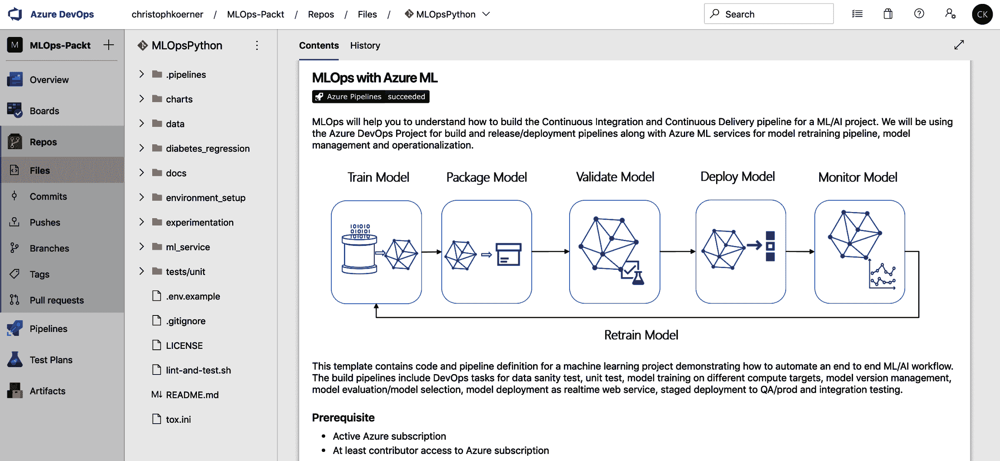
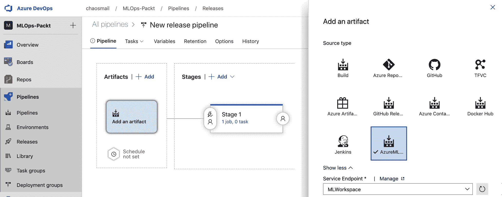
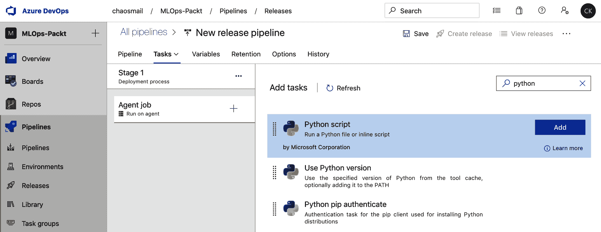
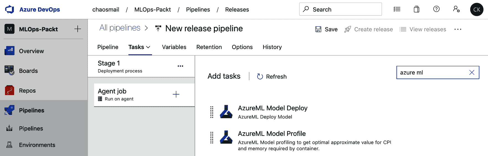

# 用于机器学习的 MLOps - DevOps

在前一章中，我们介绍了在 Azure 中使用自动化 Azure ML 部署进行实时评分服务、使用 Azure 管道进行批量预测服务以及使用 ONNX、FPGAs 和 Azure IoT Edge 作为替代部署目标的**机器学习** ( **ML** )部署。如果您已经阅读了本章之前的所有章节，您将会看到并实现一个完整的端到端 ML 管道，包括数据清理、预处理、标记、实验、模型开发、培训、优化和部署。恭喜你走到这一步！现在，您已经掌握了将 MLOps 的各个部分连接在一起并为 ML 模型创建 DevOps 管道的所有技能。

在本书中，我们强调了如何通过 Bash、PowerShell、Python SDK 或任何其他包装 Azure ML REST 服务的库来编写 ML 培训和部署过程的每一步。对于创建环境、启动和扩展集群、提交实验、执行参数优化以及在 Kubernetes 上部署成熟的评分服务来说都是如此。在本章中，我们将重用所有这些概念来构建一个版本控制的、可重复的、自动化的 ML 培训和部署过程，作为 Azure 中的**持续集成** / **持续部署** ( **CI** / **CD** )管道。

首先，我们将看看如何使用 Azure DevOps 确保可复制的构建、环境和部署。我们将从代码和工件的角度来看这个问题，并决定如何处理这两者，以确保每次构建开始时都训练相同的模型。我们将采用这种方法，并将其映射到注册和版本数据。这将允许您审核您的培训，并随时了解哪些数据用于培训特定的模型。

接下来，我们将看看如何自动验证您的代码和代码质量。您可能已经熟悉了一些应用程序开发的测试技术。然而，我们将把这些技术带到下一个层次，以测试数据集的质量和 ML 部署的响应。

在本章中，我们将讨论以下主题:

*   确保可重复的构建和部署
*   验证您的代码、数据和模型


# 确保可重复的构建和部署

DevOps 有许多不同的含义，但通常是关于在源代码改变时实现快速和高质量的部署。实现高质量可操作代码的一种方法是保证可重复和可预测的构建。虽然对于应用程序开发来说，编译后的二进制文件看起来和行为都很相似，只需要对配置做一些小的修改，但是对于 ML 管道的开发来说，情况就不一样了。

ML 工程师和数据科学家面临的四个主要问题使得构建可重复部署非常困难:

*   开发过程通常在笔记本上进行，因此并不总是线性的
*   存在不匹配的库版本和驱动程序
*   可以更改或修改源数据
*   非确定性优化技术会导致完全不同的输出

我们已经在本书的前几章中讨论过这一点，当实现 ML 模型和数据管道时，你可能已经在很多地方看到了这一点:交互式笔记本，如 Jupyter、JupyterLab、Databricks 笔记本、Zeppelin、Azure 笔记本等等。虽然交互式笔记本具有执行单元来迭代验证模型块的巨大优势，但是它们也经常鼓励用户以非线性顺序运行单元。当试图生产或自动化流水线时，使用笔记本环境的好处变成了痛苦。

ML 中常见的第二个问题是确保安装了正确的驱动程序、库和运行时。虽然在 Python 2 或 3 中运行基于 scikit-learn 的线性回归模型很容易，但如果这些 CUDA、cuDNN、libgpu、OpenMPI、Horovod 和 PyTorch 版本在部署中匹配并工作，就像它们在开发期间一样，就会产生巨大的差异。Docker 在提供可复制的环境方面帮助很大，但是在整个实验、培训、优化和部署过程中使用它并不简单。

许多数据科学家面临的另一个大问题是，数据经常会随着时间而变化。要么在开发过程中添加新的一批数据，要么清除数据，写回磁盘，并重新用作新实验的输入。由于数据在格式、规模和质量上的可变性，在生成可再现的模型时，数据可能是最大的问题之一。考虑数据版本和检查点就像你考虑版本控制源代码一样，这不仅对于可重现的构建是绝对必要的，对于审计也是如此。

使 ML 部署非常困难的最后一个问题是，它们通常包含一个优化步骤，正如在第 8 章、*超参数调整和自动化机器学习*中所讨论的。尽管这种优化(无论是针对模型选择、训练、超参数调整还是堆叠)对于 ML 生命周期至关重要，但如果使用非确定性流程，则会为您的自动部署增加一层不确定性。让我们来看看如何一步一步地解决这些问题。

Azure DevOps 为您提供了一套强大的功能来自动化您的 CI/CD 流程中的一切。一般来说，它允许您在您定义的计算基础架构上运行称为任务的功能块，这些功能块在管道中组合在一起。您可以运行通过版本控制系统中的新提交自动触发的管道，也可以通过按钮手动触发管道；例如，对于半自动部署。构建管道无状态地运行，不输出任何东西，而发布管道是有状态的管道，应该生成工件并将其用于发布和部署。


# 版本控制您的代码

这不是可选的；对您的源代码、数据转换、实验、训练脚本等等使用版本控制是必须的。虽然许多人和组织可能不同意将代码存储在私有的 GitHub、GitLab 或 Bitbucket 存储库中，但您也可以在 Azure DevOps 中创建自己的私有存储库。在 Azure DevOps 中创建新项目会自动为您创建一个新的 Git 存储库。

对代码使用版本控制比使用什么版本控制系统更重要。Git 工作得很好，但 Mercurial 也是如此，我见过有人用 **Subversion** ( **SVN** )工作。但是，熟悉您选择的版本控制系统的基本工作流是非常重要的。在 Git 中，您应该能够创建分支和提交、提交**拉请求** ( **PRs** )、评论和审查请求，以及合并和压缩变更。

这也是力量所在:记录变化。更改您的代码应该会触发一个自动管道来验证和测试您的更改，当成功并合并后，会训练您的模型并将其推广到生产中。您的提交和 PR 历史不仅将成为记录变更的重要来源，而且还将触发、运行和记录这些变更是否已准备好投入生产。

为了有效地使用版本控制，有必要尽可能快地将业务逻辑从交互式笔记本中移除。我建议使用混合方法，首先在笔记本中测试代码实验，然后逐渐将代码转移到每个文件开头导入的模块中。使用自动重新加载插件，您可以确保这些模块在您更改它们时自动重新加载，而不需要重启您的内核。

将代码从笔记本转移到模块不仅会使您的代码在您自己的实验中更加可重用——不需要将实用函数从笔记本复制到笔记本——而且还会使您的提交日志更具可读性。当多人更改一个大型 JSON 文件中的几行代码时(这就是您的笔记本环境存储每个单元的代码和输出的方式)，对文件所做的更改几乎不可能被检查和合并。但是，如果这些更改是在一个模块中进行的——一个只包含可执行代码的独立文件——那么这些更改将更容易阅读、检查、推理和合并。

下面的截图显示了 Azure DevOps 存储库视图，这是所有后续 MLOps 任务的良好起点。请注意，您的源代码不必存储在 Azure DevOps Git 存储库中；您可以使用许多其他流行的代码托管服务，如 GitHub、Bitbucket 或 SVN，甚至可以使用您自己的定制 Git 服务器:



因此，如果您还没有，那么请复习您的 Git 技能，创建一个(私有)存储库，并开始使用版本控制；我们将在接下来的章节中用到它。


# 注册数据的快照

围绕您的训练数据构建一个版本化过程可能是我们将在本节中讨论的最困难的步骤。虽然在版本控制系统中检查任何小且可读(非二进制和非压缩)的数据文件以及您的源代码是相当明显的，但对于大多数数据源来说，非二进制、非压缩或小到足以存储在 Git 中通常不是这样。这就是这一步如此复杂的原因，也是为什么许多机器学习工程师宁愿跳过它，而不是从一开始就正确地完成它。

那么，怎样做才是正确的呢？您可以这样想:无论您何时执行相同的代码，它都应该总是以可预测的方式提取和使用相同的数据——无论您是在今天还是在一年后执行该脚本。第二个约束是，当您更改数据或定型数据的输入源时，您希望确保这些更改反映在版本控制系统中。听起来很简单？

一般来说，我们需要区分操作数据(事务性的、有状态的或可变的)和历史数据(分析性的、分区的或不可变的)。当处理运营数据时，例如，存储客户数据的运营数据库，我们需要在引入数据进行培训之前创建快照。当使用高效的数据格式(比如 Parquet 或 Arrow)和可扩展的存储系统(比如 Azure Blob storage)时，这绝不是一个问题——即使您有多个 TB 的数据。快照可以而且应该是增量的，这样只有新的数据被添加到新的分区中。

当处理历史的、不可变的数据时，如果数据是分区的——即组织在目录中，我们通常不需要创建额外的快照。这将更容易修改输入数据源，使其指向特定范围的分区，而不是直接指向一组文件。

一旦数据就绪，我强烈建议您在开始之前使用 Azure ML 创建数据集的快照。这将创建并跟踪对原始数据的引用，并为您提供一个 pandas 或 PySpark 接口来读取数据。这些数据将定义管道的输入。

无论何时处理数据，使用可预测的占位符来参数化管道都很有帮助。在程序中查找当前日期来确定要写入哪个文件夹不是很有用，因为当遇到错误时，您很可能必须在多天内使用相同的参数执行管道。您应该始终从调用脚本中参数化管道，这样您就可以始终重新运行失败的管道，并且每次都会创建相同的输出。

当使用 Azure DevOps 管道来包装数据预处理、清理和功能工程步骤时。当使用相同的参数调用时，您的管道应该始终创建并最终覆盖相同的输出文件夹。这确保了您的管道保持可再现性，即使连续多天对相同的输入数据执行。

因此，请确保您的输入数据已注册和版本化，并且您的输出数据已注册和参数化。这需要一点小技巧来正确设置，但是对于整个项目生命周期来说是值得的。


# 跟踪您的模型元数据和工件

将您的代码移动到模块中，将其签入版本控制，并对您的数据进行版本控制，这将有助于创建可重现的模型。如果您正在为一个企业构建一个 ML 模型，或者您正在为您的初创公司构建一个模型，了解在您的服务中部署和使用哪个模型和哪个版本是至关重要的。这与审计、调试或解决客户对您的服务预测的询问有关。

我们已经在前面的一些章节中介绍了这一点，希望您现在已经确信，这不仅是有益的，而且对于在模型注册中心中跟踪和版本化您的模型是绝对必要的。模型由工件、训练时生成的文件(例如，模型架构、模型权重等)和元数据(例如，用于训练、验证和测试的数据集快照和版本、用于了解哪个代码生成了模型的提交散列、用于了解在选择模型之前测试了哪些其他参数配置的实验和运行 id 等等)组成。

另一个重要的考虑是指定随机数生成器的种子并对其进行版本控制。在大多数训练和优化步骤中，算法将使用基于随机种子的伪随机数来打乱数据和选择。因此，为了在多次运行代码后生成相同的模型，您需要确保为基于随机化行为的每个操作设置一个固定的随机数种子。

在模型注册中心(例如，在 Azure ML 中)跟踪模型工件的好处是，当工件发生变化时，可以自动触发 Azure DevOps 中的发布管道。下面的截图向您展示了一个 Azure DevOps 发布管道，您可以在其中选择一个或多个机器学习模型作为管道的工件，因此更新注册表中的模型现在可以触发发布或部署管道:



一旦您理解了源代码版本控制对您的应用程序代码的好处，您就会理解它对您的训练模型也很有意义。然而，您现在存储的不是可读的代码，而是模型工件——包含模型权重和架构的二进制文件——以及每个模型的元数据。


# 为您的环境和部署编写脚本

在开发、测试和部署过程中，将您多次做的事情自动化最终会节省您大量的时间。云基础设施和服务(如 Azure ML 和 Azure DevOps)的好处是，它们为您提供了所有必要的工具来轻松自动化每个步骤。有时候，你会得到一个 SDK，有时候，特定的自动化会直接内置到 SDK 中——我们已经看到 ML 部署中的这种情况，在这种情况下，我们可以使用 Azure ML 简单地启动 AKS 集群。

首先，如果您还没有这样做，那么您应该开始将您的 Python 环境组织成`requirements`、`pyenv`或`conda`文件，并且总是从一个干净的标准环境开始您的项目。每当你添加一个包，你把它添加到你的`requirements`文件，并从`requirements`文件重新初始化你的环境。通过这种方式，您可以确保总是安装了来自您的`requirements`文件的库，而不是其他。

Azure DevOps 可以通过在干净的映像上运行集成测试来帮助你做到这一点，你使用的所有工具都需要在测试期间自动安装。这通常是在 Azure DevOps 管道上实现的首批任务之一。然后，每当您向您的版本控制系统签入新代码和测试时，Azure DevOps 管道就会执行，并且还会自动测试您的环境的安装。因此，将集成测试添加到您使用的所有模块中是一个很好的实践，这样您就永远不会错过您环境中的包定义。

以下屏幕截图显示了如何向发布管道添加简单的 Python 任务:



如果您已经阅读了本书的前几章，现在您可能已经明白了为什么我们通过 Python 中的创作环境来完成所有的基础设施自动化和部署。如果你已经编写了这些东西的脚本，你可以简单地在 Azure DevOps 管道中运行和参数化这些脚本。

下一步是编写脚本、配置和自动化基础设施，这通常更难实现。如果你运行一个生成模型的发布管道，你很可能想要为这个工作建立一个新的 Azure ML 集群，这样你就不会干扰其他的发布或构建管道或实验。虽然这种程度的自动化在内部基础架构上很难实现，但您可以在云中轻松实现。许多服务，如 Azure 中的 ARM 模板或 HashiCorp 的 Terraform，可以完全控制您的基础架构和配置。

最后一部分是始终自动化部署，尤其是使用 Azure ML。部署可以通过用户界面完成，我们知道从那里点击和配置正确的模型、计算目标和评分文件很容易。然而，通过代码这样做并不会花费太多时间，并且为您提供了可重复和可再现部署的好处。如果您曾经想知道，无论何时更改模型定义，是否可以简单地将新的评分端点部署到 AKS 集群——或者甚至简单地部署到无代码部署，那么让我告诉您，这正是您应该做的。

你会经常面对用许多不同的方式做同样的事情；例如，通过 CLI、Python、UI 或 Azure DevOps 中的插件从 Azure ML 部署 ML 模型。下面的截图展示了通过 Azure DevOps 中的任务直接部署 ML 模型的包:



然而，我建议您坚持一种做事方式，然后以同样的方式进行所有的自动化和部署。话虽如此，使用 Python 作为部署的脚本语言并在版本控制中检查您的部署代码并不是一件坏事。

可复制的构建和发布管道是关键，它们必须从基础设施和环境级别开始。在云中，尤其是在 Azure 中，这应该非常容易，因为大多数工具和服务都可以通过 SDK 实现自动化。Azure ML 团队在 SDK 中投入了大量的工作，这样你就可以在 Python 中自动化每一部分，从接收到部署。所以，我强烈建议你使用这个功能。

你可以在微软 Github 知识库上找到 Azure MLOps 管道的最新例子:[https://github.com/microsoft/MLOps](https://github.com/microsoft/MLOps)


# 验证您的代码、数据和模型

当实现 CI/CD 管道时，您需要确保您已经准备好所有必要的测试，以便轻松自信地部署您新创建的代码。一旦您运行了一个 CI 或者 CI/CD 管道，自动化测试的威力将会立即显现。它不仅在您开发代码时保护某些代码片段不会失败，而且它还保护您的整个过程—包括环境、数据需求、模型初始化、优化、资源需求和部署—以备将来使用。

在为我们的 ML 过程实现验证管道时，我们遵循经典的应用程序开发原则——单元测试、集成测试和端到端测试。我们可以将这些测试技术直接转化为评分服务的输入数据、模型和应用程序代码。


# 重新思考数据质量的单元测试

单元测试对于编写高质量的代码至关重要。单元测试旨在独立于所有其他代码测试最小的代码单元——一个函数。每个测试应该一次只测试一个东西，并且应该快速运行和完成。许多应用程序开发人员要么在每次更改代码时运行单元测试，要么至少在每次向版本控制提交新的提交时运行单元测试。

下面是一个使用 Python 3 标准库提供的`unittest`模块用 Python 编写的单元测试的简单例子:

```
import unittest

class TestStringMethods(unittest.TestCase):
    def test_upper(self):
        self.assertEqual('foo'.upper(), 'FOO')
```

如您所见，我们运行一个函数，并测试结果是否与预定义的变量匹配。

在 Python 和许多其他语言中，我们区分了帮助我们编写和组织测试的框架和库，以及执行测试和创建报告的库。`pytest`是一个很好的执行测试的库，Tox 也是。`unittest`和`mock`帮助你在类中建立和组织你的测试，并模拟出对其他函数的依赖。

当您为您的 ML 模型编写代码时，您还会发现代码单元可以并且可能应该进行单元测试，并且应该在每次提交时进行测试。然而，机器学习工程师、数据工程师和数据科学家现在在他们的开发周期中处理另一个错误来源:数据。因此，重新思考单元测试在数据处理方面意味着什么是一个好主意。

一旦你掌握了窍门，许多机会就来了。突然，您可以将输入数据要素尺寸视为需要测试以确保其满足要求的单一单元。这一点尤其重要，因为我们总是在考虑收集新数据并在某一点上重新训练模型，如果没有，甚至在收集新的训练数据时继续重新训练它。因此，我们总是希望确保数据是干净的。

因此，当处理随时间变化的数据和实现 CI/CD 管道时，您应该总是测试您的数据以匹配预期的标准。对每个维度进行测试的好方法如下:

*   独特/独特的价值
*   相关性
*   偏斜度
*   最小值/最大值
*   最常见的值
*   包含零的值

您的单元测试可以如下例所示，并且您可以在单独的测试中测试所有单独的需求:

```
import unittest
import pandas as pd

class TestDataFrameStats(unittest.TestCase):  
  def setUp(self):    
    # initialize and load df    
    self.df = pd.DataFrame(data={'data': [0,1,2,3]})  
  def test_min(self):    
    self.assertEqual(self.df.min().values[0], 0)
```

在前面的代码中，我们使用`unittest`在同一个类的多个函数中组织单元测试。每个类可以对应一个特定的数据源，其中我们有包装器测试每个特性维度。设置完成后，我们可以安装`pytest`并简单地从命令行执行`pytest`来运行测试。

在 Azure DevOps 中，我们可以设置`pytest`或`tox`作为构建管道中的一个简单步骤。对于构建管道步骤，我们可以简单地将下面的块添加到`azure-pipelines.yml`文件中:

```
- script: |
    pip install pytest
    pip install pytest-cov
    pytest tests --doctest-modules
  displayName: 'Test with pytest'
```

在前面的代码中，我们首先安装了`pytest`和`pytest-cov`来创建 pytest 覆盖率报告。在下一行中，我们执行了`test`，它现在将使用数据集并计算所有的统计需求。如果测试没有满足需求，测试将会失败，我们将会在这个构建的 UI 中看到这些错误。这为您的 ML 管道增加了巨大的保护，因为现在您可以确保没有不可预见的训练数据问题在您没有注意到的情况下进入发布。

单元测试是必不可少的，对数据的单元测试也是如此。就像一般的测试一样，需要一些初始的努力来实现，这不会立即转化为价值。但是，您很快就会看到，有了这些测试，在更快地部署新模型时，您就可以放心了，因为它会在构建时捕获训练数据中的错误，而不是在模型已经部署时。


# ML 的集成测试

在应用程序开发中，集成测试将多个较小单元的组合作为单独的组件进行测试。您通常使用测试驱动程序来运行测试套件，并模仿或隐藏测试中您不想测试的其他组件。在图形应用程序中，您可以测试一个简单的可视组件，同时模仿该组件与之交互的模块。在后端代码中，您测试您的业务逻辑模块，同时模拟所有相关的持久性、配置和 UI 组件。

因此，集成测试有助于您在将多个单元组合在一起时检测关键错误，而无需花费搭建整个应用程序基础设施的成本。它们位于单元测试和端到端测试之间，通常在 CI 运行时根据提交、分支或拉请求运行。

在 ML 中，我们可以使用集成测试的概念来测试 ML 管道的训练过程。这可以帮助您的培训运行在构建阶段找到潜在的 bug 和错误。集成测试允许您测试您的模型、预先训练的权重、一段测试数据和优化器是否能够产生成功的输出。但是不同的算法需要不同的集成测试来检验训练过程中是否有问题。

在训练深度神经网络模型时，可以用集成测试来测试很多有趣的方面。以下是一个不完整的列表:

*   验证正确的重量初始化
*   核实违约损失
*   验证零输入
*   验证单批配件
*   验证激活
*   验证渐变

使用类似的列表，您可以很容易地捕捉到这样的情况:在正向过程中，所有激活都被限制在最大值(例如，1)，或者在反向过程中，所有梯度都为 0。在使用新的数据集和模型之前，您可以手动进行任何实验、测试或检查，理论上您可以在 CI 运行时连续运行。因此，任何时候您的模型得到重新训练或微调，这些检查会在后台自动运行。

更一般的假设是，在训练回归模型时，默认平均值应该接近平均预测值。训练分类器时，可以测试输出类的分布。在这两种情况下，在开始昂贵的训练和优化过程之前，您可以检测到由于建模、数据或初始化错误而产生的问题。

就运行器和框架而言，您可以选择与单元测试相同的库，因为在这种情况下，集成测试的不同之处仅在于被测试的组件以及它们的组合方式。因此，选择`unittest`、`mock`和`pytest`是搭建您的集成测试管道的流行选择。

集成测试对于应用程序开发和运行端到端的 ML 管道至关重要。如果你能自动发现并避免这些问题，将会为你省去许多担心、麻烦和费用。


# 使用 Azure ML 进行端到端测试

在端到端测试中，我们希望向一个在试运行环境中部署的服务发出请求，并检查服务的结果。为此，我们需要部署完整的服务。端到端测试对于捕捉将所有组件连接在一起时产生的错误以及在不模仿任何其他组件的情况下在试运行或测试环境中运行服务至关重要。

在 ML 部署中，有多个步骤，如果测试不正确，很多事情会变得非常糟糕。让我们放弃那些简单的，我们需要确保环境被正确安装和配置的。Azure ML 部署中更关键的部分是应用程序逻辑本身的代码:评分文件。没有适当的端到端测试，就没有简单的方法来测试评分文件、请求的格式和输出。

正如您可能想象的那样，端到端测试的构建和运行通常非常昂贵。首先，您需要编写代码并部署应用程序来测试代码，这需要额外的工作、精力和成本。然而，这是在类似生产的环境中端到端地真正测试评分端点的唯一方法。

好的一面是，通过使用 Azure ML 部署，端到端测试变得如此简单，以至于它应该成为每个人的管道的一部分。如果模型允许，我们甚至可以在不指定部署目标的情况下进行无代码部署。如果这不可能，我们可以指定一个 ACI 作为计算目标，并独立部署模型。这意味着将前一章的代码封装在 Python 脚本中，并将其作为构建过程中的一个步骤。

端到端测试通常既复杂又昂贵。然而，使用 Azure ML 和自动化部署，模型部署和示例请求可能只是构建管道的一部分。


# 对您的模型进行连续分析

模型分析是实验和训练阶段的一个重要步骤。这将使您很好地理解您的模型在用作评分服务时所需的资源量。这是设计和选择适当规模的推理环境的关键信息。

每当您的训练和优化过程持续运行时，您的模型需求和概要文件可能会发展。如果您对模型堆叠或自动化 ML 进行优化，那么您得到的模型可能会变得更大，以适应新的数据。因此，关注您的模型需求以解释与您最初的资源选择的偏差是有好处的。

幸运的是，Azure ML 提供了一个模型分析接口，您可以用模型、评分函数和测试数据来填充它。它将为您实例化一个推理环境，启动评分服务，通过服务运行测试数据，并跟踪资源利用情况。


# 摘要

在这一章中，我们介绍了 MLOps，一个用于开发、部署和操作 ML 服务的类似 DevOps 的工作流。DevOps 代表了一种快速、高质量的方法，可以对代码进行更改，并将这些更改部署到生产中。

我们首先了解到 Azure DevOps 为我们提供了运行强大的 CI/CD 管道的所有功能。我们既可以运行构建管道，其中的步骤是在 YAML 中编码的，也可以运行发布管道，它们是在 UI 中配置的。发布管道可以有手动或多个自动触发器——例如，版本控制存储库中的提交或者模型注册中心的工件被更新——并为发布或部署创建一个输出工件。

控制代码的版本是必要的，但是仅仅运行适当的 CI/CD 管道是不够的。为了创建可重复的构建，我们需要确保数据集也是版本化的，并且伪随机生成器是用指定的参数播种的。环境和基础设施也应该自动化，并且可以从创作环境中完成部署。

为了保持高质量的代码，您需要向 ML 管道添加测试。在应用程序开发中，我们区分了单元测试、集成测试和端到端测试，它们测试代码的不同部分，或者独立测试，或者与其他服务一起测试。对于数据不断变化或增加的数据管道，单元测试应该测试数据质量以及应用程序中的代码单元。集成测试对于加载模型或者独立于其他组件在模型中执行向前或向后传递非常有用。有了 Azure ML，编写端到端测试变得真正快乐，因为它们可以完全自动化，只需很少的努力和成本。

现在，您已经学习了如何建立连续的管道，可以重新训练和优化您的模型，然后自动构建和重新部署模型到生产中。在最后一章，我们将看看 Azure 中你、你的公司和你的 ML 服务的下一步是什么。