# 一、机器学习模型基础知识

机器学习模型是数学工具，允许我们揭示外部事件的合成表示，目的是更好地理解和预测未来的行为。有时，这些模型只是从理论角度定义的，但研究的进展现在允许我们应用机器学习概念来更好地理解复杂系统的行为，如深度神经网络。在这一章中，我们将介绍并讨论一些基本要素。熟练的读者可能已经知道这些元素，但这里我们提供几种可能的解释和应用。

特别是，在本章中，我们将讨论以下主要元素:

*   定义模型和数据
*   理解好的数据集的结构和属性
*   缩放数据集，包括标量和鲁棒缩放
*   标准化和白化
*   选择训练、验证和测试集，包括交叉验证
*   机器学习模型的特征
*   可学性
*   容量，包括 Vapnik-Chervonenkis 容量
*   偏差，包括欠拟合
*   方差，包括过拟合和克拉美-罗界

# 型号和数据

机器学习模型与数据一起工作。他们创建关联、找出关系、发现模式、生成新样本等等，使用定义良好的数据集，这些数据集是与特定场景(例如，每 5 分钟采样一次的房间温度，或一群人的体重)相关的数据点(例如，观察值、图像或测量值)的同质集合

不幸的是，有时强加在机器学习模型上的假设或条件并不明确，漫长的训练过程可能会导致完全的验证失败。我们可以将模型想象成一个灰箱(许多常见算法的简单性保证了一定的透明度)，其中从数据集提取的矢量输入 *X* 被转换成矢量输出 *Y* :

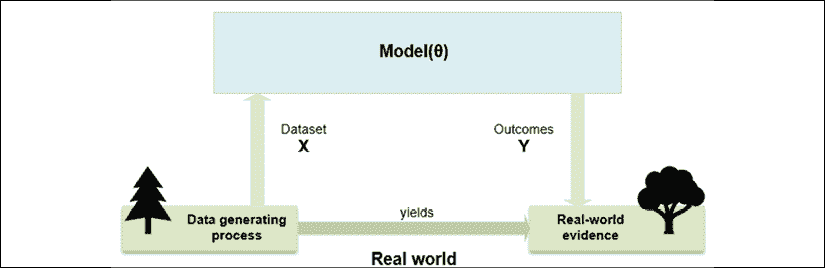

用向量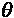参数化的通用模型的模式及其与真实世界的关系

在上图中，模型由一个函数表示，该函数依赖于由向量定义的一组参数。数据集由从现实世界场景中提取的数据表示，模型提供的结果必须反映实际关系的性质。这些条件在逻辑和概率环境中非常强大，其中推断的条件必须反映自然的条件。

出于我们的目的，有必要定义模型:

*   模仿动物的认知功能
*   通过适当的训练，学会产生与环境兼容的结果
*   当出现新样本时，通过输出正确的(或最可能的)结果，学会克服训练集的边界

第一点是人工智能辩论中的一个关键因素。正如达威奇所指出的(在达威奇 a .，*人类水平的智力还是动物般的能力？*《美国计算机学会通讯》(Communications of the ACM)第 61 卷 10/2018)，现代机器学习的成功主要得益于深度神经网络能够重现特定的认知功能(例如，视觉或语音识别)。很明显，这种模型的结果必须基于真实世界的数据，此外，它们必须拥有我们试图复制的动物的认知功能所产生的结果的所有特征。

我们将详细分析这些属性。重要的是要记住，它们不是简单的需求，而是保证人工智能应用在生产环境中成功或失败的支柱(也就是说，在有限和定义良好的数据集的*黄金世界*之外)。

在本节中，我们只考虑参数**T21 模型，尽管有一系列算法被称为**非参数**，因为它们只基于数据的结构；我们将在接下来的章节中讨论其中的一些。**

**参数学习过程**的任务是在给定特定输入 *X* 和输出 *Y* 数据集(或者与误差成比例，如果我们试图最小化误差)的情况下，找到最大化目标函数的最佳参数集，其值与模型的精度成比例。这个定义不是很严格，我们将在下面的部分中改进它；然而，在机器学习的背景下，这是一种介绍我们正在使用的数据的结构和属性的有用方式。

## 数据集的结构和属性

第一个要问的问题是: *X* 和 *Y* 的性质是什么？机器学习问题集中在学习抽象关系，当提供新样本时，抽象关系允许一致的概括。更具体地说，我们可以用相关联的联合概率分布来定义随机数据生成过程:

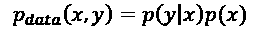

过程 *p* [数据]代表了问题的最广泛和最抽象的表达。例如，必须区分男性和女性肖像的分类器将基于数据生成过程，该过程从理论上定义了所有可能人脸的概率，关于二元属性男性/女性。很明显我们永远不能直接用*p*数据工作；只有在少数有限的情况下(例如，属于一个数据集的所有图像的分布)，才有可能找到一个定义良好的公式来描述*p*数据。

尽管如此，对读者来说，考虑这样一个过程的存在是很重要的，即使当复杂性太高而不允许任何直接的数学建模时。机器学习模型必须考虑这种抽象作为参考。

### 有限的样本人群

在许多情况下，我们无法得到精确的分布，我们被迫使用有限的实际样本。例如，药物实验的目的是了解药物对人类的有效性。显然，我们不能在每一个人身上测试药物，也不能想象包括所有已经死亡和未来的人。然而，有限的样本群体必须仔细选择，以代表潜在的数据生成过程。也就是说，必须考虑所有可能的组、子组和反应。

因为这通常是不可能的，所以有必要从大量人群中取样。即使在最佳情况下，采样也会伴随着信息的丢失(除非我们仅删除冗余)，因此在创建数据集时，我们总是会产生偏差。这种偏差可能是一个很小的、可以忽略的影响，也可能是一个普遍的情况，它错误地描述了较大总体中存在的关系，并极大地影响了模型的性能。因此，数据科学家必须密切关注模型的测试方式，以确保新样本是通过与训练样本相同的过程生成的。如果有明显的差异，数据科学家应该警告最终用户样本中的差异。

因为我们可以假设相似的个体会以相似的方式行为，如果样本集的数量足够大，我们在统计学上有权得出结论，我们可以扩展到人口中更大的未抽样部分。动物非常有能力从一系列样本中识别关键特征，并归纳它们来解释新的经历(例如，婴儿在只看到父母和其他几个人后，学会了区分泰迪熊和人)。机器学习的挑战性目标是使用有限的信息量找到训练模型的最佳策略，找到证明其逻辑过程的所有必要的抽象。

当然，当我们考虑样本总体时，我们总是需要假设它们来自原始的数据生成分布。这不是一个纯理论的假设——正如我们将要看到的，如果我们的样本数据元素来自不同的分布，我们的模型的准确性会大大降低。

例如，如果我们使用 1000 万像素的图像训练一个人像分类器，然后我们在一个配有 100 万像素摄像头的旧智能手机上使用它，我们可以很容易地开始发现我们预测准确性的差异。

这并不奇怪；低分辨率图像捕捉不到许多细节。通过向模型提供非常嘈杂的数据源，可以得到类似的结果，这些数据源的信息内容只能部分恢复。

*N* 值是**独立同分布** ( **i.i.d.** )如果从同一个分布中抽样，两个不同的抽样步骤产生统计上独立的值(即 *p(a，b) = p(a)p(b)* )。如果我们从*p*数据中采样 *N* i.i.d .值，我们可以创建由 k 维实向量组成的有限数据集 *X* :

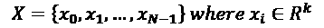

在监督场景中，我们还需要相应的标签(带有 *t* 输出值):

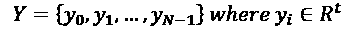

当输出有两个以上的类时，有不同的可能策略来处理这个问题。在经典的机器学习中，最常见的方法之一是**一对一**，这是基于训练 *N* 个不同的二元分类器，其中每个标签都根据所有剩余的标签进行评估。以这种方式，执行 *N-1* 个分类以确定正确的类别。相反，对于浅层和深层神经模型，最好使用 **softmax 函数**来表示所有类别的输出概率分布:

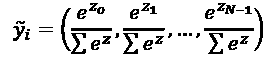

这种输出，其中 *z* [i] 表示中间值，各项之和归一化为 1，可以使用交叉熵成本函数轻松管理，我们将在*第 2 章*、*损失函数和正则化*中讨论。眼尖的读者可能会注意到，计算总体的 softmax 输出可以获得数据生成过程的近似值。

这太棒了，因为一旦模型被成功地训练并得到了肯定的结果，就可以合理地假设与从未见过的样本相对应的输出反映了真实世界的联合概率分布。这意味着模型已经开发了相关抽象的最小误差的内部表示；这是整个机器学习过程的最终目标。

在继续讨论一些基本预处理技术的之前，值得一提的是**域适配**的问题，这是目前正在开发的最具挑战性和最强大的技术之一。

如前所述，动物可以进行抽象，并将在特定环境中学到的概念扩展到类似的新环境中。这种能力不仅重要，而且必要。在许多情况下，一个新的学习过程可能需要太长时间，使动物面临各种风险。

不幸的是，许多机器学习模型缺乏这一特性。他们可以很容易地学会归纳，但总是在处理来自相同数据生成过程的样本的条件下。让我们假设模型 *M* 已经被优化以正确地分类从*p*[1]*【x，y】*中提取的元素，并且最终精度足够大以在生产环境中使用该模型。经过几次测试，一位数据科学家发现 *p* [2] *(x，y) = f(p* [1] *(x，y)*是另一个与 *p* [1] *(x，y)* 有很强类比性的数据生成过程。其样本符合被视为同一全球类别成员的要求。例如， *p* [1] *(x，y)* 可以表示家庭轿车，而*p*[2]*【x，y)* 可以是一个对一组卡车建模的流程。

在这种情况下，很容易理解变换 *f(z)* 实际上负责增加车辆的大小、它们的相对比例、车轮的数量等等。在这一点上，我们的模型 *M* 是否也可以通过利用类比的方式对从*p*[2]*【x，y】*中抽取的样本进行正确分类？总的来说，答案是否定的。观察到的准确性下降，达到纯粹随机猜测的极限。

这个问题背后的原因与模型的数学本质严格相关，在本书中不予讨论(有兴趣的读者可以查看严谨的论文 Crammer K .、Kearns M .、Wortman J .、*从多个来源学习*《机器学习研究杂志》9/2008)。然而，考虑这样的场景是有帮助的。领域自适应的目标是找到最佳方法，让模型从 *M* 转换到*M’*，反之亦然，以便最大化其处理特定数据生成过程的能力。

这是在合理变化的范围内，例如，模型的组件识别轿车和卡车之间的相似性(例如，它们都有挡风玻璃和散热器)，并强制一些参数从其初始配置(其目标是轿车)转移到基于卡车的新配置。这类方法显然更适合于描述认知过程。此外，它还具有巨大的优势，允许出于不同的目的重用相同的模型，而不需要从头开始重新训练它们，这通常是实现可接受的性能的必要条件。

这个主题仍然非常复杂；当然，这对于本书中的完整讨论来说太详细了。因此，除非我们明确声明，否则在本书中，您可以一直假设我们正在使用一个单一的数据生成过程，所有的样本都将从中抽取。

现在，让我们介绍一些重要的数据预处理概念，它们将在许多实际环境中有所帮助。

### 缩放数据集

许多算法(如逻辑回归、**支持向量机** ( **支持向量机**)和神经网络)在数据集具有基于特征的零均值时表现出更好的性能。因此，最重要的预处理步骤之一是所谓的零居中，它包括从所有样本中减去特征方式平均值*E*[X]*【X】*:

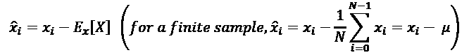

如有必要，该操作通常是可逆的，不会改变样品之间或同一样品的组分之间的关系。在深度学习场景中，以零为中心的数据集允许我们利用一些激活函数的对称性，推动我们的模型更快地收敛(我们将在接下来的章节中讨论这些细节)。

零居中并不总是足以保证所有算法都正确运行。不同的要素可能具有非常不同的标准偏差，因此，考虑参数向量范数的优化(请参见正则化部分)将倾向于以相同的方式处理所有要素。这种平等的待遇可以产生完全不同的最终效果；方差较小的要素比方差较大的要素受影响更大。

同样，当单个要素有助于找到最佳参数时，具有较大方差的要素可以控制其他要素，迫使它们在问题的上下文中变得类似于常数值。这样，那些变化较小的特性就失去了影响最终解决方案的能力(例如，当涉及回归和神经网络时，这个问题是一个常见的限制因素)。因此，如果考虑整个数据集的每个单个特征来计算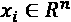、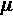和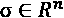，那么用以零为中心的样本除以基于特征的标准偏差通常会有所帮助，从而获得所谓的 z 得分:

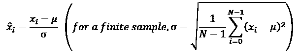

结果是一个变换后的数据集，其中大部分内部关系得以保留，但所有要素的均值和单位方差均为空。当需要将向量重新映射到原始空间时，整个变换是完全可逆的。

我们现在可以分析我们可能为特定任务选择的其他扩展方法(例如，带有离群值的数据集)。

#### 范围缩放

缩放的另一种方法是设置所有特征应该位于的范围。例如，如果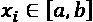使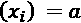和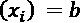，则转换会强制所有值位于新的范围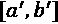内，如下图所示:

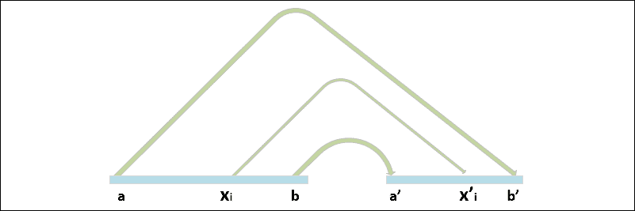

范围缩放的示意图

范围缩放的行为与标准缩放相似，但在这种情况下，新的平均值和新的标准偏差都由选择的间隔决定。特别是，如果原始要素具有对称分布，新的标准差将非常相似，即使不完全相等。因此，通常可以选择这种方法作为标准缩放的替代方法(例如，当它有助于限制范围[0，1]内的所有要素时)。

#### 稳健缩放

前两种方法有一个共同的缺点:它们对异常值非常敏感。事实上，当数据集包含异常值时，它们的存在将影响均值和标准差的计算，使值向异常值移动。另一种可靠的方法是基于分位数的使用。给定一个范围[ *a，b* ]上的分布 *p* ，最常见的分位数，称为中位数，第 50 个百分位数或第二个四分位数( *Q* [2] )，是将范围[ *a，b* 分成两个子集的值，以便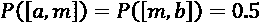。也就是说，在有限的总体中，中位数就是在中心位置的值。

例如，考虑集合 *A* = {1，2，3，5，7，9}，我们有:

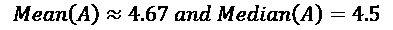

如果我们把值 10 加上集合 *A* ，我们得到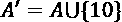:

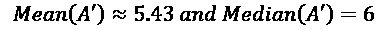

以类似的方式，我们可以定义其他的百分位数。一个用于缩放的常见选择数据是**四分位距** ( **IQR** )，有时称为 *H-spread* ，定义为:

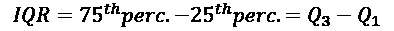

在前面的公式中， *Q* [1] 是分割范围[ *a，b* ]的分界点，因此 25%的值位于子集[ *a，Q* [1] ]中，而 *Q* [2] 分割范围，因此 75%的值位于子集[ *a，Q*[2]中考虑到前面设定的*A’*，我们得到:]

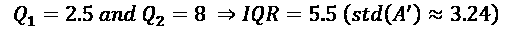

根据这些定义，很容易理解 IQR 对异常值的敏感度很低。实际上，让我们假设一个特征位于范围[-1，1]内，没有异常值。在更大的数据集中，我们观察区间[-2，3]。如果该效应是由于异常值的存在(例如，新值 10 加到 *A* 上)，它们的数量比正常点的数量小得多，否则它们就是实际分布的一部分。因此，我们可以通过设置适当的分位数将它们从计算中剔除。例如，我们可能希望从计算中排除所有概率低于 10%的特征。在这种情况下，我们需要考虑双尾分布中的第 5 个^第和第 95 个^第百分位数，并使用它们的差值 *QR* = 95 个^第–5 个^第。

考虑集合*A’*，我们得到 *IQR* = 5.5，而标准差为 3.24。这意味着标准缩放对值的压缩小于鲁棒缩放。随着我们增加分位数范围，这种影响会变得越来越大(例如，使用第 95 个^(和第 5 个^(百分位数，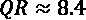)。然而，重要的是要记住，这种技术不是一种离群值过滤方法。包括异常值在内的所有现有值都将被缩放。唯一的区别是异常值被排除在参数的计算之外，因此它们的影响减少了，或者完全消除了。))

鲁棒缩放程序与标准程序非常相似，转换值使用特征公式获得:

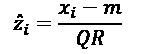

其中 *m* 是中位数，而 *QR* 是分位数范围(例如，IQR)。

在我们讨论其他技术之前，让我们使用包含 200 个点的数据集来比较这些方法，这些点是用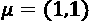和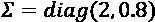从多元高斯分布中采样的:

```py
import numpy as np
nb_samples = 200
mu = [1.0, 1.0]
covm = [[2.0, 0.0], [0.0, 0.8]]
X = np.random.multivariate_normal(mean=mu, cov=covm, size=nb_samples)
```

此时，我们采用以下 scikit-learn 类:

*   `StandardScaler`，其主要的参数是`with_mean`和`with_std`，都是布尔值，表示算法是否应该零中心，是否应该除以标准差。默认值都是`True`。
*   `MinMaxScaler`，其主要的参数是`feature_range`，需要一个元组或者两个元素的列表( *a，b* )使得 *a < b* 。默认值为(0，1)。
*   `RobustScaler`，主要是基于参数`quantile_range`的。默认值为(25，75)对应于 IQR。与`StandardScaler`类似，该类接受参数`with_centering`和`with_scaling`，它们有选择地激活/停用这两个函数。

在我们的例子中，我们对`StandardScaler`、`MinMaxScaler`和`quantile_range=(10, 90)`使用默认配置:

```py
from sklearn.preprocessing import StandardScaler, RobustScaler, MinMaxScaler
ss = StandardScaler()
X_ss = ss.fit_transform(X)
rs = RobustScaler(quantile_range=(10, 90))
X_rs = rs.fit_transform(X)
mms = MinMaxScaler(feature_range=(-1, 1))
X_mms = mms.fit_transform(X)
```

结果如下图所示:

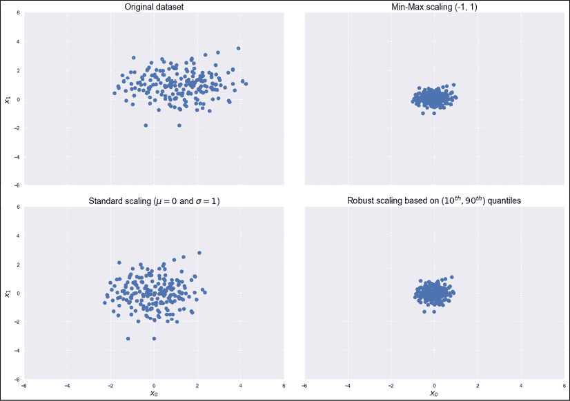

原始数据集(左上)、范围缩放(右上)、标准缩放(左下)和稳健缩放(右下)

为了分析的差异，我对所有的图表都保持了相同的比例。正如可能看到的，标准缩放执行均值移动并调整点，以便可以认为它们是从 *N* ( *0，I* )中提取的。范围缩放的行为方式几乎相同，在这两种情况下，很容易看出方差是如何受到一些异常值的负面影响的。

特别是，查看范围缩放的结果，形状类似于一个椭圆，圆度——由对称分布暗示——通过包含异常值获得。相反，鲁棒缩放能够产生几乎完美的正态分布 *N* ( *0，I* )，因为离群值被排除在计算之外，只有*中心*点对缩放因子有贡献。

我们可以用一个通用的经验法则来总结这一部分:标准缩放通常是首选。当有必要将值投影到特定范围时，或者当它有助于创建稀疏性时，范围缩放可以作为一种有效的替代方法。如果数据集的分析突出显示了异常值的存在，并且任务对不同方差的影响非常敏感，则稳健缩放是最佳选择。

#### 正常化

一种特殊的预处理方法被称为**归一化**(不要与统计归一化混淆，统计归一化是一种更复杂和更通用的方法)，包括将每个向量转换成具有给定预定义范数的单位范数的对应向量(例如，*L*2):

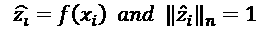

给定一个以零为中心的数据集 *X* ，包含点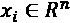，使用*L*2(或欧几里德)范数的归一化将每个值转换为位于具有单位半径的超球表面上的点，并以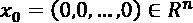为中心(根据定义，表面上的所有点都具有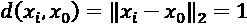)。

与其他方法相反，归一化数据集会导致投影中现有关系仅根据角距离保持不变。为了理解这个概念，让我们使用带有参数`norm='l2'`的 scikit-learn 类`Normalizer`对上一个示例中定义的数据集进行规范化:

```py
from sklearn.preprocessing import Normalizer
nz = Normalizer(norm='l2')
X_nz = nz.fit_transform(X)
```

结果如下图所示:

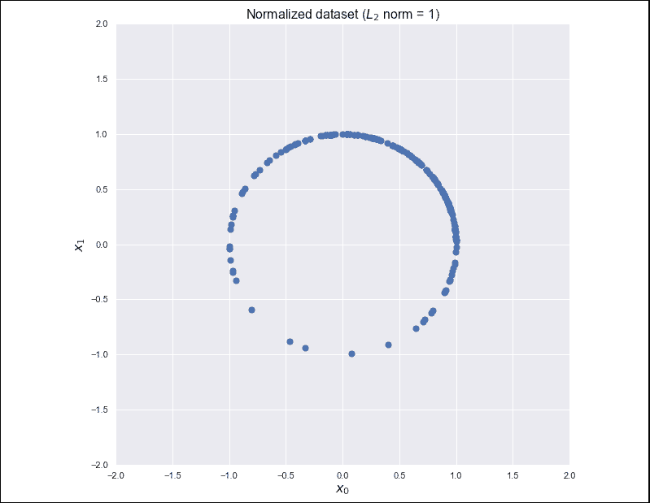

标准化二维数据集。所有点都在单位圆上

正如我们所料，所有的点现在都位于单位圆上。此时，读者可能会问这样的预处理步骤会有什么帮助。在某些上下文中，比如**自然语言处理** ( **NLP** )，两个特征向量与其形成的角度成比例不同，而对欧氏距离几乎不敏感。

例如，让我们假设前面的图定义了四个语义不同的概念，它们位于四个象限中。特别是，想象相反的概念(例如，冷与暖)位于相反的象限，这样最大距离由一个角度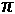弧度(180°)确定。反之，两个角很小的点总是可以认为是相似的。

在这种常见的情况下，我们假设概念之间的过渡是*语义平滑*，那么属于不同集合的两个点总是可以根据它们的共同特征进行比较的(例如，冷暖之间的界限可以是温度是两组之间的平均值的点)。唯一需要知道的重要事情是，如果我们沿着圆移动远离一个点，增加角度，不相似性增加。出于我们的目的，让我们考虑在原始分布中几乎正交的点(-4，0)和(-1，3):

```py
X_test = [
    [-4., 0.],
    [-1., 3.]
]
Y_test = nz.transform(X_test)
print(np.arccos(np.dot(Y_test[0], Y_test[1])))
```

前面代码片段的输出是:

```py
1.2490457723982544
```

两个向量*x*1 和*x*2 的点积等于:

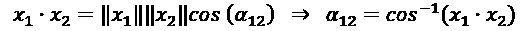

最后一步源于两个向量都有单位范数的事实。所以它们投影后形成的角度几乎是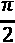，说明它们确实是正交的。如果把向量乘以一个常数，它们的欧氏距离会明显变化，但归一化后的角距离不变。我邀请你来检查一下！

因此，我们可以完全摆脱相对欧几里得距离，只处理角度，当然，角度必须与适当的相似性度量相关。

### 美白

另一个非常重要的预处理步骤被称为**白化**，这是对以零为中心的数据集施加恒等协方差矩阵的操作:

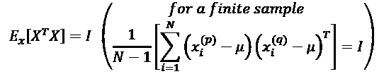

由于协方差矩阵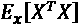是实数且对称的，因此可以对其进行特征分解，而无需对特征向量矩阵求逆:

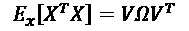

矩阵 *V* 包含作为列的特征向量，对角矩阵包含特征值。为了解决这个问题，我们需要找到一个矩阵*一个*，这样:

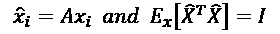

使用之前计算的特征分解，我们得到:

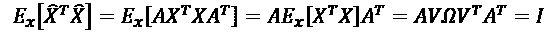

因此，矩阵 *A* 是:

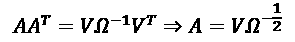

白化的主要优势之一是数据集的去相关性，这允许更容易地分离组件。此外，如果 *X* 被白化，则由矩阵 *P* 引起的任何正交变换也被白化:

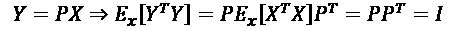

而且，许多需要估计与输入协方差矩阵严格相关的参数的算法可以从白化中受益，因为它减少了独立变量的实际数量。一般来说，这些算法处理在应用白化后变得对称的矩阵。

深度学习领域的另一个重要优势是，梯度通常在原点周围较高，在激活函数(例如，双曲正切或 sigmoid)饱和的那些区域降低(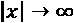)。这就是为什么白化数据集(以零为中心)的收敛速度通常更快。

在下图中，可以比较**原始数据集**和**白化**的结果，在这种情况下，这两个数据集都是以零为中心的，并且具有相同的协方差矩阵:

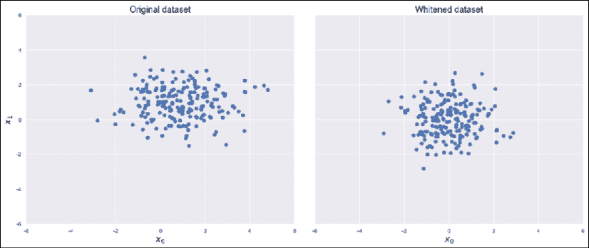

原始数据集(左)和白化版本(右)

当需要美白的时候，考虑一些重要的细节是很重要的。第一种是真实样本协方差与估计值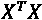之间存在尺度差异，通常采用与**奇异值分解** ( **SVD** )。第二个问题涉及许多框架实现的一些公共类，比如 scikit-learn 的`StandardScaler`。事实上，虽然零居中是基于特征的操作，但是需要考虑整个协方差矩阵来计算白化滤波器;`StandardScaler`仅实现单位方差和特征缩放。

幸运的是，所有能够受益于白化预处理步骤的 scikit-learn 算法都提供了一个内置特性，因此通常不需要进一步的操作。然而，对于所有想直接实现一些算法的读者，我写了两个 Python 函数，可以用于零中心和白化。他们假设一个矩阵 *X* 具有一个形状( *N* [个样本] *× n* )。此外，`whiten()`函数接受参数`correct`，这允许我们应用缩放校正。`correct`的默认值为`True`:

```py
import numpy as np
def zero_center(X):
    return X - np.mean(X, axis=0)
def whiten(X, correct=True):
    Xc = zero_center(X)
    _, L, V = np.linalg.svd(Xc)
    W = np.dot(V.T, np.diag(1.0 / L))
    return np.dot(Xc, W) * np.sqrt(X.shape[0]) if correct else 1.0
```

### 训练、验证和测试集

正如我们之前讨论过的，一个项目可用的样本数量总是有限的。因此，通常需要将初始集合 *X* 连同 *Y* 分割成两个或三个子集，每个子集包含从 *p* 数据中采样的 *N* i.i.d .元素，如下所示:

*   **用于训练模型的训练集**
*   **验证集**用于评估模型的得分，没有任何偏见，样本以前从未见过
*   **测试装置**用于在进入生产前执行最终验证

拆分过程的层次结构如下图所示:

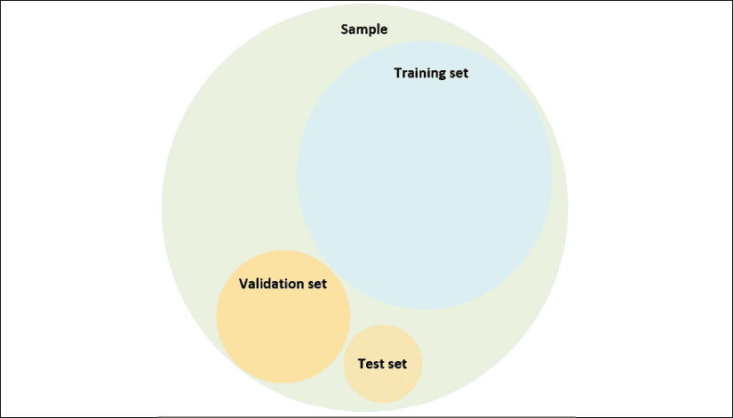

用于创建训练集、验证集和测试集的流程的层次结构

考虑到前面的图表，一般来说，我们有:

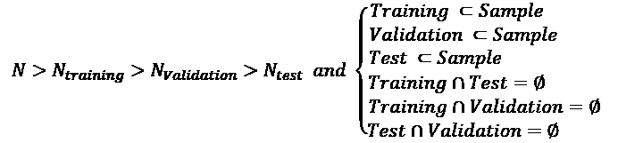

样本是潜在完整人群的子集，部分不可及。因此，我们需要将我们的分析限制在包含 N 个元素的样本上。训练集和验证/测试集是不相交的(也就是说，使用训练阶段从未见过的样本进行评估)。

测试集通常通过从初始验证集中移除 *N* [测试]样本并在最终评估前将它们分开来获得。这个过程非常简单:

1.  型号 *M* 使用训练装置进行训练
2.  *M* 使用验证集和指定得分()函数进行评估
3.  If Score(*M*) > Desired accuracy:

    执行最终测试以确认结果

4.  否则，修改超参数，过程重新开始

由于模型总是对训练过程中未采用的样本进行评估，因此 Score()函数可以确定模型开发的泛化能力的质量。相反，使用训练样本执行的评估可以帮助我们了解模型是否基本上能够学习数据集的结构。我们将在接下来的几节中进一步讨论这些概念。

使用两个(训练和验证)或三个(训练、验证和测试)集合的选择通常与具体环境有关。在许多情况下，在整个过程中使用一个单独的验证集，通常称为测试集。这通常是因为最终目标是获得一组可靠的 i.i.d .元素，这些元素永远不会用于训练，因此，它们的预测结果反映了模型的无偏准确性。在本书中，我们将总是采用这种策略，使用表达式*测试集*而不是*验证集*。

根据问题的性质，可以选择 70%–30%的分割百分比，这在数据集相对较小的机器学习中是一种很好的做法，或者对于样本数量非常多的深度学习任务，可以选择 80%、90%或高达 99%的更高训练百分比。在这两种情况下，我们都假设训练集包含我们进行一致归纳所需的所有信息。

在许多简单的情况下，这是真的，很容易被验证；但是对于更复杂的数据集，这个问题变得更加困难。即使我们从同一分布中抽取所有样本，随机选择的测试集也可能包含其他训练样本中不存在的特征。当这种情况发生时，它会对全局准确性产生非常负面的影响，并且在没有其他方法的情况下，它也很难识别。

这就是为什么在深度学习中，训练集非常庞大的原因之一:考虑到生成分布的数据的特征和结构的复杂性，选择大型测试集可能会限制学习特定关联的可能性。这是过度拟合效应的结果，我们将在本章后面讨论。

在 scikit-learn 中，可以使用`train_test_split()`函数分割原始数据集，该函数允许指定训练/测试大小，以及我们是否期望随机洗牌(这是默认设置)。例如，如果我们想将`X`和`Y`分开，70%训练，30%测试，我们可以使用:

```py
from sklearn.model_selection import train_test_split
X_train, X_test, Y_train, Y_test = train_test_split(X, Y, train_size=0.7, random_state=1000)
```

为了减少样本之间的相关性，打乱集合总是一种好的做法(方法 train_test_split 有一个名为 shuffle 的参数，它允许自动完成这个操作)。事实上，我们已经假设`X`由 i.i.d .样本组成，但往往两个后续样本具有很强的相关性，这降低了训练性能。在某些情况下，在每个训练时段之后重新洗牌也是有用的；然而，在我们的大多数例子中，我们将在整个过程中使用同一个混洗的数据集。

在处理有记忆的序列和模型时，必须避免混排。在所有这些情况下，我们需要利用现有的相关性来确定未来的样本是如何分布的。每当需要额外的测试集时，总是可以重用相同的功能:将原始测试集分割成一个更大的组件，它成为实际的*验证集*，以及一个更小的组件，新的*测试集*，它将用于最终的性能检查。

当使用 NumPy 和 scikit-learn 时，将随机种子设置为一个常量值总是一个好的做法，以便允许其他人使用相同的初始条件来重现实验。这可以通过调用`np.random.seed(...)`并使用许多 scikit-learn 方法中的`random-state`参数来实现。

### 交叉验证

**交叉验证** ( **CV** )技术提供了一种检测错误选择测试集问题的有效方法。特别是，我们将使用 **K 倍**交叉验证方法。想法是将整个数据集 *X* 分成一个移动的测试集和一个由剩余部分组成的训练集。测试集的大小由折叠数决定，因此在 *k* 次迭代期间，测试集覆盖整个原始数据集。

在下图中，我们看到了该流程的示意图:

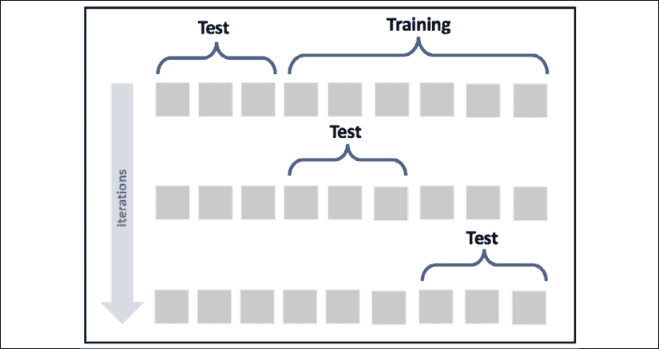

k 重交叉验证模式

这样，我们可以使用不同的采样分裂来评估模型的准确性，并且可以在更大的数据集上执行训练过程；特别是在 *(k-1)N 个*样本上。在理想的情况下，所有迭代中的精度应该非常相似；但在大多数真实案例中，准确率却远低于平均水平。

这意味着已经建立了训练集，排除了包含所有必要示例的样本，以使模型适合考虑真实*p*数据的分离超曲面。我们将在本章后面讨论这些问题。然而，如果精确度的标准偏差太大，必须根据问题/模型的性质设置阈值，这可能意味着 *X* 没有从 *p* [数据]中统一提取，在预处理阶段评估异常值的影响是有用的。在下图中，我们看到了对逻辑回归进行的 15 倍 CV 图:

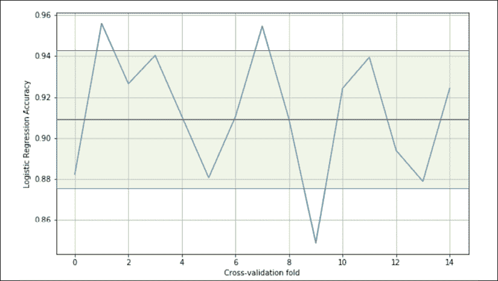

交叉验证准确度

数值在 0.84 到 0.95 之间波动，平均值为 0.91，在图表上标记为水平实线。在这种特殊情况下，考虑到最初的目的是使用线性分类器，我们可以说所有的折叠都产生高精度，从而确认数据集是线性可分的；然而，有一些在第九次折叠中被排除的样本，是达到大约 0.88 的最低精度所必需的。

**K-Fold** 交叉验证有不同的变体，可以用来解决特定的问题:

*   **分层 K-Fold** :标准 K-Fold 方法分割数据集时不考虑概率分布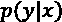，因此一些 Fold 理论上可能只包含有限数量的标签。相反，分层 K-Fold 试图分割 *X* ，以便所有的标签被同等地表示。
*   **留一法** ( **LOO** ):这种方法是最激烈的，因为它创建了 *N 个*折叠，每个折叠包含 *N-1 个*训练样本，并且只有一个测试样本。这样，最大可能数量的样本被用于训练，并且很容易检测算法是否能够以足够的精度学习，或者是否采用另一种策略更好。
*   这种方法的主要缺点是必须训练 *N* 模型，当 *N* 非常大时，这可能会导致性能问题。还有一个问题是，对于大量的样本，两个随机值相似的概率会增加，因此许多折叠将产生几乎相同的结果。同时，LOO 限制了评估模型泛化能力的可能性，因为单个测试样本不足以进行合理的估计。
*   **剔除** ( **LPO** ):在这种情况下，测试样本的数量被设置为 *p* 不相交集合，因此折叠数等于 *n* 除以 *p* 的二项式系数。这种方法减轻了 LOO 的缺点，它是 K-Fold 和 LOO 之间的一种权衡。折叠次数可以很高，但是可以通过调整测试样品的数量 *p* 来控制；但是如果 *p* 不够小或者不够大，二项式系数会指数式的*爆发*，如下图 *n=20* 和的情况:


当 *p* 约为 *n* 的一半时二项式系数的爆炸效应

Scikit-learn 实现了所有这些方法，还有一些其他的变化，但是我建议总是使用`cross_val_score()`函数，它是一个助手，允许将不同的方法应用于特定的问题。它使用**分层 K 倍**进行分类，使用**标准 K 倍**进行所有其他情况。现在让我们尝试确定折叠的最佳数量，给定包含 500 个点的数据集，具有冗余、内部非线性，并且属于 5 个类别:

```py
from sklearn.datasets import make_classification
from sklearn.preprocessing import StandardScaler
X, Y = make_classification(n_samples=500, n_classes=5, 
                           n_features=50, n_informative=10, 
                           n_redundant=5, n_clusters_per_class=3, 
                           random_state=1000)
ss = StandardScaler()
X = ss.fit_transform(X)
```

作为探索性的第一步，让我们用一个有 10 个分裂的分层 K 折叠来绘制学习曲线；这保证了我们将在每个文件夹中有一个统一的类分布:

```py
import numpy as np
from sklearn.linear_model import LogisticRegression
from sklearn.model_selection import learning_curve, StratifiedKFold
lr = LogisticRegression(solver='lbfgs', random_state=1000)
splits = StratifiedKFold(n_splits=10, shuffle=True, random_state=1000)
train_sizes = np.linspace(0.1, 1.0, 20)
lr_train_sizes, lr_train_scores, lr_test_scores = \
    learning_curve(lr, X, Y, cv=splits, train_sizes=train_sizes,
                   n_jobs=-1, scoring='accuracy', 
                   shuffle=True, random_state=1000)
```

结果如下图所示:


逻辑回归分类的学习曲线

当训练集大小达到其最大值时，训练曲线衰减，并收敛到略大于 0.6 的值。这种行为表明该模型无法完全捕获`X`的动态，并且仅当训练集规模非常小时(即，实际数据生成过程未被完全覆盖)才具有良好的性能。相反，当训练集较大时，测试性能会提高。这是分类器在使用越来越多的点时获得的*更广泛经验*的明显结果。

考虑到训练和测试准确性趋势，我们可以得出结论，在这种情况下，大于约 270 点的训练集不会产生任何明显的好处。另一方面，由于测试精度极其重要，所以最好使用最大点数。正如我们将在本章后面讨论的，它表明了模型的泛化能力。在这种情况下，平均训练精度更差，但测试精度有一点好处。我选择这个例子是因为这是一个需要权衡的特殊例子。在许多情况下，曲线成比例增长，确定最佳折叠数很简单。

然而，当问题更难时，就像在这种情况下——考虑到分类器的性质——选择并不明显，分析学习曲线成为不可或缺的步骤。在继续之前，我们可以试着总结一下规律。我们需要找到最佳的折叠数，这样交叉验证可以保证性能的无偏测量。

由于数据集 *X* 是从底层数据生成过程中提取的，因此 *X* 携带的信息量受到*p*数据的限制。这意味着数据集大小的增加超过某个阈值只会引入冗余，而不会提高模型的性能。通过考虑训练和测试平均精度稳定的点，可以确定最佳折叠数或折叠大小。相应的训练集大小允许我们使用最大可能的测试样本大小进行性能评估。现在让我们计算不同折叠数的平均 CV 精度:

```py
import numpy as np
from sklearn.linear_model import LogisticRegression
from sklearn.model_selection import cross_val_score
mean_scores = []
cvs = [x for x in range(5, 100, 10)]
for cv in cvs:
    score = cross_val_score(LogisticRegression(solver='lbfgs', 
                            random_state=1000), 
                            X, Y, scoring='accuracy', n_jobs=-1, 
                            cv=cv)
    mean_scores.append(np.mean(score))
```

结果如下图所示:


不同折叠数的平均交叉验证准确度

该曲线具有对应于 15 倍 CV 的峰值，这对应于 466 个点的训练集大小。在我们之前的分析中，我们发现这个值接近最佳值。另一方面，更多的折叠意味着更小的测试集。

我们已经看到，平均 CV 准确性取决于训练集和测试集大小之间的权衡。因此，当折叠次数增加时，我们应该期待性能的改善。这个结果在 85 次折叠后变得清晰。在这种情况下，只有 6 个样本用于测试目的(1.2%)，这意味着验证不是特别可靠，平均值与非常大的方差相关(即，在一些*幸运*的情况下，CV 准确度可以很大，而在其余的情况下，CV 准确度可以接近 0)。

考虑到所有因素，最佳选择仍然是 *k=15* ，这意味着使用 34 个测试样本(6.8%)。我希望很清楚对 *k* 的正确选择本身就是一个问题；然而，在实践中,[5，15]范围内的值通常是最合理的缺省选择。一个好的选择的目标也是最大化 CV 的随机性，从而减少估计值之间的互相关。非常小的褶皱意味着许多模型高度相关，而过大的褶皱会降低模型的学习能力。因此，一个好的折衷方案不应该选择非常小的值(仅当数据集非常小时才可接受)或过大的值。

当然，这个值与任务的性质和数据集的结构密切相关。在某些情况下，仅仅 3-5%的测试点就足以进行正确的评估；在许多其他情况下，需要一个更大的数据集来捕捉所有区域的动态。

一般来说，我总是鼓励使用 CV 来衡量表现。这种方法的主要缺点是计算复杂。例如，在深度学习的背景下，训练过程可能需要几个小时或几天，并且在不对超参数进行任何修改的情况下重复它可能是不可接受的。在所有这些情况下，将使用标准的训练-测试集分解，假设两个集的数量足够大，以保证*完全覆盖底层数据生成过程*。

# 机器学习模型的特征

在本节中，我们将主要考虑监督模型，尽管我们将讨论的概念通常是有效的。我们将尝试确定如何测量一个模型的理论潜在准确性，以及一个模型对从*p*数据中抽取的每个可能样本进行正确概括的能力。

这些概念中的大多数都是在*深度学习时代*之前很久开发的，但是仍然对研究项目有着巨大的影响。

例如，能力的概念是一个开放性的问题，神经科学家一直在问自己关于人类大脑的问题。拥有几十层、几百万个参数的现代深度学习模型，从数学的角度重新开启了这个理论问题。与此同时，其他元素，如估计量方差的限制，再次吸引了人们的注意，因为算法变得越来越强大，曾经被认为远不可行的性能现在已经成为现实。

能够训练一个模型，以便利用其全部能力，最大限度地提高其泛化能力，并提高其准确性，甚至超越人类的表现，这是现代数据科学家或深度学习工程师应该从他们的工作中期待的。

## 可学性

在开始讨论模型的特征之前，介绍一些与可学习性概念相关的基本元素是有帮助的，这与一般可计算函数的数学定义没有太大的不同。关于这一点的第一部正式著作由 Valiant 发表(在 Valiant L .，*A theory of the learnible，Communications of the ACM，27，1984* )，并且主要是对**的概念的介绍，可能是近似正确的** ( **PAC** )学习。我们不会在本书中讨论 PAC 学习的非常技术性的数学细节，但了解找到一种描述学习过程的合适方法的可能性是有用的，无需参考具体的模型。

为了简单起见，让我们假设我们有一个选择器算法，可以在集合 *H* 中搜索假设*H*I。根据上下文，该元素可以有多种解释。例如，**组假设**可能对应于一个模型的一组合理参数，或者，在另一个场景中，对应于为解决特定问题而调整的一组有限的算法。由于定义是通用的，我们不必担心它的结构。

在这风景的另一边，有我们想要学习的**组概念** *C* 。概念是属于已定义类别的问题的实例。同样，结构可以变化，但为了简单起见，读者可以假设一个概念与包含有限个数据点的经典训练集相关联。

出于我们的目的，有必要定义一个误差度量的结构(我们将在稍后讨论成本和损失函数时进行)。如果您不熟悉这个概念，可以考虑错误分类数据点的归一化平均数。

如果样本大小为 *N* ，误差等于 0 意味着没有错误分类，而误差等于 1 意味着所有样本都被错误分类。正如 AUC 图一样，在二元分类器中，我们将阈值 0.5 视为下限，因为它对应于标签的随机选择。

一个非正式的定义是，如果给定一个期望的最大误差和概率，有可能为每个概念设置一个最小样本大小 *N* ，那么一个选择器算法可以找到一个假设，使得误差被上界的概率大于，那么这个问题就是 PAC 可学习的。

由于问题通常是随机的，结果必须用概率来表示。这意味着我们可以总结前面的定义，说对于一个 PAC 可学习的问题，。我们还需要补充的是，我们期望样本具有多项式增长，作为和的函数。相对于原来的条件，这个条件可以放宽，但是只要理解一个需要无限样本量来达到大于 0 的误差的问题是 PAC 不可学习的就足够了。

这一特征证明了在定义中使用单词*近似*的合理性，如果没有完全数学定义，这可能会导致误解。在我们的背景下，事实上，我们很少处理确定性问题，它们一般不需要机器学习算法。更有帮助的是知道获得小误差的概率总是大于预定义的阈值。即使理论要复杂和严谨得多，我们也可以避开所有的理论细节(在前面提到的 Valiant 的论文中可以找到)，把我们的分析限制在这个概念的具体意义上。

给定一个问题，我们通常可以找到一个模型，它可以学习相关的概念，并保持精确度高于最小可接受值。这相当于说这个概念是 PAC 可学习的，这是一个我们尚未证明的条件，但可以合理地假设这在大多数现实生活中是正确的。因此，将 PAC 的可学性视为理所当然，我们知道我们可以达到特定场景的期望精度。

然而，为此付出的代价并不容易评估。当然，当需求变得越来越强时，我们也需要更大的训练集和更强大的模型，但这足以实现最佳结果吗？此外，是否有可能用一个单一的衡量标准来量化结果的最优程度？在接下来的部分中，我们将介绍在定义或评估每个机器学习模型时必须评估的元素。

## 模型的容量

如果我们将监督的模型视为一组参数化的函数，我们可以将**表示能力**定义为某个通用函数映射相对大量的数据分布的内在能力。为了理解这个概念，让我们考虑一个承认无穷导数的函数 *f(x)* ，并将其重写为围绕一个起点*x*0 的泰勒展开式:


我们可以决定只取前 *n* 项，这样就有一个围绕起始点*x*0= 0 的 *n* 次多项式函数:


考虑一个简单的二维场景，有六个函数，从一个线性函数开始。我们可以通过一小组数据点来观察不同的行为:


六条多项式分离曲线产生的不同行为

快速改变曲率的能力与度数成正比。如果我们选择线性分类器，我们只能修改它的斜率(这个例子总是在二维空间中)和截距。

相反，如果我们选择一个更高次的函数，我们就有更多的可能性在必要的时候*弯曲*曲率。如果我们考虑图中的 **n=1** 和 **n=2** (在右上方，它们是第一和第二函数)，用 **n=2** ，我们可以包含 *x=11* 对应的点，但是这个选择对 *x=5* 处的点有负面影响。

只有参数化的非线性函数才能有效解决这个问题。这是因为这个简单的问题需要比线性分类器提供的更高的表示能力。另一个经典的例子是异或函数。长期以来，一些研究人员反对**感知器**(线性神经网络)，因为它们无法对异或函数生成的数据集进行分类。

幸运的是，引入具有非线性功能的**多层感知器** ( **MLP** )，使我们能够克服这个问题，以及许多其他问题，这些问题的复杂性超出了任何经典机器学习模型的可能性。为了更好地理解这个概念，引入一种形式主义是有帮助的，它允许我们理解不同的模型族如何处理同一类问题，实现更好或更差的准确性。

### Vapnik-Chervonenkis 容量

**Vapnik-Chervonenkis 理论**提供了分类器容量的通用数学形式。为了介绍的定义，首先需要定义**粉碎**的概念。如果我们有一个类集合 *C* 和一个集合 *M* ，我们说 *C* 粉碎 *M* ，如果:


换句话说，给定 *M* 的任意子集，它可以作为*C(C*jT43)和 *M* 本身的一个特定实例的交集来获得。现在，如果我们将模型视为参数化函数:


考虑到、 *C* 的可变性，可以认为是一组结构相同但参数不同的函数:


我们希望确定该模型系列相对于有限数据集 *X* 的容量:


根据 Vapnik-Chervonenkis 理论，如果每个可能的标签分配都没有分类错误，我们可以说模型族 *C* 分解 *X* 。因此，我们可以将**VAP Nik-Chervonenkis-capacity**或**VC-capacity**——有时也称为**VC-dimension**——定义为 *X* 的一个子集的最大基数，这样任何一个都可以粉碎它(即可以粉碎的最大点数)。

例如，如果我们考虑二维空间中的线性分类器，VC 容量等于 3，因为总是有可能标记三个样本，以便粉碎它们。但是，不可能在所有情况下都做到 *N > 3* 。XOR 问题就是一个需要大于 3 的 VC 容量的例子。下面我们来探讨一下剧情:


不同分离曲线的异或问题

这种特殊的标签选择使得该集合是非线性可分的。克服这个问题的唯一方法是使用高阶函数，或者非线性函数。曲线——属于 VC 容量大于 3 的分类器——可以将左上和右下区域与剩余空间分开，但没有直线可以做到这一点，尽管它总是可以将一个点与其他三个点分开。

这个容量定义相当严格(对所有理论方面感兴趣的读者可以阅读 Mohri M .，Rostamizadeh A .，Talwalkar A .，*机器学习基础*，第二版，麻省理工学院出版社，2018)，但它可以帮助理解数据集的复杂性和合适的模型族之间的关系。根据**奥卡姆剃刀**原理，必须选择获得最优精度的最简单模型(即量化算法性能的最优测度集)，在本书中，我们将多次重复这一原理。然而，这一建议的原因与 PAC 学习的非正式定义密切相关，在介绍了估计量的偏差和方差的概念后将变得显而易见。

## 估计量的偏差

现在让我们考虑一个带有单个矢量参数的参数化模型。这不是一个限制，只是一个教导性的选择:


学习过程的目标是估计参数，以便例如最大化其分类的准确性。我们定义估计量相对于参数的**偏差:**


换句话说，的偏差是估计的期望值与真实参数值之差。请记住，估计值是 *X* 的函数，不能视为总和中的常数。

一个估计量被称为 **无偏的**，如果:


此外，如果的估计序列在时以概率收敛于真实值(即**渐近无偏**)，则估计量定义为**一致**:


很明显，这个定义比前一个弱，因为在这种情况下，如果样本大小变得无限大，我们只能确定达到无偏性。然而，在实践中，当*k>N*k 时，许多渐近无偏估计量可以被认为是无偏的。换句话说，利用至少包含*N*k 个点的样本，结果具有可以忽略的误差，并且可以认为估计是正确的。根据理论，我们知道一些模型族是无偏的(例如，使用普通最小二乘法优化的线性回归)，但是当模型非常复杂时，确认模型是无偏的是非常不同的测试。

例如，我们可以假设深度神经网络倾向于无偏，但正如我们将在整本书中讨论的那样，样本大小是实现良好结果的一个基本参数。给定一个数据集 *X* ，其样本取自*p*数据，估计器的精度与其偏差成反比。低偏差(或无偏)估计器能够以高精度水平映射数据集 *X* ，而高偏差估计器很可能对问题的解决能力太低，因此它们检测整个动态的能力很差。

这也意味着，在许多情况下，如果*k<<N*[k]，样本不包含重建数据生成过程所必需的足够多的代表性元素，并且参数的估计有明显偏差的风险。请记住，训练集 *X* 是从*p*数据中提取的，并且包含有限数量的点。于是，给定 *k* 不同的设定*X*1，*X*2，...， *X* [k] 从相同的数据生成过程中得到，我们有兴趣了解初始估计是否仍然有效。

如果 *X* 真正代表*p*数据并且估计量是无偏的，我们应该期望总是获得相同的均值，具有合理的容差。这个条件保证了，至少平均而言，估计量产生的结果分布在真实值周围。现在让我们考虑这个过程的极端情况:**欠拟合**和**过拟合**一个模型。

### 欠拟合

具有大偏差的模型很可能对训练集 *X* 欠适应(也就是说，它不能学习 *X* 的整个结构)。让我们考虑下图所示的简单二维场景:


分类器不足:曲线无法正确区分两个类别

即使问题很难，我们也可以尝试采用线性模型，在训练过程结束时，分离线的斜率和截距约为 1 和-1，如图所示。然而，如果我们测量准确度，我们会发现它并不像预期的那样大，实际上，它大约是 0.65，因为在分配给类别 1 的区域中有太多类别 2 样本。

此外，200 个点的样本量非常小，因此， *X* 不能真正代表基础数据生成过程。考虑到在区域*x*0*0*和*1<x*1*2*中观察到的第二类的密度，有理由认为，由于错误分类的第二类点的数量增加，更大的样本量可能导致更差的精度。独立于迭代次数，该模型将永远无法学习到 *X* 和 *Y* 之间的良好关联。

这种情况称为**欠拟合**，欠拟合的主要指标是训练精度非常低。不幸的是，即使一些数据预处理步骤可以提高准确性，当模型不适合时，唯一有效的解决方案是采用更高容量的模型。事实上，当参数的估计有偏差时，其期望值总是与真实值不同。这种差异导致无法纠正的系统性预测误差。

考虑到前面的例子，线性模型(例如，逻辑回归)只能修改分离线的斜率和截距。读者可以容易地看到，自由度的数量太小，以至于无法实现例如大于 0.95 的精度。相反，使用多项式分类器(例如，抛物线分类器)，这个问题可以很容易地解决。另一个参数的引入。平方项的系数允许定义一条曲线分隔线，这肯定会导致更好的拟合。当然，要付出的代价是双重的:

*   具有更大容量的模型需要更高的计算量。这往往是次要问题。
*   如果 *X* 不能完全代表 *p* [数据]，额外的容量会降低泛化能力(我们将在下一节讨论这个问题)。

在机器学习任务中，我们的目标是实现最大的准确性，从训练集开始，然后转移到验证集。更正式地说，我们可以说，我们希望改进我们的模型，以便尽可能接近**贝叶斯误差**，这是估计器可达到的理论上的最小泛化误差。也可以将表示为**贝叶斯精度**，这是可达到的最大泛化精度。

在下图中，我们可以看到该流程的示意图:


准确度等级图

贝叶斯准确性通常是纯理论的极限，对于许多任务来说，即使使用生物系统，也几乎不可能实现。然而，深度学习领域的进步允许创建目标精度略低于贝叶斯的模型。一般来说，没有确定贝叶斯准确性的封闭形式，因此人的能力被认为是一个基准。

在前面的分类示例中，人类能够立即区分不同的点类，但是对于容量有限的分类器来说，这个问题可能非常困难。我们将要讨论的一些模型可以以非常高的目标精度解决这个问题，但是在这一点上，我们需要引入估计量的方差的概念，以便理解过度容量的影响。

## 估计量的方差

在本章的开始部分，我们定义了数据生成过程*p*数据，并且我们已经假设我们的数据集 *X* 已经从这个分布中抽取。但是，我们不想学习局限于 *X* 的现有关系；我们希望我们的模型能够正确地推广到从 *p* [数据]中提取的任何其他子集。评估者的**方差提供了这种能力的一个很好的度量:**


方差也可以定义为标准误差的平方，类似于标准差。较大的方差意味着当选择新的子集时，精确度会发生巨大的变化。事实上，即使模型是无偏的，并且参数的估计值围绕真实均值分布，它们也可以显示出高度的可变性。

例如，假设估计参数和真实均值实际上是 0。我们知道概率；因此，如果对的错误估计会导致重大错误，那么大多数验证样本的错误分类风险非常高。这种影响与模型很可能通过过度学习有限的一组关系达到了非常高的训练精度有关，它几乎完全失去了泛化能力(即在测试从未见过的样本时，平均验证精度会衰减)。

然而，如果有可能获得无偏估计量，就几乎不可能将方差降低到一个明确定义的阈值之下(参见后面与 Cramér-Rao 界相关的部分)。在讨论方差的含义之前，我们需要引入与拟合不足相反的极端情况:过度拟合模型。

### 过度拟合

如果欠拟合是低容量和大偏差的结果，**过拟合**是与大方差严格相关的现象。一般来说，我们可以观察到非常高的训练精度(甚至接近贝叶斯水平)，但不是很差的验证精度。

这意味着模型的能力对于任务来说足够高，甚至是过度的(能力越高，大方差的概率越高)，并且训练集不是*p*数据的良好表示。要理解这个问题，请考虑以下分类场景:


可接受的拟合(左)，过度拟合的分类器(右)

左图是使用逻辑回归获得的，而右图是使用具有六次多项式内核的 SVM 算法获得的。如果我们考虑第二个模型，决策边界似乎更精确，一些样本正好在它们上面。考虑到两个子集的形状，可以说非线性 SVM 可以更好地捕捉动态；然而，如果我们从*p*数据中采样另一个数据集，并且对角线*尾部*变宽，则逻辑回归继续对点进行正确分类，而 SVM 精度显著下降。

第二个模型极有可能过拟合，需要做一些修正。当验证精度远低于训练精度时，一个好的策略是增加训练样本的数量，考虑真实的*p*数据。事实上，可能会发生这样的情况:训练集是从不反映真实分布的假设分布开始构建的，或者用于验证的样本数量过多，从而减少了剩余样本携带的信息量。

交叉验证是评估数据集质量的一种好方法，但我们总是会错误地分类全新的子集(例如，在生产环境中部署应用时生成的子集)，即使它们应该属于 *p* [数据]。如果不可能扩大训练集，数据扩充可能是一个有效的解决方案，因为它允许从已知样本中存储的信息开始创建人工样本(对于图像，可以镜像、旋转或模糊它们)。

其他防止过度拟合的策略是基于一种叫做**正则化**的技术，我们将在下一章讨论。现在，我们可以说，正则化的效果类似于部分线性化，这意味着容量减少，随之而来的是方差减少和容许偏差增加。

### 克拉美-拉奥界

如果理论上有可能创建一个无偏模型，甚至是渐近地，这对于方差是不成立的。为了理解这个概念，有必要介绍一个重要的定义:Fisher 信息**。如果我们有一个参数化模型和一个数据生成过程*p*t【16】data，我们可以通过考虑以下参数来定义一个似然函数:**


该函数允许我们测量模型描述原始数据生成过程的程度。可能性的形状可以有很大的变化，从定义明确的尖峰曲线到几乎平坦的表面。让我们考虑下图，它显示了基于单个参数的两个示例。 *x* 轴代表通用参数的值，而 *y* 轴是对数似然:


非常峰化的可能性(左)，较平的可能性(右)

我们可以立即理解，在第一种情况下，最大似然性(表示模型最有可能生成训练数据集的值，这一概念将在专门的部分讨论)可以使用经典优化方法轻松达到，因为表面非常陡峭。相反，在第二种情况下，梯度幅度较小，由于数值不精确或公差，在达到实际最大值之前很容易停止。在最坏的情况下，表面在很大的区域几乎是平坦的，相应的梯度接近于零。

当然，如果我们能一直使用非常尖锐的峰值似然函数，我们会很高兴，因为它们携带了更多关于最大值的信息。更正式地说，费希尔信息量化了这个值。对于单个参数，其定义如下:


费希尔信息是一个无界的非负数，它与对数似然所携带的信息量成比例；对数的使用对梯度上升没有影响，但它通过将乘积转化为和来简化复杂的表达式。

该值可以解释为函数达到最大值时坡度的*速度*；因此，更高的值意味着更好的近似，而假设值为零意味着确定正确参数估计的概率也为零。

当用一组 *K* 参数工作时，费希尔信息变成一个半正定矩阵:


这个矩阵是对称的，还具有另一个重要的性质:当一个值为零时，就极大似然估计的目的而言，意味着相应的参数是正交的，它们可以分开考虑。在许多实际情况下，如果一个值接近于零，则确定参数之间的相关性非常低。在这种情况下，即使数学上不严谨，也有可能将它们解耦。

在这一点上，我们可以引入**克拉美-罗界**，它说明对于每一个采用具有概率分布的作为测度集的无偏估计量，参数的任意估计量的的方差总是根据以下不等式为下界:


事实上，如果我们最初考虑一个一般的估计量，并利用方差和 Fisher 信息的柯西-施瓦茨不等式，这两者都表示为期望值，我们得到:


现在，如果我们需要计算偏差对的导数的表达式:


考虑到的估计的期望值不依赖于 *x* ，我们可以将不等式的右边改写为:


如果估计量是无偏的，右边的导数等于零，因此，我们得到:


换句话说，我们可以尝试减少方差，但它将总是由逆费雪信息下界。因此，给定一个数据集和一个模型，归纳的能力总是有限的。

在某些情况下，这种度量很容易确定；然而，它的真实值是理论上的，因为它为似然函数提供了另一个基本属性:它携带了估计方差的最坏情况所需的所有信息。这并不奇怪:当我们讨论模型的容量时，我们看到了不同的函数如何导致更高或更低的精度。如果训练精度足够高，这意味着容量对于问题来说是合适的，甚至是过剩的；但是，我们还没有考虑可能性的作用。

大容量模型，尤其是包含少量或低信息量数据集的模型，比低容量模型更有可能生成平坦的似然表面。因此，费希尔信息趋于变小，因为产生相似概率的参数集越来越多；这最终会导致更高的方差和更高的过度拟合风险。

在这一点上，有可能完全理解从**奥卡姆剃刀**原理推导出的经验法则的含义:如果一个更简单的模型可以足够准确地解释一个现象，那么增加它的容量就没有意义了。

当性能良好并且准确地表示特定问题时，更简单的模型总是更可取的，因为它通常在训练和推理阶段都更快更有效。当我们谈论深度神经网络时，这个原理可以以更精确的方式应用,因为在达到期望的精度之前，增加或减少层和神经元的数量更容易。

# 摘要

在本章中，我们讨论了几乎所有机器学习模型共有的一些基本概念。

在第一部分中，我们介绍了作为有限数据集的推广的数据生成过程，并讨论了好的数据集的结构和属性。我们讨论了一些常见的预处理策略及其特性，如缩放、归一化和白化。我们解释了将有限数据集分割成训练块和验证集的最常见策略，并介绍了交叉验证，以及一些最重要的变体，作为避免静态分割局限性的最佳方法之一。

在第二部分，我们讨论了机器学习模型的特征，以及可学习性的概念。我们讨论了估计量的主要性质:容量、偏差和方差。我们还介绍了 Vapnik-Chervonenkis 理论，这是表征能力概念的数学形式化，我们分析了高偏差和高方差的影响。特别是，我们讨论了称为欠拟合和过拟合的效应，定义了高偏差和高方差之间的关系。

在下一章*第 2 章*、*损失函数和正则化*中，我们将介绍损失函数和成本函数，它们通过最小化误差度量或最大化特定目标来提供简单有效的工具来拟合机器学习模型。

# 延伸阅读

*   Darwiche A .，*人类水平的智力还是动物般的能力？*《美国计算机学会通讯》，第 61 卷，2018 年 10 月
*   Crammer K .，Kearns M .，Wortman J .，*从多个来源学习*，机器学习研究杂志，2008 年 9 月
*   Mohri M .，Rostamizadeh A .，Talwalkar A .，*机器学习基础，第二版*，麻省理工学院出版社，2018 年
*   瓦兰特·l .，*一种可学的理论*，《美国计算机学会通讯》，第 27 期，1984 年
*   Ng A. Y .，*特征选择，L1 与 L2 正则化，以及旋转不变性*，ICML，2004
*   Dube S .，*高维空间，深度学习和对抗性例子*，arXiv:1801.00634【cs。简历]
*   Sra S .，Nowozin S .，Wright S. J .(编辑)，*机器学习的优化*，麻省理工学院出版社，2011 年
*   Bonaccorso G .，*机器学习算法，第二版*，Packt，2018