# 5

# 基于图的半监督学习

在本章中，我们继续讨论半监督学习，考虑一系列基于从数据集获得的图的算法，以及样本之间的现有关系。我们将要讨论的问题属于两个主要类别:将类别标签传播到无标签样本，以及使用基于流形假设的非线性技术来降低原始数据集的维度。特别是，本章涵盖了以下传播算法:

*   基于权重矩阵的标签传播
*   基于转移概率的 scikit-learn 中的标签传播
*   标签扩散
*   拉普拉斯正则化
*   基于马尔可夫随机游动的传播

在“多元化学习”部分，我们将讨论以下内容:

*   Isomap 算法和多维标度方法
*   局部线性嵌入
*   拉普拉斯谱嵌入
*   t 分布随机邻居嵌入(t-SNE)

每种算法都用数学方法进行了描述，并提供了一个编码示例。我们将从标签传播开始，它涵盖了一系列依赖数据集结构来查找缺失标签的算法。

# 标签传播

**标签传播**是一个家族的半监督算法，它依靠数据集的图形表示来利用节点之间的现有关系，以便将标签传播到未标记的点。特别是，如果我们有 *N* 个标记点(双极性标记+1 和–1)和 *M* 个未标记点(用 *y = 0* 表示)，那么就可以根据样本间的几何相似性度量来构建一个无向图。下图是这种结构的一个示例:

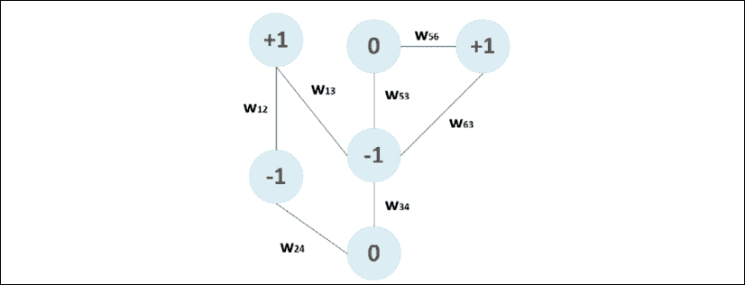

二元图示例

该图被定义为包含两个集合 *G* = { *V* ， *E* }的结构。 *E* 是顶点(或节点)的集合，并且包含所有样本标签*V*= {–1，+1，0}，而边集合 *E* 基于对两个节点之间的关系强度进行编码的亲和度测量。出于实际原因，引入矩阵 *W* 是有帮助的，其元素*W*ij 是:

*   边缘的实际重量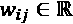(*I*， *j* )。在这种情况下， *W* 被称为**亲和矩阵**，元素*W*ij 通过实际距离度量来定义，所以使得当*W*ij>*W*iz 时，意味着节点 *i* 与*j*具有更强的连接**
*   集合 *K* = { *0* ， *1* }中的一个值，其中 1 表示存在连接，0 表示相反的情况。在这种情况下， *W* 通常被称为**邻接矩阵**，与前面的例子相反，现在 *W* 在图没有完全连接时也可以是单数(例如，如果离群值太远而无法连接到任何其他节点，则它们的行将为空，det *W* = 0)。当算法需要对 *W* 或其衍生矩阵求逆时，有必要注意这些情况，这些矩阵也将是奇异的。

在前面的示例中，有四个已标记的点(两个带 *y* = +1，两个带*y*=–1)，还有两个未标记的点( *y* = 0)。亲和矩阵 *W* 通常是对称的正方形，维数等于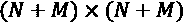。它可以通过不同的方法获得。最常见的也是 scikit-learn 采用的方法有:

*   **k-最近邻**(我们将在*第 6 章*、*聚类和无监督模型*中进一步详细讨论这个算法)，它产生一个邻接矩阵: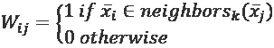
*   **径向基函数核**，反而输出一个非空条目的实际亲和度矩阵: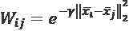

有时，在径向基函数核中，参数表示为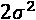的倒数；然而，与大方差相对应的小值增加了半径，包括更远的点，并且*在多个样本上平滑*类，而大值将边界限制到趋向于单个样本的子集。相反，在 KNN 核中，参数 *k* 控制被认为是邻居的样本的数量。

为了描述基本算法，我们还需要引入**度矩阵** ( *D* ):

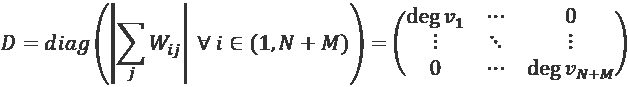

这是一个对角矩阵，其中每个非空元素代表对应顶点的*度*。这可以是传入边缘的数量，或与其成比例的度量(如基于径向基函数的 *W* 的情况)。度矩阵在特定操作符的定义中起着基本作用，称为**图拉普拉斯算子**，它在我们将要讨论的许多算法中非常有用。

标签传播的一般思想是让每个节点将它的标签传播给它的邻居，并重复该过程直到收敛。

形式上，如果我们有一个包含标记和未标记样本的数据集:

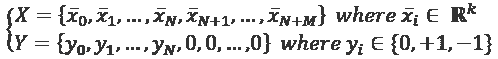

主**标签传播**算法的步骤(由 Zhu 和 Ghahramani 在Zhu X .，Ghahramani Z .，*用标签传播从有标签和无标签数据中学习*，02-02-107，2002)是:

1.  选择相似矩阵类型(KNN 或 RBF)并计算 *W*
2.  计算度矩阵 *D*
3.  定义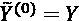
4.  定义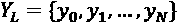
5.  迭代直到下列步骤收敛: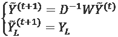

第一次更新使用标记点和未标记点执行传播步骤。每个标签从一个节点通过其向外的边传播，相应的权重，用度数标准化，增加或减少每个贡献的*效应*。相反，第二个命令重置已标记样本的所有 *y* 值。最终标签可通过以下方式获得:

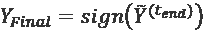

收敛的证明很容易。如果我们根据标记和未标记样本(分别用下标 *L* 和 *U* 标识)之间的关系划分矩阵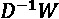，我们得到:

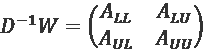

如果我们考虑到只有 *Y* 的第一个 *N* 分量是非空的，并且它们在每次迭代结束时被箝位，那么矩阵可以重写为:

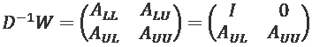

我们对证明关于未标记样本的部分的收敛性感兴趣(标记的样本是固定的)，因此我们可以将更新规则写成:

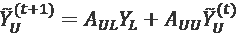

将递归转换为迭代过程，前面的公式变为:

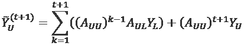

在前面的表达式中，第二项为空，所以我们需要证明第一项收敛；然而，很容易识别截断的矩阵几何级数(诺依曼级数)，如果矩阵(*I–A*)是可逆的，它就有一个极限:

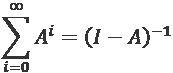

在我们的例子中，*A*UU 被构造成具有所有特征值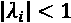；因此，(*I-**A*[UU])是可逆的，级数收敛于:

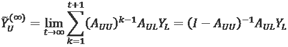

因此，最终标记是唯一的(当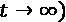时),并且取决于现有标记和拉普拉斯算子的未标记部分。从数学角度来看，标记部分负责将*与*的起始条件合并到模型中，而未标记部分的作用是根据图的结构定义传播的动态。

# 标签传播示例

我们可以用 Python 实现算法，使用一个测试二维数据集:

```
from sklearn.datasets import make_classification
nb_samples = 100
nb_unlabeled = 75
X, Y = make_classification(n_samples=nb_samples, n_features=2, n_informative=2, n_redundant=0, random_state=1000)
Y[Y==0] = -1
Y[nb_samples - nb_unlabeled:nb_samples] = 0
```

与其他示例一样，我们为所有未标记的样本(100 个中的 75 个)设置 *y* = 0。相应的曲线如下图所示:

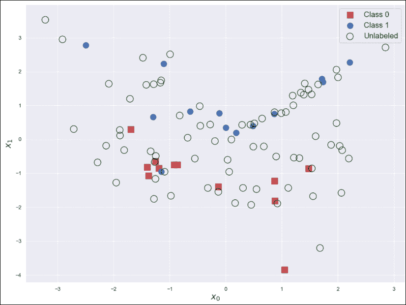

部分标记的数据集

标有叉号的点是未标记的。至此，我们可以定义亲和矩阵了。在这种情况下，我们使用两种方法进行计算:

```
from sklearn.neighbors import kneighbors_graph
nb_neighbors = 2
W_knn_sparse = kneighbors_graph(X, n_neighbors=nb_neighbors, mode='connectivity', include_self=True)
W_knn = W_knn_sparse.toarray()
```

使用带有参数`n_neighbors=2`和`mode='connectivity'`的 scikit-learn 函数`kneighbors_graph()`获得 KNN 矩阵；另一种方法是`distance`，它返回距离而不是 0 和 1，以指示边缘的存在/不存在。`include_self=True`参数很有用，因为我们希望*W*ii= 1。

对于 RBF 矩阵，我们需要手动定义它:

```
import numpy as np
def rbf(x1, x2, gamma=10.0):
    n = np.linalg.norm(x1 - x2, ord=1)
    return np.exp(-gamma * np.power(n, 2))
W_rbf = np.zeros((nb_samples, nb_samples))
for i in range(nb_samples):
    for j in range(nb_samples):
        W_rbf[i, j] = rbf(X[i], X[j])
```

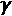的默认值是 10，对应于标准偏差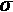等于 0.22。使用这种方法时，为设置一个正确的值很重要；否则，传播会退化为一个类的优势(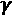太小)。由于类似于高斯分布(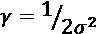)的双方差的倒数，其值应通过考虑标记数据集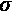的样本标准偏差并假设函数的影响在距平均值约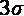后几乎消失来计算。因此，在计算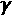的值时，应始终考虑该参考值。一个小的相当于一个大的方差；因此，亲和矩阵也将考虑非常远的邻居，而大的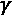可能导致几乎空的邻居。

现在，我们可以计算度矩阵及其逆矩阵。由于过程是相同的，从这一点开始，我们继续使用 RBF 亲和矩阵:

```
D_rbf = np.diag(np.sum(W_rbf, axis=1))
D_rbf_inv = np.linalg.inv(D_rbf)
```

该算法使用可变阈值来实现。这里采用的值是`0.01`。当算法迭代到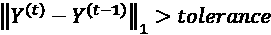时，容差值应该足够小，以保证应用于最终标签向量的符号函数不会产生任何错误。一个合理的经验法则是将公差设置为等于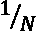。较小的值总是更可取，但它们会导致更多的迭代次数。

理想情况下，可以根据阈值和最大迭代次数设置双停止标准:

```
tolerance = 0.01
Yt = Y.copy()
Y_prev = np.zeros((nb_samples,))
iterations = 0
while np.linalg.norm(Yt - Y_prev, ord=1) > tolerance:
    P = np.dot(D_rbf_inv, W_rbf)
    Y_prev = Yt.copy()
    Yt = np.dot(P, Yt)
    Yt[0:nb_samples - nb_unlabeled] = Y[0:nb_samples - nb_unlabeled]
Y_final = np.sign(Yt)
```

最终结果显示在下面的双图中:

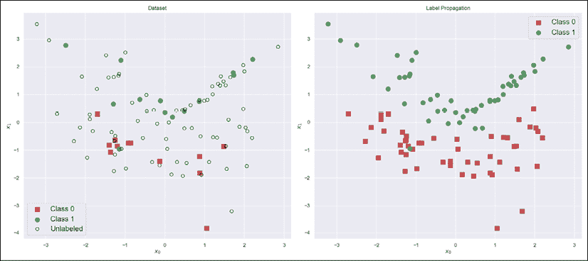

原始数据集(左)；完整标签传播后的数据集(右)

正如可能看到的，在原始数据集中，有一个被正方形包围的圆点(-0.9，-1)。由于该算法保留了原始标签，我们发现在标签传播后也存在同样的情况。即使平滑度和聚类假设相矛盾，这种情况也是可以接受的。假设它是合理的(也就是说，初始标记可以被认为是灵活的，没有明确的约束)，可以通过放松算法来强制进行*校正*:

```
tolerance = 0.01
Yt = Y.copy()
Y_prev = np.zeros((nb_samples,))
iterations = 0
while np.linalg.norm(Yt - Y_prev, ord=1) > tolerance:
    P = np.dot(D_rbf_inv, W_rbf)
    Yt = np.dot(P, Yt)
    Y_prev = Yt.copy()
Y_final = np.sign(Yt)
```

通过这种修改，原始标签不再被限制，并且允许传播算法改变所有那些与邻域不一致的值。结果如下图所示:

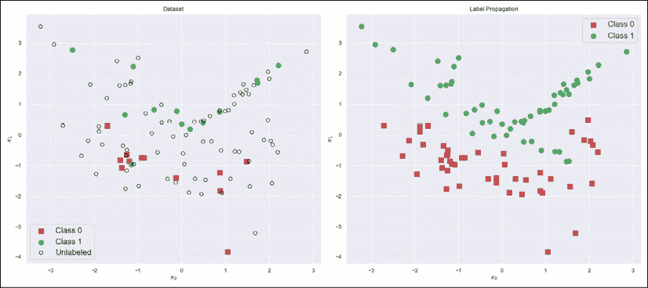

原始数据集(左)；覆盖完整标签传播后的数据集(右)

如您所见，标注过程已成功完成，以(-1，-1)为中心的邻域中的点现已被重新标注以匹配其相邻点的标注。我们现在可以使用 scikit-learn API 分析一个示例，它与前面讨论的算法略有不同。

## sci kit-learn 中的标签传播

Scikit-learn 实现了由 Zhu 和 Ghahramani(在前述论文中)提出的稍微不同的算法，该算法在结果方面是等价的，但是具有稍微不同的内部动态，其基于通过图的马尔可夫随机行走，直到找到稳定的配置(即，标签不再改变)。

亲和矩阵 *W* 可以使用两种方法(KNN 和径向基函数)计算，但是它被归一化为概率转移矩阵:

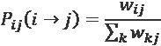

该算法的操作类似于马尔可夫随机游走，具有以下序列(假设有 *Q* 个不同的标签):

1.  定义一个矩阵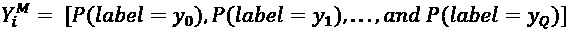，其中*P*(*label*=*y*[I])是标签 *y* [i] 的概率，对每一行进行归一化处理，使所有元素总和为 1
2.  定义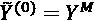
3.  迭代直到下列步骤收敛:

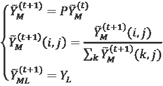

第一次更新执行标签传播步骤。因为我们正在处理概率，所以有必要(第二步)重新规范化这些行，以便它们的元素总和为 1。最后一次更新会重置所有已标记样本的原始标签。在这种情况下，它意味着将一个 *P* ( *标签* = *y* [i] ) = 1 赋给相应的标签，并将所有其他的设置为零。收敛的证明非常类似于标签传播算法的证明，并且可以在 Zhu X .，Ghahramani Z .，*用标签传播从标记和未标记数据学习*，02-107 中找到。最重要的结果是，可以通过以下公式获得闭合形式的解(无需任何迭代):

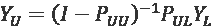

第一项是一个广义几何级数的和，其中*P*UU 是转移矩阵 *P* 的未标记-未标记部分。 *P* [UL] 反而是同一个矩阵中未标记的部分。

对于我们的 Python 示例，我们需要以不同的方式构建数据集，因为如果 *y* = -1:

```
from sklearn.datasets import make_classification
nb_samples = 1000
nb_unlabeled = 750
X, Y = make_classification(n_samples=nb_samples, n_features=2, n_informative=2, n_redundant=0, random_state=100)
Y[nb_samples - nb_unlabeled:nb_samples] = -1
```

我们现在可以用一个 RBF 内核和`gamma=10.0`来训练一个`LabelPropagation`实例:

```
from sklearn.semi_supervised import LabelPropagation
lp = LabelPropagation(kernel='rbf', gamma=10.0)
lp.fit(X, Y)
Y_final = lp.predict(X)
```

结果如以下双图所示:

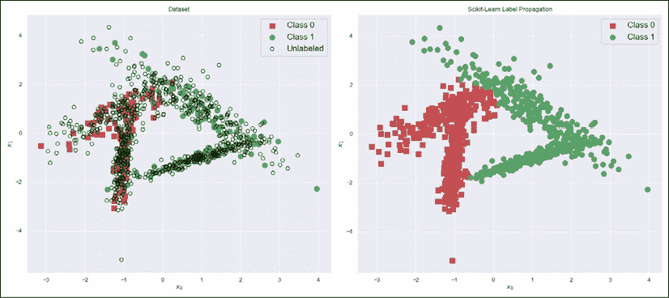

原始数据集(左)。scikit-learn 标签传播后的数据集(右)

正如预期的那样，传播收敛到一个既考虑了平滑性又考虑了聚类假设的解决方案。事实上，正如可能看到的那样，标签的分配考虑了数据集的聚类结构(也就是说，斑点总是一致的)，并且过渡相对平滑(不包括由已标记样本强加的过渡)。

# 标签扩散

我们需要分析的另一个算法(由周等人提出)称为**标签扩散**，当数据集非常嘈杂或密集时，提供了稍好的稳定性。在这些情况下，由于具有不同标注的点的接近程度，标准标注传播可能会损失精度。相反，因为拉普拉斯算子被归一化并且突变被更严重地惩罚，所以标签扩散更鲁棒(所有的数学细节都相当复杂，但是读者可以在 Biyikoglu T .、Leydold J .、斯塔德勒 P. F .、*图的拉普拉斯特征向量、* Springer，2007 中找到所有细节)。

该算法基于归一化图拉普拉斯算子，定义为:

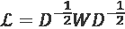

考虑到它的矩阵形式，如果度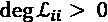(否则为 0)，它的对角线元素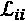等于 1，所有其他元素等于:

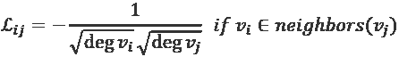

该运算符是一般图拉普拉斯算子的一个特例:

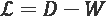

这种算子的行为类似于离散拉普拉斯算子，其实值形式是所有扩散方程的基本元素。假设我们有一小部分图表，如下图所示:

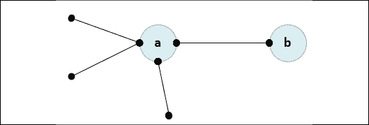

包含两个节点的图形部分

如果没有涉及节点 **a** 或 **b** 的其他连接，则度数为:deg *a* = 4，deg *b* = 1。现在让我们考虑边缘的拉普拉斯值( *a* ， *b* )。由于节点是相连的， *D* 是对角线，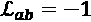，而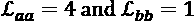。

如果我们考虑图中的一条路径(即欧拉路径，以确保每条边恰好遍历一次)，转换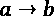可以从三个不同的先前状态开始发生。因此，例如，当节点 a 具有单个连接时，*流*可能大于这种情况。不难理解，这个概念与函数的二阶导数是严格相关的(或者，在多个变量的情况下，与拉普拉斯-贝尔特拉米算子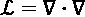相关)。作为类比，让我们考虑一般的热方程:


这个等式描述了当房间中的一点突然被加热时，房间的温度的行为。从基本的物理学概念中，我们知道热量将会传播，直到温度达到平衡点，并且变化的速度与分布的拉普拉斯成比例。如果我们考虑平衡状态下的二维网格(时间变为零时的导数),并考虑增量比对拉普拉斯算子进行离散化，我们得到:


因此，在平衡时，每个点都有一个值，该值是直接邻居的平均值(也就是说，在图形的情况下，邻居的数量被编码在节点的度数中)。证明有限差分方程有一个不动点是可能的，这个不动点可以从每个初始条件开始迭代地找到。因此，图拉普拉斯对图的结构进行编码，从而对图中移动时的动态行为进行编码。

除了这一基本思想之外，标签扩展还采用了一个用于标记样本的箝位因子。如果，算法将总是将标签重置为原始值(类似于标签传播)，当值在区间(0，1)时，被夹住的标签的百分比逐渐减少，直到，此时所有标签被覆盖。

**标签展开**算法的完整步骤为:

1.  选择亲和矩阵类型(KNN 或 RBF)并计算 *W*
2.  计算度矩阵 *D*
3.  计算归一化图拉普拉斯
4.  定义
5.  在区间(0，1)中定义
6.  迭代直到收敛下一步:

方程的结构(特别是第一部分)很简单，类似于标准的扩散微分方程，主要区别在于我们使用离散时间步长。然而，同样在这种情况下，变化(类似于时间导数)与应用于标签的拉普拉斯图成比例(例如，类似于像温度这样的标量物理实体)。可以证明(如 *Chapelle O .、schlkopf b .、Zien A .、(编辑)半监督学习，麻省理工学院出版社，2010 年*所示)该算法等价于具有以下结构的二次成本函数的最小化:


第一项规定了原始标签和估计标签之间的一致性(对于带标签的样本)。第二项用作归一化因子，迫使未标记的项变为零，而第三项可能是最不直观的，需要它来保证平滑度方面的几何一致性。正如我们在上一段中看到的，当采用硬箝位时，平滑度假设可能会被违反。通过最小化这一项(与成比例)，可以惩罚高密度区域内的快速变化。同样在这种情况下，收敛的证明非常类似于标签传播算法的证明，因此将被省略。感兴趣的读者可以在 Chapelle O .、schlkopf b .、Zien A .、(编著)*半监督学习、*麻省理工学院出版社，2010 年。

## 标签扩散示例

我们可以使用 scikit-learn 实现来测试这个算法。让我们从创建一个非常密集的数据集开始:

```
from sklearn.datasets import make_classification
nb_samples = 5000
nb_unlabeled = 1000
X, Y = make_classification(n_samples=nb_samples, n_features=2, n_informative=2, n_redundant=0, random_state=100)
Y[nb_samples - nb_unlabeled:nb_samples] = -1
```

我们可以用箝位因子`alpha=0.2`训练一个`LabelSpreading`实例。我们希望保留 80%的原始标签，但同时，我们需要一个平稳的解决方案:

```
from sklearn.semi_supervised import LabelSpreading
ls = LabelSpreading(kernel='rbf', gamma=10.0, alpha=0.2)
ls.fit(X, Y)
Y_final = ls.predict(X)
```

结果通常与原始数据集一起显示:


原始数据集(左)。完整标签展开后的数据集(右)

正如可以在第一个图(左)中看到的，在群集的中心部分()，有一个圆形点的区域。使用硬箝位，这个*岛*将保持不变，违反了平滑度和聚类假设。设置，可以避免这个问题。当然，的正确选择严格限制在每个单项问题。如果我们知道原始标签绝对正确，允许算法更改它们可能会适得其反。

例如，在这种情况下，最好对数据集进行预处理，过滤掉所有违反半监督假设的样本。相反，如果我们不确定所有样本都来自相同的*p*数据，并且可能存在虚假元素，则使用更高的值可以平滑数据集，而无需任何其他操作。

## 利用拉普拉斯正则化增加平滑度

标准标签传播算法的问题之一是它们倾向于显示突然的标签变化，这与平滑度假设不相容。有许多策略来限制这种行为(其中大多数在 Belkin M .，Niyogi P .，Sindhwani V .，*流形正则化:从标记和未标记的示例中学习的几何框架*，Journal of Machine Learning Research 7，2006)中进行了分析)，并且它们通常基于在成本函数中引入二次惩罚项。以类似于用于标签扩散的方式，作者提出了具有以下形式的成本函数:


术语的存在迫使算法惩罚相同邻域中的突然变化。由于拉普拉斯算子直接连接到亲和矩阵，二次罚项的行为类似于脊正则化。当两个点具有大的相似性并且算法倾向于分配不同的标签时，惩罚项迫使模型通过选择更平滑的过渡来减少损失。考虑通用分类器，这相当于通过引入隐式线性化来避免分离超曲面的过度振荡。

算法的数学推导和理论都有点复杂。因此，我们更喜欢讨论另一种基于流形行为的算法(然而，我邀请最聪明的读者定义成本函数，并使用标准方法(如 BFGS)对其进行优化)。

拉普拉斯正则化方法的完整理论超出了本书的范围(许多细节可以在 Lee J. M .，*光滑流形简介*，Springer，2012)中找到)，但是让读者知道图拉普拉斯定义了基础流形上的一个算子是有帮助的。根据理论，可以对算符进行本征分解，找到本征函数的基。可以证明基本函数的光滑性与相关的特征值成正比。因此，作者提出计算并选择的前 *k* 最小特征值，并建立仅使用前 *k* 特征值构建的标记函数(即，对标记点和未标记点的标记进行编码的函数)(以便最大化平滑度)。因此，给定作为列的第一个 *k 个*特征向量的矩阵，和一个变量向量(经过优化)，可以基于标记点建立一个成本函数:


最小值对应于，可以通过设定点积的阈值并取符号来确定标签。

让我们使用包含 200 个点和 150 个未标记点的数据集来尝试这种方法:

```
from sklearn.datasets import make_classification
nb_samples=200
nb_unlabeled=150
X, Y = make_classification(n_samples=nb_samples, n_features=2, n_informative=2, n_redundant=0, random_state=1000)
Y[Y == 0] = -1
Y[nb_samples - nb_unlabeled:nb_samples] = 0
```

原始的数据集如下图所示:


拉普拉斯正则化示例中使用的原始数据集

现在，我们可以使用 RBF 亲和矩阵来构建拉普拉斯图。在这种情况下，我们选择了，但是我邀请读者测试不同的值并比较结果:

```
import numpy as np
k = 50
def rbf(x1, x2, gamma=0.1):
    n = np.linalg.norm(x1 - x2, ord=1)
    return np.exp(-gamma * np.power(n, 2))
W_rbf = np.zeros((nb_samples, nb_samples))
for i in range(nb_samples):
    for j in range(nb_samples):
        if i == j:
            W_rbf[i, j] = 0.0
        else:
            W_rbf[i, j] = rbf(X[i], X[j])
D_rbf = np.diag(np.sum(W_rbf, axis=1))
L_rbf = D_rbf - W_rbf
```

一旦拉普拉斯算子准备好了，我们就可以特征分解它，并选择第一个 *k* 特征向量(在我们的例子中，我们选择了 *k* = 50，但是，同样，这是一个数据科学家应该在每个特定场景中检查的超参数):

```
import numpy as np
w, v = np.linalg.eig(L_rbf)
sw = np.argsort(w)[0:k]
V = v[:, sw]
theta = np.random.normal(0.0, 0.1, size=(1, k))
Yu = np.zeros(shape=(nb_unlabeled,))
```

最后一步是构建成本函数并将其最小化(我们选择使用 BFGS 算法):

```
from scipy.optimize import minimize
def objective(t):
    return np.sum(np.power(Y - np.dot(t, V.T), 2))
result = minimize(objective, 
                  theta, 
                  method="BFGS",
                  options={
                      "maxiter": 500000,
                  })
```

通过获取优化的结果并使用符号函数来获得最终的标记:

```
Y_final = np.sign(np.dot(result["x"], V.T))
```

该过程的结果如下图所示:


原始数据集(左)。使用拉普拉斯正则化算法标注后的数据集(右图)

我们可以立即观察到标签非常平滑，但是类似于标准标签传播的算法没有夹紧标签，这导致了一些变化(我邀请读者修改代码作为练习，并夹紧原始标签)。然而，主要的簇保持了它们的结构，而且，将它们的标签诱导给邻居。如果数据集有噪声，并且我们只能信任密度较高的区域，则这种行为可能是积极的，但是当标记点由专家控制时，这种行为可能是不可取的。(2.7，-3)处的点是算法未能正确标记的异常值(实际上，它使用类 1 标记了它)。这类问题是选择参数的结果。事实上，在这种特殊情况下，我们有高密度和低密度区域的存在。虽然该算法对于高密度区域工作良好，但是对于异常值可能会有问题。一种可能的缓解策略是增加，同时检查有多少正确标记的点改变了它们的标记。在某些情况下，一个探索性的过程足以找到一个稍微不同的值，它避免了离群值的错误标注，同时保持正确的标签不变。

可以通过改变本征函数的数量和参数的值来控制平滑度。在这种特殊情况下，考虑到数据集的简单性，RBF 提供了更大的贡献，因为它决定了邻域的结构，并且限制或激励了标注传播。

作为一个练习，我邀请读者使用一个更复杂的数据集(它总是二维的，但可能是非线性的)来测试这个方法，将结果与标准的标签传播进行比较。一般来说，当数据集的复杂性非常高(以及维度)时，主要优势更加明显。在这些情况下，读者可以尝试使用本章剩余部分讨论的方法之一，将高维数据集投影到二维平面，以便将结果可视化，并更好地理解潜在的动态。

# 基于马尔可夫随机游动的标签传播

由 Zhu 和 Ghahramani提出的这个算法的目标是在给定一个混合数据集的情况下，找到未标记样本的目标标记的概率分布。这一目标是通过模拟随机过程来实现的，其中每个未标记的样本遍历该图，直到它达到稳定的吸收状态，即标记的样本，在该状态下，它停止获取相应的标记。与其他类似方法的主要区别在于，在这种情况下，我们考虑到达标记样本的概率。这样，问题就有了一个封闭的形式，很容易解决。

第一步是始终用所有的 *N* 个样本构建一个*k*-最近邻图，并定义一个基于 RBF 核的权重矩阵 *W* :


*W*ij= 0 表示，和不是邻居， *W* [ ii ] = 0。转移概率矩阵的构建类似于 scikit-learn 标签传播算法，如下所示:


用更简洁的方式可以改写为*P = D*^(-1)*W*。如果我们现在考虑一个*测试数据点*，从状态开始，随机行走直到找到一个吸收标记状态(我们称这个标记为)，概率(称为二元分类)可以表示为:


当被标记时，状态为最终状态，基于条件*y*I= 1，由指示函数表示为。当样本未被标记时，我们需要考虑从开始并以最接近的吸收态结束的所有可能跃迁的总和，标记 *y* = 1 由相对跃迁概率加权。

我们可以把这个表达式改写成矩阵形式。如果我们创建一个向量，其中第一个分量基于标记点，第二个分量基于未标记点，我们可以写出:


如果我们现在展开矩阵，我们得到:


由于我们只对未标记的点感兴趣，我们可以考虑第二个等式:


简化表达式，我们得到下面的线性系统:


术语(*D*[UU]-*W*[UU])是非规范化图拉普拉斯的未标记-未标记部分。通过求解这个系统，我们可以得到所有未标记点的类 *y* = 1 的概率。通过设定概率阈值(通常为 0.5)，可以将软标注转换为硬标注。

## 基于马尔可夫随机游走的标签传播示例

对于基于马尔可夫随机游走的标签传播的 Python 示例,我们将使用一个二维数据集，其中包含属于两个不同类的 50 个已标记点和 1，950 个未标记点:

```
from sklearn.datasets import make_blobs
nb_samples = 2000
nb_unlabeled = 1950
nb_classes = 2
X, Y = make_blobs(n_samples=nb_samples, 
                  n_features=2, 
                  centers=nb_classes,
                  cluster_std=2.5,
                  random_state=1000)
Y[Y == 0] = -1
Y[nb_samples - nb_unlabeled:nb_samples] = 0
```

数据集的图是下图所示的(十字表示未标记的样本):


部分标记的数据集

我们现在可以创建图表(使用`n_neighbors=15`)和权重矩阵:

```
from sklearn.neighbors import kneighbors_graph
W = kneighbors_graph(X, n_neighbors=15, mode='connectivity', include_self=True).toarray()
```

现在，我们需要计算非规范化图拉普拉斯的未标记部分和矩阵 *W* 的未标记部分:

```
D = np.diag(np.sum(W, axis=1))
L = D – W
Luu = L[nb_samples - nb_unlabeled:, nb_samples - nb_unlabeled:]
Wul = W[nb_samples - nb_unlabeled:, 0:nb_samples - nb_unlabeled,]
Yl = Y[0:nb_samples - nb_unlabeled]
```

此时，可以使用 NumPy 函数`np.linalg.solve()`求解线性系统，该函数以的形式接受矩阵 *A* 和一般系统的向量作为参数。当矩阵 *A* 非常大时，系统可能是病态的。建议先查条件号再解系统。如果它很大(例如，，最好使用前面讨论过的其他方法之一。

一旦我们有了解决方案，我们就可以将新标签与原始标签合并(其中未标记的样本已标记为-1)。在这种情况下，我们不需要转换概率，因为我们使用 0 和 1 作为标签。通常，有必要使用阈值(0.5)来选择正确的标签:

```
Yu = np.round(np.linalg.solve(Luu, np.dot(Wul, Yl)))
Y[nb_samples - nb_unlabeled:] = Yu.copy()
```

重新绘制数据集，我们得到:


原始数据集(左)。完整马尔可夫随机游走标签传播后的数据集(右)

正如预期的那样，在没有任何迭代的情况下，标签已经成功地传播到所有数据点，满足了聚类假设的要求。该算法和标签传播都可以使用封闭形式的解决方案来工作，因此即使在样本数量很高时，它们也非常快；然而，关于为 RBF 内核选择 / 有一个基本问题。正如同一作者朱和 Ghahramani 所说，没有标准的解决方案，但可以考虑和的情况。在第一种情况下，只有最近的点有影响，而在第二种情况下，影响扩展到整个样本空间，未标记的点都倾向于获得相同的标记。

作者建议考虑所有样本的熵，试图找到使其最小化的最佳值。这种解决方案可能非常有效，但有时最小熵对应的标签配置使用这些算法并非不可能实现。最好的方法是尝试不同的值(在不同的尺度上),并选择与具有最低熵的有效配置相对应的值。在我们的例子中，可以将未标记样本的熵计算为:


执行此计算的 Python 代码是:

```
Pu = np.linalg.solve(Luu, np.dot(Wul, Yl))
H = -np.sum(Pu * np.log(Pu + 1e-6))
```

添加术语`1e-6`是为了避免概率为零时的数值问题。对不同的值重复这一过程使我们能够找到一组候选值，这些候选值可以通过直接评估标注准确性而限制为单个值(例如，当没有关于真实分布的精确信息时，可以考虑每个聚类的一致性以及它们之间的分离)。

另一种方法被称为**类别再平衡**，它基于重新加权未标记样本的概率的想法，以在新的未标记样本被添加到集合中时重新平衡属于每个类别的点的数量。如果我们有 *N* 个标记点和 *M* 个未标记点，对于 *K* 个类，类 *j* 的权重因子*w*j[可以如下获得:]


分子是对属于类别 *k* 的标记样本计算的平均值，而分母是对估计类别为 *k* 的未标记样本的平均值。关于类的最终决定不再仅仅基于最高概率，而是基于:


在本节中，我们讨论了在不同场景中执行有效标签传播的一些常见策略。在下一节中，我们将利用流形假设对复杂数据集进行非线性降维。

# 流形学习

在*第三章*、*半监督分类简介*中，我们讨论了流形假设，说高维数据通常位于低维流形上。当然，这不是一个定理，但在许多实际情况下，该假设被证明是正确的，它允许我们使用非线性降维算法，否则这将是不可接受的。在本节中，我们将分析其中的一些算法。它们都是在 scikit-learn 中实现的，所以很容易用复杂的数据集来尝试它们。

## Isomap

**Isomap** 是最简单的算法之一，它基于减少维度的思想，同时试图保留在输入数据所在的原始流形上测量的测地距离(即流形上两点之间的最短路径的长度)。该算法分三步工作。第一个操作是 KNN 聚类和下图的构造。顶点将是样本，而边表示最近邻居之间的连接，并且它们的权重与到相应邻居的距离成比例。

第二步采用 **Dijkstra 算法**(查阅 Cormen T. H .、Leiserson C. E .、Rivest R. L .、*算法简介*，麻省理工学院出版社，2009 年，了解更多详情)计算所有样本对的图上的最短成对距离。在下图中，有一部分较短的距离用粗线标出:


标注最短距离的图形示例

例如，由于 **x** [3] 是 **x** [5] 和 **x** [7] 的邻居，应用 Dijkstra 算法，我们可以得到最短路径和。这一步的计算复杂度约为，低于 *k* *< < n* (正常满足的条件)时的*O*(*n*3)；但是对于大图(带 *n > > 1* )，这往往是整个算法开销最大的部分。

第三步是称为**度量多维标度**的，这是一种在试图保留样本间内积的同时寻找低维表示的技术。如果我们有一个 *P* 维数据集 *X* ，算法必须找到一个 *Q* 维数据集，用 *Q < P* 最小化函数:


正如 Chapelle O .，schlkopf b .，Zien A .(编辑)，*半监督学习*，麻省理工学院出版社，2010 年所证明的，优化是通过取 Gram 矩阵(或者以矩阵形式，如果)的顶部 *Q* 特征向量来实现的；然而，由于 Isomap 算法处理成对距离，我们需要计算距离平方的矩阵 *D* :


如果 *X* 数据集以零为中心，则有可能从 *D* 导出简化的 Gram 矩阵，如 M. A. A. Cox 和 T. F. Cox 所述:


Isomap 计算*G*D 的顶部 *Q* 特征值和相应的特征向量，确定 *Q* 维向量为:


正如我们将在*第 13 章*、*分量分析和降维*中讨论的那样(也正如 Saul、Weinberger、Sha、Ham 和 Lee 在 Saul L. K .、Weinberger K. Q .、Sha F .、Ham J .和 Lee D. D .、*光谱降维方法、* UCSD，2006 年中指出的那样，**主分量分析**也利用了这种投影。

事实上，当将 SVD 应用于数据集 *X* 时，我们得到:


对角矩阵包含了*XX*T 和*X*TX 的特征值；因此 *G* 的特征值等于，其中为协方差矩阵的特征值。因此，Isomap 实现了维数减少，试图保持成对距离，同时将数据集投影到由一组特征向量确定的子空间中，在该子空间中实现了最大的解释方差。根据信息论，这个条件保证了最小的损失和有效的降维。

Scikit-learn 还实现了 Floyd-Warshall 算法，速度稍慢。欲了解更多信息，请参考 Cormen T. H .，Leiserson C. E .，Rivest R. L .，*算法简介*，麻省理工学院出版社，2009 年。

### Isomap 的例子

我们现在可以使用 Olivetti faces 数据集(由剑桥 AT & T 实验室提供)测试sci kit-learn Isomap 实现，该数据集由属于 40 名不同前员工的 400 张 64 × 64 灰度肖像组成。这些图像的示例如下所示:


Olivetti 人脸数据集的子集

原始维度是 4，096，但是我们希望以二维方式可视化数据集。理解使用欧几里德距离来测量图像的相似性可能不是最好的选择是很重要的，并且看到样本被如此简单的算法聚类得如此之好是令人惊讶的。

第一步是加载数据集:

```
from sklearn.datasets import fetch_olivetti_faces
faces = fetch_olivetti_faces()
```

`faces`字典包含三个主要元素:

*   `images`:形状为 400 × 64 × 64 的图像阵列
*   `data`:形状为 400 × 4096 的展平阵列
*   `target`:形状为 400 × 1 的数组，包含标签(0，39)

此时，我们可以实例化 scikit-learn 提供的`Isomap`类，设置`n_components=2`和`n_neighbors=5`(读者可以尝试不同的配置)，然后拟合模型:

```
from sklearn.manifold import Isomap
isomap = Isomap(n_neighbors=5, n_components=2)
X_isomap = isomap.fit_transform(faces['data'])
```

由于 400 个元素的结果图非常密集，我倾向于在下面的图中只显示前 100 个样本:


Isomap 应用于从 Olivetti faces 数据集抽取的 100 个样本

可以看出，属于同一类(或子类，例如，如果同一个人有不同的表情或戴/不戴眼镜)的样本被分组为相当密集的聚集体。

看起来分开比较好的课是 7 和 1。检查对应的面，对于类 7，我们得到:


属于第 7 类的样品

这组照片中有一位年轻女性的肖像，她肤色白皙，与其他大多数人截然不同。相反，对于类 1，我们得到:


属于类别 1 的样品

在这种情况下，这是一个戴着大眼镜，有着特殊嘴型的男人。在数据集中，只有几个戴眼镜的人，其中一个留着深色胡子。我们可以得出结论，Isomap 创建了一个与原始测地线距离真正一致的低维表示。在某些情况下，可以通过增加维度或采用更复杂的策略来减轻部分聚类重叠。

## 局部线性嵌入

与使用成对距离工作的 Isomap 相反，该算法基于这样的假设，即位于光滑流形上的高维数据集可以具有局部线性结构，它试图在降维过程中保留这些结构。**局部线性嵌入** ( **LLE** )和 Isomap 一样，基于三个步骤。第一种方法是应用 KNN 算法来创建有向图(在 Isomap 中，它是无向的)，其中顶点是输入样本，边表示邻域关系。由于该图是直接的，点可以是的邻居，但是相反的情况可能是错误的。这意味着权重矩阵可以是非对称的。

第二步是基于局部线性的主要假设。例如，考虑下图:


用阴影矩形标记邻域的图形

矩形划定了一个小的邻域。如果我们考虑点，局部线性假设允许我们认为，而不考虑循环关系。这个概念可以通过以下函数的最小化对所有的*N*P 维点进行形式化:


为了解决低秩邻域矩阵的问题(想想前面的例子，邻居的数量等于 20)，scikit-learn 还实现了一个正则化器，该正则化器基于一个添加到局部权重的小的任意附加常数(根据一个称为**修改的 LLE** 或 **MLLE** 的变体)。在该步骤结束时，将为下一阶段选择更好地匹配邻居之间的线性关系的矩阵 *W* 。

在第三步中，LLE 试图确定最佳再现最近邻居之间的原始关系的低维( *Q < P* )表示。这通过最小化以下函数来实现:


这个问题的解决方案是通过采用**瑞利-里兹法**获得的，这是一种从非常大的稀疏矩阵中提取特征向量和特征值子集的算法。欲知详情，请阅读施菲尔德·切利科夫斯基；Saad Y .，*Kohn-Sham 问题的频谱切片方法*，计算机物理通信。183, 2012.最终程序的初始部分包括确定矩阵 *D* :


可以证明最后一个特征向量(如果特征值按降序排序，就是最下面的那个)有所有分量，对应的特征值为空。正如 Saul 和 Roweis (Saul L. K .，Roweis S. T .，*局部线性嵌入介绍*，2001)指出的，所有其他 *Q* 特征向量(从底部开始)是正交的，这允许它们具有零中心嵌入。因此，最后的特征向量被丢弃，而剩余的 *Q* 特征向量确定嵌入向量。

有关 MLLE 的更多详细信息，请参考张 z，王 j .， *MLLE:使用多个权重的改进局部线性嵌入*，NIPS，2006。

### LLE 的例子

我们现在可以将这个算法应用于 Olivetti faces 数据集，用`n_components=2`和`n_neighbors=15`实例化 scikit- learn 类`LocallyLinearEmbedding`:

```
from sklearn.manifold import LocallyLinearEmbedding
lle = LocallyLinearEmbedding(n_neighbors=15, n_components=2)
X_lle = lle.fit_transform(faces['data'])
```

结果(限于前 100 个数据点)如下图所示:


LLE 应用了从 Olivetti 人脸数据集中抽取的 100 个样本

即使策略不同于 Isomap，我们也可以确定一些连贯的簇。在这种情况下，相似性是通过小的线性块的连接获得的；对于面部，它们可以代表特定的微观特征，如鼻子的形状或眼镜的存在，这些特征在同一个人的不同肖像中保持不变。通常，当原始数据集本质上是局部线性的，可能位于光滑流形上时，LLE 是优选的。

换句话说，当样本的小部分被构造成允许在给定邻域和权重的情况下重构点时，LLE 是一个合理的选择。对于图像来说通常是这样，但是对于通用数据集来说可能很难确定。当结果没有再现原始聚类时，可以采用下一个算法，拉普拉斯谱嵌入，或 **t-SNE** ，这是最先进的算法之一，将在后面讨论。

## 拉普拉斯谱嵌入

基于图拉普拉斯的谱分解的该算法已经被提出，以便在 *Q* 维(具有 *Q < P* )子空间上重新映射时，执行非线性维度缩减，以试图保持 *P* 维流形中的点的接近度。

该过程与其他算法非常相似。第一步是 KNN 聚类以生成图，其中顶点(我们可以假设具有 *N* 个元素)是样本，并且使用 RBF 核对边进行加权:


得到的图形是无向对称的。我们现在可以定义一个伪度矩阵 *D* :


低维表示通过最小化函数获得:


如果两个点和靠近，对应的*W*ij 接近 1，而当距离趋向时则趋向 0。 *D* [ii] 为源于的所有权重之和(同样适用于 *D* [jj] )。现在，让我们假设非常接近所以，近似。得到的公式是基于矢量和之差的平方损失。相反，当有多个*接近度*关系要考虑时，因子 *W* [ij] 除以*D*[ii]*D*[jj]允许重新加权新的距离，以找到整个数据集的最佳折衷。在实际操作中，并不是直接最小化。事实上，可以证明最小值可以通过对称归一化图拉普拉斯的谱分解来获得(其名称源于此过程):


就像 LLE 算法一样，拉普拉斯谱嵌入也适用于底部的 *Q* + 1 个特征向量。最后一步背后的数学理论总是基于瑞利-里兹方法的应用。最后一个被丢弃，剩下的 *Q* 确定低维表示。

### 拉普拉斯谱嵌入的例子

让我们使用 scikit-learn 类`SpectralEmbedding`，用`n_components=2`和`n_neighbors=15`将这个算法应用于同一个数据集:

```
from sklearn.manifold import SpectralEmbedding
se = SpectralEmbedding(n_components=2, n_neighbors=15, random_state=1000)
X_se = se.fit_transform(faces['data'])
```

结果图(由于高密度区域的存在而放大)如下图所示:


拉普拉斯谱嵌入应用于 Olivetti 人脸数据集

即使在这种情况下，我们可以看到一些类被分组为小簇，但同时，我们在有混合样本的地方观察到许多聚集体。这种方法和前面的方法都使用局部信息，试图找到可以保留微特征几何结构的低维表示。

这个条件驱动到一个映射，其中接近点*共享*局部特征(这对于图像几乎总是正确的，但是对于通用样本很难证明)。因此，我们可以观察到包含属于同一类的元素的小簇，但也可以观察到一些*明显的*异常值，这些异常值在原始流形上可以是全局不同的，即使它们共享局部*补丁*。相反，Isomap 或 t-SNE 等方法会处理整个分布，并尝试在考虑其全局属性的情况下确定与原始数据集几乎等距的表示。

## SNE 霸王龙

该算法由 Van der Mateen 和 Hinton 提出，正式名称为 t 分布随机邻居嵌入，是最强大的流形降维技术之一。与其他方法相反，该算法从一个基本假设开始:两个 N 维点*和*之间的相似性可以被表示为条件概率和，其中每个点由以为中心并且具有方差的高斯分布来表示。从期望的困惑度开始选择方差，定义如下:


低困惑值表示低不确定性，通常更可取。在普通的 SNE 霸王龙任务中，5-50 的数值通常是可以接受的。

关于条件概率的假设可以被解释为，如果两个样本非常相似，则与第一个样本相关联的以第二个样本为条件的概率较高，而不同点产生的条件概率较低。例如，考虑图像，位于瞳孔中心的点可以具有属于睫毛的一些点作为邻居。从概率上来说，我们可以认为 *p* ( *睫毛|瞳孔*)相当高，而 *p* ( *鼻|瞳孔*)明显低一些。t-SNE 将这些条件概率建模为:


概率被设置为零，因此前面的公式可以扩展到整个图形。为了以更简单的方式解决问题，条件概率也被对称化:


如此获得的概率分布表示高维输入关系。由于我们的目标是将维度减少到一个值 *M < N* ，我们可以考虑目标点的类似概率表示，使用一个自由度的学生 t 分布:


我们希望低维分布 *Q* 尽可能接近高维分布*P*；因此， **t-SNE** 算法的目的是最小化 *P* 和 *Q* 之间的 Kullback-Leibler 散度:


第一项是原分布的熵 *P* ，第二项是交叉熵 *H* ( *P，Q* )，要最小化才能解决问题。最佳方法基于梯度下降算法(在*第 17 章*、*建模神经网络*中进行了全面分析)，但也有一些有用的变化可以提高 Van der Maaten L.J.P .、Hinton G.E .、*使用 t-SNE* 可视化高维数据，机器学习研究杂志 9(11 月)，2008 中讨论的性能。

### t 分布随机邻居嵌入示例

我们可以使用带有`n_components=2`和`perplexity=20`的 scikit-learn 类`TSNE`，将这个强大的算法应用于同一个 Olivetti faces 数据集:

```
from sklearn.manifold import TSNE
tsne = TSNE(n_components=2, perplexity=20, random_state=1000)
X_tsne = tsne.fit_transform(faces['data'])
print("Final KL divergence: {}".format(tsne.kl_divergence_))
```

前面代码片段的输出是:

```
Final KL divergence: 0.5993183851242065
```

最终的 Kullback-Leibler 散度约为 0.6，这是一个低值(困惑度等于 20 时可达到的最小值)，但在某些任务中可能还不够。让我们先来看看所有 400 个点的图形结果:


困惑度等于 20 的 t-SNE 应用于 Olivetti 人脸数据集

对标签分布的视觉检查可以确认 t-SNE 从原始的高维分布开始重新创建了一个非常好的聚类结构。我们可以合理地假设属于同一个斑点的点是接近的，但是也是相对分离的。然而，我们希望通过将复杂度降低到 2:

```
from sklearn.manifold import TSNE
tsne = TSNE(n_components=2, perplexity=2, random_state=1000)
X_tsne = tsne.fit_transform(faces['data'])
print("Final KL divergence: {}".format(tsne.kl_divergence_))
```

现在的输出是:

```
Final KL divergence: 0.37610241770744324
```

显然，分布现在更加重叠，很难获得更好的结果。让我们再次检查数据集的可视化表示:


困惑度等于 2 的 t-SNE 应用于 Olivetti 人脸数据集

聚类更加紧凑(不幸的是，标签经常重叠)，这证实了原始数据集是自然聚类的，并且有高密度区域被分成低密度(但仍然很高)的组，代表同一个人的特定照片集，但细节略有不同。由于 t-SNE 强烈地基于聚类和平滑假设，似乎更大的困惑产生更平滑的分离。

然而，考虑数据生成过程的性质总是有帮助的。在这种特殊的情况下，我们有一组肖像，显然可以想象为一类连贯的元素，例如，椅子的图片。另一方面，我们对同一主题的肖像所在的子流形感兴趣。因此，我们需要摆脱一些光滑性，更多地依赖于集群假设，以便实现更好的分离。这个原则是通用的，应该应用于所有必须在本地级别分析同质数据生成过程的环境中。

子流形通常没有整个分布所在的整体流形光滑(想想橙子的表面)。

因此，当发现更高的细节产生更突然的类别分离时，我们并不与初始假设相矛盾，因为这是在已经非常平滑的区域中操作的*缩放*过程的结果，但是一些细点代表具有非常相似特征的子聚类。

这种算法可以用于多种非线性降维任务，如图像、单词嵌入或复杂特征向量。它的主要优势隐藏在假设中，即我们可以将相似性视为概率，而无需对成对距离施加任何约束，无论是全局还是局部的。在某种观点下，可以将 t-SNE 看作一个基于交叉熵代价函数的逆向多类分类问题。我们的目标是在给定原始分布和关于输出分布的假设的情况下找到标签(低维表示)。

此时，我们可以尝试回答一个自然的问题:必须采用哪种算法？显而易见的答案是，这取决于单一的问题。当有助于降低维度，保持向量之间的全局相似性时(当样本是没有局部属性的长特征向量时，例如单词嵌入或数据编码)，t-SNE 或 Isomap 是很好的选择。相反，当有必要保持局部距离(例如，可以由属于不同类别的不同样本共享的视觉补片的结构)尽可能接近原始表示时，LLE 或谱嵌入算法是优选的。

# 总结

在本章中，我们介绍了最重要的标签传播技术。特别是，我们已经看到了如何基于加权核构建数据集图，以及如何使用未标记样本提供的几何信息来确定最可能的类。基本方法通过迭代标签向量乘以权重矩阵的乘积来工作，直到达到稳定点，并且我们已经证明，在简单的假设下，这总是可能的。

scikit-learn 实现的另一种方法是基于从一个状态(由样本表示)到另一个状态的转移概率，直到收敛到一个标记点。使用归一化权重矩阵获得概率矩阵，以鼓励与接近点相关联的转换，并阻止所有的*跳远*。这两种方法的主要缺点是标记样品的硬夹持；如果我们*信任*我们的数据集，这个约束可能是有用的，但是在存在标签被错误分配的离群值时，它可能是一个限制。

标签扩散通过引入确定被夹紧标签百分比的夹紧因子来解决这个问题。该算法非常类似于标签传播，但它基于图拉普拉斯算子，并且可以在所有那些数据生成分布未被很好地确定并且噪声概率很高的问题中使用。

基于马尔可夫随机游动的传播是一种非常简单的算法，它可以通过随机过程估计未标记样本的类别分布。可以把它想象成一个*测试样本*，遍历图形，直到到达最终的标记状态(获取相应的标签)。该算法非常快，并且它具有可以通过求解线性系统找到的封闭形式的解。

下一个主题是介绍使用 Isomap 算法的流形学习，这是一个简单而强大的解决方案，基于使用 KNN 算法构建的图(这是大多数算法中的常见步骤)。使用多维标度技术处理原始的成对距离，这允许获得低维表示，其中样本之间的距离被保留。

基于局部信息的两种不同方法是局部线性嵌入和拉普拉斯谱嵌入。前者试图保持原始流形中存在的局部线性，而后者基于归一化图拉普拉斯的谱分解，试图保持原始样本的接近度。这两种方法都适用于那些重要的不是考虑整个原始分布，而是由小数据*碎片*引起的相似性的任务。

我们通过讨论 t-SNE 来结束这一章，这是一种非常强大的算法，它试图建立一个尽可能与原始高维分布相似的低维分布模型。这个任务是通过最小化两个分布之间的 Kullback-Leibler 散度来实现的。t-SNE 是一种最先进的算法，在需要考虑整个原始分布和整个样本之间的相似性时非常有用。

在下一章，我们将介绍一些常见的无监督算法来执行聚类和模式发现。我们将要探讨的一些概念已经在本章中讨论过了。因此，我建议在继续你的阅读之前学习所有的章节。

# 延伸阅读

*   朱 x，Ghahramani Z .，*利用标记传播从有标记和无标记数据中学习*，CALD-02-107，2002
*   Chapelle O .，schlkopf b .，Zien A .(编辑)，*半监督学习*，麻省理工学院出版社，2010 年
*   Saul L. K .、Weinberger K. Q .、Sha F .、Ham J .和 Lee D. D .，*用于降维的谱方法*，加州大学圣迭戈分校，2006 年
*   Cormen T. H .，Leiserson C. E .，Rivest R. L., *算法简介*，麻省理工学院出版社，2009 年
*   施菲尔德·切利科夫斯基；Saad Y .，*Kohn-Sham 问题的频谱切片方法*，计算机物理通信。183, 2012
*   罗等著，*局部线性嵌入的介绍*，2001
*   张志，王军，*多权重局部线性嵌入算法，北京:中国新闻出版社，2006*
*   Belkin M .、Niyogi P .、Sindhwani V .，*流形正则化:从有标记和无标记示例中学习的几何框架*，机器学习研究杂志 7，2006 年
*   范德马腾 L.J.P .，辛顿 G. E .，*使用 t-SNE* 可视化高维数据，机器学习研究杂志 9(11 月)，2008
*   Biyikoglu T .，Leydold J .，斯塔德勒 P. F .，*图的拉普拉斯特征向量*，施普林格，2007
*   Lee J. M .，*光滑流形介绍*，施普林格，2012 年