<title>Chapter_7</title>

# 七

# 高级聚类和无监督模型

在本章中，我们将继续分析聚类算法，将注意力集中在更复杂的模型上，这些模型可以解决 K-means 失败的问题。这些算法在数据结构高度非线性且任何近似都会导致性能大幅下降的特定环境(例如，地理分割)中非常有用。

具体来说，我们将要分析的算法和主题是:

*   模糊 C 均值
*   基于 Shi-Malik 算法的谱聚类
*   DBSCAN，包括 Calinski-Harabasz 和 Davies-Bouldin 分数

第一个模型是模糊 C-均值，它是 K-均值到软标记场景的扩展。就像生成高斯混合一样，该算法帮助数据科学家理解属于所有已定义聚类的数据点的伪概率(类似于实际概率的度量)。

# 模糊 C 均值

我们已经讨论了硬聚类和软聚类的区别，比较了 K-means 和高斯混合。解决这个问题的另一种方法是基于模糊逻辑的概念，它是由洛特菲·扎德在 1965 年首次提出的(关于进一步的细节，一个非常好的参考是 Pedrycz W .，Gomide F .，*模糊集介绍*，麻省理工学院出版社，1998)。经典逻辑集基于排中律，在聚类场景中，排中律可以表示为点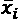只能属于单个聚类*c*j。

更一般地说，如果我们将我们的宇宙分成带标签的分区，硬聚类方法将为每个样本分配一个标签，而模糊(或软)方法将允许管理隶属度(在高斯混合中，这是一个实际概率)*w*ij，它表示点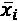和聚类*c*j 之间的关系有多强。

与其他方法相反，通过使用模糊逻辑，可以定义不能用连续函数表示的非对称集合(如梯形)。这允许进一步的灵活性和增加的适应更复杂几何形状的能力。下图显示了模糊集的示例:


根据经验年数表示员工资历级别的模糊集示例

该图显示了给定工作年限的员工的资历水平。因为我们想将整个人群分为三组(初级、中级和高级员工)，所以设计了三个模糊集。我们假设一个年轻的员工很有热情，在最初的学徒期后可以很快达到初级水平。解决复杂问题的机会使他们能够发展从初级到中级过渡的基本技能。大约 10 年后，员工可以开始认为自己是高级学徒，大约 25 年后，他们的经验足以使他们有资格成为正式的高级学徒，直到他们的职业生涯结束。

由于这是一个假想的例子，我们没有调整所有的值，但是很容易比较，例如，有 7 年工作经验的员工 *A* 和有 18 年工作经验的员工 *B* 。前者约为 25%初级(即使斜率最小也在下降)，25%中级(达到高潮)，几乎 0%高级(上升)。后者是 0%初级(结束平台期)，大约 0%中级(递减)，接近 100%高级(结束平台期)。

在这两种情况下，这些值都没有被归一化，所以总和总是 1，因为我们对显示过程和比例更感兴趣。在极端情况下，模糊程度较低，而当两个集合相交时，模糊程度较高。比如 15%左右，中高级 50%左右。正如我们将要讨论的那样，在对数据集进行聚类时避免非常高的模糊度是非常有用的，因为这会导致边界逐渐消失，变得完全模糊，从而导致精度下降。

模糊 C 均值是标准 K 均值的推广，具有软赋值和更灵活的聚类。要聚类的数据集(包含 *M 个*样本)表示为:

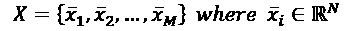

如果我们假设有 *k* 个聚类，那么有必要定义一个矩阵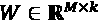来包含每个样本的隶属度:

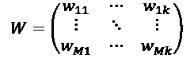

每个度数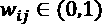和所有行都必须被规范化，这样它们的总和总是 1。这样，隶属度可以被认为是概率(具有相同的语义)，并且更容易根据预测结果做出决策。如果需要硬分配，可以采用通常用于高斯混合的相同方法:通过应用 argmax 函数来选择获胜的聚类。然而，只有在可以管理矢量输出时，才使用软聚类是一种好的做法。例如，概率/隶属度可以被输入到分类器中，以便产生更复杂的预测。

与 K 均值一样，该问题可以表示为广义惯性的最小化:

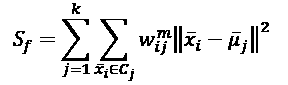

常数 *m (m > 1)* 是用于重新加权隶属度的指数。非常接近 1 的值不会影响实际值。更大的 *m* 值会降低它们的幅度。当重新计算质心和新的隶属度时，也使用相同的参数，并且可以导致不同的聚类结果。很难定义一个全球可接受的值；因此，一个好的做法是从平均值 m(例如 1.5)开始，并执行网格搜索(可以从高斯或均匀分布中采样)，直到达到所需的精度。

最小化前面的表达式甚至比使用标准惯性更困难；因此，采用了伪劳埃德算法。在随机初始化之后，算法继续进行，交替两步(像 EM 过程)以确定质心并重新计算隶属度以最大化内部内聚力。质心由加权平均值确定:

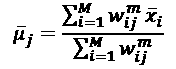

与 K-means 相反，总和不限于属于特定聚类的点，因为权重因子将迫使最远的点(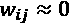)产生接近 0 的贡献。同时，由于这是一个软聚类算法，没有强加排除，以允许一个样本属于任何数量的具有不同隶属度的聚类。重新计算质心后，必须使用以下公式更新隶属度:

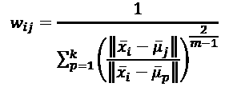

该函数的行为类似于相似性。事实上，当样本 *x* [i] 非常接近质心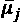(而相对远离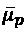与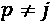)时，分母变小， *w* [ij] 增大。指数 *m* 直接影响模糊划分，因为当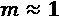 ( * m * > 1)时，分母是准平方项的和，并且最接近的质心可以支配该和，从而产生对特定聚类的更高偏好。当 *m*

理解这一点很重要，即使使用软聚类，过度模糊也会导致不准确的决策，因为没有因素推动样本明确属于特定的聚类。这意味着问题要么是不适定的，要么是，例如，预期的集群数量太高，不能代表真正的底层数据结构。标准化的 Dunn's partitioning coefficient 提供了一种衡量该算法与硬聚类方法(如 K-means)相似程度的好方法:

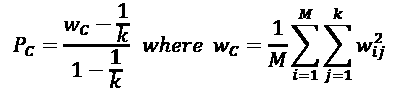

当 *P* [C] 介于 0 和 1 之间时，当它接近 0 时，意味着隶属度具有平坦的分布，并且模糊程度是最高的。另一方面，如果接近 1，则每一行的 *W* 都有一个占优值，而其他的都可以忽略不计。这种情况类似于硬聚类方法。较大的 *P* [C] 值通常是优选的，因为即使不允许一定程度的模糊，它们也允许做出更精确的决策。

考虑到前面的例子，当集合不相交时， *P* [C] 趋向于 1，而如果例如三个资历级别被选择为相同和重叠，则它变成 0(完全模糊)。当然，我们有兴趣通过限制临界情况的数量来避免这种极端情况。可以通过分析不同数量的聚类和 *m* 值来执行网格搜索(在本例中，我们将使用 MNIST 手写数字数据集来执行此操作)。一个合理的经验法则是接受大于 0.8 的 *P* [C] 值，但在某些情况下这是不可能的。如果我们确定问题是适定的，那么最好的方法是选择使 *P* [C] 最大化的配置，然而，考虑到小于 0.3 - 0.5 的最终值将导致非常高的不确定性，因为聚类将极度重叠。

完整的模糊 C 均值算法是:

1.  设置最大迭代次数*N*max
2.  设置公差 *Thr*
3.  设置 *k* 的值(预期聚类数)
4.  用随机值初始化矩阵 *W* ^((0)) ，并归一化每一行，将其除以其总和
5.  设置 *N = 0*
6.  而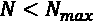或:
    1.  *N = N +1*
    2.  对于 *j = 1* 至 *k* :
    1.  计算质心矢量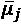
    1.  重新计算权重矩阵*W*(^t^)
    2.  规格化*W*(^t^)的行

在理论讨论之后，我们现在可以使用 scikit-fuzzy Python 包分析该算法的一个具体示例，将结果与经典的硬聚类方法进行比较。

## 使用 SciKit-Fuzzy 的模糊 C 均值示例

sci kit-Fuzzy([http://pythonhosted.org/scikit-fuzzy/](http://pythonhosted.org/scikit-fuzzy/))是一个基于 SciPy 的Python 包(可以使用`pip install -U scikit-fuzzy`命令安装)。如需进一步说明，请访问[http://pythonhosted.org/scikit-fuzzy/install.html](http://pythonhosted.org/scikit-fuzzy/install.html)，它允许您实现所有最重要的模糊逻辑算法(包括模糊 C 均值)。

在这个例子中，我们将继续使用我们在上一章中使用的 MNIST 数据集，但是主要关注模糊分区。为了执行聚类，SciKit-Fuzzy 实现了`cmeans`方法(在`skfuzzy.cluster`包中)，它需要几个强制参数:数据，它必须是一个数组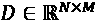 ( *N* 是特征的数量；因此，与 scikit-learn 一起使用的数组必须被转置)；`c`，集群的数量；`m`，误差系数，即最大公差；以及`maxiter`，最大迭代次数。另一个有用的参数(不是强制的)是种子参数，它允许您指定随机种子，以便能够轻松地重现实验。我邀请您查看官方文档以获取更多信息。

此示例的第一步是执行聚类:

```
from skfuzzy.cluster import cmeans
fc, W, _, _, _, _, pc = \
    cmeans(X_train.T, c=10, m=1.25, 
           error=1e-6, maxiter=10000, seed=1000)
```

`cmeans` 函数返回许多值，但是对于我们的目的来说，最重要的是:第一个，它是包含聚类质心的数组；第二个是最终的隶属度矩阵；最后一个，分配系数。为了分析结果，我们可以从分配系数开始:

```
print('Partition coeffiecient: {}'.format(pc))
```

输出是:

```
Partition coeffiecient: 0.6320708707346328
```

这个值告诉我们，聚类离硬分配不远了，但是仍然存在残余的模糊性。在这种特殊情况下，这种情况可能是合理的，因为我们知道许多数字图像是部分失真的，并且可能与其他数字非常相似(1、7 和 9 很容易混淆)。但是，我邀请您尝试不同的`m`值，并检查分配系数如何变化。我们现在可以显示质心:

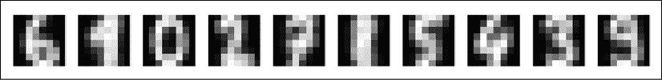

模糊 C-均值获得质心

已经成功地找到了所有不同的数字类，但是现在，与 K-means 相反，我们可以检查有问题的样本(用索引 7 表示 7)的模糊性，如下图所示:


选择样本(a 7)测试模糊度

与前一个样本相关联的隶属度为:

```
print('Membership degrees: {}'.format(W[:, 7]))
```

输出为:

```
Membership degrees: [0.00373221 0.01850326 0.00361638 
 0.01032591 0.86078292 0.02926149
 0.03983662 0.00779066 0.01432076 
 0.0118298]
```

与对应的情节是:

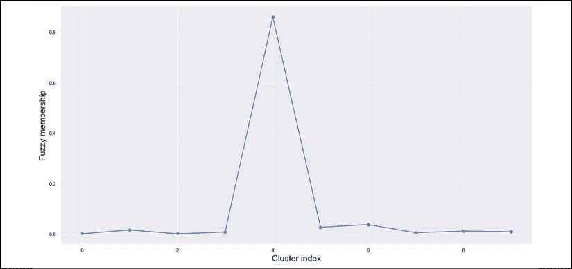

对应于代表 7 的数字的模糊隶属度图

在这种情况下，`m`的选择迫使算法减少了模糊性。但是，仍然可以看到三个较小的峰值，分别对应于以数字 1、8 和 3 为中心的聚类(记住，在这种情况下，聚类索引 1、6 和 8 对应于之前在质心图中显示的数字)。我邀请你分析不同数字的模糊划分，并用不同的`m`参数值重新绘制。随着`m`值的增大，有可能观察到模糊程度的增加(也对应于较小的分配系数)。这种效果是由于簇之间有更强的重叠(也可以通过绘制质心来观察)，并且在需要检测样本失真时可能很有用。事实上，即使主峰指示正确的聚类，次峰以降序方式告诉我们样本与其他质心的相似程度，因此，它是否包含其他子集的特征。

```
7):
import numpy as np
from skfuzzy.cluster import cmeans_predict
new_sample = np.expand_dims(X_train[7], axis=1)
Wn, _, _, _, _, _ = \
    cmeans_predict(new_sample, cntr_trained=fc, m=1.25, 
                   error=1e-6, maxiter=10000, seed=1000)
print('Membership degrees: {}'.format(Wn.T))
```

输出是:

```
Membership degrees: [[0.00373221 0.01850326 0.00361638 
 0.01032591 0.86078292 0.02926149
 0.03983662 0.00779066 0.01432076 
 0.0118298]]
```

# 谱聚类

K-means 和其他类似算法最常见的问题之一是假设我们只有超球簇。事实上，K-means 对角度不敏感，并且仅根据点和质心之间的最近距离来分配标签。最终的几何图形基于超球体，其中所有点共享相同的条件以更接近相同的质心。当数据集被分割成可以容易地嵌入到常规几何结构中的斑点时，这种情况可能是可接受的。但是，当集合不能使用规则形状分离时，它就会失败。例如，让我们考虑以下二维数据集:

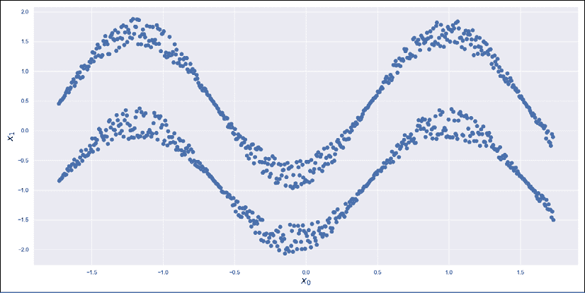

正弦数据集

正如我们在示例中将要看到的那样，任何使用 K-means 将上部正弦波与下部正弦波分离的尝试都将失败。原因很明显:包含上集合的圆也会包含下集合的一部分(或全部)。考虑到 K-means 采用的标准并强加两个集群，惯性将通过对应于大约*x*0= 0 的垂直间隔而最小化。因此，得到的簇是完全混合的，并且只有一个维度有助于最终的配置。然而，这两个正弦曲线集合被很好地分开，并且不难检查，从较低的集合中选择一个点*x*I，总是可以找到只包含属于同一集合的样本的球。当讨论标签传播算法时，我们讨论了这种问题，谱聚类背后的逻辑本质上是相同的(要了解更多细节，我邀请您查看*第 5 章*、*基于图的半监督学习*)。

假设我们有一个数据集 *X* 从数据生成过程*p*数据中采样:

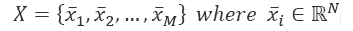

我们可以构建一个图 *G* = { *V，E* }，其中顶点是点，边是使用亲和矩阵 *W* 确定的。每个元素*w*ij 必须表达点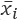和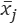点之间的亲和度。 *W* 通常使用两种不同的方法制造:

*   **K-最近邻** ( **KNN** ):在这种情况下，我们可以为每个点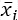建立要考虑的邻居数量。如果我们采用以下标准，w 可以构建为连接矩阵(仅表示两个样本之间存在连接):

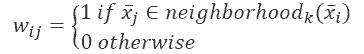

或者，可以建立一个*距离矩阵*:

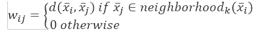

*   **径向基函数** ( **RBF** ):之前的方法会导致图不完全连通，因为样本可能存在没有邻居。为了获得完全连通的图，可以使用 RBF(这种方法也用于 Kohonen 映射算法，在第 15 章、*集成学习基础*中讨论过):

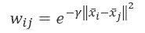

参数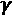允许您控制高斯函数的幅度，减少或增加具有较大权重的样本数量(实际邻居)。然而，权重被分配给所有点，并且结果图将总是连接的(即使许多元素接近于零)。

在这两种情况下， *W* 的元素将表示点之间的亲和力(或接近度)的度量，并且对全局几何形状没有任何限制(与 K-means 相反)。特别是，使用 KNN 连接矩阵，我们隐式地将原始数据集分割成具有高内聚力的较小区域。我们现在需要解决的问题是找到一种方法来合并属于同一个集群的所有区域。

我们在这里要介绍的方法是由 Shi 和 Malik 提出的(在 Shi J .，Malik J .，*归一化切割和图像分割*，IEEE 模式分析和机器智能汇刊，第 22 卷，2000 年 8 月)，并且它基于归一化图拉普拉斯算子:

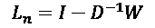

矩阵 *D* ，称为度矩阵，与*第五章*、*基于图的半监督学习*中讨论的相同，定义为:

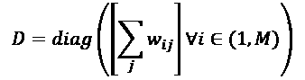

有可能证明以下性质(形式证明被省略，但它们可以在文本中找到，如盖尔范德 I. M .、格拉戈列娃 E. G .、什诺尔 E. E .、*函数和图形第 2 卷*、麻省理工学院出版社，1969 年或 Biyikoglu T .、莱多尔德 j .、斯塔德勒 P. F .、*拉普拉斯特征向量图、*斯普林格，2007 年):

*   *L*n 的特征值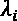和特征向量可以通过求解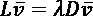得到，其中 *L* 为非规范化图拉普拉斯 *L = D - W*
*   *L* [n] 总是有一个等于 0 的特征值(具有重数 *k* )和一个相应的特征向量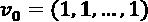
*   由于 *G* 无向且全部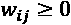，所以 *G* 的连通分量 *k* 的个数等于零特征值的重数

换句话说，归一化图拉普拉斯对关于连通分量的数量的信息进行编码，并为我们提供了一个新的参考系统，其中可以使用规则的几何形状(通常为超球面)来分离聚类。为了更好地理解这种方法如何在没有重要的数学方法的情况下工作，揭示*L*n 的另一个属性是很重要的。

从线性代数中，我们知道矩阵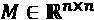的每个特征值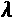跨越一个对应的特征空间，该特征空间是包含与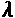相关联的所有特征向量加上零向量的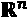的子集。此外，给定一个集合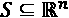和一个可数子集 *C* (可以将定义扩展到一般子集，但在我们的上下文中，数据集总是可数的)，我们可以将一个向量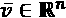定义为指示向量，if 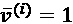 if 向量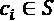和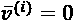否则。如果我们考虑 *L* [n] 的零特征值，并且我们假设它们的数目是 *k* (对应于特征值 0 的重数)，就有可能证明对应的特征向量是它们中的每一个所跨越的特征空间的指示向量。

从前面的陈述中，我们知道这些特征空间对应于图 *G* 的连通分量；因此，用投射到这些子空间中的点执行标准聚类(像 K-means 或 K-means++)允许用对称形状容易地分离。

自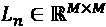，其特征向量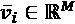。选择第一个 *k 个*特征向量，就可以建立一个矩阵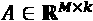:

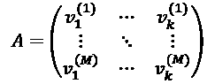

*A* 、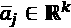的每一行可以被认为是原点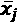在低维子空间中的投影，该低维子空间由与*L*n 的零特征值相关联的特征向量所跨越。在这一点上，新数据集的可分性仅取决于图 *G* 的结构，特别是邻居的数量或 RBF 的参数。与许多其他类似情况一样，不可能为所有问题定义一个合适的标准值，尤其是当维度不允许目视检查时。合理的方法应该从少量的邻居(例如 5 或 10)或开始，并增加这些值，直到性能指标(例如调整后的 Rand 指数)达到其最大值。

不幸的是，每个问题都有非常具体的要求，很难为数据科学家提供坚如磐石的默认值。所有工具包都倾向于使用中间参数级别，让用户选择最合适的配置。例如，考虑 KNN 场景，如果底层拓扑兼容，5、10 或 100 个邻居可能是合理的选择。必须明确的是，一个邻域应该总是相对较小的。更准确地说，用户可以将点的邻域想象为构建块(实际上，它们被用作拓扑理论中的基础),以构建数据集所在的整体超曲面(或流形)。给定一个度量函数，可以考虑样本大小 *S* 来确定邻居的最小数量。当密度足够大时，对应于 *S* 的 0.1% - 0.5%的值可能是很好的默认选择。另一方面，由于大量连接的组件，过大的粒度也可能产生不正确的结果。

另一个需要记住的重要因素是，KNN 经常导致非连接的亲和矩阵。所有最常见的库都可以管理数值不稳定性问题(例如，如果度矩阵的 det( *D* ) = 0，则它是不可逆的，必须采用更健壮的解决方案)，但在某些特定情况下，分裂图可以隐藏关于结构的相关信息。

因此，您应该仔细评估计算 *W* 的策略，并在软件输出关于缺乏连接的警告时检查结果(例如，scikit-learn 输出精确的警告，必须始终考虑这一点)。

考虑到问题的性质，测量同质性和完整性(在前一章中讨论过)也是有帮助的，因为这两种测量对不规则的几何结构更敏感，并且可以很容易地显示聚类何时没有正确地分离集合。如果地面真相未知，轮廓分数可用于评估作为所有超参数(聚类数、邻居数或)函数的聚类内内聚和聚类间分离。

完整的 Shi-Malik 谱聚类算法是:

1.  在 KNN (1)和 RBF (2)之间选择一种图形构造方法:
    1.  选择参数 *k*
    2.  选择参数
2.  选择期望的簇数*N*K
3.  计算矩阵 *W* 和 *D*
4.  计算归一化图的拉普拉斯*L*n
5.  计算*L*n 的前 k 个特征向量

1.  构建矩阵*一个*
    1.  使用 K-means++对 *A* 的行进行聚类(或任何其他对称算法)。

这个过程的输出是这组聚类:此时，我们可以使用 scikit-learn 创建一个示例，目标是比较 K-means 和谱聚类的性能。

## 使用 scikit-learn 进行光谱聚类的示例

在本例中，我们将使用之前显示的正弦数据集。第一步是创建它(有 1000 个样本):

```
import numpy as np
from sklearn.preprocessing import StandardScaler
nb_samples = 1000
X = np.zeros(shape=(nb_samples, 2))
for i in range(nb_samples):
    X[i, 0] = float(i)

    if i % 2 == 0:
        X[i, 1] = 1.0 + (np.random.uniform(0.65, 1.0) * 
                         np.sin(float(i) / 100.0))
    else:
        X[i, 1] = 0.1 + (np.random.uniform(0.5, 0.85) * 
                         np.sin(float(i) / 100.0))

ss = StandardScaler()
Xs = ss.fit_transform(X)
```

此时，我们可以尝试使用 K-means(带`n_clusters=2`)对其进行聚类:

```
from sklearn.cluster import KMeans
km = KMeans(n_clusters=2, random_state=1000)
Y_km = km.fit_predict(Xs)
```

结果如下图所示:


使用正弦数据集的 k 均值聚类结果

正如所料，K-means 无法分离两个正弦波。您可以自由地尝试不同的参数，但结果总是不可接受，因为 K-means 二维集群是圆形的(当在中工作时，它们变成超球体，但结构关系保持不变)，并且不存在有效的配置。很容易理解，完整性和同质性都非常低，因为每个类都包含另一个类的大约 50%的样本。

我们现在可以使用基于 KNN 算法的亲和矩阵进行谱聚类(在这种情况下，scikit-learn 会产生一个警告，因为图没有完全连接，但这通常不会影响结果)。Scikit-learn 实现了`SpectralClustering`类，其最重要的参数是`n_clusters`，即预期的聚类数；亲和力，可以是`rbf`也可以是`nearest_neighbors`；伽玛(仅用于 RBF)；和`n_neighbors`(仅适用于 KNN)。对于我们的测试，我们选择了`20`邻居:

```
from sklearn.cluster import SpectralClustering
sc = SpectralClustering(n_clusters=2, 
                        affinity='nearest_neighbors',
                        n_neighbors=20, 
                        random_state=1000)
Y_sc = sc.fit_predict(Xs)
```

光谱聚类的结果如下图所示:


使用正弦数据集的光谱聚类结果

正如所料，该算法能够完美地分离两个正弦波。尽管这个场景非常简单，但它完美地展示了每当*标准*分离无法立即实现时，将数据集投影到特征空间的优势。计算内核的计算成本与方法成正比(由于现代架构上可实现的并行性，RBF 可以更快)，但一般来说，除了已经讨论过的关于 KNN 的限制之外，没有具体的限制。这个算法的主要*后验*考虑的是它的内部结构。特征空间和核是非常强大的工具，但它们总是要求几何中存在正则性。在某些情况下，这几乎是不可能获得的(即使使用非常复杂的投影)，因此，结果可能不是非常准确。

作为练习，我邀请您使用 RBF(具有不同的 gamma 值)和 KNN(具有不同的邻域数)对 MNIST 数据集应用谱聚类。我还建议重新绘制 t-SNE 图，比较所有的赋值错误。由于聚类是严格非凸的，我们不期望有高的轮廓分数。其他有用的练习是绘制轮廓图和检查结果，分配地面真相标签，并测量同质性和完整性。在继续之前，我想提醒你，高维数据集的二维图必须始终仔细评估，最重要的是，通过非线性降维算法(例如，t-SNE 或 LLE)获得。标绘两个特征而排除其余的特征会产生误导性结果，例如，完全分离的聚类显示为重叠的，反之亦然。

在下一节，我们将讨论一种方法，这种方法完全不受几何图形的限制，并且可以比其他方法更有效地分割不规则数据集。

# DBSCAN

迄今为止讨论的大多数聚类方法都是基于对数据集几何结构的假设。例如，K-means 可以找到超球面区域的质心，而谱聚类的限制较少(特别是使用 KNN 亲和矩阵)，但它需要您知道所需的聚类数，这样的选择决定了结果。另一方面，谱聚类以及 **DBSCAN** (代表**带噪声应用的基于密度的空间聚类**)可以与非凸聚类一起工作，而 K-means 需要这样的条件。

DBSCAN 是由 Ester 等人提出的一种算法(在 Ester M .，Kriegel H. P .，Sander J .，Xu X .，*一种用于在具有噪声的大型空间数据库中发现聚类的基于密度的算法*，第二届知识发现和数据挖掘国际会议论文集，出版社，第 226-231 页，1996)以克服所有这些局限性。

主要假设是 *X* 代表从多模态分布中抽取的样本，其中一些密集区域被几乎空的区域充分地彼此分开。我们之所以说“足够”，是因为 DBSCAN 还假设存在噪声点，这些噪声点通常位于边界上，并且可以分配给多个集群。在这些情况下，像 K-means 这样的算法会在两种可能的情况下强制进行分配:

*   。在这种情况下，有一个聚类的质心是最近的一个，并且分配是直接的。
*   。在这种情况下(这是非常不可能的)，所有距离都是相等的，因此该算法通常会选择第一个聚类(即使该选择也可能是完全随机的)。

相反，DBSCAN 不需要您指定所需的聚类数，它可以找到将高密度和内聚性区域从分离区域中分离出来所需的所有拓扑约束。该过程的工作原理是对每个点进行分类，然后自然聚合成带标签的聚类和噪声点。

给定一个点和一个预定义的距离度量(例如，欧几里德距离)，算法确定属于球的点集。如果包含超过 *n 个* [个最小]点(除了)，则被标记为核心点。所有其他点标记为*从核心点直接密度可达*。直接密度可达点与核心点具有相同的重要性,因为从拓扑学的观点来看，这种关系是对称的(也就是说，当球以核心点为中心时，核心点成为直接密度可达点)。

现在让我们考虑一系列的点。如果是从直接密度可达，则点标记为从密度可达*。*

 *这个概念比前一个弱，它既取决于半径又取决于数值*n*min。这个概念如下图所示:


当时，点是从密度可达的

当时，通过序列很容易验证是从密度可达的。事实上，在最少四个邻居的情况下，所有三个点都是核心点，并且它们中的每一个都是从邻居直接密度可达的，因此，该序列导致密度可达点。

给定三个点，如果和都是从密度可达的，那么它们也被标记为*密度连接*到。密度联系是一个更弱的条件，它不是对称的。事实上，有可能找到密度连接的三元组，其中是从密度可达的，但反之不成立。当我们在一个序列中预定义的方向上移动时，连接点可以是直接密度可达的(因此，隐含地是一个核心点)，只要它的邻域包含足够多的点。

如果我们用表示计算属于一个球的点数的函数，我们可以考虑一个场景，其中和，并且可以定义使得。这允许我们建立密度-可达性条件，并且我们可以前进到涉及和的下一步。相反，当 *k > > 0* ，可以有少于 *n* [min] 的点时，可达性被破坏，我们不能在方向上移动。密度连接是 DBSCAN 中的一个中心概念，调整超参数所需的大部分工作涉及正确选择和 *n* [min] ，以便最小化噪声点的数量，并允许必须属于同一聚类的所有点的密度连接。事实上，该算法将基于以下内容来定义聚类*C*p:

*   所有密度相关的情侣
*   如果，从密度可达的所有

完成此过程后，所有密度可达点都已被分配给一个集群。形式上任何都不可密度到达的剩余点被标记为*噪声*并被分组到附加的虚拟集群中。

正如预期的那样，DBSCAN 不需要任何几何约束，而是完全依赖于每个点的邻居。这个性质保证了非凸区域的可分性，在温和的假设下，它们被低密度超体积分隔开(通常会发生)。因此，DBSCAN 特别适合于具有许多不规则性的空间应用(例如，地理或生物医学分割)。然而，在许多更简单的算法失败的情况下，它也可以完美地工作。要考虑的最重要的因素是它的计算复杂度，根据 KNN 策略，其范围从到。由于通常使用 Ball 树和 KD 树来构建邻域，因此前面几节中讨论的所有注意事项仍然有效，在选择最合适的叶子大小时应该小心谨慎，以减少比较次数并避免二次复杂度(对于大型数据集来说，二次复杂度可能过于昂贵)。

在给出实际例子之前，提醒您为每个特定任务选择的距离度量的重要性也是有帮助的。当数据集具有高维度时，使用带有的闵可夫斯基距离来区分点会变得更加困难。由于 DBSCAN 依赖于距离函数发现所有密度连接链的能力，因此在选择最佳聚类算法之前，应仔细评估高维数据集。此外，考虑使用曼哈顿距离(这是最敏感的距离函数)获得的结果，并将它们与使用默认欧几里德距离获得的结果进行比较是很有用的。在某些情况下，额外的辨别力足以避免过多的噪声点，并检测到大多数密度连接链。当然，没有预定义的方法，数据科学家的角色也是检查结果(使用适当的评估指标，如 Calinski-Harabasz 或 Silhouette score ),并与业务领域专家一起验证它们。

## 带有 scikit-learn 的 DBSCAN 示例

在本例中，我们将构建一个二维数据集来表示一个区域，其中每个点都是一组标准化的建筑物。目标是找到所有的团块并对它们进行分类。

让我们开始使用 11 个部分重叠的二元高斯分布创建数据集:

```
import numpy as np
mus = [[-5, -3], [-5, 3], [-1, -4], [1, -4], [-2, 0], 
       [0, 1], [4, 2], [6, 4], [5, 1], [6, -3], [-5, 3]]
Xts = []
for mu in mus:
    n = np.random.randint(100, 1000)
    covm = np.diag(np.random.uniform(0.2, 3.5, size=(2, )))
    Xt = np.random.multivariate_normal(mu, covm, 
                                       size=(n, ))
    Xts.append(Xt)
X = np.concatenate(Xts)
```

下图显示了数据集的绘图:


表示地理区域中建筑物的二维空间分布的数据集

可以看出，数据集表示一个区域，其中有一些主要中心(大的聚集区)、次要中心(较小的聚集区)和低密度区域(郊区)。我们的目标是使用 DBSCAN 找出代表同质区域的最佳集群数量。

应该清楚的是，由于的拓扑性质，密度连接的点构成本质上均匀的区域。这种性质(即，由于球具有共同的半径，所有密度连接的区域具有所有子区域的相同平均密度)。然而，由于我们不知道基本事实，在开始分析之前，引入两个新的评估指标是有帮助的:Calinski-Harabasz 和 Davies-Boulding 分数。

### 卡林斯基-哈拉巴斯评分

这个分数不需要真实的基础，并且根据最大结合和最大分离的双重原则来评估聚类过程的结果。合理的聚类结果应该显示聚类内部的低方差以及聚类和分离区域之间的高方差。为了量化这一属性，我们需要引入两个补充措施。

让我们假设数据集 *X* 已经被聚类成由它们的质心标识的 *k* 个聚类。**类内离差** ( **WCD** )定义为:


该度量提供了关于分配给每个聚类的点围绕其各自质心的分散程度的信息。在理想情况下，该值应该接近其理论最小值，这表明算法已经实现了最大可能的内部内聚性。

如果我们引入函数来计算分配给*C*I 的点数和平均全局质心(对应于包含所有的系统的几何质心)，我们还可以定义**簇间离差** ( **BCD** ):


该度量对聚类的分离进行编码。大的*BCD*k 表示致密区域彼此相对较远，形容词*远*表示它们的质心不靠近全局质心。当然，仅仅这个测量是没有帮助的，因为一个星团即使在质心很远的时候也会有很大的离差，正如所测量的。

因此，包含 *N* 个点的数据集的 Calinski-Harabasz 分数计算如下:


第一个因素是标准化项，而第二个因素同时测量分离和内聚的水平。 *CH* 的值没有上限(即使总是有一个理论上的上限，给定 *X* 的结构)，因此，较大的 *CH* 表示较好的聚类结果(大的分离和低的内部离差)。

### 戴维斯-波尔丁评分

有时，评估集群的分离比评估其内部凝聚力更有帮助。例如，在我们的案例中，我们更感兴趣的是找出凝聚体，即使它们由于城市化的规定而具有相对较低的内聚性。

如果我们有 k 个星团，我们可以从找出它们的直径开始，它与所有可能的点可以被放置的超体积成比例。如果 *C* [i] 由其形心标识，并且*N*(*C*[I])计算分配给 *C* [i] 的点数，则直径定义为:


此时，我们可以构建一个伪距离矩阵，其元素*D*ij 定义为 where 。这个选择允许我们有一个合适的距离矩阵，其中所有元素和*D*ij=*D*Ji。每一个值*D*ij 测量存在于*C*I 和*C*j 之间的分离量。事实上，大的*D*ij 意味着直径的总和大于质心的距离，因此簇部分重叠。相反，一个小的 *D* [ij] 意味着，在最优情况下，*D*[ij]>*D*[I]+*D*[j]，因此两个 *C* [i] 和*C*[j[为了更清楚，我们假设两个直径都等于 *d* 。我们希望确保两个半径之和(每个都等于 *d/2* )大于质心的距离。事实上，当*d*[ij]>*d*并且假设使用凸簇工作时，平均而言，在 *C* [i] 和 *C* [j] 之间总有一个分隔空间，因为这两个超球面不相交。]]

戴维斯-波尔丁分数定义为:


很容易理解， *DB* 在假设使用情侣间最大可能距离的情况下量化了聚类间的平均分离量(*C*I，*C*j)。这允许我们有一个*最坏情况*度量，我们需要最小化它以获得最佳结果。

此时，我们可以在地理空间数据集上评估 DBSCAN。

## 数据库扫描结果分析

数据集 *X* 平均包含分布在表面上的 5000 个点。如果去掉单位，每方块大约有个点。由于分布是不均匀的，我们可以合理地假设每个点必须有至少个点的邻域。半径的选择并不直接，因此我们希望采用 Calinski-Harabasz 和 Davies-Bouldin 分数以及噪声点的数量，以找出最佳配置，假设:

```
from sklearn.cluster import DBSCAN
from sklearn.metrics import calinski_harabasz_score 
from sklearn.metrics import davies_bouldin_score
import numpy as np
ch = []
db = []
no = []
for e in np.arange(0.1, 0.5, 0.02):
    dbscan = DBSCAN(eps=e, min_samples=8, leaf_size=50)
    Y = dbscan.fit_predict(X)
    ch.append(calinski_harabasz_score(X, Y))
    db.append(davies_bouldin_score(X, Y))
    no.append(np.sum(Y == -1)) 
```

生成的图如下图所示:


卡林斯基-哈拉巴斯分数(左)，戴维斯-波尔丁分数(中)，噪音点数量(右)

先说吵点的数量。正如预期的那样，函数单调递减，因为较大的值产生较少的内聚聚类。然而，有两个重要的考虑因素。第一个是因为地图的地理结构(即中心周围总是有郊区或低密度区域)，我们需要假设适度数量的噪声点。第二个是函数在范围(0.2，0.3)内有明显的斜率减少。这表明，在阈值之后，噪声点的数量几乎稳定到一个极限值，该极限值对应于只有当它们变得极度重叠时才可以被合并到聚类中的点的总数。Davies-Bouldin 评分也证实了这一点，该评分在同一范围内突然增加。另一方面，当和戴维斯-波尔丁分数在相同值时，卡林斯基-哈拉巴斯分数最大。因此，也由于考虑到噪声点，我们可以接受作为最佳值，并使用 *n* [ min ] = 8 和等于合理值的叶子大小来执行聚类(然而，您可以测试其他值并比较性能)。

```
from sklearn.cluster import DBSCAN
dbscan = DBSCAN(eps=0.2, min_samples=8, leaf_size=50)
Y = dbscan.fit_predict(X)
print("No. clusters: {}".format(np.unique(dbscan.labels_).shape))
print("No. noisy points: {}".format(np.sum(Y == -1)))
print("CH = {}".format(calinski_harabasz_score(X, Y)))
print("DB = {}".format(davies_bouldin_score(X, Y)))
```

前面代码片段的输出是:

```
No. clusters: (54,)
No. noisy points: 2098
CH = 100.91669074221588
DB = 1.4949468861242001
```

DBSCAN 已经确定了 53 个聚类(1 个标签是为噪声点保留的)和 2，098 个噪声点(重要的是要记住，不同的随机种子可能会导致稍微不同的结果。在本书中，我们总是将其设置为等于 1000)。这个值可能看起来很大，在某些应用程序中，它实际上是不可接受的。然而，在我们的例子中，噪声点是识别中心周围所有低密度区域的宝贵资源，因此我们将保留它们。

聚类过程的结果如下图所示，其中密点代表噪声点:


对地理空间数据集进行 DBSCAN 的结果。圆点代表噪声点

有趣的是注意到 DBSCAN 成功识别了四个密集的大区域和一系列较小的区域。事实上，左下角的斑点是最不连贯的，查看 *X* 的图，可以看到它对应于彼此非常接近的小区域(例如，城镇)，但总是被许多孤立的点分开。此外，还有郊区(例如，左上方的星团周围)，其密度足以被视为较小的星团。这也是地理数据集的一个特殊属性，我们将接受它们，因为它们在语义上是有效的。当然，当向领域专家提交结果时，可能会收到一个请求，例如，减少噪音点的数量。我们已经知道要付出的代价是拥有更少的内聚集群。事实上，当时，可以观察到集群的数量急剧减少，因为越来越多的区域变得密度相关，并因此聚集成单个块。

在这些情况下，您可以显示使用不同参数集(包括指标，默认为欧几里得)获得的结果的比较，并解释 DBSCAN 的动态。例如，如果最小的集群不代表有效的实体，那么总是可以包含一个后处理步骤来聚合最小的集群。因此，通常最好从较低的(调整 *n* [min] 的值)开始，尝试了解哪些块应该合并，而不是使用内部内聚性很差的非常大的集群。作为练习，找出产生少于 10、20 和 30 个集群的最佳配置，并根据 *X* 的结构比较激发选择的结果。

# 总结

在这一章中，我们介绍了一种称为模糊 C-均值的软聚类方法，它类似于标准 K-均值的结构，但允许管理隶属度(类似于概率),该隶属度对样本与所有聚类质心的相似性进行编码。这种方法允许在更复杂的流水线中处理成员向量，例如，在流水线中，聚类过程的输出被馈送到分类器中。

K-means 和类似算法的最重要的限制之一是聚类的对称结构。这个问题可以用谱聚类等方法来解决，谱聚类是一种基于数据集图的非常强大的方法，与非线性降维方法非常相似。我们分析了 Shi 和 Malik 提出的一个算法，展示了它如何容易地分离非凸数据集。

我们还讨论了一种完全几何无关的算法 DBSCAN，它在需要发现复杂数据集中的所有密集区域时非常有用，以及 Calinski-Harabasz 和 Davies-Boulding 分数，这是两种新的评估方法。

在下一章*第 8 章*、*聚类和无监督营销模型*中，我们将介绍一些无监督模型，这些模型对市场细分和推荐(特别是双聚类)非常有帮助，可以更好地理解客户的行为(先验)，并根据他们的买家资料推荐产品。

# 延伸阅读

*   阿格沃尔·c . c .，欣内堡·a .，凯米 D. A .，*关于高维空间中距离度量的惊人行为*，ICDT，2001 年
*   Arthur D .、Vassilvitskii S .，*仔细播种的优势*，k-means++:第十八届 ACM-SIAM 离散算法年会论文集，2006 年
*   Pedrycz W .，Gomide F .，*模糊集介绍*，麻省理工学院出版社，1998
*   石军，马利克，*归一化切割与图像分割*，IEEE 模式分析与机器智能汇刊，第 22 卷，08，2000
*   盖尔范德 I. M .、格拉戈列娃 E. G .、施诺尔 e . e .*函数与图形第二卷*，麻省理工学院出版社，1969 年
*   Biyikoglu T .，Leydold J .，斯塔德勒 P. F .，*图的拉普拉斯特征向量*，施普林格，2007
*   Ester M .、Kriegel H. P .、Sander J .、Xu X .，*一种基于密度的带噪声大型空间数据库聚类发现算法*，第二届知识发现与数据挖掘国际会议论文集，出版社，第 226-231 页，1996
*   Kluger Y .，Basri R .，Chang J. T .，Gerstein M .，*微阵列癌症数据的光谱双聚类:基因和条件的共聚类*，基因组研究，13，2003
*   黄，s，王，h，李，d，杨，y，李，t，【谱协聚类集成】。知识系统，84，46-55，2015
*   Bichot，c .，*通过最小化标准化切割目标函数*来共同聚类文档和单词。数学建模与算法杂志，9(2)，131-147，2010
*   Agrawal R .、Srikant R .，*快速算法 f 或挖掘关联规则*，第 20 届^和 VLDB 会议论文集，1994
*   李，杨，*Apriori 算法在关联规则领域的应用*。SPIE 会议录，8878，88784H-88784H-5，2013
*   Bonaccorso G .，*用 Python 进行动手无监督学习*，Packt 出版社，2019*