# 九、广义线性模型和回归

在本章中，我们将介绍**广义线性模型** ( **GLMs** )和回归的概念，它们仍然是计量经济学和流行病学等主题的重要支柱。目标是解释基本要素并扩展它们，显示优点和局限性，同时还关注可以使用不同类型的回归技术有效解决的实际应用。

特别是，我们将讨论以下内容:

*   GLMs
*   基于普通最小二乘法和加权最小二乘法的线性回归
*   其他回归技术以及何时使用它们，包括:
    *   岭回归及其实现
    *   带编码示例的多项式回归
    *   保序回归
    *   用 lasso 和逻辑回归进行风险建模

我们要讨论的第一个概念是本章分析的所有其他算法的核心，它基于将因变量描述为不同预测值的线性组合。更正式的说法是，这个概念被称为 GLM。

# GLMs

让我们通过定义我们正在处理的上下文来开始我们对回归模型的分析。回归是一种将输入向量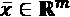与一个或多个连续因变量(为简单起见，我们称之为单输出)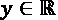相关联的模型。在一般情况下，不存在对时间的显式依赖，即使经常使用回归模型来建模时间序列。主要区别在于，在后者中，数据点的顺序不能改变，因为通常存在相互依赖性。另一方面，通用回归可用于建模与时间无关的现象，并且，在 GLMs 的上下文中，我们最初假设我们处理无状态关联，其中输出值仅取决于输入向量。在这种情况下，也可以在不改变最终结果的情况下混洗数据集(当然，如果时间 *t* 的输出依赖于*y*t-1，这是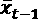的函数，依此类推，则不成立)。

假设有一个数据集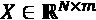，它包含从相同的数据生成过程中得到的 *N* m 维观察值， *p* 数据。每个观察与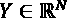中包含的相应连续标签相关联。GLM 将 *y* 和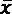之间的关系建模为:

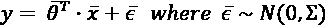

这些值被称为回归量，我们说 *y* 已经在组变量上回归了。噪声项模拟了特定现象的内在不确定性，它是一个不能丢弃的基本元素，除非关系是纯线性的(换句话说，所有点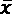都位于同一超平面上)。然而，有两种可能的情况与噪声项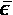相关，我们总是认为它取决于 *X* ，例如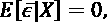，而我们通常不知道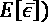的值。这意味着我们永远无法直接估计噪声的矩，而只能通过对输入样本进行调理来估计。

多亏了中心极限定理，我们通常可以使用正态分布来模拟噪声。均值可以保持等于 0，因为其他值仅指示一个偏移，但是协方差矩阵可以采用两种不同的形式:

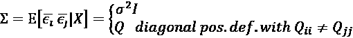

我们已经排除了一般正定矩阵的第三种情况，因为我们假设我们有非自相关噪声，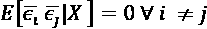(换句话说，每个回归量都受一个*自治的*噪声分量的影响，该噪声分量不依赖于其他项，这在大多数情况下是一个相当合理的假设)。如果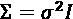，该噪声称为*同方差*。

在这种情况下，所有输入变量都受到具有相同方差的噪声的影响；因此，我们经常含蓄地假设它们都有相同的规模。当这个条件不满足时，噪声的影响将根据每个回归量的尺度而不同，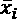。因此，在训练模型之前注意 *X* 的结构是很重要的，如果有必要，可以通过标准化变量来进行。

相反，如果是一般的对角正定矩阵(换句话说，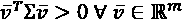并且，此外，所有特征值都是正的)，噪声被称为*异方差*，并且每个分量可以有其自己的方差。在接下来的几节中，我们将给出这两种情况下的解，但是，为了简单起见，许多结果将参考同方差情形。

## 最小二乘估计

估计参数向量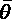的最简单方法是基于**普通最小二乘法** ( **OLS** )过程。与输入向量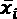相关联的估计也取决于未知的噪声项。因此，我们需要考虑期望值:

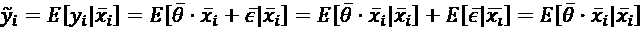

最后一项包含在存在噪声的情况下对真实参数向量的估计。为了简单起见，我们继续用表示估计值，但是必须清楚的是，实际值是未知的。因此，我们可以这样写:


此时，我们可以计算整个训练集的平方误差:

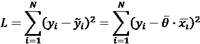

显然，噪声的估计立即转化为*残差*的概念，其定义为:

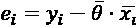

再次，我需要警告读者关于*e*I 的含义。这不是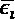，因为我们使用的是真实参数向量的估计值；然而，它是真实噪声的良好代表，不失一般性，我们将它视为模型的主要干扰成分。

使用向量符号，我们可以将 *L* 的表达式重写为:

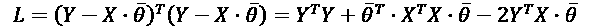

一阶导数等于:

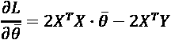

而二阶导数如下:

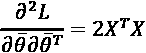

很容易看出，当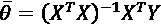时，一阶导数消失。而且，当我们寻找最小值时，*X*^T*X*一定是一个正定矩阵。后者是 GLMs 的基本假设之一。我们将在以后讨论它，但是现在，可以说*X*TX 一定是可逆的。因此，行列式不能为空。如果数据集 *X* 具有满秩(相对于列)，这总是可能的。如果*rank*(*X*)=*m*，则回归量线性无关，并且*X*^T*X*没有与其他成比例的列或行(导致 det(*X*^T*X*)= 0 的条件)。其实我们来考虑一个简单的模型，有两个变量和两个观测值:y =*ax*[1]+*bx*[2]。矩阵 *X* 为:

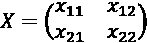

于是，*X*T^TX*就变成了:*

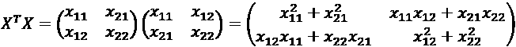

如果*X*[2]=*kx*[1]， *X* ^T *X* 变成:

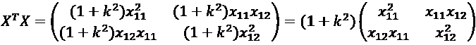

因此，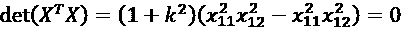和*X*TX 是不可逆的。这个原理对任何维度都有效，代表了一个需要最大关注的问题。我们将在分析正则化技术时讨论它。

在前面的讨论中，我们假设我们正在处理同方差噪声(换句话说，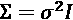)。在异方差噪声的情况下，表示为，参数向量的估计非常相似，但是有必要采用**加权最小二乘** ( **WLS** )过程。在这种情况下，成本函数变成:

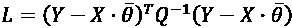

按照同样的方法，我们得到最佳估计:

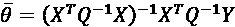

矩阵 *Q* 被假定为正定的，因此总是可逆的。

可视化线性回归的一个非常有启发性的方法是基于正交分解，假设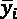是具有 *m 个*分量的矢量输出。我们先把回归表示为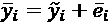。可以使用参数估计来计算残差: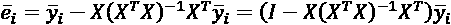。

因此，在代入不同的表达式后，我们得到如下:

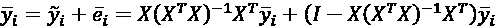

前面的表达式可以写成更简洁的形式:

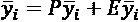

为了得出我们的结论，我们需要分析矩阵 P 和矩阵 E 的性质。首先，我们可以注意到:

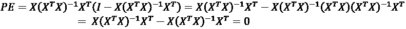

同样的结果也适用于产品 *EP* 。因此，矩阵是正交的。如果我们现在看矩阵， *E* ，我们可以注意到 *EX* = 0，事实上:

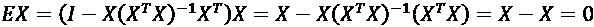

因此，残差与输入向量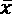所在的子空间正交。此外，考虑到分解，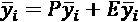，向量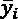被分解成一个与 *X* 正交的分量(换句话说，残差)和一个必须落在 *X* 上的分量(估计)(因为 *P* 和 *E* 是正交的)。下图显示了二维空间 *X* 的结果:

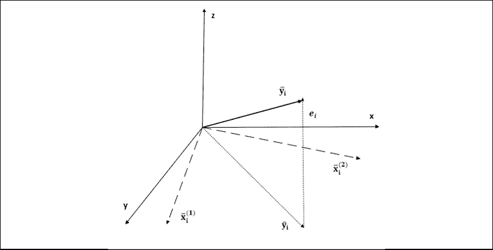

将回归分解为残差和估计输出向量

使用这种分解，可以创建一个更容易理解的线性回归的动态表示。估计的输出向量是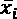的线性组合，因此它位于 *X* 的相同子空间上。原始点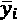需要一个额外的尺寸，该尺寸由残差覆盖。显然，如果 *e* [ i ] = 0，目标向量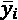已经是回归变量的线性组合(例如，对于单个变量，所有点都在一条直线上)，不需要任何回归。因此，在任何现实场景中，额外维度都是描述均值周围点的离散度的必要且不可约的条件。

## 偏差和方差的最小二乘估计量

最小二乘估计器非常容易获得，它们甚至不需要实际的训练过程，因为存在一个封闭形式的公式。然而，对于它们的偏差和方差，我们能说些什么呢？

无需证明结果(我将所有步骤留给读者作为练习)，使用最小二乘算法获得的参数向量估计(为避免混淆，我们用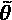表示)具有以下特性:

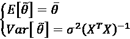

因此，该估计是无偏的，并且由于*高斯-马尔可夫定理*，它也是所有线性模型中可实现的**最佳无偏线性估计** ( **蓝色**)。这意味着，当因变量表示为回归变量的线性组合时，方差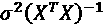不能小于该值。为了对方差进行有用的估计，我们需要知道，它通常是未知的。 *t* 自由度(参数数量)的无偏估计值为:


因此，我们可以得出结论说，估计参数向量的条件分布是正态的:


在讨论假设的时候，我们已经说过矩阵，*X*TX 一定是满秩的。我们现在可以添加另一个重要的要求，因为我们希望我们的估计量也是*渐近一致的*。换句话说，我们需要更大的样本来提高估计值。可以证明当的序列总是满秩时，样本协方差矩阵，以概率收敛于，因此:


在上式中， *EVar* 表示协方差的估计。这一结果极其重要，因为它为我们提供了保证，即更多信息的样本总是会给估计带来积极的贡献，但同时，它也表明方差有一个无法克服的下限。

## 使用 Python 进行线性回归的示例

让我们从开始，用一个简单的例子展示之前获得的结果，这个例子基于一维数据集 *X* ，包含 100 个点:

```
import numpy as np
```

```
x_ = np.expand_dims(np.arange(0, 10, 0.1), axis=1)
y_ = 0.8*x_ + np.random.normal(0.0, 0.75, size=x_.shape)
x = np.concatenate([x_, np.ones_like(x_)], axis=1)
```

读者可以注意到，我们在 *X* 中添加了一个包含(1，1，…，1)的列(换句话说，每个点用表示)。原因是我们也想拟合截距(常数项)。像 scikit-learn 这样的包在默认情况下会这样做，并且允许禁用这个选项，但是，由于我们最初要执行手动计算，所以包含常量列是有帮助的。

参数集的估计可以如下获得:

```
 theta = (np.linalg.inv(x.T @ x) @ x.T) @ y_
```

因此，拟合的模型由以下等式表示:

```
print("y = {:.2f} + {:.2f}x".
          format(theta[1, 0], theta[0, 0]))
```

前面代码片段的输出是:

```
y = -0.04 + 0.82x
```

真实斜率为 0.8，并且截距为零。因此，估计值是完全有效的，均值，而方差(不包括截距)可以计算为:

```
sigma2 = (1\. / float(x_.shape[0] - 1)) * \
     np.sum(np.power(np.squeeze(y_) -   np.squeeze(x_) *
     theta[0, 0], 2))
variance = np.squeeze(
     np.linalg.inv(x_.T @ x_) * sigma2)
```

因此，参数集的渐近分布(没有截距)为:

```
print("theta ~ N(0.8, {:.5f})".
          format(variance))
```

输出如下所示:

```
theta ~ N(0.8, 0.00019)
```

方差很小。因此，考虑到线性模型的限制，我们期待最佳拟合。结果以及原始数据集如下图所示:


数据集和回归线

我们已经自愿选择了一个噪声数据集来显示残差对最终估计的影响。特别是，我们感兴趣的是测量估计的质量，以将其与其他线性回归进行比较，例如，基于更大的样本量。一个常见的度量是*R*2 系数(也称为*决定系数*，其定义为:


术语 *SSR* 是残差平方和，对应于预测引起的变化。相反，术语 *SST* 是 *Y* 的属性，并且测量原始数据集中存在的总变化。差异*SST–SSR*，对应于模型能够解释的变化。因此，当、时。由于模型是线性的，实现这一条件的唯一方法是 *Y* 中的平均值没有变化。当时，其值与相对拟合优度成比例。事实上，如果、，因此，模型能够解释所有的变化。然而，通常是没有意义的，因为它暗示了，同样，这仅在点对齐且噪声为零时才有可能(这种情况显然不需要任何回归)。

另一个问题涉及到 *R* ² 的一个特殊特征(我们正在证明，但有兴趣的读者可以查看格林·w·h .*经济计量分析(第五版)*，普伦蒂斯霍尔出版社，2002 年):它永远不会减少，并且有可能通过添加新的回归变量来获得更大的值。事实上，通过添加新的回归变量，拟合度提高，偏差降低。显然，这是一种有助于处罚的不良做法；因此，提出了*调整版*:


这个新的度量(当 *t* = 1 时，相当于*R*2)不再局限于 0 和 1 之间，并且考虑了模型的自由度 *t* 。而且，当*N>1*和*t<N*，时。因此，在处理小数据集和大量预测值时， *AR* ² 会很有帮助。例如，如果一个模型在 100 个数据点和 10 个回归量的情况下达到了 *R* ^( 2 ) = 0.9，。这个值非常接近于*R*2 并且，一般来说，它总是小于它。因此，惩罚在极少数情况下变得明显，但是总是可以使用它来代替*R*2，以便也考虑模型的复杂性。

对于我们的示例，我们可以将*R*2 系数计算为:

```
sst = np.sum(np.power(np.squeeze(y_) - 
                      np.mean(y_), 2))
ssr = np.sum(np.power(np.squeeze(y_) - 
                      np.squeeze(x_) * theta[0, 0], 2))
print("R^2 = {:.3f}".format(1 - ssr / sst))
```

输出(不包括截距)为:

```
R^2 = 0.899
```

在这种情况下，我们已经排除了截距，因为它等于 0，其贡献为零。但是，一般来说，在包括截距的情况下， *R* ² 和 *AR* ² 必须一直计算，否则这些值可能变得无意义和不可预测。我们省略了完整的解释，但这是系数的代数推导的结果。然而，不难理解截距的效果是沿着轴移动超平面(例如，在二维场景中，线向上或向后移动)，因此*均值* [ *Y* 可以大于或小于对应于零截距的值，并且如果估计项假设零截距， *SSR* 可以表示残差变化的有偏测量。

回到我们的例子，我们得到的 *R* ² 值肯定是可接受的，并且证实了拟合的良好性。但缺失的 10%也是噪声项不可忽略的信号，部分残差相对幅度较大。由于这是一个线性模型，它是无偏的，所以没有什么可以改善性能。然而，对*R*2 的评估必须被视为决策工具。如果该值太小(例如，)，模型的精度(就均方误差或绝对误差而言)可能是不可接受的，必须采用非线性解决方案。另一方面，正如所解释的，大的 *R* ² 不一定与完美的模型相关联，但至少我们保证它解释了数据集中包含的大部分变化。

## 用统计模型计算线性回归置信区间

使用 OLS 拟合线性模型时，估计每个参数的置信区间通常很有帮助。在向您展示如何做到这一点之前，我想提醒您，置信区间被定义为找到真实参数值的概率大于或等于预定义阈值(例如 95%)的范围，而相反的说法是错误的(换句话说，估计位于区间内的概率)。

程序非常简单，主要取决于样本大小。给定一个估计参数，对应真值(为简单起见，我们考虑一个标量参数)，我们知道。因此，我们可以将相关的 *z* 分数定义为:


新变量 *z* 呈正态分布，的 95%置信区间为:


只有当样本量大到足以证明正态性假设(建议读者不要想当然)时，之前众所周知的公式才有效，并且在大多数情况下，它提供了准确的估计。然而，当 *N* 小时，中心极限定理的条件不再成立，并且*z*-分数变得根据具有 *N - t* 自由度的*t*-学生分布来分布( *t* 等于自由参数的数量，包括截距)。

因此，双尾置信区间变为:


手动计算这样的时间间隔非常容易。然而，我更喜欢展示如何使用 Statsmodels(我们也将用于其他算法)来拟合模型并获得完整的摘要。

让我们从使用先前定义的数据集创建 pandas 数据帧开始，这简化了操作:

```
import pandas as pd
```

```
df = pd.DataFrame(data=np.concatenate((x_, y_), axis=1),
                  columns=("x", "y"))
```

我们排除了截距，因为 Statsmodels 会自动包含它。因此，我们希望符合线性模型:


使用 Statsmodels 支持的标准 R 公式语言(通过 Patsy，这是一个实现类 R 公式的库)，前面的条件表示为:


在这种情况下，等号被转换为，这意味着左边是一个关系的依赖部分，而右边包含所有的自变量。关于公式语言的完整讨论超出了本书的范围(可以在官方的 Patsy 文档中找到)。然而，重要的是要记住字符+并不意味着算术加法。它允许将变量添加到依赖集，还支持基于 NumPy 的复杂表达式(例如，用于二次回归)。

我们现在可以拟合一个 OLS 模型并打印一份完整的摘要:

```
import statsmodels.formula.api as smf
```

```
slr = smf.ols("y ~ x", data=df)
r = slr.fit()
```

```
print(r.summary())
```

上一个代码片段的输出如下图所示:


OLS 的统计模型拟合汇总

摘要非常详细(一些度量将在后面的章节中讨论)，但是将注意力集中在包含参数估计的中心块是有帮助的。正如所料，截距的标准误差大于系数的标准误差， *x* 。原因是强噪声对垂直偏移的影响更大，而对斜率的影响不是太大(如果样本量足够大的话)。置信区间显示在最后两个栏中。同样，真实系数有 95%的概率在范围(0.763，0.872)内，我们知道该范围包含实际的真实值(0.8)，并且具有等于大约 0.817 的平均值，对应于估计值。

相反，截距的置信区间要大得多，即使估计是正确的()，它也告诉我们一个小的噪声变化可能导致垂直偏移。作为一个练习，我邀请读者改变噪声分布，并检查标准误差和置信区间的相应变化。

## 通过 Huber 损失提高对异常值的稳健性

迄今为止，我们已经隐含地假设我们的数据集不包含任何离群值。这相当于说，估计的协方差矩阵反映了模型中包含的实际噪声，不允许有其他外部噪声源。然而，在现实中，许多样品包含受意外噪声影响的点(例如，仪器暂时出现故障)。不幸的是，最小二乘算法不能区分内值和界外值，而且，二次损失自然地给予较大的残差更大的权重，矛盾地增加了界外值的重要性。

Huber 损失函数提供了这个问题的解决方案，它是均方误差的有效替代物。它被定义为:


这个损失函数有双重行为。当绝对残差小于预定义的阈值时，损失是二次的，就像在 OLS 一样。然而，如果绝对残差大于，则该点被视为潜在的异常值，损失变为线性，从而降低了误差的权重。通过这种方式，靠近内标的异常值比远离其余总体的异常值提供了更强的贡献，因此更有可能是虚假数据点。常数的最佳值取决于特定的数据集。一个简单的策略是选择使**平均绝对误差** ( **MAE** )最小的最大值(例如，从基线 1.5 开始，拟合模型，并计算 MAE)。通过减少重复该过程，直到 MAE 稳定到其最小值。

现在，我们可以使用之前定义的数据集的修改版本来测试 Huber 损失函数:

```
x = np.expand_dims(np.arange(0, 10, 0.1), axis=1)
y = 0.8 * x + np.random.normal(0.0, 0.75, size=x.shape)
y[65:75] *= 5.0
```

该数据集有一个影响指数范围(65，75)中的点的系统误差。由于我们并不完全清楚它们是内值还是界外值，让我们从拟合线性回归和评估 MAE 开始(当然，我们不能使用*R*2，因为它受到界外值引起的无法解释的变化的强烈影响——在这种情况下，这样的变化不需要解释！):

```
from sklearn.linear_model import LinearRegression
from sklearn.metrics import mean_absolute_error
lr = LinearRegression()
lr.fit(x, y)
```

```
print("Linear: {:.2f}".
      format(mean_absolute_error(y, lr.predict(x))))
```

前面代码片段的输出是:

```
Linear: 3.66
```

如果我们分析前 50 个数据点的分布，假设线性拟合具有系数等于 0.8 的零截距，我们得到:

```
print("Mean Y[0:50] = {:.2f}".
       format(np.mean(y[0:50] - 0.8*x[0:50])))
print("Std Y[0:50] = {:.2f}".
      format(np.std(y[0:50] - 0.8*x[0:50])))
```

输出如下所示:

```
Mean Y[0:50] = 0.01
Std Y[0:50] = 0.63
```

因此，假设一个零均值，范围之外的所有值都可以被认为是异常值，因为在两个标准差之后，概率下降到 5%以下(在正态分布下)。因此，我们可以设置并训练一个 Huber 回归量:

```
from sklearn.linear_model import HuberRegressor
```

```
hr = HuberRegressor(epsilon=1.2)
hr.fit(x, y.ravel())
```

```
print("Huber: {:.2f}".
      format(mean_absolute_error(y, hr.predict(x))))
```

现在的输出是:

```
Huber: 2.65
```

因此，Huber 回归器将 MAE 降低了约 72%，提高了对异常值的稳健性。下图显示了视觉确认:


标准线性回归与 Huber 回归的比较

该图显示了当采用简单的线性回归时，异常值的影响可能变得多么负面。相反，Huber loss 使回归线非常接近平均值，具有比周围点大大约 10 倍的点的最小吸引力。当然，的作用是决定因素；因此，我邀请读者重复这个练习，改变这个值，并找出当离群值集较大时的最佳权衡。

在继续之前，提醒我们自己在没有意识到的情况下使用*R*R²会变得多么危险是很有帮助的。在这种情况下，其值对于线性回归来说更大，因为当斜率越接近异常值时 *SSR* 越小。原因很简单: *SSR* 是一个二次测度，平均值为 30 的 10 个离群值做出的贡献可以轻松战胜平均值为 5 的 70 个内联值。在现实生活中，当数据集过于复杂而无法立即识别异常值时，我建议使用稳健缩放对要素进行预处理。这不会影响结果，但是避免了*隐藏的*异常值导致模型完全错误估计的情况。

# 其他回归技术

接下来是对以下回归技术的简要介绍，以及为什么你可能更喜欢使用它们而不是最小二乘法。在本节中，我们将介绍:

*   岭回归，在 scikit-learn 中有一个实际例子
*   套索和逻辑回归
*   举例说明多项式回归
*   保序回归

线性回归最常见的问题之一是导致解不稳定的病态。岭回归被用来解决这个问题。

## 岭回归

回归模型中一个非常常见的问题是由于*X*TX 的结构而产生的。我们之前已经表明多重共线性的存在迫使 T23，这意味着反演变得非常困难。检查多重共线性存在的一个简单方法是基于对*X*TT30 X 的*条件号*的计算，定义为:


上式中，和)分别是*X*TX 的最大和最小奇异值。由于*X*^T*X*是正定的，其特征值是正的，并且等于的奇异值总是被定义。小的与条件良好的问题相关，因此反演不成问题。相反，当时，问题是不适定的，随着 *X* 的微小变化，结果可能会发生巨大变化。

解决这个问题的一个非常简单且有效的方法是基于参数向量的*L*2 范数，采用岭(或吉洪诺夫)正则化。考虑到同方差噪声，最小二乘成本函数等于:


参数决定了正则化的强度，当考虑解决方案时，其作用是显而易见的:


在岭回归的上下文中，我们需要对求逆，即使当*X*TX 是奇异的，也可以使其非奇异。而且，随着被加到所有对角元素上，得到的系数会收缩(第一项就像除法中的分母)。越大，获得的收缩量越大。正如在*第 1 章*、*机器学习模型基础*中所讨论的，脊正则化在防止过度拟合方面起着重要作用，但是，在线性回归的情况下，它的主要作用是使模型产生偏差，以降低方差。我们在本章前面解释了偏差-方差权衡的概念，这是其必要性的一个明显例子。而且由于*X*^T*X*与协方差矩阵成正比， *Cov* [ * X * ]，而是常数，所以它对低方差分量的作用会更强。因此，当系数与不太明确的特征相关联时，ridge 通过进一步缩小系数来执行最小特征选择。

### 使用 scikit-learn 的岭回归示例

现在让我们利用 scikit-learn 中包含的糖尿病数据集来评估岭回归的效果。该数据集包含 442 名男性和女性糖尿病患者的观察结果，以及关于年龄、**体重指数** ( **身体质量指数**)和不同血压测量值(平均值和 6 个附加测量值)的信息。输出是关于疾病进展的数字指标。在没有任何进一步信息的情况下，我们可以假设条目代表不同的患者，并且不包括时间(例如，不同的数据集可能包含对应于不同时间段的相同患者的多个条目)。因此，我们想要检查线性回归是否能够成功地拟合数据。

第一步是加载数据并计算条件数(列已经被规范化):

```
import numpy as np
```

```
from sklearn.datasets import load_diabetes
```

```
data = load_diabetes()
X = data['data']
Y = data['target']
```

```
XTX = np.linalg.inv(X.T @ X)
print("k = {:.2f}".format(np.linalg.cond(XTX)))
```

前面代码片段的输出是:

```
k = 470.09
```

该值非常大，表明存在多重共线性。出于我们的目的，该结果足以使用岭回归进行分析，但是由于我们想要进行完整的调查，我们还想要计算特征之间的皮尔逊相关系数。结果矩阵的元素如下:


每个系数都有明确的含义:

*   如果 *X* 的*I*第个特征与 *X* 的*j*第个特征正相关，*R*ij0。
*   同理，如果 *X* 的 *i* ^(th) 特征与 *X* 的 *j* ^(th) 特征负相关， *R* [ij] > 0。
*   如果两个特征完全不相关，R [ij] = 0。

当然，当绝对值| *R* [ij] |接近 1 时，我们可以断定两个特征是相关的，因此问题是不适定的。合理的阈值取决于具体的环境。但是一个值|*R*ij|>0.5 要慎重考虑。

为了更好地理解，让我们来计算相关矩阵:

```
cm = np.corrcoef(X.T)
```

下图显示了热图形式的输出:


糖尿病数据集的相关矩阵

应立即注意到存在不同的大相关性，尤其是在血压值之间(这并不奇怪，考虑到这些患者定期监测他们的血压)。此时，我们可以决定以不同的方式进行:

*   评估岭回归
*   移除相关特征(仅保留每对中的一个成员)
*   选择另一种回归策略

正如我们将要看到的，简单的线性回归不是很有效。因此，有必要采用更复杂的方法。然而，评估使用一个*L*2 惩罚的好处是有帮助的。

作为第一步，让我们使用`RidgeCV`类和默认的*R*2 分数来执行 CV，以找到范围(0.1，1.0)中的最佳系数:

```
from sklearn.linear_model import RidgeCV
```

```
rcv = RidgeCV(alphas=np.arange(0.1, 1.0, 0.01),
              normalize=True)
rcv.fit(X, Y)
```

```
print("Alpha: {:.2f}".format(rcv.alpha_))
```

前面代码片段的输出是:

```
Alpha: 0.10
```

CV 网格搜索确定最小的产生最好的*R*2 分数。然而，我们知道岭回归加剧了偏差；因此，我们可以检查与相对应的条件编号:

```
print("k(0.1): {:.2f}".format(
        np.linalg.cond(X.T @ X + 
                       0.1 * np.eye(X.shape[1]))))
print("k(0.25): {:.2f}".format(
        np.linalg.cond(X.T @ X + 
                       0.25 * np.eye(X.shape[1]))))
print("k(0.5): {:.2f}".format(
        np.linalg.cond(X.T @ X + 
                       0.5 * np.eye(X.shape[1]))))
```

输出如下所示:

```
k(0.1): 37.99
k(0.25): 16.53
k(0.5): 8.90
```

条件数字肯定比以前好得多。由于对应于的值是惩罚(换句话说，偏差)和方差之间的一个很好的权衡，我们可以选择这个选项而不是 0.1，并使用 *R* ² 和 MAE 来评估岭回归:

```
from sklearn.linear_model import Ridge
from sklearn.metrics import r2_score, mean_absolute_error
```

```
lrr = Ridge(alpha=0.25, normalize=True,
                random_state=1000)
lrr.fit(X, Y)
```

```
print("R2 = {:.2f}".format(
        r2_score(Y, lrr.predict(X))))
print("MAE = {:.2f}".format(
        mean_absolute_error(Y, lrr.predict(X))))
```

输出如下所示:

```
R2 = 0.50
MAE = 44.26
```

不幸的是，表演并不精彩。特别是输出 *Y* 有和。因此，MAE 等于约 44 可能是有问题的。*R*2 得分证实了回归只能解释总变化的一小部分，此外，不同的参数选择产生的变化最小。因此，在给定足够大的样本量的情况下，引入将非线性模型的能力引入 GLMs 的技巧是一个很好的观点。

## 使用 Lasso 和逻辑回归进行风险建模

岭回归产生一个全局参数收缩，但是，如*第一章*、*机器学习模型基础*所示，约束曲面是一个以原点为中心的超球面。独立于维度，它是平滑的，这防止了参数变为零。

另一方面， *L* [1] 惩罚具有执行自动特征选择的优点，因为最小权重被推向约束超立方体的边缘。套索回归在形式上相当于脊线，但它使用了*L*1 而不是*L*2:


参数控制正则化的强度，在这种情况下，其对应于被强制变得等于零的参数的百分比。Lasso 回归拥有 ridge 的许多属性，但它的主要应用是特征选择。特别是，假设线性模型有大量参数，我们可以考虑以下关联:


当 *m* > > 1 并且所有系数都不为零时，很难理解哪些原因是主要的，以及一些贡献是否相互抵消。这种情况导致模型难以解释，因此，在需要研究原因的情况下(例如，医疗保健)帮助不大。Lasso 回归有助于解决这个问题，不需要任何外部干预。事实上，一个简单的策略可能是手动删除一些领域专家认为次要的或者与效果无关的特性。然而，这个操作可能会很长，并且容易因人的信念而产生偏差。另一方面，自动特征选择在没有任何先验信息的情况下作用于单个参数，并且从领域的角度来看，检查结果是否合理要容易得多，因为参数集要小得多。

在这个例子中，我们想使用 lasso 逻辑回归来建立风险模型，同时确定主导因素。在讨论应用之前，让我们回顾一下逻辑回归背后的主要思想。假设我们有一个描述我们想要建模的风险的二元随机变量(结果*风险* = 1 表示存在风险，类似地，*风险* = 0 表示不存在风险)。该算法基于 logit 的线性描述，即奇数比的对数:


logit 必须是非负的，并且单调递增。满足这一要求的函数是 sigmoid，。实际上，用对 *P* ( *风险* = 1)建模，定义在上，其值为，我们得到如下:


操作logit 表达式，我们得到所需的确认:


如果我们假设所有数据点都是独立同分布的，我们可以将对数似然建模为:


最后一项是真实标签的分布 *p* ( *y* )和预测标签的分布 *q* ( *y* )之间的交叉熵的二进制版本:


如，若*y*I= 0，则第一项，而第二项变为等于。反之，当*y*I= 1 时，第二项为空，第一项等于。在这两种情况下， *L* 的最大化迫使模型学习实际分布 *p* ( *y* )。如果我们明确参数向量的相关性并引入一般的惩罚项， *L* 变成:


当 p-norm 为*L*1 时，模型会在建模奇数比时执行套索特征选择。

我们现在可以使用 Python 和 scikit-learn 对乳腺癌的风险进行建模。

### 使用 Lasso 和逻辑回归的风险建模示例

现在让我们考虑一个基于乳腺癌数据集的玩具示例，该数据集包含 569 个数据点和 30 个生物特征。每个点都与一个二进制标签相关联。由于这只是一个练习，我们不考虑此类研究的真正医学要求(对该主题感兴趣的读者应该阅读一本关于流行病学的书)。然而，由于真正的标签是由医学专家保证的，如果逻辑回归成功地对样本进行分类(具有合理的准确性)，风险的 logit 也将是正确的。

让我们从使用一个健壮的缩放器和分位数范围(15，85)加载和归一化数据集开始(数据集基于**真实世界的证据** ( **RWE** )并且不包含非常嘈杂的离群值):

```
from sklearn.datasets import load_breast_cancer
from sklearn.preprocessing import RobustScaler
```

```
data = load_breast_cancer()
X = data["data"]
Y = data["target"]
```

```
rs = RobustScaler(quantile_range=(15.0, 85.0))
X = rs.fit_transform(X)
```

在这一点上，我们可以用评估 lasso 逻辑回归的性能(这个选择是通过测试对应于不同值的结果做出的。我邀请读者做同样的练习):

```
import joblib
```

```
from sklearn.linear_model import LogisticRegression
from sklearn.model_selection import cross_val_score
cvs = cross_val_score(
   LogisticRegression(C=0.1, penalty="l1", solver="saga",
                      max_iter=5000, random_state=1000),
        X, Y, cv=10, n_jobs=joblib.cpu_count())
```

```
print(cvs)
```

正如可能看到的，我们选择了施加一个*L*1 惩罚。因此，我们希望将参数的数量从 31(截距和系数)减少到一个更小的值。前面代码片段的输出如下:

```
[0.98275862 0.94827586 0.94736842 0.98245614 0.96491228 0.98245614 0.92982456 0.98214286 0.98214286 0.94642857]
```

结果显然是积极的。最差准确率 93%左右，最高 98%。因此，我们可以用整个数据集训练模型，并将其用于未来的预测(当然，假设它们来自相同的数据生成过程——例如，使用相同类型的仪器进行测量)。

现在让我们训练模型并检查系数:

```
lr = LogisticRegression(C=0.05, penalty="l1", 
                        solver="saga",
                        max_iter=5000, 
                        random_state=1000)
lr.fit(X, Y)
```

```
for i, p in enumerate(np.squeeze(lr.coef_)):
    print("{} = {:.2f}".format(data['feature_names'][i], p))
```

前面代码片段的输出如下:

```
mean radius = 0.00
mean texture = 0.00
mean perimeter = 0.00
mean area = 0.00
mean smoothness = 0.00
mean compactness = 0.00
mean concavity = 0.00
mean concave points = -0.97
mean symmetry = 0.00
mean fractal dimension = 0.00
radius error = 0.00
texture error = 0.00
perimeter error = 0.00
area error = -0.90
smoothness error = 0.00
compactness error = 0.00
concavity error = 0.00
concave points error = 0.00
symmetry error = 0.00
fractal dimension error = 0.00
worst radius = -0.81
worst texture = -0.95
worst perimeter = -1.66
worst area = -0.16
worst smoothness = -0.08
worst compactness = 0.00
worst concavity = 0.00
worst concave points = -1.75
worst symmetry = -0.34
worst fractal dimension = 0.00
```

只有九个非零系数(30 个中的)可以被重新排列以定义完整的关系。由于风险是反转的(*恶性* = 0)，为了与标准含义一致，我们还反转了所有系数的符号(sigmoid 是对称的；因此，这相当于交换标签):

```
model = "logit(risk) = {:.2f}".format(-lr.intercept_[0])
for i, p in enumerate(np.squeeze(lr.coef_)):
if p != 0:
    model += " + ({:.2f}*{}) ".\
    format(-p, data['feature_names'][i])
```

```
print("Model:\n")
print(model)
```

前面代码片段的输出是:

```
Model:
logit(risk) = -1.64 + (0.97*mean concave points)  + (0.90*area error)  + (0.81*worst radius)  + (0.95*worst texture)  + (1.66*worst perimeter)  + (0.16*worst area)  + (0.08*worst smoothness)  + (1.75*worst concave points)  + (0.34*worst symmetry)
```

这样的表达式非常简单，并提供了对主导因素的直接洞察。正如可能看到的，一些冗余特征已经被丢弃，因为它们的贡献可能被其他特征部分吸收(换句话说，有混杂因素)。此时，该模型还应该由领域专家进行评估，以了解它是否有助于构建诊断算法。然而，读者应该清楚，当不需要较大模型提供的额外容量时，线性模型可以有多强大。

作为练习，我邀请读者更改(对于 scikit-learn 为 *C* )的值，直到非空参数的数量稳定下来。此外，读者还可以通过 ElasticNet loss(参见*第 1 章*、*机器学习模型基础*)引入一个 *L* 、 2 惩罚，以减少多重共线性的影响。

## 多项式回归

线性回归是一种简单而强大的算法，因为它可以非常快速地拟合，并提供高水平的可解释性。例如，我们可以写出这样的关系:


即使是非技术人员也能立即理解影响风险的因素所起的作用。更具体地说，让我们假设对于因变量，两个因素都是非负的，并且:


很容易观察到，虽然*因素* [a] 可以增加风险，但是*因素* [b] 的存在可以降低风险。而且，如果*因子* [b] > 2.5 *因子* [a] ，那么*因子* [a] 的负作用就是*被*因子* [b] 中和*(换句话说，风险变成负的)。

即使这种情况几乎是理想的，现实往往是非线性的，使用线性模型的代价是准确性的损失。当这种权衡可以接受时，线性模型仍然是首选(奥卡姆剃刀原理)，但当它们不满足最低要求时，就有必要寻找其他解决方案。线性数据集的多项式展开提供了一种简单而强大的替代方法。

假设我们有以下线性模型(不包括噪声项):


每个项都是一个回归变量，而是所有回归变量的线性组合。事实上，我们包括了任何关于真实性质的约束。它们可以是简单的因子，但也可以是例如平方因子或不同因子的乘积。为了严谨起见，我们需要承认噪声项不能轻易丢弃，只有当与回归变量的*性质*相同时，我们所解释的才是正确的。例如，如果我们将与交换，噪声贡献也应该是平方的，对于更复杂的变换(如对数线性模型)也是如此。然而，在实践中，我们通常可以放弃这种控制，因为我们通过残差隐式地估计噪声，并且不总是需要形成置信区间(依赖于噪声的分布族)。另一方面，我们知道，当样本量足够大时，正态性假设可以放松，以证明中心极限定理的应用；因此，当每个单个噪声项的分布不再是正态分布时，我们也继续采用上一节中描述的标准算法。

多项式回归实际上是基于将原始特征集转换成其多项式展开的线性回归。例如，通过转换获得二次回归:


不幸的是，当初始维数较大时，这种变换容易爆炸。事实上，考虑到多项式和相互作用特征，由于每度的所有组合，总数呈指数增长。例如，用 3 度变换糖尿病数据集(13 个原始特征)，我们获得 560 个特征，这超过了样本大小(506)。缺点显而易见:

*   由于维数灾难，样本大小可能会变得太小(例如，CV 变得非常有问题，因为折叠太小，并且一些区域可以很容易地从训练集中切掉)。
*   估计器现在可以过度拟合(因此，岭优于标准线性回归)。
*   计算和存储的复杂性都增长得非常快。

在这些情况下，我们可以通过仅选择相互作用特征来试图减轻问题，但是这种选择不会帮助我们捕获由于非线性引起的振荡。然而，在许多真实案例中，主要问题是由于无法管理相互作用(例如，在许多医疗保健研究中，共病——这意味着同时存在不同的、相关的病理——起着核心作用，并且不可能将相互作用的影响建模为线性组合)。因此，当数据集非常复杂时，我建议从生成仅交互要素开始，并检查结果是否可接受。如果性能不佳，可以提高等级或激活全部功能集。

另一个需要考虑的重要因素是 CV 的使用。如果样本量很小，折叠次数很少(例如，少于 10 次)会导致训练集可能无法覆盖整个数据生成过程。因此，验证结果通常很差。解决这个问题的唯一方法是使用**留一法** ( **LOO** )(如果有可能评估单个数据点的指标)或**留一法** ( **LPO** )。显然，两种策略都非常耗时，但这是在这些情况下有效管理 CV 的唯一可行方法。

在任何情况下，重要的是要记住 K 倍 CV 通常是最可靠的选择，因为它避免了 LOO 和 LPO 几乎不可避免的交叉相关。或者，也可以在适当打乱数据集后执行静态训练测试分割。显然，测试集的大小必须足够小，以允许训练集捕获*p*数据的全部动态。如果回归是完全与时间无关的，那么一个小的训练集可能足以训练一个模型，但是当数据点是基于一段时间的演变时，这个问题可能变得非常难以管理。在这些情况下，由于参数的低估(或高估),排除某些点可能导致模型有偏差。

因此，在处理时间序列时，通常最好采用特定的模型(我们将在下一章中介绍)，这些模型能够捕捉时间点之间的内部动态和相互依赖性。如果回归模型是首选，有必要检查训练集是否包含足够的数据点来描述数据生成过程。

此外，当使用多项式回归时，自由度 *t* 可能非常大，根据一般的经验法则，*N>t*。相反，如果或者更糟的是 *N < t* ，模型是部分不确定的，那么性能可能会比线性模型差。

### 多项式回归的例子

作为第一个例子，让我们来看看岭回归如何适用于管理非线性一维数据集，该数据集定义为:


我们还自愿包括噪声项的变换以增加复杂性，并且我们还对集合 *Y* 进行了归一化，以避免非常大的范围:

```
import numpy as np
```

```
x = np.expand_dims(np.arange(-50, 50, 0.1), axis=1)
y = 0.1 * np.power(x + 
    np.random.normal(0.0, 2.5, size=x.shape), 3) + \
    3.0 * np.power(x - 2 +                       np.random.normal(0.0, 1.5, size=x.shape), 2) - \
    5.0 * (x + np.random.normal(0.0, 0.5, size=x.shape))
```

```
y = (y - np.min(y)) / (np.abs(np.min(y)) + np.max(y))
```

此时，我们可以训练一个标准的脊线模型(用):

```
from sklearn.linear_model import Ridge
```

```
lr = Ridge(alpha=0.1, normalize=True, random_state=1000)
lr.fit(x, y)
```

在继续讨论和比较结果之前，评估一下*R*2 和 MAE 是有帮助的:

```
from sklearn.metrics import r2_score, mean_absolute_error
print("R2 = {:.2f}".format(
        r2_score(y, lr.predict(x))))
print("MAE = {:.2f}".format(
        mean_absolute_error(y, lr.predict(x))))
```

前面代码片段的输出是:

```
R2 = 0.63
MAE = 0.10
```

这个结果可能会令人惊讶，因为数据集是高度非线性的。的确，读者必须注意两个重要因素。的价值观；因此，我们有大约 10%的 MAE，这对于这种数据集来说通常太大了。当比较结果时，原因将是清楚的，但是一般来说，误差的影响在斜率变化更突然的区域更大。在这种情况下，有两种这样的区域。最小二乘法通过选择一个斜率成功地将误差最小化，该斜率与第一个弯曲区域更加*兼容*，而对第二个弯曲区域无效。

第二个要记住的是*R*2 的信息值。正如许多作者所证明的那样，这个分数非常依赖于上下文，有时，它也会产生不一致的结果。特别是， *R* ² 必须始终用于模型兼容版本的比较(例如，相同的数据集和不同的多项式次数)，因为它不提供任何关于绝对拟合优度的信息。此外，它不编码关于多项式曲线转折点的信息。当处理线性回归时，这不是问题。然而，当使用多项式变换时，理解曲线是否在其非线性结构中正确地模拟数据是极其重要的。 *U* 分数(也称为 Theil 分数)提供了一种更可靠的替代方法，其定义为:


标准的 *U* 得分与*R*2 非常相似，并对模型能够描述的总变化信息进行编码。相反，是基于逐步的差异，并使模型的能力能够在*开启时间*中被测量。看分子，第一项是两个连续输出的差，第二项是预测输出和真实前一项的差。一个理想的模型应该由来表征，因此也应该由来表征。

事实上，在这种情况下，转折点被成功预测，模型遵循数据的非线性结构。在实际案例中，我们寻找最小化两个分数的超参数集(可能还包括调整后的*R*2，以便考虑自由度并惩罚更复杂的模型)。

首先，让我们定义一个函数来计算两个 *U* 分数:

```
import numpy as np
```

```
def u_scores(y_true, y_pred):
    a = np.sum(np.power(y_true - y_pred, 2))
    b = np.sum(np.power(y_true, 2))
    u = np.sqrt(a / b)

    d_true = y_true[:y_true.shape[0]-1] - y_true[1:]
    d_pred = y_pred[:y_pred.shape[0]-1] - y_true[1:]
    c = np.sum(np.power(d_true - d_pred ,2))
    d = np.sum(np.power(d_true, 2))
    ud = np.sqrt(c / d)

    return u, ud
```

我们现在可以检查线性回归的值:

```
print("U = {:.2f}, UD = {:.2f}"
            .format(*u_scores(y, lr.predict(x))))
```

输出如下所示:

```
U = 0.37, UD = 3.38
```

由于 *U* 分数也是相对的衡量标准，我们无法在不与少数多项式回归比较结果的情况下得出任何结论。让我们基于 5 度、3 度和 2 度创建三个备选数据集，包括使用`PolynomialFeatures`类的交互:

```
from sklearn.preprocessing import PolynomialFeatures
```

```
pf5 = PolynomialFeatures(degree=5)
xp5 = pf5.fit_transform(x)
```

```
pf3 = PolynomialFeatures(degree=3)
xp3 = pf3.fit_transform(x)
```

```
pf2 = PolynomialFeatures(degree=2)
xp2 = pf2.fit_transform(x)
```

我们现在可以拟合各自的岭回归，保持:

```
lrp5 = Ridge(alpha=0.1, normalize=True, random_state=1000)
lrp5.fit(xp5, y)
yp5 = lrp5.predict(xp5)
```

```
lrp3 = Ridge(alpha=0.1, normalize=True, random_state=1000)
lrp3.fit(xp3, y)
yp3 = lrp3.predict(xp3)
```

```
lrp2 = Ridge(alpha=0.1, normalize=True, random_state=1000)
lrp2.fit(xp2, y)
yp2 = lrp2.predict(xp2)
```

此时，我们可以评估一下 *U* 的分数:

```
print("2\. U = {:.2f}, UD = {:.2f}".
          format(*u_scores(y, yp2)))
print("3\. U = {:.2f}, UD = {:.2f}".
          format(*u_scores(y, yp3)))
print("5\. U = {:.2f}, UD = {:.2f}".
          format(*u_scores(y, yp5)))
```

前面代码片段的输出是:

```
2\. U = 0.21, UD = 1.92
3\. U = 0.10, UD = 0.93
5\. U = 0.09, UD = 0.83
```

结果证实了我们的假设。如果我们看一下 s，当次数为 2 时，我们已经有了一个快速的下降，但是值似乎随着 *d* = 3 而稳定下来。事实上，考虑到标准的 *U* 分数，在 2 度和 3 度之间有 50%的下降，而对于 *d* = 5，它几乎保持不变。这表明 5 度模型更容易过度拟合，并且额外的自由度不会以方差为代价来减少偏差。事实上，更复杂的模型可以解释同样的变化，但它有更多可能不必要的潜在转折点。

所有模型的曲线如下图所示:


覆盖了线性回归和三次多项式回归的非线性噪声数据集

很明显，线性回归(虚线)是完全不准确的，应该立即排除。假设数据集的结构，2 次多项式也不是一个好的选择，因为它不允许任何鞍点。查看数据集，有一个鞍点(凹度改变方向)，抛物线回归只能捕捉曲线的一侧。3 度和 5 度都是奇数；因此，它们允许凹度方向改变，实际上，两条曲线几乎重叠(对于 *d* = 5，具有稍微更精确的预测能力)。

然而，额外复杂性的成本并没有得到结果的证实。因此，我们倾向于采用三级模型。此外，重要的是要记住数据集应该代表整个数据生成过程。在这种特殊情况下，这意味着当*x*–40 和*x*60 时，趋势保持不变。这暗示着，这在大多数实际情况下显然是不现实的。因此，我们明确假设自变量 *x* 有一个有限的定义域，这个定义域被训练样本完全捕获。

返回到糖尿病数据集，对应于具有的岭回归的 *U* 得分如下:

```
U = 0.32, UD = 0.51
```

这些值看起来不算太差，但是我们知道 *R* ² = 0.5，所以我们没有达到很高的拟合优度。我们可以测试使用多项式特征的效果，但也要注意样本大小。原始数据集包含具有 13 个特征的 506 个点；因此，必须限制的扩展，否则我们将面临系统不确定的风险。考虑到数据集的性质，有理由认为缺乏精确度主要是因为无法对因素之间的相互作用进行建模(这是医疗保健研究中的常见情况)。因此，我们可以将扩展限制为 *d* = 3，仅包括交互:

```
pf = PolynomialFeatures(degree=3, interaction_only=True)
Xp = pf.fit_transform(X)
```

该变换生成了 176 个要素，少于样本量，但这仍然是一个非常大的数字，相当于 506 个点可能无法完全捕获的数据生成过程。但是，我们可以重新训练岭回归并计算新的度量:

```
lrr = Ridge(alpha=0.25, normalize=True,random_state=1000)
lrr.fit(Xp, Y)
```

```
print("R2 = {:.2f}".format(r2_score(Y, lrr.predict(Xp))))
print("MAE = {:.2f}".
       format(mean_absolute_error(Y, lrr.predict(Xp))))

print("U = {:.2f}, UD = {:.2f}".
format(*u_scores(Y, lrr.predict(Xp))))
```

输出如下所示:

```
R2 = 0.60
MAE = 39.24
U = 0.29, UD = 0.46
```

所有的测量都证实了一个进步，但是很明显，更大的样本量会产生更好的拟合。特别是，的减少表明多项式模型现在捕捉到了更多的转折点(这一结果也被较低的 MAE 所证实)。不幸的是，所有其他具有更高程度的组合产生的特征总数大于训练样本；因此，它们是不可接受的。无论如何，必须清楚的是，多项式回归是一个非常强大的工具，用于管理自然非线性或具有相关特征的问题。

作为一项练习，我邀请读者用其他简单的回归数据集来测试这些模型，如波士顿房价数据集，试图在准确性、程度和生成要素的数量之间建立最佳平衡。

## 等渗回归

在某些情况下，数据集由单调函数的样本组成。标准的线性回归可以很容易地捕捉到斜率，但是当曲线是非线性的时候，它就失效了。另一方面，多项式回归也可以捕捉非线性动态，但由于需要高次，模型很容易变得过于复杂。此外，边界条件不容易管理，并且当时，产生的回归将发散到。保序回归假设因变量的单调性，并试图找到一组 *N* 权重，*w*I，以最小化加权最小二乘损失:


所得函数是点{( *x* [1] ， *y* [1] )，( *x* [2] ， *y* [2] )，…，( *x* N， *y* N)}的实际约束插值，一般不能表示为自变量的线性组合。主要优势在于，即使是复杂的非线性动态变化，也能轻松捕捉到。但是，当数据集非常嘈杂时，插值可能会过度拟合。为了解决这个问题(以及所有相关的问题)，可以在处理数据集之前对其进行平滑处理，如下一节所述。现在，让我们假设噪声是受控的，并且我们更喜欢分段插值而不是粗略近似。

### 保序回归的例子

作为一个的例子，让我们考虑一个包含 600 个点的数据集，其中(这是保序回归所需的唯一条件):

```
import numpy as np
```

```
x = np.arange(0, 60, 0.1)
y = 0.1 * np.power(x + np.random.normal(0.0, 1.0, size=x.shape), 3) + \
  3.0 * np.power(
  x - 2 + np.random.normal(0.0, 0.5, size=x.shape), 2) - \
  5.0 * (x + np.random.normal(0.0, 0.5, size=x.shape))
```

```
y = (y - np.min(y)) / (np.abs(np.min(y)) + np.max(y))
```

为了立即进行比较，让我们拟合标准线性回归和保序线性回归:

```
from sklearn.linear_model import LinearRegression
from sklearn.isotonic import IsotonicRegression
```

```
lr = LinearRegression()
lr.fit(np.expand_dims(x, axis=1), y)
```

```
ir = IsotonicRegression()
ir.fit(x, y)
```

结果如下图所示:


线性回归与保序回归的比较

数据集的内部结构是抛物线型的，我们可能会尝试使用二次多项式回归。然而，由于噪声，这样的解决方案不会捕获子动态，这可能是正面的，也可能是负面的。由于我们已经选择*信任*噪声振荡，保序回归使用最小化均方误差的分段插值产生了最佳结果。

作为练习，我邀请读者将结果(就误差而言)与多项式回归进行比较，并选择最能描述底层数据生成过程的模型(有噪声和无噪声)。

# 总结

在这一章中，我们已经向读者介绍了有关线性模型和回归的最重要的概念。在第一部分中，我们讨论了自动 GLM 的特性，重点关注如何拟合模型以及如何避免最常见的问题。

我们还分析了如何通过岭回归和套索回归包含正则化惩罚，以及如何通过适当的多项式变换在数据集为非线性时利用线性框架。我们还将结果与使用保序回归获得的结果进行了比较，并分析了倾向于前者或后者的原因。本章讨论的另一个重要主题是使用带有 lasso 惩罚的逻辑回归进行自动特征选择的风险建模。

在下一章中，我们开始讨论时间序列分析的基本概念，重点是计量经济学和金融预测中常用的最重要的模型(ARMA 和 ARIMA)的性质。

# 延伸阅读

*   格林·w·h .*计量经济学分析*(第五版)，普伦蒂斯霍尔，2002 年
*   Belsley D. A .、Kuh E .、Welsch R .、*回归诊断:识别有影响的数据和共线性来源*，Wiley，1980 年
*   Chakravarti N .，*保序中值回归:线性规划方法*，运筹学数学，14/2，1989
*   Candanedo L. M .、Feldheim V .、Deramaix D .、*低能耗住宅中电器能源使用的数据驱动预测模型*，《能源与建筑》，第 140 卷，2017 年 4 月