# 十、时序分析简介

这一章包括对时间序列分析的简要介绍，这也是不同情况下的一个中心议题。时间序列就是一个随机系统在一段时间内产生的一系列数值。与通常在无状态系统中运行的回归相反，时间序列是基于一种进化，这种进化是基于对基本过程的记忆。例如，水箱中的水位可以通过时间序列来建模，因为只需知道初始条件就可以完全描述这种变化(例如，如果水箱是半满的，那么它可能是空的，然后半满，或者满了，然后半空)。在这一章中，我们将简要描述一些允许我们对时间序列建模并对未来状态做出预测的技术。

特别是，我们将讨论:

*   随机过程和时间序列的主要概念
*   自相关和平滑
*   AR、MA、ARMA 和 ARIMA 模型

我们现在可以从定义与时间序列及其基本随机过程相关的主要概念开始我们的讨论。

# 时间序列

在这一章中，我们将简要地介绍时间序列和随机过程的概念。由于主题非常广泛，我们仅讨论几个基本方面，同时，请读者参考完整的书籍，如 Shumway R. H .，Stoffer D. S .，*时间序列分析及其应用*，Springer，2017，了解所有细节。

本章的主要概念是关于时间序列的结构。在本书中，我们假设我们正在处理单变量序列，其形式为:

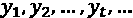

每一个值*y*I 都隐式依赖于时间(即*y*I=*y(I)*)；因此，系列不能洗牌而不丢失信息。如果值*y*t[t]完全由一个定律决定(比如*y*t=*t*2)，那么底层过程就被描述为确定性的。许多物理定律都是如此，但这对我们几乎没用，因为没有不确定性就无法预测未来。另一方面，如果每个*y*I 都是随机变量，那么这个过程就是随机的，我们需要找到不包含在训练集中的预测值的良好近似。

我们将要使用的随机过程的基本要素是:

*   该过程一般用*y*t 或 *y(t)* 表示。
*   设置一个值 *t* 将过程转换成一个随机变量，为了简单起见，我们将它定义为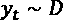。假设分布 *D* 对于所有实现*y*t[t]都是相同的。
*   该过程的时间平均值是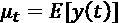。类似地，时间方差是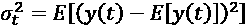。
*   自协方差函数定义为。
*   如果全联合概率分布对于时移是不变的，则该过程是*强平稳的*。这种情况很难满足和检查；因此，我们经常称之为*弱平稳*过程，以恒定的时间均值和方差以及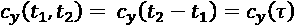为特征。强平稳性意味着弱平稳性，但相反的情况只适用于高斯过程，因为它们完全由前两个矩定义。
*   如果垂直平均值(在固定一个时刻后获得的平均值)等于时间平均值，则称该过程是遍历的。
*   白噪声过程是高斯过程(即使这不是基本要求)，具有零均值、固定方差和不相关的实现(即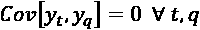)。

在这一节中，我们经常提到平稳过程，因为它们提供了明显的优势。然而，必须清楚的是，静止的过程不是静态的。后者是时间常数，而前者是由静态规律支配的。换句话说，平稳过程可以被认为是一个更简单的随机过程，因为一旦前两个矩已知(在弱平稳的情况下)，就可以用受控的不确定性来预测行为。

另一方面，非平稳过程可能变得非常难以建模，除非，例如，非平稳性仅取决于趋势分量。事实上，给定一个过程*y*t，我们总是可以把它分解为:

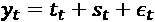

第一项是趋势分量(例如，线性趋势，就像标准线性回归中一样)。第二项被称为季节性成分，模拟那些不断循环重复的影响(例如，在一个长时期内的温度测量)，而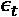是一个纯粹的随机成分，我们无法估计。我们考虑过程的平均值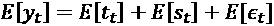。不失一般性，我们可以假设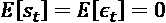，因为季节效应往往变化很慢，需要很多周期，噪声一般是白噪声。

然而，如果趋势是，例如，线性或二次的，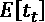不能是常数。因此，产生的过程是非平稳的。然而，这种非平稳性非常容易管理(例如，消除线性模型的趋势只需要拟合线性回归并减去每个点的估计值)。不幸的是，由于不容易发现的原因，一些更复杂的模型不是静态的，对它们进行建模可能会很复杂，并导致较差的性能。非平稳性的一个简单例子是具有非恒定平均值的加性噪声的存在(例如，如果一个仪器记录一个信号，并且一个分量慢慢地失去其调谐，则产生的时间序列将是非平稳的。另一方面，如果一个组件损坏，并且产生的信号总是受到相同噪声的影响，则时间序列将是平稳的)。下一节描述的程序显示了如何减轻这个问题，并向读者介绍时序的处理。

## 平滑

当我们对一个时间序列建模时，一个常见的问题是由噪声引起的非平稳性。在讨论保序回归时，也遇到了类似的问题。如果时间序列非常嘈杂，许多模型可能很难找到最佳配置。此外，行为的可解释性因此受到亚振荡的影响，亚振荡可能隐藏更重要的元素。平滑过程提供了这个问题的解决方案。这个想法很简单，它基于这样一个假设，即值 *y* [t] 更多地依赖于前一个值{ *y* [t-1] ， *y* [t-2] ，…}因此，我们可以使用一个代理序列 *s* [t] 来重新表示原始时间序列 *y* [t] ，定义如下:

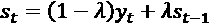

我们可以操作前面的项来获得下面的表达式(它类似于一个微分方程，其解是指数；这就是为什么该方法也被称为*指数平滑*):

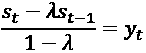

每一项*y*t[t]被认为是*s*t 的两个连续项的加权差，因此，快速变化被作为参数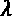的函数的差所吸收。如果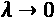，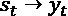。相反，当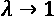时，*s*t[t]变得越来越*保守*，只有当*y*t[t]绝对值大得多时才变化。这种行为允许我们将一个高度振荡的序列转换成一个更加平滑的序列，避免了由强烈噪声引起的所有问题。

作为一个例子，让我们考虑可从 UCI 获得的能耗数据集([https://archive . ics . UCI . edu/ml/datasets/Appliances+energy+prediction](https://archive.ics.uci.edu/ml/datasets/Appliances+energy+prediction))。它包含几个关于房子环境条件的时间序列，每 10 分钟监测一次，持续 4.5 个月。在这个例子中，我们可以考虑厨房中记录的温度。

让我们从使用 Pandas 加载 CSV 数据集开始(在设置本地 CSV 文件的正确路径之后):

```
import pandas as pd
data_file = "energydata_complete.csv"
df = pd.read_csv(data_file, header=0, index_col="date")
```

时间序列`T1`(以及所有其他序列)包含 19735 个观察值；因此，如果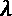太小，平滑后的序列将会与原始序列重叠。找到最佳平滑参数的一个好策略是棘手的，它基于考虑平方误差的参数化总和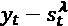的思想，并选择使总和最小化的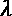值。这种方法非常有效，但是需要额外的计算步骤，这可能不是那么直接。或者，可以从一个标准值开始，如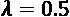，如果时间序列太细或太粗，就增加或减少它。

在我们的例子中，我们关注的是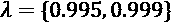，这两个数字看起来都很大，但是，如前所述，考虑到时间序列的长度，会产生非常不同的结果。我们现在可以构建平滑的时间序列:

```
Y = df["T1"].values
l1 = 0.995
l2 = 0.999
skt = np.zeros((Y.shape[0], 2))
skt[0, 0] = Y[0]
skt[0, 1] = Y[0]
for i in range(1, skt.shape[0]):
skt[i, 0] = ((1 - l1) * Y[i]) + (l1 * skt[i - 1, 0])
      skt[i, 1] = ((1 - l2) * Y[i]) + (l2 * skt[i - 1, 1])
```

结果如下图所示:

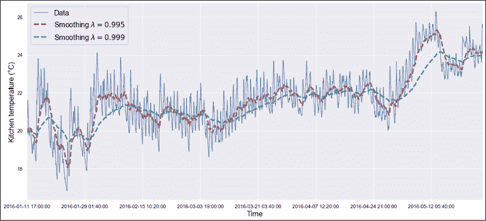

具有两条指数平滑曲线的原始时间序列

正如我们所看到的，两条平滑曲线比原始时间序列的噪音小得多，在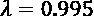和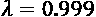之间有明显的差异。当目标是对总体趋势(及其局部变化)建模时，这些选择在尝试使用标准模型对时间序列建模时会非常有效。在这些情况下，去除寄生振荡可以简化训练过程，并且用不太复杂的模型产生更好的结果。

# 时间序列的线性模型介绍

在本节中，我们将采用一个人工时间序列来展示时间序列的一些常见线性模型。目标不是提供详尽的解释(这需要一整本书)，而是向读者介绍这种建模方法。对题目感兴趣的读者(希望阅读完整的数学背景)可以查阅 Shumway R. H .，Stoffer D. S .，*时间序列分析及其应用*，Springer，2017。

包含 100 个观察值、频率为 0.5(每个时刻 2 个观察值)的时间序列由以下代码片段生成:

```
import numpy as np
x = np.expand_dims(np.arange(0, 50, 0.5), axis=1)
y = np.sin(5.*x) + np.random.normal(0.0, 0.5, size=x.shape)
y = np.squeeze(y)
```

下图显示了一个图形表示:

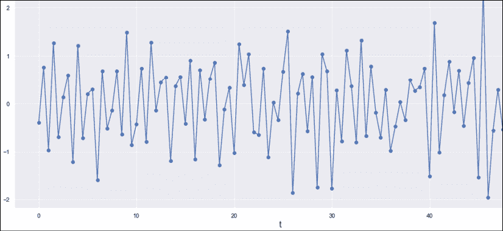

有 100 个观测值的合成时间序列

这个时间序列除了有噪声的周期性之外，没有什么特殊的特征。我们明确地想要避免复杂的系列，以便简化这个介绍。当然，请读者将同样的模型应用于更复杂的时间序列(如能源消费数据集中包含的时间序列)。

## 自相关

任何时间序列的一个基本诊断工具是对其自相关函数的评估。对于一般随机过程 *y(t)* ，其定义为:

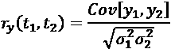

在前面的表达式中，我们假设了*y*I=*y*(*t*I)和。如果过程是平稳的，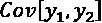仅取决于差值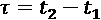和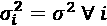，因此自相关可以简化为:

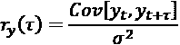

协方差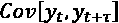对变量 *t* 进行整体积分；因此，结果只是区间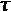的函数。顾名思义，自相关函数测量的是进程在时间 *t* 和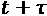采样时与其自身具有的相关性。随机性越大，自相关性越小。此外，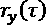通常会随着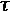自然衰减，因为合理的假设是在短时间范围内相关性更强，而在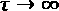时相关性越来越弱。

合成时间序列的自相关图如下图所示:

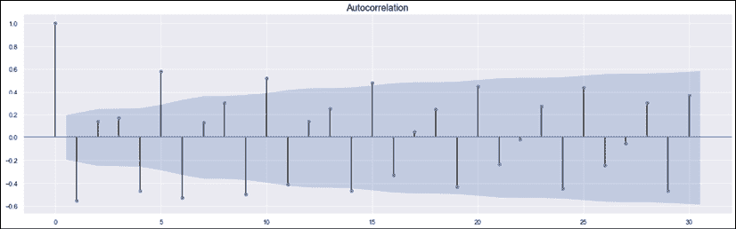

自相关图

正如可能看到的，第一个评估(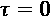)总是等于 1，因为很明显，任何 *y* [i] 都与其自身完全相关。其余的指示器放置在固定距离的滞后处。在我们的例子中， *r* [ y ] (1)是负的，后面是两个较小的正相关。这意味着时间序列*y*t 倾向于两次反转符号(在*y*t+1 和*y*t+2 处)，保持一个幅度稍大的滞后，然后再次反转。主要的正相关(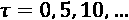)是转储的，下降很慢(这主要是周期性的原因)。

对于每个主相关性之前和之后的两个负相关性也是如此(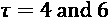)。很容易理解这种自相关属于具有部分规则时间动态的过程，因为即使在 30 个滞后之后，也有可能观察到相同的周期行为。

相反，下图显示了噪声过程的自相关图:

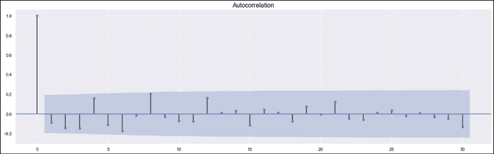

噪声过程的自相关图

在这种情况下，在第一个滞后之后，相关性下降到 0.2 以下，并且在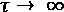时趋于消失。较大的相关性主要是由于偶然性和内部随机生成过程，它们不容易产生纯白噪声。然而，差异是显而易见的，因此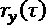可以很容易地用于评估时间序列的行为。作为最后一个例子，让我们考虑一个明显非平稳的线性过程，因为它有一个自然趋势(也就是说，平均值明显取决于时刻 *t* [1] 和 *t* [2] ):

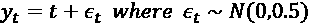

在这种情况下，自相关图如下图所示:

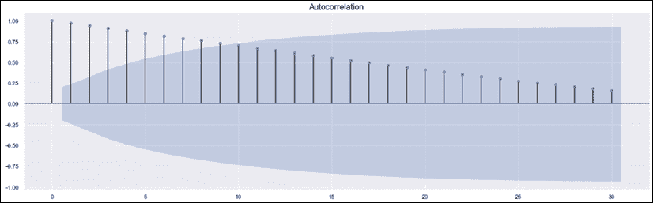

简单线性过程的自相关图

同样，我们可以立即确定规律性。作为两个相继的瞬间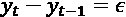，第一个差值约为 0，而它由于主分量的大小而变得越来越小。我们可以说，初始滞后主要由噪声成分控制，产生非常轻微的衰减，而当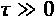时，自相关由与时刻成比例的项控制。

在任何情况下，给定一个滞后，一个大的绝对自相关意味着该过程倾向于保持一个内部的相似性，而一个小的值表明进化已经*移除了*大部分的记忆。就预测而言，大的自相关意味着给定先前时刻的简单预测，而小的自相关(如在噪声过程的情况下)告知我们，值*y*t[t]受到先前值的影响非常小(即，在白噪声过程中，输出是不相关的；所以预测理论上是不可能的)。

## AR、MA 和 ARMA 过程

假设在时间*t*(*y*t[t])的过程受到在多个先前瞬间假定的值的影响是很合理的。这个概念可以用以下方式表达:


这种过程被称为 AR( *p* )或者阶为 *p* 的自回归，因为 *y* [t] 依赖于 *p* 的过去值(通过对自身的回归)。术语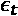是白噪声，因此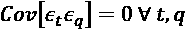。该过程的平稳性取决于模型的 *z* 变换的根，这相当于计算复多项式的根:


如果根位于单位圆内，则过程是静止的。然而，理解这些概念所需的理论超出了本书的范围，因此我们邀请有兴趣的读者检查一个专门的资源，如 Shumway R. H .，D. S .，Stoffer，*时间序列分析及其应用*，Springer，2017。

以完全类似的方式，可以定义一个依赖于过去的 *q* 瞬间的过程，表示为白噪声信号的线性组合。也就是说，该模型表示为:


这个过程叫做 MA( *q* 或订单的移动平均线 *q* )。与 AR( *p* )相反，如果噪声项是白色的，MA( *q* )总是稳定的。原因不简单，但是很直观。移动平均过程包含一种*行为稳定性*，因为*y*t[t]总是依赖于假设有限可变性的相同组合。换句话说，由于噪声项是有限的，它们以非常低的概率假设大的绝对值，并且*y*t[t]趋向于具有恒定的均值和方差(因此，它至少是弱平稳的)。

相反，如果历史的影响足够强，AR( *p* )过程具有改变其均值和方差的潜在能力。这个概念相当于说 model 既可以是稳定的(根在单位圆内)，也可以是不稳定的(根在单位圆外)。在后一种情况下，行为变得类似于线性过程，其发散到。因此，即使它们更容易理解，AR( *p* )过程也必须更仔细地调整，而 MA( *q* )过程总是安全的，并且在最坏的情况下，当需要历史来预测未来状态时，它们只是产生坏的预测。

ARMA( *p，q* )过程是 AR( *p* )和 MA( *q* )的自然组合，它们具有以下标准形式(系数的符号反转):


这个过程结合了 AR 和 MA 过程的正负两面，如果单独的 AR 部分是稳定的，就有可能证明它是稳定的。ARMA 过程非常灵活，能够模拟许多平稳过程(特别是没有趋势的过程)。由于存在自回归和移动平均部分，ARMA 模型可以依赖以前的历史，也包括 MA 部分带来的可变性。当然，MA( *q* )过程是 ARMA( *0，q* )，AR( *p* )过程相当于 ARMA( *p，0* )。

正确模型的选择(特别是值 *p* 和 *q* )取决于许多因素，这些因素既不能一概而论，也不能立即发现。为了找到最佳模型，有必要检查不同的值，例如评估预测的**均方误差** ( **MSE** )。主要原则总是相同的:必须选择产生良好性能的最简单的模型；因此，评估特定的指标也是有帮助的，比如 AIC 或 BIC(我们将在后面的例子中讨论)。它们既惩罚了更复杂的模型，又提供了对最合理选择的直接洞察。由于这一部分是介绍性的，我们不讨论更复杂的技术，而是关注一些基于合成数据集的示例。

让我们首先创建一个包含前 90 个样本的训练集和一个包含其余样本的测试集:

```
y_train = y[0:90]
y_test = y[90:]
```

我们现在可以使用`statsmodels`来训练 AR(15)、MA(15)和 ARMA(6，4)模型。即使这三个类都有专用的类，最好还是使用 ARMA 类，它提供了一整套特性(包括一个特定的绘图函数):

```
from statsmodels.tsa.arima_model import ARMA
ar = ARMA(y_train, order=(15, 0), missing="drop").\
        fit(transparams=True, trend="nc")
arma = ARMA(y_train, order=(6, 4), missing="drop").\
        fit(transparams=True, maxiter=500, trend="nc")
ma = ARMA(y_train, order=(0, 15), missing="drop").\
        fit(transparams=True, maxiter=500, trend="nc")
```

在所有三个模型中，我们都选择了丢弃缺失值(在这种情况下，这种选择是不相关的)，如果模型不是静态的(`transparam=True`)，则标准化参数，并且不包括任何趋势，因为数据集不包含它。

在训练阶段之后，我们可以预测区间(90，99)的结果，并计算 MSEs:

```
y_pred_ar = ar.predict(start=90, end=99)
y_pred_ma = ma.predict(start=90, end=99)
y_pred_arma = arma.predict(start=90, end=99)
print("MSE AR: {:.2f}".
     format(0.1*np.sum(np.power(y_test - y_pred_ar, 2))))
print("MSE MA: {:.2f}".
      format(0.1*np.sum(np.power(y_test - y_pred_ma, 2))))
print("MSE ARMA: {:.2f}".
    format(0.1*np.sum(np.power(y_test - y_pred_arma, 2))))
```

前面代码片段的输出是:

```
MSE AR: 0.83
MSE MA: 1.32
MSE ARMA: 0.71
```

正如所料，AR 和 MA 的组合产生了最小的误差，而 MA 单独是最差的模型(考虑到数据集的性质，其中反演遵循精确的模式，理解原因并不复杂)。

现在让我们设想一下 AR 和 MA 模型的预测:


AR(顶部)和 MA(底部)模型的预测

这些曲线证实了这个错误。虽然 AR 能够跟随振荡，但 MA 要慢得多，无法捕捉某些快速变化。另一方面，AR 和 MA 都用 15 个滞后进行评估。

更复杂的模型可能会产生更好的性能，但就计算复杂性而言，代价可能太高。相反，ARMA 模型提供的组合实现了更小的 MSE，总共有 10 个自由度。结果如下图所示:


ARMA 模型的预测

正如我们所见，ARMA 模型的行为几乎与 AR 模型一样，但它使用的自由度更少。只有当变化非常快时，它才无法到达数据点，但它总是跟随斜率变化。这种行为与系统的频率内容严格相关。该主题超出了范围；然而，读者必须理解快速变化的数据集包含更高的频率。ARMA 模型充当低通滤波器，排除超过阈值的频率，阈值取决于模型的复杂性及其参数值。这个问题在 MA 模型中很明显，它几乎是平的，但是在 ARMA 模型中也会出现。

更准确的结果需要更大的训练集以及更大的 p*和 q*值。然而，如前所述，我们并非总是对捕捉所有高频振荡感兴趣，因为它们可能是由加性噪声信号引起的。因此，许多线性系统提供的低通滤波功能既执行平滑又执行信号建模，从而在不损害信息内容的情况下降低过拟合的风险。

### 用 ARIMA 建模非平稳趋势模型

如果时间序列包含趋势，由于非平稳性，ARMA 将无法正确建模。

然而，正如在介绍中所解释的，去除模型趋势通常很容易，因为它需要我们减去与时间瞬间成比例的值。如果我们不能执行这个过程，或者，我们不知道实际的趋势，一个更简单的方法是基于差分时间序列。换句话说，不是使用值*y*t，而是使用一个 d 阶差，定义为:

…

一阶差能够用线性趋势去趋势模型。比如如果，。如果噪声具有零均值，。类似地，可以使用二阶差分来移除二次趋势，等等。一个 ARIMA( *p* ， *d* ， *q* )模型(其中字母 I 代表积分)实际上是一个 ARMA 模型，它在训练 ARMA( *p* ， *q* )子模型之前执行 *d* 阶差分。

让我们使用与上一个示例中相同的合成数据集来测试一个 ARIMA 模型，在该示例中，我们添加了一个线性趋势:

```
import numpy as np
x = np.arange(0, 50, 0.5)
y = np.sin(5.*x) + np.random.normal(0.0, 0.5, size=x.shape)
y += x/10.
```

下图显示了时间序列图:


以 ARIMA 为例的非平稳时间序列

此时，我们可以像前面示例中的一样继续。由于我们知道趋势是线性的，我们可以采用 ARIMA(6，1，2)模型:

```
from statsmodels.tsa.arima_model import ARIMA
y_train = y[0:90]
y_test = y[90:]
arima = ARIMA(y_train, order=(6, 1, 2), missing="drop").\
        fit(transparams=True, maxiter=500, trend="c")
y_pred_arima = arima.predict(start=90, end=99)
```

在这种情况下，我们已经明确要求包含一个趋势常数。预测结果如下图所示:


对 ARIMA 模型的预测

正如我们所看到的，预测范围在区间(3，7)中，这对应于时间序列的最后一部分，精度与 ARMA 模型达到的精度相当。

作为练习，我邀请的读者用能源消耗数据集中包含的时间序列重复所有这些例子。在这种情况下，有季节性成分和趋势，所以有可能测试不同的模型和评估性能。

# 总结

在这一章中，我们介绍了时间序列的概念，并讨论了平稳过程的性质，以及如何通过一个称为平滑的过程来处理数据集以消除不规则性。当时间序列受到白噪声的严重影响时，这种方法允许我们执行数据清洗步骤。当重要的是可视化趋势或季节性，而没有由噪声引起的次级效应时，这也是有帮助的。我们已经展示了 AR、MA 和 ARMA 模型如何成功预测平稳时间序列，以及如何使用差分技术训练 ARIMA 模型来预测非平稳时间序列。我们已经讨论过的另一个基本概念是自相关，它允许我们以最小的努力清楚地洞察时间序列的行为。这种分析有助于数据科学家选择最合适的模型。

在下一章中，我们开始讨论统计学习的一些基本要素，将注意力集中在贝叶斯网络和隐马尔可夫模型上。

# 进一步阅读

*   格林·w·h .*计量经济学分析(第五版)*，普伦蒂斯霍尔，2002 年
*   Belsley D. A .、Kuh E .、Welsch R .、*回归诊断:识别有影响的数据和共线性来源*，Wiley，1980 年
*   Chakravarti N .，*保序中值回归:线性规划方法，运筹学数学*，14/2，1989
*   Shumway R. H .，Stoffer D. S., *时间序列分析及其应用，Springer* ，2017
*   Candanedo L. M .、Feldheim V .、Deramaix D .、*低能耗住宅中电器能源使用的数据驱动预测模型*，《能源与建筑》，第 140 卷，2017 年 4 月