# 十一、贝叶斯网络和隐马尔可夫模型

在这一章中，我们将介绍贝叶斯模型的基本概念，它允许我们处理几种有必要将不确定性视为系统结构一部分的场景。讨论将集中在静态(时间不变的)和动态方法，必要时，可以用来模拟时间序列。

特别是，本章涵盖以下主题:

*   贝叶斯定理及其应用
*   贝叶斯网络
*   从贝叶斯网络中取样:
    *   **马尔可夫链蒙特卡罗** ( **MCMC** )、吉布斯和大都会-黑斯廷斯
*   用 PyMC3 和 PyStan 建模贝叶斯网络
*   **隐马尔可夫模型** ( **HMMs** )
*   带库的例子`hmmlearn`

在讨论更高级的主题之前，我们需要介绍贝叶斯统计的基本概念，重点是本章中讨论的算法所利用的所有方面。

# 条件概率和贝叶斯定理

如果我们有一个概率空间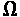和两个事件 *A* 和 *B* ，给定 *B* 的 *A* 的概率称为条件概率，定义为:

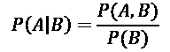

由于联合概率是可交换的，即 *P* ( *A，B* ) = *P* ( *B，A* )，因此可以推导出贝叶斯定理:

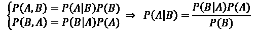

该定理允许将条件概率表示为相反的条件概率和两个边际概率 *P* ( *A* )和 *P* ( *B* )的函数。这个结果是许多机器学习问题的基础，因为，正如我们将在本章和下一章中看到的，通常更容易用条件概率(例如， *p* ( *A|B* )来得到相反的结果(即， *p* ( *B|A* ))，但是很难直接用概率*p*(*B | A【A】这个定理的一种常见形式可以表示为:*

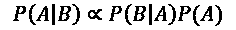

让我们假设我们需要估计一个事件的概率 *A* 给定一些观察值 *B* ，或者使用标准符号，A 的后验概率；前面的公式将这个值表示为与项 *P* ( *A* )成比例，它是 *A* 的边际概率，称为先验概率，是给定事件 *A* 的观测值 *B* 的条件概率。 *p* ( *B|A* )称为可能性，定义事件 *A* 如何可能决定 *B* 。因此，我们可以将这种关系概括为:

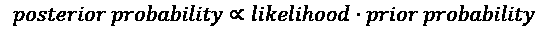

比例不是一个限制，因为项 *P* ( *B* )总是一个可以省略的归一化常数。当然，读者一定要记得将 *P* ( *A，B* )规格化，这样它的各项总和总是一。这是贝叶斯统计的一个关键概念，我们不直接相信先验概率，但我们使用我们观察的可能性来重新加权它。为了达到这个目的，我们需要引入先验概率，它代表初始知识(在观察数据之前)。

这个阶段是非常重要的，并且可以导致非常不同的结果。如果领域知识得到巩固，精确的先验分布允许我们获得更精确的后验分布。相反，如果先验知识有限，通常最好避免特定分布，而是默认所谓的*低*或*无信息先验*。

一般来说，将概率集中在一个有限区域内的分布信息非常丰富，并且它们的熵很低，因为不确定性被方差所限制。例如，如果我们强加一个先验高斯分布 *N* (1.0，0.01)，我们期望后验概率在均值附近达到峰值。在这种情况下，除非样本量非常大，否则似然项改变先验信念的能力有限。相反，如果我们知道可以在范围(0.5，1.5)中找到后验均值，但我们不确定真实值，那么最好使用熵更大的分布，比如均匀分布。这种选择信息量少，因为所有的值(对于连续的分布，我们可以考虑任意小的区间)具有相同的概率，并且可能性有更多的*空间*来找到正确的后验均值。

## 共轭先验

另一类重要的先验分布是关于特定可能性的*共轭先验*。如果使用贝叶斯公式，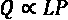、 *Q* 和 *P* 属于同一个族，则称分布 *P* 在 *Q* 之前关于可能性 *L* 共轭。比如已知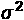的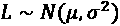，正态分布与其自身共轭，也就是说，似然的作用只是移动高斯而不改变方差。共轭先验有很多好处。首先，它们简化了计算，因为给定一个可能性，不需要任何积分就可以找到后验概率。此外，在某些领域中，后验分布自然被认为属于先验分布的同一家族。例如，如果我们想知道一个硬币是公平的还是有负载的，可能性显然是伯努利；只有两个离散结果，最优先验分布是β，其**概率密度函数** ( **p.d.f.)** 定义为:

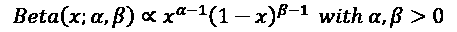

这种概率分布可以很容易地模拟任何二项式场景。事实上，如果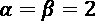，p.d.f .是完全对称的，当一个参数大于另一个参数时，它在极值附近达到峰值。为了公平起见，我们预计这两个常数有可能以同样的方式改变。当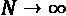时，可能性变成二项式(因为实验是独立的)和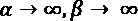。因此，该分布退化为完全平衡的伯努利分布，其中 *p* =1/2。

另一方面，例如，如果正面的数量(在连续模型中，这个结果可以正好等于 1)比反面的数量大得多，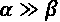(或者反之亦然)，则贝塔分布在接近极值 1 的区域开始非常尖峰化。如果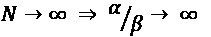，并且分布退化为 *p* = 1 的伯努利(对应人头)。下图显示了这种情况:

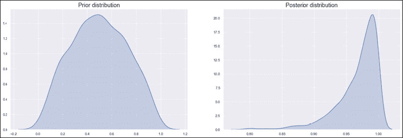

贝塔先验(左)和后验(右)分布

不难看出，当似然性为伯努利或二项式时，共轭先验为β，显然，似然性的作用是移动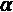和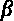以再现实际的后验分布。

我们现在可以考虑投掷硬币 10 次(事件 *A* )。我们知道，如果硬币是公平的，那么 *P* ( *A* ) = 1/2。如果我们想知道得到 10 个人头的概率是多少，我们可以使用二项分布，得到 *P* ( *k 个人头* ) = 1/2 ^k 。然而，让我们假设我们不知道硬币是否公平，但我们怀疑它装载了一个先验概率 *P* ( *硬币* = *装载* ) = 0.7 有利于尾部。我们可以使用指示函数定义一个完整的先验概率 *P* ( *硬币*):

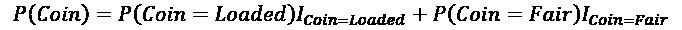

在前面的表达式中，我们假设 *P* ( *币* = *公平* ) = 0.5， *P* ( *币* = *装* ) = 0.7，只有当币公平时，指示器 *I* [币=公平] = 1，否则为 0。当硬币被装入时， *I* [Coin=Loaded] 也会发生同样的情况。我们现在的目标是确定后验概率 *P* ( *币|B* [1] *，B* [2] *，…，B* [n] )能够确认或者拒绝我们的假设。

我们来想象一下用 *B* [1] *=头*和 *B* [2] *，…，B* [n] *=尾*观察 *n* = 10 个事件。我们可以用二项式分布来表示每个结果的概率:

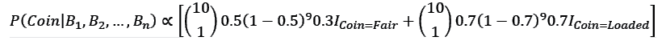

简化表达式后，我们得到:

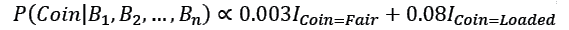

我们还需要将两项除以 0.083(两项之和)进行归一化，这样就得到最终的后验概率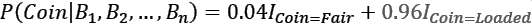。这个结果证实并加强了我们的假设。由于在一个头部之后的九个尾部观察序列，装载硬币的概率现在约为 96%。

这个例子展示了数据(观察)是如何插入贝叶斯框架的。如果读者有兴趣更详细地研究这些概念，在 2008 年麻省理工学院出版社出版的 Pratt J .，Raiffa H .，Schlaifer R .，*统计决策理论简介*，可以找到许多有趣的例子和解释；然而，在介绍贝叶斯网络之前，定义另外两个基本概念是有用的。

第一个概念称为条件独立性，它可以通过考虑两个变量 *A* 和 *B* 来形式化，这两个变量以第三个变量 *C* 为条件。我们说 *A* 和 *B* 是条件独立的，给定 *C* 如果:

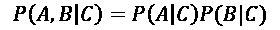

现在，让我们假设我们有一个事件 *A* ，它受到一系列原因 *C* [1] *，C* [2] *，…，C* [n] 的制约。因此，条件概率是*P*(*A | C*[1]*，C*[2]*，…，C* [n] )。应用贝叶斯定理，我们得到:**

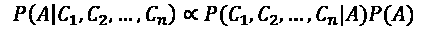

如果存在条件独立性，前面的表达式可以简化并重写为:

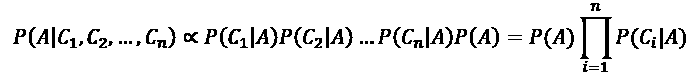

这个性质在朴素贝叶斯分类器中是基本的，在朴素贝叶斯分类器中，我们假设一个原因产生的结果不会影响其他原因。例如，在垃圾邮件检测器中，我们可以说邮件的长度和某些特定关键字的出现是独立的事件，我们只需要计算 *P* ( *长度|垃圾邮件*)和 *P* ( *关键字|垃圾邮件*)，而不考虑联合概率 *P* ( *长度，关键字|垃圾邮件*)。

第二个重要的元素，也是我们在本章分析的最后一个元素，是概率的链式法则。假设我们有联合概率*P*(*X*[1]*，X* [2] *，…，X* [n] )。它可以表示为:

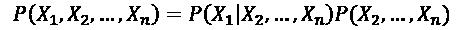

对右侧的联合概率重复该过程，我们得到:

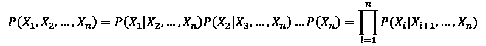

这样，就有可能把一个完整的联合概率表达为分层条件概率的乘积，直到最后一项，这是一个边际分布。我们将在下一节中广泛使用这个概念，在这一节中我们将探索贝叶斯网络。

# 贝叶斯网络

贝叶斯网络是用有向无环图 *G* = { *V，E* }表示的概率模型，其中顶点是随机变量*X*I，边决定了它们之间的一种条件依赖。在下图中，有一个包含四个变量的简单贝叶斯网络的示例:


贝叶斯网络的例子

变量*X*T2【4】T3依赖*X*3，依赖*X*1 和*X*2。描述网络，我们需要边际概率*P*(*X*[1])和*P*(*X*2)和条件概率*P*(*X*[3]|*X*[1]，*事实上，使用链式法则，我们可以将完全联合概率推导为:*

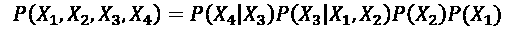

前面的表达式显示了一个重要的概念:由于图是直接的和非循环的，每个变量有条件地独立于所有其他变量，这些变量不是给定其前任的后继变量。为了形式化这个概念，我们可以定义函数*前辈*(*X*I，该函数直接返回影响*X*I 的节点集合，例如:*前辈*(*X*3【T70)= {*X*1[1 使用该函数，可以为具有 *N* 个节点的贝叶斯网络的全联合概率编写一个通用表达式:]

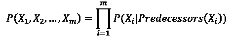

构建贝叶斯网络的一般过程应该总是从第一个原因开始，一个一个地添加它们的影响，直到最后的节点被插入到图中。如果不遵守这一规则，生成的图可能包含无用的关系，从而增加模型的复杂性。例如，如果 *X* [4] 是由 *X* [1] 和 *X* [2] 间接造成的，那么添加边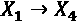和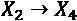可能看起来是一个不错的建模选择；但是我们知道，最终对*X*4 的影响只由*X*3 的值决定，其概率是以*X*1 和*X*2 为条件的。因此，我们可以有把握地说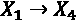和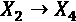是杂散边缘，不需要添加。

## 从贝叶斯网络中采样

当存在大量变量和边时，在贝叶斯网络上执行直接的推理可能是相当困难的操作，因为完整的联合概率可能会变得极其复杂，标准化分布所需的积分也是如此。由于我们需要计算归一化常数来获得后验概率，如果这一步不可行，我们需要找到其他方法来解决这个问题。为此，提出了几种取样方法。在本段中，我们将展示如何使用直接方法和两种 MCMC 算法来确定网络的全联合概率采样。

让我们首先考虑一个简单的网络，它有两个相连的节点， *X* [1] 和 *X* [2] ，分布如下:

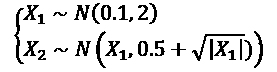

我们现在可以使用前面介绍的链式法则，使用直接抽样来估计全联合概率*P*(*X*1、X[2])。

### 直接取样

对于直接采样，我们的目标是通过从每个条件分布中抽取的一系列样本来近似全联合概率。如果我们假设该图结构良好(没有不必要的边),并且我们有 *N* 个变量，则该算法由以下步骤组成:

1.  初始化变量 *N* 和[样本]。
2.  用形状初始化一个矢量*S*(*N*， *N* [样本])。
3.  初始化一个具有形状的频率向量*F*样本(*N*，*N*样本)。在 Python 中，最好使用一个字典，其中的键是一个组合( *x* [1] *，x* [2] *，…，x* [n] )。
4.  对于 *t* = 1 到*N*样本:
    1.  对于 *i* = 1 到 *N* :
    1.  样本来自*P*(*X*I|*前任*(*X*I)
    2.  将样品储存在 *S* [ *i，t* ]中
    1.  如果 *F* [样本]包含被采样的元组 *S* :，t: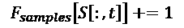
    2.  Else:

        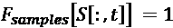(这两个操作在 Python 字典中都是直接的)

5.  创建一个向量*P*采样与形状( *N* ，1)。

1.  设置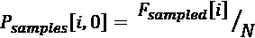。

从数学的角度来看，我们首先创建一个频率向量 *F* [样本] ( *x* [1] ， *x* [2] ，…，*x*[N]； *N* [个样本])然后考虑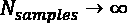近似全联合概率:

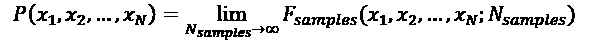

#### 直接取样的例子

我们现在可以用 Python 实现这个算法。让我们首先使用 NumPy 函数`np.random.normal(u,s)`定义样本方法，该函数从一个 *N* ( *u，s* ² )分布中抽取一个样本:

```
import numpy as np
def X1_sample():
    return np.random.normal(0.1, 2.0)
def X2_sample(x1):
    return np.random.normal(x1, 0.5 + np.sqrt(np.abs(x1)))
```

至此，我们可以实现主循环了。由于变量是布尔型的，概率总数是 16，所以我们设置 *N* [样本]= 10000(更小的值也是可以接受的):

```
Nsamples = 10000
X = np.zeros((Nsamples, ))
Y = np.zeros((Nsamples, ))
for i, t in enumerate(range(Nsamples)):
    x1 = X1_sample()
    x2 = X2_sample(x1)

    X[i] = x1
    Y[i] = x2
```

当采样完成后，可以可视化全联合概率的密度估计:

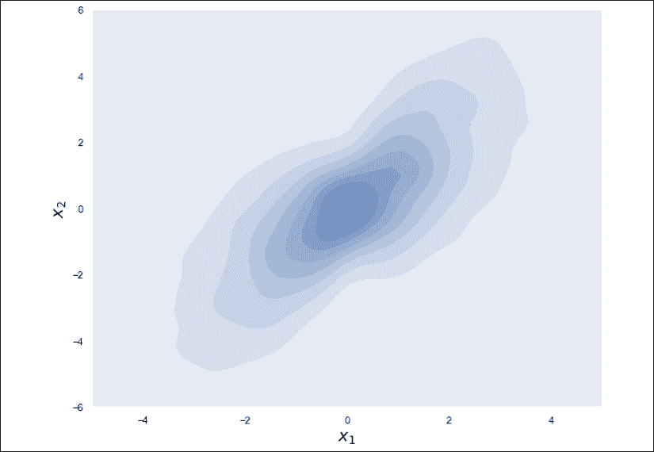

全联合概率的密度估计

### 马尔可夫链简介

为了讨论 MCMC 算法，有必要引入马尔可夫链的概念。事实上，虽然直接采样方法没有任何特定的顺序来抽取样本，但是 MCMC 策略根据从一个样本到下一个样本的精确转移概率来抽取样本序列。

让我们考虑一个与时间相关的随机变量 *X* ( *t* )，让我们假设一个离散的时间序列 *X* [1] ， *X* [2] ，…， *X* [t] ， *X* [t+1] 在下图中，有一个该序列的示意图:

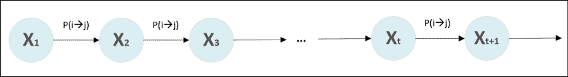

一般马尔可夫链的结构

假设我们有 *N* 个不同的状态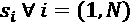，在这种情况下，可以考虑概率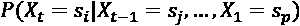。 *X* ( *t* )定义为一阶马尔可夫过程，如果:

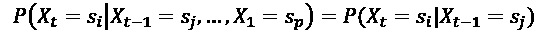

换句话说，在马尔可夫过程中(从现在开始，我们将省略规格说明*一阶*，并假设我们总是使用这种链，即使在某些情况下考虑更多数量的先前状态也是有用的)，处于某个状态的概率 *X* ( *t* )仅取决于先前时刻假设的状态。因此，我们可以为每一对( *i* ， *j* )定义一个转移概率:

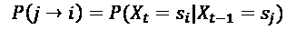

考虑到所有的夫妇( *i* ， *j* )，也可以建立一个转移概率矩阵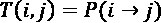。使用标准符号的边际概率*X*[t]*= s*[I]定义为:

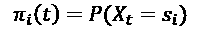

在这一点上，很容易证明(使用查普曼-科尔莫戈罗夫方程):

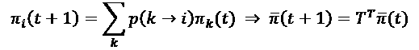

在前面的表达式中，为了计算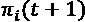，我们需要对所有可能的先前状态求和，考虑相对转移概率。这个操作可以用矩阵形式重写，使用一个包含所有状态的向量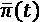和转移概率矩阵*T*T^T(大写上标 *T* 表示矩阵转置)。链的演变可以递归计算:

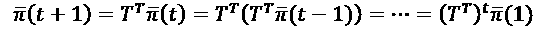

出于我们的目的，考虑能够达到*平稳分布* 的马尔可夫链是很重要的:


换句话说，状态不依赖于初始条件，并且不再能够改变。如果基础马尔可夫过程是遍历的，则平稳分布是唯一的。这个概念意味着，如果对时间进行平均(这通常是不可能的)或对状态进行垂直平均(冻结时间)(这在大多数情况下更简单)，过程具有相同的属性。

马尔可夫链的遍历过程由两个条件保证。第一个是所有状态的非周期性，这意味着不可能找到一个正数 *p* 使得链在等于 *p* 的倍数的若干瞬间之后以相同的状态序列返回。第二个条件是所有状态必须是正循环的:这意味着，给定一个随机变量*N*[instants](*I*)，描述返回到状态 *s* [i] ，所需的时刻数；因此，潜在地，所有的状态都可以在有限的时间内被重新访问。

我们之所以需要遍历条件，以及唯一平稳分布的存在，是因为我们正在考虑被建模为马尔可夫链的采样过程，其中下一个值是根据当前状态采样的。从一个状态到另一个状态的转换是为了找到更好的样本，正如我们将在 Metropolis-Hastings 采样器中看到的那样，我们也可以决定拒绝一个样本，并使链保持相同的状态。出于这个原因，我们需要确保算法收敛到唯一的稳定分布(接近我们的贝叶斯网络的真实的完全联合分布)。如果满足以下条件，就有可能证明链总是达到平稳分布:


之前的方程被称为*详细平衡*，暗示了链条的可逆性。直观上，这意味着找到处于状态 *A* 的链的概率乘以转换到状态 *B* 的概率等于找到处于状态 *B* 的链的概率乘以转换到 *A* 的概率。

对于我们将要讨论的两种采样算法，都有可能证明它们满足前面的条件，因此它们的收敛性是有保证的。

### 吉布斯采样

假设我们想获得贝叶斯网络的全联合概率 P(X [1] *，X* [2] *，…，X*[N]*)*；然而，变量的数量很大，没有办法以封闭的形式容易地解决这个问题。而且，想象一下，我们想得到一个边际分布，比如*P(X*[2]*)*，但是要做到这一点我们需要对全联合概率进行积分，这个任务就更难了。吉布斯采样允许用迭代过程逼近所有的边际分布。如果我们有 *N* 个变量，算法将继续以下步骤:

*   初始化变量 *N* [迭代]
*   用形状初始化一个矢量*S*(*N*， *N* [次迭代]
*   随机初始化(上标索引指的是迭代)
*   对于 *t=1* 到 *N* 到[次迭代]:
    *   从中取样并储存在 *S* [0， *t* 中
    *   从中取样并储存在 *S* [1， *t* 中
    *   …
    *   从中取样并存储在 *S* [ * N * -1， *t* 中

在迭代结束时，向量 *S* 将包含每个分布的 *N* [次迭代]个样本。因为我们需要确定概率，所以有必要像直接采样算法一样进行，计算单次出现的数量，并除以*N*t[迭代]进行归一化。如果变量是连续的，可以考虑区间，计算每个区间包含多少样本。

对于小型网络，此过程与直接采样非常相似，只是在处理非常大的网络时，采样过程可能会变得很慢；但引入*X*I 的马尔可夫毯概念后可以简化算法，马尔可夫毯是*X*I 为*X*I 的前辈、后继、后继的前辈的随机变量集合(在某些书中，他们用父母和子女这两个术语来表示这些概念)。在贝叶斯网络中，变量*X*I[I]是一个独立于所有其他变量的条件，给定它的马尔可夫毯。因此，如果我们定义函数*MB*(*X*[I])，该函数返回 blanket 中的变量集，那么通用采样步骤可以重写为 P(*X*[I]| MB(*X*I【T79])，并且不再需要考虑所有其他变量。

为了理解这个概念，让我们考虑下图所示的网络:


吉布斯抽样示例的贝叶斯网络

变量的马尔可夫链是:

*   *MB*(*X*X[1])= {*X*3}
*   *MB*(*X*[2])= {*X*[1]， *X* [3] ， *X* [6]
*   *MB*(*X*3)= {*X*1，*X*2，*X*4， *X* [5]
*   *MB*(*X*4)= {*X*3}
*   *MB*(*X*5)= {*X*3}
*   *MB*(*X*6)= {*X*2}

一般来说，如果 N 很大，那么基数为*| MB(X*[I]*)|<<N*，这样就简化了过程(香草吉布斯采样需要每个变量有*N*–1 个条件)。我们可以证明吉布斯采样从处于详细平衡的马尔可夫链中生成样本:


因此，该过程收敛于唯一的平稳分布。这个算法相当简单；然而，它的性能并不出色，因为随机行走没有被调整以探索状态空间的正确区域，在该区域中找到好样本的概率很高。此外，轨迹还可能回到糟糕的状态，从而减慢整个过程。一个替代方案(也是 Stan 为连续随机变量实现的)是不掉头算法，本书不讨论。对这个主题感兴趣的读者可以在 Hoffmann M. D .，Gelman A .，*The No-U-Turn Sampler:adaptive Setting Path length in Hamiltonian Monte Carlo*，arXiv:1111.4246，2011 中找到完整的描述。

### 大都会-黑斯廷斯算法

我们已经看到，一个贝叶斯网络的全联合概率分布 *P(X* [1] *，X* [2] *，…，X* [N] *)* 在变量数量较大时会变得难以处理。当需要对其进行边缘化以获得例如*P*(*X*I)时，问题会变得更加困难，因为需要集成一个非常复杂的函数。在简单情况下应用贝叶斯定理也会出现同样的问题。

假设我们有表达式 *P(A|B) = KP(B|A)P(A)* 。我特意插入了归一化常数 *K* ,因为如果我们知道它，我们可以立即获得后验概率；然而，找到它通常需要对 *P(B|A)P(A)* 进行积分，并且这种操作在封闭形式下是不可能的。

Metropolis-Hastings 算法可以帮助我们解决这个问题。假设我们需要从 *P(X* [1] *，X* [2] *，…，X* [N] *)* 中采样，但是我们知道这个分布最多是一个归一化常数，所以。为了简单起见，从现在开始我们把所有变量都折叠成一个向量，所以。

再来看另一个分布，叫做*候选生成分布*。这个选择没有特别的限制，只有那个，很容易出样。在某些情况下，q 可以选择为与分布非常相似的函数，这是我们的目标，而在其他情况下，可以使用均值等于*x*^(^(I-1)^)的正态分布。正如我们将要看到的，这个函数作为一个提议生成器，但是我们没有义务接受从中抽取的所有样本；因此，潜在地，可以使用与 *P(X)* 具有相同域的任何分布。

当样本被接受时，马尔可夫链转移到下一个状态。否则，它将保留在当前文件中。这个决策过程是基于这样的想法，即采样器必须探索最重要的状态空间区域，并丢弃找到好样本的概率较低的区域。

该算法进行以下步骤:

*   初始化变量*N*迭代
*   随机初始化*x*(0)
*   对于 *t=1* 到 *N* 到[的迭代次数]:
    *   从中抽取一个候选样本
    *   计算以下值:
    *   如果:

接受样品

*   否则如果:

以概率接受样本

或者:

以概率拒绝样本设置

可以证明(证明将被省略，但在 Walsh B .，*Markov Chain Monte Carlo and Gibbs Sampling*，EEB 596z 讲义，2002)Metropolis-Hastings 算法的转移概率满足详细的平衡方程()，因此该算法收敛于真实的后验分布。

#### Metropolis-Hastings 抽样示例

给定 *P(B|A)* 和 *P(A)* 的乘积，我们可以实现该算法来找到后验分布 *P(A|B)* ，而不需要考虑需要复杂积分的归一化常数。

假设:


因此，得到的 *g(x)* (这是自愿相对简单的)是:


为了解决这个问题，我们采用随机漫步 Metropolis-Hastings，它由选择组成。这种选择允许简化数值，因为两项和相等(得益于围绕穿过 *x* 的垂直轴对称[表示])并且可以被抵消，所以变成了和之间的比值。

第一件事是定义函数:

```
import numpy as np
def prior(x):
    return 0.1 * np.exp(-0.1 * x)
def likelihood(x):
    if x >= 0:
        return 0.5 * np.exp(-np.abs(x))
    return 0
def g(x):
    return likelihood(x) * prior(x)
def q(xp):
    return np.random.normal(xp)
```

现在，我们可以用 100，000 次迭代和*x*^(【0】)= 1 开始我们的采样过程:

```
nb_iterations = 100000
x = 1.0
samples = []
for i in range(nb_iterations):
    xc = q(x)

    alpha = g(xc) / g(x)
    if np.isnan(alpha):
        continue

    if alpha >= 1:
        samples.append(xc)
        x = xc
    else:
        if np.random.uniform(0.0, 1.0) < alpha:
            samples.append(xc)
            x = xc
```

我们可以可视化核密度估计和累积分布:


样本概率密度函数(左)和累积分布(右)

## 使用 PyMC3 采样

PyMC3 是一个强大的 Python 贝叶斯框架，它依赖于 ano 来执行高速计算(它也可以单独使用 NumPy)。它实现了所有最重要的连续和离散分布，并主要使用不掉头和 Metropolis-Hastings 算法执行采样过程。

关于 PyMC3 API(发行版、函数和绘图工具)的所有细节，我建议访问文档主页[http://docs.pymc.io/index.html](http://docs.pymc.io/index.html)，在那里也可以找到一些非常直观的教程。

我们想要建模和模拟的示例基于这个场景:从伦敦到罗马的每日航班的预定起飞时间是上午 12:00，标准飞行时间是两个小时。我们需要在目的地机场组织运营，但我们不希望在飞机着陆前太久分配资源。因此，我们希望使用贝叶斯网络对流程进行建模，并考虑一些可能影响到达时间的常见因素。

特别是，我们知道入职流程可能比预期的要长，加油流程也是如此，即使它们是并行进行的。伦敦空中交通管制可以强制延迟，当飞机接近罗马时也会发生同样的情况。我们也知道恶劣天气的出现会导致另一次延误，因为恶劣天气会迫使我们改变路线。我们可以用下面的图来总结这一分析:


代表空中交通管制问题的贝叶斯网络

考虑到我们的实际经验，我们决定使用以下分布来模拟随机变量:

*   乘客登机~瓦尔德()
*   加油~瓦尔德()
*   出发交通延误~ Wald( )
*   到达交通延误~ Wald( )
*   出发时间= 12 +出发交通延误+最大值(乘客上车、加油)
*   恶劣的天气~伯努利( *p* =0.35)
*   飞行时间~指数( =0.5 - (0.1 恶劣天气))(一个伯努利分布的输出是`0`或`1`，对应`False`和`True`。)
*   到达时间=起飞时间+飞行时间+到达交通延误

变量出发时间和到达时间是随机变量的函数，飞行时间的参数也是恶劣天气的函数。

即使模型不是很复杂，直接推断也是相当低效的，因此我们想要使用 PyMC3 模拟过程(可以使用标准的`pip` / `conda`命令安装该包，如[http://docs.pymc.io/index.html](http://docs.pymc.io/index.html)所示)。

第一步是创建一个模型实例:

```
import pymc3 as pm

 model = pm.Model()
```

从现在开始，所有操作都必须使用模型变量提供的上下文管理器来执行。我们现在可以设置贝叶斯网络的所有随机变量:

```
import pymc3.distributions.continuous as pmc
import pymc3.distributions.discrete as pmd
import pymc3.math as pmm
with model:
passenger_onboarding = \
            pmc.Wald("Passenger Onboarding",
                     mu=0.5, lam=0.2)
        refueling = \
            pmc.Wald("Refueling",
                     mu=0.25, lam=0.5)
        departure_traffic_delay = \
            pmc.Wald("Departure Traffic Delay",
                     mu=0.1, lam=0.2)
        departure_time = \
            pm.Deterministic(
                "Departure Time",
                 12.0 +
                departure_traffic_delay +
                pmm.switch(
                    passenger_onboarding >= refueling,
                    passenger_onboarding,
                    refueling))
        rough_weather = \
            pmd.Bernoulli("Rough Weather",
                          p=0.35)
        flight_time = \
            pmc.Exponential("Flight Time",
                            lam=0.5 - (0.1 * rough_weather))
        arrival_traffic_delay = \
            pmc.Wald("Arrival Traffic Delay",
                     mu=0.1, lam=0.2)
        arrival_time = \
            pm.Deterministic("Arrival time",
                             departure_time +
                             flight_time +
                              arrival_traffic_delay)
```

我们已经导入了两个名称空间，`pymc3.distributions.continuous`和`pymc3.distributions.discrete`，因为我们使用了两种类型的变量。瓦尔德和指数是连续分布，而伯努利是离散的。在前三行中，我们声明了变量`passenger_onboarding`、`refueling`和`departure_traffic_delay`。结构总是相同的:我们需要指定对应于期望的分布的类，传递变量名和所有必需的参数。

变量`departure_time`被声明为`pm.Deterministic`。在 PyMC3 中，这意味着一旦设置了所有的随机元素，它的值就完全确定了。事实上，如果我们从`departure_traffic_delay`、`passenger_onboarding`和`refueling`采样，我们会得到`departure_time`的确定值。在这个声明中，我们还使用了实用函数`pmm.switch`，它基于第一个参数来操作二元选择(例如，*if A>B return A else return B*)。

其他变量非常相似，除了`flight_time`是一个带参数的指数变量，是另一个变量(`rough_weather`)的函数。因为如果天气恶劣，伯努利变量以概率 *p* 输出 1，以概率 1-*p*输出 0，否则输出 0.5。

### 运行采样过程

一旦模型建立起来，就可以通过采样过程来模拟它。PyMC3 根据变量类型自动选择最佳采样器。

由于模型不是很复杂，我们可以使用 4 个链的默认值将该过程限制为 500 个样本(对于更复杂的情况，该参数可以增加)。此外，作为默认设置，PyMC3 将跳过前 500 个样本(通过参数 draws 设置),因为链可能尚未达到稳定分布。这个预热阶段非常重要，因为第一个样本是不可靠的，包含它们会降低后验概率预测的准确性。相反，使用多个链有助于减少差异。

因此，我们将对总共(500 + 500) x 4 = 4，000 个数据点进行采样:

```
nb_samples = 500
with model:
samples = pm.sample(draws=nb_samples, 
                          random_seed=1000)
```

可以使用内置的`pm.traceplot()`函数来分析输出，该函数为每个样本变量(和每个链)生成图，如下图所示:


所有随机变量的分布和样本

右栏显示为随机变量生成的样本，而左栏显示相对频率。这个图有助于从视觉上证实我们最初的想法；实际上，到达时间的大部分质量集中在 14:00 到 16:00(数字总是小数，所以需要换算时间)；然而，我们应该积分来得到概率。相反，通过`pm.summary()`函数，PyMC3 提供了一个统计摘要，可以帮助我们做出正确的决策。在下面的代码片段中，显示了包含整个摘要(Pandas 数据帧)的输出:

```
import pandas as pd
with pd.option_context('display.max_rows', None, 
                       'display.max_columns', None):
      print(pm.summary(samples))
```

输出是:

```
                             mean        sd 
Rough Weather             0.349500  0.476812   
Passenger Onboarding      0.508697  0.792440    
Refueling                 0.248637  0.171351    
Departure Traffic Delay   0.100411  0.073563    
Departure Time           12.689327  0.775027   
Flight Time               2.231149  2.264649    
Arrival Traffic Delay     0.097987  0.066614   
Arrival time             15.018463  2.410993  
                         mc_error    hpd_2.5   hpd_97.5 
Rough Weather            0.008015   0.000000   1.000000   
Passenger Onboarding     0.021105   0.014012   1.933437   
Refueling                0.003331   0.038644   0.596968   
Departure Traffic Delay  0.001905   0.016522   0.239186   
Departure Time           0.020998  12.102561  14.099915   
Flight Time              0.053354   0.004454   6.763558   
Arrival Traffic Delay    0.001526   0.015110   0.228818   
Arrival time             0.057962  12.267486  19.823165
                               n_eff      Rhat  
Rough Weather            3518.788680  0.999277  
Passenger Onboarding     1607.397261  0.999506  
Refueling                2032.614196  0.999326  
Departure Traffic Delay  1588.997795  0.999700  
Departure Time           1396.024578  0.999855  
Flight Time              1800.353758  0.999524  
Arrival Traffic Delay    1715.607331  0.999116  
Arrival time             1787.109205  0.999169
```

对于每个变量，它包含平均值、标准差、蒙特卡罗误差、95%最高后验密度区间和后验分位数。最后两个参数(`n_eff`和`Rhat`)对于理解模型是否达到良好收敛水平极其重要；随着我们继续讨论结果，关于这些概念的解释的进一步细节将被揭示。

如果有更多的 *k* 链，我们期望它们都变得稳定，但是，此外，我们需要它们都重现相同的基本分布(也就是说，它们是混合的)。Stan creators(a . gel man，J. B. Carlin，H. S. Stern， *Bayesian Data Analysis* ，CRC Press，2013)提出的这一目标可以通过将序列分成两部分并检查每个部分是否与相应的一半以及所有其他一半部分混合来实现。

系数(在大多数计算机软件包中称为`Rhat`)被设计为通过采用每个估计参数的序列内和序列间方差之间的加权平均值来测量该结果(假设 *N* 次绘制和观测值 *p* ):


如果分布变得稳定并且链被适当地混合，我们期望变得越来越接近。直观上，可以理解的是，的影响会产生方差的高估，但是，另一方面，当时，如果模型已经正确建立，序列之间的方差应该接近方差内。因此，系数定义为:


特别地，当 if 时，这意味着序列没有被适当地混合(阈值 0.1 可以被认为是最佳实践)，并且估计可能是不准确的(即使理论上，收敛速度可能太慢以至于不能确保准确的结果)。在我们的例子中，可以看到所有的，因此我们可以信任混合结果。

由于混合不是立即进行的，有效样本量(通常表示为`n_eff`)对应于*可靠*抽取的数量(即混合后获得的数量)。这个值比提供的信息少，但是它有助于理解迭代次数是否足够或者最好增加它。例如，如果我们预计至少有 1，000 次抽奖，那么示例中获得的结果是令人满意的。

相反，如果后验分布的复杂性很高，并且我们希望至少抽取 2，000 个，则模拟必须延长，因为混合时间不允许我们对所有参数都达到该值。

## 使用 PyStan 采样

现在让我们考虑一个使用另一个流行框架(Stan)的稍微简单一点的例子。假设您想要将飞机的到达时间建模为三个因素的线性组合:

*   出发延误
*   行程时间
*   到达延迟

给定一组现有的观察结果，我们可以假设:


然而，我们不能将独立变量视为确定性的，因为它们受到许多我们无法控制的因素的影响。例如，起飞延误取决于始发机场。行驶时间受交通和天气条件的影响(此外，公司可能会限制速度以减少油耗)。最后，到达延迟取决于输入流量。为了简单起见，我们避免了相互依赖(但是我邀请读者将它们作为练习)。鉴于每个随机变量的性质，我们决定将它们建模为:


由于航空公司的目标是最小化出发延迟，我们选择了指数分布，其 p.d.f 为:


这个分布在 *x = 0* 时有一个峰值，然后呈指数下降。随着更长时间的起飞延误越来越少，这种分布是非常合理的。旅行时间通常是相同的，在平均值附近有有限的变化；因此，正态分布是最佳选择。

对于到达延误，我们做了与出发时相同的假设，因此采用了另一个更低的指数(因为飞机长时间飞行的可能性有限)。

Stan 基于一种被转化为高度优化的 C++代码的元语言；因此，第一步是定义整个模型:

```
code = """
data {
    int<lower=0> num;
    vector[num] departure_delay;
    vector[num] travel_time;
    vector[num] arrival_delay;
    vector[num] arrival_time;
}
parameters {
    real beta_a;
    real beta_b;
    real mu_t;
    real sigma_t;
    real sigma_a;
}
model {
    departure_delay ~ exponential(beta_a);
    travel_time ~ normal(mu_t, sigma_t);
    arrival_delay ~ exponential(beta_b);
    arrival_time ~ normal(departure_delay + 
                          travel_time + 
                          arrival_delay, 
                          sigma_a);
}
"""
```

代码分为四个主要部分:

*   `data`，描述作为输入观测值传递的参数。元语言的细节可以在官方文档中找到；然而，它们非常直观。在这种情况下，我们声明一个整数变量 num 来定义观察值的数量，并声明四个向量来存储它们的值(作为实型双精度/浮点型变量)。
*   `parameters`，包含估计参数列表。该块中的每个值将被视为一个变量，必须使用蒙特卡罗算法进行估计。
*   `transformed parameters`，在本例中没有，但是它通常包含所有那些通过特定转换获得的参数(例如，函数)。
*   `model`，其中包含了代码的主要结构，描述了每个随机变量的性质以及它们如何组合以产生期望的结果。在我们的例子中，我们已经声明了所有的 p.d.f .和到达时间的结构，它有一个定义明确的平均值，但是有一个可变的标准偏差，这个标准偏差是可以估计的。

此时，由于这是一个示例，我们可以创建一些观察结果:

```
import numpy as np
nb_samples = 10
departure_delay = np.random.exponential(0.5, size=nb_samples)
travel_time = np.random.normal(2.0, 0.2, size=nb_samples)
arrival_delay = np.random.exponential(0.1, size=nb_samples)
arrival_time = np.random.normal(departure_delay + 
                                travel_time + 
                                arrival_delay, 
                                0.5, size=nb_samples)
```

在真实案例中，我们应该已经通过实际观察收集了这些数据。一旦模型准备好，我们就可以用 PyStan 编译它(这个包一般可以用命令`pip install pystan`安装，但是读者可以在页面[https://PyStan . readthedocs . io/en/latest/installation _ beginner . html](https://pystan.readthedocs.io/en/latest/installation_beginner.html)找到详细的说明):

```
import pystan
model = pystan.StanModel(model_code=code)
```

通过这种方式，PyStan 将把代码转换成 C++模块，以达到最佳性能。一旦模型编译完成(这个过程可能需要一些时间，这取决于可用的硬件)，就需要使用我们的数据来拟合它。为此，我们首先需要创建一个字典，其中每个键都与代码的数据部分中声明的变量名相匹配:

```
data = {
    "num": nb_samples,
    "departure_delay": departure_delay,
    "arrival_time": arrival_time,
    "travel_time": travel_time,
    "arrival_delay": arrival_delay
}
```

一旦词典准备好了，我们就可以根据模型进行修改了。在这种情况下，我们希望执行 10，000 次迭代，使用 2 个链预热 1，000 次绘制:

```
fit = model.sampling(data=data, iter=10000, 
                     refresh=10000, warmup=1000, 
                     chains=2, seed=1000)
```

训练过程的结果可以直接可视化:

```
print(fit)
```

前面代码的输出是(漂亮的打印):


概要提供了关于每个估计参数的信息。对于所有参数，最小有效样本量大于 5，000 和(这并不奇怪，因为我们创建了数据集，但是我邀请读者采用不同的分布并检查结果)。为了确认估计值，我们可以要求模型从后验分布中取样:

```
ext = fit.extract()
beta_a = ext["beta_a"]
beta_b = ext["beta_b"]
mu_t = ext["mu_t"]
sigma_t = ext["sigma_t"]
```

参数的密度估计如下图所示:


抽样估计的分布

在处理指数分布时，读者必须注意 Stan 和 NumPy 之间的区别。事实上，NumPy 将参数视为，因此，图表是正确的，峰值对应于真实值。考虑到行程时间，正态分布在实际平均值附近，而不对称，表明较大的方差比类似的较小方差更不可能。然而，该分布有一个长的正尾，如。使用这些值，可以确定平均值，从而确定平均到达时间。在此模型中，我们已经将所有的不确定性包括在先验分布中(加上到达时间的标准偏差)，但是，也可以采用与线性回归相同的方式，将模型构建为:


在这种情况下，参数可以假设为正态分布，而观测值是确定性的。不难理解，其结果类似于具有正态分布残差的经典回归。

这种方法的优点是更容易解释，因为系数(例如，它们的平均值和标准偏差)的大小与每个因素对到达时间的影响直接相关。具体策略的选择取决于背景；然而，考虑到框架的灵活性和计算能力，我强烈建议每当存在未管理的不确定性来源时，避免使用确定性变量。

如果先验信息有限，总是可以默认非信息先验(例如，均匀分布)，让模型自己找到最佳参数。另一方面，如果观察数据集有限，依靠领域专家来定义最可靠的先验分布可能会有所帮助(例如，在我们的情况下，我们可能只观察到几个航班，而空中交通管制员可以确认到达延迟通常接近于 0，因为机场没有太多的进入流量)。

当需要在先验知识和数据证据之间进行权衡时，贝叶斯方法的优势是显而易见的。在某些情况下，前者可能会有偏差或受到限制，因此最好完全依赖数据(假设收集了足够多的数据点)。相反，当专家可以提供准确的细节而数据点有限时，最好按照预期对先验进行建模，并让模型相应地调整参数。

# 隐马尔可夫模型

隐马尔可夫模型是概率算法，可以在所有无法测量系统状态的情况下使用(我们只能将其建模为具有已知转移概率的随机变量)，但可以访问与之相关的一些数据。由大量零件组成的复杂发动机就是一个例子。我们可以定义一些内部状态，并学习一个转移概率矩阵(我们将学习如何做到这一点)，但我们只能接收特定传感器提供的测量。

我们来考虑一个随机过程 *X* ( *t* )可以假设 *N* 不同状态: *s* [1] *，s* [2] *，…，s* [N] 具有一阶马尔可夫链动力学。我们还假设我们无法观察到 *X* ( *t* )的状态，但是我们可以访问另一个进程 *O* ( *t* )，连接到 *X* ( *t* ，产生可观察的输出(通常称为排放)。由此产生的过程称为**隐马尔可夫模型** ( **HMM** )，通用模式如下图所示:


一个通用隐马尔可夫模型的结构

对于每个隐藏状态 *s* [i] ，我们需要定义一个转移概率，如果变量是离散的，通常用矩阵表示。对于马尔可夫假设，我们有:


此外，给定一系列的观察值 *o* [1] *，o* [2] *，…，o* [M] 我们还对发射概率的独立性做如下假设:


换句话说，观察值*o*I[的概率(在这种情况下，我们指的是时间 *i* 的值)只受隐藏变量在时间*I*(*x*[I]的状态制约。按照惯例，第一个状态*x*0]和最后一个状态*x*结束永远不会发出，因此所有序列都从索引 *1* 开始，并以对应于最终状态的额外时间步长结束。

有时，即使不是非常现实，在我们的模型中包括马尔可夫假设和排放概率独立性也是有用的。考虑到我们可以对精确状态对应的所有峰值排放进行采样，并且由于随机过程 *O* ( *t* )隐含地依赖于 *X* ( *t* )，将它想象成 *X* ( *t* )的追求者也不无道理。

马尔可夫假设适用于许多现实生活中的过程，如果它们是自然的一阶马尔可夫过程，或者如果状态包含证明一个转变所需的所有历史。换句话说，在许多情况下，如果状态是 *A* ，那么就有一个到 *B* 的过渡，最后到 *C* 。我们假设当在 *C* 时，系统从携带由 *A* 提供的一部分信息的状态( *B* )转移。

例如，如果我们正在填充一个水箱，我们可以在时间 *t* 、 *t* + 1 测量水位(我们系统的状态)……如果因为我们没有稳定器而用随机变量模拟水流，我们可以找到水在时间 *t* 、*P*(*L*[t*达到某一水位的概率当然，检查所有先前状态的条件是没有意义的，因为如果水平例如是在时间*t*–1 的 80 *m* ，那么确定在时间 *t* 的新水平(状态)的概率所需的所有信息已经包含在该状态中(80 *m* )。*]

在这一点上，我们可以开始分析如何训练一个 HMM，以及如何确定给定一个观察序列的最可能的隐藏状态。为简单起见，我们称 *A* 为转移概率矩阵， *B* 为包含所有*P*(*o*[I]|*x*[t])的矩阵。得到的模型可以通过那些元素的知识来确定: *HMM = {A，B}* 。

## 向前向后算法

向前向后算法是一种简单但有效的方法，用于在给定一系列观察值的情况下找到转移概率矩阵*T**o*[1]*，o* [2] *，…，o* [t] 。第一步称为正向阶段，包括确定一系列观察值的概率*P*(*o*[1]*，o* [2] *，…，o* [序列长度] | *A，B* )。如果我们需要知道一个序列的似然性，并且有必要与反相一起估计潜在 HMM 的结构( *A* 和 *B* ),那么这条信息可能是直接有用的。

这两种算法都基于动态规划的概念，即把一个复杂的问题分解成易于解决的子问题，并以递归/迭代的方式重用这些解决方案来解决更复杂的步骤。关于这方面的进一步信息，请参考 R. A. Howard 的《动态规划和马尔可夫过程》，麻省理工学院出版社，1960 年。

### 前进阶段

如果我们称*p*ij 为转移概率，我们定义一个考虑以下概率的递归过程:


变量表示 HMM 在 *t* 次观察(从 1 到)后处于状态 *i* (在时间 *t* )的概率。考虑到 HMM 假设，我们可以声明依赖于所有可能的。更准确地说，我们有:


通过这个过程，我们认为 HMM 可以在时间*t*–1(利用第一个*t*–1 观察)到达任何状态，并且以概率 *p* [ij] 在时间 *t* 过渡到状态 *i* 。我们还需要考虑最终状态*o*t[t]的发射概率，这取决于每个可能的先前状态。

根据定义，初始和结束状态是不发射的。意思是我们可以把任意一个观测值序列写成 0， *o* [1] *，o* [2] *，…，o* [序列长度]，0 其中第一个和最后一个值为空。该过程开始于在时间 1:


还必须考虑不发光的结束状态:


结束的最后状态*x*的表达式在这里被解释为 *A* 和 *B* 矩阵中结束状态的索引。例如，我们将 *p* [ij] 表示为 *A* [ *i* ， *j* ]，意思是在一般时刻从状态*x*[t]*= I*到状态 *x* [t+1【的转移概率同理 *p* [iending] ，表示为*A**I*， *ending* 意为从倒数第二个状态 *x* [序列长度-1]*= I*x*[序列长度-1]*]

因此，前向算法可以总结为以下步骤(我们假设具有 *N* 个状态，因此，考虑到初始和结束状态，我们需要分配 *N* + 2 个位置):

1.  具有形状的*正向*向量的初始化( *N* + 2，*序列长度*
2.  用形状( *N* ， *N)* )初始化 *A* (转移概率矩阵)。每个元素是*P*(*x*I|*x*j)
3.  用形状(*序列长度*、 *N* )初始化 *B* 。每个元素都是*P*(*o*I|*x*j)
4.  For *i* = 1 to *N*:

    设置*前进* [ *i* ，1] = *A* [0， *i* ] *B* [1， *i*

5.  对于 *t* = 2 到*序列长度*–1:
    1.  For *i* = 1 to *N*:

        设置 *S* = 0

    2.  For *j* = 1 to *N*:

        设置 *S* = *S* + *前进* [ *j* ，*t*–1】*A*[*j*，*I**B*[*t*， *i*

    3.  设置*前进* [ *i* ， *t* ] = *S*
6.  设置 *S* = 0
7.  对于 *i* = 1 到 *N* :

设置 *S* = *S* + *前进* [ *i* ，*序列长度*， *A* ， *i* ， *x* [结束]

1.  设置*前进* [ *x* [结束]，*序列长度*=*S*

现在应该清楚“转发”这个名称来源于将信息从上一步传播到下一步的过程，直到结束状态，这是不发射的。

### 倒退阶段

在后向阶段，我们需要计算一个序列在时间 *t* + 1 开始的概率:o*o*[t+1]*，o* [t+2] *，…，o* [序列长度]，给定时间 *t* 的状态为*就像我们之前做的一样，我们定义以下概率:*


向后算法与向前算法非常相似，但在这种情况下，我们需要向相反的方向移动，假设我们知道时间 *t* 的状态是 *i* 。首先要考虑的状态是最后一个*x*结尾，和初始状态一样是不发射的；因此，我们有:


我们用初始状态终止递归:


步骤如下:

1.  带形状的矢量*向后*(*N*+2，*序列长度*)的初始化。
2.  用形状( *N* ， *N)* 初始化 *A* (转移概率矩阵)。每个元素都是*P*(*x*I|*x*j)。
3.  用形状初始化 B(*序列长度*， *N* )。每个元素都是*P*(*o*I|*x*j)。
4.  For *i* = 1 to *N*:

    设置*向后*、 *x* 、*结尾、*=*A*、 *i* 、 *x* 、[结尾]

5.  For *t* = *Sequence length* – 1 to 1:

    对于 *i* = 1 到 *N* :

    1.  设置 *S* = 0
    2.  For *j* = 1 to *N*:

        设置*S*=*S*+*向后* [ *j* ，*t*+1】*A*[*j*，*I*]*B*[*t*+1，

    **   设置*向后* [ *i* ， *t* ] = *S**
**   设置 *S* = 0*   对于 *i* = 1 到 *N* :*

 *设置*S*=*S*+*向后* [ *i 【T194，1】*A*[0， *i* ] *B* [1， *i**

1.  设置*向后* [0，1] = *S*

既然我们已经定义了前向和后向算法，我们可以用它们来估计底层 HMM 的结构。

### HMM 参数估计

我们用来估计 HMM 参数的程序是期望最大化算法的一个应用，这将在下一章讨论，*第 12 章*，*EM 算法*。它的目标可以概括为定义我们希望如何估计 *A* 和 *B* 的值。如果我们将 *N* ( *i* ， *j* )定义为从状态 *i* 到状态 *j* 的转换次数，并将 *N* ( *i* )从状态 *i* 的转换总数定义为从状态*I*到状态的转换概率，我们可以近似为:


同理，如果我们定义 *M* ( *i* ， *p* )我们在 *i* 状态下观测到发射 *o* [p] 的次数，我们就可以用来近似计算发射概率*P*(*o*[P]|*x*


让我们从估计转移概率矩阵 *A* 开始。如果我们考虑给定观察值时 HMM 在时间 *t* 处于状态 *i* 以及在时间 *t* + 1 处于状态 *j* 的概率，我们有:


我们可以使用向前和向后算法来计算这个概率，给定一个观察序列 *o* [1] *，o* [2] *，… o* [序列长度]。事实上，我们既可以使用前向消息，它是 HMM 在 *t* 观察后处于状态 *i* 的概率，也可以使用后向消息，它是一个序列 *o* [ t+1 ] *，o * [ t+2 ] *，…，o * [序列长度的概率当然，我们还需要包括发射概率和跃迁概率 *p* [ij] ，这是我们正在估算的。实际上，该算法从一个随机假设开始，并且迭代直到 *A* 的值变得稳定。在时间 *t* 的估计值等于:]


在这种情况下，由于其复杂性，我们省略了完整的证明；然而，读者可以在 Rabiner L. R .，*语音识别中的隐马尔可夫模型和选定应用教程*，IEEE 77.2 会议录，1989 中找到它。

为了计算发射概率，更容易的是从在时间 *t* 处于状态 *i* 的概率开始，给定观察序列:


在这种情况下，计算是即时的，因为我们可以将同时计算的前向和后向消息 *t* 和状态 *i* 相乘(记住，考虑到观察值，后向消息的条件是*x*t=*I*，而前向消息计算观察值与*x*t[t]相结合的概率因此，乘法是在时间 *t* 处于状态 *i* 的非标准化概率。因此，我们有:


如何获得归一化常数的证明可以在上述论文中找到。我们现在可以把这些表达式代入对*a*ij 和*b*IP 的估计:


在第二个公式的分子中，我们采用了指示器函数(仅当条件为真时为 1，否则为 0)来限制这些元素为*o*t=*p*时的总和。在一次迭代中 *k* ， *p* [ij] 是通过前一次迭代中得到的估计值k–1 得到的。

该算法基于以下步骤:

1.  随机初始化矩阵 *A* 和 *B* 。
2.  初始化公差变量 *Tol* (例如， *Tol* = 0.001)

1.  而| |*A*[k]–*A*[k-1]| |>|*Tol*和| |*B*[k]–*B*[k-1]|>|*Tol*(*k*为迭代指数):
    1.  对于 *t* = 1 到*序列长度*–1:
    1.  对于 *i* = 1 到 *N* :

1.  对于 *j* = 1 到 *N* :
    1.  计算
    2.  计算
    1.  计算和的估计值，并存储在*A*k 中。

或者，可以固定迭代次数，即使最佳解决方案是同时使用公差和最大迭代次数，以在满足第一个条件时终止流程。

#### 使用 hmmlearn 进行 HMM 训练的示例

对于这个例子，我们将使用`hmmlearn`(可通过命令`pip install hmmlearn`安装)，这是一个用于 HMM 计算的包(更多细节见本节末尾的信息框)。

为了简单起见，让我们考虑一下我们在贝叶斯网络部分讨论的机场例子，假设我们有一个代表天气的隐藏变量(当然，这不是一个真正的隐藏变量！)，建模为具有两个分量(好的和粗略的)的多项式分布。

我们观察我们的伦敦-罗马航班的到达时间(部分取决于天气条件)，并且我们想要训练一个 HMM 来推断未来状态并计算对应于给定序列的隐藏状态的后验概率。

下图显示了我们示例的模式:


天气到达延迟问题的 HMM

让我们从定义我们的观察向量开始。因为我们有两个状态，它的值将是`0`和`1`。假设`0`表示**导通**而`1`表示**延迟**:

```
import numpy as np
observations = np.array([[0], [1], [1], 
                         [0], [1], [1], 
                         [1], [0], [1],
                         [0], [0], [0], 
                         [1], [0], [1], 
                         [1], [0], [1],
                         [0], [0], [1], 
                         [0], [1], [0], 
                         [0], [0], [1],
                         [0], [1], [0], 
                         [1], [0], [0], 
                         [0], [0], [0]], 
                         dtype=np.int32)
```

我们有 35 个连续的观察值，它们的值不是`0`就是`1`。

为了构建 HMM，我们将使用带有`n_components=2`、`n_iter=100`和`random_state=1000`的`MultinomialHMM`类(务必始终使用相同的种子以避免结果的差异)。迭代的次数有时很难确定；出于这个原因，`hmmlearn`提供了一个实用程序`ConvergenceMonitor`类，可以对其进行检查以确保算法已经成功收敛。

现在，我们可以使用`fit()`方法训练我们的模型，将观察值列表作为参数传递(该数组必须始终是二维的，具有形状*序列长度* x *N* [组件]):

```
from hmmlearn import hmm
hmm_model = hmm.MultinomialHMM(n_components=2,
                               n_iter=100,
                               random_state=1000)
hmm_model.fit(observations)
print(hmm_model.monitor_.converged)
```

前面代码片段的输出是:

```
True
```

该过程非常快，并且监视器(作为实例变量监视器可用)已经确认了收敛。如果模型非常大，需要重新训练，也可以检查较小的`n_iter`值。一旦模型被训练，我们可以立即可视化转移概率矩阵，它可以作为实例变量`transmat_`:

```
print('\nTransition probability matrix:')
print(hmm_model.transmat_)
```

输出是:

```
Transition probability matrix:
[[0.0025384  0.9974616 ]
 [0.69191905 0.30808095]]
```

我们可以将这些值解释为从 0(好天气)转换到 1(坏天气)的概率比相反的情况更高(*p*01 接近 1)，并且比状态 0 更有可能保持在状态 1(*p*00 几乎为零)。我们可以推断这些观测数据是在冬天收集的！在下一节解释维特比算法之后，我们还可以检查，给定一些观察，什么是最可能的隐藏状态序列。

## 维特比算法

维特比算法是 HMM 最常用的解码算法之一。它的目标是找到一系列观测值对应的最可能的隐藏状态序列。该结构非常类似于正向算法，但是该算法不是计算与最后时刻的状态相结合的观察序列的概率，而是寻找:


变量表示给定观察序列与*x*[t]=*I*联合的最大概率，考虑所有可能的隐藏状态路径(从时刻 1 到*t*–1)。我们可以通过评估所有的乘以相应的跃迁概率 *p* [ji] 和发射概率*P*(*o*[t]|*x*[I])来递归计算。并且总是选择 *j* 的最大总可能值:


该算法基于回溯方法，使用反向指针，其递归表达式与相同，但使用 argmax 函数代替 max:


所以代表隐藏状态的部分序列 *x* [ 1 ] *，x * [ 2 ] *，…，x * [t-1] 最大化。在递归过程中，我们一个接一个地添加时间步长，因此前一条路径可能会因最后一次观察而失效。这就是为什么我们需要回溯部分结果并替换在时间 *t* 构建的不再最大化的序列。

该算法基于以下步骤(类似于其他情况，初始和结束状态不发射):

1.  带有第个形状的矢量 *V* 的初始化( *N* + 2，*序列长度*)。
2.  具有形状的向量*BP*(*N*+2，*序列长度*)的初始化。
3.  用形状( *N* ， *N* )初始化 *A* (转移概率矩阵)。每个元素都是*P*(*x*I|*x*j)。
4.  用形状(*序列长度*、 *N* )初始化 *B* 。每个元素都是*P*(*o*I|*x*j)。
5.  对于 *i* = 1 到 *N* :
    1.  设置 *V* [ *i* ，1] = *A* [ *i* ，0】*B*[1， *i*
    2.  *BP* [ *i* ，1] = *Null* (或任何其他不能解释为状态的值)
6.  对于 *t* = 1 到*序列长度*:
    1.  对于 *i* = 1 到 *N* :
    1.  设定。
    2.  设置。
7.  设定。
8.  设置。

1.  反向 *BP* 。

维特比算法的输出是具有最可能序列 *BP* 和相应概率 *V* 的元组。

### 使用维特比算法和 hmmlearn 找到最可能的隐藏状态序列

在这一点上，我们可以继续前面的例子，在给定一组可能的观察值的情况下，使用我们的模型找到最可能的隐藏状态序列。我们可以使用`decode()`方法或`predict()`方法。第一个返回整个序列和序列本身的对数概率；然而，它们都使用维特比算法作为默认解码器:

```
sequence = np.array([[1], [1], [1],
                     [0], [1], [1],
                     [1], [0], [1],
                     [0], [1], [0],
                     [1], [0], [1],
                     [1], [0], [1],
                     [1], [0], [1],
                     [0], [1], [0],
                     [1], [0], [1],
                     [1], [1], [0],
                     [0], [1], [1],
                     [0], [1], [1]],
                     dtype=np.int32)
lp, hs = hmm_model.decode(sequence)
print('\nMost likely hidden state sequence:')
print(hs)
print('\nLog-propability:')
print(lp)
```

前面代码片段的输出是:

```
Most likely hidden state sequence:
[0 1 1 0 1 1 1 0 1 0 1 0 1 0 1 1 0 1 1 0 1 0 1 0 1 0 1 1 1 1 0 1 1 0 1 1]
Log-propability:
-30.4899924688786
```

序列与转移概率矩阵一致；事实上，更有可能是持续的恶劣天气，而不是相反。因此，从 1 到 0 的转变比从 0 到 1 的转变更不可能。状态的选择是通过选择最高概率来进行的；然而，在某些情况下，差异很小(在我们的示例中，可能恰好有 *p* = (0.49，0.51)，这意味着出现错误的可能性很大)，因此检查序列中所有状态的后验概率很有用，如下图所示:


预测的状态转换

在我们的例子中，有几个状态有，所以即使输出状态是 1(恶劣天气)，考虑观察到好天气的中等概率也是有用的。在一般情况下，如果一个序列与之前学习(或手动输入)的转移概率是一致的，那么那些情况就不是很常见。假设我们想要评估一个天气总是好的序列(0):

```
sequence0 = np.array([[0], [0], [0],
                      [0], [0], [0],
                      [0], [0], [0],
                      [0], [0], [0],
                      [0], [0], [0],
                      [0], [0], [0],
                      [0], [0], [0],
                      [0], [0], [0],
                      [0], [0], [0],
                      [0], [0], [0],
                      [0], [0], [0]],
                      dtype=np.int32)
pp0 = hmm_model.predict_proba(sequence0)
```

这种情况非常特殊，因为我们知道从好天气到坏天气的转变是非常可能的(接近 1)；因此，我们不能指望一个稳定的产量。状态转换的概率如下图所示:


仅在一系列良好天气条件下预测的状态转换

在开始时，模型以高概率预测交替状态。这是由于先前获取的知识并编码在转换矩阵中。然而，在几步之后，概率倾向于变得接近，增加了不确定性。这种行为的原因很简单。我们已经使用观测数据训练了一个模型，描述了一个场景，在这个场景中，天气好的一天几乎总是紧接着天气不好的一天。因此，0(好天气)的序列是模型无法正确管理的异常，默认为两种状态可能性相等的最大熵序列。这个例子有助于理解 hmm 是如何工作的，以及在哪里需要使用额外的特殊序列来重新训练它们。

例如，如果在夏季，观察到 15-20 个晴天，考虑到观察的频率(以避免使模型产生偏差)，该区块应包括在训练集中。如果由于天气时好时坏，这种方法还不够，那么可以在一年中的每个时期训练更多的 hmm。一般来说，我总是建议尝试不同的配置和观察序列，并评估最奇怪情况的概率(如零秒序列)。在这一点上，有可能重新训练模型，并重新检查新的证据已被正确处理。

数据科学家有责任了解模型是否足够准确，或者它们是否需要更多数据或替代方法。作为一个练习，我邀请读者也使用一组连续的好天气观测来改变训练序列，并检查预测是否变得更不确定(更接近 0 或 1)。

# 总结

在这一章中，我们介绍了贝叶斯网络，描述了它们的结构和关系。我们已经看到了如何建立一个网络来模拟一个概率场景，其中一些元素可以影响其他元素的概率。我们还描述了如何使用最常见的采样方法来获得完整的联合概率，这允许通过近似来降低计算复杂度。

最常见的采样方法属于 MCMC 算法家族，它将从一个样本到另一个样本的转移概率建模为一阶马尔可夫链。特别是，吉布斯采样器是基于这样的假设，即从条件分布中采样比直接使用完全联合概率更容易。该方法非常容易实现，但是它有一些性能缺陷，这些缺陷可以通过采用更复杂的策略来避免。

相反，Metropolis-Hastings 采样器使用候选生成分布和标准来接受或拒绝样本。两种方法都满足详细的平衡方程，这保证了它们的收敛性(底层的马尔可夫链将达到唯一的平稳分布)。

在本章的最后一部分，我们介绍了 hmm，它允许基于与一系列隐藏状态相对应的观察值对时间序列进行建模。事实上，这种模型的主要概念是存在不可观察的状态，这些状态决定了特定观察(可观察的)的发射。我们讨论了主要假设以及如何构建、训练和推断模型。特别地，当需要学习转移概率矩阵和发射概率时，可以采用前向-后向算法，而采用维特比算法来寻找给定一组连续观察的最可能的隐藏状态序列。

在*第 12 章*、*EM 算法*中，我们将简要讨论期望值最大化算法，重点关注基于**最大似然估计** ( **MLE** )方法的一些重要应用。

# 延伸阅读

*   Pratt J .，Raiffa H .，Schlaifer R .，*统计决策理论介绍*，麻省理工学院出版社，2008 年
*   Hoffmann M. D .，Gelman A .，*不掉头采样器:自适应设置哈密顿蒙特卡罗中的路径长度*，arXiv:1111.4246，2011
*   A.盖尔曼，J. B .卡林，H. S .斯特恩，*贝叶斯数据分析，CRC 出版社*，2013 年
*   Walsh B .，*马尔可夫链蒙特卡罗和 Gibbs 抽样*，EEB 596z 讲义，2002 年
*   R.a .霍华德，*动态规划和马尔可夫过程*，麻省理工学院出版社，1960 年
*   Rabiner L. R .，*语音识别中隐马尔可夫模型和选定应用的教程*，IEEE 77.2 会议录，1989 年
*   W.K. Hastings，*使用马尔可夫链的蒙特卡罗抽样方法及其应用*，生物计量学，57/1，04/1970
*   凯文·b·科尔布，安·e·尼科尔森，*贝叶斯人工智能*，CRC 出版社，2010 年
*   珀尔 j .，*因果关系*，剑桥大学出版社，2009 年
*   长度 e .鲍姆，t .佩特里，*有限状态马氏链概率函数的统计推断*，《数理统计年鉴》，37，1966 年*