<title>Chapter_14</title>

# 14

# 希伯来人的学问

在这一章中，我们将根据心理学家唐纳德·赫布定义的方法，介绍赫布式学习的概念。这些理论立即显示了一个非常简单的生物法则如何能够描述多个神经元在实现复杂目标中的行为，并且是一种将人工智能和计算神经科学领域的研究活动联系起来的开创性策略。

特别是，我们将讨论以下主题:

*   单个神经元的 Hebb 规则，这是一个简单但在生物学上看似合理的行为法则。
*   Hebb 规则的一些变体，如 Oja 和协方差规则，是为了克服一些稳定性问题而引入的。
*   Hebbian 神经元获得的最终结果，包括计算输入数据集的第一个主成分。
*   两个神经网络模型(Sanger 的网络和 Rubner-Tavan 的网络)可以提取一般数量的主成分。
*   **自组织地图** ( **SOMs** )的概念，重点是科霍宁网络。

我们现在可以开始讨论赫布规则的基本概念及其在所有基于其动力学的模型中的含义。

# 赫布法则

赫布法则(Hebb's rule)是加拿大心理学家唐纳德·赫布(Donald Hebb)在 1949 年提出的一个猜想，用来描述天然神经元的突触可塑性。

发表几年后，这一规则被神经生理学研究证实，许多研究也表明了它在人工智能的许多应用中的有效性。在介绍该规则之前，描述一般的赫比神经元是有用的，如下图所示:

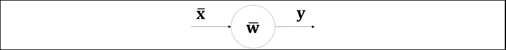

具有向量输入的一般的赫比神经元

神经元是一个简单的计算单元，它从突触前单元(其他神经元或感知系统)接收输入向量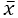，并输出单个标量值 *y* 。神经元的内部结构由一个权重向量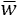表示，该向量对每个突触的强度进行建模。对于单个多维输入，输出如下获得:

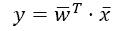

在这个模型中，我们假设每个输入信号被编码在向量的相应分量中；因此，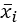由突触权重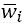处理，以此类推。

赫布法则指出，当同一条链中的两个神经元(一个突触前神经元和一个突触后神经元)有相同的行为时，它们的连接会越来越强。另一方面，如果它们有不同的行为，以至于当一个神经元被兴奋时，另一个被抑制，它们的连接就会减弱。

科学家 s . lowel 用著名的句子用通俗易懂的语言表达了这一概念:“一起放电的神经元连在一起”。

在 Hebb 理论的最初版本中，输入向量代表神经放电率，它总是非负的。这意味着突触权重只能得到加强(这种现象的神经科学术语是“长时程增强”——LTP)。然而，出于我们的目的，我们假设是一个实值向量，就像一样。这个条件允许在不失一般性的情况下模拟更多的人工场景。

当需要处理以矩阵形式组织的许多输入样本时，对单个向量执行的相同操作也适用。如果我们有 N**m*维输入向量，公式如下:*

*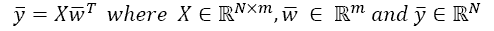

离散形式的 Hebb 规则的基本形式可以表示为(对于单个输入)如下:

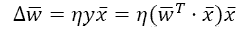

因此，权重校正是一个向量，其具有与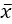相同的方向和等于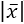乘以被称为学习率的正参数的幅度，以及可以具有正号或负号的相应输出 *y* 。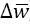的意义由 *y* 的符号决定；因此，在假设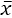和 *y* 是真实值的情况下，该规则会产生两种不同的情况:

*   如果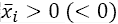和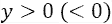，加强
*   如果和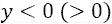，被削弱

考虑到二维向量，很容易理解这种行为:

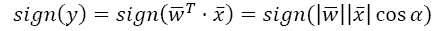

因此，如果与之间的初始角度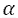小于 90 ( 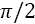)，则将具有与相同的方位；如果初始角度大于 90 度，将与方向相反。在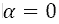的情况下，余弦等于 1， *y* 的符号始终为正(假设*符号* (0) = 1)。下图是该过程的示意图:

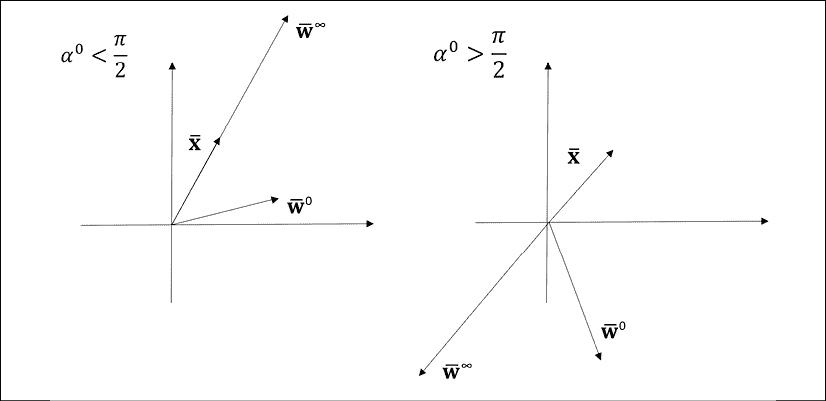

赫布法则的矢量分析

```
 is less than 90° and 50 iterations:
import numpy as np
w = np.array([1.0, 0.2])
x = np.array([0.1, 0.5])
alpha = 0.0
for i in range(50):
    y = np.dot(w.T, x)
    w += x*y
    alpha = np.arccos(np.dot(w, x.T) / 
                      (np.linalg.norm(w) * 
                       np.linalg.norm(x)))
```

我们现在可以测量最终值:

```
print(w)
print("{:.3f}".format(alpha * 180.0 / np.pi))
```

输出是:

```
[8028.48942243 40137.64711215]
0.001
```

正如所料，最终角度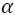接近于零，并且具有与相同的方向和方向。我们现在可以用大于 90°的重复实验(我们只改变的值，因为程序是相同的):

```
w = np.array([1.0, -1.0])
```

最终值现在是:

```
[-16053.97884486 -80275.89422431]
179.999
```

在这种情况下，最终的角度约为 180°，当然相对于方向相反。正如 s . lowel 所说:“一起放电的神经元连接在一起”。

我们可以重新表达这个概念(使其适应机器学习场景)，可以说这种方法的主要假设是基于这样的想法:当突触前和突触后单元一致时(它们的信号具有相同的符号)，神经元之间的连接变得越来越强。另一方面，如果它们不一致，相应的突触重量就会减少。为了精确起见，如果是一个尖峰率，那么它应该表示为一个实函数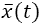以及 *y* ( *t* )。

根据最初的赫布边理论，离散方程必须用微分方程来代替:

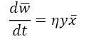

如果和 *y* ( *t* )具有相同的射速，突触重量将与两个射速的乘积成比例增加。相反，如果突触前活动和突触后活动 *y* ( *t* )之间存在相对较长的延迟，相应的权重就会减弱。这是一个更符合生物学原理的解释，解释了“一起着火→一起接线”的关系。

然而，即使该理论有强大的神经生理学基础，一些修改也是必要的。事实上，很容易理解最终的系统总是不稳定。如果重复应用两个输入(真实值和发射率)，向量的范数会无限增长，这对于生物系统来说不是一个合理的假设。事实上，如果我们考虑一个离散迭代步骤，我们有以下等式:

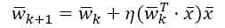

将所有项乘以，我们得到:

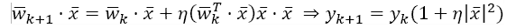

先前的输出*y*k 总是乘以一个大于 1 的因子(空输入的情况除外)，因此它的增长没有界限。与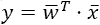一样，该条件意味着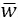的大小在每次迭代中增加(或者如果的大小为空，则保持不变)(考虑到原始微分方程，可以容易地获得更严格的证明)。

这种情况不仅在生物学上不可接受，而且在机器学习问题中也有必要对其进行适当管理，以避免几次迭代后出现数值溢出。在下一段中，我们将讨论一些克服这个问题的常用方法。现在，我们可以继续我们的分析，而不引入修正系数。

现在让我们考虑一个数据集 *X* :

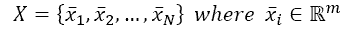

我们可以迭代地将规则应用于所有元素，但是更容易(也更有用)的是在输入样本上平均权重修改(索引现在指的是整个特定向量，而不是单个分量):

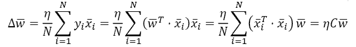

在上式中， *C* 是输入相关矩阵:

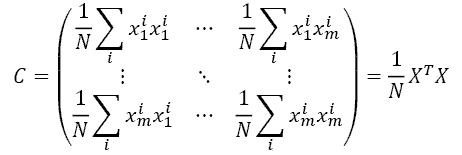

然而，出于我们的目的，考虑基于输入向量的阈值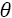的稍微不同的赫比规则是有用的(也有证明这种选择的生物学原因，但这超出了本书的范围；感兴趣的读者可以在 Dayan P .，Abbott F. L .，*理论神经科学，*麻省理工学院出版社，2003 年)中找到。

很容易理解，在原来的理论中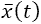和 *y* ( *t* )是射速，这个修改允许一个与 LTP 相反的现象叫做**长时抑郁** ( **LTD** )。实际上，当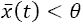和 *y* ( *t* )为正时，乘积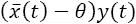为负，突触权重减弱。

如果我们设置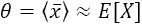，我们可以导出一个与上一个非常相似的表达式，但是基于输入的协方差矩阵(通过贝塞尔校正无偏):

如果公式除以 *N* ，则样本(协)方差有偏差。为了避免偏差，有必要除以*N*–1。当然，当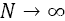出现时，这种差异趋于消失，但是考虑这种修正通常是有帮助的。想了解贝塞尔修正的更多细节的读者可以阅读华纳 r .，*应用统计*，SAGE Publications，2013。

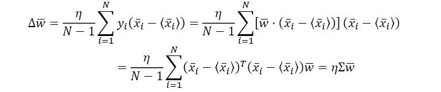

出于显而易见的原因，原始 Hebb 规则的这个变体被称为协方差规则。也可以使用**最大似然估计** ( **MLE** )(或有偏)协方差矩阵(除以 *N* )，但检查所采用的数学软件包采用的版本很重要。使用 NumPy 时，可以通过使用`np.cov()`功能和设置`bias=True/False`参数来决定版本(默认值为`False`，因此应用贝塞尔校正)。但当*N>1*时，版本之间的差异减小，往往可以舍弃。在本书中，我们将使用不带偏见的版本。

## 协方差规则分析

协方差矩阵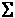是实数并且是对称的。如果我们应用特征分解，我们得到(为了我们的目的，保留 *V* ^(-1) 比简化版本 *V* ^T 更有用):

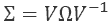

*V* 是包含的特征向量(作为列)的正交矩阵(由于是对称的)，而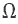是包含特征值的对角矩阵。假设我们对特征值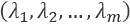和相应的特征向量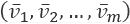进行排序，使得:

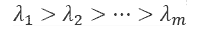

而且，我们假设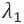优于其他所有特征值(有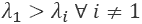就够了)。由于特征向量是正交的，它们构成了一个基础，并且可以用特征向量的线性组合来表示向量 *w* :

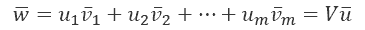

矢量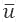包含新基础中的坐标。现在让我们考虑对协方差规则的修改:

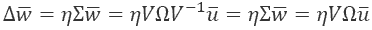

如果我们迭代地应用该规则，我们得到一个矩阵多项式:

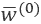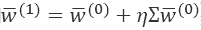…

利用二项式定理并考虑到，我们可以得到作为的函数的的一般表达式:


现在，让我们利用基的变化改写前面的公式:


向量包含在新基中的坐标；因此，被表示为一个多项式，其中通项与成比例

现在让我们考虑对角矩阵


最后一步源自假设大于任何其他特征值，并且当大于所有时。当然，如果，也会和一样成长。

然而，当时*次*特征值对的贡献变得明显较弱。为了理解这种近似的有效性，让我们考虑下面的情况，其中比稍大:


结果显示了一个非常重要的性质:不仅近似是正确的，而且正如我们将要显示的，如果一个特征值大于所有其他特征值，协方差规则将总是收敛到相应的特征向量*v*I。不存在其他稳定的不动点！

这个假设不再有效。在这种情况下，总方差同样可以由每个特征向量的方向来解释(这种情况意味着对称在现实生活中并不常见)。这种情况在使用有限精度算术时也会发生，但是一般来说，如果最大特征值和第二个特征值之间的差小于可达到的最大精度(例如，32 位浮点)，接受相等似乎是合理的。

当然，我们假设数据集没有被白化，因为我们的目标(也在接下来的段落中)是仅考虑具有最高总可变性的分量子集来减少原始维度(去相关，就像在**主分量分析** ( **PCA** )中一样，必须是算法的结果，而不是前提条件)。另一方面，使数据集以零为中心可能有助于利用 sigmoid 或双曲线正切等后处理函数的对称性。但是，这种算法不一定要保证的正确性。

考虑到这种近似，如果我们重写的表达式，我们得到如下:


与一样，这个结果表明，当时，将与协方差矩阵(如果不为空)的第一个特征向量成比例，并且其幅度在没有归一化的情况下将无限增长。在有限次数的迭代之后，由于其他特征值引起的寄生效应变得可以忽略不计(最重要的是，如果 *w* 除以其范数，则长度总是)。

然而，在得出我们的结论之前，必须加上一个重要的条件:


事实上，如果与正交，我们会得到(特征向量相互正交):


这一重要结果表明，使用协方差规则的 Hebbian 神经元如何能够在不需要特征分解的情况下执行仅限于第一分量的 PCA 。事实上，向量(我们不考虑数量增加的问题，这很容易管理)将快速收敛到输入数据集 *X* 作为最大方差的方向。在*第十三章*EM 算法和成分分析中，我们讨论了 PCA 的细节；在下一段中，我们将讨论使用 Hebb 规则的一个变体来寻找第一个 *N* 主成分的几种方法。正如我们将要看到的，这些方法的一个主要优点是对内存的要求有限，并且可以很容易地以迭代的方式对极其复杂的数据集执行 PCA。此外，网络还可以利用基于 GPU 的计算库，提供额外的速度增益。

### 协方差规则的应用示例

在继续之前，让我们用一个简单的 Python 例子来模拟这个行为。我们首先生成从二元高斯分布(方差是主动不对称的)中采样的 1000 个值，然后我们应用协方差规则来找到第一主分量(已被选择为不与正交):

```
import numpy as np
rs = np.random.RandomState(1000)
X = rs.normal(loc=1.0, scale=(20.0, 1.0),
              size=(1000, 2))
w = np.array([30.0, 3.0])
S = np.cov(X.T)
for i in range(10):
    w += np.dot(S, w)
    w /= np.linalg.norm(w)

w *= 50.0
```

在培训阶段结束时，我们可以检查:

```
print(np.round(w, 1))
```

输出是:

```
Final w: [50\.  0.]
```

这个算法很简单，但是有几个元素我们需要评论一下。第一个是在每次迭代结束时向量的归一化。这是避免 *w* 不受控制增长所需的技术之一。第二个棘手的元素是最后的乘法，。当我们乘以一个正标量时，的方向不受影响，但是在完整的绘图中显示矢量更容易。

结果如下图所示:


协方差规则的应用。w∞变得与第一主分量成比例

在有限次数的迭代之后，具有主特征向量的相同方向，在这种情况下，主特征向量平行于 *x* 轴。意义取决于初始值；然而，在 PCA 中，这不是一个重要的元素。

## 权重向量稳定和 Oja 规则

稳定权重向量的最简单方法是在每次更新后将其归一化。这样，它的长度将始终保持等于 1。事实上，在这种神经网络中，我们对大小不感兴趣，只对方向感兴趣(归一化后保持不变)。然而，有两个主要原因阻碍了这种方法。

首先是它不是本地的。为了标准化向量 *w* ，我们需要知道它的所有值，这在生物学上是不合理的。一个真正的突触权重模型应该是自我限制的，不需要访问无法获得的外部信息。

第二是必须在应用校正之后执行归一化，因此需要两次迭代步骤。

在许多机器学习环境中，这些条件不是限制性的，可以自由采用，但当有必要使用神经科学模型时，最好寻找其他解决方案。在离散形式中，我们需要确定标准赫布规则的校正项:


函数可以作为局部和非局部规格化器工作。第一种类型的例子是 Oja 规则:


参数是一个控制标准化强度的正数。考虑到以下条件，可以获得此规则的稳定性的非严格证明:


第二种表达暗示:


因此，当时，权重校正的幅度变得接近零，并且权重向量的长度将接近有限的极限值:


# 桑格的网络

A Sanger's network 是一种用于在线主成分提取的神经网络模型，由 T. D. Sanger 在 Sanger t . d .最优无监督学习、*单层线性前馈神经网络*中提出，神经网络，1989/2。作者从赫布规则的标准版本开始，并对其进行了修改，使其能够以降序提取可变数量的主成分。由此产生的方法，是 Oja 规则的自然延伸，被称为**广义希比规则**(**GHA**)——你可能有时也会把它称为**广义希比学习** ( **GHL** )。网络的结构如下图所示:


桑格网络的结构

该网络由从 n 维数据集中提取的样本提供:


*m* 个输出神经元通过一个权重矩阵*W*= {*W*ij}连接到输入，其中第一个索引指的是输入分量(突触前单元)，第二个索引指的是神经元。网络的输出可以很容易地用标量积来计算；然而，在这种情况下，我们对它不感兴趣，因为就像协方差(和 Oja 的)规则一样，通过权重更新来提取主成分。

Oja 规则制定后出现的问题是关于多种成分的提取。事实上，如果我们将原始规则应用于之前的网络，所有的权重向量( *w* 的行)都将收敛到第一个主分量。克服这种限制的主要思想(基于 Gram-Schmidt 正交归一化方法)是基于这样的观察:一旦我们提取了第一个分量，第二个分量可以被强制正交于，第三个分量可以被强制正交于和，等等。考虑以下表示:


两个权重向量的正交化

在这种情况下，我们假设是稳定的，而是另一个收敛到的权重向量。在上的投影如下:


在前面的公式中，如果不需要归一化，我们可以省略范数(在网络中，这个过程是在一次完整的权重更新后完成的)。的正交分量简单地通过一个差值获得:


将该方法应用于原始的 Oja 规则，我们获得了用于权重更新的新表达式(称为桑格规则):


该规则引用单个输入向量，因此*x*j 是的 *j* 第^个分量。第一项是经典的 Hebb 规则，它迫使权重变得与第一主分量平行，而第二项以类似于 Gram-Schmidt 正交化的方式起作用，通过减去与 *w* 在连接到先前突触后单元的所有权重上的投影成比例的项，同时考虑 Oja 规则提供的归一化约束(与输出的平方成比例)。

事实上，扩展上一项，我们得到如下结果:


减去每个分量*w*ij 的项与所有分量成比例，其中指数 *j* 是固定的，并且第一指数等于 1，2，…， *i* 。这个过程不会立即产生正交化，但需要几次迭代才能收敛。证明是不平凡的，涉及凸优化和动态系统方法，但它可以在上述文件中找到。Sanger 证明，如果学习率单调递减，并且在时收敛到零，则算法总是收敛到排序后的第一个 *n 个*主分量(从最大特征值到最小特征值)，即使对于形式证明是必要的，这个条件也可以放宽(一个稳定值通常是足够的)。在我们的实现中，矩阵 *W* 在每次迭代后被归一化，因此，在过程结束时，*W*T(权重在行中)是正交的，并构成特征向量子空间的基础。

在矩阵形式中，规则如下:


是一个矩阵函数，它将其自变量转换成一个下三角矩阵，项等于。

阿桑奇网络的算法如下:

1.  用随机值初始化*W*(0)。如果输入维数为 *n* 且必须提取 *m* 个主成分，则形状为( *m* x *n* )。
2.  设定一个学习率(例如)。
3.  设置一个阈值 *Thr* (例如 *Thr* = 0.001)。
4.  设置计数器 *T* = 0。

1.  而:
    1.  设置(与*和*形状相同)。
    2.  对于每个:
2.  设置 *T* = *T* + 1。
3.  计算
4.  计算和累加
    1.  更新。
    2.  设置(定额必须按行计算)

该算法也可以迭代固定次数(如我们的例子)，或者两种停止方法可以一起使用。我们现在可以实现一个桑格网络来评估其性能，并与标准的特征分解结果进行比较。

## 桑格网络的例子

对于这个 Python 例子，我们认为是一个具有 500 个数据点的二维零中心数据集 *X* (我们使用第一章中定义的函数)。在初始化 *X* 之后，我们还计算特征分解，以便能够再次检查结果:

```
import numpy as np
from sklearn.datasets import make_blobs
def zero_center(X):
    return X - np.mean(X, axis=0)
X, _ = make_blobs(n_samples=500, centers=2,
                  cluster_std=5.0, random_state=1000)
Xs = zero_center(X)
Q = np.cov(Xs.T)
eigu, eigv = np.linalg.eig(Q)
```

让我们从评估初始协方差矩阵及其特征分解开始:

```
print('Covariance matrix:\n {}'.format(Q))
print('Eigenvalues:\n {}'.format(eigu))
print('Eigenvectors:\n {}'.format(eigv))
```

输出是:

```
Covariance matrix:
 [[34.94435892 12.10674377]
 [12.10674377 38.55858945]]
Eigenvalues:
 [24.5106037  48.99234467]
Eigenvectors:
 [[-0.75750566 -0.6528286 ]
 [ 0.6528286  -0.75750566]]
```

由于数据集已经以零为中心，所以结果是一致的。我们现在可以实施培训程序了:

```
n_components = 2
learning_rate = 0.01
nb_iterations = 5000
t = 0.0
W_sanger = np.random.normal(scale=0.5,
                       size=(n_components, Xs.shape[1]))
W_sanger /= np.linalg.norm(W_sanger, axis=1).\
        reshape((n_components, 1))
for i in range(nb_iterations):
dw = np.zeros((n_components, Xs.shape[1]))
      t += 1.0
      for j in range(Xs.shape[0]):
         Ysj = np.dot(W_sanger, Xs[j]).\
                 reshape((n_components, 1))
         QYd = np.tril(np.dot(Ysj, Ysj.T))
         dw += np.dot(Ysj, Xs[j].
                     reshape((1, X.shape[1]))) - \
                  np.dot(QYd, W_sanger)
W_sanger += (learning_rate / t) * dw
W_sanger /= np.linalg.norm(W_sanger, axis=1).\
            reshape((n_components, 1))
print('Final weights:\n {}'.format(W_sanger.T))
```

过程结束时，输出为:

```
Final weights:
 [[-0.6528286   0.75750566]
 [-0.75750566 -0.6528286 ]]
```

正如所料，`W`已经收敛到输入相关矩阵的特征向量(符号——与 *w* 的含义相关——并不重要，因为我们只关心方向)。第二个特征值最高，因此列被交换。图形结果如下图所示:


最终配置，已经收敛到两个主要组件

两个分量完全正交(最终取向可以根据初始条件或随机状态而改变),并且指向第一主分量的方向，而指向第二主分量的方向。

考虑到这个好的特性，没有必要检查特征值的大小；因此，该算法可以在不对输入协方差矩阵进行特征分解的情况下运行。即使需要一个正式的证明来解释这种行为，也有可能直观地理解它。给定一个完整的特征向量子空间，每个单个神经元收敛到第一个主分量。这个性质总是保持的，但是正交化之后，子空间隐式地减少了一个维度。第二个神经元会一直收敛到第一个分量，现在对应的是全局的第二个分量，以此类推。

这种算法的优点之一(也是下一种算法的优点)是，标准的 PCA 通常是一个批量过程(即使有批处理算法)，而桑格网络是一个在线算法，是增量训练的。一般来说，由于迭代次数的原因，桑格网络的时间性能比直接方法差。一些优化可以通过使用更多的矢量化或 GPU 支持或使用优化的库如 Numba(【http://numba.pydata.org/】)来加速循环和实现内部并行化。另一方面，当分量的数量小于输入维数时，a Sanger 网络是节省存储器的(例如， *n* = 1000 的协方差矩阵具有 10 ⁶ 个元素，如果 *m* = 100，则权重矩阵具有 10 ⁴ 个元素)。

# 鲁布纳-塔万网络

在*第 13 章*、*分量分析和降维*中，我们提到任何对输入协方差矩阵去相关的算法都是在执行没有降维的 PCA。从这种方法开始，Rubner 和 Tavan(在论文 Rubner J .，Tavan P .，*A Self-Organizing Network for Principal-Components Analysis*，Europhysics，Letters，10(7)，1989)中)提出了一种神经模型，其目标是对输出分量去相关，以迫使输出协方差矩阵(在低维子空间中)随之去相关。假设数据集以零为中心，且 *E* [ *y* ] = 0，则 *m* 主分量的输出协方差矩阵如下:


因此，有可能实现近似去相关，迫使项变得接近零。

与标准方法(如白化或普通 PCA)的主要区别在于，该过程是局部的，而所有标准方法都是全局操作的，直接使用协方差矩阵。作者提出的神经模型如下图所示(最初的模型是针对二进制单元提出的，但它也适用于线性单元):


鲁布纳-塔万网络。连接*V*JK 是基于反希比规则

网络有 m 个输出单元，最后的 *m 个*–1 个神经元有一个求和节点，接收前面单元的加权输出(分层横向连接)。动态过程很简单:不修改的第一个输出。第二个被强制变得与第一个去相关。第三个信号被迫与第一个和第二个信号去相关，依此类推。该过程必须重复多次，因为输入是一个接一个地呈现的，并且出现在相关/协方差矩阵中的累积项(将数据集置于零中心并使用相关矩阵总是更容易)必须隐式地拆分到其加数中。不难理解，收敛到唯一稳定的不动点(已被作者证明存在)需要一些迭代来纠正错误的输出估计。

网络的输出由两部分组成:


符号*y*/*x*^((I))表示 *y* / *x* 的 *i* ^(th) 元素。第一项仅基于输入产生部分输出，而第二项使用分层横向连接来校正值并实施去相关。使用 Oja 规则的标准版本更新内部权重*w*ij(这主要负责每个权重向量收敛到第一主分量):


相反，外部权重*v*JK 使用反希比规则更新:


前面的公式可以分为两部分:第一项的作用方向与标准版本的 Hebb 规则相反(这就是为什么它被称为反 Hebbian ),并强制去相关。第二个作为一个正则，它的类似于 Oja 的规则。术语作为 Oja 规则的反馈信号，根据实际输出的新幅度重新调整更新。事实上，在修改横向连接后，输出也被迫改变，这种修改会影响 *w* [ij] 的更新。当所有输出去相关时，向量被隐含地强制正交。

可以想象与 Gram-Schmidt 正交化的类比，即使在这种情况下，不同分量的提取和解相关之间的关系更复杂。与 Sanger 的网络一样，该模型按照降序提取前 m 个主成分(原因与已经直观解释过的相同)，但要获得完整的(非平凡的)数学证明，请参考前述论文。

如果输入维度是 *n* 并且组件的数量等于 *m* ，那么可以使用一个下三角矩阵*V*(*m*x*m*)所有对角元素都设置为 0，并且使用一个标准矩阵用于*W*(*n*x*m*)。

*W* 的结构如下:


因此，是必须收敛到相应特征向量的列向量。 *V* 的结构改为:


使用这种表示法，输出如下:


由于输出是基于循环横向连接，其值必须通过迭代之前的公式固定次数来稳定，或者直到两个连续值之间的范数小于预定义的阈值。在我们的例子中，我们使用等于 5 的固定迭代次数。更新规则不能直接用矩阵符号编写，但是可以使用向量(列)和(行):


在这种情况下，是指的*I*th 组件。这两个矩阵必须用一个循环填充。

完整的 Rubner-Tavan 网络算法为(的维数为 *n* ，组件数为用 *m* 表示):

1.  随机初始化*W*(0)。形状为( *n* x *m* )。
2.  随机初始化*V*(0)。形状为( *m* x *m* )。
3.  设置*V*^((0))=*Tril*(*V*^((0)))。函数转换下三角矩阵中的输入参数。
4.  将 *V* ^((0)) 的所有对角线分量设置为 0。
5.  设置学习率()。
6.  设置一个阈值 *Thr* (例如 *Thr = 0.0001* )。
7.  设置循环计数器 *T* = 0。
8.  设置最大迭代次数*N*max(例如*N*max= 1000)。
9.  设定稳定循环数 *N* [stab] (例如 *N* [stab] = 5):
    1.  而:

1.  设 T = T + 1。

1.  对于 X 中的每个:

1.  将设置为零。形状为( *m* x 1)。

1.  对于 *i* = 1 到*N*stab:
    1.  
    2.  
2.  计算 *W* 和 *V* 的更新:
    1.  创建两个空矩阵 ( * n * × *m* )和 ( * m * × * m*
    2.  对于 *t* = 1 至 *m* :

1.  

1.  
    1.  更新 *W* 和 *V* :

1.  

1.  
    1.  设置*V*=*Tril*(*V*)并将所有对角线元素设置为 0。
    2.  设置(定额必须按列计算)

在这种情况下，我们采用了阈值和最大迭代次数，因为这种算法通常收敛非常快。此外，我建议读者在执行点积时总是检查向量和矩阵的形状。

## 鲁布纳-塔万网络示例

对于我们的 Python 示例，我们将使用已经为桑格网络创建的相同数据集(预计在变量 Xs 中可用)。在这个例子中，以及在所有其他例子中，NumPy 随机种子被设置为等于 1000 ( `np.random.seed(1000)`)。使用不同的值(或者在不重置种子的情况下重复实验更多次)会导致稍微不同的结果(总是一致的)。

我们可以开始设置所有的常量和变量:

```
import numpy as np
n_components = 2
learning_rate = 0.0001
max_iterations = 1000
stabilization_cycles = 5
threshold = 0.00001
W = np.random.normal(0.0, 0.5,
                     size=(Xs.shape[1], n_components))
V = np.tril(np.random.normal(0.0, 0.01,
                      size=(n_components, n_components)))
np.fill_diagonal(V, 0.0)
prev_W = np.zeros((Xs.shape[1], n_components))
t = 0
```

此时，可以实现训练循环了:

```
while (np.linalg.norm(W - prev_W, ord='fro') > 
           threshold and t < max_iterations):
prev_W = W.copy()
      t += 1
      for i in range(Xs.shape[0]):
         y_p = np.zeros((n_components, 1))
         xi = np.expand_dims(Xs[i], 1)
         y = None
         for _ in range(stabilization_cycles):
            y = np.dot(W.T, xi) + np.dot(V, y_p)
            y_p = y.copy()
         dW = np.zeros((Xs.shape[1], n_components))
         dV = np.zeros((n_components, n_components))
         for t in range(n_components):
            y2 = np.power(y[t], 2)
            dW[:, t] = np.squeeze((y[t] * xi) +
                (y2 * np.expand_dims(W[:, t], 1)))
            dV[t, :] = -np.squeeze((y[t] * y) +
                (y2 * np.expand_dims(V[t, :], 1)))
            W += (learning_rate * dW)
            V += (learning_rate * dV)
            V = np.tril(V)
            np.fill_diagonal(V, 0.0)
            W /= np.linalg.norm(W, axis=0).\
                reshape((1, n_components))
```

我们现在可以计算最终的`W`:

```
print(W)
```

输出是:

```
[[-0.65992841  0.75897537]
 [-0.75132849 -0.65111933]]
```

输出协方差矩阵可以使用以下代码片段计算:

```
Y_comp = np.zeros((Xs.shape[0], n_components))
for i in range(Xs.shape[0]):
y_p = np.zeros((n_components, 1))
       xi = np.expand_dims(Xs[i], 1)
       for _ in range(stabilization_cycles):
          Y_comp[i] = np.squeeze(np.dot(W.T, xi) +
                                 np.dot(V.T, y_p))
          y_p = y.copy()
print(np.cov(Y_comp.T))
```

输出是:

```
[[ 48.9901765   -0.34109965]
 [ -0.34109965  24.51072811]]
```

如预期的那样，算法已经成功地收敛到特征向量(以降序)，并且输出协方差矩阵几乎完全去相关(非对角元素的符号可以是正的或负的)。Rubner-Tavan 的网络一般比 Sanger 的网络更快，这要归功于反希比规则产生的反馈信号；然而，为学习率选择正确的值很重要。一种可能的策略是从不大于 0.0001 的值开始实施时间衰减(如在 Sanger 的网络中所做的)。然而，当 n 增加时(例如，时)减少是很重要的，因为 Oja 规则对横向连接*v*JK 的归一化强度通常不足以避免当*n>1*时的上溢和下溢。我不建议对`V`做任何额外的归一化处理(考虑到`V`是单数，必须仔细分析)，因为这样会拖慢进程，降低最终的精度。

# 自组织地图

**自组织映射** ( **SOMs** )已经由 Willshaw 和 Von Der Malsburg 提出(在 Willshaw D. J .，Von Der Malsburg C .，*如何通过自组织建立模式化的神经连接*，伦敦皇家学会学报，B/194，N. 1117，1976)以模拟在动物中观察到的不同神经生物学现象。特别是，他们发现大脑的一些区域发展出具有不同区域的结构，每个区域对特定的输入模式都具有高度的敏感性。这种行为背后的过程与我们迄今为止所讨论的完全不同，因为它是基于神经单元之间的竞争，这种竞争基于一种叫做赢者通吃的原则。在训练期间，所有的单元都被相同的信号激励，但是只有一个单元会产生最高的响应。该单元自动成为该特定模式的接受盆地的候选者。我们将要呈现的特定模型已经由 Kohonen(在论文 Kohonen T .，*拓扑正确特征图的自组织形成，*生物控制论，43/1，1982)引入，并且以他的名字命名。

主要思想是实现一个渐进的赢家通吃范式，以避免神经元(作为确定的赢家)的过早收敛，并增加网络的可塑性水平。这个概念在下图中用图形表示(这里我们考虑神经元的线性序列):


由 Kohonen 网络实现的墨西哥帽动态

在这种情况下，相同的模式呈现给所有的神经元。在训练过程开始时( *t* = 0)，在到中观察到积极响应，在中达到峰值。潜在的赢家显然是，但是所有这些单位都是根据它们与的距离来加强的。换句话说，如果其他模式产生更强的激活，网络(按顺序训练)仍然能够接受变化。相反，如果继续获胜，半径会稍微减小，直到唯一的增强单位是。考虑到该函数的形状，其在获胜单元周围形成峰值，这种动态通常被称为*墨西哥帽*。使用这种方法，网络保持可塑性，直到所有的模式都被重复呈现。例如，如果另一个模式在中引发了更强的响应，重要的是它的激活仍然不要太高，以允许网络的快速重新配置。与此同时，新的赢家很可能是的邻居，它接受了一个部分增强，可以轻松取代。

自组织映射在非线性降维的情况下也表现出非常有趣的行为。事实上，当数据集被投影到一个具有*m<n*的 *m* 维空间上时(例如，图像被投影到一个二维矩阵上)，获胜的单元就像是围绕一个特定的循环模式开发的集群的伪质心。假设 *X* 位于一个低维流形上，投影会移除冗余，同时保留拓扑相似性。然而，与其他流形学习算法相反，SOMs 以不同的方式获得这个结果。正如所解释的，只有在一系列(长)迭代之后，获胜的单元才变得稳定。在每次迭代中，半径逐渐减小。因此，最初，相同的拓扑结构由一个邻域共享。随着该过程以平滑的方式继续，流形距离被保留，直到训练过程结束。在这一点上，相邻的单元在拓扑上是相似的，特别是在 2D 地图上，几乎不可能观察到突然的变化。此外，由于每个数据点仅引出单个最大响应，SOM 也是隐式聚类空间。然而，如果像 K-Means 这样的算法通过最小化在原始空间中测量的距离来排列质心，SOMs 也执行数据集的隐式投影。

这种奇特的行为使我们可以将这些模型视为集群数据集的*代理*来使用它们。事实上，当投影稳定并且相邻单元由相似的模式引出时，可以将地图上的位置视为具有度量属性的真实指示器(也就是说，两个单元越接近，它们就越相似，反之亦然)。这种能力的应用有几个，它们包括眼球跟踪系统、去噪过滤器和语音解码器(如 T. Kohonen 为验证他的想法而设计的开创性语音控制打字机)。

考虑到后一种模型的有效性，我们现在可以用本章的最后一部分来分析 Kohonen 地图的工作原理以及如何使用影像数据集来实现它。

## 科霍宁地图

Kohonen SOM(也称为 Kohonen network 或简称 Kohonen Map)通常被表示为一个二维图(例如，一个正方形矩阵 *m* x *m* ，或任何其他矩形形状)，但 3D 表面，如球面或圆环面也是可能的(唯一的必要条件是存在一个合适的度量)。在我们的例子中，我们总是指一个正方形矩阵，其中每个细胞都是一个接受性神经元，其特征在于突触权重 w 与输入模式的维度:


在训练和工作阶段，根据样本和每个权重向量之间的相似性度量来确定获胜单元。最常见的度量是欧几里得；因此，如果我们考虑一个具有形状( *k* x *p* )的二维地图 *W* ，使得，获胜单位(就其坐标而言)计算如下:


如前所述，避免过早收敛很重要，因为完整的最终配置可能与初始配置大相径庭。因此，训练过程通常分为两个不同的阶段。在第一个过程中，其持续时间通常约为迭代总数的 10-20%(让我们称这个值为*t*max)，校正被应用于获胜单元及其邻居(通过采用衰减半径来计算)。相反，在第二个过程中，半径被设置为 1.0，并且校正仅应用于获胜的单元。通过这种方式，可以分析大量可能的配置，自动选择与最小错误相关的配置。邻域可以具有不同的形状；它可以是方形的(在闭合的 3D 地图中，边界不再存在)，或者更简单地，可以采用基于指数衰减距离权重的径向基函数:


每个神经元的相对权重由功能决定。是初始半径，而是时间常数，必须将其视为决定重量衰减斜率的超参数。合适的值是迭代总数的 5-10%。采用径向基函数，不需要计算实际的邻域，因为乘法因子 *n* ( *i* ， *j* )在边界外变得接近零。一个缺点与计算成本有关，计算成本高于正方形邻域(因为必须对整个地图计算函数)；然而，通过预先计算所有的平方距离(分子)并利用 NumPy(每次计算一个指数)等软件包提供的矢量化功能，可以加快这个过程。

更新规则非常简单，它基于将获胜单元突触权重移近模式(对整个数据集 *X* 重复)的思想:


函数是学习率，可以固定，但最好从较高的值开始，并让它衰减到目标最终值:


通过这种方式，初始更改会强制权重与输入模式保持一致，而所有后续更新都允许稍加修改，以提高整体精度。因此，每次更新与学习速率、邻域加权距离以及每个模式与突触向量之间的差异成比例。理论上，如果对于获胜的单元等于 0，则意味着一个神经元已经成为特定输入模式的吸引子，它的邻居将会接受有噪声/被改变的版本。最有趣的方面是，完整的最终地图将包含所有模式的吸引子，这些模式被组织为最大化相邻单元之间的相似性。以这种方式，当一个新的模式出现时，映射最相似形状的神经元区域将显示出更高的响应。例如，如果模式由手写数字组成，则数字 1 和数字 7 的吸引子将比例如数字 8 的吸引子更接近。一个畸形的 1(可能被解释为 7)将引出一个在前两个吸引子之间的响应，允许我们基于距离分配一个相对概率。正如我们将在示例中看到的，该特性可以在同一模式类的不同变体之间实现平滑过渡，避免强制二元决策的严格边界(如在 K-Means 聚类或硬分类器中)。

完整的 Kohonen SOM 算法如下:

1.  随机初始化 *W* ^((0)) (例如)。形状为(*k*x*n*x*p*)。
2.  初始化总迭代次数*N*max 和*t*max(例如*N*max= 1000 和*t*max= 150)。
3.  初始化(例如)。
4.  初始化和(例如和)。

1.  对于 *t* = 0 至*N*max:
    1.  如果*t<t*t[max]:

1.  计算

1.  计算
    1.  否则:

1.  设置

1.  设置
    1.  对于每个:

1.  计算获胜单位 *u* *(假设坐标为( *i* ， *j* )
2.  计算 *n* ( *i* ， *j* )

1.  将权重修正应用到所有突触权重 *W* ^( (t))
    1.  重正化(范数必须按列计算)

在讨论了理论部分之后，我们已经准备好看到使用包含一组人的不同图片的数据集的 Kohonen 地图的实际实现。这个例子也有助于理解如何调整超参数，以加快收敛和提高精度。

## SOM 的例子

我们现在可以使用 Olivetti faces 数据集实现一个 SOM 。由于该过程可能非常长，在本例中，我们将输入模式的数量限制为 100(使用 4 x 4 矩阵)。读者可以尝试使用整个数据集和更大的地图。

第一步是加载数据，对其进行规范化，使所有值都在 0.0 和 1.0 之间，并设置常数:

```
import numpy as np
from sklearn.datasets import fetch_olivetti_faces
faces = fetch_olivetti_faces(shuffle=True)
Xcomplete = faces['data'].astype(np.float64) / np.max(faces['data'])
np.random.shuffle(Xcomplete)
X = Xcomplete[0:100]
```

我们现在可以定义主常数和初始矩阵:

```
nb_iterations = 5000
nb_startup_iterations = 1000
pattern_length = 64 * 64
pattern_width = pattern_height = 64
eta0 = 1.0
sigma0 = 2.0
tau = 80.0
matrix_side = 4
W = np.random.normal(0, 0.1, 
                     size=(matrix_side, 
                           matrix_side, 
                           pattern_length))
```

现在，我们需要定义基于最小距离确定获胜单位的函数:

```
def winning_unit(xt):
    global W
    distances = np.linalg.norm(W - xt, ord=2, axis=2)
    max_activation_unit = np.argmax(distances)
    return int(np.floor(max_activation_unit / 
                        matrix_side)), \
           max_activation_unit % matrix_side
```

定义功能和也很有用:

```
def eta(t):
    return eta0 * np.exp(-float(t) / tau)
def sigma(t):
    return float(sigma0) * np.exp(-float(t) / tau)
```

如前所述，不是为每个单元计算径向基函数，而是使用一个预先计算的距离矩阵(在本例中为 4×4×4×4 ),其中包含单元对之间所有可能的距离。通过这种方式，NumPy 凭借其矢量化功能加快了计算速度:

```
precomputed_distances = np.zeros((matrix_side, 
                                  matrix_side, 
                                  matrix_side, 
                                  matrix_side))
for i in range(matrix_side):
   for j in range(matrix_side):
      for k in range(matrix_side):
         for t in range(matrix_side):
            precomputed_distances[i, j, k, t] = \
                  np.power(float(i) - float(k), 2) + \
                       np.power(float(j) - float(t), 2)
def distance_matrix(xt, yt, sigmat):
    global precomputed_distances
    dm = precomputed_distances[xt, yt, :, :]
    de = 2.0 * np.power(sigmat, 2)
    return np.exp(-dm / de)
```

给定中心点(获胜单位)`xt`、`yt`和当前值 sigmat，`distance_matrix`函数返回整个地图的径向基函数值。现在，可以开始训练过程了(为了避免相关性，最好在每次迭代开始时打乱输入序列):

```
sequence = np.arange(0, X.shape[0])
t = 0
for e in range(nb_iterations):
    np.random.shuffle(sequence)
    t += 1
    if e < nb_startup_iterations:
        etat = eta(t)
        sigmat = sigma(t)
    else:
        etat = 0.2
        sigmat = 1.0
    for n in sequence:
        x_sample = X[n]
        xw, yw = winning_unit(x_sample)
        dm = distance_matrix(xw, yw, sigmat)
        dW = etat * np.expand_dims(dm, axis=2) \
             * (x_sample - W)
        W += dW
    W /= np.linalg.norm(W, axis=2).\
         reshape((matrix_side, matrix_side, 1))
```

在这种情况下，我们设置了，但是我邀请读者尝试不同的值并评估最终结果。在训练了 5000 个时期后，我们得到了以下权重矩阵(每个权重被绘制为二维数组):


最终 SOM 权重矩阵

正如可能看到的那样，权重已经收敛到具有稍微不同特征的脸上。特别是，看着脸的形状和表情，很容易注意到不同吸引子之间的过渡(一些脸在微笑，而另一些脸更严肃；有些人戴着眼镜，留着小胡子，留着胡须，等等)。考虑矩阵大于最小容量也很重要(数据集中有 10 个不同的个体)。这允许映射更多不容易被正确的神经元吸引的模式。

例如，一个人可以有带胡子和不带胡子的照片，这可能会导致混淆。如果矩阵太小，就有可能观察到收敛过程中的不稳定性，而如果太大，就很容易看到冗余。正确的选择取决于每个不同的数据集和内部方差，没有办法定义一个标准的标准。一个好的起点是选择一个容量比所需吸引子的数量大 2.0 到 3.0 倍的矩阵，然后增加或减少其大小，直到精度达到最大值。

要考虑的最后一个因素是标签阶段。在训练过程的最后，我们不知道获胜神经元的权重分布，因此有必要处理数据集并注释每个模式的获胜单元。这样，就有可能提交新的模式来获得最可能的标签。这个过程没有显示出来，但是它很简单，读者可以很容易地在不同的场景中实现它。

# 总结

在本章中，我们讨论了 Hebb 规则，展示了它如何驱动输入数据集第一主成分的计算。我们也看到这个规则是不稳定的，因为它导致突触权重的无限增长，以及如何使用归一化或 Oja 规则来解决这个问题。

我们引入了两种不同的基于 Hebbian 学习的神经网络(Sanger 的和 Rubner-Tavan 的网络)，它们的内部动力学略有不同，并且能够以正确的顺序(从最大特征值开始)提取前 n 个主分量，而无需对输入协方差矩阵进行特征分解。

最后，我们介绍了 SOM 的概念，并提出了一个称为 Kohonen 网络的模型，它能够通过竞争学习过程将输入模式映射到放置了一些吸引子(每个类一个)的表面上。这种模型能够通过在与模式最相似的吸引子中引出强响应来识别新的模式(属于同一分布)。以这种方式，在标记过程之后，该模型可以被用作软分类器，该软分类器可以容易地管理有噪声或改变的模式。

在下一章中，我们将讨论集成学习的主要概念以及最重要和最广泛的打包和提升算法。

# 延伸阅读

*   *理论神经科学*，麻省理工学院出版社，2003 年
*   Warner R .，*应用统计学*，SAGE 出版社，2013 年
*   桑格. T. D .，*单层线性前馈神经网络*，神经网络，1989/2
*   Rubner J .，Tavan P .，*一个用于主成分分析的自组织网络，欧洲物理，快报*，10(7)，1989
*   Principe J. C .、Euliano N. R .、Lefebvre W. C .，*神经和适应系统:通过模拟的基本原理*，Wiley 1997/1999
*   Willshaw D. J .，Von Der Malsburg C .，*如何通过自组织建立模式化的神经连接*，伦敦皇家学会学报，B/194，N. 1117，1976
*   Kohonen T .，*拓扑正确特征图的自组织形成*，生物控制论，43/1，1982
*   Kohonen T .，*学习矢量量化，自组织映射*。斯普林格信息科学丛书，第 30 卷。斯普林格，1995 年*