# 十五、集成学习基础

在这一章中，我们将讨论一些重要的算法，这些算法利用不同的估计量来提高集合或委员会的整体性能。这些技术要么通过在属于预定义集合的每个估计器中引入中等水平的随机性来工作，要么通过创建一系列估计器来工作，在这些估计器中，每个新模型都被强制改进先前模型的性能。这些技术允许我们在使用容量有限或更倾向于过度拟合训练集的模型时，减少偏差和方差(从而提高验证准确性)。

特别是，本章涵盖的主题如下:

*   集成学习简介
*   决策树的简要介绍
*   随机森林和超随机森林
*   AdaBoost(算法 M1，SAMME，SAMME。和 R2)

我们现在可以通过讨论弱学习器和强学习器的基本概念以及如何组合简单的估计器来创建性能更好的委员会，来开始我们对集成学习算法的探索。

# 集成学习基础

集成学习背后的主要概念是强学习者和弱学习者之间的区别。特别是，一个强学习者是一个分类器或回归器，它有足够的能力达到最高的潜在准确性，最小化偏差和方差(从而也达到令人满意的泛化水平)。

另一方面，弱学习者是这样一种模型，其一般能够达到比随机猜测略高的准确度，但是其复杂性非常低(它们可以被非常快速地训练，但是永远不能单独用于解决复杂的问题)。

为了更正式地定义一个强学习器，如果我们考虑一个参数化的二元分类器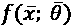，如果下列条件成立，我们将其定义为强学习器:

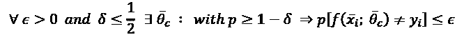

这个表达式最初可能看起来很神秘；然而，这很容易理解。它只是表达了的概念，即强学习者理论上能够以大于或等于 0.5 的概率(即二进制随机猜测的阈值)实现任何非空的误分类概率。

机器学习任务中通常采用的所有模型通常都是强学习者，即使它们的领域可能是有限的(例如，逻辑回归不能解决非线性问题)。

弱学习者也有一个正式的定义，但更简单的是考虑弱学习者真正的主要属性是达到合理准确度的有限能力。在训练空间的一些非常特殊和小的区域中，弱学习者可能达到低概率的错误分类，但是在整个空间中，它的性能仅比随机猜测好一点点。前一个与其说是实践定义，不如说是理论定义，因为目前可用的所有模型通常都比随机预言好得多。然而，集合被定义为一组弱学习者，他们被一起(或按顺序)训练以组成一个委员会。在分类和回归问题中，最终结果都是通过平均预测或采用多数投票获得的。

此时，一个合理的问题是——为什么我们需要培养许多弱学习者，而不是单一的强学习者？答案是两方面的——在集成学习中，我们通常与中等强度的学习者(如决策树或线性支持向量机——SVM)一起工作，我们将他们作为一个委员会，通过对样本空间的更广泛探索来提高整体准确性并减少差异。

事实上，虽然单个强学习者通常能够过度适应训练集，但在不饱和容量的情况下，在整个样本子空间上保持高精度是更加困难的。为了避免过度拟合，必须找到一种折衷，其结果是具有更简单分离超平面的不太精确的分类器/回归器。

采用许多弱学习器(它们实际上相当强，因为即使最简单的模型也比随机猜测更准确)，允许我们迫使它们只关注有限的子空间，以便能够以低方差达到非常高的局部准确性。委员会采用平均技术，可以很容易地找出哪个预测是最合适的。或者，它可以要求每个学习者投票，假设一个成功的训练过程必须总是引导大多数人提出最准确的分类或预测。

最常见的集成学习方法如下:

*   **Bagging**(**bootstrap aggregating**):这种方法使用随机抽样原始数据集 *D* 创建的 *n* 训练集( *D* [1] *，D* [2] *，…，D* [n] 来训练 *n* 弱学习者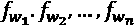(通常是决策树)抽样过程(称为 *bootstrap 抽样*)通常用替换(称为适当装袋)来执行，以确定不同的数据分布。此外，在许多真实算法中，弱学习器也使用中等程度的随机性进行初始化和训练。通过这种方式，克隆的概率变得非常小，同时，通过将方差保持在一个可容忍的阈值之下(从而避免过度拟合)，有可能提高精确度。Breiman(在 Breiman L .，*在大型数据库和在线粘贴分类的小投票，*机器学习，36，1999)提出了一种替代方法，称为*粘贴*，其中随机选择的 *D* 被采样而没有替换。在这种情况下，弱学习者的专业化更具选择性，并且集中在样本空间的特定区域而没有重叠。此外，在 Breiman 之前，Ho(在 Ho T .，*用于构造决策森林的随机子空间方法，模式分析和机器智能*，20，1998)分析了通过专门处理特征来创建子集的可能性。与粘贴相反，这种方法迫使弱学习者专攻子空间(有样本重叠)。这种方法类似于协同训练，其中使用不同的分类器通过关注数据集的两个不同视图来执行半监督任务。然而，在这两种情况下，所要求的容量是有限的，并且弱学习者可以容易地找到合适的分离超曲面。这种模型的组合，类似于装袋，允许我们通过明智地使用随机性来解决非常复杂的问题。
*   **Boosting**: This is an alternative approach that builds an incremental ensemble starting with a single weak learner 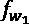 and adding a new one 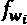 at each iteration. The goal is to reweight the dataset, so as to force the new learner to focus on the data points that were previously misclassified. This strategy yields a very high accuracy because the new learners are trained with a positively biased dataset that allows them to adapt to the most difficult internal conditions.

    然而，以这种方式，对方差的控制被削弱，并且集合可以更容易地过度适应训练集。有可能通过降低弱学习者的复杂性或施加正则化约束来缓解这个问题。

*   **堆叠**:这种方法可以以不同的方式实现，但原理总是相同的——使用不同的算法(通常是几个强学习者)对同一数据集进行训练，并使用另一个分类器过滤最终结果，平均预测或使用多数投票。如果数据集的结构可以用不同的方法进行部分管理，这种策略会非常有效。每个分类器或回归器应该发现一些特殊的数据方面；这就是为什么算法必须在结构上不同。例如，将决策树与 SVM 模型或线性模型和核模型相结合会很有用。在测试集上执行的评估应该清楚地显示分类器仅在某些情况下的流行程度。如果一个算法最终是唯一一个产生最佳预测的算法，那么集合就变得无用，最好专注于单个强学习者。

# 随机森林

随机森林是基于决策树的 bagging 集成模型。如果读者不熟悉这类模型，我建议阅读 Alpaydin E .，*机器学习导论，*麻省理工学院出版社，2010 年，在那里可以找到完整的解释。然而，出于我们的目的，对最重要的概念提供一个简短的解释是很有用的。

## 随机森林基础知识

决策树是一种类似于标准分层决策过程的模型。在大多数情况下，使用一个特殊的家族，称为*二元决策树*，因为每个决策只产生两个结果。这种树通常是最简单和最合理的选择，并且训练过程(包括构建树本身)非常直观。根包含整个数据集:

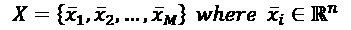

每个级别都是通过应用选择元组获得的，定义如下:

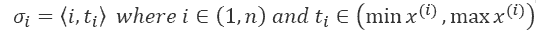

元组的第一个索引对应于一个输入特征，而阈值 *t* [i] 是在每个特征的特定范围内选择的值。选择元组的应用导致一个分割和两个节点，每个节点包含输入数据集的非重叠子集。在下图中，有一个在根级别执行的滑动示例(初始分割):

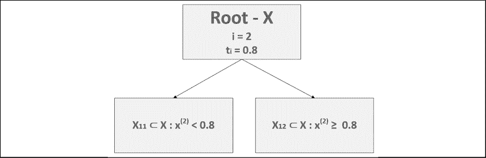

决策树中初始分割的示例

集合 *X* 被分成两个子集，定义为*X*11 和*X*12，它们的数据点分别具有小于或大于阈值*t*t[I]0.8 的特征。分类决策树背后的直觉是继续分裂，直到叶子包含属于单个类别的点*y*I(这些节点被定义为纯的)。这样，新点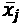可以以计算复杂度 *O* (log *M* )遍历树，并到达确定其类别的最终节点。以非常相似的方式，可以构建输出连续的回归树(即使，为了我们的目的，我们将只考虑分类场景)。

此时，主要问题是如何执行每次拆分。我们不能挑选任何特征和任何阈值，因为最终的树将是完全不平衡和非常深的。我们的目标是考虑到最终目标，在每个节点找到最佳选择元组，最终目标是分类到离散的类别中(对于回归，该过程几乎是相同的)。该技术非常类似于基于必须最小化的成本函数的问题，但是，在这种情况下，我们局部操作，应用与节点的异质性成比例的杂质测量。高杂质表明存在属于许多不同类别的样品，而等于 0 的杂质表明存在单一类别。由于我们需要继续分裂，直到出现纯叶，所以最佳选择基于对每个选择元组评分的函数，允许我们选择产生最低杂质的元组(理论上，该过程应该继续，直到所有叶都是纯的，但通常提供最大深度，以避免过度复杂)。

如果有 *p* 类，类别集可以定义如下:

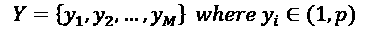

一种非常常见的杂质测量方法是，称为*基尼杂质*，它基于错误分类的概率，如果使用从节点子集分布中随机选择的标签对数据点进行分类。直观来看，如果所有点都属于同一类别，那么任何随机选择都会导致正确的分类(并且杂质变为 0)。另一方面，如果节点包含来自许多类别的点，则错误分类的可能性会增加。从形式上看，该衡量标准定义如下:

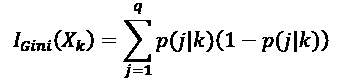

子集由*X*k 和 *p* ( *j | k* )表示，作为属于类别 *j* 的数据点与样本大小的比率获得。必须选择选择元组，以便最小化子代的基尼不纯度。另一种常见的方法是交叉熵杂质，定义如下:

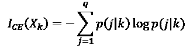

这种方法和前一种方法的主要区别在于一些基本的信息论概念。特别是，我们想要达到的目标是不确定性的最小化，这是使用(交叉)熵来测量的。如果我们有一个离散的分布，所有的数据点都属于同一个类别，一个随机的选择就可以完全描述这个分布；因此，不确定性为零。相反，例如，如果我们有一个公平的骰子，每个结果的概率是 1/6，相应的熵约为 2.58 位(如果对数的底是 2)。当节点越来越纯时，交叉熵杂质减少，在最优情况下达到 0。此外，采用互信息的概念，我们可以定义在执行分割之后获得的信息增益:

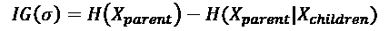

给定一个节点，我们想要创建两个子节点来最大化信息增益。换句话说，通过选择交叉熵杂质，我们隐式地增长树，直到信息增益变为零。再次考虑公平骰子的例子，我们需要 2.58 位信息来决定哪一个是正确的结果。相反，如果骰子被装载，结果的概率是 1 (100%)，我们就不需要任何信息来做决定。在决策树中，我们希望类似于这种情况，这样，当一个新的数据点完全遍历了树，我们就不需要任何进一步的信息来对它进行分类。如果施加最大深度，则最终信息增益不能为零。这意味着我们需要支付额外的费用来完成分类。这一成本与剩余不确定性成比例，应该最小化以提高精度。

也可以采用其他方法(即使基尼系数和交叉熵是最常见的方法)，我请读者查阅参考文献以了解更多信息。然而，在这一点上，一个考虑自然产生了。决策树是简单的模型(他们不是弱学习者！)，但是建立它们的过程比，例如，训练逻辑回归或线性 SVM 更复杂。为什么它们如此受欢迎？

## 为什么要使用决策树？

决策树流行的一个原因已经很清楚了——它们代表了一个可以用图表显示的结构化过程；然而，这不足以证明它们的用途。两个重要的属性允许在没有任何数据预处理的情况下使用决策树。

事实上，很容易理解，与其他方法相反，不需要任何缩放或白化，并且可以同时使用连续和分类特征。例如，如果在二维数据集中，一个特征的方差等于 1，而另一个特征的方差等于 100，则大多数分类器将获得较低的精度；因此，预处理步骤变得必要。在决策树中，当范围非常不同时，选择元组也具有相同的效果。不言而喻，在考虑分类特征的情况下，可以很容易地执行拆分，并且不需要使用诸如一键编码(在大多数情况下，这是避免泛化错误所必需的)之类的技术。然而，不幸的是，使用决策树获得的分离超曲面通常比使用其他算法获得的分离超曲面复杂得多，这导致了更高的方差，从而丧失了泛化能力。

为了理解原因，可以想象一个非常简单的二维数据集，由位于第二和第四季度的两个 blobs 组成。第一套的特点是( *x < 0* ， *y > 0* )，而第二套的特点是( *x < 0* ， *y < 0* )。让我们还假设我们有一些异常值，但是我们关于数据生成过程的知识不足以将它们限定为噪声点或异常值(原始分布可以具有在轴上延伸的尾部；例如，它可以是两个高斯函数的混合)。在这种情况下，最简单的分隔线是将平面分成两个子平面的对角线，这两个子平面包含也属于第一个和第三个四分之一的区域。但是，只有同时考虑两个坐标，才能做出这个决定。使用决策树，我们需要首先进行分割，例如，使用第一个特征，然后再使用第二个特征。结果是一条分段分隔线(例如，将平面分割成对应于第二个四分之一及其补集的区域)，导致非常高的分类方差。矛盾的是，一个更好的解决方案可以通过一个不完整的树(限制过程，例如，一次分割)和选择 *y* 轴作为分隔线来获得(这就是为什么施加一个最大深度是重要的)，但是你付出的代价是一个更大的偏差(和更差的精确度)。

使用决策树(和相关模型)时要考虑的另一个重要因素是最大深度。可以让树一直长到所有的叶子都是纯的，但是有时候最好设置一个最大的深度(因此也是最大的终端节点数)。等于 1 的最大深度驱动称为*决策树桩*的二元模型，它不允许特征之间的任何交互(它们可以简单地表示为 *If … Then* 条件)。较高的值会产生更多的终端节点，并允许特性之间增加交互(可以考虑将许多 *If … Then* 语句与*和*逻辑运算符组合在一起)。必须考虑每个问题来调整正确的值，重要的是要记住，非常深的树比修剪过的树更容易过度拟合。

在某些情况下，最好以较高的泛化能力获得稍差的精度，在这种情况下，应设置最大深度。确定最佳值的最常用工具总是网格搜索和交叉验证技术。

## 随机森林和偏差-方差权衡

随机森林为我们解决偏差-方差权衡问题提供了一个强大的工具。它们是由 Breiman 提出的(在 Breiman L .， *Random Forests，Machine Learning，* 45，2001)并且它们的逻辑非常简单。

如前一节已经解释的，打包方法从选择弱学习者的数量、 *N* 、 [c] 开始。第二步是生成*N*c 数据集(称为*引导样本* ) 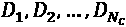:

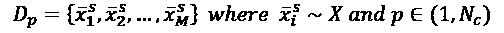

使用公共杂质标准，使用相应的数据集来训练每个决策树；然而，在随机森林中，为了减少方差，选择分裂的计算并不考虑所有的特征，而是仅通过包含数量减少的特征的随机子集(常见的选择是舍入平方根、log [2] *x* 或自然对数)。这种方法确实削弱了每个学习者，因为最优性部分丧失了，但是允许我们通过限制过度特殊化来获得显著的方差减少。与此同时，偏差的减少和精确度的提高是集合的结果(特别是对于大量的估计量)。事实上，由于学习者接受的数据分布略有不同，当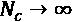时，预测的平均值会收敛到正确的值(实际上，并不总是需要使用大量的决策树，但是，必须使用交叉验证的网格搜索找到正确的最小值)。一旦用函数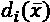表示的所有模型都被训练，最终预测可以作为平均值获得:

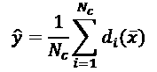

或者，也可以采用多数表决(但仅限于分类):

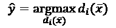

这两种方法非常相似，并且在大多数情况下，它们产生相同的结果。然而，当这些点几乎在边界上时，平均更加稳健，并且允许改进的灵活性。此外，它可以用于分类和回归任务。

随机森林通过从较小的样本子集中挑选最佳选择元组来限制其随机性。例如，在某些情况下，当特征的数量不是很大时，这种策略会导致最小方差减少，并且计算成本不再符合结果。使用一种叫做*额外随机化树*(或简称为额外树)的变体可以获得更好的性能。

程序基本相同；然而，在这种情况下，在执行分割之前， *n* 个随机阈值被计算(对于每个特征)并且导致最少杂质的阈值被选择。这种方法进一步削弱了学习者，但同时减少了残差方差，防止了过度拟合。这种动态与许多技术没有太大的不同，比如正则化或放弃(我们将在下一章讨论这种方法)；事实上，额外的随机性降低了模型的容量，迫使它更线性化的解决方案(这显然是次优的)。

为这种限制付出的代价是随之而来的偏见恶化，然而，许多不同的学习者的存在弥补了这一点。即使是随机分裂，当 *N* [c] 足够大时，错误分类(或回归预测)的概率变得越来越小，因为平均投票和多数投票都倾向于补偿在特定区域中结构严重次优的树的结果。这个结果更容易获得，特别是当训练数据点的数量很大时。在这种情况下，实际上，替换采样会导致略微不同的分布，这些分布可以被认为是部分随机增强的(即使这在形式上不正确)。因此，每个弱学习者将隐式地关注整个数据集，并额外关注随机选择的更小的子集(不同于实际的提升)。另一个需要记住的要点是，决策树非常容易过度拟合(事实上，它们倾向于到达每片叶子只有一个元素的最终叶子)。这种情况显然是不希望的，必须通过设置每棵树的最大深度来适当控制。通过这种方式，偏差被保持在其潜在最小值之上一点点，但是集合具有更小的方差并且可以更好地概括。

完整的随机森林算法如下:

1.  设置决策树的数量*N*c
2.  For *i* = 1 to *N*[c]:

    创建数据集*D*I 采样，替换原始数据集 *X*

3.  设置每次分割时要考虑的特征数量*N*f(例如 *sqrt* ( *n* ))
4.  设置杂质测量(例如，基尼杂质)
5.  为每棵树定义一个可选的最大深度
6.  对于 *i* = 1 到*N*c:
    1.  **Random forest**:

        使用数据集*D*I 训练决策树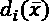，并在随机采样的*N*f 特征中选择最佳分割

    2.  **Extra-trees**:

        使用数据集*D*I 训练决策树，在每次分割之前计算 *n* 个随机阈值，并选择产生最少杂质的一个

1.  定义一个输出函数平均单个输出或采用多数表决

## 使用 scikit-learn 的随机森林示例

在本例中，我们将使用著名的葡萄酒数据集(178 个 13 维样本分为三类)，该数据集可在 scikit-learn 中直接获得。不幸的是，为集成学习算法找到良好而简单的数据集并不容易，因为它们通常用于大型复杂的数据集，需要太长的计算时间。无论如何，这个例子的目标是展示随机森林的属性，这些例子可以用不同的参数运行多次。有了这些知识，读者将能够将这些模型应用到现实生活中，并获得最大的优势。

由于葡萄酒数据集并不特别复杂，第一步是使用 10 重交叉验证评估不同分类器的性能(简单的逻辑回归、最大深度设置为 5 的决策树和交叉熵杂质测量，以及自动调整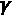的 RBF SVM)。即使决策树和随机森林对不同的比例不敏感，逻辑回归和 SVM 也是如此，因此，在加载数据集后，我们将对其进行缩放:

```
import numpy as np
from sklearn.datasets import load_wine
from sklearn.model_selection import cross_val_score
from sklearn.preprocessing import StandardScaler
from sklearn.linear_model import LogisticRegression
from sklearn.tree import DecisionTreeClassifier
from sklearn.svm import SVC
wine = load_wine()
X, Y = wine["data"], wine["target"]
ss = StandardScaler()
Xs = ss.fit_transform(X)
lr = LogisticRegression(max_iter=5000, 
                        solver='lbfgs',
                        multi_class='auto', 
                        random_state=1000)
scores_lr = cross_val_score(lr, Xs, Y, cv=10,
                            n_jobs=-1)
dt = DecisionTreeClassifier(criterion='entropy',
                            max_depth=5,
                            random_state=1000)
scores_dt = cross_val_score(dt, Xs, Y, cv=10,
                            n_jobs=-1)
svm = SVC(kernel='rbf', 
          gamma='scale',
          random_state=1000)
scores_svm = cross_val_score(svm, Xs, Y, cv=10,
                             n_jobs=-1)
print("Avg. Logistic Regression CV Score: {:.3f}".
          format(np.mean(scores_lr)))
print("Avg. Decision Tree CV Score: {:.3f}".
          format(np.mean(scores_dt)))
print("Avg. SVM CV Score: {:.3f}".
          format(np.mean(scores_svm)))
```

输出是:

```
Avg. Logistic Regression CV Score: 0.978
Avg. Decision Tree CV Score: 0.933
Avg. SVM CV Score: 0.978
```

正如预期的那样，的性能相当好，通过逻辑回归和 RBF SVM 实现的平均交叉验证准确度的最高值等于大约 97.8%。一个非常有趣的元素是决策树的性能，它比其他分类器稍差。其他杂质测量(例如，基尼)或更深的树不会改善这一结果，因此，在这项任务中，决策树平均比逻辑回归弱，即使它不完全正确，我们也可以将该模型定义为我们的 bagging 测试的候选模型。下图显示了三条具有 CV 值的曲线:

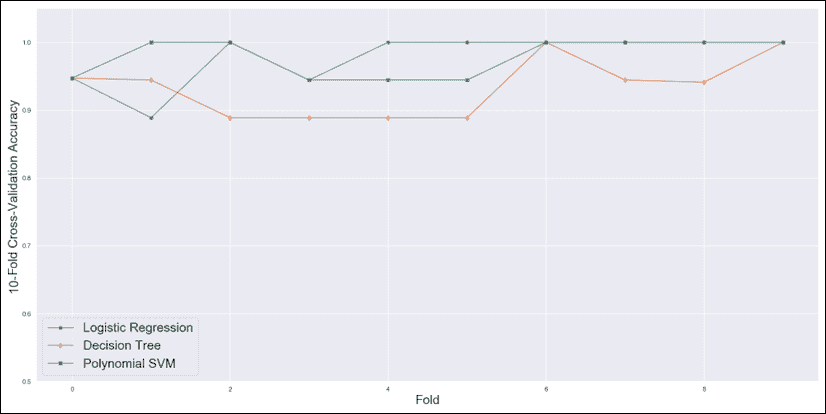

三个测试模型的交叉验证图

正如可能看到的，所有分类器倾向于容易地达到大于 0.9 的 CV 分数，其中 8 倍的分数大约为 1.0(没有错误分类)。这意味着随机森林的改进空间有限，集合必须关注具有*独特*特征的子样本。例如，第二个折叠对应于两个分类器的最低 CV 分数，因此包含在该集合中的数据点是否则将被丢弃的 *p* [数据]的子区域的唯一代表。我们期望 bagging 集成通过在特定区域训练一些弱学习者来填补这一空白，从而增加最终预测的置信度。

为了测试我们的假设，我们现在可以通过实例化类`RandomForestClassifier`并选择`n_estimators=150`来拟合一个随机森林(我邀请读者尝试不同的值)。考虑到决策树的性能，同样在这种情况下，我们采用交叉熵杂质:

```
from sklearn.ensemble import RandomForestClassifier
rf = RandomForestClassifier(n_estimators=150, 
                            n_jobs=-1,
                            criterion='entropy', 
                            random_state=1000)
scores = cross_val_score(rf, Xs, Y, cv=10, 
                         n_jobs=-1)
print("Avg. Random Forest CV score: {:.3f}".
          format(np.mean(scores)))
```

前面代码片段的输出是:

```
Avg. Random Forest CV score: 0.984
```

不出所料，平均交叉验证准确率最高，约为 98.4%。因此，随机森林成功地找到了决策树的全局配置，以便在样本空间的几乎任何区域对它们进行特殊化。参数`n_jobs=-1`或`n_jobs=joblib.cpu_count()`(包括`joblib`库)告诉 scikit-learn 使用所有可用的 CPU 内核来并行化训练过程。

即使我们知道随机森林获得了更好的平均 CV 分数，也应该有助于比较标准偏差以更好地了解分布情况。然而，在这种情况下，更容易直接绘制分数:

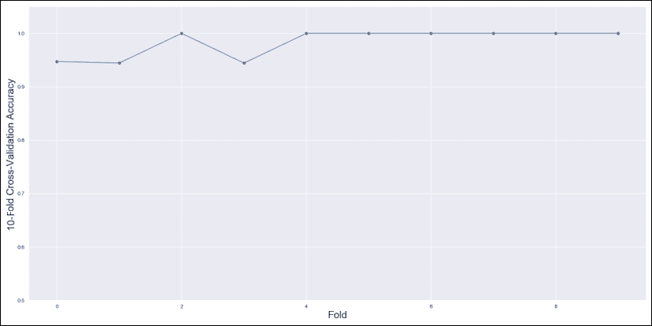

随机森林的交叉验证图

即使没有任何其他确认，我们也可以确定随机森林取得了更好的结果，因为所有的 CV 值都大于 0.9，7 接近 1.0。当然，考虑到奥卡姆剃刀原理，我们应该选择最少数量的树来保证最大的平均 CV 值。在下图中，我们将平均 CV 分数绘制为树数的函数:

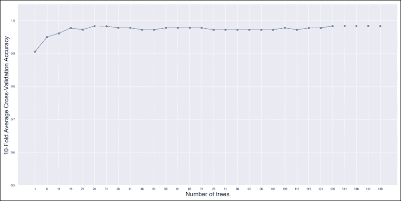

作为树数量函数的平均交叉验证分数

当树木的数量增加到大约 60 棵时，观察到一些振荡和平台就不足为奇了。随机性的影响会导致性能损失，甚至增加学习者的数量。事实上，即使训练精度提高，不同折叠上的验证精度也会受到过度专门化的影响。当树的数量变得大于 125 并且对于更大的值几乎保持不变时，出现另一个轻微的改进。由于其他分类器已经达到了很高的精度，我们选择了*N*c= 150，这将保证在这个数据集上的最佳性能。然而，即使计算成本不成问题，我也总是建议至少进行一次网格搜索，以便不仅达到最佳精度，而且将模型的复杂性降至最低。

### 功能重要性

在使用决策树和随机森林时，要考虑的另一个重要元素是特征重要性(当选择此杂质标准时，也称为*基尼重要性*)，这是一个与特定特征允许我们实现的杂质减少成比例的度量。对于决策树，其定义如下:

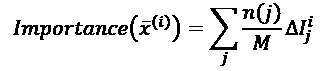

在前面的公式中， *n* ( *j* )表示到达节点 *j* 的样本数(总和必须扩展到选择该特征的所有节点)，而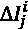是在使用特征 *i* 进行分割之后在节点 *j* 处实现的杂质减少。在随机森林中，重要性必须通过对所有树进行平均来计算:

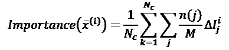

拟合模型(决策树或随机森林)后，scikit-learn 在`feature_importances_`实例变量中输出特性重要性向量。在下图中，有一个图表按降序显示了每个功能的重要性:

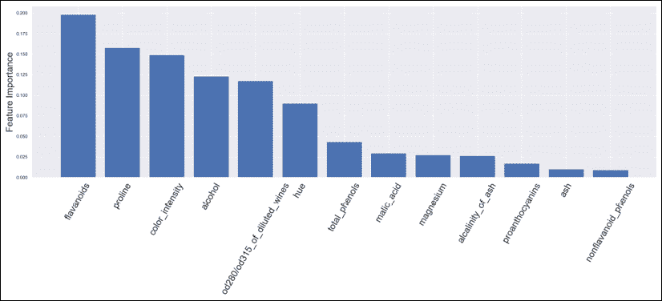

葡萄酒数据集的要素重要性

我们不想分析每个元素的化学意义，但很明显，例如，类黄酮、脯氨酸和颜色强度的存在比非类黄酮酚的存在重要得多。正如回归分析中所讨论的，当数据集被归一化时，系数的大小与特征在预测能力方面的重要性成正比。例如，一个简单的逻辑模型可以具有以下结构:

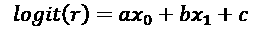

如果和*a>b*，*x*0 的值可以强到独立于*x*1 推动预测值高于或低于阈值。类似地，决策树(或系综树)中的特征重要性为我们提供了一种对特征减少杂质的能力的度量，从而导致最终的预测。

这个概念变得越来越重要，现在它被称为可解释的人工智能。这种兴趣的原因来自于领域专家的要求,他们想知道:

*   推动预测的原因(因素)
*   哪些因素可以忽略不计？
*   如果某个因素发生变化(例如，患者戒烟或服用不同的药物)，预测会发生什么变化？
*   另一个因素设置的预测是什么(例如，领域专家可以假设一个假设并使用模型验证它)

所有这些类型的问题(以及许多其他问题)都无法使用黑盒模型轻松回答，这种情况会增加对人工智能的怀疑。另一方面，决策树不是黑盒模型。整个决策过程可以绘制出来，并且很容易证明给定输入要素的预测是正确的(即使有更复杂的技术可以用于更复杂的模型)。因此，我强烈建议读者分析特性的重要性，并将它们展示给领域专家。此外，由于模型使用的是语义独立的特征(对于图像的像素来说并不相同)，因此可以通过移除所有那些重要性对最终准确性没有高影响的特征来降低数据集的维度。这个过程称为*特征选择*，应该使用更复杂的统计技术来执行，例如卡方，但是当分类器能够产生重要性指数时，也可以使用称为`SelectFromModel`的 scikit-learn 类。传递一个估计量(可以拟合也可以不拟合)和一个阈值，可以通过过滤掉值低于阈值的所有要素来转换数据集。将它应用于我们的模型，并设置最小重要性等于 0.02，我们得到以下结果:

```
from sklearn.feature_selection import SelectFromModel
rf.fit(X, Y)
sfm = SelectFromModel(estimator=rf,
                      prefit=True,
                      threshold=0.02)
X_sfm = sfm.transform(X)
print('Feature selection shape: {}'.
          format(X_sfm.shape))
```

新数据集现在包含 10 个特征，而不是原始葡萄酒数据集的 13 个特征(例如，很容易验证灰分和非类黄酮酚已被移除)。

当然，对于任何其他降维方法，我们总是建议您通过交叉验证来验证最终的准确性，并且只有在准确性损失和复杂性降低之间的权衡是合理的情况下才做出决定。此外，对于给定的数据集，重要的是要记住特征的预测能力随着预测值的变化而变化。

换句话说，特征重要性不是数据集的固有属性(像主成分)，而是特定任务的函数。对于特定的预测，包含数千个要素的大型数据集可能会减少到其中的一小部分，而如果目标发生变化，它可能会完全丢弃这些要素。如果有更多的目标要预测，并且每个目标都与特定的预测器集相关联，那么创建一个为每个任务输出定型/验证集的管道可能是一个好主意。这种方法在使用整个数据集方面具有明显的优势，事实上，就 XAI 而言，在丢弃所有不起主要作用的因素的同时，显示重要要素的责任要容易得多。此外，计算成本仍然高于空间成本，因此，如果这可以提高模型性能并帮助领域专家理解结果，则拥有同一数据集的多个专用副本不成问题。

# AdaBoost

在上一节中，我们看到替换采样导致数据集的数据点被随机重新加权。然而，如果样本量 *M* 非常大，大多数点将只出现一次，而且，所有的选择将是完全随机的。AdaBoost 是 Schapire 和 Freund 提出的一种算法，它试图通过采用自适应增强来最大化每个弱学习者的效率(名称由此而来)。具体而言，集合按顺序增长，并且在每一步重新计算数据分布，以便增加被错误分类的那些点的权重，并减少被正确分类的那些点的权重。以这种方式，每个新的学习者被迫关注那些对于先前的估计器更成问题的区域。读者可以立即理解，与随机森林和其他装袋方法相反，boosting 不依赖随机性来减少方差和提高准确性；改进主要基于加权，而不是随机性。事实上，这种方法以确定性的方式工作，每个新的数据分布都是带着精确的目标选择的。在本段中，我们将考虑一种叫做*离散 AdaBoost* 的变体(正式名称为 AdaBoost。M1)，其中需要一个输出有阈值的分类器(例如-1 和 1)。然而，已经开发了实值版本(其输出表现得像概率一样)(一个经典的例子在 Friedman J .，Hastie T .，Tibshirani R .，*加法逻辑回归:提升的统计观点*，Annals of Statistics，28/1998 中示出)。

由于主要概念总是相同的，对其他变体的理论细节感兴趣的读者可以立即在参考文献中找到它们。

为简单起见，AdaBoost 的训练数据集。M1 的定义如下:

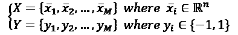

这种选择不是一种限制，因为在多类问题中，可以很容易地采用一对其余的策略，即使像 AdaBoost 这样的算法也是如此。SAMME 保证有更好的性能。为了操纵数据分布，我们需要定义一个权重集:

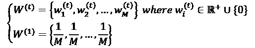

权重集允许定义隐式数据分布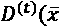，该数据分布最初等同于原始数据分布，但是可以通过改变值*w*I 来容易地对其进行整形。一旦选择了估计器的族和数量， *N* [c] ，就有可能开始全局训练过程。该算法可以应用于能够产生阈值估计的任何种类的学习器(而实值变量可以处理概率，例如，通过普拉特缩放方法获得的概率)。

第一个实例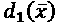使用原始数据集进行训练，这意味着使用数据分布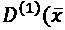。相反，接下来的实例使用重新加权的分布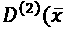)、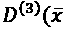、… )进行训练。为了计算它们，在每个训练过程之后，计算归一化加权误差和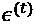:

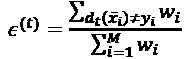

该值的界限在 0(无错误分类)和 1(所有数据点都被错误分类)之间，它被用来计算估计量权重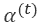:

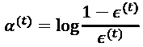

为了理解这个函数是如何工作的，考虑一下它的图是很有用的(如下图所示):

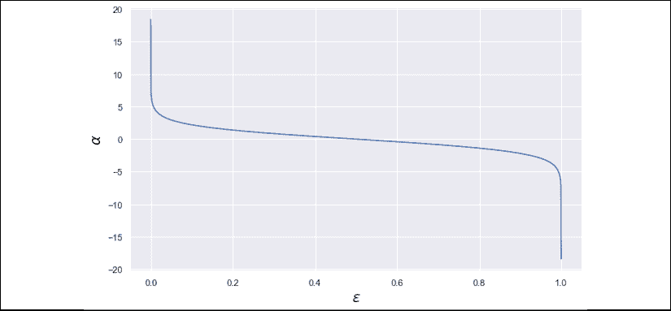

作为归一化加权误差和的函数的估计量权重图

该图揭示了一个隐含的假设:最差的分类器不是错误分类所有点的分类器(T28)，而是完全随机的二进制猜测(对应于 T29)。在这种情况下，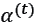是零，因此，如果估计量被完全丢弃，结果。当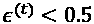时，应用一个增强(在大约 0.05 和 0.5 之间，趋势几乎是线性的)，但是只有当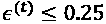时它才变得大于 1(较大的值会导致惩罚，因为权重小于 1)。该值是一个阈值，用于将评估者鉴定为可信或非常强，以及在完美评估者的特殊情况下的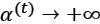(无误差)。

在实践中，为了避免溢出或被零除，应该设置一个上限。相反，当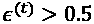时，估计器是不可接受的弱，因为它比随机猜测更差，并且产生的提升将是负的。为了避免这个问题，真正的实现必须反转这种估计器的输出，用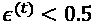将它们实际上转换成学习器(这不是问题，因为转换以相同的方式应用于所有输出值)。重要的是要考虑到这种算法不应该直接应用于多类场景，因为正如 Zhu J .、Rosset S .、Zou H .、Hastie T .、 *Multi-class AdaBoost* 、Statistics and Its Inference，02/2009 中所指出的，阈值 0.5 仅对应于二进制选择的随机猜测准确性。当类的数量大于 2 时，随机估计器输出具有概率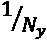的类(其中*N*y 是类的数量)，因此是 AdaBoost。M1 将以错误的方式提升分类器，产生差的最终精度(实际阈值应该是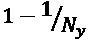，当*N*y2 时，该阈值大于 0.5)。

阿达布。SAMME 算法(由 scikit-learn 实现)已经被提出来解决这个问题，并且也在多类场景中利用提升的能力。

全局决策函数定义如下:

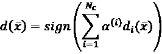

通过这种方式，随着估值器的顺序增加，每个估值器的重要性都会降低，而的精度会增加。然而，如果 *X* 的复杂度非常高，也有可能观察到平台。在这种情况下，许多学习者将具有高权重，因为最终的预测必须考虑学习者的子组合，以便达到可接受的准确度。

由于该算法在每一步都对学习器进行了特殊化，因此一个好的做法是从少量的估计器(例如，10 或 20 个)开始，然后增加数量，直到没有改进为止。有时，最小数量的好学习器(如 SVM 或决策树)足以达到最高的可能精度(限于这种算法)，但在其他一些情况下，估计器的数量可以是几千个。网格搜索和交叉验证再次成为做出正确选择的唯一好策略。

在每个训练步骤之后，有必要更新权重，以便产生增强的分布。这是通过指数函数实现的(基于双极性输出{–1，1}):


给定一个数据点，如果该数据点被错误分类，则考虑到总体估计器权重，其权重将会增加。这种方法允许进一步的自适应行为，因为具有高的分类器已经非常准确，并且需要更高的注意力水平来仅关注(少数)错误分类的点。

相反，如果很小，则估计器必须提高其整体性能，并且过加权过程必须应用于大的子集(因此，分布不会在几个点附近达到峰值，而是只会惩罚已经被正确分类的小子集，让估计器以相同的概率自由探索剩余空间)。

即使在最初的提议中没有出现，也有可能包括一个乘以指数的学习率:


值没有影响，而较小的值已被证明可以通过避免过早特殊化来提高精度。当然，当时，估计器的数量必须增加，以补偿较小的重新加权，这可能导致训练性能损失。至于其他超参数，必须使用交叉验证技术来发现的正确值(或者，如果它是唯一必须微调的值，可以从一个值开始，然后通过降低其值来继续，直到达到最大精度)。

完整的 AdaBoost。M1 算法如下:

1.  设置家庭和估计数*N*c
2.  设置初始权重 *W* ^((1)) 等于
3.  设置学习率(例如)
4.  设置初始分布*D*T3【1】等于数据集 *X*
5.  对于 *i* = 1 到*N*c:
    1.  用数据分布 *D* ^((i)) 训练 *i* ^(th) 估计器
    2.  Compute the normalized weighted error sum :

        如果，反转所有估算器输出

    3.  计算估计量权重
    4.  使用指数公式更新权重(有或没有学习率)
    5.  标准化权重

1.  创建全局估计器，将符号()函数应用于加权和

## AdaBoost。萨姆

这种变型被称为使用多级指数 ( **SAMME** )损失的**阶段加性建模，由 Zhu、Rosset、Zou 和 Hastie 于 2009 年 2 月 2 日在 Zhu J .、Rosset S .、Zou H .、Hastie T .、*多级 AdaBoost，Statistics 及其推论*中提出。目标是适应 AdaBoost。M1，以便在多类场景中正确运行。**

由于这是一个离散版本，其结构几乎相同，只是在估计量权重计算上有所不同。让我们考虑一个标签数据集 *Y* :


现在，有 *p* 个不同的类，并且有必要考虑随机猜测估计器不能达到等于 0.5 的精度；因此，新的估计量权重计算如下:


这样，当以下条件成立时，阈值被向前推，并且将为零:


下图显示了 *p* = 10 时的曲线:


当 *p* = 10 时，作为归一化加权误差和函数的估计量权重图

采用这种校正，boosting 过程可以成功地处理多类问题，而没有 AdaBoost 通常引入的偏差。M1 当 ( 当误差小于一个实际的随机猜测时，它是类的数量的函数)。

由于这种算法的性能明显优越，大多数 AdaBoost 实现不再基于原始算法(如前所述，例如，scikit-learn 实现了 AdaBoost。SAMME 和实值版 AdaBoost。SAMME.R)。当然，当 *p* = 2 时，AdaBoost。SAMME 完全等同于 AdaBoost.M1。

## AdaBoost。萨姆河

AdaBoost。SAMME.R 是一个变体，它与能够输出预测概率的分类器一起工作。使用 Platt scaling 等技术通常是可行的，但是检查特定的分类器实现是否能够输出概率而无需任何进一步的操作是很重要的。例如，scikit-learn 提供的 SVM 实现不计算概率，除非参数`probability=True`(因为它们需要一个额外的步骤，在某些情况下可能是无用的)。

在这种情况下，我们假设每个分类器的输出是一个概率向量:


每个分量是在给定输入的情况下，输出第*j*第类的条件概率。当与单个估计器一起工作时，通过 argmax *x* 函数获得优胜类；然而，在这种情况下，我们希望重新加权每个学习者，以便获得一个连续增长的整体。基本思路和 AdaBoost 一样。M1，但是，当我们现在管理概率向量时，我们还需要一个依赖于单点的估计量加权函数(这个函数实际上包含了现在表示为概率向量函数的每个估计量):


考虑到对数的性质，前面的表达式相当于一个离散的；然而，在这种情况下，我们不依赖加权误差和。(理论上的解释比较复杂，超出了本书的范围。读者可以在前面提到的论文中找到它，尽管第十六章、*高级提升算法*中介绍的方法揭示了逻辑的基本部分。)为了更好地理解这个函数的行为，让我们考虑一个简单的场景，其中 *p* = 2。第一种情况是学习者不能分类的数据点( *p* = (0.5，0.5)):


在这种情况下，不确定性是最大的，并且分类器在这一点上不可信，因此对于所有输出概率，权重变为零。现在，让我们应用增强，获得概率向量 *p* = (0.7，0.3):


第一类将变为正值，当时其幅度将增加，而另一类为相反值。因此，这些函数是对称的，并且允许使用求和:


这种方法非常类似于加权多数投票，因为在计算获胜类别*y*I[I]时，不仅考虑了输出为*y*I 的估计器的数量，还考虑了它们的相对权重和剩余分类器的负权重。只有当最强的分类器预测到一个类别，并且其他学习者的影响不足以推翻该结果时，才可以选择该类别。

为了更新权重，我们需要考虑所有概率的影响。特别是，我们希望减少不确定性(这种不确定性可以退化为纯粹的随机猜测),并强制将高级注意力集中在所有被错误分类的点上。为了实现这个目标，我们需要定义和向量，它们分别包含真实类的一键编码(例如，(0，0，1，…，0))和估计器产生的输出概率(作为列向量)。因此，更新规则如下所示:


例如，如果真实向量是(1，0)，输出概率是(0.1，0.9)，用，点的权重将乘以大约 3.16。相反，如果输出概率是(0.9，0.1)，这意味着数据点已被成功分类，则倍增因子将变得更接近 1。

这样，新的数据分布，类似于 AdaBoost。M1，将会在需要更多关注的点上更加巅峰。所有的实现都将学习率作为一个超参数，因为正如已经解释过的，默认值等于 1.0 对于特定问题来说不是最佳选择。一般来说，较低的学习速率允许在有许多异常值时减少不稳定性，并由于向最优值收敛较慢而提高泛化能力。当时，每个新的分布稍微更多地集中在错误分类的点上，允许估计器搜索更好的参数集，而没有大的跳跃(这会导致估计器跳过最佳点)。然而，与通常处理小批量数据的神经网络相反，AdaBoost 通常也可以很好地处理，因为校正仅在完整的训练步骤后应用。像往常一样，我建议执行网格搜索，为每个特定问题选择正确的值。

完整的 AdaBoost。SAMME.R 算法如下:

1.  设置家庭和数量估计器*N*c
2.  设置初始权重*W*T34【1】等于
3.  设置学习率(例如)
4.  设置初始分布 *D* ^((1)) 等于数据集 *X*
5.  对于 *i* = 1 到*N*c:
    1.  用数据分布 *D* ^((i)) 训练 *i* ^(th) 估计器
    2.  计算每个类别和每个训练样本的输出概率
    3.  计算估计器权重
    4.  使用指数公式更新权重(有或没有学习率)
    5.  标准化权重

1.  创建全局估计器，将 argmax *x* 函数应用于总和(对于 *i* = 1 到 *N* [c] )

在讨论了与分类器一起工作的算法之后，我们现在可以分析一个已经被设计和优化来解决回归问题的变体。

## AdaBoost。R2

Drucker 提出了一个稍微复杂一点的变体(在 Drucker H .，*使用推进技术改进回归变量，* ICML 1997)来管理回归问题。弱学习器通常是决策树，主要概念与其他变体非常相似(特别是，应用于训练数据集的重新加权过程)。真正的区别是在给定输入数据点的情况下，为了选择最终预测*y*I 而采用的策略。假设有 *N* [c] 个估计器，每个估计器都表示为函数，我们可以计算每个输入数据点的绝对残差:


一旦包含所有绝对残差的集合*R*I 被填充，我们可以计算数量*Sr*= sup*R*I 并且计算必须与误差成比例的成本函数值。通常实现的常见选择(也是作者自己建议的)是线性损失:


这种损耗非常平坦，与误差成正比。在大多数情况下，这是一个很好的选择，因为它避免了过早的过度专门化，并允许评估者以一种更温和的方式重新调整他们的结构。最明显的替代方法是平方损失，它开始赋予那些预测误差较大的点更多的重要性。其定义如下:


最后一个代价函数与 AdaBoost 严格相关。M1 和它的指数增长:


这通常是一个不太稳健的选择，因为，正如我们在下一节将要讨论的，它惩罚了小错误而有利于大错误。考虑到在重新加权过程中也采用了这些函数，指数损失会迫使分布将非常高的概率分配给错误分类误差较高的点，从而促使估计器从第一次迭代开始就变得过于专业。在许多情况下(例如在神经网络中)，损失函数通常根据它们的特定属性来选择，但最重要的是，根据它们可以被最小化的容易程度来选择。在这种特殊情况下，损失函数是增强过程的基本组成部分，选择损失函数时必须考虑对数据分布的影响。测试和交叉验证提供了做出合理决策的最佳工具。

一旦对训练样本的损失函数进行了评估，就可以将全局成本函数构建为所有损失的加权平均值。与许多简单地对损失求和或平均的算法相反，在这种情况下，有必要考虑分布的结构。随着增强过程对点重新加权，相应的损失值也必须被过滤以避免偏差。在迭代 *t* 时，成本函数计算如下:


该函数与加权误差成比例，可以使用二次函数或指数函数对加权误差进行线性滤波或强调。然而，在所有情况下，权重较低的点将产生较小的贡献，让算法聚焦于更难预测的子样本。考虑一下，在这种情况下，我们正在处理分类；因此，我们唯一可以利用的方法就是损失。好点产生较低的损失，硬点产生相应较高的损失。即使可以直接使用*C*^(【t】)，最好还是定义一个置信度度量:


该指数与迭代 *t* 时的平均置信度成反比。其实当、和、的时候。权重更新是在考虑总体置信度和特定损失值的情况下进行的:


权重将与对应的绝对残差相关联的损失成比例地减少。但是，没有使用固定基数，而是选择了全球信心指数。这种策略允许更大程度的适应性，因为具有低置信度的估计器不需要只关注小的子集，并且考虑到在 0 和 1 之间有界(最差条件)，当成本函数非常高时，指数变得无效，因此权重保持不变。这种方法与其他变体中采用的方法没有很大不同，但它试图在全局准确性和局部错误分类问题之间找到一种折衷，从而提供额外程度的稳健性。

该算法最复杂的部分是用来输出全局预测的方法。与分类算法相反，我们不能轻易计算平均值，因为需要在每次迭代中考虑全局置信度。德鲁克提出了一种基于所有产出加权中位数的方法。特别地，给定一个点，我们定义预测集:


作为权重，我们考虑，因此我们可以定义一个权重集:


最终输出是根据加权的 *Y* 的中间值(归一化后总和为 1.0)。由于当置信度较低时，对应的权重会趋于 0。同样，当置信度较高(接近 1.0)时，权重将按比例增加，选择与之相关的输出的机会将更高。例如，如果输出为 Y = {1，1.2，1.3，2.0，2.0，2.5，2.6}并且权重为，则加权中值对应于第二个指数，因此全局估计器将输出 1.2(这也是直观上最合理的选择)。

求中值的过程很简单:

1.  必须按升序排序，以便
2.  集合按照的索引排序(每个输出必须携带其自身的重量)
3.  集合被归一化，除以它的和
4.  选择对应于将分成两个块(其总和小于或等于 0.5)的最小元素的索引

1.  选择对应于该指数的输出

完整的 AdaBoost。R2 算法如下:

1.  设置家庭和估计数*N*c
2.  将初始权重 *W* ^((1)) 设置为等于
3.  设置初始分布 *D* ^((1)) 等于数据集 *X*
4.  选择一个损失函数 *L*
5.  对于 *i* =1 到*N*c:
    1.  用数据分布 *D* ^((i)) 训练 *i* ^(th) 估计器
    2.  计算绝对残差、损失值和置信测度
    3.  计算全局成本函数
    4.  使用指数公式更新权重

1.  使用加权中值创建全局估计值

在对最常见的 AdaBoost 变体进行理论讨论后，我们现在可以关注一个基于 scikit-learn 的实际示例，它可以帮助读者理解如何调整超参数和评估性能。

## 使用 scikit-learn 的 AdaBoost 示例

让我们继续使用 Wine 数据集来分析 AdaBoost 在不同参数下的性能。像几乎所有的算法一样，scikit-learn 实现了一个分类器`AdaBoostClassfier`(基于算法 SAMME 和 SAMME。r)和一个回归变量`AdaBoostRegressor`(基于 R2 算法)。在这种情况下，我们将使用分类器，但我邀请读者使用自定义数据集或内置玩具数据集来测试回归器。在这两个类中，最重要的参数是`n_estimators`和`learning_rate`(默认值设置为 1.0)。

默认的底层弱学习器总是一个决策树，但是也可以使用其他模型来创建一个基础实例并通过参数`base_estimator`传递它(当然，如果基础分类器对不同的尺度敏感，不要忘记标准化数据集)。如本章所述，实值 AdaBoost 算法需要基于概率向量的输出。在 scikit-learn 中，一些分类器/回归器(如 SVM)不计算概率，除非明确要求(设置参数`probability=True`)；因此，如果出现异常，我邀请您查看文档，以了解如何强制算法计算它们。

我们将要讨论的例子只有一个教学目的，因为它们只关注一个单一的参数。在真实的场景中，执行网格搜索总是更好(这更昂贵)，以便分析一组组合。让我们开始分析作为估计数的函数的交叉验证分数(向量 *X* 和 *Y* 是在前面的例子中定义的):

```
import numpy as np
from sklearn.ensemble import AdaBoostClassifier
from sklearn.model_selection import cross_val_score 
scores_ne = []
for ne in range(10, 201, 10):
adc = AdaBoostClassifier(n_estimators=ne,
                               learning_rate=0.8,
                               random_state=1000)
      scores_ne.append(np.mean(
          cross_val_score(adc, X, Y,
                          cv=10,
                          n_jobs=-1)))
```

我们考虑了从 10 棵树开始到 200 棵树结束的范围，步长为 10 棵树。学习率保持不变，等于 0.8。结果图如下图所示:


作为估计数函数的 10 倍交叉验证准确度

大约 125 个估计器达到最大值。由于过度专门化和随之而来的方差增加，较大的值会导致轻微的性能恶化，而较小的值会遭受轻微的专门化缺乏。正如在其他章节中所解释的，模型的容量必须根据奥卡姆剃刀原理进行调整，这不仅是因为生成的模型可以更快地训练，还因为容量过剩通常是饱和的，过度适应训练集并减少了泛化的范围。交叉验证可以立即显示这种效果，相反，当完成标准训练/测试集分割时(尤其是当样本没有被打乱时)，这种效果可以保持隐藏。

现在让我们检查不同学习速率下的性能(保持树的数量固定为 125):

```
import numpy as np
scores_eta_adc = []
for eta in np.linspace(0.01, 1.0, 100):
adc = AdaBoostClassifier(n_estimators=125,
                               learning_rate=eta,
                               random_state=1000)
       scores_eta_adc.append(
            np.mean(cross_val_score(adc, X, Y,
                    cv=10, n_jobs=-1)))
```

最终曲线如下图所示:


作为学习率函数的 10 倍交叉验证准确度( *N* [c] = 125)

同样，不同的学习速率产生不同的准确度。的选择似乎是合理的，因为更高和更低的值会导致性能恶化(即使在 0.8 左右的小范围内它们也相当相似)。这种分析应该与最佳数量的树的分析一起进行(例如，在网格搜索中)，但是大量的组合可能导致非常长的搜索时间。为了避免这个问题，可以执行手动检查:

1.  估计器的数量被设置为默认初始值(例如，*N*c= 50)
2.  在设定平均学习率后，评估准确度并与预期基线进行比较
3.  如果:
    1.  选择较低/较高的学习速率，并重复该过程

1.  如果
    1.  固定后，搜索最佳树数

这种方法作为网格搜索并不有效，但它可以利用数据科学家的经验来简化过程，同时保证良好的折衷。当然，所有其他超参数可能以同样的方式评估。这可能会导致复杂性激增，但是可以通过只从一个基本分类器(例如决策树)开始并调整特定的超参数来避免这种开销。因为它们中的一些(例如，杂质测量)对集合有直接影响，所以选择可以扩展到整个模型，而没有明显的精度损失。

如前所述，学习速率对重新加权过程有直接影响。非常小的值需要大量的估计量，因为随后的分布非常相似。另一方面，大值会导致过早的过度专门化。即使默认值是 1.0，我也总是建议用更小的值来检查精确度。没有在每种情况下选择正确的学习率的黄金法则，但重要的是要记住，较低的值允许算法以更温和的方式平滑地适应训练集，而较高的值会降低对异常值的鲁棒性，因为被错误分类的样本会立即增加，并且对它们进行采样的概率会非常迅速地增加。这种行为的结果是持续关注那些可能受噪声影响的样本，几乎忘记了剩余样本空间的结构。

我们想要执行的最后一个实验是分析在使用**主成分分析** ( **PCA** )和**因子分析** ( **FA** )(使用 125 个估计器和)执行降维后的性能:

```
import numpy as np
from sklearn.decomposition import PCA, FactorAnalysis
scores_pca = []
for i in range(13, 1, -1):
if i < 12:
       	pca = PCA(n_components=i,
                      random_state=1000)
            X_pca = pca.fit_transform(X)
       else:
            X_pca = X
      adc = AdaBoostClassifier(n_estimators=125,
                              learning_rate=0.8,
                              random_state=1000)
      scores_pca.append(np.mean(
cross_val_score(adc, X_pca, Y,
            n_jobs=-1, cv=10)))
scores_fa = []
for i in range(13, 1, -1):
if i < 12:
            fa = FactorAnalysis(n_components=i,
                                random_state=1000)
            X_fa = fa.fit_transform(X)
      else:
            X_fa = X
      adc = AdaBoostClassifier(n_estimators=125,
                               learning_rate=0.8,
                               random_state=1000)
      scores_fa.append(np.mean(
            cross_val_score(adc, X_fa, Y,
                            n_jobs=-1,
                            cv=10)))
```

结果图如下图所示:


10 倍交叉验证准确度，作为成分数量的函数(PCA 和因子分析)

本练习确认了*第 13 章*、*成分分析和降维*中分析的一些重要特征。首先，即使降维 50%,性能也不会受到显著影响。上一个示例中执行的特征重要性分析进一步证实了这一点。决策树仅考虑 6/7 个特征就可以执行相当好的分类，因为剩余的特征对样本的表征提供了边际贡献。而且 FA 几乎总是优于 PCA。对于 7 个分量，使用 FA 算法实现的精度高于 0.95(非常接近没有降低时实现的值)，而 PCA 对于 12 个分量达到这个值。读者应该记住，PCA 是 FA 的一个特例，假设噪声是同方差的。该图证实了这种情况对于葡萄酒数据集是不可接受的。假设不同的噪声方差允许以更精确的方式对缩减的数据集进行重新建模，从而最大限度地减少缺失要素的交叉影响。即使 PCA 通常是第一选择，对于大型数据集，我建议您总是将性能与因子分析(FA)进行比较，并选择保证最佳结果的技术(同时考虑到 FA 在计算复杂性方面更昂贵)。

# 总结

在这一章中，我们介绍了集成学习的主要概念，重点是 bagging 和 boosting 技术。在第一部分中，我们解释了强学习者和弱学习者之间的区别，并展示了如何结合评估者来实现特定目标的大图景。

下一个主题集中在决策树的属性以及它们的主要优点和缺点。特别是，我们解释了树的结构导致方差的自然增加。被称为随机森林的打包技术可以缓解这个问题，同时提高整体的准确性。通过增加随机性和采用一种称为额外随机化树的变体，可以进一步减少方差。在示例中，我们还看到了如何评估每个输入特征的重要性，以及如何在不涉及复杂统计技术的情况下执行降维。

在第三部分中，我们介绍了最著名的 boosting 技术 AdaBoost，它基于创建一个序列相加模型的概念，当每个新的估计量使用一个重新加权(boosted)的数据分布进行训练时。以这种方式，添加每个学习者来关注错误分类的数据点，而不干扰先前添加的模型。我们分析了最初的 M1 离散变体和最有效的替代物 SAMME 和 SAMME。r(实值)和 R2(用于回归)，它们在许多机器学习包中实现。

在下一章，我们将讨论梯度推进(以及一些特定的高度优化的变体)和其他通用集成技术。

# 延伸阅读

*   Alpaydin E .，*机器学习简介*，麻省理工学院出版社，2010 年
*   Breiman L .， *Bagging 预测器*，机器学习，第 24 期，1996
*   布莱曼 l .，*随机森林*，机器学习，45，2001
*   布雷曼 l .，*在大型数据库中粘贴小投票进行分类并联机*，机器学习，36，1999
*   何东，*构造决策森林的随机子空间方法，模式分析与机器智能*，20，1998
*   Friedman J .、Hastie T .、Tibshirani R .，*加法逻辑回归:提升的统计观点*，《统计年鉴》，28/1998
*   朱军，罗赛特，邹，哈斯蒂，多类 AdaBoost*，统计及其推论，02/2009*
*   德鲁克 h .，*使用推进技术改进回归变量*，ICML 1997 年
*   Lundberg S. M .，Lee S .，*解释模型预测的统一方法*，神经信息处理系统进展 30，NIPS，2017
*   Bonaccorso G .，*机器学习算法第二版*，Packt 出版，2018