# 十七、神经网络建模

这一章是对深度学习世界的介绍，其方法使得在许多通常被认为极难管理的分类和回归领域(如图像分割、自动翻译、语音合成等)实现*最先进的*性能成为可能。目标是为读者提供基本工具，以理解使用 Keras 的全连接神经网络的结构(采用现代技术来加速训练过程并防止过拟合)。

特别是，本章涵盖的主题如下:

*   基本人工神经元的结构
*   感知器、线性分类器及其局限性
*   具有最重要激活函数的多层感知器(如 ReLU)
*   基于**随机梯度下降** ( **SGD** )优化方法的反向传播算法

让我们从表征每个神经网络的计算单元——人工神经元——的正式定义开始这一探索。

# 基本人工神经元

神经网络的构建模块是生物神经元的抽象，这是一个非常简单但强大的计算单元，由 F. Rosenblatt 于 1957 年首次提出，以构成最简单的神经架构，称为感知器，我们将在下一节中对其进行分析。与更符合生物学原理但有一些强烈局限性的 Hebbian 学习相反，人工神经元是以实用主义观点设计的，只有它的结构是基于表征生物神经元的一些元素。

然而，最近的深度学习研究活动揭示了这种架构的巨大力量。即使有更复杂和更专门的计算单元，基本的人工神经元也可以概括为两个块的结合，这在下图中清楚地显示出来:

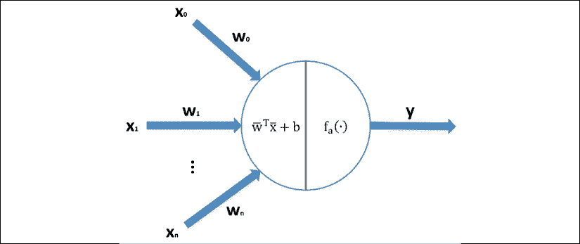

通用人工神经元的结构

一个神经元的输入是实值向量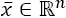，而输出是标量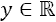。第一个操作是线性的:

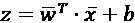

向量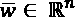被称为权重向量(或突触权重向量，因为类似于生物神经元，它对输入值进行重新加权)，而标量项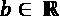是一个称为 bias 的常数。在许多情况下，只考虑权重向量更容易。可以通过添加一个等于 1 的额外输入特征和相应的权重来消除偏差:

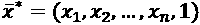

这样，唯一必须学习的元素就是权重向量。下面的块被称为激活函数，它负责将输入重新映射到不同的子集。如果函数为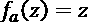，则称神经元为线性，可以省略变换。第一个实验是基于线性神经元的，线性神经元的能力比非线性神经元弱得多，这是许多研究人员认为感知机失败的原因；但是，与此同时，这种限制反而为一种新的体系结构打开了大门，这种体系结构有机会展示其卓越的能力。现在让我们从有史以来提出的第一个神经网络开始分析。

# 感知器

感知器是弗兰克·罗森布拉特在 1957 年给第一个神经模型起的名字。感知器是一种神经网络，具有单层输入线性神经元，后跟基于*符号* ( *x* )函数的输出单元(或者，可以考虑输出为-1 和 1 的双极单元)。感知器的架构如下图所示:

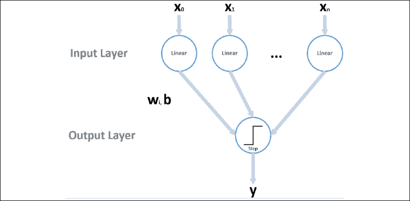

感知器的结构

即使该图看起来非常复杂，感知器也可以用下面的等式来概括:

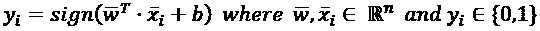

所有的向量通常都是列向量；因此，点积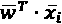将输入转换为标量，然后加上偏置，利用阶跃函数得到二进制输出，当*z*0 时输出 1，否则输出 0。在这一点上，读者可能会反对阶跃函数是非线性的；然而，应用于输出层的非线性仅仅是对实际计算没有影响的过滤操作。

事实上，输出已经由线性模块决定，而阶跃函数仅用于施加二进制阈值(将连续输出转换为离散输出)。此外，在这个分析中，我们只考虑单值输出(即使有多类变量),因为我们的目标是在转移到可用于解决极其复杂的问题的更通用的架构之前，展示动态和限制。

感知器可以用在线算法训练(即使数据集是有限的)，但也可以采用离线方法，重复固定次数的迭代，或者直到总误差变得小于预定义的阈值。该程序基于平方误差损失函数(请记住，传统上，术语“损失”适用于单个样本，而术语“成本”是指每个单个损失的总和/平均值):

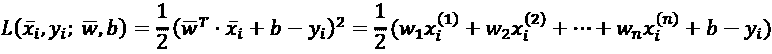

当样本出现时，计算输出，如果输出错误，则应用权重校正(否则跳过该步骤)。为简单起见，我们不考虑偏差，因为它不影响程序。我们的目标是校正重量，以使损失最小化。这可以通过计算相对于*w*I 的偏导数来实现:

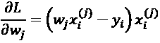

我们假设 *w* ^((0)) = (0，0)(忽略偏置)并且数据点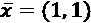的标签为 *y* = 1。感知器对样本进行了错误分类，因为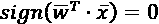(或者-1，如果使用了表示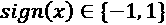)。偏导数都等于-1；因此，如果我们从当前权重中减去它们，我们得到*w*^(【1】)=(1，1)，并且现在样本被正确分类，因为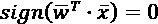。因此，包括学习率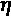，权重更新规则变为如下:

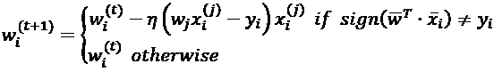

当样品被错误分类时，重量会根据实际线性输出和真实标签之间的差异按比例进行修正。这是一个名为 delta rule 的学习规则的变体，它代表了最著名的训练算法的第一步，几乎在任何有监督的深度学习场景中都被采用(我们将在接下来的章节中讨论)。由于数据集是线性可分的，该算法已被证明在有限数量的状态下收敛到稳定的解。形式上的证明相当冗长且非常技术性，但感兴趣的读者可以在 Minsky M. L .、Papert S. A .、*感知器*，麻省理工学院出版社，1969 年中找到。

在这一章中，学习率的作用变得越来越重要，特别是在评估单个样本(如在感知器中)或小批量样本后执行更新时。在这种情况下，高学习率(即大于 1.0 的学习率)会由于单次校正的幅度而导致收敛过程不稳定。

使用神经网络时，通常最好使用较小的学习率，并在固定的时期数内重复训练会话。这样，单个校正是有限的，只有在被大多数样本/批次确认后，它们才能变得稳定，这促使网络收敛到最优解。相反，如果校正是异常值的结果，一个小的学习率可以限制它的作用，避免整个网络因为几个有噪声的样本而不稳定。我们将在接下来的几节中进一步讨论这个问题。

现在，我们可以描述完整的感知器算法，并以一些重要的考虑来结束这一部分:

1.  为学习率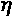选择一个值(如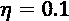)。通常，较小的值允许更精确的修改，但是增加了计算成本，而较大的值加快了训练阶段，但是降低了学习精度。
2.  将一个常量列(设置为等于 1.0)附加到样本向量 *X* 上。因此，得到的矢量将是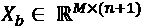。
3.  用从方差较小的正态分布中采样的随机值初始化权重向量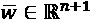(如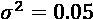)。
4.  设置一个误差阈值 *Thr* (如 *Thr* = 0.0001)。
5.  设置最大迭代次数*N*max。
6.  设置 *i* = 0。
7.  设置 *e* = 1。
8.  同时*I<N*max 和 *e > Thr* :
    1.  设置 *e* =0。
    2.  对于 *k* = 1 至 *M* :
    1.  计算线性输出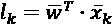和阈值输出 *t* [ k ] = *符号* ( * l * [k] )。
    2.  如果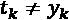:

1.  计算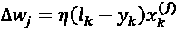。

1.  更新权重向量。
    1.  设置*e*=*e*+(*l*[k]–*y*[k])²(也可以使用绝对值*e*=*e*+|*l*[k]–*y*)
    1.  设置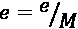。

算法非常简单，您应该已经注意到了与逻辑回归的类比。事实上，这种方法基于一种结构，该结构可以被认为是具有 sigmoid 输出激活函数(其输出可以被认为是概率的真实值)的感知器。主要区别在于训练策略-在逻辑回归中，校正是在基于负对数似然的成本函数评估之后进行的:

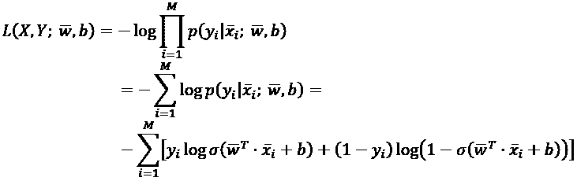

这个成本函数就是众所周知的交叉熵，在*第 2 章*、*损失函数和正则化*中，我们表明最小化它相当于减少真实分布和预测分布之间的 Kullback-Leibler 散度。在几乎所有的深度学习分类任务中，我们将采用交叉熵，这要归功于它的鲁棒性和凸性(凸性是逻辑回归中的收敛保证，但不幸的是，在成本函数是非凸的更复杂的架构中，该属性通常会丢失)。

## 带有 scikit-learn 的感知器示例

即使从零开始实现算法非常简单，我还是喜欢使用 scikit-learn 实现感知器，将我们的注意力集中在导致非线性神经网络的局限性上。显示感知机主要弱点的历史问题是基于 XOR 数据集的。在我们解释它之前，先构建它并想象它的结构更容易:

```
import numpy as np
from sklearn.preprocessing import StandardScaler
from sklearn.utils import shuffle
np.random.seed(1000)
nb_samples = 1000
nsb = int(nb_samples / 4)
X = np.zeros((nb_samples, 2))
Y = np.zeros((nb_samples, ))
X[0:nsb, :] = np.random.multivariate_normal(
        [1.0, -1.0], np.diag([0.1, 0.1]), size=nsb)
Y[0:nsb] = 0.0
X[nsb:(2 * nsb), :] = np.random.multivariate_normal(
        [1.0, 1.0], np.diag([0.1, 0.1]), size=nsb)
Y[nsb:(2 * nsb)] = 1.0
X[(2 * nsb):(3 * nsb), :] = \
        np.random.multivariate_normal(
        [-1.0, 1.0], np.diag([0.1, 0.1]), size=nsb)
Y[(2 * nsb):(3 * nsb)] = 0.0
X[(3 * nsb):, :] = np.random.multivariate_normal(
        [-1.0, -1.0], np.diag([0.1, 0.1]), size=nsb)
Y[(3 * nsb):] = 1.0
ss = StandardScaler()
X = ss.fit_transform(X)
X, Y = shuffle(X, Y, random_state=1000)
```

显示真实标签的图如下所示:

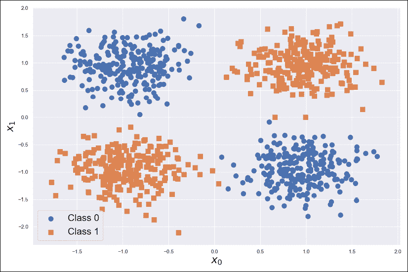

XOR 数据集示例

正如可能看到的，数据集被分成四个块，这四个块被组织为逻辑 XOR 运算符的输出。考虑到二维感知器的分离超曲面(以及逻辑回归的分离超曲面)是直线；很容易理解，任何可能的最终配置都可以达到大约 50%的精度(随机猜测)。为了得到证实，让我们试着解决这个问题:

```
from sklearn.linear_model import Perceptron
from sklearn.model_selection import cross_val_score
pc = Perceptron(penalty='l2', alpha=0.1,
                    n_jobs=-1, random_state=1000)
print("Perceptron Avg. CV score: {:.3f}".
      format(np.mean(cross_val_score(pc, X, Y, cv=10))))
```

前面代码片段的输出是:

```
Perceptron Avg. CV score: 0.504
```

这个值证实，在这种情况下，感知器大约等于随机猜测，因此，它不提供任何优势，也没有办法克服这个限制。相反，对于线性可分的场景，scikit-learn 实现提供了通过参数惩罚(可以是`'l1'`、`'l2'`或`'elasticnet'`)添加正则化项的可能性(参见*第 2 章*、*损失函数和正则化*)，以避免过拟合、引起稀疏并提高收敛速度(强度可以使用参数`alpha`指定)。这并不总是必要的，但是由于算法是在一个生产就绪的包中提供的，设计者决定添加这个特性。尽管如此，平均交叉验证精度略高于 0.5(邀请您测试任何其他可能的超参数配置)。相应的图(可随不同的随机状态或后续实验而变化)如下所示:

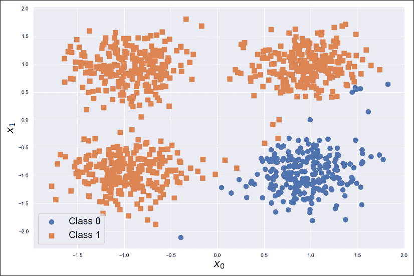

使用感知器标记的 XOR 数据集

很明显，感知器是另一种没有特定特性的线性模型，它的使用被其他算法所取代，如逻辑回归或 SVM。1957 年后的几年里，许多研究人员没有掩饰他们的幻灭，认为神经网络是一个从未实现的承诺。需要等到对架构进行简单的修改，再加上强大的学习算法，才正式打开了一个新的迷人的机器学习分支(后来称为深度学习)的大门。

在 scikit-learn > 0.19 中，`Perceptron`类允许添加`max_iter`或`tol`(公差)参数。如果未指定，将发出警告，通知您未来的行为。这条信息不会影响实际结果。

# 多层感知器

感知器的主要限制是它的线性度。如何通过移除这样的约束来利用这种架构呢？解决方案比你想象的要简单。在输入和输出之间添加至少一个非线性层导致高度非线性的组合，用大量变量来参数化。最终的架构称为**多层感知器** ( **MLP** )，包含一个单独的(仅为简单起见)隐藏层，如下图所示:

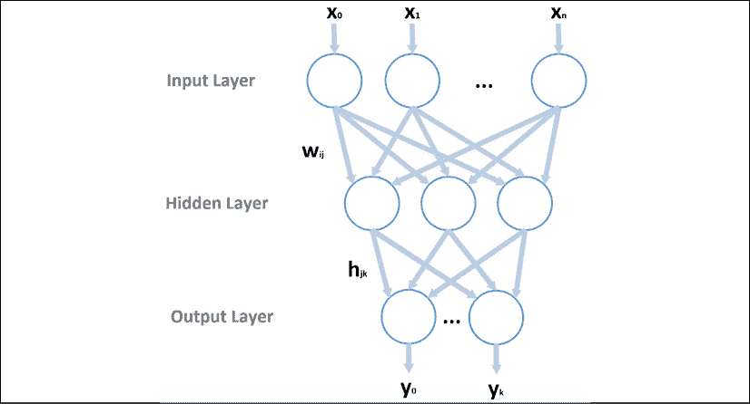

具有单个隐藏层的通用多层感知器的结构

这是一个所谓的前馈网络，意味着信息流从第一层开始，总是沿着相同的方向前进，并在输出层结束。允许部分反馈(例如，为了实现局部记忆)的结构被称为循环网络，将在下一章分析。

在这种情况下，有两个权重矩阵 *W* 和 *H* ，以及两个对应的偏置向量 *b* 和 *c* 。如果有 m 个隐藏神经元、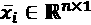(列向量)和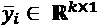，则动态由以下变换定义:

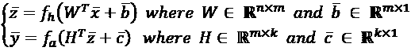

任何 MLP 的一个基本条件是至少有一个隐藏层激活函数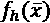是非线性的。很容易证明 m 个线性隐藏层等价于单个线性网络，因此，MLP 回归到标准感知器的情况。一般来说，所有隐藏层都具有非线性激活，而最后一层也可以具有线性输出来表示例如无界量(例如，在回归任务中)。通常，对于给定的层，激活函数是固定的，但是对它们的组合没有限制。特别地，通常选择输出激活来满足精确的要求(例如多标签分类、回归、图像重建等等)。这就是为什么这个分析的第一步关注最常见的激活函数及其特性。

我们现在可以更深入地了解最常见的激活功能，讨论它们的特性和局限性。

## 激活功能

通常，任何连续的(也是步进的)和可微分的函数都可以用作激活函数。连续性允许我们取域 *D* (一般为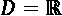，所以 *f* ( *x* )中的所有值，而可微性是优化神经网络的一个基本条件。即便如此，一些函数具有特殊的属性，允许我们在提高学习过程速度的同时实现良好的准确性。它们通常用于最先进的模型中，为了做出最合理的选择，了解它们的属性非常重要。

### Sigmoid 和双曲线正切

这两个激活非常相似，有一个非常简单但重要的区别。让我们开始定义它们:

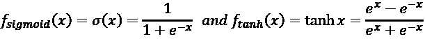

相应的曲线图如下所示:

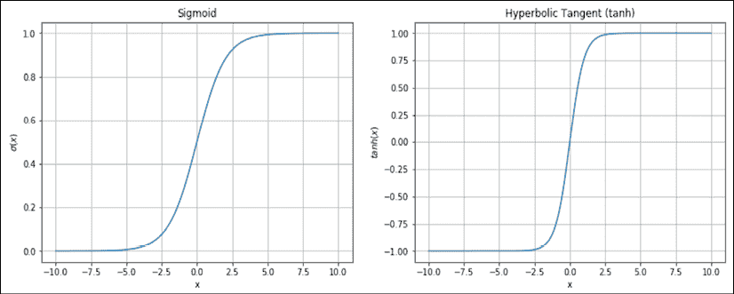

Sigmoid 和双曲线正切图

一个 sigmoid 有界在 0 和 1 之间，有两条渐近线(当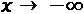时为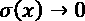，当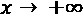时为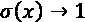)。类似地，双曲正切(tanh)被限制在-1 和 1 之间，具有对应于极值的两条渐近线。分析这两个图，我们可以发现，两个函数在一个很短的范围内(大约(-2，2))几乎都是线性的，紧接着它们变得几乎平坦。这意味着当 *x* 具有大约 0 的小值时，梯度很高并且大约恒定，对于较大的绝对值，梯度下降到大约 0。sigmoid 完美地表示了一种概率或一组必须介于 0 和 1 之间的权重，因此，对于某些输出图层来说，它是一个不错的选择。

然而，双曲正切是完全对称的，它更适合于优化目的，因为它的性能通常更好。每当输入通常较小时，该激活函数通常在中间层使用。当分析反向传播算法时，原因就清楚了；然而，很明显，大的绝对输入导致几乎恒定的输出，并且由于梯度大约为 0，权重校正可能变得非常慢(该问题正式称为消失梯度)。由于这个原因，在许多实际应用中，经常使用下一族激活函数。

### 整流器激活功能

当*x*为 0 时，这些函数都是线性的(或者说对于 Swish 来说是准线性的)，而当*x*为 0 时，这些函数就不同了。即使当 *x* = 0 时它们中的一些不可微，在这种情况下导数总是被设置为等于 0。最常见的功能如下:

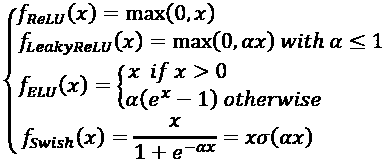

相应的曲线图如下所示:

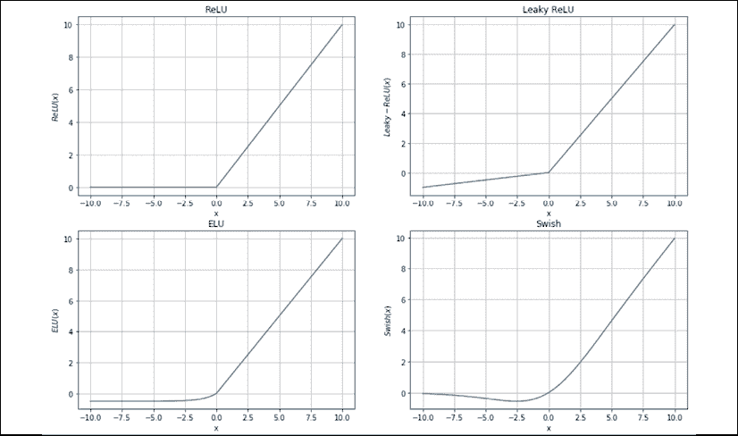

ReLU(左上)、Leaky ReLU(右上)、eLU(左下)和 Swish(右下)

最基本的函数(也是最常用的)是 ReLU，当*x*0 时，它具有恒定的梯度，而当*x*0 时，它为空。当输入通常大于 0 时，该功能经常在视觉处理中使用，并且具有减轻消失梯度问题的特别优势，因为基于梯度的校正总是可能的。另一方面，当*x*0 时，ReLU 为空(及其一阶导数)，因此每个负输入不允许任何修改。一般来说，这不是问题，但是当允许小的负梯度时，有一些深度网络表现得更好。这一考虑推动了其他变体的产生，其特征在于超参数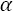的存在，该参数控制负尾部的强度。介于 0.01 和 0.1 之间的常用值允许与 ReLU 几乎相同的行为，但是当 *x* < 0 时，可能会有小的权重更新。

最后一个函数，叫做 Swish 并在 Ramachandran P .、Zoph P .、Le V. L .、*搜索激活函数*、arXiv:1710.05941【cs。NE]是基于 sigmoid 的，并提供了在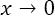时收敛到 0 的额外优势，因此非零效果仅限于( *-b* ，0)与 *b* > 0 之间的短区域。这个函数可以提高某些特定视觉处理深度网络的性能，如前述论文中所讨论的。然而，我总是建议从 ReLU 开始分析(它非常健壮并且计算成本低),并且只有在没有其他技术可以提高模型性能的情况下才切换到作为替代。

### Softmax

这个函数表征了几乎所有分类网络的输出层，因为它可以直接表示一个离散的概率分布。如果有 *k* 输出，*y*I，softmax 计算如下:

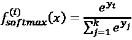

这样，包含 *k 个*神经元的层的输出被归一化，使得总和总是 1。不言而喻，在这种情况下，最佳成本函数是交叉熵。事实上，如果所有真实标签都用一键编码来表示，它们就隐含地变成了概率向量，其中 1 对应于真实类别。因此，分类器的目标是通过最小化函数来减少其输出的训练分布之间的差异(参见*第 2 章*、*损失函数和正则化*):

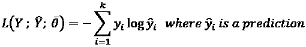

我们现在可以讨论 MLP(以及几乎所有其他神经网络)中采用的训练方法。

# 反向传播算法

这个算法与其说是一个实际的算法，不如说是一个方法论。事实上，它被设计得足够灵活以适应任何种类的神经架构，而无需任何实质性的改变。因此，在这一节中，我们将定义主要概念，而不关注特定的情况。那些对实现它感兴趣的人将能够以最小的努力将相同的技术应用于不同类型的网络(假设所有的需求都被满足)。

使用深度学习模型的训练过程的目标通常通过最小化成本函数来实现。假设我们有一个用全局向量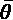参数化的网络。在这种情况下，成本函数(使用相同的损失和成本符号，但使用不同的参数来消除歧义)定义如下:


我们已经解释过，最小化之前的表达式(即经验风险)是最小化实际预期风险的一种方式，因此，最大化了准确性。我们的目标是找到一个最佳参数集，以便应用以下内容:


如果我们考虑单个损失函数(与数据点和真实矢量标签相关联)，我们知道这样的函数可以用对预测值的显式依赖来表达:


在前面的表达式中，参数已经嵌入到预测中。从微积分(没有在许多关于优化技术的书中可以找到的过多的数学严谨性)，我们知道在任何点计算的标量函数的梯度(我们假设 *L* 是可微的)是一个具有分量的向量:


由于总是指向最近的最大值方向，所以负梯度指向最近的最小值方向。因此，如果我们计算 *L* 的梯度，我们就有了一条现成的信息，可以用来最小化成本函数。在继续之前，有必要揭示一个重要的数学性质，称为导数的链式法则:


现在，让我们考虑 MLP 中的单个步骤(从底部开始),并利用链式法则:


向量 *y* 的每个分量都是独立的，所以我们可以简化这个例子，只考虑一个输出值:


在前一个表达式(丢弃偏差)中，有两个重要的元素—权重， *h* [j] (它们是 *H* 的列)，以及表达式，，它是前一个权重的函数。由于 *L* 依次是所有预测的函数，应用链式规则(使用变量 *t* 作为激活函数的通用自变量)，我们得到如下:


正如我们通常处理矢量函数一样，使用梯度算子更容易表达这个概念。简化由通用层执行的变换，我们可以将关系(相对于一行 *H* ，因此相对于对应于隐藏单元的权重向量，)表达如下:


采用梯度并考虑矢量输出可以写成，我们可以导出以下表达式:


这样，我们得到了相对于权重向量计算的 *L* 的梯度的所有分量。如果我们往回移，我们可以推导出的表达式:


重新应用链式法则，我们可以计算出 *L* 对 *w* [pj] 的偏导数(为避免混淆，预测的自变量称为 *t* [1] ，而的自变量称为 *t* [2] ):


观察这个表达式(可以很容易地使用梯度重写)并将其与前面的表达式进行比较，可以理解反向传播算法的原理，该算法在 Rumelhart D. E .，Hinton G. E .，Williams R. J .，*Learning re presentations by back-propagation errors*，Nature 323，1986 中首次提出。将数据点输入网络，并计算成本函数。在这一点上，过程从底部开始，计算相对于最近权重的梯度，并重新使用一部分计算(与误差成比例)向后移动，直到到达第一层。校正确实从源(成本函数)传播到源(输入层)，并且效果与每个不同权重(和偏差)的责任成比例。考虑到所有可能的不同架构，为单个示例编写所有方程是没有用的。

值得考虑的一个非常重要的现象已经在前面的部分中概述，现在应该更清楚了:链规则基于乘法，因此，当梯度开始变得小于 1 时，乘法效应迫使最后的值接近 0。这个问题被称为消失梯度，可以真正停止使用饱和激活函数(如 sigmoid 或 tanh)的非常深的模型的训练过程。整流器单元为许多特定问题提供了良好的解决方案，但有时当双曲正切等函数是必要的时，必须采用归一化等其他方法来缓解这一现象。我们将在本章和下一章讨论一些特定的技术，但是一个通用的最佳实践是总是使用规范化的数据集，如果必要的话，也测试白化的效果。

## 随机梯度下降(SGD)

一旦计算了梯度，成本函数可以向其最小值的方向移动。然而，在实践中，最好在评估固定数量的训练样本(一批)之后执行更新。

事实上，通常采用的算法不会计算整个数据集的全局成本，因为这种操作在计算上非常昂贵。通过部分步骤获得一个近似值，限于通过评估一个小的子集积累的经验。根据一些文献，仅当在每个单个样本之后执行更新时，才应该使用表达式随机梯度下降(SGD)。当在每 *k* 个点上进行该操作时，该算法也称为小批量梯度下降；但是，按照惯例，SGD 指的是包含数据点的所有批次，我们从现在开始就要用这个表述了。

可以考虑使用包含 k 个数据点的批次计算的部分成本函数来表达该过程:


该算法通过根据以下规则更新权重来执行梯度下降:


如果我们从一个初始配置和一个目标开始，随机梯度下降过程可以想象成如下图所示的路径:


基于 SGD 的优化过程的图形表示

权重向最小值移动，考虑到整个数据集，许多后续校正也可能是错误的。因此，该过程必须重复几次(历元)，直到验证精度达到最大值。在一个完美的场景中，利用一个凸成本函数 L，这个简单的过程收敛到最优配置。

不幸的是，深度网络是一个非常复杂的非凸函数，其中平台和鞍点非常常见(参见*第 1 章*、*机器学习模型基础*)。在这种情况下，普通的 SGD 将无法找到全局最优解，在许多情况下，甚至找不到接近点。例如，在平坦的区域，梯度会变得很小(也考虑到数值的不精确性),以至于减慢训练过程，直到没有变化是可能的(所以)。在下一节中，我们将介绍一些常见且强大的算法，这些算法旨在缓解这一问题，并显著加速深度模型的收敛。

在继续之前，重要的是要标记两个重要的元素。第一个关系到学习率。这个超参数在学习过程中起着重要的作用。如图所示，算法从一个点跳到另一个点(不一定更接近最优)。与优化算法一起，正确调整学习率是绝对重要的。高值(如 1.0)会使权重移动过快，从而增加不稳定性。特别是，如果一个批次包含几个异常值(或简单的非主导样本)，一个大的将把它们视为代表性元素，校正权重以最小化误差。然而，后续的批次可能更好地代表数据生成过程，因此，算法必须部分地恢复其修改，以补偿不正确的更新。由于这个原因，学习率通常很小，通常值在 0.0001 和 0.01 之间(在某些特定情况下，也可以是一个有效的选择)。

另一方面，非常小的学习率导致最小的修正，减慢了训练过程。一个好的折衷，通常是最佳实践，是让学习率作为纪元的函数衰减。一开始，可以更高，因为接近最优的概率几乎为零；因此，较大的跳跃很容易调整。随着训练过程的进行，砝码逐渐向其最终形态移动，因此，校正变得越来越小。在这种情况下，应该避免大的跳跃，而应该进行微调。这就是学习率衰减的原因。常见的技术包括指数衰减或线性衰减。在这两种情况下，必须根据具体问题(测试不同的配置)和优化算法来选择初始值和最终值。在许多情况下，起始值和结束值之间的比值大约为 10，有时甚至更大。

另一个重要的超参数是批量大小。没有什么灵丹妙药可以让我们自动做出正确的选择，但是可以做一些考虑。由于 SGD 是一种近似算法，较大的批量可能会导致更类似于考虑整个数据集所获得的校正。然而，当样本数量极高时，我们不期望深度模型将它们一一对应，而是将我们的努力指向提高泛化能力。这个特征可以通过说网络必须学习更少数量的抽象并重用它们以便分类新的样本来重新表达。

如果取样正确，一个批次包含这些抽象元素的一部分和部分修正自动改善后续批次的评估。你可以想象一个瀑布式的过程，一个新的训练步骤不会从零开始。然而，该算法也被称为小批量梯度下降，因为通常的批量大小通常在 16 到 512 之间(更大的大小不常见，但总是可能的)，这些值小于总样本数(特别是在深度学习上下文中)。一个合理的默认值可以是 32 个数据点，但是我总是建议测试更大的值，从训练速度和最终准确性方面比较性能。

使用深度神经网络时，所有值(一层中的神经元数量、批量大小等)通常都是 2 的幂。这不是一个约束，而只是一个优化技巧(最重要的是，当使用 GPU 时)，因为当块基于 2 个 ^(N 个)元素时，可以更有效地填充内存。然而，这只是一个建议，其好处也可以忽略不计；所以，不要害怕测试具有不同价值的架构。例如，在许多论文中，批量大小为 100，有些层有 1000 个神经元。

## 权重初始化

一个非常重要的因素是神经网络的初始配置。权重应该如何初始化？让我们想象一下，我们把它们都设置为零。由于一层中的所有神经元接收相同的输入，如果权重为 0(或任何其他常见的常数)，则输出将相等。当应用梯度校正时，所有神经元将以相同的方式处理；因此，这个网络相当于一系列单神经元层的。很明显，为了达到一个叫做*对称破缺*的目标，初始权重必须不同，但是哪一个是最佳选择呢？

如果我们知道(也大致知道)最终的配置，我们就可以设置它们在几次迭代中很容易达到最佳点，但不幸的是，我们不知道最小值在哪里。

因此，已经开发并测试了一些经验策略，目标是最小化训练时间(获得*最先进的*精确度)。一般的经验法则是权重应该很小(与输入样本方差相比)。大值导致对饱和函数(如双曲正切函数和 sigmoid 函数)产生负面影响的大输出，而小值可以更容易地优化，因为相应的梯度相对较大，并且校正效果更强。整流器单元也是如此，因为最大效率是通过在穿过原点(非线性实际所在的位置)的段中工作来实现的。例如，在处理图像时，如果值为正值且较大，一个 ReLU 神经元几乎成为一个线性单元，失去了很多优势(这就是为什么图像被归一化，以将每个像素值绑定在 0 和 1 或-1 和 1 之间)。

同时，理想地，激活方差在整个网络中应该保持几乎恒定，以及在每个反向传播步骤之后的权重方差。这两个条件是改善收敛过程和避免消失和爆炸梯度问题的基本条件(后者与消失梯度相反，将在*第 19 章*、*深度卷积网络*中讨论)。

一种非常常见的策略是考虑一层中神经元的数量，并如下初始化权重:


该方法被称为方差缩放，可使用输入单元的数量(扇入)、输出单元的数量(扇出)或其平均值来应用。这个想法非常直观:如果传入或传出连接的数量很大，权重必须较小，以避免大的输出。在单个神经元退化的情况下，方差被设置为 1.0，这是允许的最大值(通常，所有方法都将偏差的初始值保持为 0.0，因为没有必要用随机值初始化它们)。

已经提出了其他变体，即使它们都具有相同的基本思想。LeCun 建议如下初始化权重:


另一种方法，称为 Xavier 初始化(在 Glorot X .，Bengio Y .，*理解训练深度前馈神经网络的困难*，第 13 届人工智能和统计国际会议论文集，2010 年)类似于 LeCun 初始化，但它基于两个连续层的单元数量的平均值(为了标记顺序性，我们用显式索引代替了术语扇入和扇出):


这是一个更健壮的变体，因为它既考虑了传入连接，也考虑了传出连接(后者又是传入连接)。目标(作者在上述论文中广泛讨论)是试图满足前面提出的两个要求。第一个是避免每层激活的方差振荡(理想情况下，这种情况可以避免饱和)。第二个与反向传播算法严格相关，它基于这样的观察:当采用方差缩放(或等效的均匀分布)时，权重矩阵的方差与 3*n*k 的倒数成比例。因此，扇入和扇出的平均值乘以 3，试图避免更新后权重的较大变化。Xavier 初始化已经被证明在许多深层架构中非常有效，并且经常是默认选择。

其他方法基于一种不同的方法来测量前馈和反向传播阶段的方差，并尝试修正数值以最小化特定环境中的残余振荡。例如，何、张、任、孙(在《深入研究整流器:在 ImageNet 分类上超越人类水平的性能》、arXiv:1502.01852【cs .CV])分析了基于 ReLU 或可变 Leaky-ReLU 激活(也称为 PReLU-parametric ReLU)的卷积网络环境中的初始化问题(我们将在下一章讨论)，导出了一个最佳标准(通常称为 he 初始化器)，该标准与 Xavier 初始化器略有不同:


所有这些方法都有一些共同的原则，在许多情况下，它们是可以互换的。如前所述，Xavier 是最健壮的方法之一，在大多数现实生活问题中，没有必要寻找其他方法；然而，您应该始终意识到，必须经常使用基于有时过于简单的数学假设的经验方法来面对深度模型的复杂性。只有用真实数据集进行验证，才能确认假设是否正确，或者最好从另一个方向继续调查。

## 使用 TensorFlow 和 Keras 的 MLP 示例

keras([https://keras . io](https://keras.io))是一个强大的 Python 工具包，允许以最小的努力建模和训练复杂的深度学习架构。由于其灵活性，它已被纳入 TensorFlow，成为其预定义的后端。所以，从现在开始，我们要参考 TensorFlow 2.0(更详细的内容，我建议参考 Holdroyd T .， *TensorFlow 2.0 快速入门指南*，Packt 出版社，2019)。当不需要使用高级特性时，我们通过 TensorFlow 使用 Keras API。如果你想使用另一个后端，你必须单独安装 Keras】，并按照文档中的说明正确配置它。

Tensorflow 可以使用命令`pip -U` `install tensorflow`(或`tensorflow-gpu`用于 GPU 支持)安装。所有需要的文件都可以在 https://www.tensorflow.org/的官方网页上找到。

在这个例子中，我们希望用一个隐藏的层构建一个小 MLP 来解决 XOR 问题(数据集与前一个例子中创建的相同)。最简单的和最常见的方式是实例化类`Sequential`，它为一个不定模型定义了一个空容器。在这个初始部分，最基本的方法是`add()`，它允许给模型添加一个层。对于我们的例子，我们想要使用四个双曲正切激活的隐藏层和两个`softmax`输出层。

下面的代码片段定义了 MLP:

```
import tensorflow as tf
model = tf.keras.models.Sequential([
        tf.keras.layers.Dense(4, input_dim=2,
                              activation='tanh'),
        tf.keras.layers.Dense(2, activation='softmax')
])
```

`Dense`类定义了一个完全连接的层(一个经典的 MLP 层)，第一个参数用于声明所需单元的数量。第一层必须声明`input_shape`或`input_dim`，它们指定单个样本的尺寸(或形状)(批量大小被省略，因为它是由框架动态设置的)。所有后续层都会自动计算尺寸。Keras 的优势之一是可以避免设置许多参数(例如权重初始化器)，因为它们将使用最合适的默认值自动配置(例如，默认的权重初始化器是 Xavier)。

在接下来的例子中，我们将显式地设置其中的一些，但是我建议您查阅官方文档来熟悉所有的可能性和特性。本实验中涉及的另一层是**激活**，它指定了所需的激活函数(也可以使用几乎所有层实现的参数激活来声明它，但我更喜欢将操作分离以强调单个角色，还因为一些技术——如批处理规范化——通常在激活前应用于线性输出)。

此时，我们必须要求 Keras 编译模型(使用首选后端):

```
model.compile(optimizer='adam',
              loss='categorical_crossentropy',
              metrics=['accuracy'])
```

参数优化器定义了我们想要使用的随机梯度下降算法。使用`optimizer='sgd'`，可以实现一个标准版本(如前一段所述)。在这种情况下，我们使用 Adam(默认参数)，这是一个性能更好的变体，将在下一章讨论。参数`loss`用于定义代价函数(在这种情况下是交叉熵)，而`metrics` 是我们想要计算的所有评估分数的列表(`'accuracy'`对于许多分类任务已经足够)。一旦模型被编译，就可以训练它:

```
from sklearn.model_selection import train_test_split
X_train, X_test, Y_train, Y_test = \
        train_test_split(X, Y, test_size=0.3,
                         random_state=1000)
model.fit(X_train,
              tf.keras.utils.to_categorical(
           Y_train, num_classes=2),
              epochs=100,
              batch_size=32,
              validation_data=
              (X_test, 
              tf.keras.utils.to_categorical(
                 Y_test, num_classes=2)))
```

前面代码片段的输出是:

```
Train on 700 samples, validate on 300 samples
Epoch 1/100
700/700 [==============================] - 1s 2ms/sample - loss: 0.7453 - accuracy: 0.5114 - val_loss: 0.7618 - val_accuracy: 0.4767
Epoch 2/100
700/700 [==============================] - 1s 1ms/sample - loss: 0.7304 - accuracy: 0.5129 - val_loss: 0.7465 - val_accuracy: 0.4833
Epoch 3/100
700/700 [==============================] - 1s 2ms/sample - loss: 0.7177 - accuracy: 0.5143 - val_loss: 0.7342 - val_accuracy: 0.4900
…
Epoch 99/100
700/700 [==============================] - 1s 1ms/sample - loss: 0.0995 - accuracy: 0.9914 - val_loss: 0.0897 - val_accuracy: 0.9967
Epoch 100/100
700/700 [==============================] - 1s 2ms/sample - loss: 0.0977 - accuracy: 0.9914 - val_loss: 0.0878 - val_accuracy: 0.9967
```

操作非常简单。我们已经将数据集分为训练集和测试/验证集(在深度学习中，很少使用交叉验证)，然后，我们已经训练了模型设置`batch_size=32`和`epochs=100`。数据集在每个时期的开始时自动混洗，除非设置`shuffle=False`。为了将离散标签转换为一键编码，我们使用了实用程序函数`to_categorical`。在这种情况下，标签 0 变为(1，0)，标签 1 变为(0，1)。模型在达到 100 个历元之前收敛；因此，我邀请您优化参数作为练习。然而，在该过程结束时，两个精度都非常接近 1。

最终的分类图如下所示:


异或数据集的 MLP 分类

只有几个点(也可以被认为是异常值)被错误分类，但是很明显 MLP 成功地分离了异或数据集。为了确认的泛化能力，我们为双曲正切隐藏层和 ReLU 层绘制了决策曲面:


带有 Tanh(左)和 ReLU(右)隐藏层的 MLP 决策表面

在这两种情况下，MLP 都以合理的方式划定了区域。然而，虽然双曲正切隐藏层似乎过拟合(在我们的情况下并非如此，因为数据集准确地表示了数据生成过程)，但 ReLU 层生成的边界不太平滑，方差明显较低(特别是考虑到类的异常值)。我们知道，最终验证的准确性证实几乎是完美的拟合，并且决策图(很容易用二维创建)在两种情况下都显示出可接受的边界，但是这个简单的练习对于理解深度模型的复杂性和敏感性是有用的，并且可以更好地理解构建它的最佳方式。出于这些原因，选择一个有效的训练集(代表基本事实)并采用所有可能的技术来避免过度拟合(我们将在后面讨论)是绝对必要的。检测这种情况最简单的方法是检查确认损失。一个好的模型应该在每个时期后减少训练和验证的损失，达到后者的平稳状态。如果在 *n* 个时期之后，验证损失(以及随之而来的准确度)开始增加，而训练损失持续减少，这意味着模型过度拟合训练集。

训练过程正在正确发展的另一个普遍有效的经验指标是，至少在开始时，验证准确性应该高于训练准确性。这可能看起来很奇怪，但是我们需要考虑验证集比训练集稍微小一点并且不那么复杂；因此，如果模型的容量未被训练样本饱和，则训练集的误分类概率高于验证集。

当这种趋势反转时，模型极有可能在几个时期后过度拟合。这个建议通常是正确的，但是重要的是记住这些模型的复杂性有时会导致不可预测的行为。因此，在中止训练过程之前，等待至少三分之一的总时期总是有帮助的。为了验证这些概念，我邀请您使用大量隐藏的神经元重复这个练习(以便显著增加容量)，但是当处理更复杂和非结构化的数据集时，它们会更清晰。

# 总结

在这一章中，我们通过介绍基本概念开始了对深度学习世界的探索，这些基本概念引导第一批研究人员改进算法，直到他们取得了我们今天能够取得的顶级成果。第一部分解释了一个基本人工神经元的结构，它结合了一个线性运算和一个可选的非线性标量函数。单层线性神经元最初被提出作为第一个神经网络，被命名为感知器。

尽管该模型对于许多问题非常强大，但在处理非线性可分离数据集时，它很快就显示出其局限性。感知器与逻辑回归没有太大的不同，没有具体的理由使用它。然而，这个模型为通过组合多个非线性层获得的一系列极其强大的模型打开了大门。多层感知器已被证明是一种通用的近似器，能够管理几乎任何类型的数据集，在其他方法失败时实现高水平的性能。

在下一节中，我们分析了 MLP 的构造块。我们从激活函数开始，描述了它们的结构和特性，并重点讨论了它们成为特定问题的主要选择的原因。然后，我们讨论了训练过程，考虑了反向传播算法背后的基本思想以及如何使用随机梯度下降方法来实现它。尽管这种方法非常有效，但是当网络非常复杂时，它会很慢。为此，人们提出了许多优化算法。在本章中，我们分析了动量的作用以及如何使用 RMSProp 管理自适应修正。然后，我们把 momentum 和 RMSProp 结合起来，推导出一个非常强大的算法，叫做 Adam。为了提供一个完整的画面，我们还提出了两个略有不同的自适应算法，称为 AdaGrad 和 AdaDelta。

在下一章中，我们将讨论最重要的神经网络优化策略(包括 RMSProp 和 Adam ),以及如何使用正则化和其他技术来提高模型在速度和准确性方面的整体性能。

# 延伸阅读

*   明斯基 M. L .，*感知机*，麻省理工学院出版社，1969 年
*   Ramachandran P .，Zoph P .，Le V. L .，*搜索激活函数*，arXiv:1710.05941【cs .NE]
*   Rumelhart D. E .、Hinton G. E .、Williams R. J .，*通过反向传播误差学习表征*，《自然》323，1986
*   Glorot X .，Bengio Y .，*理解训练深度前馈神经网络的困难*，第 13 届人工智能与统计国际会议论文集，2010
*   何凯，张 x，任 s，孙军，*深入研究整流器:在 ImageNet 分类上超越人类水平的性能*，arXiv:1502.01852【cs .简历]
*   Holdroyd T .， *TensorFlow 2.0 快速入门指南*，Packt 出版社，2019
*   金玛 D. P .，巴 j .，*亚当:随机优化的一种方法*，arXiv:1412.6980【cs。LG]
*   Duchi J .，Hazan E .，Singer Y .，*在线学习和随机优化的自适应次梯度方法*，机器学习研究杂志 12，2011
*   泽勒医学博士，*阿达德尔塔:一种自适应学习率方法*，arXiv:1212.5701【cs。LG]
*   Hornik K .，*多层前馈网络的逼近能力*，神经网络，4/2，1991
*   Cybenko G .，*叠加 Sigmoidal 函数的近似法*，控制、信号和系统的数学，1989 年 2 月 4 日