# 20

# 递归神经网络

本章我们分析**递归神经网络** ( **RNNs** )。为了让神经网络完全管理时间维度，有必要引入高级递归层，其性能必须优于任何其他回归方法(在几种情况下，如预测和深度强化学习)。

特别是，在本章中，我们将讨论以下主题:

*   递归神经网络
*   LSTM 和 GRU 细胞
*   迁移学习

我们需要讨论的第一个主题是 RNN 的概念，重点是它的结构、功能和局限性。有了这些知识，我们可以继续探索比标准时间序列方法更复杂的算法。

# 循环网络

我们在前一章分析的所有神经网络模型都有一个共同的特点。一旦训练过程完成，权重被冻结，输出仅取决于输入样本。显然，这是分类器的预期行为，但在许多情况下，预测必须考虑输入值的历史。时间序列是一个典型的例子(查看*第 10 章*、*时间序列分析简介*，了解更多详情)。让我们假设我们需要预测下周的温度。如果我们试图只使用最后已知的 *x* ( *t* )值和一个被训练来预测 *x* ( *t* + 1)的 MLP，就不可能考虑到时间条件，例如季节、历年来季节的历史、在季节中的位置等等。

回归器将能够关联产生最小平均误差的输出，但是，在现实生活中，这是不够的。解决这个问题的唯一合理的方法是为人工神经元定义一种新的体系结构，以便为它提供记忆。这个概念如下图所示:

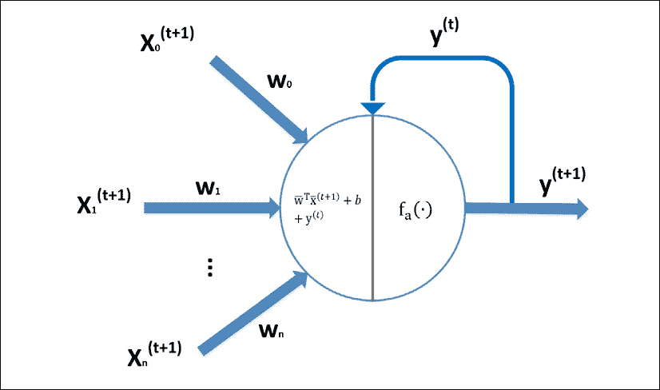

一个循环神经元示意图的例子

现在，神经元不再是一个纯粹的前馈计算单元，因为反馈连接迫使它记住自己的过去，并利用它来预测新的值。新的动态规则现在如下:

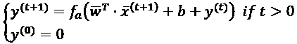

先前的预测被反馈并求和以产生新的线性输出。结果值由激活函数转换，以产生实际的新输出(通常，第一个输出为空，但这不是一个约束)。需要立即考虑的是激活功能——这是一个动态系统，很容易变得不稳定。防止这种现象的唯一方法是采用饱和函数(如 sigmoid 或双曲线正切)。事实上，无论输入是什么，输出永远不会朝着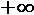或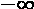爆炸。

相反，假设我们要使用一个 ReLU 激活——在某些情况下，输出将无限增长，导致溢出。显然，线性激活的情况甚至更糟，即使使用泄漏的 ReLU 或 eLU，情况也可能非常相似。因此，很明显我们需要选择饱和函数，但是这足以保证稳定性吗？即使双曲正切(和 sigmoid)有两个稳定点(-1 和+1)，这也不足以确保稳定性。我们假设输出受噪声影响，在 0.0 附近振荡。该单元不能收敛到一个值，并且仍然被困在极限环中。

幸运的是，学习权重的能力允许我们增加对噪声的鲁棒性，防止输入的有限变化逆转神经元的动态。这是一个非常重要(也很容易证明)的结果，它保证了在非常简单的条件下的稳定性，但同样，我们需要付出的代价是什么？简单明了吗？不幸的是，答案是否定的；稳定的代价极其高昂。然而，在讨论这个问题之前，我们先来看看如何训练一个简单的递归网络。

## 通过时间反向传播

训练 RNN 最简单的方法是基于一个代表性的技巧。由于输入序列是有限的，并且它们的长度是固定的，因此可以将具有反馈连接的简单神经元重构为展开的前馈网络。在下图中，有一个带有 *k* 时间步长的示例:

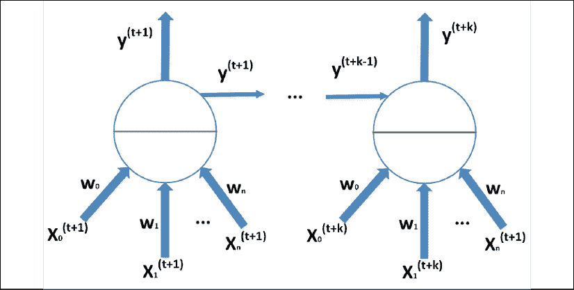

展开的循环网络示例

这个网络(可以很容易地扩展到更复杂的多层架构)就像一个 MLP，但在这种情况下，每个克隆的权重是相同的。被称为通过时间(**【BPTT】**)的**反向传播算法是标准学习技术对展开的递归网络的自然扩展。程序很简单。一旦计算出所有的输出，就有可能确定每个网络的成本函数的值。在这一点上，从最后一步开始，计算并存储校正值(梯度),并且重复该过程直到初始步骤。然后，将所有梯度相加并应用于网络。由于每一个贡献都基于精确的时间经验(由本地样本和先前的记忆元素组成)，标准的反向传播将学习如何管理动态条件，就像它是逐点预测一样。但是，我们知道实际的网络并不是展开的，过去的依赖关系在理论上是传播和记忆的。我自愿在理论上使用这个词，因为所有的实际实验都显示出与我们将要讨论的完全不同的行为。这种技术很容易实现，但是对于必须展开大量时间步长的深层网络来说，它可能非常昂贵。由于这个原因，已经提出了一种称为通过时间**的**截断反向传播的变体( **TBPTT** )(在*子分组降低了复杂性并加速了递归网络中的学习*，Zipser D .，神经信息处理系统的进展，II，1990)。**

想法是使用两个序列长度 *t* [1] 和 *t* [2] (与*t*[1]*>>t*[2])—使用较长的一个(*t*[1]*t*[1])乍一看，这个版本看起来像一个普通的 BPTT，只有一个简短的序列；然而，关键思想是迫使网络用更多信息更新隐藏状态，然后根据更长序列的结果计算校正(即使更新被传播到有限数量的先前时间步长)。显然，这是可以加速训练过程的近似，但是最终结果通常与通过处理长序列获得的结果相当，特别是当依赖性可以被分割成更短的时间块时(因此假设没有非常长的依赖性)。

即使 BPTT 算法在数学上是正确的，并且学习短期依赖关系(对应于短的展开网络)并不难，但几个实验证实，学习长期依赖关系极其困难(或几乎不可能)。换句话说，很容易利用过去的经验，这些经验的贡献仅限于一个短窗口(因此其重要性有限，因为它们无法管理最复杂的趋势)，但网络无法轻松地学习所有行为，例如，具有涉及数百个时间步长的季节性成分。考虑到反向传播算法的标准行为，可以直观地理解这种限制的原因。

## BPTT 的局限性

在这种方法中，梯度被反向传播，从成本函数开始，在第一层结束。然而，在一个循环网络中，时间步长相当于一种*延长的*模型，其中梯度必须穿越更多的层。在每次求导过程中，量值(我们很快就会看到)往往会减小。由于校正与梯度成比例，这种效应导致模型在数学上无法校正权重，从而无法学习。当处理长期相关性时，这种现象更加明显，因为信号至少可以分成两个不同的分量:

*x*(t) = *s*(t) + *l*(t)

术语 *s* ( *t* )包含关于短期变化的高频信息，而 *l* ( *t* )负责长期相关性(更复杂的分解也是可能的，但这一个对于我们的目的来说就足够了)。虽然前者相当快，但后者通常非常慢，其对梯度的贡献往往会因短期分量而减少。因此，在几个时间步之后，梯度丢失了其与长期相关性相关的信息内容，并导致模型仅关注短期变化，而忘记了长期成分的结构。

在 1994 年，Bengio、Simard 和 Frasconi 提供了对该问题的理论解释(在 Bengio Y .、Simard P .、Frasconi P. *中，学习具有梯度下降的长期依赖性是困难的，* IEEE 神经网络汇刊，5/1994)。数学细节相当复杂，因为它们涉及动态系统理论。然而，最终结果是，当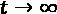时，其神经元被迫变得对噪声鲁棒(正常的预期行为)的网络受到消失梯度问题的影响。更一般地，我们可以如下表示矢量递归神经元动力学:

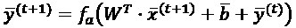

BPTT 的乘法效应迫使梯度与*W*t^t成比例。通常，可以将 *W* 分解为包含特征值的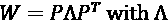对角线。因此，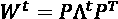并且，如果 *W* 的最大绝对特征值(也称为谱半径)小于 1，则以下适用:

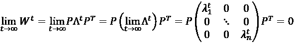

相反，大于 1 的特征值的影响会产生爆炸效应，迫使有界单元(如 sigmoid 或双曲线正切)饱和或无界单元(如 ReLU)溢出:

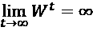

更简单地说，我们可以通过说梯度的大小与序列的长度成比例来重新表达结果，即使条件是渐近有效的，许多实验也证实了数字计算的有限精度和由于后续乘法导致的指数衰减可以迫使梯度消失或爆炸，即使序列不是非常长(前一种情况比后一种情况更有可能)。这似乎是任何 RNN 体系结构的终结，但幸运的是，已经设计并提出了更近的方法来解决这个问题，允许 rnn 学习短期和长期依赖性，而没有特别的复杂性。一个 RNNs 的新时代开始了，结果立刻就很突出。

# 长短期记忆(LSTM)

这个模型(在许多领域代表了最先进的循环细胞)是由 Hochreiter 和 Schmidhuber 于 1997 年提出的(在 Hochreiter S .、Schmidhuber J .、*长短期记忆、*神经计算，第 9 卷，11/1997)，其象征性名称为**长短期记忆** ( **LSTM** )。顾名思义，这个想法是创造一个更复杂的人工循环神经元，可以插入更大的网络并进行训练，而没有消失的风险，当然，也没有爆炸梯度的风险。经典递归网络的关键要素之一是，它们专注于学习，而不是选择性遗忘。这种能力对于优化记忆的确是必要的，以便记住真正重要的东西，并删除所有那些对预测新值不必要的信息。

为了实现这个目标，LSTM 利用了两个重要的特性(在进入模型之前讨论它们是有帮助的)。第一个是显式状态，这是一组单独的变量，存储构建长期和短期依赖关系所需的元素，包括当前状态。这些变量是称为**恒定误差传送带** ( **CEC** )的机制的构建模块，之所以这样命名是因为它负责对反向传播算法提供的误差进行循环和内部管理。这种方法允许校正权重，而不再遭受乘法效应。内部 LSTM 动力学允许更好地理解如何安全地反馈误差；然而，训练过程的准确解释(总是基于梯度下降)超出了本书的范围，可以在上述论文中找到。

第二个特征是盖茨的出现。我们可以简单地把门定义为一个可以调节通过它的信息量的元素。例如，如果 *y = ax* 并且 a 是一个有界在 0 和 1 之间的变量，它可以被认为是一个门，因为当它等于 0 时，它阻止输入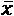；当它等于 1 时，它允许输入不受限制地流入；当它具有中间值时，它成比例地减少信息量。在 LSTMs 中，门由 sigmoid 函数管理，而激活基于双曲正切(其对称性保证了更好的性能)。此时，我们可以展示 LSTM 细胞的结构图并讨论其内部动力学:

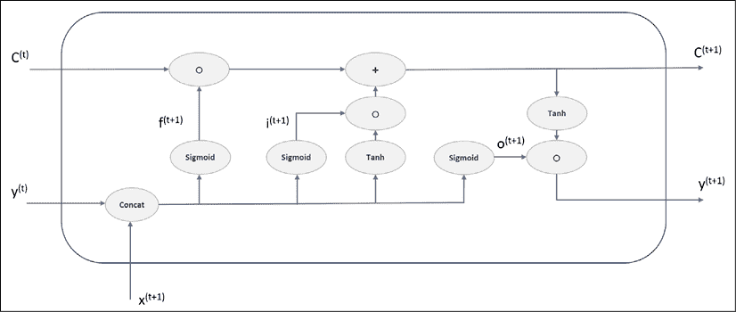

LSTM 细胞的结构。函数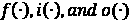分别表示遗忘、输入和输出门的核心

第一个(也是最重要的)元素是内存状态，它负责依赖关系和实际输出。在该图中，它由上面的线表示，其动力学由下面的一般方程表示:


因此，状态取决于先前的值、当前的输入和先前的输出。先说第一个学期，忘门。顾名思义，它负责现有内存元素的持久化或删除。在图中，它由第一个垂直块表示，它的值是通过连接先前的输出和当前的输入获得的:

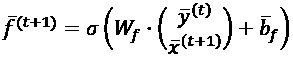

该操作是具有矢量输出的经典神经元激活。另一个版本可以使用两个权重矩阵，并保持输入元素分开:

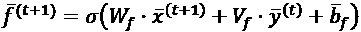

然而，我更喜欢前一个版本，因为它可以更好地表达输入和输出的同质性，以及它们的结果性。使用遗忘门，可以使用 Hadamard(或 elementwise)乘积来确定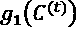的值:

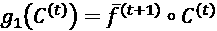

这个计算的作用是过滤掉*C*(^t^)必须保留的内容和有效度(与的值成正比)。如果遗忘门输出接近 1 的值，则相应的元素仍然被认为是有效的，而较低的值确定了一种过时，当遗忘门值为 0 或接近 0 时，甚至可以导致单元完全删除元素。下一步是考虑更新状态时必须考虑的输入样本量。这项任务由输入门(第二个垂直模块)完成。该等式类似于上一个等式:

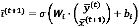

然而，在这种情况下，我们还需要计算必须添加到当前状态的项。正如已经提到的，LSTM 细胞采用双曲正切激活；因此，对国家的新贡献是这样获得的:

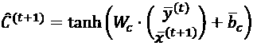

使用输入门和状态贡献，可以确定功能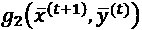:

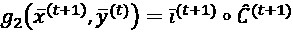

因此，完整的状态方程变成如下:

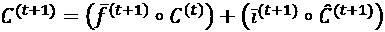

现在，LSTM 细胞的内在逻辑更加明显了。该状态基于以下内容:

*   以前的经验和根据新经验的重新评估之间的动态平衡(由遗忘门调节)
*   当前输入的语义效应(由输入门调制)和潜在的附加激活

现实场景很多。有可能新的输入迫使 LSTM 重置状态并存储新的输入值。另一方面，输入门也可以保持关闭，给新的输入(连同先前的输出)一个非常低的优先级。在这种情况下，考虑到长期相关性，LSTM 可以决定丢弃被认为有噪声并且不一定能够有助于准确预测的样本。在其他情况下，遗忘门和输入门都可以部分打开，只让一些值影响状态。所有这些可能性都由学习过程通过校正权重矩阵和偏差来管理。与 BPTT 的不同之处在于，长期依赖性不再受到梯度消失问题的阻碍。

最后一步是确定输出。第三个垂直块称为输出门，控制必须从状态传输到输出单元的信息。它的方程式如下:

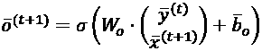

因此，实际输出由下式确定:


一个重要的考虑因素与门有关。它们都被馈入相同的向量，该向量包含先前的输出和当前的输入。由于它们是同质的值，串联产生了一个连贯的实体，该实体编码了一种相反的因果关系(这是一个不恰当的定义，因为我们正在处理先前的结果和当前的原因)。这些门像逻辑回归一样工作，没有阈值；因此，它们可以被认为是*伪*-概率向量(不是分布，因为每个元素都是独立的)。遗忘门表示上一个序列(效果、原因)比当前状态更重要的概率；然而，只有输入门负责授予它影响新状态的权利。此外，输出门表示当前序列能够让当前状态流出的概率。

这种动态确实非常复杂，而且有一些缺点。例如，当输出门保持关闭时，输出接近零，这会影响遗忘门和输入门。由于他们控制着新状态和 CEC，他们可能会限制传入的信息量和随之而来的更正，从而导致性能下降。一个简单的解决方案，可以减轻这个问题是由一个变种称为窥视孔 LSTM。这个想法是把以前的状态反馈给每个门，这样他们可以更独立地做决定。通用门方程如下:

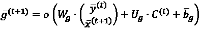

必须以与标准*W*g 和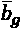相同的方式学习新的砝码组 *U* g(用于所有三个门)。这与经典 LSTM 的主要区别在于，顺序动态遗忘门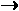输入门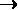新状态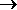输出门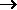实际输出现在被部分旁路。每个门激活中状态的存在允许它们利用多个循环连接，在许多复杂的情况下产生更好的准确性。另一个重要的考虑是学习过程:在这种情况下，窥视孔是关闭的，唯一的反馈通道是输出门。不幸的是，并不是每个 LSTM 实现都支持窥视孔；然而，几项研究证实，在大多数情况下，所有模型都产生类似的性能。

邢剑等(于邢剑，周蓉，郝伟，杨迪燕，魏建伟，王春伟.*)，卷积 LSTM 网络:一种用于降水临近预报的机器学习方法，*arXiv:1506.04214【cs .CV])提出了一种称为卷积 LSTM 的变体，它显然混合了卷积和 LSTM 细胞。主要的内部差异涉及到门的计算，现在变成了(没有窥视孔，不过总是可以添加的):

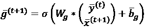

*W* [g] 现在是一个与输入输出向量(通常是两幅图像的拼接)卷积的内核。当然，可以训练任意数量的内核来提高单元的解码能力，并且输出将具有等于批量大小 x 宽度 x 高度 x 内核的形状。这种单元对于将空间处理与稳健的时间方法结合起来特别有用。给定一系列图像(例如，卫星图像和游戏截图)，卷积 LSTM 网络可以学习通过几何特征演变表现出来的长期关系(例如，云的运动或特定的精灵策略，考虑到事件的长期历史，这是有可能预测的)。

这种方法(即使有一些修改)广泛用于深度强化学习，以解决复杂的问题，其中唯一的输入是由一系列图像提供的。当然，计算复杂度非常高，特别是当使用许多后续层时；然而，其结果优于任何现有的方法，这种方法成为处理这类问题的首选方法之一。

另一个对许多 rnn 常见的重要变体是由双向接口提供的。这不是一个实际层，而是一种策略，用于将序列的正向分析与反向分析结合起来。两个单元块被馈送一个序列及其逆序列，例如，输出被连接并用于进一步的处理步骤。在自然语言处理等领域，这种方法使我们能够显著提高分类和实时翻译的准确性。原因与序列结构的基本规则密切相关。在自然语言中，一个句子*w*[1]w[2]*…w*[n]具有前向关系(例如，一个单数名词后面可以跟*是*)，但是关于后向关系的知识(例如，句子*这个地方很糟糕*)允许常见的错误，在过去， 必须使用后处理步骤进行纠正(最初翻译的 *pretty* 可能类似于翻译的 *nice* ，但是随后的分析可以揭示出 *pretty* 在这种情况下不是形容词； 形容词 *nice* 不匹配，可以应用特殊规则)。另一方面，深度学习不是基于特殊的规则，而是基于学习内部表示的能力，这种内部表示应该在做出最终决定时是自主的(没有进一步的外部帮助)，双向 LSTM 网络有助于在许多重要背景下实现这一目标。

Keras/TensorFlow 从一开始就实现了 LSTM 类。它还提供了一个双向类包装器，可用于每个 RNN 层，以获得双输出(使用正向和反向序列计算)。此外，在 Keras 2 中有基于 NVIDIA CUDA (CuDNNLSTM)的 LSTM 优化版本，当兼容的 GPU 可用时，它可以提供非常高的性能。在同一个包中，还可以找到 ConvLSTM2D 类，它实现了卷积 LSTM 层。在这种情况下，读者可以立即识别许多参数，因为它们与标准卷积层相同。

## 门控循环单元(GRU)

这个模型，命名为**门控** **递归单元** ( **GRU** )，由 Cho 等人提出(在 Cho K .、Van Merrienboer B .、Gulcehre C .、Bahdanau D .、Bougares F .、Schwenk H .、Bengio Y .、*学习短语表示使用 RNN 编码器-解码器进行统计机器翻译，*arXiv:1406.1078【cs .CL])，可以认为是一个有一些变化的简化 LSTM。

一般全门控单元的结构如下图所示:

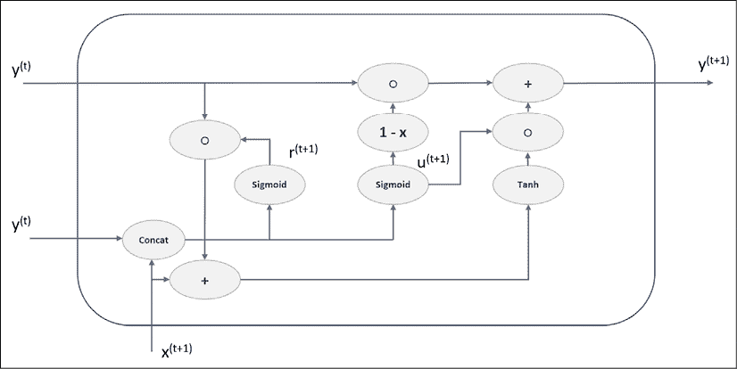

GRU 细胞的结构。函数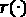和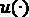分别代表复位和更新门的核心

这与 LSTMs 之间的主要区别是只有两个门，没有明确的状态。这些简化可以加速训练和预测阶段，同时避免消失梯度问题。

第一个门称为复位门(通常用字母 *r* 表示),其功能类似于遗忘门:

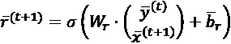

类似于遗忘门，它的作用是决定前面输出的什么内容必须保留以及保留到什么程度。事实上，对新产出的附加贡献是这样获得的:

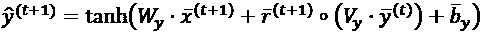

在前一个表达式中，我倾向于将权重矩阵分开，以便更好地解释行为。tanh *x* 的自变量是新输入的线性函数和作为先前状态的函数的加权项的和。现在，重置门是如何工作的就很清楚了:它调节必须保留的历史(在以前的输出值中累积的)量，以及可以丢弃的历史量。

然而，考虑到短期和长期相关性，复位门不足以确定具有足够精度的正确输出。为了增加单元的表现力，增加了一个更新门(其作用类似于 LSTM 输入门):

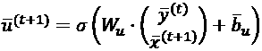

更新门控制必须贡献给新输出(并因此贡献给状态)的信息量。由于它是一个介于 0 和 1 之间的值，gru 被训练为使用类似于加权平均的运算来混合旧的输出和新的相加贡献:

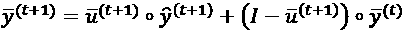

因此，更新门成为一个调制器，它可以选择每个流的哪些分量必须被输出和存储以用于下一个操作。该单元在结构上比 LSTM 更简单，但是几项研究已经证实，其性能平均上相当于 LSTM(例如， *Chung J .、* Gulcehre C .、Cho K .、Bengio Y .、*门控递归神经网络对序列建模的经验评估，* arXiv:1412.3555v1 [cs .NE]) *。*另一方面，在一些特殊情况下(例如，自然语言建模)，LSTM 甚至在脚本生成方面超过了 GRU (Mangal S .，Joshi P .，Modak R .， *LSTM 对 GRU 对双向 RNN，* arXiv:1908.04332 [cs。CL])。我的建议是你测试两个模型，从 LSTM 开始。现代硬件大大降低了计算成本，在许多情况下，GRUs 的优势通常可以忽略不计。在这两种情况下，基本原理是相同的:误差被保存在单元内，门的权重被校正以最大化精度。

这种行为防止了小梯度的乘法级联，并提高了学习非常复杂的时间行为的能力。然而，单个单元/层将不能成功地达到期望的精度。在所有这些情况下，有可能堆叠由可变数量的电池组成的多个层。每一层通常可以输出最后一个值或整个序列。当将 LSTM/GRU 层连接到完全连接的层时，使用前者，而整个序列是供给另一个循环层所必需的。在下面的例子中，我们将看到如何用 Keras 实现这些技术。

就像 LSTMs 一样，Keras/TensorFlow 实现了 GRU 类及其 NVIDIA CUDA 优化版本 CuDNNGRU。

## 具有张量流和 Keras 的 LSTM 示例

在这个例子中，我们想要测试 LSTM 网络学习长期依赖性的能力。出于这个原因，我们采用了一个名为 Zuerich Monthly 黑子的数据集，其中包含了从 1749 年到 2015 年所有月份中观察到的黑子数量(由布鲁塞尔比利时皇家天文台 *SILSO data/image* 收集)。

CVS 数据集可从位于[http://sidc.be/silso/infossntotmonthly](http://sidc.be/silso/infossntotmonthly)的比利时皇家天文台 SILSO 数据/图像页面下载。

由于我们对日期不感兴趣，我们需要解析文件，以便只提取时间序列所需的值(限制为 3，175 步，以简化划分为 15 步的块):

```
import numpy as np
import pandas as pd
n_samples = 3175
sequence_length = 15
dataset_filename = 'ISSN_M_tot.csv'
df = pd.read_csv(dataset_filename, header=None).dropna()
data =  df[3].values[:n_samples - sequence_length].\
        astype(np.float32)
```

这些值是未归一化的，并且由于 LSTMs 使用双曲正切，因此在区间(-1，1)内对它们进行归一化是有帮助的。我们可以使用 scikit-learn 类轻松地执行这一步，`MinMaxScaler`:

```
from sklearn.preprocessing import MinMaxScaler
mmscaler = MinMaxScaler((-1.0, 1.0))
data = mmscaler.fit_transform(data.reshape(-1, 1))
```

完整的数据集如下图所示:


Zuerich 每月太阳黑子时间序列

为了训练模型，我们决定使用 2600 个数据点进行训练，剩余的 575 个数据点进行验证(对应于大约 48 年)。模型的输入是一批 15 个数据点的序列(沿时间轴移动)，输出是随后的一个月；因此，在训练之前，我们需要准备数据集:

```
X_ts = np.zeros(shape=(n_samples - sequence_length, 
                           sequence_length, 1), 
                    dtype=np.float32)
Y_ts = np.zeros(shape=(n_samples - sequence_length, 1), 
                    dtype=np.float32)
for i in range(0, data.shape[0] - sequence_length):
X_ts[i] = data[i:i + sequence_length]
Y_ts[i] = data[i + sequence_length]
X_ts_train = X_ts[0:2600, :]
Y_ts_train = Y_ts[0:2600]
X_ts_test = X_ts[2600:n_samples, :]
Y_ts_test = Y_ts[2600:n_samples]
```

现在，我们可以创建并编译一个简单的模型，它具有一个包含四个细胞的单状态 LSTM 层，后跟一个双曲正切输出神经元(我总是建议读者用更复杂的架构和不同的参数进行实验):

```
import tensorflow as tf
model = tf.keras.models.Sequential([
        tf.keras.layers.LSTM(4, 
                             stateful=True,
                             batch_input_shape=
                             (20, sequence_length, 1)),
        tf.keras.layers.Dense(1,
                              activation='tanh')
        ])
model.compile(optimizer=
                  tf.keras.optimizers.Adam(
                      lr=0.001, decay=0.0001),
              loss='mse',
              metrics=['mse'])
```

在 LSTM 类中设置`stateful=True`参数会强制 TensorFlow/Keras 在每次批处理后不重置状态(默认值为`False`)。事实上，我们的目标是学习长期依赖性和将单个批次视为同一序列的一部分的。因此，内部 LSTM 状态必须反映整体趋势，并捕捉一个长系列批次的季节性。当 LSTM 网络有状态时，也有必要在输入形状中指定批量大小(通过`batch_input_shape`参数)。在我们的例子中，我们选择了 20 个数据点的批量大小，这些数据点被连接起来以生成整个序列(假设数据点以规则的间隔被采样)。读者必须记住，无状态 LSTM 总是有助于学习时间序列，但重点仅限于较短的序列。另一方面，当我们对给定整个过去的经验来预测未来的行为感兴趣时，细胞必须保持状态，并在提交新的一批时重用它。

优化器是 Adam，具有更高的衰减(以避免不稳定性)和基于均方误差的损失(这是这类场景中最常见的选择)。此时，我们可以训练模型 100 个时期，足以达到训练和验证损失函数都停止下降的区域:

```
model.fit(X_ts_train, Y_ts_train,
          batch_size=20,
          epochs=100,
          shuffle=False,
          validation_data=(X_ts_test, Y_ts_test))
```

前面代码片段的输出是:

```
Train on 2600 samples, validate on 560 samples
Epoch 1/100
2600/2600 [==============================] - 3s 1ms/sample - loss: 0.2676 - mse: 0.2676 - val_loss: 0.1020 - val_mse: 0.1020
Epoch 2/100
2600/2600 [==============================] - 0s 174us/sample - loss: 0.0670 - mse: 0.0670 - val_loss: 0.0893 - val_mse: 0.0893
…
Epoch 99/100
2600/2600 [==============================] - 1s 204us/sample - loss: 0.0160 - mse: 0.0160 - val_loss: 0.0182 - val_mse: 0.0182
Epoch 100/100
2600/2600 [==============================] - 0s 171us/sample - loss: 0.0159 - mse: 0.0159 - val_loss: 0.0181 - val_mse: 0.0181
```

这是一个例子，其目的仅仅是说教；因此，最终的验证均方误差不会极低(即使小于 2%)。但是，从下图(表示验证集上的预测)中可以看出，模型已经成功地了解了全局趋势和几个短期依赖关系:

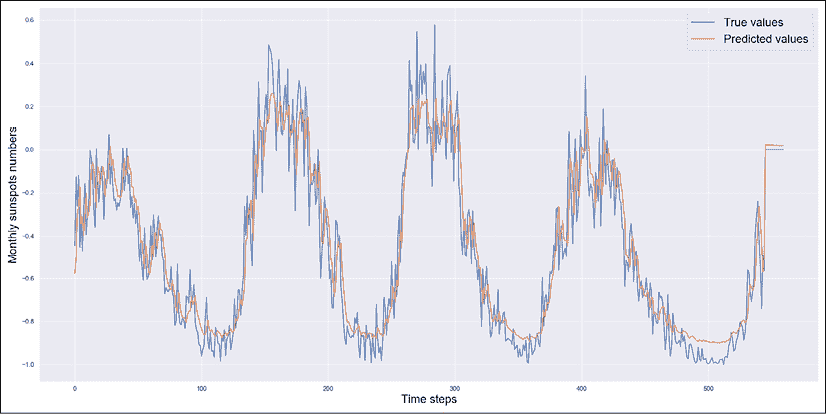

Zuerich 数据集上的 LSTM 预测

该模型仍然无法达到非常高的精度来对应所有非常快速的尖峰，但它能够正确地模拟振荡的幅度和尾部的长度。为了学术上的诚实，我们必须考虑这种验证是在真实数据上进行的；但是，在处理时间序列时，通常会使用基本事实来预测新值。在这种情况下，它就像一个移动预测，其中每个值都是使用训练历史和一组真实观察值获得的。很明显，该模型能够预测长期振荡以及一些局部振荡(例如，从步骤 300 开始的序列)，但它可以改进，以便在整个验证集上具有更好的性能。为了实现这个目标，有必要增加网络的复杂性并调整学习速率(这是在真实数据集上的一个非常有趣的练习)。

观察前面的图表，可以看到该模型在某些高频(快速变化)下相对更精确，而在其他情况下则更不精确。这不是奇怪的行为，因为非常振荡的函数需要更多的非线性(想想泰勒展开和截断到特定程度时的相对误差)来实现高精度(这意味着使用更多的层)。考虑到我们需要将整个输出序列传递给下一个递归层(这可以通过设置`return_sequences=True`参数来实现)，我建议您使用更多的 LSTM 层来重复这个实验。相反，最后一层必须只返回最终值(这是默认行为)。我还建议测试 GRU 层，将性能与 LSTM 版本进行比较，并选择最简单(测试训练时间)和最准确的解决方案。

# 迁移学习

我们已经讨论了学习从根本上基于黑盒模型有多深，黑盒模型学习如何将输入模式与特定的分类/回归结果相关联。通常用于为特定检测准备数据的整个处理流水线被神经结构的复杂性所吸收。然而，高精度的代价是成比例的大量训练样本。*最先进的*视觉网络由数百万张图像训练而成，显然，每张图像都必须被正确标记。即使有许多免费的数据集可以用来训练几个模型，许多特定的场景需要艰苦的准备工作，有时很难实现。

幸运的是，深度神经架构是以结构化方式学习的分层模型。正如我们在深度卷积网络的示例中看到的，第一层对检测低级特征变得越来越敏感，而较高层则集中精力提取更详细的高级特征。

在几个任务中，有理由认为，例如，用大型视觉数据集(如 ImageNet 或 Microsoft Coco)训练的网络可以重用，以实现稍微不同的任务中的专业化。这个概念被称为迁移学习，当需要用全新的数据集和特定目标创建*最先进的*模型时，这是最有用的技术之一。

例如，客户可以要求系统监控几个摄像机，目的是分割图像并突出显示特定目标的边界。输入由具有相同几何属性的视频帧组成，因为训练中使用的成千上万的图像构成了非常强大的模型(例如，Inception、ResNet 或 VGG)；因此，我们可以采用预训练模型，移除最高层(通常以 softmax 分类层结束的密集层)，并将展平层连接到输出边界框坐标的 MLP。网络的第一部分可以被冻结(权重不再修改)，而 SGD 被应用来调整新的专用子网络的权重，如下图所示:

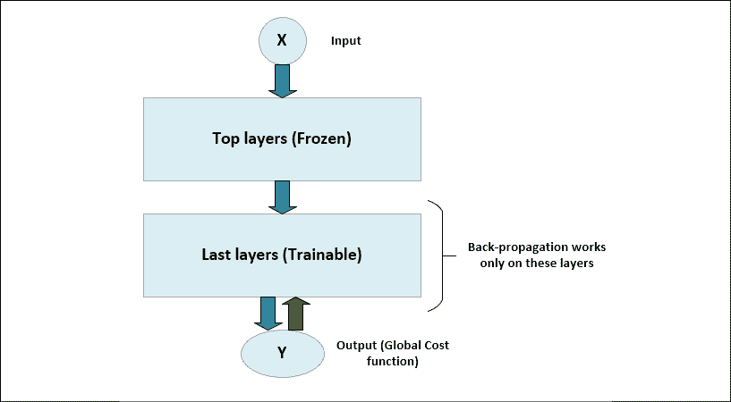

迁移学习模型的结构

显然，这种方法可以极大地加速训练过程，因为模型的最复杂部分已经被训练，并且由于已经在原始模型上执行了优化，还可以保证极高的准确性(相对于原始解决方案)。显然，最自然的问题是这种方法是如何工作的？有什么正式的证明吗？不幸的是，所有的结果都没有完整的数学证明，但是有足够的证据向我们保证这种方法。

例如，Paris oto e .、Ba J .、Salakhutdinov R .、 *Actor-Mimic 深度多任务与迁移强化学习、*arXiv:1511.06342 v4【cs .LG]，在 Taylor M .，Stone P .，*强化学习领域的迁移学习:调查，*机器学习研究杂志，2009 年 10 月，可以看到迁移学习如何提高应用于强化学习环境的深度模型的有效性。在这种情况下，转移(和改编)现有的知识可以节省时间并提高现有模型的可重用性。

一般来说，神经训练过程的目标是专门化每一层，以便为下一层提供更具体的(详细的、过滤的等等)表示。卷积网络是这种行为的一个明显例子，但在 MLP 中也可以观察到同样的现象。对非常深的卷积网络的分析表明，内容在到达扁平化层之前仍然是可见的，在扁平化层，内容被发送到一系列密集层，这些密集层负责为最终的 softmax 层提供信息。换句话说，卷积块的输出是输入的更高级的分段表示，很少受特定分类问题的影响。

出于这个原因，迁移学习通常是合理的，通常不需要对较低层次进行再培训。但是，很难理解哪个模型可以产生最佳性能，知道哪个数据集用于训练原始网络非常有用。通用数据集(比如 ImageNet)在很多上下文中非常有用，而特定的(比如 Cifar-10 或者 FashionMNIST 可能限制太多)。幸运的是，TensorFlow/Keras(在 TensorFlow 包 tf.keras.applications 中)提供了许多模型(甚至是非常复杂的模型),这些模型总是用 ImageNet 数据集进行训练，并且可以立即在生产就绪的应用程序中使用。即使使用它们极其简单，也需要对这个框架有更深入的了解，这超出了本书的范围。我邀请对这个话题感兴趣的读者看一下 Holdroyd T .， *TensorFlow 2.0 快速入门指南，* Packt 出版，2019。

在过去的几年中，迁移学习变得越来越重要，因为即使硬件价格下降，多次训练大型模型也会在项目进度中产生不可接受的延迟。为了让机器学习成为一种标准方法，也有必要找到通常留给研究的问题的工程解决方案。迁移学习肯定是这样一种方法，当处理需要深度网络的复杂和大型数据集时，数据科学家应该始终考虑这种方法。

另一方面，并不是所有的问题都适合用这种方法来解决。在某些情况下，现有的模型过于普通，可能只冻结几个初始层来达到合理的精度。

在其他情况下，预训练模型中采用的训练集的结构需要与特定任务不兼容的神经架构。例如，一个被训练来识别不同形状的汽车或卡车的模型可能很难与生物细胞一起工作，这些细胞的特征被限制在非常小(并且经常过度重叠)的区域。在这种情况下，预训练模型已经学习了更广泛的数据生成过程，许多区域对应于难以察觉的差异。相反，细胞识别通常需要在具有更精细辨别能力的更小区域上工作。迁移学习要求最后一层(通常是完全连接的)扮演这一角色，但有时也可以利用前面的层来提高最终的表现。

像书中描述的许多其他技术一样，迁移学习就像一把瑞士军刀，如果它们实际上相互兼容，就可以适应完全不同的任务。考虑到训练一个全新的模型所需要的努力，将迁移学习作为一种选择总是一个好主意。然而，对目标有一个清晰的想法并做出务实有效的决策也很重要。

例如，有必要选择正确的预训练模型。一些网络被设计成处理特定种类的样本(例如小的或低分辨率的图像)，而另一些网络则用从非常普通的数据生成过程中采样的数据来训练。只有在用法相似的情况下，设计用于特定环境的模型通常才是好的选择。例如，设计用于自动驾驶汽车的深度网络可能从未经过训练，无法识别与我们在街上遇到的物体不同的物体。

如果目标域与初始域重叠，这种模型可能会非常有效，但当对象的几何属性要求能够在非常不同的尺度上进行区分时，它们可能会不准确。因此，初始模型的选择应该从一般模型开始，让最后几层对特定细节越来越有选择性。另一方面，很少可能对数据生成过程有一个清晰的概念。因此，数据科学家必须在项目时间表中包括一些探索时间，可能保留所有不同版本的训练模型，以便进行最终的全面比较。

# 总结

在本章中，我们介绍了 RNNs 的概念，强调了使用 BPTT 算法训练经典模型时通常会出现的问题。特别是，我们解释了为什么这些网络不容易学习长期依赖关系。

由于这个原因，新的模式已经提出，其性能立即突出。我们讨论了最著名的循环细胞，称为长短期记忆(LSTM)，它可以用于能够轻松学习序列的所有最重要的依赖关系的层，使我们即使在方差非常高的情况下(如股票市场报价)，也能最小化预测误差。最后一个主题是在 LSTMs 中实现的想法的简化版本，这导致了一个称为**门控循环单元** ( **GRU** )的模型。这种单元更简单，计算效率更高，许多基准测试证实其性能与 LSTM 大致相同。

在下一章，我们将讨论一些称为自动编码器的模型，其主要特性是创建任意复杂输入分布的内部表示。

# 延伸阅读

*   Holdroyd T .， *TensorFlow 2.0 快速入门指南*，Packt 出版社，2019
*   Goodfellow I .，Bengio Y .，库维尔 a .，*深度学习*，麻省理工学院出版社，2015 年
*   Zipser D .，*神经信息处理系统的进展*，II，1990 年
*   Bengio Y .、Simard P .、Frasconi P .，*学习梯度下降的长期相关性是困难的*，神经网络 IEEE 会刊，1994 年 5 月
*   霍克雷特，施密德胡伯 j .，*长短期记忆*，*神经计算*，第 9 卷，11/1997
*   邢建生，，郝伟，杨迪燕，魏建伟，王春伟，*卷积 LSTM 网络:一种用于降水临近预报的机器学习方法*，arXiv:1506.04214【cs .简历]
*   Cho K .、Van Merrienboer B .、Gulcehre C .、Bahdanau D .、Bougares F .、Schwenk H .、Bengio Y .，*使用统计机器翻译的 RNN 编码器-解码器学习短语表示*，arXiv:1406.1078【cs .CL]
*   Mangal S .，Joshi P .，Modak R .， *LSTM 对 GRU 对双向 RNN 进行脚本生成*，arXiv:1908.04332【cs。CL]
*   Chung J .，Gulcehre C .，Cho K .，Bengio Y .，*门控递归神经网络对序列建模的经验评估*，arXiv:1412.3555v1 [cs .NE]
*   Parisotto E .、Ba J .、Salakhutdinov R .、*演员-模仿者* *深度多任务与迁移强化学习*、arXiv:1511.06342 v4【cs .LG]
*   泰勒 m，斯通 p .，*强化学习领域的迁移学习:一项调查，*机器学习研究杂志，10，2009