# 二十一、自编码器

在这一章中，我们将看看一个无人监管的模型家族，它的性能已经通过现代深度学习技术得到了提高。自编码器提供了一种不同的方法来解决经典问题，如维数减少或字典学习；然而，与许多其他算法不同，它们没有影响许多著名模型的容量限制。此外，它们可以利用特定的神经层(如卷积)根据专门的标准提取信息。这样，内部表示可以对不同种类的失真更加鲁棒，并且在它们可以处理的信息量方面更加有效。

特别是，我们将讨论以下内容:

*   标准自编码器
*   降噪自编码器
*   稀疏自编码器
*   可变自编码器

我们现在可以开始讨论自编码器的主要概念，重点是结构组件及其特性。在接下来的部分中，我们将进一步扩展这些概念，以解决更复杂的问题。

# 自编码器

在之前的章节中(特别是，*第 3 章*、*半监督学习简介*和*第 4 章*、*高级半监督分类*关于半监督学习)，我们讨论了真实数据集如何经常是位于低维流形上的样本的高维表示(这是半监督模式的假设之一，但通常是正确的)。

由于模型的复杂性与输入数据的维度成正比，因此已经对许多技术进行了分析和优化，以减少有效组件的实际数量。例如，PCA 根据它们的相对解释方差来选择特征，而 ICA 和通用字典学习技术寻找可以组合以重建原始样本的基本原子。在这一章中，我们将基于一种略有不同的方法来分析一系列模型，但其能力因深度学习方法的采用而显著增强。通用自编码器是一个模型，它被分成两个独立的(但不是完全自主的)组件，称为编码器和解码器。编码器的任务是将输入样本转换为编码的特征向量，而解码器的任务则相反:使用特征向量作为输入来重建原始样本。下图显示了通用模型的示意图:

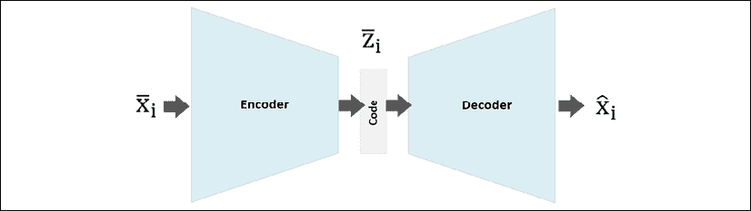

通用自编码器的模式

更正式地说，我们可以将编码器描述为一个参数化的函数:

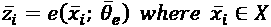

输出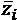是一个向量代码，其维数通常比输入维数低很多。类似地，解码器描述如下:

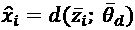

标准算法的目标是最小化与重建误差成比例的成本函数。一个经典的方法是基于**均方误差** ( **MSE** )的(在样本大小等于 M 的数据集上工作):

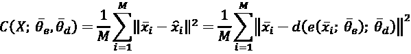

该函数仅依赖于输入样本(恒定的)和参数向量；因此，这是一个事实上的无监督方法，我们可以控制内部结构和对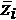代码的约束。从概率的角度来看，如果输入样本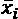是从 *p* ( *X* )数据生成过程中抽取的，我们的目标是找到一个 *q* ( *X* )参数分布，该分布使 kull back-lei bler 散度与 *p* ( *X* 最小化。考虑到前面的定义，我们可以定义一个条件分布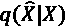如下:

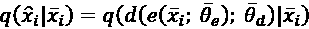

因此，库尔贝克-莱布勒散度变成如下:

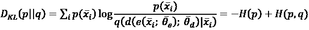

第一项表示原始分布的负熵，它是常数，不涉及优化过程。第二项是 *p* 和 *q* 之间的交叉熵。如果我们假设 *p* 和 *q* 为高斯分布，则 MSE 与交叉熵成比例(出于优化的目的，它与交叉熵是等价的)，因此这个成本函数在概率方法下仍然有效。或者，可以考虑 *p* 和 *q* 的伯努利分布，交叉熵变成如下:

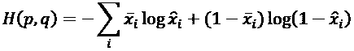

这两种方法的主要区别在于，虽然 MSE 可以应用于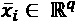(或多维矩阵)，但伯努利分布需要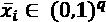(形式上，这个条件应该是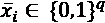；然而，当值不是二进制时，也可以成功地执行优化)。相同的约束对于重建是必要的；因此，当使用神经网络时，最常见的选择是采用 sigmoid 层。准确地说，如果假设数据生成过程是高斯的，交叉熵就变成了 MSE。我邀请您检查这一点，但是计算非常简单，因为我们有:

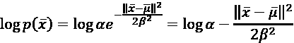

排除未经过优化的项，很容易理解原始分布和自编码器分布之间的实际交叉熵实际上等价于 MSE 成本函数。

## 采用 TensorFlow 的深度卷积自编码器示例

这个例子(像本章和后续章节中的所有其他一样)基于 TensorFlow 2.0(关于 TensorFlow 的安装的信息，请参考官方页面上提供的信息:[https://www.tensorflow.org/](https://www.tensorflow.org/))。如前几章所述，TensorFlow 已经发展到包含 Keras，并在创建和训练深度模型方面提供了非凡的灵活性。我们将务实地对待这个例子，这意味着我们不会探究所有的特性；它们超出了本书的范围。不过有兴趣的读者可以参考《Holdroyd T .》， *TensorFlow 2.0 快速入门指南*，Packt 出版社，2019 年。

在本例中，我们将创建一个深度卷积自编码器，并使用时尚 MNIST 数据集对其进行训练。第一步是加载数据(使用 Keras helper 函数)，规范化数据，为了加快计算速度，将训练集限制为 1，000 个数据点:

```py
import tensorflow as tf
import numpy as np
nb_samples = 1000
nb_epochs = 400
batch_size = 200
code_length = 256
(X_train, _), (_, _) = \
        tf.keras.datasets.fashion_mnist.load_data()
X_train = X_train.astype(np.float32)[0:nb_samples] \
              / 255.0
width = X_train.shape[1]
height = X_train.shape[2]
X_train_g = tf.data.Dataset.\
   from_tensor_slices(np.expand_dims(X_train, axis=3)).\
   shuffle(1000).batch(batch_size)
```

生成器`X_train_g`基于 TensorFlow 2.0 提供的实用程序类`Dataset`。它允许您选择用于训练和测试目的所需的数据块(在我们的例子中，没有测试生成器)，自动洗牌(去除潜在的共线性)，并在每次调用时返回批次。

在这一点上，我们可以创建一个从`tf.keras.Model`继承的类，建立整个架构，它由以下内容组成:

编码器(所有层都有填充“相同”并重新激活):

*   32 个滤波器的卷积，内核大小等于(3 × 3)，步长为(2 × 2)
*   与 64 个滤波器卷积，内核大小等于(3 × 3)，步长为(1× 1)
*   与 128 个滤波器卷积，内核大小等于(3 × 3)，步长为(1 × 1)

解码器:

*   使用 128 个滤波器进行转置卷积，内核大小等于(3 × 3)，步长为(2 × 2)
*   使用 64 个滤波器进行转置卷积，内核大小等于(3 × 3)，步长为(1× 1)
*   32 个滤波器的转置卷积，内核大小等于(3 × 3)，步长为(1 × 1)
*   使用 1 个滤波器、内核大小等于(3 × 3)、步长为(1 × 1)和 sigmoid 激活的转置卷积

由于图像是(28 x 28)的，如果我们将每个批次的大小调整为(32 x 32)的尺寸，这将使我们更容易管理基于 2 的幂的大小的所有后续操作。

编码器执行一系列卷积，从较大的步距(2×2)开始以捕获高级特征，并以(1×1)步距进行 64 和 128 次卷积以学习更多和更详细的特征。如*第 19 章*、*深度卷积网络*中所述，卷积以顺序方式工作，因此，标准架构通常遵循分层序列，有一些顶层卷积和更多的底层卷积。在这种情况下，图像的大小非常小，因此通过编码器网络保存(3 x 3)个内核是个好主意。相反，在较大图像的情况下，第一个卷积也应该涉及较大的核，而最后一个卷积必须关注较小的细节，并且大小应该更小(T21 正常的最小值是(2×2))。

解码器有一个对称架构，因为它是基于转置卷积(即去卷积)。因此，一旦代码被改造，第一个过滤器必须处理细节特征，而最后一个过滤器通常必须关注高级元素(例如，边框)。最后一个转置卷积负责构建输出，它必须与输入大小相匹配。由于我们在示例中使用的是灰度图像，所以我们使用了一个滤镜，而 RGB 图像需要三个滤镜。可以对步幅进行实际的讨论。当网络具有非常大的容量时，可以使用步长来调整转置卷积层的输出(将每个维度乘以相应的步长值)以匹配最终所需的维度。在不改变输出的情况下，添加更多的卷积(或删除它们)可能是一个聪明的技巧。相反，如果重建的质量不符合预期的要求，有时最好使用专门的高阶函数来调整图像的大小(就像我们在输入阶段所做的那样)。您的选择必须通过评估 MSE 来做出，如果可能的话，还要通过对结果的目视检查来做出。

TensorFlow 2.0 在处理从`tf.keras.Model`派生的类时，需要在构造函数中定义变量，而方法可以自由操纵它们以获得特定的结果。在我们的案例中，我们有:

*   构造函数，包含编码器和解码器所需的所有层
*   该编码器方法
*   解码器方法
*   作为实用函数的调整大小方法
*   使用模型实例直接调用主操作的`call()`方法的重载:

    ```py
    class DAC(tf.keras.Model):     def __init__(self):         super(DAC, self).__init__()         # Encoder layers         self.c1 = tf.keras.layers.Conv2D(             filters=32,             kernel_size=(3, 3),             strides=(2, 2),             activation=tf.keras.activations.relu,             padding='same')         self.c2 = tf.keras.layers.Conv2D(             filters=64,             kernel_size=(3, 3),             activation=tf.keras.activations.relu,             padding='same')         self.c3 = tf.keras.layers.Conv2D(             filters=128,             kernel_size=(3, 3),             activation=tf.keras.activations.relu,             padding='same')         self.flatten = tf.keras.layers.Flatten()         self.dense = tf.keras.layers.Dense(             units=code_length,             activation=tf.keras.activations.sigmoid)         # Decoder layers         self.dc0 = tf.keras.layers.Conv2DTranspose(             filters=128,             kernel_size=(3, 3),             strides=(2, 2),             activation=tf.keras.activations.relu,             padding='same')         self.dc1 = tf.keras.layers.Conv2DTranspose(             filters=64,             kernel_size=(3, 3),             activation=tf.keras.activations.relu,             padding='same')         self.dc2 = tf.keras.layers.Conv2DTranspose(             filters=32,             kernel_size=(3, 3),             activation=tf.keras.activations.relu,             padding='same')         self.dc3 = tf.keras.layers.Conv2DTranspose(             filters=1,             kernel_size=(3, 3),             activation=tf.keras.activations.sigmoid,             padding='same')     def r_images(self, x):         return tf.image.resize(x, (32, 32))     def encoder(self, x):         c1 = self.c1(self.r_images(x))         c2 = self.c2(c1)         c3 = self.c3(c2)         code_input = self.flatten(c3)         z = self.dense(code_input)         return z     def decoder(self, z):         decoder_input = tf.reshape(z, (-1, 16, 16, 1))         dc0 = self.dc0(decoder_input)         dc1 = self.dc1(dc0)         dc2 = self.dc2(dc1)         dc3 = self.dc3(dc2)         return dc3     def call(self, x):         code = self.encoder(x)         xhat = self.decoder(code)         return xhat model = DAC()
    ```

一旦我们也定义了我们类的一个实例(为简单起见称为*模型*，我们就可以定义优化器，它是带有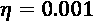的 Adam:

```py
optimizer = tf.keras.optimizers.Adam(0.001)
```

下一步是定义一个助手函数来收集关于训练损失的信息。在我们的例子中，计算每批损失函数的平均值就足够了:

```py
train_loss = tf.keras.metrics.Mean(name='train_loss')
```

现在我们需要创建训练函数，这是 TensorFlow 2.0 中引入的创新之一。我们先来定义一下:

```py
@tf.function
def train(images):
    with tf.GradientTape() as tape:
        reconstructions = model(images)
        loss = tf.keras.losses.MSE(
            model.r_images(images), reconstructions)
    gradients = tape.gradient(
        loss, model.trainable_variables)
    optimizer.apply_gradients(
        zip(gradients, model.trainable_variables))
    train_loss(loss)
```

这个函数用 decorator 标记，通知 TensorFlow 它将使用模型中定义的变量。为了应用反向传播算法，我们需要执行以下步骤:

*   激活一个`GradientTape`上下文，它将负责计算所有可训练变量的梯度。
*   运行模型(前馈阶段)。
*   评估损失函数(在我们的例子中，它是一个标准的均方误差)。
*   计算梯度。
*   要求优化器将梯度应用于所有可训练变量(当然，每个算法执行所有必要的额外操作)。
*   累积训练损失。

相应的 Python 命令很简单，与以前的 TensorFlow 版本只有一点不同。一旦声明了这个函数，就可以开始训练过程了:

```py
for e in range(nb_epochs):
    for xi in X_train_g:
        train(xi)
    print("Epoch {}: Loss: {:.3f}".
          format(e+1, train_loss.result()))
    train_loss.reset_states()
```

前面代码片段的输出是:

```py
Epoch 1: Loss: 0.136
Epoch 2: Loss: 0.090
…
Epoch 399: Loss: 0.001
Epoch 400: Loss: 0.001
```

因此，在训练过程结束时，平均均方误差为 0.001。考虑到图像尺寸调整为 32 x 32，并且值在范围(0，1)内，**平均绝对误差** ( **MAE** )范围在 0 到 1024 之间。因此，等于 0.001 的误差保证了大约 97%的高重建质量(它相当于大约等于 0.03 或最大误差的 3%的 MAE)。每当 MSE 被认为是可靠的重建度量时，该方法也可以推广到不同于图像的数据点。

分析代码的长度也很有趣(例如，编码器输出)。因为它在范围(0，1)中是标准化的，所以接近 0.5 的总平均值表示大约 50%的值是活动的，而其余的值接近 0(不考虑标准偏差)。稍大于 0.5 的值表示代码非常密集，而稍小于 0.5 的值是稀疏的标志，因为超过 50%的单元具有非常低的激活度:

```py
codes = model.encoder(np.expand_dims(X_train, axis=3))
print("Code mean: {:.3f}".format(np.mean(codes)))
print("Code STD: {:.3f}".format(np.std(codes)))
```

前一个块的输出是:

```py
Code mean: 0.554
Code STD: 0.241
```

正如所料(考虑到我们没有施加任何约束)，我们的代码是适度密集的。这也意味着通常不可能在不显著丢失信息的情况下大幅减少代码长度(在本例中，它被设置为等于 256)。其原因与代码的熵直接相关。例如，在两个图像的情况下，我们知道最佳编码需要单个二进制单元；然而，对于复杂的图像，我们应该考虑全联合概率分布来估计最佳长度，而这通常是难以处理的。因此，一个好的策略是从大约维度的长度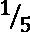开始，并通过减少它来继续，直到均方误差保持在固定阈值以下。不言而喻，由自编码器管理的一部分信息存储在模型的权重中；因此，较深的架构通常能够管理较短的代码，而非常浅的网络需要代码中包含更多的信息。

我们现在可以看到一些原始图像及其重建图像:

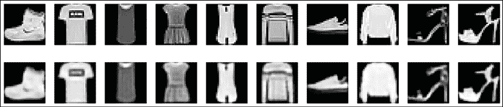

原始图像(第一行)及其重建图像(第二行)

我们可以看到信息的丢失如何局限于次要细节，并且自编码器已经成功地学会了如何减少输入样本的维数。

作为练习，我邀请读者将代码分成两个独立的部分(编码器和解码器)并优化架构，以便在整个时尚 MNIST 数据集上实现更好的准确性。

# 去噪自编码器

自编码器可用于确定数据集的不完整表示。然而，Bengio 等人(在 Vincent P .，Larochelle H .，Lajoie I .，Bengio Y .，Manzagol P .，*Stacked noise auto encoders:Learning used presentations in a Deep Network with a Local noise Criterion*，来自《机器学习研究杂志》，2010 年 11 月)提出使用自编码器对输入样本进行去噪，而不是学习样本的精确表示，以便从低维代码中重建它。

这并不是一个全新的想法，因为，例如，Hopfield 网络(几十年前提出)也有同样的目的，但它们在容量方面的限制导致研究人员寻找不同的方法。如今，深度自编码器可以轻松管理高维数据(如图像)，从而满足空间需求。这就是为什么许多人现在重新考虑教网络如何从损坏的图像重建样本图像的想法。形式上，去噪自编码器和标准自编码器之间没有太多区别。然而，在这种情况下，编码器必须处理噪声样本:

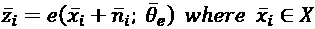

解码器的成本函数保持不变。如果对每一批次的噪声进行采样，则重复该过程足够多的迭代次数允许自编码器学习当一些片段丢失或损坏时如何重建原始图像。为了达到这个目标，作者提出了不同种类的噪音。最常见的选择是采样高斯噪声，它具有一些有用的特性，并且与许多真实世界的噪声过程一致:

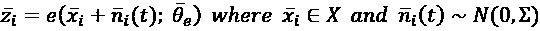

另一种可能是采用输入漏失层，将一些随机元素置零:

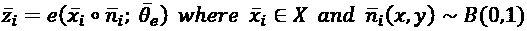

这种选择显然更为激烈，而且利率必须适当调整。大量丢弃的像素会不可逆转地删除许多信息，重建会变得更加困难和严格(我们的目的是将自编码器的能力扩展到从相同分布中抽取的其他样本)。或者，也可以混合高斯噪声和压差噪声，以固定的概率在它们之间切换。显然，这些模型肯定比标准的自编码器更复杂，因为现在它们必须处理缺失的信息。

同样的概念也适用于代码长度:非常不完整的代码将无法以最准确的方式提供重建原始图像所需的所有元素。我建议测试所有的可能性，特别是当噪声受到外部条件限制时(例如，旧照片或通过受精确噪声过程影响的通道传输的消息)。如果该模型还必须用于从未见过的样本，那么选择代表真实分布的样本是极其重要的，只要元素的数量不足以达到所需的准确性水平，就使用数据扩充技术(仅限于与特定问题兼容的操作)。

## 使用 TensorFlow 的去噪自编码器示例

这个例子不需要对之前定义的模型做任何戏剧性的修改。事实上，去噪能力是每个自编码器的固有属性。为了测试它，我们只需要考虑训练函数现在需要噪声图像和原始图像:

```py
model = DAC()
@tf.function
def train(noisy_images, images):
    with tf.GradientTape() as tape:
        reconstructions = model(noisy_images)
        loss = tf.keras.losses.MSE(
            model.r_images(images), reconstructions)
    gradients = tape.gradient(
        loss, model.trainable_variables)
    optimizer.apply_gradients(
        zip(gradients, model.trainable_variables))
    train_loss(loss)
```

正如可能看到的，现在计算重建和原始图像(不再是模型的输入)之间的均方误差，而模型被输入有噪声的图像。如果在每个训练步骤随机采样噪声，自编码器学习数据所在的流形的结构，同时，它对输入的小变化变得鲁棒。这个结果是平滑度假设的结果(参见*第 3 章*、*半监督学习介绍*)以及一组损坏数据点的平均值定义了一个吸引子盆地的事实。因此，噪声输入产生的码略有不同，被解码为最接近的均值。当然，如果变化过大，考虑到模型的高度非线性，恢复原始图像的概率越来越小。出于我们的目的，我们将考虑削波高斯噪声:

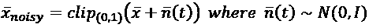

以这种方式，噪声图像总是被隐式归一化，假设值在范围(0，1)内:

```py
for e in range(nb_epochs):
        for xi in X_train_g:
            xn = np.clip(xi +
                  np.random.normal(
                   0.0, 0.2,
                   size=(batch_size, width, height, 1)),
                  0.0, 1.0)
            train(xn, xi)
        print("Epoch {}: Loss: {:.3f}".
              format(e + 1, train_loss.result()))
        train_loss.reset_states()
```

前面代码片段的输出是:

```py
Epoch 1: Loss: 0.146
Epoch 2: Loss: 0.100
…
Epoch 399: Loss: 0.002
Epoch 400: Loss: 0.002
```

考虑到这些模型的容量，看到最终损失几乎与标准自编码器相同也就不足为奇了。因此，我们可以确定任何噪声图像(基于具有单位方差/单位协方差矩阵的限幅高斯噪声)将被正确恢复。

下图中我们可以看到一些例子:

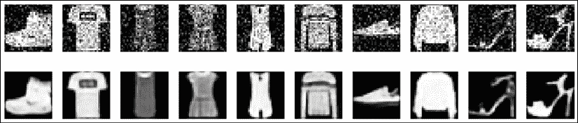

噪声图像(第一行)及其重建(第二行)

去噪自编码器已经成功地学会在高斯噪声存在的情况下重建原始图像(MAE 约等于 0.04，因此准确度约为 96%)。我邀请您测试其他方法(例如使用初始压降)并提高噪声水平，以了解这种模型可以有效消除的最大破坏是什么。

# 稀疏自编码器

一般来说，标准的自编码器产生密集的内部表示。这意味着大多数值不为零。然而，在某些情况下，拥有能够更好地表示属于字典的原子的稀疏代码更有用。在这种情况下，如果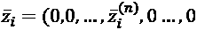、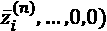，我们可以把每一个样品看作是特定原子的重叠，相应地进行加权。为了实现这个目标，我们可以简单地对代码层应用一个*L*1 罚值，如*第 2 章*、*损失函数和正则化*中所述。因此，单个样本的损失函数如下:

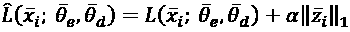

在这种情况下，我们需要考虑额外的超参数α，必须对其进行调整以增加稀疏度，而不会对精度产生负面影响。作为一般的经验法则，我建议从等于 0.01 的值开始，然后减小它，直到达到期望的结果。在大多数情况下，较高的值会产生很差的性能，因此通常避免使用。吴恩达提出了一种不同的方法(在 2011 年斯坦福机器学习讲义 Ng。一、*稀疏自编码器*，CS294A，斯坦福大学)。如果我们将代码层视为一组独立的伯努利随机变量，我们可以通过考虑具有非常低均值的通用参考伯努利变量(例如，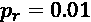)并将通用元素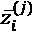和 *p* [r] 之间的 kull back–lei bler 散度添加到成本函数来加强稀疏性。对于单个样本，额外项如下(其中 *p* 为码长):

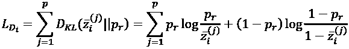

由此产生的损失函数如下:

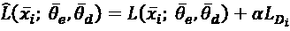

这种损失的效果类似于 *L* [1] (对于超参数具有相同的考虑)，但是许多实验已经证实，所得到的成本函数更容易优化，并且有可能实现达到更高重建精度的相同水平的稀疏度。当使用稀疏自编码器时，代码长度通常会更长，因为假设单个元素由少量原子组成(与字典大小相比)。因此，我建议您评估不同代码长度的稀疏程度，并选择最大化前者和最小化后者的组合。

## 为时尚的 MNIST 深度卷积自编码器添加稀疏性

在这个例子中，我们将把一个*L*1 正则化项添加到第一个练习中定义的成本函数中。由于我们仅使用 1，000 幅图像，我们更喜欢使用相当于 24 x 24 = 576 个值的更大的潜在代码。假设由于类别而部分重叠，我们期望最终的稀疏度比第一个例子中的稀疏度大得多，但是不低于最大长度的 10%(这对应于完美的聚类)。较小的值是不太可能的，并且需要更长、更完整的字典。事实上，考虑到特征的性质，许多不同的图像共享相同的细节(例如，衬衫和 t 恤或外套)，这导致最小密度可以通过仅利用一些深度模型的极限容量来降低，最终，在数据点之间获得几乎一对一的关联(例如，几乎没有任何泛化能力的训练集的完全过度拟合)。当然，这既不是我们的目标，也不是任何真正的深度学习任务的目的。

让我们从定义参数开始:

```py
nb_samples = 1000
nb_epochs = 400
batch_size = 200
code_length = 576
alpha = 0.1
```

此时，我们可以重新定义类，其中代码密集层多了一个系数为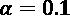的*L*1 正则化约束。这个值可以增加以引起更多的稀疏，但是由于解的次优性，结果将遭受质量损失。然而，由于该约束仅施加于有限数量的激活，因此其他权重有部分补偿误差并产生非常小的最终损失的空间:

```py
class SparseDAC(tf.keras.Model):
    def __init__(self):
        super(DAC, self).__init__()
        self.c1 = tf.keras.layers.Conv2D(
            filters=32,
            kernel_size=(3, 3),
            strides=(2, 2),
            activation=tf.keras.activations.relu,
            padding='same')
        self.c2 = tf.keras.layers.Conv2D(
            filters=64,
            kernel_size=(3, 3),
            activation=tf.keras.activations.relu,
            padding='same')
        self.c3 = tf.keras.layers.Conv2D(
            filters=128,
            kernel_size=(3, 3),
            activation=tf.keras.activations.relu,
            padding='same')
        self.flatten = tf.keras.layers.Flatten()
        self.dense = tf.keras.layers.Dense(
            units=code_length,
            activation=tf.keras.activations.sigmoid,
            activity_regularizer=
            tf.keras.regularizers.l1(alpha))
        self.dc0 = tf.keras.layers.Conv2DTranspose(
            filters=128,
            kernel_size=(3, 3),
            activation=tf.keras.activations.relu,
            padding='same')
        self.dc1 = tf.keras.layers.Conv2DTranspose(
            filters=64,
            kernel_size=(3, 3),
            activation=tf.keras.activations.relu,
            padding='same')
        self.dc2 = tf.keras.layers.Conv2DTranspose(
            filters=32,
            kernel_size=(3, 3),
            activation=tf.keras.activations.relu,
            padding='same')
        self.dc3 = tf.keras.layers.Conv2DTranspose(
            filters=1,
            kernel_size=(3, 3),
            activation=tf.keras.activations.relu,
            padding='same')
    def r_images(self, x):
        return tf.image.resize(x, (24, 24))
    def encoder(self, x):
        c1 = self.c1(self.r_images(x))
        c2 = self.c2(c1)
        c3 = self.c3(c2)
        code_input = self.flatten(c3)
        z = self.dense(code_input)
        return z
    def decoder(self, z):
        decoder_input = tf.reshape(z, (-1, 24, 24, 1))
        dc0 = self.dc0(decoder_input)
        dc1 = self.dc1(dc0)
        dc2 = self.dc2(dc1)
        dc3 = self.dc3(dc2)
        return dc3
    def call(self, x):
        code = self.encoder(x)
        xhat = self.decoder(code)
        return code, xhat
model = SparseDAC()
```

训练函数略有不同，因为模型输出代码和重构:

```py
@tf.function
def train(images):
    with tf.GradientTape() as tape:
        _, reconstructions = model(images)
        loss = tf.keras.losses.MSE(
            model.r_images(images), reconstructions)
    gradients = tape.gradient(
        loss, model.trainable_variables)
    optimizer.apply_gradients(
        zip(gradients, model.trainable_variables))
    train_loss(loss)
```

在训练过程(与第一个例子相同)之后，我们可以重新计算代码的平均值和标准偏差:

```py
codes = model.encoder(np.expand_dims(X_train, axis=3))
print("Code mean: {:.3f}".format(np.mean(codes)))
print("Code STD: {:.3f}".format(np.std(codes)))
```

前面代码片段的输出是:

```py
Code mean: 0.284
Code STD: 0.249
```

正如您所看到的，平均值现在更低了(具有几乎相同的标准偏差和最小的随机变化)，表明更多的代码值更接近于 0。我邀请您实现另一个策略，因为创建一个填充了小值(例如，0.01)的常量向量并利用 TensorFlow 提供的矢量化属性更容易。我还建议简化库尔巴克-莱布勒散度，把它分成一个熵项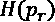(它是常数)和一个交叉熵项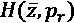。

# 变型自编码器

一个**变分自编码器(VAE)** 是由金玛和韦林(在他们的工作金玛 D. P .，韦林 m .，*自编码变分贝叶斯*，arXiv:1312.6114 [stat .ML])，它部分类似于标准的自编码器，但有一些基本的内部差异。事实上，目标不是找到数据集的编码表示，而是确定生成过程的参数，该过程能够在给定输入数据生成过程的情况下产生所有可能的输出。

让我们以基于可学习的参数向量和一组具有概率密度函数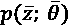的潜在变量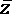的模型为例。因此，我们的目标可以定义为研究最大化边缘化分布可能性的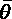参数(通过联合概率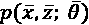的积分获得):

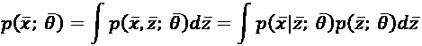

如果这个问题可以很容易地以封闭形式解决，那么从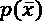数据生成过程中抽取的大量样本将足以为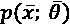找到一个很好的近似值。不幸的是，前面的表达式在大多数情况下是难以处理的，因为真实的先验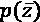是未知的(这是一个次要问题，因为我们可以很容易地做出一些有用的假设),并且后验分布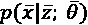几乎总是接近于零。第一个问题可以通过选择一个简单的先验来解决(最常见的选择是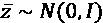)，但是第二个问题仍然非常困难，因为只有几个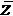值可以产生可接受的样本。当数据集非常高维和复杂时(例如，图像)，尤其如此。即使有数以百万计的组合，其中只有一小部分可以产生真实的样本(如果图像是汽车的照片，我们预计四个车轮在下部，但仍然有可能生成车轮在顶部的样本)。

为此，我们需要开发一种方法来减少样本空间。变分贝叶斯方法基于采用代理分布的思想，代理分布易于采样，并且在这种情况下，其密度非常高(即，产生合理输出的概率远高于真实后验概率)。在这种情况下，考虑到标准自编码器的架构，我们定义了近似后验概率。特别是，我们可以引入一个分布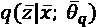作为编码器(它不再表现出确定性)，可以很容易地用神经网络建模。当然，我们的目标是找到最佳的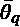参数集，以最大化 *q* 和真实后验分布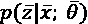之间的相似性。这个结果可以通过最小化 kull back-lei bler 散度来实现:


在最后一个公式中，术语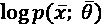不依赖于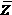，因此它可以从期望值运算符中提取，并且可以对表达式进行操作以简化它:

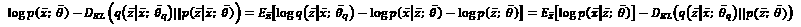

该等式也可以改写如下:


在右边，我们现在有了术语**ELBO**(**证据下限**的缩写)和概率编码器与真实后验分布之间的库尔贝克-莱布勒分歧。ELBO 是变分法中唯一需要的量(关于这种技术的更多细节，这超出了本书的范围，请参见 Bishop C. M .，*模式识别和机器学习，Springer* ，2011)。由于我们希望在参数化下最大化样本的对数概率，并考虑到 KL 散度总是非负的，我们只能使用 ELBO(这比其他术语更容易管理)。事实上，我们要优化的损失函数是负 ELBO。为了实现这一目标，我们需要两个更重要的步骤。

第一个是为选择合适的结构。由于假定是正态的，我们可以假定将建模为多元高斯分布，将概率编码器分成两个块，这两个块被馈送相同的较低层:

*   输出向量的均值生成器
*   协方差发生器(假设对角矩阵)，其输出向量，使得

以这种方式，，因此右手边的第二项是两个高斯分布之间的 Kullback-Leibler 散度，它可以很容易地表示如下( *p* 是均值和协方差向量的维数):


这个操作比预期的简单，因为是对角线，轨迹对应于元素和的和。

此时，最大化前一表达式的右侧相当于最大化对数概率的期望值以生成可接受的样本，并最小化正态先验和编码器合成的高斯分布之间的差异。现在一切似乎都简单多了，但还有一个问题需要解决。我们想要使用神经网络和随机梯度下降算法，因此我们需要可微分的函数。

由于 Kullback-Leibler 散度只能使用具有 *n* 个元素的小批量来计算(经过足够次数的迭代后，近似值变得更接近真实值)，因此有必要从分布中采样 n 个值，不幸的是，该操作是不可微的。为了解决这个问题，作者提出了一个重新参数化的技巧:我们可以从正态分布中采样，而不是从中采样，并将实际样本构建为。考虑到在批处理期间(正向和反向阶段)是一个恒定向量，很容易计算相对于前一表达式的梯度，并优化解码器和编码器。要考虑的最后一个元素是我们要最大化的表达式右侧的第一项:


这一项表示实际分布和重建分布之间的负交叉熵。正如第一节所讨论的，有两种可行的选择:高斯分布或伯努利分布。一般来说，VAEs 采用伯努利分布，输入样本和重建值限制在 0 和 1 之间。然而，许多实验已经证实 MSE 可以加快训练过程，因此我建议您测试这两种方法，并选择一种保证最佳性能的方法(在准确性和训练速度方面)。

## 带张量流的 VAE 示例

让我们继续使用时尚 MNIST 数据集来构建一个 VAE。第一步需要加载并规范化它:

```py
import tensorflow as tf
(X_train, _), (_, _) = \
    tf.keras.datasets.fashion_mnist.load_data()
X_train = X_train.astype(np.float32)[0:nb_samples] \
/ 255.0
width = X_train.shape[1]
height = X_train.shape[2]
```

如所解释的，编码器的输出现在被分成两个分量:均值和协方差向量(两者的维数都等于(宽度×高度))，并且解码器输入是通过从正态分布采样并投影代码分量而获得的。完整的模型类如下(所有参数与第一个示例相同，是所有其他示例的参考):

```py
class DAC(tf.keras.Model):
    def __init__(self, width, height):
        super(DAC, self).__init__()
	  self.width = width
        self.height = height
        self.c1 = tf.keras.layers.Conv2D(
            filters=32,
            kernel_size=(3, 3),
            strides=(2, 2),
            activation=tf.keras.activations.relu,
            padding='same')
        self.c2 = tf.keras.layers.Conv2D(
            filters=64,
            kernel_size=(3, 3),
            activation=tf.keras.activations.relu,
            padding='same')
        self.c3 = tf.keras.layers.Conv2D(
            filters=128,
            kernel_size=(3, 3),
            activation=tf.keras.activations.relu,
            padding='same')
        self.flatten = tf.keras.layers.Flatten()
        self.code_mean = tf.keras.layers.Dense(
            units=width * height)
        self.code_log_variance = tf.keras.layers.Dense(
            units=width * height)
        self.dc0 = tf.keras.layers.Conv2DTranspose(
            filters=63,
            kernel_size=(3, 3),
            strides=(2, 2),
            activation=tf.keras.activations.relu,
            padding='same')
        self.dc1 = tf.keras.layers.Conv2DTranspose(
            filters=32,
            kernel_size=(3, 3),
            strides=(2, 2),
            activation=tf.keras.activations.relu,
            padding='same')
        self.dc2 = tf.keras.layers.Conv2DTranspose(
            filters=1,
            kernel_size=(3, 3),
            padding='same')
    def r_images(self, x):
        return tf.image.resize(x, (32, 32))
    def encoder(self, x):
        c1 = self.c1(self.r_images(x))
        c2 = self.c2(c1)
        c3 = self.c3(c2)
        code_input = self.flatten(c3)
        mu = self.code_mean(code_input)
        sigma = self.code_log_variance(code_input)
        code_std = tf.sqrt(tf.exp(sigma))
        normal_samples = tf.random.normal(
            mean=0.0, stddev=1.0, 
            shape=(batch_size, width * height))
        z = (normal_samples * code_std) + mu
        return z, mu, code_std
    def decoder(self, z):
        decoder_input = tf.reshape(z, (-1, 7, 7, 16))
        dc0 = self.dc0(decoder_input)
        dc1 = self.dc1(dc0)
        dc2 = self.dc2(dc1)
        return dc2, tf.keras.activations.sigmoid(dc2)
    def call(self, x):
        code, cm, cs = self.encoder(x)
        logits, xhat = self.decoder(code)
        return logits, cm, cs, xhat
```

该结构非常类似于标准深度自编码器，但是，在这种情况下，编码器执行两个额外的步骤:

1.  来自正态分布的样本
2.  执行转换(在代码中，使用标准偏差，而不是方差；因此，没有必要平方第二项)

解码器输出重构(经 a `sigmoid`滤波)和`logits`(即应用`sigmoid`之前的值)。这有助于定义损失函数:

```py
optimizer = tf.keras.optimizers.Adam(0.001)
train_loss = tf.keras.metrics.Mean(name='train_loss')
@tf.function
def train(images):
    with tf.GradientTape() as tape:
        logits, cm, cs, _ = model(images)
        loss_r = \
            tf.nn.sigmoid_cross_entropy_with_logits(
            logits=logits, labels=images)
        kl_divergence = 0.5 * tf.reduce_sum(
            tf.math.square(cm) + tf.math.square(cs) -
            tf.math.log(1e-8 + tf.math.square(cs)) - 1, 
            axis=1)
        loss = tf.reduce_sum(loss_r) + kl_divergence
    gradients = tape.gradient(
        loss, model.trainable_variables)
    optimizer.apply_gradients(
        zip(gradients, model.trainable_variables))
    train_loss(loss)
```

如您所见，训练功能的唯一区别是:

*   使用 sigmoid 交叉熵作为重建损失(这在数值上比直接计算更稳定)
*   作为正则项的 Kullback-Leibler 散度的存在

训练过程与本章第一个例子非常相似，因为采样操作是由 TensorFlow 直接执行的。为简单起见，整个训练块在下面的代码片段中报告:

```py
model = DAC(width, height)
X_train_g = tf.data.Dataset.\
        from_tensor_slices(
        np.expand_dims(X_train, axis=3)).\
        shuffle(1000).batch(batch_size)
for e in range(nb_epochs):
for xi in X_train_g:
            train(xi)
        print("Epoch {}: Loss: {:.3f}".
              format(e + 1, train_loss.result()))
        train_loss.reset_states()
```

前面代码片段的输出是:

```py
Epoch 1: Loss: 102563.508
Epoch 2: Loss: 82810.648
…
Epoch 399: Loss: 38469.824
Epoch 400: Loss: 38474.977
```

400 个历元后的结果如下图所示:


原始图像(第一行)及其重建图像(第二行)

重建的质量在视觉上优于标准深度自编码器，与后者相反，许多次要细节也已成功重建。

在本示例和前面的示例中，由于 TensorFlow 随机种子(默认值为 1000)，结果可能略有不同。即使没有显式采样，神经网络的初始化也需要许多采样步骤，从而导致适度不同的初始配置。

作为练习，我邀请读者使用 RGB 数据集(如 Cifar-10，可在[https://www.cs.toronto.edu/~kriz/cifar.html](https://www.cs.toronto.edu/~kriz/cifar.html)找到)通过将输出样本与从原始分布中抽取的样本进行比较来测试 VAE 的生成能力。

# 摘要

在这一章中，我们介绍了作为无监督模型的自编码器，它可以学习用低维代码表示高维数据集。它们被构造成两个独立的块(然而，它们被一起训练):编码器，负责将输入样本映射到内部表示；以及解码器，必须执行相反的操作，从代码开始重建原始图像。

我们还讨论了如何使用自编码器对样本进行降噪，以及如何对代码层施加稀疏性约束，以类似于标准字典学习的概念。最后一个话题是关于一个稍微不同的模式，叫做 VAE。这个想法是建立一个生成模型，能够重现属于一个训练分布的所有可能的样本。

在下一章中，我们将简要介绍一个非常重要的模型家族，称为**生成对抗网络** ( **GANs** )，它与 VAE 的目的没有太大的不同，但是它有一个更加灵活的方法。

# 延伸阅读

*   Vincent P .、Larochelle H .、Lajoie I .、Bengio Y .、Manzagol P .、*堆叠去噪自编码器:利用局部去噪标准学习深度网络中的有用表示*，《机器学习研究杂志》，2010 年 11 月
*   Ng。一、稀疏自编码器，CS294A，*机器学习讲义，斯坦福大学*，2011
*   金玛 D. P .，韦林 m .，*自编码变分贝叶斯*，arXiv:1312.6114【统计。ML]
*   Holdroyd T .， *TensorFlow 2.0 快速入门指南*，Packt 出版，2019
*   Bishop C. M .，*模式识别和机器学习*，斯普林格，2011
*   Goodfellow I .，Bengio Y .，*库维尔 a .，*深度学习，麻省理工学院出版社，2016
*   Bonaccorso G .，*机器学习算法第二版*，Packt 出版，2018