# 二十二、生成对抗网络简介

在这一章中，我们将提供一个基于一些博弈论概念的生成模型家族的简要介绍。他们的主要特点是一个对抗性的训练程序，旨在学习区分真假样本，同时驱动另一个组件，生成与训练样本越来越相似的样本。

特别是，我们将讨论:

*   **对抗训练和标准生成对抗网络** ( **甘斯**
*   **深度卷积 gan**(**dcgan**)
*   瓦瑟斯坦·甘斯

我们现在可以介绍神经模型的对抗性训练的概念，它与博弈论的联系及其在 GANs 中的应用。

# 对抗性训练

对抗训练的绝妙想法，由古德费勒等人提出(载于古德费勒 I. J .、普热-阿巴迪 j .、米尔扎 m .、徐 b .、沃德-法利 d .、奥泽尔 s .、本吉奥 y .，*生成对抗网络，* arXiv:1406.2661【统计。ML]–虽然这个想法至少在理论上已经被其他作者讨论过，但它带来了新一代的生成模型，并立即超越了大多数现有算法。所有衍生的模型都基于相同的对抗性训练的基本概念，这是一种部分受博弈论启发的方法。

假设我们有一个数据生成过程，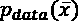，它代表实际的数据分布和有限数量的数据点，我们假设这些数据点是从*p*数据中提取的:

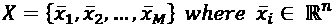

我们的目标是训练一个叫做生成器的模型，它的分布必须尽可能接近*p*数据。这是算法中最棘手的部分，因为对抗训练不是标准方法(例如，变化的自编码器)，而是基于两个玩家之间的极大极小游戏(我们可以简单地说，给定一个目标，两个玩家的目标是最小化最大可能的损失，但在这种情况下，他们每个人都在不同的参数上工作)。一个参与者是生成器，我们可以将其定义为噪声样本的参数化函数:

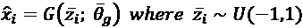

向发生器馈送噪声向量(在这种情况下，我们采用了均匀分布，但是没有特别的限制；所以我们就简单的说是从随机噪声分布*p*noise 中抽取的，输出一个与从*p*data 中抽取的样本具有相同维数的值。在没有任何进一步控制的情况下，生成器分布将与数据生成过程完全不同，但这是另一个玩家进入场景的时刻。第二个模型称为鉴别器(或评论家)，它负责评估从 *p* [数据]中抽取的样本和生成器产生的样本:

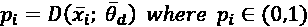

该模型的作用是输出一个概率，该概率必须反映样本是从*p*T42【数据】中提取的，而不是由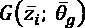生成的。发生的事情非常简单:第一个播放器(生成器)输出一个样本，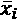。如果 *x* 实际上属于*p*数据，鉴别器将输出一个接近 1 的值，而如果它与其他真实样本非常不同，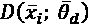将输出一个非常低的概率。这个游戏的真正结构是基于这样一个想法，即训练生成器通过产生可能从*p*数据中提取的样本来欺骗鉴别器。当 *x* 是真实样本(从*p*p[数据]中提取)时，通过尝试最大化对数概率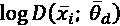，同时最小化对数概率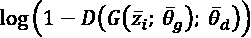，从噪声分布中采样，可以实现该结果。

第一个操作迫使鉴别器越来越多地意识到真实样本(这个条件是必要的，以避免太容易被欺骗)。

第二个目标稍微复杂一点，因为鉴别器必须评估一个样品是否可以接受。我们假设生成器不够智能，输出了一个不可能属于 *p* [数据]的样本。由于鉴别器正在学习如何构造*p*数据，它将很快区分错误的样本，输出低概率。因此，通过最小化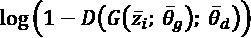，当样本与从*[数据]中提取的样本非常不同时，我们迫使鉴别器变得越来越重要，并且发生器变得越来越能够产生可接受的样本。另一方面，如果生成器输出属于数据生成过程的样本，则鉴别器将输出高概率，并且最小化退回到先前的情况。*

 *作者使用共享值函数 *V* ( *G* ， *D* )来表示这个极大极小游戏，该函数必须由生成器最小化，由鉴别器最大化:

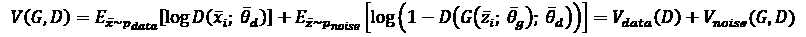

这个公式代表了两个参与者之间的非合作博弈的动力学(要了解更多信息，请参考塔德利斯 s .，*博弈论，*普林斯顿大学出版社，2013)，理论上承认一种特殊的配置，称为纳什均衡，可以描述为如果两个参与者知道彼此的策略，如果另一个参与者不知道，他们没有理由改变自己的策略。

在这种情况下，鉴别者和生成者都将继续他们的策略，直到不需要改变，达到最终的稳定配置，这可能是一个纳什均衡(即使有许多因素可以阻止达到这一目标)。一个常见的问题是鉴别器的过早收敛，这迫使梯度消失，因为损失函数在接近 0 的区域变得平坦。由于这是一个游戏，一个基本的条件是提供信息的可能性，以允许玩家进行更正。如果鉴别器太快地学会了如何从假样本中分离出真样本，发生器的收敛速度就会变慢，玩家可能会被困在次优配置中。

一般来说，当分布相当复杂时，鉴别器比发生器慢；但在某些情况下，在每次更新鉴别器后，有必要更新生成器更多次。不幸的是，没有经验法则；但是，例如，当处理图像时，有可能观察到在足够多的迭代之后生成的样本。如果鉴频器损耗变得非常小，样本出现损坏或不一致，这意味着发生器没有足够的时间来学习分布，因此有必要降低鉴频器的速度。

作者(在上述论文中)表明，给定一个以分布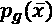为特征的生成器，最佳鉴别器为:

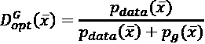

此时，考虑到先前的值函数 *V* ( *G* ， *D* )并使用最佳鉴别器，我们可以在生成器必须最小化的单个目标(作为 *G* 的函数)中重写它:

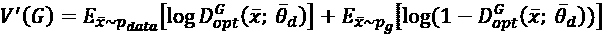

为了更好地理解 GAN 的工作原理，我们需要扩展前面的表达式:

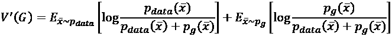

应用一些简单的操作，我们得到以下结果:

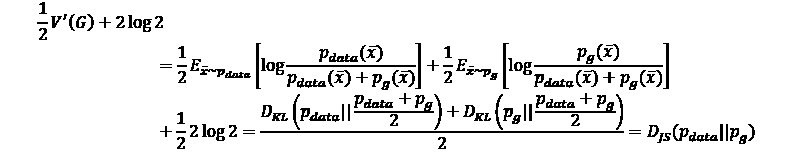

最后一项表示*p*数据和*p*g 之间的詹森-香农散度。这种度量类似于 Kullback-Leibler 散度，但它是对称的，并且限制在 0 和 log 2 之间。当两个分布相同时， *D* [JS] = 0，但如果它们的支集(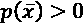所在的值集)不相交， *D* [ JS ] = log 2(而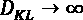)。因此，价值函数可以表示为:

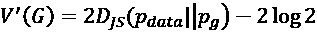

现在，应该更清楚的是 GAN 试图最小化数据生成过程和生成器分布之间的 Jensen-Shannon 分歧。总的来说，这个程序相当有效；然而，当支撑不相交时，GAN 没有关于真实距离的信息。

这种考虑(在 Salimans T .、Goodfellow I .、Zaremba W .、Cheung V .、a .、Chen X .、的《训练 GANs 的改进技术》中进行了更精确的数学分析)arXiv:1606.03498【cs .LG])解释了为什么训练 GAN 会变得非常困难，以及为什么在许多情况下无法找到纳什均衡。出于这些原因，我们将在下一节分析一种替代方法。

完整的 GAN 算法(由作者提出)为:

1.  设置历元数， *N* [历元]。
2.  设置鉴别器迭代次数， *N* [iter] (大多数情况下， *N* [iter] = 1)。
3.  设置批量大小， *k* 。
4.  定义一个产生噪声的进程， *N* (例如， *N* = *U* (-1，1))。
5.  For *e* = 1 to *N*[epochs]:
    1.  从 *X* 中采样 *k* 值。
    2.  从 *N* 中采样 *k* 值。
    3.  对于 *i* = 1 到 *N* [iter] :
        1.  计算梯度，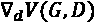(仅针对鉴别器变量)。期望值是样本平均值的近似值。
        2.  通过随机梯度上升更新鉴别器参数(因为我们使用对数，所以可以最小化负损失)。
    4.  从 *N* 中采样 *k* 值。
    5.  计算梯度，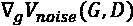(仅关于发电机变量)。
    6.  通过随机梯度下降更新发电机参数。

        由于这些模型需要对噪声向量进行采样，以保证再现性，我建议在 NumPy ( `np.random.seed(...)`)和 TensorFlow ( `tf..random.set_seed(...)`)中设置随机种子。所有这些实验选择的默认值是 1，000。

        

    # 深度卷积 GANs

    ```
    import tensorflow as tf
    import numpy as np
    nb_samples = 5000
    (X_train, _), (_, _) = \
            tf.keras.datasets.fashion_mnist.load_data()
    X_train = X_train.astype(np.float32)[0:nb_samples]/255.0
    X_train = (2.0 * X_train) - 1.0
    width = X_train.shape[1]
    height = X_train.shape[2]
    code_length = 100
    generator = tf.keras.models.Sequential([
        tf.keras.layers.Conv2DTranspose(
            input_shape=(1, 1, code_length),
            filters=1024,
            kernel_size=(4, 4),
            padding='valid'),
        tf.keras.layers.BatchNormalization(),
        tf.keras.layers.LeakyReLU(),
        tf.keras.layers.Conv2DTranspose(
            filters=512,
            kernel_size=(4, 4),
            strides=(2, 2),
            padding='same'),
        tf.keras.layers.BatchNormalization(),
        tf.keras.layers.LeakyReLU(),
        tf.keras.layers.Conv2DTranspose(
            filters=256,
            kernel_size=(4, 4),
            strides=(2, 2),
            padding='same'),
        tf.keras.layers.BatchNormalization(),
        tf.keras.layers.LeakyReLU(),
        tf.keras.layers.Conv2DTranspose(
            filters=128,
            kernel_size=(4, 4),
            strides=(2, 2),
            padding='same'),
        tf.keras.layers.BatchNormalization(),
        tf.keras.layers.LeakyReLU(),
        tf.keras.layers.Conv2DTranspose(
            filters=1,
            kernel_size=(4, 4),
            strides=(2, 2),
            padding='same',
            activation='tanh')
    ])
    discriminator = tf.keras.models.Sequential([
        tf.keras.layers.Conv2D(
            input_shape=(64, 64, 1),
            filters=128,
            kernel_size=(4, 4),
            strides=(2, 2),
            padding='same'),
        tf.keras.layers.LeakyReLU(),
        tf.keras.layers.Conv2D(
            filters=256,
            kernel_size=(4, 4),
            strides=(2, 2),
            padding='same'),
        tf.keras.layers.BatchNormalization(),
        tf.keras.layers.LeakyReLU(),
        tf.keras.layers.Conv2D(
            filters=512,
            kernel_size=(4, 4),
            strides=(2, 2),
            padding='same'),
        tf.keras.layers.BatchNormalization(),
        tf.keras.layers.LeakyReLU(),
        tf.keras.layers.Conv2D(
            filters=1024,
            kernel_size=(4, 4),
            strides=(2, 2),
            padding='same'),
        tf.keras.layers.BatchNormalization(),
        tf.keras.layers.LeakyReLU(),
        tf.keras.layers.Conv2D(
            filters=1,
            kernel_size=(4, 4),
            padding='valid')
    ])
    p = tf.math.sigmoid(discriminator(x, training=False))
    def run_generator(z, training=False):
        zg = tf.reshape(z, (-1, 1, 1, code_length))
        return generator(zg, training=training)
    def run_discriminator(x, training=False):
        xd = tf.image.resize(x, (64, 64))
        return discriminator(xd, training=training)
    optimizer_generator = \
        tf.keras.optimizers.Adam(0.0002, beta_1=0.5)
    optimizer_discriminator = \
        tf.keras.optimizers.Adam(0.0002, beta_1=0.5)
    train_loss_generator = \
        tf.keras.metrics.Mean(name='train_loss')
    train_loss_discriminator = \
        tf.keras.metrics.Mean(name='train_loss')
    @tf.function
    def train(xi):
        zn = tf.random.uniform(
            (batch_size, code_length), -1.0, 1.0)
        with tf.GradientTape() as tape_generator, \
                tf.GradientTape() as tape_discriminator:
            xg = run_generator(zn, training=True)
            zd1 = run_discriminator(xi, training=True)
            zd2 = run_discriminator(xg, training=True)
            loss_d1 = tf.keras.losses.\
                BinaryCrossentropy(from_logits=True)\
                (tf.ones_like(zd1), zd1)
            loss_d2 = tf.keras.losses.\
                BinaryCrossentropy(from_logits=True)\
                (tf.zeros_like(zd2), zd2)
            loss_discriminator = loss_d1 + loss_d2
            loss_generator = tf.keras.losses.\
                BinaryCrossentropy(from_logits=True)\
                (tf.ones_like(zd2), zd2)
        gradients_generator = \
            tape_generator.gradient(
            loss_generator,
            generator.trainable_variables)
        gradients_discriminator = \
            tape_discriminator.gradient(
            loss_discriminator,
            discriminator.trainable_variables)
        optimizer_discriminator.apply_gradients(
            zip(gradients_discriminator,
                discriminator.trainable_variables))
        optimizer_generator.apply_gradients(
            zip(gradients_generator,
                generator.trainable_variables))
        train_loss_discriminator(loss_discriminator)
        train_loss_generator(loss_generator)
    nb_epochs = 100
    batch_size = 128
    x_train_g = tf.data.Dataset.from_tensor_slices(
            np.expand_dims(X_train, axis=3)).\
            shuffle(1000).batch(batch_size)
    for e in range(nb_epochs):
    for xi in x_train_g:
          		train(xi)
            	print("Epoch {}: "
                    "Discriminator Loss: {:.3f}, "
                    "Generator Loss: {:.3f}".
                     format(e + 1,
                         train_loss_discriminator.result(),
                         train_loss_generator.result()))
    train_loss_discriminator.reset_states()
    train_loss_generator.reset_states()
    Z = np.random.uniform(-1.0, 1.0, 
                          size=(50, code_length)).\
            astype(np.float32)
    Ys = run_generator(Z, training=False)
    Ys = np.squeeze((Ys + 1.0) * 0.5 * 255.0).\
            astype(np.uint8)
    ```

    结果(取决于随机种子)如下图所示:

    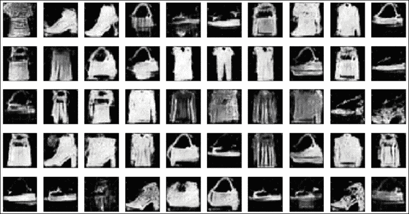

    由用时尚-MNIST 数据集训练的 DCGAN 生成的样本

    作为一个练习，我邀请读者采用更复杂的卷积架构和一个 RGB 数据集，如 CIFAR-10([https://www.cs.toronto.edu/~kriz/cifar.html](https://www.cs.toronto.edu/~kriz/cifar.html))。

    ## 模式崩溃

    我们已经看到，GAN 是一个生成模型，它学习复制数据生成过程*p*数据。在最好的情况下，根据预定义的度量(例如，Kullback-Leibler 散度)，人工分布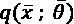足够接近 *p* [数据]。然而，不幸的是，这种情况通常是不可能实现的，并且 GAN 学习到的分布仅部分重叠到数据生成过程上。从一般的观点来看，差异可能有两个不同的方面:

    *   这两种分布在许多地区有所不同；因此，GAN 不能输出任何正确的例子。
    *   这两种分布在单个区域内有很强的重叠。

    在第一种情况下，模型明显不足，有必要增加其容量并调整学习算法以实现更好的性能。在第二种情况下，GAN 反而停留在高概率区域，并丢弃所有剩余的区域。这种特殊的现象被称为模式崩溃，这是影响这些模型的常见问题。给定一个分配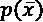，模式为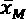对应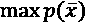。例如，正态分布是单峰的，众数显然是 *x* = 0。相反，高斯混合是一种多模态分布，其中所有局部最大值都与不同模态相关联，如下图所示:

    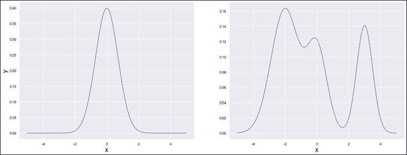

    单峰分布(左)。多模态分布(右)

    从统计学的角度来看，一个模式很可能是一个数据点，因此 GAN 学会以很高的概率输出它(及其所有邻居)就不足为奇了。然而，真实世界的数据分布是多模态的，并且知道模态在哪里也是极其困难的(或者不可能的)。因此，只学会复制 *p* [数据]的一个区域的 GAN 在小的子空间中崩溃，失去了输出其他样本的能力。不幸的是，即使已经发现并研究了模式坍缩，也没有显式的解决方案。具有更灵活的距离函数的模型(例如我们将在下一节中研究的模型)可以缓解这个问题并降低其概率。然而，GANs 的使用应该总是包括一个大规模的测试阶段，以检查数据生成过程中是否有任何区域完全缺失。

    测试并不简单，但在某些情况下(例如图像)，可以从 GAN 中采样许多值，测量它们的频率，并与预期值进行比较。例如，如果我们知道时尚-MNIST 数据集有 10 个不同的类。在训练 GAN 并对 1，000 幅图像进行采样之后，我们应该预计每个类大约有 100 幅图像。例如，如果所有图像都是鞋子或鞋子完全丢失，则意味着 GAN 已经崩溃。在第一种情况下，效果是戏剧性的，这可能是由于糟糕的洗牌，阶级不平衡，或非常低的能力。因此，最简单的解决方案是检查数据集，如果它完全平衡，就增加模型的容量。在第二个案例中，问题更加棘手，因为一个特定的类完全缺失了。如果所有其他图像都被正确再现，则问题可能取决于单元的过度专门化。

    例如，卷积生成器可以变得越来越专业化，只输出衬衫和其他类似的形状。这是一种过拟合(即使相对于训练集的精度没有饱和)，并且一种潜在的缓解策略是基于丢弃层或其他正则化技术的使用。特别是，即使容量非常大，辍学也能够限制过度专业化，应作为首选。层正则化也是一种合理的方法，但是它增加了计算的复杂性，并且可能只产生次优的结果。

    另一方面，当发生器在一个模式附近崩溃时，提供给鉴别器的信息将变得非常有限，并且它将因此失去能够在噪声和其他有效类别之间进行鉴别的机会。压差的使用(也在鉴别器中)可能有助于留下一些自由容量，可用于限制过拟合。这样，梯度被迫更慢地消失，双反馈发生器→鉴别器(反之亦然)可以在更长时间内有效。这显然不是一个通用的解决方案(问题非常复杂)，但这是一个在与 GANs 合作时应该记住的策略，因为与其他模型相反，它们可能会以不容易立即验证的方式失败。

    # 甘

    如前部分所述，标准 GANs 最困难的问题之一是由基于 Jensen-Shannon 散度的损失函数引起的，当两个分布具有不连续的支持时，损失函数的值变成常数。对于高维、语义结构化的数据集，这种情况很常见。例如，图像被限制为具有特定的特征，以表示特定的主题(这是第 3 章、*半监督学习介绍*中讨论的多种假设的结果)。初始生成器分布不太可能与真实数据集重叠，而且在许多情况下，它们彼此之间也相距甚远。这种情况增加了学习错误表示的风险(称为模式崩溃的问题)，即使鉴别器能够区分真实和生成的样本(当鉴别器相对于生成器学习太快时，这种情况出现)。此外，纳什均衡变得更难实现，GAN 很容易在次优配置中保持阻塞。

    为了缓解这个问题，Arjovsky、Chintala 和 Bottou(在 Arjovsky M .、Chintala S .、Bottou L .、 *Wasserstein GAN* 、arXiv:1701.07875【统计。ML])建议采用一种不同的散度，称为 Wasserstein 距离(或推土机距离)，其正式定义如下:

    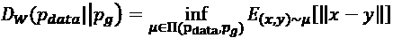

    术语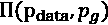表示*p*数据和*p*g 之间所有可能的联合概率分布的集合。因此，Wasserstein 距离是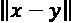的期望值集合的下确界(考虑所有联合分布)，其中 *x* 和 *y* 是从联合分布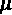中采样的。

    当对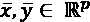表示例如从像 Word2Vec/Doc2Vec 这样的算法获得的单词嵌入时，也可以直接使用 Wasserstein 距离(关于进一步的细节，参见 Mikolov T .、Sutskever I .、Chen K .、Corrado G. S .、Dean J .、*单词和短语的分布式表示及其组成性。神经信息处理系统的进展，* arXiv:1310.4546)或 fastText (Bojanowski P .，Grave E .，Joulin A .，Mikolov T .，*用子词信息丰富词向量，*arXiv:1607.04606【cs .CL])。使用这些算法，文本的单词(或者还有 *n-grams* )被转换成高维向量，其距离与单词/句子的实际语义距离成比例。因此，GAN 可以被训练来生成从语义上可接受的分布中采样的单词序列(例如，“苹果是水果”和“汽车是水果”应该被认为是从不同的分布中提取的，即使它们的组成非常相似)。

    这个话题很有趣，同时也很复杂。事实上，如果一个轻微损坏的图像不能被人眼检测到(或者仅仅被认为是一个正常的图像)，一个有语义错误的句子几乎总是立即被识别为有缺陷的。因此，为了保证可靠的结果，这些模型必须用非常大的语料库进行训练(即使使用预先训练的向量，如基于维基百科的 fastText)。

    Wasserstein 距离的主要性质是，即使两个分布具有不连续的支持，其值也与实际分布距离成比例。形式证明不是很复杂，但是更容易直观理解概念。事实上，给定两个支持度不连续的分布，下确界算子强制在每对可能的样本之间取最短的距离。显然，这种方法比詹森-香农散度更稳健，但是有一个实际的缺点:它非常难以计算。由于我们无法处理所有可能的联合分布(也无法处理近似值)，因此有必要采取进一步措施来使用这个损失函数。在上述论文中，作者证明了应用变换是可能的，这归功于 Kantorovich-Rubinstein 定理(该主题相当复杂，但读者可以在 Edwards D. A .、*关于 Kantorovich-Rubinstein 定理、* Expositiones Mathematicae，2011)中找到更多信息*:*

    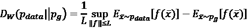

    首先要考虑的是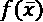的性质。该定理要求只考虑 L-Lipschitz 函数，这意味着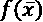(假设定义在集合 *D* 上的单变量的实值函数)必须遵守:

    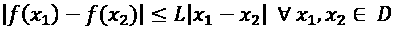

    此时，Wasserstein 距离与两个期望值之差的上确界(关于所有 L-Lipschitz 函数)成比例，这非常容易计算。在 WGAN 中，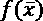函数由神经网络表示；因此，我们对 Lipschitz 条件没有任何保证。为了解决这个问题，作者建议了一个非常简单的程序:裁剪鉴别器(通常称为 critic)，其职责是在应用校正后表示参数化函数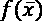变量。如果输入是有界的，所有的变换将产生有界的输出；然而，削波因子必须足够小(0.01，甚至更小)，以避免多次运算的叠加效应导致 Lipschitz 条件的反转。

    这不是一个有效的解决方案(因为它在不必要的时候减慢了训练过程)，但是它允许利用 Kantorovich-Rubinstein 定理，即使没有对函数族施加正式的约束。

    使用参数化函数(如深度卷积网络)，Wasserstein 距离变为如下(省略项 *L* ，它是常数):

    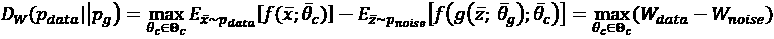

    在前面的表达式中，我们显式提取了生成器输出，在最后一步中，分离出将要单独优化的项。读者可能已经注意到计算比标准 GAN 简单，因为在这种情况下，我们只需对一批的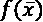值求平均值(不再需要对数)。然而，由于 Critic 变量被剪裁，所需的迭代次数通常会更大，为了补偿 Critic 和 generator 的训练速度之间的差异，通常需要设置 *N* [ critic ] > 1(作者建议值等于 5，但这是一个必须在每个特定上下文中调整的超参数)。

    完整的 WGAN 算法是:

    1.  设置历元数， *N* [历元]。
    2.  设置批评家迭代次数， *N* [批评家](大多数情况下， *N* [批评家] = 5)。
    3.  设置批量大小， *k* 。
    4.  设置一个限幅常数 *c* (例如 *c* = 0.01)。
    5.  定义一个产生噪声的进程 *N* (例如 *N* = *U* (-1，1))。
    1.  对于 *e* = 1 到 *N* [历元]:
        1.  从 *X* 中采样 *k* 值。
        2.  从 *N* 中采样 *k* 值。
        3.  对于 *i* = 1 到 *N* [评论家]:
            1.  计算梯度，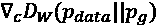(仅针对 Critic 变量)。期望值是样本平均值的近似值。
            2.  通过随机梯度上升更新 Critic 参数。
            3.  在范围( *-c* 、 *c* )内裁剪 Critic 参数。
        4.  从 *N* 中采样 *k* 值。
        5.  计算梯度，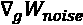(仅关于发电机变量)。
        6.  通过随机梯度下降更新发电机参数。

    ```
    def run_model(xi, zn, training=True):
        xg = run_generator(zn, training=training)
        zc1 = run_critic(xi, training=training)
        zc2 = run_critic(xg, training=training)
        loss_critic = tf.reduce_mean(zc2 - zc1)
        loss_generator = tf.reduce_mean(-zc2)
        return loss_critic, loss_generator
    import tensorflow as tf
    optimizer_generator = \
        tf.keras.optimizers.Adam(
            0.00005, beta_1=0.5, beta_2=0.9)
    optimizer_critic = \
        tf.keras.optimizers.Adam(
            0.00005, beta_1=0.5, beta_2=0.9)
    train_loss_generator = \
        tf.keras.metrics.Mean(name='train_loss')
    train_loss_critic = \
        tf.keras.metrics.Mean(name='train_loss')
    @tf.function
    def train_critic(xi):
        zn = tf.random.uniform(
            (batch_size, code_length), -1.0, 1.0)
        with tf.GradientTape() as tape:
            loss_critic, _ = run_model(xi, zn,
                                       training=True)
        gradients_critic = tape.gradient(
            loss_critic,
            critic.trainable_variables)
        optimizer_critic.apply_gradients(
            zip(gradients_critic,
                critic.trainable_variables))
        for v in critic.trainable_variables:
            v.assign(tf.clip_by_value(v, -0.01, 0.01))
        train_loss_critic(loss_critic)
    @tf.function
    def train_generator():
        zn = tf.random.uniform(
            (batch_size, code_length), -1.0, 1.0)
        xg = tf.zeros((batch_size, width, height, 1))
        with tf.GradientTape() as tape:
            _, loss_generator = run_model(xg, zn,
                                          training=True)
        gradients_generator = tape.gradient(
            loss_generator,
            generator.trainable_variables)
        optimizer_generator.apply_gradients(
            zip(gradients_generator,
                generator.trainable_variables))
        train_loss_generator(loss_generator)
    nb_samples = 10240
    nb_epochs = 100
    nb_critic = 5
    batch_size = 64
    code_length = 256
    x_train = tf.data.Dataset.from_tensor_slices(
            np.expand_dims(X_train, axis=3)).\
            shuffle(1000).batch(nb_critic * batch_size)
    for e in range(nb_epochs):
        for xi in x_train:
                for i in range(nb_critic):
                    train_critic(xi[i * batch_size:
                                    (i + 1) * batch_size])
                train_generator()
            print("Epoch {}: "
                  "Critic Loss: {:.3f}, "
                  "Generator Loss: {:.3f}".
                  format(e + 1, 
                         train_loss_critic.result(), 
                         train_loss_generator.result()))
            train_loss_critic.reset_states()
            train_loss_generator.reset_states()
    ```

    在本例中，我们决定采用更大的训练集(10，240 张图像)，批量大小等于 64，每次迭代有 5 个评价步骤。我邀请读者采用一个更大的训练集(当然，计算成本将成比例增长)，并且测试不同数量的 critical 步骤。在这种情况下，最佳选择基于原始论文。然而，找到合适值的简单方法是在训练期间监控两个损失。如果发生器的收敛速度比批判器快得多(即非常快地稳定到一个稳定值)，则 *n* [批判器]必须增加。

    理想情况下，两个组件应该具有相同的训练速度，以便保证从评论家到生成器的恒定信息流(取决于梯度的大小),反之亦然。如果后者过早停止修改变量，发生器将停止接收信息以提高 *p* [数据]的再现质量，GAN 将可能达到模式崩溃。另一方面，一个非常大的 *n* [critic] 值可能会迫使模型在发生器达到令人满意的精度之前对 critic 进行过度专门化，从而导致 GAN 性能非常差。

    生成 50 个随机样本的结果显示在下面的屏幕截图中:

    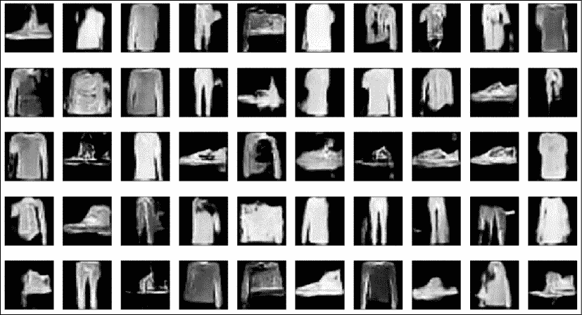

    由用时尚-MNIST 数据集训练的 WGAN 生成的样本

    正如我们所看到的，质量略高于 DCGAN，样品更光滑，清晰度更好。我邀请读者也用 RGB 数据集来测试这个模型，因为最终的质量通常是非常好的(训练时间相应地更长)。

    使用这些模型时，训练时间可能会很长。为了避免等待看到初始结果(并执行所需的调优)，我建议使用 Jupyter。通过这种方式，可以停止学习过程，检查发电机能力，并在没有任何问题的情况下重新启动它。当然，图表必须保持不变，变量初始化(在 TensorFlow 2 中，在定义模型时发生)必须只在开始时执行。

    # 总结

    在这一章中，我们讨论了对抗性训练的主要原则，并解释了两个参与者的角色:生成者和鉴别者。我们描述了如何使用 minimax 方法对它们进行建模和训练，该方法的双重目标是迫使生成器学习真实数据分布*p*T2 数据，并让鉴别器完美地区分真实样本(属于*p*数据)和不可接受的样本。在同一部分中，我们分析了 GAN 的内部动态以及一些常见问题，这些问题可能会减慢训练过程并导致次优的最终配置。

    标准 GANs 遇到的最困难的问题之一是，当数据生成过程和发电机分布支持脱节时。在这种情况下，Jensen-Shannon 散度变得恒定，并且不提供关于距离的精确信息。Wasserstein 方法提供了一个很好的选择，它被用于一个更有效的模型，称为 WGAN。这种方法可以有效地处理不连续的分布，但需要在 critical 上施加 L-Lipschitz 条件。标准方法是基于在每次梯度上升更新之后剪裁参数。这种简单的技术保证了 L-Lipschitz 条件，但必须使用非常小的削波系数，这会导致转换速度变慢。由于这个原因，在每个单独的生成器训练步骤之前，通常有必要重复训练批评家固定的次数(比如五次)。

    在下一章中，我们将介绍另一种概率生成神经模型，它基于一种特殊的神经网络，称为受限玻尔兹曼机。

    # 延伸阅读

    *   Goodfellow I. J .、Pouget-Abadie J .、Mirza M .、Xu B .、Warde-Farley D .、Ozair S .、Bengio Y .、*生成对抗性网络*、arXiv:1406.2661【stat .ML]
    *   塔德利斯 s .，*博弈论*，普林斯顿大学出版社，2013
    *   拉德福德 a .，梅斯 l .，钦塔拉 s .，*深度卷积生成对抗网络的无监督表示学习*，arXiv:1511.06434【cs .LG]
    *   Salimans T .、Goodfellow I .、Zaremba W .、Cheung V .、a .和 Chen X .，*训练 GANs 的改进技术*，arXiv:1606.03498 [cs .LG]
    *   Arjovsky M .、Chintala S .、Bottou L .、 *Wasserstein GAN* 、arXiv:1701.07875【统计。ML]
    *   Edwards D. A .，*关于 Kantorovich-Rubinstein 定理，数学阐述*，2011
    *   Holdroyd T .， *TensorFlow 2.0 快速入门指南*，Packt 出版社，2019
    *   Goodfellow I .，Bengio Y .，库维尔 a .，*深度学习*，麻省理工学院出版社，2016
    *   Mikolov T .、Sutskever I .、Chen K .、Corrado G. S .、Dean J .，*词和短语的分布式表征及其组合性。神经信息处理系统的进展*，arXiv:1310.4546
    *   Bojanowski P .，Grave E .，Joulin A .，Mikolov T .，*用子词信息丰富词向量*，arXiv:1607.04606【cs .CL]
    *   Bonaccorso G .，*用 Python 进行动手无监督学习*，Packt 出版社，2019*