# 二十三、 深度信念网络

在本章中，我们将介绍两个概率生成模型，它们采用一组潜在变量来表示特定的数据生成过程。**1986 年提出的受限玻尔兹曼机器** ( **RBMs** )，是一个更复杂模型的构建模块，称为**深度信念网络** ( **DBN** )，它能够捕捉不同级别特征之间的复杂关系(在某种程度上与深度卷积网络没有什么不同)。这两种模型都可以在无监督和有监督的情况下用作预处理程序，或者像 DBN 通常使用的那样，使用标准反向传播算法微调参数。

特别是，我们将讨论:

*   **马尔可夫随机场** ( **MRF** )
*   RBM，包括**对比发散** ( **CD-k** )算法
*   DBN 有监督和无监督的例子

我们现在可以讨论这个模型族背后的基本理论概念:马尔可夫随机场，展示它们的性质以及如何应用它们来解决许多具体问题。

# 马尔可夫随机场简介

让我们考虑一组随机变量，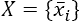(通常来自同一个分布族，尽管对要求必须如此的分布没有限制)，组织在一个无向图中， *G* = { *V* ， *E* }，如下图所示:

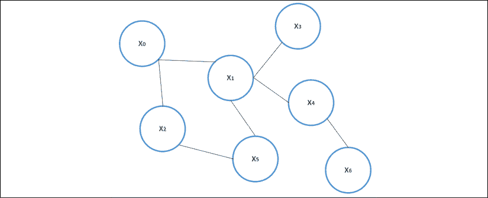

概率无向图示例

在分析图形的属性之前，我们需要记住两个随机变量， *a* 和 *b* ，对于给定的随机变量， *c* ，它们是条件独立的，如果:

*p*(*a*, *b*|*c*) = *p*(*a*|*c*)*p*(*b*|*c*)

如果给定一个分离子集 *S* [k] ，变量子集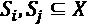的所有类属对都是有条件独立的(这样，属于 *S* [i] 的变量与属于 *S* [j] 的变量之间的所有连接都经过 *S* [k] ，则该图称为**马尔可夫随机场** ( 【T52

给定 *G* = { *V* ， *E* }，包含顶点使得每一对都相邻的子集称为团(所有团的集合通常表示为 *cl* ( *G* ))。例如，考虑前面显示的图表。集合{ *x* [0] ， *x* [1] }是一个小团体。而且，如果 *x* [0] 和 *x* [5] 相连，{ *x* [0] ， *x* [1] ， *x* [5] }也会是一个小团体，如下图所示:

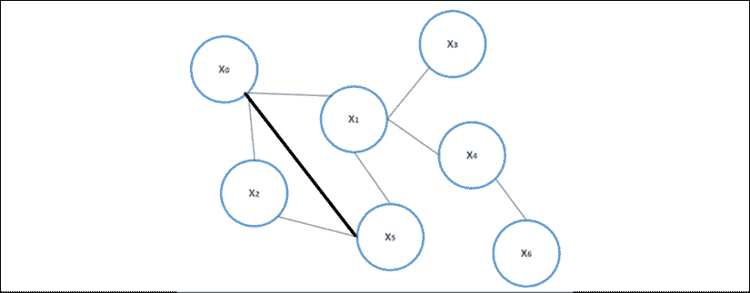

在*x*0 和*x*5 之间有连接的概率无向图示例

最大团是不能通过添加新顶点来扩展的团。一个特殊的 MRF 族由所有这些图组成，这些图的联合概率分布可以分解为:

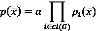

在这种情况下，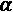是归一化常数，并且乘积被扩展到所有极大团的集合。根据 Hammersley-Clifford 定理，如果联合概率密度函数是严格正的，则 MRF 可以分解，并且所有的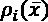函数也是严格正的。因此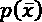，经过一些基于对数性质的简单操作后，可以改写为吉布斯(或玻尔兹曼)分布:

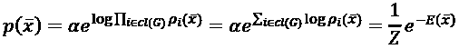

术语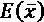被称为能量，因为它来源于统计物理学中这种分布的第一次应用。术语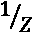现在是采用标准符号的标准化常数。在我们的场景中，我们总是考虑包含观察变量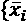和潜在变量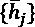的图。因此，将联合概率表示为以下形式是有用的:

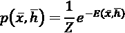

每当需要边缘化以获得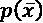时，我们可以简单地对集合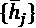求和:

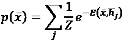

不幸的是，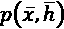通常很难处理，边缘化也可能非常复杂(如果不是不可能的话)。然而，正如我们将要看到的，通常可以使用条件分布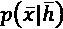和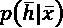，它们更容易管理，并允许我们对网络进行建模，其中隐藏单元代表潜在状态，这些状态从不被单独考虑或以联合概率分布考虑，而是以条件形式考虑。这种方法最常见的应用是受限玻尔兹曼机，我们将在下一节讨论它。

# 受限玻尔兹曼机器

一个**受限玻尔兹曼机** ( **RBM** )，最初称为 Harmonium，是由 Smolensky 提出的一个神经模型(在 Smolensky P .，*动态系统中的信息处理:和谐理论的基础*，并行分布式处理，第 1 卷，麻省理工学院出版社，1986 年)由一层输入(可观察)神经元和一层隐藏(潜伏)神经元组成。下图显示了一个通用结构:


RBM 的结构

由于无向图是二分的(在属于同一层的神经元之间没有连接)，潜在的概率结构是 MRF。在原始模型中(即使这不是一个限制)，所有的神经元都被假设为伯努利分布( *x* [i] ， *h* [j] = {0，1})，偏置 *b* [i] (对于被观察单元)和 *c* [j] (对于潜在神经元)。由此产生的能量函数为:

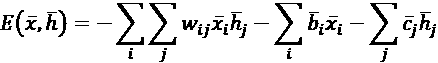

RBM 是一种概率生成模型，它可以学习数据生成过程， *p* [data] ，该过程由观察到的单元表示，但是利用潜在变量的存在，以便对所有内部关系进行建模。

如果我们将所有参数汇总在一个向量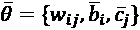中，吉布斯分布变为:

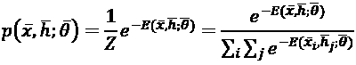

RBM 的训练目标是最大化输入分布的对数似然。因此，第一步是在前一个表达式边缘化后确定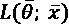:

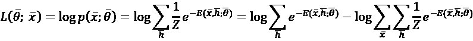

因为我们需要来最大化对数似然，所以计算相对于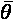的梯度是有用的:

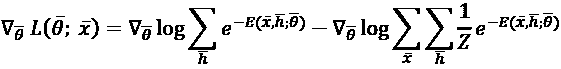

应用导数的链式法则，我们得到:

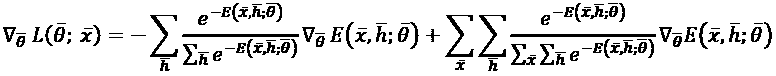

使用条件和联合概率等式，前面的表达式变成:

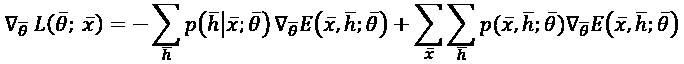

考虑到全联合概率，在一些繁琐的操作(为简单起见省略)之后，有可能导出以下条件表达式，其中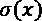是 sigmoid 函数:

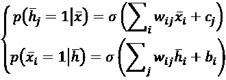

此时，我们可以计算对数似然相对于每个单一参数的梯度， *w* [ij] ， *b* [i] ，以及 *c* [j] 。从*w*ij 开始，考虑到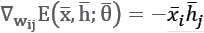，我们得到:

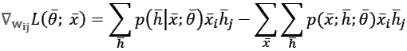

如果我们将最后一个完全联合概率转换为条件概率，则之前的表达式可以重写为:

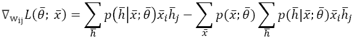

现在，考虑到所有单元都是伯努利分布的，并且只隔离第*j*t【60】th 隐藏单元，可以应用简化:

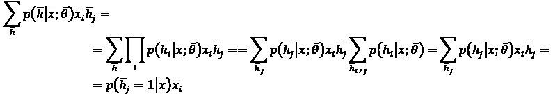

因此，梯度变为:

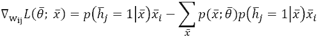

同理，我们可以推导出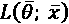相对于*b*I 和*c*j 的梯度:

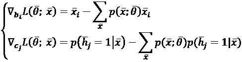

因此，每个梯度的第一项很容易计算，而第二项需要对所有观测值求和。由于这种操作不可行，唯一可行的替代方案是基于采样的近似法，使用吉布斯采样等方法(更多信息，参见第十一章*、*贝叶斯网络和隐马尔可夫模型*)。*

然而，由于该算法从条件和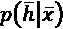中采样，而不是从完全联合分布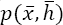中采样，因此它需要相关的马尔可夫链达到其平稳分布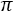，以便提供有效的样本。由于我们不知道达到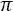需要多少采样步骤，吉布斯采样也可能是一个不可行的解决方案，因为其潜在的高计算成本。

## 对比分歧

为了解决这个问题，Hinton 提出了(在 Hinton G .，*训练受限玻尔兹曼机器的实用指南*，多伦多大学计算机科学系，2010)一种替代的算法，称为 CD-k。这个想法非常简单，但非常有效:我们不是等待马尔可夫链达到平稳分布，而是从在 *t* = 0、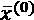的训练样本开始采样固定次数，并通过从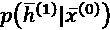采样来计算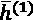。然后，使用隐藏向量对来自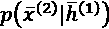的重构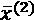进行采样。这一过程可以重复多次，但在实践中，一个采样步骤通常足以确保相当好的精度。此时，对数似然的梯度近似为(考虑 t 步):

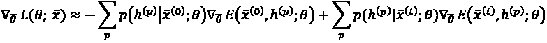

考虑到前面的过程，可以容易地获得相对于*w*ij、*b*I 和*c*j 的单一梯度。术语对比源自在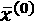计算的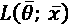梯度的近似值，其中一项称为正梯度，另一项定义为负梯度。这种方法类似于具有这种增量比的导数的近似值:


基于单步 CD-k 的完整 RBM 训练算法是(假设有 *M 个*训练数据点):

1.  设置隐藏单元的数量*N*h。
2.  设置训练时期数*N*T43【时期】T44。
3.  设置一个学习率(例如)。
4.  对于 *e* = 1 到*N*历元:
    1.  设置。
    2.  对于 *i* = 1 到 *M* :

1.  来自的样本。
2.  从中取样重建。
3.  累积权重和偏差的更新:

1.  (作为外部产品)
2.  

1.   = 
    1.  更新权重和偏差:

1.  
2.  

1.  

两个向量之间的外乘积定义为:


如果向量有( *n 【T72，1】形状，有( *m 【T75，1】形状，结果是一个有( *n* ， *m* 形状的矩阵。**

# 深度信念网络

信念或贝叶斯网络是一个已经在*第 11 章*、*贝叶斯网络和隐马尔可夫模型*中探讨过的概念。在这种特殊情况下，我们将考虑信念网络，其中有可见和潜在的变量，组织成同质层。第一层总是包含输入(可见)单元，而所有其余的是潜在的。因此，DBN 可以构建为一堆 RBM，其中每个隐藏层也是后续 RBM 的可见层，如下图所示(每层的单元数量可以不同):


通用 DBN 的结构

学习过程通常是贪婪的和逐步的(如 Hinton G. E .，Osindero S .，Teh Y. W .，*一种用于深度信念网络的快速学习算法*，Neural Computation，18/7，2006 中所提出的)。第一个 RBM 使用数据集进行训练，并使用 CD-k 算法进行优化以重构原始分布。此时，内部(隐藏)表示被用作下一个 RBM 的输入，等等，直到所有的块都被完全训练。通过这种方式，DBN 被迫创建可用于不同目的的数据集的后续内部表示。当然，当训练模型时，可以从隐藏层的识别(逆)模型采样中进行推断，并计算激活概率，因为(表示一般原因):


由于 DBN 始终是一个生成过程，在无人监管的情况下，它可以执行组件分析/维度缩减，其方法基于创建子过程链的思想，能够重建内部表示。虽然单个 RBM 聚焦于单个隐藏层，因此不能学习子特征，但是 DBN 贪婪地学习如何使用改进的隐藏分布来表示每个子特征向量。

这一过程背后的概念与级联卷积层并无太大不同，主要区别在于，在这种情况下，学习过程是贪婪的。与 PCA 等方法的另一个区别是，我们并不确切知道内部表示是如何构建的。由于潜在变量是通过最大化对数似然来优化的，因此可能有许多最佳点，但我们不能轻易地对它们施加约束。

然而，DBNs 在不同的场景中表现出非常强大的特性，即使它们的计算成本通常比其他方法高得多。一个主要的问题(大多数深度学习方法共有的)是关于每一层中隐藏单元的正确选择。因为它们代表潜在的变量，所以它们的数量是训练程序成功的关键因素。正确的选择不是立竿见影的，因为有必要了解数据生成过程的复杂性。然而，作为一个经验法则，我建议从包含 32/64 个单元的几层开始，并继续增加隐藏神经元的数量和层数，直到达到期望的精度(同样，我建议从小的学习速率开始，如如果必要的话增加它)。

由于第一个 RBM 负责重构原始数据集，因此在每个历元后监控对数似然(或误差)非常有用，以便了解该过程是正确学习(减少误差)还是容量饱和。很明显，最初糟糕的重建会导致随后更糟糕的表现。由于学习过程是贪婪的，在无监督的任务中，当前面的训练步骤完成时，没有办法提高较低层的性能。因此，我总是建议调整参数，使第一次重建非常准确。当然，所有关于过度拟合的考虑仍然有效，因此，用验证样本监控泛化能力也很重要。然而，在组件分析中，我们假设我们正在处理一个代表底层数据生成过程的分布，因此找到以前见过的特征的风险应该是最小的。

在有监督的场景中，通常有两种选择，其第一步总是对 DBN 进行贪婪的训练。然而，第一种方法使用标准算法执行后续细化，例如反向传播(将整个架构视为单个深度网络)，而第二种方法使用最后的内部表示作为单独分类器的输入。

不言而喻，第一种方法具有更多的自由度，因为它与预训练的网络一起工作，该网络的权重可以调整，直到验证精度达到其最大值。在这种情况下，第一个贪婪步骤与通过观察深度模型(类似于卷积网络)的内部行为以经验方式确认的相同假设一起工作。第一层学习如何检测低级特征，而所有后续层增加细节。因此，反向传播步骤可能从已经非常接近最优值的点开始，并且可以更快地收敛。

相反，第二种方法类似于将内核技巧应用于标准的**支持向量机** ( **SVM** )。事实上，外部分类器通常非常简单(例如逻辑回归或 SVM ),准确度的提高通常是由于通过将原始样本投影到一个子空间(通常是更高维度的)而获得的线性可分性的提高，在该子空间中它们可以被容易地分类。一般来说，这种方法产生的性能比第一种差，因为一旦 DBN 被训练，就没有办法调整参数。因此，当最终投影不适合线性分类时，有必要采用更复杂的模型，并且由此产生的计算成本可能非常高，而没有相应的性能增益。由于深度学习通常基于端到端学习的概念，因此训练整个网络对于在完整的结构中隐含地包括预处理步骤可能是有用的，这成为将输入样本与特定结果相关联的黑盒。另一方面，每当请求显式流水线时，贪婪地训练 DBN 并采用单独的分类器可能是更合适的解决方案。

## Python 中无监督 DBN 的示例

在本例中，我们将使用 GitHub([https://github.com/albertbup/deep-belief-network](https://github.com/albertbup/deep-belief-network))上免费提供的 Python 库，该库允许使用 NumPy(仅限 CPU)或 tensor flow(2.0 之前版本的 CPU 或 GPU 支持)和标准 scikit-learn 接口来处理有监督和无监督的 DBN。可以使用`pip install git+git://github.com/albertbup/deep-belief-network.git`命令安装软件包。然而，由于我们将注意力集中在 TensorFlow 2.0 上，我们将使用 NumPy 接口。

我们的目标是创建 MNIST 数据集子集的低维表示(由于训练过程可能非常缓慢，我们将它限制在 400 个样本)，它由数据点组成。第一步是加载(使用 TensorFlow/Keras 辅助函数)、混排和规范化数据集:

```py
import numpy as np
import tensorflow as tf 
from sklearn.utils import shuffle
(X_train, Y_train), (_, _) = \
        tf.keras.datasets.mnist.load_data()
X_train, Y_train = shuffle(X_train, Y_train, 
                               random_state=1000)
width = X_train.shape[1]
height = X_train.shape[2]
nb_samples = 400
X = X_train[0:nb_samples].reshape(
        (nb_samples, width * height)).\
            astype(np.float32) / 255.0
Y = Y_train[0:nb_samples]
```

此时，我们可以创建一个 UnsupervisedDBN 类的实例，分别用 512、256 和 64 个 sigmoid 单位设置三个隐藏层(因为我们想要绑定 0 和 1 之间的值)，而我们不需要指定输入维度，因为它是从数据集中自动检测的。很容易理解，模型的最终目标是执行顺序降维。第一个 RBM 将维度从 784 减少到 512(约 65%)，第二个将维度减半，因为该层中有 256 个潜在变量。一旦该第二表示已经被优化，第三 RBM 将维度除以 4，获得输出。值得注意的是，与 PCA 相反，在这种情况下，模型完全捕捉到了单个变量(在这种情况下是像素)之间的相互依赖关系。

学习率 ( `learning_rate_rbm`)设定为 0.05，批量(`batch_size`)设定为 64，每个 RBM 的时期数(`n_epochs_rbm`)设定为 100。CD-k 步数的默认值是 1，但是可以使用`contrastive_divergence_iter`参数来更改。所有这些值都可以自由地改变，以提高性能(例如，获得较小的损失)或加快训练过程。我们的选择基于准确性和速度之间的权衡:

```py
from dbn import UnsupervisedDBN
unsupervised_dbn = UnsupervisedDBN(
        hidden_layers_structure=[512, 256, 64],
        learning_rate_rbm=0.05,
        n_epochs_rbm=100,
        batch_size=64,
        activation_function='sigmoid')
X_dbn = unsupervised_dbn.fit_transform(X)
```

这个代码片段的输出是:

```py
[START] Pre-training step:
>> Epoch 1 finished 	RBM Reconstruction error 48.407841
>> Epoch 2 finished 	RBM Reconstruction error 46.730827
…
>> Epoch 99 finished 	RBM Reconstruction error 6.486495
>> Epoch 100 finished 	RBM Reconstruction error 6.439276
[END] Pre-training step
```

如前所述，训练过程是连续的，分为预训练和微调阶段。当然，复杂度与层数和隐藏单元数成正比。一旦这一步完成，`X_dbn`数组包含从最后一个隐藏层采样的值。不幸的是，这个库没有实现逆变换方法，但是我们可以使用 t-SNE 算法将分布投影到二维空间:

```py
from sklearn.manifold import TSNE
tsne = TSNE(n_components=2,
            perplexity=10,
            random_state=1000)
X_tsne = tsne.fit_transform(X_dbn)
```

相应的图如下图所示:


最后一个 DBN 隐藏层分布的 t-SNE 图(64 维)

正如您所看到的，即使仍然有一些异常，隐藏的低维表示与原始数据集是全局一致的。包含相同数字的每个组被组织成紧凑的簇，这些簇保留了数据集所在的原始流形的许多几何属性。例如，包含代表 9 的数字的组非常接近包含 7 的图像的组。3 组和 8 组也彼此非常接近。

该结果证实了 DBN 可成功用作分类目的的预处理层，但在这种情况下，与其降低维度，不如增加维度以利用冗余，这样我们就可以使用更简单的线性分类器(为了更好地理解这一概念，考虑用多项式特征扩充数据集)。我邀请读者通过预处理整个 MNIST 数据集，然后使用逻辑回归对其进行分类，并将结果与直接方法进行比较，来测试这种能力。

## Python 中监督 DBN 的例子

在本例中，我们将使用葡萄酒数据集(由 scikit-learn 提供)，其中包含代表三种不同葡萄酒类别的化学属性的数据点。这个数据集并不极其复杂，可以用更简单的方法成功分类；然而，这个例子只是一个教学目的，对于理解如何处理这种数据是有用的。

第一步是加载数据集，并通过移除平均值并除以标准偏差来标准化值(这在使用 ReLU 单位时非常重要，例如，当输入为正时，ReLU 单位相当于线性单位):

```py
from sklearn.datasets import load_wine
from sklearn.preprocessing import StandardScaler
wine = load_wine()
ss = StandardScaler()
X = ss.fit_transform(wine['data'])
Y = wine['target']
```

此时，我们可以创建训练集和测试集:

```py
from sklearn.model_selection import train_test_split
X_train, X_test, Y_train, Y_test = \
        train_test_split(X, Y,
                         test_size=0.25,
                         random_state=1000)
```

该模型基于 SupervisedDBNClassification 类的一个实例，它实现了反向传播方法。这些参数与无监督的情况非常相似，但现在我们还可以指定随机梯度下降(SGD)学习速率(`learning_rate`)、反向传播时期的数量(`n_iter_backprop`)和可选的退出(`dropout_p`)。该算法执行初始贪婪训练(其计算成本通常高于 SGD 阶段)，然后进行微调。考虑到训练集的结构，我们选择了包含 16 和 8 个单元的两个隐藏 ReLU 层，并应用了 0.1 的下降以防止过度拟合。

考虑到这些模型的一般行为，两个 RBM 将试图找到 *p* [数据]的内部表示，以便获得最准确的分类。在我们的例子中，第一个 RBM 将维度扩展到 16 个单位，因此，隐藏层应该更明确地编码一些相互依赖的特征。相反，第二个 RBM 将维度减少到 8 个单位，它主要负责发现数据集所在的流形。网络结构的选择类似于深度学习中采用的任何其他程序，并且应该遵循奥卡姆剃刀原则。因此，我建议从非常简单的模型开始，然后添加新的层或扩展现有的层。当然，当过度拟合的风险很大时(例如，当数据集非常小并且不可能检索新的数据点时)，强烈建议使用 dropout:

```py
from dbn import SupervisedDBNClassification
classifier = SupervisedDBNClassification(
        hidden_layers_structure=[16, 8],
        learning_rate_rbm=0.001,
        learning_rate=0.01,
        n_epochs_rbm=20,
        n_iter_backprop=100,
        batch_size=16,
        activation_function='relu',
        dropout_p=0.1)
classifier.fit(X_train, Y_train)
```

前面片段的输出显示了每个时期的预训练和微调损失:

```py
[START] Pre-training step:
>> Epoch 1 finished 	RBM Reconstruction error 12.488863
>> Epoch 2 finished 	RBM Reconstruction error 12.480352
…
>> Epoch 99 finished 	ANN training loss 1.440317
>> Epoch 100 finished 	ANN training loss 1.328146
[END] Fine tuning step
```

此时，我们可以使用 scikit-learn 分类报告评估我们的模型:

```py
from sklearn.metrics.classification import \
    classification_report
Y_pred = classifier.predict(X_test)
print(classification_report(Y_test, Y_pred))
```

输出是:

```py
 precision    recall  f1-score   support
 0       0.92      1.00      0.96        11
 1       1.00      0.90      0.95        21
 2       0.93      1.00      0.96        13
 accuracy                           0.96        45
 macro avg       0.95      0.97      0.96        45
weighted avg       0.96      0.96      0.96        45
```

验证精度(就精度和召回率而言)非常大(接近 0.96)，但这确实是一个只需要几分钟训练的简单数据集。我邀请读者在 MNIST/时尚 MNIST 数据集的分类中测试 DBN 的性能，将结果与使用深度卷积网络获得的结果进行比较。在这种情况下，监控每个 RBM 的重建误差是很重要的，在运行反向传播阶段之前尝试将其最小化。在本练习结束时，您应该能够回答这个问题:端到端方法和基于预处理的方法哪个更好？

# 总结

在本章中，我们介绍了 MRF 作为 RBM 的底层结构。MRF 被表示为顶点是随机变量的无向图。特别地，为了我们的目的，我们考虑了 MRF，它的联合概率可以表示为每个随机变量的正函数的乘积。最常见的基于指数的分布称为吉布斯(或玻尔兹曼)分布，它特别适合我们的问题，因为对数抵消了指数，产生了更简单的表达式。

RBM 是一个简单的二分无向图，由可见和潜在的变量组成，只在不同的组之间有联系。

该模型的目标是学习概率分布，这要归功于可以模拟未知关系的隐藏单元的存在。不幸的是，对数似然虽然非常简单，但不容易优化，因为归一化项需要对所有输入值求和。出于这个原因，Hinton 提出了一种替代算法，称为 CD-k，它基于固定数量(通常为 1)的 Gibbs 采样步骤输出对数似然梯度的近似值。

堆叠多个 RBM 允许我们对 dbn 建模，其中每个块的隐藏层也是下一个块的可见层。可以使用贪婪方法来训练 dbn，最大化序列中每个 RBM 的对数似然。在无人监管的情况下，DBN 能够以分层的方式提取数据生成过程的特征，因此应用包括组件分析和降维。在受监督的场景中，可以使用反向传播算法(考虑整个网络)或有时使用流水线中的预处理步骤(其中分类器通常是非常简单的模型，如逻辑回归)来贪婪地预训练和微调 DBN。

在网上提供的下一章中，我们将介绍强化学习的概念，讨论可以自主学习玩游戏或允许机器人行走、跳跃和执行使用经典方法建模和控制极其困难的任务的系统的最重要元素。

# 延伸阅读

*   Smolensky P .，*动力系统中的信息处理:和谐理论的基础*，并行分布式处理，第 1 卷，麻省理工学院出版社，1986
*   Hinton G .，*训练受限玻尔兹曼机器的实用指南*，多伦多大学计算机科学系，2010 年
*   辛顿，奥辛德罗，崔永伟，*深度信念网络的快速学习算法*，神经计算，18/7，2006
*   Goodfellow I .，Bengio Y .，库维尔 a .，*深度学习*，麻省理工学院出版社，2016
*   Bonaccorso G .，*用 Python 进行动手无监督学习*，Packt 出版社，2019