<title>Phishing Domain Detection</title> 

# 网络钓鱼域检测

社会工程是每个个人和现代组织面临的最危险的威胁之一。网络钓鱼是一种众所周知的基于计算机的社会工程技术。攻击者使用伪装的电子邮件地址作为武器来攻击大公司。由于每天都会收到大量的网络钓鱼电子邮件，公司无法检测出所有的邮件。这就是为什么需要新的技术和安全措施来防范网络钓鱼。本章将介绍使用先进的 Python 机器学习库构建三个不同的基于机器学习的项目来检测网络钓鱼企图所需的步骤。

在本章中，我们将介绍:

*   社会工程概述
*   社会工程渗透测试的步骤
*   使用不同的机器学习模型构建实时网络钓鱼攻击检测器:
    *   基于逻辑回归的网络钓鱼检测
    *   基于决策树的网络钓鱼检测
    *   用**自然语言处理** ( **NLP** )检测垃圾邮件

<title>Technical requirements</title> 

# 技术要求

在本章中，我们将使用以下 Python 库:

*   sci kit-学习 Python (≥ 2.7 或≥ 3.3)
*   数值(≥ 1.8.2)
*   NLTK

如果您尚未安装它们，请确保在继续本章之前安装它们。你可以在[https://github . com/packt publishing/Mastering-Machine-Learning-for-Penetration-Testing/tree/master/chapter 02](https://github.com/PacktPublishing/Mastering-Machine-Learning-for-Penetration-Testing/tree/master/Chapter02)找到代码文件。

<title>Social engineering overview</title> 

# 社会工程概述

根据定义，社会工程是对一个人的心理操纵，以从他们那里获得有用和敏感的信息，这些信息随后可用于危及系统。换句话说，犯罪分子利用人类的行为，利用社会工程从人们那里获取机密信息。

<title>Social Engineering Engagement Framework</title> 

# 社会工程参与框架

**社会工程参与框架** ( **SEEF** )是由 Dominique C. Brack 和 Alexander Bahmram 开发的框架。它总结了多年来在信息安全和防御社会工程方面的经验。该框架的利益相关者包括组织、政府和个人。社会工程参与管理经历三个步骤:

1.  **预约流程**:社会工程作业准备
2.  **接合过程中**:接合发生
3.  **聘任后流程** : 提交报告

罪犯使用许多社会工程技术:

*   **诱饵**:说服受害者透露信息，许诺给他报酬或礼物。
*   冒充:冒充别人。
*   翻垃圾箱:从垃圾箱里收集有价值的信息(有地址的文件、电子邮件等等)。
*   肩窥:在别人打字的时候，从他们背后偷窥他们的机器。
*   网络钓鱼:这是最常用的技术；当攻击者伪装成受信任的实体，欺骗受害者打开电子邮件、即时消息或文本消息时，就会发生这种情况。

<title>Steps of social engineering penetration testing</title> 

# 社会工程渗透测试的步骤

渗透测试模拟黑帽黑客攻击，以评估公司部署所需安全措施的安全状况。渗透测试是一个方法论的过程，它经历了明确定义的步骤。渗透测试有多种类型:

*   白盒测试
*   黑盒测试
*   灰盒测试

要执行社会工程渗透测试，您需要遵循以下步骤:

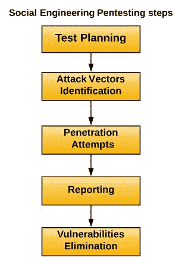<title>Building real-time phishing attack detectors using different machine learning models</title> 

# 使用不同的机器学习模型构建实时网络钓鱼攻击检测器

在接下来的部分中，我们将学习如何构建机器学习网络钓鱼检测器。我们将介绍以下两种方法:

*   基于逻辑回归的网络钓鱼检测
*   基于决策树的网络钓鱼检测

<title>Phishing detection with logistic regression</title> 

# 基于逻辑回归的网络钓鱼检测

在本节中，我们将使用逻辑回归算法从头开始构建一个网络钓鱼检测器。逻辑回归是一种众所周知的统计技术，用于进行二项式预测(两类)。

就像在每个机器学习项目中一样，我们需要数据来支持我们的机器学习模型。对于我们的模型，我们将使用 UCI 机器学习库(钓鱼网站数据集)。你可以在 https://archive.ics.uci.edu/ml/datasets/Phishing+Websites 查看一下:

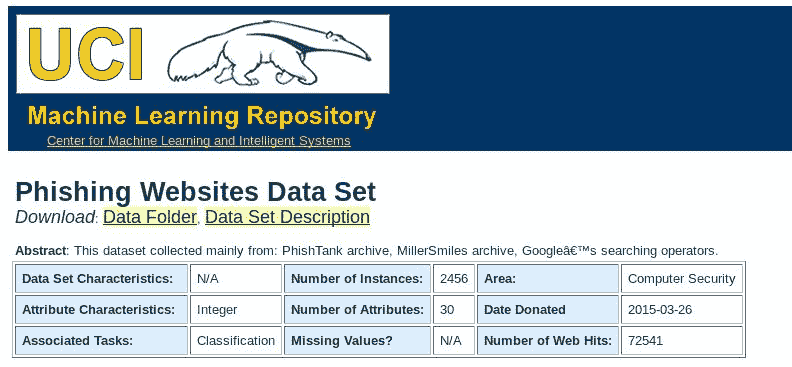

数据集以一个`arff`文件的形式提供:

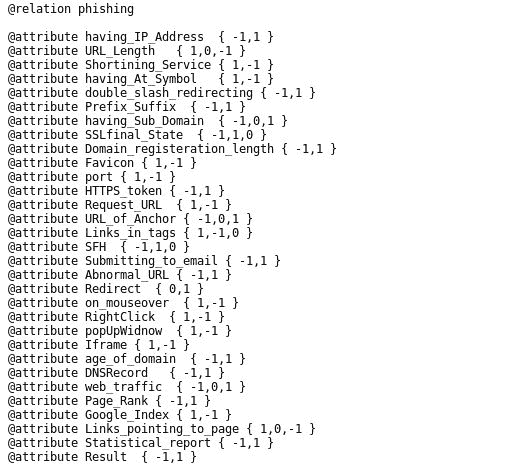

以下是数据集的快照:

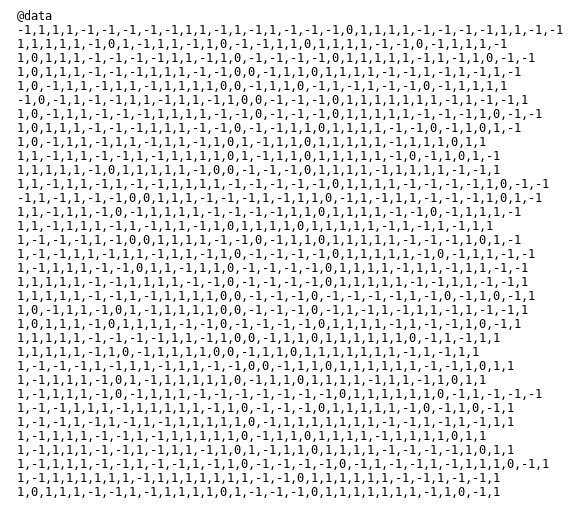

为了更好地操作，我们将数据集组织成一个`csv`文件:

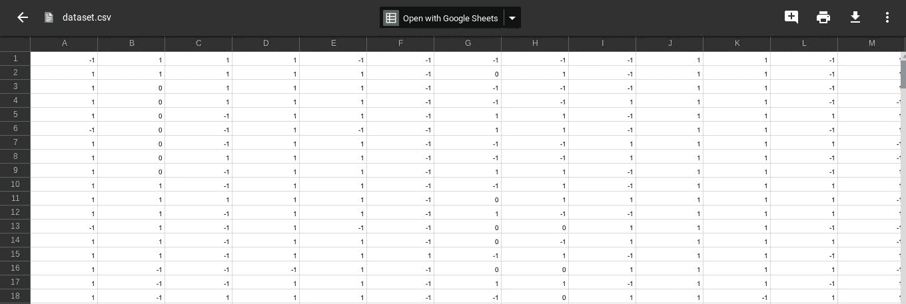

您可能从属性中注意到，数据集的每一行都以下面的格式表示—*{ 30 个属性(having_IP_Address URL_Length，abnormal _ URL 等)} + {1 个属性(Result)}* :

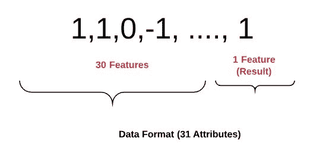

对于我们的模型，我们将导入两个机器学习库，NumPy 和 scikit-learn，我们已经在[第 1 章](part0021.html#K0RQ0-49a67f1d6e7843d3b2296f38e3fe05f5)和*Pentesting*中安装了它们。

让我们打开 Python 环境并加载所需的库:

```
>>> import numpy as np
>>> from sklearn import *
>>> from sklearn.linear_model import LogisticRegression
>>> from sklearn.metrics import accuracy_score
```

接下来，加载数据:

```
training_data = np.genfromtxt('dataset.csv', delimiter=',', dtype=np.int32)
```

识别`inputs`(所有属性，除了最后一个属性)和`outputs`(最后一个属性):

```
>>> inputs = training_data[:,:-1]
>>> outputs = training_data[:, -1]
```

在前一章中，我们讨论了如何将数据集划分为训练数据和测试数据:

```
training_inputs = inputs[:2000]
training_outputs = outputs[:2000] 
testing_inputs = inputs[2000:]
testing_outputs = outputs[2000:]
```

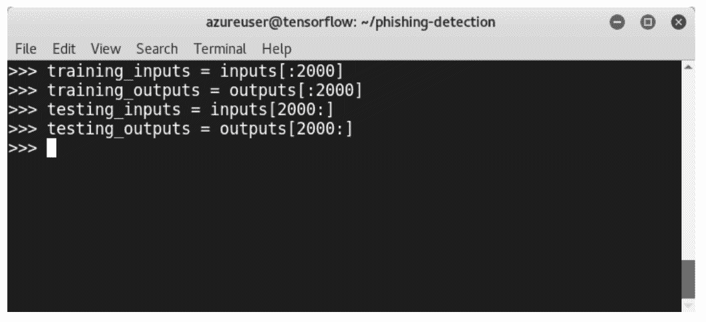

创建 scikit-learn 逻辑回归分类器:

```
classifier = LogisticRegression()
```

训练分类器:

```
classifier.fit(training_inputs, training_outputs)
```

进行预测:

```
predictions = classifier.predict(testing_inputs)
```

让我们打印出我们的网络钓鱼检测器模型的准确性:

```
accuracy = 100.0 * accuracy_score(testing_outputs, predictions) 
print ("The accuracy of your Logistic Regression on testing data is: " + str(accuracy))
```

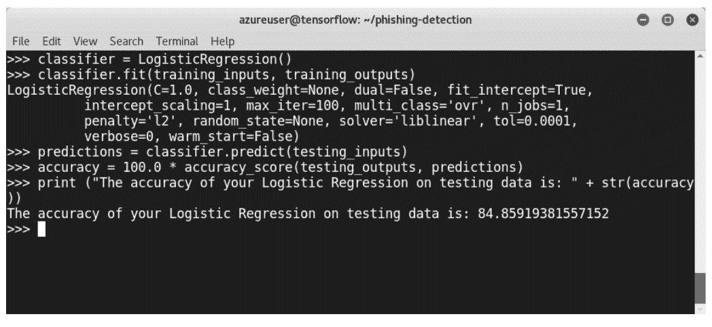

我们模型的准确率大约是 85%。这是一个很好的准确性，因为我们的模型检测出 100 个钓鱼网址中的 85 个。但是让我们试着用决策树做一个更好的模型，用同样的数据。

<title>Phishing detection with decision trees</title> 

# 基于决策树的网络钓鱼检测

为了构建第二个模型，我们将使用相同的机器学习库，因此没有必要再次导入它们。然而，我们将从`sklearn`导入决策树分类器:

```
>>> from sklearn import tree
```

创建`tree.DecisionTreeClassifier()` scikit-learn 分类器:

```
classifier = tree.DecisionTreeClassifier()
```

训练模型:

```
classifier.fit(training_inputs, training_outputs)
```

计算预测值:

```
predictions = classifier.predict(testing_inputs)
```

计算准确度:

```
accuracy = 100.0 * accuracy_score(testing_outputs, predictions)
```

然后，打印出结果:

```
print ("The accuracy of your decision tree on testing data is: " + str(accuracy))
```

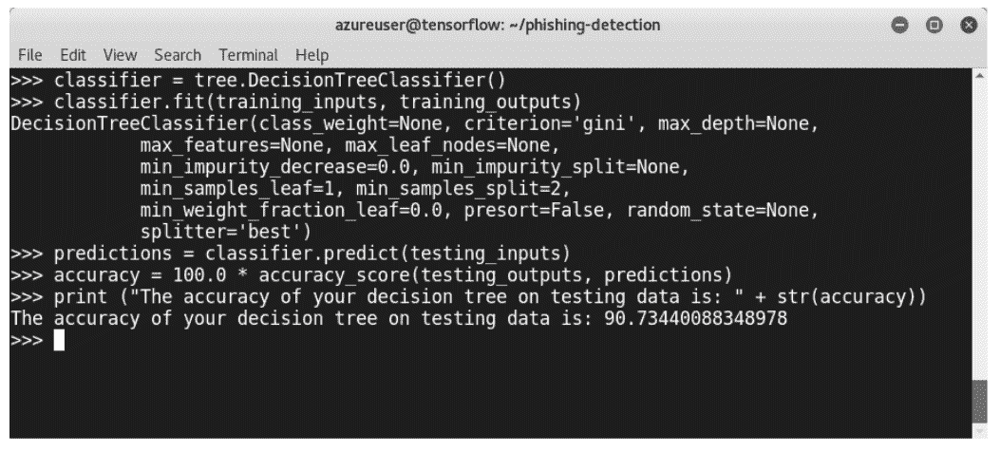

与第一个模型相比，第二个模型的准确度约为 90.4%，这是一个很好的结果。我们现在已经学习了如何使用两种机器学习技术来构建两个网络钓鱼检测器。

<title>NLP in-depth overview</title> 

# NLP 深入概述

NLP 是机器分析和理解人类语言的艺术。根据许多研究，超过 75%的使用数据是非结构化的。非结构化数据没有预定义的数据模型，或者不是以预定义的方式组织的。电子邮件、推文、日常信息甚至我们的录音讲话都是非结构化数据的形式。NLP 是机器分析、理解和从自然语言中获取意义的一种方式。NLP 被广泛用于许多领域和应用，例如:

*   实时翻译
*   自动摘要
*   情感分析
*   语音识别
*   构建聊天机器人

通常，NLP 有两个不同的组成部分:

*   **自然语言理解(NLU)** :这是指将输入映射成有用的表示。
*   **自然语言生成(NLG)** :这是指将内部表示转化为有用的表示。换句话说，它将数据转化为书面或口头叙述。商业智能仪表板的书面分析是 NLG 应用程序之一。

每个 NLP 项目都要经过五个步骤。构建 NLP 项目的第一步是识别和分析单词的结构。这一步包括将数据分成段落、句子和单词。稍后我们分析句子中的单词以及它们之间的关系。第三步涉及检查文本的意义。然后，分析连句的意义。最后，通过语用分析来完成项目。

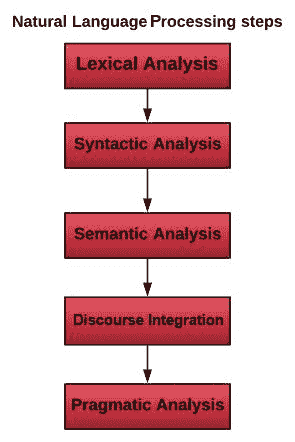<title>Open source NLP libraries</title> 

# 开源 NLP 库

有许多开源 Python 库提供了构建真实世界的 NLP 应用程序所需的结构，例如:

*   Apache OpenNLP
*   GATE NLP 图书馆
*   斯坦福 NLP
*   当然，还有**自然语言工具包** ( **NLTK** )

在前一章中，我们学习了如何安装许多开源机器学习 Python 库，包括 NLTK。让我们启动我们的 Linux 机器，尝试一些实践技巧。

打开 Python 终端，导入`nltk`:

```
>>> import nltk
```

下载图书类型，如下所示:

```
>>> nltk.download()
```

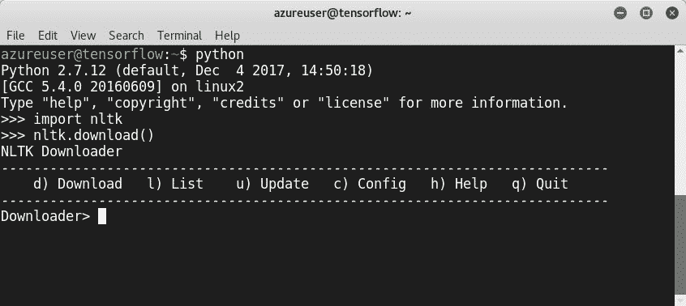

如果您想列出我们在上一章已经下载的可用资源，请键入`l`:

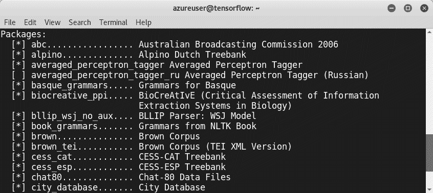

您也可以键入:

```
>> from nltk.book import *
```

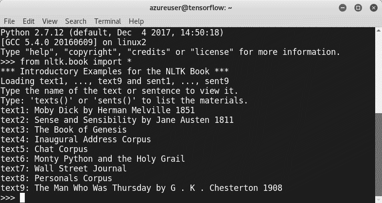

要从链接中获取文本，建议使用`urllib`模块抓取网站:

```
>>> from urllib import urlopen
>>> url = "http://www.URL_HERE/file.txt"
```

作为演示，我们将加载一个名为`Security.in.Wireless.Ad.Hoc.and.Sensor.Networks`的文本:

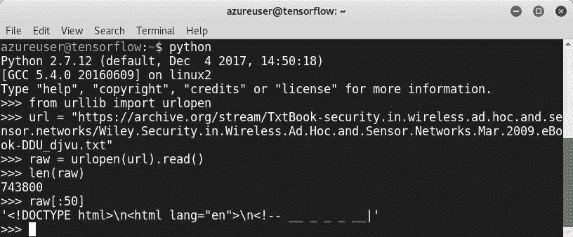

我们抓取了文本文件，并使用`len`来检查它的长度，使用`raw[:50]`来显示一些内容。从截图中可以看到，文字中包含了大量对我们项目毫无用处的符号。为了只得到我们需要的，我们使用了**记号化**:

```
>>> tokens = nltk.word_tokenize(raw)
>>> len(tokens)
> tokens[:10]
```

为了总结我们在上一节中学到的内容，我们看到了如何下载一个 web 页面、标记文本和规范化单词。

<title>Spam detection with NLTK</title> 

# 使用 NLTK 检测垃圾邮件

现在是时候使用 NLTK 构建我们的垃圾邮件检测器了。这种分类器的原理很简单；我们需要检测垃圾邮件发送者使用的单词。我们将使用 Python 和`nltk`库构建一个垃圾邮件/非垃圾邮件二元分类器，来检测一封电子邮件是否是垃圾邮件。首先，我们需要像往常一样导入库:

```
>>> import nltk
```

我们需要加载数据，并用电子邮件数据集填充我们的模型。为了实现这一点，我们可以使用互联网内容过滤组织提供的数据集。您可以访问 https://labs-repos.iit.demokritos.gr/skel/i-config/[的网站](https://labs-repos.iit.demokritos.gr/skel/i-config/):

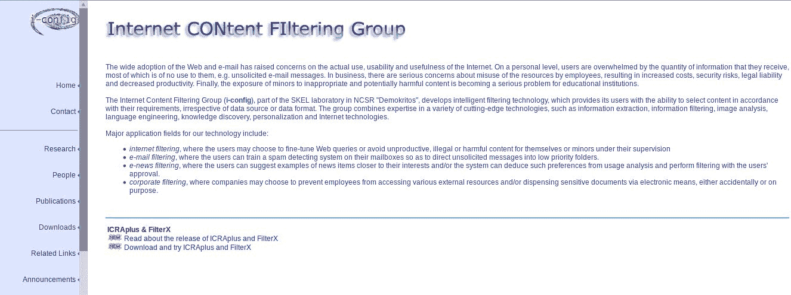

基本上，该网站提供了四个数据集:

*   凌垃圾邮件
*   PU1
*   PU123A
*   安然-垃圾邮件

对于我们的项目，我们将使用安然垃圾邮件数据集:

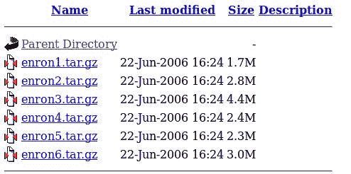

让我们使用`wget`命令下载数据集:

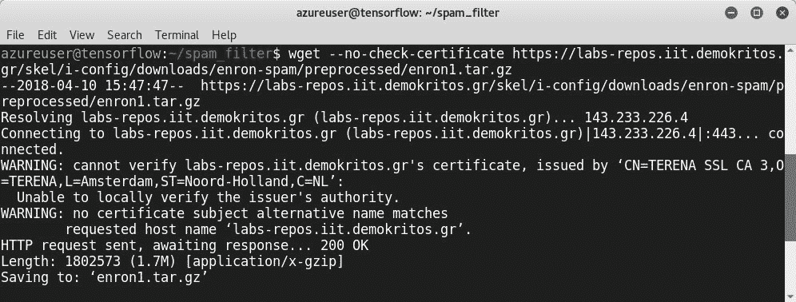

使用`tar -xzf enron1.tar.gz`命令提取`tar.gz`文件:

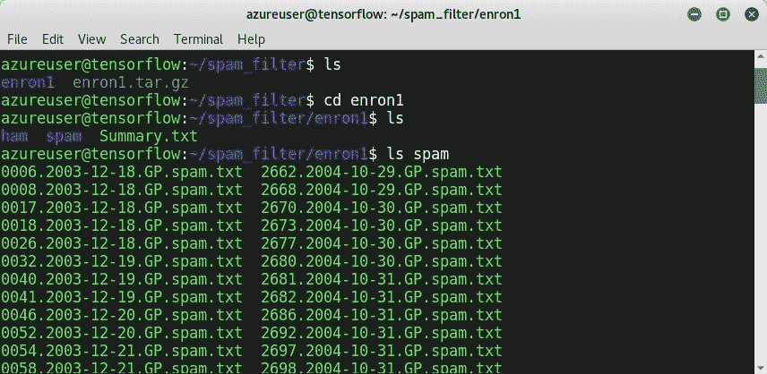

随机播放`cp spam/* emails && cp ham/* emails`对象:

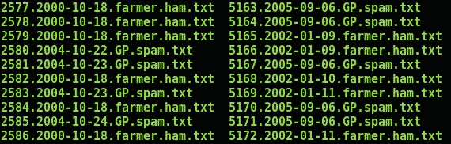

为了打乱电子邮件，让我们编写一个小的 Python 脚本`Shuffle.py`来完成这项工作:

```
import os
import random
#initiate a list called emails_list
emails_list = []
Directory = '/home/azureuser/spam_filter/enron1/emails/'
Dir_list  = os.listdir(Directory)
for file in Dir_list:
    f = open(Directory + file, 'r')
    emails_list.append(f.read())
f.close()
```

只需更改目录变量，它就会打乱文件:

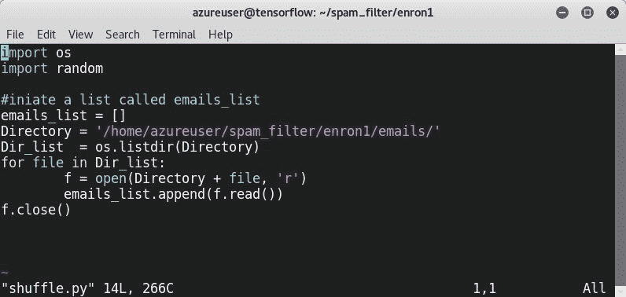

准备好数据集后，您应该知道，正如我们之前了解到的，我们需要`tokenize`电子邮件:

```
>> from nltk import word_tokenize
```

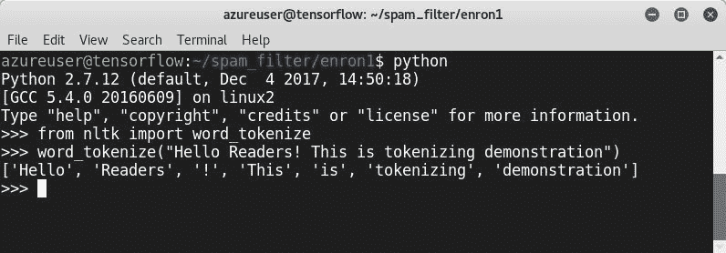

此外，我们需要执行另一个步骤，称为 lemmatizing。词汇化连接不同形式的单词，如 hacker/黑客和 is/are。我们需要导入`WordNetLemmatizer`:

```
>>> from nltk import WordNetLemmatizer
```

为演示创建一个句子，并打印出 lemmatizer 的结果:

```
>>> [lemmatizer.lemmatize(word.lower()) for word in word_tokenize(unicode(sentence, errors='ignore'))]
```

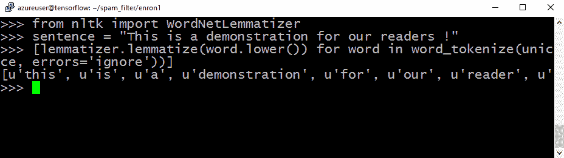

然后，我们需要去掉`stopwords`，比如`of`、`is`、`the`等等:

```
from nltk.corpus import stopwords
stop = stopwords.words('english')
```

要处理电子邮件，必须创建一个名为`Process`的函数，以`lemmatize`和`tokenize`我们的数据集:

```
def Process(data):
 lemmatizer = WordNetLemmatizer()
 return [lemmatizer.lemmatize(word.lower()) for word in word_tokenize(unicode(sentence,   errors='ignore'))]
```

第二步是特征提取，通过阅读电子邮件的文字:

```
from collections import Counter
def Features_Extraction(text, setting):
 if setting=='bow':
# Bow means  bag-of-words
 return {word: count for word, count in Counter(Process(text)).items() if not word in stop}
 else:
 return {word: True for word in Process(text) if not word in stop}
```

提取特征:

```
features = [(Features_Extraction(email, 'bow'), label) for (email, label) in emails]
```

现在，让我们定义训练模型 Python 函数:

```
def training_Model (Features, samples):
 Size = int(len(Features) * samples)
 training , testing = Features[:Size], Features[Size:]
 print ('Training = ' + str(len(training)) + ' emails')
 print ('Testing = ' + str(len(testing)) + ' emails')
```

作为分类算法，我们将使用`NaiveBayesClassifier`:

```
from nltk import NaiveBayesClassifier, classify
classifier = NaiveBayesClassifier.train(training)
```

最后，我们定义评估 Python 函数:

```
def evaluate(training, tesing, classifier):
 print ('Training Accuracy is ' + str(classify.accuracy(classifier, train_set)))
 print ('Testing Accuracy i ' + str(classify.accuracy(classifier, test_set)))
```

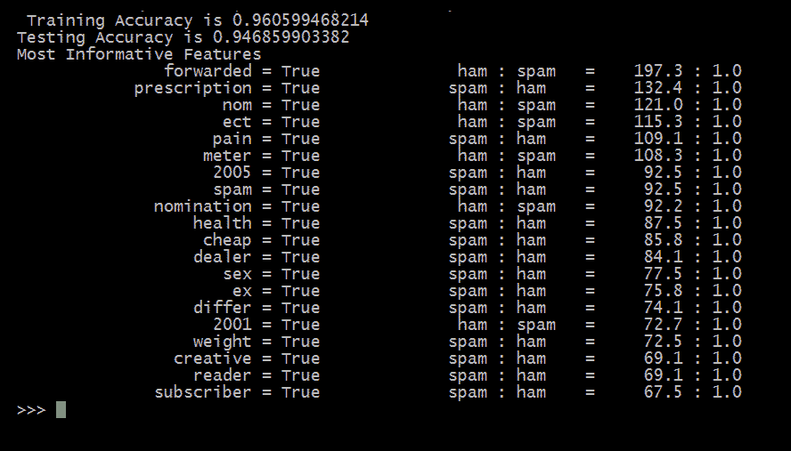<title>Summary</title> 

# 摘要

在本章中，我们学习了如何通过从头构建三个不同的项目来检测网络钓鱼企图。首先，我们发现了如何使用两种不同的机器学习技术开发一种网络钓鱼检测器，这要归功于尖端的 Python 机器学习库。第三个项目是基于 NLP 和朴素贝叶斯分类的垃圾邮件过滤器。在下一章中，我们将构建各种项目来检测恶意软件，使用不同的技术和 Python 机器学习库。

<title>Questions</title> 

# 问题

我们希望这一章很容易看完。现在，像往常一样，是练习时间。你的工作是尝试建立自己的垃圾邮件检测系统。我们将引导您完成这些问题。

在本章的 GitHub 知识库中，您将找到一个数据集，该数据集是从 Androutsopoulos、J. Koutsias、K.V. Chandrinos、George Paliouras 和 C.D .斯皮罗普洛斯的研究中收集的:*对朴素贝叶斯反垃圾邮件过滤的评估*。*新信息时代机器学习研讨会论文集，G. Potamias，V. Moustakis 和* *M. van Someren(编辑。)，第 11 届欧洲机器学习会议，西班牙巴塞罗那，2000 年 9-17 页*。

您现在可以准备数据了:

1.  以下是一些要执行的文本清理任务:
    *   清除文本中的停用词、数字和标点符号。
    *   执行词汇化。
2.  创建一个单词字典，包括它们的频率。

在邮件文本中，你会注意到第一行是邮件的主题，第三行是邮件的正文(我们只需要邮件正文)。

3.  从字典中删除非单词。
4.  从数据中提取特征。
5.  准备特征向量及其标签。
6.  用线性支持向量机分类器训练模型。
7.  打印出你的模型的混淆矩阵。