# 四、通过 API 调用和 PE 头检测恶意软件

信息安全中一些最令人讨厌的威胁是恶意程序。每天，我们都会听到关于数据泄露和恶意软件网络攻击的新闻。攻击者正在提高他们的开发技能，构建能够绕过公司安全措施和反病毒产品的新恶意软件。本章将介绍一些使用前沿数据科学、Python 库和机器学习算法击败恶意软件的新技术和解决方案。

在本章中，我们将介绍:

*   恶意软件分析方法
*   机器学习辅助恶意软件分析技术，以及实际的、真实世界的 Python 项目


# 技术要求

在本章中，我们将使用已经安装的相同的 Python 库。我们将在本书的大部分章节中使用这些库。这就是为什么我们用第一章来教你如何安装所有需要的库。

除了一些其他有用的脚本之外，你可以在[https://github . com/packt publishing/Mastering-Machine-Learning-for-Penetration-Testing/tree/master/chapter 03](https://github.com/PacktPublishing/Mastering-Machine-Learning-for-Penetration-Testing/tree/master/Chapter03)的资源库中找到所有讨论过的代码。


# 恶意软件概述

恶意软件是恶意的软件，旨在未经用户同意的情况下渗透并破坏信息系统。术语*恶意软件*涵盖了很多类别。有许多不同类型的恶意软件:

*   病毒
*   勒索软件
*   沃尔姆斯
*   特洛伊人
*   秘密的
*   间谍软件
*   键盘记录器
*   广告软件、机器人和 rootkits


# 恶意软件分析

作为一名恶意软件分析师，您的工作是发现系统究竟发生了什么，并确保被恶意软件损坏的机器与组织的网络隔离。为了执行恶意软件分析，我们需要遵循特定的操作和方法。说到恶意软件分析，我们必须执行三种技术:静态恶意软件分析、动态恶意软件分析和内存恶意软件分析。我们将一个一个来看。


# 静态恶意软件分析

恶意软件分析的第一步是收集关于恶意软件的所有信息。静态分析是使用不同的技术和实用程序收集关于恶意二进制文件的所有可用信息的艺术。在这个阶段，分析师检查恶意软件，而不真正执行它。一些常见的静态恶意软件分析方法如下:

*   **在线防病毒扫描**:使用在线扫描仪扫描可疑文件是检查文件的一种好方法，因为在线环境让您能够使用许多防病毒产品扫描文件。最著名的在线扫描器是 VirusTotal。如果您想扫描文件，只需访问[https://www.virustotal.com/#/home/upload](https://www.virustotal.com/#/home/upload)并上传文件:

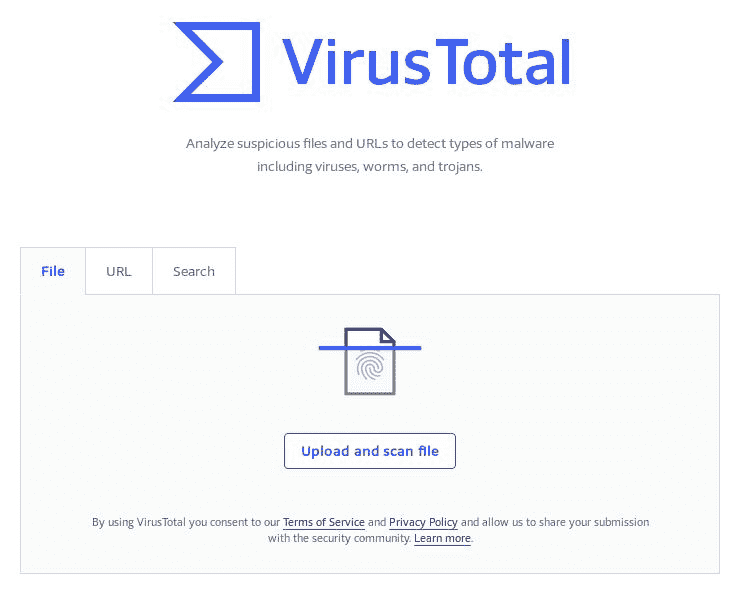

为了使任务自动化，VirusTotal 提供了一些有用的 API。因此，您可以用几行代码构建自己的 Python 脚本:

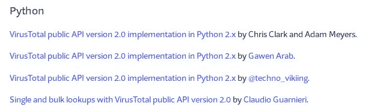

要扫描`file.exe`，您可以使用 VirusTotal 的以下代码片段:

```
import requests
 url = 'https://www.virustotal.com/vtapi/v2/file/scan'
 params = {'apikey': '<apikey>'}
 files = {'file': ('myfile.exe', open('myfile.exe', 'rb'))}
 response = requests.post(url, files=files, params=params)
 print(response.json())
```

要获得密钥，只需创建一个 VirusTotal 社区帐户。

*   **哈希**:这是一种识别文件的技术。每个哈希文件都有一个唯一的哈希。最常用的哈希函数是 MD5 和 SHA256。
*   字符串:这些也是很好的信息来源。从恶意程序中提取字符串将为我们提供关于恶意软件的有趣信息。一些字符串包括 URIs、URL、错误消息和注释。


# 动态恶意软件分析

收集关于恶意软件的信息后，您应该在一个隔离且安全的环境中运行它。通常，这些环境被称为**恶意软件分析沙箱**。沙箱加载了分析和监控工具，以便在恶意软件运行时收集有关它的信息。恶意软件分析师可以收集以下信息以及更多信息:

*   TCP 连接
*   DNS 摘要
*   恶意软件行为
*   系统调用


# 内存恶意软件分析

几年前，使用前两种技术足以分析恶意软件，但攻击者现在使用新的、更复杂的技术来避免检测。我打赌你听说过无文件恶意软件。需要内存恶意软件分析来检测新一波恶意软件。内存恶意软件分析通过分析从受感染机器收集的内存转储来进行。为了执行内存分析，分析师首先需要获取内存(转储内存)，然后可以使用许多实用程序和技术来分析它。

最常用的框架之一是挥发性框架。如果您已经安装了 Kali Linux 发行版，那么您可以直接在您的机器上使用 volatility，而无需安装它。以下截图来自 Kali Linux 内置的 volatility 框架:

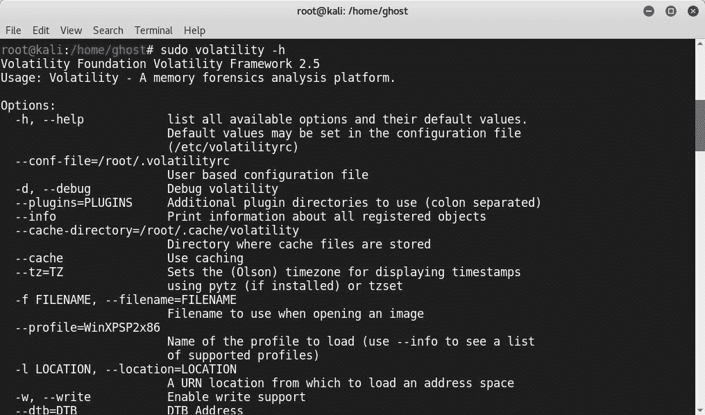

Volatility 有助于分析师从内存转储中收集信息，包括以下内容及更多内容:

*   Bash 历史
*   API 挂钩
*   网络信息
*   内核加载模块


# 绕过技术

攻击者和恶意软件开发者不断想出新的技术和方法来躲避检测。一些最常见的技术是:

*   **混淆**:这是一种让恶意软件更难检测或分析的做法。死代码插入、寄存器重新分配和加密是三种混淆技术。

*   **绑定**:这是一种将恶意软件与合法文件绑定在一起，生成一个可执行文件的做法。
*   **打包**:打包器，有时称为**自解压存档**，是一个软件，当*打包的文件*被执行时，它会在内存中自行解包。


# 可移植可执行格式文件

**可移植可执行文件** ( **PE** )文件是用于 32 位和 64 位版本 Windows 的可执行文件、DDL 和目标代码的文件格式。它们包含许多对恶意软件分析师有用的信息，包括导入、导出、时间戳、子系统、部分和资源。以下是 PE 文件的基本结构:

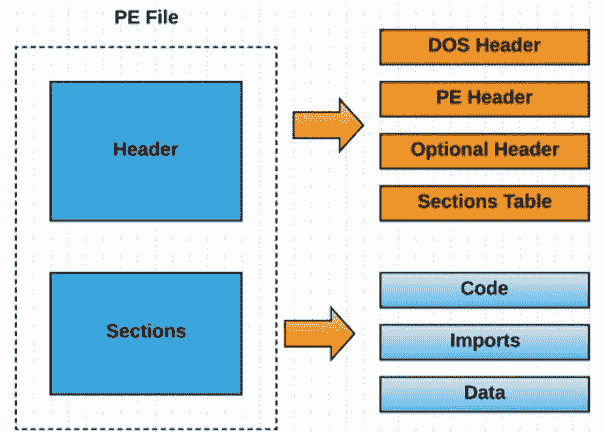

PE 文件的一些组成部分如下:

*   **DOS 头文件**:这从每个 PE 文件的前 64 个字节开始，因此 DOS 可以验证可执行文件，并可以在 DOS 存根模式下运行它。
*   **PE 头**:包含信息，包括代码的位置和大小。
*   **PE 段**:包含文件的主要内容。

要浏览 PE 头的信息，可以使用许多工具，如 PE EXPLORER、PEview 和 PEstudio。


# 使用 PE 报头的机器学习恶意软件检测

为了训练我们的机器学习模型来找到恶意软件数据集，数据科学家和恶意软件分析师有很多公开可用的来源。例如，以下网站使安全研究人员和机器学习爱好者能够下载许多不同的恶意软件样本:

*   **恶意软件流量分析【https://www.malware-traffic-analysis.net/ :**
*   **Kaggle 恶意软件家族**:[https://www.kaggle.com/c/malware-classification](https://www.kaggle.com/c/malware-classification)
*   **VX 天堂**:[http://83.133.184.251/virensimulation.org/index.html](http://83.133.184.251/virensimulation.org/index.html)
*   **病毒总量**:[https://www.virustotal.com](https://www.virustotal.com)
*   **病毒共享**:[https://virusshare.com](https://virusshare.com)

为了处理 PE 文件，我强烈推荐使用一个叫做`pefile`的神奇的 Python 库。`pefile`为您提供检查标题、分析部分和检索数据的能力，以及其他功能，如打包程序检测和 PEiD 签名生成。你可以在 https://github.com/erocarrera/pefile 查看 GitHub 项目。

您也可以使用 PIP 安装它，就像我们使用其他机器学习库一样:

```
# pip install pefile
```

现在我们成功安装了`pefile`:

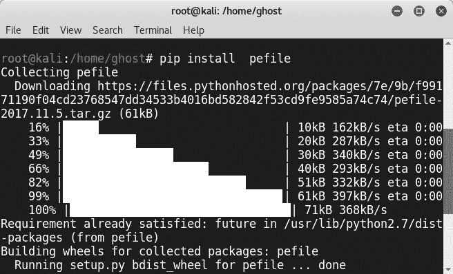

让我们开始构建我们的第一个恶意软件分类器。对于这个模型，我们将使用三种不同的技术:

*   随机森林
*   梯度推进分类
*   AdaBoost 分类

正如你可能已经从本书的分类算法中注意到的，我们正在尝试使用许多不同的技术。在某些情况下，你可以使用前面讨论的算法之一，但我试图在每一章中使用不同的技术，以便你可以清楚地了解如何使用每种机器学习技术。

到目前为止，您已经知道构建机器学习模型的第一步(当然是在研究了项目需求之后)是下载数据集。在本节中，我们将下载一个由安全博客作者 Prateek Lalwani 提供的恶意软件数据集。恶意软件数据集包含从以下内容中提取的特征:

*   41323 个 Windows 二进制文件(可执行文件`.exe`和`.dlls`)，作为合法文件。
*   从 VirusShare 网站下载了 96，724 个恶意软件文件。因此，数据集总共包含 138，048 行。

数据集划分如下:

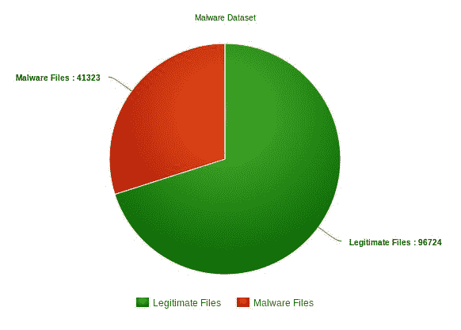

让我们从使用`pandas` Python 库加载恶意软件数据集开始:

```
import pandas as pd
MalwareDataset = pd.read_csv('MalwareData.csv', sep='|')
Legit = MalwareDataset[0:41323].drop(['legitimate'], axis=1)
Malware = MalwareDataset[41323::].drop(['legitimate'], axis=1)
```

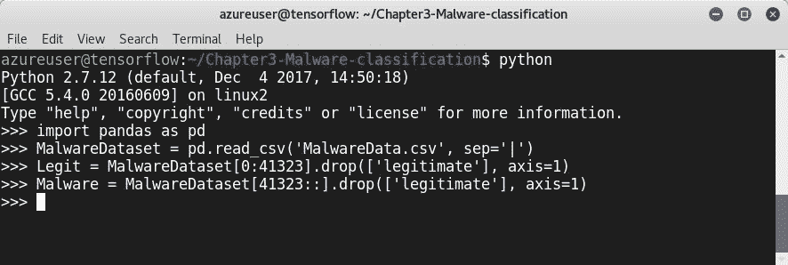

为了确保数据集已正确加载，让我们打印重要特性的数量:

```
print('The Number of important features is  %i \n' % Legit.shape[1])
```

`The Number of important features is 56`将得到这样一行:

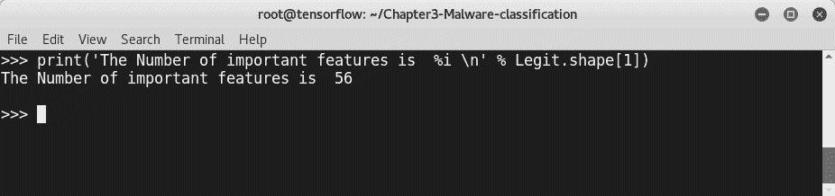

为了提高评估者的准确度，我们将使用`sklearn.feature_selection`模块。该模块用于数据集中的特征选择或维度缩减。

为了计算特征的重要性，在我们的例子中，我们将使用基于树的特征选择。加载`sklearn.feature_selection`模块:

```
import sklearn
from sklearn.feature_selection import SelectFromModel
from sklearn.ensemble import ExtraTreesClassifier
from sklearn.model_selection import train_test_split
from sklearn import cross_validation 
Data = MalwareDataset.drop(['Name', 'md5', 'legitimate'], axis=1).values
Target = MalwareDataset['legitimate'].values
FeatSelect =  sklearn.ensemble.ExtraTreesClassifier().fit(Data, Target)
Model = SelectFromModel(FeatSelect, prefit=True)
Data_new = Model.transform(Data)
print (Data.shape)
print (Data_new.shape)
```

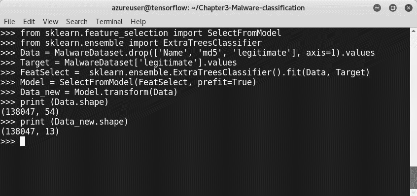

所以，算法为我们选择了九个重要的特征。要将它们打印出来，请使用以下命令:

```
Features = Data_new.shape[1]
Index = np.argsort(ske.ExtraTreesClassifier().fit(Data,Target).feature_importances_)[::-1][:Features]
for feat  in range(Features):
print(MalwareDataset.columns[2+index[feat]])
```

最重要的功能如下:

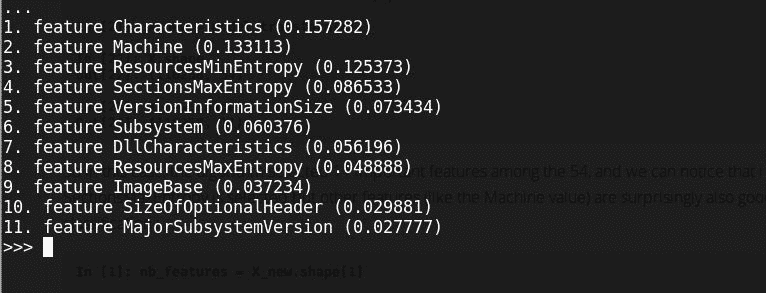

现在，是时候用随机森林分类器来训练我们的模型了。不要忘记分割数据集，就像我们之前学到的那样:

```
Legit_Train, Legit_Test, Malware_Train, Malware_Test = cross_validation.train_test_split(Data_new, Target ,test_size=0.2) 
clf =  sklearn.ensemble.RandomForestClassifier(n_estimators=50)
clf.fit(Legit_Train, Malware_Train)
score = clf.score(Legit_Test, Malware_Test)
```

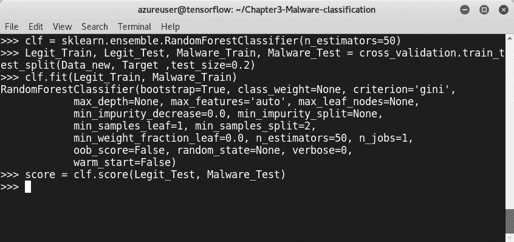

让我们看看最后的结果:

```
print("The score of Random Forest Algorithm is," score*100))
```

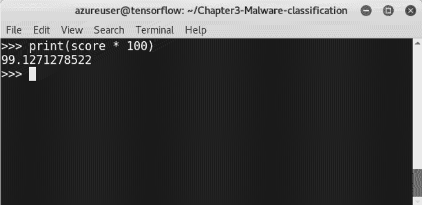

分数似乎很有希望。该模型检测恶意软件的成功率为 99%，这是一个很好的结果。要获得关于我们的恶意软件分类器的`False positive`和`False negative`比率的更多信息，请导入 scikit-learn `confusion_matrix`模块:

```
from sklearn.metrics import confusion_matrix
```

添加以下几行:

```
Result = clf.predict(Legit_Test)
CM = confusion_matrix(Malware_Test, Result)
print("False positive rate : %f %%" % ((CM[0][1] / float(sum(CM[0])))*100)) print('False negative rate : %f %%' % ( (CM[1][0] / float(sum(CM[1]))*100)))
```

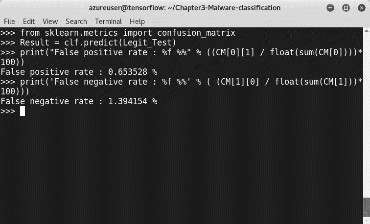

`False positive rate`为 0.6%，`False negative rate`为 1.4%。

若要使用另一个分类器训练模型，请重复前面的步骤，但不要选择随机森林分类器，而是选择机器学习算法。例如，我将选择梯度推进:

```
Clf = sklearn.ensemble.GradientBoostingClassifier(n_estimators=50)
Clf.fit(Legit_Train, Malware_Train)
Score = Clf.score(Legit_Test, Malware_Test)
```

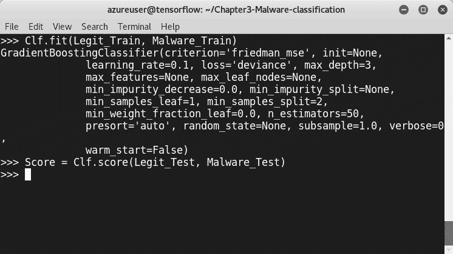

让我们看看第二个分数:

```
print ("The Model score using Gradient Boosting is", Score * 100)
```

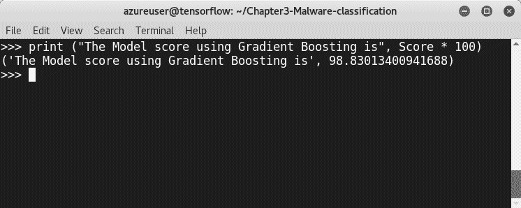

这有 98.8%的检出率。以下是使用 AdaBoost 分类器的得分:

```
Classifiers =
{ "RandomForest": ske.RandomForestClassifier(n_estimators=50), "GradientBoosting": ske.GradientBoostingClassifier(n_estimators=50), "AdaBoost": ske.AdaBoostClassifier(n_estimators=100),}

for Classif in Classifiers:
clf = Classifiers[Classif]
clf.fit(Legit_Train,Malware_Train)
score = clf.score(Legit_test, Malware_test)
print("%s : %f %%" % (Classif, score*100))
```

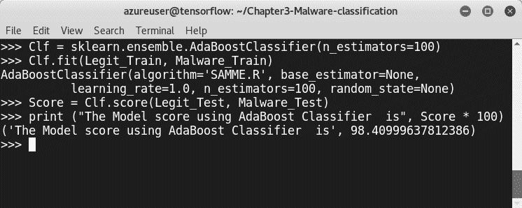<title>Machine learning malware detection using API calls</title> 

# 使用 API 调用的机器学习恶意软件检测

利用 API 调用分析恶意软件在恶意软件分析中发挥着巨大的作用。因此，API 可以让恶意软件分析师了解恶意软件的行为，特别是当基本的静态分析由于混淆技术(如打包程序、加密程序和保护器)而不成功时。恶意软件分析师可以通过研究 API 调用来了解恶意文件的工作原理。有许多在线工具可以让您在安全的环境中分析恶意软件。这些工具和环境被称为沙箱。检测到的恶意软件由哈希函数(MD5 或 SHA256)识别。恶意软件分析师使用哈希来签署文件。例如，下面的 API 摘自[https://www.hybrid-analysis.com](https://www.hybrid-analysis.com)的在线恶意软件扫描报告。

这些是关于恶意软件“PE32 可执行文件(GUI) Intel 80386，用于 MS Windows”的一些细节。它的 hash 是:4c 510779 ab 6a 58 a 3 BD bbe 8d F3 EC 568 fcf 33 df 81 b 0 f1 a5 bdacabf 78 a 9 c 62 f 492

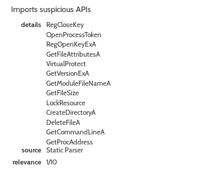

据微软网站介绍，[https://msdn.microsoft.com/](https://msdn.microsoft.com/)，`GetProcAddress`从指定的**动态链接库** ( **DLL** )中检索导出函数或变量的地址。因此，如果您想了解其他调用的更多信息，只需访问微软开发者网络，搜索 API 调用函数:

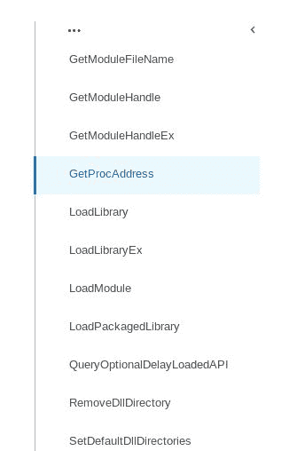

该报告包括调查结果的完整摘要，而不仅仅是 API 调用。它包括:

*   总说明
*   恶意指标
*   不寻常的特征
*   反侦查/秘密性
*   反逆向工程
*   网络相关信息

以下是关于被扫描的恶意软件的信息。我们之前讨论了大部分需要的发现(静态分析工件:大小、类型等等):

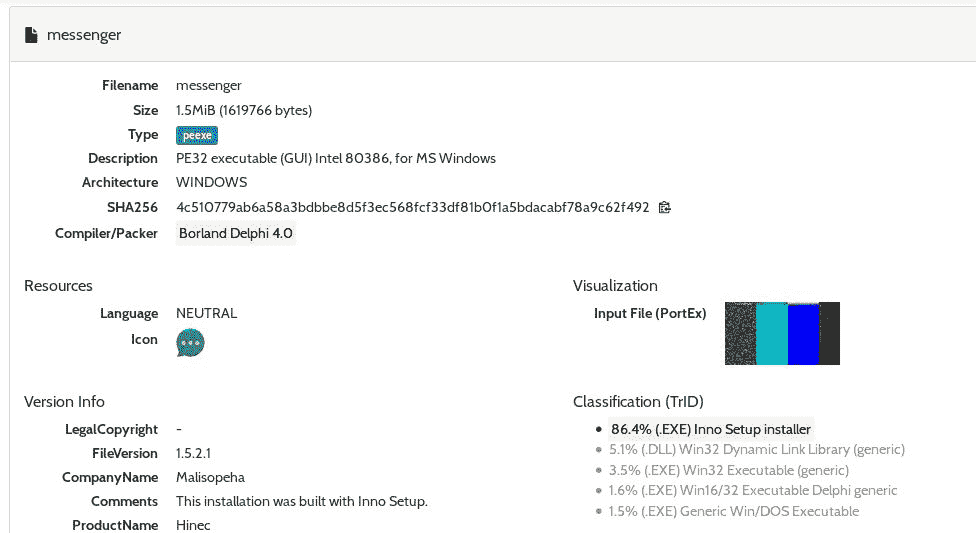

对于我们的第二个恶意软件分类器，我们将使用 API 调用来构建一个机器学习恶意软件检测器。要从恶意软件二进制文件中提取 API，恶意软件分析师需要经历定义明确的步骤:

1.  恶意软件拆包
2.  汇编程序检索
3.  API 调用提取
4.  使用微软官方网站分析 API 调用

您可以将恶意软件行为分类成组。例如，Ballarat 大学在文章*中将 API 调用分为六类，以通过提取 API 调用理解恶意软件行为*。你可以用它来分析你的发现:

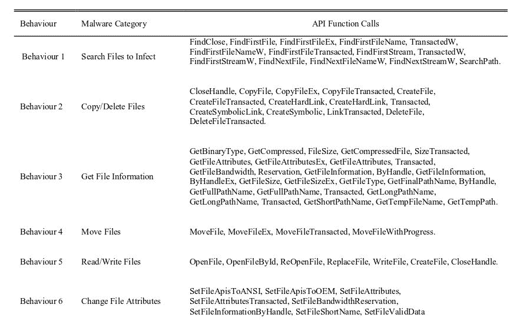

作为演示，让我们使用由 API 调用数据集提供的支持向量机学习算法来构建一个 Android 恶意软件检测项目。本章的 GitHub 文件夹包含一个准备好的数据集来构建我们的模型:

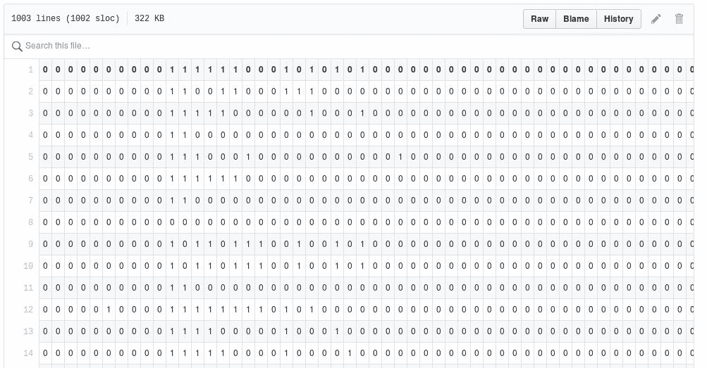

在建立模型之前，我们需要导入一些有用的模块:

```
>>> from sklearn.feature_selection import mutual_info_classif
>>> from sklearn import preprocessing
>>> import numpy as np
>>> from sklearn.svm import SVC, LinearSVC
>>> from sklearn import svm
>>> import csv
>>> import random
```

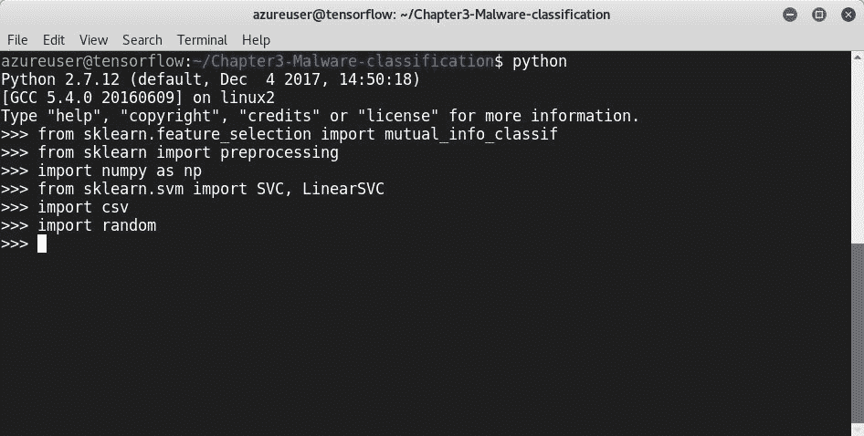

首先，让我们预处理我们的 CSV 文件(`Android_Feats.csv`):

```
>>> PRatio = 0.7
>>> Dataset =  open('Android_Feats.csv')
>>> Reader = csv.reader(Dataset)
>>> Data = list(Reader)
>>> Data = random.sample(Data, len(Data))
>>> Data = np.array(Data)
> Dataset.close()
```

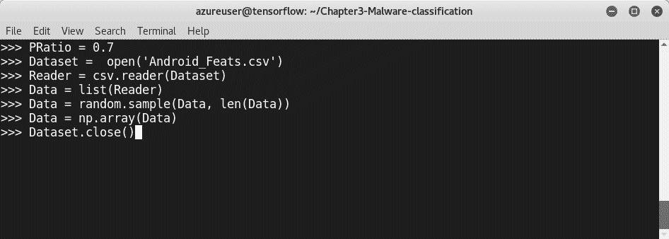

使用 NumPy 标识文件中的数据和标签:

```
>>> cols = np.shape(Data)[1]
>>> Y = Data[:,cols-1]
>>> Y = np.array(Y)
>>> Y = np.ravel(Y,order='C')
>>> X = Data[:,:cols-1]
>>> X = X.astype(np.float)
>>> X = preprocessing.scale(X)
```

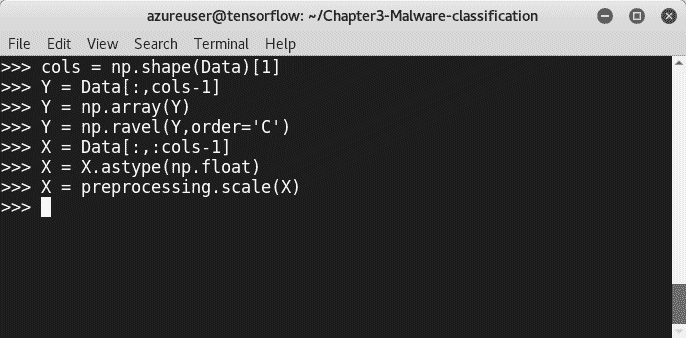

到目前为止，处理阶段已经完成。如前所述，我们需要提取最重要的特征，因为计算所有可用的特征将是一项繁重的任务:

```
Features = [i.strip() for i in open("Android_Feats.csv").readlines()]
Features = np.array(Features)
MI= mutual_info_classif(X,Y)
Featureind = sorted(range(len(MI)), key=lambda i: MI[i], reverse=True)[:50]
SelectFeats = Features[Featureind]
```

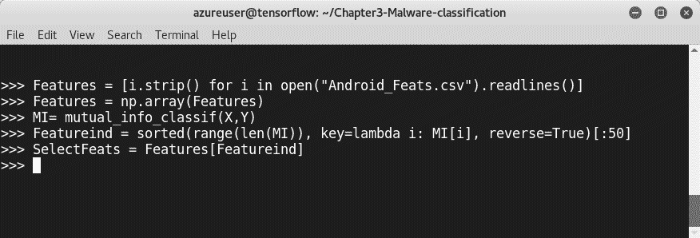

现在，将数据集(数据和标签)分为训练集和测试集:

```
PRows = int(PRatio*len(Data))
TrainD = X[:PRows,Featureind]
TrainL = Y[:PRows]
TestD = X[PRows:,Featureind]
TestL = Y[PRows:]
```


功能选择已成功完成。为了训练模型，我们将使用支持向量机分类器:

```
>>> clf = svm.SVC()
>>> clf.fit(TrainD,TrainL)
>>> score = clf.score(TestD,TestL)
>>> print (score * 100)
```

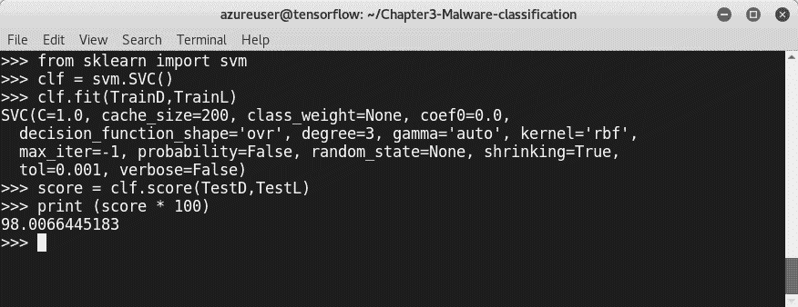

瞧啊。我们的新模型的准确率为 98%，这是一个很大的检测率。


# 摘要

恶意软件是困扰现代组织安全的最普遍的网络威胁之一。黑帽黑客在不断进步；因此，传统的检测技术已经过时，反病毒产品通常无法检测高级的持续威胁。这就是为什么机器学习技术可以帮助我们检测恶意软件。

在本章中，我们学习了如何使用许多机器学习算法和开源 Python 库来构建恶意软件分类器。下一章将教我们如何构建更强大的系统来检测恶意软件，使用人类大脑使用的相同算法。我们将学习如何使用深度学习来检测恶意软件，使用贯穿本书的相同 Python 库。


# 问题

你现在能够建立一个机器学习模型。让我们练习一下，测试一下我们的新技能。在本章的 GitHub 知识库中，你会发现一个包含 Android 恶意软件样本信息的数据集。现在，您需要按照这些说明构建自己的模型。

在`Chapter3-Practice` GitHub 知识库中，你会发现一个包含超过 11000 个良性和恶意 Android 应用的特征向量的数据集:

1.  使用`pandas` python 库加载数据集，这一次，添加`low_memory=False`参数。搜索该参数的用途。
2.  准备将用于训练的数据。
3.  用`test_size=0.33`参数分割数据。
4.  创建一组包含`DecisionTreeClassifier()`、`RandomForestClassifier(n_estimators=100)`和`AdaBoostClassifier()`的分类器。
5.  什么是`AdaBoostClassifier()`？
6.  使用三个分类器训练模型，并打印出每个分类器的指标。


# 进一步阅读

有关更多信息，请查看以下日志和文档:

*   PE 格式(Windows):[https://msdn . Microsoft . com/en-us/library/Windows/desktop/ms 680547(v = vs . 85)。aspx](https://msdn.microsoft.com/en-us/library/windows/desktop/ms680547(v=vs.85).aspx)
*   *恶意软件分析:简介*:*[https://www . sans . org/reading-room/white papers/Malware/Malware-Analysis-Introduction-2103](https://www.sans.org/reading-room/whitepapers/malicious/malware-analysis-introduction-2103)*

**   病毒总文档:[https://www.virustotal.com/en/documentation/](https://www.virustotal.com/en/documentation/)*