# 检测高级持续威胁

现代组织每天都面临网络威胁。黑帽黑客没有表现出任何迹象表明他们将停止。新的黑客技术定期出现。检测**高级持续威胁** ( **APTs** )是一项艰巨的任务，因为这些攻击的目标是长时间不被发现，窃取数据，而不是对系统造成破坏。

根据多份信息安全报告，针对国防、制造业和金融业的 APT 攻击数量正在显著增加。因此，在许多情况下，传统的保护技术是无用的。部署合适的平台和解决方案可以帮助组织和公司抵御网络攻击，尤其是 apt。

本章将为您提供一步一步的指导，教您如何构建一个威胁搜索平台，使用一系列众所周知的开源项目来保护您客户的数据。您将学习如何创建一个机器学习模块来增强您的平台和自动化异常检测，以便您可以专注于团队中的其他问题。

在本章中，我们将介绍:

*   高级威胁形势
*   寻找威胁的方法
*   狩猎成熟度模型
*   网络杀伤链
*   入侵检测的钻石模型
*   使用机器学习搜索威胁，使用 **Elasticsearch** 、 **Logstash** 和 **Kibana** ( **ELK** )堆栈


# 技术要求

在这一章中，我们将使用我们在前面章节中使用的相同的 Python 库。建议您具备以下条件:

*   4 GB 内存
*   2 GB CPU


# 威胁和风险分析

威胁是对组织资产的潜在危险。根据 2017 年**欧盟网络与信息安全局** ( **ENISA** )威胁景观报告，现代组织面临数以百万计的网络威胁，包括:恶意软件、基于网络的攻击、网络钓鱼、勒索软件、僵尸网络等等。对于安全专业人员，尤其是风险经理来说，威胁在风险分析中扮演着重要角色。风险是威胁和漏洞的组合，在数学上可以表示为*风险=威胁 x 漏洞*。


# 寻找威胁的方法

威胁搜寻是一种搜索、识别和理解 apt 的方法。像任何方法学信息安全任务一样，威胁搜寻与工具和实用程序无关。它是流程、人员和技术的结合。

威胁搜寻包括以下步骤:

*   创建假设
*   使用工具和技术进行调查
*   发现新模式
*   通知和丰富分析

以下步骤构成了**威胁搜寻循环**:

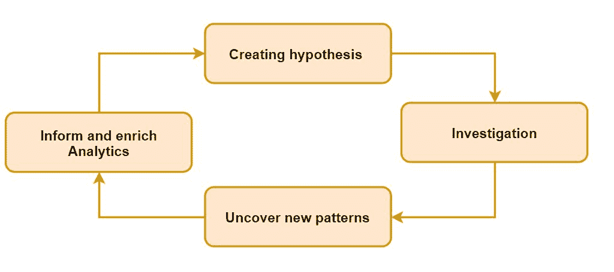

您可以通过从以下选项中选择一个级别来评估您的威胁搜寻程序的成熟度:

*   **第 1 级**:初始(很少或没有数据收集，依靠自动警报)
*   **级别 2** :最低(高水平数据收集)
*   **第 3 级**:程序性(高水平的数据收集，遵循数据分析程序)
*   **第 4 级**:创新(高水平的数据收集，遵循新的数据分析程序)
*   **级别 5** :领先(高水平的数据收集，自动化成功的数据分析程序)

以下两个部分包括威胁搜寻中最重要的术语。


# 网络杀伤链

像信息安全的许多方面一样，网络杀伤链是一个受军方启发的模型，用来描述网络攻击中使用的步骤。

网络杀伤链的七个步骤如下:

*   **侦察**:收集信息，如电子邮件地址
*   **武器化**:将漏洞利用和后门耦合成可交付的有效载荷——换句话说，使用漏洞利用和后门构建可交付的有效载荷

*   **交付**:通过电子邮件或 USB 等不同方式向受害者交付武器包
*   **利用**:利用漏洞在目标机器上执行代码
*   **安装**:安装恶意软件
*   **指挥与控制(C2)** :遥控操纵受害者的指挥通道
*   **行动和目标**:完成最初的目标


# 入侵分析的钻石模型

入侵分析的钻石模型是一种用于验证网络威胁的方法。每个事件都可以用一个菱形来表示。许多信息安全分析师使用这种认知模型来一致地描述有组织的威胁，并随着威胁的发展对其进行跟踪。

菱形的四个节点如下:

*   对手(坏人角色)
*   基础设施(如 IP 地址、域名和电子邮件地址)
*   功能(如恶意软件、漏洞和被盗证书)
*   受害者(如人员和网络资产)


# 与麋鹿群一起寻找威胁

现在，您已经清楚地了解了威胁追踪中最重要的术语。所以，让我们建立一个寻找威胁的平台。在接下来的章节中，我们将学习如何使用开源项目来构建一个威胁搜索系统。在我们的实践指南中，我们将使用最有前途的解决方案之一 ELK Stack。它包括三个开源项目，是当今下载量最大的日志管理平台之一。

ELK 堆栈广泛应用于许多领域，包括:

*   商业智能
*   网络分析
*   信息安全
*   服从

ELK 堆栈由以下组件组成:

*   **弹性搜索**:搜索和分析数据
*   **Logstash** :采集和转换数据
*   基巴纳:可视化数据

下图说明了 ELK 堆栈中的主要组件:

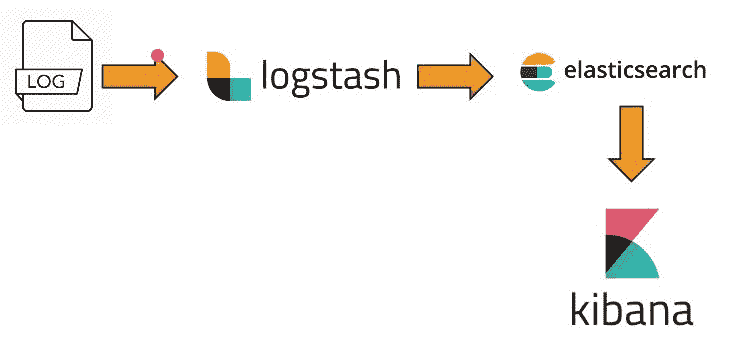

因此，根据主架构，为了构建一个威胁搜索平台，我们需要:收集日志，分析和搜索合适的数据，并管理我们的发现的可视化。让我们看看如何准备 ELK 堆栈环境。


# 弹性搜索

Elasticsearch 是一个令人惊叹的开源项目。它是一个 RESTful 的、分布式的、基于 JSON 的搜索引擎。换句话说，你可以把它看作一个 NoSQL 搜索服务器。你可以在 https://www.elastic.co/看到它的官方网站:


若要下载，请前往 https://www.elastic.co/downloads/elasticsearch:

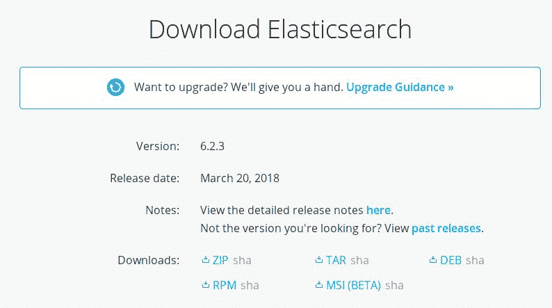

选择合适的包装。在我的例子中，我将把它安装在 Ubuntu 14.04 机器上。因此，我将选择`.deb`版本。建议您具备以下条件:

*   4GB 内存
*   2GB CPU

Elasticsearch 是用 Java 写的。因此，我们需要确保它安装在我们的环境中(如果没有，我们应该下载它)。将 Java 添加到`apt`中，如下所示:

```
sudo add-apt-repository -y ppa:webupd8team/java 
```

现在 Java 源代码被添加到`list.sources`文件中:

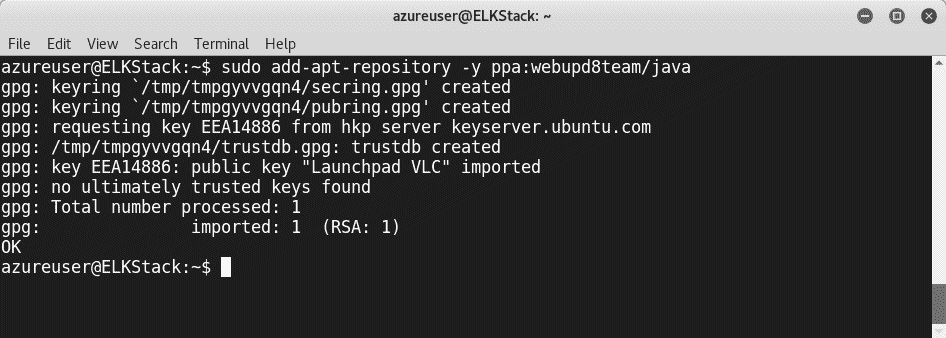

更新`list.sources`文件:

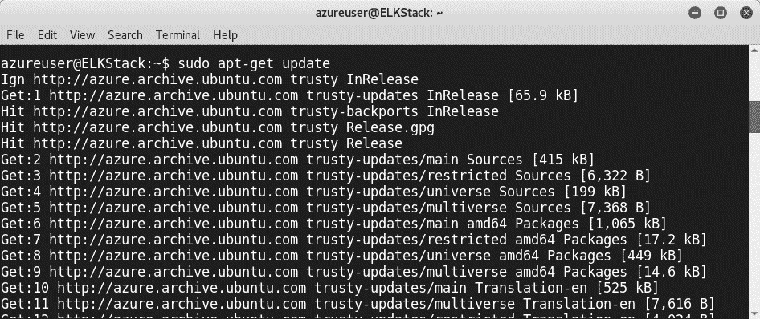

现在，安装 Java `installer`:

```
sudo apt-get -y install oracle-java8-installer
```

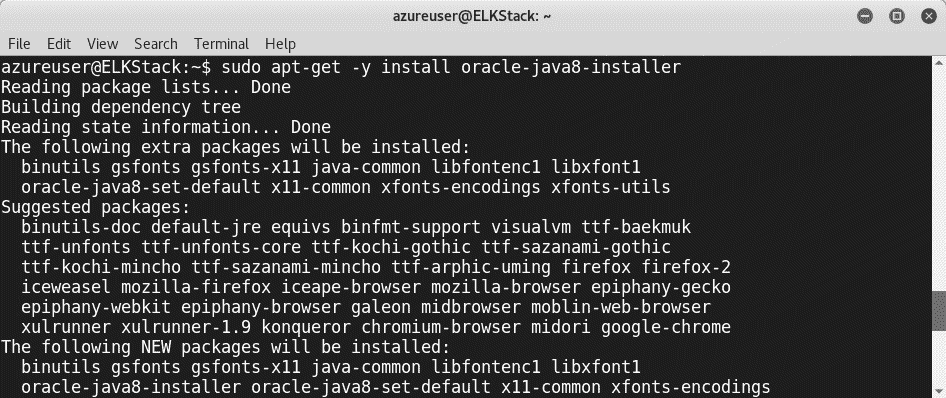

然后，配置它:

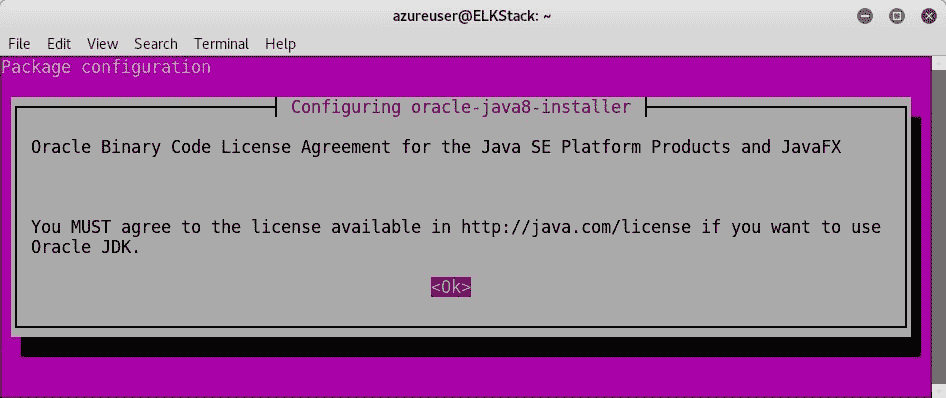

瞧啊。我们已经成功安装了它。通过键入`java -version`命令进行检查:

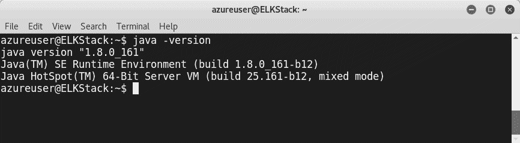

让我们安装 Elasticsearch。按如下方式导入`elasticsearch`公钥:

```
wget -qO - https://packages.elastic.co/GPG-KEY-elasticsearch | sudo
apt-key add -
```


将 Elasticsearch 添加到来源列表:

```
echo "deb https://artifacts.elastic.co/packages/6.x/apt stable main" |
sudo tee -a /etc/apt/sources.list.d/elastic-6.x.list
```

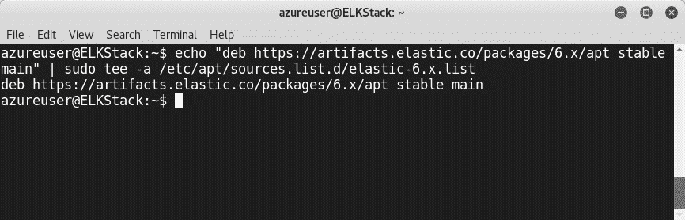

使用`apt-get update`和`install elasticsearch`更新信号源列表:

```
apt-get install elasticsearch
```

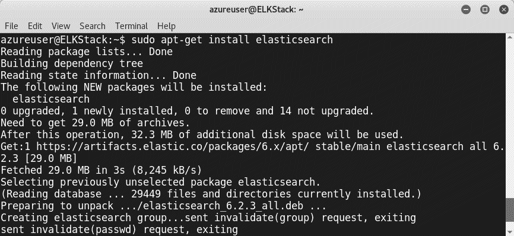

要配置 Elasticsearch，使用文本编辑器编辑`/etc/elasticsearch/elasticsearch.yml`:

```
vi /etc/elasticsearch/elasticsearch.yml
```

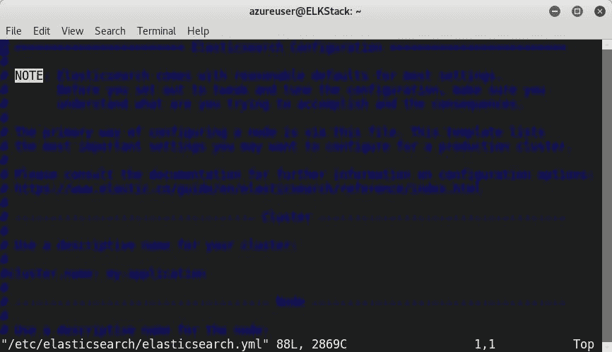

配置文件后，重新启动 Elasticsearch 服务:

```
sudo service elasticsearch restart
```


# 基巴纳

安装和配置 Elasticsearch 之后，是时候安装 Kibana 了，以便在一个设计良好的仪表板中可视化数据。Kibana 是一个包含不同类型图表的 web 界面。你可以把它看作是我们堆栈的可视化层。

像往常一样，使用`apt-get install`命令安装 Kibana:

```
apt-get install kibana
```

安装它不会花太长时间:

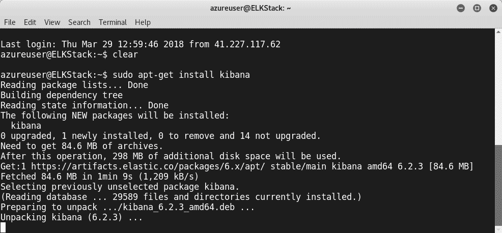

安装后，我们可以通过使用文本编辑器修改`/opt/kibana/config/kibana.yml`配置文件来配置它:

```
sudo vi /opt/kibana/config/kibana.yml
```

使用以下命令启用 Kibana 服务:

```
sudo update-rc.d kibana defaults 96 9
```

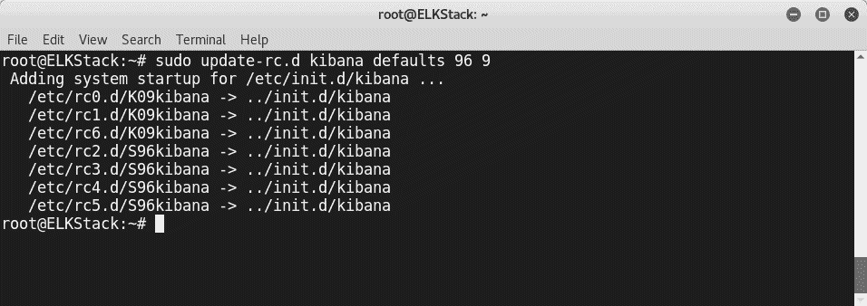

使用以下命令启动服务:

```
sudo service kibana start
```

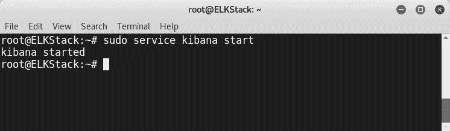

如果您想使用公共 IP 地址从外部访问仪表板，可以使用反向代理。例如， **Nginx** 在这种情况下会很棒。

你可以在`/usr/share/kibana`找到基巴纳文件夹:

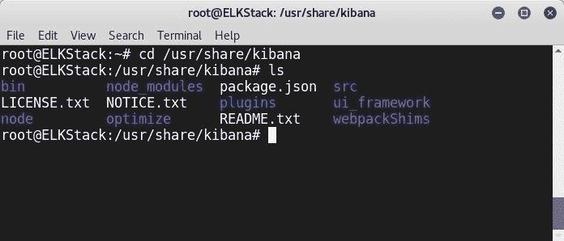

要查看仪表板，请键入`<Address>: 5601`并输入您的凭证:

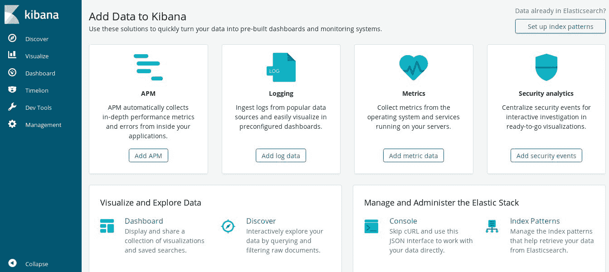<title>Logstash</title> 

# Logstash

至此，我们已经安装了 Elasticsearch 和 Kibana 现在我们需要安装 Logstash 来收集和转换数据。Logstash 管道包含三个组件:

*   投入
*   过滤
*   输出


让我们将 Logstash 添加到 sources 列表，然后更新它:

```
echo 'deb http://packages.elastic.co/logstash/2.2/debian stable main' |
sudo tee /etc/apt/sources.list.d/logstash-2.2.x.list
```

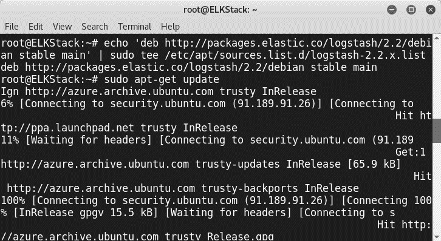

按如下方式安装 Logstash:

```
apt-get install logstash
```

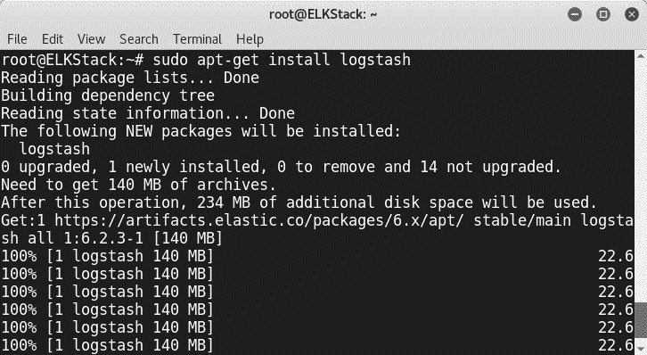

一旦安装了 Logstash，就可以编辑它的配置文件`<Parent_Directory>/logstash/conf/logstash.conf`。您会注意到，配置文件包含两个部分- `input`和`output`:

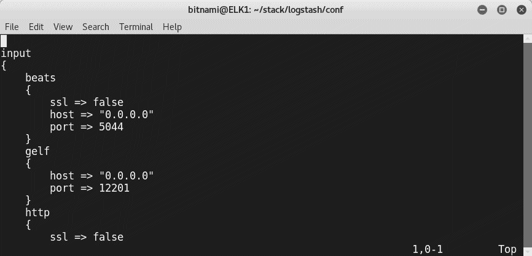

等等！我敢打赌，您一定想知道为什么我们只有两个部分，即使 Logstash 包含三个部分，正如我们之前讨论的那样。你完全正确。我们需要添加一个定制的部分，名为`filters`。Logstash 提供了很好的功能，包括创建个性化过滤器的能力。例如，要创建过滤器，您可以使用以下格式(我们将在后面的指南中使用):

```
filter {
     grok {
         match => { "message" => "COMBINEDAPACHELOG %{COMMONAPACHELOG} %{QS:referrer} %{QS:agent}" }
     }
     date {
         match => [ "timestamp" , "dd/MMM/yyyy:HH:mm:ss Z" ]
    }
 }
```

`gork`过滤器用于将非结构化日志数据解析成结构化和可查询的数据。根据关于过滤器插件的官方部分([https://www . elastic . co/guide/en/logstash/current/plugins-filters-grok . html](https://www.elastic.co/guide/en/logstash/current/plugins-filters-grok.html))，log stash 默认提供了超过 120 种模式。


# 使用 X-Pack 插件的 ELK 堆栈的机器学习

我们现在已经安装了 ELK 堆栈的三个主要组件。如果您想要一种有效的方法来部署 ELK 堆栈，特别是为了测试目的，我建议您使用基于云的堆栈。例如，在下面的演示中，我将使用 Bitnami 预定义的 cloud ELK 堆栈。

Bitnami ELK 堆栈附带以下软件版本:

*   阿帕奇 2.4.29
*   弹性搜索 6.2.2
*   日志存储 6.2.2
*   基巴纳 6.2.2

几分钟后，您的堆栈就可以使用了。下面的屏幕截图显示了 ELK 堆栈文件:

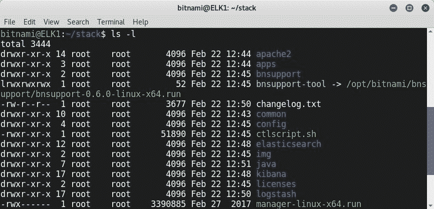

要获取 Bitnami 环境的密码，请转到 Azure 门户中的引导诊断部分，并检查日志文件。您可以在文件的底部找到密码:

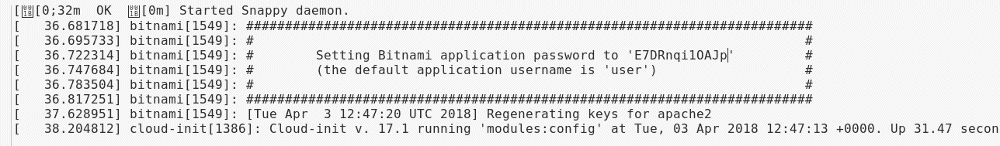

在添加机器学习插件之前，让我们配置一下我们的 ELK 堆栈。使用以下命令加载 ELK 环境并登录到 ELK 服务器:

```
sudo /opt/bitnami/use_elk
```

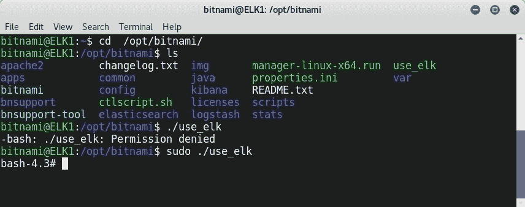

让我们通过键入`sudo /opt/bitnami/ctlscript.sh stop logstash`来停止 Logstash

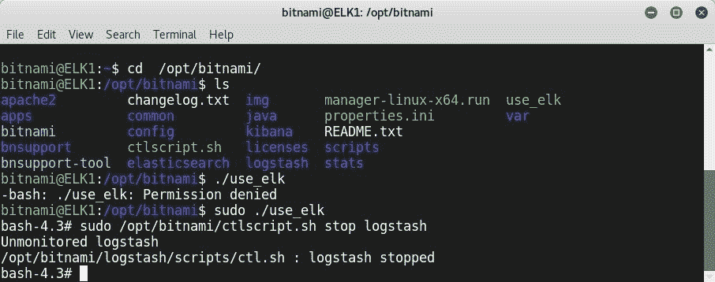

创建一个配置文件，`/opt/bitnami/logstash/conf/access-log.conf`:

```
input {
     file {
         path => "/opt/bitnami/apache2/logs/access_log"
         start_position => beginning
     }
 }

 filter {
     grok {
         match => { "message" => "COMBINEDAPACHELOG %{COMMONAPACHELOG} %{QS:referrer} %{QS:agent}" }
     }
     date {
         match => [ "timestamp" , "dd/MMM/yyyy:HH:mm:ss Z" ]
    }
 }

 output {
     elasticsearch {
         hosts => [ "127.0.0.1:9200" ]
     }
 }
```

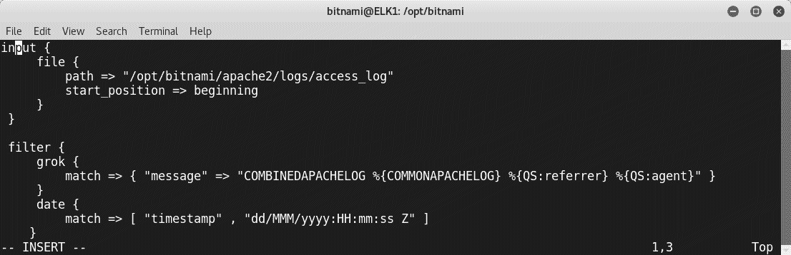

检查`/opt/bitnami/logstash/bin/logstash -f /opt/bitnami/logstash/conf/ --config.test_and_exit`的配置:

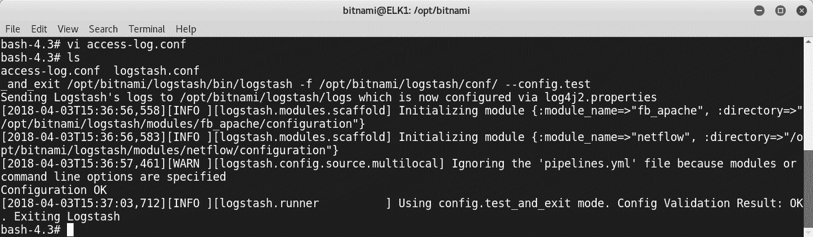

按如下方式启动 Logstash:

```
sudo /opt/bitnami/ctlscript.sh start logstash
```

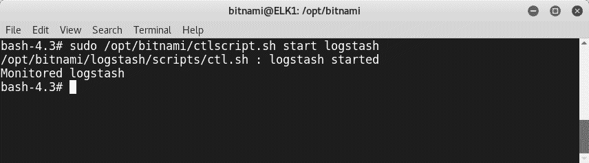

检查 Elasticsearch 是否运行良好:

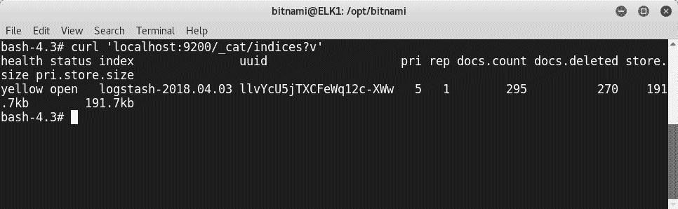

现在，我们去基巴纳。您可能已经注意到，我们还没有索引模式:

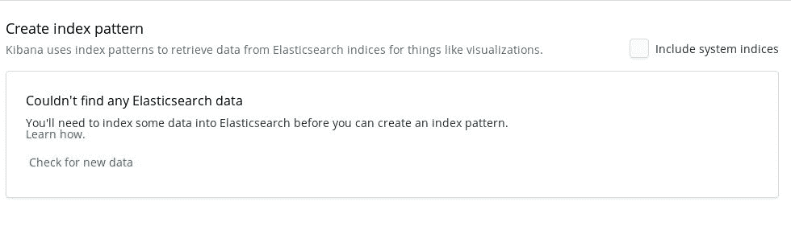

配置完 Logstash 后，我们可以创建一个新的索引模式:

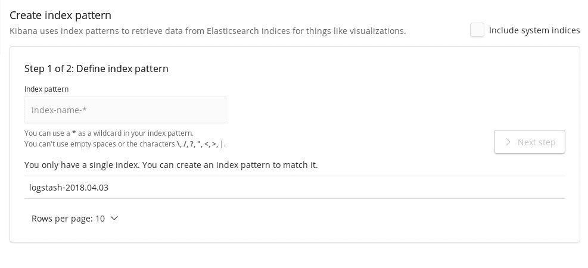

键入`*`并点击下一步:

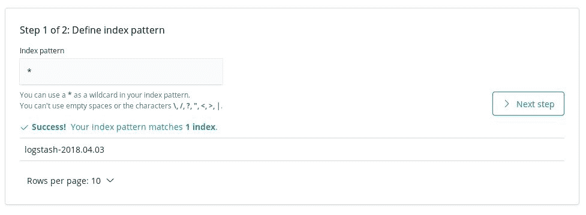

选择@timestamp 并单击 Create Index pattern 按钮。您现在可以在 Kibana 中查看新的索引模式页面:

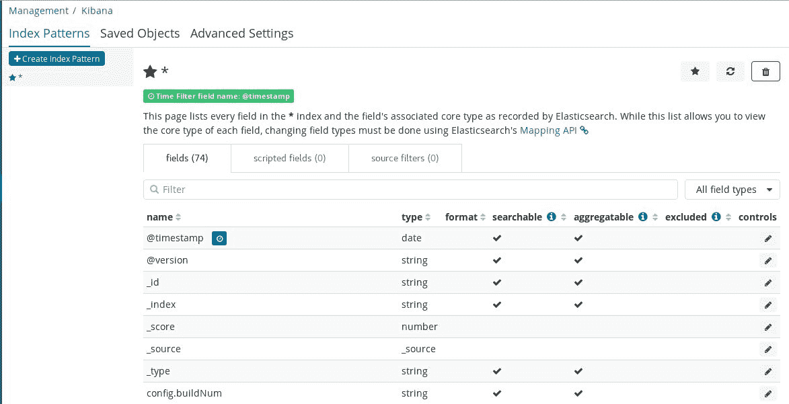

当您点击“发现”选项时，您可以检查日志:

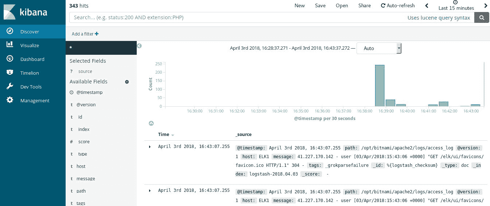

现在，让我们定制一个可视化，稍后添加到主仪表板中。单击侧边列表上的可视化，并创建新的可视化:


在我们的演示中，我们将使用竖线。您可以从一系列图表和可视化工具中进行选择:


对于 X 轴，选择日期直方图作为聚合，选择@timestamp 作为字段:

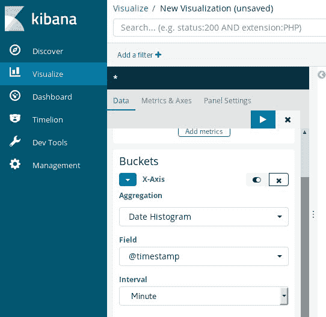

然后，您将看到图表的可视化效果，如下图所示:

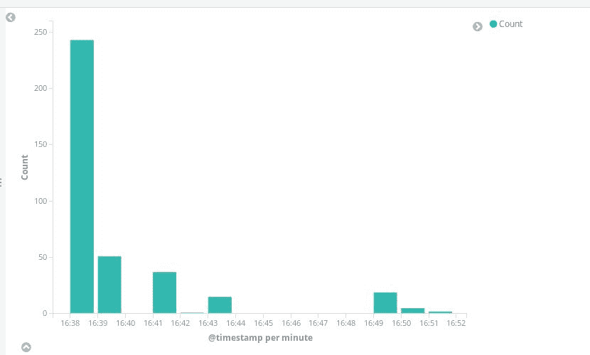

创建可视化后，让我们添加到我们的仪表板。单击仪表板链接并创建一个新的仪表板。然后，添加您的可视化效果:

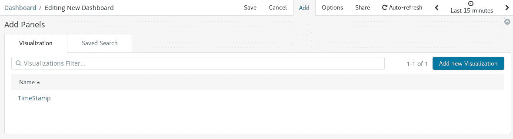

保存仪表板。现在，您可以检查任何指标:

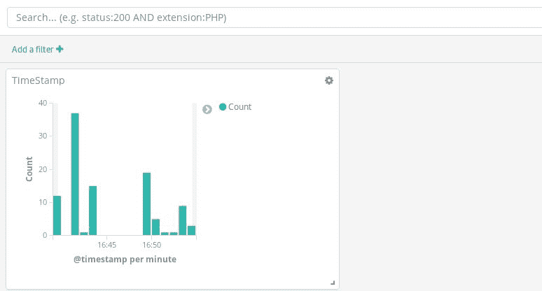

ELK Stack 威胁平台已准备好帮助您捕捉大量高级威胁。让我们将我们的项目提升一个档次，通过使用机器学习的力量来自动化狩猎操作，为它添加一点智能。ELK Stack 让你可以在你的狩猎平台上添加一个名为 X-Pack 的插件，这将帮助你发现你的工件和日志中的异常。

为了获得 X-Pack 插件，我们需要在堆栈的每一层安装它，正如这个官方插图所示:

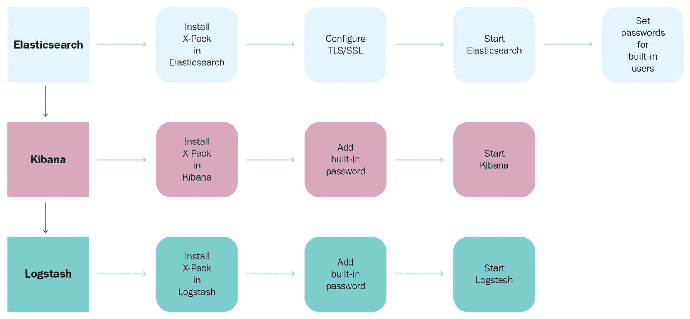

要在 Elasticsearch 上安装插件，请转到`binaries`文件夹，键入以下命令:

```
./elasticsearch-plugin install x-pack
```

同样的行动也适用于基巴纳:

```
sudo bin/kibana-plugin install x-pack
```

它也适用于 Logstash:

```
sudo bin/logstash-plugin install x-pack
```

重新启动所有服务并转到 Kibana 仪表板；你会注意到一个新的选项，叫做机器学习:


最后，由于 X-Pack，您可以添加时间序列异常检测功能。在前一章中，我们详细讨论了异常检测。我们深入研究了异常检测基础知识，以及如何使用机器学习来检测这些异常。X-Pack 使用同样的技术来发现异常。

<title>Summary</title> 

# 摘要

在前面的章节中，我们看到了如何通过使用不同的机器学习算法和 Python 库从零开始构建异常检测系统。本章包括一个分步指南，帮助您使用三个令人惊叹的开源项目构建一个全功能的威胁搜索平台。我们还实现了一个机器学习插件来优化和增强威胁搜索平台的能力。到目前为止，您已经学会了如何使用机器学习的力量来构建许多防御系统。如果你想学习如何绕过机器学习保护措施，下一章是必读的。


# 问题

1.  以下哪一项不是网络杀戮链中的一个步骤？

(a)扫描
(b)控制和命令
(c)发现和传播

2.  以下哪个选项不是入侵分析钻石模型的一个节点？

(a)受害者
(b)基础设施
(c)程序

3.  Logstash 配置文件中需要多少部分？

(a) 2
(b) 3
(c) 4

4.  在 ElasticSearch 中，什么是索引？

(a)在索引中存储数据的过程
(b)识别数据的过程
(c)以上都不是

5.  在 Elasticsearch 中，什么是节点？

(a)一个 Elasticsearch 模块
(b)一个 Elasticsearch 的实例
(c)以上都不是

6.  在 Elasticsearch 中，什么是碎片？

(a)共享文件
(b)共享数据
(c)共享资源(RAM、vCPU 等)

7.  Elasticsearch 有图式吗？(是|否)