# 规避入侵检测系统

为了防御攻击者，部署入侵检测系统对于每个现代公司来说都是必不可少的。在前面的章节中，我们学习了如何构建基于机器学习的入侵检测系统。现在，是时候学习如何用对抗性学习绕过这些系统了；为了保护你的系统，你需要先学会如何攻击它们。

在本章中，我们将介绍以下内容:

*   对抗性机器学习算法
*   机器学习威胁模型
*   利用敌对网络系统规避入侵检测系统


# 技术要求

在本章中，您将需要以下库:

*   PyYAML
*   NumPy
*   SciPy
*   CVXPY
*   Python 3
*   Matplotlib
*   sci kit-学习
*   进步
*   痛苦

*   CVXOPT(可选，作为 CVXPY 解算器)
*   Jupyter 笔记本

你可以在 https://github . com/packt publishing/Mastering-Machine-Learning-for-Penetration-Testing/tree/master/chapter 08 找到代码文件。


# 对抗性机器学习算法

在研究对抗性机器学习之前，我们先来探讨两个重要的术语:过拟合和欠拟合。


# 过度拟合和欠拟合

过度拟合是机器学习从业者面临的最大障碍之一。知道如何发现过度拟合是建立强大的机器学习模型的必要技能，因为达到 99%的准确率并不是故事的结尾。在机器学习中，我们进行预测。根据定义，**拟合**是我们逼近目标函数的程度。正如我们在第一章中看到的，监督学习的目的是映射输入数据和目标之间的函数。因此，良好拟合是函数的良好近似。

当模型学习训练数据中的细节和噪声时，会发生过度拟合，以至于对模型的性能产生负面影响。换句话说，噪声被模型拾取和学习，因此当它被输入新数据时，它不再能很好地概括。下图说明了过度拟合的情况。你会注意到模型被训练得太好了，这使得当我们向模型输入数据时很难达到准确性。

另一个障碍是装备不足。当机器学习模型不能很好地拟合数据时，就会出现这种情况。换句话说，当模型过于简单时:

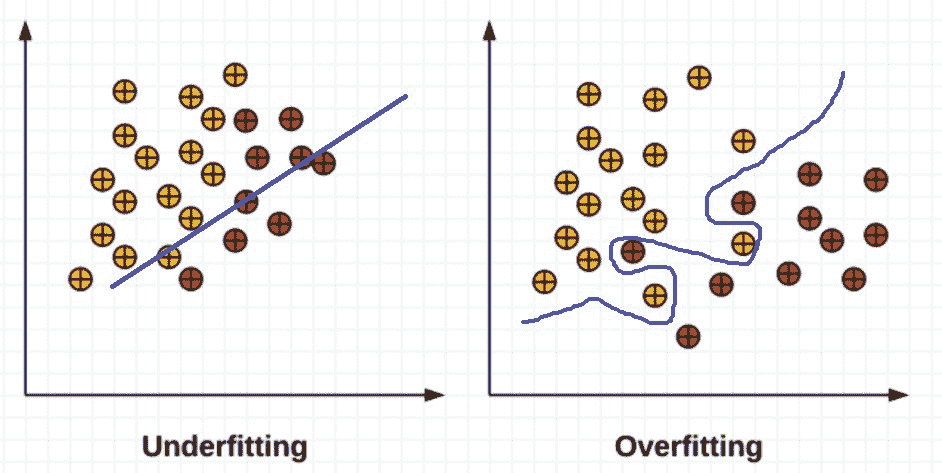<title>Overfitting and underfitting with Python</title> 

# 使用 Python 进行过拟合和欠拟合

让我们通过 scikit-learn 来看看过度拟合和欠拟合的真实世界演示。导入所需的模块:

```
import numpy as np
import matplotlib.pyplot as plt
from sklearn.pipeline import Pipeline
from sklearn.preprocessing import PolynomialFeatures
from sklearn.linear_model import LinearRegression
from sklearn.model_selection import cross_val_score

```

我们现在将构建一个小模型，并可视化模型、样本和`true`函数，以查看过度拟合和欠拟合。我们将使用以下代码:

```
np.random.seed(0)
n_samples = 30
degrees = [1, 4, 15]
X = np.sort(np.random.rand(n_samples))
y = np.cos(1.5 * np.pi * X) + np.random.randn(n_samples) * 0.1
plt.figure(figsize=(14, 5))

for i in range(len(degrees)):
 ax = plt.subplot(1, len(degrees), i + 1)
 plt.setp(ax, xticks=(), yticks=())

 polynomial_features = PolynomialFeatures(degree=degrees[i],
 include_bias=False)
 linear_regression = LinearRegression()
 pipeline = Pipeline([("polynomial_features", polynomial_features),
 ("linear_regression", linear_regression)])
 pipeline.fit(X[:, np.newaxis], y)

 # Evaluate the models using crossvalidation
 scores = cross_val_score(pipeline, X[:, np.newaxis], y,
 scoring="neg_mean_squared_error", cv=10)

 X_test = np.linspace(0, 1, 100)
 plt.plot(X_test, pipeline.predict(X_test[:, np.newaxis]), label="Model")
 plt.plot(X_test, true_fun(X_test), label="True function")
 plt.scatter(X, y, edgecolor='b', s=20, label="Samples")
 plt.xlabel("x")
 plt.ylabel("y")
 plt.xlim((0, 1))
 plt.ylim((-2, 2))
 plt.legend(loc="best")
 plt.title("Degree {}\nMSE = {:.2e}(+/- {:.2e})".format(
 degrees[i], -scores.mean(), scores.std()))
plt.show()
```

通过运行前面的脚本，我们绘制了以下图表，说明了 3 种情况:欠拟合、良好拟合和过拟合(从左到右):

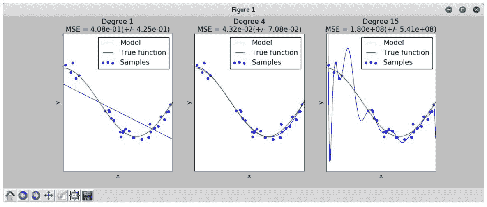

下表是使用前面代码中突出显示的术语以及相应的 URL 创建的:

| **模块** | **网址** |
| `plt.subplot` | [https://matplotlib . org/API/_ as _ gen/matplotlib . py plot . subplot . html # matplotlib . py plot . subplot](https://matplotlib.org/api/_as_gen/matplotlib.pyplot.subplot.html#matplotlib.pyplot.subplot) |
| `plt.setp` | [http://matplotlib . org/API/_ as _ gen/matplotlib . py plot . setp . html # matplotlib . py plot . setp](http://matplotlib.org/api/_as_gen/matplotlib.pyplot.setp.html#matplotlib.pyplot.setp) |
| `PolynomialFeatures` | [http://sci kit-learn . org/stable/modules/generated/sk learn . preprocessing . polynomial features . html # sk learn . preprocessing . polynomial features](http://scikit-learn.org/stable/modules/generated/sklearn.preprocessing.PolynomialFeatures.html#sklearn.preprocessing.PolynomialFeatures) |
| `LinearRegression` | [http://sci kit-learn . org/stable/modules/generated/sk learn . linear _ model。linear regression . html # sk learn . linear _ model。线性回归](http://scikit-learn.org/stable/modules/generated/sklearn.linear_model.LinearRegression.html#sklearn.linear_model.LinearRegression) |
| `Pipeline` | [http://scikit-learn . org/stability/modules/generad/硬化. pipeline . html #硬化. pipeline .](http://scikit-learn.org/stable/modules/generated/sklearn.pipeline.Pipeline.html#sklearn.pipeline.Pipeline)管道 |
| `np.newaxis` | [http://docs . scipy . org/doc/num py-1 . 8 . 1/reference/arrays . index . html # num py . newxis](http://docs.scipy.org/doc/numpy-1.8.1/reference/arrays.indexing.html#numpy.newaxis) |
| `cross_val_score` | [http://scikit-learn . org/stability/modules/generate/硬化. model _ selection . cross _ val _ score . html #硬化. model _ selection . cross _ val _ score](http://scikit-learn.org/stable/modules/generated/sklearn.model_selection.cross_val_score.html#sklearn.model_selection.cross_val_score) |
| `np.newaxis` | [http://docs . scipy . org/doc/num py-1 . 8 . 1/reference/arrays . index . html # num py . newxis](http://docs.scipy.org/doc/numpy-1.8.1/reference/arrays.indexing.html#numpy.newaxis) |
| `np.linspace` | [http://docs . scipy . org/doc/num py-1 . 8 . 1/reference/generate/num py . linspace . html # num py . linspace](http://docs.scipy.org/doc/numpy-1.8.1/reference/generated/numpy.linspace.html#numpy.linspace) |
| `plt.plot` | [http://matplot lib . org/API/_ as _ gen/matplot lib . pyplot . html # matplot lib . pyplot . plot](http://matplotlib.org/api/_as_gen/matplotlib.pyplot.plot.html#matplotlib.pyplot.plot) |
| `plt.scatter` | [http://matplot lib . org/API/_ as _ gen/matplot lib . pyplot . scatter . html # matplot lib . pyplot . scatter](http://matplotlib.org/api/_as_gen/matplotlib.pyplot.scatter.html#matplotlib.pyplot.scatter) |
| `plt.xlabel` | [http://matplot lib . org/API/_ as _ gen/matplot lib . pyplot . xlabel . html # matplot lib . pyplot . xlabel](http://matplotlib.org/api/_as_gen/matplotlib.pyplot.xlabel.html#matplotlib.pyplot.xlabel) |
| `plt.ylabel` | [http://matplot lib . org/API/_ as _ gen/matplot lib . pyplot . ylabel . html # matplot lib . pyplot . ylabel](http://matplotlib.org/api/_as_gen/matplotlib.pyplot.ylabel.html#matplotlib.pyplot.ylabel) |
| `plt.xlim` | [http://matplot lib . org/API/_ as _ gen/matplot lib . pyplot . xlim . html # matplot lib . pyplot . xlim](http://matplotlib.org/api/_as_gen/matplotlib.pyplot.xlim.html#matplotlib.pyplot.xlim) |
| `plt.ylim` | [http://matplot lib . org/API/_ as _ gen/matplot lib . pyplot . ylim . html # matplot lib . pyplot . ylim](http://matplotlib.org/api/_as_gen/matplotlib.pyplot.ylim.html#matplotlib.pyplot.ylim) |
| `plt.legend` | [http://matplotlib . org/API/legend _ API . html # matplotlib . legend](http://matplotlib.org/api/legend_api.html#matplotlib.legend) |
| `plt.title` | [http://matplot lib . org/API/_ as _ gen/matplot lib . pyplot . title . html # matplot lib . pyplot . title](http://matplotlib.org/api/_as_gen/matplotlib.pyplot.title.html#matplotlib.pyplot.title) |
| `plt.show` | [http://matplot lib . org/API/_ as _ gen/matplot lib . pyplot . show . html # matplot lib . pyplot . show](http://matplotlib.org/api/_as_gen/matplotlib.pyplot.show.html#matplotlib.pyplot.show) |


# 检测过配件

为了检测过度拟合，强烈建议将初始数据集分成训练集和测试集。如果训练集的表现比测试集好，那么我们就有问题了。此外，强烈建议从简单的算法开始，然后转移到更复杂的模型，检查提升复杂程度是否值得。为了防止过度拟合，我们可以使用交叉验证。交叉验证是用不同子集( *k* 子集)训练模型来评估很多机器学习技术的过程。


# 对抗性机器学习

对抗性机器学习是研究如何打破和保护机器学习模型的艺术。你可以把它看作是机器学习和信息安全的交集。作为一名安全专业人员，学习如何使用机器学习来构建防御层是很重要的，但知道如何打破它们也是对您的技能集的一个惊人的补充:

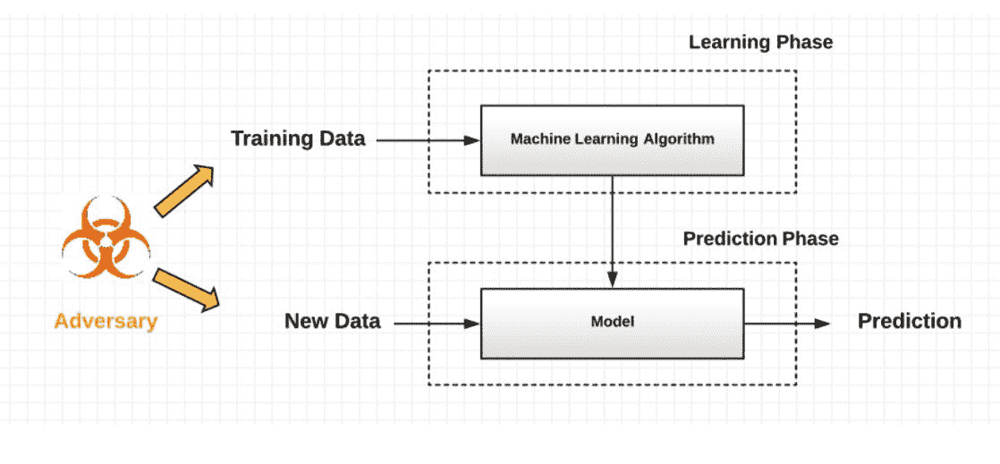

2006 年，Barreno 等人提出了针对机器学习系统的威胁模型的分类法。该模型基于三个轴:

*   影响
*   违反安全
*   特征

2011 年，黄等人对该模型进行了扩展，加入了另一个轴，称为【隐私】。2016 年，Papernot、McDaniel、Jha、弗雷德里克松、切利克和 Swami 引入了一种新的分类法，只关注两个轴:

*   攻击的复杂性
*   攻击者的知识

下图说明了机器学习威胁分类:

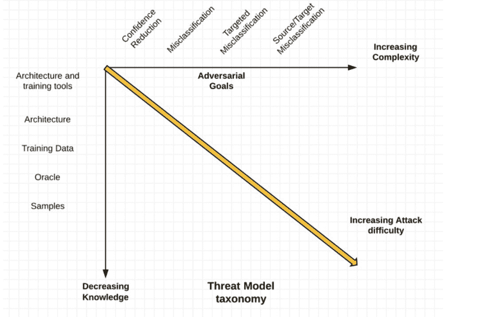

为了攻击机器学习模型，攻击者可以使用许多技术，这些技术将在下面的章节中介绍。


# 规避攻击

为了执行机器学习规避攻击，网络犯罪分子试图通过观察模型如何工作，尤其是结果，通过简单地给模型输入不同的输入来尝试许多不同的样本，并试图找到学习模式，来绕过学习结果。这种技术很受欢迎。例如，如果攻击者想要绕过机器学习垃圾邮件过滤器，他需要向系统提供不同的电子邮件，并搜索一种模式，使垃圾邮件通过(未被检测为垃圾邮件)，并通过对以前检测到的电子邮件进行少量修改来绕过检测。

以下工作流程说明了规避攻击的工作原理:

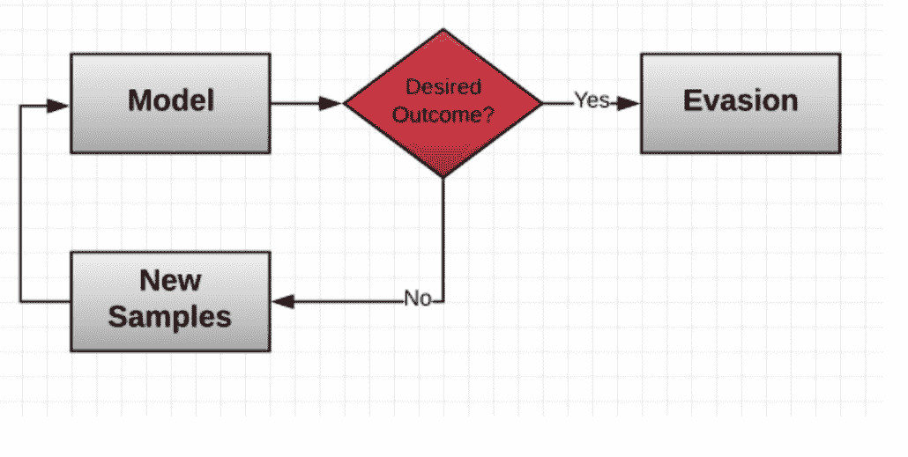<title>Poisoning attacks</title> 

# 中毒袭击

在机器学习中毒攻击中，攻击者通过在模型训练阶段添加恶意数据来毒害模型，以改变学习结果。例如，当在网络操作期间进行数据收集时，可以通过发送和注入精心设计的样本来执行该方法，以训练网络入侵检测系统模型。以下工作流程说明了中毒攻击是如何发生的:

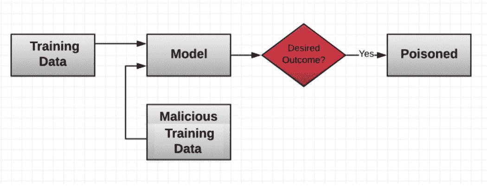

一些关于对抗性机器学习的最伟大的研究是在意大利*模式识别和应用实验室进行的，*包括*针对支持向量机的中毒攻击，【Battista Biggio 和他的团队提出了一个攻击支持向量机系统的伟大框架。步骤如下:*

1.  确定一个合适的对手目标
2.  定义对手的知识

3.  公式化相应的优化问题
4.  相应地对收集的(训练和测试)数据进行重新采样
5.  评估分类器对重采样数据的安全性
6.  对不同层次的对手知识重复评估

如果你熟悉 MATLAB，我强烈推荐你试试 **ALFASVMLib** 。这是一个关于对 SVM 的对抗性标签翻转攻击的 MATLAB 库。你可以从 https://github.com/feuerchop/ALFASVMLib 下载。


# 对抗性聚类

聚类技术广泛应用于许多实际应用中。攻击者正在想出新的技术来攻击聚类模型。其中之一是对抗性聚类，攻击者操纵输入数据(添加一小部分攻击样本)，以便新添加的样本可以隐藏在现有的聚类中。


# 敌对特征

特征选择是每个机器学习项目中的重要步骤。攻击者还使用对抗性特征选择来攻击模型。我强烈推荐你阅读由同一个团队(*模式识别和应用实验室意大利研究人员*)完成的研究，在一篇名为*特征选择对训练数据中毒安全吗？*

该团队表明，通过毒害嵌入式特征选择算法，包括 LASSO、ridge regression 和 ElasticNet，他们骗过了 PDF 恶意软件检测器。

研究人员开发了许多 Python 框架和开源项目来攻击和评估机器学习模型，如 **CleverHans** 、**对抗性机器学习** ( **AML** )库和 **EvadeML-Zoo** 。


# 克莱夫汉斯

CleverHans 正在持续发展中；这是一个对抗性的范例库，用于构建攻击、构建防御以及测试机器学习系统对对抗性攻击的脆弱性。

你可以从[https://github.com/tensorflow/cleverhans](https://github.com/tensorflow/cleverhans)克隆它:

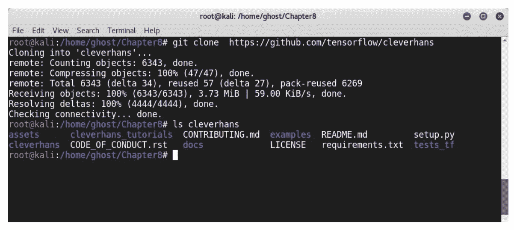

或者，您可以使用`pip`实用程序来安装它，如下所示:

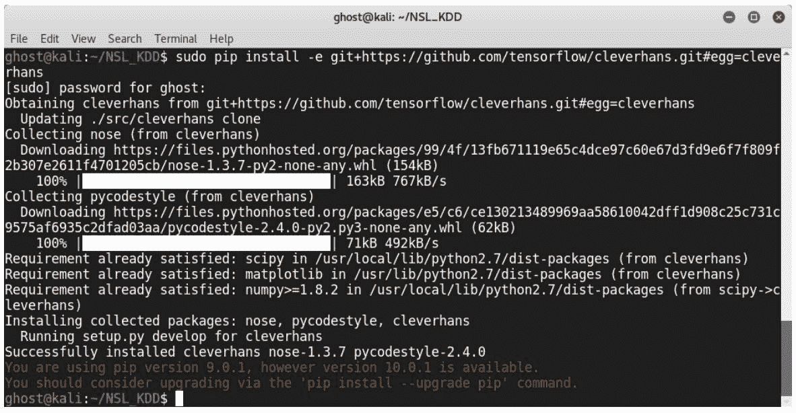<title>The AML library </title> 

# 反洗钱库

AML 库是一个博弈论的对抗性机器学习库，由范德比尔特大学计算经济学研究实验室开发。我们所说的博弈论是指对智能决策主体之间合作的数学模型的研究。你可以从 https://github.com/vu-aml/adlib 的[克隆这个库。](https://github.com/vu-aml/adlib)


# 埃娃德米尔动物园

EvadeML-Zoo 是一个对抗性机器学习的基准测试和可视化工具，由弗吉尼亚大学的机器学习小组和安全研究小组开发。你可以从 https://github.com/mzweilin/EvadeML-Zoo 下载。


# 利用敌对网络系统规避入侵检测系统

到现在为止，你应该已经对对抗性机器学习有了一个相当好的理解，以及如何攻击机器学习模型。是时候深入研究更多技术细节了，学习如何用 Python 绕过基于机器学习的入侵检测系统。您还将学习如何防御这些攻击。

在本演示中，您将学习如何使用投毒攻击来攻击模型。如前所述，我们将注入恶意数据，以便我们可以影响模型的学习结果。下图说明了中毒攻击将如何发生:

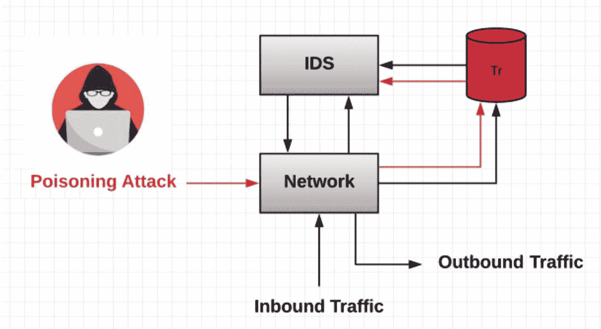

在这次攻击中，我们将使用一种基于**雅可比矩阵的显著图攻击** ( **JSMA** )。这是通过仅修改输入中有限数量的像素来搜索对立的例子来实现的。

让我们看看如何用 Python 攻击基于机器的入侵检测系统。代码有点长，所以我只打算包含一些重要的片段；稍后，您可以在本章的 GitHub 资源库中找到完整的代码。

对于这个项目，我们需要 NumPy、pandas、Keras、CleverHans、TensorFlow、scikit-learn 和 matplotlib Python 库。

以下是一些导入的库:

```
import numpy as np
import pandas as pd
from keras.models import Sequential
from keras.layers import Dense , Dropout
from keras.optimizers import RMSprop , adam
from cleverhans.attacks import fgsm , jsma
from cleverhans.utils_tf import model_train , model_eval , batch_eval
from cleverhans.attacks_tf import jacobian_graph
from cleverhans.utils import other_classes
import tensorflow as tf
from sklearn.tree import DecisionTreeClassifier
from sklearn.ensemble import RandomForestClassifier
from sklearn.linear_model import LogisticRegression
from sklearn.metrics import accuracy_score , roc_curve , auc , f1_score
from sklearn.preprocessing import LabelEncoder , MinMaxScaler
import matplotlib.pyplot as plt
```

下一步是预处理数据:

```
names = ['duration', 'protocol', 'service ', 'flag', 'src_bytes', 'dst_bytes', 'land',
'wrong_fragment ','urgent ', 'hot', 'num_failed_logins ', 'logged_in ', 'num_compromised ', 'root_shell ', 'su_attempted ','num_root ', 'num_file_creations ', 'num_shells ', 'num_access_files ', 'num_outbound_cmds ','is_host_login ', 'is_guest_login ', 'count', 'srv_count ', 'serror_rate', 'srv_serror_rate ','rerror_rate ', 'srv_rerror_rate ', 'same_srv_rate ', 'diff_srv_rate', 'srv_diff_host_rate ','dst_host_count ', 'dst_host_srv_count ', 'dst_host_same_srv_rate ', 'dst_host_diff_srv_rate ','dst_host_same_src_port_rate ', 'dst_host_srv_diff_host_rate ', 'dst_host_serror_rate ','dst_host_srv_serror_rate ','dst_host_rerror_rate ', 'dst_host_srv_rerror_rate ','attack_type ', 'other ']
```

然后我们将加载熊猫的数据:

```
TrainingData = pd.read_csv('KDDTrain+.txt', names=names , header=None)
TestingData = pd.read_csv('KDDTest+.txt', names=names , header=None)
```

然后，连接训练集和测试集:

```
All = pd.concat ([TrainingData, TestingData])
assert full.shape[0] == TrainingData.shape[0] + TestingData.shape[0]
```

选择数据并识别特征:

```
All['label'] = full['attack_type']
```

要识别 DoS 攻击，请使用以下方法:

```
All.loc[All.label == 'neptune ', 'label'] = 'dos'
All.loc[All.label == 'back', 'label '] = 'dos'
All.loc[All.label == 'land', 'label '] = 'dos'
All.loc[All.label == 'pod', 'label'] = 'dos'
All.loc[All.label == 'smurf ', 'label'] = 'dos'
All.loc[All.label == 'teardrop ', 'label '] = 'dos'
All.loc[All.label == 'mailbomb ', 'label '] = 'dos'
All.loc[All.label == 'processtable ', 'label'] = 'dos'
All.loc[All.label == 'udpstorm ', 'label '] = 'dos'
All.loc[All.label == 'apache2 ', 'label'] = 'dos'
All.loc[All.label == 'worm', 'label '] = 'dos'
```

用同样的方法识别其他攻击(**用户到根** ( **U2R** )、**远程到本地** ( **R2L** )、以及**探针**)。

要生成独热编码，请使用以下代码:

```
full = pd.get_dummies(All , drop_first=False)
```

再次确定训练集和测试集:

```
features = list(full.columns [:-5])
y_train = np.array(full[0:TrainingData.shape[0]][[ 'label_normal ', 'label_dos ', 'label_probe
label_r2l ', 'label_u2r ']])
X_train = full[0:TrainingData.shape[0]][ features]
y_test = np.array(full[TrainingData.shape[0]:][[ 'label_normal ', 'label_dos ', 'label_probe ', '
label_r2l ', 'label_u2r ']])
X_test = full[TrainingData.shape[0]:][features]
```

要缩放数据，请使用以下命令:

```
scaler = MinMaxScaler().fit(X_train)
```

`scale X_train`的一个例子如下:

```
X_train_scaled = np.array(scaler.transform(X_train))
```

让我们假设我们要攻击一个逻辑回归模型；我们需要处理数据来训练该模型并生成标签编码:

```
labels = All.label.unique()
En = LabelEncoder()
En.fit(labels)
y_All = En.transform(All.label)
y_train_l = y_All[0:TrainingData.shape[0]]
y_test_l = y_All[TrainingData.shape[0]:]
```

我们现在已经完成了预处理阶段。

对于基于雅可比的显著图攻击，我们将使用以下 Python 实现:

```
results = np.zeros((FLAGS.nb_classes , source_samples), dtype='i')
perturbations = np.zeros((FLAGS.nb_classes , source_samples), dtype='f')
grads = jacobian_graph(predictions , x, FLAGS.nb_classes)
X_adv = np.zeros(( source_samples , X_test_scaled.shape [1]))
for sample_ind in range(0, source_samples):
current_class = int(np.argmax(y_test[sample_ind ]))
for target in [0]:
if current_class == 0:
Break
adv_x , res , percent_perturb = jsma(sess , x, predictions , grads,X_test_scaled[sample_ind: (sample_ind+1)],target , theta=1, gamma =0.1,increase=True , back='tf',clip_min=0, clip_max =1)
X_adv[sample_ind] = adv_x
results[target , sample_ind] = res
perturbations[target , sample_ind] = percent_perturb
```

要构建一个`MultiLayer Perceptron`网络，请使用下面的代码片段:

```
def mlp_model ():
    Generate a MultiLayer Perceptron model
    model = Sequential ()
    model.add(Dense (256, activation='relu', input_shape =( X_train_scaled.shape [1],)))
    model.add(Dropout (0.4))
    model.add(Dense (256, activation='relu'))
    model.add(Dropout (0.4))
    model.add(Dense(FLAGS.nb_classes , activation='softmax '))model.compile(loss='categorical_crossentropy ',optimizer='adam',metrics =['accuracy '])
    model.summary ()
    return model
```

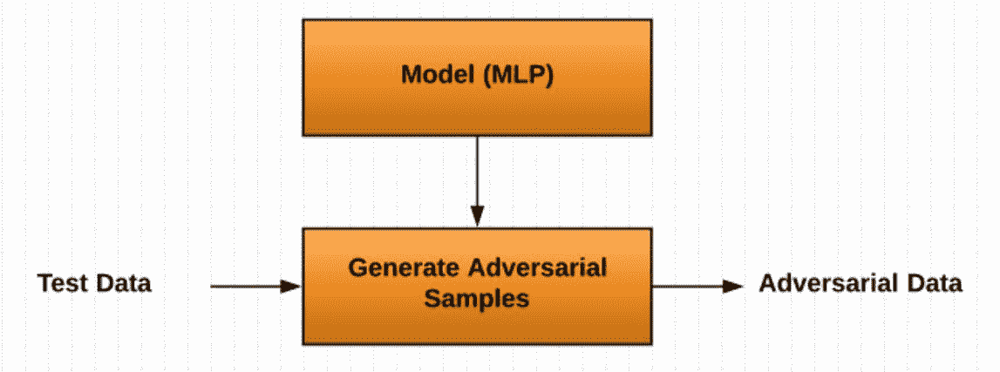

对于对抗性预测，使用以下内容:

```
y_pred_adv = dt.predict(X_adv)
fpr_dt_adv , tpr_dt_adv , _ = roc_curve(y_test[:, 0], y_pred_adv [:, 0])
roc_auc_dt_adv = auc(fpr_dt_adv , tpr_dt_adv)
print("Accuracy score adversarial:", accuracy_score(y_test , y_pred_adv))
print("F1 score adversarial:", f1_score(y_test , y_pred_adv , average='micro '))
print("AUC score adversarial:", roc_auc_dt_adv)
```

最后，我们需要通过提供对抗性测试数据来评估模型:

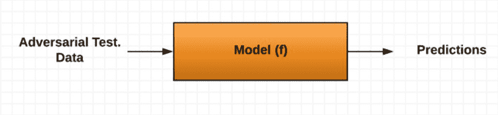

如果你得到错误，检查章节的 GitHub 库。本书出版后，代码可能会更新和增强。


# 摘要

在这一章中，我们提供了对抗性学习技术的概述，并描述了攻击者和网络罪犯如何对机器学习模型进行攻击。

下一章将是一个很好的补充指南，探索如何攻击人工神经网络和深度学习网络。您将了解攻击者如何通过使用对抗性深度学习和强化学习来绕过现代反恶意软件系统。


# 问题

1.  你能简要解释一下为什么过度训练机器学习模型不是一个好主意吗？
2.  过拟合和欠拟合的区别是什么？
3.  闪避攻击和投毒攻击有什么区别？
4.  对抗性聚类是如何工作的？
5.  什么类型的对抗性攻击被用来避开入侵检测系统？
6.  前面的攻击是闪避攻击还是投毒攻击？


# 进一步阅读

*   *人工智能的恶意使用:预测、预防和缓解*:[https://img 1 . wsimg . com/blobby/go/3d 82 DAA 4-97fe-4096-9c6b-376 b 92 c 619 de/downloads/1c 6 q 2 kc4v _ 50335 . pdf](https://img1.wsimg.com/blobby/go/3d82daa4-97fe-4096-9c6b-376b92c619de/downloads/1c6q2kc4v_50335.pdf)
*   【https://blog.openai.com/adversarial-example-research/】用对抗性例子攻击机器学习:
*   *Awesome 对抗性机器学习*:[https://github . com/yenchenlin/Awesome 对抗性机器学习](https://github.com/yenchenlin/awesome-adversarial-machine-learning)
*   *整体对抗训练:进攻与防守*:[https://arxiv.org/pdf/1705.07204.pdf](https://arxiv.org/pdf/1705.07204.pdf)
*   *对抗性机器学习简介*:[https://mascherari . press/Introduction-to-对抗性机器学习/](https://mascherari.press/introduction-to-adversarial-machine-learning/)
*   *对抗入侵检测分类器的对抗性深度学习*:[http://www . diva-portal . org/smash/get/diva 2:1116037/full text 01 . pdf](http://www.diva-portal.org/smash/get/diva2:1116037/FULLTEXT01.pdf)

*   *特征选择对训练数据中毒安全吗？*([http://pralab . diee . unica . it/sites/default/files/biggio 15-icml . pdf](http://pralab.diee.unica.it/sites/default/files/biggio15-icml.pdf))
*   *学习算法的安全性评估*:[http://pralab.diee.unica.it/en/SecurityEvaluation](http://pralab.diee.unica.it/en/SecurityEvaluation)
*   *AI 与安全威胁通用框架*:[https://img 1 . wsimg . com/blobby/go/3d 82 DAA 4-97fe-4096-9c6b-376 b 92 c 619 de/downloads/1c 6 q 2 KC 4v _ 50335 . pdf](https://img1.wsimg.com/blobby/go/3d82daa4-97fe-4096-9c6b-376b92c619de/downloads/1c6q2kc4v_50335.pdf)
*   *机器学习的验证与测试挑战*:[http://www . clever Hans . io/security/privacy/ml/2017/06/14/verification . html:](http://www.cleverhans.io/security/privacy/ml/2017/06/14/verification.html)
*   *针对入侵检测网络的攻击:规避、逆向工程、最优对策*(博士论文):[http://www . seg . INF . uc3m . es/~ spastran/PhD/PhD _ Thesis _ Sergio _ pastrana . pdf](http://www.seg.inf.uc3m.es/~spastran/phd/PhD_Thesis_Sergio_Pastrana.pdf)