<title>Best Practices for Machine Learning and Feature Engineering</title> 

# 机器学习和特征工程的最佳实践

在前面的章节中，我们学习了机器学习的基础知识，我们学习了如何使用一套令人惊叹的开源 Python 库来构建许多不同的 Python 项目。此外，我们还深入探讨了如何打破机器学习模型。

这最后一章将通过举例说明项目不同方面的许多技巧和最佳实践来帮助您构建更好的模型。

在本章中，我们将介绍以下内容:

*   机器学习中特征工程的深入概述
*   机器学习的最佳实践

<title>Technical requirements</title> 

# 技术要求

你可以在 https://github . com/packt publishing/Mastering-Machine-Learning-for-Penetration-Testing/tree/master/chapter 10 找到本章的代码文件。

<title>Feature engineering in machine learning</title> 

# 机器学习中的特征工程

通过构建和开发本书中的所有项目和原型，您肯定已经注意到功能工程和功能选择对于每个现代数据科学产品都是必不可少的，尤其是基于机器学习的项目。根据研究，超过 50%的构建模型的时间被清理、处理和选择训练模型所需的数据所占用。设计、表现和选择特征是你的责任。

大多数机器学习算法不能处理原始数据。他们不够聪明，不能这样做。因此，需要特征工程来将原始状态的数据转换成算法可以理解和使用的数据。吴恩达教授曾经说过:

“想出新功能既困难又耗时，需要专业知识。‘应用机器学习’基本上是特征工程。”

特征工程是数据准备阶段的一个过程，根据跨行业的标准过程进行数据挖掘:


术语**特征工程**本身并不是一个正式定义的术语。它将设计功能的所有任务组合在一起，以构建智能系统。它在系统中起着重要的作用。如果您查看数据科学竞赛，我敢打赌您已经注意到竞争对手都使用相同的算法，但获胜者执行的功能工程最好。如果你想提高你的数据科学和机器学习技能，我强烈建议你去 www.kaggle.com[参加比赛:](http://www.kaggle.com)

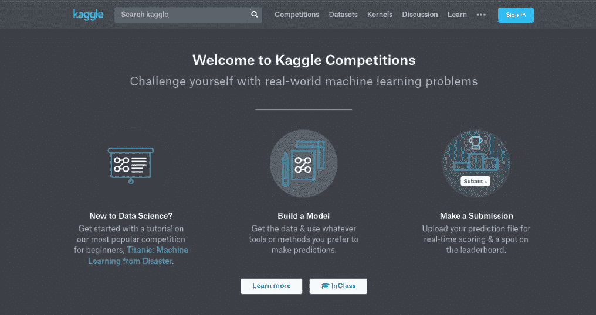

当搜索机器学习资源时，你会面临许多不同的术语。为了避免混淆，我们需要区分特征选择和特征工程。特征工程将原始数据转换成合适的特征，而特征选择从工程数据中提取必要的特征。特色工程是选择所有特征的子集，不包括冗余或不相关的特征。

<title>Feature selection algorithms</title> 

# 特征选择算法

为了使算法能够更快地训练，并减少模型的复杂性和过度拟合，除了提高其准确性之外，您还可以使用许多特征选择算法和技术。我们将研究三种不同的特征选择方法:过滤方法、包装方法和嵌入方法。让我们讨论各种方法和技术。

<title>Filter methods</title> 

# 过滤方法

在过滤方法中，每个特征将被分配一个分数，该分数通过不同的统计测量来计算。换句话说，这些方法通过考虑特征和目标之间的关系来排列特征。过滤方法通常用于预处理阶段:

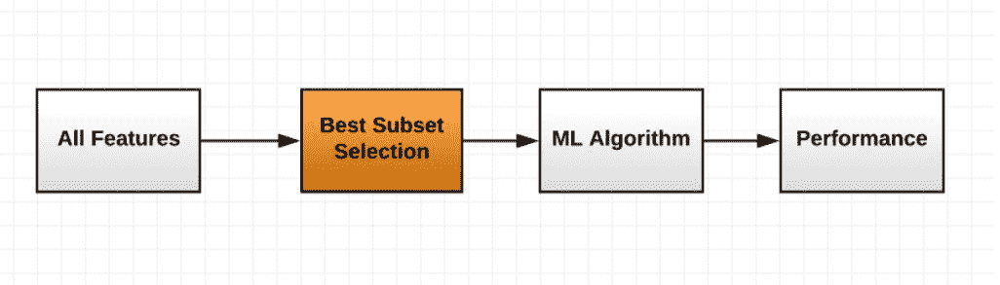<title>Pearson's correlation</title> 

# 皮尔逊相关

皮尔逊相关是一种统计方法，用于测量两个变量`x`和`y`之间的线性相关性。介于`+1`和`-1`之间；`+1`表示有正面的联想。你要知道`x`和`y`应该是连续变量。皮尔逊相关系数的公式如下:

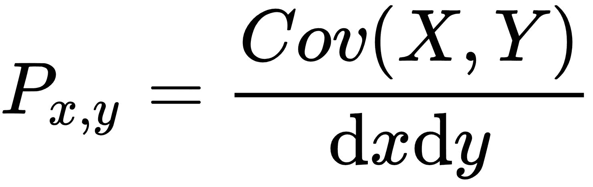

*Cov* 是**的协方差，**和`dx`和`dy`是`x`和`y`的标准差:

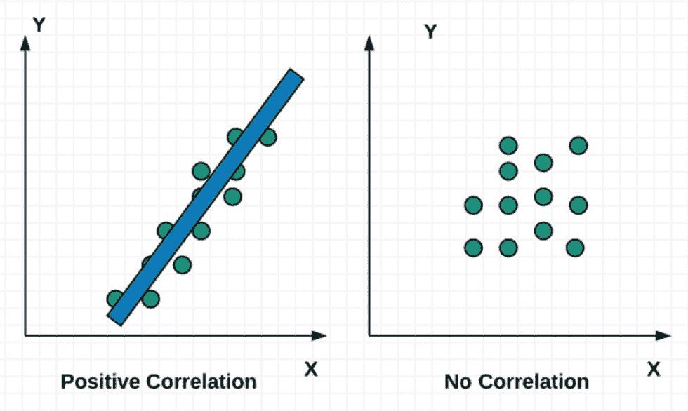

要使用 Python 计算这个，您可以使用`scipy`库中的`scipy.stats.pearsonr(x, y)`。

<title>Linear discriminant analysis</title> 

# 线性判别分析

在前面的章节中，特别是在[第一章](part0021.html#K0RQ0-49a67f1d6e7843d3b2296f38e3fe05f5)、*笔式测试中的机器学习介绍*中，我们看到了**主成分分析** ( **PCA** )的统计过程。**线性判别分析** ( **LDA** )也是一种降维技术。它用于查找分隔类别的要素的线性组合:

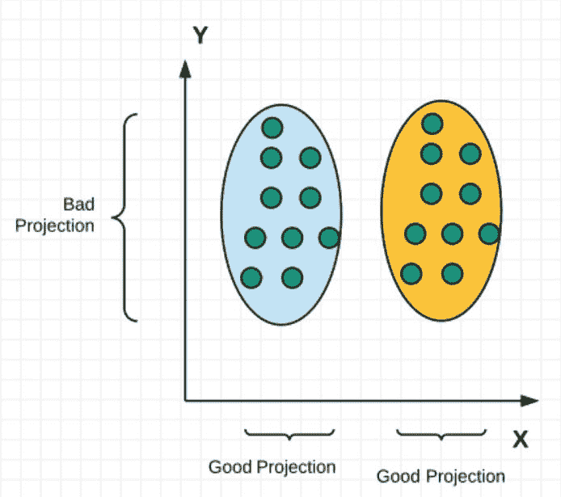

要将 LDA 与 scikit-learn 一起使用，请使用以下行导入它:

```
from sklearn.discriminant_analysis import LinearDiscriminantAnalysis as LDA
```

按如下方式使用它:

```
sklearn_lda = LDA(n_components=2)
 X_lda_sklearn = sklearn_lda.fit_transform(X, y)
```

<title>Analysis of variance</title> 

# 方差分析

**方差分析** ( **ANOVA** )类似于 LDA，但它使用分类特征进行操作，通过分析几个类别之间的差异来检查它们的平均值是否相等。

<title>Chi-square</title> 

# 卡方检验

**卡方**用于确定子集数据是否与总体匹配。这些值应该在类别中。换句话说，卡方检验用于检查不同类别之间的相关性和关联性。

卡方检验的公式如下:

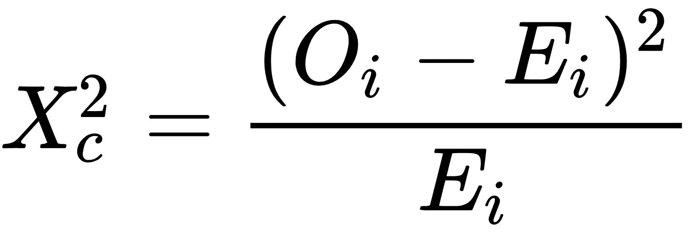

以下是 Jason Brownlee 博士使用 scikit-learn 进行卡方检验的示例:

```
import pandas
import numpy
from sklearn.feature_selection import SelectKBest
from sklearn.feature_selection import chi2
# load data
url = "https://raw.githubusercontent.com/jbrownlee/Datasets/master/pima-indians-diabetes.data.csv"
names = ['preg', 'plas', 'pres', 'skin', 'test', 'mass', 'pedi', 'age', 'class']
dataframe = pandas.read_csv(url, names=names)
array = dataframe.values
X = array[:,0:8]
Y = array[:,8]
# feature extraction
test = SelectKBest(score_func=chi2, k=4)
fit = test.fit(X, Y)
# summarize scores
numpy.set_printoptions(precision=3)
print(fit.scores_)
features = fit.transform(X)
# summarize selected features
print(features[0:5,:]) 
```

下图说明了前面的代码:

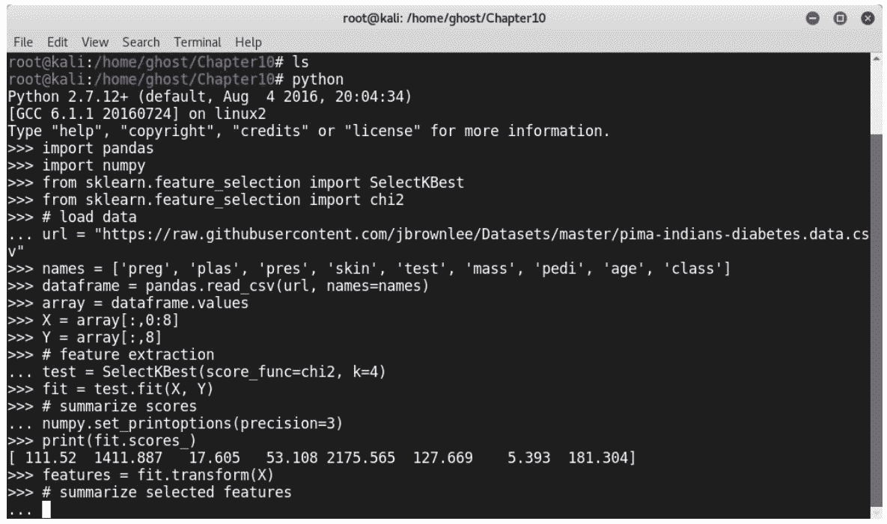<title>Wrapper methods</title> 

# 包装方法

包装器方法通过获取子集和训练学习算法来执行。基于训练的结果，我们可以为我们的模型选择最佳特征。而且，您可能已经猜到，这些方法在计算上非常昂贵:

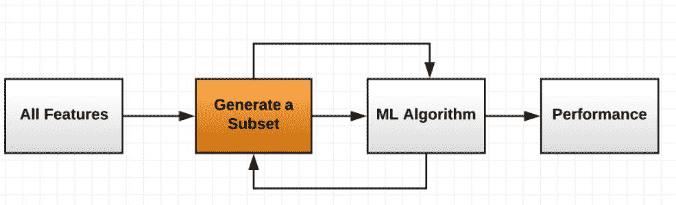

有许多包装技术，包括下面几节中列出的那些。

<title>Forward selection</title> 

# 预选

正向选择使用搜索作为选择最佳特征的技术。这是一种迭代方法。在每次迭代中，我们添加更多的特性来改进模型，直到我们不再有任何进一步的改进:

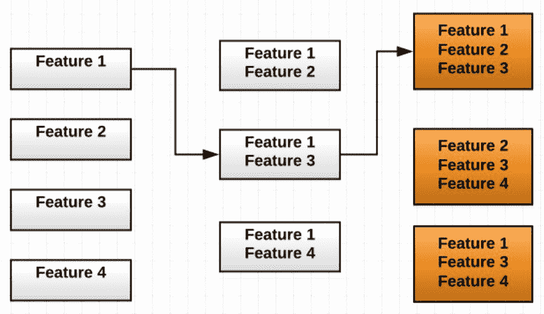<title>Backward elimination</title> 

# 反向消除

向后消除类似于前面的方法，但是这一次，我们从所有的特征开始，并且在每次迭代中消除一些特征，直到模型停止改进:

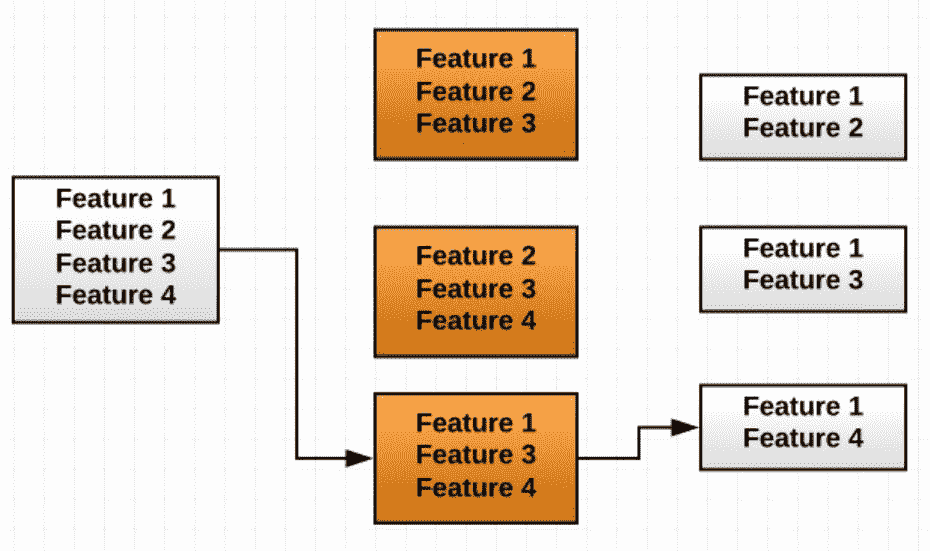<title>Recursive feature elimination</title> 

# 递归特征消除

您可以将递归特征消除视为一种贪婪的优化算法。这种技术是通过创建具有不同子集的模型并计算最佳性能特征，根据淘汰排名对它们进行评分来实现的。

该脚本类似于上一个脚本，但它使用递归特征消除作为特征选择方法:

```
from pandas import read_csv
from sklearn.feature_selection import RFE
from sklearn.linear_model import LogisticRegression
# load data
url = "https://raw.githubusercontent.com/jbrownlee/Datasets/master/pima-indians-diabetes.data.csv"
names = ['preg', 'plas', 'pres', 'skin', 'test', 'mass', 'pedi', 'age', 'class']
dataframe = read_csv(url, names=names)
array = dataframe.values
X = array[:,0:8]
Y = array[:,8]
# feature extraction
model = LogisticRegression()
rfe = RFE(model, 3)
fit = rfe.fit(X, Y)
print("Num Features: %d") % fit.n_features_print("Selected Features: %s") % fit.support_
print("Feature Ranking: %s") % fit.ranking_
```

下图说明了前面的代码:

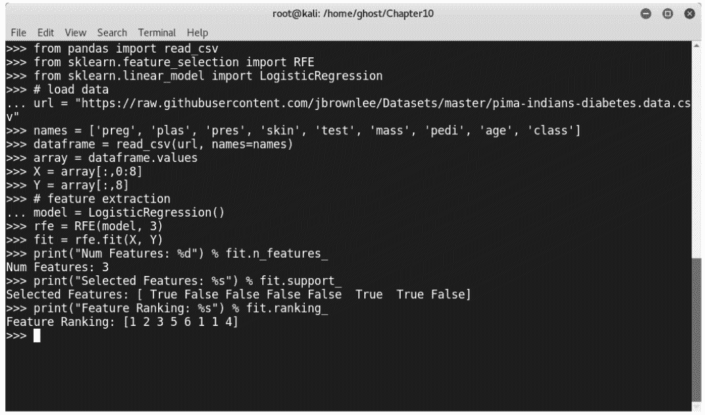<title>Embedded methods</title> 

# 嵌入式方法

特征选择的嵌入式方法的主要目标是了解哪些特征对机器学习模型的准确性贡献最大。它们有内置的惩罚功能来减少过度拟合:

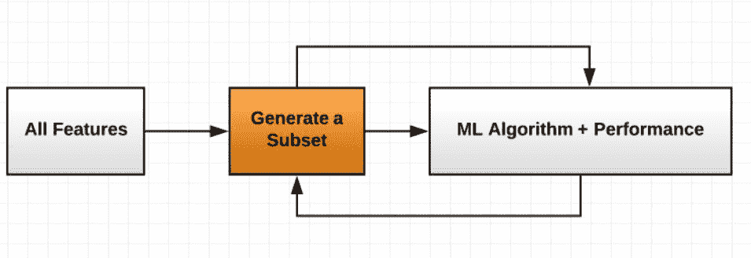

下面几节列出了一些嵌入式技术。

<title>Lasso linear regression L1</title> 

# 拉索线性回归 L1

在统计学中，Lasso 是一种回归分析方法。拉索线性回归 L1 只是增加了一个相当于系数大小绝对值的惩罚。以下是该方法在 Python 和 sckit-learn 中的实现:

```
>>> from sklearn.svm import LinearSVC
>>> from sklearn.datasets import load_iris
>>> from sklearn.feature_selection import SelectFromModel
>>> iris = load_iris()
>>> X, y = iris.data, iris.target
>>> X.shape
>>> lsvc = LinearSVC(C=0.01, penalty="l1", dual=False).fit(X, y)
>>> model = SelectFromModel(lsvc, prefit=True)
>>> X_new = model.transform(X)
>>> X_new.shape
```

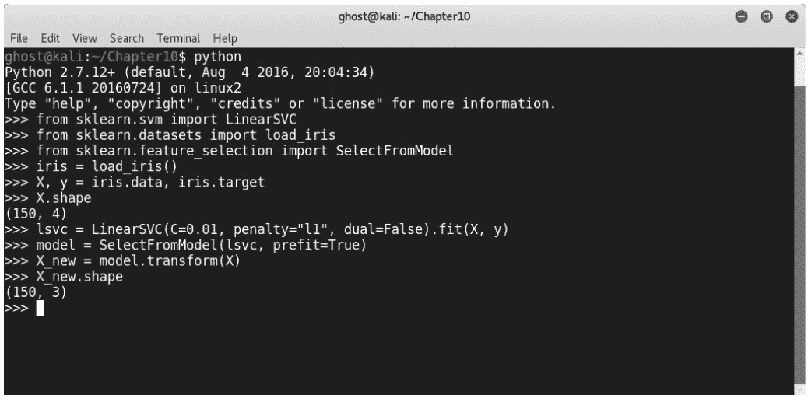<title>Ridge regression L2</title> 

# 岭回归 L2

岭回归 L2 方法增加了一个等价于系数大小平方的惩罚。换句话说，它执行 L2 正则化。

<title>Tree-based feature selection</title> 

# 基于树的特征选择

基于树的特征选择方法用于检查和计算特征重要性。以下是我们如何使用 scikit-learn 官方文档提供的基于树的特征选择技术的示例:

```
>>> from sklearn.ensemble import ExtraTreesClassifier
>>> from sklearn.datasets import load_iris
>>> from sklearn.feature_selection import SelectFromModel
>>> iris = load_iris()
>>> X, y = iris.data, iris.target
>>> X.shape
>>> clf = ExtraTreesClassifier()
>>> clf = clf.fit(X, y)
>>> clf.feature_importances_ 
>>> model = SelectFromModel(clf, prefit=True)
>>> X_new = model.transform(X)
>>> X_new.shape         
```

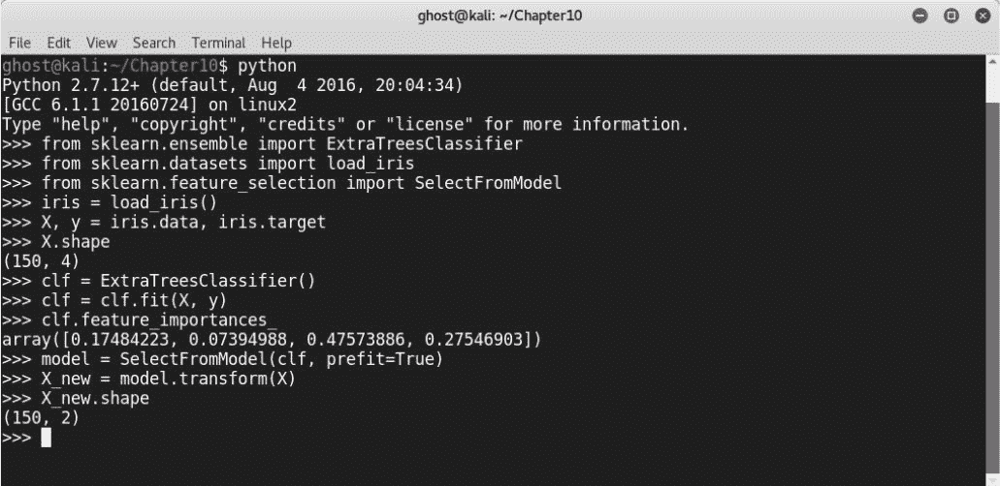

如前所述，特征选择用于预处理阶段，因此您可以使用 scikit-learn 构建管道，如下例所示:

```
Classifier = Pipeline([
  ('feature_selection', SelectFromModel(<SelectionTechniqueHere>))),
  ('classification', <ClassificationAlgorithmHere>)
 ])
 Classifier.fit(X, y)
```

伊莎贝尔·盖恩(Isabelle Guyon)和安德烈·埃利斯塞夫(Andre Elisseeff)写了一本名为*变量和特性选择简介*的好书，其中包括一份更好的特性选择清单。

要了解更多关于完整清单的信息，您可以浏览[https://machinelingmastery . com/an-introduction-to-feature-selection/](https://machinelearningmastery.com/an-introduction-to-feature-selection/)。

<title>Best practices for machine learning</title> 

# 机器学习的最佳实践

在前面的章节中，我们看到了如何执行特征工程来增强我们的机器学习系统的性能。现在，我们将讨论一些构建健壮智能系统的技巧和最佳实践。让我们探索机器学习项目不同方面的一些最佳实践。

<title>Information security datasets</title> 

# 信息安全数据集

数据是每个机器学习模型的重要组成部分。为了训练模型，我们需要给它们提供数据集。在阅读前面的章节时，你会注意到，要建立一个准确有效的机器学习模型，你需要大量的数据，即使是在清理数据之后。拥有大量可用数据的大公司使用他们的内部数据集来建立模型，但像初创公司这样的小组织通常很难获得如此大量的数据。由于数据隐私是信息安全的一个重要方面，国际规则和条例使这项任务变得更加困难。每个现代企业都必须保护其用户的数据。为了解决这个问题，许多机构和组织正在提供公开可用的数据集，以便其他人可以下载它们并构建他们的模型用于教育或商业用途。一些信息安全数据集如下:

*   **控制器局域网** ( **CAN** )入侵检测数据集(OTIDS):[http://ocslab.hksecurity.net/Dataset/CAN-intrusion-dataset](http://ocslab.hksecurity.net/Dataset/CAN-intrusion-dataset)
*   用于入侵检测的汽车黑客数据集:[http://ocslab.hksecurity.net/Datasets/CAN-intrusion-dataset](http://ocslab.hksecurity.net/Datasets/CAN-intrusion-dataset)
*   用于网络犯罪剖析的网络黑客数据集:[http://ocslab.hksecurity.net/Datasets/web-hacking-profiling](http://ocslab.hksecurity.net/Datasets/web-hacking-profiling)
*   **基于 API 的恶意软件检测系统** ( **APIMDS** )数据集:[http://ocslab.hksecurity.net/apimds-dataset](http://ocslab.hksecurity.net/apimds-dataset)
*   入侵检测评估数据集(cicids 2017):【http://www.unb.ca/cic/datasets/ids-2017.html 
*   Tor-nonTor 数据集:[http://www.unb.ca/cic/datasets/tor.html](http://www.unb.ca/cic/datasets/tor.html)
*   Android 广告软件和一般恶意软件数据集:[http://www.unb.ca/cic/datasets/android-adware.html](http://www.unb.ca/cic/datasets/android-adware.html)

<title>Project Jupyter</title> 

# Jupyter 项目

Jupyter Notebook 是一个用于创建和共享编码文档的开源 web 应用程序。我强烈推荐它，尤其是对新手数据科学家，原因有很多。它将赋予您直接编码和可视化输出的能力。它非常适合发现和处理数据；探索数据是建立机器学习模型的重要一步。

Jupyter 的官网是[http://jupyter.org/](http://jupyter.org/):

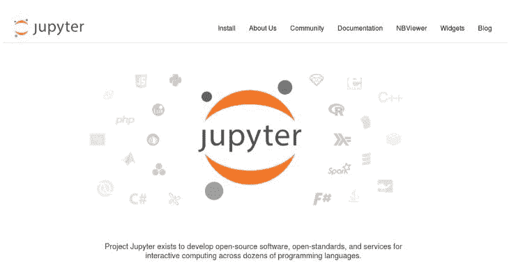

要使用`pip`安装它，只需输入以下命令:

```
python -m pip install --upgrade pip
python -m pip install jupyter
```

<title>Speed up training with GPUs</title> 

# 使用 GPU 加速训练

如你所知，即使有好的特征工程，机器学习的训练在计算上也是昂贵的。训练学习算法最快的方法是使用**图形处理单元**(**GPU**)。通常，尽管不是在所有情况下，使用 GPU 对于训练模型来说是一个明智的决定。为了克服 CPU 性能瓶颈，聚集/分散 GPU 架构是最好的，执行并行操作以加快计算速度。

TensorFlow 支持使用 GPU 来训练机器学习模型。因此，设备被表示为字符串；下面是一个例子:

```
"/device:GPU:0" : Your device GPU
"/device:GPU:1" : 2nd GPU device on your Machine
```

要在 TensorFlow 中使用 GPU 设备，可以添加以下行:

```
with tf.device('/device:GPU:0'):
    <What to Do Here>
```

您可以使用单个 GPU 或多个 GPU。不要忘记使用以下命令安装 CUDA 工具包:

```
Wget "http://developer.download.nvidia.com/compute/cuda/repos/ubuntu1604/x86_64/cuda-repo-ubuntu1604_8.0.44-1_amd64.deb"

sudo dpkg -i cuda-repo-ubuntu1604_8.0.44-1_amd64.deb

sudo apt-get update

sudo apt-get install cuda
```

按照以下方式安装 cuDNN:

```
sudo tar -xvf cudnn-8.0-linux-x64-v5.1.tgz -C /usr/local

export PATH=/usr/local/cuda/bin:$PATH

export LD_LIBRARY_PATH="$LD_LIBRARY_PATH:/usr/local/cuda/lib64:/usr/local/cuda/extras/CUPTI/lib64"
export CUDA_HOME=/usr/local/cuda
```

<title>Selecting models and learning curves</title> 

# 选择模型和学习曲线

为了提高机器学习模型的性能，需要调整许多超参数。使用的数据越多，可能发生的错误就越多。为了处理这些参数，有一个叫做`GridSearchCV`的方法。它通过迭代对预定义的参数值执行搜索。默认情况下，`GridSearchCV`使用`score()`功能。要在 scikit-learn 中使用它，请使用以下代码行导入它:

```
from sklearn.grid_search import GridSearchCV
```

学习曲线用于理解机器学习模型的性能。要在 scikit-learn 中使用学习曲线，请将其导入到您的 Python 项目中，如下所示:

```
from sklearn.learning_curve import learning_curve
```

<title>Machine learning architecture</title> 

# 机器学习架构

在现实世界中，数据科学家不会发现数据像公开可用的数据集那样干净。真实世界的数据以不同的方式存储，并且数据本身以不同的类别形成。因此，机器学习实践者需要建立自己的系统和管道来实现他们的目标和训练模型。典型的机器学习项目遵循以下架构:

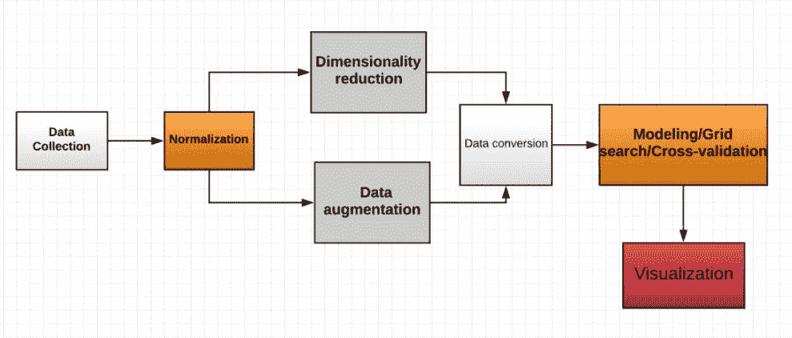<title>Coding</title> 

# 编码

良好的编码技能对数据科学和机器学习非常重要。除了使用有效的线性代数、统计和数学，数据科学家还应该学习如何正确编码。作为一名数据科学家，您可以从许多编程语言中进行选择，比如 Python、R、Java 等等。

尊重编码的最佳实践是非常有帮助的，并且强烈推荐。通过这些技巧可以写出优雅、简洁、易懂的代码:

*   注释对于可理解的代码非常重要。所以，永远不要忘记注释你的代码。
*   为变量、函数、方法、包和模块选择正确的名称。
*   每个缩进层次使用四个空格。
*   正确构建您的存储库。
*   遵循常见的风格指南。

如果你使用 Python，你可以遵循这个伟大的格言，叫做*Python 的禅，*由传奇人物 Tim Peters 撰写:

“漂亮总比难看好。
显性比隐性好。简单比复杂好。
复杂总比复杂好。
扁平比嵌套好。
稀不如密。
可读性很重要。特例不足以特殊到违反规则。
虽然实用性胜过纯粹性。错误永远不会悄无声息地过去。
除非明确消音。
面对暧昧，拒绝猜测的诱惑。应该有一种——最好只有一种——显而易见的方法来做这件事。虽然这种方式一开始可能并不明显，除非你是荷兰人。
现在总比没有好。
虽然永远也不会比现在*好。如果实现很难解释，这是个坏主意。
如果实现起来容易解释，这也许是个好主意。名称空间是一个非常棒的想法——让我们多做一些吧！”

<title>Data handling</title> 

# 数据处理

良好的数据处理导致成功构建机器学习项目。加载数据集后，请确保所有数据都已正确加载，并且读取过程正确执行。在数据集上执行任何操作后，检查生成的数据集。

<title>Business contexts</title> 

# 业务环境

智能系统与业务方面高度相关，因为毕竟，您正在使用数据科学和机器学习来解决业务问题或构建商业产品，或者从获得的数据中获得有用的见解，以做出好的决策。为了解决业务问题，在构建机器学习模型时，识别正确的问题并提出正确的问题非常重要。

<title>Summary</title> 

# 摘要

这本书是学习如何使用开源库、Python 和一组开源项目来构建机器学习项目以抵御网络威胁和恶意活动的实用指南。我们没有就此止步；我们还向您展示了如何使用对抗性机器学习来攻击这些模型。通过这些，您获得了一系列分析数据、构建防御系统和突破下一代安全措施的技能。我们通过讨论许多要点来帮助您构建更好的模型，从而完成了本书。

<title>Questions</title> 

# 问题

1.  特征工程和特征选择有什么区别？
2.  主成分分析(PCA)和特征选择有什么区别？
3.  我们如何对像日期和时间这样的特征进行编码？
4.  为什么打印出培训和测试的准确性很有用？
5.  我们如何部署机器学习模型并将其用于产品中？
6.  为什么特征工程比其他步骤花费更多的时间？
7.  虚拟变量的作用是什么？

<title>Further reading</title> 

# 进一步阅读

**论文和幻灯片**:

*   *特征工程* - *知识发现与数据挖掘 1* ，作者罗曼·克恩:[http://kti . tugraz . at/staff/Denis/courses/KDD m1/Feature Engineering . pdf](http://kti.tugraz.at/staff/denis/courses/kddm1/featureengineering.pdf)
*   *特征工程与选择*([https://people . eecs . Berkeley . edu/~ Jordan/courses/294-fall 09/lections/Feature/slides . pdf](https://people.eecs.berkeley.edu/~jordan/courses/294-fall09/lectures/feature/slides.pdf))-*CS 294:实用机器学习，*Berkeley:[https://people . eecs . Berkeley . edu/~ Jordan/courses/294-fall 09/lections/Feature/](https://people.eecs.berkeley.edu/~jordan/courses/294-fall09/lectures/feature/)
*   *特征工程*普林斯顿大学利昂·博图著:[http://www . cs . Princeton . edu/courses/archive/spring 10/cos 424/slides/18-feat . pdf](http://www.cs.princeton.edu/courses/archive/spring10/cos424/slides/18-feat.pdf)

**博文**:

*   *发现特性工程——如何设计特性以及如何做好它:*[https://machinelingmastery . com/Discover-Feature-Engineering-How-to-Engineering-Features-and-How-to-Get-Good-It/](https://machinelearningmastery.com/discover-feature-engineering-how-to-engineer-features-and-how-to-get-good-at-it/)
*   *机器学习掌握度*:[https://machinelearningmastery.com/start-here/](https://machinelearningmastery.com/start-here/)

**书籍**:

*   *特征提取、构建和选择:数据挖掘视角*:[https://www.amazon.com/dp/0792381963?tag=inspiredalgor-20](https://www.amazon.com/dp/0792381963?tag=inspiredalgor-20)
*   *特征提取:基础与应用*:[https://www.amazon.com/dp/3540354875?tag=inspiredalgor-20](https://www.amazon.com/dp/3540354875?tag=inspiredalgor-20)
*   *计算机视觉的特征提取与图像处理，第三版:*【https://www.amazon.com/dp/0123965497?tag=inspiredalgor-20 