<title>Security Analytics with Elastic Machine Learning</title>  

# 具有弹性机器学习的安全分析

说在企业环境中管理安全威胁已经不像过去那样了，这听起来可能是老生常谈，但这是事实。现在的问题不再是您的部分环境是否受到损害，而是您何时能发现它。

换句话说，大多数安全专业人员目前采取的态度是，他们控制下的资产已经受到威胁，必须每天采取积极措施来发现这些威胁迹象的任何出现**(**IoC**)。**

 **这并不是说你应该放弃外围安全，因为这种努力是没有意义的；安全团队仍然需要一套可靠的规则和策略来保护内部资产免受试图进入环境的外部威胁。防火墙和其他外围防御技术与以往一样重要。然而，威胁并不总是在外面寻找进入的机会；很明显，您必须努力防止内部人员接触并协助实施危害，例如，在访问可能允许安装恶意软件的危害网站时，出现电子邮件网络钓鱼情形或驾车攻击。当然，一些保守的组织通过非常有选择性地选择哪些外部网站甚至可以从公司网络内部看到来缓解这一问题。

尽管您的外围规则和公司政策看起来很谨慎，但它们本身是不够的。安全专业人员现在将他们的日常任务定位于威胁情报计划，以帮助他们更好地理解这一点:

*   哪些最新类型的攻击和对手是突出的
*   攻击者会在组织中寻找什么目标和目的
*   恶意行为者采用什么方法渗透组织

这些关键概念使安全团队能够清楚地了解对手的动机，执行威胁搜寻，并降低风险。

然后，这一切都归结为能够预测随着时间的推移变得越来越复杂的攻击。换句话说，IT 安全专业人员面临的挑战是让数据具有可操作性，以便能够做到以下几点:

*   近实时检测存在的 IOC
*   根据组织面临的风险确定这些事件的优先级
*   主动控制和/或解决事故

毫无疑问，上述要点中最关键的部分是如何针对海量信息扩展技术基础架构，以及如何扩展人类对数据的理解，同时应对不断变化的攻击环境。

在本章中，我们将讨论以下主题:

*   如何使用弹性 ML 检测基于行为的异常
*   了解长矢量攻击的细节
*   寻找攻击细节的威胁
*   基于分析结果采取行动

<title>Security in the field</title>  

# 外地的安全

弹性堆栈最初设计时并未考虑安全分析使用情形；记住，它被设计成一个高效的数据存储和搜索引擎。然而，显而易见的是，与 it 运营中的日志记录/指标/性能使用情形类似，弹性堆栈也是一个非常适合用于安全分析的平台，因为它能够实时访问大量各种数据。让我们看看弹性堆栈发展成为安全分析可行平台的原因和方式。

<title>The volume and variety of data</title>  

# 数据的数量和种类

在深入探讨如何使用弹性 ML 应对安全威胁之前，让我们先介绍一下安全团队在数据量和数据种类方面面临的挑战。

即使是中等规模的企业也可以每天收集超过 1tb 的数据，并将这些数据保留 6 个月。如果我们考虑到一个事件的大小平均为 800 字节，这就是每秒大约 25，000 个事件的接收速率。较大的企业可能每秒收集 100，000 或更多的事件。

对于安全专业人员来说，令人望而生畏的挑战不仅仅是处理如此大量的数据和寻找可能存在的已知不良行为，还包括发现与正常行为相比的异常行为，以及能够将多个异常行为关联起来以了解新出现的威胁的整个生命周期。此外，您必须在完成所有这些工作的同时评估对组织的潜在影响。因此，这不仅仅是对一个国际奥委会采取行动，而是从一个国际奥委会追溯到另一个国际奥委会，以了解攻击的来源，并从那里采取行动，以防止任何进一步的类似事件。

从确定国际奥委会的角度来看，时间非常重要，因为找到源头花费的时间越多，组织的资产就越脆弱。这意味着安全团队迫不及待地想要得到答案；从摄取到异常检测和分析，实时或接近实时以保持真实性是追踪威胁的必要条件。

我们在上一章[第 4 章](30e51bb2-df59-4ae5-943f-52c3a2e9682e.xhtml)、 *IT 运营分析和根本原因分析*中介绍了这些要求中的大部分，但是信息安全智能分析从使用概况的角度带来了另一个层次的期望，这在传统的安全解决方案中是不合适的，例如**安全信息和事件管理** ( **SIEM** )，这本质上是不可扩展的。

在现场，我们可以看到越来越多的传统 SIEM 项目采用 SIEM 增强模式，允许安全团队结合 SIEM 在数据收集、合规性报告和事件处理流程方面的优势，以及弹性堆栈在能够将所有数据放在一个位置、检测异常和实时搜索威胁方面的优势。最终，当功能需求通过堆栈中的功能慢慢实现时，这些 SIEM 解决方案将被 Elastic 所取代。

在 Elastic ML 的帮助下，这个迁移路径变得更加自然，它的配置和操作与实现的时间序列或用例类型无关。换句话说，它可以处理多功能性和各种数据进行实时分析，将繁重的数据管理工作留给 Elasticsearch。

这里突出了两个关键点:

*   将所有数据放在一个位置即可轻松访问，这样就可以用更少的时间和精力来搜索、分析、关联和获得洞察力
*   该分析的过程应该与数据类型无关，提供用例的灵活性，包括那些还没有构思的用例

在许多传统安全项目中，情况并非如此:数据分布在多个系统或数据存储中，这严重阻碍了首先发现威胁的过程，而且还会将检测到的威胁与潜在的整体攻击联系起来。传统的安全解决方案，如**入侵检测系统** ( **IDS** )平台，在基于现有规则的知识库检测已知威胁方面非常有效。然而，过于具体会限制检测的灵活性，当数据种类增加时，可能会遗漏事件。更糟糕的是，对一组已知的检测规则过于具体，使得对手能够提前知道正在寻找什么类型的行为，从而允许行为的修改保持在雷达之下并避免检测。我们将看到弹性堆栈如何使安全团队能够灵活地操作，并在稍后面对复杂和多变的攻击。

<title>The geometry of an attack</title>  

# 攻击的几何学

攻击可以表现为不同的形式:一个单独的、离散的动作，或者一段时间内一组复杂的、相互关联的动作，跨越基础架构的不同部分，从而跨越不同的数据集。攻击的形式或几何结构非常多变，取决于攻击的目标以及 IT 环境的结构。

让我们举一个 DNS 隧道攻击的例子，它包括一个**受损的服务器**使用伪装成一系列看起来合法的 **DNS** 请求的加密消息从组织中泄漏数据。下图中描述的这种行为表明，**受损的服务器**随着时间的推移发出一系列(数千甚至数百万)的 **DNS** 请求，其中一小部分有效载荷的数据被加密到一个非常规域名的请求的子域部分。另一方面，由黑客运行的受损的 DNS 服务器接受并重组加密数据:

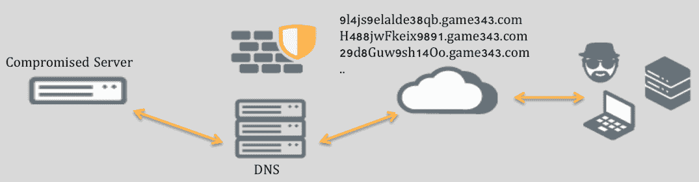

由于以下几点，这种渗透技术经常未被发现:

*   安全策略不会阻止或限制从组织内部到外部世界的 DNS 流量； **DNS** 对于互联网的运营来说太基础了。
*   **DNS** 流量通常大得令人难以置信，因此对于非大数据平台来说，数据的收集、存储和分析是不可能或不切实际的。因此，这些数据通常不会被收集和监视，这使其成为隐藏恶意行为的绝佳场所。
*   在 **DNS** 隧道中使用的实际技术是低效的，而且非常慢；泄露大量数据可能需要数周或数月时间。所以，这种低而慢的方法在隐蔽时是一种资产。

显然，很明显，如果您由于传统安全工具缺乏功能而没有收集和分析这类数据，那么您就承认了您不仅容易受到这种攻击媒介的攻击，而且您甚至永远不会知道它是否正在发生。

这种 **DNS** 隧道活动是一种离散的恶意行为，当然任何安全分析师都希望能够检测和阻止这种行为。但是，这种活动可能处于或接近一长串相关恶意活动的末端；它可能始于用户的机器在几天、几周或几个月前受到损害。

为了全面了解这种威胁从最初的危害到数据泄露是如何随着时间的推移而变化的，安全分析师必须拥有大量不同的数据，并且手头要有数周或数月的数据。威胁活动的证据可能以各种方式表现在网络数据、身份验证日志、端点日志或其他数据中。

为了说明这一点，下图展示了这种**高级持续威胁** ( **APT** )的生命周期:

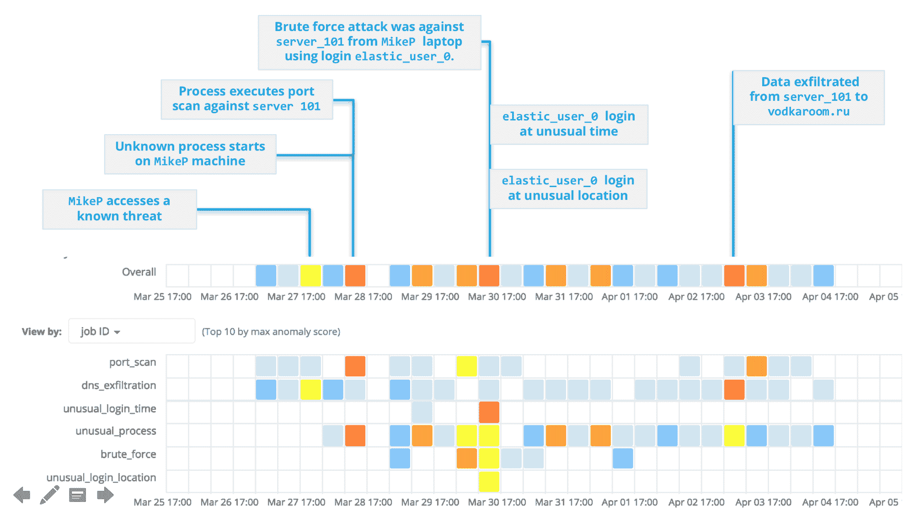

我们将在本章中使用这个场景，并看看弹性 ML 如何帮助揭示这种攻击的细节。

但首先，上图中的几个词是关于杀伤链是如何表达的:

*   第一步(最初的危害)发生在组织内的机器通过恶意外部网站访问已知威胁时
*   就在威胁被触及并且机器被感染之后，一个不寻常的进程开始在同一台机器上运行
*   然后，当 APT 进入其侦察阶段时，从该机器调用端口扫描活动
*   可疑的登录活动随后会针对一台我们知道拥有一些有价值资产的服务器发生
*   这些有价值的资产然后通过 DNS 向外部世界渗透

ML 可以帮助我们检测这些不同的 IOC 随着时间的推移而发生的情况，并提醒安全团队进行调查并采取措施。

因为攻击被分解为不同的步骤，而且每个步骤的证据都存在于 IT 系统的不同部分，所以必须对不同的数据集(如 Windows 机器日志、网络日志等)进行索引和搜索。因此，构建适当的数据采集架构是追溯所有这些事件的基础。

<title>Threat hunting architecture</title>  

# 威胁搜寻架构

在本节中，我们将介绍威胁搜寻体系结构的基本构件。其中包括一个多重摄取层，从 Beats 开始收集来自不同来源的数据，从 Logstash 开始丰富威胁情报的数据。数据准备妥当后，下一步将关注调查分析。

<title>Layer-based ingestion</title>  

# 基于层的摄取

威胁搜寻体系结构依赖于丰富可靠的数据摄取，这将允许您检测和调查异常行为。在我们的场景中，我们需要使用来自最终用户工作站的数据和来自网络的数据。幸运的是，我们有 Packetbeat 和 Winlogbeat，它们分别捕获网络活动和接收 Windows 机器上生成的日志。这些可以从[https://www.elastic.co/downloads/beats](https://www.elastic.co/downloads/beats)下载，那里列出了所有的节拍:

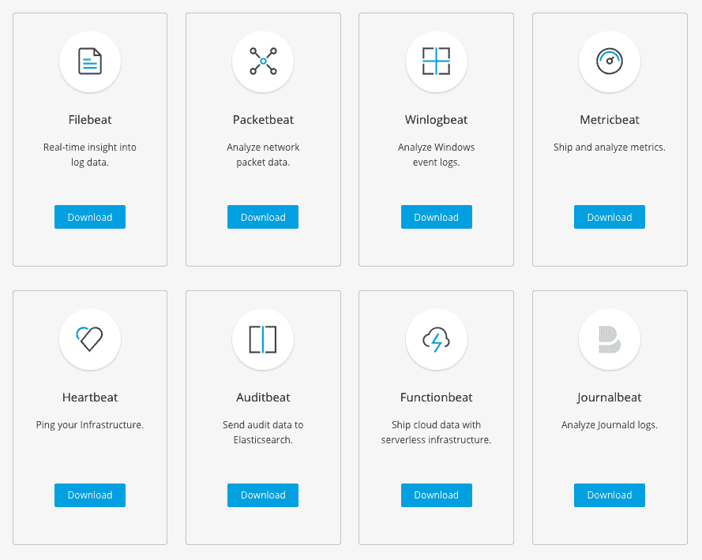

如你所见，它们不是唯一可以接收数据的节拍；不同的目的有不同的节拍。每个节拍都有一组模块或指标集，可以根据您想要摄取的数据来启用。例如，以下是 Packetbeat 可用的一个:

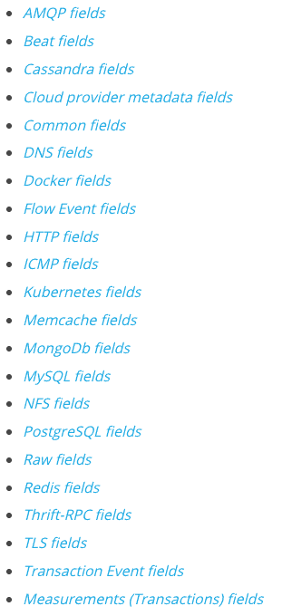

在我们检测 DNS 隧道的例子中，我们需要收集 DNS 数据来查看和检测异常的出站 DNS 查询。

一般来说，对于不是来自 Beats 框架的数据，建议在获取之前尽可能地丰富这些数据。这样可以更好地理解数据，最终可以更全面地分析数据。幸运的是，来自 Beats 的数据已经有了丰富的内容。

另一个要考虑的方面是索引模式命名约定；也就是说，如果您希望跨索引关联数据。在我们的示例中，我们的环境由三个索引模式组成，如下面的屏幕截图所示:

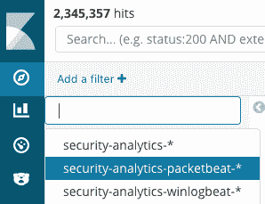

这种基于层次结构的索引结构的布局使得每次添加基础结构层时，索引名称都遵循相同的命名模式。因此，如果您需要查看特定的数据层(如网络数据)，只需选择 Packetbeat 索引。如果您想看到所有的数据，您可以很容易地选择顶级索引。这种方法适用于 Kibana 中的每个视图:发现、可视化和机器学习。

弹性 ML 需要最少的数据量来建立有效的异常检测模型。本质上，它是基于 ML 能多快地获得各种模型参数的第一次估计。对于均值、最小值、最大值和中值等采样指标，最小数据量是八个非空时段跨度或两个小时，以较大者为准。对于所有其他非零/空指标和基于计数的数量，它是四个非空时段或两个小时，以较大者为准。对于 count 和 sum 函数，空桶很重要，因此它与采样指标相同(八个桶或两个小时)。对于罕见的功能，它通常是大约 20 桶跨度。人口模型的速度可能更快，但这取决于每个桶中交互的人数。

因此，在我们的场景中，如下图所示，我们有大约一个月的数据，这代表大约 700 万个 Packetbeat 文档:

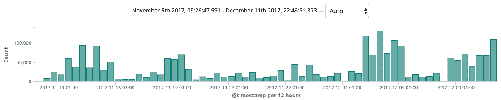

该索引将帮助我们了解网络上发生了什么，例如发出了哪些 DNS 请求，如下例所示:

```
{ 

    "server": "", 

    "dns": { ... }, 

    "method": "QUERY", 

    "proc": "", 

    "source": { ... }, 

    "dns_ips": "...", 

    "client_port": 63446, 

    "host": "localhost", 

    "tags": [], 

    "subdomain": "elastic.", 

    "bytes_out": 51, 

    "query": "class IN, type A, elastic.slack.com.", 

    "resource": "elastic.slack.com.", 

    "client_proc": "", 

    "ip": "...", 

    "port": 53, 

    "type": "dns", 

    "data_source": "elastic", 

    "client_server": "", 

    "geoip": { ... }, 

    "@version": "1", 

    "geo_ip_dns": { ... }, 

    "client_ip": "...", 

    "bytes_in": 35, 

    "highest_registered_domain": "slack.com", 

    "beat": { 

      "version": "5.1.1", 

      "hostname": "HR08", 

      "name": "HR08" 

    }, 

    "status": "OK", 

    "dest": { ... }, 

    "transport": "udp", 

    "domain": "slack.com.", 

    "@timestamp": "2017-12-12T23:59:58.153Z", 

    "responsetime": 22 

  } 
```

前面的文档描述了一个普通的 DNS 请求。请记住，在 DNS 隧道的情况下，重要的位是子域字段，这是渗出的数据将作为加密的有效载荷隐藏的地方。我们将看到这个子域字段将如何在我们的调查中使用的 ML 作业中得到利用。

<title>Threat intelligence</title>  

# 威胁情报

作为威胁搜寻体系结构和最佳实践的一部分，丰富摄取的数据可以添加有见地的信息(如 IP 地址的地理位置)，但它也可以一眼识别 IP 地址是否在已知威胁列表中。这是威胁情报的一部分。增强威胁信息是一个过程，包括使用一个威胁数据库，并将已接收的数据或已编入索引的数据标记为威胁(如果该数据存在于给定的数据库中)。

有许多威胁情报数据库和数据源可供使用。但是，无论您使用哪种方法，请确保威胁信息嵌入到您在 Elasticsearch 中索引的每个文档中，无论您是否正在执行以下任一操作:

*   在 Elasticsearch 中使用您自己的丰富流程标记数据一次
*   在摄取时使用 Logstash 来标记数据

第二种策略可以使用翻译插件或 Logstash 中的查找功能轻松构建。translate 特性可用于这样的用例:用于丰富的数据可以存储在一个文件中，并且是相当静态的。作为一个例子，这种方法在一篇博客文章(【https://www.elastic.co/blog/bro-ids-elastic-stack】)中有所解释，它包括创建一个字典，与一段时间内的数据进行比较。下面的配置给出了它在 Logstash 中包含的内容:

```
filter { 

   translate { 

   field => "evt_dstip" 

   destination => "tor_exit_ip" 

   dictionary_path => "/path/to/yaml" 

  } 

}
```

前面的配置显示了一个根据字典查找`evt_dstip`字段的例子。如果在字典中找到匹配项，则用字典的内容填充`tor_exit_ip`字段。您可以在字典中设置您需要的任何内容，只要您记住这将是用于报告的内容，也是 ML 利用的内容。

虽然这是一个非常方便的特性，但是它的可伸缩性受到它依赖于字典文件这一事实的限制。这就是`memcahed`插件带来更多价值的地方，因为它依赖于可伸缩的缓存，可以保存数百万条随时间变化的记录。出于本书的目的，我们不会在这里挖掘太多细节，但你可以在位于[https://www . Elastic . co/blog/Elastic search-data-enrichment-with-log stash-a-first-security-examples](https://www.elastic.co/blog/elasticsearch-data-enrichment-with-logstash-a-few-security-examples)的 Elastic 博客中找到关于如何设置的全面描述。

对我们来说，重要的是理解它在 Logstash 中是如何完成的，如下例所示:

```
input {
  stdin {
    codec => json
  }
}
filter {
  memcached {
     hosts => ["localhost:11211"]
     get => {
        "%{ip}" => "threat_src"
     }
  }
}
output {
  stdout {
     codec => rubydebug
  }
}
```

正如博客中所解释的，对于任何输入消息，如果 IP 存在，将在`memcached`中查找`ip`字段，并相应地填充`threat_src`字段。因此，即使 Beats 使用开箱即用的数据模型，我们仍然可以使用 Logstash 实例来丰富数据，并为我们的摄取架构添加更多价值，并拥有以下类型的架构:

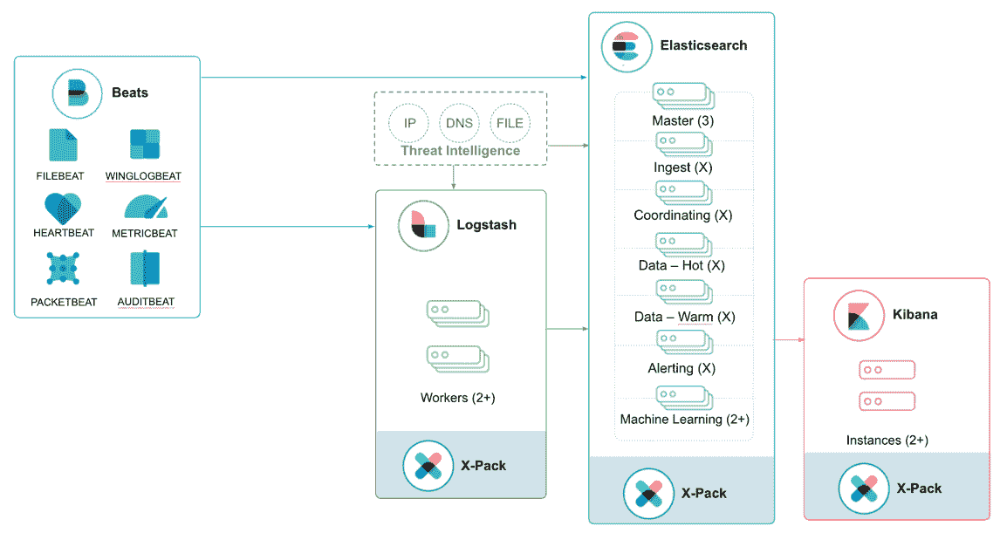

<title>Investigation analytics</title>  

# 调查分析

如前所述准备数据是使用弹性 ML 正确分析数据并揭示攻击步骤的基础。在本节中，我们将研究一个 DNS 渗透攻击的调查场景，并利用通过使用 Elastic ML 检测到的异常来指导分析师进行调查。

<title>Assessment of compromise</title>  

# 妥协的评估

这一切都始于一封电子邮件，是 It 系统异常行为的结果。这一次，一个弹性 ML 节点似乎发现了一个潜在的 DNS 渗透攻击。下面的屏幕截图显示了来自名为 server_101 的服务器的针对给定域的异常活动:

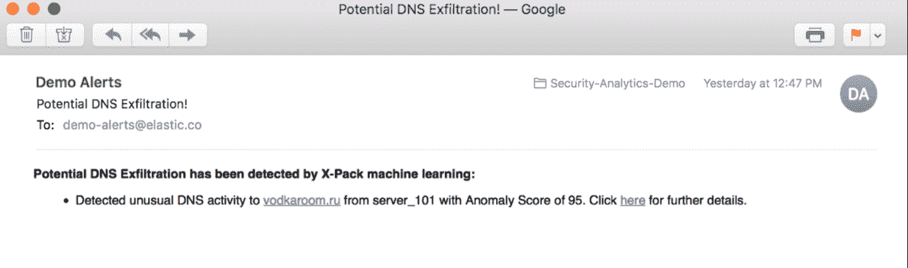

警报显示异常值很高，为 95，表示情况非常不寻常。弹性警报可以根据异常分值等条件发送类似于上一封邮件的电子邮件。基于异常分值创建此类警报非常简单，在[第 6 章](7ba6aa9b-aaee-4a1e-91cb-8b062aeaa181.xhtml)、*ML 分析警报*中，我们将更深入地讨论警报。现在，您可以看到警报配置允许用户使用该字段轻松创建基于阈值的警报:

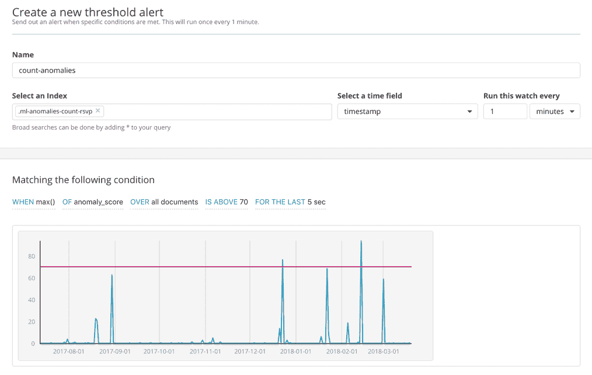

此配置的警报将每分钟运行一次，并将检查最近 5 秒钟是否有文档的异常分数字段的最大值()大于 70，这一点不言自明。

这封邮件包含一个到 Kibana 的链接，它与异常发生的时间段相关联。点击链接将直接进入弹性 ML 异常浏览器视图:

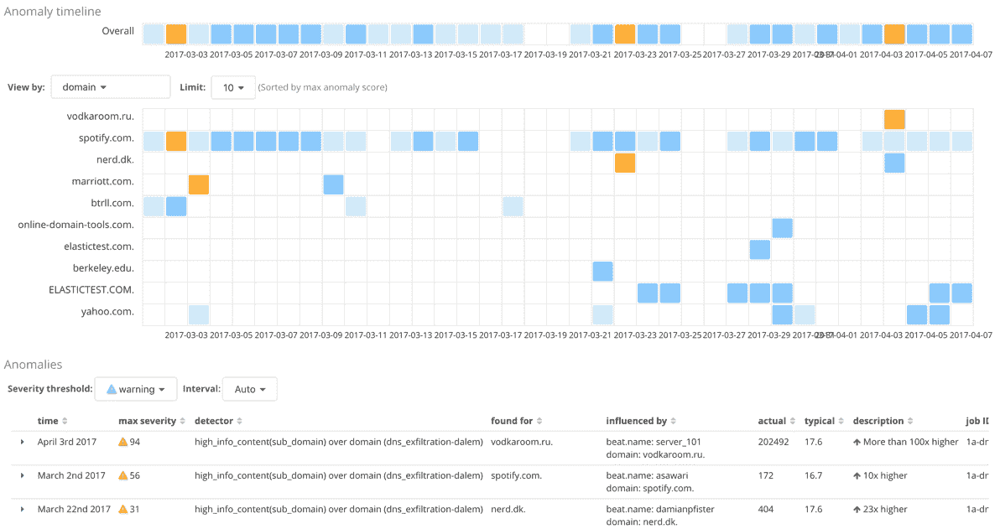

在我们的用例环境中，前面的异常浏览器视图显示了一些域(如 vodkaroom.ru)的异常活动，除了名称之外，还显示了可疑的活动(参见泳道中的红色区域)。在底部的表格中，您可以看到这个域有一个得分为 94 的异常。检测到此异常的作业已被配置为检查 DNS 数据以寻找泄漏/隧道证据，其中 high_info_content 函数针对 sub_domain 字段。高级作业向导中的配置如下所示:

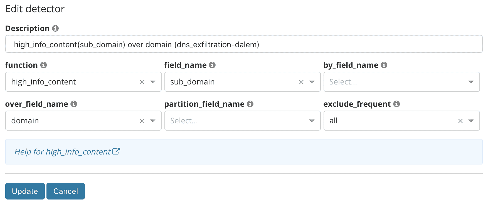

info_content 等函数在在线 ML 文档中有列出和描述，位于[https://www . elastic . co/guide/en/elastic-stack-overview/current/ML-functions . html](https://www.elastic.co/guide/en/elastic-stack-overview/current/ml-functions.html)。

如前所述，DNS 隧道技术将数据加密到 sub_domain 字段中，从而在字符串本身中为该字段提供了大量的信息内容。ML 作业被配置为总体分析，其中总体由所有高级域定义。因此，该作业在所有域的 DNS 请求的子域中查找高信息内容的情况，将每个高级域与其对等域进行比较，从而发现最不寻常的域。

从那里，我们知道发生了泄漏，我们也知道它来自哪个系统。如果您查看“受影响者”列，您会注意到 server_101 被视为异常的重要影响者。

事实上，查看异常浏览器左侧的顶级影响者列表也证实了 vodkaroom.ru 和 server_101 是该时间段内最不寻常的域和主机名:

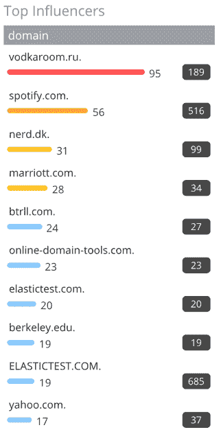

以下屏幕截图显示了 server_101 的主要影响因素:

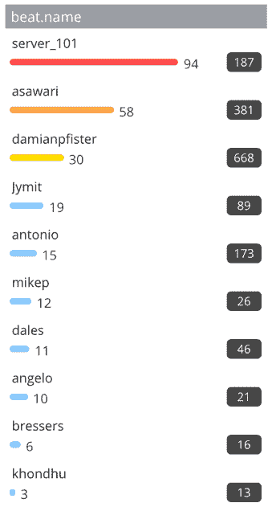

他们都是列表中排名最高的影响者。

我们需要调查这台机器和域，如果我们查看异常的详细信息，我们可以看到 sub_domain 字段中的信息量比平时高 100 倍:

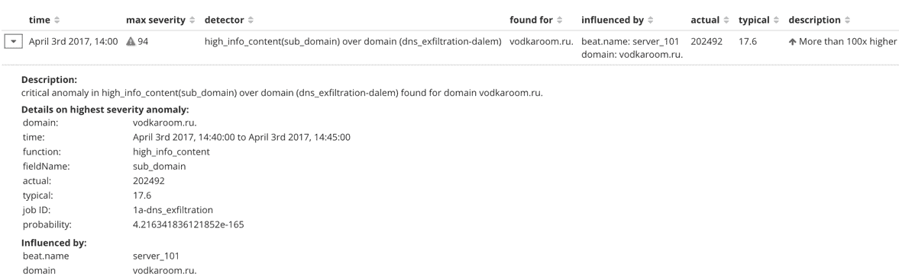

请记住:因为这是一个群体分析，什么是典型的是通过调查领域的行为随着时间的推移，以获得一个集体模型。

Elastic ML 允许创建到任何 URL 的动态链接，比如 Kibana 仪表板。这在文档中有描述，可以在[https://www . elastic . co/guide/en/elastic-stack-overview/current/ml-configuring-URL . html](https://www.elastic.co/guide/en/elastic-stack-overview/current/ml-configuring-url.html)找到。

这一点在本案中已经得到实施；“打开链接”按钮显示用户定义的自定义链接列表。在我们的例子中，我们定义了一个名为 Explore Server 的链接:

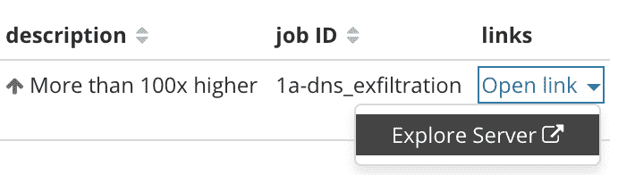

我们的自定义链接 Explore Server 将服务器的名称(适当的`beat.hostname`)传递给后续的仪表板，以便可以对其进行过滤，从而只显示对该异常有影响的主机名(在我们的示例中为`beat.hostname:server_101`):

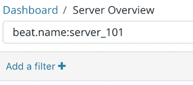

它将仪表板过滤到作为渗出源的机器。因为这个仪表板也包含其他数据类型的可视化，我们还可以看到`server_101`有一个直观有趣的 SSH 登录尝试模式:

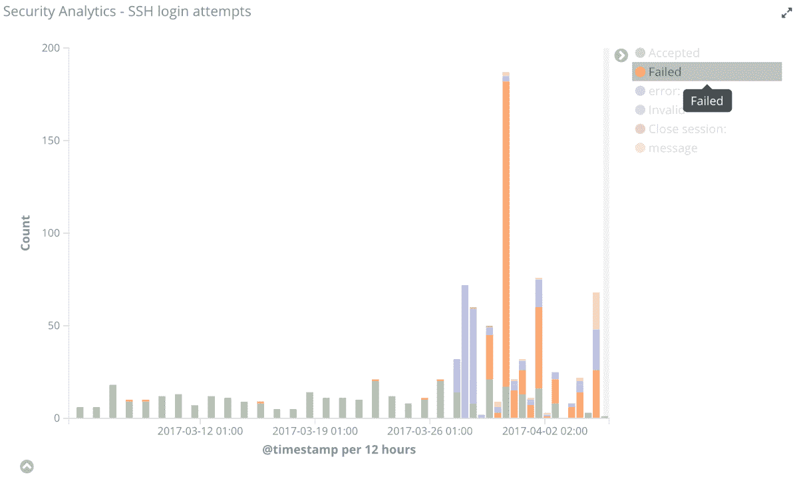

当然，这种视觉上有趣的异常模式也可以在其自己的 ML 作业中自动执行，该作业将监控登录尝试。

我们的自定义仪表板的另一部分显示了一个数据表，突出显示了这些登录尝试的详细信息。对数据的检查表明，用户最终设法连接:

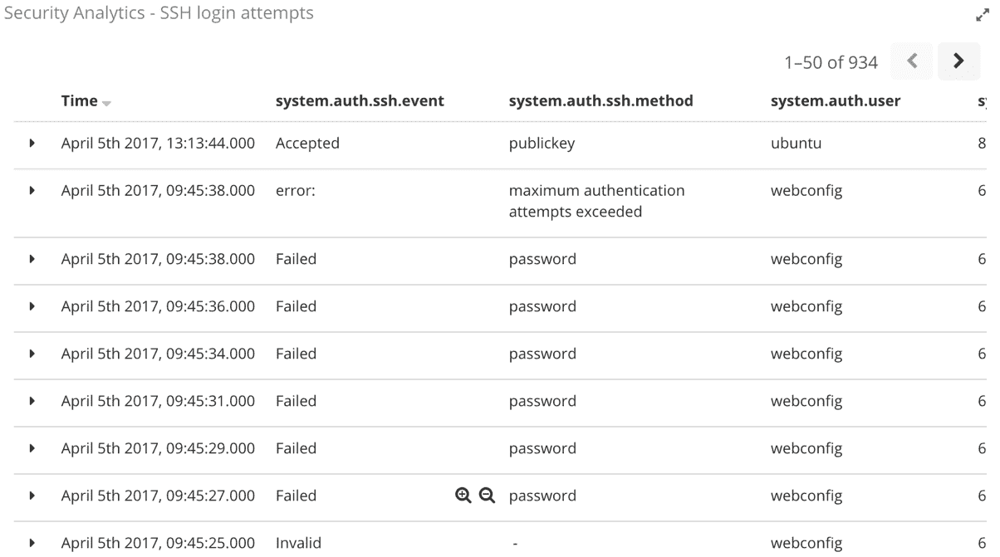

因为我们还在接收时进行了地理位置丰富，所以身份验证文档包含关于正在进行身份验证的用户的物理位置的信息。这对于了解这些登录尝试的位置非常有用，如果尝试的位置也不寻常:

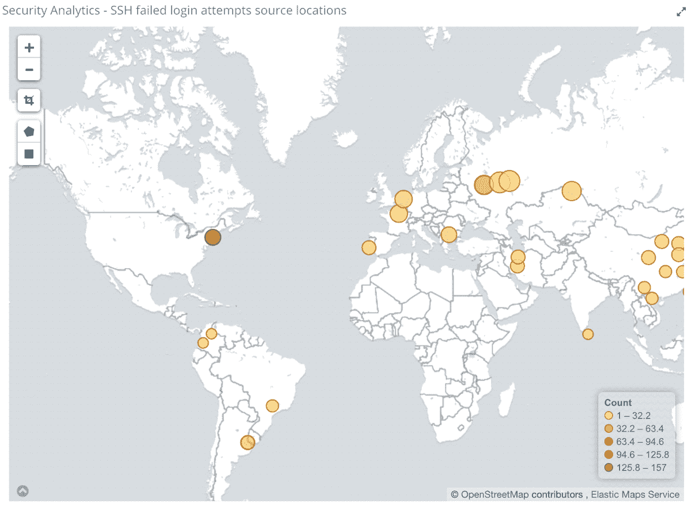

除了通过地理定位丰富数据之外，我们还可以跟踪我们环境中的任何机器是否接触过潜在威胁。如前所述，在摄取过程中会交叉引用威胁数据库，并且与已知威胁列表中的 IP 地址的任何交互都会被标记，并在我们的控制面板的可视化视图中可见:

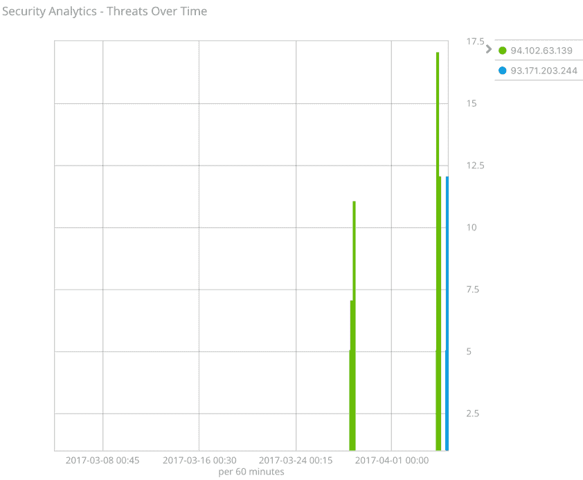

前面的屏幕截图显示，我们感兴趣的机器(server_101)已经多次接触威胁列表中的两个 IP。

随着与该机器相关的可疑活动越来越多，我们不得不创建一个任务来检测暴力攻击，特别是因为在该机器上进行了大量登录尝试:

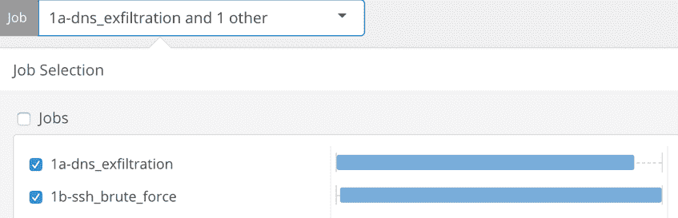

一旦创建了自动执行这部分调查的作业，您就可以将它与另一个作业一起显示，以便与前一个作业建立关联并确认攻击场景。

下面的屏幕截图显示了两个作业的异常时间表(暴力作业是对 system.auth.ssh.ip 配置的简单高计数):

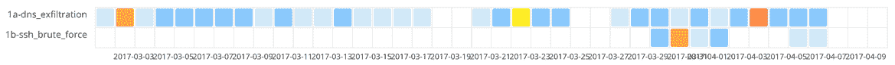

我们在前面的截图中看到的非常有趣，无论是就场景还是就攻击本身而言。显然，我们遇到了一次暴力攻击(橙色方块),发生在泄露之前，表明一旦机器被访问，一些敏感信息就会被泄露。

如果我们更详细地分析这一点，我们将在影响者(24.151.103.17)、目标机器(server_101)和用于验证的用户 ID(`elastic_user_0`)中看到暴力攻击的源 IP，如下面的屏幕截图所示:

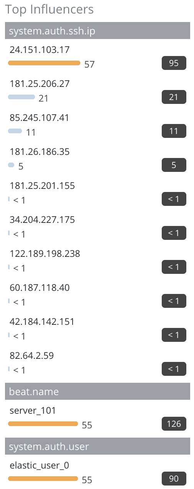

但更有趣的是，从连接率的角度来看，暴力攻击并不激烈。我们可以推断，对手这样做是为了避开使用静态阈值的传统安全解决方案。

在这里，即使比率很低，我们仍然得到一个平均分数的异常，但是我们仍然能够检测到它:

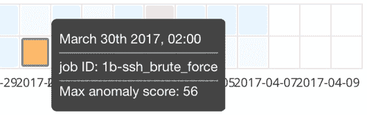

此外，由于我们已经使用 ML 进行了群体分析，因此我们不是独立地分析 IP，而是将不同 IP 的行为进行相互比较。因此，即使 IP 地址在数据中出现的时间很短(这不足以建立模型)，如果行为与正常的 IP 配置文件明显不同，那么它就会被发现，如下面的屏幕截图所示:

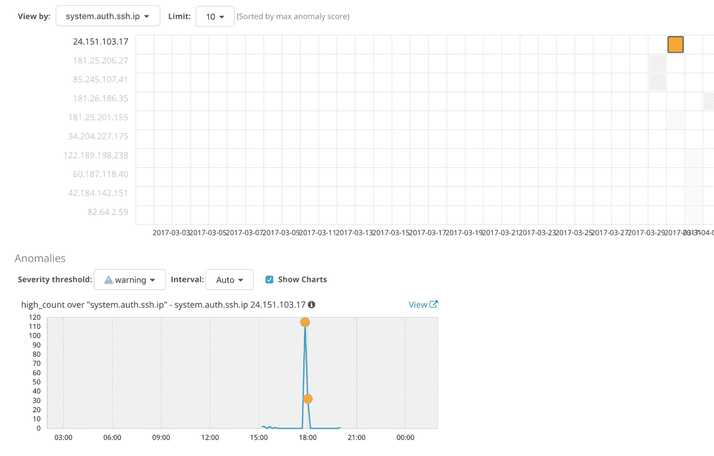

在这里，您可以看到 IP 产生了一个连接尖峰，如果我们对分析进行了划分，这是无法捕捉到的，因为缺乏大量的历史不会给 ML 一个机会来建立一个适当的模型。

查看异常的详细信息，我们对暴力攻击的怀疑得到了证实。同样，这是一个比正常情况高出几百倍的活动:

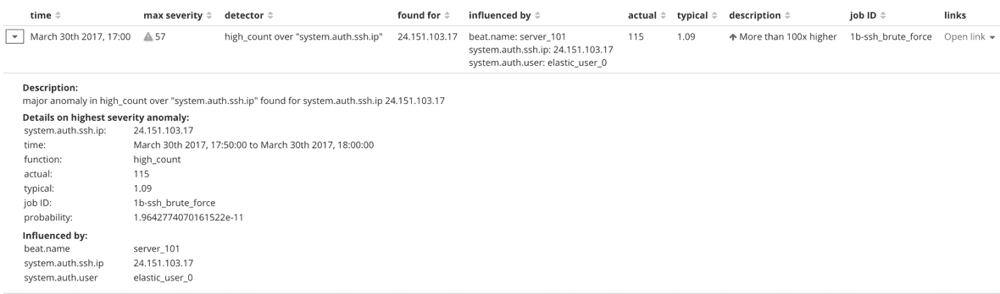

现在，知道了我们确实遭受了暴力攻击，以及我们拥有地理位置数据这一事实，用登录时间和位置等其他见解来丰富我们的调查是很有趣的。

在这里，我们又创造了两个职位来证实我们的想法。`elastic_user_0`已在一天中的正常时间和一个不寻常的位置使用，如以下截图所示:

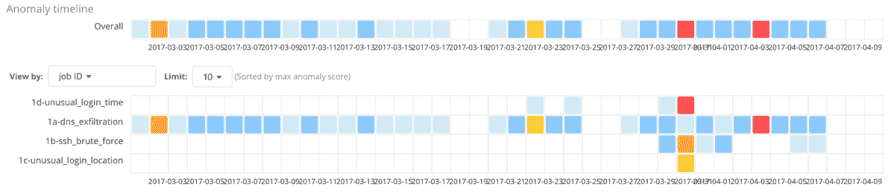

我们可以看到，所有这些不寻常的行为都与暴力攻击发生在相对相同的时间范围内。我们可以使用 Discover 选项卡的自定义链接(通过自定义链接)来挖掘流量:

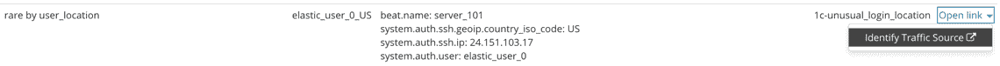

在产生的 Discover 视图中，我们可以看到一个非常有趣的指示；连接是通过一台名为 mikep 的笔记本电脑建立的:

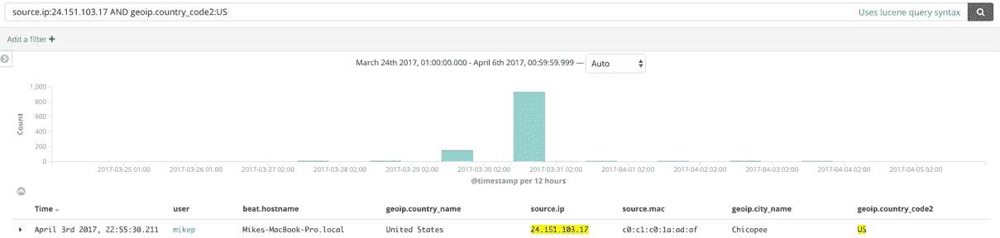

为了确认可疑行为来自 mikep 笔记本电脑，我们可以利用另一个 Kibana 仪表板来描述域流量、端口以及已经执行的进程。我们可以清楚地看到 mikep 的大量出站端口使用:

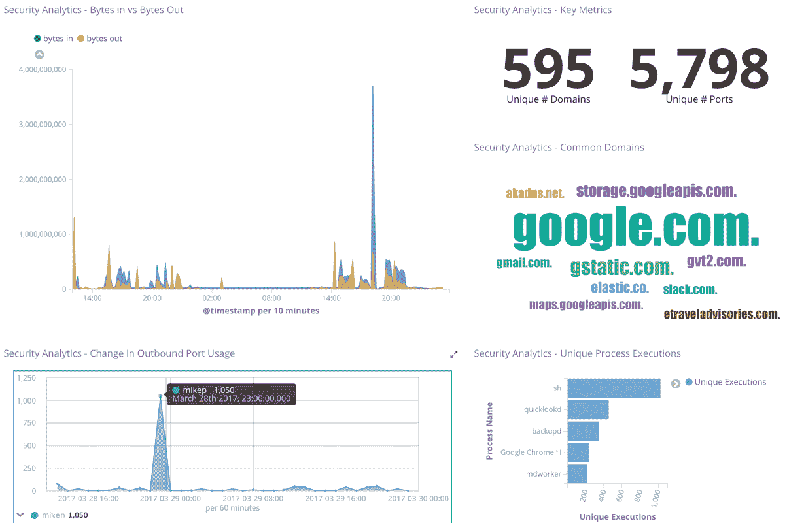

这是调查中的另一个步骤，可以用 ML 自动完成，因为对手需要扫描端口来了解如何通过暴力验证入侵 server_101。异常时间线说明了这一点，它现在包括端口扫描作业，并显示了两个有趣的方面:

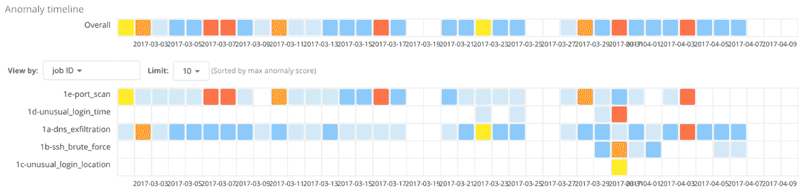

我们注意到的第一件事是，在暴力攻击前不久，我们进行了一次端口扫描。如果我们单击其中一个端口扫描异常，我们可以看到该端口扫描来自 mikep 笔记本电脑，目标是 server_101 的 IP 地址:

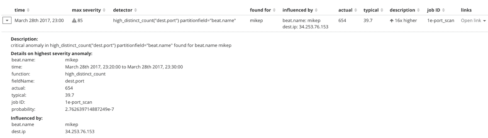

我们在异常时间表中可以注意到的第二件事是，在实际攻击之前，端口扫描发生了多次，因此对手已经侦察了很长时间:

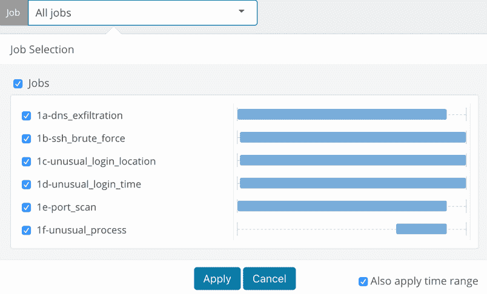

我们可以在之前的 Kibana 仪表板中注意到的另一个方面是在 mikep 笔记本电脑上执行的进程，这可能表明某个恶意软件对攻击负有责任。检测系统上运行的异常进程也是我们可以用 ML 实现自动化的事情:我们可以构建一个任务，在每台机器上寻找罕见的进程(`rare by process_sig`，`partition_field_name="beat.name"`)。如果我们创建了这样一个作业，它将突出显示在机器上执行了一些有趣的进程:


现在我们已经有了几乎整个杀死链，我们可以调查找到类似的攻击行为，或者看看另一台可能被感染的机器。

为此，我们可以使用现有的控制面板，其中包含已到达的顶级域的数据表。我们看到 vodkaroom.ru 位于顶部并不奇怪:

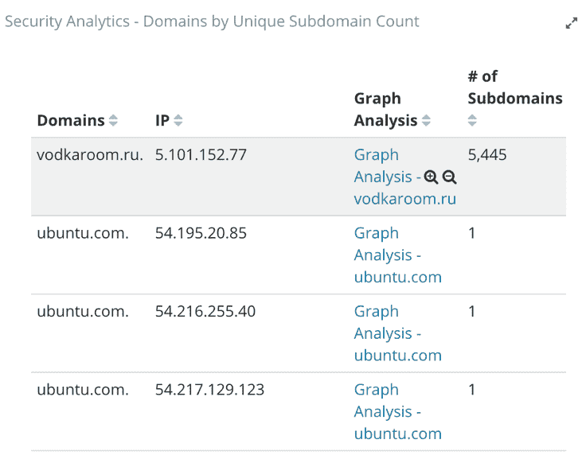

这里有趣的一点是作为数据表中的一列添加的链接。这允许用户跳转到弹性图形可视化，如下面的屏幕截图所示:

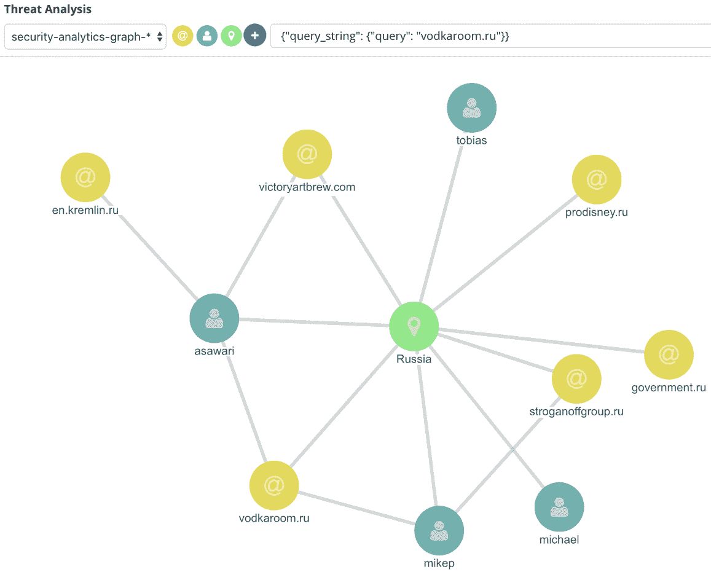

Elastic Graph 允许您揭示相同索引的文档之间的连接，这里显示了 mikep 和 vodkaroom.ru 之间的连接。此外，我们可以看到 mikep 不是唯一连接到该域的笔记本电脑 asawari 是另一个-加上其他域连接到它们的事实，这也可能是可疑的。

弹性图的默认模式之一是去除有噪声或流行的数据，只建立相关数据之间的联系。然而，这个用例的缺点是，我们实际上想要揭示流行的联系，这些联系将转化为我们可疑行为的高度有趣的实体。

因此，解决方案是禁用重要链接选项，如下面的屏幕截图所示:

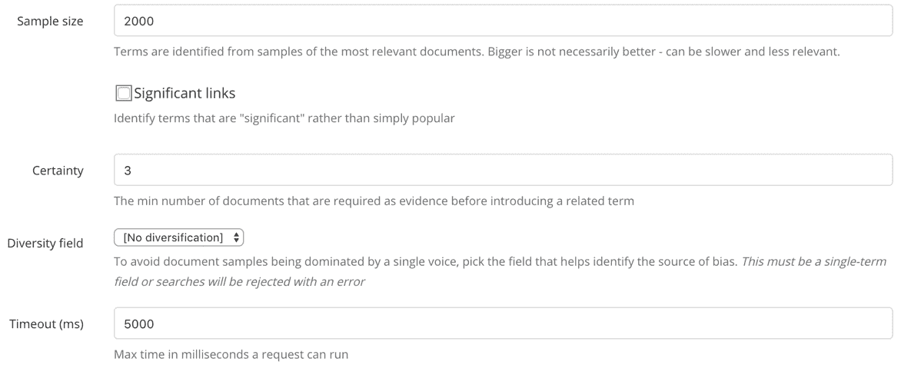

如果选择并扩展一个域节点(在这里，这发生在 vodkaroom.ru 节点上)，我们将看到到 server_101 的连接，因为在 DNS 流量索引中有许多文档共享这些术语:

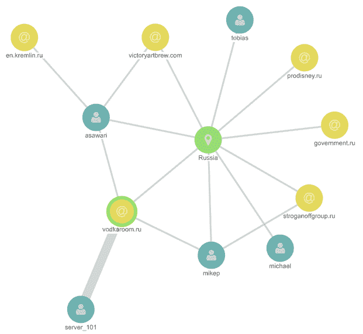

我们可以看到，弹性图中的这个图佐证了我们对 server_101 和 vodkaroom.ru 之间关系的怀疑，但是还有其他有趣的联系吗？通过单击弹性图中的链接按钮进行进一步探索，可以获得更多信息:

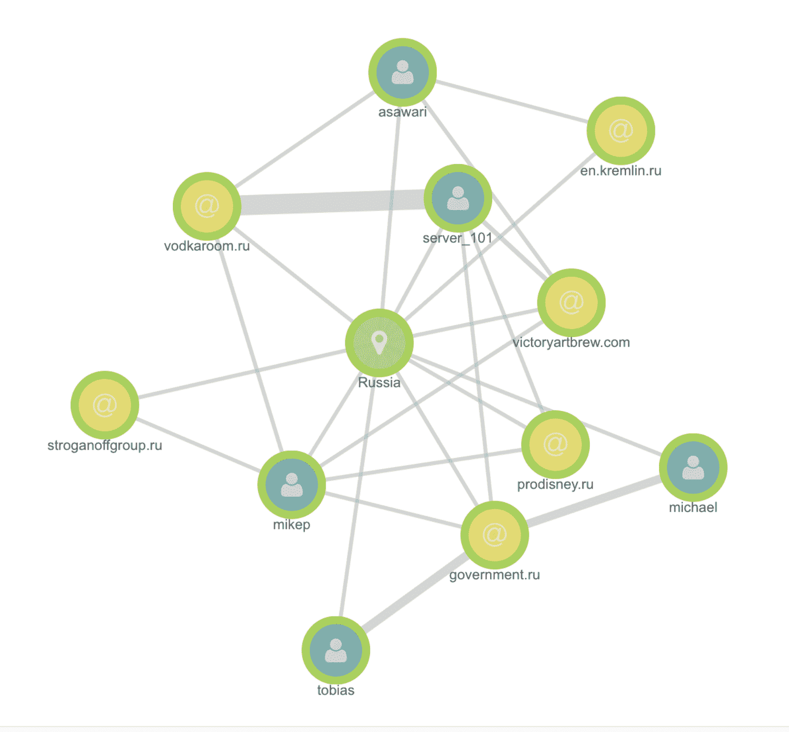

前面的屏幕截图显示，除了 mikep 和 asawari 系统与 vodkaroom.ru 通信之外，这两个系统还与 victoryartbrew.com 通信。也许这是一个巧合，但对于最初的恶意软件是如何获得的，这也是一个潜在的重要线索。也许 asawari 系统目前也受到感染，但尚未表现出其他恶意行为。这给了我们机会来阻止来自该机器的未来风险活动。

<title>Summary</title>  

# 摘要

在本章中，我们了解了现代安全团队在使用传统安全解决方案应对复杂的 APT 时所面临的挑战，以及 Elastic ML 如何通过自动执行一些取证分析和威胁搜寻步骤来支持分析师采用迭代调查方法。

在下一章[第 6 章](7ba6aa9b-aaee-4a1e-91cb-8b062aeaa181.xhtml)、*关于 ML 分析的警报*中，我们将特别关注商业特性附带的警报组件，并带您了解如何有效地使安全洞察变得可行。**