# 在 Kibana 仪表板中使用弹性 ML 数据

至此，您已经看到了利用弹性 ML 输出的多个用例和多种方式，比如获得主动警报。无论您是在开发运维团队还是在安全团队，您都可能需要可视化您的数据。可视化大量原始数据可能是一种负担，因为太多的数据源淹没了我们的眼睛可以有效捕捉的内容。这就是 Kibana 的可视化功能与弹性 ML 数据相结合的地方，可以用来突出仪表盘中真正重要的东西。

本章将带您浏览使用弹性 ML 数据的可视化和仪表板的创建。通过这种方式，不熟悉 ML 但需要可视化数据的分析师可以在整个调查过程中得到帮助。

首先，我们将快速浏览一下 Kibana，并列出我们将使用的可视化选项。然后，我们将准备我们的数据并创建几个 ML 作业，最后我们将构建我们的可视化和仪表板。

以下是我们将在本章中涉及的主题:

*   可视化选项
*   为异常检测分析准备数据
*   构建可视化


# 基巴纳的可视化选项

Kibana 有多个可视化数据的选项；在绘制数据图表方面，无论是折线图、条形图、饼图、数据表还是仪表图，它们都有不同且相似的选项。

真正让他们与众不同的是用户体验或他们所服务的用例。首先，我们将简要介绍不同的可用可视化，然后在本章的后面使用它们来强调一些弹性 ML 的见解。


# 可视化示例

在 Kibana 中，如果您单击左侧面板中的 Visualize 选项，您将有机会为具有不同图表类型的仪表板创建可视化面板。单击添加按钮(+)显示以下一组可视化类型:

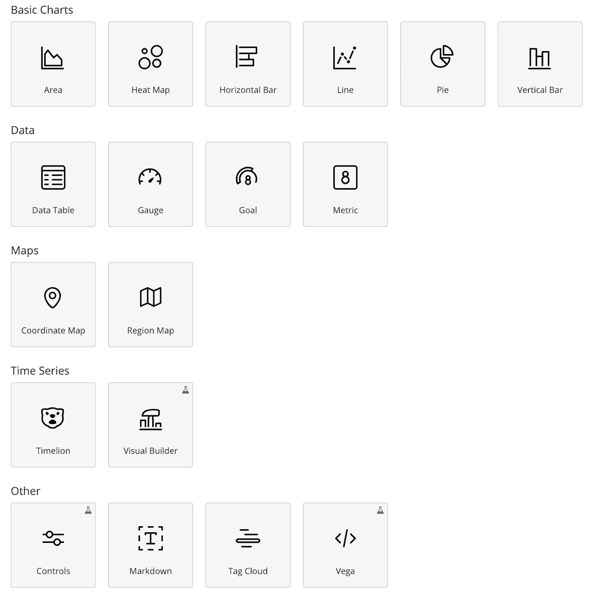

这里我们不会一一介绍，但我们鼓励您参考位于[https://www . elastic . co/guide/en/ki Bana/current/visualize . html](https://www.elastic.co/guide/en/kibana/current/visualize.html)的文档，这样您就可以熟悉不同的图表。我们将只关注数据表和热图，我们将在本章的后面使用它们来构建简单的仪表板。

数据表是一个非常直观的可视化工具，它允许我们创建一个有序的字段列表。这对于显示可用作过滤器的字符串数据类型非常实用，例如，URIs 列表(被请求的网页名称的路径)，以及每个 URI 在 web 服务器上收到的点击次数:

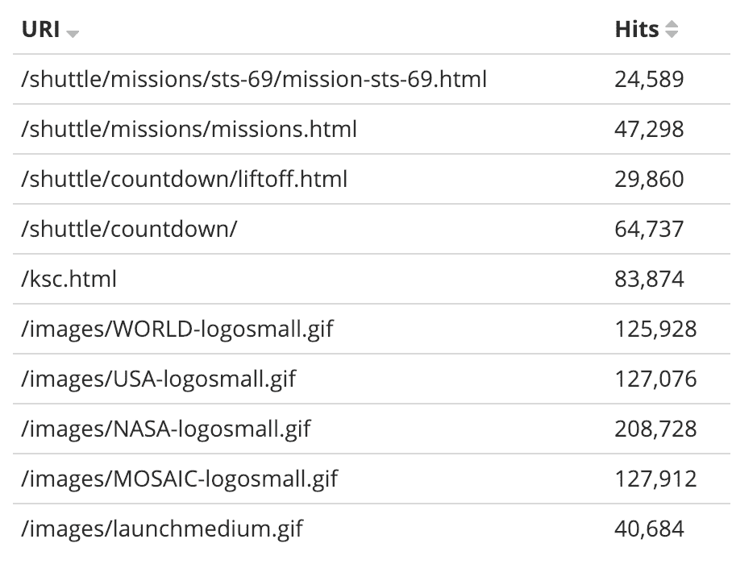

我们将在本章中使用的另一种可视化方式是热图。这将允许我们呈现数据的两个方面:

*   异常的严重程度
*   同一图表上的多个作业，以便我们可以将异常情况相互关联

我们的热图一旦建立，将如下所示:

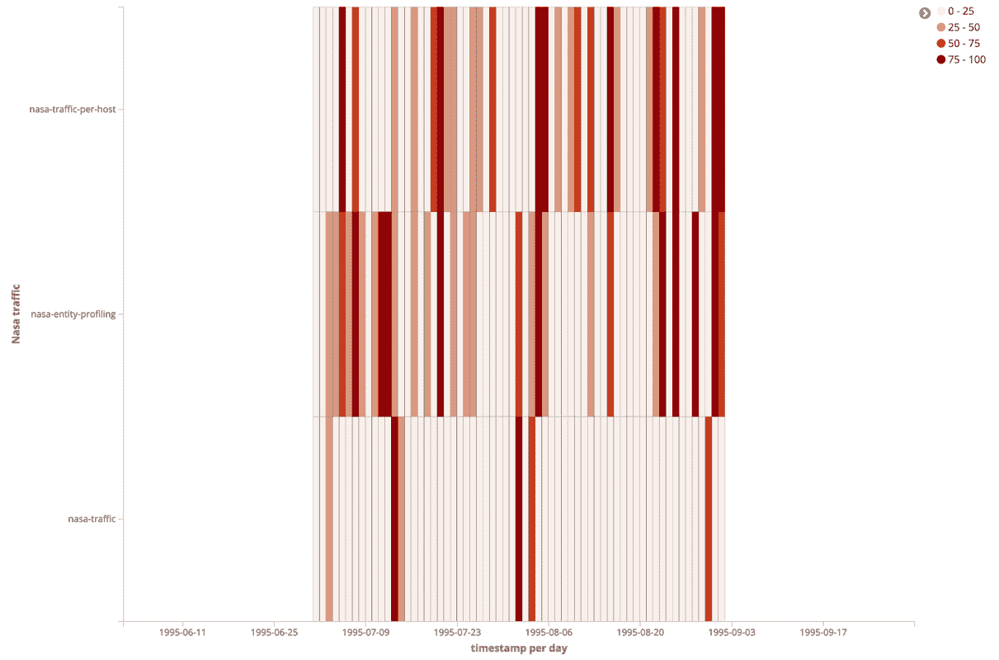

虽然这些可视化是点击驱动的，但下一种类型的可视化，使用 Timelion，是基于表达式的，这使我们能够组合数据源。


# Timelion

Timelion 是一个基于表达式的可视化框架，允许用户利用 Elasticsearch 聚合框架来构建图表。Timelion 还非常强大，它允许您在同一个图表中组合来自多个来源的数据。

稍后我们将学习如何使用这种可视化类型来组合数据源。我们的最终产品将如下所示:

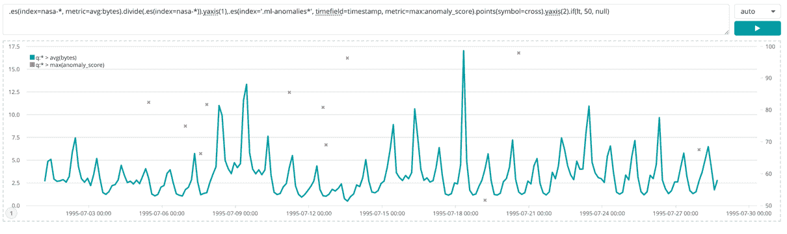


# 时间序列可视化生成器

**时序可视化构建器** ( **TSVB** )是指标驱动的，非常适合基于时序的指标。它允许使用聚合和管道聚合，并在一个全面的图表控件中提供多种图表类型:


我们将看到，我们可以使用管道聚合，对指标应用数学函数，甚至对图表进行注释。注释的使用是我们在示例仪表板中使用这种可视化的主要原因，因为它将允许分析师一眼就能捕捉到可定制图表中存在异常的地方，如下所示:

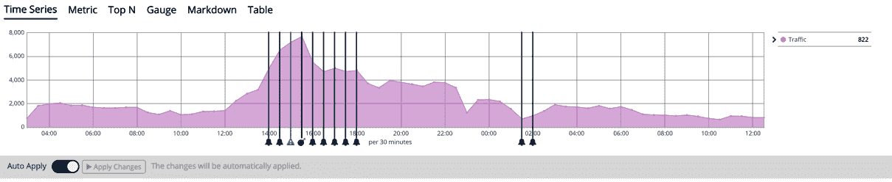

然而，在我们能够将所有这些可视化组件组装到我们的仪表板中之前，我们需要下载并准备一些能够馈入 ML 作业的数据。


# 为异常检测分析准备数据

为了用不同的可视化制作一个有效的、有代表性的仪表板，我们首先需要下载、接收和分析一个存在于公共领域的数据集。

我们从美国宇航局选择了一个非常古老的数据集，你可以在 http://ita.ee.lbl.gov/html/contrib/NASA-HTTP.html 获得。该数据集包含 1995 年 7 月 1 日至 1995 年 8 月 31 日期间 NASA 网站的 HTTP 访问日志。在写这本书的时候，它几乎是一个化石数据集，它已经有将近 24 年的历史了！

然而，日志中的信息是永恒的，非常适合我们在这里想要实现的目标。首先，让我们了解一下数据集。


# 数据集

在这个数据集中，每个文档代表一个组合的 Apache 日志，其结构如下:

```
128.159.122.45 - - [28/Jul/1995:13:31:57 -0400] "GET /ksc.html HTTP/1.0" 200 7280 
```

前面的日志行包含以下信息:

*   发出请求的主机，即 IP 地址
*   请求的时间戳
*   请求
*   HTTP 响应状态
*   回复的大小，以字节为单位

我们将使用 Logstash 将这个日志文件转换成 JSON 格式，然后我们可以将其索引到 Elasticsearch 中。


# 摄取数据

我们使用这个数据集来简化摄取过程；Apache 日志不需要对 Logstash 中的大量配置进行解析。我们的 Logstash 配置的基本结构将包含以下内容:

*   使用数据集中提供的两个文件的文件输入；一个用于 7 月，一个用于 8 月
*   **两个过滤器**:一个`grok`过滤器用于解析日志行，一个`date`过滤器用于将时间戳转换成格式良好的时间戳
*   一个输出告诉 Logstash 将数据发送到我们的 Elasticsearch 集群

以下是完整的 Logstash 管道配置:

```
input { 

  file { 

    id => "nasa_file" 

    path => "/Users/baha/Downloads/data/*.log" 

    start_position => "beginning" 

    sincedb_path => "/dev/null" 

  } 

} 

filter { 

  grok { 

    id => "nasa_grok_filter" 

    match => { "message" => "%{COMMONAPACHELOG}" } 

  } 

  date { 

    match => ["timestamp", "dd/MMM/yyyy:HH:mm:ss Z"] 

    target => "@timestamp" 

    remove_field => [ "timestamp" ] 

  } 

} 

output { 

  elasticsearch { 

    id => "nasa_elasticsearch_output" 

    hosts => "localhost:9200" 

    user => "elastic" 

    password => "********" 

    index => "nasa-%{+YYYY.MM}" 

    template => "/Users/baha/Downloads/data/template.conf" 

    template_name => "nasa"
```

```
    template_overwrite => "false" 

  } 

} 
```

文件输入会消耗指定目录中包含的所有日志文件(在我的例子中是`NASA_access_log_Aug95.log`和`NASA_access_log_Jul95.log`)。与默认提供的扩展名相比，我在文件中添加了一个`.log`扩展名。出于测试的目的，我已经将`start_position`参数设置为从文件的开头开始，所以我们将它与`sincedb_path`结合起来，在这里保存摄取的最后位置，指向`/dev/null`。每当我更新配置或重启 Logstash 时，这个文件就会被使用。

注意，在`filter`部分，我们使用`COMMONAPACHELOG` grok 模式来解析包含在输入`message`字段中的日志。此外，`date`过滤器将文件的时间戳转换成日期，并存储在`@timestamp` 字段中。

最后，我们使用一个输出来索引 Elasticsearch 中的数据，使用`template.conf`模板文件来设置索引设置和映射。

有关更多信息，请参见本书 GitHub 资源库中的`template.conf`文件，网址为[https://GitHub . com/packt publishing/Machine-Learning-with-the-Elastic-Stack/blob/master/chapter 07/template . conf](https://github.com/PacktPublishing/Machine-Learning-with-the-Elastic-Stack/blob/master/Chapter07/template.conf)。

映射对于将字段名正确映射到所需的类型(例如，字节为`integer`，响应为`keyword`)是必不可少的。否则，如果我们希望在 Elasticsearch 聚合或 ML 作业配置中有效地使用这些字段，它们可能不可用。

在本例中，Logstash 被配置为使用集中式监视和管理。所需的配置已经添加到 Logstash 配置的`logstash.yml`文件的末尾，该文件位于`conf`目录中，如下所示:

```
# X-Pack Monitoring 

xpack.monitoring.enabled: true 

xpack.monitoring.elasticsearch.username: elastic 

xpack.monitoring.elasticsearch.password: ********* 

xpack.monitoring.elasticsearch.url: ["http://localhost:9200"] 

# X-Pack Management 

xpack.management.enabled: true 

xpack.management.pipeline.id: ["nasa-apache-log"] 

xpack.management.elasticsearch.username: elastic 

xpack.management.elasticsearch.password: ********* 

xpack.management.elasticsearch.url: ["http://localhost:9200"] 
```

如果启用了 X-Pack 安全，请仅提供用户名/密码凭据。

通过这种方式，您将能够在 Kibana 中添加 Logstash 管道，并且 Logstash 将在 bootstrap 中连接并加载它。要继续，请注意以下步骤:

1.  连接到 Kibana 并转到管理|日志存储|管道部分。
2.  单击创建管道按钮。

这将显示以下用户界面:

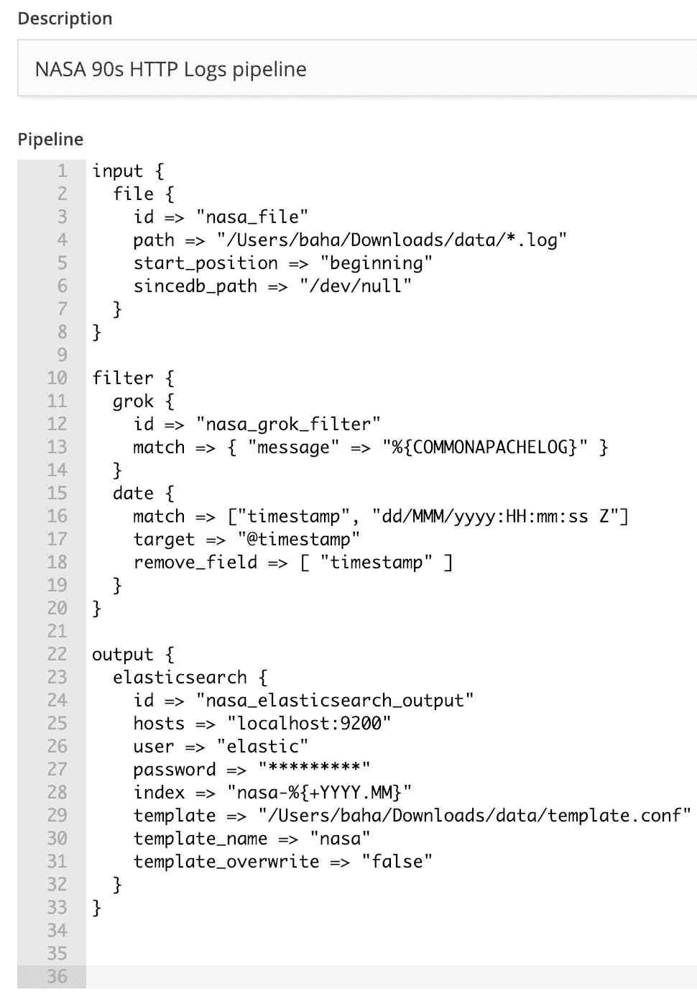

3.  从那里，启动 Logstash，您应该看到来自管道的数据在 Elasticsearch 中被索引，如下面的监控截图所示:

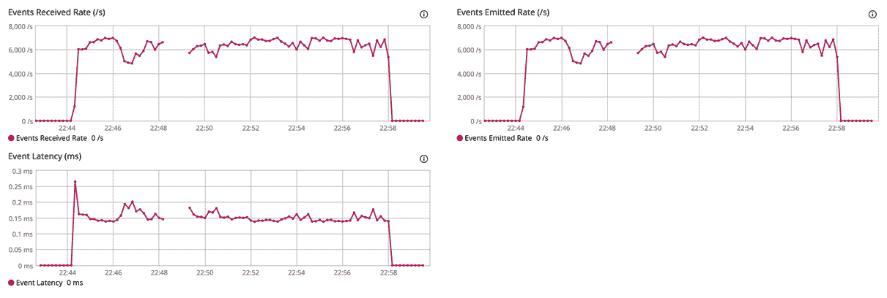

相关的指标监控统计如下:

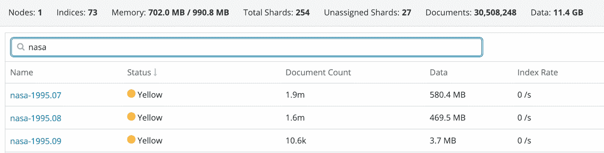

总而言之，我们已经接收了大约 350 万个文档，相当于磁盘上大约 1 GB 的数据。如果您通过查询 Elasticsearch 索引来检查文档结构，您应该会看到如下内容:

```
{ 

    "host": "mbp-de-baha.lan", 

    "ident": "-", 

    "auth": "-", 

    "@timestamp": "1995-09-01T03:59:53.000Z", 

    "path": "/Users/baha/Downloads/data/NASA_access_log_Aug95.log", 

    "bytes": "39017", 

    "request": "/images/kscmap-small.gif", 

    "@version": "1", 

    "response": "200", 

    "httpversion": "1.0", 

    "message": "cindy.yamato.ibm.co.jp - - [31/Aug/1995:23:59:53 -0400] \"GET /images/kscmap-small.gif HTTP/1.0\" 200 39017", 

    "verb": "GET", 

    "clientip": "cindy.yamato.ibm.co.jp" 

  } 
```

在这个阶段，我们现在准备创建一些 ML 工作。


# 创建异常检测作业

我们将创建三个作业，以便在可视化中使用它们的结果。它们如下:

*   交通分析工作
*   发出请求的主机的 HTTP 响应代码分析
*   对发出请求的主机的流量分析


# 全球流量分析作业

第一项工作是对访问日志的简单流量分析。按照以下步骤创建它:

1.  访问 Kibana 中的机器学习部分，并在 NASA 访问日志索引上创建一个新的单一度量作业。
2.  配置该作业，使其在`clientip`字段中进行不同的计数，这使我们能够计数产生流量的 IP 的不同数量，如下面的屏幕截图所示:

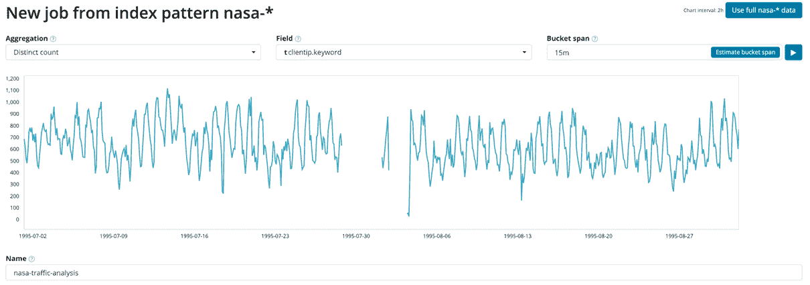

3.  运行该作业时，您应该会在单个指标查看器中看到与下面的屏幕截图类似的异常情况。稍后，我们将在 TSVB 可视化中使用这些异常作为注释:

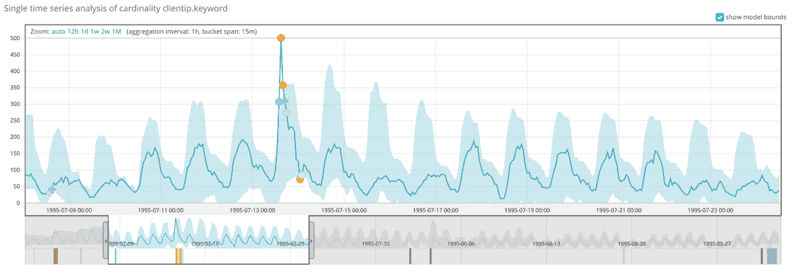

虽然 ML 的 UI 中内置的可视化对于显示异常何时发生及其严重性非常有用，但许多分析师已经在操作仪表板中收集了他们自己的可视化。他们可能希望在现有的仪表板中看到这些异常情况。

还可能存在这样的情况，其中操作分析师可能没有权限或专业知识来使用机器学习 UI 来查看异常。通过将异常外化到标准的仪表板可视化中，它允许分析师在他们已经知道和理解的上下文中消费关于异常的信息。


# 发出请求的主机的 HTTP 响应代码分析

第二项工作将帮助分析师根据每个响应代码的请求量来检测可疑的客户端行为。以下是配置该作业的步骤:

1.  访问 Kibana 中的机器学习部分，并在 NASA 访问日志索引上创建一个新的高级作业:

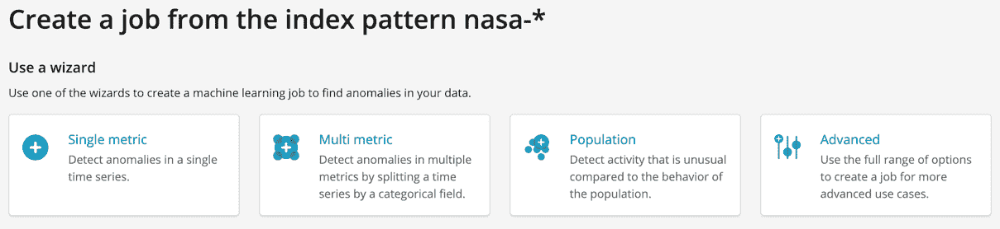

2.  在作业详细信息面板中命名作业:

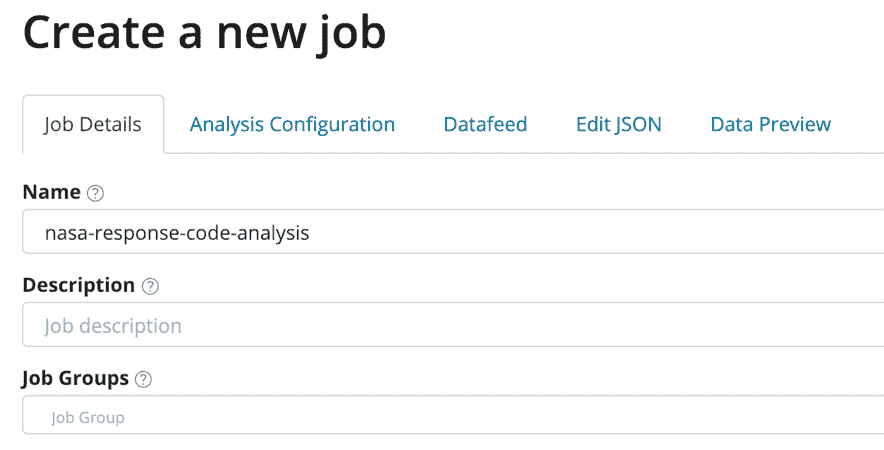

3.  最后，在分析配置面板中添加以下检测器，添加`response.keyword`和`clientip.keyword`作为影响者，并保存作业:

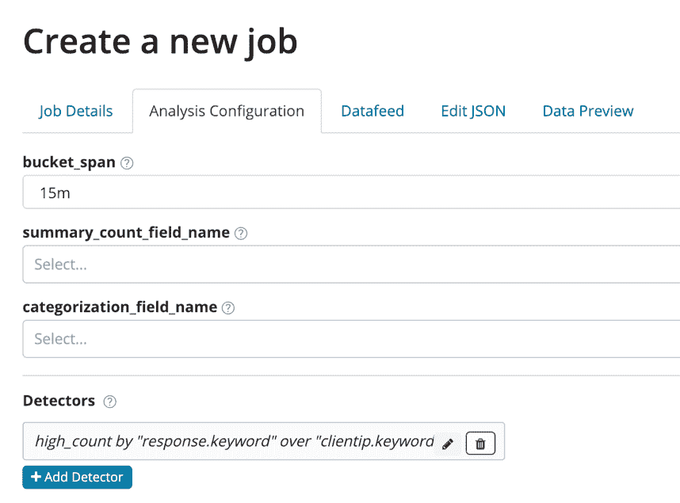

4.  运行作业并访问异常浏览器视图后，您应该会得到类似于以下内容的结果:

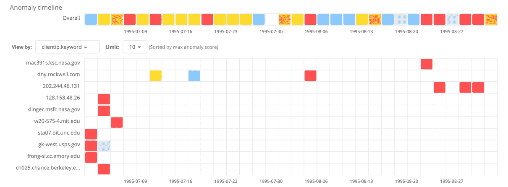

5.  如果您单击其中一个红色方块异常，您将获得以下详细信息:

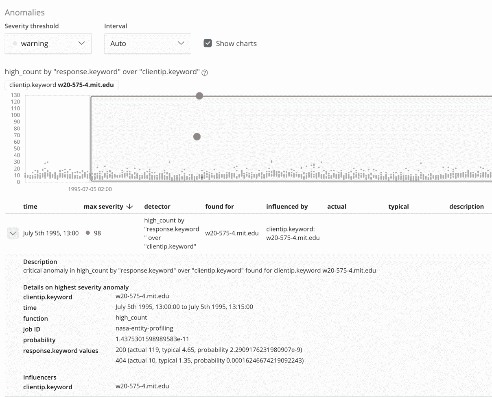

与其余主机相比，前面的主机具有异常高的 200 和 404 响应代码量。


# 每台主机流量分析

第三份工作是前一份的概括；它还将帮助我们了解哪个主机的流量异常高。我们将使用与上一个作业相同的步骤来创建该作业，不同之处在于，我们不会像前面那样拆分作业(使用 by_field_name)。其步骤如下:

1.  在高级作业向导中创建作业:

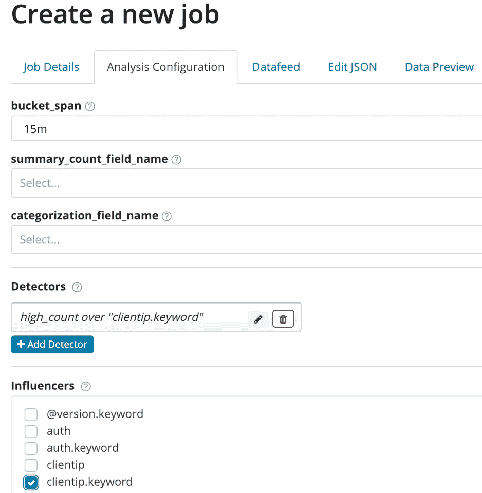

2.  运行该作业将为您提供一个高流量主机异常列表，如以下屏幕截图所示:

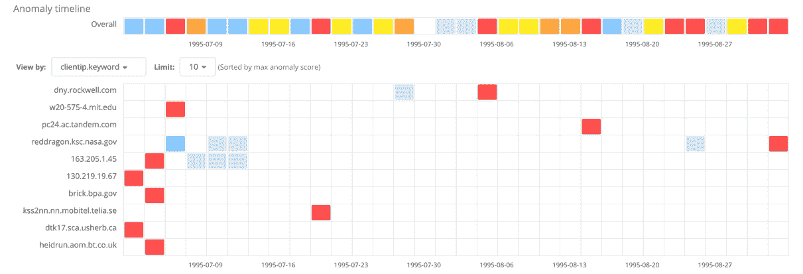

3.  单击其中一个主机异常将会显示以下输出:

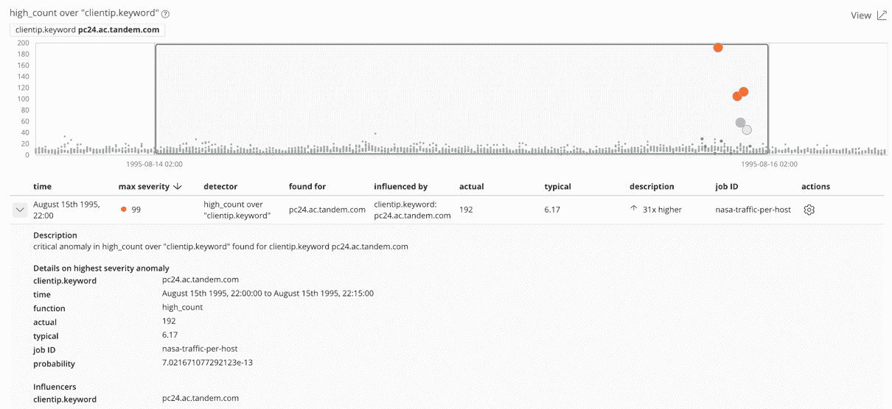

这里，相对主机的流量是典型流量的 31 倍。

因为我们有三个任务和一些异常数据要处理，所以我们准备创建一些可视化的东西并组成我们的仪表板。


# 构建可视化

现在我们已经有了原始数据和对这些数据完成的一些 ML 作业，让我们开始使用各种标准的 Kibana 可视化控件设计我们自己的定制仪表板的过程。但是在我们这样做之前，我们需要让 Kibana 知道 ML results 索引存在，并且我们想要从这个索引中绘制数据。


# 配置索引模式

为了让 Kibana 识别存储 ML 作业结果的索引中包含的数据，我们需要在 Kibana 的管理部分创建一个索引模式。导航到此部分。然后，在 Kibana 部分，点击索引模式，然后点击创建索引模式。

在创建索引模式界面中，启用包含系统索引选项，并将您的索引命名为`.ml-anomalies*`，以包含我们需要的索引:

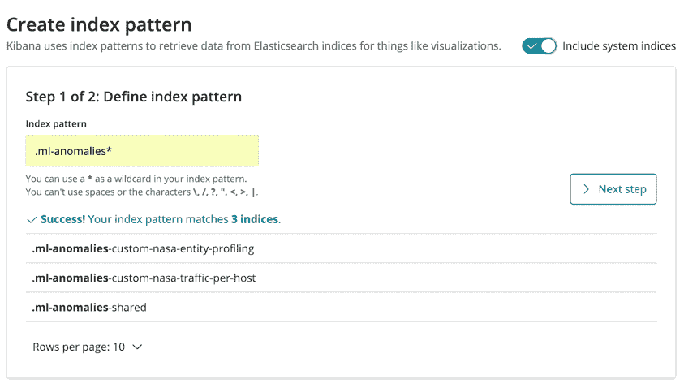

单击下一步，选择@timestamp 作为时间字段。最后，单击创建索引模式。

我们将在整个例子中使用这种索引模式。现在，让我们开始构建一些可视化。


# 在 TSVB 中使用 ML 数据

正如我们在本章开始时解释的那样，TSVB 非常适合度量分析用例。它使用 Elasticsearch 聚合 API 呈现图表，包括 pipeline API，它允许我们用数学函数处理聚合指标结果。

我们将要经历的示例将使用来自第一个作业的数据，呈现 NASA 访问日志中的流量，并用三个异常级别注释流量:次要、主要和关键。我们将分别把它们渲染成黄色、橙色和红色。

让我们从可视化调色板开始并创建一个 TSVB 图表(单击 Visualize，然后单击 Add 按钮，然后从调色板中选择 Visual Builder)。您首先看到的是下面的空白图表:

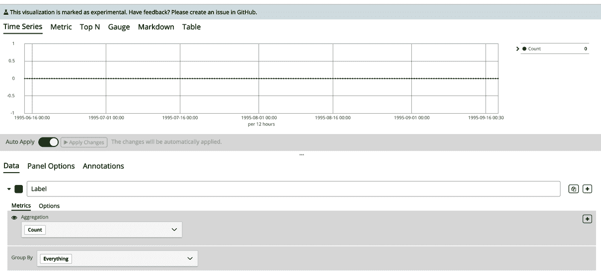

请注意以下几点:

*   “数据”选项卡允许您配置聚合和函数以应用于数据。
*   面板选项选项卡是设置数据源的地方。
*   在 Annotations 选项卡中，我们将使用第二个不同的数据源。这将是我们定义 ML 数据的地方，这样我们就可以对图表进行注释。

首先，让我们在面板选项中配置数据源，如下所示:

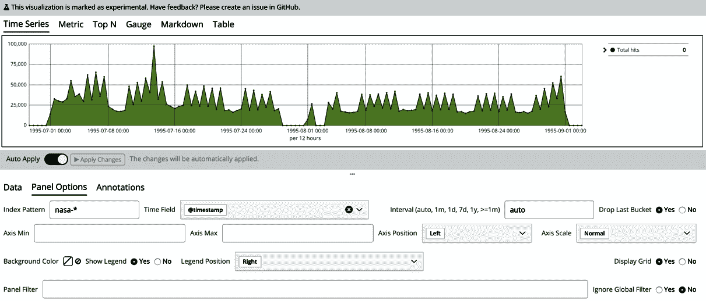

如您所见，配置非常简单:我们只是传递我们的索引模式名称，即`nasa-*`，以及时间字段@timestamp。默认情况下，其余选项可以保持不变。

我们需要利用异常检测作业数据来注释前面的图表，并帮助用户理解在哪里(以及何时)需要注意。首先，让我们添加关键(红色)异常，如下图所示:

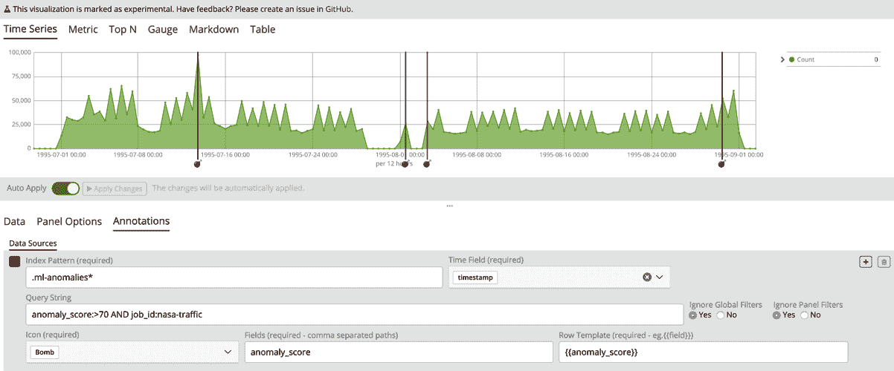

批注允许您在主数据源的顶部呈现前面的垂直线。您可以通过选择以下选项来实现这一点:

*   一种颜色，红色，代表临界。
*   一个索引，如`.ml-anomalies*`，它是指向异常检测作业结果的索引模式。
*   时间字段(这里是时间戳)。
*   用于筛选数据的查询字符串。我们已经设置了一个条件，其中所有具有高于`70`的`anomaly_score`的异常都是严重异常(与 ML UI 使用的`75`的标准值相反)。此外，由于跨作业的所有结果都存储在同一个索引中，我们只需要过滤掉作业的结果。这就是为什么我们添加了`job_id:nasa-traffic`，其中`nasa-traffic`是我们第一个 ML 作业的名称。
*   一个图标(在这里，这是一个炸弹)描述了一个关键的异常。
*   必填字段；我们只需要`anomaly_score`来呈现我们的注释。
*   悬停在批注上时要呈现的模板。在这里，这就是`anomaly_score`本身。

只需通过更改查询、将颜色改为橙色和图标来再现主要异常的相同内容:

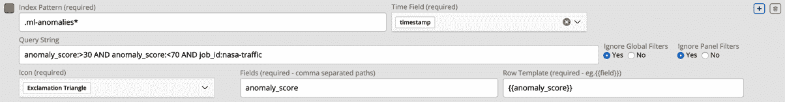

我们为重大异常设置的条件是`30`和`70`之间的`anomaly_score`。对轻微(蓝色)异常(得分在`1`和`30`之间)执行相同的过程，如以下截图所示:

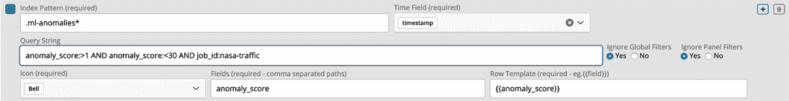

我们没有在 Data 选项卡中配置任何特定的方面，因为默认的计数聚合是我们正在寻找的。但是，您也可以编辑标签，使图表更有意义。标签和注释就绪后，下面是我们如何将 ML 数据叠加到流量之上:


# 创建关联热图

在我们的检测产品组合中有多个作业的情况下，分析师可能希望在同一时间段内看到所有作业的异常情况。这相当于机器学习 Kibana 应用程序中的异常浏览器查看器，其中所有作业都被选中，如下面的屏幕截图所示:


我们将要使用的 Kibana 可视化工具是热图，它相当于前面的截图。进入可视化部分，创建新的热图可视化:

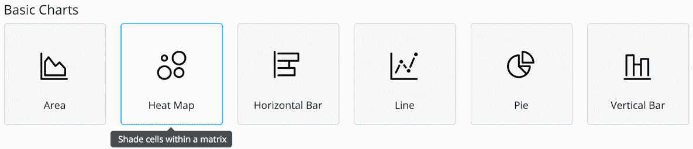

选择`.ml-anomalies*`索引模式，它包含所有与我们到目前为止创建的工作相关的结果:

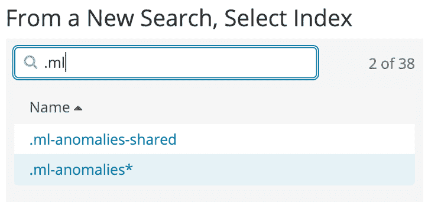

现在，让我们首先进入左侧面板并选择 Buckets 来配置热图。我们想要表示检测到的异常随时间的变化。因此，对于 X 轴，我们将选择一个日期直方图:

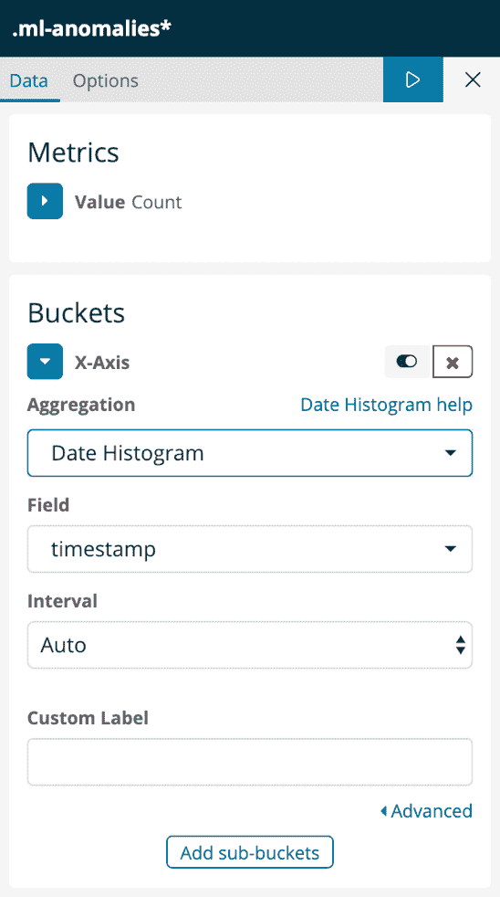

现在，让我们添加一个子桶，以便我们可以拆分每个作业的垂直轴。因为我们关注的是数据存在的时间段(记住，日志是 1995 年的！)，我们应该减少与其他工作的结果发生冲突的可能性。但是，为了确保您仍然可以在作业名称上设置过滤器，请单击“Add su B- bucket ”,选择“Y-Axis ”,然后选择要在 job_id 上拆分的术语聚合，如下面的屏幕截图所示:

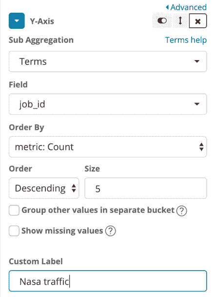

如果您单击播放按钮来呈现图表，您将看到以下内容:


现在，让我们配置指标部分，以便我们可以在热图上强调每个异常随时间变化的严重性:

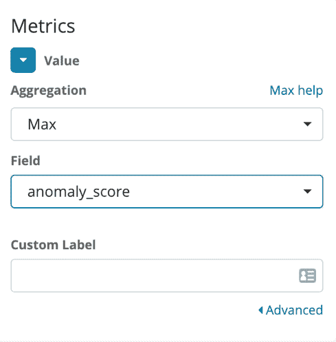

对于热图的最后一点，我们将在选项面板中将颜色模式更改为红色:

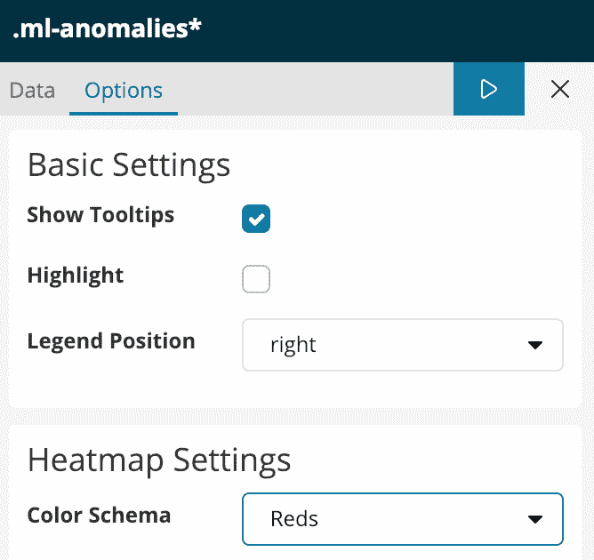

最后，这是我们的热图:


# 在 Timelion 中使用 ML 数据

Timelion 是一个面向表达式的可视化框架。它允许您连接到 Elasticsearch(但也可以连接到其他数据存储)，以及获取多个数据系列并组合它们。在我们的例子中，我们将进行一个非常简单的操作，计算一段时间内每个请求的平均字节数，并覆盖与流量相关的异常。

为此，从组件面板添加一个 Timelion 可视化，并从添加以下表达式开始:

```
.es(index=nasa-*) 
```

记住要配置时间选择器来包围数据所在的时区。前面的表达式只会吸引我们到目前为止已经看到的流量:

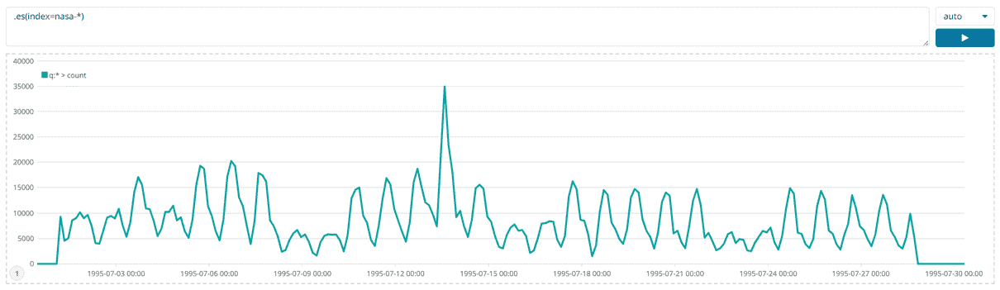

现在，让我们计算每个请求的字节数。我们来分两个表情。这是第一个:

```
.es(index=nasa-*, metric=avg:bytes).divide(.es(index=nasa-*)) 
```

这将呈现以下折线图:

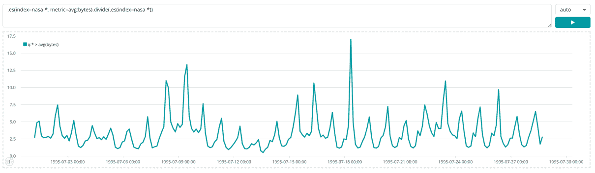

现在，我们只需要通过完成表达式将 ML 结果添加到它上面，就像这样:

```
.es(index=nasa-*, metric=avg:bytes) 

  .divide(.es(index=nasa-*)).yaxis(1), 

.es(index='.ml-anomalies*',  

    timefield=timestamp,  

    metric=max:anomaly_score) 

  .points(symbol=cross).yaxis(2).if(lt, 50, null) 
```

请注意以下几点:

*   数据源由逗号分隔；第一个数据源是比率，第二个是异常检测结果
*   多亏了`.points()`功能，异常以十字的形式出现
*   每个数据源都有自己的 y 轴，以避免不同的数据比例

结果将如下所示:

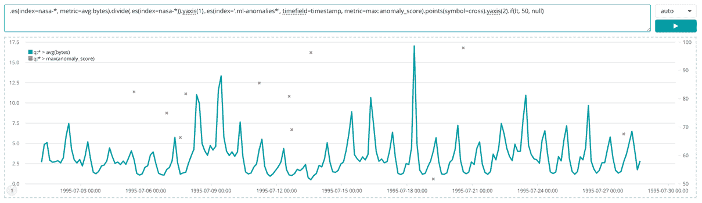

我们终于创建了所有的可视化效果，现在我们可以将它们组合成同一个仪表板的一部分。

不要忘记保存和命名你的可视化！


# 构建仪表板

现在，我们开始最简单的部分；选择我们所有的可视化效果，并将其全部添加到同一个仪表板中。导航到 Kibana 中的仪表板部分，创建一个新的仪表板。您将看到一个空的仪表板。只需点击添加按钮来选择您的可视化。当你做到这一点，你可以随意组织你喜欢的视觉化。这是一个您可以获得的示例，首先是控制面板的顶部:

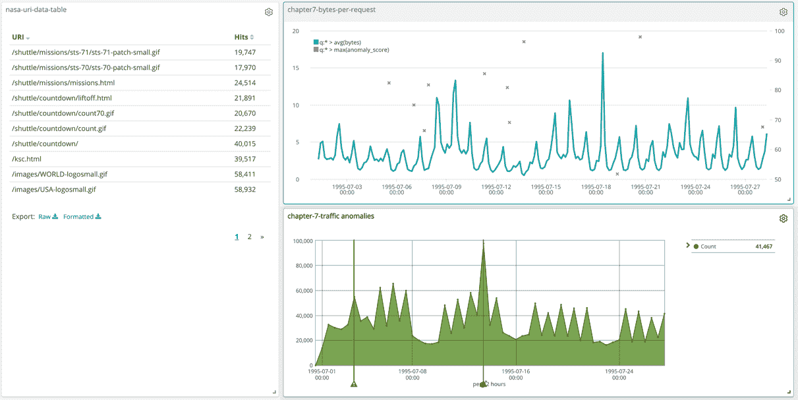

这是仪表板的底部:

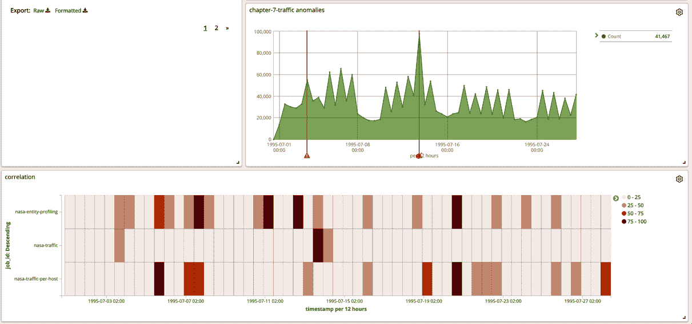

仪表板突出显示了我们到目前为止构建的所有可视化，其中不仅包含我们的原始 NASA 访问日志，还包含跨多个作业的异常检测结果。我们已经成功地将来自 Elastic ML 的数据直接集成到我们自己的定制仪表板中。


# 摘要

在本章中，我们使用了 Kibana 的不同可视化功能来呈现数据集，并利用异常检测结果进行注释和关联。这有助于分析师在他们熟悉并每天使用的仪表板框架中查看异常检测结果。

在下一章中，[第 8 章](44a171c9-7dc9-4798-b69a-64a9e9a47898.xhtml)，*使用带有 Kibana 画布的弹性 ML*，我们将重点关注那些不一定想通过仪表板而需要信息图表风格体验的用户。这就是我们要介绍 Canvas 的地方，它是 Kibana 中一种类似 PowerPoint 的体验，与存储在 Elasticsearch 中的实时数据相连接。