<title>Using Elastic ML with Kibana Canvas</title>  

# 使用弹性 ML 和 Kibana 画布

在前一章[第 7 章](44a171c9-7dc9-4798-b69a-64a9e9a47898.xhtml)、*在 Kibana 仪表板中使用弹性 ML 数据*中，我们看到了如何利用 Kibana 可视化创建仪表板分析，并通过弹性 ML 结果进行增强。这样，用户一眼就能发现数据中的异常。仪表板可以很好地以单独的可视化方式呈现一组 KPI，所有 KPI 都通过用户在导航中选择的过滤器链接在一起。更进一步，用户经常表示需要定制他们的报告的外观和感觉。虽然标准的 Kibana 仪表板不提供这种功能，但另一方面，Kibana Canvas 让用户可以灵活地创建完全自定义的、像素级的报表，这些报表由动态数据驱动。

Canvas 是一个从实时数据中构建演示文稿、幻灯片或信息图的工作空间。您可以根据需要撰写、扩展和定制您的报告。想想看，就像 Kibana 中的 *PowerPoint 对实时数据的处理*。

这一章不打算深入研究 Canvas，但是我们将通过一个简短的介绍，让您了解 Canvas 的关键构件。然后，我们将重点关注使用它来处理弹性 ML 数据，以呈现利用异常检测数据的高度定制的报告。

在本章中，我们将通过以下三种方式使用 Canvas for Elastic ML:

*   通过标准的画布元素和表达
*   使用弹性 SQL
*   为画布构建自定义插件

<title>Introduction to Canvas</title>  

# 画布介绍

本节通过一些使用 Canvas 本身的实例展示了 Canvas 的关键方面。从版本 6.5 开始，Canvas 是弹性堆栈的默认发行版的一部分。

<title>What is Canvas?</title>  

# 什么是画布？

如前所述，Canvas 是一个用一组可定制元素构建高度定制的报告的地方。Canvas 中的体验与标准的 Kibana 仪表板非常不同。Canvas 为您提供了一个工作空间，您可以在其中构建多组幻灯片(概念上类似于 Microsoft PowerPoint ),称为 workpad。

下面是一个空画布工作区的屏幕截图:

**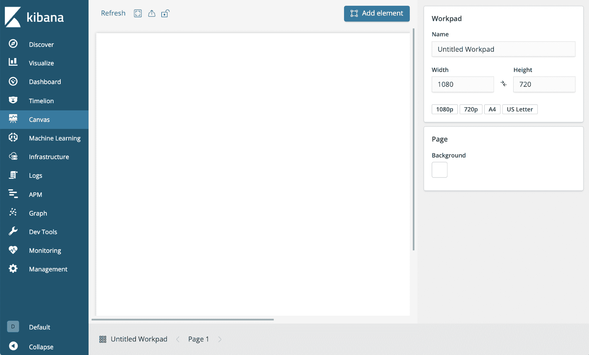** 

正如我们所看到的，工作区有一个空白页，您可以在其中放置和定位称为**元素**的组件。元素可以直接连接到存储在 Elasticsearch 中的数据，并可以在侧边栏中进行配置，在侧边栏中可以定制与元素相关的所有选项，包括定义自己的 CSS。下面的屏幕截图显示了您可以使用的一些元素:

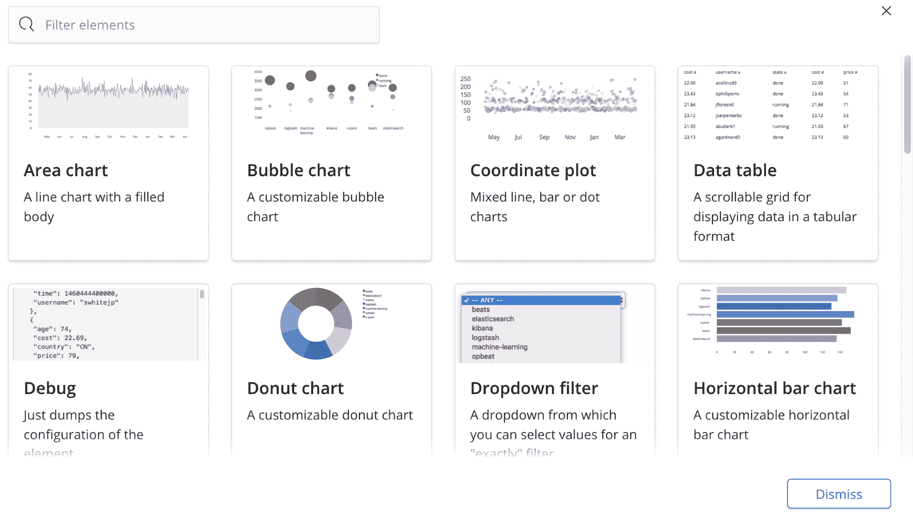

例如，在空白工作区中，单击添加元素并从元素列表中选择圆环图。这将把一个代表性的圆环图(一个带孔的饼图)放到工作区上:

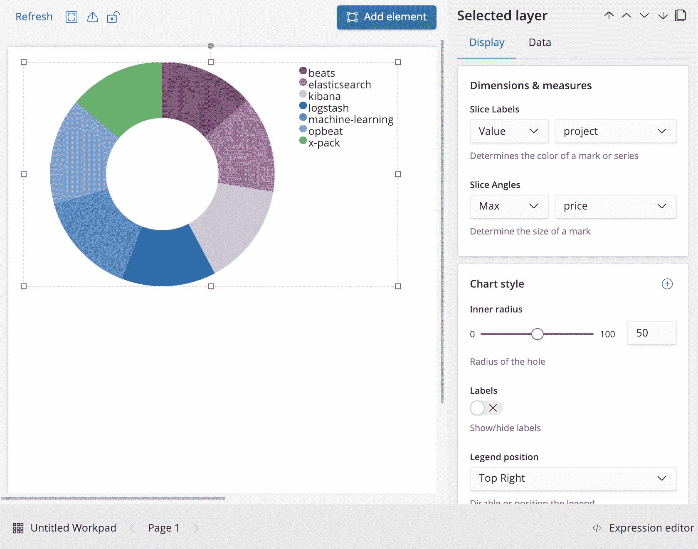

请注意，该图表已经预先填充了演示数据。这样做是为了让用户甚至在将元素连接到真实的数据源之前，就能对元素的外观有所了解。如果单击数据选项卡，您将看到以下消息:

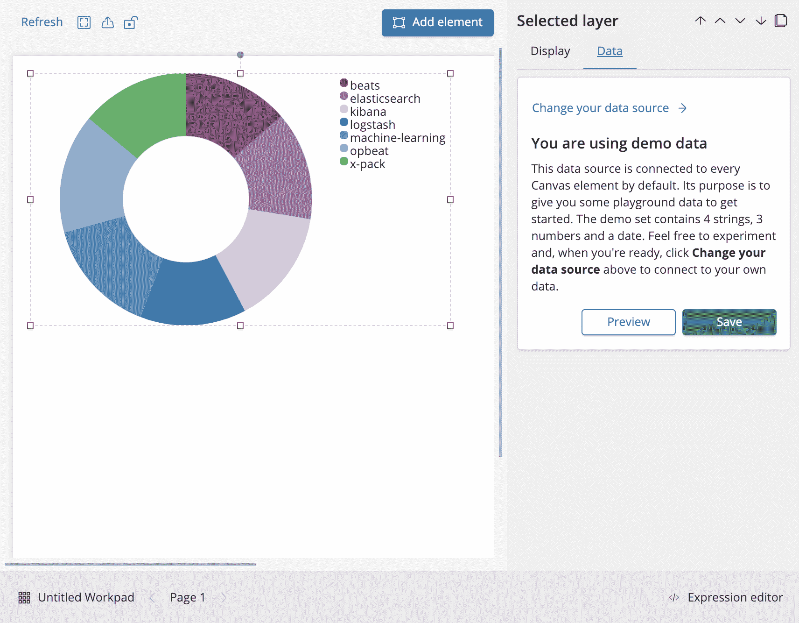

稍后，我们将为我们的元素附加一些真实数据。但是，现在，回到 Display 选项卡，使用几个选项。例如，我们可以更改以下内容:

*   要状态的切片标签(来自项目的以前设置)
*   内径值为 25
*   标签滑块来启用它们
*   选择“隐藏”作为图例位置

由此产生的更改会立即应用到图表元素的外观上。新图表现在看起来如下图所示:

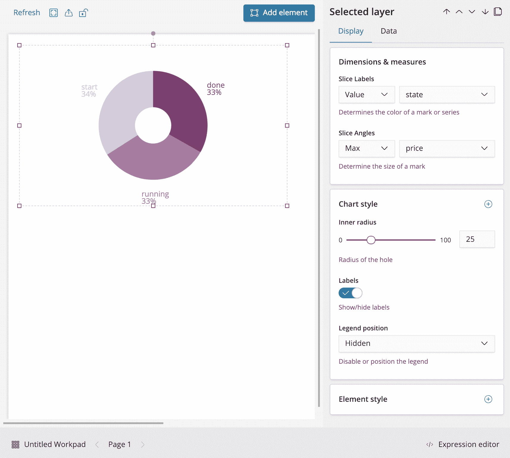

这展示了在工作面板中放置和修改元素是多么容易。然而，还有更多功能和定制能力可供您使用。定制元素的一个关键方法是理解每个元素背后的表达式语法。让我们简单浏览一下这个语法。

画布表情

<title>The Canvas expression</title>  

# 在您在界面中使用的每个元素或组件后面，都有一个画布表达式，它定义了该组件是如何构造的。如果我们使用刚刚创建的圆环图并单击“表达式编辑器”按钮，我们将看到元素背后的表达式语法:

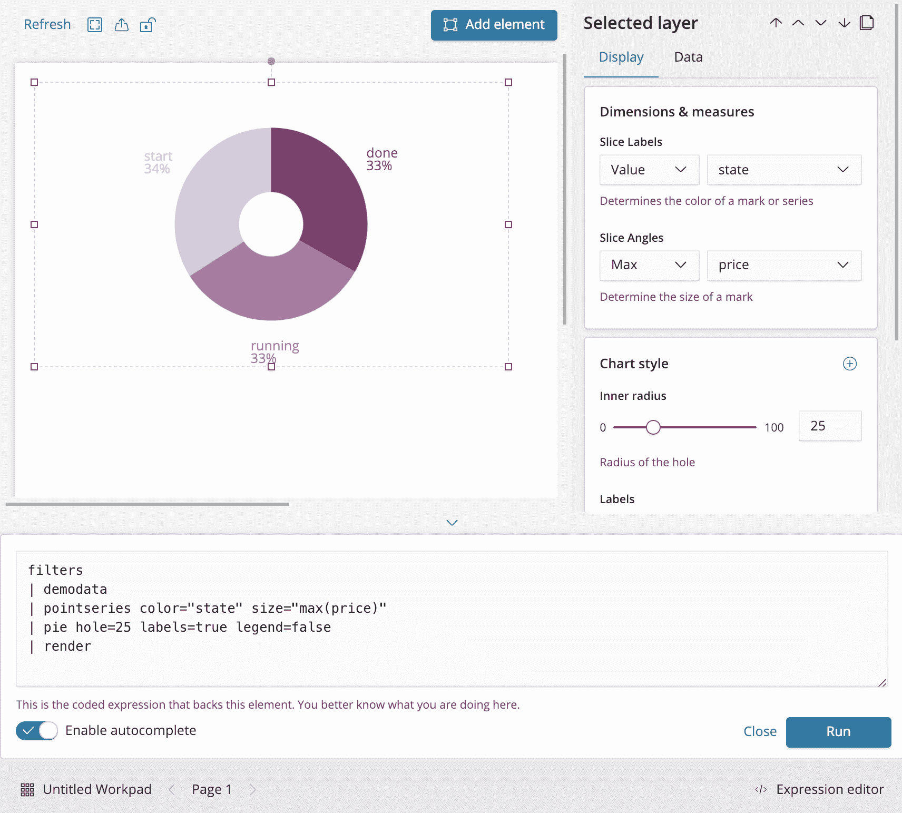

注意，表达式由多层组成，由|字符分隔，将函数链接在一起，就像 Linux/Unix 一样。让我们分解它来理解表达式语法是如何工作的:

在顶部，打开的函数是`filters`，它收集工作面板上的元素过滤器，通常将它们提供给数据源。工作面板上的一个示例元素过滤器是时间选择器。

*   `demodata`函数是饼图中使用的数据源。同样，因为我们还没有将元素连接到任何真实的数据，所以元素默认使用演示数据。顺便说一下，如果你删除了`demodata`之后的整个后续表达式并点击运行按钮，你将得到一个原始演示数据的数据表。如果您确实删除了它，那么您可以将它放回原处。
*   `pointseries`函数准备数据，以便将其传递给图表元素。
*   `pie`函数使用`pointseries`来构建一个饼图(同样，带洞的饼图是一个甜甜圈)。
*   最后，`render`函数呈现整个表达式。
*   当您使用 UI 构建工作面板时，不仅会自动生成表达式，而且您还可以直接编写自己的表达式。我们将在本章的后面看到如何做到这一点。

Canvas 的完整文档可以在 https://www.elastic.co/guide/en/kibana/current/canvas.html[找到。](https://www.elastic.co/guide/en/kibana/current/canvas.html)

另外，请注意，在表达式中，有一些函数的属性:

这些属性直接对应于使用 UI 控件设置的选项。因此，例如，如果内半径控件更改为 50，表达式中的`hole`属性的值也会随之改变。同样，如果您手动编辑表达式中`hole`的值，滑块控件上的值也会改变(但仅当您单击 Run 按钮时)。换句话说，表达式和 UI 控件应该是同步的。

```
filters
| demodata
| pointseries color="state" size="max(price)"
| pie hole=25 labels=true legend=false
| render
```

These attributes directly correspond to the options that are set using the UI controls. So, for example, if the Inner radius control is changed to 50, the value of the `hole` property in the expression would follow suit. Likewise, if you manually edited the value of `hole` in the expression, the value on the slider control would change as well (but only when you click the Run button). In other words, the expression and the UI controls are meant to be in sync.

现在我们将看到 Canvas 的 UI 元素和表达式如何允许我们从 ML 结果索引中的信息构建一个定制视图。

构建弹性 ML 画布幻灯片

<title>Building Elastic ML Canvas slides</title>  

# 在本节中，我们将通过展示来自弹性 ML 作业的实时结果来构建画布幻灯片的示例，以便我们能够以非常定制的方式展示结果。

准备您的数据

<title>Preparing your data</title>  

# 在开始我们的工作板之前，我们需要做一些准备，以便我们可以在画布中使用 ML 数据。我们实际上只需要两样东西:

运行并产生结果的弹性 ML 作业

*   指向作业结果数据的索引模式
*   对于 Elastic ML 作业，我将使用一个指标作业，通过查看与服务器交互的 IP 的不同计数来分析 nginx web 服务器上的流量。

下面的弹性 ML 分析截图将让您了解一般的流量行为，从而揭示一些重要的异常情况:

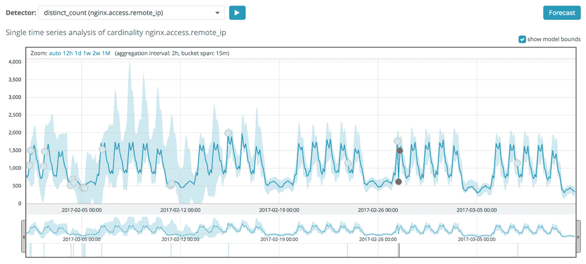


默认情况下，Elastic ML 使用一个名为`.ml-anomalies-shared`的索引来存储详细的作业结果。但是，也可以定义每个作业的专用结果指数。通过使用通配符`.ml-anomalies-*`创建一个索引模式，我们可以使用单个索引模式来访问所有作业的结果。为此，进入 Kibana 管理部分，单击索引模式，然后单击创建索引模式。从这里，在框中输入`.ml-anomalies-*`(记住选择包括系统索引选项，以显示以点字符开头的内部索引):

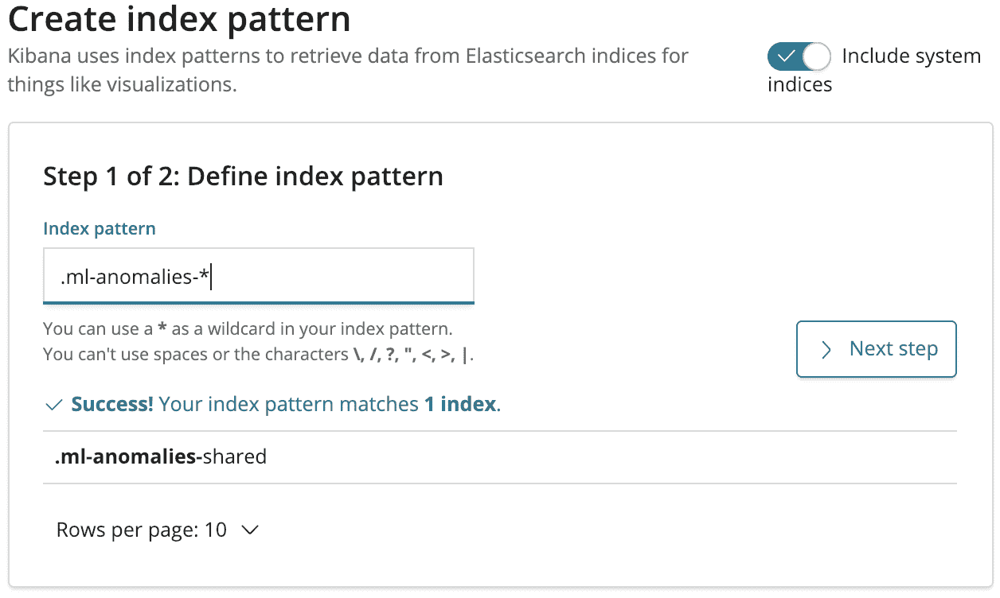

最后一步是在值为 timestamp 的索引中选择时间过滤器字段名称，如下面的屏幕截图所示:

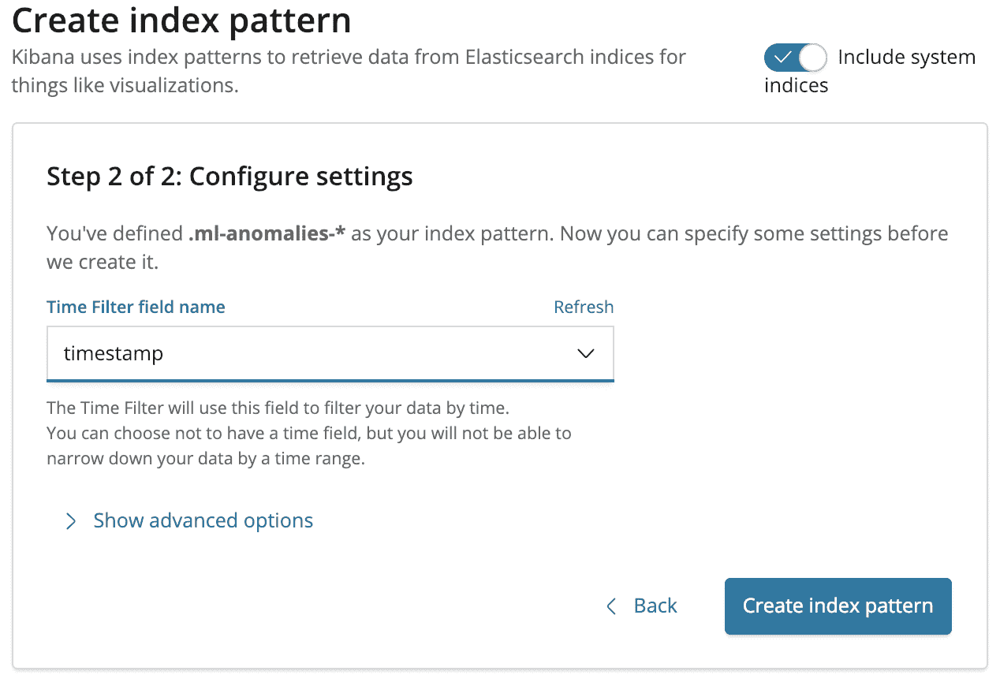

这个逻辑步骤完成后，我们现在可以开始构建画布工作区了。

With this logistical step out of the way, we can now start to begin constructing our Canvas workpad.

画布数据表中的异常

<title>Anomalies in a Canvas data table</title>  

# 我们现在想从 ML 作业中获得异常结果，并把它们放到画布中。首先，让我们创建一个空白的新工作面板，并添加一个数据表元素。如前所述，演示数据填充到表格中，让我们感受一下它是如何工作的:

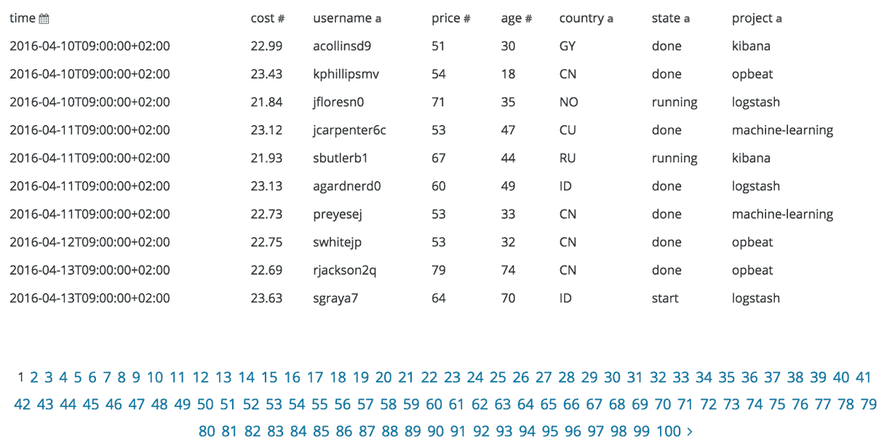

为了将 ML 作业的结果放入这个表中(而不是演示数据)，我们需要更改数据表的数据源。选择数据表后，单击数据按钮，然后单击更改数据源链接:

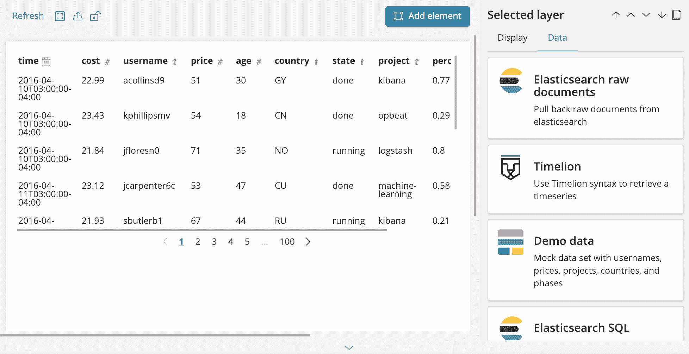

现在，选择 Elasticsearch raw documents 选项，并输入适当的信息，以便从感兴趣的`job_id`(在本例中是一个名为`nginx-traffic`的作业)的`.ml-anomalies-*`索引模式的`result_type:bucket`文档中获取异常分数:

指数:`.ml-anomalies-*`

*   查询:`job_id:nginx-traffic AND result_type:bucket`
*   排序字段:`anomaly_score`
*   排序顺序:降序
*   字段:`job_id`、`timestamp`和`anomaly_score`
*   这显示如下:

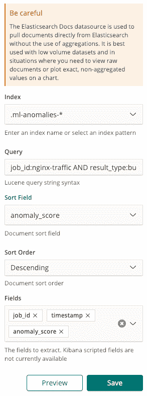


注意，我们使用 Lucene 查询字符串语法来过滤我们的数据；前面是一个非常简单的布尔型`AND`表达式，使用了`job_id`和` result_type`字段。

我们还选择了要在数据表中显示的列。这里，我们将简单地使用`job_id`、`anomaly_score`和`timestamp`字段。

单击“保存”按钮的结果如下:

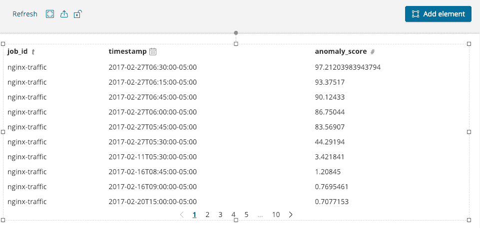

如果我们想要查看驱动该数据表的相应画布表达式，我们可以单击表达式编辑器按钮来查看以下表达式:

同样，该表达式是由两个主要部分组成的一系列部分:

```
filters
| esdocs index=".ml-anomalies-*" fields="job_id, timestamp, anomaly_score" query="job_id:nginx-traffic AND result_type:bucket" sort="anomaly_score, DESC"
| table
| render
```

`esdocs`:对 Elasticsearch 的查询，带有我们在 UI 中发布的选项

*   `table`:这样就创建了一个数据表
*   如果您对 Lucene 查询字符串语法不太熟悉，并且希望使用 SQL，那么您也可以用这种方式查询数据。

使用新的 SQL 集成

<title>Using the new SQL integration</title>  

# Elasticsearch SQL 是 6.3 版本中引入的一项功能，允许用户使用 SQL 查询来查询 Elasticsearch。

该 API 可通过 X-Pack API 查询索引，如下例所示:

如果您想了解关于这个 API 的更多细节，请查看位于[https://www . elastic . co/guide/en/elastic search/reference/current/xpack-SQL . html](https://www.elastic.co/guide/en/elasticsearch/reference/current/xpack-sql.html)的文档。

```
POST /_xpack/sql?format=txt 

{ 

    "query": "SELECT * FROM my_index WHERE release_date < '2000-01-01'" 

} 
```

要切换并使用 Elasticsearch SQL 作为首选数据源，只需在选择数据表时点击 data 按钮，然后选择 Change your data source。然后，选择 Elasticsearch SQL。在文本区域，您可以粘贴任何符合 Elasticsearch SQL 的查询。例如:

这显示如下:

```
SELECT job_id, timestamp, anomaly_score FROM ".ml-anomalies-*" WHERE job_id='nginx-traffic' AND result_type='bucket' ORDER BY anomaly_score DESC
```

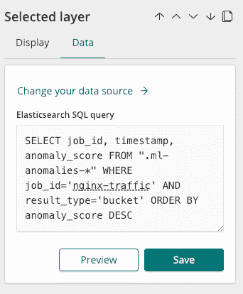

结果与上一个例子完全相同，我们使用 Elasticsearch 的 Lucene 查询字符串语法进行查询:


请注意，在请求中，我们将查询限制为仅选择`result_type:bucket`。但是，正如我们在 [第 6 章](7ba6aa9b-aaee-4a1e-91cb-8b062aeaa181.xhtml)、*ML analysis 上的报警中所述，还有许多其他结果类型可以查询。然而，通过在 Kibana 的开发工具控制台中发出以下请求，可以很容易地检索到所有结果类型的完整列表:*

Notice in the request that we limited our query to only select `result_type:bucket`. However, as we described in [Chapter 6](7ba6aa9b-aaee-4a1e-91cb-8b062aeaa181.xhtml), *Alerting on ML Analysi*s, there are many other result types that can be queried. The full list of all result types can be easily retrieved, however, by making the following request in the Dev Tools Console of Kibana:

```
GET .ml-anomalies-*/_search
{  
   "size":0,
   "aggs":{  
      "result_type":{  
         "terms":{  
            "field":"result_type"
         }
      }
   }
}
```

这将为您提供以下列表:

`bucket`

*   `model_plot`
*   `bucket_influencer`
*   `influencer`
*   `record`
*   `model_size_stats`
*   `model_forecast`
*   `model_forecast_request_stats`
*   你可以在[https://www . elastic . co/guide/en/elastic search/reference/current/ml-results-resource . html](https://www.elastic.co/guide/en/elasticsearch/reference/current/ml-results-resource.html)的文档中找到各自的定义。

至于下一步，让我们定制我们的 SQL 查询多一点，并添加一个子句，将结果限制为仅那些`anomaly_score>10`去掉所有分数非常低的异常的结果。只需单击表达式编辑器按钮，将画布表达式修改如下:

现在，让我们通过替换画布表达式的`table`部分，将原始数据表更改为水平条形图。整体而言，现在情况如下:

```
filters
| essql 
 query="SELECT job_id, timestamp, anomaly_score FROM \".ml-anomalies-*\" WHERE job_id='nginx-traffic' AND result_type='bucket' AND anomaly_score>10 ORDER BY anomaly_score DESC"
| table
| render
```

Now, let's change the raw data table into a horizontal bar chart by replacing the `table` part of the Canvas expression. In its entirety, this would now be as follows:

```
filters
| essql 
  query="SELECT job_id, timestamp, anomaly_score FROM \".ml-anomalies-*\" WHERE job_id='nginx-traffic' AND result_type='bucket' AND anomaly_score>10 ORDER BY anomaly_score DESC"
| pointseries x="anomaly_score" y="timestamp" color="job_id"
| plot defaultStyle={seriesStyle lines=0 bars="0.75" points=0 horizontalBars=true} legend=false
| render
```

具体来说，变化如下:

我们移除了`query`和`render`函数之间的`table`函数，因为它不需要呈现条形图

*   我们添加了一个`pointseries`函数来构建将被条形图使用的数据序列
*   我们添加了一个`plot`函数来绘制这个系列，既不是折线图(`lines=0`)也不是点数图(`points=0`)，而是水平条形图(`horizontalBars=true`)(`bars="0.75"`)
*   这是您应该获得的:

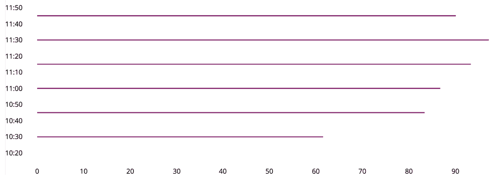

这为我们提供了一个条形图，表示一段时间内的主要异常情况。这可能很有趣，但是我们还没有利用 Canvas 相对于 Kibana 中其他可视化工具的最大优势，即创建像素级完美信息图的能力。

所以，让我们更有创意一点，制作一个非常定制的幻灯片来代表一个假的网络运营中心。要做到这一点，我们可以利用在线资源，如 https://www.freepik.com/网站，它提供了大量的矢量化图片，然后可以用 Adobe Illustrator 导出为 PNG 文件，以便在画布上使用。除了一些*赏心悦目的*图片之外，我们也许可以创建另一个数据元素来显示我们的 ML 作业中所看到的异常总数的简单的单个度量值。

So, let's be a little bit more creative and build a very customized slide to represent a fake network operation center. To do so, we can leverage online resources, such as the [https://www.freepik.com/](https://www.freepik.com/) website, which provides a huge amount of vectorized pictures that can be then exported to a PNG file with Adobe Illustrator for use in Canvas. In addition to a few *eye candy* pictures, we can perhaps create another data element that shows a simple single metric value for the total number of anomalies seen for our ML job.

实现这一点的一种方法是使用公制元素。另一个是降价元素。让我们选择后者，并让 Markdown 元素显示我们的 SQL 查询返回的行数(如异常总数)，如以下表达式中所定义:

欲了解更多关于减价或车把的信息，请访问以下链接:

```
filters
| essql 
  query="SELECT timestamp, anomaly_score FROM \".ml-anomalies-shared\" WHERE result_type = 'bucket' AND anomaly_score > 10 AND job_id = 'nginx-traffic'"
| markdown 
"#
#
# {{rows.length}}"
| render
```

**降价**:[https://daringfireball.net/projects/markdown/syntax](https://daringfireball.net/projects/markdown/syntax)

*   **车把**:[http://handlebarsjs.com/expressions.html](http://handlebarsjs.com/expressions.html)
*   这里，我们使用 Canvas 中数据源组件返回的`rows`变量。最终结果是一个透明盒子里的简单数字:

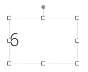

我们需要给我们的`markdown`对象添加一些定制，比如背景颜色、字体、颜色等等。随意使用不同的元素样式设置，使这个元素在视觉上更有吸引力。您甚至可以添加自己的 CSS，例如:

这将使元素看起来如下:

```
filters
| essql 
 query="SELECT timestamp, anomaly_score FROM \".ml-anomalies-*\" WHERE result_type = 'bucket' AND anomaly_score > 10 AND job_id = 'nginx-traffic'"
| markdown "
#
#
# {{rows.length}}"
| render css="h1 {
text-align: center;
color: #ff1744;
}
" 
 containerStyle={containerStyle backgroundColor="#444444" border="5px none #FFFFFF" borderRadius="7px" padding="px"}
```


这给了我们很多机会来创建适合任何报告的外观和感觉，即使你想匹配你的公司品牌或调色板。您甚至可以利用 markdown 元素可点击的事实，允许用户链接到其他画布工作面板或其他标准仪表板或可视化。

应用于条形图的相同类型的定制给出了下面的表达式:

The same type of customization that's applied to the bar chart gives me the following expression:

```
filters
| essql 
  query="SELECT timestamp, anomaly_score FROM \".ml-anomalies-shared\" WHERE result_type = 'bucket' AND anomaly_score > 10 AND job_id = 'nginx-traffic'"
| pointseries x="anomaly_score" y="timestamp"
| plot 
  defaultStyle={seriesStyle lines=0 bars="2" points=0 horizontalBars=true color="#d32f2f"} legend=false xaxis=true yaxis=true 
  font={font family="'Open Sans', Helvetica, Arial, sans-serif" size=12 align="left" color="#FFFFFF" weight="normal" underline=false italic=false}
| render containerStyle={containerStyle backgroundColor="#444444"}
```

这给了我们下面的渲染:

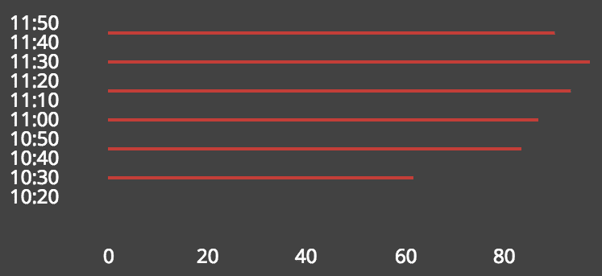

此时，你可以让你的创造力完成剩下的工作。我们将添加一些家具的静态图像和一位同事的傻傻的肖像，以完善我们的自定义数据驱动信息图:

At this point, you can let your creativity do the rest of the work. We will add some static images of furniture and a silly portrait of one of our colleagues to round out our custom, data-driven infographic: 

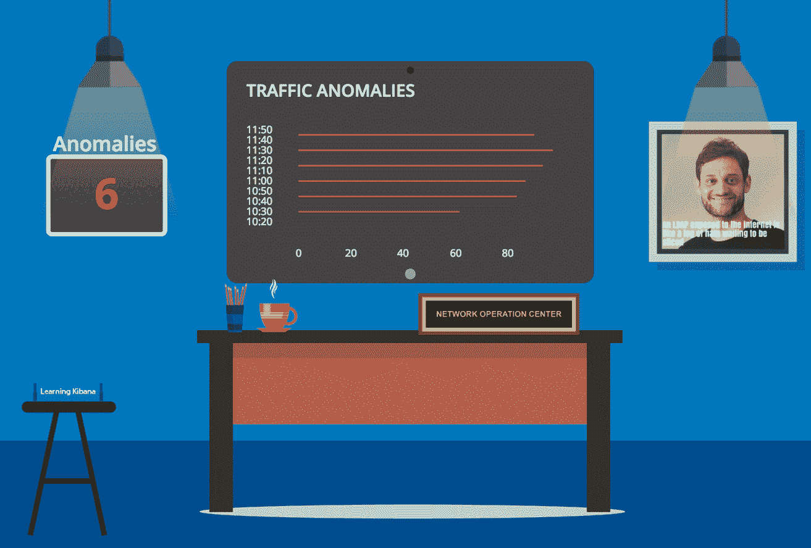

如你所见，我们可能不会因为我们的平面设计能力而被录用！如果你想看一个漂亮的例子来说明画布仪表盘的交互性和视觉效果，可以看看 Elastic 博客上的这个例子，网址是 https://www . Elastic . co/blog/monitoring-airport-security-operations-with-Canvas-and-Elastic search。

摘要

<title>Summary</title>  

# 在这一章中，我们看了如何使用 Canvas 来利用 ML 的输出来构建一个定制的报告，以便信息可以吸引任何受众。借助 Elasticsearch 的全部灵活性(甚至是使用 Elasticsearch SQL 查询)，我们可以制作实时数据驱动的信息图表，您的唯一限制是您的创造力。

在下一章[第 9 章](7d0fae70-bcea-4d2e-a096-09d933267b93.xhtml)、*预测*中，我们将深入预测的世界，我们可以让 ML 推断未来的数据趋势，以满足一组全新的用例。

In the next chapter, [Chapter 9](7d0fae70-bcea-4d2e-a096-09d933267b93.xhtml), *Forecasting*, we will delve into the world of forecasting, where we can have ML extrapolate data trends into the future to satisfy a whole new set of use cases.