# 九、预测

预测是Elastic最大似然时间序列建模的自然延伸。由于非常有表现力的模型是在幕后构建的，并且描述了数据在历史上的表现，因此有可能将该信息在时间上向前投射，并且预测某事物在未来的时间应该如何表现。

在本章中，我们将讨论以下主题:

*   预测用例
*   操作理论
*   单度量预测
*   多指标预测

然而，首先，我们需要了解预测未来的注意事项。


# 预测与预言

*过去的表现不代表未来的结果*。金融公司在参考共同基金等产品的表现时，会用到这种免责声明。但是这个免责声明有点奇怪的矛盾，因为过去是我们必须面对的一切。如果构成共同基金的公司在过去连续八个季度都取得了积极的季度业绩，这是否能保证它们在未来八个季度也将取得积极的业绩，它们的公开估值将继续上升？概率可能是事实的一面，但这可能不是故事的全部。此外，在我们一厢情愿地认为 Elastic ML 的预测能力是我们在股市中发财的关键之前，我们应该现实地对待一个关键的警告。

金融公司使用这种免责声明的原因是，经常会出现未知的、不可控的因素，这些因素会对事情的发展轨迹产生非常大的影响。例如，政府可以改变极大地帮助或阻碍公司运营和盈利能力的法规或贸易政策。可能会出现内部欺诈性会计丑闻，高管们合谋伪造公司业绩，公司业绩变得难以维持，并最终导致公司破产。

这些因素被认为是未知的和外部的，原因如下:

*   它们不受实体本身的控制(例如，政府独立于公司活动制定政策)
*   它们对关于系统的可用信息是隐藏的(外部投资者实时地只能访问公开可用的性能报告，而不知道可能伪造那些性能报告的欺诈活动)

因此，预测的好坏取决于你所拥有的信息，以及你消除或减轻会影响你预测的外部未知因素的能力。在 IT 数据领域也是如此。如果有未知的外部因素在起作用(有人错误地进行了配置更改，硬件出现故障，等等)，并不总是能够预测趋势或故障。然而，除了那些可能的外部因素，我们可以使用概率分析来给出我们对未来的最佳猜测。理解这个警告可以让我们满足一些好的预测用例，而不会被预言的期望所困扰。


# 预测用例

在Elastic ML 的上下文中，实际上只有两个有些相似的用例，在这两个用例中有人会使用预测。这些措施如下:

*   **关注价值的**:将一个时间序列外推至未来，以了解一个可能的未来价值。这类似于回答这样的问题:“从现在起的两个月内，我每天会卖出多少件产品？”
*   **:了解预期值达到的可能时间。这将是回答类似于“我希望在下周达到 80%的利用率吗？”**

 **这两个用例之间的差异可能不仅仅是提问的方式(如何搜索数据)，还有如何解释输出。然而，在我们深入研究如何使用预测功能的几个例子之前，让我们花一点时间来讨论它在逻辑上是如何工作的。


# 预测——操作理论

首先要认识到的是，对数据调用预测的行为是对现有作业的扩展。换句话说，您需要配置一个 ML 作业，并且该作业需要分析历史数据，然后才能根据这些数据进行预测。这是因为预测过程使用由 ML 作业创建的模型；也就是用于异常检测的那些。要进行预测，您需要按照在其他章节中描述的相同步骤来创建 ML 作业。如果异常是由该作业的执行产生的，如果您的唯一目的是执行预测，则可以忽略它们。一旦 ML 作业了解了一些历史数据，与该作业关联的一个或多个模型(如果 ML 作业包含多个时间序列)就是最新的，如下图所示:

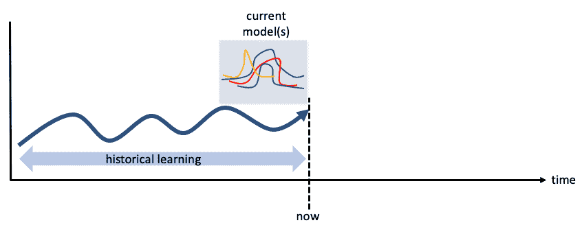

我们就把**之前的**时间**现在的**当做**历史学习**；模型学习实际数据的**时间**。当用户希望在特定时间调用预测时，会创建模型的副本，并使用单独的流程获取这些模型，并将其外推至**“未来”**。这个过程是并行运行的，不会干扰原始模型及其演化。下图显示了这一点:

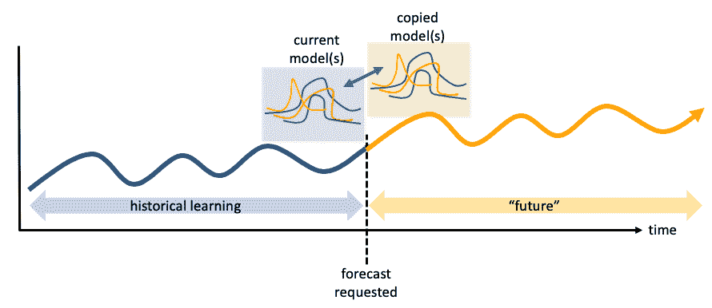

预测值作为一种特殊类型的结果写入结果索引(稍后将详细介绍)，并且可以在 UI 中查看或通过 API 访问。

需要注意的是，分析实际数据的 ML 作业的正常路径将会继续(如果它是实时运行的),因此经过一段时间后，未来某个时间的预测值(在预测时做出)与该时间到来时的实际值之间可能会有差异，如下图所示:

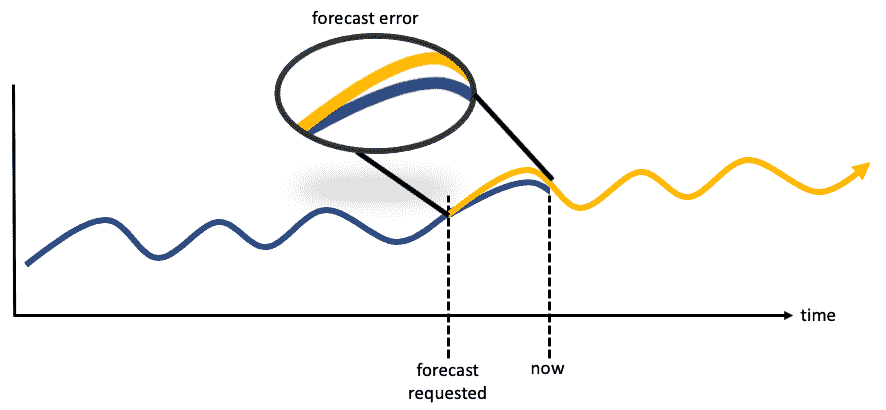

这种预测误差是意料之中的，但希望它是最小的。这两者之间的差异目前还没有被 ML 使用，但也许在未来它可以通知模型更准确的后续预测。当然，未知的外部因素(如前所述)也有可能导致一定程度的预测误差。考虑预测中的不确定性的另一种方式(可能更简单)是考虑预测掷硬币的结果。你可以观察一系列先前的硬币投掷，但是如果你不考虑硬币投掷的物理特性(速度、高度、旋转，等等),而仅仅依赖于过去的观察结果，那么你永远不会得到比 50/50 预测更好的结果。此外，很可能 ML 在学习期间没有看到行为上完全一致的数据。因此，由于数据中存在一定量的噪声，我们也应该预计到预测中存在一定量的变化或不确定性。

也可以有用户在其他时间做出的多个预测。这些将分开存储，如下图所示:

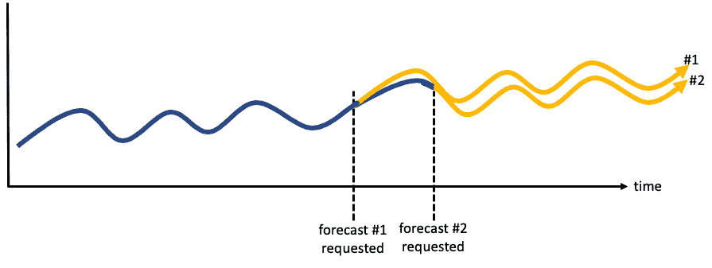

**预测#1** 和**预测#2** 之间的区别将通过每个预测实例的内部唯一 ID 来区分。稍后，当我们查看预测结果如何存储在索引中时，这一点将变得显而易见。


# 单一时间序列预测

现在我们已经对预测过程的逻辑操作有了一个基本的了解，让我们来看一个如何使用Elastic ML 进行预测的例子。我们将从一个单一时间序列的数据集开始。


# 数据集准备

我们将在示例中使用的数据集可以在 GitHub 资源库中获得，该资源库位于[https://GitHub . com/packt publishing/Machine-Learning-with-the-Elastic-Stack/tree/master/example _ data](https://github.com/PacktPublishing/Machine-Learning-with-the-Elastic-Stack/tree/master/example_data)。这个数据集一旦下载，就可以很容易地通过 ML 的数据可视化器(仅在 6.5 以上版本中)导入到您的 Kibana 中。要上传数据，请转到 ML 的数据可视化工具选项卡，并选择上传文件按钮:

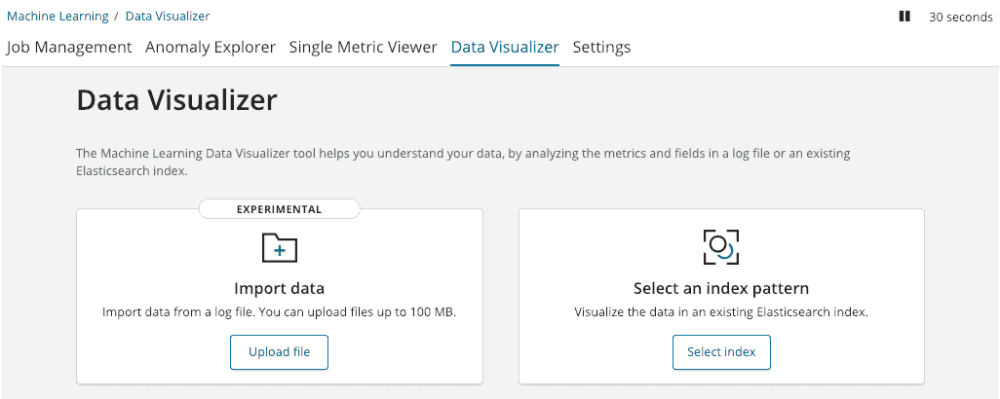

从本地机器上选择`forecast_example.json`文件。然后，数据可视化工具将显示文件的前 1000 行，让您预览文件包含的内容，以及不同字段的细分:

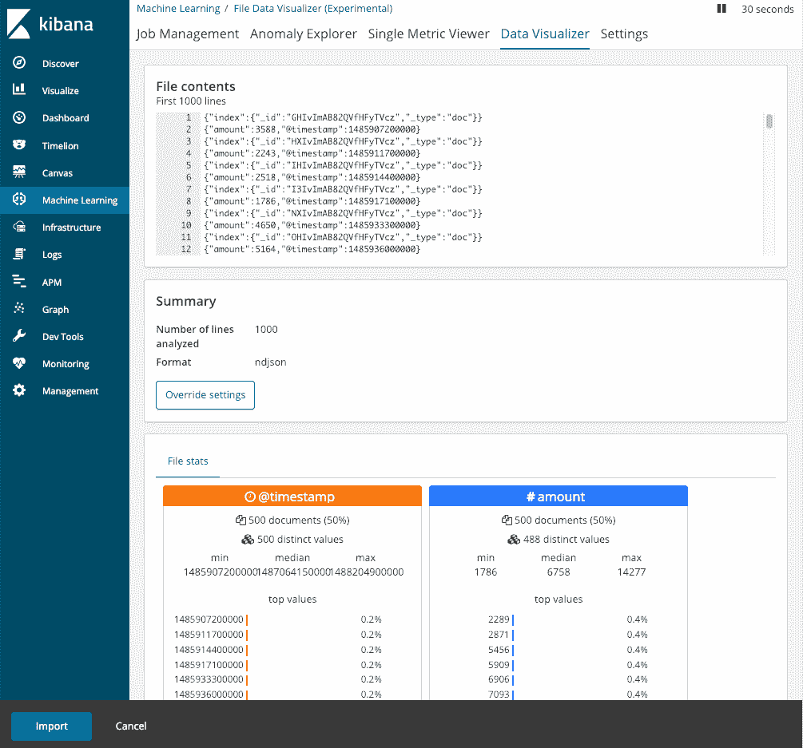

在这种特定情况下，我们不需要覆盖 Data Visualizer 自动进行的任何设置，因此我们可以通过单击 Import 按钮继续。我们可以为目标索引提供一个名称(在这个练习中，我们可以使用`forecast_example`):

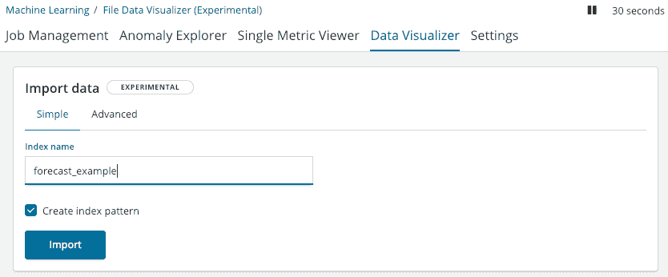

现在单击导入按钮将完成导入过程:

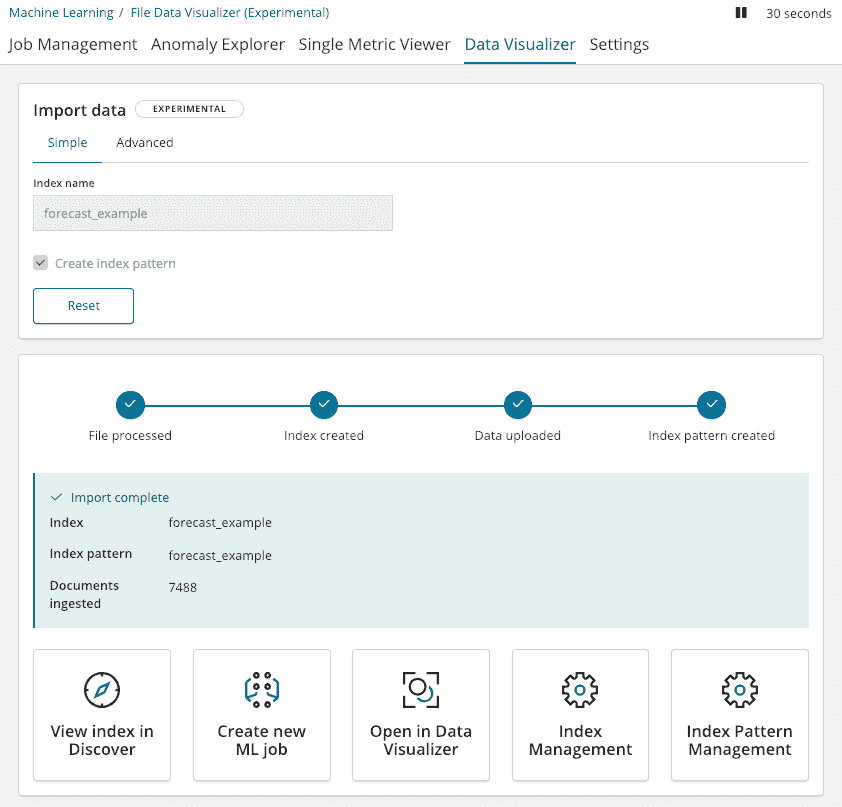

我们现在可以创建一个新的 ML 作业，以便对该数据集进行一些预测。


# 为预测创建 ML 作业

这个示例数据集从 2017 年 1 月 31 日到 2017 年 3 月 11 日。尽管我们来自过去，但我们可以设计一个场景，我们假装在那个时间框架内，并说今天的日期是 2017 年 3 月 1 日 ^(st) 。因此，我们希望有一个 ML 作业来分析 1 月 31 日到今天之间的数据，然后使用 ML 来预测未来 10 天的数据。

如果您的基巴纳时区设置为您的当地时间，本章中的日期可能会略有不同，因为截屏是用设置为美国东部时区的基巴纳版本拍摄的。

然后，我们可以让 ML job 分析索引中的其余数据(从 3 月 1 日^日到 3 月 11 日^日)，我们可以看到预测与实际数据集有多接近。我们开始吧！

第一步是创建一个单一指标作业，该作业在#amount 字段上使用 Sum 聚合函数，时段跨度为`15m`:

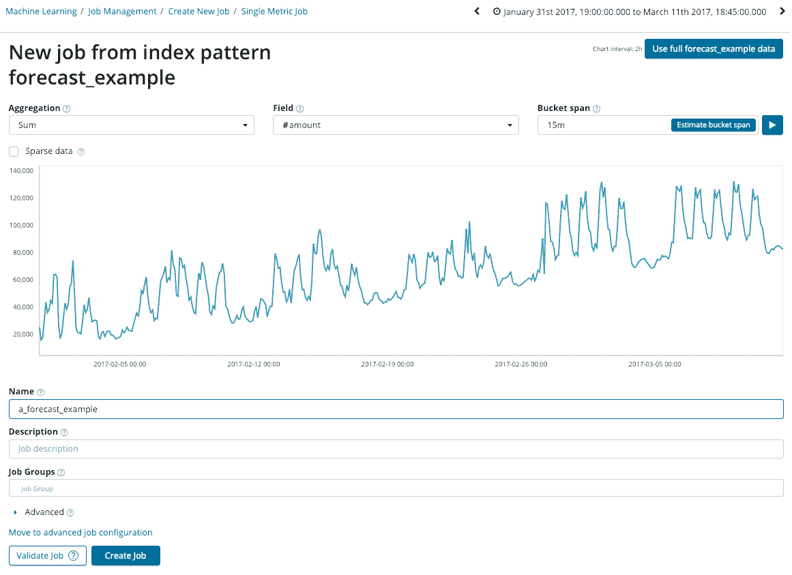

然而，我们不想分析所有的数据；我们想在 3 月 1 日短暂停留。因此，在右上角，将 Kibana 日期选择器的结束日期更改为 3 月 1 日 ^(st) :

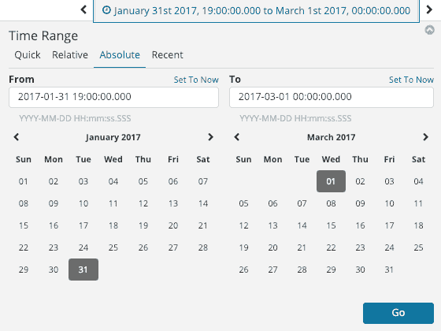

修改日期后，您可以将作业命名为`a_forecast_example`并单击 Create Job 按钮:

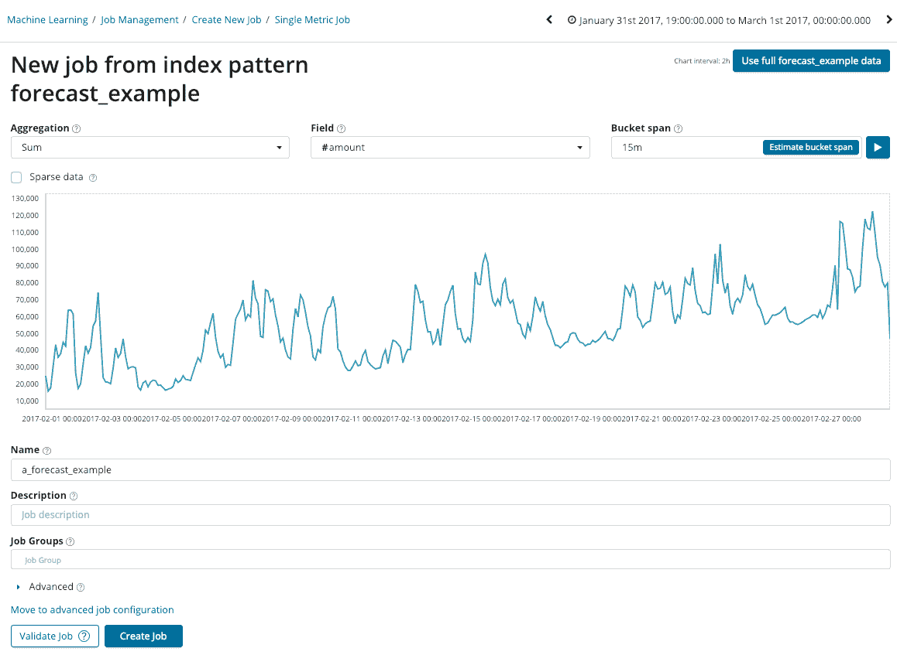

作业运行后，我们可以在用户界面中看到结果预览:

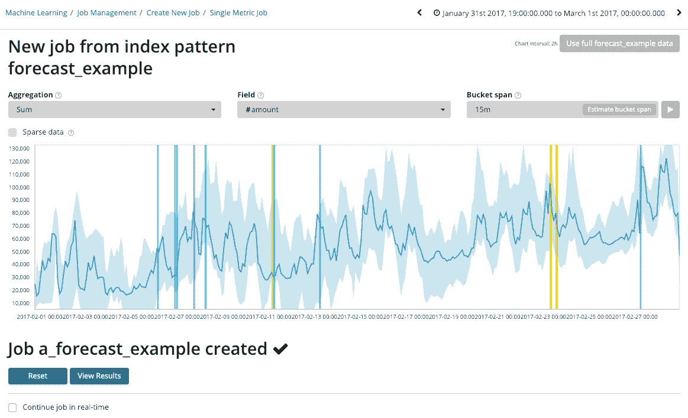

要访问预测功能，我们需要单击查看结果按钮，这将带我们进入单一指标查看器。在单个指标查看器中，我们可以看到整个数据集，并且可以了解这些数据行为方式的形状和复杂性；既有每日和每周的周期性成分，也有导致数据随时间向上漂移的逐渐正斜率/趋势:


请记住，尽管我们可能只对这些数据的预测感兴趣，但是 ML 作业仍然会指出数据历史中的异常，但是我们可以简单地忽略它们。

要对此数据调用预测，请单击预测按钮，并在对话框中输入 10 天的持续时间(`10d`):

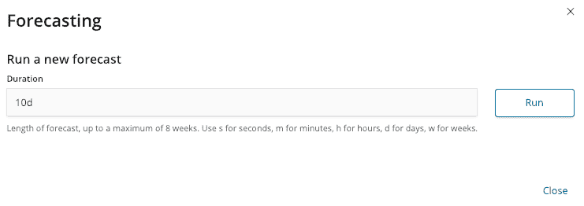

目前对持续时间有一个八周的硬性限制(在 ML 的未来版本中可能会延长)。此外，您应该注意，您不应该试图要求预测持续时间长于 ML 作业已经分析的数据的持续时间。换句话说，如果 ML 工作只看过一周的数据，就不要要求两周的预测。最后，提供足够一致的数据来了解主要模式。例如，周期模式的最少三个循环被用于实现最佳可能的预测。

单击“运行”按钮将调用预测请求，该请求将在后台运行，但一旦完成，将显示感兴趣的时间段内的预测结果:

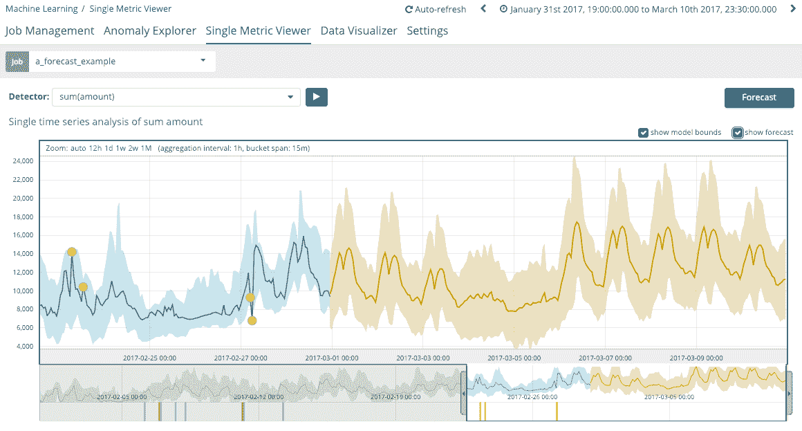

预测/预测区域周围的阴影区域是第 95 ^个百分位置信区间。换句话说，ML 估计未来值有 95%的可能性在这个范围内(同样，未来值高于或低于置信区间的可能性只有 2.5%)。第 95 ^个百分位范围目前是一个固定值，用户无法设置。

现在我们已经能够从 UI 创建简单的预测，让我们在进入更复杂的示例之前更深入地探索预测的结果。


# 预测结果

现在，我们已经运行了预测，我们可以更深入地查看预测流程生成的结果。顺便说一下，我们可以通过两种方法之一在 UI 中随时查看以前创建的预测的结果。您可以单击单指标查看器中的预测按钮，显示以前的预测列表，如下所示:

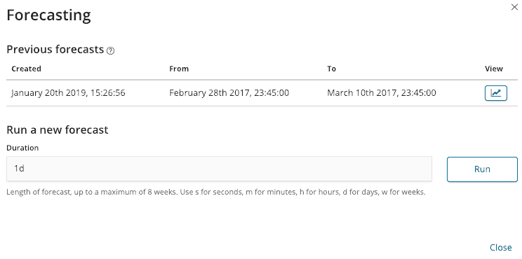

或者，您可以在该作业的“预测”选项卡下的“作业管理”页面中查看它们:

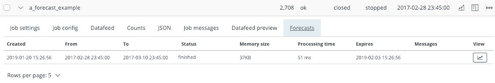

在 Kibana 中构建的预测结果的默认寿命为 14 天。此后，预测结果将被永久删除。如果需要不同的到期持续时间，那么必须通过`_forecast` API 端点调用预测，这将在后面讨论，但在[https://www . elastic . co/guide/en/elastic search/reference/current/ml-forecast . html](https://www.elastic.co/guide/en/elasticsearch/reference/current/ml-forecast.html)中有相关文档。

在任一情况下，单击视图图标都会将用户带到单一指标查看器。请注意，当您将鼠标悬停在 UI 中的预测数据点上时，弹出显示将列出关于该数据点的三条关键信息:预测值、上限值和下限值:

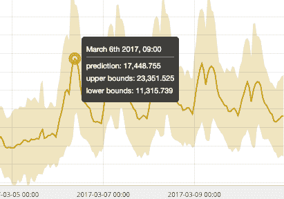

回想一下，上限和下限定义了第 95 个百分位数置信区间。预测值是具有最高可能性(概率)的值。这三个关键值以下列名称存储在`.ml-anomalies-*`结果索引中:

*   `forecast_prediction`
*   `forecast_upper`
*   `forecast_lower`

我们可以查询`.ml-anomalies-*`索引来定位这个确切的时间点(记住日期是以纪元时间存储的)。因此，假设我们正在开发工具控制台中执行以下查询:

```
GET .ml-anomalies-*/_search
{
 "query": {
   "bool": {
     "filter": [
       {"term": {"timestamp": "1488808800000"}},
       {"term": {"result_type": "model_forecast"}},
       {"term": {"job_id": "a_forecast_example"}}
     ]
   }
 }
}
```

输出如下所示:

```
{
 "took" : 1,
 "timed_out" : false,
 "_shards" : {
   "total" : 20,
   "successful" : 20,
   "skipped" : 0,
   "failed" : 0
 },
 "hits" : {
   "total" : 1,
   "max_score" : 0.0,
   "hits" : [
     {
       "_index" : ".ml-anomalies-shared",
       "_type" : "doc",
       "_id" : "a_forecast_example_model_forecast_i2DxbGgBITRq2rXM21p4_1488808800000_900_0_961_0",
       "_score" : 0.0,
       "_source" : {
         "job_id" : "a_forecast_example",
         "forecast_id" : "i2DxbGgBITRq2rXM21p4",
         "result_type" : "model_forecast",
         "bucket_span" : 900,
         "detector_index" : 0,
         "timestamp" : 1488808800000,
         "model_feature" : "'bucket sum by person'",
         "forecast_lower" : 11315.739312779506,
         "forecast_upper" : 23080.83486433322,
         "forecast_prediction" : 17198.287088556364
       }
     }
   ]
 }
}
```

注意独特的`forecast_id`。如果在此时间范围内创建了多个预测，将会有多个具有不同 id 的结果。

这些值与我们在 Kibana 的 ML Single Metric Viewer 中看到的相匹配(略有数学舍入)。这种类型的查询可以映射到我们在本章开始时提到的用例之一，即*关注值的*查询(我们给出一个日期，然后我们询问值)。这里，我们要求时间序列在未来某个特定时间的最可能值。

为了满足*关注时间的*查询，我们需要稍微重定向查询，让它返回预测值满足特定标准的日期。为了稍微混合一下，我们将使用Elastic SQL 提交查询:

```
POST /_xpack/sql?format=txt
{
 "query": "SELECT timestamp FROM \".ml-anomalies-*\" WHERE job_id='a_forecast_example' AND result_type='model_forecast' AND forecast_prediction>'17700' ORDER BY timestamp DESC"
}
```

在这里，我们要问的是，预测值是否有超过 17，700 这一限制值的时候。回应如下:

```
      timestamp        
------------------------
2017-03-06T14:45:00.000Z
```

换句话说，我们可能会在 3 月 6 日^日(从现在起 5 天后，在我们的虚拟示例中，今天是 2017 年 3 月 1 日 ^(st) )格林威治时间下午 2:45 突破 17，700 的门槛，这是美国东部时区的上午 9:45。这与在基巴纳用户界面(本地化为东海岸 GMT-5 时区)中看到的内容相匹配:

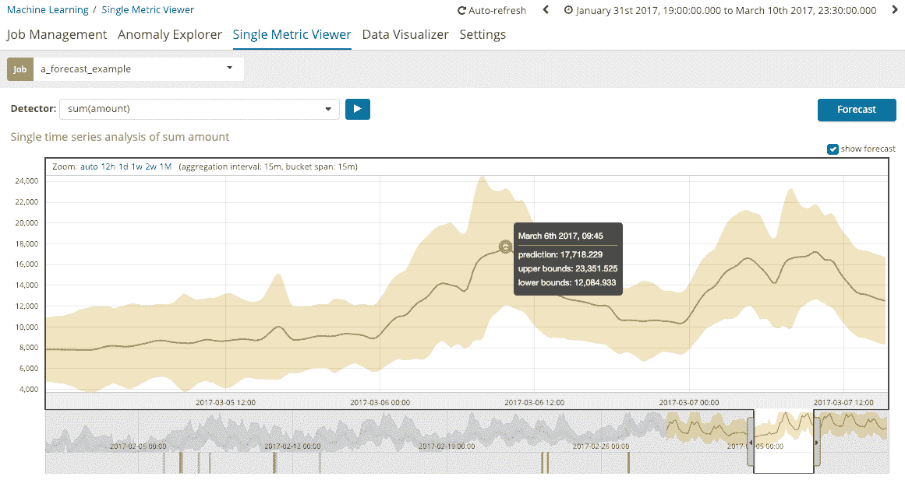

您的结果可能会因您所在的时区而略有不同(因为我们选择了与当地时区相关的分析结束时间)。因此，您分析的数据可能比本例中多几个小时或少几个小时。您的预测模型可能略有不同，因此您的最高预测值可能略有不同。

这种方法对于容量规划很有用，您可以问类似“在接下来的 10 天内，我的容量会超过 80%吗？”

如果我们想知道 ML 的预测与数据集的实际未来十天相比做得如何(请记住，ML 作业的模型还没有实际看到那些天)，我们可以返回到作业管理页面，启动作业的数据馈送，继续分析剩余的数据。为此，请单击右侧菜单中的启动数据馈送链接:

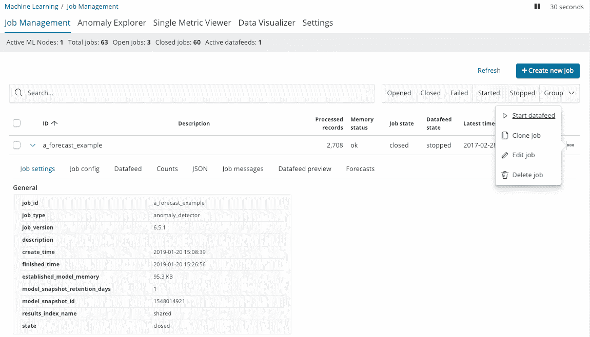

对话框出现后，将搜索开始时间设置为从 2017-02-38 23:45:00(或它所说的您当地时区的时间)开始，并将搜索结束时间指定为 2017 年 3 月 11 日^日上午 12:00:

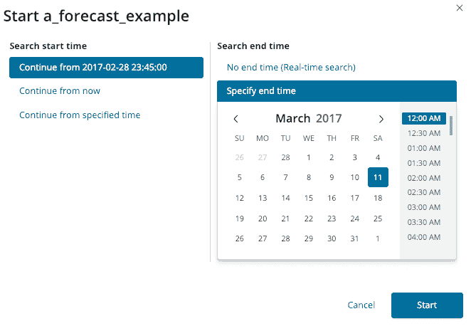

完成此操作后，返回到该作业的单一指标查看器，确保使用 Kibana 时间选择器查看正确的时间范围，并单击 Forecast 按钮查看之前创建的预测，如本章前面所述。现在，您将能够看到预测值叠加在数据的实际值上:

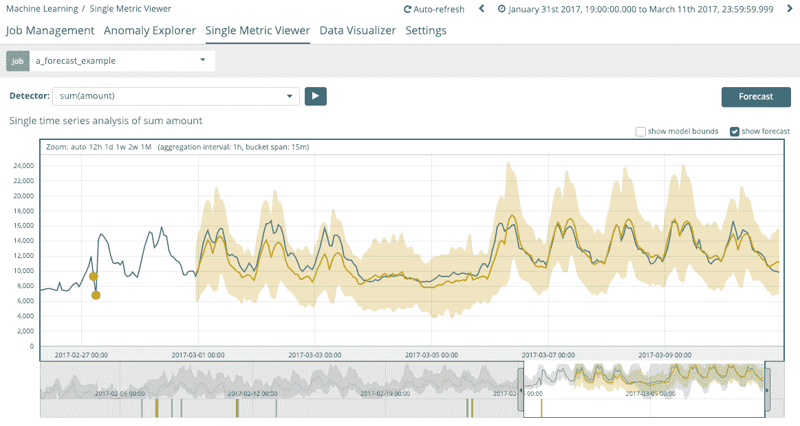

如本章前面所述，数据的Elastic最大似然预测值和未来到达的实际值之间会有微小的差异。这是因为预测是概率性的，伴随着概率而来的是一定程度的不确定性。然而，这并没有降低预测的有用性。结合观察人员的主动警报(如第 6 章、*关于 ML 分析的警报*中所述)，我们本可以对违规的可能性发出警报。当用户无法单独跟踪数百或数千个实体时，这种主动通知特别有用。多指标预测将允许我们自动跟踪这些实体。


# 多重时间序列预测

要调用多个时间序列的预测，您只需要一个建模多个时间序列的 ML 作业。让我们假设我们有一个分析每个国家的 web 请求的 ML 作业。由于访问我们网站的客户多种多样，我们的博客中可能有超过 200 个独特的时间序列。在 ML 作业中，在 Filebeat 收集的日志中，我们选择为每个 TNG inx . access . GeoIP . country _ iso _ code 配置请求计数的多指标作业:

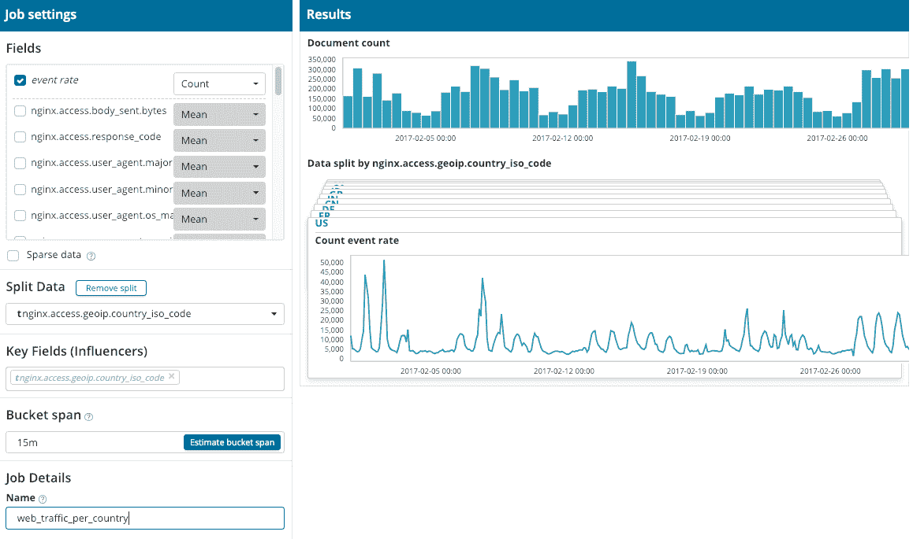

当我们在单个指标查看器中单击 Forecast 按钮时，预测将自动为所有检测器和分区运行(即使有数百个或更多)。或者，您可以使用`_forecast` API 端点来调用预测。为此，在开发工具控制台中，我们可以发出这样的请求:

```
POST _xpack/ml/anomaly_detectors/web_traffic_per_country/_forecast
{
 "duration": "7d"
}
```

API 调用的直接响应如下:

```
{
 "acknowledged" : true,
 "forecast_id" : "DGT6bWgBITRq2rXMb1Rr"
}
```

ML 作业必须处于打开状态，才能通过 API 调用预测。

我们的预测请求的结果将可以在单个指标查看器中查看，或者通过查询结果索引以编程方式查看，如前所述。例如，我们可以看到美国的预测(nginx . access . GeoIP . country _ iso _ code)如下所示:

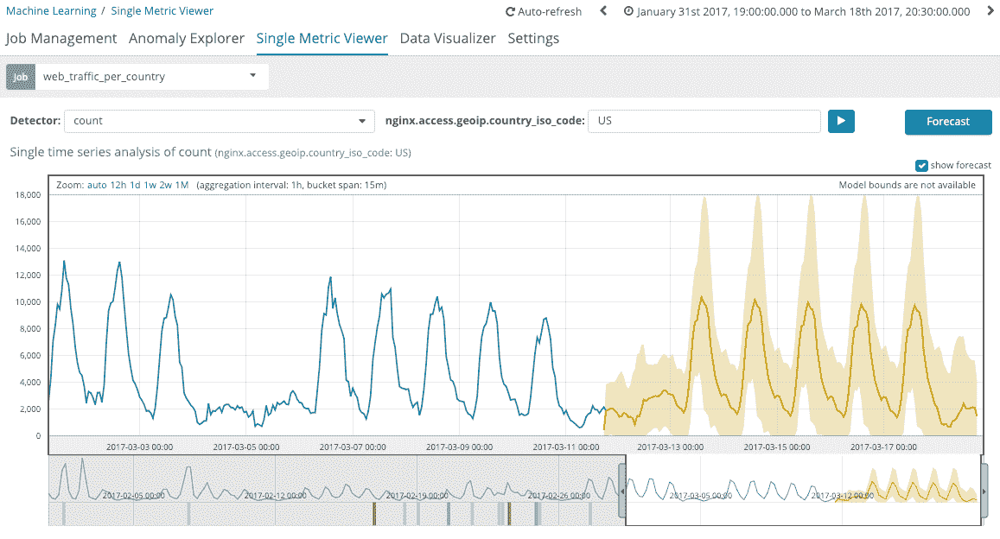

这与越南(nginx . access . GeoIP . country _ iso _ code VN)在体量上有显著差异:

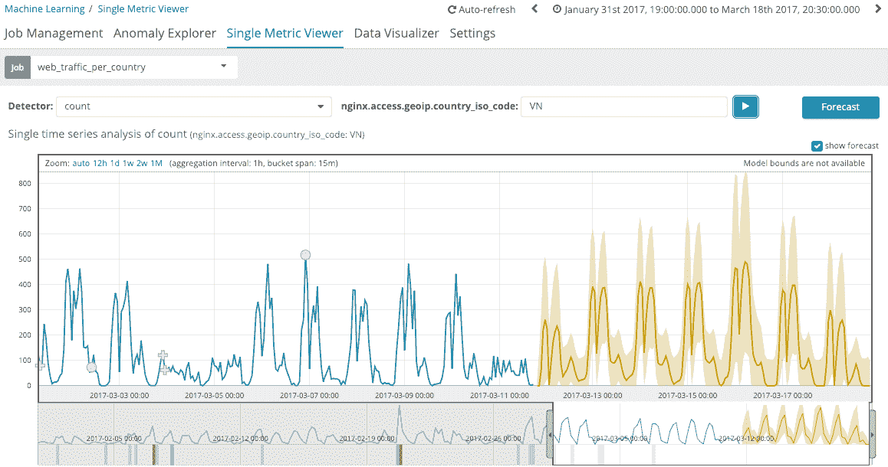

如您所见，预测是按时间序列自动完成的。同样，这对于容量规划用例非常有用，在这种用例中，需要分析和预测数百甚至数千个实体，以确定在不久的将来是否可能出现任何即将发生的违规。


# 摘要

除了异常检测之外，Elastic ML 还有一个额外的功能，即获取时间序列模型并将其外推至未来进行预测的能力。对于包括高级违规检测和容量规划在内的使用情形，此功能减轻了人工绘制图表、跟踪和预测未来发展方向的负担，而这些都是基于过去的表现。

在我们的下一章也是最后一章，[第 10 章](cc00ce9e-6015-4c6e-9dc8-91123be98593.xhtml)， *ML 小贴士和小技巧，*我们将浏览大量在其他章节中找不到的实用小技巧和小技巧。**