# 十、ML 提示和技巧

当我们浏览这本书的内容时，我们发现仍然有太多的好的、小的解释、例子和建议不太适合其他章节。因此，给他们一个属于他们自己的章节是有意义的。享受这些技巧和窍门的大杂烩吧！

本章将涵盖以下主题:

*   职务组
*   忽略时间段
*   自上而下警报
*   确定 ML 部署的规模


# 职务组

我们在[第 4 章](30e51bb2-df59-4ae5-943f-52c3a2e9682e.xhtml)、 *IT 运营分析和根本原因分析*中看到，有充分的理由根据不同种类的数据同时查看几项工作的结果。因此，有时我们需要围绕一个共同的主题对工作进行逻辑分组的能力，这是有意义的。为此，让我们回顾一下作业组特性，它是在 6.1 版中引入 ML 的。

作业组允许用户出于组织目的任意用关键字标记作业。例如，您可以确定与特定应用程序相关的所有作业都应该标记有应用程序名称。您可以在创建时将作业分配给组，也可以在创建后编辑作业。过程很简单。例如，我们第一次将作业分配给作业组时，该名称不会被识别，并将创建一个新的组名:


随后，当编辑要分配给某个组的其他作业时，用户界面将为您提供有关现有组的线索:

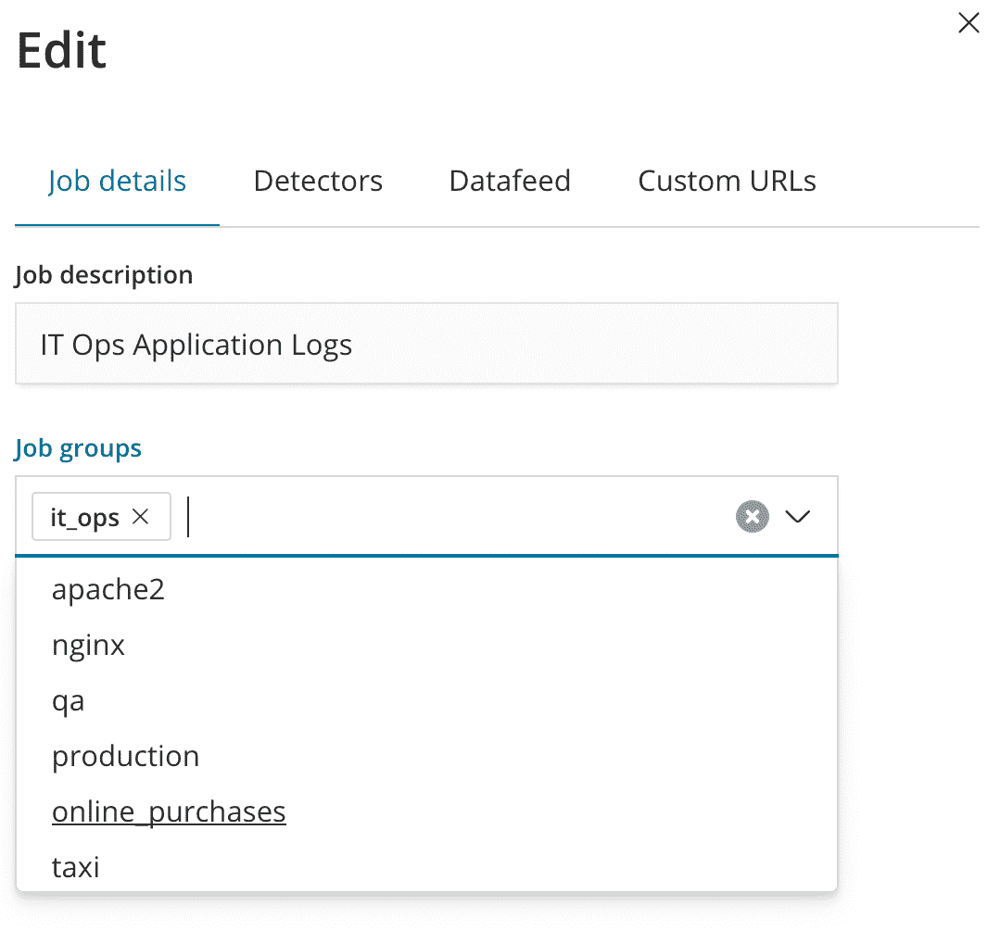

一旦我们将几个作业分配给特定的组，当加载异常浏览器用户界面并单击作业选择器下拉菜单时，您将能够通过单击选择显示属于特定组的所有作业:

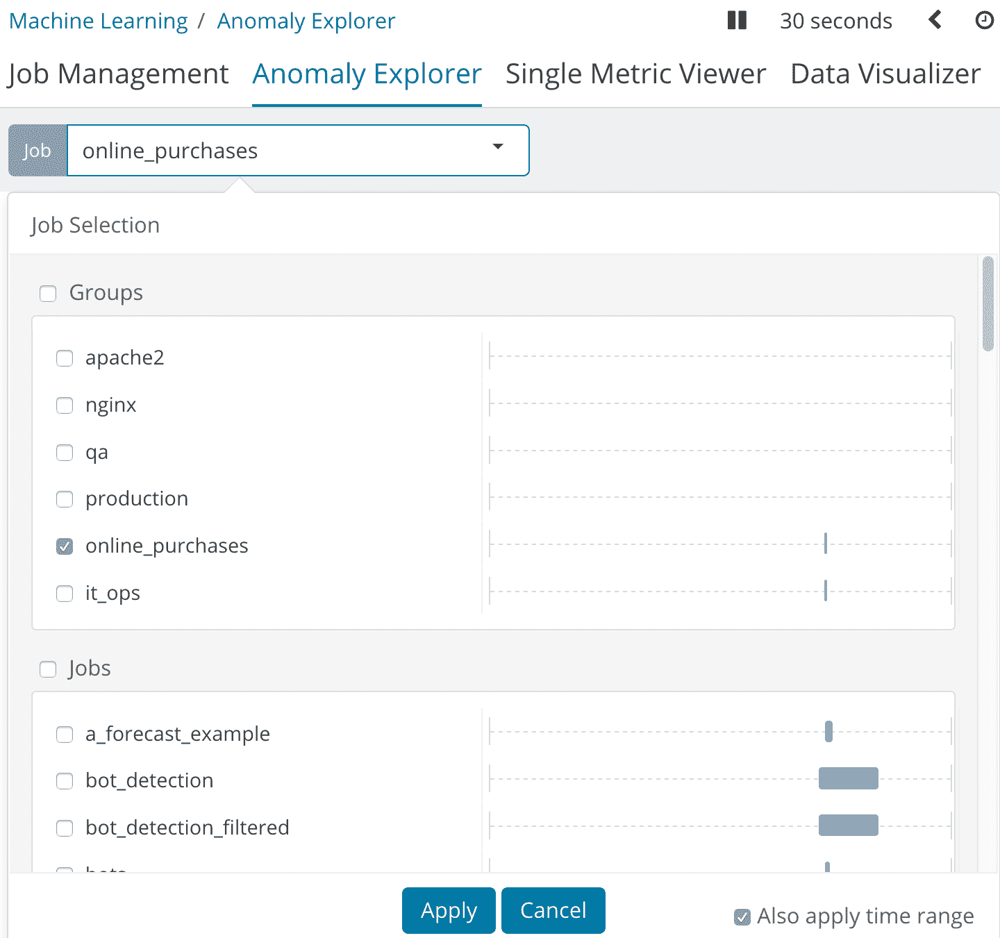

这种非常简单的组织工具将允许操作员定位他们对 ML 作业结果的看法，而不必记住哪些作业与被监控的哪些应用相关。

作业组对于作业管理屏幕中的组织和管理任务也很有用。在这里，您可以看到五个作业都属于 nginx 组，但有些标记为 qa，有些标记为 production:

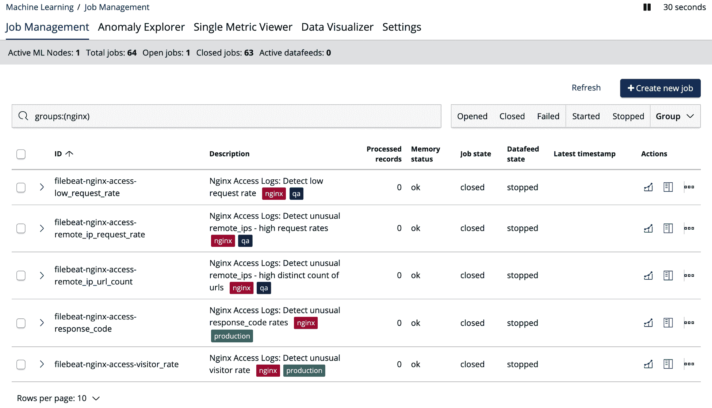

视图中的作业可以按关键字和组进行筛选，并对其应用批量操作(启动数据馈送、删除作业等)。


# 拆分与非拆分工作中的影响者

您可能会质疑是否有必要按照一个字段来划分分析，或者仅仅希望影响者的使用能够产生识别违规实体的预期效果。

让我们提醒自己影响者的目的和拆分工作的目的之间的区别。如果某个实体对异常现象的存在有重大贡献，则该实体被 ML 确定为影响者。这种决定有影响力的实体的概念完全独立于工作是否被分割。只有当异常首先发生时，实体才能被认为对异常有影响。如果没有检测到异常，就没有必要确定是否有影响者。然而，该作业可能会也可能不会发现异常，这取决于该作业是否被分割成多个时间序列。拆分作业时，您正在为选择用于拆分的字段的每个实体建模(创建单独的分析)。

为了说明这一点，让我们来看一个我最喜欢的演示数据集，名为`farequote`(可以在本书的 GitHub 存储库中找到，网址为[https://GitHub . com/packt publishing/Machine-Learning-with-the-Elastic-Stack/tree/master/example _ data](https://github.com/PacktPublishing/Machine-Learning-with-the-Elastic-Stack/tree/master/example_data))。这个数据集实际上是一个访问日志，记录了某个中间件在旅游门户中被调用的次数，以便向第三方航空公司查询机票报价。JSON 文档如下所示:

```
{
    "@timestamp": "2017-02-11T23:59:54.000Z",
    "responsetime": 251.573,
    "airline": "FFT"
  }
```

单位时间内的事件数量对应于发出的请求数量，而`responsetime`字段是该航空公司的票价报价 web 服务的单个请求的响应时间。

我们来看看以下案例:

*   **案例 1** :一段时间内的计数分析，不在`airline`上拆分，而是使用`airline`作为影响者

如果我们分析事件的总计数(无分裂)，我们可以看到事件量中的显著异常(尖峰)被确定为受`airline` = `AAL`影响:

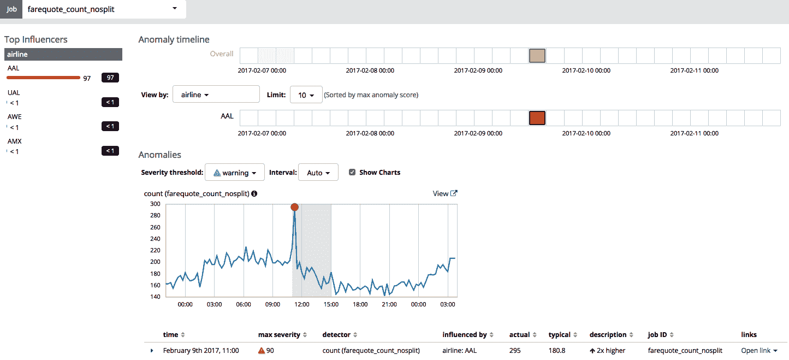

这是非常明智的，因为对`AAL`的请求的增加会非常显著地影响总事件数(所有航空公司的总数)。

*   **案例 2** :一段时间内的计数分析，在`airline`上分割，并使用`airline`作为影响者

如果我们设置 partition_field_name= `airline`来拆分分析，以便独立分析每个航空公司的文档数量，那么当然，我们仍然可以看到`airline` = `AAL`仍然是最不寻常的:

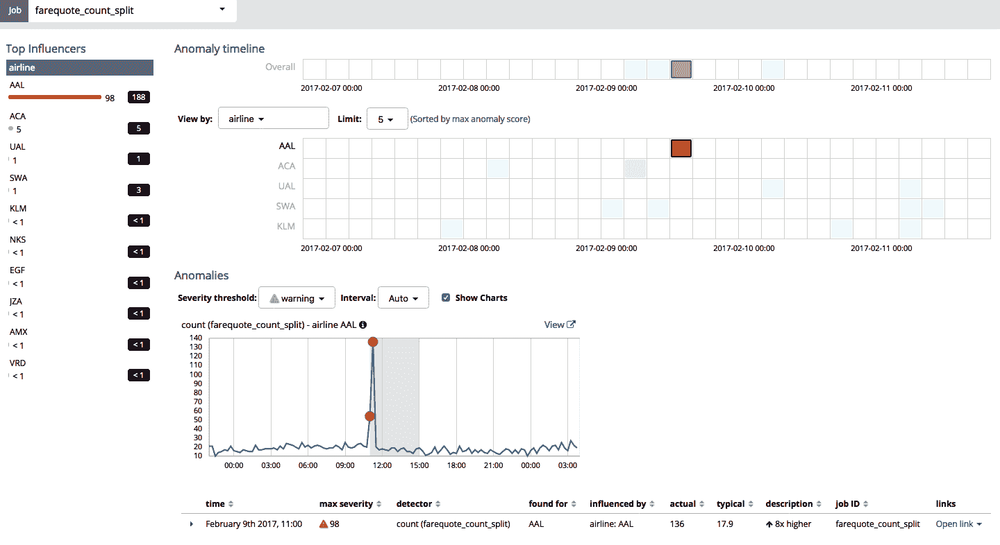

*   **案例 3** :均值分析(responsetime)，无分割，但使用`airline`作为影响者

在这种情况下，结果如下:

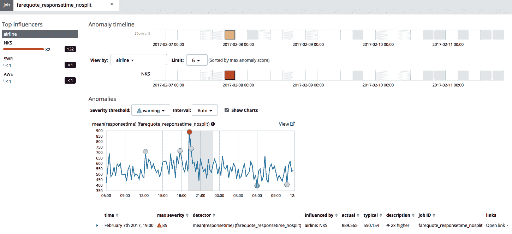

这里，请记住，航空公司的所有响应时间都是每个`bucket_span`一起平均的，因为这项工作没有被分割。在这种情况下，最显著的异常(即使它是高于正常值的相对较小的变化)被显示，并被认为受`airline` = `NKS`的影响。然而，这可能会产生误导。你看，`airline` = `NKS`在此期间有一个非常稳定的响应时间，但是请注意，它的正常工作范围比组中的其他部分要高得多:

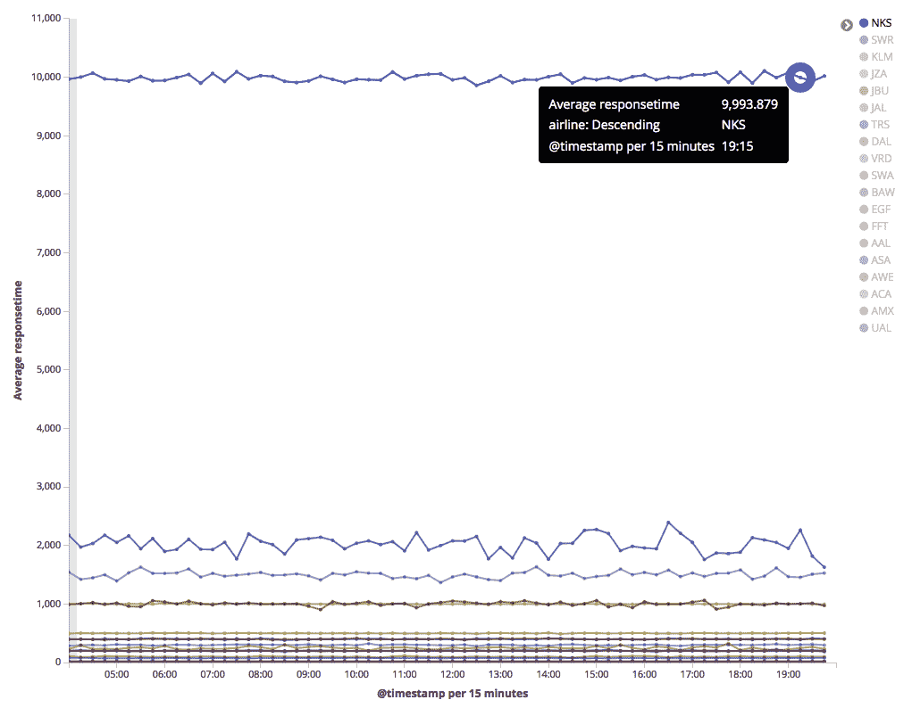

因此，`NKS`对所有航空公司的总响应时间的贡献比其他航空公司更大。所以，当然，ML 认为`NKS`是最突出的影响者。

但这个异常并不是数据集中`reponsetime`最显著的异常！这种异常属于`airline` = `AAL`，但总体上看不出来，因为来自所有航空公司的数据淹没了细节。看下一个案例。

*   **案例 4** :均值分析(responsetime)，在`airline`上分割，使用`airline`作为影响者

在这种情况下，当我们设置 partition_field_name= `airline`来拆分分析时，`AAL`的最显著的响应时间异常就显示出来了:

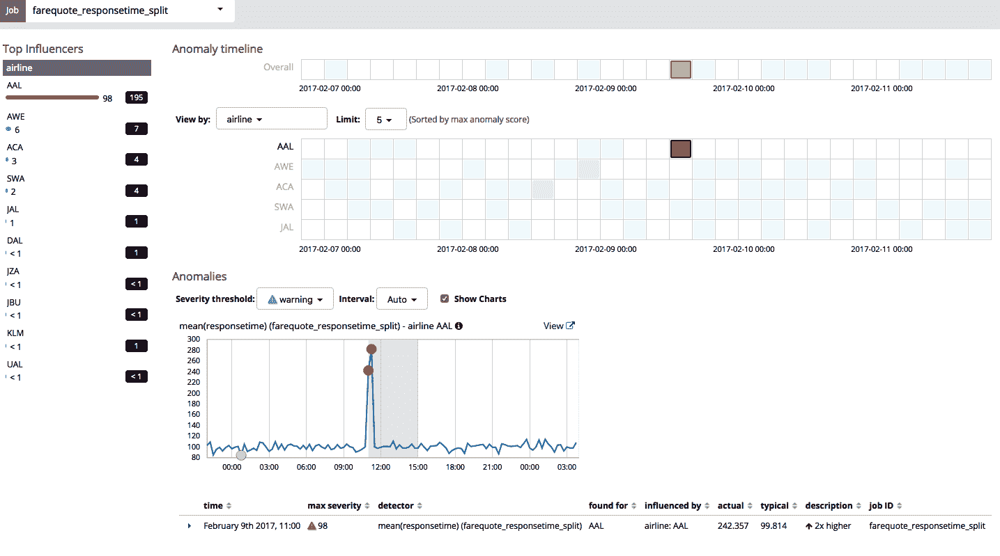

现在你知道了:这里的寓意是，如果你只是依靠影响者在多个实体的数据集中找到不寻常的实体，你应该深思熟虑。为每个实体单独建模可能更明智！


# 在脚本字段上使用 ML

在某些情况下，可能有必要分析文档中字段的关系。Elasticsearch 使我们能够创建脚本化字段([https://www . elastic . co/guide/en/elastic search/reference/current/search-request-script-fields . html](https://www.elastic.co/guide/en/elasticsearch/reference/current/search-request-script-fields.html))，允许我们以编程方式将单个字段组合成新字段；ML 可以利用这一点！

例如，假设您有总结产品销售的日常文档，并且您的文档有两个字段，`Amount`和`Count`:

```
{

...

    "Count": 160,

    "Amount": 7200

...

}
```

我们可以很容易地定义一个用例，在这个用例中，我们对每件商品的成本感兴趣(`Amount` / `Count`)。为此，我们将定义 ML 作业来关注新的字段(也许我们将称之为`per_item_cost`，并在其上使用`mean`函数):

```
PUT _xpack/ml/anomaly_detectors/my_job {

    "analysis_config": {

        "bucket_span": "1d",

        "detectors": [{

            "detector_description": "mean(per_item_cost)",

            "function": "mean",

            "field_name": "per_item_cost"

        }],

        "influencers": []

    },

    "data_description": {

        "time_field": "@timestamp"

    }

}
```

然后，我们需要定义作业的数据馈送，以便我们可以使用 Elasticsearch 的脚本字段功能来创建这个新的`per_item_cost`脚本字段:

```
PUT _xpack/ml/datafeeds/datafeed-my_job/

{

  "job_id": "my_job",

  "indices": [

    "newapple"

  ],

      "query": {

        "match_all": {

        }

      },

      "script_fields": {

        "per_item_cost": {

          "script": {

            "source": "doc['Amount'].value / doc['Count'].value",

            "lang": "painless"

          },

          "ignore_failure": false

        }

      }

}
```

然后，我们可以预览数据馈送:

```
GET _xpack/ml/datafeeds/datafeed-my_job/_preview
```

通过这样做，我们可以验证脚本字段的输出看起来是否正确:

```
[

  {

    "@timestamp": 1529280000000,

    "per_item_cost": 7.190000057220459

  },

  {

    "@timestamp": 1529280000000,

    "per_item_cost": 7.190000057220459

  },

  {

    "@timestamp": 1529366400000,

    "per_item_cost": 21.56999969482422

  },

  {

    "@timestamp": 1529366400000,

    "per_item_cost": 21.56999969482422

  },

  {

    "@timestamp": 1529539200000,

    "per_item_cost": 159.5500030517578

  },

...
```

在执行作业时，我们可以在这个新领域中发现异常！

不要假设如果您已经在 Kibana 中定义了一个脚本化的字段，ML 作业就会使用它。您确实可以在 Kibana 中定义一个用于可视化，但是 ML 作业仍然需要您在 datafeed 对 Elasticsearch 的查询中定义脚本字段。此外，只有当要合并的字段在同一个文档中时，这种方法才有效。如果它们在不同的文档中，那么你现在就不走运了。


# 使用单边 ML 函数对您有利

许多人意识到 ML 中的*单边*函数的有用性，例如`low_count`、`high_mean`等等，允许只检测高端或低端的异常。当您只关心收入下降或响应时间增加时，这很有用。

然而，当您关心两个方向的偏差时，您往往倾向于只使用常规函数(如`count`或`mean`)。但是，在某些数据集上，使用函数的高版本和低版本作为两个独立的检测器实际上更为优化。你可能会问，为什么会这样，在什么条件下会这样？

有意义的情况是当可能偏差的动态范围不对称时。换句话说，数据中潜在尖峰的幅度远远大于潜在下降的幅度，这可能是因为某些东西的计数或总和不能小于零。我们来看下面这张截图:

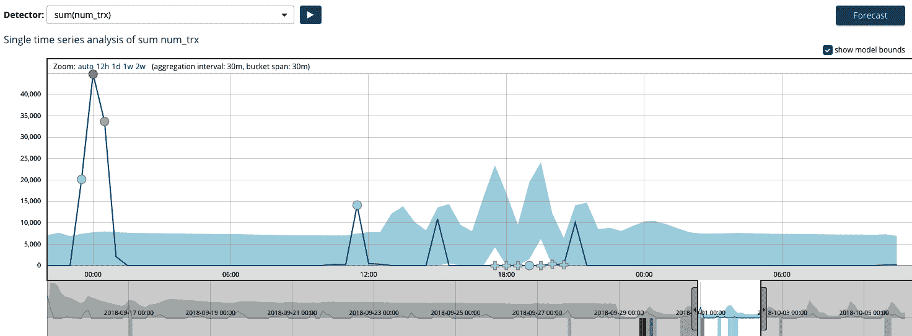

这里，双侧求和函数正确地识别左侧具有临界异常的大尖峰，但是中间缺少预期的*双凸起*仅被识别为警告异常。同样，这是因为使用双边函数时，归一化过程会将所有异常排列在一起。尖峰的幅度(因此不太可能)远远大于 18:00 左右的数据缺乏，因此异常分数是相对分配的。

但是，如果数据集使用两个独立的检测器进行分析，使用一个高级作业，即 low_sum(num_trx)和 high_sum(num_trx)，那么结果看起来会非常不同。以下是偏高的结果:

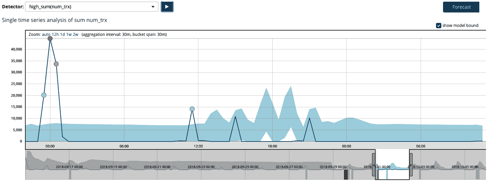

下面是低端的结果:

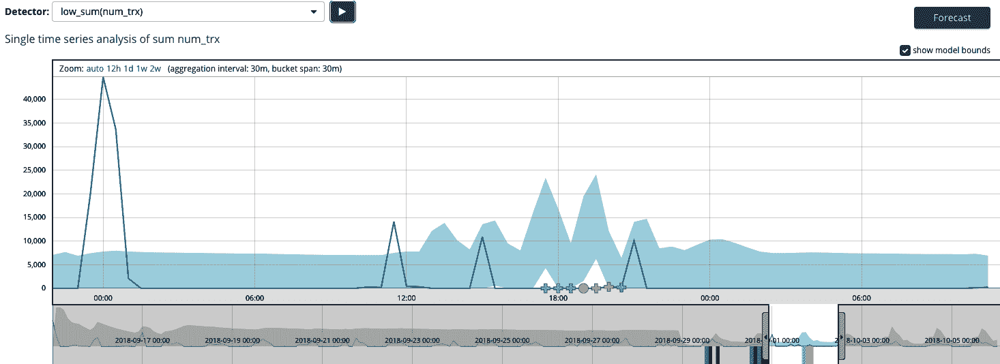

请注意，中间的异常现在得分更高(在这种情况下，最高得分为 47 黄色)。

现在，当两个单侧检测器在同一作业中一起运行时，您已经优化了每个检测器的动态范围(因为它们有自己的归一化表)！


# 忽略时间段

通常，人们会问他们如何让 ML 忽略某个时间段已经发生了。也许这是一个预期的维护窗口，或者也许是数据接收管道中发生了故障，数据丢失了一会儿。有几种方法可以让 ML 忽略时间段，为了区分，我们将它们分成两组:

*   一个已知的，即将到来的时间窗口
*   事后发现的一个意外的时间窗口

为了说明这一点，我们将使用一个在 2 月 9 日^到这一天出现异常的参考作业和数据集:

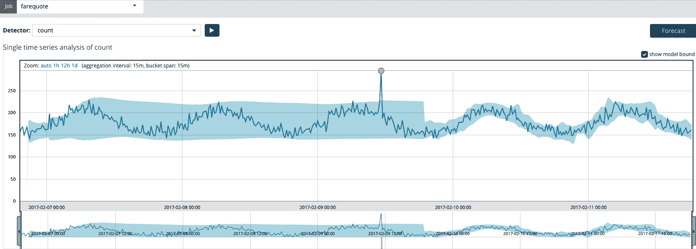


# 忽略即将到来的(已知的)时间窗口

有两种方法可以用来忽略即将到来的时间窗口，如下节所示。


# 创建日历事件

您可以通过点击设置|日历管理|编辑日历来创建活动。在这里，我创建了一个 2 月 9 日^到的日历条目:

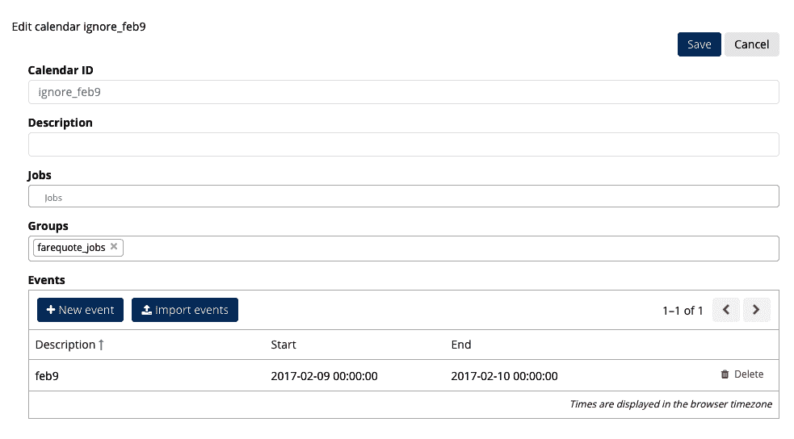

现在，当作业运行时，这一整天都会被忽略:

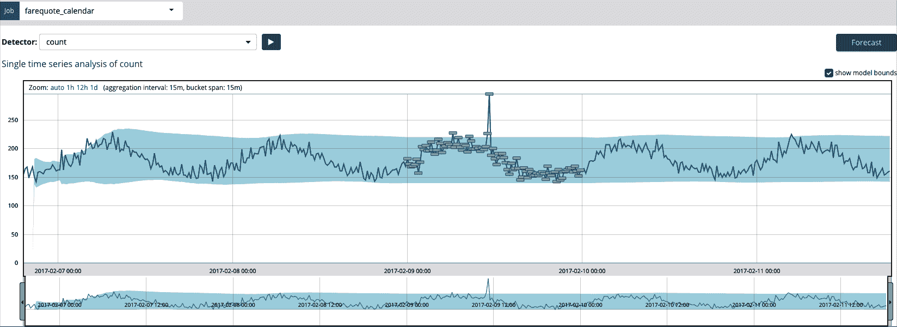

如你所见，一整天都被屏蔽了，包括异常峰值的时间。


# 停止和启动数据馈送以忽略所需的时间范围

只需在适当的时间停止并重新启动 ML 作业的数据馈送，就可以在分析中创建一个间隙。这里，数据馈送在 2 月 9 日^(和 2 月 10 日^(和 2 月 15 日)的午夜停止:)

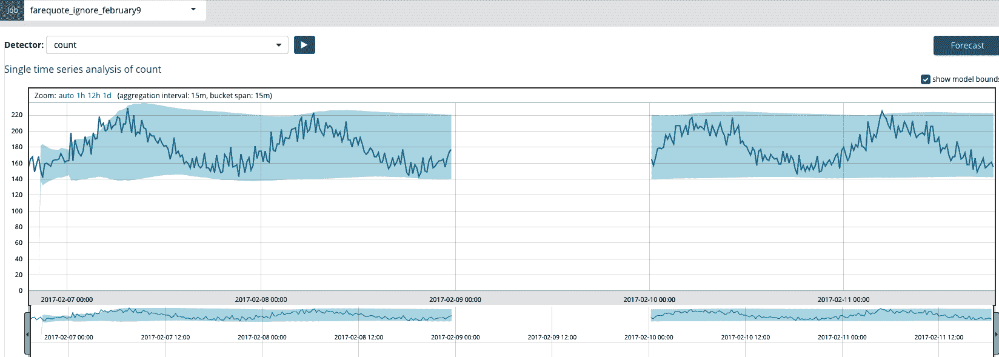

就像 2 月 9 日从没发生过一样！


# 忽略一个意外的时间窗口，在事实之后

为了*回到过去*并且*忘记*发生的时间窗，我们可以使用两种方法，我们将在下面的章节中讨论。


# 克隆作业并重新运行历史数据

与上一节类似，在新的克隆作业中，只需让 datafeed 忽略您希望忽略的时间窗口。在窗口开始时停止，在窗口结束时继续。


# 恢复模型快照

当在现有历史数据上克隆和重新训练作业不需要或不实际时，您可以通过使用`model_snapshots`API([https://www . elastic . co/guide/en/elastic search/reference/6.5/ml-APIs . html # ml-API-snapshot-endpoint](https://www.elastic.co/guide/en/elasticsearch/reference/6.5/ml-apis.html#ml-api-snapshot-endpoint))有效地移除时间窗口，如以下步骤所示:

1.  停止数据传送
2.  通过使用`GET` `model_snapshots` API(并传递期望的结束时间)找到最后一次拍摄的快照
3.  使用`_revert` API 调用恢复到以前的快照 ID，但是也传递`delete_intervening_results`标志来清除在快照创建之后创建的任何结果/异常
4.  在适当的时间启动数据馈送，即您想要忽略的时间窗口的结束时间


# 不要过度设计用例

我曾经和一个用户一起工作，我们讨论了 ML 的不同用例。特别是，该客户正在构建一个托管安全运营中心，作为其**托管安全服务提供商** ( **MSSP** )业务的一部分，因此他们热衷于思考 ML 可以提供帮助的用例。

他们用例的一个高级主题是观察用户的行为并发现意想不到的行为。讨论的一个例子是来自不寻常/罕见位置的登录活动，例如 *Bob 刚刚从乌克兰登录，但他通常不会从那里登录*。

在考虑实现的过程中，有人谈到他们有多个客户端，每个客户端有多个用户。因此，他们想方设法分割/分区数据，以便能够针对每个客户端的每个用户按国家执行“稀有”操作。

我让他们退后一步，说“如果任何人*从乌克兰登录，而不仅仅是鲍勃，这值得成为异常吗？”答案是“是的”*

因此，在这种情况下，没有必要对每个用户进行分析，也许只需保持客户端级别的划分，并简单地将每个客户端的所有用户位置归入一个观察到的国家池中。这实际上是一个更好的场景；有更多的整体数据，正如我们所知，当有大量常规数据与新的观察结果进行对比时，`rare`函数工作得最好。

同样，他们也对检测过多的失败登录尝试感兴趣。同样，他们最初的想法是跟踪每个客户端的每个用户的预期/正常登录次数。同样，这不是真正必要的。简单地跟踪一个客户端内*用户群*的典型登录活动率就足够了。它再次解决了稀疏数据问题，并最终允许更可伸缩的 ML 作业，因为它不期望为每个用户维护基线模型。

这个故事的寓意如下:如果没有必要，不要过度设计用例。


# ML 作业吞吐量考虑因素

ML 很棒，毫无疑问非常快且可伸缩，但是对于任何 ML 作业，仍然有一个实际的事件/秒上限，这取决于几个不同的因素:

*   向 ML 算法传递数据的速度(即查询性能)
*   在给定所需分析的情况下，ML 算法咀嚼数据的速度

对于后者，大部分性能基于以下几点:

*   为分析选择的函数，即`count`比`lat_long`快
*   所选的`bucket_span`(较长的存储桶跨度比较小的存储桶跨度*快*，因为单位时间内分析的存储桶越多，写入结果等每个存储桶的处理开销就越大)

但是，如果您有一个已定义的分析设置，并且由于其他原因无法真正更改它，那么您就没有什么可做的，除非您发挥创造力，将数据拆分到多个任务中。这是因为 ML 作业(至少目前如此)目前被绑定到一个 CPU 上用于分析位(运行名为`autodetect`的 C++进程)。因此，将数据分成几个独立的 ML 作业，至少利用多个 CPU 可能是一种选择。但是，在此之前，让我们先关注前者，即查询的性能，因为这里有多种可能性:

*   避免进行跨集群搜索来限制网络上的数据传输。
*   调整数据馈送参数以优化性能。
*   使用 Elasticsearch 查询聚合将提取数据的任务分配给一个较小的 ML 算法集。

第一个很明显。只有将分析移近原始数据，才能提高性能。

第二个可能需要一些实验。还有参数，比如`scroll_size`，控制每个卷轴的大小。默认值为 1，000，对于适当规模的集群，可以安全地增加到 10，000。以不同的滚动大小运行一些测试，看看它如何影响查询和集群性能。

在我看来，最后一个应该对性能产生最大的影响，但显然要使 ES 聚合正确地与 ML 一起工作有点棘手且容易出错，但也不是那么糟糕。有关更多信息，请参见位于[https://www . elastic . co/guide/en/elastic-stack-overview/current/ml-configuring-aggregation . html](https://www.elastic.co/guide/en/elastic-stack-overview/current/ml-configuring-aggregation.html)的文档。一般来说，在 ML 中使用聚合的缺点是，您会失去对数据中其他字段的访问，而这些字段可能是很好的影响因素。

总而言之，在优化 ML 作业的性能时，有一些事情需要考虑。


# 利用自定义规则的自上而下的警报

在[第 4 章](30e51bb2-df59-4ae5-943f-52c3a2e9682e.xhtml)、 *IT 运营分析和根本原因分析*中，我们问“您收集的数据中有多大比例得到了关注？”通常，现实的答案可能是 10%，甚至可能是 1%。出现这种情况的原因是，使数据主动的传统方法是从头开始，然后随着时间的推移建立阈值或基于规则的警报。这可能是一项艰巨和/或乏味的任务，需要预先了解(或至少猜测)每个时间序列的预期行为。然后，一旦配置了警报，就可以有一个扩展的调整过程来平衡警报敏感度和恼人的误报。此外，还可能存在静态阈值永远无法捕捉到其异常行为的指标。

把这个挑战和规模结合起来；如果每台服务器和 100 台服务器有 10 个指标，则有 1，000 个单独的指标。为其中的每一项创建单独的警报是不切实际的。

但是，针对此数据创建一个 ML 作业不到 1 分钟。ML 对历史数据的自学习，也需要很少的时间，通过独立适应每个时间序列的自然特征，将误报降到最低。

一旦 ML 作业创建了结果，用户就可以很容易地检查 ML 发现的异常，并判断它们的有用性(或者等待异常的下游消费者来判断它们的有用性)。如果任何异常被认为是无用的，自定义规则([https://www . elastic . co/guide/en/elastic-stack-overview/6.4/ml-rules . html](https://www.elastic.co/guide/en/elastic-stack-overview/6.4/ml-rules.html))允许用户注入他们自己的领域知识，并允许定制如何确定异常(也就是说，如果值仍然小于 90%，则从不警告 CPU 上的异常):

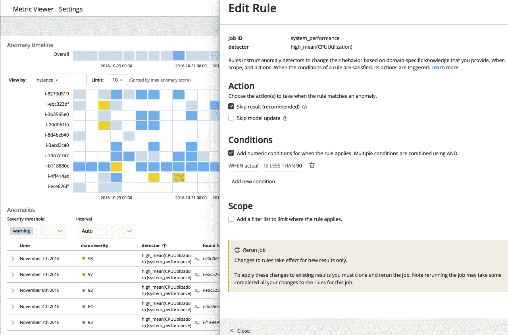

这种自顶向下而不是自底向上的方法速度更快，并且提供了更主动的数据覆盖。


# 确定 ML 部署的规模

人们经常问，如果他们计划使用Elastic ML，他们应该如何适当地确定集群的规模。除了明显的*视情况而定*的答案之外，对这个过程采取经验主义的方法是有用的。正如在 Elastic blog*Sizing for Machine Learning with Elastic search*([https://www . Elastic . co/blog/Sizing-Machine-Learning-with-Elastic search](https://www.elastic.co/blog/sizing-machine-learning-with-elasticsearch))上看到的，有一个关键的建议:为 ML 使用专用节点，这样就不会让 ML 作业干扰集群的数据节点的其他任务(索引、搜索等)。要确定需要多少专用节点，请遵循以下方法:

*   如果还没有创建有代表性的工作，请根据博客中的总体集群大小使用一般的经验法则。这些经验法则如下:
    *   针对集群大小推荐 1 个专用 ML 节点(2 个用于 HA)< 10 data nodes
    *   Definitely at least 2 ML nodes for clusters up to 25 nodes
    *   Add additional ML nodes for every additional 25 data nodes

Example: 60 data nodes should have 3 (aggressive) or 4 (conservative) ML nodes

*   Representative jobs already created for a **概念验证** ( **PoC** )或一些已经投入生产的节点:
    *   实证分析当前工作并进行推断
    *   运行一个脚本([https://github . com/packt publishing/Machine-Learning-with-the-Elastic-Stack/blob/master/chapter 10/get _ all _ job _ model _ bytes . sh](https://github.com/PacktPublishing/Machine-Learning-with-the-Elastic-Stack/blob/master/Chapter10/get_all_job_model_bytes.sh))从 ML API 中转储作业的所有内存使用情况(这也使用免费的开源实用程序 jq([https://stedolan.github.io/jq/](https://stedolan.github.io/jq/))
    *   使用 GitHub 存储库中的电子表格(`ml_job_sizing.xlsx`[https://GitHub . com/packt publishing/Machine-Learning-with-the-Elastic-Stack/blob/master/chapter 10/ml _ job _ sizing . xlsx](https://github.com/PacktPublishing/Machine-Learning-with-the-Elastic-Stack/blob/master/Chapter10/ml_job_sizing.xlsx))为您进行外推，如下所示:

```
#!/bin/bash

HOST='localhost'

PORT=9200

#CURL_AUTH="-u elastic:changeme"

list=`curl $CURL_AUTH -s http://$HOST:$PORT/_xpack/ml/anomaly_detectors?pretty | awk -F" : " '/job_id/{print $2}' | sed 's/\",//g' | sed 's/\"//g'` 

while read -r JOB_ID; do

   curl $CURL_AUTH -s -XPOST $HOST:$PORT/_xpack/ml/anomaly_detectors/${JOB_ID}/model_snapshots?pretty |  jq '{job_id: .model_snapshots[0].job_id, size: .model_snapshots[0].model_size_stats.model_bytes}' | jq --raw-output '"\(.job_id),\(.size)"'

done <<< "$list"
```

规模估算电子表格中有几个假设:

*   CPU 和查询负载不会成为限制因素
*   未来的工作将与现有的工作相似，因此外推是一种合理的方法
*   这种方法并不排除可能已配置但未使用的测试作业
*   用户将在调整尺寸后将`xpack.ml.max_open_jobs`设置为适当的数字
*   用户适当设置`xpack.ml.max_machine_memory_percent`(默认为 30%)
*   用户不会试图同时对所有作业的大量历史数据进行分析，因为这是 ML 操作中最密集的部分

以下是一些建议:

*   ML 作业在 JVM 之外运行，因此如果有一个专用的 ML 节点，JVM 不会被经常使用，您可以减小堆的大小(从数据节点的典型大小开始),以便为 ML 作业获得更多空间
*   您可以在更大的 RAM 机器上增加`xpack.ml.max_machine_memory_percent`，尤其是在 JVM 堆已经减少的情况下
*   其他设置见[https://www . elastic . co/guide/en/elastic search/reference/current/ml-settings . html](https://www.elastic.co/guide/en/elasticsearch/reference/current/ml-settings.html)的文档


# 摘要

Elastic ML 是一个强大、灵活且易于使用的特性，它将数据科学的力量赋予了非数据科学家，使他们能够深入了解海量数据。在本章和本书中，用户可以通过许多不同的方式利用技术来解决现实世界中的 IT 挑战。我们希望你能利用你在本书中获得的知识，实现一些你自己的伟大用例。不要担心在第一天解决所有可能的问题；从小处着手，取得一些实实在在的成功，随着信心的增加，使用量也会增加。成功会孕育成功！