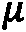
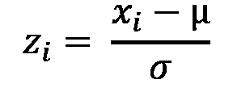
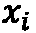
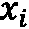
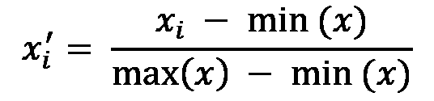
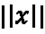
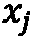
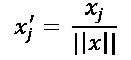

# *第三章*:从模型到模型工厂

这一章是关于 ML 工程中最重要的一个概念:你如何接受训练和微调你的模型的困难任务，并使它成为你可以自动化、复制和扩展生产系统的东西？

在为再培训提供动机之前，我们将在理论和实践层面回顾培训不同 ML 模型背后的主要思想，即 ML 模型不会永远表现良好的思想。这个概念也被称为**漂移**。接下来，我们将介绍特征工程背后的一些主要概念，这是任何 ML 任务的关键部分。接下来，我们将深入探讨 ML 是如何工作的，以及它本质上是一系列优化问题。我们将探讨在着手解决这些优化问题时，如何在不同的抽象层次上使用各种工具来实现。特别是，我们将讨论如何提供您想要训练的模型的直接定义，我称之为*手摇*，或者如何执行超参数调整或**自动化 ML** ( **AutoML** )。我们将看看使用不同的库和工具完成所有这些工作的例子，然后探索如何实现它们以便以后在您的培训工作流中使用。然后，我们将基于我们在第 2 章 、*机器学习开发流程*中对 MLflow 所做的介绍性工作，向您展示如何与不同的 MLflow APIs 交互，以管理您的模型并更新它们在 MLflow 模型注册表中的状态。

我们将通过讨论允许您将所有 ML 模型训练步骤链接到称为**管道**的单个单元中的实用程序来结束本章，这有助于作为我们之前讨论的所有步骤的更紧凑的表示。最后的总结将重述关键信息，并概述我们在这里所做的工作将如何在第 4 章*打包*和 [*第 5 章*](B17343_05_Final_JC_ePub.xhtml#_idTextAnchor116)*部署模式和工具*中进一步发展。

本质上，这一章将告诉你*你需要在你的解决方案中把什么*粘在一起，而后面的章节将告诉你*如何把它们牢固地粘在一起。我们将在以下几节中介绍这一点:*

*   定义模型工厂
*   设计你的培训系统
*   需要再培训
*   关于学习的学习
*   坚持你的模型
*   用管道建立模型工厂

# 技术要求

要完成本章，您需要安装以下 Python 包和工具:

*   MLflow 版本> = 1.15.0(模型注册表示例需要 MLflow 的更高版本)
*   张量流
*   `auto-keras`
*   远视
*   奥普图纳
*   `auto-sklearn`
*   `alibi-detect`

# 定义模型工厂

如果我们想要开发解决方案，从临时的、手动的和不一致的执行转向自动化的、健壮的和可伸缩的 ML 系统，那么我们必须解决我们将如何创建和策划展览的明星:模型本身的问题。

在这一章中，我们将讨论实现这一愿景所必须的关键组件，并提供一些代码示例。这些例子并不是实现这些概念的唯一方式，但是它们将使我们能够开始构建我们的 ML 解决方案，如果我们想要在现实世界中部署的话，我们将需要达到这样的复杂程度。

我们在这里讨论的主要组件如下:

*   *训练系统*:一个根据我们拥有的数据以自动化方式对我们的模型进行稳健训练的系统。这包括我们开发的所有代码，用来训练我们的 ML 数据模型。
*   *模型存储*:一个成功保存已训练模型的地方，一个与将运行预测的组件共享生产就绪模型的地方。
*   *漂移检测器*:用于检测模型性能变化以触发训练运行的系统。

这些组件，结合它们与部署的预测系统的交互，包含了模型工厂的概念。下图示意性地显示了这一点:


图 3.1–模型工厂的组件

在这一章的剩余部分，我们将详细探讨我们之前提到的三个组件。预测系统将是后面章节的重点，尤其是第五章[](B17343_05_Final_JC_ePub.xhtml#_idTextAnchor116)**部署模式和工具*。*

 *首先，让我们探索一下训练一个人工智能模型意味着什么，以及我们如何建立这样做的系统。

# 设计你的培训系统

从最高的级别来看，ML 模型经历了一个包含两个阶段的 l ife 周期:一个**训练**阶段和一个**输出**阶段。在训练阶段，模型被输入数据以从数据集中学习。在预测阶段，带有优化参数的模型将按顺序输入新数据，并返回所需的输出。

这两个阶段具有非常不同的计算和处理要求。在训练阶段，我们必须将模型暴露给尽可能多的数据，以获得最佳性能，同时确保将数据子集留在一边进行测试和验证。训练从根本上来说是一个优化问题，需要几个渐进的步骤才能找到解决方案。因此，这在计算上要求很高，在数据相对较大(或计算资源相对较少)的情况下，可能需要很长时间。即使你有一个小的数据集和大量的计算资源，训练仍然不是一个低延迟的过程。此外，这是一个经常批量运行的过程，数据集的少量增加不会对模型性能产生太大影响(也有例外)。另一方面，预测是一个更简单的过程，可以理解为在代码中运行任何计算或函数:输入，计算发生，结果出来。这(一般来说)计算要求不高，并且延迟低。

总而言之，这意味着，首先，在逻辑上和代码中分离这两个步骤(训练和预测)是有意义的。其次，这意味着我们必须考虑这两个阶段的不同执行需求，并将其构建到我们的解决方案设计中。最后，我们需要对我们的培训制度做出选择，包括我们是否分批安排培训，使用增量学习，或者我们是否应该基于模型性能标准触发培训。这些是你训练系统的关键部分。

## 培训系统设计选项

在我们对我们的培训系统进行任何详细的设计之前，一些一般性的问题总是适用的:

*   是否有适合该问题的基础设施？
*   数据在哪里，我们如何将它输入算法？
*   我如何测试模型的性能？

就基础设施而言，这可能非常依赖于您用于培训的模型和数据。如果您要对具有三个要素的数据进行线性回归训练，并且您的数据集仅包含 10，000 条表格记录，那么您可能无需太多考虑就可以在笔记本电脑规模的硬件上运行此操作。这不是很多数据，而且你的模型没有很多自由参数。如果您在一个更大的数据集上进行训练，比如包含 1 亿条表格记录的数据集，那么您可以从 Spark 集群之类的并行化中受益。然而，如果你在 1000 张图像上训练一个 100 层深度卷积神经网络，那么你可能会想要使用 GPU。有很多选择，但关键是为工作选择正确的东西。

关于我们如何向算法提供数据的问题，这可能不是微不足道的。我们要对远程托管的数据库运行 SQL 查询吗？如果是，我们如何连接到它？我们运行查询的机器有足够的内存来存储数据吗？如果不能，我们是否需要考虑使用一种可以增量学习的算法？对于经典的算法性能测试，我们需要使用 ML 行业中众所周知的技巧，对我们的数据进行训练/测试/验证分割。我们还需要决定我们可能想要采用的交叉验证策略。然后，我们需要选择我们的模型性能度量，并适当地计算它。然而，作为 ML 的工程师，我们也会对其他的性能指标感兴趣，比如训练时间，内存的有效使用，延迟，以及(我敢说)成本。我们需要了解如何衡量并优化这些指标。

只要我们在前进的时候牢记这些事情，我们就会处于有利的地位。现在，谈谈设计。

正如我们在本节的介绍中提到的，我们需要考虑两个基本部分:训练和输出过程。我们可以通过两种方式将这些整合到我们的解决方案中。我们将在 ne xt 部分讨论这个问题。

## 列车运行

*选项 1* 是在同一个过程中进行训练和预测，训练以批处理或增量方式进行。这在下图中示意性地显示为。这种模式叫做*列车运行*:


图 3.2–列车运行过程

这种模式是两种模式中最简单的，但也是现实世界问题中最不理想的，因为它没有体现我们之前提到的*关注点分离*原则。这并不意味着这是一个无效的模式，而且它确实具有实现起来更简单的优势。在这里，我们在做出预测之前运行整个训练过程，中间没有真正的*休息*。鉴于我们之前的讨论，如果我们必须以非常低的延迟方式提供预测，我们可以自动排除这种方法；例如，通过事件驱动或流解决方案(稍后将详细介绍)。

不过，这种方法*可能*完全有效的地方(我在实践中见过几次)，要么是你正在应用的算法实际上很容易训练，你需要继续使用最近的数据，要么是你相对不频繁地运行大型批处理过程。

虽然这是一种简单的方法，并不适用于所有情况，但它确实有明显的优势:

*   因为你训练的频率和你预测的一样多，所以你正在尽你所能保护免受现代性能下降的影响，这意味着你在对抗*漂移*(见本章后面的章节)。
*   您正在显著降低解决方案的复杂性。虽然您紧密地耦合了两个组件，这通常是应该避免的，但是训练和预测阶段可能非常容易编码，如果您只是将它们粘在一起，您将节省大量的开发时间。这是一个重要的问题，因为*开发时间是要花钱的*。

现在，让我们看看另一个案例。

## 训练-坚持

*选项 2* 是训练批量运行，而预测以任何被认为合适的模式运行，预测解从商店读取训练模型。我们将这种设计模式称为 *train-persist* 。如下图所示:


图 3.3–训练持续过程

如果我们要训练我们的模型，然后持久化该模型，以便它可以在以后被预测过程拾取，那么我们需要确保几件事情到位:

*   我们的模型存储选项有哪些？
*   是否有一个清晰的机制来访问我们的模型库(读写)？
*   我们应该多久训练一次，还是多久预测一次？

在我们的例子中，我们将通过使用 MLflow 来解决前两个问题，我们在第 2 章 、*机器学习开发过程*中介绍了 ml flow，但将在后面的章节中再次讨论。还有很多其他的解决方案。关键的一点是，无论您使用什么作为模型存储，以及*您的培训和预测流程之间的*交接点，都应该以一种健壮且可访问的方式使用。

第三点更棘手。你可以从一开始就决定你想按计划训练，并坚持下去。或者，您可以更复杂一些，制定培训开始前必须满足的触发标准。同样，作为一名 ML 工程师，你需要和你的团队一起做出选择。在本章的后面，我们将讨论安排你的训练跑步的机制。

在下一节中，我们将探讨如果您希望根据模型的性能如何随着时间的推移而下降来触发您的训练运行，您必须做些什么。

# 需要再培训

你不会想到在完成你的教育后，你再也不会读一篇论文或一本书，或者和任何人说话，这意味着你将无法对世界上正在发生的事情做出明智的决定。因此，你不应该期望一个 ML 模型被训练一次，然后就永远表现良好。

这个想法很直观，但它代表了 ML 模型的一个形式问题，称为**漂移**。漂移是一个术语，涵盖了模型性能随时间下降的各种原因。它可以分为两种主要类型:

*   **概念漂移**:当你的数据特征和你试图预测的结果之间的基本关系发生变化时，这种情况就会发生。有时，这也被称为*协变漂移*。一个例子是，在训练的时候，你只有一个数据的子样本，它显示了特征和你的结果之间的线性关系。如果在部署后收集了更多的数据后，发现这种关系是非线性的，那么就出现了概念漂移。对此的缓解是用更能代表正确关系的数据进行再训练。
*   **数据漂移**:当您用作特征的变量的统计属性发生变化时，就会出现这种情况。例如，您可以在您的一个模型中使用*年龄*作为特征，但是在训练时，您只有 16-24 岁的数据。如果模型得到部署，并且您的系统开始接收更广泛的年龄人口统计数据，那么您就有了数据漂移。

检测您部署的模型中的漂移是 MLOps 的一个关键部分，并且应该是 ML 工程师的首要考虑。如果您可以构建您的训练系统，以便基于对模型漂移的明智理解来触发再训练，那么通过仅在需要时进行训练，您将节省大量计算资源。

下一节将讨论我们在模型中检测漂移的一些方法。这将有助于我们在解决方案中建立一个明智的再培训策略。

## 检测漂移

到目前为止，我们已经定义了漂移，并且我们知道如果我们想要建立复杂的训练系统，检测漂移是很重要的。下一个逻辑问题是，*我们如何做到这一点*？

我们在上一节给出的漂移的定义非常定性；随着我们探索可以帮助我们检测漂移的计算和概念，我们可以开始使这些陈述更加量化。

在这一节中，我们将主要依赖来自 Seldon 的`alibi-detect` Python 包，在撰写本文时，`Anaconda.org`还没有提供这个包，但 PyPI 上有。要获取此包，请使用以下命令:

```
pip install alibi
pip install alibi-detect
```

使用`alibi-detect`包非常容易。在下面的例子中，我们将使用来自`sklearn`的`wine`数据集，它将在本章的其他地方使用。在第一个例子中，我们将数据对半分割，将一个集合称为*参考*集合，将另一个集合称为测试集合。然后，我们将使用 Kolmogorov-Smirnov 测试来表明这两个数据集之间不存在预期的数据漂移，然后人为添加一些漂移来表明它已被成功检测到:

1.  首先，我们必须从`alibi-detect`包中导入`TabularDrift`检测器，以及用于加载和拆分数据的相关包:

    ```
    from sklearn.datasets import load_wine from sklearn.model_selection import train_test_split import alibi from alibi_detect.cd import TabularDrift
    ```

2.  接下来，我们必须获取并拆分数据:

    ```
    wine_data = load_wine() feature_names = wine_data.feature_names X, y = wine_data.data, wine_data.target X_ref, X_test, y_ref, y_test = train_test_split(X, y,                                           test_size=0.50,                                          random_state=42)
    ```

3.  接下来，我们必须使用参考数据初始化漂移检测器，并提供我们希望用于统计显著性测试的 p 值。如果您想让在数据分布出现较小差异时触发漂移检测器，您必须选择较大的`p_val` :

    ```
    cd = TabularDrift(X_ref=X_ref, p_val=.05 )
    ```

4.  We can now check for drift in the test dataset against the reference dataset:

    ```
    preds = cd.predict(X_test)
    labels = ['No', 'Yes']
    print('Drift: {}'.format(labels[preds['data']['is_drift']]))
    ```

    这将返回`'Drift: No'`。

    因此，我们没有像预期的那样在这里检测到漂移(参见下面的*重要提示*了解更多相关信息)。

5.  虽然在这种情况下没有漂移，但我们可以很容易地模拟一种情况，即用于测量化学性质的化学仪器出现了校准误差，所有记录的值都比真实值高 10%。在这种情况下，如果我们在相同的参考数据集上再次运行漂移检测，我们将得到以下输出:

    ```
    X_test_cal_error = 1.1*X_test preds = cd.predict(X_test_cal_error) labels = ['No', 'Yes'] print('Drift: {}'.format(labels[preds['data']['is_drift']]))
    ```

这将返回`'Drift: Yes'`，表明已经成功检测到漂移。

重要说明

这个例子很假，但对说明这一点很有用。在这样的标准数据集中，50%的随机采样数据和另外 50%的数据之间不会有数据漂移。这就是为什么我们必须人为地*移动*一些点来显示探测器确实工作。在现实世界中，从更新到用于测量的传感器，数据漂移会自然发生；消费者行为的变化；一直到数据库软件或模式的变化。因此，要保持警惕，因为许多漂移案例不会像这种情况那样容易发现！

这个例子展示了我们如何通过几行简单的 Python 代码来检测数据集的变化，这意味着如果我们不重新训练以考虑数据的新属性，我们的 ML 模型可能会开始降低性能。我们还可以使用类似的技术来跟踪我们的模型的性能指标，例如准确性或均方误差，何时发生漂移。在这种情况下，我们必须确保定期计算新测试或验证数据集的性能。现在，我们可以开始将其构建到解决方案中，该解决方案将自动触发我们的 ML 模型被重新训练，如下图所示:


图 3.4–漂移检测和培训系统流程示例

接下来，我们将看看如何为数据消费设计特定的功能。

## 工程消费特征

在我们将任何数据输入到一个 ML 模型之前，它必须被转换成一种能被我们的模型理解的状态。我们还需要确保我们只对我们认为对提高模型性能有用的数据这样做，因为这太容易爆炸特征的数量，并成为*维数灾难*的受害者。这是指一系列相关的观察结果，在高维问题中，数据在特征空间中变得越来越稀疏，因此实现统计显著性可能需要指数级更多的数据。在这一节中，我们将不涉及特征工程的理论基础。相反，我们将专注于作为 ML 工程师，我们如何帮助自动化生产中的一些步骤。为此，我们将快速回顾特征准备和特征工程步骤的主要类型，以便我们在本章的后面有必要的部分添加到我们的管道中。

## 工程分类特征

分类特征是那些形成一组非数字的不同对象的特征，例如星期几或头发颜色。它们可以以多种方式分布在整个数据中。

为了让一个 ML 算法能够*消化*一个分类特征，我们需要将该特征转换成某种数值，同时还要确保数值表示*不会产生偏差或者不恰当地衡量我们的值*。例如，如果我们有一个包含超市中出售的不同产品的功能:

```
data = [['Bleach'], ['Cereal'], ['Toilet Roll']]
```

这里，我们可以使用 sklearn 的`OrdinalEncoder`将每个映射到一个正整数:

```
from sklearn import preprocessing
ordinal_enc = preprocessing.OrdinalEncoder()
ordinal_enc.fit(data)
# Print returns [[0.]
#    [1.]
#    [2.]]
print(ordinal_enc.transform(data))
```

这就是所谓的**序数编码**。我们已经将这些特征映射到数字上，所以这里有一个大勾，但是这种表示合适吗？嗯，如果你想一想，其实不是。这些数字似乎表明，谷类食品之于漂白剂就像卫生纸之于谷类食品一样，卫生纸和漂白剂的平均值就是谷类食品。这些说法没有意义(我也不想早餐吃漂白剂和卫生纸)，所以这建议我们应该尝试不同的方法。然而，在我们想要维护在分类特征中排序的概念的情况下，这种表示是合适的。一个很好的例子是，我们进行了一项调查，参与者被问及他们对“早餐是一天中最重要的一餐”这句话的看法。如果参与者被告知从列表中选择一个选项*强烈不同意*、*不同意*、*既不同意也不同意*、*同意*和*强烈同意*，我们将此数据正常编码，以映射到数字列表 *1* 、 *2* 、 *3* 、 *4* 和 *5 对这种说法的看法有多普遍？*。序数编码在这里会有帮助，但是正如我们前面提到的，在这种情况下它不一定是正确的。

我们可以做的是考虑这个特性中的条目列表，然后提供一个二进制数来表示这个值是否是原始列表中的特定值。所以，这里我们就决定用 sklearn 的`OneHotEncoder`:

```
onehot_enc = preprocessing.OneHotEncoder()
onehot_enc.fit(data)
# Print returns [[1\. 0\. 0.]
#    [0\. 1\. 0.]
#    [0\. 0\. 1.]]
print(onehot_enc.transform(data).toarray())
```

这种表示法被称为**独热编码**。这种编码方法有一些好处，包括:

*   没有值的强制排序。
*   所有的特征向量都有单位范数(后面会详细介绍)。
*   每个独特的特征都与其他特征正交，因此在表示中没有隐含的奇怪的平均值或距离陈述。

这种方法的缺点之一是，如果你的分类列表包含许多实例，那么你的特征向量的大小将很容易膨胀，我们必须在算法级别存储和处理极其稀疏的向量和矩阵。这个很容易在几个实现中导致问题，并且是可怕的维数灾难的另一种表现。

在下一节中，将讨论数字特征。

## 工程数字特征

由于我们已经有了数字，准备数字特征稍微容易一些，但是我们仍然需要采取一些步骤来准备许多算法。对于大多数 ML 算法，特征必须都在相似的尺度上；例如，它们的大小必须介于-1 和 1 或 0 和 1 之间。这是因为相对显而易见的原因，一些算法采用高达 100 万美元的房价值和另一个房子的平方英尺数的特征，将自动加权更大的美元值。这也意味着我们失去了特定值在其分布中所处位置的有用概念。例如，一些算法将受益于缩放功能，因此美元中值和平方英尺中值都用 0.5 表示，而不是 500，000 和 350。或者，我们可能希望我们所有的分布具有相同的含义，如果它们是正态分布的话，这允许我们的算法专注于分布的形状而不是它们的位置。

那么，我们该怎么办？和往常一样，我们不是从零开始，我们可以应用一些标准技术。这里列出了一些非常常见的问题，但数量太多，无法一一列出:

*   **标准化**:这是一个数字特征的转换，在将方差缩放为 1 和平均值缩放为 0 之前，假设值的分布是正态或高斯分布。如果您的数据确实是正态或高斯的，那么这是一个很好的技术。标准化的数学公式非常简单，所以我在这里提供了它，其中 *z* 表示转换后的值， *x* 是原始值，和分别是平均值和标准差:



*   **最小-最大归一化**:在这种情况下，我们希望缩放数字特征，使它们总是在 0 和 1 之间，而不管它们遵循的分布类型。这直观上很容易做到，因为您只需要从任何给定值中减去分布的最小值，然后除以数据的范围(最大值减去最小值)。您可以将这第一步视为确保所有值都大于或等于 0。第二步是确保它们的最大大小为 1。这可以用一个简单的公式来表示，其中转换后的数字是原始数字，而表示该特征的整个分布:



*   **特征向量归一化**:这里，你缩放数据集中的每个样本，使它们的范数等于 1。如果您使用的算法中，特征之间的距离或余弦相似性是一个重要的组成部分，例如在聚类中，这可能非常重要。它还通常与其他特征工程方法结合用于文本分类，如 TF-IDF 统计。在这种情况下，假设您的整个特征是数字的，您只需为您的特征向量计算适当的范数，然后将每个分量除以该值。例如，如果我们使用特征向量的欧几里德或 L2 范数，那么我们将通过以下公式变换每个分量:



为了强调这些简单的步骤可以提高模型的性能，我们来看一个来自`sklearn` `wine`数据集的简单例子。在这里，我们将在未标准化的数据上训练一个脊分类器，然后在已标准化的数据上训练。完成后，我们将比较结果:

1.  首先，我们必须导入相关的库并设置我们的训练和测试数据:

    ```
    from sklearn.model_selection import train_test_split from sklearn.preprocessing import StandardScaler from sklearn.linear_model import RidgeClassifier from sklearn import metrics from sklearn.datasets import load_wine from sklearn.pipeline import make_pipeline X, y = load_wine(return_X_y=True)
    ```

2.  那么，我们必须做一个典型的 70/30 训练/测试拆分:

    ```
    X_train, X_test, y_train, y_test =\ train_test_split(X, y, test_size=0.30, random_state=42)
    ```

3.  接下来，我们必须训练一个在特征上没有任何标准化的模型，并在测试集上进行预测:

    ```
    no_scale_clf = make_pipeline(RidgeClassifier(tol=1e-2, solver="sag")) no_scale_clf.fit(X_train, y_train) y_pred_no_scale = no_scale_clf.predict(X_test)
    ```

4.  最后，我们必须做同样的事情，但是增加了一个标准化步骤:

    ```
    std_scale_clf = make_pipeline(StandardScaler(), RidgeClassifier(tol=1e-2, solver="sag")) std_scale_clf.fit(X_train, y_train) y_pred_std_scale = std_scale_clf.predict(X_test)
    ```

5.  Now, if we print some performance metrics, we will see that without scaling, the accuracy of the predictions is at 0.76, while the other metrics, such as the weighted averages of precision, recall, and f1-score, are 0.83, 0.76, and 0.68, respectively:

    ```
    print('\nAccuracy [no scaling]')
    print('{:.2%}\n'.format(metrics.accuracy_score(y_test, y_pred_no_scale)))
    print('\nClassification Report [no scaling]')
    print(metrics.classification_report(y_test, y_pred_no_scale))
    ```

    这会产生以下输出:

    ```
    Accuracy [no scaling]75.93%
    Classification Report [no scaling]
     precision    recall  f1-score   support
     0       0.90      1.00      0.95        19
     1       0.66      1.00      0.79        21
     2       1.00      0.07      0.13        14
     accuracy                           0.76        54
     macro avg       0.85      0.69      0.63        54
    weighted avg       0.83      0.76      0.68        54
    ```

6.  In the case where we standardized the data, the metrics are far better across the board, with the accuracy and weighted averages of the precision, recall, and f1-score all at 0.98:

    ```
    print('\nAccuracy [scaling]')
    print('{:.2%}\n'.format(metrics.accuracy_score(y_test, y_pred_std_scale)))
    print('\nClassification Report [scaling]')
    print(metrics.classification_report(y_test, y_pred_std_scale))
    ```

    这会产生以下输出:

    ```
    Accuracy [scaling]
    98.15%
    Classification Report [scaling]
     precision    recall  f1-score   support
     0       0.95      1.00      0.97        19
     1       1.00      0.95      0.98        21
     2       1.00      1.00      1.00        14
     accuracy                           0.98        54
     macro avg       0.98      0.98      0.98        54
    weighted avg       0.98      0.98      0.98        54
    ```

在这里，我们可以看到性能的显著提升，仅仅是通过在我们的 ML 训练过程中增加一个简单的步骤。

现在，让我们看看培训的核心是如何工作的。这将帮助我们对算法和训练方法做出明智的选择。

# 李尔宁谈学习

在它们的核心，ML 算法都包含一个关键特性:某种优化。这些算法*学习*(这意味着它们在接触到更多的观察时迭代地提高它们关于适当度量的性能)的事实是使它们如此强大和令人兴奋的原因。这个学习的过程就是我们所说的*训练*的过程。

在这一节中，我们将涵盖支撑培训的关键概念，我们可以在我们的代码中选择的选项，以及这些对于我们培训系统的潜在性能和能力意味着什么。

## 定义目标

我们刚刚说过培训是一种优化，但是我们到底在优化什么呢？让我们考虑监督学习。在训练中，我们提供我们想要为给定特征预测的标签或值，以便算法可以学习特征和目标之间的关系。为了在训练期间优化算法的内部参数，它需要知道使用其当前的参数集会有多错误。然后，优化就是更新参数，使得这个*错误*的度量变得越来越小。这正是损失函数的概念所抓住的。

损失函数有多种形式，如果你需要很多包，你甚至可以定义你自己的损失函数，但是有一些标准的损失函数是有帮助的。这里提到了其中一些的名字。

对于回归问题，您可以使用以下方法:

*   均方误差/L2 损耗
*   平均绝对误差/L1 损耗

对于二进制分类问题，可以使用以下方法:

*   对数损失/逻辑损失/交叉熵损失
*   铰链损耗

对于多类分类问题，可以使用以下方法:

*   多类交叉熵损失
*   Kullback Leibler 发散损失

在定义你的损失函数之后，你需要优化它。这是我们将在下一节中讨论的内容。

## 弥补你的损失

在这一点上，我们知道培训都是关于优化的，我们也知道要优化什么，但是我们还没有涉及*如何*进行优化。

像往常一样，有大量的选项可供选择。在这一节中，我们将看看一些主要的方法。

以下是**恒定学习率**方法:

*   **梯度下降**:该算法通过计算我们的损失函数关于我们的参数的导数来工作，然后使用它来构建更新，使我们朝着减少损失的方向前进。
*   **批量梯度下降**:我们用来在参数空间移动的梯度是通过取所有找到的梯度的平均值而找到的。它通过查看我们训练集中的每个数据点，检查数据集是否不太大，损失函数是否相对平滑和凸。这几乎可以达到全球最小值。
*   **随机梯度下降**:每次迭代使用一个随机选择的数据点计算梯度。这在达到损失函数的全局最小值时更快，但是在每个优化步骤之后更容易受到损失的突然波动的影响。
*   **小批量梯度下降**:这是批量和随机情况的混合。在这种情况下，对于参数的每次更新，梯度的更新使用几个大于 1 但小于整个数据集的点。这意味着批处理的大小现在是一个需要调整的参数。批次越大，我们越接近批次梯度下降，这提供了更好的梯度估计，但速度较慢。批量越小，我们越接近随机梯度下降，这更快但不那么稳健。Mini-batch 允许我们在两者之间决定我们想要的位置。可以根据各种标准来选择批量大小。这可能需要考虑一系列内存问题。并行处理的批处理和较大的批处理将消耗更多内存，同时为较小的批处理提供改进的泛化性能。参见伊恩·古德菲勒、约舒阿·本吉奥和亚伦·库维尔在 https://www.deeplearningbook.org/的《深度学习*一书的 [*第 8 章*](B17343_08_Final_JC_ePub.xhtml#_idTextAnchor150) 了解更多详情。*

 *然后，还有**自适应学习率方法**。一些最常见的如下:

*   **AdaGrad** :在优化过程中，基于学习更新的属性，学习速率参数被动态更新。
*   **AdaDelta** :这是 AdaGrad 的扩展，不使用所有以前的渐变更新。相反，它在更新时使用滚动窗口。
*   **RMSprop** :这是通过保持所有梯度步骤的平方的移动平均值来实现的。然后将最新的梯度除以这个的平方根。
*   **Adam** :这是一个算法，它结合了 AdaGrad 和 RMSprop 的优点。

作为 ML 工程师，所有这些优化方法的限制和能力对我们来说非常重要，因为我们希望确保我们的培训系统使用正确的工具来完成工作，并且对于手头的问题来说是最佳的。意识到你的内部优化有多种选择也会帮助你集中精力，提高绩效。


图 3.5–作为损失函数优化的训练的简单表示

现在，让我们考虑一下，在构建解决方案时，我们可以对培训流程进行何种程度的控制。

## 自动化的层次结构

ML 现在成为软件开发的一个常见部分，以及一个主要的商业和学术活动的主要原因之一是因为现在有太多的可用工具。所有包含复杂算法的工作和优化实现的包和库都允许人们在这些基础上进行构建，而不是每次有问题需要解决时都必须重新实现基础。这是软件开发中**抽象**思想的一个强有力的表达，其中较低级别的单元可以在较高级别的实现中被利用和参与。

这个想法甚至可以进一步扩展到整个培训事业本身。在实现的最低级别(但在底层算法的意义上仍然是非常高的级别)，我们可以提供关于我们希望训练过程如何进行的细节。我们可以手动定义一组精确的超参数(参见下一节关于*优化超参数*)用于我们代码的训练运行。我把这个叫做**手摇**。然后，我们可以向上移动一个抽象层次，并且向工具提供超参数的范围和界限，这些工具被设计来有效地采样和测试我们的模型在这些方面的性能；例如，*自动超参数调整*。最后，还有一个更高层次的抽象，在过去几年中引起了媒体的极大兴趣，我们优化了要运行的算法。这被称为**自动 ML** 或**自动 ML** 。

围绕 AutoML 有很多炒作，有些人宣称所有 ML 开发工作角色的最终自动化。在我看来，这是不现实的，因为选择你的模型和超参数只是一个非常复杂的工程挑战的一个方面(因此，这是一本书，而不是传单！).然而，AutoML 是一个非常强大的工具，当你进入下一个 ML 项目时，它应该被添加到你的能力库中。

我们可以很方便地将所有这些总结为自动化的层次结构。基本上，你作为 ML 的工程师，在培训过程中想要多大的控制力？我曾经听到有人用汽车的档位控制来描述这一点(鸣谢: *Databricks at Spark AI 2019* )。手摇曲柄相当于驾驶手动挡汽车:需要考虑的东西更多，但如果你知道自己在做什么，它会非常有效。再往上一层，你就有了自动挡汽车:你不用担心那么多，这样你就可以更专注于到达目的地、交通和其他挑战。对于很多人来说，这是一个很好的选择，但是仍然需要你有足够的知识、技能和理解力。最后，我们有了自动驾驶汽车:坐好，放松，甚至不用担心如何到达你要去的地方。一旦你到了那里，你就可以专注于你将要做的事情。

该*自动化层级*如下图所示:


图 3.6–ML 模型优化的自动化层级，AutoML 是自动化程度最高的可能性

简而言之，这就是不同层次的训练抽象是如何联系在一起的。

在接下来的几节中，我们将详细讨论这些的实现。首先，我们将关注自动超参数调整的*自动车*选项。

## O 优化超参数

当你对数据拟合某种数学函数时，一些值在拟合或训练过程中被调整:这些被称为**参数**。对于 ML 来说，是一个更深层次的抽象，在这里我们必须定义告诉我们正在使用的算法*它们应该如何更新参数*的值。这些值被称为**超参数**，它们的选择是训练 ML 算法的重要*黑暗艺术*之一。

下表列出了一些常用 ML 算法的超参数，向您展示它们可能采用的不同形式。这些列表并不详尽，但强调了超参数优化并非易事:


图 3.7–一些超参数及其对一些监督算法的控制

更多的例子见下表:


图 3.8-一些超参数及其对一些无监督算法的控制

所有这些超参数都有它们自己的一组特定值。对于您想要应用到您的 ML 解决方案的不同潜在算法的超参数值的范围意味着有许多方法来定义一个*工作*模型(意思是，一个不破坏您正在使用的实现的模型)，但是您如何找到最优的*模型呢？*

这就是超参数搜索的用武之地。其概念是，对于有限数量的超参数值组合，我们希望找到能够提供最佳模型性能的集合。这是另一个优化问题，类似于最初的培训问题！

在接下来的几节中，我们将讨论两个非常流行的超参数优化库，并向您展示如何用几行 Python 代码实现它们。

重要说明

了解这些超参数库中用于优化的算法非常重要，因为您可能希望使用每种算法的几个不同实现来比较不同的方法和评估性能。如果你不看他们是如何在引擎盖下工作的，你很容易做出不公平的比较——或者更糟，你可能在不知道的情况下比较几乎相同的东西！如果你对这些解决方案的工作原理有了更深入的了解，你也将能够更好地判断它们什么时候是有益的，什么时候是过度的。目标是掌握一些这些算法和方法的工作知识，因为这将帮助你设计更全面的训练系统，算法调整方法相互补充。

### 远视

**Hyperopt** 是一个开源 Python 包，它宣称自己是在笨拙的搜索空间上进行串行和并行优化的*，搜索空间可能包括实值、离散和条件维度*。查看以下链接了解更多信息:[https://github.com/Hyperopt/Hyperopt](https://github.com/hyperopt/hyperopt)。在撰写本文时，0.2.5 版打包了三种算法，用于对用户提供的搜索空间进行优化:

*   **随机搜索**:该算法本质上是在你提供的参数值范围内选择随机数，并进行尝试。然后，它会根据您选择的目标函数评估哪些组数字提供了最佳性能。
*   **Parzen 估计器树** ( **TPE** ):这是一种贝叶斯优化方法，为目标函数(大致为*好*和*差*计分器)的阈值以下和以上的超参数分布建模，然后旨在从*好*超参数分布中提取更多值。
*   **自适应 TPE** :这是 TPE 的修改版本，允许对搜索进行一些优化，以及创建 ML 模型来帮助指导优化过程的能力。

hyperpt存储库和文档包含了几个很好的、详细的工作示例。我们不会在这里讨论这些。相反，我们将学习如何使用这个简单的分类模型，例如我们在第 1 章 、*ML 工程介绍*中定义的模型。让我们开始吧:

1.  在 Hyperopt 中，我们必须定义想要优化的超参数。例如，对于典型的逻辑回归问题，我们可以定义要覆盖的超参数的空间，我们是否想要重复使用每次从之前的模型运行中学习到的参数(`warm_start`)，我们是否想要模型在决策函数中包括偏差(`fit_intercept`)，用于决定何时停止优化的容差集(`tol`)，我们想要尝试哪个`solver`的正则化参数(`C`，以及在任何训练运行中的最大迭代次数`max_iter`:

    ```
    from Hyperopt import hp space = {     'warm_start' : hp.choice('warm_start', [True, False]),     'fit_intercept' : hp.choice('fit_intercept', [True, False]),     'tol' : hp.uniform('tol', 0.00001, 0.0001),     'C' : hp.uniform('C', 0.05, 2.5),     'solver' : hp.choice('solver', ['newton-cg', 'lbfgs', 'liblinear']),     'max_iter' : hp.choice('max_iter', range(10,500)) }
    ```

2.  然后，我们必须定义一个目标函数来优化。在我们的分类算法的情况下，我们可以简单地将我们想要最小化的`loss`函数定义为 1 减去 f1 分数。请注意，如果您正在使用`fmin`功能，Hyperopt 允许您的目标函数通过您的 return 语句提供运行统计数据和元数据。如果这样做，惟一的要求是返回一个标记为`loss`的值和一个来自列表`Hyperopt.STATUS_STRING`(默认情况下是`ok`，如果计算中有一个问题，则返回`fail`)的有效状态值:

    ```
    def objective(params, n_folds, X, y):    # Perform n_fold cross validation with hyperparameters    clf = LogisticRegression(**params, random_state=42)    scores = cross_val_score(clf, X, y, cv=n_folds, scoring='f1_macro')    # Extract the best score    max_score = max(scores)    # Loss must be minimized    loss = 1 - max_score    # Dictionary with information for evaluation    return {'loss': loss, 'params': params, 'status': STATUS_OK}
    ```

3.  现在，我们必须使用`fmin`方法和 **TPE** 算法

    ```
    # Trials object to track progress trials = Trials() # Optimize best = fmin(    fn=partial(objective, n_folds=n_folds, X=X_train, y=y_train),    space=space,    algo=tpe.suggest,    max_evals=16,    trials=trials )
    ```

    来优化
4.  `best`的内容是一个字典，包含你定义的搜索空间中的所有最佳超参数。因此，在这种情况下，我们有以下:

    ```
    {'C': 0.26895003542493234,  'fit_intercept': 1,  'max_iter': 452,  'solver': 2,  'tol': 1.863336145787027e-05,  'warm_start': 1}
    ```

然后，您可以使用这些超参数来定义您的数据训练模型。

### 奥普图纳

Optuna 是一个软件包，它具有基于一些核心设计原则的一系列广泛的功能，比如它的**运行定义** API 和模块化架构。*运行定义*这里是指使用 Optuna 时，用户不必定义要测试的全套参数，也就是*定义运行*。相反，他们可以提供一些初始值，并要求 Optuna建议它自己的一组实验来运行。这节省了用户的时间并减少了代码占用(对我来说有两大好处！).

Optuna 包含四种基本搜索算法:**网格搜索**、**随机搜索**、 **TPE** ，以及**协方差矩阵自适应进化策略** ( **CMA-ES** )算法。我们之前已经讨论了前三个，但是 CMA-ES 是一个重要的补充。顾名思义，这是基于一种进化算法，从多元高斯分布中抽取超参数样本。然后，它使用给定目标函数的评估分数的排序来动态更新高斯分布的参数(协方差矩阵是其中的一组)，以帮助在搜索空间中快速而稳健地找到最优值。

然而，使 Optuna 的优化过程不同于 Hyperopt 的关键在于其对**修剪**或**自动提前停止**的应用。在优化过程中，如果 Optuna 检测到一组超参数的试验不会产生更好的整体训练算法的证据，它将终止该试验。该软件包的开发者提出，通过减少不必要的计算，这将导致超参数优化过程的整体效率提高。

这里，我们看的是之前看的同一个例子，但是我们现在使用 Optuna 而不是 Hyperopt:

1.  首先，当使用 Optuna 时，我们可以使用一个名为`Study`的对象，这个对象为我们提供了一个方便的方法来将我们的搜索空间折叠到我们的`objective`函数中:

    ```
     def objective(trial, n_folds, X, y):     """Objective function for tuning logistic regression hyperparameters"""     params = {         'warm_start': trial.suggest_categorical('warm_start', [True, False]),         'fit_intercept': trial.suggest_categorical('fit_intercept', [True, False]),         'tol': trial.suggest_uniform('tol', 0.00001, 0.0001),         'C': trial.suggest_uniform('C', 0.05, 2.5),         'solver': trial.suggest_categorical('solver', ['newton-cg', 'lbfgs', 'liblinear']),         'max_iter': trial.suggest_categorical('max_iter', range(10, 500))     }     # Perform n_fold cross validation with hyperparameters     clf = LogisticRegression(**params, random_state=42)     scores = cross_val_score(clf, X, y, cv=n_folds, scoring='f1_macro')     # Extract the best score     max_score = max(scores)     # Loss must be minimized     loss = 1 - max_score     # Dictionary with information for evaluation     return loss
    ```

2.  现在，我们必须以与我们在远视示例中相同的方式设置数据:

    ```
    n_folds = 5 X, y = datasets.make_classification(n_samples=100000, n_features=20,n_informative=2, n_redundant=2) train_samples = 100  # Samples used for training the models X_train = X[:train_samples] X_test = X[train_samples:] y_train = y[:train_samples] y_test = y[train_samples:]
    ```

3.  现在，我们可以定义我们提到的这个`Study`对象，并告诉它我们希望如何优化我们的目标函数返回的值，以及在研究中运行多少次试验的指导。这里，我们将再次使用 TPE 采样算法:

    ```
    from optuna.samplers import TPESampler study = optuna.create_study(direction='minimize', sampler=TPESampler()) study.optimize(partial(objective, n_folds=n_folds, X=X_train, y=y_train), n_trials=16)
    ```

4.  现在，我们可以通过`study.best_trial.params`变量访问最佳参数，这为提供了最佳情况下的以下值:

    ```
    {'warm_start': False,  'fit_intercept': False,  'tol': 9.866562116436095e-05,  'C': 0.08907657649508408,  'solver': 'newton-cg',  'max_iter': 108}
    ```

如你所见，Optuna 使用起来也很简单，功能也很强大。现在，让我们看看自动化层次的最后一层:AutoML。

重要说明

您会注意到这些值与 Hyperopt 返回的值不同。这是因为我们在每个案例中只运行了 16 次试验，所以我们没有有效地对空间进行子采样。如果您连续几次运行 Hyperopt 或 Optuna 示例，出于同样的原因，您可能会得到完全不同的结果。这里给出的例子只是为了展示语法，但是如果你热衷于，你可以将迭代次数设置得很高(或者创建更小的空间来采样)，两种方法的结果应该大致收敛。

## AutoML

我们层级结构的最后一级是我们作为工程师对培训过程的直接控制最少的一级，但是在这一级我们也有可能不费吹灰之力就得到一个好答案！

为您的问题搜索许多超参数和算法所需的开发时间可能会很长，即使您编写了看起来合理的搜索参数和循环。

有鉴于此，在过去的几年里，已经有多种语言和软件生态系统部署了几个`AutoML`库和工具。围绕这些技术的大肆宣传意味着他们已经有了很多广播时间，这导致一些数据科学家质疑他们的工作何时会自动化。正如我们在本章前面提到的，在我看来，宣布数据科学的死亡是非常不成熟的，从组织和业务绩效的角度来看也是危险的。这些工具被赋予了一种伪神话般的地位，以至于许多公司认为简单地使用它们几次就能解决他们所有的数据科学和 ML 问题。

他们是错的，但他们也是对的。

这些工具和技术*非常强大*并且*可以*帮助做一些更好的事情，但是它们不是神奇的*即插即用*万能药。让我们探索这些工具，并开始思考如何将它们整合到我们的 ML 工程工作流程和解决方案中。

## 自动 sklearn

我们最喜欢的库之一，good old scikit-learn，一直是构建流行的 AutoML 库的第一批目标之一。`auto-sklearn`的一个非常强大的特性是它的 API 已经被设计成可以将优化和分割模型和超参数的主要对象无缝地交换到您的代码中。

通常，一个例子将更清楚地说明这一点。在下面的例子中，我们将假设`wine`数据集(本章的最爱)已经被检索，并按照其他例子，如*检测漂移*部分中的例子，被分成训练和测试样本:

1.  首先，由于这是一个分类问题，我们需要从`auto-sklearn`中获取的主要内容是`autosklearn.classification`对象:

    ```
    import numpy as np import sklearn.datasets import sklearn.metrics import autosklearn.classification
    ```

2.  然后我们必须定义我们的`auto-sklearn`对象。这提供了几个参数，帮助我们定义模型和超参数调整过程将如何进行。在这个例子中，我们将以秒为单位提供运行整体优化的时间上限，并以秒为单位提供对 ML 模型的任何单个调用的时间上限:

    ```
    automl = autosklearn.classification.AutoSklearnClassifier(     time_left_for_this_task=60,     per_run_time_limit=30 )
    ```

3.  Then, just like we would fit a normal sklearn classifier, we can fit the `auto-sklearn` object. As we mentioned previously, the `auto-sklearn` API has been designed so that this looks familiar:

    ```
    automl.fit(X_train, y_train, dataset_name='wine')
    ```

    现在我们已经拟合了对象，我们可以开始剖析对象在优化运行期间取得了什么。

4.  首先，我们可以看到哪些模型被尝试过，哪些被保留在对象中作为最终集合的一部分:

    ```
    print(automl.show_models())
    ```

5.  然后我们可以从运行中得到主要统计数据的读数:

    ```
    print(automl.sprint_statistics())
    ```

6.  然后，我们可以预测一些文本特征，如预期:

    ```
    predictions = automl.predict(X_test)
    ```

7.  Finally, we can check how well we did by using our favorite metrics calculators – in this case, the `sklearn` `metrics` module:

    ```
    sklearn.metrics.accuracy_score(y_test, predictions)
    ```

    如您所见，开始使用这个强大的库非常简单，尤其是如果您已经习惯使用`sklearn`的话。

接下来，让我们讨论如何将这个概念扩展到神经网络，由于它们不同的 p 电势模型架构，神经网络具有额外的复杂性。

### 自动 Keras

AutoML 大受欢迎的一个特殊领域是神经网络。这是因为对于一个神经网络来说，*什么是最佳模型的问题？*是非常复杂的一种。对于我们典型的分类器，我们通常可以想到一个相对较短、有限的算法列表来尝试。对于神经网络，我们没有这个有限列表。相反，我们有一个本质上无限的可能的神经网络体系结构集合。例如，将神经元组织成层以及它们之间的连接。搜索最佳神经网络架构是一个问题，其中强大的优化可以使您的生活，作为一个 ML 工程师或数据科学家，变得容易得多。

在这种情况下，我们将探索一个构建在非常流行的神经网络 API 库 Keras 之上的 AutoML 解决方案。令人难以置信的是，这个包的名字是——你猜对了——`auto-keras`！

对于这个例子，我们将再次假设已经加载了`wine`数据集，这样我们就可以专注于实现的细节。让我们开始吧:

1.  首先，我们必须导入`autokeras`库:

    ```
    import autokeras as ak
    ```

2.  现在，是娱乐的时候了，对于`auto-keras`，是非常简单的一点！由于我们的数据是结构化的(具有定义模式的表格)，我们可以使用`StructuredDataClassifier`对象，它包装了自动化神经网络架构和超参数搜索的底层机制:

    ```
    clf = ak.StructuredDataClassifier(max_trials=5)
    ```

3.  然后，我们要做的就是适应这个分类器对象，注意它与`sklearn` API 的相似性。请记住，我们假设训练和测试数据存在于 pandas 数据帧中，就像本章中的其他示例一样:

    ```
    clf.fit(x=X_train, y=y_train)
    ```

4.  The training objects in `auto-keras` have a convenient evaluation method wrapped within them. Let's use this to see how accurate our solution was:

    ```
    accuracy=clf.evaluate(x=X_train, y=y_train)
    ```

    这样，我们已经用几行 Python 代码成功地执行了神经网络架构和超参数搜索。与往常一样，请阅读解决方案文档，了解可以为不同方法提供的参数的更多信息。

既然我们已经介绍了如何创建性能模型，在下一节中，我们将学习如何持久化这些模型，以便它们可以在其他程序中使用。

# 坚持你的模式

在前一章中，我们介绍了使用 MLflow 进行模型版本控制的一些基础知识。特别是，我们讨论了如何使用 MLflow Tracking API 记录 ML 实验的指标。我们现在将建立在这些知识的基础上，并考虑我们的训练系统与一般模型控制系统的接触点。

首先，让我们回顾一下我们在培训系统上的尝试。我们希望(尽可能)将数据科学家在寻找第一个工作模型时所做的大量工作自动化，以便我们可以不断更新和创建新的模型版本，这些版本在未来仍然可以解决问题。我们还希望有一个简单的机制，允许训练过程的结果与解决方案的一部分共享，该部分将在生产时执行预测。我们可以把我们的模型版本控制系统看作是我们在 [*第二章*](B17343_02_Final_JC_ePub.xhtml#_idTextAnchor030) ，*机器学习开发过程*中讨论的 ML 开发过程的不同阶段之间的桥梁。特别是，我们可以看到，跟踪实验结果的能力允许我们保留 **Play** 阶段的结果，并在 **Develop** 阶段以这些结果为基础。在**开发**阶段，我们还可以在同一个地方跟踪更多的实验、测试运行和超参数优化结果。然后，我们可以开始将高性能模型标记为适合部署的模型，从而弥合**开发**和**部署**开发阶段之间的差距。如果我们现在专注于 MLflow(尽管有很多其他的解决方案可以满足模型版本控制系统的需求)，那么 MLflow 的跟踪和模型注册功能可以很好地适应这些桥梁角色。这在下图中有示意性表示:


图 3.9–ML 流程跟踪和模型注册功能如何帮助我们完成 ML 开发流程的不同阶段

在 [*第 2 章*](B17343_02_Final_JC_ePub.xhtml#_idTextAnchor030) 、*机器学习开发过程*中，我们只探讨了用于存储实验模型运行元数据的 MLflow 跟踪 API 的基础知识。现在，我们将简要地探讨如何以一种非常有组织的方式存储生产就绪模型，以便您可以开始执行模型准备。这是一个过程，通过这个过程，模型可以进入准备阶段，如果您愿意，您可以在生产中交换模型。这是任何提供模型的培训系统的一个极其重要的部分，并且将作为部署的解决方案的一部分运行，这也是本书的全部内容！

正如前面提到的，我们在 MLflow 中需要的功能称为模型注册，这是 MLflow 的四个主要功能之一。在这里，我们将通过例子来了解如何获取一个已记录的模型并将其推送到注册表中，如何在注册表中更新模型版本号等信息，然后如何让您的模型经历不同的生命周期阶段。我们将通过学习如何从其他程序的注册表中检索给定的模型来完成这一部分——如果我们要在单独的培训和预测服务之间共享我们的模型，这是一个关键点。

在我们深入研究与模型注册交互的 Python 代码之前，我们有一个重要的设置要执行。只有当数据库用于存储模型元数据和参数时，注册中心才起作用。这不同于基本的跟踪 API，后者只处理文件后端存储。这意味着在将模型推送到模型注册中心之前，我们必须启动一个带有数据库后端的 MLflow 服务器。您可以通过在终端中执行以下命令，使用本地运行的 SQLite 数据库来实现这一点。您必须在本节剩余部分的代码片段之前运行该命令(该命令存储在本书 GitHub 存储库中的一个简短 Bash 脚本中，在[https://GitHub . com/packt publishing/Machine-Learning-Engineering-with-Python/blob/main/chapter 03/ml flow-advanced/start-ml flow-server . sh](https://github.com/PacktPublishing/Machine-Learning-Engineering-with-Python/blob/main/Chapter03/mlflow-advanced/start-mlflow-server.sh)下):

```
 mlflow server \
    --backend-store-uri sqlite:///mlflow.db \
    --default-artifact-root ./artifacts \
    --host 0.0.0.0
```

既然后端数据库已经启动并运行，我们可以将它作为模型工作流的一部分。让我们开始吧:

1.  让我们从记录我们在本章前面训练的一个模型的一些指标和参数开始:

    ```
        with mlflow.start_run(run_name="YOUR_RUN_NAME") as run:         params = {             'tol': 1e-2,             'solver': 'sag'         }                 std_scale_clf = make_pipeline(StandardScaler(), RidgeClassifier(**params))         std_scale_clf.fit(X_train, y_train)         y_pred_std_scale = std_scale_clf.predict(X_test)         mlflow.log_metrics(             {                 'accuracy': metrics.accuracy_score(y_test, y_pred_std_scale),                 'precision': metrics.precision_score(y_test, y_pred_std_scale, average='macro'),                 'f1': metrics.f1_score(y_test, y_pred_std_scale, average='macro'),                 'recall': metrics.recall_score(y_test, y_pred_std_scale, average='macro')             }         )         mlflow.log_params(params)
    ```

2.  在同一个代码块中，我们现在可以将模型记录到 Model Registry 中，为以后引用的模型提供一个名称:

    ```
            mlflow.sklearn.log_model(             sk_model=std_scale_clf,             artifact_path="sklearn-model",             registered_model_name="sk-learn-std-scale-clf"         )
    ```

3.  现在，让我们假设我们正在运行一个预测服务，我们想要检索模型并使用它进行预测。在这里，我们要写以下内容:

    ```
        model_name = "sk-learn-std-scale-clf"     model_version = 1     model = mlflow.pyfunc.load_model(         model_uri=f"models:/{model_name}/{model_version}"     )     model.predict(X_test)
    ```

4.  默认情况下，在模型注册表中新注册的模型被赋予`'Staging'`阶段值。因此，如果我们想在知道阶段但不知道模型版本的基础上检索模型，我们可以执行下面的代码:

    ```
        stage = 'Staging'     model = mlflow.pyfunc.load_model(         model_uri=f"models:/{model_name}/{stage}"     )
    ```

5.  Based on all of our discussions in this chapter, the result of our training system must be able to produce a model we are happy to deploy to production. The following piece of code promotes the model to a different stage, called `"Production"`:

    ```
        client = MlflowClient()
        client.transition_model_version_stage(
            name="sk-learn-std-scale-clf",
            version=1,
            stage="Production"
        )
    ```

    这些是与模型注册交互的最重要的方法，我们已经介绍了如何在你的培训(和预测)系统 ems 中注册、更新、提升和检索你的模型的基础知识。

现在，我们将学习如何将我们的主要训练步骤链接成一个单元，称为**管道**。我们将在单个脚本中介绍一些这样做的标准方法，这将允许我们建立我们的第一个培训管道。在 [*第 5 章*](B17343_05_Final_JC_ePub.xhtml#_idTextAnchor116) 、*部署模式和工具*中，我们将介绍为您的 ML 解决方案构建更多通用软件管道的工具(其中您的培训管道可能是单个组件 ent)。

# 用管道建立模型工厂

软件管道的概念非常直观。如果您的代码中有一系列链接在一起的步骤，下一个步骤消耗或使用前一个或多个步骤的输出，那么您就有一个管道。

在本节中，当我们提到管道时，我们将专门处理包含适合 ML 的处理或计算的步骤。例如，下图显示了这一概念如何应用于第一章*中提到的营销分类器的一些步骤:*

*

图 3.10–任何培训管道的主要阶段以及如何映射到第 1 章 、*ML 工程介绍*中的具体案例

让我们讨论一些在代码中构建 ML 管道的标准工具。

## sci kit-学习管道

我们的老朋友 scikit-learn 附带了一些不错的流水线功能。在撰写本文时，高于 0.20 的 scikit-learn 版本还包含了`ColumnTransformer`对象，它允许您构建对特定列执行不同操作的管道。这正是我们在之前讨论的逻辑回归营销模型示例中想要做的，我们想要标准化我们的数值并一次性编码我们的分类变量。让我们开始吧:

1.  要创建这个管道，您需要导入`ColumnTransformer`和`Pipeline`对象:

    ```
    from sklearn.compose import ColumnTransformer from sklearn.pipeline import Pipeline
    ```

2.  为了向您展示如何在构成管道的变压器内部链接步骤，我们稍后将添加一些插补。为此，我们需要导入`SimpleImputer`对象:

    ```
    from sklearn.impute import SimpleImputer
    ```

3.  现在，我们必须定义数值转换器子管道，它包含插补和缩放这两个步骤。我们还必须定义这将应用到的数字列的名称，以便我们以后可以使用它们:

    ```
    numeric_features = ['age', 'balance'] numeric_transformer = Pipeline(steps=[     ('imputer', SimpleImputer(strategy='median')),     ('scaler', StandardScaler())])
    ```

4.  接下来，我们必须对分类变量执行类似的步骤，但是这里，我们只有一个为独热编码器定义的转换步骤:

    ```
    categorical_features = ['job', 'marital', 'education', 'contact', 'housing', 'loan', 'default','day'] categorical_transformer = OneHotEncoder(handle_unknown='ignore')
    ```

5.  我们必须使用`ColumnTransformer`对象将所有这些预处理步骤合并到一个名为`preprocessor`的对象中。这将把我们的转换器应用到数据帧的适当列:

    ```
    preprocessor = ColumnTransformer(     transformers=[         ('num', numeric_transformer, numeric_features),         ('cat', categorical_transformer, categorical_features)])
    ```

6.  Finally, we want to add the ML model step at the end of the previous steps and finalize the pipeline. We will call this `clf_pipeline`:

    ```
    clf_pipeline = Pipeline(steps=[('preprocessor', preprocessor),
                       ('classifier', LogisticRegression())])
    ```

    这是我们的第一个 ML 培训管道。scikit-learn API 的美妙之处在于，现在可以调用`clf_pipeline`对象，就好像它是库中其余部分的标准算法一样。所以，这意味着我们可以这样写:

    ```
    clf_pipeline.fit(X_train, y_train)
    ```

这将依次运行所有管道步骤的`fit`方法。将执行特征工程和训练模型的步骤抽象为单个对象的能力非常强大，因为这意味着您可以在不同的位置导出和导入此管道，而无需了解实现的细节。抽象是个好东西！

## 火花 ML 管道

我们在本书中一直使用的另一个工具集在我们讨论扩展我们的解决方案时尤为重要:Apache Spark 和它的 ML 生态系统。我们将看到用 Spark ML 构建一个类似的管道需要一组稍微不同的语法，但是关键概念看起来非常类似于 sklearn 的情况。

关于 PySpark 管道，有几个要点值得一提。首先，根据 Scala 中良好的编程实践，Spark 是用 Scala 编写的，对象被视为**不可变的**，因此转换不会在处发生*。相反，会创建新的对象。这意味着任何转换的输出都需要在原始数据帧中创建新列(或者在新数据帧中创建新列)。*

其次，Spark MLlib 估算器(即 ML 算法)都需要将特性组装到一个列中的一个类似元组的对象中。这与 scikit-learn 形成了对比，在 scikit-learn 中，您可以将所有特性保存在数据对象的列中。这意味着您需要熟悉使用**组装器**，这是将不同的特征列组合在一起的实用程序，尤其是当您使用混合的分类和数字特征时，这些特征在被算法处理之前必须以不同的方式进行转换。

第三，Spark 有许多使用**惰性评估**的函数，这意味着它们只有在被特定动作触发时才会被执行。这意味着您可以构建整个 ML 管道，而不必转换任何数据。懒惰评估的原因是 Spark 中的计算步骤存储在一个**有向非循环图** ( **DAG** )中，这样在执行计算步骤之前可以优化执行计划，使得 Spark 非常高效。

最后——这是一个小要点——使用 *camel case* 而不是常见的 *snake case* 编写 PySpark 变量是很常见的，后者通常用于 Python 变量(例如，`variableName`对`variable_name`)。这样做是为了让代码与 PySpark 函数保持一致，py Spark 函数从 Spark 背后的底层 Scala 代码继承了这一约定。让我们来看看:

1.  首先，我们必须使用下面的语法对上一个例子的分类特征进行一次性编码:

    ```
    from pyspark.ml import Pipeline, PipelineModel categoricalColumns = ["job", "marital", "education", "contact", "housing", "loan", "default", "day"] for categoricalCol in categoricalColumns:     stringIndexer = StringIndexer(inputCol=categoricalCol,                                   outputCol=categoricalCol + "Index").setHandleInvalid(         "keep")         encoder = OneHotEncoder(inputCols=[stringIndexer.getOutputCol()], outputCols=[categoricalCol + "classVec"])       stages += [stringIndexer, encoder]
    ```

2.  对于数字列，我们必须进行插补:

    ```
    numericalColumns = ["age", "balance"] numericalColumnsImputed = [x + "_imputed" for x in numericalColumns] imputer = Imputer(inputCols=numericalColumns, outputCols=numericalColumnsImputed) stages += [imputer]
    ```

3.  然后，我们必须执行标准化。在这里，我们需要聪明一点如何应用`StandardScaler`，因为它一次只应用于一列。因此，我们需要在将我们的数字估算特征拉入单个特征向量后，为每个数字特征创建一个缩放器:

    ```
    from pyspark.ml.feature import StandardScaler numericalAssembler = VectorAssembler(inputCols=numericalColumnsImputed, outputCol='numerical_cols_imputed') stages += [numericalAssembler] scaler = StandardScaler(inputCol='numerical_cols_imputed', outputCol="numerical_cols_imputed_scaled") stages += [scaler] 
    ```

4.  然后，我们必须将数字和分类转换后的特性组合成一个特性列:

    ```
    assemblerInputs = [c + "classVec" for c in categoricalColumns] + ["numerical_cols_imputed_scaled"] assembler = VectorAssembler(inputCols=assemblerInputs, outputCol="features") stages += [assembler]
    ```

5.  最后，我们可以定义我们的模型步骤，将其添加到管道中，然后继续训练并转换适当的数据:

    ```
    lr = LogisticRegression(labelCol="label", featuresCol="features", maxIter=10) stages += [lr] (trainingData, testData) = data.randomSplit([0.7, 0.3], seed=100) clfPipeline = Pipeline().setStages(stages).fit(trainingData) clfPipeline.transform(testData)
    ```

这就是我们如何在 PySpark 建立培训渠道。

# 总结

在这一章中，我们学习了如何构建我们的解决方案来训练和展现我们想要在生产中运行的 ML 模型的重要主题。我们将这样一个解决方案的组件分成几个部分，分别处理模型的训练、模型的持久性、服务模型以及触发模型的再训练。

我们进行了详细的调查，以了解出于性能原因，您可能希望将训练和跑步组件分开的原因。然后，我们讨论了如何对您的模型性能和数据统计执行漂移检测，以了解是否应该触发再训练。然后，我们总结了特征工程的一些关键概念，或者如何将数据转换成 ML 模型可以理解的东西。然后，我们深入探讨了 ML 模型是如何学习的，以及您可以控制这个过程的哪些方面，然后通过查看一些允许您行使这种控制的工具来结束这一部分。然后，我们讲述了如何使用简单的 Python 命令来持久化和检索模型，这些命令可以从您的训练和预测系统中执行。最后，我们讨论了培训管道的概念，以及这些对象如何简化您的培训解决方案。

在下一章中，我们将了解如何以 Pythonic 的方式打包这些概念，以便在其他项目中无缝地部署和重用它们。***