# 三、利用计算机视觉

当 Snapchat 首次推出以霹雳舞热狗为特色的过滤器时，该公司的股价飙升。然而，投资者对热狗的倒立不太感兴趣；真正让他们着迷的是 Snapchat 已经成功构建了一种强大的计算机视觉技术。

Snapchat 应用现在不仅能够拍照，还能够在照片中找到热狗可以在上面跳霹雳舞的表面。他们的应用会将热狗放在那里，当用户移动他们的手机时，仍然可以这样做，允许热狗在同一个位置继续跳舞。

虽然跳舞的热狗可能是计算机视觉最愚蠢的应用之一，但它成功地向世界展示了这项技术的潜力。在一个充满摄像头的世界，从每天使用的数十亿部智能手机、安全摄像头和卫星，到**物联网** ( **物联网**)设备，能够解读图像对消费者和生产者都有很大好处。

计算机视觉让我们能够感知和解释大规模的真实世界。你可以这样想:没有一个分析师可以查看数百万幅卫星图像来标记采矿地点，并跟踪它们随时间的活动；这不可能。然而对于计算机来说，这不仅仅是一种可能性；这是此时此地的现实。

事实上，一些公司现在在现实世界中使用的东西是，零售商计算他们停车场的汽车数量，以估计在给定的时期内商品的销售额。

计算机视觉的另一个重要应用可以在金融领域看到，特别是在保险领域。例如，保险公司可能会使用无人机飞越屋顶，以便在问题变成昂贵的问题之前发现问题。这可以扩展到他们使用计算机视觉来检查他们投保的工厂和设备。

再看看金融领域的另一个案例，需要遵守**了解客户** ( **KYC** )规则的银行正在实现后台流程和身份验证的自动化。在金融交易中，计算机视觉可以应用于蜡烛图，以便为技术分析找到新的模式。我们可以用一整本书来讲述计算机视觉的实际应用。

在这一章中，我们将讨论计算机视觉模型的构建模块。这将包括对以下主题的关注:

*   卷积层。
*   填充。
*   共用。
*   防止过度拟合的正则化。
*   基于动量的优化。
*   批量标准化。
*   超越分类的计算机视觉高级体系结构。
*   关于图书馆的一个说明。

在我们开始之前，让我们看一下我们将在本章中使用的所有不同的库:

*   **Keras** :高级神经网络库和 TensorFlow 的接口。
*   **TensorFlow** :一个数据流编程和我们用于 GPU 加速计算的机器学习库。
*   Scikit-learn :一个流行的机器学习库，实现了许多经典算法和评估工具。
*   OpenCV :一个图像处理库，可用于基于规则的增强
*   **NumPy**:Python 中用于处理矩阵的库。
*   **Seaborn** :一个绘图库。
*   tqdm :监控 Python 程序进度的工具。

值得花点时间注意的是，除了 OpenCV，所有这些库都可以通过`pip`安装；比如`pip install keras`。

然而，OpenCV 需要稍微复杂一点的安装过程。这超出了本书的范围，但是这些信息在网上通过 OpenCV 文档得到了很好的记录，您可以在以下 URL 查看:[https://docs . OpenCV . org/trunk/df/d65/tutorial _ table _ of _ content _ introduction . html](https://docs.opencv.org/trunk/df/d65/tutorial_table_of_content_introduction.html)。

另外，值得注意的是 Kaggle 和 Google Colab 都预装了 OpenCV。要运行本章中的例子，确保你已经安装了 OpenCV，并且可以用`import cv2`导入。

# 卷积神经网络

**卷积神经网络**、 **ConvNets** ，简称**CNN**，是计算机视觉背后的驱动引擎。ConvNets 允许我们处理更大的图像，同时仍然保持网络的合理规模。

卷积神经网络这个名字来源于将它们与常规神经网络区分开来的数学运算。卷积是一个矩阵在另一个矩阵上滑动的数学术语。我们将在下一节“MNIST 上的*滤波器”中探讨，为什么这对 con vnet 很重要，但为什么这不是它们的最佳名称，以及为什么 con vnet 实际上应该被称为**滤波器网络**。*

你可能会问，“但为什么要过滤网？”答案很简单，因为它们之所以有效，是因为它们使用了过滤器。

在下一节中，我们将使用 MNIST 数据集，这是一个手写数字的集合，已经成为一个标准的“你好，世界！”计算机视觉应用。

## MNIST 上的滤镜

当计算机看到图像时，它实际上看到了什么？嗯，像素的值以数字的形式存储在计算机中。所以，当电脑*看到*一个 7 的黑白图像时，它实际上看到的是类似下面的东西:

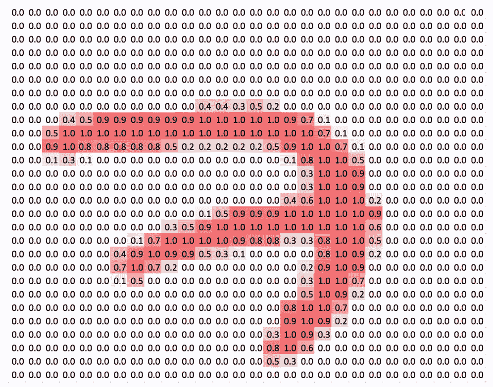

MNIST 数据集中的数字 7

以上是 MNIST 数据集中的一个示例。图像中的手写数字被突出显示，以使数字 7 对人类可见，但对计算机来说，图像实际上只是数字的集合。这意味着我们可以对图像进行各种数学运算。

在检测数字时，有几个低级特征构成一个数字。例如，在这个手写的图 7 中，有一条垂直直线、一条在顶部的水平线和一条穿过中间的水平线的组合。相比之下，9 是由四条在顶部形成一个圆的圆形线和一条直的垂直线组成的。

我们现在能够展示 ConvNets 背后的中心思想。我们可以使用能够检测某种低级特征的小过滤器，例如垂直线，然后将其滑动到整个图像上，以检测图像中的所有垂直线。

下面的屏幕截图显示了一个竖线过滤器。为了检测图像中的垂直线，我们需要在图像上滑动这个 3x3 矩阵过滤器。

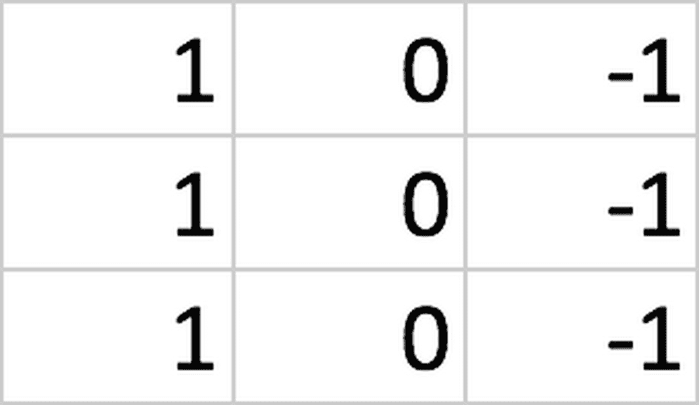

垂直线过滤器

使用下一页的 MNIST 数据集，我们从左上角开始，切掉左上角的 3×3 像素网格，在这种情况下，所有像素都为零。

然后，我们对滤波器中的所有元素与图像切片中的所有元素执行逐元素乘法。然后对九个乘积求和，并加上偏差。然后，该值形成过滤器的输出，并作为新像素传递到下一层:

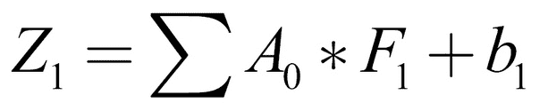

因此，垂直线滤波器的输出将如下所示:


垂直线滤波器的输出

花分钟注意垂直线可见，而水平线消失。只剩下一些艺术品了。另外，请注意过滤器是如何从一侧捕捉垂直线的。

由于它响应左侧的高像素值和右侧的低像素值，因此只有输出的右侧显示强正值。同时，线的左侧实际上显示负值。这在实践中不是一个大问题，因为对于不同种类的线和方向通常有不同的过滤器。

## 添加第二个过滤器

我们的垂直过滤器正在工作，但我们已经注意到，我们还需要过滤图像的水平线，以检测 7。

我们的水平线过滤器可能看起来像这样:

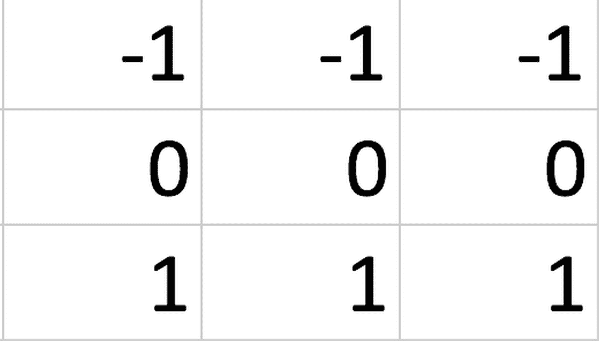

水平线过滤器

使用该示例，我们现在可以使用与垂直滤镜完全相同的方式在我们的图像上滑动该滤镜，得到以下输出:

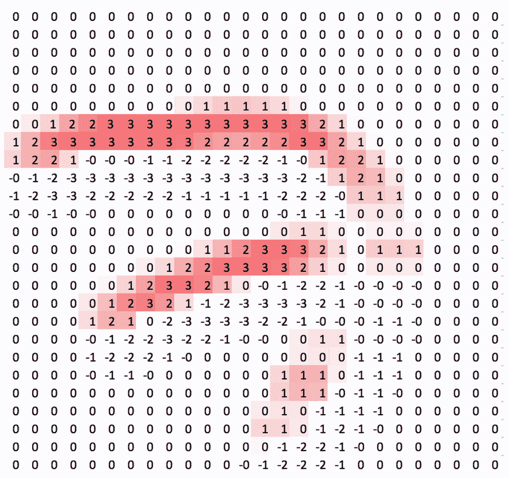

垂直线滤波器的输出

看到这个滤镜是如何去掉垂直线，只留下水平线的吗？现在的问题是，我们现在传递到下一层的是什么？我们将两个过滤器的输出叠加在一起，形成一个三维立方体:

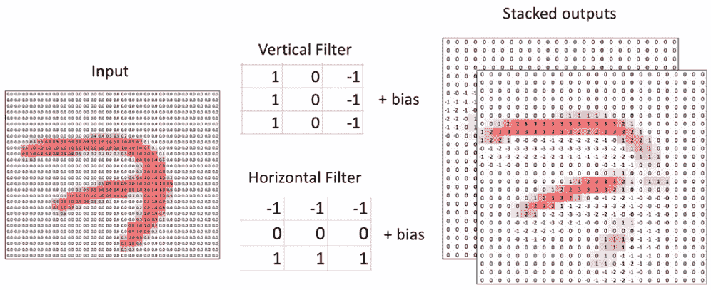

MNIST 卷积

通过添加多个卷积层，我们的 ConvNet 能够提取更加复杂的语义特征。


# 彩色图像上的滤镜

当然，我们的过滤技术不仅限于黑白图像。在这一节中，我们将看看彩色图像。

大多数彩色图像由三层或三个通道组成，这通常称为 RGB，是三层的缩写。它们由一个红色通道、一个蓝色通道和一个绿色通道组成。当这三个通道叠加在一起时，就形成了我们所熟知的传统彩色图像。

根据这个概念，图像不是平面的，而是一个立方体，一个三维矩阵。结合这个想法和我们的目标，我们想应用一个过滤器的形象，并适用于所有三个渠道一次。因此，我们将在两个三维立方体之间执行元素级乘法。

我们的 3x3 滤波器现在有三个深度，因此有九个参数，加上偏差:

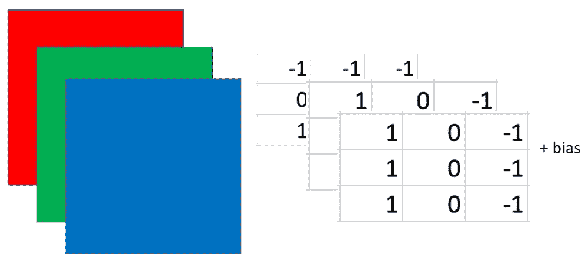

过滤立方体或卷积核的例子

这个立方体，被称为卷积核，在图像上滑动，就像以前的二维矩阵一样。然后再对元素乘积求和，加上偏差，结果表示下一层中的一个像素。

过滤器总是捕捉前一层的整个深度。过滤器在图像的宽度和高度上移动。同样，滤镜不会在图像的深度(即不同通道)上移动。用技术术语来说，权重，即构成过滤器的数字，在宽度和高度上是共享的，但在不同的通道上不是。


# 喀拉斯的康文网络构建模块

在这一节中，我们将构建一个简单的 ConvNet，它可以用于对 MNIST 角色进行分类，同时了解构成现代 ConvNet 的不同部分。

我们可以通过运行以下代码直接从 Keras 导入 MNIST 数据集:

```
from keras.datasets import mnist

(x_train, y_train), (x_test, y_test) = mnist.load_data()
```

我们的数据集包含 60，000 张 28x28 像素的图像。MNIST 字符是黑白的，因此数据形状通常不包括通道:

```
x_train.shape
```

```

out: (60000, 28, 28)

```

稍后，我们将进一步了解颜色通道，但现在，让我们扩展数据维度，以表明我们只有一个单色通道。我们可以通过运行以下命令来实现这一点:

```
import numpy as np

x_train = np.expand_dims(x_train,-1)

x_test = np.expand_dims(x_test,-1)

x_train.shape
```

```

out: (60000, 28, 28, 1)

```

随着代码的运行，您可以看到我们现在添加了一个单一的颜色通道。

## Conv2D

现在我们来看一下 ConvNets 的核心部分:在 Keras 中使用卷积层。Conv2D 是实际的卷积层，一个 Conv2D 层包含几个滤波器，如以下代码所示:

```
from keras.layers import Conv2D

from keras.models import Sequential

model = Sequential()

img_shape = (28,28,1)

model.add(Conv2D(filters=6,

                 kernel_size=3,

                 strides=1,

                 padding='valid',

                 input_shape=img_shape))
```

创建新的 Conv2D 层时，我们必须指定要使用的滤镜数量以及每个滤镜的大小。

### 果仁大小

过滤器的大小也被称为“T0”，因为单个过滤器有时被称为内核。如果我们只指定一个数字作为内核大小，Keras 会假设我们的过滤器是正方形的。在这种情况下，例如，我们的过滤器将是 3x3 像素。

然而，可以通过向参数`kernel_size`传递一个元组来指定非方形的内核大小。例如，我们可以通过`kernel_size = (3,4)`选择一个 3x4 像素的滤镜。然而，这种情况非常罕见，在大多数情况下，过滤器的尺寸为 3x3 或 5x5。根据经验，研究人员发现这是一个产生良好结果的尺寸。

### 步幅大小

`strides`参数指定步长，也称为步幅大小，卷积滤波器以此在图像上滑动，通常称为特征图。在绝大多数情况下，滤镜逐像素移动，因此它们的步幅大小设置为 1。然而，有研究人员更广泛地使用较大的步幅大小，以便减小特征图的空间大小。

像`kernel_size`一样，Keras 假设如果我们只指定一个值，我们在水平和垂直方向使用相同的步幅，在大多数情况下这是正确的。但是，如果我们想使用水平方向上的步长为 1，而垂直方向上的步长为 2，我们可以将一个元组传递给参数，如下所示:`strides=(1,2)`。在过滤器尺寸的情况下，很少这样做。

### 填充

最后，我们有添加`padding`到我们的卷积层。填充会在我们的图像周围添加零。如果我们想要防止我们的特征地图缩小，这是可以做到的。

让我们考虑一个 5x5 像素的特征图和一个 3x3 的滤镜。过滤器只能在特征图上显示九次，所以我们最终会得到一个 3x3 的输出。这既减少了我们可以在下一个要素地图中捕获的信息量，也减少了输入要素地图的外部像素对任务的贡献。过滤器从不以它们为中心；它只检查他们一次。

填充有三个选项:不使用填充，称为“无”填充，“相同”填充和“有效”填充。

让我们来看看这三种划水方式。首先，没有填充:


选项 1:无填充

然后我们有相同的填充:

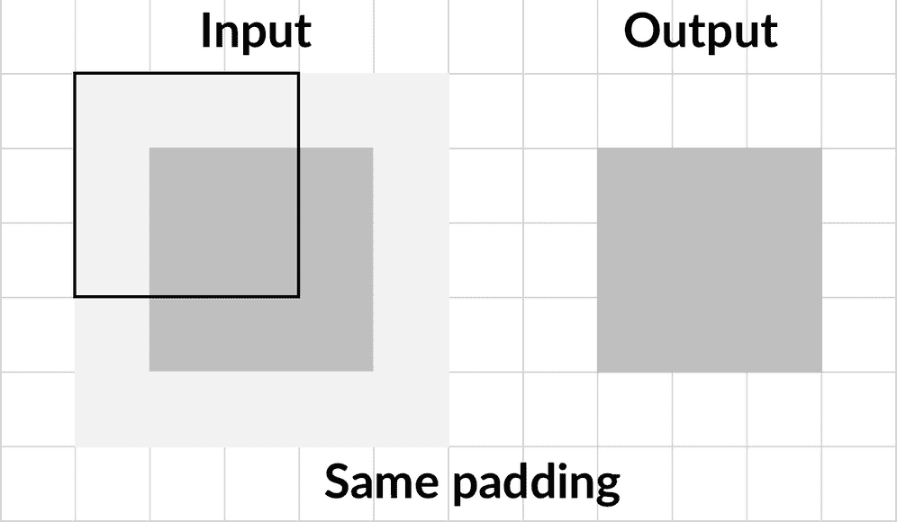

选项 2:相同的填充

为了确保输出与输入的大小相同，我们可以使用`same`填充。然后，Keras 将在输入特征图周围添加足够多的零，这样我们就可以保持大小。然而，默认填充设置是`valid`。此填充不会保留特征图的大小，但只会确保过滤器和步幅大小确实适合输入特征图:

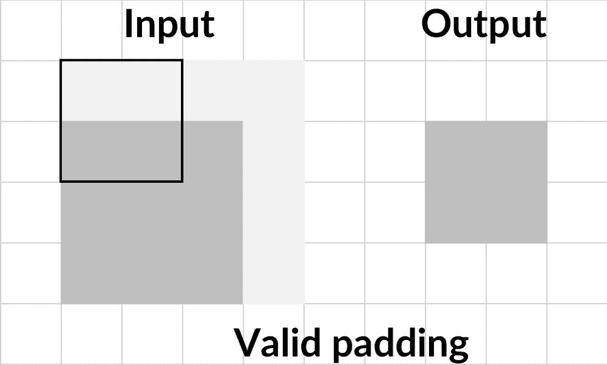

选项 3:有效填充

### 输入形状

Keras 要求我们指定输入的形状。然而，这仅是第一个层所需要的。对于所有后续层，Keras 将根据前一层的输出形状来推断输入形状。

### 简化的 Conv2D 符号

前一层采用 28x28x1 输入，并在其上滑动 6 个 2x2 大小的滤镜，逐像素进行。更常见的指定同一层的方法是使用以下代码:

```
model.add(Conv2D(6,3,input_shape=img_shape))
```

滤镜数量(这里是`6`)和滤镜大小(这里是`3`)被设置为位置参数，而`strides`和`padding`分别默认为`1`和`valid`。如果这是网络中更深的一层，我们甚至不必指定输入形状。

### ReLU 激活

卷积层仅执行线性步骤。组成图像的数字与过滤器相乘，这是一个线性操作。

因此，为了逼近复杂函数，我们需要用激活函数引入非线性。计算机视觉最常见的激活函数是校正线性单位，或 ReLU 函数，我们可以在这里看到:

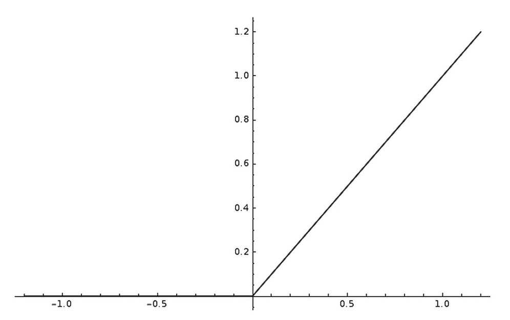

ReLU 激活功能

用于生成上述图表的 ReLU 公式如下所示:

*ReLU(x) = max(x，0)*

换句话说，如果输入为正，ReLU 函数将返回输入。如果不是，那么它返回零。这个非常简单的函数已经被证明是非常有用的，使得梯度下降收敛得更快。

人们经常认为 ReLU 更快，因为所有大于零的值的导数都只有一个，它不会像某些极值的导数一样变得非常小，例如 sigmoid 或 tanh。

ReLU 的计算开销也比 sigmoid 和 tanh 小。它不需要任何计算量很大的计算，输入值小于零就设置为零，其余的输出。然而不幸的是，ReLU 激活有点脆弱，可能会“死亡”

当梯度非常大并且向负方向移动多个权重时，那么 ReLU 的导数也将总是零，因此权重不再更新。这可能意味着一个神经元再也不会放电了。然而，这可以通过较小的学习率来缓解。

因为 ReLU 速度快，计算量小，所以成为了很多从业者默认的激活函数。要在 Keras 中使用 ReLU 函数，我们可以通过运行以下代码，在激活层中将其命名为所需的激活函数:

```
from keras.layers import Activation

model.add(Activation('relu'))
```

## 最大池 2D

常见的做法是在多个卷积层之后使用一个池层。汇集减少了特征图的空间大小，这反过来减少了神经网络中所需的参数数量，从而减少了过拟合。

下面，我们可以看到一个最大池的例子:

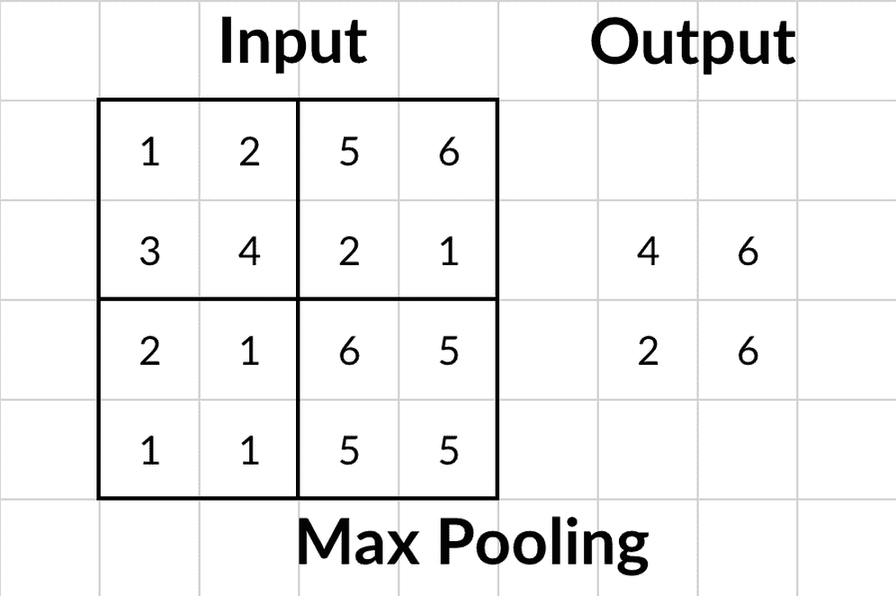

最大池化

Max pooling 返回池中的最大元素。这与示例 average`AveragePooling2D`形成对比，后者返回一个池的平均值。最大池通常比平均池提供更好的结果，所以它是大多数从业者使用的标准。

通过运行以下命令可以实现最大池化:

```
from keras.layers import MaxPool2D

model.add(MaxPool2D(pool_size=2, 

                    strides=None, 

                    padding='valid'))
```

在 Keras 中使用最大池层时，我们必须指定所需的池大小。最常见的值是 2x2 池。正如`Conv2D`层一样，我们也可以指定步幅大小。

对于池层，默认步幅大小为`None`，在这种情况下，Keras 会将步幅大小设置为与池大小相同。换句话说，池彼此相邻，不重叠。

我们还可以指定填充，默认选择是`valid`。然而，为池化图层指定`same`填充极其罕见，因为池化图层的目的是减小要素地图的空间大小。

我们这里的`MaxPooling2D`层采用 2x2 像素的池，没有重叠，并返回最大元素。指定同一层的一种更常见的方法是通过执行以下命令:

```
model.add(MaxPool2D(2))
```

在这种情况下，`strides`和`padding`都被设置为默认值，分别为`None`和`valid`。在汇集层之后通常没有激活，因为汇集层不执行线性步骤。

## 展平

您可能已经注意到我们的特征图是三维的，而我们想要的输出是一维向量，包含 10 个类别中每一个的概率。那么，我们如何从 3D 到 1D 呢？嗯，我们`Flatten`我们的特色地图。

`Flatten`操作与 NumPy 的`flatten`操作类似。它接收一批维度为`(batch_size, height, width, channels)`的特征图，并返回一组维度为`(batch_size, height * width * channels)`的向量。

它不执行任何计算，只改变矩阵的形状。该操作没有要设置的超参数，如下面的代码所示:

```
from keras.layers import Flatten

model.add(Flatten())
```

## 密集

ConvNets 通常由特征提取部分、卷积层以及分类部分组成。分类部分由简单的全连接层组成，我们已经在[第 1 章](ch01.html "Chapter 1. Neural Networks and Gradient-Based Optimization")、*神经网络和基于梯度的优化*以及[第 2 章](ch02.html "Chapter 2. Applying Machine Learning to Structured Data")、*将机器学习应用于结构化数据*中探讨过。

为了将普通层与所有其他类型的层区分开来，我们将其称为`Dense`层。在密集层中，每个输入神经元都连接到一个输出神经元。我们只需要指定我们想要的输出神经元的数量，在本例中是 10 个。

这可以通过运行以下代码来完成:

```
from keras.layers import Dense

model.add(Dense(10))
```

在密集层的线性步骤之后，我们可以为多类回归添加一个`softmax`激活，就像我们在前两章中所做的那样，通过运行以下代码:

```
model.add(Activation('softmax'))
```

## 训练 MNIST

现在让我们把所有这些元素放在一起，这样我们就可以在 MNIST 数据集上训练一个 ConvNet。

### 模型

首先，我们必须指定模型，这可以通过下面的代码来实现:

```
from keras.layers import Conv2D, Activation, MaxPool2D, Flatten, Dense

from keras.models import Sequential

img_shape = (28,28,1)

model = Sequential()

model.add(Conv2D(6,3,input_shape=img_shape))

model.add(Activation('relu'))

model.add(MaxPool2D(2))

model.add(Conv2D(12,3))

model.add(Activation('relu'))

model.add(MaxPool2D(2))

model.add(Flatten())

model.add(Dense(10))

model.add(Activation('softmax'))
```

在下面的代码中，您可以看到典型 ConvNet 的一般结构:

```
Conv2D

Pool 

Conv2D

Pool

Flatten

Dense
```

卷积层和汇集层通常在这些块中一起使用；可以找到重复`Conv2D`、`MaxPool2D`组合几十次的神经网络。

我们可以使用以下命令获得模型的概述:

```
model.summary()
```

这将为我们提供以下输出:

```

Layer (type)                 Output Shape              Param # 

=================================================================

conv2d_2 (Conv2D)            (None, 26, 26, 6)         60 

_________________________________________________________________

activation_3 (Activation)    (None, 26, 26, 6)         0 

_________________________________________________________________

max_pooling2d_2 (MaxPooling2 (None, 13, 13, 6)         0 

_________________________________________________________________

conv2d_3 (Conv2D)            (None, 11, 11, 12)        660 

_________________________________________________________________

activation_4 (Activation)    (None, 11, 11, 12)        0 

_________________________________________________________________

max_pooling2d_3 (MaxPooling2 (None, 5, 5, 12)          0 

_________________________________________________________________

flatten_2 (Flatten)          (None, 300)               0 

_________________________________________________________________

dense_2 (Dense)              (None, 10)                3010 

_________________________________________________________________

activation_5 (Activation)    (None, 10)                0 

=================================================================

Total params: 3,730

Trainable params: 3,730

Non-trainable params: 0

_________________________________________________________________

```

在此摘要中，您可以清楚地看到池化图层是如何缩小要素地图的大小的。单从摘要来看就不那么明显了，但是你可以看到第一个`Conv2D`层的输出是 26x26 像素，而输入图像是 28x28 像素。

通过使用`valid`填充，`Conv2D`也减少了特征图的大小，虽然只是少量的。第二个`Conv2D`图层也是如此，它将特征图从 13x13 像素缩小到 11x11 像素。

您还可以看到第一个卷积层只有 60 个参数，而`Dense`层有 3010 个参数，超过 50 倍。卷积层通常用很少的参数实现令人惊讶的壮举，这就是它们如此受欢迎的原因。网络中的参数总数通常可以通过卷积层和汇集层显著减少。

### 加载数据

我们使用的 MNIST 数据集预装了 Keras。加载数据时，如果您想通过 Keras 直接使用数据集，请确保您有互联网连接，因为 Keras 必须先下载它。

您可以使用以下代码导入数据集:

```
from keras.datasets import mnist

(x_train, y_train), (x_test, y_test) = mnist.load_data()
```

正如本章开始时所解释的，我们想要重塑数据集，以便它也可以有一个通道维度。数据集还没有通道维度，但这是我们可以做到的:

```
x_train.shape
```

```

out:

(60000, 28, 28)

```

因此，我们使用 NumPy 添加了一个通道维度，代码如下:

```
import numpy as np

x_train = np.expand_dims(x_train,-1)

x_test = np.expand_dims(x_test,-1)
```

现在有一个渠道维度，正如我们在这里看到的:

```
x_train.shape
```

```

out:

(60000, 28, 28,1)

```

### 编译和培训

在前面的章节中，我们已经使用了一个热点编码目标进行多类回归。虽然我们已经重塑了数据，但目标仍保持原来的形式。它们是一个平面向量，包含每个手写图形的数字数据表示。请记住，我们在 MNIST 数据集中有 60，000 个这样的例子:

```
y_train.shape
```

```

out:

(60000,)

```

通过 one-hot 编码转换目标是一项频繁且令人讨厌的任务，因此 Keras 允许我们只指定一个损失函数，将目标动态转换为 one-hot。这个损失函数叫做`sparse_categorical_crossentropy`。

它与前面章节中使用的分类交叉熵损失相同，唯一的区别是它使用稀疏的，也就是说，不是一次性编码的目标。

就像以前一样，您仍然需要确保您的网络输出具有与类一样多的维度。

我们现在可以编译模型了，我们可以用下面的代码来完成:

```
model.compile(loss='sparse_categorical_crossentropy',optimizer='adam',metrics=['acc'])
```

如您所见，我们正在使用 Adam 优化器。亚当的确切工作方式将在下一节解释，*我们的神经网络*的更多细节，但是现在，你可以把它看作是随机梯度下降的一个更复杂的版本。

训练时，我们可以通过运行下面的代码直接在 Keras 中指定一个验证集:

```
history = model.fit(x_train,y_train,batch_size=32,epochs=5,validation_data=(x_test,y_test))
```

一旦我们成功运行了代码，我们将得到以下输出:

```

Train on 60000 samples, validate on 10000 samples

Epoch 1/10

60000/60000 [==============================] - 19s 309us/step - loss: 5.3931 - acc: 0.6464 - val_loss: 1.9519 - val_acc: 0.8542

Epoch 2/10

60000/60000 [==============================] - 18s 297us/step - loss: 0.8855 - acc: 0.9136 - val_loss: 0.1279 - val_acc: 0.9635

....

Epoch 10/10

60000/60000 [==============================] - 18s 296us/step - loss: 0.0473 - acc: 0.9854 - val_loss: 0.0663 - val_acc: 0.9814

```

为了更好地了解是怎么回事，我们可以用下面的代码来绘制训练进度:

```
import matplotlib.pyplot as plt

fig, ax = plt.subplots(figsize=(10,6))

gen = ax.plot(history.history['val_acc'], label='Validation Accuracy')

fr = ax.plot(history.history['acc'],dashes=[5, 2], label='Training Accuracy')

legend = ax.legend(loc='lower center', shadow=True)

plt.show()
```

这将为我们提供以下图表:

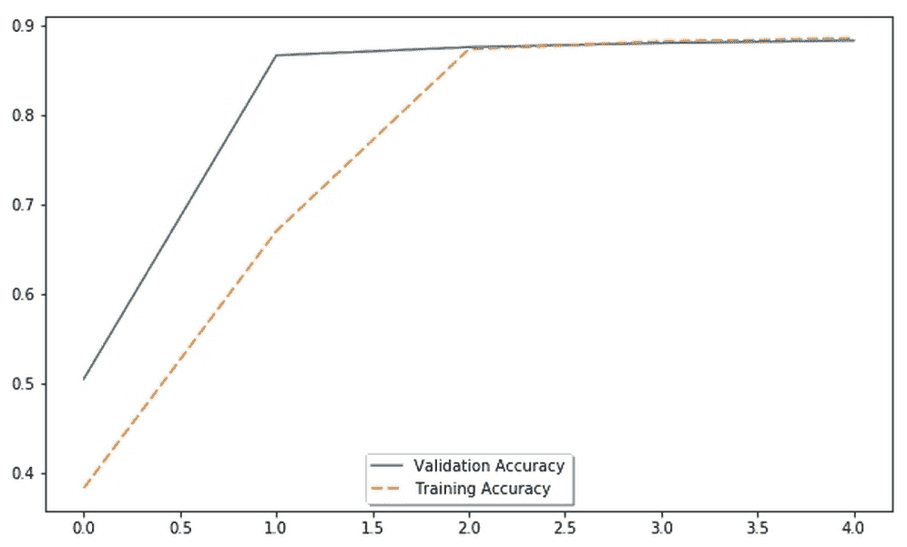

验证和训练准确性的可视化输出

正如您在前面的图表中所看到的，该模型达到了大约 98%的验证准确率，这是相当不错的！


# 我们的神经网络需要更多的功能

让我们花一点时间来看看我们的神经网络的其他一些元素。

## 气势

在前几章中，我们已经解释了梯度下降，即有人试图通过沿着地面的坡度找到下山的路。动量可以用物理学的类比来解释，即一个球从同一个山坡上滚下来。小山上的一个小突起不会使球滚向完全不同的方向。球已经有了一些动量，这意味着它的运动受到它之前运动的影响。

我们用指数加权移动平均来更新模型参数，而不是直接用它们的梯度来更新模型参数。我们用异常值梯度更新参数，然后取移动平均值，这将平滑异常值并捕捉梯度的大致方向，如下图所示:

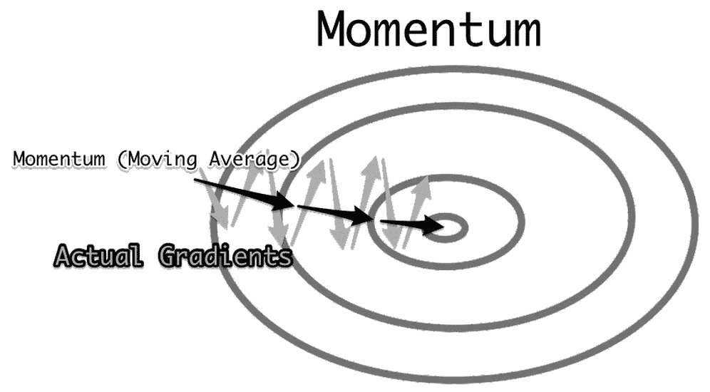

动量如何平滑梯度更新

指数加权移动平均是一个聪明的数学技巧，用于计算移动平均，而不必记忆一组以前的值。某个值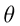的指数加权平均值 *V* 如下:

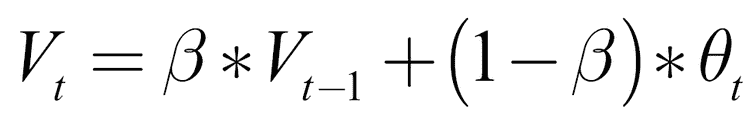

β值为 0.9 意味着平均值的 90%来自之前的移动平均值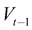，10%来自新值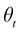。

使用动量使得学习对于梯度下降陷阱(例如异常梯度、局部最小值和鞍点)更加鲁棒。

我们可以通过设置 beta 值，用 momentum 增强 Keras 中的标准随机梯度下降优化器，我们在下面的代码中这样做:

```
from keras.optimizers import SGD

momentum_optimizer = SGD(lr=0.01, momentum=0.9)
```

这个小代码片段创建了一个随机梯度下降优化器，学习率为 0.01，beta 值为 0.9。我们可以在编译模型时使用它，正如我们现在要做的:

```
model.compile(optimizer=momentum_optimizer,loss='sparse_categorical_crossentropy',metrics=['acc'])
```

## Adam 优化器

早在 2015 年，Diederik P. Kingma 和 Jimmy Ba 创建了**亚当** ( **自适应动量估计**)优化器。这是使梯度下降更有效的另一种方法。在过去的几年里，这种方法已经显示出非常好的效果，因此已经成为许多从业者的标准选择。例如，我们将它用于 MNIST 数据集。

首先，Adam 优化器计算梯度的指数加权平均值，就像动量优化器一样。它通过以下公式实现这一点:

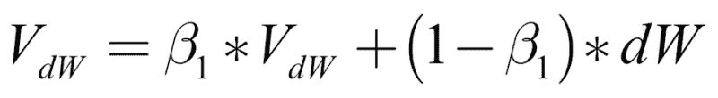

然后，它还计算平方梯度的指数加权平均值:

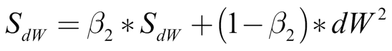

然后，它像这样更新模型参数:

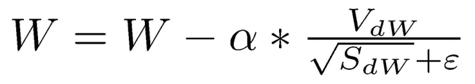

这里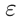是一个很小的数，以避免被零除。

当梯度非常大时，这种除以梯度的平方根的方法会降低更新速度。它还稳定了学习，因为学习算法不会因为离群值而偏离轨道。

利用亚当，我们有了一个新的超参数。不再只有一个动量因子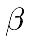，我们现在有两个动量因子和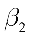。的推荐值

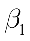

和分别为 0.9 和 0.999。

我们可以像这样使用 Keras 中的 Adam:

```
from keras.optimizers import adam

adam_optimizer=adam(lr=0.1,beta_1=0.9, beta_2=0.999, epsilon=1e-08)

model.compile(optimizer=adam_optimizer,loss='sparse_categorical_crossentropy',metrics=['acc'])
```

正如你在本章前面看到的，我们也可以通过传递作为优化器的`adam`字符串来编译模型。在这种情况下，Keras 将为我们创建一个 Adam 优化器，并选择推荐值。

## 正规化

正则化是一种用于避免过度拟合的技术。过度拟合是指模型与定型数据拟合得太好，因此它不能很好地概括开发或测试数据。您可能会看到，过度拟合有时也被称为“高方差”，而拟合不足，即在训练、开发和测试数据上获得较差的结果，被称为“高偏差”

在经典的统计学习中，有很多关于偏差-方差权衡的焦点。提出的论点是，非常适合训练集的模型可能会过度拟合，为了获得良好的结果，必须接受一定量的欠拟合(偏差)。在经典的统计学习中，防止过度拟合的超参数也经常防止训练集很好地拟合。

神经网络中的正则化，正如这里所提出的，很大程度上是从经典的学习算法中借用的。然而，现代机器学习研究开始接受“正交性”的概念，即不同的超参数会影响偏差和方差。

通过分离这些超参数，可以打破偏差-方差权衡，我们可以找到能够很好地概括并提供准确预测的模型。然而，到目前为止，这些努力只取得了很小的回报，因为低偏差和低方差模型需要大量的训练数据。

### L2 正规化

对抗过度拟合的一种流行技术是 L2 正则化。L2 正则化将权重的平方和添加到损失函数中。我们可以在下面的公式中看到这样的例子:

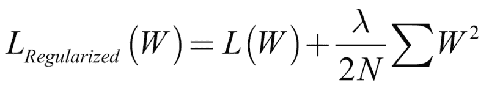

这里 *N* 是训练样本的数量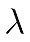是正则化超参数，它决定了我们要正则化多少，常用值在 0.01 左右。

将这种正则化添加到损失函数中意味着高权重增加了损失，并且算法被激励来减少权重。小的权重，即接近零的权重，意味着神经网络对它们的依赖将会减少。

因此，正则化算法将更少地依赖于每个单个特征和每个单个节点激活，而是将具有更全面的视图，考虑许多特征和激活。这将防止算法过度拟合。

### L1 正则化

L1 正则化非常类似于 L2 正则化，但它不是添加平方和，而是添加绝对值之和，正如我们在该公式中看到的:

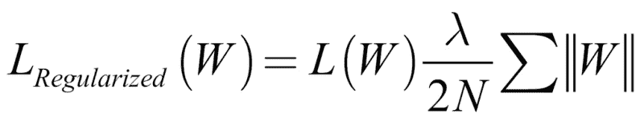

在实践中，两者中哪一个效果最好往往有点不确定，但两者之间的差别不是很大。

### Keras 中的正规化

在 Keras 中，应用于权重的正则化子称为**核 _ 正则化子**，而应用于偏差的正则化子称为**偏差 _ 正则化子**。您也可以直接将正则化应用于节点的激活，以防止它们被使用**activity _ regulator**非常强烈地激活。

现在，让我们添加一些 L2 正则化到我们的网络。为此，我们需要运行以下代码:

```
from keras.regularizers import l2

model = Sequential()

model.add(Conv2D(6,3,input_shape=img_shape, kernel_regularizer=l2(0.01)))

model.add(Activation('relu'))

model.add(MaxPool2D(2))

model.add(Conv2D(12,3,activity_regularizer=l2(0.01)))

model.add(Activation('relu'))

model.add(MaxPool2D(2))

model.add(Flatten())

model.add(Dense(10,bias_regularizer=l2(0.01)))

model.add(Activation('softmax'))
```

在 Keras 的第一个卷积层中设置`kernel_regularizer`意味着正则化权重。设置`bias_regularizer`调整偏差，设置`activity_regularizer`调整层的输出激活。

在下面的例子中，正则项被设置为炫耀，但在这里它们实际上损害了我们网络的性能。正如你从前面的训练结果中看到的，我们的网络实际上并没有过度拟合，所以设置正则化子会损害这里的性能，结果是模型欠拟合。

正如我们在下面的输出中看到的，在这种情况下，模型达到了大约 87%的验证准确率:

```
model.compile(loss='sparse_categorical_crossentropy',optimizer = 'adam',metrics=['acc'])

history = model.fit(x_train,y_train,batch_size=32,epochs=10,validation_data=(x_test,y_test))

Train on 60000 samples, validate on 10000 samples

Epoch 1/10

60000/60000 [==============================] - 22s 374us/step - loss: 7707.2773 - acc: 0.6556 - val_loss: 55.7280 - val_acc: 0.7322

Epoch 2/10

60000/60000 [==============================] - 21s 344us/step - loss: 20.5613 - acc: 0.7088 - val_loss: 6.1601 - val_acc: 0.6771

....

Epoch 10/10

60000/60000 [==============================] - 20s 329us/step - loss: 0.9231 - acc: 0.8650 - val_loss: 0.8309 - val_acc: 0.8749

```

您会注意到，模型在验证上比在训练集上实现了更高的准确性；这是一个明显的不适应迹象。

## 辍学

正如 Srivastava 等人 2014 年论文的标题所示，*辍学是防止神经网络过度适应*的一种简单方法。它通过从神经网络中随机移除节点来实现这一点:

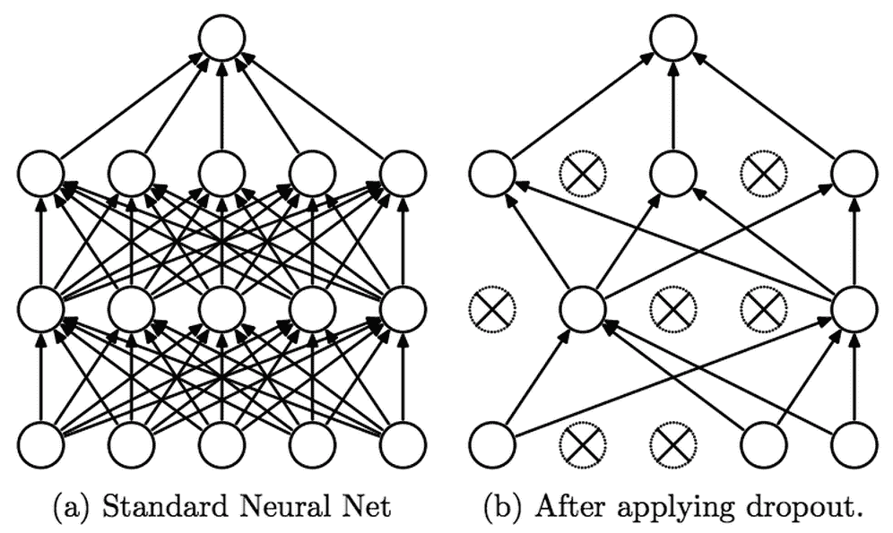

辍学方法示意图。来自 Srivastava 等人，“辍学:防止神经网络过度拟合的简单方法”，2014 年

使用 dropout，每个节点都有很小的概率将其激活设置为零。这意味着学习算法不再像 L2 和 L1 正则化那样严重依赖于单个节点。因此，辍学也有一个正规化的影响。

在 Keras 中，辍学是一种新的图层类型。它被放在您想要应用退出的激活之后。它传递激活，但有时它将激活设置为零，达到与细胞直接脱落相同的效果。我们可以在下面的代码中看到这一点:

```
from keras.layers import Dropout

model = Sequential()

model.add(Conv2D(6,3,input_shape=img_shape))

model.add(Activation('relu'))

model.add(MaxPool2D(2))

model.add(Dropout(0.2))

model.add(Conv2D(12,3))

model.add(Activation('relu'))

model.add(MaxPool2D(2))

model.add(Dropout(0.2))

model.add(Flatten())

model.add(Dense(10,bias_regularizer=l2(0.01)))

model.add(Activation('softmax'))
```

如果过度拟合是一个严重的问题，0.5 的下降值被认为是一个很好的选择，而超过 0.5 的值没有太大的帮助，因为网络可以使用的值太少。在这种情况下，我们选择的 dropout 值为 0.2，这意味着每个单元格有 20%的机会被设置为零。

请注意，dropout 在合并后使用:

```
model.compile(loss='sparse_categorical_crossentropy',optimizer = 'adam',metrics=['acc'])

history = model.fit(x_train,y_train,batch_size=32,epochs=10,validation_data=(x_test,y_test))
```

```

Train on 60000 samples, validate on 10000 samples

Epoch 1/10

60000/60000 [==============================] - 22s 371us/step - loss: 5.6472 - acc: 0.6039 - val_loss: 0.2495 - val_acc: 0.9265

Epoch 2/10

60000/60000 [==============================] - 21s 356us/step - loss: 0.2920 - acc: 0.9104 - val_loss: 0.1253 - val_acc: 0.9627

....

Epoch 10/10

60000/60000 [==============================] - 21s 344us/step - loss: 0.1064 - acc: 0.9662 - val_loss: 0.0545 - val_acc: 0.9835

```

低压差值为我们创造了良好的结果，但同样，网络在验证集上比在训练集上做得更好，这是发生欠拟合的明显迹象。请注意，辍学仅适用于培训时间。当模型用于预测时，dropout 不做任何事情。

## 批量生产

**Batchnorm** ，是**batch****normalization**的简称，是一种将输入数据批量“规格化”到层的技术。每个 batchnorm 计算数据的平均值和标准差，并应用一个变换，使平均值为零，标准差为一。

这使得训练更容易，因为损失面变得更“圆”沿着不同输入维度的不同平均值和标准偏差将意味着网络将不得不学习更复杂的函数。

在 Keras 中，batchnorm 也是一个新的层，您可以在以下代码中看到:

```
from keras.layers import BatchNormalization

model = Sequential()

model.add(Conv2D(6,3,input_shape=img_shape))

model.add(Activation('relu'))

model.add(MaxPool2D(2))

model.add(BatchNormalization())

model.add(Conv2D(12,3))

model.add(Activation('relu'))

model.add(MaxPool2D(2))

model.add(BatchNormalization())

model.add(Flatten())

model.add(Dense(10,bias_regularizer=l2(0.01)))

model.add(Activation('softmax'))

model.compile(loss='sparse_categorical_crossentropy',optimizer = 'adam',metrics=['acc'])

history = model.fit(x_train,y_train,batch_size=32,epochs=10,validation_data=(x_test,y_test))
```

```

Train on 60000 samples, validate on 10000 samples

Epoch 1/10

60000/60000 [==============================] - 25s 420us/step - loss: 0.2229 - acc: 0.9328 - val_loss: 0.0775 - val_acc: 0.9768

Epoch 2/10

60000/60000 [==============================] - 26s 429us/step - loss: 0.0744 - acc: 0.9766 - val_loss: 0.0668 - val_acc: 0.9795

....

Epoch 10/10

60000/60000 [==============================] - 26s 432us/step - loss: 0.0314 - acc: 0.9897 - val_loss: 0.0518 - val_acc: 0.9843

```

Batchnorm 通常通过简化训练来加速训练。你可以看到第一个时期的准确率是如何上升的:

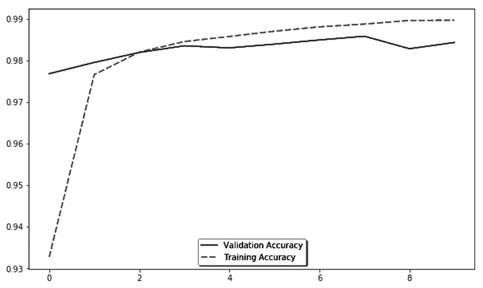

用 batchnorm 训练和验证我们的 MNIST 分类器的准确性

Batchnorm 也有轻微的调节作用。极值经常被过度拟合，batchnorm 减少了极值，类似于活动正则化。所有这些使得 batchnorm 成为计算机视觉中一个非常受欢迎的工具。


# 处理大型影像数据集

图像往往是大文件。事实上，您很可能无法将整个图像数据集放入计算机的 RAM 中。

因此，我们需要从磁盘“及时”加载图像，而不是提前加载。在这一节中，我们将设置一个图像数据生成器来动态加载图像。

在这种情况下，我们将使用植物幼苗的数据集。这是由 Thomas Giselsson 等人于 2017 年通过他们的出版物*提供的，这是一个用于植物幼苗分类算法基准测试的公共图像数据库*。

该数据集可从以下链接获得:[https://arxiv.org/abs/1711.05458](https://arxiv.org/abs/1711.05458)。

你可能想知道为什么我们要看植物。毕竟，工厂分类不是金融部门面临的常见问题。简单的答案是，这个数据集有助于演示许多常见的计算机视觉技术，并且在开放域许可下可用；因此，这是一个很好的训练数据集供我们使用。

希望在更相关的数据集上测试自己知识的读者应该看看*州立农场分心司机*数据集以及*星球:从太空了解亚马逊*数据集。

### 注意

本节和堆叠预训练模型一节的代码和数据可以在这里找到并运行:[https://www.kaggle.com/jannesklaas/stacking-vgg](https://www.kaggle.com/jannesklaas/stacking-vgg)。

Keras 附带了一个图像数据生成器，它可以开箱即用地从磁盘加载文件。为此，您只需运行:

```
from keras.preprocessing.image import ImageDataGenerator
```

要从文件中获取生成器读数，我们首先必须指定生成器。在 Keras 中，`ImageDataGenerator`提供了一系列的图像增强工具，但是在我们的例子中，我们将只使用重新缩放功能。

重新缩放将图像中的所有值乘以一个常数。对于大多数常见的图像格式，颜色值的范围是从 0 到 255，所以我们希望按 1/255 重新缩放。我们可以通过运行以下命令来实现这一点:

```
imgen = ImageDataGenerator(rescale=1/255)
```

然而，这还不是为我们加载图像的生成器。`ImageDataGenerator`类提供了一系列生成器，可以通过调用它的函数来创建。

要获得一个发电机加载文件，我们必须调用`flow_from_directory`。

然后，我们必须指定 Keras 应该使用的目录、我们想要的批量大小，在本例中为`32`，以及图像应该调整到的目标大小，在本例中为 150x150 像素。为此，我们只需运行以下代码:

```
train_generator = imgen.flow_from_directory('train',batch_size=32, target_size=(150,150))

validation_generator = imgen.flow_from_directory('validation',batch_size=32, tar get_size=(150,150))
```

Keras 是如何找到图片的，又是如何知道这些图片属于哪个类的呢？Keras 生成器需要以下文件夹结构:

*   根:

    *   类 0

        *   img
        *   img
        *   …

    *   类 1

        *   img
        *   …

    *   类 1

我们的数据集已经以这种方式建立起来了，对图像进行排序以符合生成器的期望通常并不困难。


# 使用预训练模型

训练大型计算机视觉模型不仅困难，而且计算量很大。因此，使用最初为另一个目的训练的模型，并为新的目的对它们进行微调是很常见的。这是迁移学习的一个例子。

迁移学习旨在将学习从一项任务转移到另一项任务。作为人类，我们非常善于将我们所学的知识进行转化。当你看到一只你以前没见过的狗，你不需要为这只特别的狗重新学习关于狗的一切；相反，你只是将新的知识转移到你已经知道的关于狗的知识上。每次都重新训练一个大的网络是不经济的，因为你经常会发现模型的某些部分是我们可以重用的。

在本节中，我们将微调 VGG-16，最初在 ImageNet 数据集上训练。ImageNet 竞赛是一年一度的计算机视觉竞赛，ImageNet 数据集由数百万幅现实世界物体的图像组成，从狗到飞机。

在 ImageNet 竞赛中，研究人员竞相建立最精确的模型。事实上，ImageNet 近年来推动了计算机视觉的许多进步，为 ImageNet 竞赛构建的模型是微调模型的流行基础。

VGG-16 是由牛津大学视觉几何小组开发的模型建筑。该模型由卷积部分和分类部分组成。我们将只使用卷积部分。此外，我们将添加我们自己的分类部分，可以对植物进行分类。

VGG-16 可以使用以下代码通过 Keras 下载:

```
from keras.applications.vgg16 import VGG16

vgg_model = VGG16(include_top=False,input_shape=(150,150,3))
```

```

out: 

Downloading data from https://github.com/fchollet/deep-learning-models/releases/download/v0.1/vgg16_weights_tf_dim_ordering_tf_kernels_notop.h5

58892288/58889256 [==============================] - 5s 0us/step

```

在下载数据的时候，我们想让 Keras 知道我们不想包含最上面的部分(分类部分)；我们还想让 Keras 知道所需的输入形状。如果我们不指定输入形状，模型将接受任何图像大小，并且不可能在顶部添加`Dense`层:

```
vgg_model.summary()
```

```

out: 

_________________________________________________________________

Layer (type)                 Output Shape              Param # 

=================================================================

input_1 (InputLayer)         (None, 150, 150, 3)       0 

_________________________________________________________________

block1_conv1 (Conv2D)        (None, 150, 150, 64)      1792 

_________________________________________________________________

block1_conv2 (Conv2D)        (None, 150, 150, 64)      36928 

_________________________________________________________________

block1_pool (MaxPooling2D)   (None, 75, 75, 64)        0 

_________________________________________________________________

block2_conv1 (Conv2D)        (None, 75, 75, 128)       73856 

_________________________________________________________________

block2_conv2 (Conv2D)        (None, 75, 75, 128)       147584 

_________________________________________________________________

block2_pool (MaxPooling2D)   (None, 37, 37, 128)       0 

_________________________________________________________________

block3_conv1 (Conv2D)        (None, 37, 37, 256)       295168 

_________________________________________________________________

block3_conv2 (Conv2D)        (None, 37, 37, 256)       590080 

_________________________________________________________________

block3_conv3 (Conv2D)        (None, 37, 37, 256)       590080 

_________________________________________________________________

block3_pool (MaxPooling2D)   (None, 18, 18, 256)       0 

_________________________________________________________________

block4_conv1 (Conv2D)        (None, 18, 18, 512)       1180160 

_________________________________________________________________

block4_conv2 (Conv2D)        (None, 18, 18, 512)       2359808 

_________________________________________________________________

block4_conv3 (Conv2D)        (None, 18, 18, 512)       2359808 

_________________________________________________________________

block4_pool (MaxPooling2D)   (None, 9, 9, 512)         0 

_________________________________________________________________

block5_conv1 (Conv2D)        (None, 9, 9, 512)         2359808 

_________________________________________________________________

block5_conv2 (Conv2D)        (None, 9, 9, 512)         2359808 

_________________________________________________________________

block5_conv3 (Conv2D)        (None, 9, 9, 512)         2359808 

_________________________________________________________________

block5_pool (MaxPooling2D)   (None, 4, 4, 512)         0 

=================================================================

Total params: 14,714,688

Trainable params: 14,714,688

Non-trainable params: 0

_________________________________________________________________

```

如你所见，VGG 模型非常大，有超过 1470 万个可训练参数。它还由`Conv2D`和`MaxPooling2D`图层组成，这两个图层我们在处理 MNIST 数据集时已经了解过。

从这一点出发，我们有两种不同的方法可以继续:

*   添加层并建立一个新模型。
*   通过相关模型对所有图像进行预处理，然后训练一个新的模型。

## 改造 VGG-16

在这一部分，我们将在 VGG-16 模型上添加层，然后从那里开始，我们将训练新的大模型。

然而，我们不想重新训练所有那些已经被训练过的卷积层。因此，我们必须首先“冻结”VGG-16 中的所有层，这可以通过运行以下命令来实现:

```
for the layer in vgg_model.layers:

  layer.trainable = False
```

Keras 下载 VGG 作为一个功能 API 模型。我们将在[第 6 章](ch06.html "Chapter 6. Using Generative Models")、*使用生成模型*中了解更多关于功能 API 的内容，但目前，我们只想使用顺序 API，它允许我们通过`model.add()`堆叠层。我们可以使用函数式 API 转换模型，代码如下:

```
finetune = Sequential(layers = vgg_model.layers)
```

作为运行代码的结果，我们现在已经创建了一个名为`finetune`的新模型，它的工作方式就像一个普通的顺序模型一样。我们需要记住，只有当模型实际上可以用顺序 API 表达时，用顺序 API 转换模型才有效。一些更复杂的模型无法转换。

由于我们刚才所做的一切，向我们的模型添加层现在很简单:

```
finetune.add(Flatten())

finetune.add(Dense(12))

finetune.add(Activation('softmax'))
```

默认情况下，新添加的层是可训练的，而重用的模型套接字则不是。我们可以像训练任何其他模型一样，在我们在前一节中定义的数据生成器上训练这个堆叠模型。这可以通过运行以下代码来执行:

```
finetune.compile(loss='categorical_crossentropy',optimizer='adam',metrics = ['acc'])

finetune.fit_generator(train_generator,epochs=8,steps_per_epoch= 4606 // 32, validation_data=validation_generator, validation_steps= 144//32)
```

在运行之后，该模型设法实现了大约 75%的验证准确率。

## 随机图像增强

机器学习中的一个普遍问题是，无论我们有多少数据，拥有更多数据总是更好，因为这将提高我们输出的质量，同时还可以防止过度拟合，并允许我们的模型处理更多种类的输入。因此，对图像应用随机增强是很常见的，例如，旋转或随机裁剪。

这个想法是从一个图像中获取大量不同的图像，从而减少模型过度拟合的机会。对于大多数图像增强的目的，我们可以只使用 Keras 的。

使用 OpenCV 库可以进行更高级的扩充。然而，关注这一点超出了本章的范围。

### 使用 ImageDataGenerator 增强

当使用扩充的数据生成器时，我们通常只将其用于训练。验证生成器不应该使用增强功能，因为当我们验证我们的模型时，我们希望估计它在看不见的实际数据和非增强数据上的表现。

这不同于基于规则的增强，在基于规则的增强中，我们试图创建更容易分类的图像。因此，我们需要创建两个`ImageDataGenerator`实例，一个用于训练，一个用于验证。这可以通过运行以下代码来完成:

```
train_datagen = ImageDataGenerator(

  rescale = 1/255,

  rotation_range=90,

  width_shift_range=0.2,

  height_shift_range=0.2,

  shear_range=0.2,

  zoom_range=0.1,

  horizontal_flip=True,

  fill_mode='nearest')
```

这个训练数据生成器利用了一些内置的增强技术。

### 注意

**注意**:Keras 中有更多的命令可用。要获得完整列表，您应该参考 https://keras.io/[的 Keras 文档。](https://keras.io/)

在下面的列表中，我们突出显示了几个常用的命令:

*   `rescale`缩放图像中的数值。我们以前使用过它，也将使用它进行验证。
*   `rotation_range`是随机旋转图像的范围(0 到 180 度)。
*   `width_shift_range`和`height_shift_range`是水平或垂直随机拉伸图像的范围(相对于图像大小，这里为 20%)。
*   `shear_range`是一个随机应用剪切的范围(同样，相对于图像)。
*   `zoom_range`是随机放大图片的范围。
*   `horizontal_flip`指定是否随机翻转图像。
*   `fill_mode`指定如何填充旋转产生的空白空间。

我们可以通过多次运行一个图像来检查生成器做了什么。

首先，我们需要导入 Keras 图像工具并指定一个图像路径(这是随机选择的)。这可以通过运行以下命令来完成:

```
from keras.preprocessing import image

fname = 'train/Charlock/270209308.png'
```

然后，我们需要加载图像并将其转换为 NumPy 数组，这是通过以下代码实现的:

```
img = image.load_img(fname, target_size=(150, 150))

img = image.img_to_array(img)
```

如前所述，我们必须向图像添加一个批处理大小维度:

```
img = np.expand_dims(img,axis=0)
```

然后我们使用刚刚创建的`ImageDataGenerator`实例，但是我们将使用`flow`而不是`flow_from_directory`，这允许我们将数据直接传递给生成器。然后，我们传递一个我们想要使用的图像，我们可以这样做:

```
gen = train_datagen.flow(img, batch_size=1)
```

在一个循环中，我们在生成器上调用`next`四次:

```
for i in range(4):

    plt.figure(i)

    batch = next(gen)

    imgplot = plt.imshow(image.array_to_img(batch[0]))

plt.show()
```

这将产生以下输出:

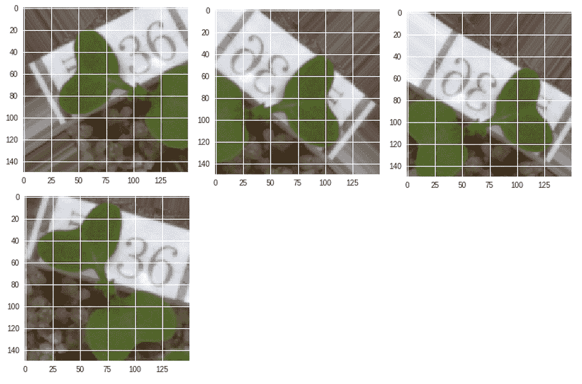

一些随机修改图像的样本


# 模块化权衡

这一章已经展示了用一些基于规则的系统来帮助机器学习模型是可能的，而且通常是有用的。您可能还注意到，数据集中的图像都被裁剪为只显示一种植物。

虽然我们可以建立一个模型来为我们定位和分类植物，除了分类之外，我们还可以建立一个系统来输出植物应该直接接受的处理。这回避了我们应该如何模块化我们的系统的问题。

端到端深度学习风靡了好几年。如果给定大量数据，深度学习模型可以学习原本需要一个具有许多组件的系统花更长时间学习的内容。然而，端到端深度学习确实有几个缺点:

*   端到端的深度学习需要海量的数据。因为模型有如此多的参数，为了避免过度拟合，需要大量的数据。
*   端到端深度学习很难调试。如果你用一个黑盒模型替换你的整个系统，你几乎没有希望找出某些事情发生的原因。
*   有些东西很难学，但作为代码写下来很容易，尤其是健全检查规则。

最近，研究人员开始使他们的模型更加模块化。一个很棒的例子就是哈和施密德图伯的*世界模型*，这里可以读到:[的](https://worldmodels.github.io/)。在这个过程中，他们对视觉信息进行了编码，对未来进行了预测，并用三种不同的模型选择了行动。

在实践方面，我们可以看看 Airbnb，他们将结构建模与机器学习结合起来，用于他们的定价引擎。可以在这里了解更多:[https://medium . com/Airbnb-engineering/learning-market-dynamics-for-optimal-pricing-97 cffbcc 53 e 3](https://medium.com/airbnb-engineering/learning-market-dynamics-for-optimal-pricing-97cffbcc53e3)。建模者知道预订大致遵循泊松分布，也有季节性影响。因此，Airbnb 建立了一个模型来直接预测分布和季节性的参数，而不是让模型直接预测预订量。

如果你有少量的数据，那么你的算法的性能需要来自人类的洞察力。如果一些子任务可以很容易地用代码表达，那么用代码表达通常会更好。如果您需要可解释性，并且想知道为什么做出某些选择，那么具有清晰可解释的中间输出的模块化设置是一个不错的选择。然而，如果一项任务很难，并且您不确切知道它需要哪些子任务，并且您有大量数据，那么使用端到端的方法通常更好。

很少使用纯粹的端到端方法。例如，图像总是从相机芯片进行预处理，你从来没有真正处理过原始数据。

聪明地划分任务可以提高性能，降低风险。


# 超越分类的计算机视觉

正如我们所看到的，有许多技术可以用来使我们的图像分类器工作得更好。这些技术在本书中都会用到，不仅仅是计算机视觉应用。

在本章的最后一节，我们将讨论一些超出图像分类的方法。这些任务通常需要比我们在本章所讨论的更有创造性地使用神经网络。

为了最大限度地了解这一部分，你不需要太担心所介绍的技术的细节，而是看看研究人员如何创造性地使用神经网络。我们采用这种方法是因为你会发现你要解决的任务需要相似的创造力。

## 面部识别

面部识别对于零售机构有很多应用。例如，如果您在前台，您可能希望在自动取款机上自动识别您的客户，或者您可能希望提供基于面部的安全功能，如 iPhone 提供的功能。然而，在后台，您需要遵守 KYC 法规，该法规要求您识别与您合作的客户。

表面上，面部识别看起来像一个分类任务。你给机器一张人脸图像，它就会预测出是哪个人。问题是你可能有数百万的顾客，但是每个顾客只有一两张图片。

最重要的是，你可能会不断获得新客户。你不能每次得到一个新客户就改变你的模型，如果一个简单的分类方法必须在数百万个类别中选择，而每个类别只有一个例子，那么它就会失败。

这里的创造性见解是，您可以查看两个图像是否显示同一张脸，而不是对客户的脸进行分类。您可以在下图中看到这一想法的直观表示:

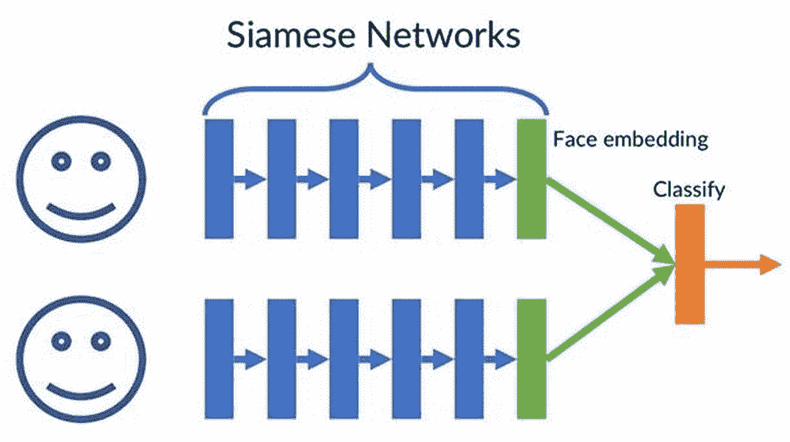

暹罗网络示意图

为此，您必须先运行这两个图像。连体网络是一类包含两个或更多相同子网的神经网络架构，两个子网都是相同的，并且包含相同的权重。在 Keras 中，您可以通过首先定义层，然后在两个网络中使用它们来实现这样的设置。然后，这两个网络输入到一个单一的分类层，该分类层确定两幅图像是否显示同一张脸。

为了避免每次我们想要识别一张脸时都通过整个 siame 网络运行我们数据库中的所有客户图像，通常保存 siame 网络的最终输出。图像的暹罗网络的最终输出被称为人脸嵌入。当我们想要识别顾客时，我们将顾客面部图像的嵌入与存储在我们数据库中的嵌入进行比较。我们可以使用单个分类图层来实现这一点。

存储面部嵌入是非常有益的，因为除了允许面部聚类之外，它将为我们节省大量的计算成本。面部会根据性别、年龄和种族等特征聚集在一起。通过只将一幅图像与同一群中的图像进行比较，我们可以节省更多的计算能力，从而获得更快的识别速度。

有两种方法来训练暹罗网络。我们可以通过创建匹配和非匹配图像对，然后使用二进制交叉熵分类损失来训练整个模型，从而将它们与分类器一起训练。然而，另一个在许多方面更好的选择是训练模型直接生成人脸嵌入。这种方法在 Schroff，Kalenichenko 和 Philbin 的 2015 年论文中有所描述， *FaceNet:用于人脸识别和聚类的统一嵌入*，你可以在这里阅读:【https://arxiv.org/abs/1503.03832】T4。

想法是创建三个一组的图像:一个锚图像，一个显示与锚图像相同的脸的正图像，和一个显示与锚图像不同的脸的负图像。三重损失用于使锚的嵌入和正片的嵌入之间的距离更小，而锚和负片之间的距离更大。

损失函数看起来像这样:

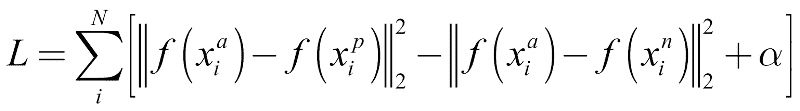

这里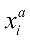是一个锚图像，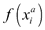是暹罗网络的输出，锚图像的嵌入。三联体损失是锚和正极之间的欧几里德距离减去锚和负极之间的欧几里德距离。一个小常数，，是正负对之间强制的边距。要达到零损耗，距离之差需要为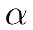。

您应该能够理解，您可以使用神经网络来预测两个项目在语义上是否相同，以便绕过大型分类问题。您可以通过一些二元分类任务来训练暹罗模型，也可以通过将输出视为嵌入并使用三元组损失来训练暹罗模型。这种洞察力不仅仅局限于面部。如果您想要比较时间序列来对事件进行分类，那么您可以使用完全相同的方法。

## 包围盒预测

很可能在某个点，你会对定位图像中的物体感兴趣。例如，假设你是一家保险公司，需要检查它承保的屋顶。让人们爬上屋顶检查它们是很昂贵的，所以另一种方法是使用卫星图像。获得图像后，你现在需要在其中找到屋顶，正如我们在下面的截图中看到的。然后，您可以裁剪出屋顶，并将屋顶图像发送给您的专家，由他们进行检查:

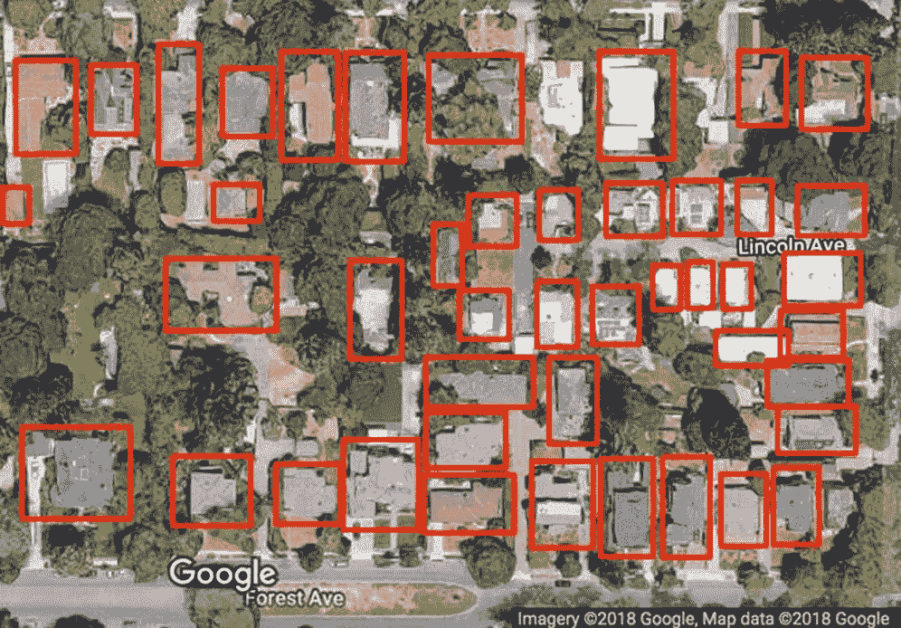

屋顶周围有边框的加州房屋

你需要的是包围盒预测。边界框预测器输出几个边界框的坐标以及对框中显示什么对象的预测。

有两种方法可以获得这样的边界框。

一个**基于区域的卷积神经网络** ( **R-CNN** )重用一个分类模型。它拍摄一幅图像，并在图像上滑动分类模型。结果是图像不同部分的许多分类。使用该特征图，区域建议网络执行回归任务以得出边界框，并且分类网络为每个边界框创建分类。

这种方法已经得到了完善，最终在任和其他人的 2016 年论文中得到体现，提供了“更快的 R-CNN:利用区域提议网络实现实时对象检测”*，但在图像上滑动分类器的基本概念仍然保持不变。*

**你只看一次** ( **YOLO** )，另一方面，使用仅由卷积层组成的单一模型。它将一个图像划分为一个网格，并为每个网格单元预测一个对象类。然后它为每个网格单元预测几个可能的包含对象的边界框。

对于每个边界框，它回归坐标、宽度和高度值，以及该边界框实际包含对象的置信度得分。然后，它消除所有置信度过低或与另一个置信度更高的边界框重叠过大的边界框。

### 注意

有关更详细的描述，请阅读雷德蒙和法尔哈迪 2016 年的论文 *YOLO9000:更好、更快、更强*，可在[https://arxiv.org/abs/1612.08242](https://arxiv.org/abs/1612.08242)获得。进一步阅读包括 2018 年的论文， *YOLOv3:增量改进*。这在[https://arxiv.org/abs/1804.027](https://arxiv.org/abs/1804.027)有售。

这两篇论文都写得很好，半开玩笑，更详细地解释了 YOLO 的概念。

YOLO 相对于 R-CNN 的主要优势是它要快得多。不必使用大型分类模型会更有效率。然而，R-CNN 的主要优势是它比 YOLO 模型更准确。如果你的任务需要实时分析，你应该使用 YOLO；然而，如果你不需要实时速度，但只是想要最好的准确性，那么使用 R-CNN 是一条路要走。

包围盒检测经常被用作许多处理步骤中的一个。在保险案例中，包围盒检测器将裁剪出所有的屋顶。然后，屋顶图像可以由人类专家进行判断，或者由一个单独的深度学习模型对受损的屋顶进行分类。当然，您可以训练一个对象定位器来直接区分受损和完好的屋顶，但在实践中，这通常不是一个好主意。

如果你有兴趣阅读更多关于这方面的内容，[第四章](ch04.html "Chapter 4. Understanding Time Series")，*理解时间序列*，有一个关于模块化的大讨论。


# 练习题

时尚 MNIST 是 MNIST 的替代者，但它不是手写数字，而是对衣服进行分类。尝试一下我们在本章中使用的关于时尚 MNIST 的技巧。他们是如何合作的？什么能产生好的结果？你可以在 https://www.kaggle.com/zalando-research/fashionmnist 的 Kaggle 上找到数据集。

接受鲸鱼识别挑战，阅读顶级内核和讨论帖子。链接可以在这里找到:【https://www.kaggle.com/c/whale-categorization-playground】T2。通过侥幸认出鲸鱼的任务类似于通过面部认出人类。有一些好的内核展示了边界框和连体网络。我们还没有涵盖解决该任务所需的所有技术工具，所以不要担心代码的细节，而是要关注所示的概念。


# 总结

在这一章中，你已经看到了计算机视觉模型的构建模块。我们已经学习了卷积层，以及 ReLU 激活和正则化方法。您还看到了许多创造性地使用神经网络的方法，例如使用连体网络和边界框预测器。

您还在一个简单的基准测试任务——MNIST 数据集上成功地实现和测试了所有这些方法。我们扩大了训练规模，使用预训练的 VGG 模型对数千张植物图像进行分类，然后使用 Keras 生成器从磁盘上动态加载图像，并定制 VGG 模型以适应我们的新任务。

我们还了解了图像增强的重要性以及在构建计算机视觉模型时的模块化权衡。许多这样的构建模块，如卷积、batchnorm 和 dropout，用于计算机视觉以外的其他领域。它们是计算机视觉应用之外的基本工具。通过在这里学习它们，你已经准备好在时间序列或生成模型中发现广泛的可能性。

计算机视觉在金融行业有许多应用，特别是在后台办公功能以及替代 alpha 世代中。这是现代机器学习的一个应用，可以转化为当今许多公司的实际价值。越来越多的公司将基于图像的数据源纳入他们的决策；你现在已经准备好正面解决这些问题了。

在本章的过程中，我们已经看到，一个成功的计算机视觉项目涉及整个管道，与处理模型相比，处理管道通常具有相似或更大的好处。

在下一章，我们将看看最具代表性和最常见的金融数据形式:时间序列。我们将使用更传统的统计方法来处理预测网络流量的任务，如**ARIMA**(T2【自回归综合移动平均的缩写)，以及基于现代神经网络的方法。您还将了解自相关和傅立叶变换的特征工程。最后，您将学习如何比较和对比不同的预测方法，并构建高质量的预测系统。