<title>Chapter 4. Understanding Time Series</title> 

# 第四章。了解时间序列

时间序列是一种具有时间维度的数据形式，也是最具代表性的金融数据形式。虽然单个股票报价不是时间序列，但是把你每天得到的报价排列起来，你就会得到一个有趣得多的时间序列。几乎所有与金融相关的媒体材料都或早或晚地显示出股价差距；不是特定时刻的价格列表，而是价格随时间的发展。

你会经常听到金融评论员讨论价格的变动:“苹果公司上涨了 5%。”但这意味着什么呢？你会很少听到绝对值，例如，“苹果公司的股票是 137.74 美元。”再说一遍，这是什么意思？这是因为市场参与者对未来的发展很感兴趣，他们试图从过去的发展中推断出这些预测:

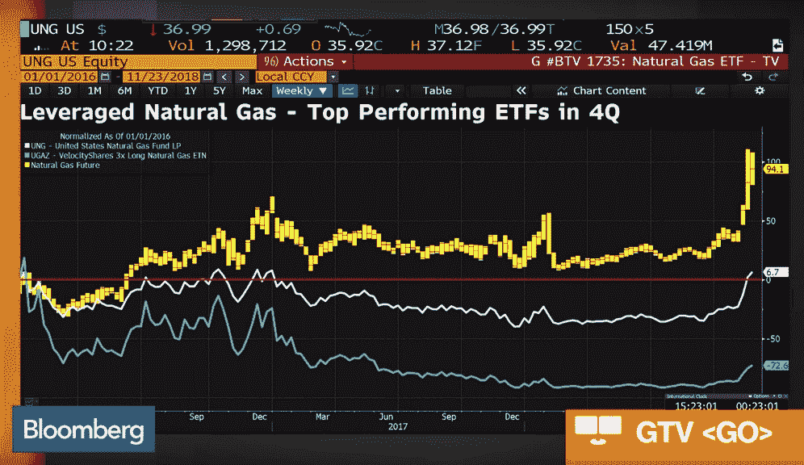

在彭博电视上看到的多个时间序列图

大部分预测都是着眼于过去一段时间的发展。时间序列数据集的概念是与预测有关的一个重要因素；例如，农民在预测作物产量时会查看时间序列数据集。正因为如此，在统计学、计量经济学和工程学领域已经发展了大量的知识和工具来处理时间序列。

在这一章中，我们将会看到一些在今天仍然非常重要的经典工具。然后我们将学习神经网络如何处理时间序列，以及深度学习模型如何表达不确定性。

在我们开始看时间序列之前，我需要设定你对这一章的期望。你们中的许多人可能已经阅读了这一章来了解股票市场预测，但是我需要警告你们，这一章不是关于股票市场预测的，这本书的其他章节也不是。

经济理论表明市场在某种程度上是有效的。有效市场假说认为所有公开的信息都包含在股票价格中。这延伸到关于如何处理信息的信息，例如预测算法。

如果这本书提出了一种可以预测股票市场价格并带来高额回报的算法，许多投资者会简单地实现这种算法。由于这些算法都会在预期价格变化时买入或卖出，它们会改变当前的价格，从而破坏了你通过使用算法获得的优势。因此，提出的算法对未来的读者不起作用。

相反，本章将使用来自维基百科的流量数据。我们的目标是预测特定维基百科页面的流量。我们可以通过`wikipediatrend` CRAN 包获得维基百科的流量数据。

我们这里要使用的数据集是谷歌提供的大约 145，000 个维基百科页面的流量数据。数据可以从 Kaggle 获得。

### 注意

数据可以在以下链接找到:[https://www . ka ggle . com/c/we B- traffic-time-series-forecasting](https://www.kaggle.com/c/web-traffic-time-series-forecasting)

[https://www . ka ggle . com/muonneutrino/Wikipedia-traffic-data-exploration](https://www.kaggle.com/muonneutrino/wikipedia-traffic-data-exploratio)

# 熊猫的可视化和准备

正如我们在[第 2 章](ch02.html "Chapter 2. Applying Machine Learning to Structured Data")、*将机器学习应用于结构化数据*中看到的，在我们开始训练之前，获得数据的概述通常是一个好主意。对于我们从 Kaggle 获得的数据，您可以通过运行以下命令来实现这一点:

```
train = pd.read_csv('../input/train_1.csv').fillna(0)

train.head()
```

运行这段代码将得到下表:

|   | 

页

 | 

2015-07-01

 | 

2015-07-02

 | 

…

 | 

2016-12-31

 |
| --- | --- | --- | --- | --- | --- |
| 0 | 2ne 1 _ zh . Wikipedia . org _ all-access _ spider | 18.0 | 11.0 | … | 20.0 |
| 一 | 2PM _ zh . Wikipedia . org _ all-access _ spider | 11.0 | 14.0 | … | 20.0 |

**页面**列中的数据包含页面名称、维基百科页面的语言、访问设备的类型和访问代理。其他列包含该页面在该日期的流量。

因此，在前面的表格中，第一行包含 2NE1 的页面，一个韩国流行乐队，在中文版维基百科上，通过所有的访问方法，但只针对分类为蜘蛛流量的代理；也就是说，流量不是来自人类。虽然大多数时间序列工作都集中在局部的、依赖于时间的特征上，但是我们可以通过提供对**全局特征**的访问来丰富我们所有的模型。

因此，我们希望将页面字符串分割成更小、更有用的功能。我们可以通过运行以下代码来实现这一点:

```
def parse_page(page):

    x = page.split('_')

    return ' '.join(x[:-3]), x[-3], x[-2], x[-1]
```

我们用下划线分割字符串。页面名称也可以包含下划线，所以我们将最后三个字段分开，然后将其余的字段连接起来，得到文章的主题。

正如我们在下面的代码中看到的，倒数第三个元素是子 URL，例如，[en.wikipedia.org](http://en.wikipedia.org)。倒数第二个元素是访问，最后一个元素是代理:

```
parse_page(train.Page[0])
```

```

Out:

('2NE1', 'zh.wikipedia.org', 'all-access', 'spider')

```

当我们将此函数应用于训练集中的每个页面条目时，我们会获得一个元组列表，然后我们可以将这些元组连接到一个新的数据帧中，如下面的代码所示:

```
l = list(train.Page.apply(parse_page))

df = pd.DataFrame(l)

df.columns = ['Subject','Sub_Page','Access','Agent']
```

最后，在删除原始页面列之前，我们必须将这个新的数据帧添加回我们的原始数据帧，这可以通过运行以下命令来实现:

```
train = pd.concat([train,df],axis=1)

del train['Page']
```

由于运行了这段代码，我们已经成功地完成了数据集的加载。这意味着我们现在可以继续探索它。

## 聚合全局特征统计

经过所有这些艰苦的工作，我们现在可以创建一些全球特征的综合统计。

pandas `value_counts()`功能让我们可以轻松绘制全局特征的分布。通过运行以下代码，我们将获得 Wikipedia 数据集的条形图输出:

```
train.Sub_Page.value_counts().plot(kind='bar')
```

运行上述代码的结果是，我们将输出一个条形图，对数据集中的记录分布进行排名:

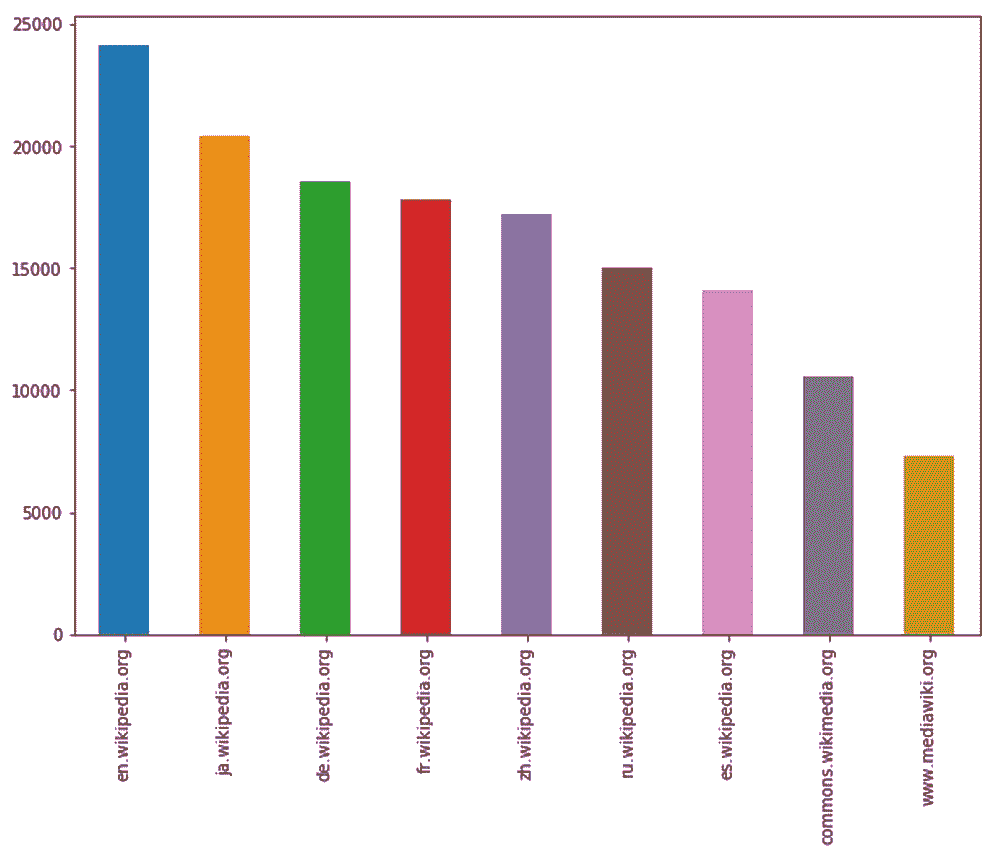

维基百科国家页面的记录分布

前面的图显示了每个子页可用的时间序列的数量。维基百科有不同语言的子页面，我们可以看到我们的数据集包含来自英语(en)、日语(ja)、德语(de)、法语(fr)、中文(zh)、俄语(ru)和西班牙语(es)维基百科站点的页面。

在我们制作的柱状图中，你可能也注意到了两个非国家的维基百科网站。commons.wikimedia.org 的[和 www.mediawiki.org 的](http://commons.wikimedia.org)[都用来存放媒体文件，比如图片。](http://www.mediawiki.org)

让我们再次运行该命令，这次重点关注访问类型:

```
train.Access.value_counts().plot(kind='bar')
```

运行此代码后，我们将看到下面的条形图作为输出:

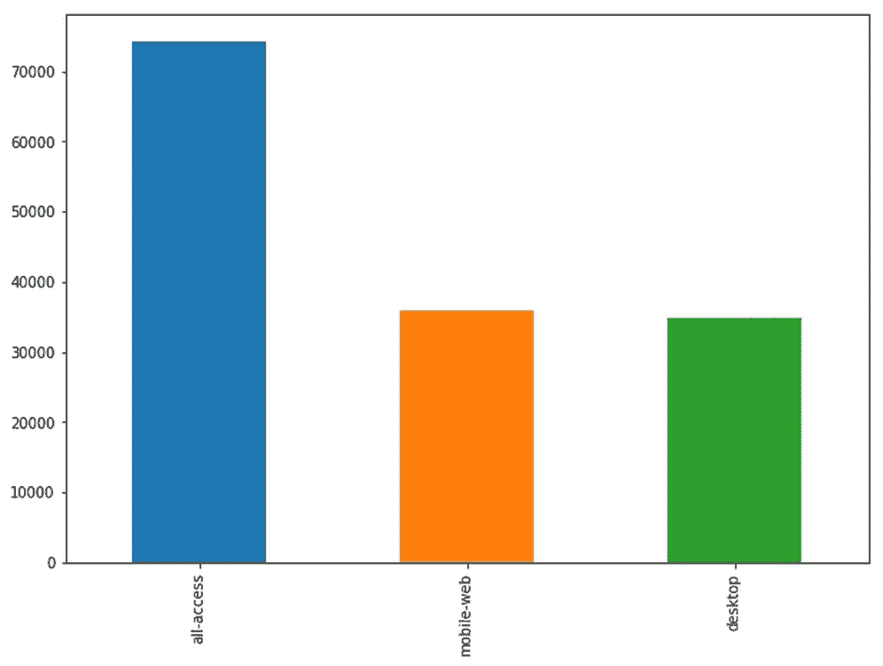

按访问类型的记录分布

有两种可能的访问方式:**移动**和**桌面**。还有第三个选项**全访问**，它结合了移动和桌面访问的统计数据。

然后，我们可以通过运行以下代码，按代理绘制记录分布图:

```
train.Agent.value_counts().plot(kind='bar')
```

运行该代码后，我们将输出下图:

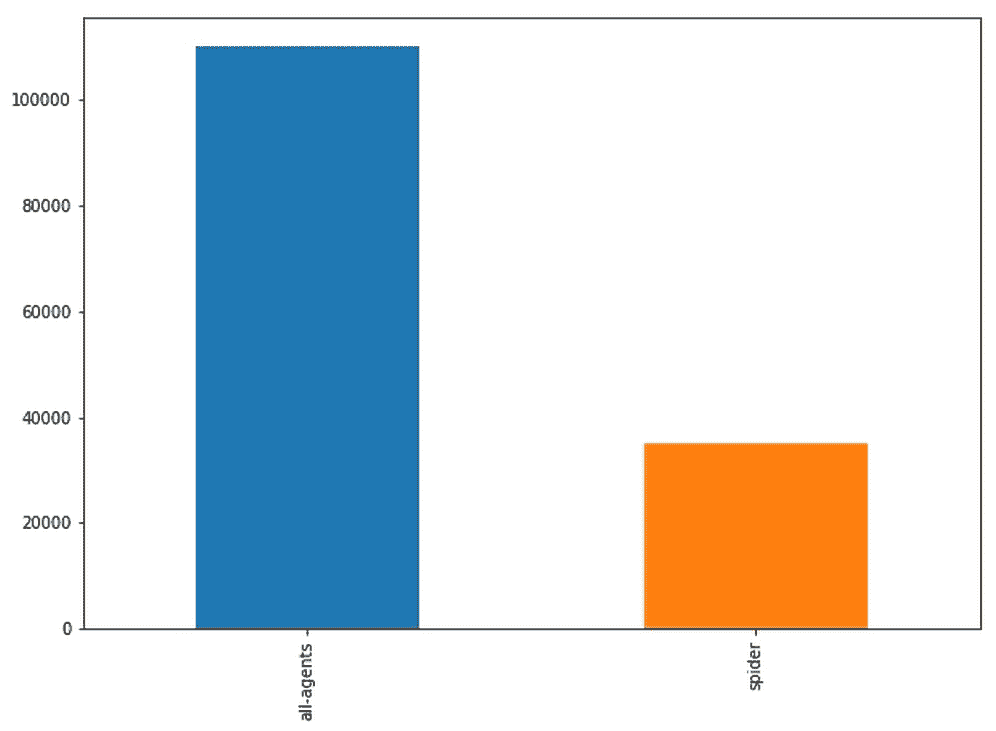

按代理分发记录

时间序列不仅适用于 spider 代理，也适用于所有其他类型的访问。在经典的统计建模中，下一步是分析这些全局特征的影响，并围绕它们建立模型。然而，如果有足够的数据和计算能力，这是不必要的。

如果是这种情况，那么神经网络能够发现全局特征本身的影响，并根据它们的相互作用创建新的特征。对于全局特性，只有两个真正需要考虑的问题:

*   **特征的分布是不是很偏？**如果是这种情况，那么可能只有几个实例拥有全局特征，并且我们的模型可能会过度适应这个全局特征。假设数据集中只有少量来自中文维基百科的文章。该算法可能会基于特征区分太多，然后使少数中文条目过拟合。我们的分布比较均匀，所以我们不用担心这个。
*   **特征容易编码吗？**有些全局特征不能一键编码。想象一下，我们得到了一篇带有时间序列的维基百科文章的全文。不可能马上使用这个特性，因为为了使用它，必须进行一些繁重的预处理。在我们的例子中，有几个相对简单的类别可以一次性编码。然而，主题名称不能一次性编码，因为它们太多了。

## 检验样本时间序列

为了检查数据集的全局特征，我们必须查看一些样本时间序列，以便了解我们可能面临的挑战。在这一部分，我们将为来自美国的音乐二人组 *Twenty One Pilots* 的英文页面绘制视图。

绘制实际页面浏览量和 10 天滚动平均值。我们可以通过运行以下代码来实现这一点:

```
idx = 39457

window = 10

data = train.iloc[idx,0:-4]

name = train.iloc[idx,-4]

days = [r for r in range(data.shape[0] )]

fig, ax = plt.subplots(figsize=(10, 7))

plt.ylabel('Views per Page')

plt.xlabel('Day')

plt.title(name)

ax.plot(days,data.values,color='grey')

ax.plot(np.convolve(data, 

                    np.ones((window,))/window, 

                    mode='valid'),color='black')

ax.set_yscale('log')
```

这段代码中有很多内容，值得一步步来看。首先，我们定义要绘制哪一行。21 个飞行员的文章是训练数据集中的第 39，457 行。在那里，我们定义滚动平均值的窗口大小。

我们使用 pandas `iloc`工具将页面视图数据和名称从整个数据集中分离出来。这允许我们通过行和列坐标来索引数据。计算天数而不是显示所有的测量日期使图表更容易阅读，因此我们将为 *X* 轴创建一个日计数器。

接下来，我们设置绘图，并通过设置`figsize`确保它具有期望的大小。我们还定义了轴标签和标题。接下来，我们绘制实际的页面视图。我们的 *X* 坐标是日， *Y* 坐标是浏览量。

为了计算平均值，我们将使用一个**卷积**运算，当我们在[第 3 章](ch03.html "Chapter 3. Utilizing Computer Vision")、*中利用计算机视觉*研究卷积时，您可能会很熟悉这个运算。这个卷积操作创建一个除以窗口大小的向量，在本例中是 10。卷积运算在页面视图上滑动向量，将 10 个页面视图乘以 1/10，然后将得到的向量相加。这创建了一个窗口大小为 10 的滚动平均值。我们用黑色标出这个意思。最后，我们指定我们希望对 *Y* 轴使用对数刻度:

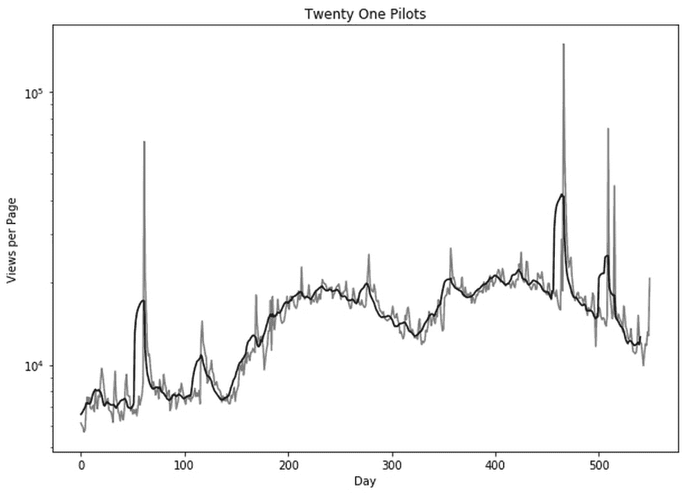

二十一个试点维基百科页面的滚动访问统计数据

您可以看到，在我们刚刚生成的 21 个飞行员图表中有一些相当大的峰值，尽管我们使用了对数轴。有些日子，浏览量飙升至几天前的 10 倍。正因为如此，一个好的模型必须能够应对如此极端的峰值，这一点很快就变得清晰起来。

在我们继续之前，值得指出的是，也可以清楚地看到全球趋势，因为页面浏览量通常会随着时间的推移而增加。

为了更好地衡量，让我们画出对所有语言的 21 个试点的兴趣。我们可以通过运行以下代码来实现这一点:

```
fig, ax = plt.subplots(figsize=(10, 7))

plt.ylabel('Views per Page')

plt.xlabel('Day')

plt.title('Twenty One Pilots Popularity')

ax.set_yscale('log')

for country in ['de','en','es','fr','ru']:

    idx= np.where((train['Subject'] == 'Twenty One Pilots') 

                  & (train['Sub_Page'] == '{}.wikipedia.org'.format(country)) & (train['Access'] == 'all-access') & (train['Agent'] == 'all-agents'))

    idx=idx[0][0]

    data = train.iloc[idx,0:-4]

    handle = ax.plot(days,data.values,label=country)

ax.legend()
```

在这个代码片段中，我们首先像以前一样设置图表。然后，我们循环语言代码，找到 21 个导频的索引。索引是一个包装在元组中的数组，所以我们必须提取指定实际索引的整数。然后，我们从训练数据集中提取页面视图数据，并绘制页面视图。

在下图中，我们可以查看刚刚生成的代码的输出:

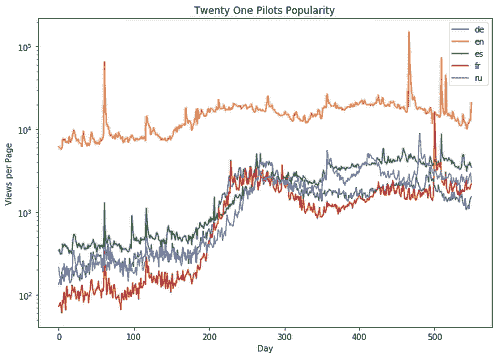

按国家列出的 21 个试点项目的访问统计数据

时间序列之间显然有某种关联。不出所料，维基百科的英文版(最上面一行)是最受欢迎的。我们还可以看到，数据集中的时间序列显然不是静止的；它们随时间改变均值和标准差。

平稳过程是其无条件联合概率分布随时间保持不变的过程。换句话说，像系列平均值或标准差这样的东西应该保持不变。

然而，正如您所看到的，在上图中的第 200-250 天之间，页面上的平均浏览量发生了巨大的变化。这个结果破坏了许多经典建模方法做出的一些假设。然而，金融时间序列很难是平稳的，因此处理这些问题是值得的。通过解决这些问题，我们熟悉了一些有用的工具，可以帮助我们处理非平稳性。

<title><meta content="DocBook XSL Stylesheets V1.75.2" name="generator"/> <meta content="urn:uuid:ee7bbf81-ee0c-427b-9574-49bd7094315d" name="Adept.expected.resource"/></head><body id="page"><div><div><div><div><h1 class="title"></h1></div></div></div><div><div><div><div><h2 class="title">不同种类的平稳性</h2></div></div></div><p>平稳性可以有不同的含义，理解手头的任务需要哪种平稳性是至关重要的。为简单起见，这里我们只看两种平稳性:均值平稳性和方差平稳性。下图显示了具有不同程度(非)平稳性的四个时间序列:</p><div>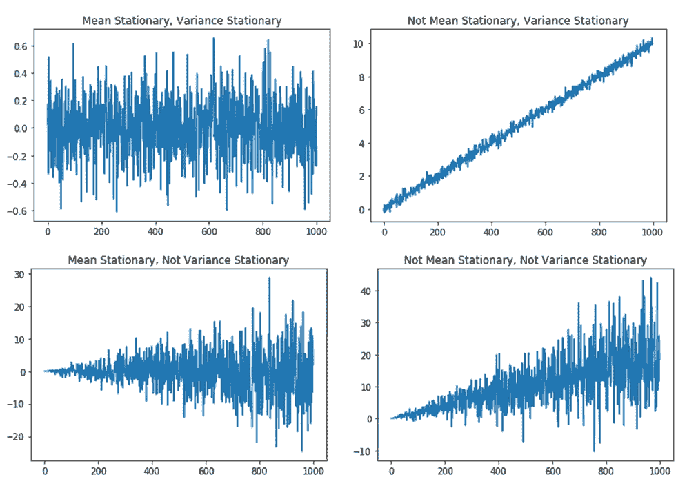</div><p>平均平稳性是指一个数列的水平不变。当然，在这里，个别数据点可能会出现偏差，但长期均值应该是稳定的。方差平稳性是指均值的方差不变。同样，可能有异常值和短序列的方差似乎更高，但总体方差应该在同一水平。第三种平稳性是协方差平稳性，这种平稳性很难用形象化，这里没有显示。这是指不同滞后之间的协方差是恒定的。当人们提到协方差平稳性时，他们通常指均值、方差和协方差是平稳的特殊情况。许多计量经济学模型，尤其是在风险管理中，都是在这种协方差平稳假设下运行的。</p></div><div><div><div><div><h2 class="title">为什么稳定性很重要</h2></div></div></div><p>许多经典的计量经济学方法都假定了某种形式的平稳性。一个关键的原因是，当时间序列稳定时，推断和假设检验效果更好。然而，即使从纯预测的角度来看，平稳性也是有帮助的，因为它从我们的模型中带走了一些工作。看看前面图表中的<strong>不代表静止的</strong>系列。你可以看到预测数列的一个主要部分是认识到数列向上移动的事实。如果我们能够在模型之外捕捉到这一事实，那么模型需要学习的就更少，并且可以将其能力用于其他目的。另一个原因是，它使我们输入模型的值保持在相同的范围内。请记住，在使用神经网络之前，我们需要标准化数据。如果股票价格从 1 美元涨到 1000 美元，我们最终会得到非标准化的数据，这反过来会使训练变得困难。</p></div><div><div><div><div><h2 class="title">使时间序列平稳</h2></div></div></div><p>实现金融数据(尤其是价格)平均平稳性的标准方法叫做差分法。它指的是计算价格的回报。在下图中，您可以看到 S & P 500 的原始版本和差异版本。随着值的增长，原始版本并不平均稳定，但是差分版本大致稳定。</p><div>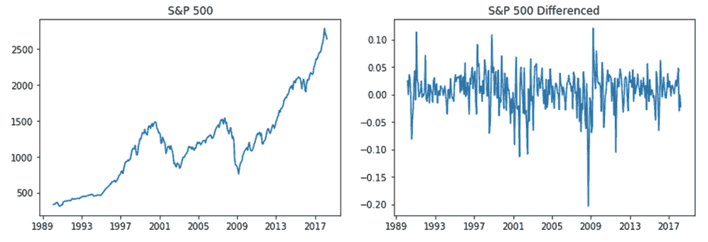</div><p>平均平稳性的另一种方法是基于线性回归。这里，我们用线性模型来拟合数据。这种经典建模的流行库是<code class="literal">statsmodels</code>，它有一个内置的线性回归模型。以下示例显示了如何使用<code class="literal">statsmodels</code>从数据中删除线性趋势:</p><div><pre class="programlisting">time = np.linspace(0,10,1000) series = time series = series + np.random.randn(1000) *0.2 mdl = sm.OLS(time, series).fit() trend = mdl.predict(time)</pre></div><div>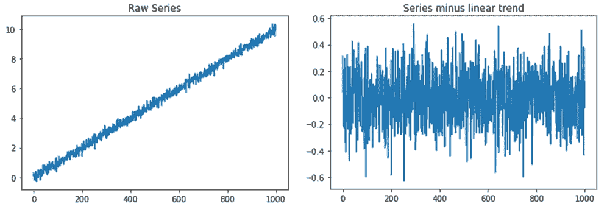</div><p>值得强调的是<strong>平稳性是建模的一部分，应该仅适用于训练集</strong>。对于差分来说，这不是一个大问题，但是对于线性去趋势来说，这可能会导致问题。</p><p>消除方差非平稳性更难。一种典型的方法是计算一些滚动方差，并用该方差除以新值。在训练集上，你也可以<strong>学生化</strong>数据。为此，您需要计算每日方差，然后将所有值除以它的根。同样，您只能在训练集上这样做，因为方差计算要求您已经知道这些值。</p></div><div><div><div><div><h2 class="title">何时忽略平稳性问题</h2></div></div></div><p>有些时候你不应该担心平稳性。例如，当预测一个突然的变化，所谓的结构性突变时。在 Wikipedia 的例子中，我们感兴趣的是知道站点何时开始比以前更频繁地被访问。在这种情况下，消除水平差异会阻止我们的模型学习预测这种变化。同样，我们也许能够很容易地将非平稳性合并到我们的模型中，或者可以在管道的稍后阶段确保这一点。我们通常只在整个数据集的一小部分序列上训练神经网络。如果我们将每个子序列的标准化，那么子序列中均值的变化可能可以忽略不计，我们也不必担心。预测是一项比推理和假设检验更宽容的任务，所以如果我们的模型能够发现一些非平稳性，我们可能会侥幸逃脱。</p></div></div></body></html> <html><head><title>Fast Fourier transformations</title> 

# 快速傅立叶变换

另一个我们经常想要计算的关于时间序列的有趣统计是傅立叶变换(FT)。无需深入数学，傅立叶变换将向我们展示一个函数在特定频率内的振荡量。

你可以把它想象成一个老式调频收音机的调谐器。当你转动调谐器时，你搜索不同的频率。每隔一段时间，你会找到一个频率，给你一个特定的无线电台清晰的信号。傅立叶变换基本上扫描整个频谱，并记录在哪些频率有强信号。就时间序列而言，这在试图寻找数据中的周期性模式时非常有用。

想象一下，我们发现每周一次的频率给了我们一个很强的模式。这意味着关于一周前同一天的流量的知识将有助于我们的模型。

当函数和傅立叶变换都是离散的时，这是一系列日常测量的情况，它被称为**离散傅立叶变换** ( **DFT** )。一种用于计算 DFT 的非常快速的算法被称为**快速傅立叶变换** ( **FFT** )，它今天已经成为科学计算中的一种重要算法。这个理论是数学家卡尔·高斯在 1805 年发现的，但最近才被美国数学家詹姆斯·w·库利和约翰·图基在 1965 年发现。

讨论傅立叶变换如何工作以及为什么工作超出了本章的范围，所以在这一节我们将只给出一个简要的介绍。想象我们的功能是一根电线。我们将这根导线缠绕在一个点上，如果缠绕导线时，绕该点的圈数与信号频率相匹配，则所有信号峰值都在极点的一侧。这意味着线的重心，会从我们缠绕线的点移开。

在数学中，将一个函数环绕一个点可以通过将函数 *g* ( *n* )乘以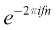来实现，其中 *f* 是环绕的次数， *n* 是数列中该项的个数， *i* 是-1 的虚平方根。不熟悉虚数的读者可以把它们想象成坐标，其中每个数字都有一个由实数和虚数组成的二维坐标。

为了计算质心，我们对离散函数中的点的坐标进行平均。因此，DFT 公式如下:

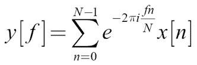

这里 *y* [ *f* 是变换后的序列中的第 *f* 个元素， *x* [ *n* 是输入序列的第 *n* 个元素， *x* 。 *N* 是输入序列中的总点数。请注意， *y* [ *f* ]将是一个包含实数和离散元素的数字。

为了检测频率，我们只对 *y* [ *f* ]的整体幅度感兴趣。为了得到这个数值，我们需要计算虚部和实部的平方和的根。在 Python 中，我们不必担心所有的数学问题，因为我们可以使用`scikit-learn's fftpack`，它有一个内置的 FFT 函数。

下一步是运行以下代码:

```
data = train.iloc[:,0:-4]

fft_complex = fft(data)

fft_mag = [np.sqrt(np.real(x)*np.real(x)+np.imag(x)*np.imag(x)) for x in fft_complex]
```

这里，我们首先从我们的训练集中提取没有全局特征的时间序列测量值。然后我们运行 FFT 算法，最后计算变换的幅度。

运行该代码后，我们现在有了所有时间序列数据集的傅立叶变换。为了让我们更好地了解傅立叶变换的一般行为，我们可以通过简单地运行以下命令来对它们进行平均:

```
arr = np.array(fft_mag)

fft_mean = np.mean(arr,axis=0)
```

在计算平均值之前，首先将量值转换成一个 NumPy 数组。我们想要计算每个频率的平均值，而不仅仅是所有幅度的平均值，因此我们需要指定取平均值的`axis`。

在这种情况下，序列是按行堆叠的，因此取列方向(零轴)的平均值将得到频率方向的平均值。为了更好地绘制转换图，我们需要创建一个测试频率列表。频率的形式为:每天的数据集中的天/所有天，因此 1/550、2/550、3/550 等等。要创建列表，我们需要运行:

```
fft_xvals = [day / fft_mean.shape[0] for day in range(fft_mean.shape[0])]
```

在这个可视化中，我们只关心周范围内的频率范围，因此我们将删除转换的后半部分，我们可以通过运行:

```
npts = len(fft_xvals) // 2 + 1

fft_mean = fft_mean[:npts]

fft_xvals = fft_xvals[:npts]
```

最后，我们可以规划我们的转变:

```
fig, ax = plt.subplots(figsize=(10, 7))

ax.plot(fft_xvals[1:],fft_mean[1:])

plt.axvline(x=1./7,color='red',alpha=0.3)

plt.axvline(x=2./7,color='red',alpha=0.3)

plt.axvline(x=3./7,color='red',alpha=0.3)
```

在绘制转换图时，我们将成功地生成一个类似于您在此处看到的图表:


维基百科访问统计的傅立叶变换。用垂直线标记的尖峰

正如您在我们制作的图表中看到的，大约在 1/7 (0.14)、2/7 (0.28)和 3/7 (0.42)处有峰值。因为一周有七天，所以频率是每周一次、每周两次和每周三次。换句话说，页面统计数据(大约)每周重复一次，例如，某个星期六的访问与前一个星期六的访问相关。

<title>Autocorrelation</title> 

# 自相关

自相关是由给定间隔分开的序列的两个元素之间的相关性。例如，直觉上，我们会假设关于上一时间步的知识有助于我们预测下一步。但是 2 个时间步前或 100 个时间步前的知识呢？

运行`autocorrelation_plot`将绘制具有不同滞后时间的元素之间的相关性，可以帮助我们回答这些问题。事实上，pandas 附带了一个方便的自相关绘图工具。要使用它，我们必须传递一系列数据。在我们的例子中，我们传递随机选择的一个页面的浏览量。

我们可以通过运行以下代码来实现这一点:

```
from pandas.plotting import autocorrelation_plot

autocorrelation_plot(data.iloc[110])

plt.title(' '.join(train.loc[110,['Subject', 'Sub_Page']]))
```

这将为我们呈现以下图表:

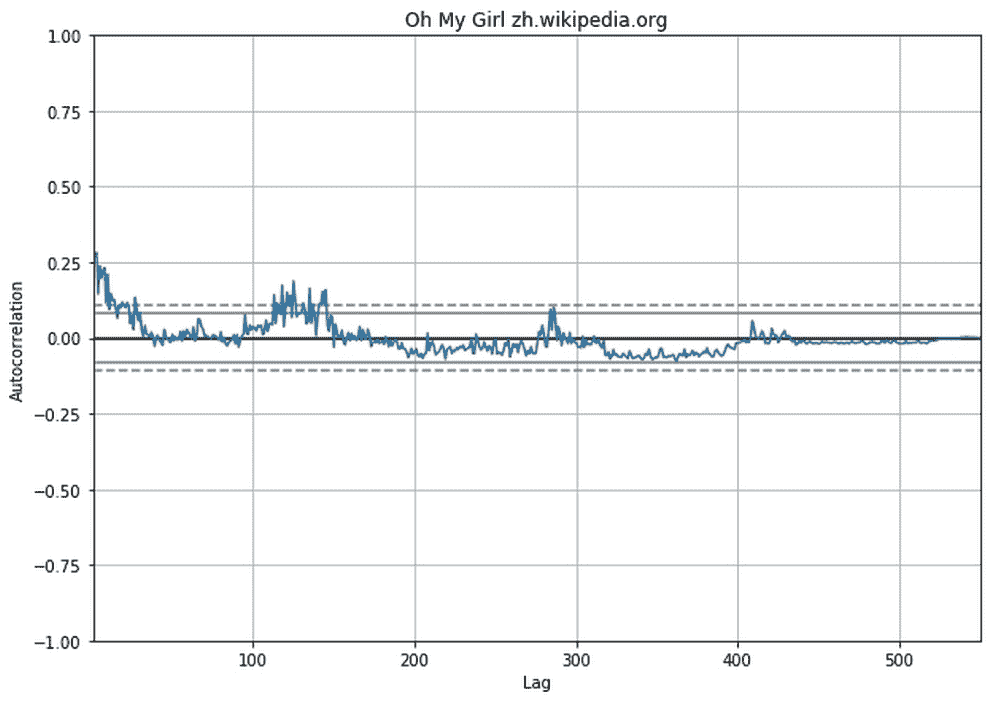

哦，我的女孩中文维基百科页面的自相关性

上图显示了韩国女子组合 *Oh My Girl* 的维基百科页面在中文维基百科中的浏览量相关性。

您可以看到，1 到 20 天之间的较短时间间隔比较长时间间隔显示出更高的自相关性。同样也有奇怪的峰值，比如 120 天和 280 天左右。年度、季度或月度事件可能会导致访问维基百科页面 *Oh My Girl* 的频率增加。

我们可以通过绘制 1000 个自相关图来研究这些频率的一般模式。为此，我们运行以下代码:

```
a = np.random.choice(data.shape[0],1000)

for i in a:

    autocorrelation_plot(data.iloc[i])

plt.title('1K Autocorrelations')
```

这段代码片段首先从 0 到数据集中的系列数之间抽取 1000 个随机数，在我们的例子中大约是 145000。我们使用这些作为索引，从数据集中随机抽取行，然后绘制自相关图，如下图所示:

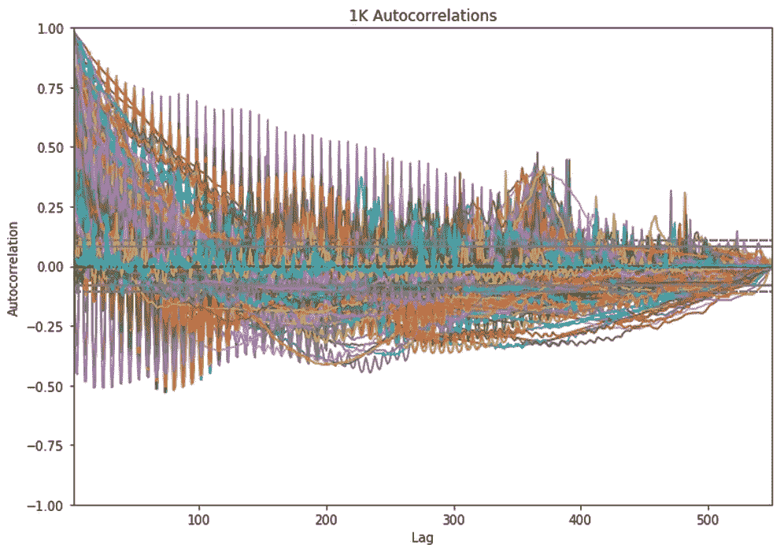

1000 个维基百科页面的自动关联

正如你所看到的，不同系列的自相关性会有很大不同，而且图表中有很多噪声。在 350 天左右，似乎还有一个更高相关性的总体趋势。

因此，将年度滞后页面浏览量作为一个时间相关特征以及一年时间间隔的自相关性作为一个全局特征是有意义的。季度和半年的滞后也是如此，因为它们似乎有很高的自相关性，或者有时是非常负的自相关性，这使得它们也很有价值。

时间序列分析，比如前面的例子，可以帮助我们设计模型的特征。理论上，复杂的神经网络可以自己发现所有这些特征。然而，帮助他们一点通常容易得多，尤其是关于长时间的信息。

<title>Establishing a training and testing regime</title> 

# 建立培训和测试制度

即使有大量的数据可用，我们不得不问自己；我们要如何在*训练*、*验证*和*测试*之间分割数据。这个数据集已经附带了一个未来数据的测试集，因此我们不必担心测试集，但是对于验证集，有两种拆分方式:向前移动拆分和并排拆分:

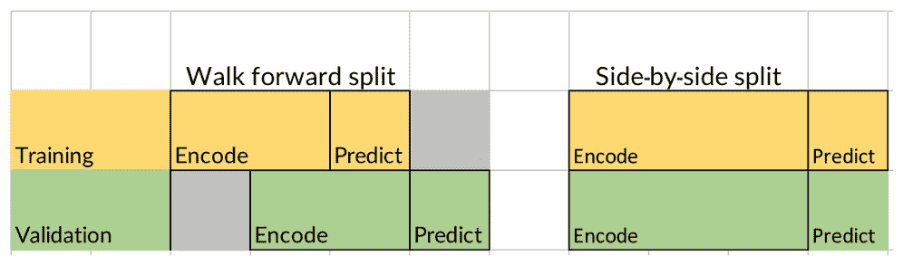

可能的测试制度

在步行训练中，我们对所有 145，000 系列进行训练。为了验证，我们将使用所有系列中的最新数据。在并排拆分中，我们对一些序列进行采样以进行训练，并使用其余的序列进行验证。

两者各有利弊。向前分裂的缺点是我们不能使用所有的序列观测值进行预测。并排拆分的缺点是不能用所有系列进行训练。

如果我们只有几个系列，但每个系列有多个数据观测值，则最好采用逐步拆分。然而，如果我们有很多系列，但每个系列的观察值很少，那么并排分割是更可取的。

建立一个培训和测试机制也能更好地解决手头的预测问题。在并排拆分中，模型可能会过度适应预测期间的全局事件。想象一下，在并排拆分中使用的预测期内，维基百科宕机了一周。这个事件会减少所有页面的视图数量，结果模型会过度适应这个全局事件。

我们不会在我们的验证集中捕捉过度拟合，因为预测期也会受到全球事件的影响。然而，在我们的例子中，我们有多个时间序列，但是每个序列只有大约 550 个观察值。因此，在那段时间里，似乎没有全球性的事件会对维基百科的所有页面产生重大影响。

然而，有一些全球性的事件影响了一些网页的浏览，比如冬奥会。然而，在这种情况下，这是一个合理的风险，因为受此类全局事件影响的页面数量仍然很少。因为我们有大量的系列，而每个系列只有少量的观察值，所以在我们的情况下，并排分割更可行。

在这一章中，我们将重点关注 50 天的交通预测。因此，在分割训练和验证集之前，我们必须首先将每个系列的最后 50 天与其余部分分割开来，如下面的代码所示:

```
from sklearn.model_selection import train_test_split

X = data.iloc[:,:500]

y = data.iloc[:,500:]

X_train, X_val, y_train, y_val = train_test_split(X.values, y.values, test_size=0.1, random_state=42)
```

当分割时，我们使用`X.values`只获取数据，而不是包含数据的数据帧。拆分后，我们剩下 130，556 个系列用于训练，14，507 个用于验证。

在本例中，我们将使用**平均绝对百分比误差** ( **MAPE** )作为损失和评估指标。如果`y`的真值为零，MAPE 会导致被零除错误。因此，为了防止被零除，我们将使用一个小值ε:

```
def mape(y_true,y_pred):

    eps = 1

    err = np.mean(np.abs((y_true - y_pred) / (y_true + eps))) * 100

    return err
```

<title>A note on backtesting</title> 

# 关于回溯测试的说明

在系统投资和算法交易中，选择训练和测试集的特性尤其重要。测试交易算法的主要方法是一个叫做**回溯测试**的过程。

回溯测试是指我们对某个时间段的数据进行算法训练，然后对*更老的*数据进行性能测试。例如，我们可以对 2015 年至 2018 年的数据进行训练，然后对 1990 年至 2015 年的数据进行测试。通过这样做，不仅测试了模型的准确性，而且回测算法执行虚拟交易，因此可以评估其盈利能力。进行回溯测试是因为有大量过去的数据可用。

综上所述，回溯测试确实存在一些偏见。让我们来看看我们需要注意的四个最重要的偏见:

*   **前瞻偏差**:如果未来数据意外包含在模拟的某一点上，而该点上的数据还不可用，则引入前瞻偏差。这可能是由模拟器中的技术错误引起的，但也可能是由参数计算引起的。例如，如果一种策略利用了两种证券之间的相关性，并且这种相关性只计算一次，那么就引入了前瞻偏差。最大值或最小值的计算也是如此。
*   **存活偏差**:如果只有在测试时仍然存在的股票被包括在模拟中，则会引入这种偏差。例如，考虑一下 2008 年的金融危机，其中许多公司破产。在 2018 年构建模拟器时，将这些公司的股票排除在外将会引入生存偏差。毕竟，该算法本可以在 2008 年投资这些股票。
*   心理承受偏差:在回溯测试中看起来不错的东西在现实生活中可能不一定是好的。考虑一个算法，它在回溯测试中全部赚回来之前，连续亏损了四个月。我们可能对这个算法感到满意。然而，如果算法在现实生活中连续四个月亏损，我们不知道它是否能赚回这笔钱，那么我们是按兵不动还是拔掉插头？在回溯测试中，我们知道最终结果，但在现实生活中，我们不知道。
*   **过拟合**:这是所有机器学习算法都存在的问题，但在回测中，过拟合是一个持久且阴险的问题。不仅算法可能过度拟合，而且算法的设计者也可能使用过去的知识，构建一个过度拟合的算法。事后来看，挑选股票很容易，知识可以被整合到模型中，然后在回溯测试中看起来很棒。虽然这可能很微妙，例如依赖于在过去保持良好的某些相关性，但很容易在回溯测试中评估的模型中建立偏差。

建立良好的测试机制是任何量化投资公司或任何专注于预测的人的核心活动。除了回溯测试之外，测试算法的一个流行策略是测试数据上的模型，这些数据在统计上类似于股票数据，但因为是生成的而不同。我们可能会为看起来像真实股票数据但不是真实的数据构建一个生成器，从而避免真实市场事件的知识渗入我们的模型。

另一种选择是静默部署模型，并在将来测试它们。该算法运行，但只执行虚拟交易，因此，如果事情出错，不会有金钱损失。这种方法利用未来的数据而不是过去的数据。然而，这种方法的缺点是，我们必须等待相当长的时间才能使用该算法。

在实践中，使用了一种混合制度。统计学家仔细设计制度，以观察算法对不同模拟的反应。在我们的网络流量预测模型中，我们将简单地在不同的页面上进行验证，然后最终在未来的数据上进行测试。

<title>Median forecasting</title> 

# 中位数预测

中位数是一个很好的健全性检查和一个经常被低估的预测工具。中位数是将分布的上半部分与下半部分分开的值；它正好位于分布的中间。中位数具有去除噪声的优势，加上它们比平均值更不容易受到异常值的影响，并且它们捕捉分布中点的方式意味着它们也易于计算。

为了进行预测，我们在训练数据的回顾窗口中计算中位数。在这种情况下，我们使用的窗口大小为 50，但是您可以尝试使用其他值。下一步是从我们的 *X* 值中选择最后 50 个值，并计算中间值。

请注意，在 NumPy median 函数中，我们必须设置`keepdims=True`。这确保了我们保持一个二维矩阵而不是平面阵列，这在计算误差时很重要。因此，要进行预测，我们需要运行以下代码:

```
lookback = 50

lb_data = X_train[:,-lookback:]

med = np.median(lb_data,axis=1,keepdims=True)

err = mape(y_train,med)
```

返回的输出显示我们获得了大约 68.1%的误差；考虑到我们方法的简单性，还不错。为了了解中间值是如何工作的，让我们绘制出 *X* 值、真实的 *y* 值以及随机页面的预测值:

```
idx = 15000

fig, ax = plt.subplots(figsize=(10, 7))

ax.plot(np.arange(500),X_train[idx], label='X')

ax.plot(np.arange(500,550),y_train[idx],label='True')

ax.plot(np.arange(500,550),np.repeat(med[idx],50),label='Forecast')

plt.title(' '.join(train.loc[idx,['Subject', 'Sub_Page']]))

ax.legend()

ax.set_yscale('log')
```

如您所见，我们的绘图包括绘制三个图。对于每个图，我们必须指定该图的 *X* 和 *Y* 值。对于`X_train`,*X*的值范围为 0 到 500，对于`y_train`和预测值范围为 500 到 550。然后，我们从训练数据中选择想要绘制的系列。因为我们只有一个中值，所以我们将所需系列的中值预测重复 50 次，以得出我们的预测。

这里可以看到输出:

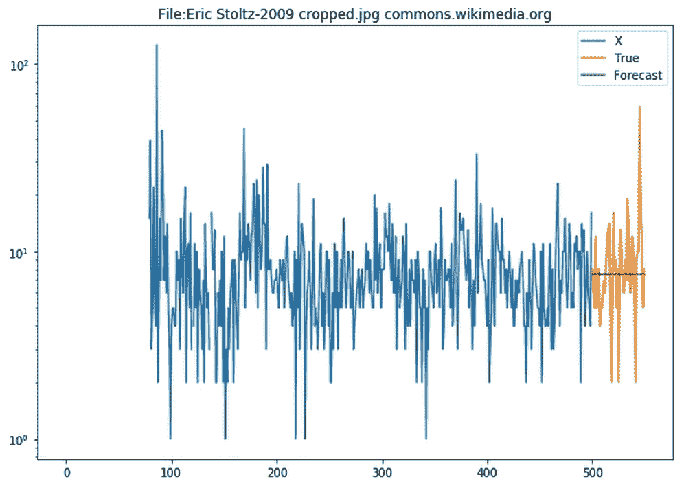

图像文件访问的预测值和实际值的中值。真实值在图的右侧，中值预测是它们中间的水平线。

正如您在前面的输出中值预测中所看到的，该页面的数据，在这种情况下，是美国演员艾瑞克·斯托罗兹的图像，非常嘈杂，而中值可以消除所有噪声。对于不常访问的页面和没有明确趋势或模式的页面，中间值特别有用。

这并不是你对中间值所能做的一切。除了我们刚刚提到的，你可以，例如，在周末使用不同的中间值，或者使用多个回顾期的中间值。一个简单的工具，如中位数预测，能够通过智能特征工程提供良好的结果。因此，在使用更高级的方法之前，花一点时间实现中位数预测作为基线并执行健全性检查是有意义的。

<title>ARIMA</title> 

# ARIMA

在前面的探索性数据分析一节中，我们谈到了在预测时间序列时，季节性和平稳性是多么重要的因素。事实上，中位数预测在这两方面都有问题。如果时间序列的平均值持续变化，那么中值预测将不会继续趋势，如果时间序列显示出周期性行为，那么中值将不会继续周期。

**ARIMA** 代表**自回归综合移动平均线**，由三个核心组成:

*   **自回归**:模型使用一个值和一些滞后观察值之间的关系。
*   **综合**:模型利用原始观测值之间的差异使时间序列平稳。持续上升的时间序列将具有平坦的积分，因为点之间的差总是相同的。
*   **移动平均**:模型使用移动平均的残差。

我们必须手动指定我们想要包含多少滞后观测值， *p* ，我们想要多久区分一次系列， *d* ，以及移动平均窗口应该有多大， *q* 。然后，ARIMA 对所有包含的滞后观测值和差分序列的移动平均残差进行线性回归。

我们可以将 Python 中的 ARIMA 与`statsmodels`一起使用，这是一个包含许多有用的统计工具的库。为此，我们只需运行以下命令:

```
from statsmodels.tsa.arima_model import ARIMA
```

然后，为了创建一个新的 ARIMA 模型，我们传递我们想要拟合的数据，在这种情况下，来自我们之前的中文维基百科中 2NE1 的视图示例，以及按顺序传递的 *p* 、 *d、*和 *q、*的期望值。在这种情况下，我们希望包括五个滞后观察值，微分一次，并取五个移动平均窗口。在代码中，结果如下:

```
model = ARIMA(X_train[0], order=(5,1,5))
```

然后，我们可以使用`model.fit()`来拟合模型:

```
model = model.fit()
```

此时运行`model.summary()`将输出所有系数以及统计分析的显著性值。然而，我们 T30 更感兴趣的是我们的模型在预测方面的表现。因此，要完成这项工作，并查看输出，我们只需运行:

```
residuals = pd.DataFrame(model.resid)

ax.plot(residuals)

plt.title('ARIMA residuals for 2NE1 pageviews')
```

运行前面的代码后，我们将能够输出 2NE1 页面浏览量的结果，如下图所示:

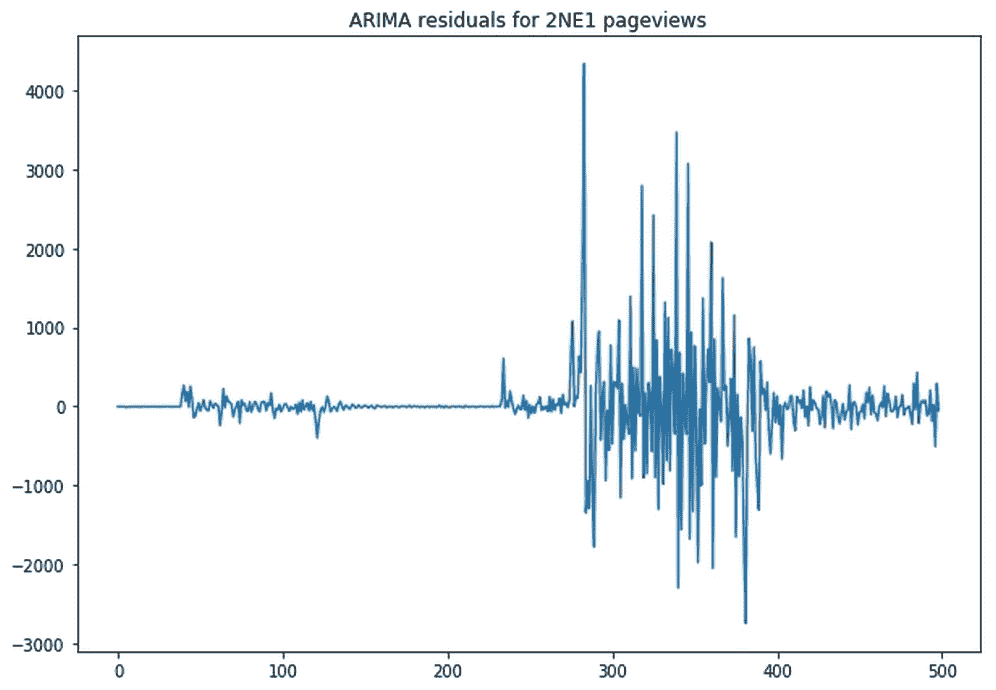

ARIMA 预报的残差

在前面的图表中，我们可以看到模型在开始时做得很好，但是在 300 天左右真正开始挣扎。这可能是因为页面浏览量更难预测，或者是因为这一时期的波动性更大。

为了确保我们的模型不偏斜，我们需要检查残差的分布。我们可以通过绘制*核密度估计器*来做到这一点，这是一种数学方法，旨在估计分布而无需建模。

我们可以通过运行以下代码来实现这一点:

```
residuals.plot(kind='kde',figsize=(10,7),title='ARIMA residual distribution 2NE1 ARIMA',legend = False)
```

该代码将输出下图:

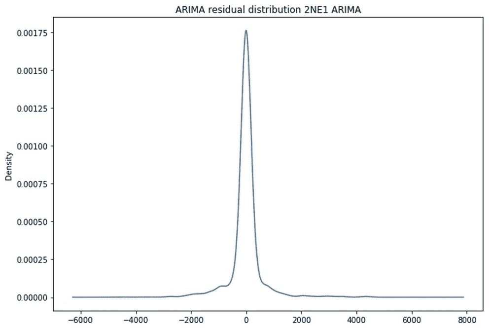

ARIMA 预报的近似正态分布残差

如您所见，我们的模型粗略地表示了一个均值为零的高斯分布。所以，在这方面一切都很好，但问题来了，“我们如何做预测？”

为了使用这个模型进行预测，我们所要做的就是指定我们想要预测的天数，这可以通过下面的代码来实现:

```
predictions, stderr, conf_int = model.forecast(50)
```

这个预测不仅给出了我们的预测，还给出标准误差和置信区间，默认情况下是 95%。

让我们对照真实视图绘制投影视图，看看我们做得如何。这个图表显示了过去 20 天我们的预测基础以及保持可读性的预测。为此，我们必须执行以下代码:

```
fig, ax = plt.subplots(figsize=(10, 7))

ax.plot(np.arange(480,500),basis[480:], label='X')

ax.plot(np.arange(500,550),y_train[0], label='True')

ax.plot(np.arange(500,550),predictions, label='Forecast')

plt.title('2NE1 ARIMA forecasts')

ax.legend()

ax.set_yscale('log')
```

该代码将输出下图:

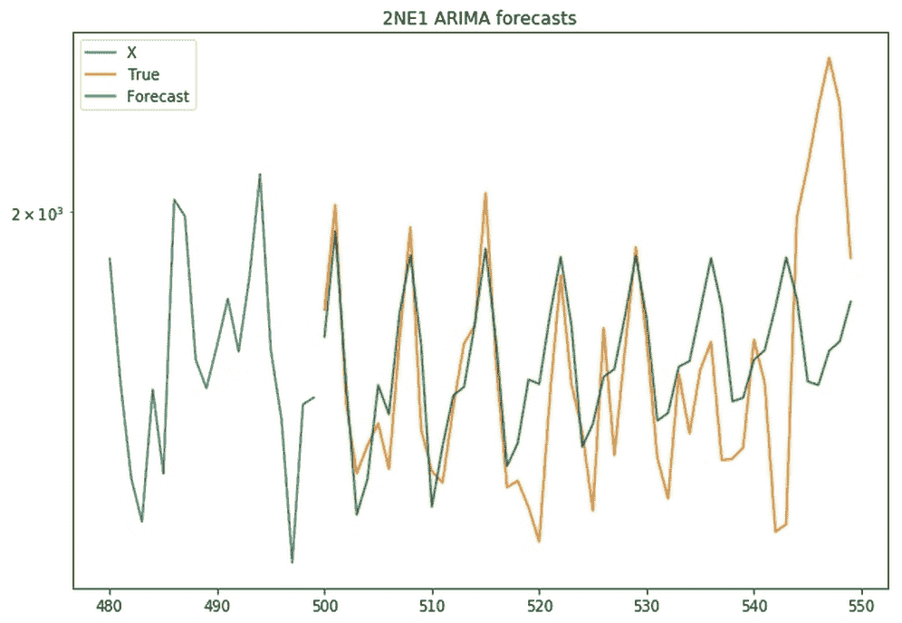

ARIMA 预测和实际访问

你可以看到 ARIMA 很好地抓住了这个系列的周期性。它的预测在接近尾声时确实偏离了一点，但在开始时，它做得非常出色。

<title>Kalman filters</title> 

# 卡尔曼滤波器

卡尔曼滤波器是一种从有噪声或不完整的测量中提取信号的方法。它们是由匈牙利出生的美国工程师鲁道夫·埃米尔·卡尔曼发明的，用于电气工程目的，并于 20 世纪 60 年代首次用于阿波罗太空计划。

卡尔曼滤波器背后的基本思想是，系统中有一些隐藏的状态，我们不能直接观察到，但我们可以获得噪声测量值。假设你想测量火箭发动机内部的温度。你不能把测量装置直接放在发动机里，因为它太热了，但是你可以把测量装置放在发动机外面。

自然，这种测量不会是完美的，因为有许多外部因素发生在发动机之外，使测量有噪声。因此，要估计火箭内部的温度，你需要一个可以处理噪音的方法。我们可以把页面预测中的内部状态想象成对某个页面的实际兴趣，而这个页面的浏览量只是一个嘈杂的度量。

这里的想法是，在时间 *k* 的内部状态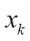是一个状态转移矩阵， *A，*乘以先前的内部状态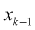，加上一些过程噪声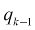。对 2NE1 的维基百科页面的兴趣如何发展在某种程度上是随机的。假设随机性遵循均值为零且方差为 *Q* 的高斯正态分布:

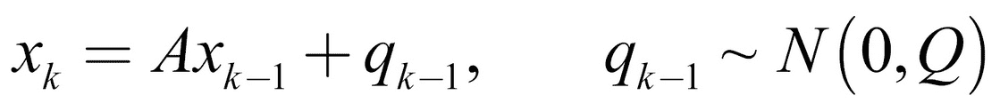

在时间*k*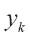获得的测量值是一个观察模型 *H* ，描述状态如何转化为测量值乘以状态，加上一些观察噪声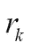。假设观测噪声遵循均值为零且方差为 *R* 的高斯正态分布:

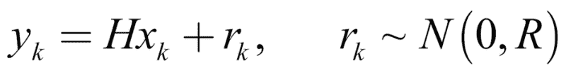

粗略地说，卡尔曼滤波器通过估计 *A* 、 *H* 、 *Q、*和 *R* 来拟合一个函数。遍历时间序列并更新参数的过程称为平滑。估计过程的精确数学是复杂的，如果我们想要做的只是预测，那么它就不是非常相关。然而，相关的是我们需要提供这些价值的先验。

我们应该注意到，我们的国家不一定只有一个数字。在这种情况下，我们的状态是一个八维向量，有一个隐藏级别和七个级别来捕获每周的季节性，正如我们在以下代码中看到的:

```
n_seasons = 7

state_transition = np.zeros((n_seasons+1, n_seasons+1))

state_transition[0,0] = 1

state_transition[1,1:-1] = [-1.0] * (n_seasons-1)

state_transition[2:,1:-1] = np.eye(n_seasons-1)
```

转移矩阵， *A，*如下表所示，描述了一个隐藏级别，我们可以将其解释为实际利率和季节性模型:

```
array([[ 1.,  0.,  0.,  0.,  0.,  0.,  0.,  0.],

       [ 0., -1., -1., -1., -1., -1., -1.,  0.],

       [ 0.,  1.,  0.,  0.,  0.,  0.,  0.,  0.],

       [ 0.,  0.,  1.,  0.,  0.,  0.,  0.,  0.],

       [ 0.,  0.,  0.,  1.,  0.,  0.,  0.,  0.],

       [ 0.,  0.,  0.,  0.,  1.,  0.,  0.,  0.],

       [ 0.,  0.,  0.,  0.,  0.,  1.,  0.,  0.],

       [ 0.,  0.,  0.,  0.,  0.,  0.,  1.,  0.]])
```

观察模型 *H，*将一般兴趣加上季节性映射到单个测量值:

```
observation_model = [[1,1] + [0]*(n_seasons-1)]
```

观察模型如下所示:

```

[[1, 1, 0, 0, 0, 0, 0, 0]]

```

噪声先验只是由“平滑因子”缩放的估计值，这允许我们控制更新过程:

```
smoothing_factor = 5.0

level_noise = 0.2 / smoothing_factor

observation_noise = 0.2

season_noise = 1e-3

process_noise_cov = np.diag([level_noise, season_noise] + [0]*(n_seasons-1))**2

observation_noise_cov = observation_noise**2
```

`process_noise_cov`是八维向量，匹配八维状态向量。同时，`observation_noise_cov`是一个单一的数字，因为我们只有一个单一的测量。对这些先验唯一真正的要求是它们的形状必须允许前面两个公式中描述的矩阵乘法。除此之外，我们可以自由地指定我们所看到的转换模型。

Otto Seiskari 是一名数学家，也是维基百科流量预测竞赛的第八名获得者，他写了一个非常快速的卡尔曼滤波库，我们将在这里使用它。他的库允许对多个独立的时间序列进行矢量化处理，如果你有 145，000 个时间序列要处理，这将非常方便。

### 注意

【https://github.com/oseiskar/simdkalman】注:图书馆的知识库可以在这里找到:。

您可以使用以下命令安装他的库:

```

pip install simdkalman

```

要导入它，请运行以下代码:

```
import simdkalman
```

虽然`simdkalman`很复杂，但是用起来还是挺简单的。首先，我们将使用刚刚定义的先验知识指定一个卡尔曼滤波器:

```
kf = simdkalman.KalmanFilter(state_transition = state_transition,process_noise = process_noise_cov,observation_model = observation_model,observation_noise = observation_noise_cov)
```

然后，我们可以估计参数，一步完成预测计算:

```
result = kf.compute(X_train[0], 50)
```

我们再次对 2NE1 的中文页面进行预测，并创建一个 50 天的预测。请注意，我们也可以传递多个序列，例如，带有`X_train[:10]`的前 10 个序列，并一次为所有序列计算单独的过滤器。

计算函数的结果包含来自平滑过程的状态和观察估计，以及预测的内部状态和观察。状态和观察值是高斯分布，所以为了得到一个可绘制的值，我们需要访问它们的平均值。

我们的状态是八维的，但是我们只关心非季节性的状态值，所以我们需要索引平均值，这可以通过运行以下命令来实现:

```
fig, ax = plt.subplots(figsize=(10, 7))

ax.plot(np.arange(480,500),X_train[0,480:], label='X')

ax.plot(np.arange(500,550),y_train[0],label='True')

ax.plot(np.arange(500,550),

        result.predicted.observations.mean,

        label='Predicted observations')

ax.plot(np.arange(500,550),

        result.predicted.states.mean[:,0],

        label='predicted states')

ax.plot(np.arange(480,500),

        result.smoothed.observations.mean[480:],

        label='Expected Observations')

ax.plot(np.arange(480,500),

        result.smoothed.states.mean[480:,0],

        label='States')

ax.legend()

ax.set_yscale('log')
```

上述代码将输出下图:

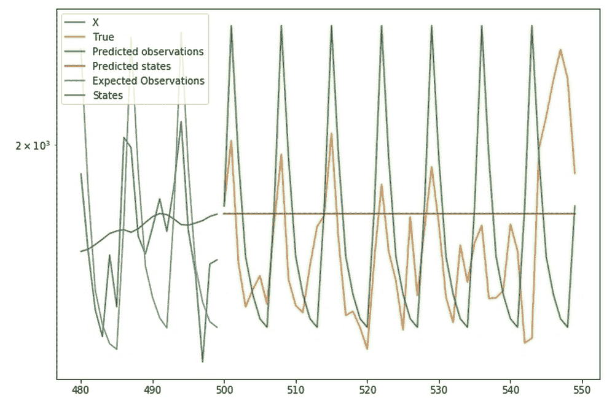

卡尔曼滤波器的预测和内部状态

在上图中，我们可以清楚地看到我们之前的建模对预测的影响。我们可以看到模型预测了强的周振荡，比实际观察到的更强。同样，我们还可以看到模型没有预测任何趋势，因为我们在之前的模型中没有看到模型趋势。

卡尔曼滤波器是一种有用的工具，用于从电气工程到金融的许多应用中。事实上，直到最近，它们还是时间序列建模的首选工具。智能建模者能够创建能够很好地描述时间序列的智能系统。然而，卡尔曼滤波器的一个弱点是它们不能自己发现模式，需要精心设计的先验知识才能工作。

在本章的后半部分，我们将着眼于基于神经网络的方法，这种方法可以自动地为时间序列建模，而且通常具有更高的精度。

<title>Forecasting with neural networks</title> 

# 用神经网络进行预测

这一章的后半部分是关于神经网络的。在第一部分中，我们将构建一个简单的神经网络，它只能预测下一个时间步。由于该系列中的峰值非常大，我们将在输入和输出中使用经过日志转换的页面视图。我们也可以使用短期预测神经网络进行长期预测，方法是将其预测反馈到网络中。

在我们开始构建预测模型之前，我们需要做一些预处理和特性工程。神经网络的优势在于，除了非常高维的数据之外，它们还可以接受大量的特征。缺点是我们必须小心输入什么样的特征。还记得我们在本章前面讨论过前瞻偏差，包括在预测时无法获得的未来数据，这是回溯测试中的一个问题。

## 资料准备

对于每个系列，我们将组装以下功能:

*   `log_view`:浏览量的自然对数。由于零的对数是未定义的，所以我们会用`log1p`，也就是浏览量加一的自然对数。
*   `days`:一键编码工作日。
*   `year_lag`:365 天前`log_view`的值。`-1`如果没有值可用。
*   `halfyear_lag`:182 天前`log_view`的值。`-1`如果没有值可用。
*   `quarter_lag`:91 天前`log_view`的值。`-1`如果没有可用的值。
*   `page_enc`:一键编码子页。
*   `agent_enc`:一键编码代理。
*   `acc_enc`:一键编码访问方法。
*   `year_autocorr`:365 天系列的自相关。
*   `halfyr_autocorr`:182 天系列的自相关。
*   `quarter_autocorr`:91 天系列的自相关。
*   `medians`:回看期页面浏览量的中位数。

这些特征是为每个时间序列组合的，为我们的输入数据提供了形状(批量大小，回顾窗口大小，29)。

### 平日

星期几很重要。与周一相比，当人们在沙发上浏览时，周日可能会显示不同的访问行为，周一时，人们可能会为工作查找资料。因此，我们需要对工作日进行编码。一个简单的一键编码就可以完成这项工作:

```
import datetime

from sklearn.preprocessing import LabelEncoder

from sklearn.preprocessing import OneHotEncoder

weekdays = [datetime.datetime.strptime(date, '%Y-%m-%d').strftime('%a')

            for date in train.columns.values[:-4]]
```

首先，我们将日期字符串(如 2017-03-02)转换为它们的工作日(星期四)。这很容易做到，可以用下面的代码来完成:

```
day_one_hot = LabelEncoder().fit_transform(weekdays)

day_one_hot = day_one_hot.reshape(-1, 1)
```

然后我们将工作日编码成整数，这样“星期一”就变成了`1`，“星期二”就变成了`2`，以此类推。我们将得到的数组重新整形为具有形状(数组长度，1)的秩 2 张量，以便独热编码器知道我们有许多观察值，但只有一个特征，而不是反过来:

```
day_one_hot = OneHotEncoder(sparse=False).fit_transform(day_one_hot)

day_one_hot = np.expand_dims(day_one_hot,0)
```

最后，我们一次性将日期编码。然后我们给张量增加一个新的维度，表明我们只有一行日期。我们稍后将沿此轴重复排列:

```
agent_int = LabelEncoder().fit(train['Agent'])

agent_enc = agent_int.transform(train['Agent'])

agent_enc = agent_enc.reshape(-1, 1)

agent_one_hot = OneHotEncoder(sparse=False).fit(agent_enc)

del agent_enc
```

当我们对每个系列的代理进行编码时，我们将需要代理的编码器。

这里，我们首先创建一个`LabelEncoder`实例，它可以将代理名称字符串转换成整数。然后，我们将所有代理转换成这样一个整数字符串，以便建立一个可以对代理进行一次性编码的`OneHotEncoder`实例。为了节省内存，我们将删除已经编码的代理。

我们通过运行以下命令对子页和访问方法进行同样的操作:

```
page_int = LabelEncoder().fit(train['Sub_Page'])

page_enc = page_int.transform(train['Sub_Page'])

page_enc = page_enc.reshape(-1, 1)

page_one_hot = OneHotEncoder(sparse=False).fit(page_enc)

del page_enc

acc_int = LabelEncoder().fit(train['Access'])

acc_enc = acc_int.transform(train['Access'])

acc_enc = acc_enc.reshape(-1, 1)

acc_one_hot = OneHotEncoder(sparse=False).fit(acc_enc)

del acc_enc
```

现在我们来看看滞后的特征。从技术上讲，神经网络可以发现哪些过去的事件与预测自身相关。然而，这是相当困难的，因为消失渐变的问题，这将在本章的 *LSTM* 部分详细讨论。现在，让我们建立一个小函数，创建一个滞后几天的数组:

```
def lag_arr(arr, lag, fill):

    filler = np.full((arr.shape[0],lag,1),-1)

    comb = np.concatenate((filler,arr),axis=1)

    result = comb[:,:arr.shape[1]]

    return result
```

这个函数首先创建一个新的数组来填充移位后的“空白空间”。新数组的行数与原始数组一样多，但是它的序列长度或宽度是我们想要延迟的天数。然后，我们将这个数组附加到原始数组的前面。最后，我们从数组后面移除元素，以恢复原始数组序列的长度或宽度。
We 想要告知我们的模型不同时间间隔的自相关量。为了计算单个序列的自相关性，我们将序列移动我们想要测量自相关性的滞后量。然后我们计算自相关:

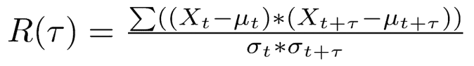

在这个公式中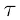是滞后指示器。我们不仅仅使用 NumPy 函数，因为分频器很有可能为零。在这种情况下，我们的函数将只返回 0:

```
def single_autocorr(series, lag):

    s1 = series[lag:]

    s2 = series[:-lag]

    ms1 = np.mean(s1)

    ms2 = np.mean(s2)

    ds1 = s1 - ms1

    ds2 = s2 - ms2

    divider = np.sqrt(np.sum(ds1 * ds1)) * np.sqrt(np.sum(ds2 * ds2))

    return np.sum(ds1 * ds2) / divider if divider != 0 else 0
```

我们可以使用这个为单个序列编写的函数来创建一批自相关特征，如下所示:

```
def batc_autocorr(data,lag,series_length):

    corrs = []

    for i in range(data.shape[0]):

        c = single_autocorr(data, lag)

        corrs.append(c)

    corr = np.array(corrs)

    corr = np.expand_dims(corr,-1)

    corr = np.expand_dims(corr,-1)

    corr = np.repeat(corr,series_length,axis=1)

    return corr
```

首先，我们计算批次中每个系列的自相关。然后我们将相关性融合到一个 NumPy 数组中。由于自相关是一个全局特征，我们需要为序列的长度创建一个新的维度，并创建另一个新的维度来表明这只是一个特征。然后我们在序列的整个长度上重复自相关。

`get_batch`函数利用所有这些工具为我们提供一批数据，如下面的代码所示:

```
def get_batch(train,start=0,lookback = 100):                  #1

    assert((start + lookback) <= (train.shape[1] - 5))        #2

    data = train.iloc[:,start:start + lookback].values        #3

    target = train.iloc[:,start + lookback].values

    target = np.log1p(target)                                 #4

    log_view = np.log1p(data)

    log_view = np.expand_dims(log_view,axis=-1)               #5

    days = day_one_hot[:,start:start + lookback]

    days = np.repeat(days,repeats=train.shape[0],axis=0)      #6

    year_lag = lag_arr(log_view,365,-1)

    halfyear_lag = lag_arr(log_view,182,-1)

    quarter_lag = lag_arr(log_view,91,-1)                     #7

    agent_enc = agent_int.transform(train['Agent'])

    agent_enc = agent_enc.reshape(-1, 1)

    agent_enc = agent_one_hot.transform(agent_enc)

    agent_enc = np.expand_dims(agent_enc,1)

    agent_enc = np.repeat(agent_enc,lookback,axis=1)          #8

    page_enc = page_int.transform(train['Sub_Page'])

    page_enc = page_enc.reshape(-1, 1)

    page_enc = page_one_hot.transform(page_enc)

    page_enc = np.expand_dims(page_enc, 1)

    page_enc = np.repeat(page_enc,lookback,axis=1)            #9

    acc_enc = acc_int.transform(train['Access'])

    acc_enc = acc_enc.reshape(-1, 1)

    acc_enc = acc_one_hot.transform(acc_enc)

    acc_enc = np.expand_dims(acc_enc,1)

    acc_enc = np.repeat(acc_enc,lookback,axis=1)              #10

    year_autocorr = batc_autocorr(data,lag=365,series_length=lookback)

    halfyr_autocorr = batc_autocorr(data,lag=182,series_length=lookback)

    quarter_autocorr = batc_autocorr(data,lag=91,series_length=lookback)                                       #11

    medians = np.median(data,axis=1)

    medians = np.expand_dims(medians,-1)

    medians = np.expand_dims(medians,-1)

    medians = np.repeat(medians,lookback,axis=1)              #12

    batch = np.concatenate((log_view,

                            days, 

                            year_lag, 

                            halfyear_lag, 

                            quarter_lag,

                            page_enc,

                            agent_enc,

                            acc_enc, 

                            year_autocorr, 

                            halfyr_autocorr,

                            quarter_autocorr, 

                            medians),axis=2)

    return batch, target
```

这有很多代码，所以让我们花点时间一步一步地浏览前面的代码，以便完全理解它:

1.  确保有足够的数据从给定的起点创建回看窗口和目标。
2.  将回看窗口与训练数据分开。
3.  分离目标，然后取其一加对数。
4.  取回看窗口的一加对数，并添加一个特征尺寸。
5.  从预先计算的单键日期编码中获取日期，并对批处理中的每个时间序列重复该编码。
6.  计算年滞后、半年滞后和季度滞后的滞后特征。
7.  这一步将使用前面定义的编码器对全局特征进行编码。接下来的两个步骤 8 和 9 将重复相同的角色。
8.  此步骤重复步骤 7。
9.  此步骤重复步骤 7 和 8。
10.  计算年度、半年和季度自相关。
11.  计算回看数据的中值。
12.  将所有这些功能融合成一批。

最后，我们可以使用我们的`get_batch`函数来编写一个生成器，就像我们在[第 3 章](ch03.html "Chapter 3. Utilizing Computer Vision")、*中利用计算机视觉*所做的那样。这个生成器遍历原始训练集，并将一个子集传递给`get_batch`函数。然后产生所获得的批次。

请注意，我们选择随机的起点来充分利用我们的数据:

```
def generate_batches(train,batch_size = 32, lookback = 100):

    num_samples = train.shape[0]

    num_steps = train.shape[1] - 5

    while True:

        for i in range(num_samples // batch_size):

            batch_start = i * batch_size

            batch_end = batch_start + batch_size

            seq_start = np.random.randint(num_steps - lookback)

            X,y = get_batch(train.iloc[batch_start:batch_end],start=seq_start)

            yield X,y
```

这个函数是我们将要训练和验证的。

<title>Conv1D</title> 

# Conv1D

你可能还记得第三章[、](ch03.html "Chapter 3. Utilizing Computer Vision")、*中的卷积神经网络(ConvNets 或 CNN)，它利用了计算机视觉*，在那里我们简要地看了一下屋顶和保险。在计算机视觉中，卷积滤波器在图像上二维滑动。还有一种版本的卷积滤波器可以在一维序列上滑动。输出是另一个序列，很像二维卷积的输出是另一个图像。一维卷积的其他内容与二维卷积完全相同。

在本节中，我们将首先构建一个要求固定输入长度的 ConvNet:

```
n_features = 29

max_len = 100

model = Sequential()

model.add(Conv1D(16,5, input_shape=(100,29)))

model.add(Activation('relu'))

model.add(MaxPool1D(5))

model.add(Conv1D(16,5))

model.add(Activation('relu'))

model.add(MaxPool1D(5))

model.add(Flatten())

model.add(Dense(1))
```

注意，在这个网络中，除了`Conv1D`和`Activation`之外，还有两层。`MaxPool1D`的工作方式与我们在本书前面使用的`MaxPooling2D`完全一样。它获取指定长度的一段序列，并返回序列中的最大元素。这类似于它如何返回二维卷积网络中小窗口的最大元素。

请注意，最大池总是返回每个通道的最大元素。`Flatten`将二维序列张量转换为一维平面张量。要将`Flatten`与`Dense`结合使用，我们需要在输入形状中指定序列长度。这里，我们用`max_len`变量来设置它。我们这样做是因为`Dense`期望一个固定的输入形状，而`Flatten`将基于其输入的大小返回一个张量。

使用`Flatten`的替代方法是`GlobalMaxPool1D`，它返回整个序列的最大元素。由于序列的大小是固定的，您可以在之后使用一个`Dense`层，而无需固定输入长度。

我们的模型正如您所期望的那样编译:

```
model.compile(optimizer='adam',loss='mean_absolute_percentage_error')
```

然后我们在之前写的生成器上训练它。为了获得单独的训练集和验证集，我们必须首先分割整个数据集，然后基于这两个数据集创建两个生成器。为此，请运行以下代码:

```
from sklearn.model_selection import train_test_split

batch_size = 128

train_df, val_df = train_test_split(train, test_size=0.1)

train_gen = generate_batches(train_df,batch_size=batch_size)

val_gen = generate_batches(val_df, batch_size=batch_size)

n_train_samples = train_df.shape[0]

n_val_samples = val_df.shape[0]
```

最后，我们可以在发电机上训练我们的模型，就像我们在计算机视觉中做的那样:

```
model.fit_generator(train_gen, epochs=20,steps_per_epoch=n_train_samples // batch_size, validation_data= val_gen, validation_steps=n_val_samples // batch_size)
```

你的验证损失还是会很高，大概 12，798，928。绝对损失值并不能很好地反映模型的表现。你会发现最好使用其他指标来看你的预测是否有用。但是，请注意，我们将在本章的后面部分大幅降低损耗。

<title>Dilated and causal convolution</title> 

# 扩张和因果卷积

正如在关于回测的部分所讨论的，我们必须确保我们的模型不会遭受前瞻偏差:

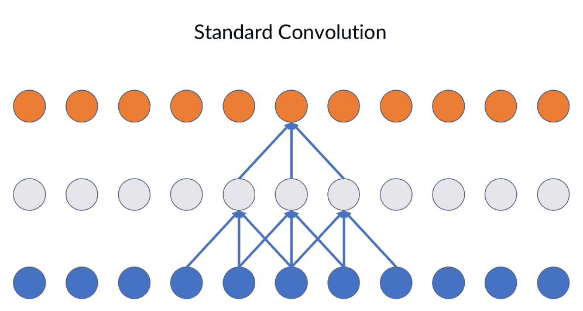

标准卷积不考虑卷积的方向

当卷积过滤器滑过数据时，它不仅能看到过去，还能看到未来。因果卷积确保时间 *t* 的输出仅来自时间 *t - 1* 的输入:

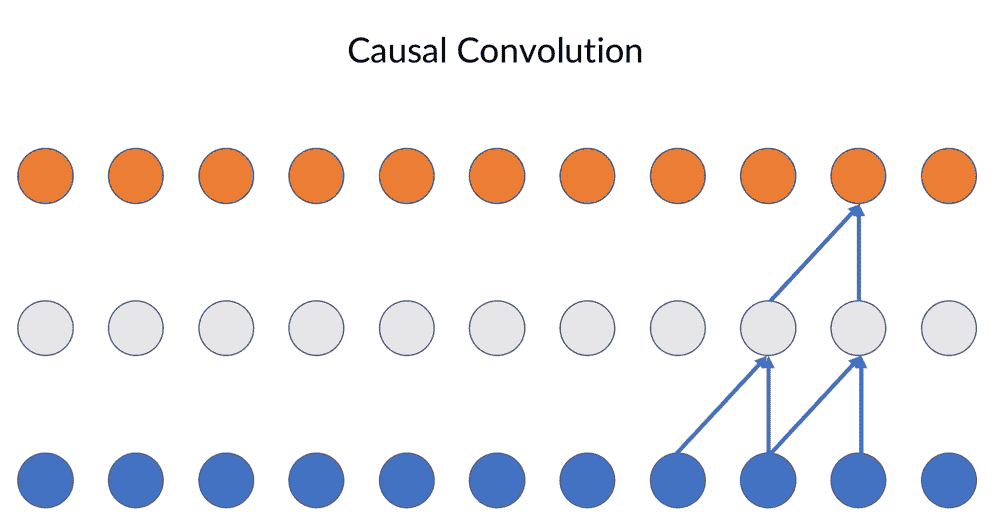

因果卷积使滤波器向正确的方向移动

在 Keras 中，我们所要做的就是将`padding`参数设置为`causal`。我们可以通过执行以下代码来做到这一点:

```
model.add(Conv1D(16,5, padding='causal'))
```

另一个有用的技巧是扩张卷积网络。膨胀意味着过滤器只访问第 n 个元素，如下图所示。

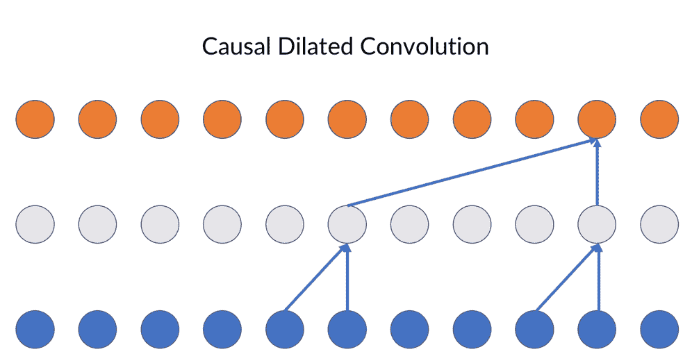

卷积时，扩展卷积跳过输入

在前面的图中，上层卷积层的膨胀率为 4，下层的膨胀率为 1。我们可以通过运行以下命令来设置 Keras 中的膨胀率:

```
model.add(Conv1D(16,5, padding='causal', dilation_rate=4))
```

<title>Simple RNN</title> 

# 简单的 RNN

另一种使神经网络有序的方法是给网络某种记忆。到目前为止，我们所有的网络都进行了前向传递，而对传递之前或之后发生的事情没有任何记忆。是时候用一个**循环神经网络** ( **RNN** )来改变这一切了:

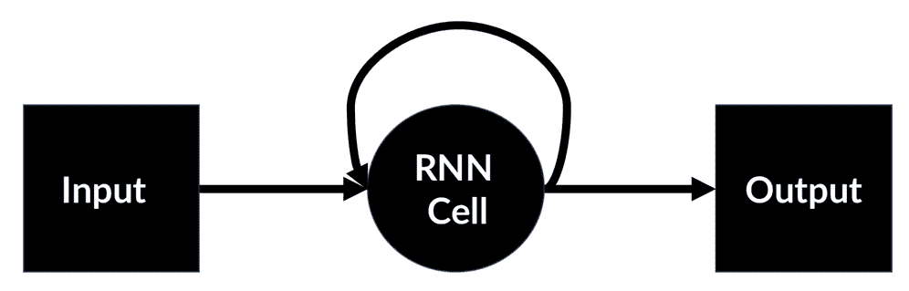

RNN 的计划

rnn 包含循环层。循环层可以记住它们的最后一次激活，并将其用作自己的输入:

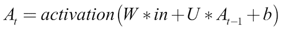

递归层将一个序列作为输入。对于每个元素，它计算一个矩阵乘法(中的 *W *)，就像一个`Dense`层一样，并通过一个激活函数运行结果，比如`relu`。然后它保持自己的活性。当序列的下一项到达时，它像以前一样执行矩阵乘法，但这次它也用第二个矩阵乘以它以前的激活(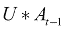)。递归层将两个操作的结果相加，并再次通过激活函数传递。*

在 Keras 中，我们可以使用如下简单的 RNN:

```
from keras.layers import SimpleRNN

model = Sequential()

model.add(SimpleRNN(16,input_shape=(max_len,n_features)))

model.add(Dense(1))

model.compile(optimizer='adam',loss='mean_absolute_percentage_error')
```

我们需要指定的唯一参数是递归层的大小。这与设置`Dense`层的大小基本相同，因为`SimpleRNN`层与`Dense`层非常相似，只是它们将输出作为输入反馈。默认情况下，RNNs 只返回序列的最后一个输出。

要堆叠多个 rnn，我们需要将`return_sequences`设置为`True`，这可以通过运行以下代码来实现:

```
from keras.layers import SimpleRNN

model = Sequential()

model.add(SimpleRNN(16,return_sequences=True,input_shape=(max_len,n_features)))

model.add(SimpleRNN(32, return_sequences = True))

model.add(SimpleRNN(64))

model.add(Dense(1))

model.compile(optimizer='adam',loss='mean_absolute_percentage_error')

You can then fit the model on the generator as before:

model.fit_generator(train_gen,epochs=20,steps_per_epoch=n_train_samples // batch_size, validation_data= val_gen, validation_steps=n_val_samples // batch_size)
```

作为这段代码的结果，我们将能够看到一个简单的 RNN 比卷积模型好得多，损失大约为 1，548，653。你会记得之前我们的损失是 12，793，928。然而，我们可以使用更复杂版本的 RNN 做得更好。

<title>LSTM</title> 

# LSTM

在上一节中，我们学习了基本的 RNNs。理论上，简单的 rnn 应该能够保留长期记忆。然而，在实践中，这种方法常常因为消失梯度问题而不尽人意。

在许多时间步的过程中，网络很难保持有意义的梯度。虽然这不是本章的重点，但关于为什么会发生这种情况的更详细的探讨可以在 1994 年的论文中找到，*学习具有梯度下降的长期依赖性是困难的，*可在-[https://ieeexplore.ieee.org/document/279181](https://ieeexplore.ieee.org/document/279181)-由 Yoshua Bengio，Patrice Simard 和 Paolo Frasconi。

为了直接应对简单 RNNs 的消失梯度问题，发明了**长短期记忆** ( **LSTM** )层。该层在更长的时间序列中表现得更好。然而，如果相关的观测数据落后几百步，那么即使是 LSTM 也会陷入困境。这就是为什么我们手工加入了一些滞后的观察结果。

在我们深入细节之前，让我们来看一个随着时间推移而展开的简单 RNN:

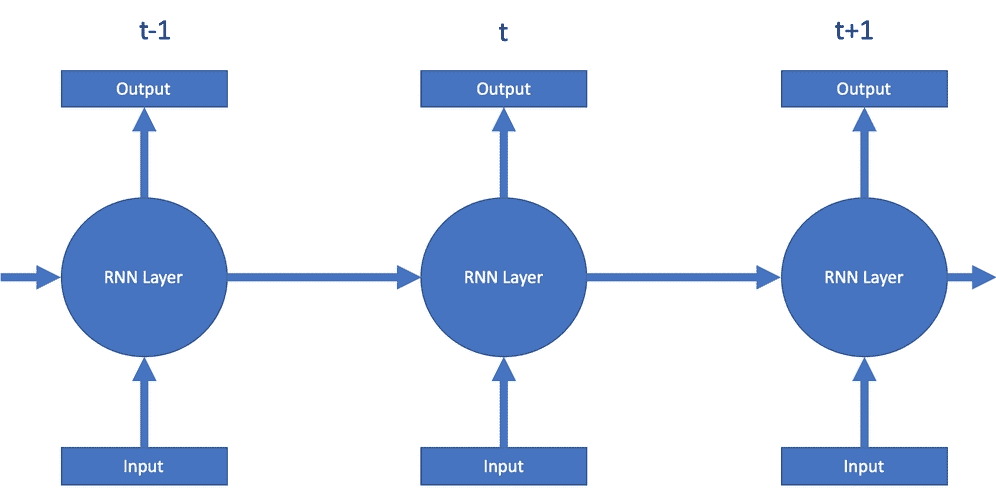

一辆推出的 RNN

正如你所看到的，这与我们在第 2 章、*中看到的[将机器学习应用于结构化数据](ch02.html "Chapter 2. Applying Machine Learning to Structured Data")*的 RNN 是一样的，只是这已经随着时间的推移而展开了。

## 进位

与 RNN 相比，LSTM 的核心优势是进位。进位就像是沿着 RNN 层运行的传送带。在每个时间步，进位被送入 RNN 层。新进位根据输入、RNN 输出和旧进位进行计算，与 RNN 层本身的操作分开进行:


LSTM 示意图

为了理解什么是计算进位，我们应该从输入和状态中确定应该添加什么:

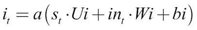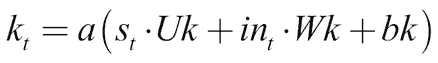

在这些公式中，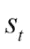是时间 *t* 的状态(简单 RNN 层的输出)，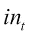是时间 *t 的输入，*和 *Ui* ， *Wi* ， *Uk* ， *Wk* 是将要学习的模型参数(矩阵)。 *a()* 是一个激活函数。

为了确定应该从状态和输入中忘记什么，我们需要使用下面的公式:

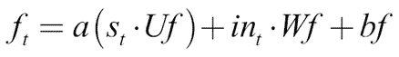

然后，新进位计算如下:

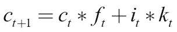

虽然标准理论声称 LSTM 层学会了添加什么和遗忘什么，但实际上，没人知道 LSTM 内部到底发生了什么。然而，LSTM 模型已经被证明在学习长期记忆方面非常有效。

请注意，LSTM 层不需要额外的激活功能，因为它们已经自带了`tanh`激活功能。

LSTMs 的使用方法与`SimpleRNN`相同:

```
from keras.layers import LSTM

model = Sequential()

model.add(LSTM(16,input_shape=(max_len,n_features)))

model.add(Dense(1))
```

要堆叠层，还需要设置`return_sequences`到`True`。请注意，您可以使用以下代码轻松组合`LSTM`和`SimpleRNN`:

```
model = Sequential()

model.add(LSTM(32,return_sequences=True,input_shape=(max_len,n_features)))

model.add(SimpleRNN(16, return_sequences = True))

model.add(LSTM(16))

model.add(Dense(1))
```

### 注意

**注意**:如果你用的是带 Keras 的 GPU 和 TensorFlow 后端，用`CuDNNLSTM`代替`LSTM`。以完全相同的方式工作时，速度明显更快。

我们现在将像以前一样编译并运行模型:

```
model.compile(optimizer='adam',loss='mean_absolute_percentage_error')

model.fit_generator(train_gen, epochs=20,steps_per_epoch=n_train_samples // batch_size, validation_data= val_gen, validation_steps=n_val_samples // batch_size)
```

这一次，损失低至 88，735 英镑，比我们最初的模型好几个数量级。

<title>Recurrent dropout</title> 

# 经常性辍学

读到这里，你已经遇到了*辍学*的概念。Dropout 随机移除一层输入的某些元素。RNNs 中的一个常见且重要的工具是*递归丢失*，它不删除层之间的任何输入，但删除时间步长之间的输入:

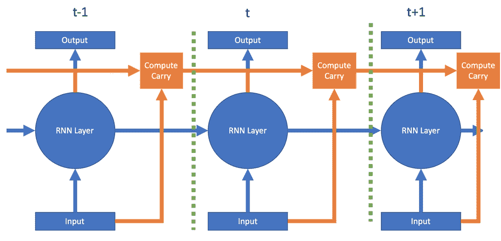

经常性辍学计划

正如常规辍学一样，经常性辍学具有调整效果，可以防止过度适应。在 Keras 中，只需将参数传递给 LSTM 或 RNN 层即可。

正如我们在下面的代码中看到的，与常规辍学不同，经常性辍学没有自己的层:

```
model = Sequential()

model.add(LSTM(16, recurrent_dropout=0.1,return_sequences=True,input_shape=(max_len,n_features)))

model.add(LSTM(16,recurrent_dropout=0.1))

model.add(Dense(1))
```

<title>Bayesian deep learning</title> 

# 贝叶斯深度学习

我们现在有一整套能够对时间序列进行预测的模型。但是这些模型给出的点估计是明智的估计还是只是随机的猜测呢？这个模型有多确定？大多数经典的概率建模技术，如卡尔曼滤波器，可以给出预测的置信区间，而常规的深度学习无法做到这一点。贝叶斯深度学习领域将贝叶斯方法与深度学习相结合，使模型能够表达不确定性。

贝叶斯深度学习的关键思想是模型中存在固有的不确定性。有时，这是通过学习重量的平均值和标准偏差来实现的，而不仅仅是一个重量值。然而，这种方法增加了所需参数的数量，因此没有流行起来。允许我们将常规深度网络转变为贝叶斯深度网络的更简单的黑客方法是在预测时间激活 dropout，然后进行多次预测。

在本节中，我们将使用比以前更简单的数据集。我们的`X`值是-5 和 5 之间的 20 个随机值，我们的`y`值只是应用于这些值的正弦函数。

我们从运行以下代码开始:

```
X = np.random.rand(20,1) * 10-5

y = np.sin(X)
```

我们的神经网络也相对简单。请注意，Keras 不允许我们将 dropout 层作为第一层，因此我们需要添加一个只通过输入值的`Dense`层。我们可以通过下面的代码实现这一点:

```
from keras.models import Sequential

from keras.layers import Dense, Dropout, Activation

model = Sequential()

model.add(Dense(1,input_dim = 1))

model.add(Dropout(0.05))

model.add(Dense(20))

model.add(Activation('relu'))

model.add(Dropout(0.05))

model.add(Dense(20))

model.add(Activation('relu'))

model.add(Dropout(0.05))

model.add(Dense(20))

model.add(Activation('sigmoid'))

model.add(Dense(1))
```

为了适应这个函数，我们需要一个相对较低的学习率，因此我们引入了 Keras vanilla 随机梯度下降优化器，以便在那里设置学习率。然后我们训练模型 10，000 个时期。由于我们对训练日志不感兴趣，我们将`verbose`设置为`0`，这使得模型训练变得“安静”

我们通过运行以下命令来实现这一点:

```
from keras.optimizers import SGD

model.compile(loss='mse',optimizer=SGD(lr=0.01))

model.fit(X,y,epochs=10000,batch_size=10,verbose=0)
```

我们希望在更大范围的值上测试我们的模型，所以我们创建了一个测试数据集，包含 200 个值，范围从-10 到 10，间隔为 0.1。我们可以通过运行以下代码来模拟测试:

```
X_test = np.arange(-10,10,0.1)

X_test = np.expand_dims(X_test,-1)
```

现在来了魔术！使用`keras.backend`，我们可以将设置传递给 TensorFlow，后者在后台运行操作。我们使用后端将学习阶段参数设置为`1`。这使得 TensorFlow 相信我们正在训练，因此它将应用 dropout。然后，我们对测试数据进行 100 次预测。这 100 个预测的结果是在每一个`X`时刻`y`值的概率分布。

### 注意

**注意**:为了让这个例子工作，您必须在定义和训练模型之前加载后端，清除会话，并设置学习阶段，因为训练过程将在 TensorFlow 图中留下设置。您也可以保存已训练的模型，清除会话，然后重新加载模型。有关工作实现，请参见本节的代码。

为了开始这个过程，我们首先运行:

```
import keras.backend as K

K.clear_session()

K.set_learning_phase(1)
```

现在我们可以用下面的代码获得我们的发行版:

```
probs = []

for i in range(100):

    out = model.predict(X_test)

    probs.append(out)
```

接下来，我们可以计算分布的均值和标准差:

```
p = np.array(probs)

mean = p.mean(axis=0)

std = p.std(axis=0)
```

最后，我们用一个、两个和四个标准偏差(对应不同的蓝色阴影)绘制模型的预测:

```
plt.figure(figsize=(10,7))

plt.plot(X_test,mean,c='blue')

lower_bound = mean - std * 0.5

upper_bound =  mean + std * 0.5

plt.fill_between(X_test.flatten(),upper_bound.flatten(),lower_bound.flatten(),alpha=0.25, facecolor='blue')

lower_bound = mean - std

upper_bound =  mean + std

plt.fill_between(X_test.flatten(),upper_bound.flatten(),lower_bound.flatten(),alpha=0.25, facecolor='blue')

lower_bound = mean - std * 2

upper_bound =  mean + std * 2

plt.fill_between(X_test.flatten(),upper_bound.flatten(),lower_bound.flatten(),alpha=0.25, facecolor='blue')

plt.scatter(X,y,c='black')
```

运行此代码的结果是，我们将看到下图:

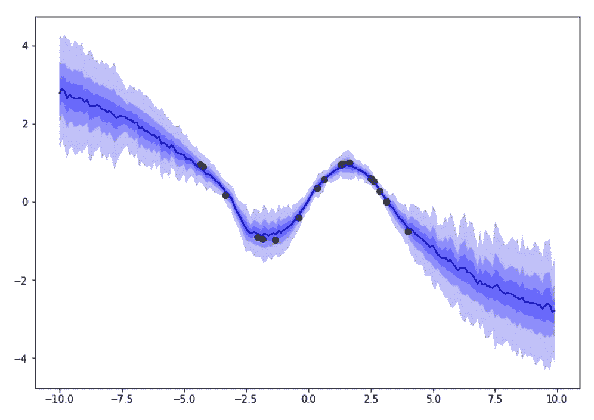

具有不确定性范围的预测

如您所见，模型对其拥有数据的区域相对有信心，并且随着远离数据点而变得越来越不自信。

从我们的模型中获得不确定性估计增加了我们可以从中获得的价值。如果我们能够发现模型在哪里过于自信或不够自信，这也有助于改进模型。目前，贝叶斯深度学习还只是处于初级阶段，我们肯定会在未来几年看到许多进步。

<title>Exercises</title> 

# 练习题

现在我们已经学完了这一章，为什么不试试下面的一些练习呢？在本章中，您可以找到如何完成所有这些任务的指南:

*   一个好的技巧是在一维卷积的基础上使用 LSTMs，因为一维卷积可以在使用较少参数的情况下遍历大量序列。尝试实现一个架构，首先使用几个卷积层和池层，然后是几个 LSTM 层。在 web 流量数据集上尝试一下。然后尝试添加(循环)辍学。你能打败 LSTM 模式吗？
*   给你的网络流量预测增加不确定性。要做到这一点，请记住在推理时打开 dropout 来运行您的模型。您将获得一个时间步长的多个预测。想想这对交易和股票价格意味着什么。
*   访问 Kaggle 数据集页面并搜索时间序列数据。制作一个预测模型。这包括使用自相关和傅立叶变换的特征工程，从引入的模型中选择正确的模型(例如，ARIMA 与神经网络)，然后训练您的模型。一项艰巨的任务，但你会学到很多！任何数据集都可以，不过我建议你不妨试试这里的股市数据集:[https://www . ka ggle . com/szrlee/stock-time-series-2005 01 01-to-2017 12 31](https://www.kaggle.com/szrlee/stock-time-series-20050101-to-20171231)，或者这里的电力消费数据集:[https://www . ka ggle . com/UC IML/electric-power-consumption-data-set](https://www.kaggle.com/uciml/electric-power-consumption-data-set)。

<title>Summary</title> 

# 总结

在这一章中，你学习了大量处理时间序列数据的传统工具。您还了解了一维卷积和递归架构，最后，您了解了一种让模型表达不确定性的简单方法。

时间序列是金融数据最具代表性的形式。这一章给了你一个处理时间序列的丰富工具箱。让我们回顾一下我们在预测维基百科网站流量的例子中所涉及的所有内容:

*   了解我们在处理什么的基本数据探索
*   傅立叶变换和自相关作为特征工程和理解数据的工具
*   使用简单的中值预测作为基线和健全性检查
*   理解和使用 ARIMA 和卡尔曼滤波器作为经典预测模型
*   设计特性，包括为我们所有的时间序列建立一个数据加载机制
*   使用一维卷积和变体，例如因果卷积和扩张卷积
*   了解 rnn 及其更强大的变体 LSTMs 的目的和用途
*   理解如何用辍学技巧给我们的预测增加不确定性，这是我们进入贝叶斯学习的第一步

这个丰富的时间序列技术工具箱在下一章特别有用，我们将在这一章讨论自然语言处理。语言基本上是单词的序列或时间序列。这意味着我们可以重用时间序列建模中的许多工具来进行自然语言处理。

在下一章中，您将学习如何在文本中查找公司名称，如何按主题对文本进行分组，甚至如何使用神经网络翻译文本。