# 第六章。使用生成模型

创成式模型生成新数据。在某种程度上，它们与我们在前几章讨论的模型完全相反。当图像分类器接收高维输入(图像)并输出低维输出(例如图像内容)时，生成模型以完全相反的方式处理事情。例如，它可以根据图片中内容的描述来绘制图片。

生成模型仍处于开发的实验阶段，目前主要用于图像应用。然而，它们是一个重要的模型，事实表明，已经有几个应用程序使用了生成模型，这在行业内引起了轩然大波。

2017 年，所谓的 *DeepFakes* 开始在网络上出现。**生成性对抗网络** ( **GANs** )，我们将在本章稍后介绍，被用来生成以名人为主角的色情视频。前年，在 2016 年，研究人员展示了一个系统，他们可以生成政客们说研究人员希望他们说的任何话的视频，并配有逼真的嘴部动作和面部表情。这方面的一个例子可以从新闻网站 BuzzFeed 在 2018 年制作的美国前总统巴拉克·奥巴马的一篇虚假演讲中看出:[https://youtu.be/cQ54GDm1eL0](https://youtu.be/cQ54GDm1eL0)。

这项技术并不完全是消极的，也有积极的应用，特别是如果生成模型的数据稀疏。如果是这种情况，生成模型可以生成真实的数据，然后其他模型可以对其进行训练。生成模型能够“翻译”图像，一个主要的例子是获取卫星图像并将它们转换成街道地图。再比如，生成式模型可以从网站截图生成代码。它们甚至可以用来对抗机器学习模型中的不公平和歧视，正如我们将在[第 9 章](ch09.html "Chapter 9. Fighting Bias")、*对抗偏见*中看到的。

在金融领域，数据通常很少。回想一下[第 2 章](ch02.html "Chapter 2. Applying Machine Learning to Structured Data")、*将机器学习应用于结构化数据、*中的欺诈案例，在该案例中，我们从交易元数据中对欺诈交易进行分类。我们发现在我们使用的数据集中没有太多欺诈发生，因此该模型很难检测出欺诈何时发生。通常，当这种情况发生时，工程师会做出假设并创建合成数据。然而，机器学习模型可以自己做到这一点，在这个过程中，它们甚至可能发现一些有助于欺诈检测的有用特征。

在算法交易中，数据经常在模拟器中产生。想知道你的算法在全球抛售中表现如何吗？幸运的是，全球抛售并不多，因此定量分析公司的工程师们花了大量时间创建抛售模拟。这些模拟器经常受到工程师的经验和他们对抛售应该是什么样子的感觉的影响。然而，如果模型可以了解抛售的基本情况，然后创建描述无限数量抛售的数据，会怎么样呢？

在这一章中，我们将关注两类生成模型:自动编码器和 GANs。首先是一系列的**自动编码器**，目的是将数据压缩成一个低维的表示，然后忠实地重建数据。第二个家族是 **GANs** ，他们的目标是训练一个发生器，这样一个单独的鉴别器就不能分辨真假图像。

# 了解自动编码器

从技术上来说，自动编码器不是生成型模型，因为它们不能创建全新类型的数据。然而，变分自动编码器，一个普通自动编码器的小调整，可以。因此，在添加生成元素之前，先理解自动编码器本身是有意义的。

自动编码器本身有一些有趣的属性，可以用于检测信用卡欺诈等应用，这对我们关注金融很有用。

给定输入 *x* ，自动编码器学习如何输出 *x* 。它的目标是找到一个函数， *f，*使得以下为真:

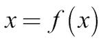

这可能听起来微不足道，但这里的技巧是自动编码器有一个瓶颈。中间隐藏层的大小小于输入的大小， *x* 。因此，该模型必须学习一种压缩的表示，这种表示在一个更小的向量中捕获了 *x* 的所有重要元素。

下图最能说明这一点，其中我们可以看到自动编码器方案的压缩表示:

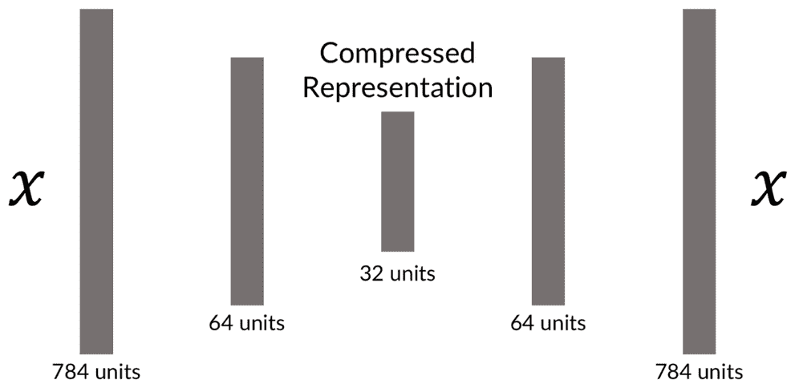

自动编码器方案

这种压缩的表示旨在捕捉输入的本质，这对我们很有用。例如，我们可能希望捕捉欺诈交易与真实交易的本质区别。普通的自动编码器通过类似于标准的**主成分分析** ( **PCA** )来完成这个任务。它们允许我们减少数据的维度，将的注意力集中在重要的事情上。但是与 PCA 相反，自动编码器可以被扩展以生成更多的某种类型的数据。例如，自动编码器可以更好地处理图像或视频数据，因为它们可以使用卷积层来利用数据的空间性。

在本节中，我们将构建两个自动编码器。第一个将用于 MNIST 数据集中的手写数字。生成模型对于视觉数据更容易调试和理解，因为人类直觉上擅长判断两幅图片是否显示相似的东西，但不太擅长判断抽象数据。第二个自动编码器用于欺诈检测任务，使用与 MNIST 数据集类似的方法。

## MNIST 自动编码器

让我们从一个简单的手写数字 MNIST 数据集的自动编码器开始。MNIST 图像为 28x28 像素，可以展平为 784 个元素的向量，等于 28x28。我们将使用自动编码器将这个数据压缩成一个只有 32 个元素的向量。

在深入研究这里描述的代码之前，请确保您已经在正确的路径上保存了 MNIST 数据集，成功导入了 NumPy 和 Matplotlib 库，并设置了一个随机种子以确保您的实验是可重复的。

### 注意

**注**:您可以在以下网址[https://www.kaggle.com/jannesklaas/mnist-autoencoder-vae.](https://www.kaggle.com/jannesklaas/mnist-autoencoder-vae.)下找到 MNIST 自动编码器和变型自动编码器的代码

我们现在要设置编码维度超参数，以便以后使用:

```
encoding_dim = 32
```

然后，我们使用 Keras functional API 构建自动编码器。虽然可以使用顺序 API 构建一个简单的自动编码器，但这对于我们了解函数式 API 如何工作是一个很好的复习。

首先，我们导入了`Model`类，它允许我们创建功能 API 模型。我们还需要导入`Input`和`Dense`层。您会记得在前面的章节中，函数式 API 需要一个单独的输入层，而顺序式 API 不需要。要导入这两个层，我们需要运行以下命令:

```
from keras.models import Model

from keras.layers import Input, Dense
```

现在我们把自动编码器的层连接起来:一个`Input`层后面跟着一个`Dense`层，它把图像编码成一个更小的图像。

随后是`Dense`解码层，旨在重建原始图像:

```
input_img = Input(shape=(784,))

encoded = Dense(encoding_dim, activation='relu')(input_img)

decoded = Dense(784, activation='sigmoid')(encoded)
```

在我们创建并链接这些层之后，我们就能够创建一个从输入映射到解码图像的模型:

```
autoencoder = Model(input_img, decoded)
```

为了更好地理解正在发生的事情，我们可以用下面的代码绘制一个可视化的自动编码器模型:

```
from keras.utils import plot_model

plot_model(autoencoder, to_file='model.png', show_shapes=True) plt.figure(figsize=(10,10))

plt.imshow(plt.imread('model.png'))
```

你可以看到我们的自动编码器如下:

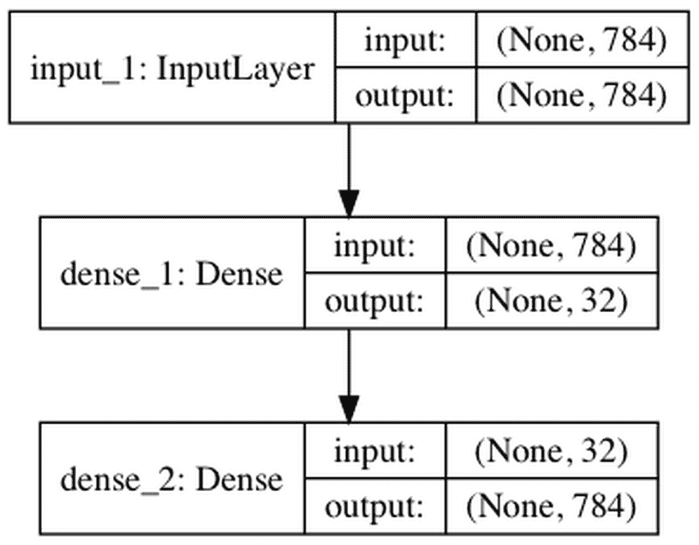

自动编码器模型

我们可以用它来编译:

```
autoencoder.compile(optimizer='adadelta', loss='binary_crossentropy')
```

为了训练这个自动编码器，我们使用 *X* 值作为输入和输出:

```
autoencoder.fit(X_train_flat, X_train_flat,epochs=50,batch_size=256,shuffle=True,validation_data=(X_test_flat, X_test_flat))
```

在我们训练这个自动编码器之后，这将花费一到两分钟的时间，我们可以直观地检查它做得有多好。为此，我们首先从测试集中提取单个图像，然后向图像添加一个批量维度，以便在模型中运行它，这就是我们使用`np.expand_dims`的目的:

```
original = np.expand_dims(X_test_flat[0],0)
```

现在我们将通过自动编码器运行原始图像。你应该记得，原始的 MNIST 图像显示的是数字 7，所以我们希望我们的自动编码器的输出也显示 7:

```
seven = autoencoder.predict(original)
```

接下来，我们将把自动编码器输出和原始图像重新整形为 28x28 像素的图像:

```
seven = seven.reshape(1,28,28)

original = original.reshape(1,28,28)
```

然后，我们将原始图像和重建图像相邻绘制。`matplotlib`不允许图像有批次维度，因此我们需要传递一个没有批次维度的数组。通过用`[0,:,:]`索引图像，我们将只通过所有像素的第一个项目。

第一个项目现在不再有批次维度:

```
fig = plt.figure(figsize=(7, 10))

a=fig.add_subplot(1,2,1)

a.set_title('Original')

imgplot = plt.imshow(original[0,:,:])

b=fig.add_subplot(1,2,2)

b.set_title('Autoencoder')

imgplot = plt.imshow(seven[0,:,:])
```

运行完这段代码后，您会发现我们的希望已经实现了！与原始图像(左)相比，我们的自动编码器图像(右)也显示一个 7！：

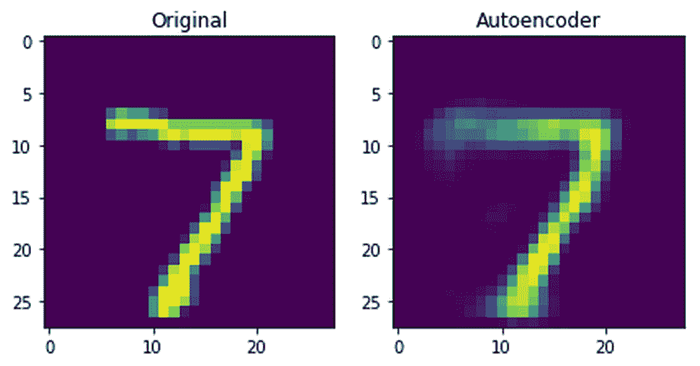

自动编码器结果

正如你在前面的截图中看到的，重建的七仍然是七，所以自动编码器能够捕捉到七是什么的大致想法。虽然它并不完美，但你可以看到它的边缘有点模糊，尤其是在左上角。看起来，虽然自动编码器不确定线的长度，但它确实知道 7 中有两条线，并且它知道它们遵循的大致方向。

像这样的自动编码器执行非线性 PCA。它知道哪些成分对 7 成为 7 最重要。能够学习这种表达的用处不仅仅是图像。在信用卡欺诈检测中，这种主要成分将构成另一个分类器能够使用的良好特征。

在下一节中，我们将应用一个自动编码器来解决信用卡欺诈问题。

## 信用卡自动编码器

在本节中，我们将再次讨论信用卡欺诈问题。这一次，我们将使用与第 2 章、*将机器学习应用于结构化数据*中略有不同的数据集。

这个新的数据集包含具有匿名特征的实际信用卡交易的记录；然而，它并不太适合于特征工程。因此，我们将不得不依靠端到端的学习方法来构建一个良好的欺诈检测器。

### 注意

**注意**:你可以在[https://www.kaggle.com/mlg-ulb/creditcardfraud](https://www.kaggle.com/mlg-ulb/creditcardfraud)找到数据集，在[https://www.kaggle.com/jannesklaas/credit-vae](https://www.kaggle.com/jannesklaas/credit-vae)找到实现了自动编码器和变型自动编码器的笔记本。

像往常一样，我们首先加载数据。`Time`特性显示了事务的绝对时间，这使得这里的数据有点难以处理。因此，我们将删除它，我们可以通过运行:

```
df = pd.read_csv('../input/creditcard.csv')

df = df.drop('Time',axis=1)
```

然后，我们将交易的`X`数据从交易的分类中分离出来，并提取熊猫数据帧下面的 NumPy 数组:

```
X = df.drop('Class',axis=1).values

y = df['Class'].values
```

现在我们需要缩放特征。特征缩放使我们的模型更容易学习数据的良好表示。这一次，我们将采用与之前略有不同的功能缩放方法。我们会将所有要素缩放到 0 到 1 之间，而不是平均值为 0，标准差为 1。通过这样做，我们可以确保数据集中既没有非常高的值，也没有非常低的值。

我们必须意识到这种方法容易受到影响结果的异常值的影响。对于每一列，我们首先减去最小值，这样新的最小值就变为零。接下来，我们除以最大值，使新的最大值变为 1。

通过指定`axis=0`，我们按列执行缩放:

```
X -= X.min(axis=0)

X /= X.max(axis=0)
```

最后，我们分割数据:

```
from sklearn.model_selection import train_test_split

X_train, X_test, y_train,y_test = train_test_split(X,y,test_size=0.1)
```

然后，我们创建与之前完全相同的自动编码器；然而，这一次，我们用不同的维度来做。我们的输入现在有 29 个维度，我们将其压缩到 12 个维度，然后再恢复原来的 29 个维度的输出。

虽然在这里选择 12 维有些武断，但它提供了足够的容量来捕获所有相关信息，同时还能显著压缩数据:

```
from keras.models import Model

from keras.layers import Input, Dense
```

我们将对解码数据使用 sigmoid 激活函数。这是唯一可能的，因为我们已经将数据调整为 0 到 1 之间的值。我们还在编码层中使用了 tanh 激活。这只是一种风格选择，在实验中运行良好，并确保编码值都在-1 和 1 之间。也就是说，你可以根据自己的需要使用不同的激活功能。

如果你正在处理图像或者更深层次的网络，重新激活通常是一个好的选择。但是，如果您使用的是较浅的网络，就像我们在这里所做的一样，那么 tanh 激活通常可以很好地工作:

```
data_in = Input(shape=(29,))

encoded = Dense(12,activation='tanh')(data_in)

decoded = Dense(29,activation='sigmoid')(encoded)

autoencoder = Model(data_in,decoded)
```

在本例中，我们使用了均方误差损失。这似乎是一个有点不寻常的选择，首先使用一个均方误差损失的 sigmoid 激活，但它是有意义的。大多数人认为 sigmoid 激活必须与交叉熵损失一起使用，但是交叉熵损失鼓励值为 0 或 1，这对于这种情况下的分类任务很有效。

在我们的信用卡示例中，大多数值大约为 0.5。我们可以在下面的代码中看到实现的均方误差，更好地处理目标不是二进制而是频谱的值。二元交叉熵迫使值接近零和一，这不是我们一直想要的:

```
autoencoder.compile(optimizer='adam',loss='mean_squared_error')
```

经过大约两分钟的训练后，自动编码器收敛到低损耗状态:

```
autoencoder.fit(X_train,X_train,epochs = 20,batch_size=128,validation_data=(X_test,X_test))
```

重建损失低，但我们如何知道我们的自动编码器是否工作良好？再一次，目视检查可以解决问题。正如我们之前解释过的，人类非常擅长视觉判断事物，但不太擅长判断抽象的数字。

要进行目视检查，首先我们必须进行一些预测，其中我们将通过自动编码器运行测试集的一个子集:

```
pred = autoencoder.predict(X_test[0:10])
```

然后我们必须能够绘制单个样本。以下代码生成一个重叠的条形图，比较原始事务数据和重建的事务数据:

```
import matplotlib.pyplot as plt

import numpy as np

width = 0.8

prediction   = pred[9]

true_value    = X_test[9]

indices = np.arange(len(prediction))

fig = plt.figure(figsize=(10,7))

plt.bar(indices, prediction, width=width, color='b', label='Predicted Value')

plt.bar([i+0.25*width for i in indices], true_value, width=0.5*width, color='r', alpha=0.5, label='True Value')

plt.xticks(indices+width/2., ['V{}'.format(i) for i in range(len(prediction))] )

plt.legend()

plt.show()
```

这段代码将为我们提供以下图表:

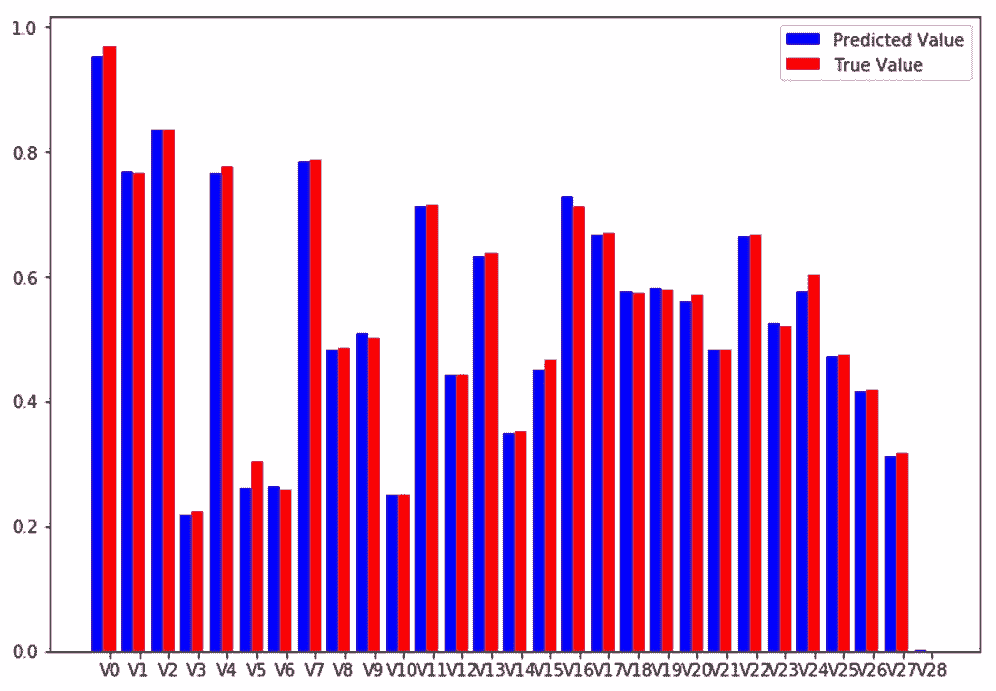

自动编码器重构与原始数据

如您所见，我们的模型在重建原始值方面做得很好。重构的值通常与真实值相匹配，如果不匹配，那么它们只会有很小的偏差。如你所见，目测比看抽象的数字更有洞察力。


# 用 t-SNE 可视化潜在空间

我们现在有了一个自动编码器，它接收信用卡交易，并输出看起来差不多一样的信用卡交易。然而，这不是我们建造自动编码器的原因。autoencoder 的主要优点是，我们现在可以将事务编码到一个较低维度的表示中，以捕获事务的主要元素。

要创建编码器模型，我们所要做的就是定义一个新的 Keras 模型，它从输入映射到编码状态:

```
encoder = Model(data_in,encoded)
```

注意，你不需要再次训练这个模型。这些层保持来自先前训练的自动编码器的权重。

为了对数据进行编码，我们现在使用编码器模型:

```
enc = encoder.predict(X_test)
```

但是我们如何知道这些编码是否包含任何关于欺诈的有意义的信息呢？同样，视觉表现是关键。虽然我们的编码比输入数据的维数少，但它们仍然有 12 维。人类不可能想到 12 维空间，所以我们需要在更低维的空间中绘制我们的编码，同时仍然保留我们关心的特征。

在我们的例子中，我们关心的特征是*接近度*。我们希望 12 维空间中彼此靠近的点在 2 维图中彼此靠近。更准确地说，我们关心邻里。我们希望高维空间中彼此最接近的点在低维空间中也彼此最接近。

保护邻居很重要，因为我们想找到欺诈的聚集地。如果我们发现欺诈性交易在我们的高维编码中形成一个簇，那么我们可以使用一个简单的检查，如果一个新的交易落入欺诈性簇，将该交易标记为欺诈性的。一种将高维数据投影到低维图中同时保留邻域的流行方法被称为**t-分布式随机邻域嵌入、**或 **t-SNE** 。

简而言之，t-SNE 旨在忠实地表示所有点的随机样本中两个点相邻的概率。也就是说，它试图找到数据的低维表示，其中随机样本中的点与高维数据中的点具有相同的最近邻概率:

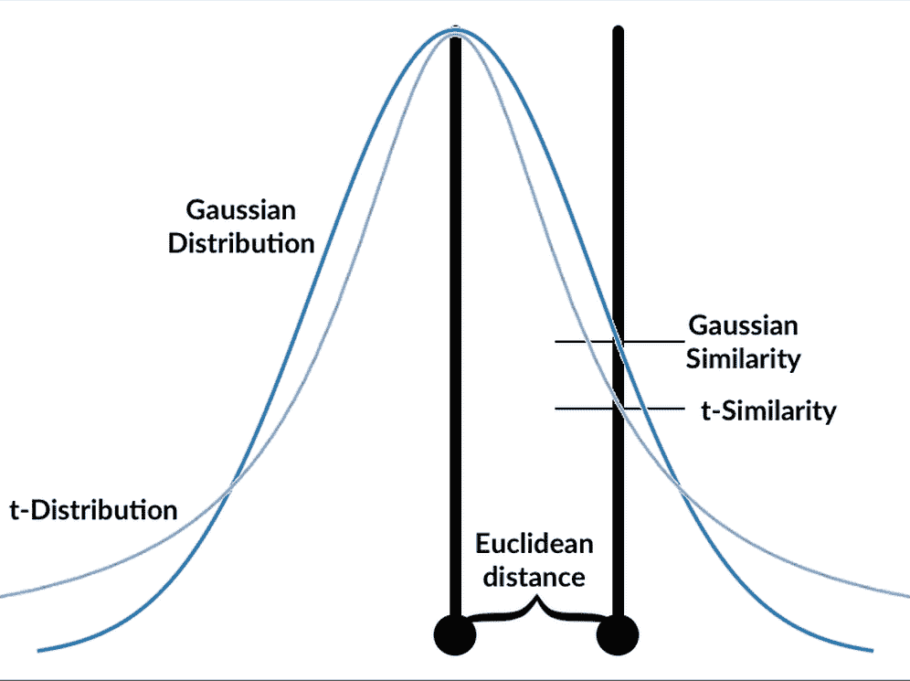

SNE 霸王龙如何测量相似度

t-SNE 算法遵循以下步骤:

1.  Calculate the Gaussian similarity between all points. This is done by calculating the Euclidean (spatial) distance between points and then calculating the value of a Gaussian curve at that distance, as you can see in the preceding diagram. The Gaussian similarity for all points, *j,* from point *i* can be calculated as follows:

    在上式中，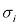 2 是高斯分布的方差。我们将在本章的后面讨论如何确定这个方差。注意，由于点 *i* 和 *j* 之间的相似度是由 *i* 和所有其他点之间的距离之和(表示为 *k* )来衡量的，因此 *i* 和 *j* 、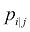之间的相似度可以不同于 *j* 和 *i* 、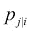之间的相似度。因此，我们对这两个相似性进行平均，以获得我们将继续使用的最终相似性:

    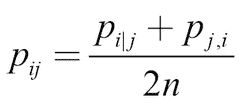

    在上式中， *n* 是数据点的个数。

2.  在低维空间中随机定位数据点。
3.  计算低维空间中所有点之间的*t-相似度*: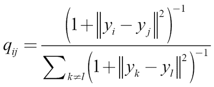
4.  就像训练神经网络一样，我们将通过遵循损失函数的梯度来优化数据点在低维空间中的位置。在这种情况下，损失函数是更高和更低维度空间中相似性之间的**kull back–lei bler**(**KL**)散度。我们将在变型自动编码器一节中对 KL 发散进行更仔细的观察。现在，就把它看作是一种测量两个分布之间差异的方法。损失函数相对于低维空间中数据点 *i* 的位置*y[I]的导数如下: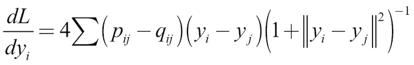*
5.  通过使用梯度下降来调整低维空间中的数据点，将高维数据中靠近的点移动得更近，将彼此远离的点移动得更远: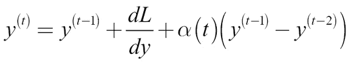
6.  你会认识到这是一种有动量的梯度下降，因为先前的梯度被合并到更新的位置。

使用的 t 分布总是有一个自由度。这种自由导致更简单的公式以及一些漂亮的数字属性，从而导致更快的计算和更有用的图表。

高斯分布的标准偏差可受用户使用*困惑*超参数的影响。困惑可以解释为我们期望一个点有多少个邻居。低困惑值强调局部邻近，而高困惑值强调全局困惑值。从数学上来说，困惑度可以计算如下:

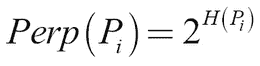

这里*P[I]是数据集中所有数据点位置的概率分布，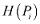是该分布的 Shanon 熵，计算如下:*

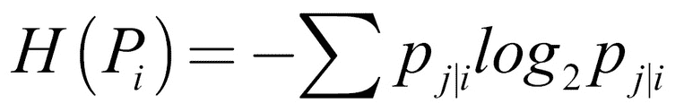

虽然该公式的细节与使用 t-SNE 并不十分相关，但重要的是要知道 t-SNE 对标准偏差值执行搜索，以便找到全局分布 *P [i] ，*，对于该分布，我们数据上的熵是我们想要的困惑。换句话说，您需要手动指定困惑，但是这个困惑对您的数据集意味着什么也取决于数据集本身。

t-SNE 的发明者劳伦斯·范·马尔滕和杰弗里·辛顿报告说，该算法对 5 到 50 之间的困惑选择相对稳健。大多数库中的默认值是 30，对于大多数数据集来说这是一个很好的值。然而，如果您发现您的可视化不令人满意，那么调整困惑值可能是您想要做的第一件事。

对于所有涉及的数学，使用 SNE 霸王龙出奇的简单。Scikit-learn 有一个方便的 t-SNE 实现，我们可以像使用 scikit-learn 中的任何算法一样使用它。

我们首先导入`TSNE`类，然后我们可以创建一个新的`TSNE`实例。我们定义要训练 5000 个纪元，使用默认的困惑度 30，默认的学习率 200。我们还指定我们将在培训过程中喜欢输出。然后我们调用`fit_transform`，它将我们的 12 种编码转换成二维投影:

```
from sklearn.manifold import TSNE

tsne = TSNE(verbose=1,n_iter=5000)

res = tsne.fit_transform(enc)
```

作为一个警告，t-SNE 非常慢，因为它需要计算所有点之间的距离。默认情况下，scikit-learn 使用更快的 t-SNE 版本，称为 Barnes Hut 近似。虽然没有那么精确，但速度明显更快。

还有一个更快的 t-SNE 的 Python 实现，可以作为 scikit-learn 实现的替代。然而，这并没有被很好地记录，包含的特性也较少，因此我们不会在本书中涉及它。

### 注意

**注意**:你可以在下面的网址[https://github.com/DmitryUlyanov/Multicore-TSNE](https://github.com/DmitryUlyanov/Multicore-TSNE)找到更快的实现和安装说明。

然后，我们可以将 t-SNE 结果绘制成散点图。举例来说，我们将通过颜色区分欺诈和非欺诈，欺诈用红色标出，非欺诈用蓝色标出。由于 t-SNE 的实际值无关紧要，我们将隐藏坐标轴:

```
fig = plt.figure(figsize=(10,7))

scatter =plt.scatter(res[:,0],res[:,1],c=y_test, cmap='coolwarm', s=0.6)

scatter.axes.get_xaxis().set_visible(False)

scatter.axes.get_yaxis().set_visible(False)
```

现在让我们看看，输出图表将会是什么样子:

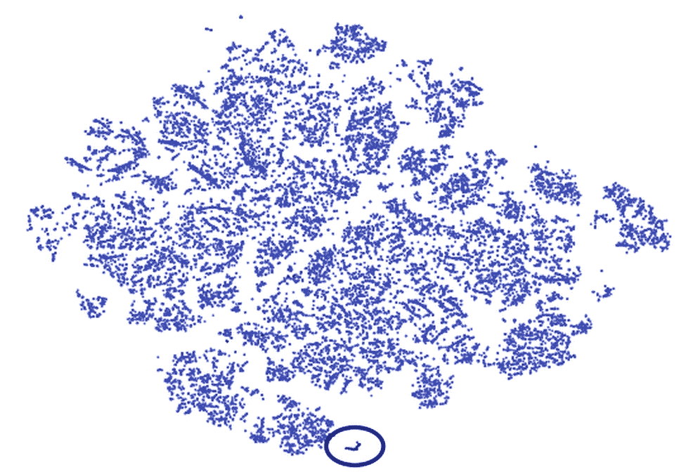

t-SNE 结果以散点图的形式出现

为了更容易识别，对于那些阅读印刷版的人来说，包含最多欺诈的簇，那些被标记为红色的，已经用圆圈标记。你可以看到欺诈和其他真实的交易很好的分开了，蓝色部分。很明显，我们的 autoencoder 已经找到了一种方法，可以在没有标签的情况下区分欺诈和真实交易。这是一种无监督学习的形式。

事实上，普通的自动编码器执行 PCA 的近似，这对于无监督学习是有用的。在输出图表中，您可以看到还有几个明显独立于其他事务的聚类，但这些都不是欺诈。使用自动编码器和无监督学习，有可能以我们以前从未想到的方式分离和分组我们的数据。例如，我们可以根据购买类型对交易进行分类。

使用我们的自动编码器，我们现在可以使用编码信息作为分类器的特征。然而，更好的是，只需对 autoencoder 稍加修改，我们就可以生成更多具有欺诈案例的潜在属性的数据，同时具有不同的特征。这是通过一个可变的自动编码器完成的，这将是下一节的重点。


# 变分自动编码器

自动编码器基本上是 PCA 的近似。但是，它们可以扩展成为生成模型。给定一个输入，**变分自动编码器** ( **VAEs** )可以创建编码*分布*。这意味着对于一个欺诈案例，编码器将产生一个可能编码的分布，这些编码都代表交易的最重要特征。然后，解码器会将所有编码转换回原始事务。

这很有用，因为它允许我们生成有关交易的数据。我们之前发现的欺诈检测的一个问题是，欺诈交易并不多。因此，通过使用 VAE，我们可以对任意数量的交易编码进行采样，并用更多欺诈性交易数据来训练我们的分类器。

那么，VAEs 是怎么做的呢？VAE 不是只有一个压缩表示向量，而是有两个:一个用于均值编码，一个用于该编码的标准偏差:

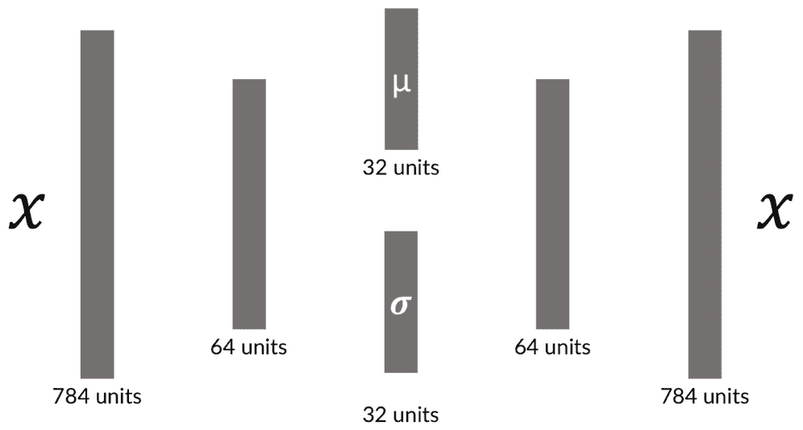

VAE 计划

均值和标准差都是向量，就像我们用于标准自动编码器的编码向量一样。然而，为了创建实际的编码，我们只需要将带有标准偏差的随机噪声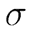添加到我们的编码向量中。

为了实现值的广泛分布，我们的网络使用两种损失的组合进行训练:重建损失，这可以从普通的自动编码器中得知；以及编码分布和标准高斯分布之间的 KL 发散损失，标准高斯分布的标准偏差为 1。

## MNIST 的例子

现在开始我们的第一首 VAE。该 VAE 将处理 MNIST 数据集，并让您更好地了解 VAEs 的工作原理。在下一节中，我们将为信用卡欺诈检测构建相同的 VAE。

首先，我们需要导入几个元素，只需运行:

```
from keras.models import Model

from keras.layers import Input, Dense, Lambda

from keras import backend as K

from keras import metrics
```

注意两个新的导入，`Lambda`层和`metrics`模块。`metrics`模块提供了度量标准，比如交叉熵损失，我们将使用它来构建自定义的损失函数。同时，`Lambda`层允许我们使用 Python 函数作为层，我们将使用它从编码分布中对进行采样。我们将会看到`Lambda`层是如何工作的，但是首先，我们需要建立神经网络的其余部分。

我们需要做的第一件事是定义几个超参数。我们的数据具有 784 的原始维度，我们将其压缩成 32 维的潜在向量。我们的网络在输入和潜在向量之间有一个中间层，它有 256 个维度。我们将训练 50 个纪元，批次大小为 100:

```
batch_size = 100

original_dim = 784

latent_dim = 32

intermediate_dim = 256

epochs = 50
```

出于计算原因，学习标准差的对数比标准差本身更容易。为此，我们创建了网络的前半部分，其中的输入`x,`映射到中间层`h`。从这一层开始，我们的网络分裂为`z_mean`，表示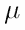和`z_log_var`，表示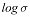:

```
x = Input(shape=(original_dim,))

h = Dense(intermediate_dim, activation='relu')(x)

z_mean = Dense(latent_dim)(h)

z_log_var = Dense(latent_dim)(h)
```

## 使用λ层

`Lambda`层将任意表达式，即 Python 函数，包装成 Keras 层。然而，要做到这一点，还有一些要求。为了使反向传播有效，函数需要可微分。毕竟，我们希望通过损失的梯度来更新网络权重。幸运的是，Keras 在其`backend`模块中提供了许多函数，这些函数都是可微分的，简单的 Python 数学，例如 *y = x + 4* ，也很好。

此外，`Lambda`函数只能接受一个输入参数。在我们想要创建的层中，输入只是前一层的输出张量。在这种情况下，我们想要创建一个有两个输入的层，和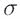。因此，我们将把这两个输入包装成一个元组，然后我们可以把它拆开。

您可以在下面看到采样功能:

```
def sampling(args):

    z_mean, z_log_var = args                                  #1

    epsilon = K.random_normal(shape=(K.shape(z_mean)[0], latent_dim), mean=0.,stddev=1.0)                     #2

    return z_mean + K.exp(z_log_var / 2) * epsilon            #3
```

让我们花点时间来分解这个函数:

1.  我们把输入元组拆开，得到两个输入张量。
2.  我们创建一个张量，它包含随机的、正态分布的噪声，平均值为零，标准差为一。张量的形状为我们的输入张量(`batch_size`，`latent_dim`)。
3.  最后，我们将随机噪声乘以我们的标准偏差，得到学习的标准偏差，并加上学习的平均值。由于我们正在学习对数标准差，我们必须将指数函数应用于我们学习的张量。

所有这些操作都是可区分的，因为我们使用的是 Keras 后端函数。现在我们可以把这个函数变成一个层，用一条线把它和前面两层连接起来:

```
z = Lambda(sampling)([z_mean, z_log_var])
```

瞧！我们现在有了一个自定义图层，它从两个张量描述的正态分布中采样。Keras 可以通过该层自动反向传播，并训练之前各层的权重。

既然我们已经对数据进行了编码，我们还需要对其进行解码。我们可以用两个`Dense`层来做到这一点:

```
decoder_h = Dense(intermediate_dim, activation='relu')(z)

x_decoded = Dense(original_dim, activation='sigmoid')decoder_mean(h_decoded)
```

我们的网络现在已经完成。该网络将把任何 MNIST 图像编码成平均值和标准偏差张量，解码部分然后从该张量重建图像。唯一缺少的是定制损耗，它激励网络重建图像并在其编码中产生正态高斯分布。让我们现在解决这个问题。

## 库尔贝克-莱布勒散度

要为我们的 VAE 创建自定义损失，我们需要一个自定义损失函数。这个损失函数将基于**库尔贝克-莱布勒**(**k1**)散度。

KL 散度，是机器学习从信息论继承的度量之一，就像交叉熵一样。虽然它经常被使用，但是当你试图理解它的时候会遇到很多困难。

在其核心，KL 散度测量当分布 *p* 接近分布 *q* 时有多少信息丢失。

假设您正在开发一个金融模型，并且已经收集了一项证券投资的回报数据。你的金融建模工具都假设收益是正态分布的。下图显示了回报率的实际分布与使用正态分布模型的近似值。为了这个例子，让我们假设只有离散的回报。在我们继续之前，请确保我们将在后面讨论连续发行版:

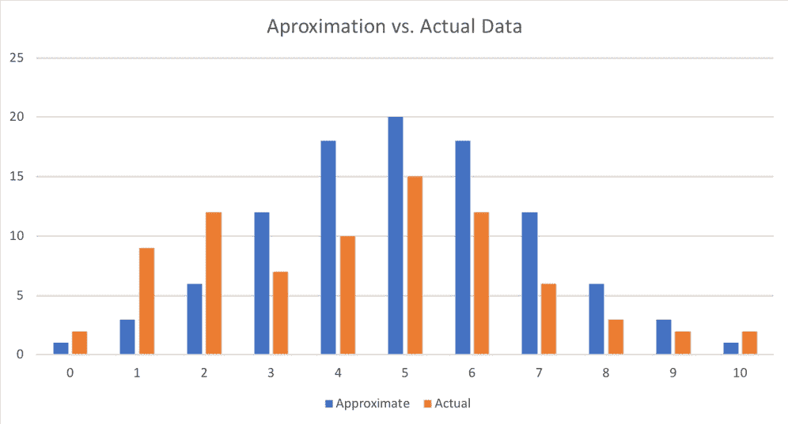

近似值与实际值

当然，数据中的回报并不完全是正态分布的。那么，如果你失去了近似值，你会失去多少关于回报的信息呢？这正是 KL 散度所测量的:

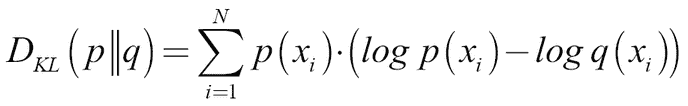

这里的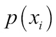和是 *x* 的概率，在这种情况下，回报具有某个值 *i* ，比如说 5%。前面的公式有效地表达了分布 *p* 和 *q* 的概率对数的期望差:


如果用分布 *q* 来近似分布 *p* ，对数概率的预期差异与平均信息损失相同。请参见以下内容:

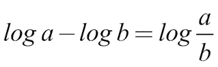

假设 KL 散度通常被写出如下:

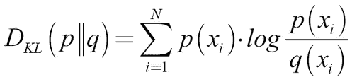

它也可以以连续形式写成:


对于 VAEs，我们希望编码的分布是正态高斯分布，均值为零，标准差为一。

当 *p* 被正态高斯分布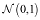代替，近似 *q* 是一个均值为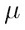标准差为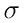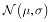的正态分布时，KL 散度简化为:

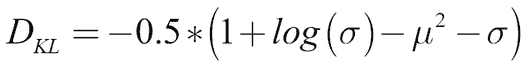

因此，我们的均值和标准差向量的偏导数如下:

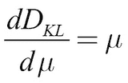

另一个是:

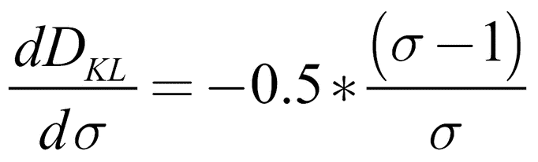

你可以看到，如果是零，相对于的导数是零，如果是一，相对于的导数也是零。这个损失项被加到重建损失中。

## 创建自定义亏损

VAE 损失是两个损失的组合:激励模型重构其输入井的重构损失，以及激励模型用其编码逼近正态高斯分布的 KL 散度损失。要创建这个组合损失，我们必须先分别计算两个损失部分，然后再将它们组合起来。

重建损失与我们应用于普通自动编码器的损失相同。二值交叉熵对于 MNIST 重建是一个合适的损失。由于 Keras 的二进制交叉熵损失的实现已经取了整个批次的平均值，这是我们稍后才想做的操作，我们必须将损失按比例放大，以便我们可以将其除以输出维度:

```
reconstruction_loss = original_dim * metrics.binary_crossentropy(x, x_decoded)
```

KL 散度损失是 KL 散度的简化形式，我们在前面的 KL 散度部分讨论过:


用 Python 表示，KL 散度损失如下所示:

```
kl_loss = - 0.5 * K.sum(1 + z_log_var - K.square(z_mean) - K.exp(z_log_var), axis=-1)
```

我们的最终损失是重建损失和 KL 发散损失之和的平均值:

```
vae_loss = K.mean(reconstruction_loss + kl_loss)
```

由于我们在所有计算中都使用了 Keras 后端，因此产生的损失是一个可以自动微分的张量。现在我们可以像往常一样创建我们的模型:

```
vae = Model(x, x_decoded)
```

由于我们使用的是自定义损耗，因此我们有单独的损耗，我们不能只将其添加到`compile`语句中:

```
vae.add_loss(vae_loss)
```

现在我们将编译模型。由于我们的模型已经有一个损失，我们只需指定优化器:

```
vae.compile(optimizer='rmsprop')
```

自定义丢失的另一个副作用是，它将 VAE 的*输出*与 VAE 的*输入*进行比较，这使得有意义，因为我们想要重构输入。因此，我们不必指定 *y* 值，因为只指定一个输入就足够了:

```

		vae.fit(X_train_flat,

			shuffle=True,

			epochs=epochs,

			batch_size=batch_size,

			validation_data=(X_test_flat, None))

```

在下一节中，我们将了解如何使用 VAE 生成数据。

## 使用 VAE 生成数据

我们已经有了自动编码器，但是我们如何生成更多的数据呢？嗯，我们输入一个，比如说，一张 7 的图片，然后通过自动编码器运行多次。由于 autoencoder 是从一个分布中随机抽样的，所以每次运行时输出都会略有不同。

为了展示这一点，根据我们的测试数据，我们将采用 7:

```
one_seven = X_test_flat[0]
```

然后，我们添加一个批处理维度，并在批处理中重复七次。之后，我们现在有一批四个相同的 7:

```
one_seven = np.expand_dims(one_seven,0)

one_seven = one_seven.repeat(4,axis=0)
```

然后，我们可以对该批次进行预测，在这种情况下，我们会得到重构的 7:

```
s = vae.predict(one_seven)
```

下一步分为两部分。首先，我们要把所有的 7 重塑成图像形式:

```
s= s.reshape(4,28,28)
```

然后我们将绘制它们:

```
fig=plt.figure(figsize=(8, 8))

columns = 2

rows = 2

for i in range(1, columns*rows +1):

    img = s[i-1]

    fig.add_subplot(rows, columns, i)

    plt.imshow(img)

plt.show()
```

作为运行我们刚刚走过的代码的结果，我们将看到下面的屏幕截图，显示我们的输出是四个 7:

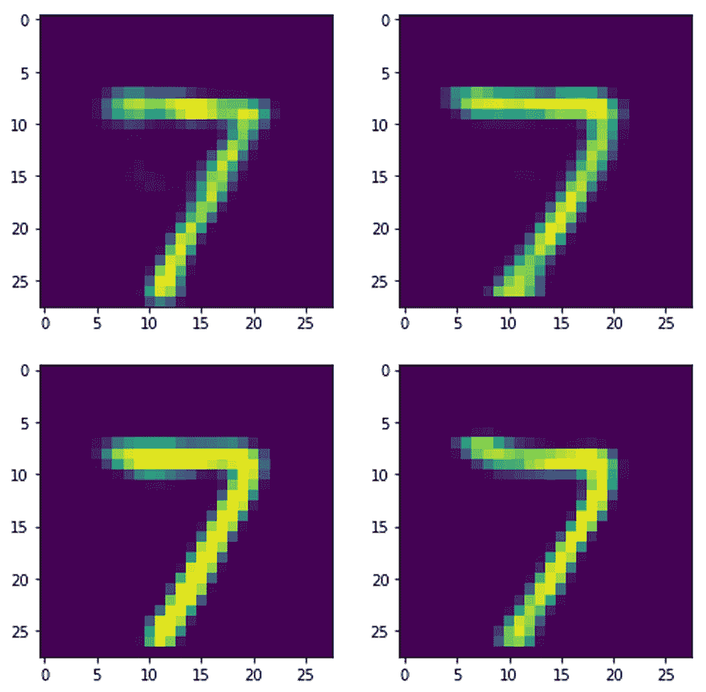

七的集合

如你所见，所有的图像都显示一个 7。虽然它们看起来很相似，但如果你仔细观察，你会发现有几个明显的不同之处。左上方的 7 比左下方的 7 笔画不明显。同时，右下方的 7 在末端有一个瞄准镜。

我们刚刚见证的是 VAE 成功创造了新的数据。虽然使用这些数据进行更多的训练不如使用全新的真实世界数据好，但它仍然非常有用。虽然像这样的生成模型看起来不错，但我们现在将讨论如何将这种技术用于信用卡欺诈检测。

## 端到端欺诈检测系统的 VAEs

为了将 VAE 从 MNIST 的例子转移到真实的欺诈检测问题，我们所要做的就是改变三个超参数:VAE 信用卡的输入、中间和潜在维度，它们都比 MNIST VAE 的要小。其他一切都将保持不变:

```
original_dim = 29

latent_dim = 6

intermediate_dim = 16
```

以下可视化显示了生成的 VAE，包括输入和输出形状:

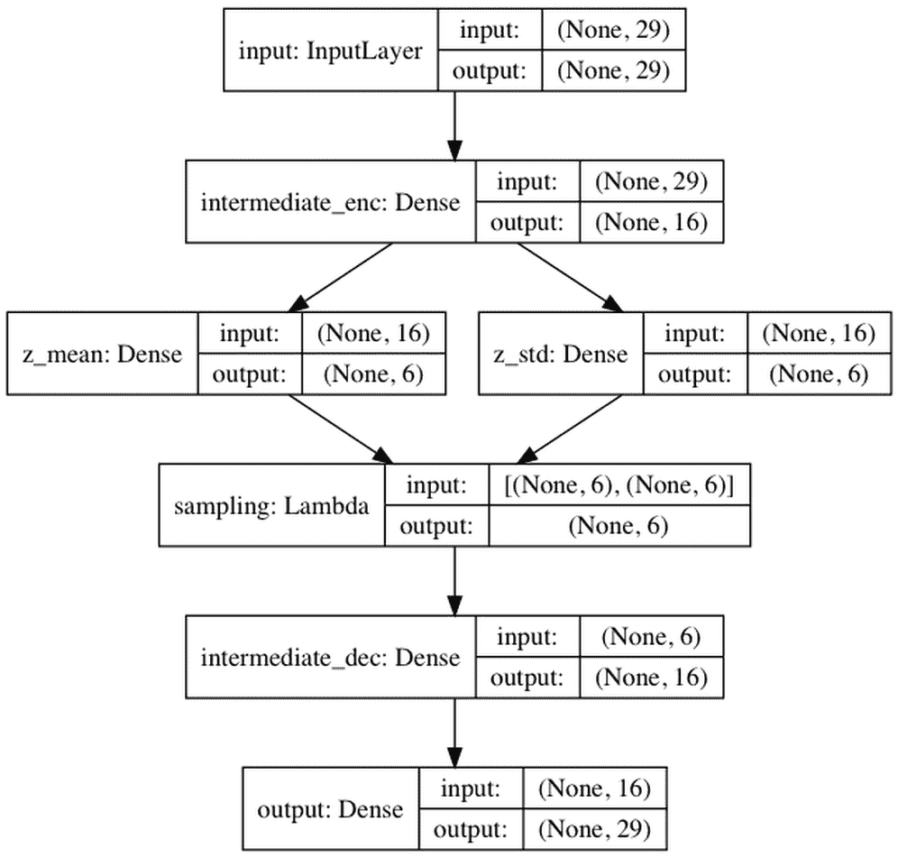

信用卡 VAE 概览

有了可以编码并生成信用卡数据的 VAE，我们现在可以处理端到端欺诈检测系统的任务了。这可以减少预测中的偏差，因为我们可以直接从数据中学习复杂的规则。

我们使用自动编码器的编码部分作为特征提取器以及一个方法，在我们需要的地方给我们更多的数据。具体如何工作将在关于主动学习的章节中讨论，但是现在，让我们绕一点弯子，看看 vae 如何为时间序列工作。


# 时间序列的 VAEs

本节涵盖了时间序列值的如何和为什么，并给出了它们被使用的几个例子。时间序列是金融领域的一个大话题，第四章、*、理解时间序列、*都非常关注它。

自动编码器已经发现了与时间序列相关的应用，因为它们能够将长时间序列编码成单个描述性向量。举例来说，这一向量然后可用于有效地将一个时间序列与另一个时间序列进行比较，例如，基于无法用简单的相关性捕捉到的特定和复杂的模式。

想想 2010 年的“闪电崩盘”。2010 年 5 月 6 日，从 02:32 开始，美国市场出现了重大价值损失。道琼斯工业平均指数下跌了约 9%，这相当于约一万亿美元的价值在几分钟内化为乌有。36 分钟后，崩盘结束了，大部分失去的价值重新获得，人们开始想知道到底发生了什么。

五年后，一个名叫纳文德尔·辛格·萨劳的人因部分导致闪电崩盘并在此过程中赚了 4000 万美元而被捕。Sarao 从事了一种被称为“欺骗”的做法，即他使用一个自动化的机器人发出大量的销售订单，这些订单无法在市场上得到满足，但会压低价格。

在取消订单之前，机器人只会将订单保留在证券交易所的订单簿中很短的一段时间。同时，Sarao 会以新的低价买进股票，然后在取消销售订单后股票开始反弹时获利。虽然 Sarao 肯定不是唯一对闪电崩盘负责的人，但欺骗等做法现在是非法的，纳斯达克(美国)、东京(日本)和孟买(印度)证券交易所等交易所现在必须监控和标记此类案件。

如果你深究一下关于高频交易的旧博客帖子，比如彭博的*欺骗者保持市场诚实*，你可以在[https://www . Bloomberg . com/opinion/articles/2015-01-23/high-frequency-trading-Spoofers-and-front-running](https://www.bloomberg.com/opinion/articles/2015-01-23/high-frequency-trading-spoofers-and-front-running)查看，然后你会发现一些在大公司工作的交易员公开推荐欺骗或抢先操作大订单，但那是另一个故事了。

当有人进行欺骗时，我们如何检测？一种方法是使用自动编码器。通过使用大量的订单簿信息，我们可以训练一个自动编码器来重建“正常”的交易行为。对于交易模式偏离正常交易很多的交易者来说，训练好的自动编码器对于交易的重建损失会相当高。

另一种选择是在不同种类的模式上训练自动编码器，无论这些模式是否非法，然后在潜在空间中聚集模式，就像我们对欺诈性信用卡交易所做的那样。

默认情况下，递归神经网络(RNNs)接受一个时间序列并输出一个向量。如果 Keras 的`return_sequences`参数设置为`True`，它们也可以输出序列。使用递归神经网络(如 LSTMs ),可以使用以下代码构建时间序列的自动编码器:

```
from keras.models import Sequential

from keras.layers import LSTM, RepeatVector

model = Sequential()                                            #1

model.add(LSTM(latent_dim, input_shape=(maxlen, nb_features)))  #2

model.add(RepeatVector(maxlen))                                 #3

model.add(LSTM(nb_features, return_sequences=True))             #4
```

让我们暂停一下，分解一下我们刚刚编写的代码。如您所见，这段代码有四个关键要素:

1.  使用顺序 API 构建了一个简单的自动编码器。
2.  我们首先将我们的序列长度`maxlen`，以及等于`nb_features`的特征数量输入到一个 LSTM 中。LSTM 只会返回它最后的输出，一个维度为`latent_dim`的单一向量。这个向量是我们序列的编码。
3.  为了解码向量，我们需要在时间序列的长度上重复它。这是由`RepeatVector`层完成的。
4.  现在，我们将重复编码的序列输入解码 LSTM，这次它返回完整的序列。

VAEs 也能找到交易的途径。它们可以通过生成新的、不可见的测试数据来增强回溯测试。同样，我们可以使用 VAEs 来生成关于缺失数据的合同的数据。

有理由认为，仅仅因为两个交易日看起来有点不同，同样的力量可能在起作用。数学上，我们可以假设市场数据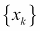是从一个概率分布中取样的，*p(x)*带有少量潜在变量， *h* 。使用自动编码器，我们可以近似计算出 *p(h|x)* ，即给定 *x* 时 *h* 的分布。这将允许我们分析市场中的驱动力。

这解决了用于这类问题的标准最大似然模型在计算上难以处理的问题。执行相同任务的另外两种方法是*马尔可夫链蒙特卡罗*和*汉密尔顿蒙特卡罗*方法。虽然这两者都不会在这里深入讨论，虽然它们将在后面的章节中介绍，但值得理解的是，vae 以一种可计算的方式解决了数学金融中长期存在的问题。

生成模型也可以用来解决超出传统方法范围的问题。金融市场从根本上来说是一个敌对的环境，投资者试图实现总体上不可能实现的目标:高于平均水平的回报。知道一家公司做得很好是不够的:如果每个人都知道这家公司做得很好，那么股价就会很高，回报就会很低。关键是知道一家公司做得很好，而其他人都认为它做得很差。市场是一个零和博弈的环境。gan 利用这些动态生成真实数据。


# 甘斯

甘斯的工作很像艺术品伪造者和博物馆馆长。艺术品伪造者每天都试图向博物馆出售一些假艺术品，馆长每天都试图区分某件作品是真是假。伪造者从失败中吸取教训。通过试图愚弄馆长，观察什么导致成功和失败，他们成为一个更好的伪造者。但是馆长也在学习。通过努力领先于伪造者，他们成为了更好的策展人。久而久之，伪造品越来越好，辨别过程也越来越好。经过多年的斗争，艺术品伪造者是一个可以画得和毕加索一样好的专家，而馆长是一个可以通过微小的细节来辨别一幅真正的画的专家。

从技术上讲，GAN 由两个神经网络组成:一个*生成器，*，它从随机潜在向量中产生数据；一个*鉴别器，*，它将数据分类为“真实的”，即来自训练集，或者“虚假的”，即来自生成器。

我们可以想象一个 GAN 方案，如下图所示:

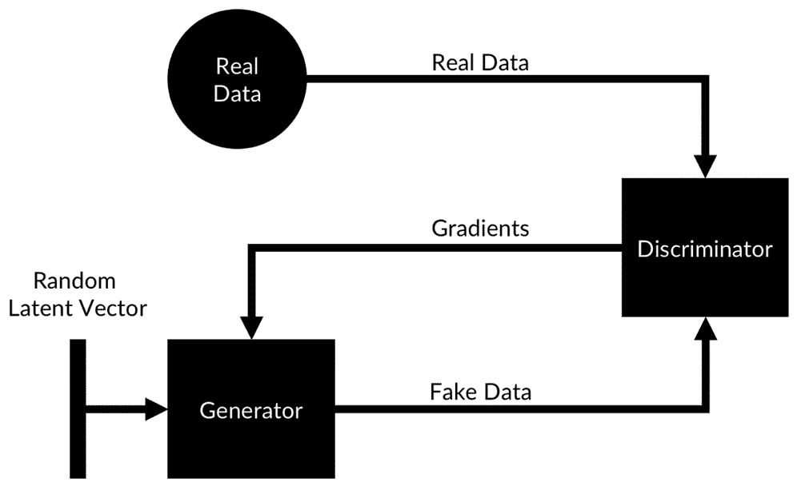

GAN 方案

同样，生成模型在生成图像时更容易理解，因此在本节中，我们将查看图像数据，尽管各种数据都可以使用。

GAN 的训练过程如下:

1.  创建包含随机数的潜在向量。
2.  潜在向量被输入生成器，生成图像。
3.  来自生成器的一组伪图像与来自训练集的一组真实图像混合。鉴别器接受真假数据的二进制分类训练。
4.  在鉴别器被训练一段时间后，我们再次输入假图像。这一次，我们将假图像的标签设置为“真实”我们通过鉴频器反向传播，并获得相对于鉴频器的*输入*的损耗梯度。我们*而不是*基于这个信息更新鉴别器的权重。
5.  我们现在有了梯度来描述我们必须如何改变我们的假图像，以便鉴别器将它归类为真实图像。我们使用这些梯度反向传播和训练生成器。
6.  使用我们新改进的生成器，我们再次创建假图像，这些假图像与真实图像混合，以便训练鉴别器，鉴别器的梯度用于再次训练生成器。

### 注意

**注意** : GAN 训练与我们在[第 3 章](ch03.html "Chapter 3. Utilizing Computer Vision")、*中讨论的利用计算机视觉*的网络层可视化有很多相似之处，只是这次我们不只是创建一个最大化激活功能的图像，而是创建一个专门最大化另一个网络的激活功能的生成网络。

数学上，生成器 *G* 和鉴别器 *D* 用价值函数 *V(G，D)* 玩一个 mini-max 双人游戏:

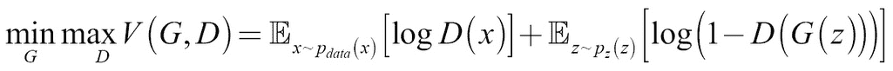

在这个公式中 *x* 是从真实数据的分布中抽取的一项，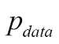z 是从潜在向量空间中抽取的潜在向量， *p [ z ]* 。

发电机的输出分配记为*p[g]。可以证明这个博弈的全局最优是*

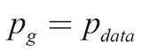

即，如果生成数据的分布等于实际数据的分布。

gan 按照博弈论的价值函数进行优化。用深度学习解决这种类型的优化问题是一个活跃的研究领域，我们将在第 8 章、*隐私、调试和推出您的产品、*中再次讨论这个领域，在那里我们将讨论强化学习。深度学习可用于解决极大极小游戏的事实对于金融和经济学领域来说是一个令人兴奋的消息，该领域存在许多这样的问题。

## 一个甘

现在让我们实现一个 GAN 来生成 MNIST 字符。在我们开始之前，我们需要做一些进口。gan 是大型模型，在本节中，您将看到如何将顺序 API 模型和功能 API 模型结合起来，以简化模型构建:

```
from keras.models import Model, Sequential
```

在本例中，我们将使用一些新的图层类型:

```
from keras.layers import Input, Dense, Dropout, Flatten

from keras.layers import LeakyReLU, Reshape

from keras.layers import Conv2D, UpSampling2D
```

让我们来看看一些关键要素:

*   `LeakyReLU`就像 ReLU，除了激活允许小的负值。此防止梯度变为零。这个激活函数对 GANs 很有效，我们将在下一节讨论:

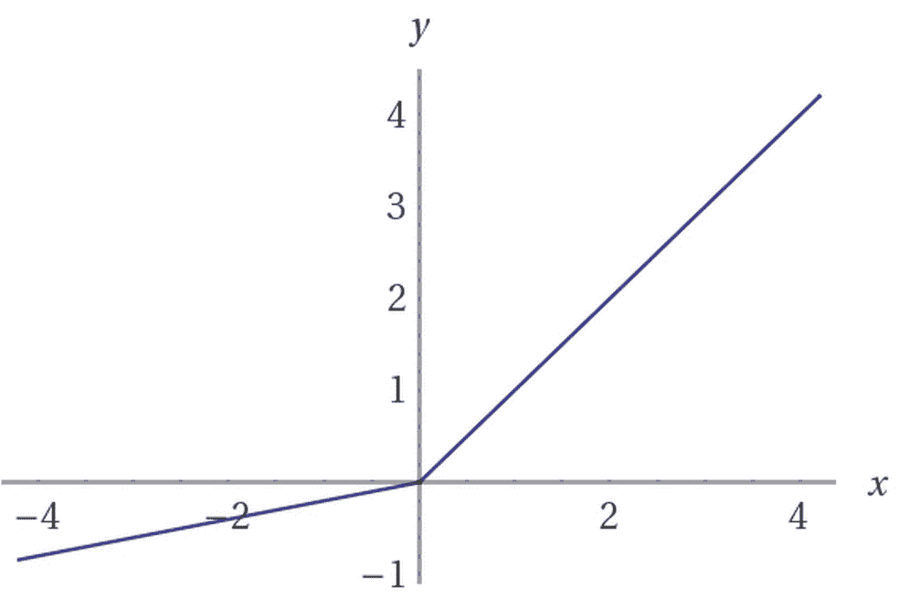

泄漏 ReLU

*   `Reshape`的作用与`np.reshape`相同:它将张量转化为一种新的形式。
*   `UpSampling2D`例如，通过重复特征地图中的所有数字，将 2D 特征地图放大两倍。

我们将像往常一样使用`Adam`优化器:

```
from keras.optimizers import Adam
```

神经网络层被随机初始化。通常，随机数是从一个很好地支持学习的分布中抽取的。对于 GANs，正态高斯分布是更好的选择:

```
from keras.initializers import RandomNormal
```

现在，我们将构建发电机模型:

```
generator = Sequential()                                       #1 

generator.add(Dense(128*7*7, input_dim=latent_dim, kernel_initializer=RandomNormal(stddev=0.02)))   #2

generator.add(LeakyReLU(0.2))                                  #3

generator.add(Reshape((128, 7, 7)))                            #4

generator.add(UpSampling2D(size=(2, 2)))                       #5

generator.add(Conv2D(64,kernel_size=(5, 5),padding='same'))    #6

generator.add(LeakyReLU(0.2))                                  #7

generator.add(UpSampling2D(size=(2, 2)))                       #8

generator.add(Conv2D(1, kernel_size=(5, 5),padding='same', activation='tanh'))                    #9

adam = Adam(lr=0.0002, beta_1=0.5)

generator.compile(loss='binary_crossentropy', optimizer=adam) #10
```

同样，让我们看看生成器模型代码，它由 10 个关键步骤组成:

1.  我们将生成器构建为一个序列模型。
2.  第一层获取随机潜在向量，并将其映射到一个维度为*128 * 7 * 7 = 6272*的向量。它已经大大扩展了我们生成的数据的维度。对于这种完全连接的图层，从标准偏差相对较小的正态高斯分布初始化权重非常重要。与均匀分布相反，高斯分布将具有更少的极值，这将使训练更容易。
3.  第一层的激活功能是`LeakyReLU`。我们需要指定负输入的斜率有多陡；在这种情况下，负输入乘以 0.2。
4.  现在，我们将平面向量重塑成一个 3D 张量。这与使用`Flatten`层相反，我们在[第 3 章](ch03.html "Chapter 3. Utilizing Computer Vision")、*中使用了*计算机视觉。我们现在有一个 7x7 像素图像或特征图中的 128 个通道的张量。
5.  使用`UpSampling2D`，我们把这个图像放大到 14x14 像素。`size`参数指定了宽度和高度的乘数因子。
6.  现在我们可以应用一个标准的`Conv2D`层。与大多数图像分类器的情况相反，我们使用 5x5 像素的相对较大的核大小。
7.  在`Conv2D`层之后的激活是另一个`LeakyReLU`。
8.  我们再次上采样，使图像达到 28x28 像素，与 MNIST 图像的尺寸相同。
9.  我们生成器的最终卷积层只输出单通道图像，因为 MNIST 图像只有黑白。注意最后一层的激活是一个`tanh`激活。`Tanh`将所有值压缩到负 1 和 1 之间。这可能是意料之外的，因为图像数据通常不包含任何低于零的值。然而，从经验上来看，`tanh`激活比`sigmoid`激活对 GANs 更有效。
10.  最后，我们编译生成器，用`Adam`优化器以非常小的学习速率和比通常更小的动量进行训练。

鉴别器是一个相对标准的图像分类器，它将图像分为真假。只有一些针对 GAN 的修改:

```
#Discriminator

discriminator = Sequential()

discriminator.add(Conv2D(64, kernel_size=(5, 5), strides=(2, 2), padding='same', input_shape=(1, 28, 28),kernel_initializer=RandomNormal(stddev=0.02)))                                               #1

discriminator.add(LeakyReLU(0.2))

discriminator.add(Dropout(0.3))

discriminator.add(Conv2D(128, kernel_size=(5, 5), strides=(2, 2), padding='same'))

discriminator.add(LeakyReLU(0.2))

discriminator.add(Dropout(0.3))                          #2

discriminator.add(Flatten())

discriminator.add(Dense(1, activation='sigmoid'))

discriminator.compile(loss='binary_crossentropy', optimizer=adam)
```

这里有两个关键因素:

1.  与生成器一样，鉴别器的第一层应该从高斯分布中随机初始化。
2.  图像分类器中通常使用 Dropout。对于 GANs，也应在最后一层之前使用。

现在我们有了一个生成器和一个鉴别器。为了训练生成器，我们必须从鉴别器获得梯度，以反向传播并训练生成器。这就是 Keras 模块化设计发挥威力的地方。

### 注意

**注意** : Keras 模型可以像 Keras 层一样处理。

以下代码创建了一个 GAN 模型，可用于根据鉴频器梯度训练生成器:

```
discriminator.trainable = False                         #1

ganInput = Input(shape=(latent_dim,))                   #2

x = generator(ganInput)                                 #3

ganOutput = discriminator(x)                            #4

gan = Model(inputs=ganInput, outputs=ganOutput)         #5

gan.compile(loss='binary_crossentropy', optimizer=adam) #6
```

在该准则中，有六个关键阶段:

1.  训练发电机时，我们不想训练`discriminator`。当将`discriminator`设置为不可训练时，只有使用不可训练重量编译的型号的重量才会被冻结。也就是说，我们仍然可以单独训练`discriminator`模型，但是一旦它成为再次编译的 GAN 模型的一部分，它的权重就被冻结了。
2.  我们为 GAN 创建一个新的输入，它接受随机的潜在向量。
3.  我们将发电机模型连接到`ganInput`层。该模型可以像功能 API 下的层一样使用。
4.  我们现在将带有冻结砝码的鉴频器连接到发生器。同样，我们调用模型的方式与我们在函数式 API 中使用层的方式相同。
5.  我们创建一个模型，将输入映射到鉴别器的输出。
6.  我们编译我们的 GAN 模型。因为我们在这里称之为`compile`，只要鉴别器模型是 GAN 模型的一部分，它们的权重就被冻结。Keras 将在训练时间抛出一个警告，说明权重没有被实际的鉴别器模型冻结。

训练我们的 GAN 需要对训练过程进行一些定制，还需要一些特定于 GAN 的技巧。更具体地说，我们必须编写自己的训练循环，这将通过以下代码来实现:

```
epochs=50

batchSize=128

batchCount = X_train.shape[0] // batchSize                     #1

for e in range(1, epochs+1):                                   #2

    print('-'*15, 'Epoch %d' % e, '-'*15)

    for _ in tqdm(range(batchCount)):                          #3

        noise = np.random.normal(0, 1, size=[batchSize, latent_dim]) #4

        imageBatch = X_train[np.random.randint(0, X_train.shape[0],size=batchSize)] #5

        generatedImages = generator.predict(noise)             #6

        X = np.concatenate([imageBatch, generatedImages])      #7

        yDis = np.zeros(2*batchSize)                           #8

        yDis[:batchSize] = 0.9 

        labelNoise = np.random.random(yDis.shape)              #9

        yDis += 0.05 * labelNoise + 0.05

        discriminator.trainable = True                         #10

        dloss = discriminator.train_on_batch(X, yDis)          #11

        noise = np.random.normal(0, 1, size=[batchSize, latent_dim]) #12

        yGen = np.ones(batchSize)                              #13

        discriminator.trainable = False                        #14

        gloss = gan.train_on_batch(noise, yGen)                #15

    dLosses.append(dloss)                                      #16

    gLosses.append(gloss)
```

我们刚刚引入了很多代码。因此，让我们花一分钟时间来思考一下这 16 个关键步骤:

1.  我们必须编写一个定制的循环来遍历批处理。要知道有多少批，我们需要用数据集大小除以批大小。
2.  在外部循环中，我们迭代我们想要训练的历元数。
3.  在内部循环中，我们迭代每个时期中我们想要训练的批次数量。`tqdm`工具帮助我们跟踪批次内的进度。
4.  我们创建了一批随机潜在向量。
5.  我们随机抽取了一批真实的 MNIST 图像。
6.  我们用生成器生成一批假的 MNIST 图像。
7.  我们把真的和假的 MNIST 图像叠在一起。
8.  我们为我们的鉴别器创建目标。假图像用 0 编码，真图像用 0.9 编码。这种技术被称为软标签。代替硬标签(0 和 1)，我们使用一些更软的东西，以便不要过于激进地训练 GAN。这种技术已经被证明可以使 GAN 训练更加稳定。
9.  在使用软标签的基础上，我们给标签添加了一些噪声。这将再次使训练更加稳定。
10.  我们确保鉴别器是可训练的。
11.  我们用一批真假数据训练鉴别器。
12.  我们创建一些更随机的潜在向量来训练生成器。
13.  发电机培训的目标始终是一个。我们希望鉴别器能给我们梯度，让假图像看起来像真图像。
14.  为了确保安全，我们将鉴别器设置为不可训练的，这样我们就不会意外破坏任何东西。
15.  我们训练 GAN 模型。我们输入一批随机潜在向量，并训练 GAN 的生成器部分，以便鉴别器部分将生成的图像分类为真实图像。
16.  我们节省了训练的损失。

在下图中，您可以看到一些生成的 MNIST 字符:

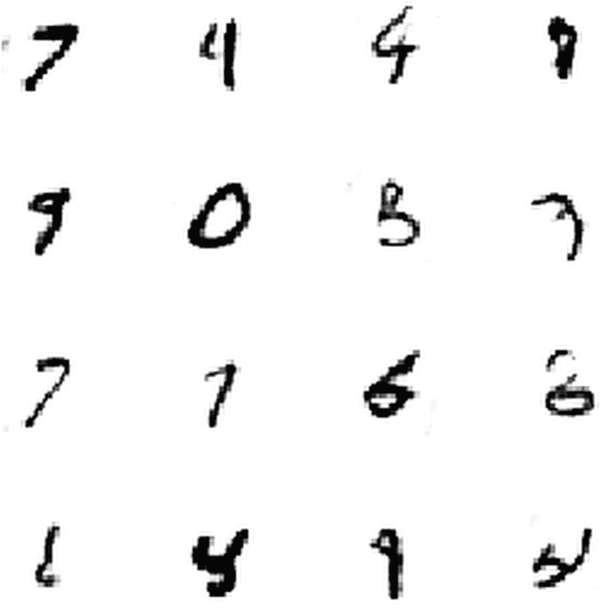

GAN 生成的 MNIST 字符

这些字符中的大多数看起来像是可识别的数字，尽管有些，比如左下方和右下方的那些，看起来有点不对。

我们编写和探索的代码现在输出在下面的图表中，向我们展示了越来越多的纪元的区分和生成损失。

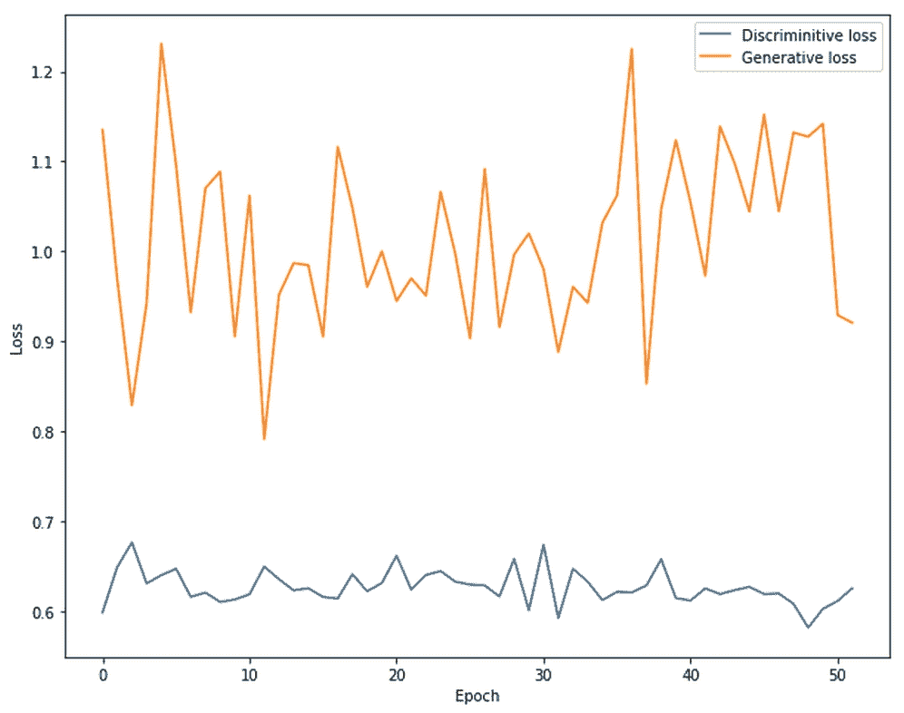

甘训练进度

请注意，GAN 训练中的损失是不可解释的，因为它是监督学习。即使 GAN 有所进展，GAN 的损失也不会减少。

发生器和鉴别器的损耗取决于另一个模型的性能。如果发电机在愚弄鉴频器方面变得更好，那么鉴频器损耗将保持高水平。如果其中一个损失变为零，这意味着另一个模型输掉了比赛，不能再欺骗或正确区分另一个模型。

这也是 GAN 训练这么辛苦的原因之一:**GAN 不收敛到低损解**；它们收敛到一个*均衡*，在这个均衡中，发生器不是一直愚弄鉴别器，而是很多次。这种平衡并不总是稳定的。标签和网络本身增加了如此多的噪声，部分原因是它增加了平衡的稳定性。

由于 GAN 不稳定且困难，但很有用，随着时间的推移，许多技巧被开发出来，使 GAN 训练更加稳定。了解这些技巧可以帮助你完成 GAN 构建过程，并节省你无数的时间，尽管这些技巧通常没有理论上的原因。

## 了解 GAN 潜在传播媒介

对于自动编码器，潜在的空间是 PCA 的一个相对简单的近似。VAEs 创建了一个潜在的分布空间，这是有用的，但仍然很容易被看作是一种 PCA 形式。那么，如果我们只是在训练过程中从 GAN 中随机抽取样本，那么 GAN 的潜在空间是什么呢？事实证明，甘斯自我构建了潜在空间。使用 GAN 的潜在空间，你仍然可以通过显示的字符对 MNIST 图像进行聚类。

研究表明，GANs 的潜在空间通常具有一些令人惊讶的特征，例如“微笑向量”，它根据人的微笑宽度排列面部图像。研究人员还表明，GANs 可以用于潜在空间代数，其中添加不同对象的潜在表示可以创建现实的新对象。然而，对甘斯潜在空间的研究仍处于起步阶段，从潜在空间表征中得出关于世界的结论是一个活跃的研究领域。

## 甘训练的招数

甘人很难训练。它们可能会以多种不同的方式崩溃、分化或失败。研究人员和从业者已经想出了一些让 GANs 更好工作的技巧。虽然这看起来很奇怪，但不知道为什么会这样，但对我们来说重要的是它们在实践中有所帮助:

*   **归一化输入**:gan 不适合极端值，所以确保你总是有介于-1 和 1 之间的归一化输入。这也是为什么你应该使用双曲正切函数作为你的发电机输出。
*   **Don't use the theoretical correct loss function**: If you read papers on GANs, you will find that they give the generator optimization goal as the following formula: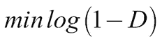

    在这个公式中， *D* 是鉴频器输出。实际上，如果生成器的目标是这样的，效果会更好:

    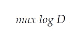

    换句话说，与其最小化负鉴频器输出，不如最大化鉴频器输出。原因在于，在 GAN 训练过程的开始，第一目标通常具有消失梯度。

*   **从正态高斯分布**采样:从正态分布而不是均匀分布采样有两个原因。第一，GANs 不太适合极值，正态分布的极值比均匀分布少。此外，已经证明，如果从正态分布中采样潜在向量，则潜在空间变成球体。这个球体中的潜在向量之间的关系比立方体空间中的潜在向量更容易描述。
*   **使用批量标准化**:我们已经看到，gan 不适合极端值，因为它们非常脆弱。减少极值的另一种方法是使用批量标准化，正如我们在第 3 章、*中讨论的利用计算机视觉*。
*   **对真实数据和虚假数据使用不同的批次**:在这个过程的开始，真实数据和虚假数据可能有非常不同的分布。由于 batch norm 使用批次的平均值和标准偏差对批次进行标准化，因此最好将真实数据和虚假数据分开。虽然这确实会导致梯度估计的精确度稍低，但从更少的极值中获得的收益是很大的。
*   **使用柔软且有噪音的标签** : GANs 易碎；软标签的使用降低了梯度并防止梯度翻转。给标签添加一些随机噪声也有助于稳定系统。
*   **使用基本的 GAN**:现在有很多种 GAN 型号。他们中的许多人声称性能得到了极大的提高，但实际上，与简单的**深度卷积生成对抗网络、**或 **DCGAN** 相比，他们并没有工作得更好，甚至常常更差。这并不意味着它们没有存在的理由，但是对于大部分的任务来说，更基本的 GANs 会表现得更好。另一个工作良好的 GAN 是对抗性自动编码器，它通过在鉴别器的梯度上训练自动编码器，将 VAE 与 GAN 结合起来。
*   **避免 ReLU 和 MaxPool** : ReLU 激活和 MaxPool 层经常用于深度学习，但它们有产生“稀疏梯度”的缺点。对于负输入，ReLU 激活将不具有任何梯度，对于不是最大输入的所有输入，MaxPool 层将不具有任何梯度。因为梯度是生成器被训练的对象，稀疏梯度会损害生成器的训练。
*   **使用 Adam 优化器**:这个优化器已经被证明可以很好地处理 GANs，而许多其他优化器却不能很好地处理它们。
*   **Track failures early**: Sometimes, GANs can fail for random reasons. Just choosing the "wrong" random seed could set your training run up for failure. Usually, it is possible to see whether a GAN goes completely off track by observing outputs. They should slowly become more like real data.

    例如，如果生成器完全偏离轨道，只生成零，你将能够在花费数天的 GPU 时间进行无处可去的训练之前看到它。

*   **不要通过统计平衡损耗**:保持发生器和鉴别器之间的平衡是一项微妙的任务。因此，许多从业者试图通过根据统计对生成器或鉴别器进行更多的培训来帮助平衡。通常，这不起作用。GANs 是非常违反直觉的，试图用直觉的方法帮助他们通常会使事情变得更糟。这并不是说没有办法帮助达到 GAN 平衡，但是这种帮助应该源于一种原则性的方法，例如“在发电机损耗高于 *X* 时训练发电机。”
*   **如果你有标签，使用它们**:一个稍微复杂一点的 GAN 鉴别器不仅可以将数据分类为真或假，还可以将数据分类。在 MNIST 的例子中，鉴别器有 11 个输出:10 个实数的输出和一个伪数的输出。这使得我们可以创建一个可以显示更多特定图像的 GAN。这在半监督学习领域很有用，我们将在下一节中介绍。
*   **增加输入噪声，随时间降低噪声**:噪声增加了 GAN 训练的稳定性，因此噪声输入有所帮助也就不足为奇了，尤其是在训练 GAN 的早期不稳定阶段。然而，后来，它可以混淆太多，并阻止 GAN 生成逼真的图像。因此，随着时间的推移，我们应该降低施加于输入端的噪声。
*   **在训练和测试阶段都使用 G 中的漏失**:一些研究人员发现在推理时间使用漏失会导致生成数据的更好结果。为什么会这样仍然是一个未解决的问题。
*   **历史平均值**:甘倾向于“摆动”，在训练中他们的体重在一个平均值附近快速移动。历史平均惩罚那些离历史平均值太远的权重，减少波动。因此，它增加了 GAN 训练的稳定性。
*   **重放缓冲区**:重放缓冲区保存了大量旧的生成图像，因此它们可以重新用于训练鉴别器。这与历史平均具有相似的效果，减少了振荡并增加了稳定性。它还减少了相关性和测试数据。
*   **目标网络**:另一个“反振荡”技巧是使用目标网络。也就是说，创建生成器和鉴别器的副本，然后用鉴别器的冻结副本训练生成器，用生成器的冻结副本训练鉴别器。
*   **熵正则化**:熵正则化是指奖励网络输出更多不同的值。这可以防止发生器网络决定产生几样东西，比如说，只产生数字 7。这是一种正则化方法，因为它可以防止过度拟合。
*   **使用漏失层或噪声层**:噪声对 GANs 有好处。Keras 不仅具有脱落层，而且还具有许多噪声层，这些噪声层向网络中的激活添加不同种类的噪声。您可以阅读这些层的文档，看看它们是否对您的特定 GAN 应用有所帮助:[https://keras.io/layers/noise/](https://keras.io/layers/noise/)。


# 使用更少的数据——主动学习

无论是 GANs 还是 VAEs，生成模型的部分动机总是让我们能够生成数据，因此需要更少的数据。由于数据天生稀少，尤其是在金融领域，而且我们永远也不会有足够的数据，生成模型似乎是经济学家警告我们的免费午餐。然而，即使是最好的 GAN 在没有数据的情况下也能工作。在这一节中，我们将看看使用尽可能少的数据来引导模型的不同方法。这种方法也被称为主动学习或半监督学习。

**无监督学习**使用未标记数据以不同方式对数据进行聚类。一个例子是自动编码器，其中图像可以被转换成学习和潜在的向量，然后可以被聚类而不需要描述图像的标签。

**监督学习**使用带标签的数据。一个例子是我们在[第 3 章](ch03.html "Chapter 3. Utilizing Computer Vision")、*中利用计算机视觉、*或我们在本书中构建的大多数其他模型构建的图像分类器。

**半监督学习**旨在执行通常由监督模型完成的任务，但手头的数据较少，并且使用非监督或生成方法。有三种方法可以做到这一点:首先，更聪明地利用人类；第二，通过更好地利用未标记的数据，第三，通过使用生成模型。

## 有效使用标签预算

对于所有关于人工智能取代人类的讨论，需要大量的人类来训练人工智能系统。虽然数字不清楚，但可以肯定的是，亚马逊的 MTurk 服务上有 50 万到 75 万注册的“机械土耳其人”。

MTurk 是一个亚马逊网站，根据它自己的网站，提供“通过 API 的人类智能”在实践中，这意味着公司和研究人员发布简单的工作，如填写调查问卷或对图像进行分类，世界各地的人都在执行这些任务，每项任务只收取几分钱。为了让 AI 学习，人类需要提供标记的数据。如果任务是大规模的，那么许多公司将雇用 MTurk 用户，以便让人类做标记。如果是小任务，你会经常发现公司自己的工作人员在标注数据。

令人惊讶的是，很少有人考虑这些人的标签。并非所有的标签都同样有用。下图显示了一个线性分类器。如您所见，靠近两个类之间边界的边界点决定了决策边界的位置，而后面的点则不相关:

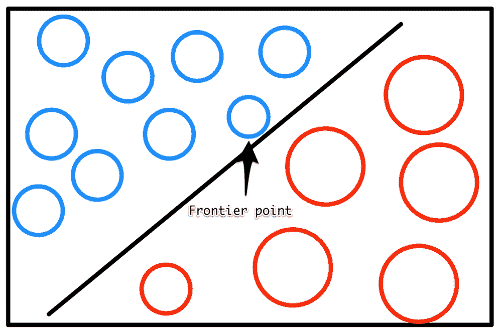

边境点更有价值

因此，边界点比远离决策边界的点更有价值。通过执行以下操作，可以使用较少的数据进行训练:

1.  仅标记一些图像
2.  训练弱模型
3.  让弱模型对一些未标记的图像进行预测
4.  标记模型最不确定的图像，并将它们添加到您的训练集中
5.  重复这个过程

这种标注数据的过程比随机标注数据要有效得多，可以大大加快您的工作速度。

## 利用机器进行人工标记

在贴标方面，很多公司依赖微软 Excel。他们让贴标签的人看着要贴标签的东西，比如一张图片或一段文字，然后那个人将标签输入 Excel 电子表格。虽然这非常低效且容易出错，但这是一种常见的做法。一些稍微高级一点的标记操作包括构建一些简单的 web 应用程序，让用户看到要标记的项目并直接单击标签或按热键。这可以大大加快贴标过程。然而，如果有大量的标签类别，这仍然不是最佳的。

另一种方法是再次标记一些图像并预训练弱模型。在贴标签的地方，计算机向贴标签机显示数据和标签。贴标签机只需要决定这个标签是否正确。这可以很容易地用热键来完成，而且标记一件商品所花的时间也大大减少了。如果标签是错误的，标签界面可以调出一个可能选项的列表，按照模型分配给它们的概率进行排序，或者只是将项目放回堆栈，并在下一次显示下一个最可能的标签。

这种技术的一个很好的实现是“Prodigy”，这是一个由 spaCy 公司开发的标记工具，我们在[第 5 章](ch05.html "Chapter 5. Parsing Textual Data with Natural Language Processing")、*用自然语言处理解析文本数据*中了解过，我们可以在下面的截图中看到 Prodigy 工具的一个例子:


Prodigy 标签工具的屏幕截图

Prodigy 是一个利用机器的标签工具，你可以通过阅读它的官方文档了解更多信息:[https://prodi.gy/](https://prodi.gy/)。

### 注意

**注**:更好的用户界面设计和弱模型的智能实现，可以大大加快贴标的速度和质量。

## 未标记数据的伪标记

通常有大量的未标记的数据可用，但是只有少量的数据已经被标记。未标记的数据仍然可以使用。首先，根据已有的标记数据训练一个模型。然后你让这个模型对你的未标注数据进行预测。您将这些预测视为真正的标注，并在完整的伪标注数据集上训练您的模型。然而，真正的真实标签应该比伪标签更常用。

伪标签的精确采样率可能因不同情况而异。这在误差是随机的条件下是可行的。如果他们有偏见，你的模型也会有偏见。这种简单的方法非常有效，可以大大减少标记工作。

## 使用生成模型

事实证明，GANs 很自然地延伸到半监督训练。通过给鉴别器两个输出，我们可以把它训练成一个分类器。

鉴别器的第一个输出仅将数据分类为真或假，就像之前对 GAN 所做的那样。第二个输出按照类别对数据进行分类，例如，图像代表的数字，或者一个额外的“is fake”类别。在 MNIST 的例子中，分类输出将有 11 个类，10 个数字加上“是假的”类。诀窍在于，生成器是一个模型，只有输出(即最后一层)是不同的。这迫使“真实与否”分类与“哪个数字”分类器共享权重。

这个想法是，为了确定一个图像是真是假，分类器必须弄清楚它是否能把这个图像归为一类。如果可以，图像很可能是真实的。这种方法被称为**半监督生成对抗网络** ( **SGAN** )，已经被证明能够生成更真实的数据，并在有限的数据上提供比标准监督学习更好的结果。当然，GANs 不仅仅可以应用于图像。

在下一节中，我们将把它们应用到我们的欺诈检测任务中。


# 用于欺诈检测的 SGANs

作为本章最后应用的项目，我们再来考虑一下信用卡的问题。在本节中，我们将创建一个 SGAN，如下所示:

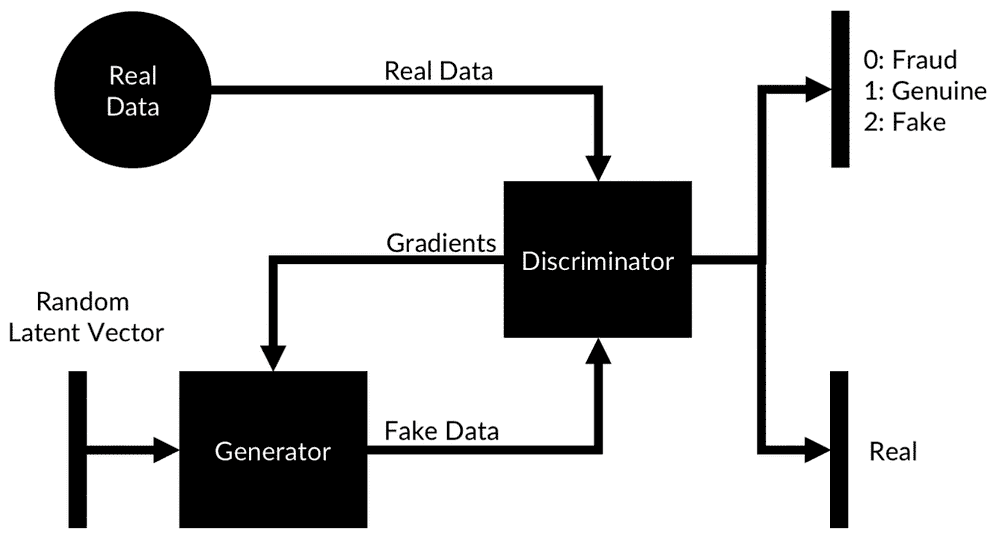

SGAN 方案

我们将在不到 1，000 笔交易上训练这个模型，但仍然会得到一个不错的欺诈检测器。

### 注意

**注**:您可以在此链接下找到 Kaggle 上 SGAN 的代码:[https://www . ka ggle . com/jannesklaas/semi-supervised-gan-for-fraud-detection/code](https://www.kaggle.com/jannesklaas/semi-supervised-gan-for-fraud-detection/code)。

在这种情况下，我们的数据有 29 个维度。我们设定我们的潜在向量有 10 个维度:

```
latent_dim=10

data_dim=29
```

生成器模型被构建为一个具有`LeakyReLU`激活和批量标准化的全连接网络。输出激活是一个`tanh`激活:

```
model = Sequential()

model.add(Dense(16, input_dim=latent_dim))

model.add(LeakyReLU(alpha=0.2))

model.add(BatchNormalization(momentum=0.8))

model.add(Dense(32, input_dim=latent_dim))

model.add(LeakyReLU(alpha=0.2))

model.add(BatchNormalization(momentum=0.8))

model.add(Dense(data_dim,activation='tanh'))
```

为了更好地使用生成器模型，我们将我们创建的模型包装到一个功能 API 模型中，该模型将 noise 向量映射到一个生成的事务记录。因为大多数甘文献都是关于图像的，而“交易记录”又有点拗口，所以我们就把我们的交易记录命名为“图像”:

```
noise = Input(shape=(latent_dim,))

img = model(noise)

generator = Model(noise, img)
```

正如我们对生成器所做的那样，我们在顺序 API 中构建鉴别器。鉴别器有两个输出:一个用于类别，一个用于假冒或不假冒。我们首先只构建模型的基础:

```
model = Sequential()

model.add(Dense(31,input_dim=data_dim))

model.add(LeakyReLU(alpha=0.2))

model.add(BatchNormalization(momentum=0.8))

model.add(Dropout(0.25))

model.add(Dense(16,input_dim=data_dim))

model.add(LeakyReLU(alpha=0.2))
```

现在，我们将使用函数式 API 将鉴别器的输入映射到它的两个头:

```
img = Input(shape=(data_dim,))                               #1

features = model(img)                                        #2

valid = Dense(1, activation="sigmoid")(features)             #3

label = Dense(num_classes+1, activation="softmax")(features) #4

discriminator = Model(img, [valid, label])                   #5
```

让我们花点时间来看看前面代码的五个关键方面:

1.  我们为噪声向量创建一个输入占位符
2.  我们从鉴别器基本模型中得到特征张量
3.  我们创建一个`Dense`层，用于将交易分类为真实或不真实，并将其映射到特征向量
4.  我们创建第二个`Dense`层，用于将交易分类为真实或虚假
5.  我们创建一个将输入映射到两个头的模型

为了编译双头鉴别器，我们需要使用一些高级的模型编译技巧:

```

		optimizer = Adam(0.0002, 0.5) #1

		discriminator.compile(loss=['binary_crossentropy',

									'categorical_crossentropy'], #2

									loss_weights=[0.5, 0.5], #3

									optimizer=optimizer, #4

									metrics=['accuracy']) #5

```

分解这些代码，我们可以看到五个关键要素:

1.  我们定义一个`Adam`优化器，其学习速率为`0.0002`，动量为`0.5`。
2.  由于我们有两个模型头，我们可以指定两个损失。我们的真假头是一个二元分类器，所以我们用`binary_crossentropy`来表示它。我们的分类头是一个多级分类器，所以我们使用`categorical_crossentropy`作为第二个分类头。
3.  我们可以指定如何对两种不同的损失进行加权。在这种情况下，我们给所有损失 50%的权重。
4.  我们优化我们预定义的`Adam`优化器。
5.  只要我们没有使用软标签，我们就可以使用准确性度量来跟踪进展。

最后，我们创建我们的组合 GAN 模型:

```
noise = Input(shape=(latent_dim,))               #1

img = generator(noise)                           #2

discriminator.trainable = False                  #3

valid,_ = discriminator(img)                     #4

combined = Model(noise , valid)                  #5

combined.compile(loss=['binary_crossentropy'],optimizer=optimizer)
```

再次查看代码，我们可以看到以下要点:

1.  我们为噪声向量输入创建一个占位符。
2.  我们通过将生成器映射到噪声占位符来获得表示生成图像的张量。
3.  我们确保不会通过将鉴别器设置为不可训练来破坏它。
4.  我们只希望鉴别器相信生成的事务是真实的，因此我们可以丢弃分类输出张量。
5.  我们将噪声输入映射到鉴别器的“假或非假”输出。

对于训练，我们定义了一个`train`函数，它为我们处理所有的训练:

```

	def train(X_train,y_train,

				X_test,y_test,

				generator,discriminator,

				combined,

				num_classes,

				epochs,

				batch_size=128):

    f1_progress = []                                             #1

    half_batch = int(batch_size / 2)                             #2

    cw1 = {0: 1, 1: 1}                                           #3

    cw2 = {i: num_classes / half_batch for i in range(num_classes)}

    cw2[num_classes] = 1 / half_batch

    for epoch in range(epochs):

        idx = np.random.randint(0, X_train.shape[0], half_batch) #4

        imgs = X_train[idx]

        noise = np.random.normal(0, 1, (half_batch, 10))         #5

        gen_imgs = generator.predict(noise)

        valid = np.ones((half_batch, 1))                           #6

        fake = np.zeros((half_batch, 1))

        labels = to_categorical(y_train[idx], num_classes=num_classes+1)                                         #7

        fake_labels = np.full((half_batch, 1),num_classes)         #8

        fake_labels = to_categorical(fake_labels,num_classes=num_classes+1)

        d_loss_real = discriminator.train_on_batch(imgs, [valid, labels],class_weight=[cw1, cw2])  #9

        d_loss_fake = discriminator.train_on_batch(gen_imgs, [fake, fake_labels],class_weight=[cw1, cw2])  #10

        d_loss = 0.5 * np.add(d_loss_real, d_loss_fake)            #11

        noise = np.random.normal(0, 1, (batch_size, 10))           #12

        validity = np.ones((batch_size, 1))

        g_loss = combined.train_on_batch(noise, validity, class_weight=[cw1, cw2]) #13

        print ("%d [D loss: %f] [G loss: %f]" % (epoch, g_loss))  #14

        if epoch % 10 == 0:                                       #15

            _,y_pred = discriminator.predict(X_test,batch_size=batch_size)

            y_pred = np.argmax(y_pred[:,:-1],axis=1)

            f1 = f1_score(y_test,y_pred)

            print('Epoch: {}, F1: {:.5f}'.format(epoch,f1))

            f1_progress.append(f1)

    return f1_progress
```

暂停一分钟:这是一个非常长且复杂的函数代码。在总结本章之前，让我们先来看看该准则的 15 个关键要素:

1.  我们创建一个空数组来监控测试集上鉴别器的 F1 分数。
2.  由于我们对真实数据和虚假数据使用单独的批量训练步骤，我们实际上对每个训练步骤使用了半个批量。
3.  鉴别器的分类头有一个“这是假的”的分类标签由于一半的图像是假的，我们想给这个类一个更高的权重。
4.  我们现在抽取真实数据的随机样本。
5.  我们生成一些随机噪声向量，并使用生成器创建一些假数据。
6.  对于“假的还是假的”头像，我们创建标签。所有真实图像都有标签`1`(真实)，而所有虚假图像都有标签`0`(虚假)。
7.  我们对真实数据的标签进行一次性编码。通过指定我们的数据比它实际拥有的多一个类，我们为“is fake”类留出了空间。
8.  我们的假数据都被贴上了“是假的”标签。我们创建了这些标签的向量，并对它们进行一次性编码。
9.  首先，我们在真实数据上训练鉴别器。
10.  然后我们用假数据训练鉴别器。
11.  该时期鉴别器的总损失是真实和虚假数据损失的平均值。
12.  现在我们训练发电机。我们生成了一批噪声向量和一批标签，上面写着“这是真实数据”
13.  有了这些数据，我们就可以训练发电机。
14.  为了跟踪正在发生的事情，我们打印出进度。请记住，我们不希望损失下降；我们希望它们大致保持不变。如果发生器或鉴别器中的任何一个开始比另一个表现好得多，那么平衡就被打破了。
15.  最后，我们计算并输出使用鉴别器作为数据欺诈检测分类器的 F1 分数。这一次，我们只关心分类数据，丢弃“真假”头。我们根据最高值对交易进行分类，最高值不是分类器的“真实”类。

现在我们已经设置好了一切，我们将训练我们的 SGAN 5000 个纪元。这在 GPU 上大约需要 5 分钟，但如果您没有 GPU，可能需要更长时间:

```
f1_p = train(X_res,y_res,X_test,y_test,generator,discriminator,combined,num_classes=2,epochs=5000, batch_size=128)
```

最后，我们绘制半监督欺诈分类器随时间变化的 F1 分数:

```
fig = plt.figure(figsize=(10,7))

plt.plot(f1_p)

plt.xlabel('10 Epochs')

plt.ylabel('F1 Score Validation')
```

这将输出如下图所示:

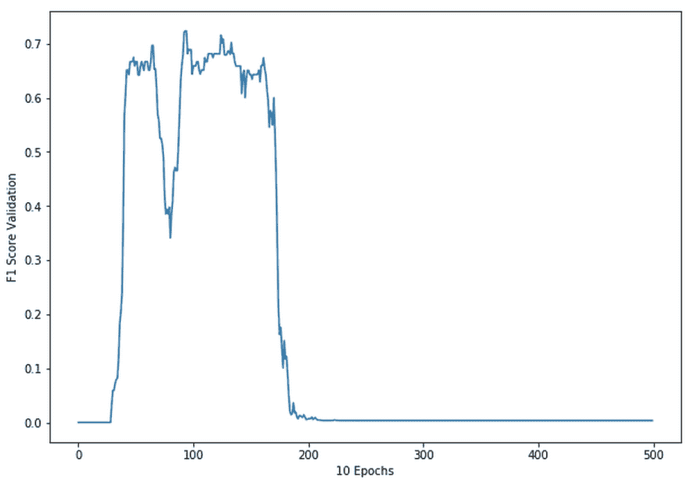

SGAN 进展

正如你所看到的，模型一开始学得很快，但是随着 F1 分数变为零，它就崩溃了。这是 GAN 坍塌的典型例子。如前所述，gan 是不稳定的。如果发生器和鉴别器之间的微妙平衡被打破，性能会迅速下降。

使 GANs 更稳定是一个活跃的研究领域。到目前为止，许多从业者只是试图尝试用不同的超参数和随机种子进行多次运行，以期获得好运。另一种流行的方法是每隔一段时间保存一次模型。该模型在 150 年左右似乎是一个相当不错的欺诈检测器，尽管在不到 1000 次交易中接受了训练。


# 练习题

要更好地使用创成式模型，请尝试以下练习:

1.  创建 SGAN 以训练 MNIST 图像分类器。使用几幅图像就能达到 90%以上的分类准确率？
2.  使用 LSTMs，您可以为股票价格变动构建一个自动编码器。使用数据集，如 DJIA 股票价格，构建一个编码股票走势的自动编码器。然后想象当你穿过潜在空间时，输出会发生什么。可以在这里找到数据集:[https://www . ka ggle . com/szrlee/stock-time-series-2005 01 01-to-2017 12 31](https://www.kaggle.com/szrlee/stock-time-series-20050101-to-20171231)。


# 总结

在这一章中，你已经学习了两种最重要的生成模型:自动编码器和 GANs。我们首先为 MNIST 图像开发了一个自动编码器。然后，我们使用类似的架构来编码信用卡数据和检测欺诈。之后，我们将自动编码器扩展为 VAE。这使我们能够了解编码的分布，并生成可用于训练的新数据。

后来，我们又了解了甘斯，首先是在 MNIST 图像的背景下，然后是在信用卡欺诈的背景下。我们使用 SGAN 来减少训练欺诈检测器所需的数据量。我们使用模型输出，通过主动学习和更智能的标签界面来减少必要的标签数量。

我们还讨论并了解了潜在空间及其在财务分析中的用途。我们看到了 t-SNE 算法，以及如何使用它来可视化更高维度(潜在的)数据。你也对机器学习如何解决博弈论优化问题有了第一印象。gan 解决了一个极大极小问题，这个问题在经济学和金融学中经常出现。

在下一章中，我们将在讨论强化学习时深入探讨这种类型的优化。