<title>Chapter 7. Reinforcement Learning for Financial Markets</title> 

# 第七章。金融市场的强化学习

人类不会从数百万个有标签的例子中学习。相反，我们经常从与我们的行为相关的正面或负面经历中学习。摸过一次热炉子的孩子将永远不会再碰它。从经验中学习以及相关的奖励或惩罚是**强化学习** ( **RL** )背后的核心思想。RL 允许我们在完全没有数据的情况下学习复杂的决策规则。通过这种方法，人工智能领域出现了几次高调的突破，例如 AlphaGo 在 2016 年击败了世界围棋冠军。

在金融领域，强化学习，也被称为 RL，也正在取得进展。在其 2017 年的报告*投资管理中的机器学习*([https://www.ahl.com/machine-learning](https://www.ahl.com/machine-learning))中，曼 AHL 概述了外汇和期货市场中订单路由的强化系统。订单路径是数量金融学中的经典问题。下单时，基金通常可以选择不同的券商，在不同的时间下单。目标是尽可能便宜地完成订单。这也意味着尽量减少对市场的影响，因为大订单可以提高股票价格。

名字五颜六色的传统算法如*狙击手*或*游击队*依赖于历史数据的统计和智能工程。基于 RL 的路由系统自己学习最佳路由策略。优势在于该系统可以适应不断变化的市场，正因为如此，它在数据丰富的市场(如外汇市场)中优于传统方法。

但是，RL 可以做的更多。OpenAI 的研究人员已经使用 RL 来预测代理何时会合作或战斗。与此同时，在 DeepMind，那里的研究人员已经使用 RL 对大脑额叶皮质的工作和多巴胺激素的作用产生了新的见解。

本章将用一个简单的“抓水果”游戏开始对 RL 的直观介绍。然后，在讨论更高级的 RL 应用之前，我们将深入研究基础理论。本章中的例子依赖于不容易在 Kaggle 内核中呈现的可视化。为了简化它们，示例算法也没有针对 GPU 的使用进行优化。因此，最好在本地机器上运行这些示例。

本章中的算法运行速度相对较快，所以你不用等太久。章节代码是在 2012 年中期的 MacBook Pro 上编写的，没有一个例子在那台机器上运行超过 20 分钟。当然，您也可以在 Kaggle 上运行代码，但是可视化在那里无法工作。

# Catch——强化学习快速指南

Catch 是一款简单的街机游戏，你小时候可能玩过。水果从屏幕顶部的落下，玩家必须用篮子接住它们。每抓到一个水果，玩家得一分。每失去一个水果，玩家就失去一分。

这里的目标是让电脑自己玩接球。为了使任务更简单，我们将在本例中使用简化版本:

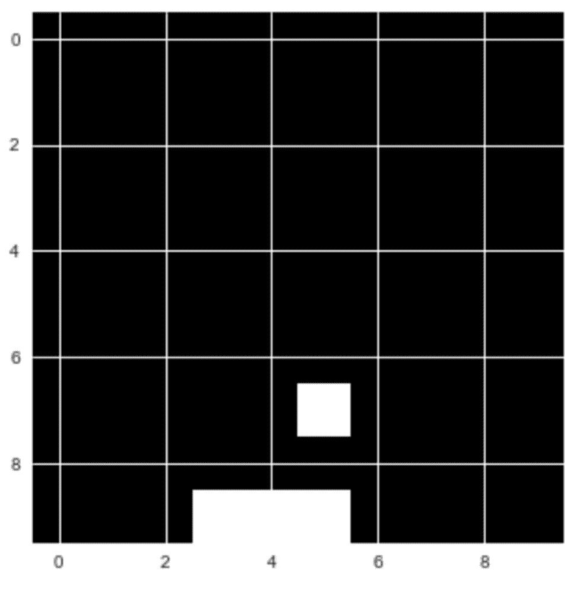

我们将创建的“接球”游戏

玩接球游戏时，玩家在三种可能的动作中做出选择。他们可以将篮子向左、向右移动，或者保持不动。

这个决定的基础是游戏的当前状态；换句话说，下落的水果和篮子的位置。我们的目标是创建一个模型，给定游戏屏幕的内容，选择导致最高分的动作。这个任务可以看作是一个简单的分类问题。我们可以让专业的人类玩家多次玩这个游戏，并记录他们的行为。然后，我们可以训练一个模型来选择反映专家玩家的“正确”动作。

然而，这不是人类学习的方式。人类可以在没有指导的情况下自己学习一种游戏，比如接球。这非常有用，因为想象一下，如果每次你想学习像接球这样简单的东西时，你都必须雇用一群专家来执行一项任务数千次:这将是昂贵而缓慢的。

在强化学习中，模型从经验中训练，而不是标记的数据。我们不是给模型提供正确的行动，而是给它提供奖励和惩罚。该模型接收关于环境的当前状态的信息，例如，计算机游戏屏幕。然后它输出一个动作，比如操纵杆的移动。环境对此动作作出反应，并提供下一个状态以及任何奖励:


RL 方案

该模型然后学习寻找导致最大回报的行动。这在实践中有许多可行的方法。现在，我们来看看 **Q-learning** 。当 Q-learning 被用来训练一台电脑玩雅达利视频游戏时，它引起了轰动。今天，它仍然是一个相关的概念。大多数现代 RL 算法都是基于对 Q 学习的一些修改。

理解 Q-learning 的一个很好的方法是比较玩接球和下棋。在这两个游戏中，都给你一个状态， *s* 。在国际象棋中，这是棋盘上图形的位置。在 Catch 中，这是水果和篮子的位置。然后，玩家必须采取一个动作*一个*。在国际象棋中，这是移动一个图形。在 Catch 中，这是将篮子向左或向右移动或保持在当前位置。

这样一来，就会有一些奖励， *r，*和一个新的状态，。抓人和下棋的问题在于，奖励不会在行动后立即出现。

在接球游戏中，只有当水果击中篮筐或掉落在地板上时，你才能获得奖励，而在象棋中，只有当你赢得或输掉比赛时，你才能获得奖励。这意味着奖励分布稀疏。大多数时候， *r* 会为零。当有奖励时，它并不总是前一步行动的结果。很久以前采取的一些行动可能会导致胜利。弄清楚哪种行为对奖励负责通常被称为信用分配问题。因为奖励是延迟的，好的棋手不会只根据眼前的奖励来选择他们的棋。相反，他们选择预期的未来回报。

例如，他们不仅考虑他们是否能在下一步行动中消除对手的身影，他们还考虑现在采取特定行动将如何在长远上帮助他们。在 Q-learning 中，我们根据最高的预期未来回报来选择我们的行动。我们使用一个 **Q 函数**来计算这个。这是一个数学函数，有两个参数:游戏的当前状态和给定的动作。我们可以把这个写成 *Q(状态，动作)*。

在状态 *s* 时，我们估计每个可能行为的未来回报 *a* 。我们假设在我们采取了行动 *a* 并转移到下一个状态之后，一切都完美了。对于给定的状态和动作，预期的未来回报*q(s，a)*被计算为即时回报，加上此后的预期未来回报 T19。我们假设下一个行动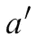是最优的。因为未来存在不确定性，我们用因子γ来贴现，。因此，我们达到了预期的回报:

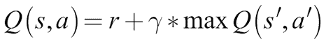

### 注

**注意**:我们在 RL 中贴现未来回报的原因与我们在财务中贴现未来回报的原因相同。他们不确定。我们的选择反映了我们对未来回报的重视程度。

好棋棋手非常擅长在脑子里估算未来的回报。换句话说，他们的 Q 函数， *Q(s，a)，*非常精确。

大多数国际象棋练习都围绕着开发一个更好的 Q 函数。玩家细读许多旧游戏，以了解特定的动作在过去是如何进行的，以及给定的动作有多大可能导致胜利。然而，这提出了一个问题，机器如何估计一个好的 Q 函数？这就是神经网络发挥作用的地方。

## Q-learning 将 RL 转化为监督学习

玩游戏时，我们会产生很多“体验”这些经验包括以下内容:

*   初始状态，*年代*
*   所采取的行动，*一*
*   获得的奖励， *r*
*   接下来的状态，

这些经验就是我们的训练数据。我们可以把估计 *Q(s，a)* 的问题框定为一个回归问题。为了解决这个问题，我们可以使用神经网络。给定由 *s* 和 *a* 组成的输入向量，假设神经网络预测 *Q(s，a)* 的值等于目标值: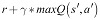。如果我们擅长为不同的状态 *s* 和动作 *a* 预测 *Q(s，a)* ，我们将会对 Q 函数有一个很好的近似。

### 注

**注**:我们通过与 *Q(s，a)* 相同的神经网络来估计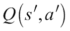。这导致了一些不稳定性，因为我们的目标现在随着网络的学习而改变，就像**生成敌对网络(GANs)** 一样。

给定一批经验，那么训练过程看起来如下:

1.  对于每个可能的行动，，(左，右，停留)，使用神经网络预测预期的未来回报，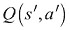。
2.  选择三个预测中的最高值作为最大值，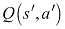。
3.  计算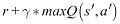。这是神经网络的目标值。
4.  使用损失函数训练神经网络。这是一个计算预测值离目标值有多近或多远的函数。这里，我们将使用作为损失函数。实际上，我们希望最小化预测和目标之间的平方误差。系数 0.5 只是为了让渐变更好。

在游戏过程中，所有的经历都存储在回放记忆中。这就像一个简单的缓冲区，我们在其中存储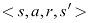对。`ExperienceReplay`类还处理为训练准备数据。

查看以下代码:

```
class ExperienceReplay(object):                                   #1

    def __init__(self, max_memory=100, discount=.9):

        self.max_memory = max_memory                              #2

        self.memory = []

        self.discount = discount

    def remember(self, states, game_over):                        #3

        self.memory.append([states, game_over])

        if len(self.memory) > self.max_memory:

            del self.memory[0]                                    #4

    def get_batch(self, model, batch_size=10):                    #5

        len_memory = len(self.memory)                             #6

        num_actions = model.output_shape[-1]

        env_dim = self.memory[0][0][0].shape[1]

        inputs = np.zeros((min(len_memory, batch_size), env_dim)) #7

        targets = np.zeros((inputs.shape[0], num_actions))

        for i, idx in enumerate(np.random.randint(0, len_memory, size=inputs.shape[0])):           #8

            state_t, action_t, reward_t, state_tp1 = self.memory[idx][0]                               #9

            game_over = self.memory[idx][1]

            inputs[i:i+1] = state_t                               #10

            targets[i] = model.predict(state_t)[0]                #11

            Q_sa = np.max(model.predict(state_tp1)[0])            #12

            if game_over:                                         #13

                targets[i, action_t] = reward_t

            else:

                targets[i, action_t] = reward_t + self.discount * Q_sa

        return inputs, targets
```

让我们暂停一下，分解一下我们刚刚创建的代码:

1.  首先，我们将体验回放缓冲区实现为一个 Python 类。重放缓冲区对象负责存储经验和生成训练数据。因此，它必须实现 Q 学习算法中一些最关键的部分。
2.  为了初始化一个 replay 对象，我们需要让它知道它的缓冲区应该有多大，以及贴现率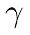是多少。重放存储器本身是遵循该方案的列表列表:

    ```
    [...[experience, game_over][experience, game_over]...]
    ```

3.  其中，`experience`是保存经验信息的元组，`game_over`是表示该步骤后游戏是否结束的二进制布尔值。
4.  当我们想要记住一个新的经历时，我们会把它添加到我们的经历列表中。因为我们不能存储无限的经验，如果我们的缓冲区超过了它的最大长度，我们就删除最旧的经验。
5.  通过`get_batch`功能，我们可以获得单批训练数据。为了计算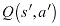，我们还需要一个神经网络，因此我们需要传递一个 Keras 模型来使用该函数。
6.  在我们开始生成一个批处理之前，我们需要知道我们在重放缓冲区中存储了多少经验，有多少可能的动作，以及一个游戏状态有多少个维度。
7.  然后，我们需要为我们想要训练神经网络的输入和目标设置占位符数组。
8.  我们以随机的顺序循环体验回放，直到我们采样了所有存储的体验或者填充了该批次。
9.  我们从重放缓冲区加载体验数据和`game_over`指示器。
10.  我们将状态 *s* 添加到输入矩阵中。稍后，模型将进行训练，以从该状态映射到预期的奖励。
11.  然后，我们用当前模型计算的预期回报来填充所有行为的预期回报。这确保了我们的模型只训练实际采取的行动，因为所有其他行动的损失为零。
12.  接下来，我们计算一下。我们简单地假设，对于下一个状态，代码中的或`state_tp1`，神经网络将完美地估计预期的回报。随着网络的训练，这个假设慢慢变成了事实。
13.  最后，如果游戏在状态 *S* 之后结束，那么来自动作 *a、*的期望奖励应该是收到的奖励、 *r* 。如果没有结束，那么预期报酬应该是收到的报酬以及贴现的预期未来报酬。

## 定义 Q-学习模型

现在是时候定义模型来学习一个捕捉的 Q 函数了。原来一个相对简单的模型已经可以很好的学习函数了。我们需要定义可能的动作数量以及网格大小。有三种可能的动作，分别是*向左移动*、*停留在位置*和*向右移动*。此外，游戏是在 10x10 像素的网格上进行的:

```
num_actions = 3

grid_size = 10
```

由于这是一个回归问题，最终层没有激活函数，损失是均方误差损失。我们使用随机梯度下降来优化网络，没有动量或任何其他附加功能:

```
model = Sequential()

model.add(Dense(100, input_shape=(grid_size**2,), activation='relu'))

model.add(Dense(100, activation='relu'))

model.add(Dense(num_actions))

model.compile(optimizer='sgd', loss='mse')
```

## 训练打接球

Q-learning 的最后一个要素是探索。日常生活表明，有时你不得不做一些奇怪和/或随机的事情，以发现是否有比你日常小跑更好的事情。

Q-learning 也是如此。总是选择最佳选项，你可能会错过一些未探索的路径。为了避免这种情况，学习者有时会随机选择一个选项，但不一定是最好的。

现在我们可以定义训练方法:

```
def train(model,epochs):

    win_cnt = 0                                                 #1

    win_hist = []

    for e in range(epochs):                                     #2

        loss = 0.

        env.reset()

        game_over = False

        input_t = env.observe()

        while not game_over:                                    #3

            input_tm1 = input_t                                 #4

            if np.random.rand() <= epsilon:                     #5

                action = np.random.randint(0, num_actions, size=1)

            else:

                q = model.predict(input_tm1)                    #6

                action = np.argmax(q[0])

            input_t, reward, game_over = env.act(action)        #7

            if reward == 1:

                win_cnt += 1

            exp_replay.remember([input_tm1, action, reward, input_t],game_over)            #8

            inputs, targets = exp_replay.get_batch(model, batch_size=batch_size)          #9

            batch_loss = model.train_on_batch(inputs, targets)

            loss += batch_loss

        win_hist.append(win_cnt)

    return win_hist
```

在我们继续之前，让我们再次分解代码，以便我们可以看到我们正在做什么:

1.  我们希望跟踪我们的 Q 学习者的进度，所以我们计算模型在一段时间内的获胜次数。
2.  我们现在玩一些游戏，由`epoch`参数指定。在一个游戏开始的时候，我们先将游戏复位，将`game_over`指示器设置为`False`，观察游戏的初始状态。
3.  然后我们会一帧一帧地玩，直到游戏结束。
4.  在一个帧周期的开始，我们将先前观察到的输入保存为`input_tm1`，即时间 *t* 处的输入减一。
5.  现在到了探索的部分。我们在零和一之间抽取一个随机数。如果数字小于`epsilon`，我们选择一个随机动作。这种技术也被称为“ε贪婪”，因为我们选择一个概率为ε的随机行为，并贪婪地选择承诺最高回报的行为。
6.  如果我们选择一个非随机行动，我们让神经网络预测所有行动的预期回报。然后，我们选择预期回报最高的行动。
7.  我们现在用我们的选择或随机动作行动，并观察一个新的状态、一个奖励和关于游戏是否结束的信息。如果我们赢了，游戏会给我们 1 的奖励，所以我们最终必须增加我们的赢数。
8.  我们将新体验存储在我们的体验重放缓冲区中。
9.  然后，我们从体验回放中抽取一个新的训练批次，并在该批次上进行训练。

下图显示了成功游戏的滚动平均值。经过大约 2000 个时代的训练，神经网络应该很擅长玩接球:

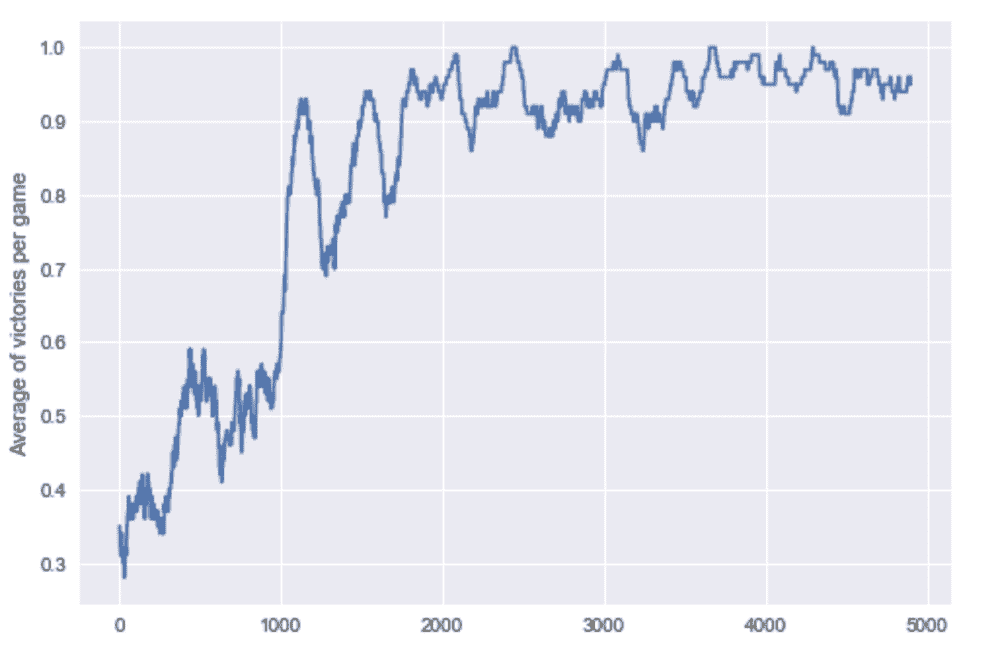

一种 Q 学习神经网络的研究进展

看前面的图表，可以肯定地说，你现在已经成功地创建了你的第一个强化学习系统，因为在 5000 个时代之后，每场比赛的平均胜率在 90%到 100%之间。在下一节中，我们将探索强化学习的理论基础，并发现学习玩 catch 的相同系统如何能够学习在期货市场中发送订单。

<title>Markov processes and the bellman equation – A more formal introduction to RL</title> 

# 马尔可夫过程和贝尔曼方程——RL 的更正式介绍

沿袭了现代深度学习是量化金融用更多 GPU 延续的悠久历史，强化学习的理论基础在于马尔可夫模型。

### 注意

**注意**:这部分需要一点数学背景知识。如果你正在挣扎，这里有一个由 Victor Powell 提供的美丽的视觉介绍:[http://setosa.io/ev/markov-chains/](http://setosa.io/ev/markov-chains/)。

在 Analytics vid hya:[https://www . Analytics vid hya . com/blog/2014/07/Markov-chain-simplified/](https://www.analyticsvidhya.com/blog/2014/07/markov-chain-simplified/)网站上有一个更正式但仍然简单的介绍。

马尔可夫模型描述了一个具有不同状态的随机过程，其中结束于特定状态的概率完全取决于一个人当前所处的状态。在下图中，您可以看到一个简单的马尔可夫模型，它描述了对一只股票的推荐:

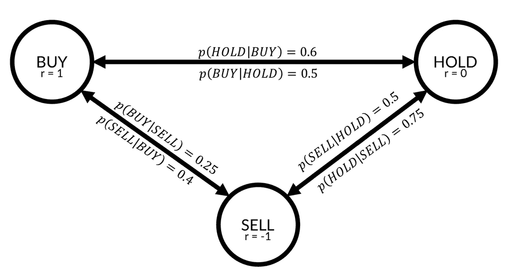

马尔可夫模型

可以看到，这个模型有三种状态，**买入**、**持有、**和**卖出**。对于每两个状态，都有一个转移概率。例如，如果一个州在前一轮中有**持有**建议，则该州获得**买入**建议的概率由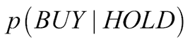描述，等于 0.5。当前在**持有**的股票有 50%的几率在下一轮转为**买入**。

状态与奖励联系在一起。如果你持有股票，而该股票有一个**买入**推荐，那么该股票将会上涨，你将获得 **1** 的奖励。如果股票有卖出建议，你将获得一个负的奖励，或惩罚，为 **-1** 。

### 注

注意:在一些教科书中，奖励与状态转换有关，而不是状态本身。它在数学上是等价的，为了便于标注，我们把奖励和状态联系起来。

在马尔可夫模型中，代理可以遵循一个策略，通常表示为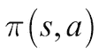。策略描述了在状态 *s* 时采取行动 *a* 的概率。假设你是一名交易员:你持有股票，该股票得到了一份卖出建议。在这种情况下，你可能在 50%的情况下选择卖出股票，在 30%的情况下选择持有股票，在 20%的情况下选择买入更多。换句话说，您针对状态**出售**的策略可以描述如下:

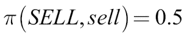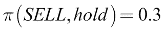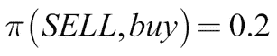

一些商人有更好的政策，可以从一个州比其他州赚更多的钱。因此，状态 *s* 的值取决于策略。当遵循策略时，值函数 *V、*描述状态 *s* 的值。当遵循政策时，它是从状态 *s* 的预期收益:

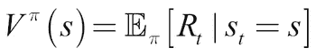

预期回报是立即获得的奖励加上贴现的未来奖励:

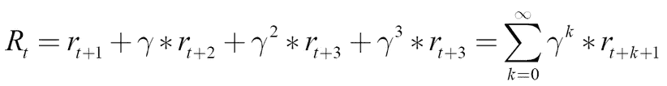

RL 中经常使用的另一个值函数是函数 *Q(s，a)，*，我们已经在前面的部分看到过。 *Q* 描述了如果遵循策略，在状态 *s* 中采取行动 *a* 的预期回报:

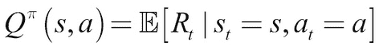

### 注意

**注意**:我们使用期望值，因为我们的环境和行为是随机的。我们不能肯定地说我们将在一个特定的州着陆；我们只能给出一个概率。

*Q* 和 *V* 描述的是同一个东西。如果发现自己处于某种状态，该怎么办？V 给出了我们应该寻求哪个状态的建议，而 Q 给出了我们应该采取哪个行动的建议。当然， *V* 隐含地假设我们必须采取一些行动，而 *Q* 假设我们行动的结果是在某种状态下着陆。实际上，无论是 *Q* 还是 *V* 都是从所谓的贝尔曼方程推导出来的，这就把我们从这一节开始又带回了马尔可夫模型。

如果您假设您所处的环境可以用马尔可夫模型来描述，那么您真的想知道两件事。首先，你会想要找出*状态转移概率*。如果你处于状态 *s* ，如果你采取行动 *a* ，那么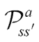结束于状态的几率有多大？数学上，它如下:

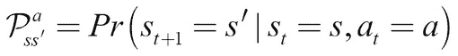

同样，你会对处于状态 *s* 的期望回报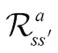感兴趣，采取行动 *a* 并结束于状态:

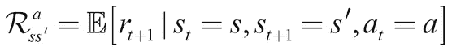

考虑到这一点，我们现在可以推导出两个关于 *Q* 和 *V* 的贝尔曼方程。首先，我们重写描述 *V* 的等式，以包含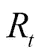的实际公式:

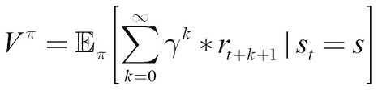

我们可以从总数中取出第一个奖励:

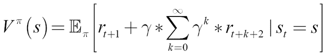

我们期望的第一部分是我们从状态 *s* 和下面的政策中直接得到的预期回报:

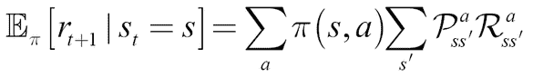

前面的等式显示了嵌套求和。首先，我们对所有动作求和， *a，*根据它们在策略下发生的概率进行加权。对于每一个动作，我们然后对从状态 *s* 到下一个状态的转换的奖励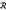的分布求和，在动作 *a* 之后，通过在转换概率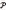之后的该转换发生的概率进行加权。

我们期望的第二部分可以改写如下:

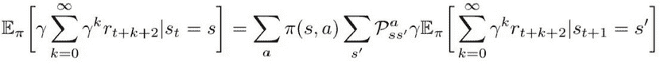

在状态 *s* 之后未来奖励的预期贴现值是所有状态的贴现预期未来值，由它们发生的概率和遵循策略采取行动 *a* 的概率加权。

这个公式很长，但是它让我们看到了值函数的递归性质。如果我们现在替换价值函数中的期望值，它会变得更清楚:

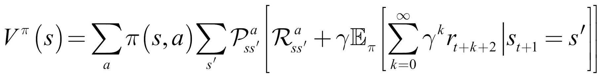

内部期望表示下一步的值函数，！这意味着我们可以用价值函数代替期望值，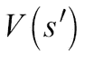:

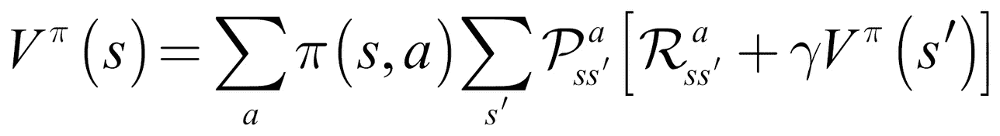

遵循同样的逻辑，我们可以如下导出 *Q* 函数:

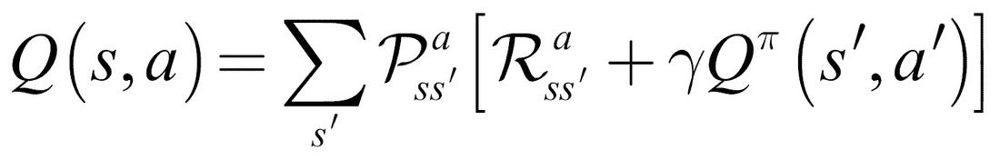

恭喜你，你已经推导出了贝尔曼方程！现在，暂停一下，花点时间思考一下，确保你真的理解了这些等式背后的机制。核心思想是一个状态的值可以表示为其他状态的值。很长一段时间以来，优化贝尔曼方程的主要方法是建立底层马尔可夫模型及其状态转移和回报概率的模型。

然而，递归结构需要一种叫做动态编程的技术。动态编程背后的思想是解决更简单的子问题。您已经在 Catch 示例中看到了这一点。在那里，我们使用神经网络来估计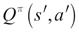，除了结束游戏的状态。对于这些游戏，找到与状态相关联的奖励很容易:它是游戏结束时收到的最终奖励。正是在这些状态下，神经网络首次开发出函数 *Q* 的精确估计。从那里，它可以回溯并学习离游戏结束更远的状态的值。这种动态规划和无模型方法在强化学习中有更多可能的应用。

在我们进入可以用这个理论基础建立的不同种类的系统之前，我们将简要地参观一下贝尔曼方程在经济学中的应用。熟悉这里讨论的工作的读者将会发现他们可以用来发展对贝尔曼方程的更深理解的参考点。不熟悉这些作品的读者会找到进一步阅读的灵感和本章讨论的技术的应用。

## 经济学中的贝尔曼方程

虽然贝尔曼方程在经济学中的首次应用发生在 1954 年，但罗博特·C·默顿 1973 年的文章*一个跨期资本资产定价模型*([http://www . people . HBS . edu/rmerton/inter temporal % 20 Capital % 20 Asset % 20 Pricing % 20 Model . pdf](http://www.people.hbs.edu/rmerton/Intertemporal%20Capital%20Asset%20Pricing%20Model.pdf))*，*可能是最知名的应用。使用贝尔曼方程，默顿开发了一个资本资产定价模型，不同于经典的 CAPM 模型，它在连续时间内工作，并可以解释投资机会的变化。

贝尔曼方程的递归性启发了递归经济学的子领域。南希·斯托克、罗伯特·卢卡斯和爱德华·普雷斯科特在 1989 年写了一本很有影响力的书，书名为《经济动力学中的递归方法》，书中他们应用递归方法来解决经济理论中的问题。这本书启发了其他人使用递归经济学来解决广泛的经济问题，从委托代理问题到最优经济增长。

阿维纳什·迪克西特(Avinash Dixit)和罗伯特·平迪克(Robert Pindyck)在他们 1994 年的著作《不确定性下的投资》(https://press.princeton.edu/titles/5474.html、T2*)中发展并成功应用了这一方法。Patrick Anderson 在他 2009 年的文章《美国私有企业的价值*([https://www . andersoneconomicgroup . com/The-Value-of-Private-business-in-The-u-s-The-United States/](https://www.andersoneconomicgroup.com/the-value-of-private-businesses-in-the-united-states/))中将其应用于私有企业的估值。

虽然递归经济学仍有许多问题，包括它所需的巨大计算能力，但它是一个充满希望的科学子领域。

<title>Advantage actor-critic models</title> 

# 优势演员兼评论家模式

正如我们在前面章节中看到的，Q-learning 非常有用，但是它也有缺点。例如，因为我们必须估计每个动作的 Q 值，所以必须有一个离散的、有限的动作集合。那么，如果动作空间是连续的或者特别大呢？假设您正在使用 RL 算法构建股票投资组合。

在这种情况下，即使你的股票世界只包含两只股票，比如说，AMZN 和 AAPL，也有大量的方法来平衡它们:10%的 AMZN 和 90%的 AAPL，11%的 AMZM 和 89%的 AAPL，等等。如果你的世界变得更大，你可以组合股票的方式就会激增。

不得不从这样的动作空间中进行选择的一个解决方法是直接学习策略。一旦你学会了一个策略，你可以只给它一个状态，它就会给出一个动作的分布。这意味着你的行为也是随机的。随机策略有其优势，尤其是在博弈论的背景下。

想象你在玩石头、剪子、布，你遵循一个确定性的政策。如果你的政策是挑石头，你就一直挑石头，一旦你的对手搞清楚你一直在挑石头，你就一直输。纳什均衡，一个非合作博弈的解决方案，对于石头，布，剪刀是随机选择行动。只有随机政策才能做到这一点。

为了学习一个策略，我们必须能够计算关于策略的梯度。与大多数人的预期相反，政策是可分化的。在本节中，我们将逐步建立一个政策梯度，并使用它来创建一个用于持续控制的**优势行动者-批评家** ( **A2C** )模型。

在区分政策的过程中，第一步是查看我们通过选择特定行动可以获得的优势， *a，*而不仅仅是遵循政策，:

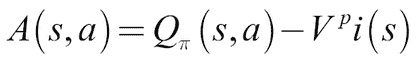

状态 *s* 中动作 *a* 的优势是在 *s* 中执行 *a* 的值减去策略下 *s* 的值。我们用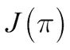来衡量我们的策略有多好，这是一个表达起始状态的期望值的函数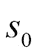:

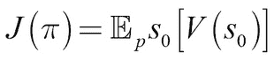

现在，为了计算策略的梯度，我们必须执行两个步骤，这两个步骤显示在策略梯度公式中的期望值内:

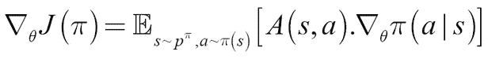

首先，我们要计算给定动作的优势， *a，*与 *A(s，a)* 。然后，我们必须计算神经网络权重的导数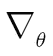，以增加在策略下选择 *a* 的概率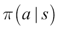。

对于具有积极优势的行动， *A(s，a)* ，我们遵循使 *a* 更有可能的梯度。对于有负面优势的行动，我们走完全相反的方向。期望说我们正在为所有的状态和所有的行动做这件事。在实践中，我们手动将行动的优势与其增加的可能性梯度相乘。

我们需要考虑的一件事是如何计算优势。采取行动的价值是采取行动后直接获得的回报，以及采取行动后我们发现自己所处的状态的价值:

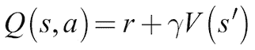

因此，我们可以在优势计算中代入 *Q(s，a)* :

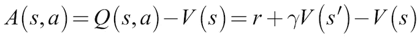

随着计算 *V* 被证明对计算政策梯度有用，研究人员提出了 A2C 架构。具有两个头的单个神经网络学习 *V* 和。事实证明，共享权重对于学习这两个函数是有用的，因为如果两个头都必须从环境中提取特征，它会加速训练:

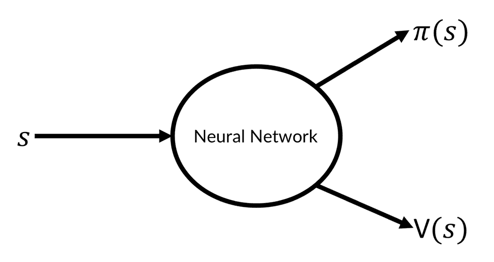

A2C 计划

例如，如果您正在培训一个处理高维图像数据的代理，那么价值函数和策略负责人都需要学习如何解释图像。分享重量将有助于掌握共同的任务。如果你在低维数据上训练，不共享权重可能更有意义。

如果动作空间是连续的，由两个输出表示，即平均值和标准差。这允许我们从学习的分布中取样，就像我们对自动编码器所做的那样。

A2C 方法的一个常见变体是**异步优势行动批评**或 **A3C** 。A3C 的工作方式与 A2C 完全一样，除了在训练时，并行模拟多个代理。这意味着可以收集更多的独立数据。独立数据很重要，因为过于相关的例子会使模型过度适应特定情况，而忘记其他情况。

由于 A3C 和 A2C 的工作原理相同，并且并行游戏的实现引入了一些复杂性，使得实际的算法变得模糊不清，所以在下面的例子中，我们将只使用 A2C。

## 学会平衡

在本节中，我们将训练一个 A2C 模型来摆动并平衡一个钟摆:

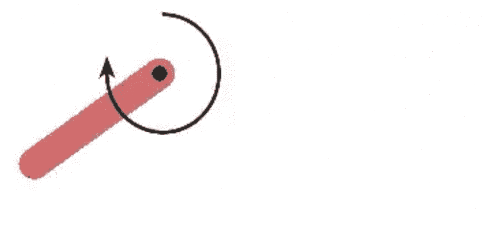

钟摆健身房

钟摆由旋转力控制，旋转力可以施加在任一方向上。在上图中，您可以看到显示所施加力的箭头。控制是连续的；代理可以施加或多或少的力。同时，力可以作为正负力在两个方向上施加。

这个相对简单的控制任务是一个连续控制的有用例子，可以很容易地扩展到股票交易任务，我们将在后面讨论。此外，任务可以可视化，以便我们可以直观地了解算法是如何学习的，包括任何陷阱。

### 注意

**注意**:当实现一个新的算法时，在一个你能想象的任务上进行试验。故障通常很微妙，通过视觉比通过数据更容易发现。

钟摆环境是 OpenAI Gym 的一部分，open ai Gym 是一套用来训练强化学习算法的游戏。您可以通过命令行安装它，如下所示:

```

pip install

```

在我们开始之前，我们必须做一些导入:

```
import gym                                           #1

import numpy as np                                   #2

from scipy.stats import norm                         #3

from keras.layers import Dense, Input, Lambda

from keras.models import Model

from keras.optimizers import Adam

from keras import backend as K

from collections import deque                        #4

import random
```

有很多新的导入，所以让我们一个一个地看一下:

1.  OpenAI 的`gym`是一个开发强化学习算法的工具包。它提供了许多游戏环境，从经典的控制任务，如钟摆，到 Atari 游戏和机器人模拟。
2.  `gym`由`numpy`阵列连接。状态、动作和环境都以兼容`numpy`的格式呈现。
3.  我们的神经网络将相对较小，并基于功能 API。因为我们再次学习了一个分布，我们需要使用 SciPy 的`norm`函数，它可以帮助我们获取向量的范数。
4.  Python 数据结构是一种高效的数据结构，可以方便地为我们管理最大长度。不再需要手动删除体验！我们可以使用 Python 的`random`模块从`deque`中随机取样。

现在是构建代理的时候了。以下方法都构成了`A2CAgent`类:

```
def __init__(self, state_size, action_size):

    self.state_size = state_size                       #1

    self.action_size = action_size

    self.value_size = 1

    self.exp_replay = deque(maxlen=2000)               #2

    self.actor_lr = 0.0001                             #3

    self.critic_lr = 0.001

    self.discount_factor = .9

    self.actor, self.critic = self.build_model()       #4

    self.optimize_actor = self.actor_optimizer()       #5

    self.optimize_critic = self.critic_optimizer()
```

让我们一步一步地浏览代码:

1.  首先，我们需要定义一些游戏相关的变量。状态空间大小和动作空间大小由游戏给出。摆的状态由取决于摆的角度的三个变量组成。一个状态由θ的正弦、θ的余弦和角速度组成。状态的值只是一个标量。
2.  接下来，我们设置我们的体验重放缓冲区，它最多可以保存 2000 个状态。较大的 RL 实验具有大得多的重放缓冲区(通常大约 500 万次体验)，但是对于这个任务，2，000 次就够了。
3.  当我们训练一个神经网络时，我们需要设置一些超参数。即使演员和评论家共享权重，事实证明演员学习率通常应该低于评论家学习率。这是因为我们训练参与者的政策梯度更不稳定。我们还需要设置贴现率，。请记住，强化学习中贴现率的应用不同于通常在金融中的应用。在金融中，我们通过将未来值除以 1 加上贴现因子来贴现。在强化学习中，我们乘以贴现率。因此，较高的折现因子意味着未来值的折现较少。
4.  为了实际构建模型，我们定义了一个单独的方法，这将在接下来讨论。
5.  演员和评论家的优化器是自定义优化器。为了定义这些，我们还创建了一个单独的函数。优化器本身是可以在训练时调用的函数:

```
def build_model(self):

    state = Input(batch_shape=(None, self.state_size))          #1

    actor_input = Dense(30,                                     #2 

                        activation='relu',

                        kernel_initializer='he_uniform')(state)

    mu_0 = Dense(self.action_size,                              #3

                 activation='tanh',

                 kernel_initializer='he_uniform')(actor_input)

    mu = Lambda(lambda x: x * 2)(mu_0)                          #4

    sigma_0 = Dense(self.action_size,                           #5

                    activation='softplus',

                    kernel_initializer='he_uniform')(actor_input)

    sigma = Lambda(lambda x: x + 0.0001)(sigma_0)               #6

    critic_input = Dense(30,                                    #7

                         activation='relu',

                         kernel_initializer='he_uniform')(state)

    state_value = Dense(1, kernel_initializer='he_uniform')(critic_input)                                                          #8

    actor = Model(inputs=state, outputs=(mu, sigma))            #9

    critic = Model(inputs=state, outputs=state_value)          #10

    actor._make_predict_function()                             #11

    critic._make_predict_function() 

    actor.summary()                                            #12

    critic.summary()

    return actor, critic                                       #13
```

前面的函数设置了 Keras 模型。这很复杂，所以让我们来看一下:

1.  由于我们正在使用函数式 API，我们必须定义一个输入层，我们可以用它来将状态提供给演员和评论家。
2.  参与者有一个隐藏的第一层，作为参与者值函数的输入。它有 30 个隐藏单元和一个`relu`激活功能。它由一个`he_uniform`初始化器初始化。这个初始化器与默认的`glorot_uniform`初始化器只是略有不同。`he_uniform`初始化器从具有限制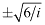的均匀分布中提取，其中是输入尺寸。默认 glorot 均匀采样来自均匀分布，限制为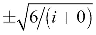，输出维数为 *o* 。这两者之间的差别相当小，但事实证明，`he_uniform`初始化器在学习价值函数和政策方面更好。
3.  钟摆的作用空间从-2 到 2。我们使用一个常规的`tanh`激活，它首先从-1 到 1 变化，然后修正缩放比例。
4.  为了校正动作空间的缩放，我们现在将`tanh`函数的输出乘以 2。使用`Lambda`层，我们可以在计算图中手动定义这样一个函数。
5.  标准差不应为负。`softplus`激活的工作原理和`relu`一样，但是有一个软边:

    ReLU 对 softplus

6.  为了确保标准差不为零，我们给它加上一个微小的常数。我们再次使用`Lambda`层来完成这个任务。这也确保梯度得到正确计算，因为模型知道添加的常数。
7.  批评家也有一个隐藏层来计算它的价值函数。
8.  一个状态的值只是一个单一的标量，可以有任何值。因此，值头只有一个输出和一个线性，即:默认的激活功能。
9.  我们将参与者定义为从一个状态映射到一个策略，如平均值和标准差所表示的。
10.  我们将批评家定义为从一个状态映射到该状态的一个值。
11.  虽然这不是 A2C 严格要求的，但是如果我们想将代理用于异步 A3C 方法，那么我们需要使预测函数线程化安全。第一次调用`predict()`时，Keras 将模型加载到 GPU 上。如果这种情况发生在多个线程中，那么事情可能会出错。 `_make_predict_function` `()`确保模型已经加载到 GPU 或 CPU 上并准备好预测，甚至来自多线程。
12.  出于调试的目的，我们打印模型的概要。
13.  最后，我们归还模型。

现在我们必须为演员创建优化器。参与者使用定制的优化器，该优化器沿着策略梯度对其进行优化。在我们定义优化器之前；然而，我们需要看看政策梯度的最后一块。还记得政策梯度是如何依赖于权重梯度的吗，这会让行动*成为*的可能性更大？Keras 可以为我们计算这个导数，但是我们需要向 Keras 提供 policy 的值。

为此，我们需要定义一个概率密度函数。是具有均值和标准差的正态分布，因此概率密度函数 *f* 如下:


在这个术语中，代表常数，3.14…，而不是政策。后面我们只需要取这个概率密度函数的对数。为什么是对数？因为取对数会产生更平滑的梯度。最大化概率的对数意味着最大化概率，所以我们可以使用所谓的“对数技巧”来提高学习。

策略的值是每个动作 *a、*的优势乘以由概率密度函数 *f* 表示的该动作发生的对数概率。

下面的函数优化了我们的 actor 模型。让我们完成优化程序:

```
def actor_optimizer(self):

    action = K.placeholder(shape=(None, 1))                     #1

    advantages = K.placeholder(shape=(None, 1))

    mu, sigma_sq = self.actor.output                            #2

    pdf = 1\. / K.sqrt(2\. * np.pi * sigma_sq) * \

                      K.exp(-K.square(action - mu) / (2\. * sigma_sq))                          #3

    log_pdf = K.log(pdf + K.epsilon())                          #4

    exp_v = log_pdf * advantages                                #5

    entropy = K.sum(0.5 * (K.log(2\. * np.pi * sigma_sq) + 1.))  #6

    exp_v = K.sum(exp_v + 0.01 * entropy)                       #7

    actor_loss = -exp_v                                         #8

    optimizer = Adam(lr=self.actor_lr)                          #9

    updates = optimizer.get_updates(self.actor.trainable_weights, [], actor_loss)            #10

    train = K.function([self.actor.input, action, advantages], [], updates=updates)                       #11

    return train                                               #12
```

1.  首先，我们需要为所采取的行动和该行动的优势设置一些占位符。我们将在调用优化器时填充这些占位符。
2.  我们得到演员模型的输出。这些是张量，我们可以插入到优化器中。这些张量的优化将被反向传播并优化整个模型。
3.  现在我们建立概率密度函数。这一步看起来有点吓人，但是如果你仔细观察，它和我们之前定义的概率密度函数是一样的。
4.  现在我们应用对数技巧。为了确保我们不会意外地取零的对数，我们添加了一个微小的常数，`epsilon`。
5.  我们政策的价值现在是行动的概率乘以行动发生的概率。
6.  为了奖励概率策略的模型，我们添加了一个熵项。熵是用下面的项来计算的:这里，还是那句话，是常数 3.14…而是标准差。虽然证明这一项表示正态分布的熵超出了本章的范围，但您可以看到，如果标准差增加，熵也会增加。
7.  我们将熵项添加到策略的值中。通过使用`K.sum()`，我们对整个批次的值求和。
8.  我们希望最大化策略的价值，但默认情况下，Keras 会执行梯度下降以最小化损失。一个简单的技巧是将值变为负值，然后最小化负值。
9.  为了执行梯度下降，我们使用了`Adam`优化器。
10.  我们可以从优化器中检索一个更新张量。`get_updates()`带三个参数，`parameters`、`constraints`和`loss`。我们提供模型的参数，也就是它的权重。因为我们没有任何约束，所以我们只是传递一个空列表作为约束。对于损失，我们通过演员损失。
11.  有了更新后的张量，我们现在可以创建一个函数，将 actor 模型输入作为其输入，即状态，以及两个占位符、动作和优势。它只返回将更新张量应用到相关模型的空列表。这个函数是可调用的，我们将在后面看到。
12.  我们返回函数。因为我们在类的`init`函数中调用了`actor_optimizer()`，所以我们刚刚创建的优化器函数变成了`self.optimize_actor`。

对于评论家，我们还需要创建一个定制的优化器。批评家的损失是预测值和奖励加上下一个状态的预测值之间的均方误差:

```
def critic_optimizer(self):

    discounted_reward = K.placeholder(shape=(None, 1))          #1

    value = self.critic.output

    loss = K.mean(K.square(discounted_reward - value))          #2

    optimizer = Adam(lr=self.critic_lr)                         #3

    updates = optimizer.get_updates(self.critic.trainable_weights, [], loss)

    train = K.function([self.critic.input, discounted_reward], 

                       [], 

                       updates=updates)                         #4

    return train
```

前面的函数优化了我们的 critic 模型:

1.  我们再次为我们需要的变量设置了一个占位符。`discounted_reward`包含状态的贴现未来值以及立即获得的奖励。
2.  评论家损失是评论家的输出和贴现回报之间的均方误差。在计算输出和折扣奖励之间的均方误差之前，我们首先获得输出张量。
3.  我们再次使用一个`Adam`优化器，从中我们获得一个更新张量，就像我们之前做的那样。
4.  同样，也是最后，正如我们之前所做的，我们将把更新整合到一个函数中。这个功能会变成`self.optimize_critic`。

为了让我们的代理采取行动，我们需要定义一个从状态产生行动的方法:

```
def get_action(self, state):

    state = np.reshape(state, [1, self.state_size])            #1

    mu, sigma_sq = self.actor.predict(state)                   #2

    epsilon = np.random.randn(self.action_size)                #3

    action = mu + np.sqrt(sigma_sq) * epsilon                  #4

    action = np.clip(action, -2, 2)                            #5

    return action
```

有了这个功能，我们的演员现在可以表演了。让我们过一遍:

1.  首先，我们重塑状态，以确保它具有模型预期的形状。
2.  我们从模型中预测这个动作的均值和方差。
3.  然后，正如我们对自动编码器所做的那样，我们首先采样一个均值为零、标准差为 1 的随机正态分布。
4.  我们将平均值相加，然后乘以标准差。现在我们有了我们的行动，从政策中取样。
5.  为了确保我们在动作空间的边界内，我们在-2，2 处剪切动作，因此它不会超出这些边界。

最后，我们需要训练模型。`train_model`功能将在收到一个新体验后训练模型:

```
def train_model(self, state, action, reward, next_state, done):

    self.exp_replay.append((state, action, reward, next_state, done))              #1

     (state, action, reward, next_state, done) = random.sample(self.exp_replay,1)[0]             #2

    target = np.zeros((1, self.value_size))                 #3

    advantages = np.zeros((1, self.action_size))

    value = self.critic.predict(state)[0]                   #4

    next_value = self.critic.predict(next_state)[0]

    if done:                                                #5

        advantages[0] = reward - value

        target[0][0] = reward

    else:

        advantages[0] = reward + self.discount_factor * (next_value) - value

        target[0][0] = reward + self.discount_factor * next_value

    self.optimize_actor([state, action, advantages])        #6

    self.optimize_critic([state, target])
```

这就是我们如何优化演员和评论家:

1.  首先，将新体验添加到体验回放中。
2.  然后，我们立即从体验回放中取样体验。这样，我们就打破了模型训练样本之间的相关性。
3.  我们为优势和目标设置了占位符。我们将在*步骤 5* 填充它们。
4.  我们预测状态 *s* 和的值。
5.  如果游戏在当前状态之后结束， *s* ，优势就是我们获得的奖励减去我们分配给该状态的价值，价值函数的目标就是我们获得的奖励。如果游戏在此状态后没有结束，则优势是获得的奖励加上下一个状态的贴现值减去此状态的值。在这种情况下，目标是获得的奖励加上下一个状态的贴现值。
6.  知道了优势、采取的行动和价值目标，我们就可以用我们之前创建的优化器来优化演员和评论家。

仅此而已；我们的`A2CAgent`班做完了。现在是使用它的时候了。我们定义一个`run_experiment`函数。该功能将游戏播放若干集。首先训练一个没有渲染的新代理是有用的，因为训练需要大约 600 到 700 场游戏直到代理做得很好。有了训练有素的代理，你就可以观看游戏了:

```
def run_experiment(render=False, agent=None, epochs = 3000):

    env = gym.make('Pendulum-v0')                                   #1

    state_size = env.observation_space.shape[0]                     #2

    action_size = env.action_space.shape[0]

    if agent = None:                                                #3

        agent = A2CAgent(state_size, action_size)

    scores = []                                                     #4

    for e in range(epochs):                                         #5

        done = False                                                #6

        score = 0

        state = env.reset()

        state = np.reshape(state, [1, state_size])

        while not done:                                             #7

            if render:                                              #8

                env.render()

            action = agent.get_action(state)                        #9

            next_state, reward, done, info = env.step(action)      #10

            reward /= 10                                           #11

            next_state = np.reshape(next_state, [1, state_size])               #12

            agent.train_model(state, action, reward, next_state, done)                    #13

            score += reward                                        #14

            state = next_state                                     #15

            if done:                                               #16

                scores.append(score) 

                print("episode:", e, "  score:", score)

                if np.mean(scores[-min(10, len(scores)):]) > -20:  #17

                    print('Solved Pendulum-v0 after {} iterations'.format(len(scores)))

                    return agent, scores
```

我们的实验归结为这些函数:

1.  首先，我们建立一个新的`gym`环境。这个环境包含了钟摆游戏。我们可以将动作传递给它，并观察状态和奖励。
2.  我们从游戏中获得动作和状态空间。
3.  如果没有代理传递给该函数，我们将创建一个新的。
4.  我们建立了一个空数组来记录分数。
5.  现在，我们按照`epochs`指定的回合数玩游戏。
6.  在游戏开始时，我们将“游戏结束指示器”设置为`false`，将`score`设置为`0`，并重置游戏。通过重置游戏，我们获得了最初的开始状态。
7.  现在我们玩游戏，直到它结束。
8.  如果您将`render = True`传递给该函数，游戏将会呈现在屏幕上。请注意，这在 Kaggle 或 Jupyter 等远程笔记本上不起作用。
9.  我们从代理那里得到一个动作，并在环境中动作。
10.  当在环境中行动时，我们观察一个新的状态，一个奖励，以及游戏是否结束。也传递一个信息字典，我们可以忽略它。
11.  游戏的奖励都是负的，越接近零的奖励越高。不过，回报可能相当大，所以我们减少了回报。过于极端的奖励会导致训练时梯度过大。那会妨碍训练。
12.  在用模型训练之前，我们重塑状态，只是为了确定。
13.  现在，我们就新的体验对代理进行培训。正如您所看到的，代理将经验存储在其重放缓冲区中，并从中随机抽取旧经验进行训练。
14.  我们增加总奖励来追踪一场比赛中获得的奖励。
15.  我们将新状态设置为当前状态，为游戏的下一帧做准备。
16.  如果游戏结束了，我们跟踪并打印出游戏分数。
17.  该代理通常在 700 个历元后表现良好。如果过去 20 场比赛的平均奖励高于-20，我们宣布比赛结束。如果是这种情况，我们将退出函数并返回经过训练的代理及其分数。

## 学习交易

强化学习算法主要是在游戏和模拟中开发的，其中失败的算法不会造成任何损害。然而，一旦开发出来，一个算法可以适应其他更严重的任务。为了展示这种能力，我们现在将创建一个 A2C 代理，学习如何在一个庞大的股票宇宙中平衡股票投资组合。

### 注意

**注**:请勿基于此算法进行交易。这只是一个简化的、有点幼稚的实现来演示这个概念，不应该在现实世界中使用。

为了训练一个新的强化学习算法，我们首先需要创建一个训练环境。在这种环境下，代理交易真实的股票数据。该环境可以像开放的健身房环境一样进行交互。遵循 Gym 的接口惯例降低了开发的复杂性。给定宇宙中股票百分位数回报的 100 天回顾，代理必须以 100 维向量的形式返回分配。

分配向量描述了代理想要在一只股票上分配的资产份额。负分配意味着代理商正在卖空股票。为了简单起见，交易成本和滑点没有添加到环境中。然而，添加它们并不太困难。

### 提示

**提示**:环境和代理的完整实现可以在[https://www.kaggle.com/jannesklaas/a2c-stock-trading](https://www.kaggle.com/jannesklaas/a2c-stock-trading)找到。

环境看起来是这样的:

```
class TradeEnv():

    def reset(self):

        self.data = self.gen_universe()                        #1

        self.pos = 0                                           #2

        self.game_length = self.data.shape[0]                  #3

        self.returns = []                                      #4

        return self.data[0,:-1,:]                              #5

    def step(self,allocation):                                 #6

        ret = np.sum(allocation * self.data[self.pos,-1,:])    #7

        self.returns.append(ret)                               #8

        mean = 0                                               #9

        std = 1

        if len(self.returns) >= 20:                            #10

            mean = np.mean(self.returns[-20:])

            std = np.std(self.returns[-20:]) + 0.0001

        sharpe = mean / std                                    #11

        if (self.pos +1) >= self.game_length:                  #12

            return None, sharpe, True, {}

        else:                                                  #13

            self.pos +=1

            return self.data[self.pos,:-1,:], sharpe, False, {}

    def gen_universe(self):                                   #14

        stocks = os.listdir(DATA_PATH) 

        stocks = np.random.permutation(stocks)

        frames = [] 

        idx = 0

        while len(frames) < 100:                              #15

            try: 

                stock = stocks[idx]

                frame = pd.read_csv(os.path.join(DATA_PATH,stock),index_col='Date')

                frame = frame.loc['2005-01-01':].Close

                frames.append(frame)

            except:

                e = sys.exc_info()[0]

            idx += 1 

        df = pd.concat(frames,axis=1,ignore_index=False)      #16

        df = df.pct_change()

        df = df.fillna(0)

        batch = df.values

        episodes = []                                         #17

        for i in range(batch.shape[0] - 101):

            eps = batch[i:i+101]

            episodes.append(eps)

        data = np.stack(episodes)

        assert len(data.shape) == 3 

        assert data.shape[-1] == 100

        return data
```

我们的贸易环境有点类似钟摆环境。让我们看看如何设置它:

1.  我们为我们的宇宙加载数据。
2.  因为我们在数据中走来走去，每天都是一步，所以我们需要及时跟踪我们的位置。
3.  我们需要知道游戏什么时候结束，所以我们需要知道我们有多少数据。
4.  为了跟踪一段时间内的回报，我们设置了一个空数组。
5.  初始状态是第一集的数据，直到最后一个元素，这是宇宙中所有 100 只股票的第二天的回报。
6.  在每一步，代理都需要向环境提供分配。代理人得到的回报是夏普比率，即过去 20 天回报率的均值和标准差之间的比率。你可以修改奖励函数，例如，包括交易成本或滑点。如果你确实想这么做，那么请参考本章后面的奖励塑造部分。
7.  第二天返回是剧集数据的最后一个元素。
8.  为了计算夏普比率，我们需要跟踪过去的回报。
9.  如果我们还没有 20 个回报，回报的均值和标准差将分别为零和一。
10.  如果我们有足够的数据，我们就在我们的回报跟踪器中计算最后 20 个元素的平均值和标准偏差。我们在标准差上加上一个微小的常数，以避免被零除。
11.  我们现在可以计算夏普比率，这将为代理人提供奖励。
12.  如果游戏结束，环境将返回 no next state、奖励和一个游戏结束的指示符，以及一个空的信息字典，以便坚持 OpenAI Gym 约定。
13.  如果游戏没有结束，环境会返回下一个状态，一个奖励，一个游戏没有结束的指示符，还有一个空的信息字典。
14.  这个函数加载 100 只随机股票的每日收益。
15.  选择器在包含股票价格的文件中随机移动。其中一些已损坏，因此加载它们会导致错误。加载器不断尝试，直到它收集了 100 个包含股票价格的熊猫数据帧。仅考虑 2005 年开始的收盘价。
16.  下一步，连接所有数据帧。计算股票价格的百分比变化。所有缺少的值都用零填充，表示没有变化。最后，我们从数据中提取数值作为一个 NumPy 数组。
17.  最后要做的是将数据转换成时间序列。前 100 步是代理人决策的基础。第 101 个元素是第二天的回报，将在此基础上评估代理。

我们只需要在`A2CAgent`代理类中做一些小的编辑。也就是说，我们只需修改模型，使其能够接受收益的时间序列。为此，我们添加了两个`LSTM`层，由演员和评论家共享:

```

def build_model(self):

	state = Input(batch_shape=(None, #1

			self.state_seq_length,

			self.state_size))

x = LSTM(120,return_sequences=True)(state) #2

x = LSTM(100)(x)

actor_input = Dense(100, activation='relu', #3

		kernel_initializer='he_uniform')(x)

mu = Dense(self.action_size, activation='tanh', #4

		kernel_initializer='he_uniform')(actor_input)

sigma_0 = Dense(self.action_size, activation='softplus',

			kernel_initializer='he_uniform')

			(actor_input)

sigma = Lambda(lambda x: x + 0.0001)(sigma_0)

critic_input = Dense(30, activation='relu',

						kernel_initializer='he_uniform')(x)

state_value = Dense(1, activation='linear',

		kernel_initializer='he_uniform')

		(critic_input)

actor = Model(inputs=state, outputs=(mu, sigma))

critic = Model(inputs=state, outputs=state_value)

actor._make_predict_function()

critic._make_predict_function()

actor.summary()

critic.summary()

return actor, critic

```

同样，我们在函数中构建了一个 Keras 模型。和之前的车型只是略有不同。让我们来探索一下:

1.  状态现在有了时间维度。
2.  演员和评论家共享这两个`LSTM`层。
3.  因为动作空间更大；我们还必须增加演员的隐藏层的大小。
4.  输出应该介于-1 和 1 之间，100%短 100%长，这样我们可以省去将平均值乘以 2 的步骤。

就是这样！这种算法现在可以学习平衡投资组合，就像它以前可以学习平衡一样。

<title>Evolutionary strategies and genetic algorithms</title> 

# 进化策略和遗传算法

最近，一种用于强化学习算法的几十年前的优化算法又重新流行起来。**进化策略** ( **ES** )比 Q-learning 或者 A2C 简单多了。

在 ES 中，我们不是通过反向传播来训练一个模型，而是通过向原始模型的权重添加随机噪声来创建一个模型群体。然后，我们让每个模型在环境中运行，并评估其性能。新模型是所有模型的性能加权平均值。

在下图中，你可以看到进化策略是如何工作的:


进化策略

为了更好地理解这是如何工作的，考虑下面的例子。我们想找到一个向量，使解向量的均方误差最小。学习者没有得到答案，只有总误差作为奖励信号:

```
solution = np.array([0.5, 0.1, -0.3])

def f(w):

  reward = -np.sum(np.square(solution - w))

  return reward
```

进化策略的一个关键优势是它们有更少的超参数。在这种情况下，我们只需要三个:

```
npop =   50 #1

sigma = 0.1 #2

alpha = 0.1 #3
```

1.  **群体规模**:我们将在每次迭代中创建 50 个版本的模型
2.  **噪声标准偏差**:我们添加的噪声均值为零，标准偏差为 0.1
3.  **学习率**:权重不只是简单地设定到新的平均值，而是慢慢地向避免超调的方向移动

优化算法将类似于以下代码:

```
w = np.random.randn(3)                          #1

for i in range(300):                            #2

  N = np.random.randn(npop, 3) * sigma          #3 

  R = np.zeros(npop)

  for j in range(npop):                         #4

    w_try = w + N[j]

    R[j] = f(w_try)

  A = (R - np.mean(R)) / np.std(R)              #5

  w = w + alpha * np.dot(N.T, A)/npop           #6
```

遗传优化的代码相对较短，所以我们来看一下:

1.  我们从一个随机的解决方案开始。
2.  就像另一个 RL 算法一样，我们训练若干个时期，这里是 300 个。
3.  我们创建一个包含 50 个噪声向量的噪声矩阵，平均值为零，标准偏差为`sigma`。
4.  我们现在通过向原始权重添加噪声并通过评估函数运行结果向量来创建并立即评估我们的总体。
5.  我们通过减去平均值并除以标准差来标准化奖励。在这种情况下，结果可以被解释为一种优势，即人口中的某个特定成员比其他人拥有优势。
6.  最后，我们将加权平均噪声向量添加到权重解中。我们使用一个学习速率来减慢这个过程，避免超调。

类似于神经网络本身，进化策略大致是由自然启发的。在自然界中，物种利用自然选择来优化自身的生存。研究人员提出了许多算法来模仿这一过程。前面的神经进化策略算法不仅适用于单个向量，也适用于大型神经网络。进化策略仍然是一个活跃的研究领域，在撰写本文时，还没有确定最佳实践。

如果没有监督学习是可能的，但奖励信号是可用的，强化学习和进化策略是首选技术。从简单的“多臂强盗”问题(如 DHL 订单路由系统)到复杂的交易系统，在金融行业中有许多这样的应用。

<title>Practical tips for RL engineering</title> 

# RL 工程实用技巧

在本节中，我们将介绍一些构建 RL 系统的实用技巧。我们也将强调当前一些与金融从业者高度相关的研究前沿。

## 设计好的奖励函数

强化学习是设计最大化奖励函数的算法的领域。然而，创建好的奖励函数却异常困难。任何曾经管理过人的人都会知道，人和机器都在这个系统中博弈。

关于 RL 的文献充满了研究人员在 Atari 游戏中发现 bug 的例子，这些 bug 被隐藏了多年，但被 RL 代理发现并利用了。例如，在游戏“钓鱼德比”中，OpenAI 报告了一个强化学习代理获得了比游戏制造商可能获得的分数更高的分数，而且这还是在没有钓到一条鱼的情况下！

虽然这对于游戏来说很有趣，但如果发生在金融市场，这种行为可能会很危险。例如，一个受过交易收益最大化训练的代理人可能会在所有者不知情的情况下，采取欺骗交易等非法交易活动。有三种方法可以创建更好的奖励函数，我们将在接下来的三个小节中讨论。

### 小心，手动奖励塑形

通过手动创建奖励，从业者可以帮助系统学习。如果环境的自然回报很少，这种方法特别有效。比方说，如果通常只有在交易成功时才会给予奖励，而这种情况很少发生，那么手动添加一个在交易接近成功时给予奖励的函数会有所帮助。

同样，如果代理人从事非法交易，可以建立一个硬编码的“机器人政策”，如果代理人违反法律，将给予巨大的负面奖励。如果奖励和环境相对简单，奖励塑造就会起作用。在复杂的环境中，它可能会破坏使用机器学习的初衷。在一个非常复杂的环境中创建一个复杂的奖励函数就像编写一个基于规则的系统在这个环境中运行一样困难。

然而，尤其是在金融领域，尤其是在交易领域，手工制作的报酬模型是有用的。规避风险的交易是创造一个聪明的目标函数的例子。风险厌恶强化学习不是最大化期望回报，而是最大化评估函数，


，这是基于效用的短缺对多阶段设置的扩展:


这里的是一个凹的、连续的、严格递增的函数，可以根据交易者愿意承担的风险大小自由选择。RL 算法现在最大化如下:


### 逆向强化学习

在**逆向强化学习** ( **IRL** )中，一个模型被训练来预测人类专家的奖励函数。人类专家正在执行任务，模型观察状态和动作。然后，它试图找到一个解释人类专家行为的价值函数。更具体地说，通过观察专家，创建了状态和动作的策略跟踪。一个例子是最大似然逆强化学习或 IRL 算法，其工作如下:

1.  猜一猜奖励函数， *R*
2.  通过训练一个 RL 代理，计算从 *R* 得出的策略
3.  计算观察到的动作、 *D、*是、的结果的概率
4.  计算相对于 *R* 的梯度并更新
5.  重复此过程直到非常高

### 从人类偏好中学习

类似于 IRL 从人类的例子中产生一个奖励函数，也有算法从人类的偏好中学习。奖励预测器产生奖励函数，在该函数下训练策略。

奖励预测器的目标是产生一个奖励函数，该函数产生一个具有大量人类偏好的政策。人类偏好通过向人类展示两种策略的结果并让人类指出哪一种更可取来测量:


从偏好中学习

## 健壮 RL

就像 GANs 一样，RL 很脆弱，很难训练出好的结果。RL 算法对超参数选择非常敏感。但是有几种方法可以使 RL 更加健壮:

*   **使用更大的经验回放缓冲区**:使用经验回放缓冲区的目的是收集不相关的经验。这可以通过创建一个更大的缓冲区或整个缓冲区数据库来实现，该数据库可以存储数百万个样本，这些样本可能来自不同的代理。
*   **目标网络** : RL 不稳定的部分原因是神经网络依赖自己的输出进行训练。通过使用冻结的目标网络来生成训练数据，我们可以缓解问题。冻结的目标网络应该仅通过例如在训练网络的方向上每隔几个时期将目标网络的权重仅移动百分之几来缓慢更新。
*   **噪声输入**:向状态表示中添加噪声有助于模型推广到其他情况，并避免过度拟合。事实证明，如果代理是在模拟中训练的，但需要推广到真实的、更复杂的世界，这种方法就特别有用。
*   **对抗的例子**:在一个类似 GAN 的设置中，可以训练一个对抗的网络，通过改变状态表示来欺骗模型。反过来，该模型可以学会忽略对抗性攻击。这使得学习更加健壮。
*   **将策略学习与特征提取分离**:在强化学习中最著名的结果是从原始输入中学习一个游戏。然而，这需要神经网络通过学习图像如何导致奖励来解释图像。例如，通过首先训练压缩状态表示的自动编码器，然后训练可以预测下一个压缩状态的动态模型，然后根据两个输入训练相对较小的策略网络，可以更容易地分离这些步骤。

与 GAN 的技巧相似，这些技巧为什么有效几乎没有理论上的原因，但它们会让你的 RL 在实践中更好地工作。

<title>Frontiers of RL</title> 

# RL 前沿

现在你已经看到了最有用的 RL 技术背后的理论和应用。然而，RL 是一个不断变化的领域。这本书不能涵盖从业者可能感兴趣的所有当前趋势，但它可以突出一些对金融行业从业者特别有用的趋势。

## 多智能体 RL

根据定义，市场包括许多代理人。Lowe 和其他人，2017 年，*混合合作竞争环境的多主体行动者-批评家*(见[https://arxiv.org/abs/1706.02275](https://arxiv.org/abs/1706.02275))表明强化学习可以用来训练主体根据情况进行合作、竞争和交流。


多名特工(红色)一起追捕绿点。来自 OpenAI 博客。

在一项实验中，Lowe 和其他人让代理通过在动作空间中包含一个通信向量来进行通信。然后，一个代理输出的通信向量对其他代理可用。他们显示代理人学会了通过交流来解决任务。类似的研究表明，代理人根据环境采取协作或竞争策略。

在代理人必须收集奖励代币的任务中，只要有大量代币可用，代理人就会合作，并在代币变得稀少时表现出竞争行为。郑等人，2017， *MAgent:人工集体智能的多智能体强化学习平台*(见)，将环境进行了缩放，使之包含数百个智能体。他们表明，代理开发了更复杂的策略，如通过 RL 算法和巧妙的奖励成形的组合对其他代理进行包围攻击。

Foerster 和其他人，2017 年，*带对手学习意识的学习*(见[https://arxiv.org/abs/1709.04326](https://arxiv.org/abs/1709.04326))，开发了一种新的 RL 算法，允许智能体学习另一个智能体将如何表现，并制定行动来影响另一个智能体。

## 学会如何学习

深度学习的一个缺点是，熟练的人类必须开发神经网络。正因为如此，目前不得不付钱给博士生的研究人员和公司的一个长期梦想是自动化设计神经网络的过程。

这种所谓的 AutoML 的一个例子是增强拓扑的**神经进化，被称为 NEAT 算法。NEAT 使用进化策略来设计神经网络，然后通过标准的反向传播来训练该网络:**


由 NEAT 算法开发的网络

正如您在前面的图表中看到的，由 NEAT 开发的网络通常比传统的基于层的神经网络要小。他们很难想出。这是 AutoML 的强项；它可以找到人类不会发现的有效策略。

使用进化算法进行网络设计的一种替代方法是使用强化学习，它会产生类似的结果。有几个“现成的”AutoML 解决方案:

*   **tpot**([https://github.com/EpistasisLab/tpot](https://github.com/EpistasisLab/tpot)):这是一个数据科学助手，使用遗传算法优化机器学习管道。它建立在 scikit-learn 的基础上，因此它不会创建深度学习模型，而是对结构化数据有用的模型，如随机森林。
*   **auto-sklear****n**([https://github.com/automl/auto-sklearn](https://github.com/automl/auto-sklearn)):这也是基于 scikit-learn 但更侧重于创建模型而不是特征提取。
*   **AutoW**EKA([https://github.com/automl/autoweka](https://github.com/automl/autoweka)):这和`auto-sklearn`类似，除了它是建立在 WEKA 包之上的，这个包运行在 Java 上。
*   **H2O A**utoML([http://docs.h2o.ai/h2o/latest-stable/h2o-docs/automl.html](http://docs.h2o.ai/h2o/latest-stable/h2o-docs/automl.html)):这是一个 AutoML 工具，它是 H2O 软件包的一部分，提供型号选择和组装。
*   Google Cloud AutoML(【https://cloud.google.com/automl/】T2):这是目前专注于计算机视觉的管道。

对于超参数搜索子领域，也有一些可用的包:

*   **hyperpt**([https://github.com/hyperopt/hyperopt](https://github.com/hyperopt/hyperopt)):这个包允许在 Python 中进行分布式异步超参数搜索。
*   **留兰香**([https://github.com/HIPS/Spearmint](https://github.com/HIPS/Spearmint)):这个包类似于 Hyperopt，优化超参数，但是使用更高级的贝叶斯优化过程。

AutoML 仍然是一个活跃的研究领域，但它有很大的前景。由于缺乏熟练员工，许多公司难以使用机器学习。如果机器学习可以自我优化，更多的公司可以开始使用机器学习。

## 通过 RL 了解大脑

金融和经济学的另一个新兴领域是行为经济学。更多最近，强化学习被用来理解人类大脑是如何工作的。王等人在 2018 年发表了一篇名为*前额叶皮层作为元强化学习系统*(见【】、)的论文，对前额叶皮层和多巴胺的功能提出了新的见解。

同样，Banino 等人在 2018 年发表了一份题为*在人工智能体中使用网格状表示的矢量导航*(见[https://doi.org/10.1038/s41586-018-0102-6](https://doi.org/10.1038/s41586-018-0102-6))的报告，他们复制了所谓的“网格细胞”，允许哺乳动物使用强化学习进行导航。

这种方法是相似的，因为两篇论文都在与研究领域相关的任务上训练 RL 算法，例如导航。然后，他们检查模型的学习权重的涌现属性。这种见解可以用来创造更有能力的 RL 代理，但也进一步神经科学领域。

随着经济学界逐渐认识到人类不是理性的，而是以可预测的方式非理性的，理解大脑在理解经济学时变得更加重要。神经经济学的结果与金融尤其相关，因为它们涉及人类在不确定性下如何行动以及如何应对风险，比如人类为什么厌恶损失。使用 RL 是深入了解人类行为的一个有希望的途径。

<title>Exercises</title> 

# 练习题

既然我们现在已经完成了任务，让我们根据我们已经讲述的内容尝试两个适当的练习。

1.  **一个简单的** **RL 任务**:去 https://github.com/openai/gym。一旦到了那里，安装健身房环境并训练一个代理来解决“横竿”问题。
2.  **多智能体** **RL 任务**:转到[https://github.com/crazymuse/snakegame-numpy](https://github.com/crazymuse/snakegame-numpy)。这是一个健身房环境，让你在一个“蛇”游戏中扮演多个代理。尝试不同的策略。你能创造一个愚弄另一个代理的代理吗？蛇的紧急行为是什么？

<title>Summary</title> 

# 摘要

在这一章中，你学习了 RL、Q-learning、策略梯度和进化策略中的主要算法。你看到了如何将这些算法应用到交易中，并了解了应用 RL 的一些陷阱。你也看到了当前研究的方向，以及你今天如何从这项研究中获益。在书中的这一点上，你现在已经配备了许多先进的机器学习算法，希望在开发机器学习模型时对你有用。

在下一章，我们将讨论开发、调试和部署机器学习系统的实用性。我们将打破数据科学的沙箱，让我们的模型进入现实世界。