# 第九章。战斗偏见

我们喜欢认为机器比我们更理性:无情的硅应用冰冷的逻辑。因此，当计算机科学将自动决策引入经济领域时，许多人希望计算机能减少偏见和歧视。然而，正如我们之前在讨论抵押贷款申请和种族划分时提到的，计算机是由人类制造和训练的，这些机器使用的数据来自一个不公平的世界。简单地说，如果我们不小心，我们的程序会放大人类的偏见。

在金融行业，反歧视不仅仅是道德问题。以美国 1974 年生效的**平等信贷机会法案** ( **ECOA** )为例。这部法律明确禁止债权人基于种族、性别、婚姻状况和其他一些属性歧视申请人。它还要求债权人告知申请人拒绝的理由。

本书讨论的算法是鉴别机。给定一个目标，这些机器会找到最适合辨别的特征。然而，正如我们所讨论的，歧视并不总是好的。

虽然将某个国家的图书广告瞄准来自该国的人是可以的，但通常情况下，拒绝来自某个国家的人的贷款是不可以的，这要感谢 ECOA，这通常是非法的。在金融领域，对歧视的规定比在图书销售领域要严格得多。这是因为金融领域的决策对人们生活的影响比图书销售领域的决策要严重得多。

同样，这种情况下的歧视是**特征特有的**。例如，虽然根据贷款申请人的还贷历史歧视他们是可以的，但根据他们的原籍国歧视他们是不可以的，除非该国存在制裁措施或类似的总体法律。

在本章中，我们将讨论以下内容:

*   机器中的偏差从何而来
*   有偏见的**机器学习** ( **ML** )模型的法律含义
*   如何减少观察到的不公平
*   如何检查模型的偏见和不公平
*   因果建模如何减少偏差
*   如何不公平是一个复杂的系统故障，需要解决的非技术途径

本书讨论的算法是特征提取算法。即使监管特征被忽略，算法也可能从代理特征中推断出它们，然后根据它们进行区分。作为这方面的一个例子，在美国的许多城市，邮政编码可以用来合理地预测种族。因此，在对抗偏见时，省略受管制的特征是不够的。

# 机器学习中不公平的来源

正如我们在本书中多次讨论的那样，模型是数据的函数，模型是根据数据进行训练的。一般来说，数据越多，误差越小。因此，根据定义，少数民族群体的数据更少，仅仅是因为这些群体中的人更少。

这种**不同的样本量**会导致少数群体的模型表现更差。因此，这种增加的误差通常被称为**系统误差**。该模型可能不得不过度拟合多数群体数据，以使它发现的关系不适用于少数群体数据。由于很少有少数群体的数据，这并没有受到太多的惩罚。

想象一下，你正在训练一个信用评分模型，你的大部分数据来自生活在曼哈顿下城的人，一小部分来自生活在农村地区的人。曼哈顿的住房要贵得多，所以模型可能会知道你需要很高的收入才能买一套公寓。但是，相比之下，农村住房要便宜得多。即便如此，由于该模型主要是根据曼哈顿的数据训练的，它可能会拒绝农村申请人的贷款申请，因为他们的收入往往低于曼哈顿的同龄人。

除了样本大小的问题，我们的数据本身也可能有偏差。比如“原始数据”不存在。数据不是自然出现的，而是由人类使用人为的测量协议测量的，这些协议本身可能在许多不同方面存在偏差。

偏差可能包括**采样偏差**，例如在曼哈顿住宅的例子中，或者**测量偏差**，这是指您的样本可能没有测量它想要测量的东西，或者甚至可能歧视一个群体。

另一种可能的偏见是**先前存在的社会偏见**。这些在单词向量中是可见的，例如，在 Word2Vec 中，潜在空间中从父亲到医生的映射是从母亲到护士的映射。同样，从男人到电脑程序员的向量映射到女人到家庭主妇。这是因为性别歧视存在于我们这个性别歧视社会的书面语言中。直到今天，一般来说，医生通常是男性，护士通常是女性。同样，科技公司的多样性统计数据显示，计算机程序员中男性比女性多得多，这些偏见被编码到模型中。


# 法律视角

反歧视法有两种学说:*差别待遇*和*差别影响*。让我们花一点时间来看看其中的每一项:

*   **差别待遇**:这是一种非法歧视。故意歧视邮政编码，希望以此来歧视种族是不合法的。完全不同的治疗问题与算法关系不大，而与运行算法的组织关系更大。
*   **Disparate impact**: This can be a problem if an algorithm is deployed that has a different impact on different groups, even without the organization knowing about it. Let's walk through a lending scenario in which disparate impact could be a problem. Firstly, the plaintiff must establish that there is a disparate impact. Assessing if there's a disparate impact is usually done with the **four-fifths rule**, which says that if the selection rate of a group is less than 80% of the group, then it is regarded as evidence of adverse impact. If a lender has 150 loan applicants from group A, of which 100, or 67%, are accepted, and 50 applicants from group B, of which 25 are accepted, the difference in selection is 0.5/0.67 = 0.746, which qualifies as evidence for discrimination against group B. The defendant can counter this by showing that the decision procedure is justified as necessary.

    在此之后，原告有机会表明，该程序的目标也可以通过显示较小差异的不同程序来实现。

### 注

**注**:要更深入地了解这些主题，请参见 Moritz Hardt 在[http://mrtz.org/nips17/#/11](http://mrtz.org/nips17/#/11)举办的 2017 年 NeurIPS 主题演讲。

差别待遇理论试图实现程序公平和机会均等。不同影响学说旨在实现公平分配，最大限度地减少结果的不平等。

正如 2009 年 Ricci 诉 DeStefano 案所示，这两种学说之间存在着内在的紧张关系。在这起案件中，19 名白人消防员和 1 名西班牙裔消防员起诉了他们的雇主纽黑文消防局。消防队员都通过了晋升考试，但他们的黑人同事却没有达到晋升所需的分数。由于担心不同的影响诉讼，该市宣布测试结果无效，并且没有提拔消防员。因为不同影响的证据不够有力，美国最高法院最终裁定消防员应该得到晋升。

鉴于机器学习中围绕公平的复杂法律和技术情况，我们将深入研究如何定义和量化公平，然后利用这一见解创建更公平的模型。


# 观察公平性

平等通常被视为纯粹的定性问题，因此，它经常被注重定量的建模者忽略。正如本节将要展示的，平等也可以从数量的角度来看。考虑一个分类器， *c，*带有输入 *X* ，一些敏感输入， *A* ，一个目标， *Y* 和输出 *C* 。通常，我们将分类器输出表示为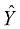，但是为了可读性，我们遵循 CS 294 并将其命名为 *C* 。

假设我们的分类器被用来决定谁获得贷款。什么时候我们会认为这个分类器是公平的，没有偏见的？要回答这个问题，想象两个人口统计数据，A 组和 B 组，都是贷款申请者。给定一个信用分数，我们的分类器必须找到一个分界点。让我们来看看这张图表中申请人的分布情况:

### 注

**注**:本例数据为合成数据；你可以在本书的 GitHub 资源库中找到用于这些计算的 Excel 文件，[https://GitHub . com/packt publishing/Machine-Learning-for-Finance/blob/master/9.1 _ parity . xlsx](https://github.com/PacktPublishing/Machine-Learning-for-Finance/blob/master/9.1_parity.xlsx)。

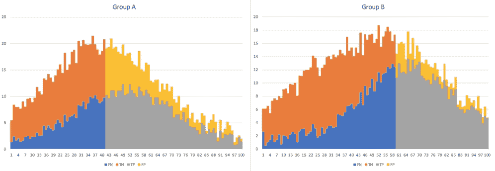

最大利润

在这个练习中，我们假设一个成功的申请人产生 300 美元的利润，而一个违约的成功申请人的成本为 700 美元。这里选择的截止点是为了实现利润最大化:

那么，我们能看到什么？我们可以看到以下内容:

*   橙色部分是申请人，他们不会让偿还贷款，也不会被录取:**真否定** ( **TNs** )。
*   蓝色部分是本应偿还贷款但未被接受的申请人:**漏报** ( **FNs** )。
*   黄色部分是得到了贷款但没有偿还的申请人:**误报** ( **FPs** )。
*   灰色部分是收到贷款并偿还的申请人:**真阳性** ( **TPs** )。

正如你所看到的，这个截止点的选择有几个问题。**B 组**申请人需要比**A 组**申请人有更好的分数才能获得贷款，表示待遇悬殊。与此同时，只有大约 51%的 A 组申请人获得贷款，而 B 组**申请人只有 37%获得贷款，这表明了不同的影响。**

我们可以在下面看到的*组无意识阈值*，将给予两组相同的最低分数:

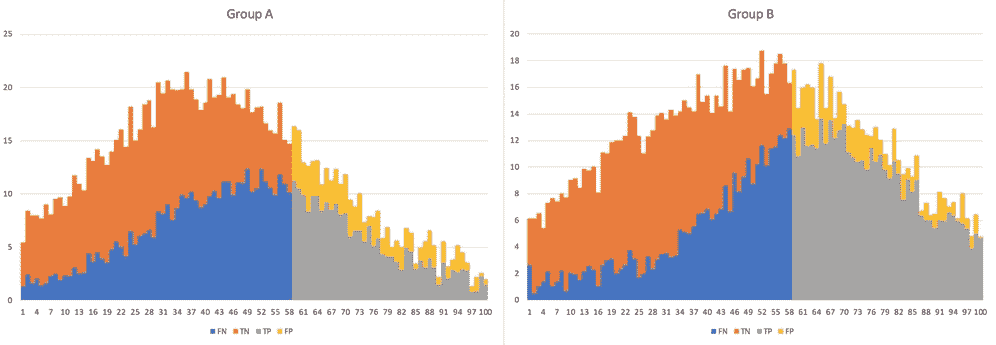

相等截止

在上图中，虽然两组的截止利率相同，但 A 组获得的贷款较少。同时，**A 组**的预测精度低于**B 组**的预测精度。看起来，虽然两组面临相同的得分门槛，但 A 组处于劣势。

人口均等旨在通过确保两个群体获得贷款的机会相同来实现公平。这种方法旨在使两组获得相同的选择率，这就是衡量影响差异的标准。在数学上，这个过程可以表示如下:

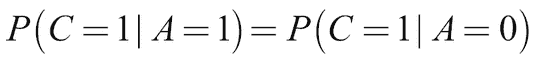

如果我们将这个规则应用到与我们之前使用的相同的上下文中，我们将得到以下分界点:

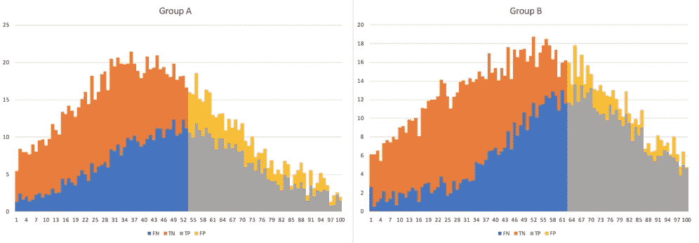

相等提货率

虽然这种方法不能归咎于统计歧视和不同的影响，但它可以归咎于不同的处理。在等拣选率图中，我们可以看到**组 A** 如何获得较低的阈值分数；同时，有更多成功的 T2 A 组申请人拖欠贷款。事实上，**A 组**不盈利，得到**B 组**的补贴。接受一个更差的经济结果来支持一个特定的群体也被称为基于品味的歧视。可以说，B 组**的较高门槛是不公平的，因为他们的 FP 率较低。**

TP 均等，也称为机会均等，意味着两种人口统计数据具有相同的 TP 比率。对于能还贷款的人来说，获得贷款的机会应该是同样存在的。在数学上，这可以表示如下:

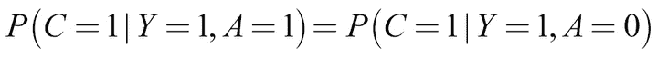

应用于我们的数据，这一政策看起来类似于人口统计均等，除了群体分界点更低:

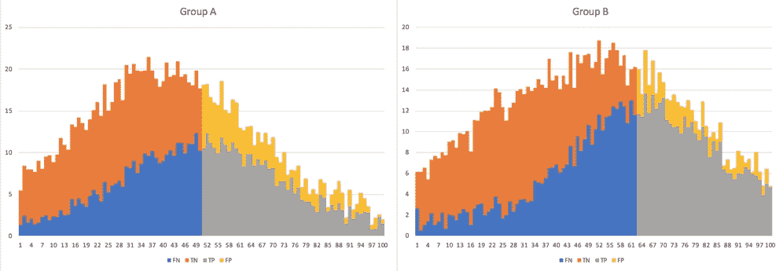

均等机会

机会均等可以解决许多人口统计学上的平等问题，因为大多数人认为每个人都应该被给予同样的机会。尽管如此，我们的分类器对于 A 组来说还是不够准确，而且有一种完全不同的处理方式。

准确性奇偶校验告诉我们，两组预测的准确性应该是相同的。在数学上，这可以表示如下:

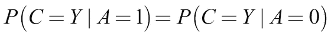

对于敏感变量 *A* 的两个可能值，分类器正确的概率应该相同。当我们将这一标准应用于我们的数据时，我们得到以下输出:

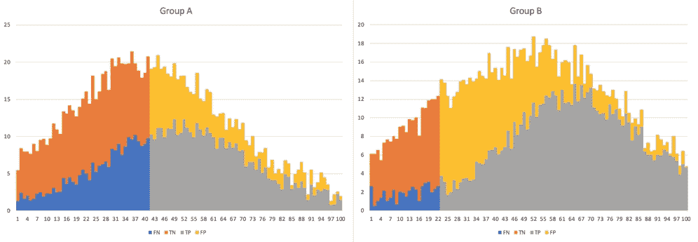

同等准确度

从上图可以看出，不利的一面是显而易见的。为了满足准确性约束，B 组的成员可以更容易地获得贷款。

因此，为了解决这个问题，必须进行折衷,因为除非分类器是完美的，否则没有分类器可以具有精度奇偶校验、TP 奇偶校验以及 FP 奇偶校验。 *C = Y，*或者两个人口统计数据具有相同的基本费率:

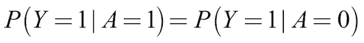

表达公平的方式还有很多。然而，关键的一点是，它们中没有一个完全满足所有的公平标准。对于任何两个基础利率不平等、还贷机会不平等的人群，建立统计上的均等需要引入待遇差异。

这一事实导致了一系列辩论，尚未就表达和消除歧视的最佳做法达成一致。也就是说，即使找到了公平的完美数学表达式，也不会立即产生完美的公平系统。

任何机器学习算法都是一个更大系统的一部分。输入 *X* 通常不像同一系统中可能使用不同输入的不同算法那样明确定义。人口统计组 *A* 通常没有明确定义或推断。甚至分类器的输出 *C、*也经常不能被清楚地区分，因为许多算法可能一起执行分类任务，而每个算法预测不同的输出，例如信用评分或盈利能力估计。

好的技术不能代替好的政策。盲目地追随一种算法，而没有个体考虑或诉求的机会，总会导致不公平。话虽如此，尽管数学公平标准无法解决我们面临的所有公平问题，但让机器学习算法变得更加公平肯定是值得的，这也是下一节要讲的内容。


# 训练要公平

有多种方法训练模型更加公平。一种简单的方法是使用不同的公平性度量，我们在前面的部分中已经将它列为额外的损失。然而，在实践中，这种方法被证明有几个问题，例如在实际的分类任务中性能很差。

另一种方法是使用敌对网络。早在 2016 年，卢佩、卡根和克兰默发表了论文*学习以敌对网络为支点*，可在[https://arxiv.org/abs/1611.01046](https://arxiv.org/abs/1611.01046)获得。本文展示了如何使用一个对抗性网络来训练一个分类器忽略一个讨厌的参数，如敏感的特征。

在此示例中，我们将训练一个分类器来预测一个成年人的年收入是否超过 50，000 美元。这里的挑战是让我们的分类器不受种族和性别的影响，只关注我们可以区分的特征，包括他们的职业和他们从资本中获得的收益。

为此，我们必须训练一个分类器和一个对抗网络。对抗网络旨在从分类器的预测中对敏感属性 *a* 性别和种族进行分类:

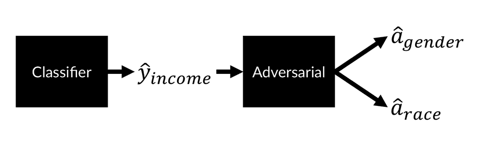

制作无偏分类器检测成年人的收入

分类器旨在根据收入进行分类，但也旨在欺骗敌对网络。分类器的最小化目标公式如下:

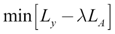

在该公式中，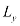是分类的二元交叉熵损失，而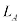是对抗性损失。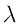代表一个超参数，我们可以用它来放大或减小对抗性损失的影响。

### 注意

注:这种对抗性公平方法的实现遵循 Stijn Tonk 和 Henk Griffioen 的实现。你可以在 https://www.kaggle.com/jannesklaas/learning-how-to-be-fair[找到这一章的代码。](https://www.kaggle.com/jannesklaas/learning-how-to-be-fair)

Stijn 和 Henk 的博客原文可以在这里找到:[https://blog.godatadriven.com/fairness-in-ml](https://blog.godatadriven.com/fairness-in-ml)。

为了公平地训练这个模型，我们不仅需要数据 *X* 和目标 *y* ，还需要关于敏感属性 *A* 的数据。在我们将要处理的例子中，我们将从 https://archive.ics.uci.edu/ml/datasets/Adult[的 UCI 库提供的 1994 年美国人口普查中获取数据。](https://archive.ics.uci.edu/ml/datasets/Adult)

为了使加载数据更容易，它被转换成一个带有列标题的 CSV 文件。顺便说一下，请参考在线版本来查看数据，因为在本书的格式中查看数据会很困难。

首先，我们加载数据。数据集包含来自许多不同种族的人的数据，但是为了任务的简单，我们将只关注白人和黑人的`race`属性。为此，我们需要运行以下代码:

```
path = '../input/adult.csv'

input_data = pd.read_csv(path, na_values="?")

input_data = input_data[input_data['race'].isin(['White', 'Black'])]
```

接下来，我们选择敏感属性，在本例中，我们将重点放在种族和性别上，放入我们的敏感数据集`A`。我们对数据进行一次性编码，使得`gender`属性的“男性”等于 1，而`race`属性的`White`等于 1。我们可以通过运行以下代码来实现这一点:

```
sensitive_attribs = ['race', 'gender']

A = input_data[sensitive_attribs]

A = pd.get_dummies(A,drop_first=True)

A.columns = sensitive_attribs
```

我们的目标是`income`属性。因此，我们需要将`>50K`编码为 1，将其他所有内容编码为 0，这可以通过编写以下代码来实现:

```
y = (input_data['income'] == '>50K').astype(int)
```

为了获得我们的训练数据，我们首先去除敏感和目标属性。然后，我们填充所有缺失的值，并对所有数据进行一次性编码，如以下代码所示:

```
X = input_data.drop(labels=['income', 'race', 'gender'],axis=1)

X = X.fillna('Unknown')

X = pd.get_dummies(X, drop_first=True)
```

最后，我们将数据分成训练集和测试集。如以下代码所示，然后我们对数据进行分层，以确保测试和培训数据中的高收入者数量相同:

```
X_train, X_test, y_train, y_test, A_train, A_test = \

train_test_split(X, y, A, test_size=0.5, stratify=y, random_state=7)
```

为了确保数据能够很好地与神经网络一起工作，我们现在将使用 scikit-learn 的`StandardScaler`来缩放数据:

```
scaler = StandardScaler().fit(X_train)

X_train = pd.DataFrame(scaler.transform(X_train), columns=X_train.columns, index=X_train.index)

X_test = pd.DataFrame(scaler.transform(X_test), columns=X_test.columns, index=X_test.index)
```

我们需要一个指标来衡量我们的模型有多公平。我们使用不同的影响选择规则。`p_rule`方法计算两个群体中收入超过 50，000 美元的人的比例，然后返回弱势群体中选择的比例与优势群体中选择的比例。

目标是`p_rule`方法返回至少 80%,以满足种族和性别的五分之四规则。以下代码显示了该函数如何仅用于监控，而不作为损失函数:

```
def p_rule(y_pred, a_values, threshold=0.5):

    y_a_1 = y_pred[a_values == 1] > threshold if threshold else y_pred[a_values == 1]                                           #1

    y_a_0 = y_pred[a_values == 0] > threshold if threshold else y_pred[a_values == 0] 

    odds = y_a_1.mean() / y_a_0.mean()                          #2

    return np.min([odds, 1/odds]) * 100
```

让我们更详细地研究一下这段代码。正如您在前面的代码块中看到的，它具有两个关键特性，如下所示:

1.  首先，我们选择给谁一个选定的阈值。在这里，我们将模型分配的有超过 50%的机会赚 50，000 美元或更多的人归类为高收入者。
2.  其次，我们计算两种人口统计学的选择比。我们用一组的比率除以另一组的比率。通过返回赔率或 1 除以赔率的最小值，我们确保返回小于 1 的值。

为了使模型设置更简单，我们需要定义输入特征的数量和敏感特征的数量。这可以通过运行这两行代码来完成:

```
n_features=X_train.shape[1]

n_sensitive=A_train.shape[1]
```

现在我们设置我们的分类器。注意这个分类器是一个标准的分类神经网络。它具有三个隐藏层、一些丢弃层和一个具有 sigmoid 激活的最终输出层，这是因为这是一个二元分类任务而发生的。这个分类器是用 Keras functional API 编写的。

为了确保您理解 API 是如何工作的，请仔细阅读下面的代码示例，并确保您理解为什么要采取这些步骤:

```
clf_inputs = Input(shape=(n_features,))

x = Dense(32, activation='relu')(clf_inputs)

x = Dropout(0.2)(x)

x = Dense(32, activation='relu')(x)

x = Dropout(0.2)(x)

x = Dense(32, activation='relu')(x)

x = Dropout(0.2)(x)

outputs = Dense(1, activation='sigmoid', name='y')(x)

clf_net = Model(inputs=[clf_inputs], outputs=[outputs])
```

对抗网络是一个有两个头的分类器:一个从模型输出预测申请人的种族，一个预测申请人的性别:

```
adv_inputs = Input(shape=(1,))

x = Dense(32, activation='relu')(adv_inputs)

x = Dense(32, activation='relu')(x)

x = Dense(32, activation='relu')(x)

out_race = Dense(1, activation='sigmoid')(x)

out_gender = Dense(1, activation='sigmoid')(x)

adv_net = Model(inputs=[adv_inputs], outputs=[out_race,out_gender])
```

如同生成对抗网络一样，我们必须多次使网络可训练和不可训练。为了简化操作，以下函数将创建一个函数，使网络及其所有图层可训练或不可训练:

```
def make_trainable_fn(net):              #1

    def make_trainable(flag):            #2

        net.trainable = flag             #3

        for layer in net.layers:

            layer.trainable = flag

    return make_trainable                #4
```

根据前面的代码，我们应该花点时间来研究四个关键特性:

1.  该函数接受一个 Keras 神经网络，为此将创建列车开关函数。
2.  在函数内部，创建了第二个函数。第二个函数接受一个布尔标志(`True` / `False`)。
3.  当被调用时，第二个函数将网络的可训练性设置为标志。如果`False`通过，则网络不可训练。由于网络的各层也可以在其他网络中使用，我们确保每个单独的层也是不可训练的。
4.  最后，我们返回函数。

使用一个函数来创建另一个函数起初可能看起来很复杂，但这允许我们轻松地为神经网络创建“开关”。以下代码片段向我们展示了如何为分类器和敌对网络创建开关函数:

```
trainable_clf_net = make_trainable_fn(clf_net)

trainable_adv_net = make_trainable_fn(adv_net)
```

为了使分类器可训练，我们可以使用带有`True`标志的函数:

```
trainable_clf_net(True)
```

现在我们可以编译我们的分类器了。正如您将在本章后面看到的，将分类器网络作为一个独立于我们用来进行预测的编译分类器的变量是很有用的:

```
clf = clf_net

clf.compile(loss='binary_crossentropy', optimizer='adam')
```

请记住，为了训练我们的分类器，我们需要通过对手运行它的预测，以及获得对手损失并将负对手损失应用于分类器。这最好通过将分类器和对手打包到一个网络中来完成。

为此，我们必须首先创建一个新的模型，该模型从分类器输入映射到分类器和对手输出。我们将对手输出定义为对手网络和分类器网络的嵌套函数。这样，分类器的预测会立即传递给对手:

```
adv_out = adv_net(clf_net(clf_inputs))
```

然后，我们将分类器输出定义为分类器网络的输出，就像我们对分类一样:

```
clf_out = clf_net(clf_inputs)
```

然后，我们定义组合模型以从分类器输入(即关于申请人的数据)映射到分类器输出和对手输出:

```
clf_w_adv = Model(inputs=[clf_inputs], outputs=[clf_out]+adv_out)
```

当训练组合模型时，我们只想更新分类器的权重，因为我们将单独训练对手。我们可以使用我们的开关函数使分类器网络可训练，而对手网络不可训练:

```
trainable_clf_net(True)

trainable_adv_net(False)
```

记住前面最小化目标中的超参数。我们需要为这两个敏感属性手动设置这个参数。事实证明，如果种族的λ设置得比性别的λ高得多，网络训练得最好。

有了λ值，我们就可以得出加权损失:

```
loss_weights = [1.]+[-lambda_param for lambda_param in lambdas]
```

前面的表达式导致损失权重为[1。,-130,-30].这意味着分类误差的权重为 1，对手的种族预测误差的权重为-130，对手的性别预测误差的权重为-30。由于对手预测的损失具有负权重，梯度下降将优化分类器的参数以*增加*这些损失。

最后，我们可以编译组合网络:

```
clf_w_adv.compile(loss='binary_crossentropy'), loss_weights=loss_weights,optimizer='adam')
```

有了分类器和组合的分类器-对抗模型，唯一缺少的是编译的对抗模型。为此，我们将首先定义敌对模型，以从分类器输入映射到嵌套敌对分类器模型的输出:

```
adv = Model(inputs=[clf_inputs], outputs=adv_net(clf_net(clf_inputs)))
```

然后，当训练对抗模型时，我们想要优化对抗网络的权重，而不是分类器网络的权重，因此我们使用我们的切换函数来使得对抗模型是可训练的，而分类器是不可训练的:

```
trainable_clf_net(False)

trainable_adv_net(True)
```

最后，我们编译对抗性模型，就像我们编译常规 Keras 模型一样:

```
adv.compile(loss='binary_crossentropy', optimizer='adam')
```

有了所有的片段，我们现在可以预训练分类器了。这意味着我们训练分类器时没有任何特殊的公平性考虑:

```
trainable_clf_net(True)

clf.fit(X_train.values, y_train.values, epochs=10)
```

训练完模型后，我们可以对验证集进行预测，以评估模型的公平性和准确性:

```
y_pred = clf.predict(X_test)
```

现在我们将计算模型的准确性和`p_rule`性别和种族。在所有计算中，我们将使用截止点 0.5:

```
acc = accuracy_score(y_test,(y_pred>0.5))* 100

print('Clf acc: {:.2f}'.format(acc))

for sens in A_test.columns:

    pr = p_rule(y_pred,A_test[sens])

    print('{}: {:.2f}%'.format(sens,pr))
```

```

out:

Clf acc: 85.44

race: 41.71%

gender: 29.41%

```

正如你所看到的，分类器在预测收入方面达到了相当高的准确率，85.44%。然而，这是非常不公平的。女性挣 5 万美元以上的机会只有男性的 29.4%。

同样，它强烈歧视种族。例如，如果我们使用这个分类器来判断贷款申请，我们将很容易受到歧视诉讼。

### 注意

**注**:分类器的特征中不包含性别和种族。然而，分类器对它们进行了强烈的区分。如果可以推断出特征，删除敏感列是不够的。

为了摆脱这种混乱，我们将在训练两个网络做出公平预测之前，对敌对网络进行预训练。我们再一次使用我们的开关函数，使分类器不可训练，而对手是可训练的:

```
trainable_clf_net(False)

trainable_adv_net(True)
```

由于数据中的种族和性别分布可能会有偏差，我们将使用加权类对此进行调整:

```
class_weight_adv = compute_class_weights(A_train)
```

然后，我们训练对手通过分类器的预测从训练数据中预测种族和性别:

```
adv.fit(X_train.values, np.hsplit(A_train.values, A_train.shape[1]), class_weight=class_weight_adv, epochs=10)
```

NumPy 的`hsplit`函数将 2D `A_train`矩阵分割成两个向量，然后用于训练两个模型头部。

分类器和对手经过预训练后，我们现在将训练分类器欺骗对手，以便更好地发现分类器的区别。在我们开始之前，我们需要做一些设置。我们希望训练 250 个纪元，批量大小为 128，具有两个敏感属性:

```
n_iter=250

batch_size=128

n_sensitive = A_train.shape[1]
```

分类器和对抗器的组合网络也需要一些类别权重。少于/多于 50，000 美元的收入预测的权重都是 1。对于组合模型的对立标题，我们使用前面计算的对立类权重:

```
class_weight_clf_w_adv = [{0:1., 1:1.}]+class_weight_adv
```

为了跟踪指标，我们为验证指标、准确性和曲线下面积以及公平性指标设置了一个数据框架。公平性指标是种族和性别的`p_rule`值:

```
val_metrics = pd.DataFrame()

fairness_metrics = pd.DataFrame()
```

在主训练循环中，执行三个步骤:训练敌对网络，训练公平的分类器，并打印出验证度量。为了更好地解释，这三者在这里分开打印。

在代码中，你会发现它们在同一个循环中，其中`idx`是当前迭代:

```
for idx in range(n_iter):
```

第一步是训练对抗网络。为此，我们将使分类器不可训练，敌对网络可训练，然后像我们以前做的那样训练敌对网络。为此，我们需要运行以下代码块:

```
trainable_clf_net(False)

trainable_adv_net(True)

adv.fit(X_train.values, np.hsplit(A_train.values, A_train.shape[1]), batch_size=batch_size, class_weight=class_weight_adv, epochs=1, verbose=0)
```

训练分类器成为一个好的分类器，同时欺骗对手并保持公平，包括三个步骤。首先，我们使对手不可训练，分类器可训练:

```
trainable_clf_net(True)

trainable_adv_net(False)
```

然后我们从`X`、`y`和`A`抽取一批样品:

```
indices = np.random.permutation(len(X_train))[:batch_size]

X_batch = X_train.values[indices]

y_batch = y_train.values[indices]

A_batch = A_train.values[indices]
```

最后，我们训练组合的对手和分类器。由于敌对网络被设置为不可训练的，只有分类器网络将被训练。然而，敌对网络对种族和性别的预测的损失会通过整个网络反向传播，从而分类器学会欺骗敌对网络:

```
clf_w_adv.train_on_batch(X_batch, [y_batch]+\np.hsplit(A_batch, n_sensitive),class_weight=class_weight_clf_w_adv)
```

最后，我们希望通过首先对测试进行预测来跟踪进度:

```
y_pred = pd.Series(clf.predict(X_test).ravel(), index=y_test.index)
```

然后，我们计算曲线下的面积(`ROC AUC`)和预测的准确度，并将它们保存在`val_metrics`数据框中:

```
roc_auc = roc_auc_score(y_test, y_pred)

acc = accuracy_score(y_test, (y_pred>0.5))*100

val_metrics.loc[idx, 'ROC AUC'] = roc_auc

val_metrics.loc[idx, 'Accuracy'] = acc
```

接下来，我们计算种族和性别的`p_rule`,并将这些值保存在公平指标中:

```
for sensitive_attr :n A_test.columns:

    fairness_metrics.loc[idx, sensitive_attr] =\

    p_rule(y_pred,A_test[sensitive_attr])
```

如果我们绘制公平性和有效性指标，我们将得到以下图表:

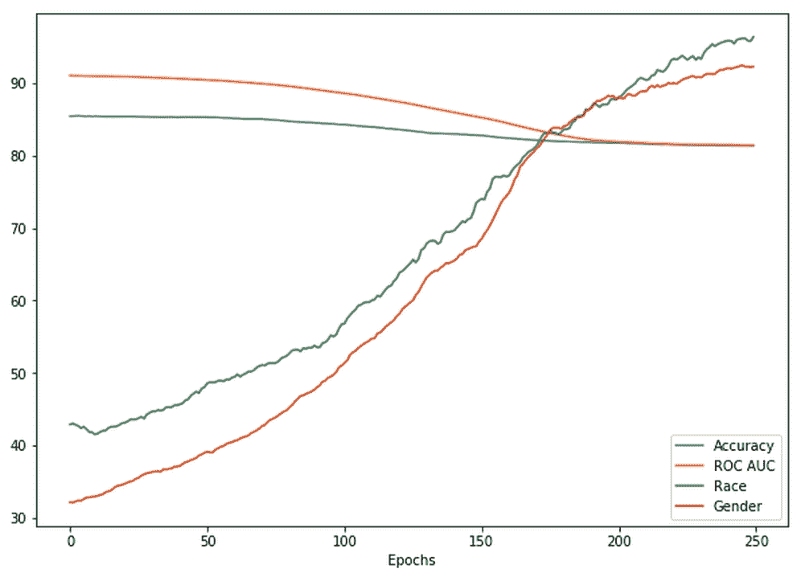

枢纽列车进度

正如你可以看到的，分类器的公平分数随着训练稳步增加。大约 150 个时期后，分类器满足五分之四规则。同时，p 值大大超过 90%。这种公平性的增加只是在准确性和曲线下面积上有一点点减少。以这种方式训练的分类器显然是具有相似性能的更公平的分类器，因此优于没有公平标准训练的分类器。

公平机器学习的枢纽方法有许多优点。然而，它不能完全排除不公平。例如，如果分类器歧视了一个我们还没有想到的群体呢？如果它歧视的是治疗，而不是影响呢？为了确保我们的模型没有偏见，我们需要更多的技术和社会工具，即*可解释性*、*因果性*和*多样化开发团队*。

在下一部分，我们将讨论如何训练学习因果关系的机器学习模型，而不仅仅是统计关联。


# 因果学习

这本书大体上是一本关于统计学习的书。给定数据 *X* 和目标 *Y* ，我们的目标是估计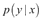，给定某些数据点的目标值的分布。统计学习允许我们创建许多具有有用应用的伟大模型，但它不允许我们声称 *X* 是 *x* 导致 *Y* 是 *y* 。

如果我们打算操纵 *X* ，这一陈述是至关重要的。例如，如果我们想知道给某人保险是否会导致他们行为鲁莽，我们不会对有保险的人比没有保险的人行为更鲁莽的统计关系感到满意。例如，在不计后果的人获得保险的数量上可能存在自我选择偏差，而那些没有被标记为不计后果的人则没有。

著名的计算机科学家朱迪亚·珀尔发明了一种称为 do-calculus 的因果模型符号；我们感兴趣的是，是我们把 *P* 操纵成 *p* 后，有人胡作非为的概率。在因果符号中， *X* 通常代表观察到的特征，而 *P* 代表我们可以操纵的政策特征。这种符号可能有点混乱，因为现在 p 既表示概率，也表示策略。然而，区分观察到的特征和受影响的特征是很重要的。所以，如果你看到， *p* 是受影响的特征，如果你看到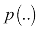， *p* 是概率函数。

所以，公式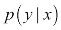表达了保险持有人平均更不计后果的统计关系。这是监督模型学习的内容。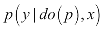表达了得到保险的人因为投保而变得更加鲁莽的因果关系。

因果模型是公平学习的伟大工具。如果我们仅仅以因果的方式建立我们的模型，那么我们将会避免统计模型中出现的大部分统计歧视。从统计数据来看，女性比男性挣得少吗？是的。女性挣得少是因为她们是女性，而女性在某种程度上不值得高薪吗？不。相反，收入差异是由其他因素造成的，如男性和女性获得的工作不同，工作场所的歧视，文化偏见等等。

这并不意味着我们必须抛弃统计模型。对于因果关系不是一个重要因素的许多情况，以及我们不打算设置 *X* 的值的情况，它们非常有用。例如，如果我们正在创建一个自然语言模型，那么我们对某个单词的出现是否导致句子是关于某个主题不感兴趣。知道题目和单词相关，就足以对课文内容做出预测。

## 获得因果模型

获得关于的信息的黄金路线是实际操作随机对照试验中的 *P、*政策。例如，许多网站通过向不同的客户展示不同的广告来衡量不同广告的影响，这一过程被称为 A/B 测试。同样，一个交易者可能会选择不同的市场路线来找出哪一条是最好的。然而，做 A/B 测试并不总是可能的，甚至是不道德的。例如，在我们关注金融的情况下，银行不能拒绝贷款，并解释说，“对不起，但你是控制组。”

然而，通常不需要 A/B 检验就可以做出因果推断。使用 do-calculus，我们可以推断我们的政策对我们的结果的影响。举个例子，我们想知道给人们保险是否会让他们变得鲁莽；申请人的道德风险。给定特征 *X* 和策略 *P* ，我们想要预测结果分布。

在这种情况下，给定关于投保人的观察到的信息，例如他们的年龄或冒险行为的历史，我们想要预测投保人鲁莽行为的概率，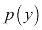，给定我们操纵给予保险的政策， *P，*。观察到的特征往往最终会影响政策和反应。例如，高风险偏好的申请人可能得不到保险，但也更有可能鲁莽行事。

此外，我们必须处理未观察到的、混杂的变量， *e，*它们经常影响政策和反应。例如，一篇名为*自由式滑雪是安全的，你不应该买保险*的著名媒体文章将减少参加保险的人数以及鲁莽滑雪的人数。

## 仪器变量

为了区分对策略和响应的影响，我们需要使用一个**工具，Z** 。工具是影响政策的变量，除此之外别无其他。例如，再保险成本可能会促使保险公司减少保单数量。这种关系可以在下面的流程图中看到，其中映射了这种关系:

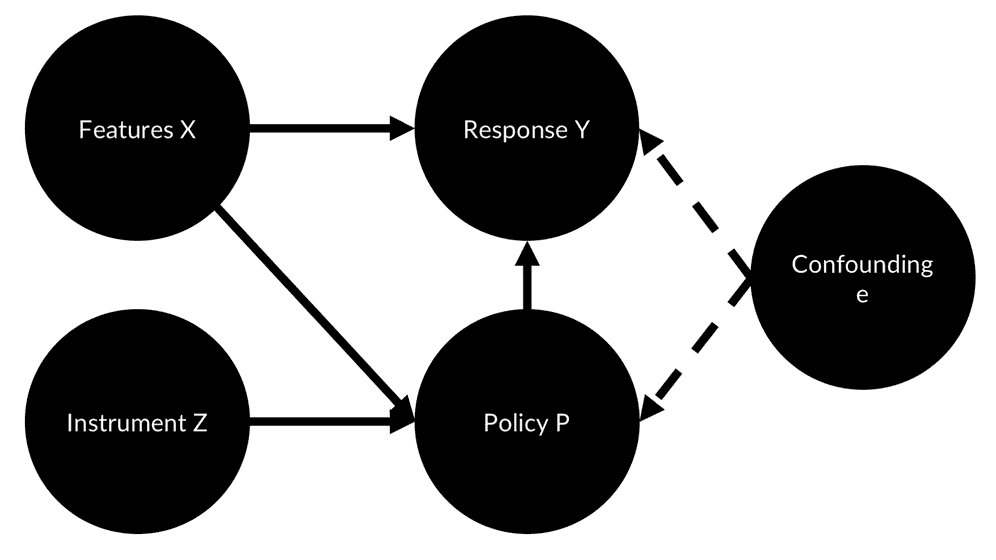

因果流程图

计量经济学领域已经建立了一种方法来处理这种情况，称为**工具变量两阶段最小二乘法** ( **IV2SLS，**或只是 **2SLS** )。简而言之，2SLS 首先拟合工具、*、*与政策、 *p* 之间的线性回归模型，在计量经济学中称为内生或处理变量。

从这个线性回归，它然后估计一个“调整的治疗变量”，它是可以由仪器解释的治疗变量。这个想法是，这种调整消除了所有其他因素对治疗的影响。然后，第二线性回归模型创建从特征 *x、*和调整后的治疗变量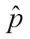到结果 *y* 的线性模型映射。

在下图中，您可以看到 2SLS 如何工作的概述:

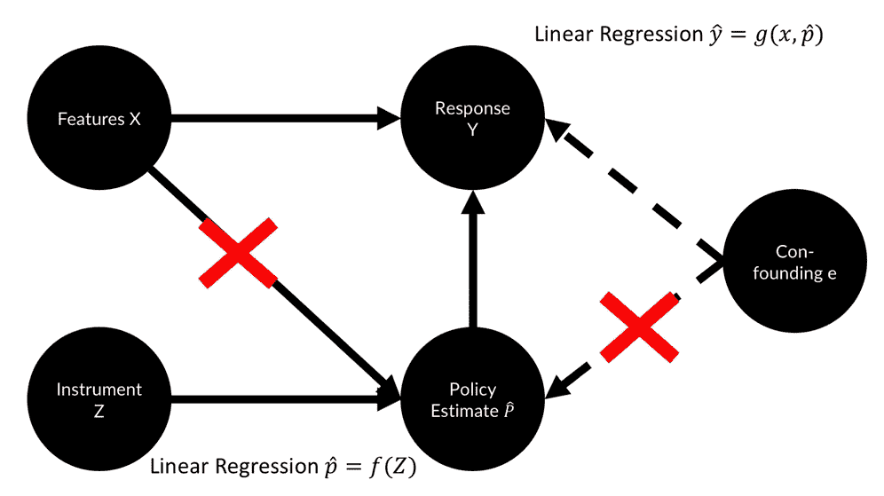

IV2SLS

2SLS 可能是我们案例中的保险公司会使用的方法，因为这是一种既定的方法。除了给你一个如何在 Python 中使用 2sl 的简要概述，我们不会在这里深入讨论细节。Python 中的`linear model`包提供了一种运行 2SLS 的简单方法。

### 注

**注**:你可以在 GitHub 的[https://github.com/bashtage/linearmodels](https://github.com/bashtage/linearmodels)找到这个包。

您可以通过运行以下命令来安装该软件包:

```

pip install linearmodels

```

如果您有数据`X`、`y`、`P`和`Z`，您可以如下运行一个 2SLS 回归:

```
from linearmodels.iv import IV2SLS

iv = IV2SLS(dependent=y,exog=X,endog=P],instruments=Z).fit(cov_type='unadjusted')
```

## 非线性因果模型

如果特征、治疗和结果之间的关系是复杂的和非线性的，该怎么办？在这种情况下，我们需要执行类似于 2SLS 的过程，但是使用非线性模型，如神经网络，而不是线性回归。

暂时忽略混杂变量，函数 *g* 确定给定保险单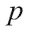和一组投保人特征 *x* 的行为 *y* :

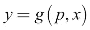

函数 *f* 决定政策给定申请人的特征， *x，*以及仪器， *z* :

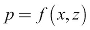

给定这两个函数，如果混杂变量具有零总体特征的平均值，则以下等式成立:

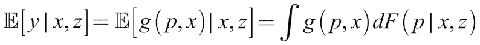

这意味着，如果我们能够可靠地估计函数、 *g、*和分布、 *F* ，我们就可以对政策的影响做出因果陈述。如果我们有关于实际结果的数据、 *y* 、特性 *x* 、策略和工具 *z* ，我们可以优化以下内容:

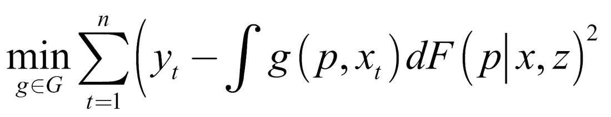

前面的函数是使用预测函数*g*预测的结果和实际结果 *y* 之间的平方误差。

请注意与 2sl 的相似之处。在 2SLS 中，我们用两个独立的线性回归估计了 *F* 和 *g* 。对于更复杂的函数，我们也可以用两个独立的神经网络来估计。早在 2017 年，Jason Hartfort 和其他人就在他们的论文中提出了这样一种方法，*Deep IV:A Flexible Approach for counter factual Prediction*——可在:[http://proceedings . MLR . press/v 70/Hartford 17a/Hartford 17a . pdf](http://proceedings.mlr.press/v70/hartford17a/hartford17a.pdf)上找到——其概述可在下图中看到:

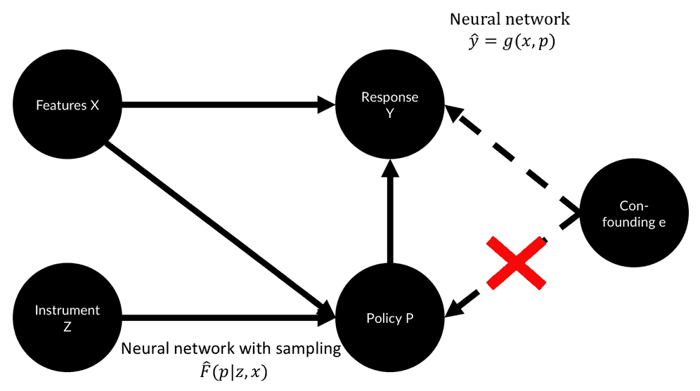

深度 IV

Deep IV 的想法是首先训练一个神经网络来表达一个分布， *F(z，x)，*描述给定某些特征的策略的分布， *x* ，以及工具值， *z* 。第二个神经网络从估计的策略分布和特征预测响应 *y* 。Deep IV 的优势在于，它可以从复杂的数据中学习复杂的非线性关系，比如文本。

*Deep IV* 论文的作者还发布了一个定制的 Keras 模型，用于处理采样和从分布部分学习，你可以在 GitHub:[https://github.com/jhartford/DeepIV](https://github.com/jhartford/DeepIV)上找到。

虽然他们的代码太长，无法在这里深入讨论，但在 Deep IV 和 IV2SLS 中，思考一下我们的因果声明的来源是什么是很有趣的。在我们的保险案例中，我们假设有或没有保险都会影响行为，而不是相反。我们从未展示或测试过这种因果关系背后的真相。

在我们的案例中，假设保险影响行为是合理的，因为保险合同是在行为被观察到之前签署的。然而，因果关系的方向并不总是那么直截了当。除了逻辑推理或者实验，没有办法建立因果关系的方向。在没有实验的情况下，我们必须假设和逻辑推理，例如，通过事件的顺序。我们做的另一个重要假设是，这个工具实际上是一个独立的工具。如果它不是独立的，我们对政策的估计就会崩溃。

考虑到这两个限制，因果推理成为一个伟大的工具和一个活跃的研究领域，我们可以希望在未来看到伟大的成果。在最好的情况下，你的歧视敏感模型将只包含因果变量。实际上，这通常是不可能的。然而，记住统计相关性之间的差异，如标准统计模型和因果关系所表达的，可以帮助您避免统计偏差和错误的关联。

减少不公平的最后一个更技术性的方法是窥视模型内部以确保它是公平的。我们已经在上一章中研究了可解释性，主要是为了调试数据和发现过度拟合，但是现在，我们将再看一看，这次是为了证明模型的预测是正确的。


# 解释模型以确保公平

在[第 8 章](ch08.html "Chapter 8. Privacy, Debugging, and Launching Your Products")、*隐私、调试和发布你的产品中，*我们讨论了作为调试方法的模型可解释性。我们使用石灰来找出模型过度拟合的特征。

在这一节中，我们将使用一种稍微复杂一点的方法，叫做 **SHAP** ( **SHapley 加法解释**)。SHAP 把几种不同的解释方法结合成一种简洁的方法。这种方法使我们能够为单个预测以及整个数据集生成解释，以便更好地理解模型。

你可以在[https://github.com/slundberg/shap](https://github.com/slundberg/shap)的 GitHub 上找到 SHAP，用`pip install shap`在本地安装。Kaggle 内核已经预装了 SHAP。

### 提示

这里给出的示例代码来自 SHAP 示例笔记本。你可以在 Kaggle 上找到这个笔记本的一个稍微扩展的版本:

[https://www . ka ggle . com/jannesklaas/explaining-income-class ification-with-keras](https://www.kaggle.com/jannesklaas/explaining-income-classification-with-keras)

SHAP 结合了七种模型解释方法，分别是 LIME、Shapley 采样值、DeepLIFT、**量化输入影响** ( **QII** )、逐层相关性传播、Shapley 回归值，以及一个具有两个模块的树解释器:一个模型不可知的`KernelExplainer`和一个专门用于基于树的方法(如`XGBoost`)的`TreeExplainer`模块。

如何以及何时使用解释器的数学方法与使用 SHAP 没有太大关系。简而言之，给定一个函数 *f* ，例如通过神经网络表示，以及一个数据点 *x* ，SHAP 将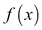与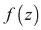进行比较，其中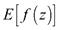是为更大样本生成的“预期正常输出”。然后，SHAP 将创建更小的模型，类似于石灰，看看哪些特征可以解释和之间的差异。

在我们的贷款示例中，这对应于有一个申请人， *x，*和许多申请人的分布， *z* ，并试图解释为什么申请人 *x* 获得贷款的机会不同于其他申请人的预期机会， *z* 。

SHAP 不仅比较和，还比较和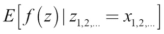。

这意味着它比较某些保持不变的特征的重要性，这允许它更好地估计特征之间的相互作用。

解释一个单一的预测可能非常重要，尤其是在金融界。你的客户可能会问你，“你为什么拒绝给我贷款？”你会记得之前的 ECOA 法案规定，你必须给客户一个合理的理由，如果你没有好的解释，你可能会发现自己处于一个艰难的境地。在本例中，我们再次使用收入预测数据集，目的是解释为什么我们的模型做出单一决策。这个过程分三步进行。

首先，我们需要定义解释者，并为其提供预测方法和值 *z* ，以估计“正常结果”。这里我们为 Keras 的预测函数使用了一个包装器`f`，这使得使用 SHAP 更加容易。我们提供 100 行数据集作为`z`的值:

```
explainer = shap.KernelExplainer(f, X.iloc[:100,:])
```

接下来，我们需要计算 SHAP 值，该值表示单个示例中不同特征的重要性。我们让 SHAP 为来自 *z* 的每个样本创建 500 个排列，这样 SHAP 总共有 50，000 个样本来与一个样本进行比较:

```
shap_values = explainer.shap_values(X.iloc[350,:], nsamples=500)
```

最后，我们可以用 SHAP 自己的绘图工具来绘制这些特性的影响。这次，我们提供的是来自`X_display`的一排，而不是`X`。`X_display`，包含未缩放的值，仅用于对图进行注释，以便于阅读:

```
shap.force_plot(explainer.expected_value, shap_values)
```

我们可以在下图中看到代码的输出:

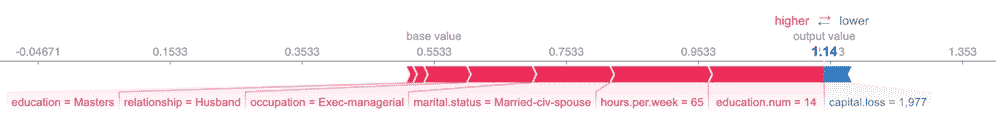

SHAP 绘图工具对特征的影响

如果你看一下前面的图，这个模型的预测似乎总的来说是合理的。这种模式让申请人有很高的机会获得高收入，因为他们有硕士学位，而且他们是每周工作 65 小时的执行经理。如果没有资本损失，申请人可以有更高的预期收入分数。同样，该模型似乎认为申请人已婚是高收入的一个重要因素。事实上，在我们的例子中，婚姻似乎比长时间工作或职位头衔更重要。

我们的模型也有一些问题，一旦我们计算并绘制另一个申请人的 SHAP 值，这些问题就变得很明显:

```
shap_values = explainer.shap_values(X.iloc[167,:], nsamples=500)

shap.force_plot(explainer.expected_value, shap_values)
```

然后显示以下输出的图形。这也显示了我们遇到的一些问题:

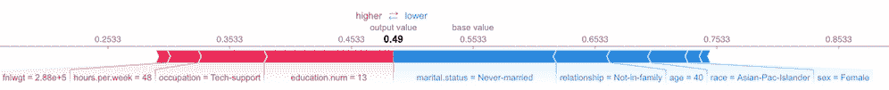

SHAP 价值观显示了我们可能会遇到的一些问题

在这个例子中，申请人也受过良好的教育，并在技术行业每周工作 48 小时，但这个模型给她提供了一个低得多的高收入机会，因为她是一名女性，一名亚太裔岛民，从未结过婚，也没有其他家庭关系。根据 ECOA 法案，以这些理由拒绝贷款是一场即将发生的诉讼。

我们刚刚看到的两个个案可能是模型的不幸故障。它可能过度适应了一些奇怪的组合，赋予婚姻不适当的重要性。为了调查我们的模型是否有偏差，我们应该调查许多不同的预测。幸运的是，SHAP 图书馆有很多工具可以做到这一点。

我们可以对多行使用 SHAP 值计算:

```
shap_values = explainer.shap_values(X.iloc[100:330,:], nsamples=500)
```

然后，我们也可以为所有这些值绘制一个强制图:

```
shap.force_plot(explainer.expected_value, shap_values)
```

同样，此代码生成了一个 SHAP 数据集图表，如下图所示:

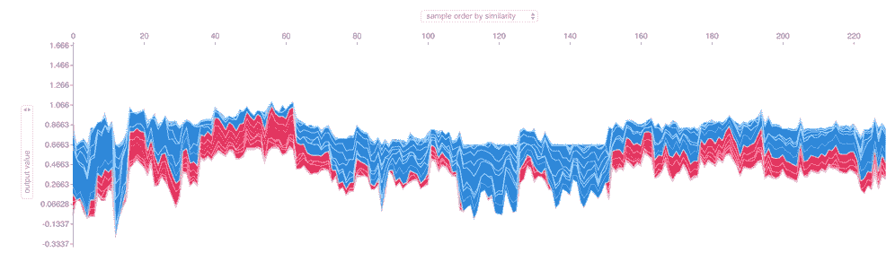

SHAP 数据集

前面的图显示了数据集的 230 行，这些行根据与它们相关的每个要素的作用力的相似性进行分组。在您的实时版本中，如果您将鼠标移动到图表上，您将能够读取要素及其值。

通过研究这个图表，你可以知道这个模型把什么样的人归类为高收入者或低收入者。例如，在最左边，你会看到大多数受教育程度低的人从事清洁工的工作。40 岁到 60 岁之间的大部分是受过高等教育的人，他们工作时间很长。

为了进一步研究婚姻状况的影响，你可以改变 SHAP 在 y 轴上显示的内容。让我们来看看婚姻的影响:

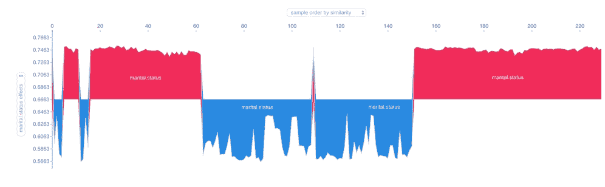

SHAP 婚姻结局

正如你在这张图表中看到的，婚姻状况对不同群体的人产生强烈的正面或负面影响。如果你把鼠标移到图表上，你会发现积极的影响都来自公民婚姻。

使用汇总图，我们可以看到哪些功能对我们的模型最重要:

```
shap.summary_plot(shap_values, X.iloc[100:330,:])
```

然后，这段代码输出最终的汇总曲线图，如下所示:

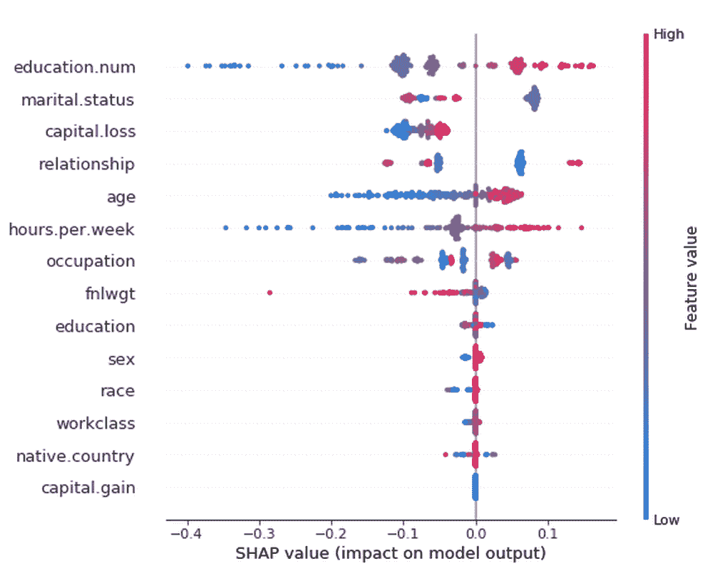

SHAP 汇总图

如你所见，教育对我们的模型影响最大。也有着最广泛的传播影响力。低教育水平会降低预测，而高教育水平会提高预测。婚姻状况是第二重要的预测因素。有趣的是，资本损失对模型来说很重要，但资本收益却不重要。

为了更深入地挖掘婚姻的影响，我们还有一个工具可以使用，那就是依赖图，它可以显示一个个体特征的 SHAP 值和一个 SHAP 怀疑高度交互作用的特征。通过下面的代码片段，我们可以检查婚姻对模型预测的影响:

```
shap.dependence_plot("marital-status", shap_values, X.iloc[100:330,:], display_features=X_display.iloc[100:330,:])
```

运行此代码的结果是，我们现在可以在下图中看到婚姻影响的可视化表示:

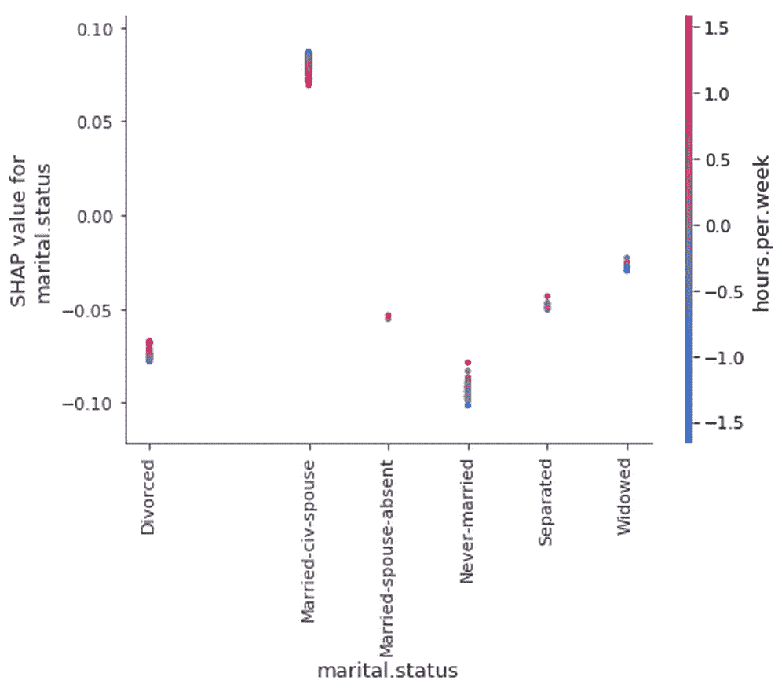

SHAP 婚姻依赖

正如你所看到的，**“已婚公民配偶”**，没有武装部队伴侣的平民婚姻的人口普查代码，对模型结果产生了积极的影响。与此同时，其他类型的安排都有轻微的负得分，尤其是从未结婚的。

从统计数据来看，富人倾向于维持更长时间的婚姻，年轻人更有可能从未结过婚。我们的模型正确地将婚姻与高收入联系起来，但不是因为婚姻导致高收入。该模型在进行关联时是正确的，但是基于该模型进行决策是错误的。通过选择，我们有效地操纵我们选择的特征。我们不再仅对感兴趣，而是对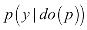感兴趣。


# 作为复杂系统故障的不公平

在这一章中，你已经配备了一个技术工具库，使机器学习模型更加公平。然而，模型不是在真空中运行的。模型嵌入在复杂的社会技术系统中。有人开发和监控模型，获取数据，并为如何处理模型输出创建规则。还有其他的机器，产生数据或者使用模型的输出。不同的玩家可能会尝试用不同的方式来玩这个系统。

不公平同样复杂。我们已经讨论了不公平的两个一般定义，*不同的影响*和*不同的待遇*。不同的待遇可能针对任何特征组合(年龄、性别、种族、国籍、收入等)，通常以复杂和非线性的方式出现。本节研究 Richard Cook 在 1998 年发表的论文*How complex systems fail*——可在[https://web . MIT . edu/2.75/resources/random/How % 20 complex % 20 systems % 20 fail . pdf](https://web.mit.edu/2.75/resources/random/How%20Complex%20Systems%20Fail.pdf)上获得——该论文研究了复杂的机器学习驱动的系统如何不公平。库克列出了 18 点，其中一些将在下面的章节中讨论。

## 复杂系统本质上是危险系统

系统通常是复杂的，因为它们是危险的，因此许多安全措施被创造出来。金融系统是一个危险的系统；如果它出轨，它会破坏经济或毁掉人们的生活。因此，产生了许多法规，市场中的许多参与者努力使系统更加安全。

既然金融体系如此危险，那么确保它不受不公平的影响也很重要。幸运的是，有许多保护措施来保持系统的公平性。自然，这些安全措施会被打破，而且它们会以一些小的方式不断地被打破。

## 灾难是由多重失败造成的

在一个复杂的系统中，没有单点故障会导致灾难，因为有许多安全措施。故障通常由多个故障点引起。在金融危机中，银行创造了高风险产品，但监管者没有阻止它们。

对于普遍歧视的发生，不仅模型必须做出不公平的预测，而且员工必须盲目地遵循模型，批评必须被压制。另一方面，仅仅修正你的模型不会神奇地消除所有的不公平。公司内外的程序和文化也会造成歧视，即使是公平的模式。

## 复杂系统以降级模式运行

在大多数事故报告中，有一个部分列出了“原型事故”，即过去几乎发生但没有发生的相同事故。该模型以前可能会做出不稳定的预测，但例如,操作员介入了。

重要的是要知道，在一个复杂的系统中，几乎导致灾难的故障总是会发生。系统的复杂性使其容易出错，但防止灾难发生的强大保障措施阻止了错误的发生。然而，一旦这些安全措施失效，灾难就在眼前。即使你的系统看起来运行顺利，在为时已晚之前检查一下原型事故和奇怪的行为。

## 操作人员既能引发事故，也能防止事故

一旦事情出了差错，人们通常会责怪那些“肯定已经知道”他们的行为会“不可避免地”导致事故的操作人员。另一方面，通常是人类在最后一刻介入，防止事故发生。与直觉相反，导致事故的很少是一个人和一个动作，而是许多人的行为超过了许多动作。为了让模型变得公平，整个团队都必须努力保持它的公平。

## 无事故运行需要有失败的经验

公平地说，最大的问题通常是系统的设计者没有体验到系统对他们的歧视。因此，让不同群体的人了解开发过程是很重要的。由于你的系统经常失败，你应该在更大的事故发生之前从这些小的失败中吸取教训。


# 开发公平模型的清单

根据前面的信息，我们可以创建一个简短的清单，用于创建公平模型。每个问题都有几个子问题。

## 模型开发者的目标是什么？

*   公平是一个明确的目标吗？
*   选择的模型评估指标是否反映了模型的公平性？
*   模型开发人员如何获得晋升和奖励？
*   该模型如何影响业务结果？
*   这个模型会歧视开发者的人口统计学吗？
*   开发团队有多多样化？
*   出了问题谁负责？

## 数据是否有偏差？

*   数据是如何收集的？
*   样本中是否存在统计失实？
*   少数民族的样本量足够吗？
*   包括敏感变量吗？
*   敏感的变量能从数据中推断出来吗？
*   特征之间是否存在可能只影响子群的交互？

## 错误是有偏见的吗？

*   不同子群的错误率是多少？
*   一个简单的、基于规则的替代方案的错误率是多少？
*   模型中的错误如何导致不同的结果？

## 反馈是如何整合的？

*   是否有上诉/报告流程？
*   错误可以归因于某个模型吗？
*   模型开发人员能洞察到他们的模型预测会发生什么吗？
*   模型可以审计吗？
*   模型是开源的吗？
*   人们知道哪些特征被用来对他们进行预测吗？

## 模型可以被解释吗？

*   模型解释，例如，个别结果，是否到位？
*   这种解释能被那些有关系的人理解吗？
*   解释的结果会导致模型的改变吗？

## 部署后模型会发生什么变化？

*   是否有一个中央存储库来跟踪所有部署的模型？
*   是否持续检查输入假设？
*   是否持续监控准确性和公平性指标？


# 练习题

在这一章中，你已经了解了很多关于机器学习中公平性的技术和非技术考虑。这些练习将帮助你更深入地思考这个话题:

*   想想你为之工作的组织。你的组织是如何体现公平的？什么效果好，什么可以改进？
*   重温本书中开发的任何模型。它们公平吗？你如何测试他们的公平性？
*   公平只是大型模型可能面临的众多复杂问题之一。在你的工作领域中，你能想出一个可以用本章讨论的工具解决的问题吗？


# 总结

在这一章中，你已经从不同的方面了解了机器学习中的公平性。首先，我们讨论了公平的法律定义以及衡量这些定义的量化方法。然后，我们讨论了训练模型以满足公平性标准的技术方法。我们还讨论了因果模型。我们了解到 SHAP 是解释模型和发现模型中不公平之处的有力工具。最后，我们了解了公平是一个复杂的系统问题，以及如何从复杂系统管理中吸取经验教训，使模型变得公平。

不能保证遵循这里概述的所有步骤会使您的模型公平，但是这些工具极大地增加了您创建公平模型的机会。请记住，金融模型在高风险环境中运行，需要满足许多监管要求。如果不这样做，可能会造成严重的损害。

在本书的下一章，也是最后一章，我们将着眼于概率编程和贝叶斯推理。