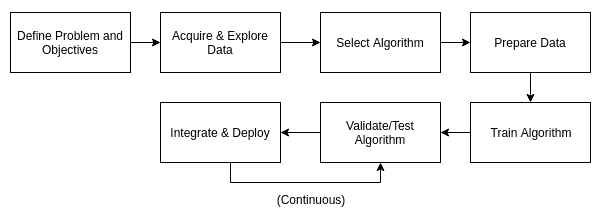

# 用 Go 介绍机器学习

在我们周围，自动化正在微妙地改变我们的生活，这些生活在数学和计算机科学的前沿。Nest 恒温器、网飞的电影推荐和谷歌的图片搜索算法有什么共同点？这些技术是由当今软件行业中一些最聪明的头脑创造的，它们都依赖于**机器学习** ( **ML** )技术。

2019 年 2 月，Crunchbase 列出了 4700 多家将自己归类为**人工智能** ( **AI** )或 ML^(【1】)的公司。这些公司大多处于非常早期的阶段，由天使投资者或风险资本家的早期融资资助。然而，Crunchbase 和英国《金融时报》在 2017 年和 2018 年发表的文章都围绕着一个共同的认识，即 ML 越来越依赖于持续增长^(【2】)，其日益成熟将导致更广泛的应用^(【3】)，特别是如果围绕 ML 算法所做决策的不透明性的挑战能够得到解决^(【4】)。《纽约时报》甚至有一个专栏专门讨论曼梯·里，这是对它在日常生活中的重要性的一种致敬。

这本书将教一个具有 Go 编程语言中级知识的软件工程师如何编写和制作一个 ML 应用程序，从概念到部署，等等。我们将首先对适合 ML 技术的问题和 ML 应用的生命周期进行分类。然后，我们将解释如何用 Go 语言建立一个特别适合数据科学的开发环境。然后，我们将提供一个实用指南，介绍主要的 ML 算法、它们的实现以及它们的缺陷。我们还将提供一些关于使用其他编程语言生成的 ML 模型以及将它们集成到 Go 应用程序中的指导。最后，我们将考虑不同的部署模型以及 DevOps 和数据科学之间难以捉摸的交集。最后，我们将从自己的经验中总结一些管理 ML 项目的方法。

ML 理论是一门数学上的高级学科，但是你可以在没有完全理解它的情况下开发 ML 应用。这本书将帮助你培养一种直觉，知道使用哪种算法，以及如何只用基本的数学知识来表述问题。

在第一章中，我们将介绍 Go ML 应用程序的一些基本概念:

*   ML 是什么？
*   ML 问题的类型
*   为什么要用 Go 写 ML 应用？
*   ML 开发生命周期

# ML 是什么？

ML 是统计学和计算机科学的交叉领域。这个领域的成果是一系列算法，这些算法能够通过从数据集中推断问题的最佳决策或答案来自主运行。与传统编程不同，在传统编程中，程序员必须决定程序的规则，并煞费苦心地将这些规则编码在他们选择的编程语言的语法中，ML 算法只需要足够数量的准备好的数据、从数据中学习的计算能力，以及调整算法参数以改善最终结果的一些知识。

由此产生的系统非常灵活，能够很好地利用人类可能会忽略的模式。想象一下，从零开始为一部电视剧写一个推荐系统。也许您可以从定义问题的输入和输出开始，然后找到一个电视连续剧的数据库，其中包含诸如发布日期、类型、演员和导演等详细信息。最后，你可以创建一个`score`函数，如果两个系列的发布日期接近，它们有相同的类型，相同的演员，或者有相同的导演，那么它会给这两个系列更高的评级。

**推荐系统**是一种预测算法，试图猜测用户对输入样本的评价。在线零售中广泛使用的应用是使用推荐系统，根据用户过去的购买情况向用户推荐商品。

给定一部电视剧，然后你可以通过降低相似性分数来对所有其他电视剧进行排名，并将前几部展示给用户。当创建`score` func 时，你会对各种功能的相对重要性做出判断，例如决定两个系列之间的每对共享演员值一分。这种类型的猜测，也被称为**启发式**，是 ML 算法的目标，节省时间并提高最终结果的准确性，特别是如果用户偏好改变，你必须定期改变评分功能以跟上。

更广泛的人工智能领域和人工智能之间的区别是模糊的。虽然围绕人工智能的炒作可能相对较新，但该领域的历史始于 1959 年，当时人工智能领域的领先专家亚瑟·塞缪尔首次使用了这些词^(。在 20 世纪 50 年代，像感知器和遗传算法这样的人工智能概念是由艾伦·图灵^(【8】)以及塞缪尔本人发明的。在接下来的几十年里，实现通用人工智能的实践和理论困难导致了基于规则的方法，如专家系统，这些方法不从数据中学习，而是从专家设计的规则中学习，这些规则是他们多年来学习的，编码在 if-else 语句中。)

ML 的强大之处在于算法能够适应以前看不到的情况，这是 if-else 语句无法做到的。如果您不需要这种适应性，也许是因为所有的情况都是预先知道的，那么坚持基本原则，使用传统的编程技术来代替！

在 20 世纪 90 年代，认识到利用现有技术实现人工智能不太可能，人们越来越倾向于采用一种狭隘的方法来解决非常具体的问题，这些问题可以通过结合使用统计学和概率论来解决。这导致了 ML 作为一个独立领域的发展。今天，ML 和 AI 经常互换使用，尤其是在营销文献中^(【9】)。

# ML 算法的类型

最大似然算法主要有两类:监督学习和非监督学习。决定使用哪种类型的算法取决于您可用的数据和项目目标。

# 监督学习问题

监督学习问题旨在根据提供的输入/输出标记对来推断输入和输出数据集之间的最佳映射。标记的数据集充当算法的反馈，允许它衡量其解决方案的最优性。例如，给定 2010-2018 年的年均原油价格列表，您可能希望预测 2019 年的年均原油价格。该算法在 2010-2018 年产生的误差将允许工程师估计其在 2019 年目标预测年的误差。

**标记对**由自变量组成的输入向量和因变量组成的输出向量组成。例如，用于面部识别的标记数据集可能包含带有面部图像数据的输入向量，以及编码被摄人物姓名的输出向量。一个**标记的集合**(或数据集)是一个标记对的集合。

给定一个带标签的手写数字集合，您可能希望预测以前看不到的手写数字的标签。类似地，给定一个被标记为垃圾邮件或非垃圾邮件的电子邮件数据集，想要创建垃圾邮件过滤器的公司会想要预测先前未看到的消息是否是垃圾邮件。这些问题都是监督学习问题。

监督最大似然问题可以进一步分为预测和分类:

*   分类试图用已知的输出值来标记未知的输入样本。例如，你可以训练一个算法来识别猫的品种。该算法将通过给未知的猫贴上已知品种的标签来对其进行分类。
*   相比之下，预测算法试图用已知或未知的输出值来标记未知的输入样本。这也被称为**估计**或**回归**。一个典型的预测问题是时间序列预测，其中序列的输出值是针对以前没有看到的时间值进行预测的。

一个**分类算法**将试图将输入样本与给定输出类别列表中的一个项目相关联:例如，决定一张照片是代表一只猫、一只狗，还是两者都不是，这是一个分类问题。一个**预测算法**将把一个输入样本映射到一个输出域的成员，这可能是连续的:例如，试图从一个人的体重和性别来猜测他的身高将是一个预测问题。

我们将在[第 3 章](48817ff3-5622-4f43-88e7-d3dfccacb25d.xhtml)、*监督学习*中更详细地介绍监督算法。

# 无监督学习问题

无监督学习问题旨在从尚未标记的数据中学习。例如，给定市场研究数据的数据集，聚类算法可以将消费者分成不同的部分，从而为营销专业人员节省时间。给定一个医学扫描数据集，无监督分类算法可以在不同种类的组织之间划分图像，以供进一步分析。一种被称为降维的无监督学习方法作为预处理步骤，与其他算法结合使用，以减少另一种算法必须训练的数据量，从而减少训练时间。我们将在第四章、*无监督学习*中更详细地介绍无监督学习算法。

大多数最大似然算法可以用多种编程语言有效地实现。虽然 Python 因其易用性和大量的开源库而成为数据科学家的最爱，但 Go 为开发人员创建商业 ML 应用程序提供了显著的优势。

# 为什么要用 Go 写 ML 应用？

还有其他语言的库，特别是 Python，它们比 Go ML 库更完整，并且受益于世界上最聪明的大脑多年(如果不是几十年)的研究。一些 Go 程序员为了寻求更好的性能而过渡到 Go，但是因为 ML 库通常是用 C 编写的，并且通过它们的绑定向 Python 公开，所以它们不会遇到与解释的 Python 程序相同的性能问题。深度学习框架如 TensorFlow 和 Caffe 的绑定非常有限，如果有的话。即使考虑到这些问题，对于开发包含 ML 组件的应用程序来说，Go 仍然是一种优秀的语言，如果不是最好的话。

# 围棋的优势

对于试图在学术环境中改进最先进算法的研究人员来说，围棋可能不是最佳选择。然而，对于一个拥有产品概念和快速减少的现金储备的初创公司来说，在短时间内以可维护和可靠的方式完成产品的开发是必不可少的，这也是 Go 语言的闪光之处。

围棋源于谷歌，其设计始于 2007 年^(【10】)。它的既定目标是创造一种高效的、编译过的编程语言，让人感觉轻巧、愉悦^(【11】)。Go 受益于许多旨在提高生产应用程序的生产率和可靠性的功能:

*   易于学习和接纳新开发人员
*   快速构建时间
*   运行时的良好性能
*   强大的并发支持
*   优秀标准库
*   类型安全
*   带有`gofmt`的易于阅读的标准化代码
*   强制错误处理，最大限度地减少不可预见的异常
*   明确、清晰的依赖关系管理
*   随着项目的增长，易于调整架构

所有这些原因使得 Go 成为构建生产系统，尤其是 web 应用程序的优秀语言。2018 年 Stack Overflow 开发者调查显示，虽然只有 7%的专业开发人员将 Go 作为他们的主要语言，但它在最受欢迎的语言排行榜上排名第 5 ^位，相对于其他语言来说也获得了非常高的薪水，这表明 Go 程序员增加了^(【12】)的商业价值。

# Go 的成熟生态系统

一些世界上最成功的技术公司将 Go 作为其生产系统的主要语言，并积极促进其发展，如 cloud flare^(【13】)，谷歌，优步^(【14】)，daily motion^(【15】)，以及 Medium^(【16】)。这意味着现在有一个广泛的工具和库生态系统来帮助开发团队在 Go 中创建一个可靠的、可维护的应用程序。就连世界领先的容器技术 Docker 也是用 Go 编写的。

在撰写本文时，GitHub 上有 1，774 个用 Go 语言编写的存储库，拥有超过 500 颗星，传统上被认为是质量和支持的良好替代指标。相比之下，Python 是 3811，Java 是 3943。考虑到 Go 还年轻几十年，并且允许更快的生产就绪开发，用 Go 语言编写的相对大量的得到良好支持的存储库构成了来自开源社区的热情支持。

Go 有很多稳定的、支持良好的开源 ML 库。根据 GitHub 明星和贡献者的数量，最受欢迎的 Go ML 库是 GoLearn^(【17】)。它也是最近更新的。其他 Go ML 库包括 GoML 和 Gorgonia，这是一个深度学习库，其 API 类似 TensorFlow。

# 传递用其他语言创建的知识和模型

数据科学家通常会探索不同的方法来解决不同语言(如 Python)中的 ML 问题，并产生一个可以在任何应用程序之外解决问题的模型。管道工作，例如从模型中获取数据、向客户提供数据、持久化输出或输入、记录错误或监控延迟，不属于此交付内容的一部分，并且超出了数据科学家的正常工作范围。因此，将模型从概念应用到生产应用需要使用多种语言，比如微服务。

本书中的大多数代码示例都使用 ML 算法或绑定到 OpenCV 等库，这些库在 Python 等语言中也可用。这将使您能够立即将数据科学家的 Python 原型代码转化为生产应用程序。

但是深度学习框架有 TensorFlow、Caffe 等 Go 绑定。此外，对于更基本的算法，如决策树，相同的算法也已在 Go 库中实现，如果以相同的方式配置，将产生相同的结果。总之，这些考虑意味着有可能将数据科学产品完全集成到 Go 应用程序中，而不会牺牲准确性、速度或迫使数据科学家使用他们不熟悉的工具。

# ML 开发生命周期

ML 开发生命周期是一个创建应用程序并将其投入生产的过程，该应用程序包含解决业务问题的 ML 模型。然后，可以通过应用程序将 ML 模型作为产品或服务的一部分提供给客户。

下图说明了 ML 开发生命周期流程:

# 定义问题和目标

在任何开发开始之前，要解决的问题必须与好的目标一起定义，以设定期望。问题的表述方式非常重要，因为这可能意味着棘手问题和简单解决方案之间的区别。它还可能涉及关于任何算法的输入数据将来自哪里的对话。

最大似然算法通常需要大量数据才能发挥最佳性能。在计划 ML 项目时，获取质量数据是最重要的考虑因素。

最大似然问题的典型形式是给定 X 数据集*，预测 Y* 。数据的可用性或缺乏会影响问题的形成、解决方案及其可行性。例如，考虑问题*给定一大组带标签的手写数字图像*^(【18】)*，预测之前未见过的图像的标签*。深度学习算法已经证明，只要训练数据集足够大^(【19】)，工程师只需做很少的工作，就可以在这个特定问题上实现相对较高的准确性。如果训练集不大，问题立即变得更加困难，需要仔细选择要使用的算法。它还会影响准确性，从而影响可实现目标的设置。

Michael Nielsen 在 MNIST 手写数字数据集上进行的实验表明，对于大多数测试的算法来说，用每个数字 1 个标记输入/输出对示例和 5 个示例来训练 ML 算法之间的差异是准确性从大约 40%提高到大约 65%^(【20】)。每位数使用 10 个例子通常会进一步提高 5%的准确度。

如果没有足够的数据来满足项目目标，有时可以通过对现有示例进行小的更改来人为扩展数据集，从而提高性能。在前面提到的实验中，尼尔森观察到，向数据集添加轻微旋转或平移的图像可以提高 15%的性能。

# 获取和探索数据

我们之前说过，在指定项目目标之前，理解输入数据集是至关重要的，尤其是与准确性相关的目标。作为一般规则，当有大的训练数据集可用时，ML 算法将产生最好的结果。用于训练它们的数据越多，它们的表现就越好。

因此，获取数据是 ML 开发生命周期中的一个关键步骤——一个非常耗时且充满困难的步骤。在某些行业，隐私立法可能会导致个人数据的可用性不足，从而难以创建个性化的产品，或者要求在使用源数据之前对其进行匿名处理。有些数据集可能是可用的，但可能需要大量的准备工作，甚至需要人工标注，这可能会给项目时间表或预算带来压力。

即使您没有专有数据集来解决您的问题，您也可以找到公共数据集来使用。通常，公共数据集会受到研究人员的关注，因此您可能会发现您试图解决的特定问题已经得到解决，并且解决方案是开源的。公共数据集领域的一些好来源如下:

*   **牛逼数据集**:【https://github.com/awesomedata/awesome-public-datasets 
*   https://skymind.ai/wiki/open-datasets**sky mind 开放数据集**:
*   **OpenML**:[https://www.openml.org/](https://www.openml.org/)
*   **卡格尔**:[https://www.kaggle.com/datasets](https://www.kaggle.com/datasets)
*   **英国政府公开数据**:[https://data.gov.uk/](https://data.gov.uk/)
*   **https://www.data.gov/政府公开数据**:

一旦获取了数据集，就应该对其进行研究，以获得对不同特征(独立变量)如何影响期望输出的基本理解。例如，当试图从自我报告的数字中预测正确的身高和体重时，研究人员从最初的探索中确定，年龄较大的受试者更有可能低估肥胖，因此年龄是建立他们的模型时的一个相关特征。试图从所有可用的数据(甚至是可能不相关的特征)中构建模型，在最好的情况下会导致更长的训练时间，并且在最坏的情况下会由于引入噪声而严重妨碍准确性。

花多一点时间来处理和转换数据集是值得的，因为这将提高最终结果的准确性，甚至可能缩短训练时间。本书中的所有代码示例都包括数据处理和转换。

在[第 2 章](532d8304-b31d-41ef-81c1-b13f4c692824.xhtml)、*设置 ML 环境*中，我们将看到如何使用 Go 和一个名为 **Jupyter** 的基于浏览器的交互式工具来探索数据。

# 选择算法

算法的选择可以说是 ML 应用工程师需要做出的最重要的决定，也是最需要研究的决定。有时，甚至需要将最大似然算法与传统的计算机科学算法结合起来，以使问题更容易处理——这方面的一个例子是我们稍后考虑的推荐系统。

开始寻找解决给定问题的最佳算法的良好第一步是确定是否需要有监督或无监督的方法。我们在本章前面介绍了这两种方法。根据经验，当您拥有一个已标记的数据集，并希望对以前未见过的样本进行分类或预测时，这将使用监督算法。当您希望通过将未标记的数据集聚类成不同的组来更好地理解它时，可能需要对新的样本进行分类，您将使用无监督学习算法。对每种算法的优点和缺陷的深入理解以及对数据的彻底研究将为选择算法提供足够的信息。为了帮助你入门，我们在[第 3 章](48817ff3-5622-4f43-88e7-d3dfccacb25d.xhtml)、*监督学习*中介绍了一系列监督学习算法，在[第 4 章](26788e93-3614-413f-bcde-5580516f9c5f.xhtml)、*非监督学习*中介绍了非监督学习算法。

有些问题可以灵活地应用最大似然技术和传统的计算机科学。其中一个问题是推荐系统，这种系统现在在亚马逊和网飞等在线零售商中非常普遍。这个问题问，*给定每个用户购买商品的数据集，预测用户下一次*最有可能购买的一组 N 个商品。亚马逊*的人买 X 也买 Y* 系统就是例证。

该解决方案的基本思想是，如果两个用户购买非常相似的商品，那么不在他们购买的商品的交集中的任何商品都是他们未来购买的良好候选。首先，转换数据集，使其将成对的项目映射到表示它们共现的分数。计算方法是，将同一顾客购买这两种商品的次数除以顾客购买其中一种商品的次数，得到一个介于 0 和 1 之间的数字。现在，这提供了一个标记数据集来训练监督算法，如二进制分类器，以预测以前看不见的对的得分。将此与排序算法相结合，在给定单个商品的情况下，可以产生按可购买性排序的商品列表。

# 准备数据

数据准备是指在训练算法之前对输入数据集执行的过程。严格的准备过程可以同时提高数据质量，减少算法达到预期精度所需的时间。准备数据的两个步骤是数据预处理和数据转换。我们将在[第 2 章](532d8304-b31d-41ef-81c1-b13f4c692824.xhtml)、*设置开发环境*、[第 3 章](48817ff3-5622-4f43-88e7-d3dfccacb25d.xhtml)、*监督学习*和[第 4 章](26788e93-3614-413f-bcde-5580516f9c5f.xhtml)、*非监督学习*中更详细地介绍准备数据。

数据预处理旨在将输入数据集转换为适合所选算法的格式。预处理任务的一个典型示例是以某种方式格式化日期列，或者将 CSV 文件接收到数据库中，丢弃任何导致解析错误的行。输入数据文件中也可能存在需要填充的缺失数据值(例如，使用平均值)，或者丢弃整个样本。个人信息等敏感信息可能需要删除。

数据转换是对数据集进行采样、减少、增强或聚合以使其更适合算法的过程。如果输入数据集很小，则可能需要通过人工创建更多示例来增强数据集，例如旋转图像识别数据集中的图像。如果输入数据集包含探索认为不相关的要素，明智的做法是移除这些要素。如果数据集比问题所需的粒度更细，将其聚合到更粗的粒度可能有助于加快结果的生成，例如，如果问题只需要每个县的预测，则将市级数据聚合到县。

最后，如果输入数据集特别大，就像许多旨在供深度学习算法使用的图像数据集一样，那么从较小的样本开始将会很快产生结果，以便在投资更多计算资源之前可以验证算法的可行性，这将是一个好主意。

采样过程还会将输入数据集划分为训练子集和验证子集。我们将在后面解释为什么这是必要的，以及两者所用的数据比例。

# 培养

ML 开发生命周期中计算最密集的部分是培训过程。在最简单的情况下，训练一个 ML 算法可能需要几秒钟，当输入数据集非常庞大并且算法需要多次迭代才能收敛时，可能需要几天。后一种情况通常用深度学习技术来观察。比如 DeepMinds AlphaGo Zero 算法，花了四十天才完全掌握围棋这一局，即使只过了三个^(【22】)就熟练了。除了图像或声音识别之外，许多在较小数据集和问题上操作的算法将不需要如此大量的时间或计算资源。

基于云的计算资源越来越便宜，因此，如果一种算法，特别是深度学习算法，在你的 PC 上训练时间太长，你可以花几美元在云实例上部署和训练它。我们将在[第 6 章](a48ed496-8a06-4293-80fb-0413d05e7a3e.xhtml)、*部署机器学习应用*中讨论部署模型。

当算法正在训练时，特别是如果训练阶段将花费很长时间时，对训练进行得如何进行一些实时测量是有用的，以便它可以被中断、重新配置和重新启动，而不需要等待训练完成。这些指标通常被分类为**损失指标**，其中*损失*是指算法在训练或验证子集上产生的名义误差。

预测问题中一些最常见的损失度量如下:

*   **均方差** ( **MSE** )衡量的是输出变量与预测值之间的距离平方之和。
*   **平均绝对误差** ( **MAE** )衡量输出变量与预测值之间的绝对距离之和。
*   **Huber 损失**是 MSE 和 MAE 的组合，对异常值更加稳健，同时仍然是均值和中值损失的良好估计值。

分类问题中一些最常见的损失度量如下:

*   **对数损失**通过对错误分类进行惩罚来衡量分类器的准确性。它与交叉熵损失密切相关。
*   **焦点损失**是一个较新的`loss`函数，旨在防止输入数据集稀疏时出现假阴性^(【23】)。

# 验证/测试

软件工程师对测试和调试软件源代码很熟悉，但是 ML 模型应该如何测试呢？算法和数据输入/输出例程的片段可以进行单元测试，但是通常不清楚如何确保 ML 模型本身是正确的，它表现为一个黑盒。

确保 ML 模型的正确性和足够准确性的第一步是验证。这意味着应用模型来预测或分类验证数据子集，并根据项目目标测量结果的准确性。因为算法已经看到了训练数据子集，所以它不能用于验证正确性，因为模型可能具有较差的可推广性(也称为**过拟合**)。举一个无意义的例子，想象一个 ML 模型，它由一个哈希映射组成，该哈希映射存储每个输入样本并将其映射到相应的训练输出样本。该模型对于先前记忆的训练数据子集具有 100%的准确性，但是对于任何数据子集都具有非常低的准确性，因此它不能解决其预期的问题。针对这种现象的验证测试。

此外，根据用户接受标准来验证模型输出是一个好主意。例如，如果为电视连续剧建立一个推荐系统，您可能希望确保向儿童提供的推荐永远不会被评为 PG-13 或更高。与其试图将这一点编码到模型中(这将具有非零的失败率),不如将这一约束推入应用程序本身，因为不实施它的成本将会太高。这样的约束和业务规则应该在项目开始时就被捕获。

# 集成和部署

必须定义 ML 模型和应用程序其余部分之间的边界。例如，算法是否会公开一个为给定输入样本提供预测的`Predict`方法？调用者是否需要输入数据处理，或者算法实现是否执行输入数据处理？一旦定义了这一点，在测试或模仿 ML 模型以确保应用程序其余部分的正确性时，就更容易遵循最佳实践。关注点的分离对于任何应用程序都是重要的，但是对于一个组件表现得像黑盒一样的 ML 应用程序来说，这是必不可少的。

ML 应用程序有许多可能的部署方法。对于 Go 应用程序，容器化特别简单，因为编译后的二进制文件将没有依赖关系(除非在一些非常特殊的情况下，比如需要绑定到深度学习库，如 TensorFlow)。不同的云供应商也允许无服务器部署，并提供不同的**持续集成** / **持续部署** ( **CI** / **CD** )。使用像 Go 这样的语言的部分优势是，可以非常灵活地部署应用程序，利用传统系统应用程序的可用工具，而不必求助于混乱的多语言方法。

在[第 6 章](a48ed496-8a06-4293-80fb-0413d05e7a3e.xhtml)、*部署机器学习应用*中，我们将深入探讨部署模型、**平台即服务** ( **PaaS** )与**基础设施即服务** ( **IaaS** )等主题，并利用为 Go 语言构建的工具监控和警告特定于 ML 应用。

# 重新验证

将一个从不需要更新或重新训练的模型投入生产是很少见的。随着用户偏好的改变，推荐系统可能需要定期的重新训练。随着更多车型进入市场，汽车制造商和车型的图像识别模型可能需要重新训练。为物联网群体中的每个设备生成一个模型的行为预测工具可能需要持续监控，以确保每个模型仍然满足所需的准确性标准，并重新训练那些不满足的模型。

重新验证过程是一个持续的过程，在此过程中，模型的准确性将得到测试，如果认为模型的准确性下降，将触发自动或手动过程对其进行重新训练，以确保结果始终是最佳的。

# 摘要

在这一章中，我们介绍了 ML 和不同类型的 ML 问题。我们主张将 Go 作为开发 ML 应用程序的语言。然后，我们概述了 ML 开发生命周期，即创建和生产 ML 应用程序的过程。

在下一章，我们将解释如何为 ML 应用程序和 Go 建立一个开发环境。

# 进一步阅读

1.  [https://www.crunchbase.com/hub/machine-learning-companies](https://www.crunchbase.com/hub/machine-learning-companies)，2019 年 2 月 9 日检索。
2.  [https://www . ft . com/content/133 DC 9 c 8-90ac-11e 8-9609-3d 3b 945 e 78 cf](https://www.ft.com/content/133dc9c8-90ac-11e8-9609-3d3b945e78cf)。*机器学习将成为全球增长的引擎*。
3.  [https://news . crunchbase . com/news/venture-funding-ai-machine-learning-levels-off-tech-matures/](https://news.crunchbase.com/news/venture-funding-ai-machine-learning-levels-off-tech-matures/)。2019 年 2 月 9 日检索。
4.  [https://www . economist . com/science-and-technology/2018/02/15/for-artificial-intelligence-to-thrive-it-must-explain-self](https://www.economist.com/science-and-technology/2018/02/15/for-artificial-intelligence-to-thrive-it-must-explain-itself)。2019 年 2 月 9 日检索。
5.  [https://www.nytimes.com/column/machine-learning](https://www.nytimes.com/column/machine-learning)。检索于 2019 年 2 月 9 日。
6.  例如参见*谷歌机器学习趋势*。https://trends.google.com/trends/explore?date=all&amp；geo = US&amp；q =机器% 20 学习。
7.  R.Kohavi 和 F. Provost，*术语表，机器学习*，第 30 卷，第 2-3 期，第 271-274 页，1998 年。30，第 2-3 期，第 271-274 页，1998 年。
8.  艾伦·图灵(1950 年 10 月)。*计算机械与智能*。介意。59 (236): 433–460.doi:10.1093/mind/LIX.236.433 于 2016 年 6 月 8 日检索。
9.  [https://www . Forbes . com/sites/Bernard marr/2016/12/06/人工智能与机器学习的区别是什么/](https://www.forbes.com/sites/bernardmarr/2016/12/06/what-is-the-difference-between-artificial-intelligence-and-machine-learning/) 。2019 年 2 月 9 日检索。
10.  [https://talks.golang.org/2012/splash.article](https://talks.golang.org/2012/splash.article)。检索时间 2019 年 2 月 9 日。
11.  https://talks.golang.org/2012/splash.article[。检索到 h 2019 年 2 月 9 日。](https://talks.golang.org/2012/splash.article)
12.  【https://insights.stackoverflow.com/survey/2018/】T4。检索时间 2019 年 2 月 9 日。

13.  [https://github.com/cloudflare](https://github.com/cloudflare)。检索时间 2019 年 2 月 9 日。
14.  [https://github.com/uber](https://github.com/uber)。检索时间 2019 年 2 月 9 日。
15.  [https://github.com/dailymotion](https://github.com/dailymotion)。检索时间 2019 年 2 月 9 日。
16.  [https://github.com/medium](https://github.com/medium)检索时间 2019 年 2 月 9 日。
17.  https://github.com/sjwhitworth/golearn。检索于 2019 年 2 月 10 日。
18.  参见在[http://yann.lecun.com/exdb/mnist/](http://yann.lecun.com/exdb/mnist/)托管的 MNIST 数据集。检索时间 2019 年 2 月 10 日。
19.  参见[https://machine learning mastery . com/handled-digital-recognition-using-convolutionary-neural-networks-python-keras/](https://machinelearningmastery.com/handwritten-digit-recognition-using-convolutional-neural-networks-python-keras/)中的示例。检索时间 2019 年 2 月 10 日。
20.  [http://cognitivemedium.com/rmnist](http://cognitivemedium.com/rmnist)。检索时间 2019 年 2 月 10 日。
21.  *从自我报告数据中预测校正体重、身高和肥胖患病率的回归模型*:BRFSS 1999-2007 年的数据。Int J Obes (Lond)。2010 年 11 月；34(11):1655-64.doi:10.1038/ijo . 2010.80 . Epub 2010 年 4 月 13 日
22.  [https://deepmind.com/blog/alphago-zero-learning-scratch/](https://deepmind.com/blog/alphago-zero-learning-scratch/)。检索时间 2019 年 2 月 10 日。
23.  *密集物体探测的焦损失*。林等 2980-2988。在[https://arxiv.org/pdf/1708.02002.pdf](https://arxiv.org/pdf/1708.02002.pdf)提供预印本。