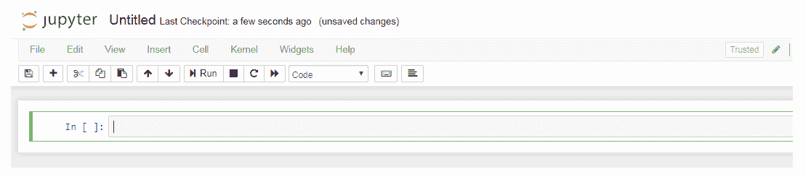
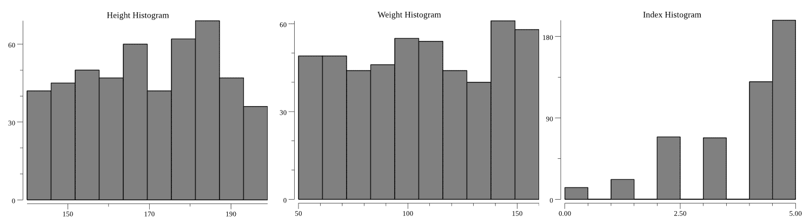
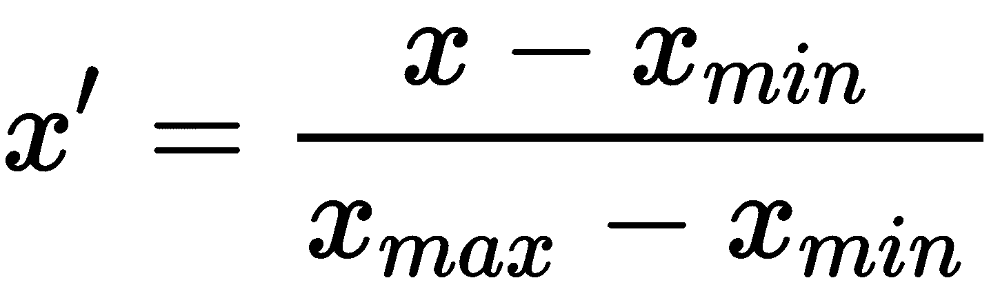
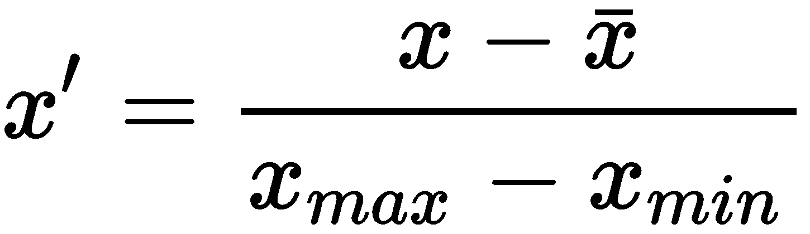
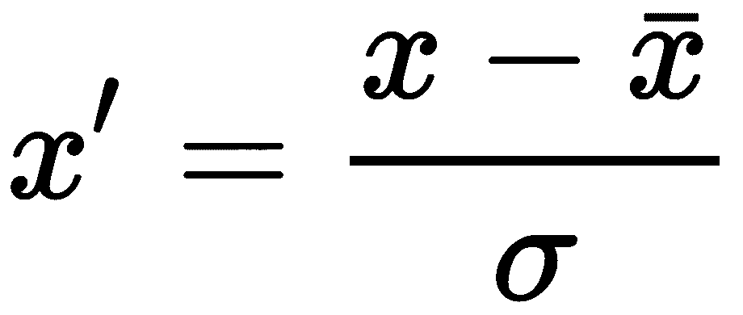

# 二、设置开发环境

就像传统的软件开发一样，ML 应用开发需要掌握专业的样板代码和一个允许开发人员以最少的摩擦和干扰进行的开发环境。软件开发人员通常会在基本的设置和数据争论任务上浪费大量时间。作为一名高效专业的 ML 开发者，需要有快速建立解决方案原型的能力；这意味着在琐碎的任务上花费尽可能少的精力。

在前一章中，我们概述了主要的 ML 问题和一个开发过程，你可以遵循它来获得一个商业解决方案。我们还解释了 Go 作为一种编程语言在创建 ML 应用时所提供的优势。

在这一章中，我们将指导你为 Go 建立一个为 ML 应用优化的开发环境。具体来说，我们将涵盖以下主题:

*   如何安装 Go
*   使用 Jupyter 和 gophernotes 交互式运行 Go
*   与 Gota 的数据争论
*   使用 gonum/plot 和 gophernotes 进行数据可视化
*   数据预处理(格式化、清理和采样)
*   数据转换(分类变量的标准化和编码)

本书附带的代码示例针对基于 Debian 的 Linux 发行版进行了优化。但是，它们可以适用于其他发行版(例如，将`apt`改为`yum`)和带有 Cygwin 的窗口。

完成本章后，您将能够快速探索、可视化和处理任何数据集，以供 ML 算法后续使用。


# 安装 Go

开发环境是个性化的。大多数开发人员更喜欢一种代码编辑器或工具集，而不是另一种。虽然我们建议使用交互式工具，如 Jupyter via gophernotes，但运行本书中的代码示例的唯一先决条件是 Go 1.10 或更高版本的有效安装。也就是说，`go`命令应该可用，并且`GOPATH`环境变量应该设置正确。

要安装 Go，请从 https://golang.org/dl/的[下载你系统的二进制版本。然后，参考以下与您的操作系统相匹配的小节^(【2】)。](https://golang.org/dl/)

如果您只想使用 gophernotes 运行 Go 代码，并且打算使用 Docker 作为安装方法，那么您可以跳过这一节，直接进入*使用 gophernotes 交互运行 Go*一节。


# Linux、macOS 和 FreeBSD

二进制版本被打包成 tarballs。提取二进制文件并将它们添加到您的`PATH`中。这里有一个例子:

```go
tar -C /usr/local -xzf go$VERSION.$OS-$ARCH.tar.gz && \
 export PATH=$PATH:/usr/local/go/bin
```

要配置您的`GOPATH`环境变量，您将需要决定您希望您的 Go 文件，包括任何个人存储库，存放在哪里。一个可能的地点是`$HOME/go`。一旦决定了这一点，就可以设置环境变量，例如如下所示:

```go
export GOPATH=$HOME/go
```

为了使该指令永久有效，您需要将该行添加到`.bashrc`。如果您使用其他外壳(如`.zsh`，请参考[https://github.com/golang/go/wiki/SettingGOPATH](https://github.com/golang/go/wiki/SettingGOPATH)的官方 Go 安装说明。

确保你的`GOPATH`和你的 Go 安装不在同一个目录下，否则会导致问题。


# Windows 操作系统

二进制版本打包为 ZIP 文件或 MSI 安装程序，后者会自动配置您的环境变量。我们建议使用 MSI 安装程序。但是，如果没有，那么在将 ZIP 文件的内容提取到一个合适的位置(比如`C:\Program Files\Go`)之后，确保使用控制面板将`subdirectory` bin 添加到您的`PATH`环境变量中。

一旦二进制文件被安装到合适的位置，您将需要配置您的`GOPATH`。首先，决定您希望您的 Go 文件(包括任何个人存储库)存放在哪里。一个可能的位置是`C:\go`。一旦做出决定，将`GOPATH`环境变量设置为该目录的路径。

如果您不确定如何设置环境变量，请参考位于[https://github.com/golang/go/wiki/SettingGOPATH](https://github.com/golang/go/wiki/SettingGOPATH)的官方 Go 安装说明。

确保你的`GOPATH`和你的 Go 安装不在同一个目录下，否则会导致问题。


# 使用 gophernotes 交互式运行 Go

Project Jupyter 是一个非营利性组织，旨在为数据科学开发语言无关的交互式计算。其结果是一个成熟的、支持良好的环境来探索、可视化和处理数据，通过提供即时反馈和与绘图库(如`gonum` / `plot`)的集成，可以显著加快开发。

虽然它的第一次迭代名为 iPython，起初只支持基于 Python 的处理程序(称为*内核*),但最新版本的 Jupyter 拥有 50 多个内核，支持数十种语言，包括三个用于 Go 语言的内核^(【4】)。GitHub 支持渲染 Jupyter 文件(称为*笔记本*)^(【5】))，还有各种专门用于在线共享笔记本的 Hub，包括 Google Research cola bs^(【6】)，Jupyter 的社区 hub 称为 nb viewer^(【7】)，以及其企业版产品 JupyterHub^(【8】)。用于演示的笔记本可以使用 nbconvert 实用程序^(【9】)转换成其他文件格式，如 HTML。

在本书中，我们将把 Jupyter 和 gophernotes 内核一起用于 Go。在 Linux 和 Windows 上开始使用 gophernotes 最简单的方法是使用它的 Docker^(【10】)映像。

对于其他安装方法，我们建议查看 gophernotes GitHub 库的 README 页面，网址:
[https://github.com/gopherdata/gophernotes](https://github.com/gopherdata/gophernotes)。

开始一个新的基于 gophernotes 的项目的步骤如下:

1.  创建一个新目录来保存项目文件(这个目录不需要在您的`GOPATH`中)。
2.  (可选)通过在新目录中运行`git init`来初始化新的 git 存储库。
3.  从新目录运行下面的命令(你可能需要给它加上前缀`sudo`，这取决于你如何安装 Docker):
    `docker run -it -p 8888:8888 -v $(pwd):/usr/share/notebooks gopherdata/gophernotes:latest-ds`
4.  在终端中，会有一个以`?token=[some combination of letters and numbers]`结尾的 URL。在现代网络浏览器中导航到此 URL。您创建的新目录将被映射到`/usr/share/notebooks`，因此在出现的树中导航到这个目录。

在 Windows 上，您可能需要修改前面的命令，将`$(pwd)`替换为`%CD%`。

既然我们已经学习了如何安装 Go 并使用 gophernotes 建立一个基本的开发环境，那么是时候学习数据预处理了。


# 例子——正面和负面评价中最常见的短语

在我们的第一个代码示例中，我们将使用多领域情感数据集(版本 2.0)^(【11】)。该数据集包含来自四个不同产品类别的亚马逊评论。我们将下载它，对它进行预处理，并将其加载到 Gota，一个数据辩论库，以找到正面和负面评论中最常见的短语，这些短语不会在两者中同时出现。这是一个不涉及 ML 算法的基本示例，但将作为 Go、gophernotes 和 Gota 的实际介绍。

您可以在本书的配套资源库[https://github . com/packt publishing/Machine-Learning-with-Go-Quick-Start-Guide](https://github.com/PacktPublishing/Machine-Learning-with-Go-Quick-Start-Guide)中找到完整的代码示例。


# 初始化示例目录并下载数据集

按照我们之前实现的过程，创建一个空目录来保存代码文件。在打开 gophernotes 之前，从[http://www . cs . jhu . edu/~ MDR edze/datasets/sensation/processed _ ACL . tar . gz](http://www.cs.jhu.edu/~mdredze/datasets/sentiment/processed_acl.tar.gz)下载数据集并解压到`datasets/words`。在大多数 Linux 发行版上，您可以使用下面的脚本来实现这一点:

```go
mkdir -p datasets/words && \
wget http://www.cs.jhu.edu/~mdredze/datasets/sentiment/processed_acl.tar.gz -O datasets/words-temp.tar.gz && \
tar xzvf datasets/words-temp.tar.gz -C datasets/words && \
rm datasets/words-temp.tar.gz
```

现在，启动 gophernotes，将树导航到`/usr/share/notebooks`。点击*新建* | *转到*创建一个新笔记本。你会看到一个空白的 Jupyter 笔记本:



Jupyter 中的输入单元格标有`In`标签。当您在输入单元格中运行代码( *Shift* + *Enter* )时，将会创建一个新的输出单元格，其结果标记为`Out`。每个单元格都按照其执行顺序进行编号。例如，`In [1]`单元格是您在给定会话中运行的第一个单元格。

尝试运行一些 Go 语句，如下面的代码片段:

特别要注意的是，`a`变量显示在输出单元格中，即使没有调用`fmt.Println()`。

```go
a := 1
import "fmt"
fmt.Println("Hello, world")
a
```

即使删除了输入单元格，您在会话中定义的所有导入、变量和函数仍会保留在内存中。要清除当前作用域，请转到内核|重新启动。

加载数据集文件


# 数据处理的基本任务之一是读取输入文件并加载其内容。一个简单的方法是使用`io/ioutil`实用函数`ReadFile`。不像在`.go`文件中，你需要将这段代码放在你的`main` func 中，使用 gophernotes，你可以运行下面的代码而不用声明任何 func:

前面的代码将把对厨房产品评价好的内容加载到名为`positives`的字节片中，把评价不好的内容加载到名为`negatives`的字节片中。如果您已经正确下载了数据集，并且运行了这段代码，它应该不会输出任何东西，因为没有错误。如果出现任何错误，请检查数据集文件是否已提取到正确的文件夹中。

```go
import "io/ioutil"

const kitchenReviews = "../datasets/words/processed_acl/kitchen"

positives, err := ioutil.ReadFile(kitchenReviews + "/positive.review")
negatives, err2 := ioutil.ReadFile(kitchenReviews + "/negative.review")
if err != nil || err2 != nil {
 fmt.Println("Error(s)", err, err2)
}
```

如果您已经在文本编辑器中打开了`positive.review`或`negative.review`文件，您可能会注意到它们被格式化为空格或换行符分隔的成对列表，即`phrase:frequency`。例如，正面评审的开始如下:

在下一小节中，我们将把这些对解析成一个 Go 结构。

```go
them_it:1 hovering:1 and_occasional:1 cousin_the:2 fictional_baudelaire:1 their_struggles:1
```

将内容解析到结构中


# 我们将使用`strings`包将数据文件的内容解析成成对的片段。字符串片段中的每一项都包含一个对，比如`them_it:1`。然后，我们将通过冒号符号进一步分割这一对，并使用`strconv`包将整数频率解析为`int`。每个`Pair`将为以下类型:

我们将这样做:

```go
type Pair struct {
  Phrase string
  Frequency int
}
```

首先，观察线对之间的分隔可以是一个新行(`\n`)或一个空格。我们将使用 strings 包的`strings.Fields` func，它将通过任何连续的空白字符分割字符串:

1.  现在，我们将迭代每一对，通过冒号分隔符进行分割，并使用`strconv`包将频率解析为整数:

```go
pairsPositive := strings.Fields(string(positives))
pairsNegative := strings.Fields(string(negatives))
```

2.  我们还将返回一个短语图，以便我们稍后可以排除正面和负面评论之间的交集短语。这样做的原因是正面和负面评论共有的词不太可能指示正面或负面情绪。这是通过以下函数完成的:

```go
// pairsAndFilters returns a slice of Pair, split by : to obtain the phrase and frequency,
// as well as a map of the phrases that can be used as a lookup table later.
func pairsAndFilters(splitPairs []string) ([]Pair, map[string]bool) {
  var (
    pairs []Pair
    m map[string]bool
  )
  m = make(map[string]bool)
  for _, pair := range splitPairs {
    p := strings.Split(pair, ":")
    phrase := p[0]
    m[phrase] = true
    if len(p) < 2 {
      continue
    }
    freq, err := strconv.Atoi(p[1])
    if err != nil {
      continue
    }
    pairs = append(pairs, Pair{
      Phrase: phrase,
      Frequency: freq,
    })
  }
  return pairs, m
}
```

3.  最后，我们将把它应用到我们的配对切片中:

```go
// exclude returns a slice of Pair that does not contain the phrases in the exclusion map
func exclude(pairs []Pair, exclusions map[string]bool) []Pair {
  var ret []Pair
  for i := range pairs {
    if !exclusions[pairs[i].Phrase] {
      ret = append(ret, pairs[i])
    }
  }
  return ret
}

```

4.  下一步是将解析后的数据对加载到 Gota 中，Gota 是 Go 的数据交换库。

```go
parsedPositives, posPhrases := pairsAndFilters(pairsPositive)
parsedNegatives, negPhrases := pairsAndFilters(pairsNegative)
parsedPositives = exclude(parsedPositives, negPhrases)
parsedNegatives = exclude(parsedNegatives, posPhrases)
```

将数据加载到 Gota 数据帧中


# Gota 库包含数据帧、序列和一些通用数据争论算法的实现^(【12】)。数据框架的概念是许多流行的数据科学库和语言不可或缺的，如 Python 的 pandas、R 和 Julia。简而言之，**数据帧**是一系列长度相同的列表(称为**列**或**系列**)。每个列表都有一个名称——列名或系列名，这取决于库喜欢的命名法。这种抽象模仿了数据库表，为数学和统计工具提供了一个简单的基础构件。

Gota 库有两个包:`dataframe`和`series`包。series 包包含表示单个列表的函数和结构，而`dataframe`包将整个数据帧——也就是表——作为一个整体来处理。Go 开发人员可能希望使用 Gota 快速排序、过滤、聚合或执行关系操作，比如两个表之间的内部连接，节省样板代码，比如实现一个`sort`接口^(【13】)。

使用 Gota 创建新数据帧有几种方法:

`dataframe.New(se ...series.Series)`:接受系列的切片(可通过`series.New`功能创建)。

*   `dataframe.LoadRecords(records [][]string, options ...LoadOption)`:接受切片中的切片。第一个片段是表示列名的字符串片段。
*   `dataframe.LoadStructs(i interface{}, options ...LoadOption)`:接受一部分结构。Gota 将使用反射来根据 struct 字段名确定列名。
*   `dataframe.LoadMaps(maps []map[string][]interface{})`:接受列名到切片的映射切片。
*   `dataframe.LoadMatrix(mat Matrix)`:接受与 mat64 矩阵接口兼容的切片。
*   在我们的例子中，因为我们已经将数据解析为结构，所以我们将使用`LoadStructs`函数，为正面评价和负面评价分别创建一个数据帧:

如果要检查一个数据帧的内容，即`df`，只需使用`fmt.Println(df)`。这将显示 dataframe 的前 10 行，以及它的列名和一些有用的元数据，比如总行数。

```go
dfPos := dataframe.LoadStructs(parsedPositives)
dfNeg := dataframe.LoadStructs(parsedNegatives)
```

寻找最常用的短语


# 既然数据已经被解析，共现短语已经被过滤掉，并且产生的短语/频率对已经被加载到数据帧中，剩下的就是找到正面和负面评论的最常见短语并显示它们。不使用数据帧的一种方法是创建一个实现`sort`接口的`type ByFrequency []Pair`类型，然后组合`sort.Reverse`和`sort.Sort`来按降序排列正对和负对。但是，通过使用 Gota，我们可以实现每个数据帧一行:

现在，打印数据框会分别给出厨房产品正面和负面评价的前 10 个最常见短语。对于正面评论，我们有以下输出:

```go
dfPos = dfPos.Arrange(dataframe.RevSort("Frequency"))
dfNeg = dfNeg.Arrange(dataframe.RevSort("Frequency"))
```

对于负面评论，我们有以下输出:

```go
[46383x2] DataFrame

    Phrase       Frequency

 0: tic-tac-toe  10       

 1: wusthoff     7        

 2: emperor      7        

 3: shot_glasses 6        

 4: pulp         6        

 5: games        6        

 6: sentry       6        

 7: gravel       6        

 8: the_emperor  5        

 9: aebleskivers 5        

    ...          ...      

    <string>     <int>    
```

这就完成了这个例子。在下一节中，我们将更详细地介绍 Gota 的其他转换和处理特性。

```go
[45760x2] DataFrame

    Phrase          Frequency
 0: seeds           9        

 1: perculator      7        

 2: probes          7        

 3: cork            7        

 4: coffee_tank     5        

 5: brookstone      5        

 6: convection_oven 5        

 7: black_goo       5        

 8: waring_pro      5        

 9: packs           5        

    ...             ...      

    <string>        <int>    
```

示例–使用 gonum/plot 探索身体质量指数数据


# 在上一节中，我们介绍了 gophernotes 和 Gota。在本节中，我们将探索一个包含 500 个性别、身高和身体质量指数指数样本的数据集。我们将使用`gonum/plot`库来完成这项工作。这个库最初是 2012 Plotinum 库^(【15】)的一个分支，包含了几个使在 Go 中创建数据可视化更加容易的包^(【16】):

`plot`包包含一个布局和格式化接口。

*   `plotter`包抽象了常见绘图类型的布局和格式，比如条形图、散点图等等。
*   `plotutil`包包含常用绘图类型的实用函数。
*   `vg`包公开了一个矢量图形 API，在将图形导出到其他软件时特别有用。我们不会报道这个包裹。
*   安装 gonum 和 gonum/plot


# 不管您是使用 Docker 映像运行 gophernotes，还是使用不同的方法，您都需要使用`gonum/plot`。为此，运行`go get gonum.org/v1/plot/...`命令。如果您没有安装`gonum`库，并且您没有使用 gophernotes Docker 映像，您将需要使用`go get github.com/gonum/...`命令单独安装它。

要从 Jupyter 打开一个终端，打开 web UI 到树形视图(默认视图)，然后点击**新建** | **终端**。

注意，尽管它们的名字不同，但 gonum 和 gonum/plot 并不属于同一个存储库，所以您需要分别安装这两个存储库。

加载数据


# 如果您已经克隆了项目存储库，那么它将在`datasets/bmi`文件夹中包含 500 人的身体质量指数数据集。也可以自己从 ka ggle^(【14】)下载数据集。数据集是一个 CSV 文件，前几行如下:

与上一节一样，我们将使用`io` / `ioutil`将文件读入一个字节片，但这一次，我们将利用 Gota 的 ReadCSV 方法(该方法使用`io.Reader`作为参数)将数据直接加载到 dataframe 中，无需预处理:

```go
Gender,Height,Weight,Index
Male,174,96,4
Male,189,87,2
Female,185,110,4
Female,195,104,3
Male,149,61,3
...
```

检查数据帧，确保数据已正确加载:

```go
b, err := ioutil.ReadFile(path)
if err != nil {
  fmt.Println("Error!", err)
}
df := dataframe.ReadCSV(bytes.NewReader(b))
```

请注意，序列的数据类型是自动推断出来的。

```go
[500x4] DataFrame

    Gender   Height Weight Index
 0: Male     174    96     4    

 1: Male     189    87     2    

 2: Female   185    110    4    

 3: Female   195    104    3    

 4: Male     149    61     3    

 5: Male     189    104    3    

 6: Male     147    92     5    

 7: Male     154    111    5    

 8: Male     174    90     3    

 9: Female   169    103    4    

    ...      ...    ...    ...  

    <string> <int>  <int>  <int>
```

了解数据序列的分布


# 理解每个系列的一个好方法是绘制直方图。这会让你对每个系列是如何分布的有个印象。使用`gonum` / `plot`，我们将为每个系列绘制直方图。然而，在我们绘制任何东西之前，我们可以通过 Gota 快速访问一些汇总统计数据，以获得对数据集的初步了解:

这告诉我们，样本个体的身高介于 140 厘米和 199 厘米之间，他们的均值和中位数分别为 169 厘米和 170 厘米，均值和中位数如此接近的事实表明偏度较低——即对称分布。

```go
fmt.Println("Minimum", df.Col("Height").Min())
fmt.Println("Maximum", df.Col("Height").Max())
fmt.Println("Mean", df.Col("Height").Mean())
fmt.Println("Median", df.Col("Height").Quantile(0.5))
```

为所有列同时实现这一点的更快方法是使用`dataframe.Describe`函数。这将生成另一个数据帧，其中包含每列的汇总统计信息:

现在，我们将使用直方图可视化分布。首先，我们需要将 Gota 数据帧的一列转换成易于绘图的`plotter.Values`切片。这可以通过以下实用函数来实现:

```go
[7x5] DataFrame

    column   Gender   Height     Weight     Index   
 0: mean     -        169.944000 106.000000 3.748000

 1: stddev   -        16.375261  32.382607  1.355053

 2: min      Female   140.000000 50.000000  0.000000

 3: 25%      -        156.000000 80.000000  3.000000

 4: 50%      -        170.000000 106.000000 4.000000

 5: 75%      -        184.000000 136.000000 5.000000
 6: max      Male     199.000000 160.000000 5.000000

    <string> <string> <float>    <float>    <float> 
```

`dataframe.Col` func 从给定的数据帧中提取所需的列——在我们的例子中，是一个单独的列。您还可以使用`dataframe.Select`，它获取一部分列名字符串来返回一个只包含所需列的 dataframe。这对于丢弃不必要的数据很有用。

```go
// SeriesToPlotValues takes a column of a Dataframe and converts it to a gonum/plot/plotter.Values slice.
// Panics if the column does not exist.
func SeriesToPlotValues(df dataframe.DataFrame, col string) plotter.Values {
  rows, _ := df.Dims()
  v := make(plotter.Values, rows)
  s := df.Col(col)
  for i := 0; i < rows; i++ {
    v[i] = s.Elem(i).Float()
  }
  return v
}
```

现在，我们可以使用 gonum/plot 来创建一个 JPEG 图像，显示给定列的直方图，并选择标题:

要使用 gophernotes 显示结果图，请使用 display 对象的适当方法。在本例中，我们正在生成一个 JPEG 图像，因此用前面代码生成的字节片调用`display.JPEG`将在输出单元格中显示绘图。完整的代码输入单元如下所示:

```go
// HistogramData returns a byte slice of JPEG data for a histogram of the column with name col in the dataframe df.
func HistogramData(v plotter.Values, title string) []byte {
  // Make a plot and set its title.
  p, err := plot.New()
  if err != nil {
    panic(err)
  }
  p.Title.Text = title
  h, err := plotter.NewHist(v, 10)
  if err != nil {
    panic(err)
  }
  //h.Normalize(1) // Uncomment to normalize the area under the histogram to 1
  p.Add(h)
  w, err := p.WriterTo(5*vg.Inch, 4*vg.Inch, "jpg")
  if err != nil {
    panic(err)
  }
  var b bytes.Buffer
  writer := bufio.NewWriter(&b)
  w.WriteTo(writer)
  return b.Bytes()
}
```

一般来说，从 gonum 的内置绘图仪创建新图的步骤如下:

```go
Display.JPEG(HistogramData(SeriesToPlotValues(df, "Age"), "Age Histogram"))
```

用`plot.New()`创造一个新的情节——这就像一张画布，情节将在上面延续。

1.  设置任何绘图属性，如标题。
2.  基于可用类型之一(`BarChart`、`BoxPlot`、`ColorBar`、`Contour`、`HeatMap`、`Histogram`、`Line`、`QuartPlot`、`Sankey`或`Scatter`)创建新的绘图仪。
3.  设置任何绘图仪属性，并通过调用其`Add`方法将绘图仪添加到绘图中。
4.  如果您希望通过 gophernotes 显示绘图，使用`WriterTo`方法和一个字节缓冲区将绘图数据输出为一个字节片，该字节片可以传递给内置显示对象。否则，使用`p.Save`将图像保存到文件中。
5.  如果不是在 gophernotes 中显示图像，而是希望保存它，可以使用 plot 的`Save`方法来完成。例如，`p.Save(5*vg.Inch, 4*vg.Inch, title + ".png")`将把绘图保存到一个 5" x 4 "的 PNG 文件中。

500 人体重/身高/身体质量指数数据集的结果直方图如下:



在下面的例子中，我们不仅要加载和可视化数据，还要转换数据，使其更适合用于 ML 算法。

示例–使用 Gota 预处理数据


# ML 算法训练过程的质量和速度取决于输入数据的质量。虽然许多算法对于不相关的列和没有被规范化的数据是健壮的，但是有些算法不是。例如，许多模型要求数据输入被标准化为介于 0 和 1 之间。在这一节中，我们将看看用 Gota 预处理数据的一些快速简单的方法。对于这些例子，我们将使用一个包含 1035 条美国职业棒球大联盟球员身高(英寸)和体重(磅)记录的数据集^(【17】)。如加州大学洛杉矶分校网站所述，该数据集由以下特征组成:

`Name`:玩家姓名

*   `Team`:球员所属的棒球队
*   `Position`:玩家的位置
*   `Height (inches)`:玩家身高
*   `Weight (pounds)`:玩家体重以磅为单位
*   `Age`:录像时的玩家年龄
*   出于本练习的目的，我们将以下列方式预处理数据:

删除名称和团队列

*   将高度和重量列转换为浮点类型
*   过滤掉体重大于或等于 260 磅的玩家
*   规范化身高和体重列

*   将数据分为定型子集和验证子集，定型子集中大约有 70%的行，验证子集中有 30%的行
*   将数据加载到 Gota


# 数据集在加州大学洛杉矶分校网站上以 HTML 表格的形式提供^(【17】)。在本书的配套资源库中，您会找到一个 CSV 版本。要快速将 HTML 表格转换为 CSV 格式而无需编写任何代码，首先突出显示该表格，然后将其复制并粘贴到 Microsoft Excel 等电子表格程序中。然后，将电子表格保存为 CSV 文件。在文本编辑器中打开该文件，以确保文件中没有伪像或多余的行。

使用`dataframe.ReadCSV`方法加载数据集。检查数据帧会产生以下输出:

删除和重命名列

```go
[1034x6] DataFrame

    Name            Team     Position       Height(inches) Weight(pounds) ...

 0: Adam_Donachie   BAL      Catcher        74             180            ...

 1: Paul_Bako       BAL      Catcher        74             215            ...

 2: Ramon_Hernandez BAL      Catcher        72             210            ...

 3: Kevin_Millar    BAL      First_Baseman  72             210            ...

 4: Chris_Gomez     BAL      First_Baseman  73             188            ...

 5: Brian_Roberts   BAL      Second_Baseman 69             176            ...

 6: Miguel_Tejada   BAL      Shortstop      69             209            ...

 7: Melvin_Mora     BAL      Third_Baseman  71             200            ...

 8: Aubrey_Huff     BAL      Third_Baseman  76             231            ...

 9: Adam_Stern      BAL      Outfielder     71             180            ...

    ...             ...      ...            ...            ...            ...

    <string>        <string> <string>       <int>          <int>          ...

Not Showing: Age <float>
```


# 在这个练习中，我们决定不需要`Name`或`Team`列。我们可以使用 dataframe 的`Select`方法来指定我们希望保留的一部分列名字符串:

当我们这样做的时候，应该重命名`Height`和`Weight`列，从列名中删除单位。这可以通过`Rename`方法实现:

```go
df = df.Select([]string{"Position", "Height(inches)", "Weight(pounds)", "Age"})
```

生成的数据集如下:

```go
df = df.Rename("Height", "Height(inches)")
df = df.Rename("Weight", "Weight(pounds)")
```

将列转换为不同的类型

```go
[1034x4] DataFrame

    Position       Height Weight Age      

 0: Catcher        74     180    22.990000

 1: Catcher        74     215    34.690000

 2: Catcher        72     210    30.780000

 3: First_Baseman  72     210    35.430000

 4: First_Baseman  73     188    35.710000

 5: Second_Baseman 69     176    29.390000

 6: Shortstop      69     209    30.770000

 7: Third_Baseman  71     200    35.070000

 8: Third_Baseman  76     231    30.190000

 9: Outfielder     71     180    27.050000

    ...            ...    ...    ...      

    <string>       <int>  <int>  <float>  
```


# 我们的数据框架现在有了正确的列和更简洁的名称。然而，身高和体重列是`int`类型的，而我们需要它们是`float`类型的，这样我们才能正确地规范化它们的值。最简单的方法是在第一次将数据加载到 dataframe 时，将其作为`LoadOption`添加。也就是说，`func WithTypes(coltypes map[string]series.Type) LoadOption`接受列名到序列类型的映射，我们可以用它在加载时执行转换。

然而，假设我们没有这样做。在这种情况下，我们通过用具有正确类型的新系列替换列来转换列类型。为了生成这个系列，我们可以使用`series.New`方法，结合`df.Col`来隔离感兴趣的列。例如，要从当前高度序列中生成一系列浮点数，我们可以使用以下代码:

要替换该列，我们可以使用`Mutate`方法:

```go
heightFloat := series.New(df.Col("Height"), series.Float, "Height")
```

对`Height`和`Weight`列执行此操作现在会产生以下输出:

```go
df.Mutate(heightFloat)
```

过滤掉不需要的数据

```go
[1034x4] DataFrame

    Position       Height Weight Age      
 0: Catcher        74.00000     180.00000    22.990000

 1: Catcher        74.00000     215.00000    34.690000

 2: Catcher        72.00000     210.00000    30.780000

 3: First_Baseman  72.00000     210.00000    35.430000

 4: First_Baseman  73.00000     188.00000    35.710000

 5: Second_Baseman 69.00000     176.00000    29.390000

 6: Shortstop      69.00000     209.00000    30.770000

 7: Third_Baseman  71.00000     200.00000    35.070000

 8: Third_Baseman  76.00000     231.00000    30.190000

 9: Outfielder     71.00000     180.00000    27.050000

    ...            ...    ...    ...      

    <string>       <float>  <float>  <float> 
```


# 假设，在研究数据之后，我们不希望保留运动员体重大于或等于 260 磅的样本。这可能是因为没有足够的较重球员样本，因此任何分析都不能代表球员群体的整体情况。就当前数据集而言，这样的玩家可以被称为**离群值**。

你可以在 https://godoc.org/github.com/kniren/gota[找到 Gota 图书馆的参考资料(Godocs)。](https://godoc.org/github.com/kniren/gota)

可以使用`Filter`功能过滤 Gota 数据帧。它接受一个由目标列、一个比较器和一个值组成的`dataframe.F struct`，比如`{"Column", series.Eq, 1}`，它只匹配`Column`等于`1`的行。可用的比较器如下:

`series.Eq`:只保留等于给定值的行

*   `series.Neq`:只保留不等于给定值的行
*   `series.Greater`:仅保留大于给定值的行
*   `series.GreaterEq`:仅保留大于或等于给定值的行

*   `series.Less`:仅保留小于给定值的行
*   `series.LessEq`:仅保留小于或等于给定值的行
*   `series.Comparator`类型是字符串的别名。这些字符串与 Go 语言本身使用的字符串相同。比如`series.Neq`相当于`"!="`。

在本练习中，我们将应用系列。我们将使用`less`过滤器来删除重量大于或等于 260 磅的行:

标准化身高、体重和年龄列

```go
df = df.Filter(dataframe.F{"Weight", "<", 260})
```


# 数据规范化也称为特征缩放，是转换一组独立变量以将它们映射到相同范围的过程。有几种方法可以实现这一点:

**重新缩放** **(最小/最大归一化)**:这将变量范围线性映射到[0，1]范围，其中系列的最小值映射到 0，最大值映射到 1。这是通过应用以下公式实现的:

*   

**均值归一化**:如果我们应用以下公式，这将映射变量范围:

*   

**标准化** **(z 分数标准化)**:这是一种非常常见的用于 ML 应用的标准化方法，它使用平均值和标准偏差将一系列值转换成它们的 z 分数，即数据点距离平均值多少标准偏差。这是通过计算系列的平均值和标准偏差，然后应用以下公式来完成的:

*   

请注意，这并不能保证将变量映射到一个封闭的范围。

可以使用以下实用函数实现重新缩放:

均值归一化可通过以下效用函数实现:

```go
// rescale maps the given column values onto the range [0,1]
func rescale(df dataframe.DataFrame, col string) dataframe.DataFrame {
  s := df.Col(col)
  min := s.Min()
  max := s.Max()
  v := make([]float64, s.Len(), s.Len())
  for i := 0; i < s.Len(); i++ {
    v[i] = (s.Elem(i).Float() - min) / (max - min)
  }
  rs := series.Floats(v)
  rs.Name = col
  return df.Mutate(rs)
}
```

标准化可以通过以下实用功能来实现:

```go
// meanNormalise maps the given column values onto the range [-1,1] by subtracting mean and dividing by max - min
func meanNormalise(df dataframe.DataFrame, col string) dataframe.DataFrame {
  s := df.Col(col)
  min := s.Min()
  max := s.Max()
  mean := s.Mean()
  v := make([]float64, s.Len(), s.Len())
  for i := 0; i < s.Len(); i++ {
    v[i] = (s.Elem(i).Float() - mean) / (max - min)
  }
  rs := series.Floats(v)
  rs.Name = col
  return df.Mutate(rs)
}
```

对于本例，我们将使用以下代码对`Height`和`Weight`列应用重新调整:

```go
// meanNormalise maps the given column values onto the range [-1,1] by subtracting mean and dividing by max - min
func standardise(df dataframe.DataFrame, col string) dataframe.DataFrame {
  s := df.Col(col)
  std := s.StdDev()
  mean := s.Mean()
  v := make([]float64, s.Len(), s.Len())
  for i := 0; i < s.Len(); i++ {
    v[i] = (s.Elem(i).Float() - mean) / std
  }
  rs := series.Floats(v)
  rs.Name = col
  return df.Mutate(rs)
}
```

结果如下。请注意，`Height`和`Weight`列的值现在位于 0 和 1 之间，正如预期的那样:

```go
df = rescale(df, "Height")
df = rescale(df, "Weight")
```

取样以获得训练/验证子集

```go
[1034x4] DataFrame

    Position       Height   Weight   Age      

 0: Catcher        0.437500 0.214286 22.990000

 1: Catcher        0.437500 0.464286 34.690000

 2: Catcher        0.312500 0.428571 30.780000

 3: First_Baseman  0.312500 0.428571 35.430000

 4: First_Baseman  0.375000 0.271429 35.710000

 5: Second_Baseman 0.125000 0.185714 29.390000

 6: Shortstop      0.125000 0.421429 30.770000

 7: Third_Baseman  0.250000 0.357143 35.070000

 8: Third_Baseman  0.562500 0.578571 30.190000

 9: Outfielder     0.250000 0.214286 27.050000

    ...            ...      ...      ...      

    <string>       <float>  <float>  <float> 
```


# 当训练 ML 算法时，保留数据集的一部分用于验证是有用的。这用于测试模型对以前未见过的数据的泛化能力，从而确保它在显示不属于训练集的真实数据时有用。没有验证步骤，就不可能说一个模型是否具有良好的预测能力。

虽然对于保留多少数据集用于验证没有公认的约定，但是 10%到 30%之间的分数是常见的。关于保留多少数据集用于验证的研究得出结论，模型的可调参数越多，需要保留用于验证的数据部分就越少^(【18】)。对于这个练习，我们将把我们的 MLB 数据集分成两个子集:包含大约 70%样本的训练子集，以及包含 30%样本的验证子集。有两种方法可以做到这一点:

选择前 70%的行作为定型子集的一部分，后 30%的行作为验证子集的一部分

*   随机选择 70%的样本作为训练子集的一部分，并将剩余部分用于验证子集
*   一般来说，最好避免确定性抽样，以确保两个子集都能代表总体。为了实现随机抽样，我们将使用`math/rand`包来产生随机指数，并将其与 Gota 的`dataframe.Subset`方法相结合。第一步是生成数据帧索引的随机排列:

现在，我们将把这一部分的前 70%用于训练，剩余的元素用于验证，从而产生以下效用:

```go
rand.Perm(df.Nrow())
```

用`split(df, 0.7)`将它应用到我们的数据帧中，会产生下面的输出。第一个数据帧是训练子集，而第二个是验证子集:

```go
// split splits the dataframe into training and validation subsets. valFraction (0 <= valFraction <= 1) of the samples
// are reserved for validation and the rest are for training.
func Split(df dataframe.DataFrame, valFraction float64) (training dataframe.DataFrame, validation dataframe.DataFrame) {
  perm := rand.Perm(df.Nrow())
  cutoff := int(valFraction * float64(len(perm)))
  training = df.Subset(perm[:cutoff])
  validation = df.Subset(perm[cutoff:len(perm)])
  return training, validation
}
```

用分类变量编码数据

```go
[723x4] DataFrame

    Position         Height   Weight   Age      
 0: Relief_Pitcher   0.500000 0.285714 25.640000

 1: Starting_Pitcher 0.500000 0.500000 33.410000

 2: Second_Baseman   0.375000 0.235714 28.200000

 3: Relief_Pitcher   0.562500 0.392857 33.310000

 4: Outfielder       0.187500 0.250000 27.450000

 5: Relief_Pitcher   0.500000 0.042857 27.320000

 6: Relief_Pitcher   0.562500 0.428571 40.970000

 7: Second_Baseman   0.250000 0.357143 33.150000

 8: Outfielder       0.312500 0.071429 25.180000

 9: Relief_Pitcher   0.562500 0.321429 29.990000

    ...              ...      ...      ...      

    <string>         <float>  <float>  <float>  

 [310x4] DataFrame

    Position         Height   Weight   Age      

 0: Relief_Pitcher   0.375000 0.285714 25.080000

 1: Relief_Pitcher   0.437500 0.285714 28.310000

 2: Outfielder       0.437500 0.357143 34.140000

 3: Shortstop        0.187500 0.285714 25.080000

 4: Starting_Pitcher 0.500000 0.428571 32.550000

 5: Outfielder       0.250000 0.250000 30.550000

 6: Starting_Pitcher 0.500000 0.357143 28.480000

 7: Third_Baseman    0.250000 0.285714 30.960000

 8: Catcher          0.250000 0.421429 30.670000

 9: Third_Baseman    0.500000 0.428571 25.480000

    ...              ...      ...      ...      

    <string>         <float>  <float>  <float>  
```


# 在前面的数据帧中，`Position`列是一个字符串。假设我们想要一个 ML 算法来使用这个输入，因为，比方说，我们试图预测运动员的体重，而在某些位置的运动员往往有不同的身体组成。在这种情况下，我们需要**将字符串编码**为算法可以使用的数值。

简单的解决方案是确定所有玩家位置的集合，并为集合中的每个成员分配一个递增的整数。例如，我们可能以`{Relief_Pitcher, Starting_Pitcher, Shortstop, Outfielder,...}`集合结束，于是我们将`0`分配给`Relief_Pitcher`、`1`分配给`Starting_Pitcher`、`2`分配给`Shortstop`，等等。然而，这种方法的缺陷在于编号是如何分配的，因为它强调了不存在的类别的顺序。假设 ML 算法的一个步骤计算类别间的平均值。因此，可能会得出这样的结论:`Starting_Pitcher`是`Relief_Pitcher`和`Shortstop`的平均值！其他类型的算法可能推断出不存在的相关性。

为了解决这个问题，我们可以使用**一键编码**。这种类型的编码会将具有 N 个可能值的分类列拆分成 N 列。对应于其中一个类别的每一列将具有值`1`，其中该输入属于给定的列，否则为`0`。这也允许输入样本可能属于多个类别的情况。

使用 Gota 为给定列生成一个独热编码的步骤如下:

枚举分类列的唯一值

为每个唯一值创建一个新系列，如果属于这个类别，则将每一行映射到`1`，否则映射到`0`

1.  通过添加在*步骤 2* 中创建的系列并删除原始列来改变原始数据帧
2.  使用地图可以轻松枚举唯一值:
3.  注意，这使用了`series.Records`方法来将给定列的值作为一部分字符串返回。另外，请注意，返回值的顺序不一定每次都相同。用`UniqueValues(df, "Position")`在我们的数据帧上运行该函数产生以下唯一值:

第二步是迭代数据帧，在此过程中创建新的序列:

```go
func UniqueValues(df dataframe.DataFrame, col string) []string {
  var ret []string
  m := make(map[string]bool)
  for _, val := range df.Col(col).Records() {
    m[val] = true
  }
  for key := range m {
    ret = append(ret, key)
  }
  return ret
}
```

该函数将为分类变量的每个唯一值返回一个序列。这些系列将有类别的名称。在我们这里，我们可以用`OneHotSeries(df, "Position", UniqueValues(df, "Position"))`来调用它。现在，我们将改变原始数据帧，删除`Position`列:

```go
[Shortstop Outfielder Starting_Pitcher Relief_Pitcher Second_Baseman First_Baseman Third_Baseman Designated_Hitter Catcher]
```

打印`df`产生以下结果:

```go
func OneHotSeries(df dataframe.DataFrame, col string, vals []string) []series.Series {
  m := make(map[string]int)
  s := make([]series.Series, len(vals), len(vals))
  //cache the mapping for performance reasons
  for i := range vals {
    m[vals[i]] = i
  }
  for i := range s {
    vals := make([]int, df.Col(col).Len(), df.Col(col).Len())
    for j, val := range df.Col(col).Records() {
      if i == m[val] {
        vals[j] = 1
      }
    }
    s[i] = series.Ints(vals)
  }
  for i := range vals {
    s[i].Name = vals[i]
  }
  return s
}
```

最后，使用`df = df.Drop("Position")`删除`Position`列。

```go
ohSeries := OneHotSeries(df, "Position", UniqueValues(df, "Position"))
for i := range ohSeries {
  df = df.Mutate(ohSeries[i])
}
```

摘要

```go
[1034x13] DataFrame

    Position       Height   Weight   Age       Shortstop Catcher ...

 0: Catcher        0.437500 0.214286 22.990000 0         1       ...

 1: Catcher        0.437500 0.464286 34.690000 0         1       ...

 2: Catcher        0.312500 0.428571 30.780000 0         1       ...

 3: First_Baseman  0.312500 0.428571 35.430000 0         0       ...

 4: First_Baseman  0.375000 0.271429 35.710000 0         0       ...

 5: Second_Baseman 0.125000 0.185714 29.390000 0         0       ...

 6: Shortstop      0.125000 0.421429 30.770000 1         0       ...

 7: Third_Baseman  0.250000 0.357143 35.070000 0         0       ...

 8: Third_Baseman  0.562500 0.578571 30.190000 0         0       ...

 9: Outfielder     0.250000 0.214286 27.050000 0         0       ...

    ...            ...      ...      ...       ...       ...     ...

    <string>       <float>  <float>  <float>   <int>     <int>   ...

Not Showing: Second_Baseman <int>, Outfielder <int>, Designated_Hitter <int>,

Starting_Pitcher <int>, Relief_Pitcher <int>, First_Baseman <int>, Third_Baseman <int>
```

在这一章中，我们介绍了如何为 Go 建立一个开发环境，它是为 ML 应用优化的。我们解释了如何安装一个交互式环境 Jupyter，以使用 Gota 和 gonum/plot 等库来加速数据探索和可视化。


# 我们还介绍了一些基本的数据处理步骤，比如过滤异常值、删除不必要的列和归一化。最后，我们讨论了采样。本章介绍了 ML 生命周期的前几个步骤:数据获取、探索和准备。现在您已经阅读了这一章，您已经学会了如何将数据加载到 Gota 数据帧中，如何使用数据帧和系列包将数据处理和准备成您选择的算法所需的格式，以及如何使用 gonum 的绘图包将其可视化。您还了解了规范化数据的不同方法，这是提高许多 ML 算法的准确性和速度的重要一步。

在下一章，我们将介绍监督学习算法，并举例说明如何选择一个 ML 算法，训练它，并验证它对以前看不见的数据的预测能力。

进一步阅读

*软件开发浪费*。托德·塞达诺和保罗·拉尔夫。ICSE 第 39 届国际软件工程会议录。第 130-140 页。


# 参见 https://golang.org/doc/install 的[官方 Go 安装说明。检索时间 2019 年 2 月 19 日。](https://golang.org/doc/install)

1.  【https://jupyter.org/about】T4。检索时间 2019 年 2 月 19 日。
2.  [https://github.com/jupyter/jupyter/wiki/Jupyter-kernels](https://github.com/jupyter/jupyter/wiki/Jupyter-kernels)。检索时间 2019 年 2 月 19 日。
3.  有关进一步的说明，请参见[https://help . github . com/articles/working-with-jupyter-notebook-files-on-github/](https://help.github.com/articles/working-with-jupyter-notebook-files-on-github/)。检索时间 2019 年 2 月 19 日。
4.  [https://colab.research.google.com](https://colab.research.google.com)。检索时间 2019 年 2 月 19 日。
5.  [https://nbviewer.jupyter.org/](https://nbviewer.jupyter.org/)检索时间 2019 年 2 月 19 日。
6.  https://jupyter.org/hub。检索时间 2019 年 2 月 19 日。
7.  [https://github.com/jupyter/nbconvert](https://github.com/jupyter/nbconvert)检索时间 2019 年 2 月 19 日。
8.  有关 Docker 安装说明，请参见 Linux 的[https://docs.docker.com/install/](https://docs.docker.com/install/)和 Windows 的[https://docs.docker.com/docker-for-windows/install/](https://docs.docker.com/docker-for-windows/install/)。检索时间 2019 年 2 月 19 日。
9.  约翰布利泽，马克德雷泽，费尔南多佩雷拉。传记，宝莱坞，*音箱和搅拌机:情感分类的领域适应。计算语言学协会，2007 年。*
10.  https://github.com/go-gota/gota[。检索时间 2019 年 2 月 19 日。](https://github.com/go-gota/gota)
11.  【https://godoc.org/sort#Interface】T4。检索时间 2019 年 2 月 19 日。
12.  [https://www . ka ggle . com/yersever/500-person-gender-height-weight-bodymassindex/version/2](https://www.kaggle.com/yersever/500-person-gender-height-weight-bodymassindex/version/2)。检索时间 2019 年 2 月 20 日。
13.  [https://code.google.com/archive/p/plotinum/](https://code.google.com/archive/p/plotinum/)。检索时间 2019 年 2 月 20 日。
14.  [https://github.com/gonum/plot](https://github.com/gonum/plot)。检索时间 2019 年 2 月 20 日。
15.  [http://wiki . stat . UCLA . edu/socr/index . PHP/SOCR _ 数据 _ MLB _ 身高体重](http://wiki.stat.ucla.edu/socr/index.php/SOCR_Data_MLB_HeightsWeights)。检索时间 2019 年 2 月 20 日。
16.  伙计们，伊莎贝尔。1996.*验证集训练集大小比例的缩放法则*。在贝尔实验室。1.
17.  [http://wiki.stat.ucla.edu/socr/index.php/SOCR_Data_MLB_HeightsWeights](http://wiki.stat.ucla.edu/socr/index.php/SOCR_Data_MLB_HeightsWeights). Retrieved February 20th, 2019.
18.  Guyon, Isabelle. 1996\. *A Scaling Law for the Validation-Set Training-Set Size Ratio*. AT&T Bell Lab. 1.