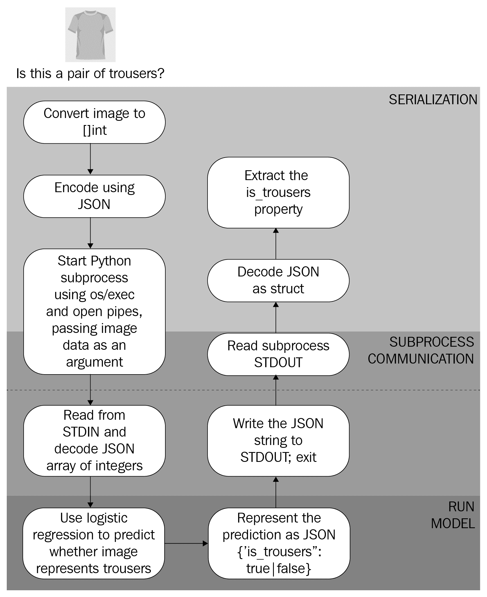
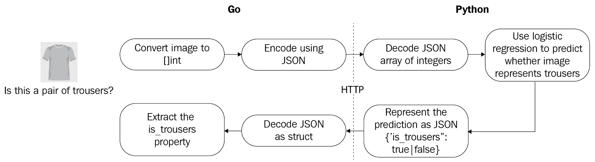

# 使用预训练模型

在前两章中，你学习了如何使用有监督的 ML 算法([第三章](48817ff3-5622-4f43-88e7-d3dfccacb25d.xhtml)、*监督学习*)和无监督的 ML 算法([第四章](26788e93-3614-413f-bcde-5580516f9c5f.xhtml)、*无监督学习*)来解决广泛的问题。这些解决方案从头开始创建模型，并且只包含 Go 代码。我们没有使用已经训练好的模型，也没有试图从 Go 中调用 Matlab、Python 或 R 代码。然而，在一些情况下这是有益的。在这一章中，我们将介绍几种旨在使用预训练模型和创建多语言 ML 应用程序的策略——也就是说，主要的应用程序逻辑是用 Go 编写的，但专业技术和模型可能是用其他语言编写的。

在本章中，您将了解以下主题:

*   如何加载预训练的 GoML 模型并使用它来生成预测
*   何时考虑使用纯 Go 解决方案或多语种解决方案
*   如何使用 os/exec 包调用用其他语言编写的 ML 模型
*   如何使用 HTTP 来调用用其他语言编写的 ML 模型，这些模型可能驻留在不同的机器上，甚至在互联网上
*   如何使用 TensorFlow API for Go 运行 TensorFlow 模型


# 如何恢复保存的 GoML 模型

一旦你完成了创建 ML 模型的艰苦工作，你可能需要关闭你的电脑。当计算机重新启动时，您的模型会发生什么变化？除非你把它保存到磁盘上，否则它会消失，你需要重新开始训练过程。即使您在 gophernotes 笔记本中保存了模型超参数，模型本身也不会被保存。如果培训过程很长，您可能需要等待很长时间才能再次使用您的模型。

在下面的例子中，我们将解释如何恢复我们在[第 3 章](48817ff3-5622-4f43-88e7-d3dfccacb25d.xhtml)、*监督学习*中创建的模型，并使用 GoML API 提供的`PersistToFile`方法将其保存到本地文件系统的一个`model.dat`文件中。我们将使用它的`RestoreFromFile`方法恢复它。我们将假设我们在第 3 章[*监督学习*中创建的所有其他函数都是可用的，例如将一幅图像转换成一片浮点:](48817ff3-5622-4f43-88e7-d3dfccacb25d.xhtml)

```
// IsImageTrousers invokes the Saved model to predict if image at given index is, in fact, of trousers
// For simplicity, this loads the model from disk on every request, whereas loading it once and caching it
// would be preferable in a commercial application.

func IsImageTrousers(i int) (bool, error) {
  model := linear.Logistic{}
  if err := model.RestoreFromFile("model.dat"); err != nil {
    return false, err
  }
  prediction, err := model.Predict(testImages[i])
  return prediction > 0.5, err
}
```

我们现在可以在 gophernotes 中使用这段代码来生成一个预测，并将其与`Label`列中的基本事实进行比较:

```
// Prediction

IsImageTrousers(16)
```

在 gophernotes 中运行前面的代码单元格将产生以下输出:

```
true <nil>
```

让我们检查输出:

```
// Ground truth

df.Col("Label").Elem(16).Int() == 1

```

我们也可以使用我们在[第 3 章](48817ff3-5622-4f43-88e7-d3dfccacb25d.xhtml)、*监督学习*中介绍的相同验证技术，来检查输出的质量是否符合预期。当模型是用 Go 编写的，并在以后被重用时，这种方法非常有效。然而，如果模型是用 Python 编写的，并且不能在 Go 中直接恢复(例如，`scikit-learn`模型就是这种情况)，那么使用它进行预测的唯一方法可能是在 Python 模型和 Go 应用程序之间设计一些通信。虽然这增加了应用程序的整体复杂性，但它有显著的优势，我们将在下面的部分中讨论。


# 决定何时采用多语言方法

正如我们在前面的章节中看到的，围棋生态系统提供了大量的机会来本地解决机器学习问题。然而，固执地要求解决方案保持纯粹的 Go 可能会导致开发时间增加，甚至降低训练性能，因为其他更专业的 ML 库可以提供相应 Go 库中尚未实现的更高级别的 API 或性能优化。

这两者的一个很好的例子是 Python ML 库 Keras。这个库的目的是提供一个高级 API，允许作者执行广泛的 ML 任务，如数据预处理、模型训练、模型验证和持久性。它的抽象在各种后端中都有具体的实现，比如 TensorFlow，众所周知它的性能非常好。由于这些原因，keras 是任何语言中最受欢迎的 ML 库之一:其麻省理工学院许可的 GitHub 存储库有超过 40，000 颗星，在 GitHub 上搜索显示超过 20，000 个存储库与搜索词 Keras 匹配，这意味着存储库的名称包含该词。对代码内容的搜索显示，GitHub 上超过一百万个文件包含搜索词 keras。

然而，仅仅为了利用一个库而用 Python 编写整个应用程序并不能利用 Go 提供的好处，我们在第一章、*介绍 Go 的机器学习*中列举了这些好处。如果这些因素在应用程序的开发中并不重要，那么尽一切办法用 Python 来创建它，但是，在接下来的内容中，我们将假设您希望两个世界都最好。

因此，有两个选择:第一，完全在 Go 中开发应用程序。第二，用 Python 开发 ML 模型，并从 Go 代码中调用这个模型，它将包含主要的应用程序和业务逻辑。在以生产现成产品为目标的商业环境中，这两种选择的优势如下:

**纯 Go 应用**:

*   在多种语言的溶液中更容易保持
*   降低应用程序组件交互的复杂性，因为不需要管理外部 ML 组件的调用
*   更容易让团队成员加入
*   需要更新的依赖项更少

现有的库可以提供所需的现成功能和足够的性能，排除了使用其他语言的专用库所带来的任何优势。

**多语言应用**:

*   使用来自其他语言专业库的高级抽象，大幅减少复杂 ML 问题的代码量
*   在某些情况下，性能优势，因为一些 GoML 库不是为完全的速度而设计的(深度学习就是一个很好的例子)
*   可以更好地适应多团队方法，因为数据科学团队更熟悉 Python 或 R 库
*   利用预先存在的模型——学术研究论文通常会发布 Caffe 或 TensorFlow 模型，并使用 Python 或 Lua 脚本来调用它们

总之，对于 ML 应用程序来说，现有的 Go 库提供了你所需要的现成的或者很少修改的东西，一个本地的 Go 解决方案将会降低应用程序的复杂性并增强可维护性。然而，如果不是这样，特别是对于深度学习和计算机视觉等非常复杂的问题，将 Go 与其他语言的最新工具结合起来是值得的。

在下面的例子中，我们将从 Go 应用程序中调用各种 Python ML 模型。我们专门使用 Python 的原因是 Python 预装在大多数 Linux 发行版中，也是 ML^(【4】【5】)最流行的语言。我们将要描述的解决方案可以应用于用任何编程语言编写的模型。


# 示例–使用 os/exec 调用 Python 模型

为了开始多语言 ML 应用程序，我们将重温来自[第 3 章](48817ff3-5622-4f43-88e7-d3dfccacb25d.xhtml)、*监督学习*的逻辑回归示例。我们将假设模型是用 Python 而不是 Go 编写的，并且我们希望从我们的 Go 应用程序中调用它。为此，我们将使用命令行参数向模型传递输入，并从**标准输出** ( **STDOUT** )中读取模型的预测。

为了在 Python 和 Go 之间交换数据，我们将使用使用 **JavaScript 对象符号** ( **JSON** )格式化的字符串。当然，这种选择是任意的^(【6】)，我们可以选择 Go 和 Python 标准库支持的任何其他格式，比如 XML，或者发明我们自己的格式。JSON 的优势在于，在两种语言中使用起来都不费吹灰之力。

我们将遵循以下流程与 Python 子流程进行通信。通常有三个步骤:请求的序列化、执行子流程和响应的反序列化:



图 1:我们用来与运行预训练逻辑回归模型的 Python 子流程通信的流程

我们将从加载 MNIST 数据集并将其转换为数据帧开始。你可以在[第三章](48817ff3-5622-4f43-88e7-d3dfccacb25d.xhtml)、*监督学习*中找到代码。不过这一次，我们将把图像数据转换成一片 int，每个 int 在 0 到 255(每个像素的值)之间，而不是一片 floats。这是为了确保与 Python 模型保持一致:

```
// ImageSeriesToInts converts the dataframe's column containing image data for multiple images to a slice of int slices, where each int is between 0 and 255, representing the value of the pixel.

func ImageSeriesToInts(df dataframe.DataFrame, col string) [][]int {

  s := df.Col(col)

  ret := make([][]int, s.Len(), s.Len())

  for i := 0; i < s.Len(); i++ {

    b := []byte(s.Elem(i).String())

    ret[i] = NormalizeBytes(b)

  }

  return ret

}
```

接下来，我们将引入一个允许我们启动 Python 子流程并等待它完成的函数:

```
// InvokeAndWait invokes a Python 3 script with the given arguments, waits for it to finish, and returns the concatenated output of its STDOUT and STERRR.
func InvokeAndWait(args ...string) ([]byte, error) {
  var (
    output []byte
    errOutput []byte
    err error
  )
  cmd := exec.Command("python3", args...)
  stdout, err := cmd.StdoutPipe()
  if err != nil {
    return nil, err
  }
  stderr, err := cmd.StderrPipe()
  if err := cmd.Start(); err != nil {
    return nil, err
  }
  if output, err = ioutil.ReadAll(stdout); err != nil {
    return nil, err
  }
  if errOutput, err = ioutil.ReadAll(stderr); err != nil || len(errOutput) > 0 {

    return nil, fmt.Errorf("Error running model: %s", string(errOutput))
  }
  return output, nil
}
```

现在，我们准备组装预测函数，它将序列化图像数据，在子流程启动时将其作为参数传递给子流程，等待子流程完成，并反序列化响应:

```
// IsImageTrousers invokes the Python model to predict if image at given index is, in fact, of trousers

func IsImageTrousers(i int) (bool, error){
    b, err := json.Marshal(testImages[i])
    if err != nil {
        panic(err)
    }
    b, err = InvokeAndWait("model.py", "predict", string(b))
    if err != nil {
        return false, err
    } else {
        var ret struct {
            IsTrousers bool `json:"is_trousers"`
        }
        err := json.Unmarshal(b, &ret)
        if err != nil {
            return false, err
        }
        return ret.IsTrousers, nil
    }
}
```

我们现在可以在 gophernotes 中使用这段代码来生成一个预测，并将其与`Label`列中的基本事实进行比较:

```
// Prediction
IsImageTrousers(16)
```

在 gophernotes 单元格中运行此命令会提供以下输出:

```
true <nil>
```

让我们检查输出:

```
// Ground truth
df.Col("Label").Elem(16).Int() == 1
```

正如所料，这输出`true`。我们可以对几个不同的图像重复这个过程，以获得一些信心，确信一切都正常工作。Go 和 Python 代码都使用`predict`参数来表示应该执行哪个动作——我们还可以有一个`test`动作来检查 Python 代码从其参数中重建的图像是否正确，这进一步增加了我们对子流程通信是否正确的信心。

子进程通信可以是特定于操作系统的，尤其是在涉及输出重定向时。Go 的一个优点是，我们在这里提出的管道方法在不同的操作系统中同样适用，不需要额外的修改，而在 Python 等其他语言中，有时需要额外的工作。

虽然代码简洁且易于调试，但启动新的 Python 进程来处理每个请求的需求会影响具有更小、更快模型的应用程序的性能。此外，它在 Go 应用程序和它的 Python 模型之间创建了一个相当紧密的耦合。这可能会给大型团队带来问题，在大型团队中，数据科学团队创建模型，而软件开发团队创建应用程序的其余部分。这也可能产生这样的问题，即模型应该被暴露给多个应用程序，而不仅仅是一个——那么你应该怎么做呢？每个应用程序都有一个模型副本？这可能会导致可维护性问题。在下面的例子中，我们将研究一种将 Go 应用程序从其 Python 模型中分离出来的方法。


# 示例–使用 HTTP 调用 Python 模型

如果模型驻留在不同的机器上，我们需要解耦 Go 和模型逻辑，或者如果我们希望执行多个操作，例如基于用户数据训练特定于用户的模型，然后使用该模型生成预测，该怎么办？在这些情况下，我们之前使用命令行参数的解决方案将变得更加复杂，因为我们添加了更多的参数来区分操作和返回代码。这种类型的调用通常被称为**远程过程调用** ( **RPC** )，SOAP 或 JSON-RPC 等解决方案在业界已经有几十年的历史^(【7】)。

在下面的例子中，我们将使用一个更通用的协议:HTTP。严格地说，HTTP 是一种数据传输协议，并且经常被用作 RPC 协议的管道。然而，只需很少的努力，我们就可以通过公开一个接受 POST 请求的端点，在 HTTP 之上创建我们自己的最小 RPC。这样做的好处是，除了 Python 或 Go 中的标准库之外，不需要任何依赖，并且调试协议错误非常简单。缺点是它需要更多的工作来处理诸如序列化之类的问题。

下图说明了我们将遵循的请求/响应流程:



图 2:GoML 应用程序使用 HTTP 与预训练的 Python 模型通信的请求/回复过程

与前面的例子不同，我们假设 Python HTTP 服务器已经在运行。如果您正在使用配套的存储库，那么在使用`install-python-dependencies.sh`安装完依赖项之后，您可以使用`python3 model_http.py`命令启动 Python 服务器。这意味着 Go 代码特别短:

```
// Predict returns whether the ith image represents trousers or not based on the logistic regression model

func Predict(i int) (bool, error){
    b, err := json.Marshal(testImages[i])
    if err != nil {
        return false, err
    }
    r := bytes.NewReader(b)
    resp, err := http.Post("http://127.0.0.1:8001", "application/json", r)
    if err != nil {
        return false, err
    }
    body, err := ioutil.ReadAll(resp.Body)
    if err != nil {
        return false, err
    }
    resp.Body.Close()
    var resp struct {
        IsTrousers bool `json:"is_trousers"`
    }
    err := json.Unmarshal(body, &resp)
    return resp.IsTrousers, err 
}
```

正如我们之前所做的，我们可以生成一些预测，以确保 Go 和 Python 流程之间的通信按预期进行:

```
// Expected: true <nil>

Predict(16)
```

正如预期的那样，我们得到了以下内容:

```
true <nil>
```

我们可以对其他几幅图像继续这一过程，以确保响应与`df.Col("Label")`系列定义的地面真实值相匹配。我们还可以在 Python HTTP 服务器上创建多个 HTTP 端点，以允许各种测试，进一步增强我们对进程间通信的信心。

如果您需要调试与 HTTP 服务器的通信，Postman 是一个很好的工具，它是一个免费的 GUI 工具，允许您创建 HTTP 请求并检查响应。你可以在:
[https://www.getpostman.com/](https://www.getpostman.com/)找到邮递员。

在前面的例子中，我们假设模型是用不同的编程语言(Python)创建的，并且只能从该语言访问。然而，有一些流行的深度学习库已经努力变得更加多语言化，因此，提供了使用一种语言创建模型并使用另一种语言的方法。在下面的例子中，我们将看看其中的两个库。


# 示例–使用 TensorFlow API for Go 进行深度学习

深度学习是机器学习的一个子领域，它采用通常具有许多层的神经网络来解决图像或语音识别等复杂问题。在这个例子中，我们将看看如何利用 TensorFlow，一个流行的深度学习框架，使用它的 Go 绑定。

TensorFlow 是一个高度优化的库，由 Google 创建，用于对名为 tensor^(【8】)的对象执行计算。如果向量是标量(数字)的集合，矩阵是向量的集合，那么张量可以被认为是一个更高维的矩阵，其中标量、向量和矩阵是特例。虽然这看起来有点抽象，但张量是描述神经网络时使用的自然对象，这也是为什么 TensorFlow 成为最受欢迎的库之一——甚至根据一些评论者的说法，*是最受欢迎的*——用于商业和学术深度学习开发^(【9】【10】)。

2011 年，谷歌大脑的团队建立了一个专有的深度学习系统，名为 dist belief^(【11】)。杰夫·迪恩(Jeff Dean)和杰弗里·辛顿(Geoffrey Hinton)等许多杰出的计算机科学家都在研究它的反向传播和其他神经网络相关算法，这导致该框架在谷歌的许多项目中得到越来越多的采用。2017 年，这个框架的第二代，现在叫做 TensorFlow，在开源许可下发布^(【12】)。

TensorFlow 的核心是一个低级 API，也称为深度学习计算的后端。实际上，处理商业问题的数据科学家通常不需要每天与 TensorFlow API 直接交互。相反，许多前端，如我们之前介绍的 Keras，可以作为 TensorFlow 的更高级抽象来使用，并提供最佳的性能和易用性。另一方面，发明新型神经架构的学术研究通常是使用低级 API 来执行的，因为还不存在新结构的抽象。你在 TensorFlow 中创建的被称为**图形**的对象，可以在其他语言中持久化和重用，这要感谢最近为使框架更加多语言化所做的努力^(【13】)。

在本例中，我们将解释如何安装 TensorFlow 以及如何使用其 Go API 来加载预训练 TensorFlow 模型并使用它进行预测。


# 安装 TensorFlow

TensorFlow 的体验通常是巧妙的——也就是说，在你设法正确安装它之后。TensorFlow 团队认识到这是一个困难的步骤，在最好的情况下，从源代码构建 TensorFlow 通常需要几个小时，因此他们现在提供了几个简单的安装选项。值得注意的是，如果您的系统上有兼容的 GPU，您应该安装一个 GPU 选项，因为这通常会显著加速软件，这在培训阶段尤其明显:

*   **使用 pip** 安装:TensorFlow 面向 Python 程序员，他们通常会使用`pip`来管理他们的包。在撰写本文时，该方法已经在 Ubuntu Linux 16.04 或更高版本、macOS 10.12.6 (Sierra)或更高版本(尽管不支持 GPU)、Raspbian 9.0 或更高版本以及 Windows 7 或更高版本上进行了测试。
*   使用 Docker 映像:这将适用于支持 Docker 的各种系统。有两个图片可供选择:一个普通的 TensorFlow 图片和一个包含 Jupyter 的图片，让您有与 gophernotes 相同的体验，但只使用 Python。
*   从源代码构建(Build from source):如果您正在使用一个非标准的配置，或者想要对构建过程的一部分进行特定的控制(也许利用一些只对您的特定配置有效的优化)，这是最好的选择。

还有第四种选择，即使用 Google Colaboratory 在 Google 的云中运行基于 TensorFlow 的代码，但我们不会深入研究这种选择，因为它目前只适用于 Python。

在这个例子中，我们将使用一个 Docker 图像。Docker 可以看作是在同一台机器上打包和运行多个应用程序(称为容器)的解决方案，同时防止它们相互干扰。如果你还不熟悉，去 https://docs.docker.com/get-started/[听一个五分钟的教程。](https://docs.docker.com/get-started/)

我们将使用名为`tensorflow/tensorflow`的普通 TensorFlow-on-Ubuntu 图像，其中不包括 Jupyter。我们需要在这个映像上安装 Go，这样我们就可以运行我们的代码了。因为我们的代码将依赖于用于 Go 的 TensorFlow 绑定，所以我们也将根据官方说明^(【14】)安装它们。这也需要我们安装 TensorFlow C 绑定。因此，我们的 docker 文件将如下所示。为了简洁起见，省略了一些步骤——您可以在本书的配套资源库中找到完整的 docker 文件:

```
FROM tensorflow/tensorflow

## Install gcc for cgo ##
RUN apt-get update && apt-get install -y --no-install-recommends \
 curl \
 git \
 wget \
 g++ \
 gcc \
 libc6-dev \
 make \
 pkg-config \
 && rm -rf /var/lib/apt/lists/*

## Install TensorFlow C library ##
RUN curl -L \
 "https://storage.googleapis.com/tensorflow/libtensorflow/libtensorflow-cpu-linux-x86_64-1.13.1.tar.gz" | \
 tar -C "/usr/local" -xz
RUN ldconfig

## Install Go ##
ENV GOLANG_VERSION 1.9.2

RUN wget -O go.tgz "https://golang.org/dl/go${GOLANG_VERSION}.${goRelArch}.tar.gz"; \
 echo "${goRelSha256} *go.tgz" | sha256sum -c -; \
 tar -C /usr/local -xzf go.tgz; \
 rm go.tgz; \
 \
 if [ "$goRelArch" = 'src' ]; then \
 echo >&2; \
 echo >&2 'error: UNIMPLEMENTED'; \
 echo >&2 'TODO install golang-any from jessie-backports for GOROOT_BOOTSTRAP (and uninstall after build)'; \
 echo >&2; \
 exit 1; \
 fi; \
 \
 export PATH="/usr/local/go/bin:$PATH"; \
 go version

ENV GOPATH /go
ENV PATH $GOPATH/bin:/usr/local/go/bin:$PATH

RUN mkdir -p "$GOPATH/src" "$GOPATH/bin" && chmod -R 777 "$GOPATH"

## Go get tensorflow go library ##
RUN \
 go get github.com/tensorflow/tensorflow/tensorflow/go \
 github.com/tensorflow/tensorflow/tensorflow/go/op

## Set up the environment so we can just run our code ##
RUN mkdir $GOPATH/src/model

WORKDIR $GOPATH/src/model

ADD . $GOPATH/src/model

CMD ["go", "run", "main.go"]
```


# 导入预训练张量流模型

在[第 3 章](48817ff3-5622-4f43-88e7-d3dfccacb25d.xhtml)、*监督学习*中，我们解释了如何使用 go-deep 库在 pure Go 中创建深度学习模型。虽然这是一个玩具示例，但是训练起来非常慢，并且需要很多多余的代码。如果使用行业领先的深度学习库之一，会容易得多，并产生更多性能代码，但不幸的是，它们是用其他语言编写的。使用 Python 库 Keras，我们创建了一个深度学习模型，它将在我们之前查看的同一问题中充当分类器:*给定的图像是一条裤子吗？*我们现在将编写一些 Go 代码来导入我们的预训练模型。

如果只保存模型的权重，而不是更完整的 SavedModel 格式，会怎么样？在这种情况下，您仍然可以使用`graph.Import` func 导入它，但是，随后需要做更多的工作来告诉 TensorFlow 所有的操作和变量。TensorFlow API godocs 中有一个例子说明了这个过程^(【15】)。

接下来的内容假设模型以`SavedModel`格式保存，并且我们知道输入和输出的名称`Ops`。如果模型是由其他人使用 Keras 或其他第三方库创建的，这有时会很棘手。一种选择是使用`SavedModel`命令行界面工具来检查模型^(【16】)。

如果模型是在 Keras 中创建的，并且您可以访问 Python 代码，那么只需检查它的`input`和`output`属性，就可以看到相应张量的名称。它们后面可能会有一个`:0`，您可以忽略它。

要在 Go 中恢复一个`SavedModel`，只需使用`LoadSavedModel` func。这将返回一个图形和会话对象，然后您可以对其进行操作，传递输入并检索输出:

```
savedModel, err := tf.LoadSavedModel("./saved_model", []string{"serve"}, nil)
if err != nil {
  log.Fatalf("failed to load model: %v", err)
}
```

请注意，第二个参数称为标签，通常按照惯例设置。我们现在可以访问输入和输出操作:

```
input := savedModel.Graph.Operation("input_input_1")
output := savedModel.Graph.Operation("output_1/BiasAdd")
```

如果在这一阶段输入或输出为零，这意味着您没有正确的名称，因此您需要返回到检查模型以找出它们应该是什么。查看`savedModel.Graph.Operations`(它是`Operation`的一部分)并通过那些包含在`Name()`中输入的搜索字符串的操作来过滤操作列表也是有用的。

我们现在可以访问恢复的会话和图形:

```
session := savedModel.Session
graph := savedModel.Graph
defer session.Close()
fmt.Println("Successfully imported model!")
```

现在，我们可以在 TensorFlow Docker 容器中运行这段代码并查看结果。我们将从 Docker 文件构建 Docker 映像并运行它:

```
docker build -t tfgo . && \
docker run -it tfgo
```

如果一切顺利，我们应该在构建容器时看到一些输出(第二次运行时会快得多),最后显示以下消息:

```
Successfully built 9658a6232ef8
Successfully tagged tfgo:latest
Successfully imported model!
```

前两行告诉我们，我们的 Docker 映像已经成功构建，最后一行来自我们的 Go 代码，让我们知道模型导入操作工作正常，没有导致任何错误。

根据您安装 Docker 的方式，您可能需要超级用户权限来运行这些命令，所以如果需要，只需在它们前面加上`sudo`即可。


# 创建张量流模型的输入

既然我们能够从`SavedModel`中重新创建 TensorFlow 图和会话，我们将创建一个程序，该程序将从 MNIST 时装数据集中接受一幅图像作为一片字节，并使用这些字节来填充我们之前加载的模型的输入。然后，我们将能够运行模型以获得输出预测。

我们必须创建一个过程，该过程将接受来自 MNIST 时装数据集的图像，并返回正确形状的张量。我们从第 3 章*监督学习*中知道，模型将期望一个 784 浮点的切片，并且对模型的检查(使用 Python 中的`model.summary`或`SavedModel` CLI)将揭示输入应该是一个 1 x 784 张量的`float32`值。

当通过将切片的切片作为参数传递给`NewTensor` func 来构造张量时，请确保它们的长度都相同。例如，您可以传递每个包含 7 个元素的 3 个切片，这将创建一个(3，7)张量，但不是分别包含 5、6 和 7 个元素的 3 个切片-第二维度必须对所有切片都相同。

我们可以构造一个形状正确的空白(零)张量，如下所示:

```
func makeBlankInputTensor() (*tf.Tensor, error) {
  t := make([][]float32, 1)
  t[0] = make([]float32, 784)
  tensor, err := tf.NewTensor(t)
  return tensor, err
}
```

虽然这本身不是很有用，但它展示了`NewTensor` func 的用法，它可以从传递的 Go `interface{}`中推断出正确的张量形状和值类型。使用我们在[第三章](48817ff3-5622-4f43-88e7-d3dfccacb25d.xhtml)、*监督学习*中介绍的`ImageSeriesToFloats` func，我们可以很容易地将一幅图像转换成`float32`的切片，从而做出输入张量。

我们可以运行模型得到一个预测:

```
tensor, err := makeTensorFromImage("/path/to/fashion/MNIST", 12)
if err != nil {
  log.Fatal(err)
}
prediction, err := session.Run(
  map[tf.Output]*tf.Tensor{
    graph.Operation(input.Name()).Output(0): tensor,
  },
  []tf.Output{
    graph.Operation(output.Name()).Output(0),
  },
  nil)
if err != nil {
  log.Fatal(err)
}

probability := prediction[0].Value().([][]float32)[0][0]
if probability > 0.5 {
  fmt.Printf("It's a pair of trousers! Probability: %v\n", probability)
} else {
  fmt.Printf("It's NOT a pair of trousers! Probability: %v\n", probability)
}
```

例如，当以空白张量作为输入运行此命令时，输出的最后几行如下所示:

```
Successfully built b7318b44f92d
Successfully tagged tfgo:latest
Successfully imported model!
It's NOT a pair of trousers! Probability: 0.04055497
```

在下一章中，我们将更详细地探讨使用 Docker 部署 ML 应用程序工作负载的模式。


# 摘要

在这一章中，我们从实用的角度比较了 Go-only 和 polyglot ML 解决方案，对比了它们的缺点和优点。然后，我们介绍了两个开发多语言 ML 解决方案的通用解决方案:os/exec 包和 JSON-RPC。最后，我们看了两个高度专门化的库，它们自带基于 RPC 的集成解决方案:TensorFlow 和 Caffe。您已经学习了如何决定在您的应用程序中是使用 Go-only 还是 polyglot 方法来处理 ML，如何实现基于 RPC 的 polyglot ML 应用程序，以及如何从 Go 运行 TensorFlow 模型。

在下一章，我们将讨论 ML 开发生命周期的最后一步:将一个用 Go to production 编写的 ML 应用程序投入生产。


# 进一步阅读

1.  *柯* *拉斯吉图库*:[https://github.com/keras-team/keras](https://github.com/keras-team/keras)。检索时间 2019 年 4 月 30 日。
2.  *GitHub 搜索 keras*:[https://github.com/search?utf8=%E2%9C%93&amp；q = keras&amp；type=](https://github.com/search?utf8=%E2%9C%93&q=keras&type=) 。检索时间 2019 年 4 月 30 日。
3.  *GitHub 内容搜索 keras*:[https://github.com/search?q=keras&amp；类型=代码](https://github.com/search?q=keras&type=Code)。检索时间 2019 年 4 月 30 日。
4.  《经济学人》 *Python 正成为世界上最流行的编码语言。2018 年 7 月 26 日:[https://www . economist . com/graphic-detail/2018/07/26/python-is-being-the-world-most-popular-coding-language。](https://www.economist.com/graphic-detail/2018/07/26/python-is-becoming-the-worlds-most-popular-coding-language)检索时间 2019 年 4 月 30 日。*
5.  在 Unix 平台上使用 Python:[https://docs.python.org/2/using/unix.html](https://docs.python.org/2/using/unix.html)。检索时间 2019 年 4 月 30 日。
6.  *JSON*:[https://www.json.org/](https://www.json.org/)。检索时间 2019 年 4 月 30 日。
7.  *封面-肥皂*:[http://xml.coverpages.org/soap.html](http://xml.coverpages.org/soap.html)。检索时间 2019 年 4 月 30 日。
8.  *张量流核心*:[https://www.tensorflow.org/overview/](https://www.tensorflow.org/overview/)。检索时间 2019 年 4 月 30 日。
9.  *深度学习框架 Power Scores*:[https://towardsdatascience . com/Deep-Learning-Framework-Power-Scores-2018-23607 ddf 297 a](https://towardsdatascience.com/deep-learning-framework-power-scores-2018-23607ddf297a)。检索时间 2019 年 4 月 30 日。

10.  *排名热门深度学习框架*:[https://blog . the data incubator . com/2017/10/Ranking-Popular-Deep-Learning-libraries-for-data-science/](https://blog.thedataincubator.com/2017/10/ranking-popular-deep-learning-libraries-for-data-science/)。检索时间 2019 年 4 月 30 日。
11.  迪恩杰夫等人。艾尔。*异构分布式系统上的大规模机器学习*。2015 年 11 月 9 日。[http://download.tensorflow.org/paper/whitepaper2015.pdf](http://download.tensorflow.org/paper/whitepaper2015.pdf)检索时间 2019 年 4 月 30 日。
12.  *tensor flow*`RELEASE.md`:[https://github . com/tensor flow/tensor flow/blob/07 bb 8 ea 2379 BD 459832 b 23951 FB 20 EC 47 F3 fdbd 4/release . MD](https://github.com/tensorflow/tensorflow/blob/07bb8ea2379bd459832b23951fb20ec47f3fdbd4/RELEASE.md)。检索时间 2019 年 4 月 30 日。
13.  *其他语言的张量流*:[https://www.tensorflow.org/guide/extend/bindings](https://www.tensorflow.org/guide/extend/bindings)。检索时间 2019 年 4 月 30 日。
14.  *为 Go 安装 tensor flow*:[https://www.tensorflow.org/install/lang_go](https://www.tensorflow.org/install/lang_go)。检索于 2019 年 5 月 1 日。
15.  *tensor flow—godocs*:[https://godoc . org/github . com/tensor flow/tensor flow/tensor flow/go](https://godoc.org/github.com/tensorflow/tensorflow/tensorflow/go)。检索于 2019 年 5 月 3 日。
16.  *保存和恢复*:[https://www . tensor flow . org/guide/saved _ model # install _ the _ saved model _ CLI](https://www.tensorflow.org/guide/saved_model#install_the_savedmodel_cli)。检索于 2019 年 5 月 3 日。
17.  *标签常量*:[https://github . com/tensor flow/tensor flow/blob/master/tensor flow/python/saved _ model/Tag _ constants . py](https://github.com/tensorflow/tensorflow/blob/master/tensorflow/python/saved_model/tag_constants.py)。检索于 2019 年 5 月 22 日。