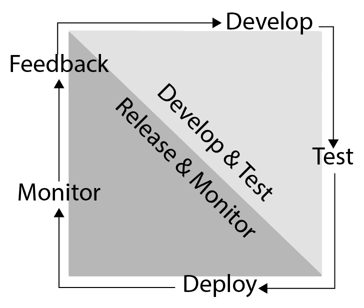
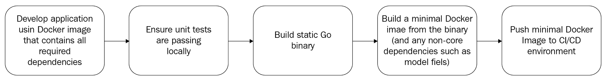
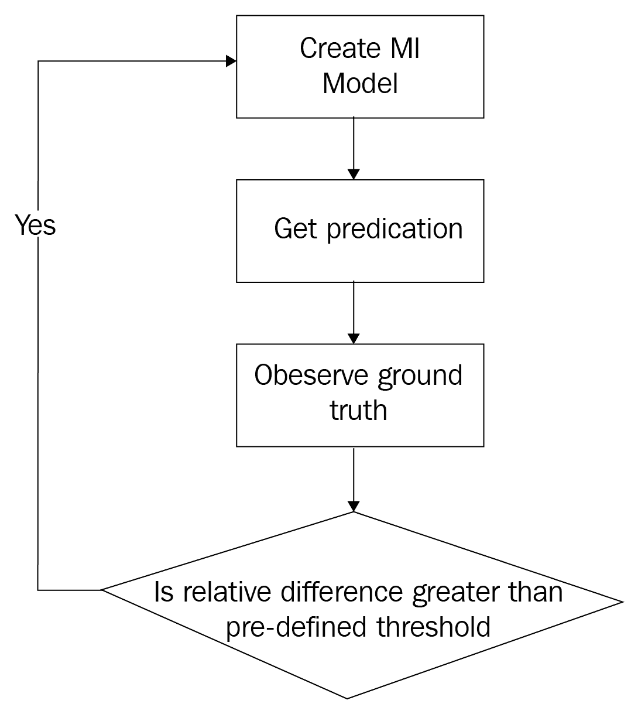

<title>Deploying Machine Learning Applications</title>  

# 部署机器学习应用程序

在前面的章节中，我们学习了如何创建一个应用程序来准备数据([第 2 章](532d8304-b31d-41ef-81c1-b13f4c692824.xhtml)，*设置开发环境*)，无论是有监督的([第 3 章](48817ff3-5622-4f43-88e7-d3dfccacb25d.xhtml)，*监督学习*)还是无监督的([第 4 章](26788e93-3614-413f-bcde-5580516f9c5f.xhtml)，*无监督学习* ) ML 算法。我们还学习了如何评估和测试这些算法的输出，这增加了我们对算法的内部状态和工作方式的不完全了解，因此必须将其视为黑盒。在[第 5 章](815e42bb-64e4-4f04-9dbd-c58af28f2580.xhtml)、*使用预训练模型中，*我们研究了模型持久性以及 Go 应用程序如何利用用其他语言编写的模型。总之，到目前为止，您所学到的技能构成了成功构建 ML 应用程序原型所需的基础。在这一章中，我们将着眼于如何为商业准备好你的原型，集中在特定于 ML 应用的方面。

在本章中，您将涉及以下主题:

*   连续交付反馈循环，包括如何测试、部署和监控 ML 应用程序
*   ML 应用程序的部署模型

<title>The continuous delivery feedback loop</title>  

# 持续交付反馈循环

**连续交付** ( **CD** )是在软件开发生命周期中使用短反馈循环的实践，以确保生成的应用程序可以在任何时刻及时发布^(【1】)。虽然发布管理有其他方法，但我们只考虑这一种，因为使用 ML 应用程序创建一个有意义的、简短的——因此是自动化的——反馈循环会带来独特的挑战，而其他方法可能不需要这种程度的自动化。

CD 反馈回路由以下过程组成:



图 1:连续交付反馈循环

<title>Developing</title>  

# 发展中的

反馈循环的发展部分是我们到目前为止在本书中所涉及的。正如我们在[第 5 章](815e42bb-64e4-4f04-9dbd-c58af28f2580.xhtml)、*中所讨论的，使用预先训练好的模型*、*、*在 Go 中开发 ML 模型既有优点也有缺点，有时将 Go 与其他语言(如 Python)相结合，以受益于 Keras 等库，可以显著缩短开发周期。不利的一面是降低了可维护性，并且需要更多的工作来测试最终的解决方案，因为它必须包含一个 Go–Python 接口(例如)。

<title>Testing</title>  

# 测试

因为人类容易犯错误，所以测试我们创建的源代码是开发生命周期的一个关键要素，以保证产品的准确性和可靠性。整本书都致力于这个主题，似乎有多少软件工程师就有多少不同的软件测试方法(在互联网上搜索软件测试方法就可以证实这一点)。从表面上看，ML 应用程序特别难以测试，因为它们看起来像一个黑盒，其输出取决于我们提供的训练集:我们向它们提供数据，它们向我们提供答案，但是对于给定的输入向量，训练测试分割或超参数的微小变化可能会产生不同的输出。我们如何确定他们提供的答案是错误的，因为模型的超参数不正确，因为输入数据被破坏，或者因为模型的算法有缺陷？或者这种特殊的反应是隐藏在其他可接受的反应中的异常值？

在前面的章节中，我们使用验证集对模型进行了统计测试，以测量模型对有意义的输入样本的响应，并将它们与可用的预期输出值进行比较(监督学习)。可以说，这是测试 ML 模型的准确性或精度的唯一方法，因为在数据集的不同样本上(或使用改变的超参数)对它们进行重新训练可能会对相同的输入产生不同的输出，但是对于相同的准确性/精度度量，不应该在大型验证集上产生统计上较差的结果。换句话说，通过对模型进行小的更改，我们可以看到它对一个输入向量的响应方式发生了很大的变化，但是在对足够大的输入向量样本(如验证集)进行测试时，它的响应不应该有太大的不同。

这有两个后果。首先，单元测试通常的构造方式，即开发人员选择输入值并断言输出，可能会因为模型的微小变化而崩溃。因此，最好不要依赖基于单个响应的断言。相反，使用我们在第三章、*监督学习*和[第四章](26788e93-3614-413f-bcde-5580516f9c5f.xhtml)、*非监督学习*中介绍的技术，更好地在更大的集合中使用准确度或精确度指标来断言。

第二，可能存在边缘情况，在这种情况下，我们希望保证模型的行为，或者某些我们希望保证永远不会发生的响应(即使是无关的行为)。如果我们不能确定黑盒模型可以做到这一点，将 ML 算法与传统逻辑相结合是确保满足约束的唯一方法。例如，考虑一下谷歌最近禁止“大猩猩”作为谷歌图片上的搜索词，以防止一些偶然出现的种族主义结果^(【2】)。用大猩猩图像执行图像分类器的统计测试会很困难，并且只会覆盖这一个边缘情况；然而，知道什么是不可接受的响应并添加约束逻辑来防止这种边缘情况是一件微不足道的事情，如果令人尴尬的话。就像这个例子一样，传统的单元测试可以与统计测试相结合，传统的单元测试断言约束的输出，而统计测试直接断言模型输出。ML 测试的整体策略由此产生:

1.  **定义模型的准确度/精确度目标**:这可能不像得出一个单一的准确度分数那么简单，因为减少假阳性或假阴性可能更重要。例如，旨在确定抵押贷款申请人是否应该获得贷款的分类器可能需要谨慎行事，根据贷款人的风险状况，可以容忍的假阴性比假阳性多。
2.  **定义边缘案例行为，并将其编入单元测试**:这可能需要传统逻辑来限制 ML 模型的输出，以确保满足这些约束，并需要传统单元测试来断言 ML 模型的约束输出。

<title>Deployment</title>  

# 部署

一旦开发了 ML 应用程序，并对其进行了测试，确信其工作正常，CD 生命周期的下一步就是部署软件——也就是说，采取措施确保用户能够访问它。有不同的部署模型，取决于各种因素，例如您是打算在自己的硬件上运行应用程序，还是打算使用**基础架构即服务** ( **IaaS** )或**平台即服务** ( **PaaS** )云，我们将在下一节中讨论这些差异。这里，我们假设您要么在自己的服务器上运行应用程序，要么使用 IaaS 提供商提供的虚拟基础设施。

ML 应用程序可能会在部署中带来一些独特的挑战，这些挑战是简单软件所没有的，例如连接到数据库的 HTTP 服务器:

*   对需要 LAPACK 或 BLAS 的科学库的依赖需要复杂的安装过程，有许多步骤，并且有出错的机会。
*   对深度学习库(如 TensorFlow)的依赖需要动态链接到 C 库，这再次导致复杂的安装过程，具有许多操作系统和架构特定的步骤，并有可能出错。
*   深度学习模型可能需要在专门的硬件上运行(例如，带有 GPU 的服务器)，即使是为了测试
*   ML 模型应该保存在哪里？它们应该像源代码一样提交吗？如果是，我们如何确定我们部署的是正确的版本？

接下来，我们将介绍这些挑战的解决方案以及体现这些解决方案的示例应用程序。

<title>Dependencies</title>  

# 属国

任何试图从源代码构建 TensorFlow 或 NumPy 的人都会赞同这样的说法:任何可能出错的东西都会出错。在 Google、Stack Overflow 或它们各自的 GitHub 问题页面上搜索，会发现构建过程中许多模糊的潜在问题^(【3】【4】【5】)。这些并不是孤立的发现，因为 ML 应用程序所依赖的科学计算库往往是高度复杂的，并且依赖于一组错综复杂的也是高度复杂的其他库。一个学术 ML 研究者可能需要从源代码中构建依赖项，以便从某个优化中受益，或者可能因为他们需要修改它们。相反，ML 应用程序开发人员必须尽量避免这一过程，而是使用作为 Python wheels^(【6】)可用的预构建映像、为他们选择的包管理器预构建的包(如 Ubuntu Linux 上的 apt 或 Windows 上的 Chocolatey^(【7】))或 Docker 映像。

出于几个原因，我们将把 Docker 作为开发和打包 Go ML 应用程序的解决方案:

*   跨多种操作系统的可移植性
*   来自主要云供应商的出色支持，如微软 Azure^(【8】)和亚马逊 Web 服务^(【9】)
*   使用 Terraform^(【10】)、Chef^(【11】)和 ansi ble^(【12】)等工具支持在流行的供应和基础设施配置中集成 Docker。
*   通过预构建的 Docker 映像获得 ML 库
*   Go 特别适合 Docker，因为它总是可以被配置为生成静态二进制文件，从而允许我们大大减少 Docker 映像的大小

如果您已经尽可能地减小了 Docker 图像的大小(可能通过使用`scratch`图像)，但是 Go 二进制文件的大小仍然使整个图像对您来说太大，请考虑使用`strip`命令或类似`upx`的打包程序。

在我们到目前为止看到的所有例子中，我们已经创建了一个 Docker 映像，它包含了我们的应用程序的所有依赖项，以及应用程序文件，通常是使用 Docker 文件中的`ADD`或`COPY`命令添加到容器中的。虽然这具有简单的优点(只有一个 Docker 文件用于开发和生产)，但这也意味着我们将需要推或拉一个超大的 Docker 映像，其中包含开发应用程序所需的所有依赖项。

然而，运行它可能并不需要依赖关系，因为 Go 总是可以被配置为生成在精简的 Docker 映像上运行的静态二进制文件。这意味着更慢的部署时间和更慢的测试时间，因为中间 Docker 映像可能不会缓存在 CI 环境中，更不用说较小的容器往往会在其主机服务器上使用较少的磁盘和内存。较小的映像还具有通过减少攻击面来增加安全性的好处，因为它们包含的可被攻击者利用的依赖项要少得多。例如，`scratch`映像甚至不包含外壳，使得攻击者很难入侵，即使运行在容器中的应用程序本身已经被入侵。

我们提倡的流程如下图所示:



图 2:使用两个独立 Docker 映像的部署(一个用于开发，一个用于测试/生产)

在下面的例子中，我们假设您已经有了一个开发环境，所有的依赖项都存在于其中(可以是基于 Docker 的，也可以不是——这并不重要)。您已经开发了您的 ML 应用程序，它由一个`main`包和一些保存的模型权重`model.data`组成，并且想要创建一个生产就绪的容器。要创建这个容器，我们需要做两件事。

首先，我们需要将 Go 应用程序编译成静态二进制文件。如果你没有使用 CGO 并链接到一些 C 库(比如 TensorFlow C 库)，那么使用没有任何附加标志的`go build`就足够了。但是，如果您的应用程序依赖于 TensorFlow C 库，那么您需要添加一些额外的命令行参数，以确保生成的二进制文件是静态的，也就是说，它包含所有依赖的代码。在撰写本文时，有人提议 Go 1.13 为`build`命令添加一个`-static`标志，这样无需更多工作就能实现。在此之前，Diogok 发表了一篇精彩的博客文章，解释了以下命令中的不同标志，以及在特定情况下不起作用时如何调整它们:

```
CGO_ENABLED=0 GOOS=linux GOARCH=amd64 go build -a -tags netgo -ldflags '-w -extldflags "-static"' -o mlapp *.go
```

这将产生一个具有所有必需依赖关系的单一输出二进制文件`mlapp`。使用所有这些标志的目的是生成一个包含我们所有依赖项的静态二进制文件，这样我们只需要简单地将它们添加到一个“普通”的 Docker 映像中，从而得到 Dockerfile:

```
FROM scratch
ADD . /usr/share/app
ENTRYPOINT ["/usr/share/app/mlapp"]
```

就是这样！不像我们以前使用的长 docker 文件，因为我们需要所有的依赖项，所以没有什么需要添加的。在这种情况下，我们在 Go 二进制文件中已经有了这些依赖关系。这是围棋的另一个优势；与其他一些编程语言不同，Go 使这种类型的部署成为可能。

您还可以通过使用`EXPOSE`命令，使用 docker 文件公开一个端口(例如，如果您打算从 HTTP 服务器提供您的应用程序)。要公开一个监听端口 80 的 HTTP 服务器，可以使用`EXPOSE 80/tcp`命令。

在前面的例子中，我们假设包含训练好的模型权重/超参数的模型文件被持久化到磁盘上，并与二进制文件一起保存，准备添加到 Docker 容器中；然而，在有些情况下，这可能是不切实际或不可取的。

<title>Model persistence</title>  

# 模型持久性

大多数情况下，您可以遵循前面提到的模式，将模型文件与源代码一起提交，并在部署期间将其与二进制文件一起添加到 Docker 映像中；但是，有时您可能需要重新考虑这一点:

*   模型文件非常大，因此会导致 Docker 映像非常大，从而降低部署速度。
*   您拥有的模型文件的数量是动态的，每个模型都与应用程序的一个对象相关联，也就是说，您为每个用户训练一个模型。
*   模型被重新训练的频率比代码可能改变的频率要高得多，这导致了非常频繁的部署。

在这些情况下，您可能希望从不同的源获得模型，而不将其提交给源代码控制。在基本层面上，模型文件只是一个字节序列，所以对它们的存储位置没有真正的限制:在别处的文件服务器上，云文件存储，或者数据库。

例外情况是第二种情况:您有动态数量的与应用程序对象(如用户)相关联的模型文件。例如，如果您正在构建一个旨在预测一个家庭第二天将消耗多少电力的系统，您可能最终会有一个适用于所有家庭的模型或一个家庭一个模型。在后一种情况下，使用数据库来保存这些模型文件会更好:

*   模型文件可能包含敏感数据，这些数据可能在数据库中得到最好的保护和管理。
*   大量的模型文件可以受益于数据库软件利用的高级压缩技术，例如使用页面级压缩而不是行级压缩。这可以减少它们在磁盘上的总大小。
*   例如，将与应用程序对象相关联的数据保存在同一个地方可能更容易限制授权与模型相关的操作所需的查询数量。

出于这些原因，我们建议将模型保存到数据库中，以防您的应用程序需要许多模型，每个模型都与一个应用程序对象(如用户)相关联。

这带来了一个小小的挑战，因为一些 Go ML 库，比如 GoML，公开了持久化函数，比如`linear`包模型的`PersistToFile`，这些函数将模型持久化到一个文件中；然而，如果我们想在其他地方持久化序列化模型，它们并不直接提供对序列化模型的访问。

我们可以应用两种技术:

*   查看 Godocs，看看模型结构是否有任何未导出的字段。如果没有，我们可以简单地使用`encoding/json`来序列化模型。
*   如果有未导出的字段，我们可以将模型保存到一个临时文件中，将临时文件读入内存，然后再次删除它。

在 Go 中，**未导出字段**是一个小写名称的结构字段，在定义它的包之外是不可访问的。使用`encoding/json`进行序列化时不会出现这样的字段。

在 GoML 的`LeastSquares`模型中，没有未导出的字段，粗略检查一下`PersistToFile`方法就会发现，它使用编码/JSON 将模型封送到一个字节片。所以，我们可以直接用`serializedModel, err := json.Marshal(leastSquaresModel)`来序列化。由此产生的`serializedModel`可以保存在我们希望的任何地方。

但是，如果，为了讨论的缘故，我们不能这样做，因为模型结构有未导出的字段呢？例如，golearn 库的`linear_models`包有一个`Export`方法，它将模型持久化到文件中，但是这依赖于对 C 函数的调用，并且模型有未导出的字段。在这种情况下，我们别无选择，只能首先将模型保存到一个临时文件中，然后恢复文件内容:

```
import (
  "io/ioutil"
  linear "github.com/sjwhitworth/golearn/linear_models"
)

func Marshal(model *linear.Model) ([]byte, error) {
  tmpfile, err := ioutil.TempFile("", "models")
  if err != nil {
    return nil, err
  }
  defer os.Remove(tmpfile.Name())
  if err := linear.Export(model, tmpfile.Name()); err != nil {
    return nil, err
  }
  return ioutil.ReadAll(tmpfile)
}
```

我们在前面的代码中所做的只是在磁盘上提供一个临时位置来存储模型文件，然后将它移回内存。虽然这不是存储模型的最佳方式，但由于一些 Go ML 库的一些接口的限制，这是必要的，GoLearn 的 GitHub 页面上已经有一个公开的问题来改进这一点。

既然已经部署了应用程序，我们需要确定它运行正常，使用了适当数量的资源，并且没有潜在的问题会阻止它可用。在下一小节中，我们将关注特定于 ML 应用的监控技术。

<title>Monitoring</title>  

# 监视

New Relic 的首席云架构师 Lee Atchison 在他的书《为规模而架构》(Architecting for Scale)中主张使用风险矩阵，也称为**风险登记册**，来跟踪应用程序可能出现的问题以及如何缓解这些问题^(【16】)。虽然对于一个简单的应用程序来说，这看起来有些过分，但是对于在复杂的环境中管理风险来说，这是一个很好的工具，尤其是在涉及 ML 模型的情况下。这是因为整个团队能够意识到主要的风险，它们的可能性，以及减轻风险的方法，即使他们一开始没有参与创建应用程序的每一部分。ML 模型有时可以由数据科学家创建，然后通过我们在 [第 5 章](48817ff3-5622-4f43-88e7-d3dfccacb25d.xhtml)，*监督学习*中概述的多语言集成方法之一移交给软件开发团队，因此这使得了解与它们在生产中的使用相关的任何风险变得更加重要。

虽然这似乎是一种相当固执己见的方法，但是请记住，目标只是让开发人员思考是什么导致他们的应用程序变得不可用。没有义务写下风险登记簿或使用风险登记簿来运行您的团队(尽管两者都可能是有益的)，考虑风险的做法总是有助于照亮黑暗的角落，在那里没有人想到要寻找那个使整个应用程序离线直到周一早上的难以捉摸的周五晚上的错误。

与生产应用程序相关的**风险**不同于测试失败，测试失败有望在将应用程序部署到生产环境之前就被发现。这是您在测试中假设不变的东西(比如可用内存或训练算法收敛)已经变成临界状态的风险。

与洗钱申请相关的风险包括但不限于以下内容:

*   运行更多模型实例的内存不足
*   模型文件损坏，导致模型无法运行，即使应用程序的其余部分仍然可用
*   一个不收敛的训练过程，如果模型再训练是在生产中进行的，会导致一个无用的模型
*   恶意用户精心制作输入，试图欺骗模型产生所需的输出
*   恶意用户精心制作格式错误的输入(模糊)来破坏模型
*   上游服务，如用于存储 ML 模型的数据库，不可用
*   模型运行的云数据中心在 GPU 可用性上运行较低，这意味着自动缩放功能失败，深度学习模型的可用性因此降低

这个列表显然不是详尽的，但希望它能让您了解可能出现的问题，以便您可以在自己的应用程序中查找它们。因为很难列出一份详尽的清单，所以适用一般的监控原则:

*   尽可能在应用程序中使用结构化日志记录，并将这些日志集中起来
*   如果在生产中进行再培训，请确保您为培训过程中的任何错误设置了警报，因为这必然会导致无用的模型(或者退回到不推荐的模型)
*   获取其显著变化可用于检测寄存器具体化中的任何风险的指标(例如，内存空间的可用性)

Go 的设计部分是为了服务于 web 应用^(【17】)，所以有很多第三方包可以帮助你完成这些任务，现在我们将探究其中的一些。

<title>Structured logging</title>  

# 结构化日志记录

Go 的日志库有很多，比如标准库的`log`包^(【18】【19】【20】)。与只使用自由文本的非结构化日志记录相比，使用结构化日志记录库(以标准格式记录，如 JSON)的一个显著优势是，一旦创建了日志数据，处理它就容易得多。不仅按特定字段搜索更容易(例如，使用`jq`^(【21】)处理 JSON 数据)，而且结构化日志允许与现有的监控和分析工具进行更丰富的集成，例如 Splunk^(【22】)或 Datadog^(【23】)。

在下面的例子中，我们将使用 Logrus 包来记录由训练过程返回的错误消息。注意，使用这个特定的日志包是个人的选择，任何其他结构化的日志包也可以。

首先，我们配置记录器:

```
import "github.com/sirupsen/logrus"

logrus.SetFormatter(&logrus.JSONFormatter{})
logrus.SetReportCaller(true) // Add a field that reports the func name
```

可以使用`JSONFormatter`结构^(【24】)的属性来配置输出格式:

*   `TimestampFormat`:使用时间兼容格式字符串的时间戳格式(例如`Mon Jan 2 15:04:05 -0700 MST 2006`)。
*   `DisableTimestamp`:从输出中删除时间戳
*   `DataKey`:这不是一个简单的 JSON 输出，而是将所有日志条目参数放入一个给定键的映射中
*   `FieldMap`:使用它来重命名默认的输出属性，比如时间戳
*   `CallerPrettyfier`:当`ReportCaller`被激活时(如前面的代码片段所示)，可以调用这个函数来定制输出——例如，从调用者的方法中剥离包名
*   `PrettyPrint`:决定是否缩进 JSON 输出

下面是我们在实践中使用它的一个例子:

```
import "github.com/sajari/regression"
model := new(regression.Regression)
 logrus.WithFields(logrus.Fields{ "model": "linear regression", }).Info("Starting training")
for i := range trainingX {
 model.Train(regression.DataPoint(trainingY[i], trainingX[i]))
}
if err := model.Run(); err != nil {

logrus.WithFields(log.Fields{
 "model": "linear regression",
 "error": err.Error(), }).Error("Training error")

}
 logrus.WithFields(logrus.Fields{ "model": "linear regression", }).Info("Finished training")
```

虽然这可能会产生不必要的输出，但是由于增加了两个信息级消息，如果不需要，我们可以使用`logrus.SetLevel`过滤掉这个级别的输出；但是，在生产中进行再培训的情况下，培训时间很重要(确保培训过程完成也很重要)，因此在日志中记录过程从来都不是一个坏主意，即使结果会变得更加冗长。

当记录 ML 相关的信息时，最好有一个带有模型名称的字段(如果是数据科学家创建的，这对于他们来说可能是有意义的)。当您在生产中同时运行多个模型时，有时很难判断哪个模型产生了错误！

训练一个算法所花费的时间是我们建议定期计算并发送到专用指标系统的一个指标。我们将在下一小节中讨论捕获指标。

<title>Capturing metrics</title>  

# 捕获指标

在前面的示例中，我们在日志中插入了信息级别的消息，以表示培训过程的开始和结束。虽然我们可以查看两个消息的时间戳字段并对它们进行比较，以确定训练过程需要多长时间(例如，Splunk 可以通过正确的查询来完成此操作)，但要获得相同的结果，一种更直接、更简单的方法是显式地监控这个特定的数据点或指标。如果训练过程变得太长，我们可以发出警报，或者有一个记录和显示常规模型训练过程所用时间的图表。

我们可以使用两种方法:

*   用一个`float64`值将指标作为一个附加字段存储在日志条目中
*   将指标存储在单独的分析系统中

最终，您采取的方法取决于您当前的分析系统、团队偏好和应用程序规模。就 ML 应用程序而言，这两种方法都工作得很好，所以我们将假设第一种方法，因为它减少了所需的第三方应用程序代码的数量。

重复使用前面的例子，我们来设置一下:

```
import "github.com/sajari/regression"
model := new(regression.Regression)
 log.WithFields(log.Fields{ "model": "linear regression", }).Info("Starting training")
start := time.Now()

for i := range trainingX {
 model.Train(regression.DataPoint(trainingY[i], trainingX[i]))
}
if err := model.Run(); err != nil {
log.WithFields(log.Fields{ "model": "linear regression",
 "error": err.Error(), }).Error("Training error")

}
elapsed := time.Since(start)
 log.WithFields(log.Fields{ "model": "linear regression",
 "time_taken": elapsed.Seconds(), }).Info("Finished training")
```

请注意，我们没有将任何日志调用包含在计时块中。这是因为我们想要测量训练过程所花费的时间，而不是围绕它的任何日志记录。

如果您的公司使用分析系统，如 Grafana 或 InfluxDB，您仍然可以使用前面描述的相同方法——只要确保您为您的指标创建一个合理的名称，包括 ML 模型的名称。

在最后一小节 CD 反馈环路中，我们将考虑准确度/精度指标如何帮助在 ML 应用中创建反馈环路。

<title>Feedback</title>  

# 反馈

在任何系统中获取反馈的过程都是为了改进系统。在洗钱申请的情况下，反馈有助于使申请在其登记簿上的风险(或之前未减轻的新风险的增加)方面更加稳健，但这不是洗钱申请所特有的。所有生产应用程序都受益于反馈循环。然而，有一个特殊的反馈周期是 ML 应用所特有的。

使用 ML 模型的基础是它满足一些准确度/精确度标准，这些标准使它在从数据中提取意义时比单纯的启发式方法更好或更通用。在[第 3 章](48817ff3-5622-4f43-88e7-d3dfccacb25d.xhtml)、*监督学习*和[第 4 章](26788e93-3614-413f-bcde-5580516f9c5f.xhtml)、*非监督学习*中，我们概述了其中一些指标，如房价回归的均方差或服装图像上二进制分类器的测试/验证准确性。到目前为止，在我们的 CD 循环中，我们已经假设一旦一个模型被创建，它的准确性将永远不会随着新的输入而改变；然而，这很少是一个现实的假设。

考虑我们的 MNIST 时尚分类器，来自[第 3 章](48817ff3-5622-4f43-88e7-d3dfccacb25d.xhtml)、*监督学习*，它旨在确定一幅图像是否代表一条裤子。目前，这个数据库不包含任何喇叭裤的图像。如果这些重新流行起来，而我们的模特开始收到的所有图像都是喇叭裤，那该怎么办？我们可能会注意到用户抱怨图像没有被正确分类。这种考虑已经导致许多依赖于 ML 模型的网站将“评估我的预测”模型添加到他们的网站，以确保模型仍然输出相关的预测。

这当然是一种有效的方法，尽管它依赖于客户来告诉你你的产品什么时候工作，什么时候不工作。因为客户更有可能在不满意的体验中使用这些反馈功能^(【26】)，所以您从该练习中收集的任何数据尽管仍然有用，但可能会偏向负面，因此不能自动用作代理准确性指标。

在客户提供图像，而你的模型对它们进行分类的情况下，这可能仍然是你的最佳选择，除非你能为新的裤子图像编写一个刮刀，不断地将它们提供给模型，并测量它的响应。这将是劳动密集型的，但显然会产生更好的结果，当然，假设您的刮刀找到的裤子类型代表了您的客户提供的裤子图像类型。在其他情况下，一些自动化的反馈循环可能是可能的，其中您能够在测试或生产中直接监控模型的准确性，并使用它来决定何时应该重新训练模型。

考虑一个不同的场景，在给定数据点(如居住人数和预测温度曲线)的情况下，要求您预测大量家庭第二天的个人用电量。假设您决定对每个家庭使用一个回归，并在模型定型后将回归参数存储在数据库中。然后，每天，您将运行数据库中的每个模型来生成预测。

在这种情况下，存在一个非常简单的反馈循环，因为每天，你还可以测量家庭的实际用电量，并将其与你的模型的预测进行比较。然后，一个预定的脚本可以比较两者在一段时间内的相对差异，也许使用移动平均来消除任何异常，如果该差异大于某个预定义的阈值，那么它将有权假设模型的一些输入数据已经改变，并且模型需要在新的数据集上重新训练。一种替代方法是，如果模型的任何输入参数发生变化，则重新训练该模型，尽管这可能导致大量不必要的重新训练，从而导致额外的成本，因为预测温度曲线可能每天都在变化，所以每个模型可能每天都需要重新训练。

具有连续验证和再培训的 ML 应用的反馈回路如下:



图 3:具有连续验证的 ML 应用的反馈回路

反馈循环不能应用于每一个 ML 应用程序，但是通过一点创造性，您通常可以找到一种方法来查找不在训练或测试数据集中，但是具有更新相关性的输入样本。如果你能从这些样本中自动生成预测，并将它们的差异存储到基本事实中，那么你仍然可以生成相同的反馈回路。

<title>Deployment models for ML applications</title>  

# ML 应用程序的部署模型

在前面的例子中，我们解释了如何使用 Docker 部署 ML 应用程序来包含它和它的依赖项。我们有意避开任何关于运行这些容器的基础设施的讨论，或者任何有助于开发或部署本身的平台即服务产品。在当前部分中，我们考虑 ML 应用程序的不同部署模型，假设应用程序将被部署到支持 IAAS 和平台即服务模型的云平台，如 Microsoft Azure 和 Amazon Web Services。

本节专门帮助您决定在将 ML 应用程序部署到云中时使用什么样的虚拟基础设施。

任何云应用程序都有两种主要的部署模式:

*   **基础设施即服务**:这是一种云服务，提供与虚拟化硬件(如虚拟机)的高级交互，客户无需维护硬件或虚拟化层。
*   **平台即服务**:这是一个云服务，提供软件即服务组件，然后你可以从这些组件构建你的应用，比如一个无服务器的执行环境(比如 AWS Lambda)。

我们将考虑这两种选择，以及如何在 ML 应用中充分利用它们。我们将按市场份额比较和对比三个主要供应商，截至 2018 年第四季度:亚马逊网络服务、微软 Azure 和谷歌云^(【30】)。

<title>Infrastructure-as-a-service</title>  

# 基础设施即服务

在本章的前面，我们解释了如何使用 Docker 打包一个 ML 应用程序。在这一小节中，我们将看看使用 Docker 将 ML 应用程序部署到 AWS、Azure 或 Google Cloud 的简单方法。

在每种情况下，我们将首先解释如何将一个本地 Docker 映像推送到一个**注册表**(即，一个将存储映像并将其提供给基础设施其余部分的机器)。使用 Docker 注册表存储图像有几个优点:

*   **更快的部署和构建时间**:需要映像的虚拟基础架构组件可以直接从注册表中提取映像，而不是每次都从头开始构建
*   **在您的应用中轻松实现 auto scale**:如果每次您需要扩展服务时，都必须等待很长时间的 Docker 构建(比如 20 分钟，用于 TensorFlow ),那么您可能会遇到性能下降或不可用的情况
*   **安全性**:从单一可信来源提取图像减少了攻击面

<title>Amazon Web Services</title>  

# 亚马逊网络服务

AWS 的虚拟化 IaaS 产品的核心是**弹性计算** ( **EC2** )。AWS 还提供了**弹性容器注册中心** ( **ECR** )作为注册服务来提供图片。要对此进行设置，请完成以下步骤:

在您可以将映像推送或拉入 ECR 注册表之前，您需要`ecr:GetAuthorizationToken`权限。

1.  标记您的图像，假设其 ID 为`f8` `ab2d331c34`:

```
docker tag f8ab2d331c34 your_aws_account_id.dkr.ecr.region.amazonaws.com/my-ml-app
```

2.  将图像推送到集控室:

```
docker push your_aws_account_id.dkr.ecr.region.amazonaws.com/my-ml-app
```

现在可以从 EC2 实例中使用该映像了。首先，使用预先训练好的模型，按照[第 5 章](815e42bb-64e4-4f04-9dbd-c58af28f2580.xhtml)、*、*中的说明，SSH 到已经安装 Docker 的实例中，然后运行以下命令来安装 Docker 并从映像启动一个容器(修改`docker run`命令以添加暴露的端口或卷):

```
docker pull your_aws_account_id.dkr.ecr.region.amazonaws.com/my-ml-app && \
docker run -d your_aws_account_id.dkr.ecr.region.amazonaws.com/my-ml-app
```

<title>Microsoft Azure</title>  

# 微软 Azure

类似于我们在上一小节中讨论的亚马逊的 ECR，微软 Azure 提供了一个注册表 Azure Container Registry。我们可以按照与 AWS ECR 相同的步骤来使用它，但是有一点不同，即需要通过 Docker 命令行界面登录。完成后，您可以按照与上一小节相同的说明进行操作，但是要使用您的注册表和映像详细信息:

```
docker login myregistry.azurecr.io
```

微软还允许 Docker 作为应用服务应用的部署方法，这是一种基于微软**互联网信息服务** ( **IIS** )的托管 web 应用服务。如果您按照前面的步骤将 Docker 映像部署到注册表中，那么您可以使用`az`命令行工具从您的映像创建一个 web 应用程序:

```
az webapp create --resource-group myResourceGroup --plan myAppServicePlan --name <app name> --deployment-container-image-name myregistry.azurecr.io/my-ml-app
```

<title>Google Cloud</title>  

# 谷歌云

像亚马逊和微软一样，谷歌也提供了一个注册表，称为容器注册表，可以用作 Docker 注册表。使用它的步骤与 Amazon ECR 相同，除了使用`gcloud`命令行工具增加了一个初步认证步骤:

```
gcloud auth configure-docker
```

现在，您可以推送图像:

```
docker tag quickstart-image gcr.io/[PROJECT-ID]/quickstart-image:tag1
```

在 Google Cloud VM 上运行 Docker 容器的步骤与 EC2 VM 相同，只是增加了认证步骤。

<title>Platform-as-a-Service</title>  

# 平台即服务

随着 ML 组件在应用程序中日益流行，云供应商争相提供平台即服务产品，使部署 ML 应用程序变得更容易，以赢得客户。值得简要回顾一下截至 2018 年三大主要云厂商的市场份额^(【30】)。这并不是试图推荐一个供应商而不是另一个，而是试图探索解决方案，同时对您可能已经做出的关于云供应商的任何决定保持不可知。换句话说，我们将讨论的部署模型将在所有三种云中工作——也可能在其他云中工作——但是一些平台提供特定的服务，这些服务可能更适合某些应用程序或减少它们的开发工作。

云供应商如此频繁地改变他们的产品，以至于当你读到这篇文章时，可能会有比这里描述的更新、更好的服务出现。在*延伸阅读*部分寻找一些谷歌云、AWS 和 Azure ML 服务^(【27】【28】【29】)的链接。

<title>Amazon Web Services</title>  

# 亚马逊网络服务

**亚马逊网络服务** ( **AWS** )有两种关于 ML 空间的主要服务:

*   **AWS Sagemaker** :运行 ML 笔记本和 SDK 以有效执行各种 ML 相关任务的托管环境，包括数据标签
*   **AWS AI 服务**:一组用于特定任务的预训练模型，例如图像识别

<title>Amazon Sagemaker</title>  

# 亚马逊 Sagemaker

Amazon Sagemaker 使用 Jupyter 作为 ML 模型的开发环境，正如我们在整本书中所做的那样。这些 Jupyter 笔记本运行的环境附带了一些 Python ML 库。对于 Python 开发者来说，这个服务可以被认为是另一个运行 ML 代码的环境，具有一些通过 AWS 资源加速大规模学习的特性。在 AWS GitHub^(【31】)上可以找到一个使用 Sagemaker 在自然语言处理任务上执行超参数调优的示例，对于更长的介绍，YouTube 上有一些探索性的视频^(【33】)。不幸的是，目前还没有办法将 Sagemaker 与 Jupyter 的 Go 内核(如 gophernotes)一起使用，因此它不是在远程环境中交互式开发 ML 应用程序的纯 Go 解决方案。

对于需要与现有 Sagemaker 解决方案进行交互的 Go 开发者来说，有一个 SDK，它与 Python SDK^(【32】)有很多相同的特性，因此可以在本地使用 gophernotes 来创建 Sagemaker 任务。事实上，SDK 非常强大，它允许 Go 开发者访问一个有用的数据预处理服务:Sagemaker 标注作业服务。该服务与 Mechanical Turk 集成，为完全缺失或部分缺失的训练数据提供地面实况标签。与手动设置 Mechanical Turk 作业相比，这节省了大量时间。公开这个功能的函数是`CreateLabelingJob`。

如果你需要使用监督学习算法，但只有一个未标记的数据集，可以考虑使用 Sagemaker 与 Mechanical Turk 的接口来廉价地标记你的数据集。或者，您可以在[https://www.mturk.com/](https://www.mturk.com/)通过 Mechanical Turk UI 创建一个标签任务。

<title>Amazon AI Services</title>  

# 亚马逊人工智能服务

如果已经有一个模型可以解决你的 ML 问题，那么你就没有必要重新发明一个新的模型，尤其是考虑到 AWS 将会投入大量资源来确保其模型的准确性和效率。在撰写本文时，以下类型的算法是按使用付费的:

*   **亚马逊个性化**:基于亚马逊在线零售商店使用的相同推荐技术，这些技术允许你解决问题，例如向顾客展示与他们已经购买的商品相似的商品
*   **亚马逊预测**:时间序列预测模型
*   **亚马逊识别**:图像和视频分析
*   **亚马逊理解**:自然语言处理任务和文本分析
*   **亚马逊文本摘要**:大规模文档分析
*   **亚马逊 Polly** :文本转语音
*   亚马逊 Lex:在 UI 环境中构建聊天机器人
*   亚马逊翻译:多种语言之间的自动翻译
*   **亚马逊转录**:语音转文本服务

虽然这些服务都不是特定于 Go 的，但它们都提供了 Go SDKs，你可以用它来与它们进行交互。这非常类似于我们在[第 5 章](815e42bb-64e4-4f04-9dbd-c58af28f2580.xhtml)、*中看到的使用预训练模型*的例子，其中一个模型通过 HTTP 暴露，我们使用这个协议向它发送数据并接收预测。

通常，这些方法是同步的——也就是说，您将在输出参数中获得结果，并且不需要在以后做出进一步的请求。它们还具有相同类型的签名，其中预测方法的名称可能会有所不同，并且输入/输出的结构也会有所不同:

```
func (c *NameOfService) NameOfPredictionMethod(input
     *PredictionMethodInput) (*PredictionMethodOutput, error)
```

举例来说，考虑 Rekognition，像其他服务一样，它有一个 Go SDK^(【34】)。假设我们希望检测图像中的人脸。为此，我们使用了`DetectFaces`func；这有以下签名:

```
func (c *Rekognition) DetectFaces(input *DetectFacesInput
     (*DetectFacesOutput, error)
```

在这种情况下，输入包含我们希望返回的面部属性数组，以及一个图像，可以是 base-64 编码的字节，也可以是 S3 对象。输出将包含一个`FaceDetail`结构，该结构将描述每张脸的年龄范围、是否有胡须、对其边界框的置信度、任何检测到的情绪、是否戴眼镜等等。这取决于我们在输入中请求了哪些面部属性，并且必然地，我们请求的属性越多，请求就越昂贵(因为 Amazon 将需要运行更多的模型来给我们答案)。

一般来说，如果有可能通过组合暴露在 SDK(如 AWS)上的预构建模型来构建您的 ML 应用程序，那么您将节省大量时间，并且它将允许您专注于增加特定于您的业务的价值；然而，存在与供应商锁定相关的风险，在撰写本文时，没有其他云平台提供亚马逊人工智能服务的功能替代方案。

<title>Microsoft Azure</title>  

# 微软 Azure

Azure 面向 ML 应用的主要产品如下:

*   Azure ML Studio :构建 ML 管道和训练模型的 UI 环境
*   **Azure 认知服务**:通过 HTTP 暴露的预训练模型

<title>Azure ML Studio</title>  

# Azure ML 工作室

Azure ML Studio 是一个基于云的 ML IDE。它允许用户从其他 Azure 服务(如 Blob 存储)导入数据，转换数据，并使用它来训练其中一个包含的 ML 算法。最终的模型可以通过 HTTP 公开或者与其他 Azure 服务组合，比如用于实时 ML 应用的 Azure 流分析^(【35】)。

虽然可以在 Azure ML Studio UI 中运行定制的 Python 代码，但在撰写本文时，这还没有扩展到 Go；然而，因为可以通过 HTTP 公开模型，所以你可以通过遵循我们在第五章[、*中讨论的相同模式来集成现有的 Azure ML Studio 模型，其中`net/http`客户端用于发出请求。使用 Azure SDK 只是为了生成认证令牌，而不是试图自己实现，这是值得的，因为这个过程很容易出错。与 AWS 相比，请求和响应的 JSON 结构非常简单，因此生成的代码非常简洁，易于维护。*](815e42bb-64e4-4f04-9dbd-c58af28f2580.xhtml)

<title>Azure Cognitive Services</title>  

# Azure 认知服务

Azure 认知服务通过 HTTP 公开了几个预训练的 ML 模型:

*   **计算机视觉**:图像识别
*   **语音**:语音识别和转录
*   路易斯:文本意图分析
*   **Bing 图像搜索**:检索匹配文本字符串的图像
*   **Bing 网络搜索**:检索匹配文本字符串的 URL
*   **文本分析**:情感分析

在撰写本文时，还没有 Go SDK 来与认知服务进行交互，但是可以通过使用 REST API 来调用模型，微软在快速入门文章^(【37】)中提供了一个这样的例子。

<title>Google Cloud</title>  

# 谷歌云

除了免费的谷歌合作实验室^(【29】)，谷歌云目前有两个主要的服务提供给 ML 应用开发者:

*   **AI 平台**:使用笔记本、VM 镜像或 Kubernetes 镜像的托管开发环境
*   人工智能中心:即插即用人工智能组件的托管仓库
*   **AI 构建模块**:预训练模型，通过 SDK 或 HTTP 公开

由于 AI Hub 只针对 Python 开发者，其部署模型与 AI 平台相同，所以我们不再进一步讨论。

<title>AI Platform</title>  

# 人工智能平台

谷歌的人工智能中心是一个基于代码的环境，旨在通过人工智能平台预测(适用于作为`SavedModel`导出的 TensorFlow 模型，如在我们的[第 5 章](815e42bb-64e4-4f04-9dbd-c58af28f2580.xhtml)、*中使用预训练模型*)或 Kubernetes，促进 ML 应用程序开发生命周期的所有方面，从数据摄取到部署。它与其他谷歌云服务有松散的集成，但其核心仍然是一个托管的笔记本环境。

因为在 Go 中没有创建张量流图的高级 API，类似于 Python 中的 Keras，所以 Go 开发者不太可能会发现端到端平台有用。然而，如果您正在与 TensorFlow 模型进行交互，使用 AI 平台预测来管理模型的资源并通过 HTTP^(【40】)调用它是一个很好的策略，特别是当模型可以在具有张量处理单元的虚拟机上运行时，这可能是运行 TensorFlow 工作流^(【39】)的一种非常便宜的方式。

<title>AI Building Blocks</title>  

# 人工智能积木

谷歌的人工智能构建模块是一套预训练的模型，通过 HTTP 或谷歌云的一个 SDK 公开:

*   **视觉**:包括用于图像识别的视觉和用于内容发现的视频
*   **语言**:包含翻译和自然语言处理功能
*   **对话**:由语音到文本模型、文本到语音模型和聊天框生成器组成
*   **结构化数据**:

Go SDK 非常容易使用，如下例所示。该示例使用文本到语音转换 API 来下载 ML 模型所说的短语`hello, world`的录音:

```
package main
import (
     "context"
     "fmt"
     "io/ioutil"
     "log"
    texttospeech "cloud.google.com/go/texttospeech/apiv1"
     texttospeechpb "google.golang.org/genproto/googleapis/cloud/texttospeech/v1"
)
func main() {
     ctx := context.Background()
    c, err := texttospeech.NewClient(ctx)
     if err != nil {
         log.Fatal(err)
     }

    req := texttospeechpb.SynthesizeSpeechRequest{
         Input: &texttospeechpb.SynthesisInput{
     InputSource: &texttospeechpb.SynthesisInput_Text{Text: "Hello, World!"},
     },
     Voice: &texttospeechpb.VoiceSelectionParams{
         LanguageCode: "en-US",
         SsmlGender: texttospeechpb.SsmlVoiceGender_NEUTRAL,
     },
     AudioConfig: &texttospeechpb.AudioConfig{
         AudioEncoding: texttospeechpb.AudioEncoding_WAV,
     },
 }
    resp, err := c.SynthesizeSpeech(ctx, &req)
         if err != nil {
         log.Fatal(err)
     }
     filename := "prediction.wav"
     err = ioutil.WriteFile(filename, resp.AudioContent, 0666)
     if err != nil {
         log.Fatal(err)
     }
}
```

与其他基于 HTTP 的模型类型的服务一样，如果您可以通过组合这些预制的模型来构建您的应用程序，那么您就可以将时间投入到增值业务逻辑上；然而，始终要考虑供应商锁定的不利方面。

<title>Summary</title>  

# 摘要

在这一章中，我们讨论了如何将一个 ML 原型应用程序投入生产。一路上，我们探索了软件开发人员或 DevOps 工程师通常会想到的问题，但是是从 ML 应用程序开发人员的角度。具体来说，我们学习了如何将持续开发生命周期应用于 ML 应用程序，以及在云中部署 ML 应用程序的不同方式。

在下一章，也是最后一章，我们将后退一步，从项目管理的角度来看 ML 开发。

<title>Further readings</title>  

# 进一步阅读

1.  连续软件工程及其超越:趋势与挑战 Brian Fitzgerald ，第一届快速连续软件工程国际研讨会。纽约州纽约市:计算机械协会，第 1–9 页。
2.  *谷歌解决意外算法种族主义*:ban gorillas:[https://www . the guardian . com/technology/2018/Jan/12/Google-racism-ban-gorilla-black-people](https://www.theguardian.com/technology/2018/jan/12/google-racism-ban-gorilla-black-people)。检索于 2019 年 5 月 3 日。
3.  *建筑编号*来源:[http://robpatro.com/blog/?p=47](http://robpatro.com/blog/?p=47)。检索时间 2019 年 5 月 5 日。
4.  *Python—编译 Numpy 与 OpenBLAS 集成*:[https://stack overflow . com/questions/11443302/compilating-Numpy-with-open blas-integration](https://stackoverflow.com/questions/11443302/compiling-numpy-with-openblas-integration)。检索时间 2019 年 5 月 5 日。
5.  *问题—张量流*:[https://github.com/tensorflow/tensorflow/issues](https://github.com/tensorflow/tensorflow/issues)。检索时间 2019 年 5 月 5 日。
6.  *巨蟒轮*:[https://pythonwheels.com/](https://pythonwheels.com/)。检索时间 2019 年 5 月 5 日。
7.  *Chocolateay——Windows 的软件包管理器*:[https://chocolatey.org/](https://chocolatey.org/)。检索时间 2019 年 5 月 5 日。
8.  *Docker 在 Azure 上的部署*:[https://Azure . Microsoft . com/en-GB/services/kubernetes-service/Docker/](https://azure.microsoft.com/en-gb/services/kubernetes-service/docker/)。检索时间 2019 年 5 月 5 日。
9.  *Docker 是什么？| AWS*:[https://aws.amazon.com/docker/](https://aws.amazon.com/docker/)。检索时间 2019 年 5 月 5 日。
10.  【Terraform 的 Docker 提供者:[https://www . terra form . io/docs/providers/Docker/r/container . html](https://www.terraform.io/docs/providers/docker/r/container.html)。检索时间 2019 年 5 月 5 日。
11.  【https://github.com/chef-cookbooks/docker】厨师食谱 : [码头工人](https://github.com/chef-cookbooks/docker)。检索时间 2019 年 5 月 5 日。

12.  *Docker—管理 Docker 容器*[:https://docs . ansi ble . com/ansi ble/2.6/modules/Docker _ module . html](https://docs.ansible.com/ansible/2.6/modules/docker_module.html)。检索时间 2019 年 5 月 5 日。
13.  cmd/go: build:添加静态标志:[https://github.com/golang/go/issues/26492](https://github.com/golang/go/issues/26492)。检索时间 2019 年 5 月 5 日。
14.  *关于 Golang 静态二进制、交叉编译、插件*:[https://medium . com/@ diogok/On-Golang-static-binaries-cross-compile-and-plugins-1 aed 33499671](https://medium.com/@diogok/on-golang-static-binaries-cross-compiling-and-plugins-1aed33499671)。检索时间 2019 年 5 月 5 日。
15.  *在文件系统外保存模型*:[https://github.com/sjwhitworth/golearn/issues/220](https://github.com/sjwhitworth/golearn/issues/220)。检索于 2019 年 5 月 6 日。
16.  *为规模而建筑*，李·艾奇逊，2016，奥赖利出版社。
17.  *服务器端 I/O:node . js vs PHP vs Java vs Go*:[https://www . top tal . com/back-end/Server-side-io-performance-node-PHP-Java-Go](https://www.toptal.com/back-end/server-side-io-performance-node-php-java-go)。检索于 2019 年 5 月 6 日。
18.  *Zap*:[https://github.com/uber-go/zap](https://github.com/uber-go/zap)。检索于 2019 年 5 月 6 日。
19.  *洛格斯*:[https://github.com/sirupsen/logrus](https://github.com/sirupsen/logrus)。检索于 2019 年 5 月 6 日。
20.  *日志*:[https://github.com/apex/log](https://github.com/apex/log)。检索于 2019 年 5 月 6 日。
21.  *jq*:【https://stedolan.github.io/jq/】T42。检索于 2019 年 5 月 6 日。
22.  *扑通*:【https://www.splunk.com/】T2。检索于 2019 年 5 月 6 日。
23.  *数据狗*:[https://www.datadoghq.com/](https://www.datadoghq.com/)。检索于 2019 年 5 月 6 日。
24.  *logrus—GoDoc*:[https://godoc.org/github.com/sirupsen/logrus#JSONFormatter](https://godoc.org/github.com/sirupsen/logrus#JSONFormatter)。检索于 2019 年 5 月 6 日。
25.  *格拉夫纳*:[https://grafana.com/](https://grafana.com/)。检索于 2019 年 5 月 6 日。
26.  *不良客服互动偏差*:[https://www.marketingcharts.com/digital-28628](https://www.marketingcharts.com/digital-28628)。检索于 2019 年 5 月 6 日。
27.  *AWS 上的机器学习【https://aws.amazon.com/machine-learning/】:。检索于 2019 年 5 月 6 日。*
28.  *Azure 机器学习服务*:[https://Azure . Microsoft . com/en-GB/services/Machine-Learning-Service/](https://azure.microsoft.com/en-gb/services/machine-learning-service/)。检索于 2019 年 5 月 6 日。
29.  *云艾*:[https://cloud.google.com/products/ai/](https://cloud.google.com/products/ai/)。检索于 2019 年 5 月 6 日。
30.  *云市场份额 2018 年 Q4 及 2018 年全年*:[https://www . can alys . com/news room/Cloud-Market-Share-Q4-2018-及-2018 年全年](https://www.canalys.com/newsroom/cloud-market-share-q4-2018-and-full-year-2018)。检索时间 2019 年 5 月 11 日。
31.  *亚马逊 Sagemaker 示例*:[https://github . com/aw slabs/Amazon-Sagemaker-examples/blob/master/scientific _ details _ of _ algorithms/ntm _ topic _ modeling/ntm _ wiki text . ipynb](https://github.com/awslabs/amazon-sagemaker-examples/blob/master/scientific_details_of_algorithms/ntm_topic_modeling/ntm_wikitext.ipynb)。检索时间 2019 年 5 月 11 日。
32.  *Sagemaker SDK for Go*:[https://docs . AWS . Amazon . com/SDK-for-Go/API/service/Sagemaker](https://docs.aws.amazon.com/sdk-for-go/api/service/sagemaker)/。检索时间 2019 年 5 月 11 日。

33.  *sage maker 概述*:【https://www.youtube.com/watch?v=ym7NEYEx9x4】T2。检索时间 2019 年 5 月 11 日。
34.  *Rekognition Go SDK*:[https://docs . AWS . Amazon . com/SDK-for-Go/API/service/Rekognition/](https://docs.aws.amazon.com/sdk-for-go/api/service/rekognition/)。检索时间 2019 年 5 月 11 日。
35.  *Azure Stream Analytics 与 Azure 机器学习的集成*:[https://docs . Microsoft . com/en-us/Azure/Stream-Analytics/Stream-Analytics-Machine-Learning-integration-tutorial](https://docs.microsoft.com/en-us/azure/stream-analytics/stream-analytics-machine-learning-integration-tutorial)。检索时间 2019 年 5 月 11 日。
36.  *Azure Go SDK*:[https://github.com/Azure/azure-sdk-for-go](https://github.com/Azure/azure-sdk-for-go)。检索时间 2019 年 5 月 11 日。
37.  *消费 web 服务*:[https://docs . Microsoft . com/en-us/azure/machine-learning/studio/Consume-web-services](https://docs.microsoft.com/en-us/azure/machine-learning/studio/consume-web-services)。检索时间 2019 年 5 月 11 日。
38.  *快速入门:使用 Go 调用文本分析 API* 。[https://docs . Microsoft . com/en-us/azure/cognitive-services/text-analytics/quick starts/go](https://docs.microsoft.com/en-us/azure/cognitive-services/text-analytics/quickstarts/go)。检索时间 2019 年 5 月 11 日。
39.  *深度学习硬件成本对比*:[https://medium . com/bigdata Republic/Cost-comparison-of-deep-learning-hardware-Google-TPU v2-vs-NVIDIA-Tesla-v100-3c 63 Fe 56 c 20 f](https://medium.com/bigdatarepublic/cost-comparison-of-deep-learning-hardware-google-tpuv2-vs-nvidia-tesla-v100-3c63fe56c20f)。检索时间 2019 年 5 月 11 日。
40.  *预测概述*:[https://cloud . Google . com/ml-engine/docs/tensor flow/Prediction-Overview](https://cloud.google.com/ml-engine/docs/tensorflow/prediction-overview)。检索时间 2019 年 5 月 11 日。
41.  *谷歌人工智能中心*:[https://cloud.google.com/ai-hub/](https://cloud.google.com/ai-hub/)。检索时间 2019 年 5 月 11 日。
42.  *亚马逊 ECR 托管政策*:[https://docs . AWS . Amazon . com/AmazonECR/latest/user guide/ECR _ Managed _ Policies . html](https://docs.aws.amazon.com/AmazonECR/latest/userguide/ecr_managed_policies.html)。检索时间 2019 年 5 月 11 日。
43.  *App Service -容器的 Web App*:[https://azure . Microsoft . com/en-GB/services/App-Service/Containers/](https://azure.microsoft.com/en-gb/services/app-service/containers/)。检索时间 2019 年 5 月 11 日。
44.  *推送 Docker 镜像到私有注册表*:[https://docs . Microsoft . com/en-GB/azure/container-Registry/container-Registry-get-started-Docker-CLI](https://docs.microsoft.com/en-gb/azure/container-registry/container-registry-get-started-docker-cli)。检索时间 2019 年 5 月 11 日。
45.  *在 Linux 上创建 Docker/Go app*:https://docs . Microsoft . com/en-GB/azure/app-service/containers/quick start-Docker-Go。检索时间 2019 年 5 月 11 日。
46.  *集装箱登记处*:[https://cloud.google.com/container-registry/](https://cloud.google.com/container-registry/)。检索时间 2019 年 5 月 11 日。
47.  *https://cloud.google.com/cloud-build/docs/quickstart-docker 码头工人*快速入门。检索时间 2019 年 5 月 11 日。
48.  *机械土耳其人*:[https://www.mturk.com/](https://www.mturk.com/)。检索时间 2019 年 5 月 15 日。
49.  *用这一个诡异的招数收缩你的 Go 二进制文件*:[https://blog . Filippo . io/Shrink-your-Go-binaries-with the-one-odd-trick/](https://blog.filippo.io/shrink-your-go-binaries-with-this-one-weird-trick/)。2019 年 5 月 16 日检索。