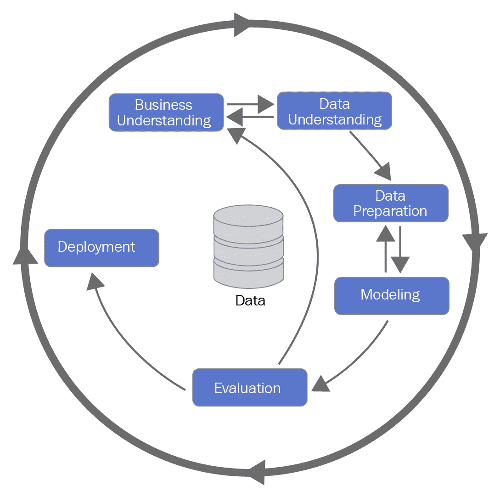

# 七、总结——成功的 ML 项目

到目前为止，在这本书里，我们已经关注了如何在围棋中准备和使用 ML 算法。这包括[第 2 章](532d8304-b31d-41ef-81c1-b13f4c692824.xhtml)、*设置开发环境*中的数据准备，以及[第 3 章](48817ff3-5622-4f43-88e7-d3dfccacb25d.xhtml)、*监督学习*和[第 4 章](26788e93-3614-413f-bcde-5580516f9c5f.xhtml)、*非监督学习*中的数据建模。在第 5 章、*中，我们还讨论了如何使用预训练模型*将现有的 ML 模型集成到 Go 应用中。最后，我们在第 6 章、*部署机器学习应用*中介绍了如何将 ML 集成到生产系统中。最后，我们将看看一个典型项目的不同阶段，以及如何管理开发和部署一个成功的 ML 系统的端到端过程。

人工智能专家 Andrej Karparthy 写了^(【1】)关于如何使用 ML 来简化以前非常复杂的系统。通常，允许机器从数据中学习比用代码表达我们需要的所有逻辑更简单。例如，谷歌的自动翻译应用使用神经网络系统从 500，000 行常规代码简化为 500 行 ML 代码。从传统的代码转换到 ML 系统需要不同的技能，以及不同的软件开发方法。

许多关于 ML 的技术文献都集中在如何优化或选择模型以获得最佳性能，如测试数据集所测量的。虽然这在推进最先进的 ML 方面很重要，但是大多数真实世界的项目会根据非常不同的标准成功或失败。例如，理解如何将业务需求最好地转化为 ML 任务，ML 系统的局限性是什么，以及如何最好地管理设计和维护 ML 应用的整个过程是至关重要的。

在本章中，我们将讨论以下主题:

*   何时使用 ML
*   ML 项目的典型阶段
*   何时将 ML 与传统代码相结合

# 何时使用 ML

在任何新项目的开始，你需要确定 ML 是否是正确的方法。这取决于三个关键因素:

*   首先，理解你的业务需求，以及它是否真的能被 ML 解决是至关重要的。想想你的项目的目标是什么。例如，您是否希望降低当前需要大量手动工作和成本的流程的成本？您是否正在尝试为您的最终客户创造更好的体验，例如，通过添加使用传统代码构建起来太耗时的个性化功能？
*   接下来，问问你自己，你是否有让你提议的 ML 系统工作所需的数据。如果没有，您将如何获取所需的数据，以及需要解决哪些潜在问题？例如，您可能需要将来自组织内不同区域的数据集汇集在一起，或者您可能会发现隐私问题会影响您合理使用数据的方式。
*   最后，考虑 ML 的限制以及这些限制如何影响你的最终产品。例如，如果你要使用来自一个男性多于女性的客户数据库的信息，那么你用它构建的任何一个 ML 系统都可能在其输出中显示出一个偏差，除非你采取措施来纠正它。通常，当出现与培训和开发中使用的数据非常不同的数据时，ML 系统会产生不可预测的输出。如果你设计一个交易金融证券的系统，想想如果输入数据突然改变会发生什么，例如，在市场崩溃之后？您将如何确保您的系统安全运行，并且不会发出无意义或灾难性的输出？

在许多情况下，一开始你不可能知道所有这些问题的答案。在这种情况下，一个好的方法是从确定和构建一个**概念验证** ( **PoC** )开始。请将此视为您可以构建的 ML 应用的最简单、最廉价的演示。有了好的 PoC，您应该能够做到以下几点:

*   回答关于 ML 是否是正确的方法，以及它是否满足您的业务需求的问题。
*   发现您在构建完整系统时必须解决的潜在问题。
*   为您组织内的利益相关者创建一个演示，让您获得关于您的系统是否适用以及需要考虑哪些改进和更改的反馈。

PoC 或**最小可行产品** ( **MVP** )是 ML 产品的简单而廉价的演示。在你花费时间和金钱建立一个完整的生产系统之前，用它来回答你关于你的产品将如何工作的问题。

# ML 项目的典型阶段

正如我们在本书中看到的，ML 高度依赖于用于训练和测试的数据。出于这个原因，我们发现通过下图中的阶段来查看一个典型的项目很有帮助，该图来自数据挖掘的**跨行业标准流程** ( **CRISP-DM** )，这是一种管理数据科学项目的流行方法^(【3】):

与其他一些工程系统相比，ML 通常不会产生完美的输出，因此，出于这个原因，项目通常是迭代的。对数据集和模型的优化使您能够产生越来越好的结果，前提是它们符合您的业务需求。

# 业务和数据理解

决定使用 ML 后，规划项目的关键步骤包括将你的**商业成功标准**转化为**技术需求**和模型目标。例如，就准确性和其他因素(如计算速度和成本)而言，您应该使用什么样的**性能指标**来构建您的模型？你的产品还需要集成哪些系统？你需要确保它的预测没有偏见吗？如果是的话，你将如何测试呢？

商业理解帮助你设计有价值的产品，而**数据理解**帮助你从你拥有的数据中决定什么是可能的。通过与数据科学家合作，您可以识别数据集的任何问题，并开始识别可能构成模型基础的有前途的见解。

# 数据准备

正如我们在本书中看到的，在构建 ML 应用时，访问正确准备的数据是必不可少的。在**数据工程**领域的挑战经常被忽视，导致进展缓慢，因为越来越多的时间花费在集成数据源和修复质量问题的临时工作上。

出于这个原因，值得考虑的是您将如何构建您的**数据管道**:您的数据来自哪里，它将需要什么样的预处理，以及您将在哪里存储它？你应该对你的数据进行什么样的检查，以确保在训练好的模型中快速发现质量问题？

现在有各种各样的工具来帮助自动化和简化数据管道，例如，Apache Airflow 项目^(【4】)，以及托管服务，如谷歌的 Cloud Composer^(【5】)和亚马逊的 AWS 数据管道^(【6】)。

**数据管道**是一个以通用格式收集、转换和存储数据的系统，允许它被用作您的 ML 应用的输入。

# 建模和评估

在这个阶段，您需要为您的数据开发、微调和评估模型。通常，关于如何做到这一点有三种选择:

*   使用现成的 ML 解决方案处理您自己的数据。例如，Google Vision^(【7】)为完全管理的图像分类系统提供了一个 API。通常，这些服务是在 PoC 阶段快速获得结果的好方法，但是在大型项目中应该谨慎使用。因为您自己没有训练过模型，所以通常很难确保它捕获了您自己的数据的重要特征。
*   采用一个现有的开源模型，并根据自己的目的对其进行再培训/定制。例如，如果你想建立一个系统来检测图像中的物体，利用大型组织已经投入到这个问题中的所有 R&D 努力是有意义的。你可以使用这些模型给你一个开端，然后在你自己的数据集上重新训练它们。
*   使用我们在第 3 章、*监督学习*和[第 4 章](26788e93-3614-413f-bcde-5580516f9c5f.xhtml)、*非监督学习*中学到的技术，从头开始开发和训练一个模型。虽然这可能是最耗时的方法，但如果您的问题是您的组织特有的，它通常会产生最佳结果。

不管你选择哪个选项，确保你的模型的开发和测试是**可重复的**是很重要的。确保它被记录在案，并且模型及其数据需求都在版本控制系统中被捕获。这样做将允许不同的团队成员在同一个模型上工作，并且有信心获得相同的结果。

一个**可再现的** **模型**是一个有足够的代码和文档的模型，允许它在开发过程中使用的相同数据集上被容易地重新训练。它还应该包括它所依赖的所有软件库和框架的版本号。

# 部署

ML 模型只有在可以部署到生产系统中时才有用。在《T4》第 6 章、*部署机器学习应用*中，我们探讨了如何在围棋中实现这一点的技术。遵循这些技术将允许您可靠地部署您的模型。当您开始迭代项目阶段以改进您的产品时，在它们进入生产时跟踪不同的模型版本也是很重要的。一种选择是将您保存的所有模型签入到一个版本控制系统中，比如 Git，尽管如果您的模型包含大文件，这可能会有问题。另一个选择是使用**数据版本控制** ( **DVC** )，它能够跟踪它们所依赖的代码、模型和数据集。

# 何时将 ML 与传统代码相结合

虽然本书的大部分内容都集中在如何编写和使用 ML 代码上，但你也会注意到，我们需要大量传统的非 ML 代码来支持我们所做的事情。其中大部分隐藏在我们使用的软件库中，但是有些情况下你可能需要添加到这个库中。

例如，您需要在模型输出上实施某些约束，例如，处理边缘情况或实现一些安全关键约束。假设您正在为一辆无人驾驶汽车编写软件:您可能会使用 ML 来处理来自汽车摄像头的图像数据，但当涉及到启动汽车转向、发动机和制动控制时，您很可能需要使用传统代码来确保汽车得到安全控制。类似地，除非您的 ML 系统经过处理意外数据输入的训练，例如，来自故障传感器的数据输入，否则您将需要添加逻辑来处理这些情况。确保在部署之前用异常数据和边缘案例测试您的模型，以便您了解在什么情况下它的性能会下降。

在所有现实世界的系统中，您需要仔细考虑您训练 ML 模型做什么，它的局限性是什么，以及如何确保您的端到端系统按照预期运行。

# 摘要

在这本书里，你已经学习了许多在 Go 中开发 ML 应用所需要的重要技术，并把它们作为生产系统进行部署。拓展知识的最佳方式是亲身体验，所以开始将 ML 软件添加到您自己的 Go 应用中。您在这里学到的技能将允许您开始向您正在处理的项目添加尖端的 ML 功能。

人工智能是一个快速发展的领域，学术界和科技公司每周都会发布新的算法和数据集。我们建议您阅读涵盖这项研究的技术博客、论文和代码库，其中许多我们在本书中引用过。您可能会发现一个新的最先进的模型，它可以解决您一直在处理的问题，等待您在 Go 中实现它。

# 进一步阅读

1.  [https://medium.com/@karpathy/software-2-0-a64152b37c35](https://medium.com/@karpathy/software-2-0-a64152b37c35)。检索时间 2019 年 5 月 17 日。
2.  [https://jack-Clark . net/2017/10/09/import-ai-63-Google-shrings-language-translation-code-from-500000-to-500-lines-with-ai-only-25-of-surved-people-belief-automation better-jobs/](https://jack-clark.net/2017/10/09/import-ai-63-google-shrinks-language-translation-code-from-500000-to-500-lines-with-ai-only-25-of-surveyed-people-believe-automationbetter-jobs/)。检索时间 2019 年 5 月 17 日。
3.  [https://pdfs . semantic scholar . org/48 B9/293 CFD 4297 f 855867 ca 278 f 7069 ABC 6a 9 c 24 . pdf](https://pdfs.semanticscholar.org/48b9/293cfd4297f855867ca278f7069abc6a9c24.pdf)。检索时间 2019 年 5 月 18 日。
4.  [https://airflow.apache.org/](https://airflow.apache.org/)。检索时间 2019 年 5 月 18 日。
5.  [https://cloud.google.com/composer/](https://cloud.google.com/composer/)。检索时间 2019 年 5 月 18 日。
6.  [https://aws.amazon.com/datapipeline/](https://aws.amazon.com/datapipeline/)。检索时间 2019 年 5 月 18 日。
7.  [https://cloud.google.com/vision/](https://cloud.google.com/vision/)检索时间 2019 年 5 月 18 日。
8.  [https://github . com/tensor flow/models/tree/master/research/object _ detection](https://github.com/tensorflow/models/tree/master/research/object_detection)。检索时间 2019 年 5 月 18 日。
9.  [https://dvc.org/](https://dvc.org/)检索于 2019 年 5 月 22 日。
10.  [https://becoming human . ai/how-to-version-control-your-machine-learning-task-ii-d 37 da 60 ef 570](https://becominghuman.ai/how-to-version-control-your-machine-learning-task-ii-d37da60ef570)。检索于 2019 年 5 月 22 日。